# **Enabling Real-Time Inference in Online Continual Learning via Device-Cloud Collaboration** 

<mark>Haibo Liu Chen Gong Zhenzhe Zheng Shanghai Jiao Tong University</mark> Shanghai Jiao Tong University Shanghai Jiao Tong University Shanghai, China Shanghai, China Shanghai, China liuhaibo@sjtu.edu.cn gongchen@sjtu.edu.cn zhengzhenzhe@sjtu.edu.cn 

<mark>Shengzhong Liu</mark> Shanghai Jiao Tong University Shanghai, China shengzhong@sjtu.edu.cn 

## **Abstract** 

Online continual learning (CL) is becoming a mainstream paradigm to learn incrementally from task streams without forgetting previously learned knowledge. However, the current online CL primarily focuses on learning performance, such as avoiding catastrophic forgetting, neglecting the critical demands of system performance, such as real-time inference. As a result, the performance of realtime inference in online CL degrades significantly due to frequent data distribution variations and time-consuming model adaptation. In this work, we propose ELITE, an online CL framework with device-cloud collaboration, to realize on-device real-time inference on time-varying task streams with performance guarantee. To realize on-device real-time inference in online CL, ELITE features a new design of the model zoo comprising various pre-trained models with the assistance of the cloud, and proposes a task-oriented on-device model selection to quickly retrieve the best-fit models instead of performing time-consuming model retraining. To prevent performance degradation on new tasks not available in the cloud, we introduces a latency-aware on-device model fine-tuning strategy to adapt to new tasks with an accuracy-latency trade-off, and dynamically updates the model zoo to enhance ELITE. Extensive evaluations on five real-world datasets have been conducted, and the results demonstrate that ELITE consistently outperforms the state-of-art solutions, improving the accuracy by 16.3% on average and reducing the response latency by up to 1.98 times. 

## **CCS Concepts** 

### • **Human-centered computing** → **Ubiquitous and mobile computing** ; • **Computing methodologies** → **Machine learning** . 

## **Keywords** 

Online Continual Learning, Real-Time Inference, Device-Cloud Collaboration 

Permission to make digital or hard copies of all or part of this work for personal or classroom use is granted without fee provided that copies are not made or distributed for profit or commercial advantage and that copies bear this notice and the full citation on the first page. Copyrights for components of this work owned by others than the author(s) must be honored. Abstracting with credit is permitted. To copy otherwise, or republish, to post on servers or to redistribute to lists, requires prior specific permission and/or a fee. Request permissions from permissions@acm.org. _<mark>WWW ’25, Sydney, NSW, Australia</mark>_ 

© 2025 Copyright held by the owner/author(s). Publication rights licensed to ACM. ACM ISBN 979-8-4007-1274-6/25/04 https://doi.org/10.1145/3696410.3714796 

Fan Wu 

Shanghai Jiao Tong University Shanghai, China fwu@cs.sjtu.edu.cn 

#### **ACM Reference Format:** 

Haibo Liu, Chen Gong, Zhenzhe Zheng, Shengzhong Liu, and Fan Wu. 2025. Enabling Real-Time Inference in Online Continual Learning via DeviceCloud Collaboration. In _Proceedings of the ACM Web Conference 2025 (WWW ’25), April 28-May 2, 2025, Sydney, NSW, Australia._ ACM, New York, NY, USA, 10 pages. https://doi.org/10.1145/3696410.3714796 

## **1 Introduction** 

Nowadays, massive data are continuously collected from ubiquitous end devices, and required immediate process to support real-time data analysis applications, _e_ . _g_ ., real-time detection on massive IoT data [52], real-time recommendation in web applications [19, 64] and real-time person identification through surveillance cameras [11]. The time-varying task streams in these applications urges end devices to learn in a continual fashion [14, 16, 56]. Online CL gains increasing interests to learn incrementally from task streams, and much efforts have been proposed to realize stability-plasticity tradeoff, meeting that models should learn new tasks (plasticity) while retaining the learned one (stability) [8, 26]. Despite promising, the current online CL has primarily focused on optimizing the learning performance, overlooking the requirements of system performance, the inference latency and resource efficiency. The performance of real-time inference in online CL deteriorates significantly. 

Most of previous efforts in online CL have employed sophisticated and time-consuming model retraining process to guarantee learning performance, making on-device real-time inference infeasible. Specifically, when new tasks arrive, directly utilizing the current model on end devices for inference leads to performance degradation due to changes in data distribution [13, 29]. To avoid this, classical online CL usually conduct model retraining with new data samples [16, 56]. In this way, it takes a long time to complete model retraining on the new tasks, which would result in a delayed model response. Although most existing practices focus on reducing resource consumption through designing lightweight models or using fewer samples [5, 22, 55, 57, 63], these approaches still struggle to make an effective trade-off between model performance and resource consumption. Therefore, it is highly necessary for resource-constraint end devices to realize real-time inference on time-varying task streams. 

There exist two technical challenges to realize on-device realtime inference in online CL. First, end devices are unable to execute the classical model adaptation ( _i_ . _e_ ., sample replay [15, 30] and model expansion [60]), since there are not substantial computation 

2043 

WWW ’25, April 28-May 2, 2025, Sydney, NSW, Australia 

Haibo Liu, Chen Gong, Zhenzhe Zheng, Shengzhong Liu, and Fan Wu 

resources and data samples on end devices [39, 54]. Specifically, compared to the setting with abundant resources, the classical online CL algorithms ( _i_ . _e_ ., EWC++ [6], GDumb[40] and AGEM[7]) have a noticeable performance drop (about 10%, in Section 2) in the inference accuracy for new tasks on resource-constrained end devices. Second, the time-consuming model adaptation on resourceconstraint end devices makes it not possible to realize real-time inference. When new tasks arrive, classical online CL approaches typically perform model adaptation with new data samples, and then use the upgraded model for inference response. However, in real-world scenarios, new tasks often require immediate inference response without waiting for model adaptation. For example, highvelocity task streams, such as video analysis streams where traffic cameras capture 25 frames per second [24], necessitate real-time inference for vehicle tracking and re-identification to prevent traffic accidents. Compared to short intervals between task arrivals, the model adaptation on resource-constrained end devices is quite computation-intensive, inevitably resulting in prolonged response times. Thus, to realize real-time inference on high-velocity task streams, it is imperative to reduce the computation overhead without performance degradation in online CL on end devices. 

To realize real-time inference on resource-constrained end devices, we propose a new d **E** vice-cloud co **L** laboratIve onl **I** ne con **T** inual l **E** arning framework, namely ELITE, which enables end devices to calibrate the on-device model timely with the support of the cloud. ELITE explores the connection between continual (sequential) training and multi-task (simultaneous) training, where both of them aim to obtain a solution that performs well across various tasks, and regards multi-task learning (MTL) as the upper bound of CL. In particular, ELITE leverages MTL with abundant cloudside data resources to pre-train various models for different tasks, forming a model zoo in the cloud. To realize real-time inference on high-velocity and time-varying task streams, ELITE propose a task-oriented online model selection to extract feature with a low computation cost, and retrieve the best-fit models from the model zoo in a fast and robust way. Furthermore, we address the extended scenario where the cloud, lacking data samples for the encountered new task on end devices, is unable to provide efficient models for real-time inference. To enhance ELITE, we propose the latency-aware model fine-tuning on end devices and dynamic model zoo updating in the cloud to adapt to new tasks with an accuracy-latency trade-off. 

The main contributions of our work are summarized as follows: 

- In this work, we aim to realize real-time inference in online CL on resource-constrained end devices, and propose ELITE, a new device-cloud collaborative CL framework for timevarying task streams. 

- ELITE features a new design of the model zoo comprising various pre-trained models with the assistance of the cloud, and proposes a task-oriented on-device model selection to quickly retrieve the best-fit models from the cloud. 

- To prevent performance degradation on new tasks not available in the cloud, we introduce a latency-aware online model fine-tuning strategy to adapt to new tasks with an accuracylatency trade-off, and dynamically updates the model zoo to enhance the performance of ELITE for new tasks. 

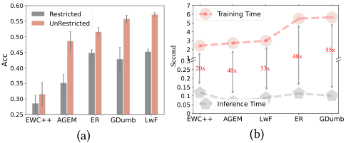

<!-- Start of picture text -->
0.60 Restricted 0.55 UnRestricted 0.50 0.45 48x 55x 0.40 20x 40x 33x 0.35 0.30 0.25 EWC++ AGEM ER GDumb LwF (a) (b) Acc Second <!-- End of picture text -->

**Figure 1: (a) the performance comparison of different resources in use on the Jetson Nano; (b) the time comparison of model training and inference on the Jetson Nano.** 

- Extensive evaluations on five image and video datasets have been conducted, and the results demonstrate that ELITE improves the accuracy by 16.3% on average, and reduces the response latency by up to 1.98×, compared to the state-ofthe-art approaches. 

## **2 Background and Related Works** 

In this section, we provide a comprehensive review on online CL, real-time inference and device-cloud collaboration. 

## **2.1 Online Continual Learning** 

Online CL has garnered increasing attention for its ability to learn incrementally from data streams, by enabling frequent model retraining to adapt to new arriving data samples, and not forgetting the previously learned knowledge [9, 17]. The current online CL approaches to overcome catastrophic forgetting can be identified into three main categories: parameter regularization [1, 28, 31], sample replay [25, 30, 44] and model expansion [20, 33, 60]. These approaches require substantial computation resources and data samples to perform model adaptation, rendering them unsuitable for resource-constrained end devices. As shown in Figure 1(a), we have evaluated five representative CL algorithms deployed on Jetson Nano [50], a end device from INVIDIA, and observe that these algorithms have high learning performance with unrestricted computation resources, while the model performance of on-device CL degrades significantly in resource-limited scenarios. Specifically, the corresponding model performance decreases about 10% with 50% computation resources in use. Moreover, as stated in computationally budgeted CL [39], all existing CL approaches, including distillation [32], sampling [3, 47], FC layers correction [18] and model expansions [41], fail to have good model performance in a computation-constraint setting. Therefore, it is critical to realize online CL with performance guarantee under the constraint of computation resources. 

## **2.2 Real-Time Inference** 

Massive task streams are required real-time inference to support time-sensitive intelligent applications [11, 13, 37]. However, most of online CL approaches with time-consuming model adaptation makes on-device real-time inference infeasible. As shown in Figure 1(b), the time consumption of model adaptation is up to 55 times of that of model inference, which would result in a long-time 

2044 

WWW ’25, April 28-May 2, 2025, Sydney, NSW, Australia 

Enabling Real-Time Inference in Online Continual Learning via Device-Cloud Collaboration 

**Table 1: The communication latency of model transmission by using six classical models with different size.** 

|**Model**|**Size**|**Training Time**|**Comm Latency**|
|---|---|---|---|
|CNN|0.304MB|1.401s|0.0026s|
|LeNet5|2.181MB|2.021s|0.0043s|
|SqueezeNet|2.869MB|3.850s|0.0114s|
|ShuffleNet V2|8.772MB|5.020s|0.0384s|
|MobileNet V2|13.501MB|5.331s|0.0819s|
|ResNet18|42.838MB|6.577s|0.1295s|

model adaptation before conducting the model inference for the current task. There exist several related works proposed to realize timely model inference on task streams. In order to realize inference queries at any time, Koh Hyunseo _et al_ . design a new memory management scheme and learning rate scheduling strategy to adapt to online blurry task streams [29]. To evaluate current CL methods, a new real-time evaluation in online CL has been proposed to take the delay of model training and change in data distribution into account [13]. Although these methods can perform model inference without any delay, the performance of real-time inference is subpar due to the reuse of an out-of-date model, especially for the CL methods with high model retraining cost [2, 40], and task streams with fast data distribution change and high throughout. Thus, it is crucial to achieve real-time inference in online CL while ensuring learning performance guarantees. 

## **2.3 Device-Cloud Collaboration** 

The new paradigm of device-cloud collaborative learning is emerging to leverage the advantages of both end devices and the cloud server [53, 58]. Most of previous efforts aims to offload the computation intensive tasks on end devices to the cloud [35, 36, 61]. However, these methods require uploading a significant amount of raw data with considerable communication latency. While AMS [49] and DCCL [59] have tried to unload partial computation to the cloud to alleviate the computation deficiency on end devices, they primarily focus on the optimization of model training and aggregation, which are not applicable to realize real-time inference. Comparing to previous efforts, we prefer to enable real-time inference on resource-constrained end devices by retrieving suitable models from the cloud with model transmission. However, it is noteworthy that device-cloud collaboration may incur communication latency due to model transmission. As shown in Table 1, we measure the communication latency of model transmission by using six classical models ( _i_ . _e_ ., LeNet5, SqueezeNet, CNN, ShuffleNet V2, MobileNet V2 and ResNet18) with different sizes . We find that it is feasible to realize cloud-enabled on-device CL, as the communication latency is extremely short comparing with the time cost of model adaptation. Despite promising, realizing cloud-enabled on-device CL for real-time inference also poses new challenges. Although we can resolve the problem of insufficient computation resources on end devices by requesting models from the cloud, the separation between arriving task streams on end devices and machine learning models in the cloud makes it difficult to retrieve suitable models for end devices. Moreover, the mismatch between outdated models in the cloud and the high-velocity task streams 

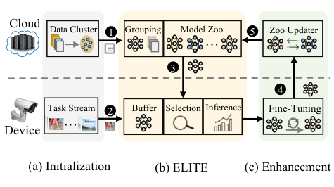

<!-- Start of picture text -->
Cloud Data Cluster 1 Grouping Model Zoo 5 Zoo Updater … 3 4 Task Stream 2 Buffer Selection Inference Fine-Tuning Device … (a) Initialization (b) ELITE (c) Enhancement <!-- End of picture text -->

**Figure 2: The overview of device-cloud collaboration.** 

with frequent data distribution variations on end devices undermines the model performance of real-time inference. Therefore, it is urgent to realize real-time inference in online CL with efficient device-cloud collaboration. 

## **3 Overview of Device-Cloud Collaboration** 

As shown in Figure 2, to realize real-time inference on resourceconstraint end devices with device-cloud collaboration may involve the following three stages: (a) Initialization: This stage serves as the preparation for model zoo generation and real-time inference. It involves the clustering of massive data for multi-task model training in the cloud, coupled with the establishment of task streams with frequent data distribution variations on end devices; (b) ELITE: This is our primary design to realize real-time inference with two main components: the cloud-enabled model zoo and on-device real-time inference. The cloud-enabled multitask model zoo is an offline component that pretrains and stores a collection of multi-task models in the cloud to handle inference requests from end devices. The on-device real-time model inference is an online component responsible for task-oriented model selection, aiming to identify the best-fit models from the model zoo in the cloud instead of time-consuming model retraining; (c) Enhancement: To prevent the performance degradation of ELITE when the cloud is unable to provide efficient models, we propose the latency-aware model fine-tuning on end devices, and dynamic model zoo updating in the cloud to adapt to new tasks with accuracy-latency trade-off. 

The process of device-cloud collaboration can be summarized as follows: First, we ❶ segment the entire dataset in the cloud server into various data clusters, associate each data cluster with a corresponding skilled model, and then form the model zoo. It is worth to note that each data cluster can capture the data distribution from multiple tasks, and thus the corresponding model can also handle the inference requests from multiple tasks. When task streams ❷ arrive, end devices need to determine whether to utilize local models in buffer or to request suitable models from the cloud. If the local models on end devices can effectively handle the current tasks, we use these local models to perform real-time inference without additional operations. Otherwise, we ❸ perform an online model selection to request several multi-task models from the model zoo, and the cloud server then transmits the corresponding multi-task models to end devices for real-time inference. After completing real-time inference on current tasks, if the models requested 

2045 

WWW ’25, April 28-May 2, 2025, Sydney, NSW, Australia 

Haibo Liu, Chen Gong, Zhenzhe Zheng, Shengzhong Liu, and Fan Wu 

from the cloud prove inefficient for new tasks, end devices ❹ must perform model fine-tuning to adapt to new data samples, and subsequently transmit the fine-tuned model back to the cloud server. With the newly fine-tuned models collected from end devices, the zoo updater ❺ replaces outdated multi-task models to improve the plasticity of model zoo. 

## **4 Design of ELITE** 

In this section, we provide the design of two components in ELITE: the cloud-enabled model zoo and on-device real-time inference. 

## **4.1 Cloud-Enabled Model Zoo** 

To generate a multi-task model zoo, we first use the k-means algorithm to cluster the entire data samples on the cloud server into _𝑛_ data clusters. The data samples in each cluster with high similarity are regarded as a training task. For the set of _𝑛_ training tasks T = { _𝜏_ 1 _,𝜏_ 2 _, ...,𝜏𝑛_ }, the objective of multi-task training is to identify the model _𝜃_ that minimizes the average loss across _𝑛_ tasks: 

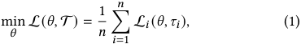

where L _𝑖_ represents the loss associated with task _𝜏𝑖_ , and L denotes the average loss across _𝑛_ tasks. Considering the task competition and model capability in multi-task learning, it is inefficient to train a single multi-task model with all _𝑛_ tasks [51, 62]. Therefore, we prefer to construct a zoo of _𝑚_ ( _𝑚 < 𝑛_ ) multi-task models Θ = { _𝜃_ 1 _,𝜃_ 2 _, ...,𝜃𝑚_ }, such that each model _𝜃𝑖_ ∈ Θ can handle a subset of _𝑛_ tasks, thereby ensuring inference performance. In this manner, we first compute the affinity score _𝑍𝑖𝑗_ to characterize the task relationship between task _𝜏𝑖_ and _𝜏 𝑗_ as follows: 

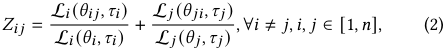

whereL_𝑖_<u>(</u>_𝜃𝑖__<u>𝑗</u>,𝜏𝑖_<u>)</u> L _𝑖_ ( _𝜃𝑖,𝜏𝑖_ )represents the affinity of task_𝜏𝑗_with respect to task _𝜏𝑖_ , and similar withL_<u>𝑗</u>_<u>(</u>_𝜃__<u>𝑗𝑖,𝜏𝑗</u>_<u>)</u> L _𝑗_ ( _𝜃 𝑗 ,𝜏 𝑗_ ). When the affinity score_𝑍𝑖𝑗_is lower, it is more efficient to group these two tasks together for multi-task models training. 

Without the information of task streams on end devices, the multi-task models pretrained in advance may be unsuitable for on-device model inference. To enhance the plasticity of multi-task models in model zoo, it is crucial to maximize the diversity of tasks that the pretrained multi-task model involve with. Information entropy has been employed to incorporate diversity and is also widely used as a diversity index [21, 43]. Thus, the problem of task grouping for model zoo generation can be formulated as follows: 

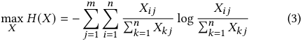

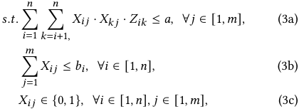

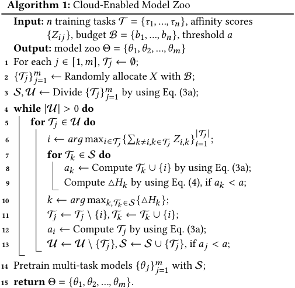

where _𝑋𝑖𝑗_ is the decision variable indicating whether the task _𝜏𝑖_ is assigned to the model _𝜃 𝑗_ , and _𝐻_ ( _𝑋_ ) denotes the information entropy of grouped task sets. The first constraint (3a) ensures that the multiple tasks utilized for model training are mutually beneficial by requiring the sum of their affinity score less than a given threshold _𝑎_ . The second constraint (3b) ensures that each task _𝜏𝑖_ ∈T can be allocated at most _𝑏𝑖_ ∈B times where B = { _𝑏_ 1 _,𝑏_ 2 _, ...,𝑏𝑛_ }. The last constraint (3c) indicates that _𝑋𝑖𝑗_ is a binary decision variable. We can find that this optimization problem of task grouping can be reduced to a multi-dimensional binary knapsack problem [4, 10], which is known to be NP-hard. Specifically, the objective of this optimization problem is to maximize the diversity of tasks by selecting the binary option under two capacity constraints. 

Traditional algorithms for solving the multi-dimensional knapsack problem, such as dynamic programming or branch-and-bound methods, are often computationally expensive and struggle to scale efficiently with increasing problem dimensions and complexity. Instead of exhaustively searching the solution space, ELITE introduces a heuristic greedy allocation strategy with sequential twostep allocation: an initial random allocation to satisfy the second constraint in Eq. (3b), following a greedy reallocation to adjust the initial solution to meet the first constraint in Eq. (3a). As shown in Algorithm 1, ELITE first generates an initial solution to satisfy the second constraint in Eq. (3b) in a random manner, by regarding the training task _𝜏𝑖_ allocated at most _𝑏𝑖_ times as the same _𝑏𝑖_ training tasks (line 1 and 2). According to the first constraint in Eq. (3a), ELITE divides the the initial random allocations into two sets: the satisfied task allocation set S and the unsatisfied set U (line 3). To adjust the initial solution (line 4 to 13), ELITE employs a greedy reallocation strategy to satisfy the first constraint in Eq. (3a) while maximizing the entropy increment computed as follows: 

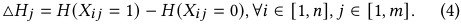

2046 

WWW ’25, April 28-May 2, 2025, Sydney, NSW, Australia 

Enabling Real-Time Inference in Online Continual Learning via Device-Cloud Collaboration 

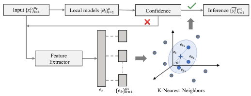

<!-- Start of picture text -->
Input {𝑥!"}%!#$! Local models {𝜃!}&!#$ Confidence Inference {𝑦!"}%!#$! Feature Extractor 𝑒' {𝑒(}*()! K-Nearest Neighbors <!-- End of picture text -->

**Figure 3: The illustration of on-device model selection.** 

ELITE pre-trains multi-task models { _𝜃 𝑗_ }_𝑚_ _𝑗_ =1in model zoo based on the satisfied task allocation S (line 14). 

## **4.2 On-Device Real-Time Inference** 

Given the non-stationary task streams B _𝑡_ ∼D _𝑡_ on end devices, where D _𝑡_ is the data distribution at time step _𝑡_ , the objective of real-time inference is to obtain a model _𝜃__𝑡_ that predicts a label _𝑦__𝑡_ ∈Y for an input feature _𝑥__𝑡_ ∈X without any delay. At each time step _𝑡_ , we execute the following two steps to realize real-time model inference: (1) First, the current task reveals the input of current data samples { _𝑥𝑖__𝑡_}_𝑛_ _𝑖_ =_𝑡_ 1⊆B_𝑡_, and end devices utilize these data samples to perform model selection from either local models in buffer or the model zoo in the cloud; (2) Then, we employ the selected models to generate predictions { _𝑦𝑖__𝑡_}_𝑛_ _𝑖_ =_𝑡_ 1for the given {_𝑥_ _𝑖__𝑡_}_𝑛_ _𝑖_ =_𝑡_ 1. Upon completing real-time inference, the system reveals the true labels { _𝑦𝑖__𝑡_}_𝑛_ _𝑖_ =_𝑡_ 1(_i_._e_., generated by large models or human annotators [42]), and evaluate the performance of real-time inference by comparing { _𝑦𝑖__𝑡_}_𝑛_ _𝑖_ =_𝑡_ 1to {_𝑦_ _𝑖__𝑡_}_𝑛_ _𝑖_ =_𝑡_ 1. This process highlights the importance of efficient model selection in achieving real-time inference with guaranteed performance. 

As illustrated in Figure 3, there exist two probabilities for retrieving the best-fit models from the local buffer on end devices or the model zoo in the cloud. To ascertain whether the local models on end devices are adequate for the current tasks, we calculate prediction uncertainty to evaluate the confidence of the local models in predicting the input data [12, 38]. The prediction uncertainty, denoted as _𝑈_ , is computed as follows: 

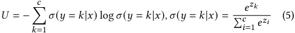

where _𝜎_ ( _𝑦_ = _𝑘_ | _𝑥_ ) represents the probability of predicting class _𝑘_ with the given input _𝑥_ , and _𝑧𝑘_ denotes its logits of the final layer in the model. If the value of _𝑈_ is small, end devices prefer to utilize the local models for task inference. Otherwise, models are requested from the model zoo in the cloud. 

Unlike directly applying neural networks to determine model selection from the cloud without performance guarantee [46], ELITE enables task-oriented on-device model selection by transmitting a pretrained model as feature extractor ( _e_ . _g_ ., adopting ResNet18 pretrained on ImageNet as feature extractor), and feature embeddings as task representations from the cloud to end devices in advance. We extract features of data samples by using the pretrained model as domain similarity, and aggregate the features of all data samples 

pretrained in multi-task models to form their task embeddings: 

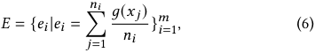

where _𝐸_ is the set of task embedings of multi-tasks models in model zoo, and _𝑔_ ( _𝑥 𝑗_ ) represents the feature embedding of the input _𝑥 𝑗_ extracted with the feature layers _𝑔_ of the pretrained model. With the set of task embeddings _𝐸_ = { _𝑒𝑖_ }_𝑚_ _𝑖_ =1provided from the cloud, we extract the current task embedding _𝑒𝑡_ in the same way, and select the most _𝑘_ suitable multi-task models with the KNN method into the candidate set _𝑅𝑡_ : 

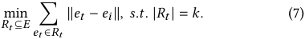

After obtaining the _𝑘_ most suitable models { _𝜃𝑖__𝑡_}_𝑘_ _𝑖_ =1from the cloud server, ELITE selects the model with highest confidence to realize model inference, and evaluates the inference performance on the current task B _𝑡_ by revealing the true labels { _𝑦𝑖__𝑡_}_𝑛_ _𝑖_ =_𝑡_ 1: 

where _𝐴𝑐𝑐_ ( _𝜃𝑖__𝑡,_{_𝑦_ _𝑖__𝑡_}_𝑛_ _𝑖_ =_𝑡_ 1)is the prediction accuracy of the selected model _𝜃𝑖__𝑡_on the current task, and_𝑈𝑖_denotes its prediction uncer- tainty. If the inference performance _𝐴𝑐𝑐𝑡_ is low, it indicates that the current task is new to both end devices and the cloud server. In this scenario, ELITE needs to perform model fine-tuning to adapt to the new task, which will discuss in next. 

## **5 Enhancement of ELITE** 

In this section, we focus on the extension scenario where the cloud cannot provide efficient inference models to enable on-device realtime inference, and introduce latency-aware model fine-tuning and dynamic zoo updating to enhance ELITE. 

## **5.1 Latency-aware Model Fine-Tuning** 

If the accuracy of real-time inference with on-device model selection is low, model fine-tuning is necessary to enhance the performance of inference models without long-time delay. To adapt to new tasks and reduce the time consumption of model fine-tuning, we consider a sparse fine-tuning approach that avoids massive computation, and assume that each inference model has _𝐿_ layers. To determine which layers of the inference model _𝜃__𝑡_ should be fine-tuned, we further generate a sparse mask _𝑧𝑡_ ∈{0 _,_ 1}_𝐿_ , where _𝑧𝑡__𝑖_=1 indicates that the _𝑖_ -th layer of the inference model _𝜃__𝑡_ will be updated; otherwise, it will remain frozen without any operation. Moreover, the value of sparse mask _𝑧𝑡_ is closely related to the latency constraints △ _𝑡_ : 

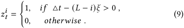

where _𝜉_ represents the time cost of fine-tuning one layer in the inference model. 

To improve the performance of inference models on the current task, we need to allocate the given latency △ _𝑡_ among the _𝑘_ candidate models { _𝜃𝑖_ }_𝑘_ _𝑖_ =1. Therefore, we formulate the following time 

2047 

WWW ’25, April 28-May 2, 2025, Sydney, NSW, Australia 

Haibo Liu, Chen Gong, Zhenzhe Zheng, Shengzhong Liu, and Fan Wu 

**Table 2: The details of Datasets. We consider two kind of task streams: image streams and video streams.** 

|**Dataset**|**Classes**|**Samples**|**Size**|**Task Stream**|
|---|---|---|---|---|
|CIFAR10|10|50k|170MB|Image Classification|
|CIAFR100|100|50k|197MB|Image Classification|
|Tiny-ImageNet|200|100k|1.1GB|Image Classification|
|HDMB51|51|6.84k|2.12GB|Video Analytic|
|UCF101|101|13.32k|6.93GB|Video Analytic|

allocation optimization problem: 

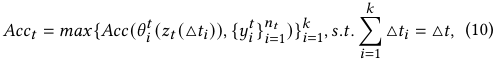

where _𝜃𝑖__𝑡_(_𝑧𝑡_(△_𝑡𝑖_))denotesthemodel_𝜃_ _𝑖__𝑡_fine-tunedwiththeal- located time △ _𝑡𝑖_ . However, this time allocation problem can be framed as the multi-armed bandits (MAB) due to the uncertainty of _𝐴𝑐𝑐_ ( _𝜃𝑖__𝑡_(_𝑧𝑡_(△_𝑡𝑖_))_,_{_𝑦_ _𝑖__𝑡_}_𝑛_ _𝑖_ =_𝑡_ 1). To address this intractable problem, we propose a two stage time allocation method with exploration and exploitation. Specifically, we divide the given latency into two equal time slots. In the first slot, we allocate<u>△</u> <u>2</u>_<u>𝑡</u>_evenly among_𝑘_candidate models, and perform model fine-tuning with the same amount of time<u>△</u> 2 _𝑘__<u>𝑡</u>_to evaluate its model performance. In the second slot, we select the candidate model with highest prediction accuracy in the first slot, and use the remaining time<u>△</u> <u>2</u>_<u>𝑡</u>_to continually fine tune this selected model. In this way, we obtain an efficient fine-tuned model to adapt to new data samples. 

## **5.2 Dynamic Zoo Updating** 

When the current task is new and not available in the cloud, there is a urgent to dynamically update the multi-task model zoo to improve its plasticity. Traditional approaches tend to upload new data samples to the cloud for model retraining, resulting in significant communication overhead and data privacy concerns. To avoid uploading new data samples, we propose an incremental zoo updater designed to refresh multi-task models in a timely and efficient manner. At each time step, the incremental zoo updater dynamically enhances model zoo with fine-tuned models collected from end devices. To determine which model to replace, the zoo updater monitors the request counts for each multi-task model in the model zoo, identifying the least requested model for replacement. In this way, the model zoo updater can effectively learn the changing patterns of task streams on end devices, retains useful models in the model zoo, thereby enhancing the efficiency of on-device model selection and avoiding unnecessary model fine-tuning on end devices. 

## **6 Experiment** 

In this section, we first describe the experimental setup, and then report the experimental results with the performance analysis. 

## **6.1 Experiment Setup** 

**Datasets and Tasks** . We consider two kind of task streams including image classification and video analytic with five datasets as shown in Table 2. As for task streams, we consider class-incremental continual learning [27, 48] by dividing the whole classes of each dataset into different task groups. Moreover, we consider two types 

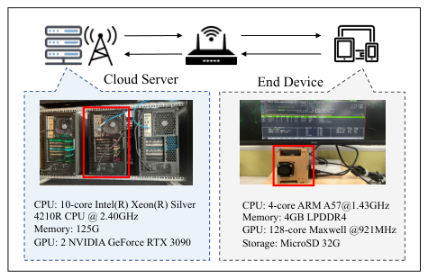

<!-- Start of picture text -->
Cloud Server End Device CPU: 10-core Intel(R) Xeon(R) Silver  CPU: 4-core ARM A57@1.43GHz 4210R CPU @ 2.40GHz Memory: 4GB LPDDR4 Memory: 125G GPU: 128-core Maxwell @921MHz GPU: 2 NVIDIA GeForce RTX 3090 Storage: MicroSD 32G <!-- End of picture text -->

**Figure 4: The prototype system of ELITE.** 

of task streams: fuzzy-boundary and sharp-boundary task stream. In fuzzy-boundary task stream, the classes of each task are randomly selected, and adjacent tasks may have the same classes. As for sharp-boundary task stream, adjacent tasks are different, indicating no overlapping classes. 

**Baselines** . The current practices about online CL can be categorized into two main categories: cloud-enabled online CL approaches and on-device one. The cloud-enabled online CL performs model adaptation on the cloud server and model inference on end devices, _i_ . _e_ ., AMS [49] and RECL [23]. As for on-device CL, both model training and inference are conducted entirely on end devices, _i_ . _e_ ., EWC++ [6], LwF[34], GDumb[40], A-GEM[7], ER[45] and MIR[2]. **Evaluation Metrics** . Given the length of task streams _𝑇_ , we evaluate the performance of real-time inference in Online CL by using the following three metrics: 

- Average Accuracy: We use △ _𝑓_ ( _𝑥𝑡 ,𝑦𝑡_ ; _𝜃_ ) to denote the prediction accuracy of the current task, and the average accuracy at the end of task streams can be measured as: 

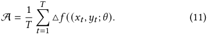

- Response Latency: We compute the inference time _𝑐𝑡_ and the waiting time _𝜏𝑡_ at time step _𝑡_ , and add these two time cost as its response latency L _𝑡_ : 

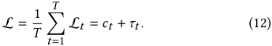

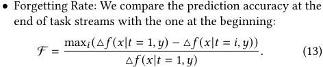

**Implementation Details** . To conduct extensive experiments, we select five lightweight models: LeNet5, SqueezeNet, ShuffleNet V2, MobileNet V2 and ResNet18. The learning rate and batch size of model retraining are 0.01 and 64, respectively. Moreover, we set the latency for model fine-tuning to one second, _i_ . _e_ ., △ _𝑡_ = 1 _𝑠_ . As shown in Figure 4, we realize the prototype system of ELITE by utilizing a Jetson Nano with 4GB memory and the cloud server with 2 NVIDIA 

2048 

WWW ’25, April 28-May 2, 2025, Sydney, NSW, Australia 

Enabling Real-Time Inference in Online Continual Learning via Device-Cloud Collaboration 

**Table 3: The performance comparison of different CL methods on five different datasets.** 

|||**EWC++**|**MIR**|**LwF**|**ER**|**AGEM**|**GDumb**|**AMS**|**RECL**|**ELITE**|
|---|---|---|---|---|---|---|---|---|---|---|
||A|0.176±0.063|0.268±0.093|0.275±0.028|0.371±0.030|0.130±0.016|0.277±0.004|0.125±0.021|0.172±0.002|0.413±0.039|
|**CIFAR10**|L(_𝑠_)|2.011±0.488|3.031±0.518|1.496±0.292|2.589±0.220|2.576±0.138|3.268±0.291|1.971±0.034|1.441±0.097|1.127±0.201|
||F|0.844±0.063|0.736±0.093|0.581±0.030|0.851±0.016|0.742±0.028|0.778±0.004|0.881±0.021|0.791±0.001|0.581±0.039|
||A|0.176±0.023|0.174±0.029|0.153±0.008|0.197±0.029|0.178±0.023|0.051±0.006|0.059±0.011|0.164±0.011|0.397±0.014|
|**CIFAR100**|L(_𝑠_)|3.334±0.566|6.884±0.108|4.078±0.097|5.367±0.492|7.033±0.138|7.207±0.034|4.241±0.343|1.884±0.199|1.341±0.117|
||F|0.796±0.028|0.821±0.027|0.848±0.016|0.795±0.032|0.954±0.039|0.792±0.026|0.921±0.015|0.834±0.013|0.587±0.056|
||A|0.182±0.053|0.176±0.034|0.207±0.027|0.175±0.049|0.188±0.060|0.101±0.047|0.117±0.051|0.196±0.038|0.275±0.028|
|**Tiny-ImageNet**|L(_𝑠_)|1.718±0.225|3.538±0.632|1.589±0.213|3.764±0.838|2.861±0.562|6.074±0.487|3.064±0.567|1.945±0.474|1.034±0.059|
||F|0.890±0.042|0.881±0.027|0.811±0.012|0.861±0.034|0.846±0.044|0.895±0.012|0.958±0.032|0.827±0.029|0.728±0.018|
||A|0.157±0.152|0.220±0.136|0.346±0.129|0.362±0.129|0.148±0.146|0.192±0.153|0.136±0.143|0.543±0.130|0.654±0.043|
|**HDMB51**|L(_𝑠_)|3.006±0.777|4.117±0.761|2.482±0.476|3.278±0.723|3.694±0.419|2.884±0.327|6.269±2.253|1.123±0.263|1.032±0.067|
||F|0.952±0.016|0.771±0.071|0.675±0.019|0.556±0.016|0.952±0.017|0.965±0.044|0.954±0.008|0.563±0.047|0.328±0.013|
||A|0.129±0.153|0.392±0.138|0.252±0.135|0.483±0.126|0.131±0.149|0.188±0.158|0.136±0.143|0.412±0.106|0.652±0.075|
|**UCF101**|L(_𝑠_)  F|2.846±0.431  0.923±0.034|4.509±1.022  0.483±0.081|2.519±0.232  0.831±0.020|3.412±0.728  0.424±0.050|3.593±0.955  0.921±0.034|2.994±0.593  0.989±0.050|6.269±2.253  0.954±0.008|1.139±0.258 0.565±0.038|1.033±0.078 0.376±0.066|

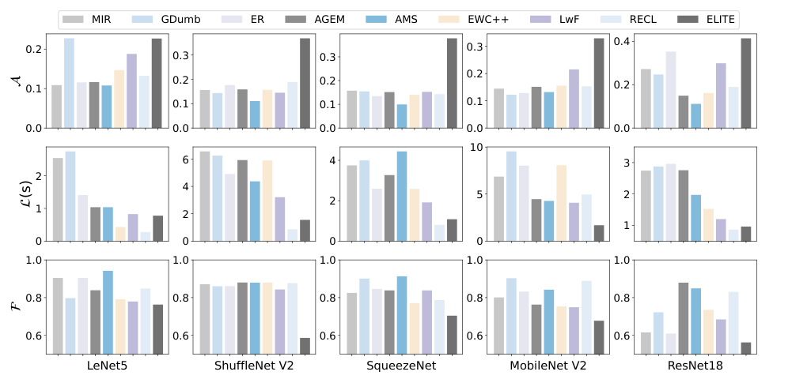

<!-- Start of picture text -->
MIR GDumb ER AGEM AMS EWC++ LwF RECL ELITE 0.4 0.2 0.3 0.3 0.3 0.2 0.1 0.2 0.2 0.2 0.1 0.1 0.1 0.0 0.0 0.0 0.0 0.0 10 6 4 3 2 4 5 2 2 1 2 1 0 0 0 0 1.0 1.0 1.0 1.0 1.0 0.8 0.8 0.8 0.8 0.8 0.6 0.6 0.6 0.6 0.6 LeNet5 ShuffleNet V2 SqueezeNet MobileNet V2 ResNet18 (s) <!-- End of picture text -->

**Figure 5: The performance comparison of different CL methods with five different models.** 

RTX 3090. The communication interaction between Jetson Nano and the cloud server is facilitated through wifi routers. 

## **6.2 Overall Performance** 

Table 3 analyzes average accuracy, response latency, and forgetting for CL methods across five different datasets. ELITE consistently shows the highest inference performance in image classification tasks, though accuracy and forgetting rate decline with increasing data complexity, especially for Tiny-ImageNet. Response latency is affected by both dataset complexity and model adaptation strategy. In video analytics tasks, ELITE maintains around 60% accuracy, benefiting from fewer classes and frame similarity. ELITE outperforms other methods in accuracy, latency, and forgetting across all datasets, demonstrating its reliability. 

To validate the stability of the experimental results, we conducted ablation studies on five different models. Figure 5 shows the 

analysis of average accuracy, response latency, and forgetting rate. While LeNet5 demonstrates the highest accuracy for ELITE among CL methods, its overall performance is low due to its limited capacity. ShuffleNet V2, SqueezeNet, and MobileNet V2 show similar inference performance, with approximately 7% improvement over LeNet5. ResNet18 exhibits the highest inference performance due to its larger size. ELITE consistently outperforms other CL methods in average performance and response latency. Notably, average accuracy improves with increasing model complexity, while latency remains stable, as ELITE does not require model retraining. In contrast, other CL methods show significant fluctuations in accuracy and latency, further validating the reliability and stability of ELITE. 

## **6.3 Robustness of ELITE** 

Figure 6(a) illustrates the impact of stream type on average accuracy by analyzing both fuzzy-boundary and sharp-boundary task 

2049 

WWW ’25, April 28-May 2, 2025, Sydney, NSW, Australia 

Haibo Liu, Chen Gong, Zhenzhe Zheng, Shengzhong Liu, and Fan Wu 

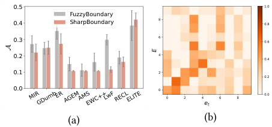

<!-- Start of picture text -->
0.5 1.0 FuzzyBoundary 8 0.4 SharpBoundary 0.8 0.3 6 0.6 0.2 4 0.4 0.1 2 0.2 0.0 0 0 2 4 6 8 0.0 et (a) (b) MIRGDumbERAGEMAMSEWC++LwFRECLELITE E <!-- End of picture text -->

**Figure 6: The performance comparison on: (a) different task streams; (b) the similarity of feature embeddings.** 

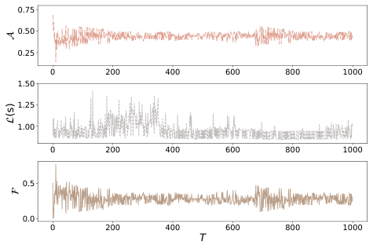

<!-- Start of picture text -->
0.75 0.50 0.25 0 200 400 600 800 1000 1.50 1.25 1.00 0 200 400 600 800 1000 0.5 0.0 0 200 400 600 800 1000 T (s) <!-- End of picture text -->

**Figure 7: The performance of ELITE with 1000 tasks.** 

streams. In fuzzy-boundary task streams, ELITE demonstrates an approximately 11% improvement in accuracy compared to other CL methods. In sharp-boundary task streams, ELITE achieves the highest average accuracy among all CL methods, with a significant 16% improvement, indicating its robust performance stability across different task scenarios. The performance of feature embedding similarity calculations, as depicted in Figure 6(b), demonstrate that the task-oriented model selection is robust with feature embedding similarity. Figure 7 presents the average accuracy, latency and forgetting rate of ELITE as the length of task streams extends to 1,000 tasks. ELITE maintains stable performance as the number of tasks increases. Initially, average accuracy and forgetting rate show significant fluctuations, but it stabilizes as the number of tasks grows. This behavior can be attributed to the need for continual updates in the model zoo during the early stages to accommodate new tasks. 

In Figure 8(a), we denote the number of multi-task models in the zoo as _𝑀_ . The results show that increasing the number of multitask models in the zoo improves average inference accuracy, with a marked improvement at _𝑀_ = 20. However, when _𝑀_ = 30, accuracy plateaus and performance becomes unstable, indicating that the optimal number of models should be carefully balanced. Next, we analyze the impact of the task number of multi-task models involve with, represented as _𝑁_ , on inference performance. The Figure 8(b) shows that as _𝑁_ increases, so does the average accuracy. However, once _𝑁_ reaches a higher value, the rate of accuracy improvement diminishes significantly. This observation underscores the need to 

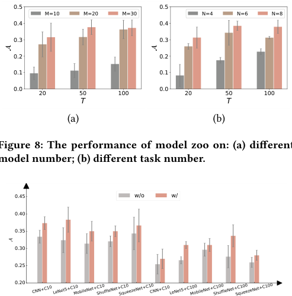

<!-- Start of picture text -->
0.5 0.5 M=10 M=20 M=30 N=4 N=6 N=8 0.4 0.4 0.3 0.3 0.2 0.2 0.1 0.1 0.0 0.0 20 50 100 20 50 100 T T (a) (b) Figure 8: The performance of model zoo on: (a) different model number; (b) different task number. 0.45 w/o w/ 0.40 0.35 0.30 0.25 0.20 CNN+C10 LeNet5+C10MobileNet+C10ShuffleNet+C10SqueezeNet+C10CNN+C10LeNet5+C100MobileNet+C100ShuffleNet+C100SqueezeNet+C100 <!-- End of picture text -->

**Figure 8: The performance of model zoo on: (a) different model number; (b) different task number.** 

**Figure 9: The performance comparison of ELITE with (w/) and without (w/o) the enhancement validated on two datasets,** **_e_ .** **_g_ ., CIFAR10 (C10) and CIFAR100 (C100).** 

carefully design the task number to optimize model performance. As shown in Figure 9, we validate the performance of ELITE with (w/) and without (w/o) the enhancement by using five lightweight models. It is obvious that the inference performance of ELITE with the enhancement is superior to that without additional operations, due to the model fine-tuning to adapt to new tasks. 

## **7 Conclusion** 

In this paper, we focused on the real-time inference on resourceconstraint end devices in online CL, and proposed a new devicecloud collaborative CL framework, namely ELITE, for time-varying task streams. To realize real-time model inference, ELITE formed model zoo in the cloud server, and proposed task-oriented on-device model selection on end devices. To prevent performance degradation on new tasks not available in the cloud, we introduced latencyaware online model fine-tuning strategy to adapt to new tasks, and dynamically updated model zoo to enhance ELITE. Extensive evaluations demonstrate that ELITE improves 16.3% inference performance and reduces up to 1.98x response latency compared to the-state-of-art solutions. 

## **Acknowledgments** 

<mark>This work was supported in part by National Key R&D Program of China (No. 2023YFB4502400</mark> ), in part by China NSF grant No. 62322206, 62132018, 62025204, U2268204, 62272307, 62372296. The opinions, findings, conclusions, and recommendations expressed in this paper are those of the authors and do not necessarily reflect the views of the funding agencies or the government. Zhenzhe Zheng is the corresponding author. 

2050 

WWW ’25, April 28-May 2, 2025, Sydney, NSW, Australia 

Enabling Real-Time Inference in Online Continual Learning via Device-Cloud Collaboration 

## **References** 

- [1] Hongjoon Ahn, Sungmin Cha, Donggyu Lee, and Taesup Moon. 2019. Uncertainty-based Continual Learning with Adaptive Regularization. In _Proc. of NeurIPS_ . 4394–4404. 

- [2] Rahaf Aljundi, Lucas Caccia, Eugene Belilovsky, Massimo Caccia, Min Lin, Laurent Charlin, and Tinne Tuytelaars. 2019. Online Continual Learning with Maximally Interfered Retrieval. _CoRR_ abs/1908.04742 (2019). 

- [3] Rahaf Aljundi, Min Lin, Baptiste Goujaud, and Yoshua Bengio. 2019. Gradient based sample selection for online continual learning. In _Proc. of NeurIPS_ . 11816– 11825. 

- [4] Enrico Angelelli, Renata Mansini, and Maria Grazia Speranza. 2010. Kernel search: A general heuristic for the multi-dimensional knapsack problem. _Computers & Operations Research_ 37, 11 (2010), 2017–2026. 

- [5] Ali Ayub and Alan R. Wagner. 2021. F-SIOL-310: A Robotic Dataset and Benchmark for Few-Shot Incremental Object Learning. In _Proc. of ICRA_ . 13496–13502. 

- [6] Arslan Chaudhry, Puneet Kumar Dokania, Thalaiyasingam Ajanthan, and Philip H. S. Torr. 2018. Riemannian Walk for Incremental Learning: Understanding Forgetting and Intransigence. In _Proc. of ECCV_ . 556–572. 

- [7] Arslan Chaudhry, Marc’Aurelio Ranzato, Marcus Rohrbach, and Mohamed Elhoseiny. 2019. Efficient Lifelong Learning with A-GEM. In _Proc. of ICLR_ . 1–20. 

- [8] Jagmohan Chauhan, Young D. Kwon, Pan Hui, and Cecilia Mascolo. 2020. ContAuth: Continual Learning Framework for Behavioral-based User Authentication. _Proc. ACM Interact. Mob. Wearable Ubiquitous Technol._ 4, 4 (2020), 122:1–122:23. 

- [9] Aristotelis Chrysakis and Marie-Francine Moens. 2020. Online Continual Learning from Imbalanced Data. In _Proc. of ICML_ . 1952–1961. 

- [10] Yanhong Feng and Gai-Ge Wang. 2022. A binary moth search algorithm based on self-learning for multidimensional knapsack problems. _Future Generation Computer Systems_ 126 (2022), 48–64. 

- [11] Bipin Gaikwad and Abhijit Karmakar. 2021. Smart surveillance system for realtime multi-person multi-camera tracking at the edge. _Journal of Real-Time Image Processing._ 18, 6 (2021), 1993–2007. 

- [12] Jakob Gawlikowski, Cedrique Rovile Njieutcheu Tassi, Mohsin Ali, Jongseok Lee, Matthias Humt, Jianxiang Feng, Anna M. Kruspe, Rudolph Triebel, Peter Jung, Ribana Roscher, Muhammad Shahzad, Wen Yang, Richard Bamler, and Xiaoxiang Zhu. 2023. A survey of uncertainty in deep neural networks. _Artificial Intelligence Review_ 56, S1 (2023), 1513–1589. 

- [13] Yasir Ghunaim, Adel Bibi, Kumail Alhamoud, Motasem Alfarra, Hasan Abed Al Kader Hammoud, Ameya Prabhu, Philip H. S. Torr, and Bernard Ghanem. 2023. Real-Time Evaluation in Online Continual Learning: A New Hope. In _Proc. of CVPR_ . 11888–11897. 

- [14] Chen Gong, Zhenzhe Zheng, Fan Wu, Xiaofeng Jia, and Guihai Chen. 2024. Delta: A Cloud-assisted Data Enrichment Framework for On-Device Continual Learning. In _Proc. of MobiCom_ . 1408–1423. 

- [15] Chen Gong, Zhenzhe Zheng, Fan Wu, Yunfeng Shao, Bingshuai Li, and Guihai Chen. 2023. To Store or Not? Online Data Selection for Federated Learning with Limited Storage. In _Proc. of WWW_ . 3044–3055. 

- [16] Yiduo Guo, Bing Liu, and Dongyan Zhao. 2022. Online Continual Learning through Mutual Information Maximization. In _Proc. of ICML_ . 8109–8126. 

- [17] Tyler L. Hayes and Christopher Kanan. 2022. Online Continual Learning for Embedded Devices. _CoRR_ abs/2203.10681 (2022). 

- [18] Saihui Hou, Xinyu Pan, Chen Change Loy, Zilei Wang, and Dahua Lin. 2019. Learning a Unified Classifier Incrementally via Rebalancing. In _Proc. of CVPR_ . 831–839. 

- [19] Yanxiang Huang, Bin Cui, Wenyu Zhang, Jie Jiang, and Ying Xu. 2015. Tencentrec: Real-time stream recommendation in practice. In _in Proc. of SIGMOD_ . 227–238. 

- [20] Steven C. Y. Hung, Cheng-Hao Tu, Cheng-En Wu, Chien-Hung Chen, Yi-Ming Chan, and Chu-Song Chen. 2019. Compacting, Picking and Growing for Unforgetting Continual Learning. In _Proc. of NeurIPS_ . 13647–13657. 

- [21] Lou Jost. 2006. Entropy and diversity. _Oikos_ 113, 2 (2006), 363–375. 

- [22] Haeyong Kang, Jaehong Yoon, Sultan Rizky Hikmawan Madjid, Sung Ju Hwang, and Chang D. Yoo. 2023. On the Soft-Subnetwork for Few-Shot Class Incremental Learning. In _Proc. of ICLR_ . 1–23. 

- [23] Mehrdad Khani, Ganesh Ananthanarayanan, Kevin Hsieh, Junchen Jiang, Ravi Netravali, Yuanchao Shu, Mohammad Alizadeh, and Victor Bahl. 2023. RECL: Responsive Resource-Efficient Continuous Learning for Video Analytics. In _Proc. of NSDI_ . 917–932. 

- [24] Kirill Khazukov, Vladimir D. Shepelev, Tatiana Karpeta, Salavat Shabiev, Ivan Slobodin, Irakli Charbadze, and Irina Alferova. 2020. Real-time monitoring of traffic parameters. _Journal of Big Data_ 7, 1 (2020), 84. 

- [25] Chris Dongjoo Kim, Jinseo Jeong, Sangwoo Moon, and Gunhee Kim. 2021. Continual Learning on Noisy Data Streams via Self-Purified Replay. In _Proc. of ICCV_ . 517–527. 

- [26] Dongwan Kim and Bohyung Han. 2023. On the Stability-Plasticity Dilemma of Class-Incremental Learning. In _Proc. of CVPR_ . 20196–20204. 

- [27] Gyuhak Kim, Changnan Xiao, Tatsuya Konishi, Zixuan Ke, and Bing Liu. 2022. A Theoretical Study on Solving Continual Learning. In _Proc. of NeurIPS._ 5065–5079. 

- [28] James Kirkpatrick, Razvan Pascanu, Neil C. Rabinowitz, Joel Veness, Guillaume Desjardins, Andrei A. Rusu, and Kieran Milan. 2016. Overcoming catastrophic forgetting in neural networks. _CoRR_ abs/1612.00796 (2016). 

- [29] Hyunseo Koh, Dahyun Kim, Jung-Woo Ha, and Jonghyun Choi. 2022. Online Continual Learning on Class Incremental Blurry Task Configuration with Anytime Inference. In _Proc. of ICLR_ . 1–21. 

- [30] Lilly Kumari, Shengjie Wang, Tianyi Zhou, and Jeff A. Bilmes. 2022. Retrospective Adversarial Replay for Continual Learning. In _Proc. of NeurIPS_ . 28530–28544. 

- [31] Sang-Woo Lee, Jin-Hwa Kim, Jaehyun Jun, Jung-Woo Ha, and Byoung-Tak Zhang. 2017. Overcoming Catastrophic Forgetting by Incremental Moment Matching. In _Proc. of NeurIPS_ . 4652–4662. 

- [32] Xiaorong Li, Shipeng Wang, Jian Sun, and Zongben Xu. 2023. Variational DataFree Knowledge Distillation for Continual Learning. _IEEE Transactions on Pattern Analysis and Machine Intelligence_ 45, 10 (2023), 12618–12634. 

- [33] Xilai Li, Yingbo Zhou, Tianfu Wu, Richard Socher, and Caiming Xiong. 2019. Learn to Grow: A Continual Structure Learning Framework for Overcoming Catastrophic Forgetting. In _Proc. of ICML_ , Kamalika Chaudhuri and Ruslan Salakhutdinov (Eds.). 3925–3934. 

- [34] Zhizhong Li and Derek Hoiem. 2016. Learning Without Forgetting. In _Proc. of ECCV_ . 614–629. 

- [35] Pavel Mach and Zdenek Becvar. 2017. Mobile Edge Computing: A Survey on Architecture and Computation Offloading. _IEEE Communications Surveys and Tutorials._ 19, 3 (2017), 1628–1656. 

- [36] Yuyi Mao, Jun Zhang, and Khaled Ben Letaief. 2016. Dynamic Computation Offloading for Mobile-Edge Computing With Energy Harvesting Devices. _IEEE Journal on Selected Areas in Communications._ 34, 12 (2016), 3590–3605. 

- [37] Zhenchao Ouyang, Jianwei Niu, Yu Liu, and Mohsen Guizani. 2020. Deep CNNBased Real-Time Traffic Light Detector for Self-Driving Vehicles. _IEEE Transactions on Mobile Computing._ 19, 2 (2020), 300–313. 

- [38] Tim Pearce, Felix Leibfried, and Alexandra Brintrup. 2020. Uncertainty in Neural Networks: Approximately Bayesian Ensembling. In _in Proc. of AISTATS_ , Vol. 108. 234–244. 

- [39] Ameya Prabhu, Hasan Abed Al Kader Hammoud, Puneet K. Dokania, Philip H. S. Torr, Ser-Nam Lim, Bernard Ghanem, and Adel Bibi. 2023. Computationally Budgeted Continual Learning: What Does Matter?. In _Proc. of CVPR_ . 3698–3707. 

- [40] Ameya Prabhu, Philip H. S. Torr, and Puneet K. Dokania. 2020. GDumb: A Simple Approach that Questions Our Progress in Continual Learning. In _Proc. of ECCV_ . 524–540. 

- [41] Rahul Ramesh and Pratik Chaudhari. 2022. Model Zoo: A Growing Brain That Learns Continually. In _Proc. of ICLR_ . 1–29. 

- [42] Pengzhen Ren, Yun Xiao, Xiaojun Chang, Po-Yao Huang, Zhihui Li, Brij B. Gupta, Xiaojiang Chen, and Xin Wang. 2022. A Survey of Deep Active Learning. _Comput. Surveys_ 54, 9 (2022), 180:1–180:40. 

- [43] Carlo Ricotta and Laszlo Szeidl. 2006. Towards a unifying approach to diversity measures: bridging the gap between the Shannon entropy and Rao’s quadratic index. _Theoretical population biology_ 70, 3 (2006), 237–243. 

- [44] Matthew Riemer, Ignacio Cases, Robert Ajemian, Miao Liu, Irina Rish, Yuhai Tu, and Gerald Tesauro. 2019. Learning to Learn without Forgetting by Maximizing Transfer and Minimizing Interference. In _Proc. of ICLR_ . 1–31. 

- [45] David Rolnick, Arun Ahuja, Jonathan Schwarz, Timothy P. Lillicrap, and Gregory Wayne. 2019. Experience Replay for Continual Learning. In _Proc. of NeurIPS_ . 348–358. 

- [46] Noam Shazeer, Azalia Mirhoseini, Krzysztof Maziarz, Andy Davis, Quoc V. Le, Geoffrey E. Hinton, and Jeff Dean. 2017. Outrageously Large Neural Networks: The Sparsely-Gated Mixture-of-Experts Layer. In _in Proc. of ICLR_ . 1–19. 

- [47] Dongsub Shim, Zheda Mai, Jihwan Jeong, Scott Sanner, Hyunwoo Kim, and Jongseong Jang. 2021. Online Class-Incremental Continual Learning with Adversarial Shapley Value. In _Proc. of AAAI_ . 9630–9638. 

- [48] Dongsub Shim, Zheda Mai, Jihwan Jeong, Scott Sanner, Hyunwoo Kim, and Jongseong Jang. 2021. Online Class-Incremental Continual Learning with Adversarial Shapley Value. In _Proc. of AAAI_ . 9630–9638. 

- [49] Mehrdad Khani Shirkoohi, Pouya Hamadanian, Arash Nasr-Esfahany, and Mohammad Alizadeh. 2021. Real-Time Video Inference on Edge Devices via Adaptive Model Streaming. In _Proc. of ICCV_ . 4552–4562. 

- [50] Ahmet Ali Süzen, Burhan Duman, and Betül Şen. 2020. Benchmark analysis of jetson tx2, jetson nano and raspberry pi using deep-cnn. In _in Proc. of HORA_ . 1–5. 

- [51] Simon Vandenhende, Stamatios Georgoulis, Wouter Van Gansbeke, Marc Proesmans, Dengxin Dai, and Luc Van Gool. 2022. Multi-Task Learning for Dense Prediction Tasks: A Survey. _IEEE Transactions on Pattern Analysis and Machine Intelligence._ 44, 7 (2022), 3614–3633. 

- [52] Shikhar Verma, Yuichi Kawamoto, Zubair Md. Fadlullah, Hiroki Nishiyama, and Nei Kato. 2017. A Survey on Network Methodologies for Real-Time Analytics of Massive IoT Data and Open Research Issues. _IEEE Communications Surveys & Tutorials_ 19, 3 (2017), 1457–1477. 

- [53] Guanqun Wang, Jiaming Liu, Chenxuan Li, Yuan Zhang, Junpeng Ma, Xinyu Wei, Kevin Zhang, Maurice Chong, Renrui Zhang, Yijiang Liu, and Shanghang Zhang. 2024. Cloud-Device Collaborative Learning for Multimodal Large Language 

2051 

WWW ’25, April 28-May 2, 2025, Sydney, NSW, Australia 

Haibo Liu, Chen Gong, Zhenzhe Zheng, Shengzhong Liu, and Fan Wu 

Models. In _in Proc. of CVPR_ . 12646–12655. 

- [54] Liyuan Wang, Xingxing Zhang, Hang Su, and Jun Zhu. 2024. A Comprehensive Survey of Continual Learning: Theory, Method and Application. _IEEE Transactions on Pattern Analysis and Machine Intelligence_ 46, 8 (2024), 5362–5383. 

- [55] Zifeng Wang, Zheng Zhan, Yifan Gong, Geng Yuan, Wei Niu, Tong Jian, Bin Ren, Stratis Ioannidis, Yanzhi Wang, and Jennifer G. Dy. 2022. SparCL: Sparse Continual Learning on the Edge. In _Proc. of NeurIPS_ . 20366–20380. 

- [56] Zifeng Wang, Zizhao Zhang, Chen-Yu Lee, Han Zhang, Ruoxi Sun, Xiaoqi Ren, Guolong Su, Vincent Perot, Jennifer G. Dy, and Tomas Pfister. 2022. Learning to Prompt for Continual Learning. In _Proc. of CVPR_ . 139–149. 

- [57] Boyu Yang, Mingbao Lin, Yunxiao Zhang, Binghao Liu, Xiaodan Liang, Rongrong Ji, and Qixiang Ye. 2023. Dynamic Support Network for Few-Shot Class Incremental Learning. _IEEE Transactions on Pattern Analysis and Machine Intelligence._ 45, 3 (2023), 2945–2951. 

- [58] Jiangchao Yao, Feng Wang, Kunyang Jia, Bo Han, Jingren Zhou, and Hongxia Yang. 2021. Device-Cloud Collaborative Learning for Recommendation. In _in Proc. of KDD_ . 3865–3874. 

- [59] Jiangchao Yao, Feng Wang, Kunyang Jia, Bo Han, Jingren Zhou, and Hongxia Yang. 2021. Device-Cloud Collaborative Learning for Recommendation. In _Proc. of KDD_ . 3865–3874. 

- [60] Jaehong Yoon, Saehoon Kim, Eunho Yang, and Sung Ju Hwang. 2020. Scalable and Order-robust Continual Learning with Additive Parameter Decomposition. In _Proc. of ICLR_ . 1–15. 

- [61] Shigeng Zhang, Yinggang Li, Xuan Liu, Song Guo, Weiping Wang, Jianxin Wang, Bo Ding, and Di Wu. 2020. Towards Real-time Cooperative Deep Inference over the Cloud and Edge End Devices. _Proc. ACM Interact. Mob. Wearable Ubiquitous Technol._ 4, 2 (2020), 69:1–69:24. 

- [62] Yu Zhang and Qiang Yang. 2022. A Survey on Multi-Task Learning. _IEEE Transactions on Knowledge and Data Engineering._ 34, 12 (2022), 5586–5609. 

- [63] Linglan Zhao, Jing Lu, Yunlu Xu, Zhanzhan Cheng, Dashan Guo, Yi Niu, and Xiangzhong Fang. 2023. Few-Shot Class-Incremental Learning via Class-Aware Bilateral Distillation. In _Proc. of CVPR_ . 11838–11847. 

- [64] Yan Zhuang, Zhenzhe Zheng, Fan Wu, and Guihai Chen. 2024. LiteMoE: Customizing On-device LLM Serving via Proxy Submodel Tuning. In _Proc. of SenSys_ . 521–534. 

2052 

