# **Smaller but Better: Plasticity-Preserving Continual Learning for Embedded AI** 

Chenxin Mao 

Haibo Liu 

Zhenzhe Zheng zhengzhenzhe@sjtu.edu.cn Shanghai Jiao Tong University Shanghai, China 

maochenxin@sjtu.edu.cn 

liuhaibo@sjtu.edu.cn 

Shanghai Jiao Tong University Shanghai, China 

Shanghai Jiao Tong University Shanghai, China 

Guihai Chen 

Fan Wu fwu@cs.sjtu.edu.cn Shanghai Jiao Tong University Shanghai, China 

gchen@cs.sjtu.edu.cn Shanghai Jiao Tong University Shanghai, China 

## **1 Introduction** 

## **Abstract** 

Recently, the integration of Artificial Intelligence into the Internet of Things (IoT) paradigm has garnered significant attention, which enables the provision of intelligent systems capable of learning even within embedded or tiny devices. Typical examples include smart cameras for surveillance [42], wearable health monitors [45], mobile robots [43], autonomous driving [50], and industrial IoT sensors [18, 53], all of which rely on on-device intelligence to support realtime services under stringent latency and energy constraints. 

Embedded AI applications usually require compact on-device models that can continually adapt to new tasks. However, recent studies have revealed that neural networks trained on non-stationary data streams gradually lose their ability to adapt to new tasks, a phenomenon known as plasticity loss. Moreover, to enable neural networks to run on resource-constrained embedded devices, model pruning is commonly applied for model compression, which may further affect their plasticity. To conduct efficient model adaptation on new tasks on embedded devices, we propose Plasticity-aware Continual Pruning (PaCP), a novel framework that operates in two stages. First, a pre-deployment stage uses a plasticity-aware strategy to prune the model while optimizing its initial structure for future adaptability. Second, during continual learning, the model’s capacity is temporarily expanded at task boundaries to efficiently learn new information, before plasticity-aware pruning restores its compact form. Extensive experiments on multiple continual learning benchmarks demonstrate that PaCP significantly outperforms existing plasticity-maintenance methods and, remarkably, even surpasses non-pruned models lacking explicit plasticity preservation. 

In many of these scenarios, embedded devices must cope with dynamically evolving data distributions, where the environment or task changes over time. For instance, in industrial quality inspection, once a production line upgrades to a new product model, the old defect patterns rarely appear again [19, 22]. Similarly, in autonomous driving, perception modules may need to adapt to new traffic rules, upgraded infrastructure, or deployment in different geographic regions [3, 20]. These examples highlight that the tasks faced by embedded systems are not only dynamic but may also undergo long-term or even irreversible changes. Due to the limited resources of embedded devices, the deployed models are usually compressed during the pretraining stage—for example, through pruning—before being deployed [4]. This process results in specialized and compact deep neural networks (DNNs) that are efficient enough to run under resource constraints but also highly task-specific. Owing to their inherent limits on knowledge and capacity, such specialized DNNs require continuous retraining to cope with dynamic task environments, including data drifts and task switches, in order to maintain high inference accuracy. 

## **CCS Concepts** 

• **Computing methodologies** → **Neural networks** ; **Online learning settings** ; • **Computer systems organization** → **Embedded software** . 

## **Keywords** 

Continual Learning, Embedded AI, Plasticity Loss 

Compared to reinitializing a model and training it from scratch, adapting the existing model to new tasks can significantly reduce wall-clock time [2]. Continual learning (CL) investigates such incremental training strategies [46]. Most existing work in CL primarily focuses on addressing catastrophic forgetting, i.e., the degradation of performance on previously learned tasks when adapting to new ones [5, 46]. Despite the significant progress achieved in combating catastrophic forgetting, research on model plasticity, i.e., the ability to effectively learn and adapt to new tasks, remains in its early stages [24]. In the context of embedded AI applications discussed above, the ability to rapidly acquire new knowledge (plasticity) can be even more critical than retaining old knowledge (stability). 

### **ACM Reference Format:** 

Chenxin Mao, Haibo Liu, Zhenzhe Zheng, Fan Wu, and Guihai Chen. 2026. Smaller but Better: Plasticity-Preserving Continual Learning for Embedded AI. In _Proceedings of the ACM Web Conference 2026 (WWW ’26), April 13–17, 2026, Dubai, United Arab Emirates._ ACM, New York, NY, USA, 10 pages. https://doi.org/10.1145/3774904.3792073 

This work is licensed under a Creative Commons Attribution 4.0 International License. _WWW ’26, Dubai, United Arab Emirates._ © 2026 Copyright held by the owner/author(s). ACM ISBN 979-8-4007-2307-0/2026/04 https://doi.org/10.1145/3774904.3792073 

In this work, we focus on plasticity-aware continual learning on embedded devices. Although some recent studies have explored 

4952 

WWW ’26, April 13–17, 2026, Dubai, United Arab Emirates. 

Chenxin Mao, Haibo Liu, Zhenzhe Zheng, Fan Wu, & Guihai Chen 

maintaining model plasticity during continual learning, all of them are designed for resource-intensive cloud environments rather than resource-constrained embedded devices [7, 11, 14, 17]. Achieving on-device plasticity preservation presents three major challenges: 

• _Maintaining plasticity during pruning._ Model pruning is a widely used approach to compress neural networks for deployment under resource constraints. However, existing pruning methods primarily aim to retain model performance on previously learned tasks, while their impact on long-term adaptability, i.e., the plasticity, is largely ignored. Popular pruning methods tend to preserve large and stable weights while removing small-magnitude ones [13, 15], which are often crucial for the model’s adaptability to new tasks [10, 35]. Designing pruning strategies that explicitly preserve plasticity remains an open problem. 

• _Adapting to heterogeneous devices and diverse deployment environments._ Existing plasticity-preserving methods often rely on carefully tuned hyperparameters [7, 21, 26]. However, due to the heterogeneity of embedded devices, the deployed models differ in structure and capacity. Performing separate hyperparameter searches for every device and scenario is clearly impractical. 

• _Coping with limited and dynamic on-device resources._ Prior studies have demonstrated that dynamically enlarging or shrinking the model according to the available device resources can effectively utilize fluctuating resources to improve model performance [12, 47]. However, existing plasticity-maintaining methods either continually expand model capacity to maintain adaptability [14, 39] or fix the model architecture throughout learning [7, 26]. The former cannot sustain long-term continual learning on resource constrained devices, while the latter fails to leverage transiently available resources for rapid adaptation. 

To tackle these challenges, we propose Plasticity-aware Continual Pruning (PaCP)—a unified framework that enables plasticitypreserving on-device continual learning for embedded AI. PaCP operates in two stages: during the pre-deployment stage, it employs plasticity-aware pruning to generate a compact model; in the continual learning stage, it maintains model plasticity through successive cycles of plasticity injection followed by pruning. To address the first challenge, PaCP estimates each neuron’s ability to propagate gradients and regards it as a pruning criterion, retaining structures and parameters that exhibit strong adaptability to new tasks. For the second and third challenges, PaCP does not introduce additional hyperparameters; instead, it dynamically expands the model capacity based on the real-time resource of the embedded device to inject plasticity, and subsequently restores the compact structure through plasticity-aware pruning, enabling automatic adaptation under dynamically varying resource constraints. 

In summary, the contributions of this work are as follows: 

• We propose PaCP, a novel framework that achieves continual learning with sustained adaptability under limited model capacity on embedded devices. 

• We analyze the underlying causes of plasticity loss during pruning and continual adaptation, and design a plasticity-aware pruning scheme with a smooth-decay pruning mechanism to mitigate pruning-induced plasticity degradation. 

• Based on the plasticity-aware pruning scheme, we further develop an adaptive on-device continual learning mechanism that 

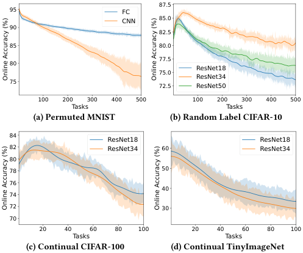

<!-- Start of picture text -->
87.5 95 FC CNN 85.0 90 82.5 85 80.0 77.5 80 ResNet18 75.0 ResNet34 75 72.5 ResNet50 100 200 300 400 500 100 200 300 400 500 Tasks Tasks (a) Permuted MNIST (b) Random Label CIFAR-10 84 ResNet18 ResNet18 82 ResNet34 60 ResNet34 80 78 50 76 40 74 72 30 70 20 40 60 80 100 20 40 60 80 100 Tasks Tasks (c) Continual CIFAR-100 (d) Continual TinyImageNet Online Accuracy (%) Online Accuracy (%) Online Accuracy (%) Online Accuracy (%) <!-- End of picture text -->

**Figure 1: Online Accuracies in Continual Learning.** 

dynamically injects and recovers plasticity according to task transitions and available resources. 

• We conduct extensive experiments on multiple benchmarks to demonstrate that PaCP consistently outperforms state-of-the-art plasticity maintenance methods. Remarkably, PaCP surpasses even non-pruned baselines in continual learning performance, achieving smaller models with better long-term adaptability. 

## **2 Background and Motivation** 

## **2.1 Plasticity Loss in Neural Networks** 

In many real-world scenarios, models must adapt to continuously evolving data, requiring neural networks to constantly fit new tasks. To evaluate this adaptability, we employ the metric _Online Accuracy_ , which measures the test accuracy of a model on the most recent task [10, 11]. Online accuracy reflects the model’s ability to adapt to new data, and based on it we define plasticity loss as follows: 

_𝑃_ ( _𝜃𝑡_ ) = ED _𝑡_ [A(O( _𝜃_ init _,_ D _𝑡_ ) _,_ D _𝑡_ ) −A(O( _𝜃𝑡 ,_ D _𝑡_ ) _,_ D _𝑡_ )] _,_ (1) where D _𝑡_ denotes the data from task _𝑡_ , A is online accuracy, O represents the model optimization algorithm, and _𝜃_ init and _𝜃𝑡_ are the model parameters randomly initialized from scratch and the one after training on _𝑡_ − 1 tasks, respectively. Plasticity loss is thus defined as the difference between the accuracy of a trained model _𝜃𝑡_ and that of a randomly initialized model _𝜃_ init with the same architecture, when both are trained on the same new dataset. 

To illustrate the presence of plasticity loss in continual learning, we conducted experiments on several benchmarks1 . In each experiment, only data from the most recent task was used for training. After a fixed number of epochs, we evaluated online accuracy on the test set of that task. The results are shown in Figure 1. We observe that across different task sequences and models, online accuracy consistently declines as the number of tasks increases, especially in the later stages of training. This provides strong evidence of a general phenomenon of plasticity loss in neural networks during continual learning. 

1These benchmarks are commonly used in related work, and we will introduce them in Section 5 and Appendix A. 

4953 

WWW ’26, April 13–17, 2026, Dubai, United Arab Emirates. 

Smaller but Better: Plasticity-Preserving Continual Learning for Embedded AI 

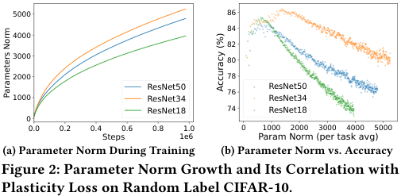

<!-- Start of picture text -->
5000 86 84 4000 82 3000 80 2000 78 ResNet50 ResNet50 76 1000 ResNet34 ResNet34 ResNet18 74 ResNet18 0 0.0 0.2 0.4 0.6 0.8 1.0 0 1000 2000 3000 4000 5000 Steps 1e6 Param Norm (per task avg) (a) Parameter Norm During Training (b) Parameter Norm vs. Accuracy Figure 2: Parameter Norm Growth and Its Correlation with Plasticity Loss on Random Label CIFAR-10. Accuracy (%) Parameters Norm <!-- End of picture text -->

Moreover, the results from Figure 1b highlight a notable distinction between plasticity in continual learning and conventional machine learning with stable data. In Random Label CIFAR-10 experiments, the small model (ResNet34) achieved higher accuracy than the large model (ResNet50) in later stages of training. Similarly, in Continual CIFAR-100 and Continual TinyImageNet, ResNet18 eventually outperformed ResNet34. These findings contradict the typical observation in conventional machine learning where larger models usually perform better, suggesting that in dynamically changing data streams, larger models are not necessarily more capable of adapting to new tasks. Similar phenomena have been reported by Mirzadeh et al. [38], further motivating the need for methods that preserve plasticity through new approaches distinct from traditional pruning techniques. 

## **2.2 A Deeper Look into Plasticity Loss** 

To better understand the mechanisms underlying plasticity loss, we analyze the learning dynamics of neural networks in continual learning. We focus on the metrics that correlate with plasticity loss, aiming to provide insights for subsequent methodological design. 

**Growth of Parameter Norms** is one of the most prominent correlates of plasticity loss during continual learning. We observe that the L2 norm of model parameters continuously increases throughout continual learning, as shown in Figure 2a. This suggests that the optimization starting point for new tasks progressively drifts away from the origin, which may impair the model’s ability to adapt to subsequent tasks. Figure 2b presents a scatter plot of parameter norms at the beginning of each task against test accuracy on that task in Random Label CIFAR-10, revealing a clear negative correlation. This indicates a close connection between parameter norm growth and plasticity loss. Several studies on neural plasticity have reported similar correlation, often interpreting parameter norm growth as an intermediate step in a causal chain: external factors induce norm growth, which in turn triggers pathological behaviors that ultimately lead to performance degradation [11, 35]. 

**Spikes in Training Loss** at task boundaries are another key phenomenon that is causally linked to rapid parameter norm changes. Figure 3a shows parameter norm changes during the first 50,000 mini-batches in continual training. Instead of smooth growth, norms exhibit step-like increases shortly after each task switch. The lightcolored curves in Figure 3a display training loss trajectories, which exhibit dramatic spikes—up to thousands of times higher—at task boundaries. The timing of these spikes aligns exactly with rapid parameter norm increases. Figure 3b further shows a scatter plot of per-mini-batch loss versus parameter norm change, revealing 

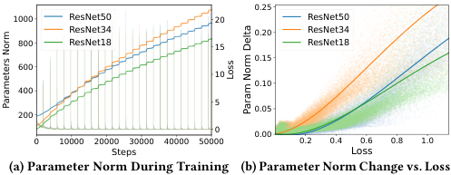

<!-- Start of picture text -->
0.25 1000 ResNet50 20 ResNet50 ResNet34 0.20 ResNet34 800 ResNet18 15 ResNet18 0.15 600 10 0.10 400 5 0.05 200 0 0.00 0 10000 20000 30000 40000 50000 0.2 0.4 0.6 0.8 1.0 Steps Loss (a) Parameter Norm During Training (b) Parameter Norm Change vs. Loss Loss Parameters Norm Param Norm Delta <!-- End of picture text -->

**Figure 3: Relationship between Parameter Norm Change and Learning Loss on Random Label CIFAR-10.** 

a strong positive correlation. These findings suggest a causal link: loss spikes amplify gradient magnitudes, and gradient-based optimizers convert these large gradients into large parameter updates, leading to accelerated norm growth. Prior research in other domains has also highlighted the detrimental effects of loss spikes and unstable gradients on training, proposing strategies such as dataset refinement and gradient clipping to mitigate these issues [49, 52]. Inspired by these observations, we will later explore approaches to protect parameters from being disrupted by such loss spikes. 

**Increasing Neuron Death Rate** indicates that a growing number of neurons lose their ability to propagate gradients during continual learning, which significantly reduces the model’s training efficiency on new data. Activation functions introduce nonlinearity, a key source of expressivity in neural networks. However, they can also impede gradient propagation during backpropagation, reducing training efficiency. For a single neuron in layer _𝑙_ , the gradient during backpropagation is given by: 

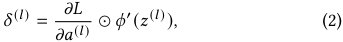

where _𝜙_′ ( _𝑧_(_𝑙_) ) acts as a gating factor controlling gradient flow. This factor depends only on the input to the neuron’s activation function. When its magnitude consistently approaches zero, two adverse effects arise: (1) the neuron can no longer effectively propagate gradients, impairing updates in preceding layers and reducing adaptation speed to new tasks; (2) the neuron’s output activation converges to a near-constant, failing to provide useful information to subsequent layers and diminishing model expressivity. Neurons in such states are referred to as _dead neurons_ in this work. 

We define a neuron to be in a _backpropagation-suppressed state_ during a backpropagation step if the absolute value of its gating factor _𝜙_′ ( _𝑧_(_𝑙_) ), i.e., the activation function’s derivative, falls below a threshold, e.g., 10% of the maximum possible derivative value for that function2 . The _death rate_ for a neuron is then estimated as the proportion of backpropagation steps it spends in this suppressed state over a statistical time window. This death rate serves as a metric to estimate the neuron’s diminished contribution to network plasticity. As shown in Figure 4a, the average neuron death rate across four continual learning benchmarks exhibits a steady increase as training progresses, indicating that this is a widespread phenomenon under shifting data distributions. Figure 4b compares the distributions of neuron death rates at the beginning and the end of training, revealing that they become more dispersed over 

> 2For ReLU, the specific threshold value is irrelevant. For SiLU and GELU, the 10% threshold approximately partitions the input domain into two continuous intervals. In practice, the state can be determined directly based on the input values. 

4954 

WWW ’26, April 13–17, 2026, Dubai, United Arab Emirates. 

Chenxin Mao, Haibo Liu, Zhenzhe Zheng, Fan Wu, & Guihai Chen 

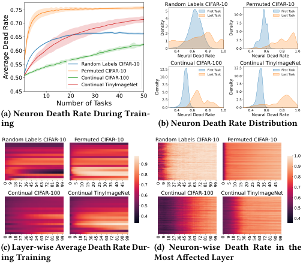

<!-- Start of picture text -->
Random Labels CIFAR-10 Permuted CIFAR-10 0.75 54 First TaskLast Task 10.0 First TaskLast Task 0.70 3 7.5 0.65 21 5.02.5 0.60 0 0.4 0.6 0.8 1.0 0.0 0.4 0.6 0.8 1.0 Neural Dead Rate Neural Dead Rate 0.550.50 Random Labels CIFAR-10Permuted CIFAR-10Continual CIFAR-100 12.510.0 Continual CIFAR-1First TaskLast Task00 12.510.0Continual TinyImFirst TaskLast TaskageNet Continual TinyImageNet 7.5 7.5 0.45 10 Number of Tasks20 30 40 50 5.02.50.0 0.4 0.6 0.8 1.0 5.02.50.0 0.4 0.6 0.8 1.0 (a) Neuron Death Rate During Train- Neural Dead Rate Neural Dead Rate ing (b) Neuron Death Rate Distribution Random Labels CIFAR-10 Permuted CIFAR-10 Random Labels CIFAR-10 Permuted CIFAR-10 1.0 0.9 0.9 0.8 0.8 0.7 0.7 Continual CIFAR-100 Continual TinyImageNet 0.6 Continual CIFAR-100 Continual TinyImageNet 0.6 0.5 0.5 0.4 0.4 (c) Layer-wise Average Death Rate Dur- (d) Neuron-wise Death Rate in the ing Training Most Affected Layer Density Density Average Dead Rate Density Density 0 9 18 27 36 45 54 63 72 81 90 99 0 5 10 15 20 25 30 35 40 45 0 9 18 27 36 45 54 63 72 81 90 99 0 5 10 15 20 25 30 35 40 45 0 9 18 27 36 45 54 63 72 81 90 99 0 9 18 27 36 45 54 63 72 81 90 99 0 9 18 27 36 45 54 63 72 81 90 99 0 9 18 27 36 45 54 63 72 81 90 99 <!-- End of picture text -->

**Figure 4: Neural Death during Continual Learning.** 

time, with a growing number of neurons entering dead states. Furthermore, Figure 4c and Figure 4d respectively depict layer-wise average death rates and the trajectories of individual neurons in the most affected layer. Two key patterns emerge from these analyses: (1) neuron death rates vary significantly across layers, and (2) once neurons enter high-death states, they rarely recover through further training. These findings underscore the importance of treating layers differently based on their susceptibility to neuron death and of developing targeted strategies to resuscitate high-death neurons, thereby maximizing network capacity and preserving plasticity. 

## **3 Problem Formulation** 

We consider a scenario in which a pretrained and pruned deep neural network is deployed on an edge device, where it will continually learn new tasks over time. Let the dataset used during the pre-deployment stage be denoted by D_𝑝_ , and let the edge device subsequently encounter a sequence of tasks {T1 _,_ T2 _,_ · · · _,_ T _𝑇_ }. Each task T _𝑡_ is associated with a dataset D _𝑡_ , which may differ significantly from the datasets of previous tasks. 

We denote the pretraining and pruning procedure as P and the model training algorithm during the continual learning as O. Starting from an initial randomly initialized model _𝜃_ init, the model first undergoes pretraining and pruning, resulting in the initial model _𝜃_ 0 for continual learning: 

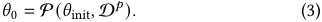

The model is then updated sequentially over the stream of tasks via continual learning: 

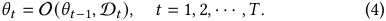

Our objective is to design the pretraining and pruning algorithm P and the continual learning algorithm O such that, for any task T _𝑡_′ in the sequence, the resulting model _𝜃𝑡_′ achieves the highest possible _online accuracy_ , i.e., the test accuracy on the most recent task dataset D _𝑡_′ : 

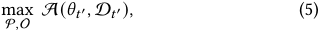

where _𝜃𝑡_′ is obtained through the iterative process defined in Eq. 3 and Eq. 4. 

## **4 Method** 

Our method consists of two correlated stages: (1) pretraining and plasticity-aware pruning before deploying the model to edge devices, and (2) plasticity maintenance during continual learning on edge devices. The overall framework is illustrated in Figure 5. In the first stage, we design a plasticity contribution prediction mechanism to evaluate the contribution of each neuron to network plasticity, which guides the pruning. A smooth-decay pruning strategy is further employed to mitigate loss spikes during pruning. In the second stage, our algorithm intervenes at each task switch: based on the plasticity contributions of different layers and the resource constraints of edge devices, it temporarily expands the network width to enhance learning ability for new tasks while protecting existing parameters, and subsequently restores the network structure through plasticity-aware pruning. The two stages are consistent in design: by formulating plasticity maintenance on edge devices as a process of expansion followed by pruning, we can reuse the modules of structure planning, pruning orchestration, and smooth-decay pruning. 

## **4.1 Pruning in Pre-deployment Stage** 

Prior to deployment, the cloud first pre-trains the model on largescale cloud data to learn robust, generalizable representations, which accelerates adaptation to new tasks on embedded devices. In this stage, we adopt Pruning After Training (PAT) as our pruning pipeline, which is the most popular type of pruning framework and consists of three steps: (1) train a full model from scratch on cloud data, (2) prune the model according to resource constraints, and (3) fine-tune the pruned model to recover performance [4]. To ensure efficient execution across heterogeneous embedded hardware, we further employ structured pruning, which removes entire filters or channels and is more hardware-friendly than unstructured approaches. Unlike conventional pruning that focuses on retaining accuracy for the current task, our pruning objective is to preserve plasticity. After initial training, we estimate the plasticity contribution of model structures to guide pruning orchestration, and perform smooth-decay pruning during fine-tuning. 

**Plasticity Contribution Estimation.** Based on our previous experimental results (detailed in Section 2.2), we use neuron death rates to estimate each neuron’s contribution to model plasticity. However, as the cloud-side pretraining data is stationary, it is challenging to estimate a neuron’s plasticity contribution during continual learning after deployment on embedded devices. To address this, we introduce _pseudo task switches_ that simulate the distribution shifts caused by task transitions, enabling us to approximate neuron death rates under continual learning and perform plasticity-aware pruning accordingly. 

After initial training, the original model is forked to create a replica model, on which subsequent pseudo tasks are trained to avoid damaging the performance and plasticity of the original model. To construct these pseudo tasks, we randomly sample subsets of the pretraining dataset, perturb the input distributions using data augmentation techniques, and shuffle the labels with a fixed 

4955 

WWW ’26, April 13–17, 2026, Dubai, United Arab Emirates. 

Smaller but Better: Plasticity-Preserving Continual Learning for Embedded AI 

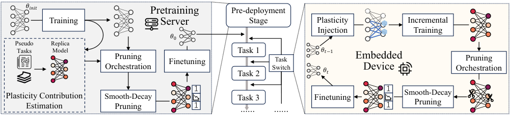

<!-- Start of picture text -->
𝜃𝑖𝑛𝑖𝑡 Pretraining Pre-deployment Training Server Stage Plasticity  Incremental Injection Training 𝜃0 Pseudo Replica Tasks Model Task 1 𝜃𝑡−1 Pruning  Task  Embedded Pruning Finetuning Orchestration Task 2 Switch 𝜃𝑡 Device Orchestration 1 1 Smooth-Decay Plasticity Contribution Smooth-Decay  Task 3 Finetuning Estimation Pruning 1 ······ ······ 1 Pruning <!-- End of picture text -->

**Figure 5: Overall Workflow of PaCP Framework.** 

pattern to create pseudo new datasets. By repeatedly applying this procedure, we form a sequence of tasks and train the replica model sequentially on them. During this process, we continuously track the backpropagated gradients and compute the death rates of neurons in each layer. After completing the pseudo task training, the death rates measured on the replica model are used as estimates of the corresponding neurons’ death rates in the original model under continual learning, which then serve as the basis for subsequent pruning orchestration. 

**Pruning Orchestration.** Figure 4c shows that neuron death rates vary significantly across different layers. Therefore, instead of applying a uniform pruning ratio, we assign distinct ratios to each layer. Specifically, denote _𝛾𝑙_ to be the death rate measured during pseudo task training of layer _𝑙_ with _𝑁𝑙_ neurons, and define its effective neuron count as _𝑁𝑙__𝑒𝑓𝑓_ = (1 − _𝛾𝑙_ ) _𝑁𝑙_ , representing the number of neurons that can effectively propagate gradients. Our objective is to ensure that, after pruning, the proportion of effective neurons across layers remains consistent with the original layerwidth distribution, thereby preserving cross-layer gradient flow and maintaining structural balance in the model. Let the original widths of the layers be _𝑁_ 10_, 𝑁_ 20_, . . . , 𝑁_ _𝐿_0.The pruned width of layer _𝑙_ , denoted as _𝑁𝑙__𝑝_,isobtainedbysolving the following optimization problem: 

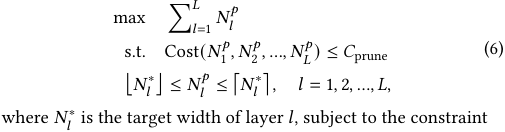

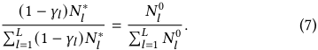

Here, _𝑁𝑙_′must be an integer obtained by rounding_𝑁_ _𝑙_∗either down to ⌊ _𝑁𝑙_∗⌋or up to⌈_𝑁_ _𝑙_∗⌉. The function_𝐶𝑜𝑠𝑡_(·) denotes the resource consumption of the model, which can correspond to the number of parameters, FLOPs, or other resource measures, with _𝐶_ prune being the on-device resource budget. Owing to the monotonic nature of _𝐶𝑜𝑠𝑡_ (·), this optimization problem can be solved efficiently: we first initialize each layer width as _𝑁𝑙_′= ⌊_𝑁_ _𝑙_∗⌋; then, guided by the resource budget and the constraint in Eq. 7, we apply binary search to find the maximum feasible set of { _𝑁𝑙_∗} _𝑙__𝐿_ =1;finally,wesearch through the layers and select a subset of layers to round up their widths to ⌈ _𝑁𝑙_∗⌉to further maximize the objective under the given constraints. 

After determining the pruning amount for each layer, we formulate neuron-level pruning directives sequentially. Within each layer, neurons are ranked by their death rates in the replica model, and those with higher death rates are pruned first. The corresponding neurons in the original model are then marked for removal. Finally, we enter the fine-tuning step, during which smooth-decay pruning is applied to gradually eliminate the marked neurons and parameters. 

**Smooth-Decay Pruning.** Most existing pruning methods immediately remove the designated structures or parameters once pruning directives are established; however, such abrupt structural changes often cause loss spikes that impair model plasticity, as described in Section 2.2. To address this issue, we introduce _smoothdecay pruning_ , which gradually suppresses the marked neurons until they are fully pruned. Specifically, during smooth-decay pruning we attach a mask to the activation _𝑎𝑙_ of each layer _𝑙_ : 

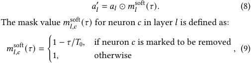

where _𝜏_ denotes the number of iterations since the start of smoothdecay pruning, and _𝑇_ 0 is the total number of iterations, typically set to the number of batches in one epoch. During smooth-decay pruning, the soft mask values of neurons to be removed are linearly decayed from 1 to 0, while unmarked neurons retain a mask value of 1. Once _𝜏_ reaches _𝑇_ 0, we permanently remove the pruned neurons from the network by deleting their input parameters as well as the corresponding weight channels in subsequent layers. Since the outputs of these neurons have already been completely suppressed, eliminating their associated parameters does not affect the model’s responses. 

Smooth-decay pruning offers two advantages: (1) it prevents abrupt loss spikes and reduces the risk of unstable gradients damaging network parameters; (2) by gradually reducing the activations of pruned neurons, it enables their functionalities to be smoothly transferred to the remaining neurons, thereby preserving overall model performance. 

## **4.2 Plasticity Maintenance during On-Device Continual Learning Stage** 

From the experimental insights in Section 2.2, we observe that short-term loss spikes following task switches play a critical role in 

4956 

WWW ’26, April 13–17, 2026, Dubai, United Arab Emirates. 

Chenxin Mao, Haibo Liu, Zhenzhe Zheng, Fan Wu, & Guihai Chen 

the degradation of model plasticity. Building on this observation, we intervene at task switches during continual learning on edge devices, aiming to protect model plasticity throughout the transition period. The core idea of our approach is to temporarily expand the width of network while protecting the original parameters, and subsequently restore the network structure through pruning. For each task switch, our algorithm proceeds through four stages: plasticity injection, incremental training, pruning orchestration, and smooth-decay pruning. 

**Plasticity Injection.** At each task switch, before training begins on the new data, we expand the network width and introduce additional trainable parameters to enhance adaptability to the upcoming task. This process can be regarded as the inverse of structured pruning in the pretraining stage. We again use neuron death rates as the metric for expansion planning, which are collected from the preceding continual learning process. Let the current widths of the layers be _𝑁_ 1_𝑝, 𝑁_ 2_𝑝,_· · ·_, 𝑁_ _𝐿__𝑝_, with corresponding death rates_𝛾_1_,𝛾_2_,_· · ·_,𝛾𝐿_. The expanded widths of the layers, denoted as _𝑁_ 1_𝑒, 𝑁_ 2_𝑒,_· · ·_, 𝑁_ _𝐿__𝑒_, are determined by solving the following optimization problem: 

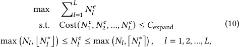

where _𝑁𝑙__𝑝𝑡_ is given by Eq. 7. In contrast to the pruning optimization problem in Eq. 6, Eq. 10 introduces an additional constraint to ensure that the width of each layer is not reduced. Given the strong structural similarity between the two optimization problems, the solution procedure of Eq. 6 can be seamlessly adapted to solve Eq. 10 efficiently on edge devices. 

Once the expansion widths of all layers are determined, we build the expanded network by enlarging the output dimensionality of the current layer and correspondingly extending the input dimensionality of the subsequent layer3 . After network expansion, we proceed with incremental training on the new task data. 

**Incremental Training.** The loss spike caused by task switches is inevitable, since the model has never been trained on data from the new distribution. To protect the parameters inherited from the pre-expansion model that have already been well trained, we freeze them during the first epoch of incremental training, temporarily disabling neuron death rate tracking and updating only the newly introduced parameters from the plasticity injection step. After the first epoch, as the loss spike has passed, we unfreeze all parameters, allowing the entire model to continue incremental training on the new task data, while resuming neuron death rate tracking until the pruning stage begins. 

**Pruning Orchestration.** Due to the constraints of resource scheduling and energy consumption on edge devices, the model cannot remain in an expanded state for long-term training. Therefore, pruning is required to restore the network structure. Unlike the pruning orchestration in the pretraining stage, we no longer re-plan the width of each layer; instead, each layer is pruned back to its pre-expansion width. The selection of neurons to be removed follows the same principle as in pretraining: neurons with lower 

3In our implementation, we adopt a function-preserving strategy by zero-initializing the new units’ output weights to maintain mathematical equivalence. Alternatively, random initialization remains a viable option to introduce immediate diversity. 

death rates are preserved, while those with higher death rates are marked for removal. The process then proceeds to smooth-decay pruning, where the pruning directives are gradually executed. 

**Smooth-Decay Pruning.** On edge devices, we reuse the smoothdecay pruning scheme from the pretraining stage. During the finetuning following the pruning orchestration, the outputs of neurons marked for removal are gradually decayed to zero, after which the corresponding structures and parameters are permanently eliminated from the model. The network can then either continue finetuning on the new task data or pause training until the next task switch. 

By restoring the network to its pre-expansion width after each plasticity injection, our approach maintains a stable architecture throughout long-term continual learning. In contrast to prior works that preserve plasticity by continuously enlarging the model, our method achieves sustainable continual learning under edge-device resource constraints. During the entire on-device continual learning stage, plasticity is safeguarded by two complementary mechanisms: after task switches, we freeze the pre-expansion parameters to shield them from unstable gradients induced by short-term loss spikes; during pruning, we mitigate loss spikes by gradually applying structural changes through smooth-decay pruning. 

## **5 Experiments** 

## **5.1 Experimental Setup** 

**Datasets.** We evaluate our approach on standard continual learning task sequences widely adopted in plasticity-oriented research [8, 26, 36]. Our constructed task streams are based on three benchmark image classification datasets: CIFAR-10, CIFAR-100 [25], and TinyImageNet [27]. For the Random Label CIFAR-10 sequence, class labels are randomly permuted at each task switch. For the Continual CIFAR-100 and Continual TinyImageNet sequences, each new task consists of samples from 5 randomly selected classes, prioritizing those that have been chosen the least frequently so far. Following [8, 26], TinyImageNet images are resized to 32 × 32. The same sampling strategy is applied to the test sets to ensure that each task has a corresponding evaluation split. 

**Baselines.** We compare our method against several representative plasticity-maintenance baselines. _Continual Backprop (CBP)_ [7, 9] is a targeted weight-reset algorithm based on a heuristic neuron utility measure. _L2 Regularization_ and _L2 Init_ [26] are two regularization-based methods, where L2 Init centers the regularization around the initial parameters rather than the origin. _Shrink & Perturb_ [2] performs a soft reset by shrinking weights and adding random perturbations upon data changes. We apply structured L1 pruning [29] during pretraining, maintaining the same average pruning sparsity as our method, i.e., _PaCP_ . Additionally, we include a control variant labeled _Baseline_ , which neither applies pruning nor any plasticity-maintenance mechanism. Detailed baseline hyperparameters are provided in Appendix B. 

**Model and Metrics.** We adopt ResNet-18 [16] as the backbone network, as representative baseline methods primarily focus on plasticity in CNNs, among which the ResNet family is the most representative architecture. The pruning target during pretraining is set to 50% of the original parameter count. For model expansion in PaCP, we constrain the parameter budget to be no more than 

4957 

WWW ’26, April 13–17, 2026, Dubai, United Arab Emirates. 

Smaller but Better: Plasticity-Preserving Continual Learning for Embedded AI 

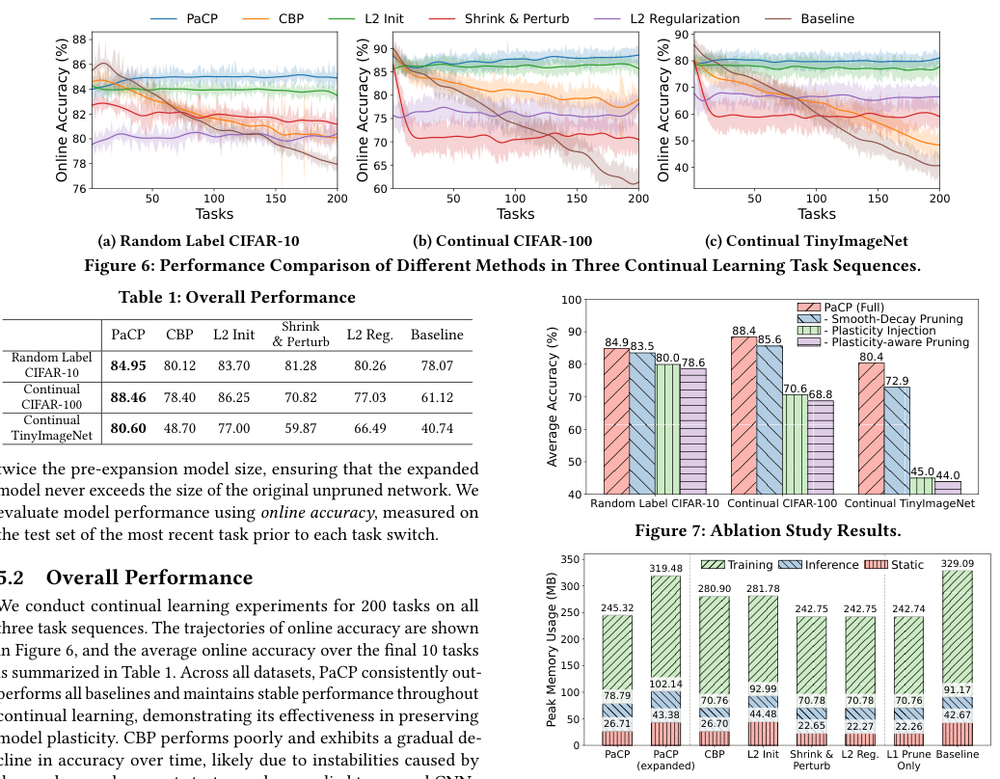

<!-- Start of picture text -->
PaCP CBP L2 Init Shrink & Perturb L2 Regularization Baseline 88 90 90 86 80 85 84 80 70 82 75 60 80 70 50 78 65 40 76 60 50 100 150 200 50 100 150 200 50 100 150 200 Tasks Tasks Tasks (a) Random Label CIFAR-10 (b) Continual CI FAR-100 (c) Continual TinyImageNet Figure 6: Performance Comparison of Different Method s in Th ree Continual Learning Task Sequences. Table 1: Overall Performance 100 PaCP (Full) PaCP CBP L2 Init &Shrink Perturb L2 Reg. Baseline 90 84.9 83.5 88.4 8 5.6 - Smooth-Decay Pruning- - Plasti  Plasticity Injectioncity-aware Pruning Random Label 84.95 80.12 83.70 81.28 80.26 78.07 80 80.0 78.6 8 0.4 CIFAR-10 72.9 Continual 88.46 78.40 86.25 70.82 77.03 61.12 70 70.6 68.8 CIFAR-100 Continual TinyImageNet 80.60 48.70 77.00 59.87 66.49 40.74 60 50 twice the pre-expansion model size, ensuring that the expanded 45.0 44.0 model never exceeds the size of the original unpruned network. We 40 Random Label CIFAR-10 Continual CIFAR-100 Continual TinyImageNet evaluate model performance using  online accuracy , measured on the test set of the most recent task prior to each task switch. Figure 7: Ablation Study Results. 5.2 Overall Performance 350300 319.48 280.90Training281.78 Inference Static 329.09 We conduct continual learning experiments for 200 tasks on all 250 245.32 242.75 242.75 242.74 three task sequences. The trajectories of online accuracy are shown 200 in Figure 6, and the average online accuracy over the final 10 tasks is summarized in Table 1. Across all datasets, PaCP consistently out-performs all baselines and maintains stable performance throughout 150100 78.79 102.14 70.76 92.99 70.78 70.78 70.76 91.17 continual learning, demonstrating its effectiveness in preserving 50 26.71 43.38 26.70 44.48 22.65 22.27 22.26 42.67 model plasticity. CBP performs poorly and exhibits a gradual de- 0 PaCP PaCP CBP L2 Init Shrink & L2 Reg. L1 Prune Baseline cline in accuracy over time, likely due to instabilities caused by (expanded) Perturb Only Online Accuracy (%) Online Accuracy (%) Online Accuracy (%) Average Accuracy (%) Peak Memory Usage (MB) <!-- End of picture text -->

twice the pre-expansion model size, ensuring that the expanded model never exceeds the size of the original unpruned network. We evaluate model performance using _online accuracy_ , measured on the test set of the most recent task prior to each task switch. 

## **5.2 Overall Performance** 

We conduct continual learning experiments for 200 tasks on all three task sequences. The trajectories of online accuracy are shown in Figure 6, and the average online accuracy over the final 10 tasks is summarized in Table 1. Across all datasets, PaCP consistently out-performs all baselines and maintains stable performance throughout performs all baselines and maintains stable performance throughout continual learning, demonstrating its effectiveness in preserving model plasticity. CBP performs poorly and exhibits a gradual decline in accuracy over time, likely due to instabilities caused by the random replacement strategy when applied to pruned CNNs that have limited output channels. L2 Init achieves the second-best performance, though it requires storing a full copy of the initial parameters. Interestingly, the non-pruned Baseline achieves high initial accuracy due to its larger capacity but rapidly deteriorates as plasticity diminishes, resulting in the worst final performance. This observation underscores that maintaining plasticity is more crucial for long-term continual learning than simply increasing initial model capacity. By continuously intervening during training, PaCP sustains adaptability and achieves superior continual learning performance even with smaller models. 

**Figure 8: Memory Usage of Different Methods.** 

injection yields the largest improvement, followed by smooth-decay pruning. Removing the plasticity injection is equivalent to eliminating continual intervention during learning, highlighting the importance of maintaining adaptability throughout the continual process. Plasticity-aware pruning during pretraining has a smaller effect, because its influence gradually diminishes over extended continual training, and its simulated neuron-death predictions may not perfectly match real task sequences. 

## **5.4 Resource Consumption Analysis** 

## **5.3 Ablation Study** 

To evaluate the contribution of each component in PaCP, we conduct ablation experiments by successively removing the three major components: smooth-decay pruning, plasticity injection during continual learning, and plasticity-aware pruning during pretraining, until only L1 structured pruning remains. We perform 200-task continual learning on all three datasets and report the average online accuracy of the last 10 tasks in Figure 7. The results show that removing any component degrades performance, confirming that all parts of PaCP contribute to its effectiveness. Among them, plasticity 

We measure memory usage of PaCP and baselines during continual learning, using 32×32 RGB images with a batch size of 32. We record both static memory (model and state storage) and peak memory during inference and training. As shown in Figure 8, PaCP’s static memory slightly exceeds Shrink & Perturb and L2 Regularization, both of which require no auxiliary state, but remains far below L2 Init and comparable to CBP. With expansion enabled, PaCP’s peak training memory increases by roughly 30%, reaching its maximum during the brief post-expansion phase before pruning. Because this transient memory increase occurs only after task switches and can 

4958 

WWW ’26, April 13–17, 2026, Dubai, United Arab Emirates. 

Chenxin Mao, Haibo Liu, Zhenzhe Zheng, Fan Wu, & Guihai Chen 

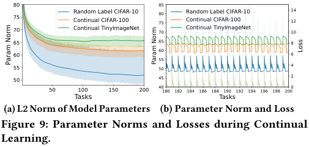

<!-- Start of picture text -->
80 85 7570 Random Label CIFAR-10Continual CIFAR-100Continual TinyImageNet 807570 Random Label CIFAR-10Continual CIFAR-100Continual TinyImageNet 141210 65 65 8 60 60 6 55 55 50 4 50 45 2 50 100 150 200 40180 182 184 186 188 190 192 194 196 198 2000 Tasks Tasks (a) L2 Norm of Model Parameters (b) Parameter Norm and Loss Figure 9: Parameter Norms and Losses during Continual Learning. Loss Param Norm Param Norm <!-- End of picture text -->

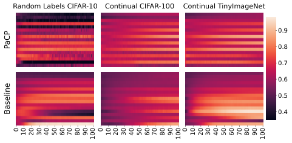

<!-- Start of picture text -->
Random Labels CIFAR-10 Continual CIFAR-100 Continual TinyImageNet 0.9 0.8 0.7 0.6 0.5 0.4 PaCP Baseline 0 10 20 30 40 50 60 70 80 90 100 0 10 20 30 40 50 60 70 80 90 100 0 10 20 30 40 50 60 70 80 90 100 <!-- End of picture text -->

**Figure 10: Layer-wise Neuron Death Rate.** 

be mitigated by early pruning when needed, we regard PaCP’s memory overhead as acceptable for edge deployment. We evaluated the energy and latency overheads on an NVIDIA Jetson TX2. Compared to vanilla training on the same model, PaCP incurs a marginal increase of approximately 5.6% in energy consumption and 4.3% in training latency. In contrast, competing methods exhibit significantly higher overheads: CBP increases energy and latency by 12.8% and 26.1%, respectively, while L2 Init incurs increases of 4.8% and 4.3%. 

## **5.5 Discussion on Plasticity Loss** 

We further analyze the dynamics underlying plasticity preservation during continual learning. Figure 9a plots the average parameter L2 norm per task, with shaded areas denoting the 1st-99th percentile range. Unlike the continual growth observed in Figure 2a, the parameter norms under PaCP initially decrease and then stabilize, suggesting that our plasticity-aware pruning suppresses overgrowth by pruning neurons with large-magnitude weights. 

Figure 9b shows the evolution of parameter norms and training loss during the last 20 tasks. Parameter norms exhibit cyclic behavior: a sharp rise immediately after task switches due to model expansion, followed by a gradual decline and a sharp drop during pruning, before rising slightly again. The corresponding loss curves show spikes at task switches—caused by distribution shifts—but these are effectively dampened by freezing original parameters and using smooth-decay pruning, validating our design choice for stability during transitions. 

Figure 10 visualizes the layer-wise neuron death rates throughout training. While death rates increase moderately as learning progresses, PaCP maintains significantly lower overall neuron death and avoids catastrophic layer-wide death seen in baselines. On Random Label CIFAR-10, PaCP notably reduces neuron death after pruning phases, demonstrating its effectiveness in suppressing neuron inactivity and sustaining long-term plasticity. 

## **6 Related Work** 

**Plasticity Loss of Neural Networks** refers to the degrading ability of neural networks to adapt to new data as training progresses. This phenomenon, initially observed in warm-start scenarios [2], has been formally identified and studied in reinforcement and continual learning [7–9, 34]. Current research remains in its early stages, primarily focusing on analyzing the underlying causes [24, 35, 36] and developing mitigation strategies. Existing mitigation methods can be broadly categorized into three approaches: parameter resetting mechanisms [7–9, 11], regularization-based constraints [8, 10, 34], and activation function modifications [1, 6]. 

**Continual Learning** enables knowledge accumulation across tasks without retraining, primarily focusing on mitigating catastrophic forgetting [5]. Existing approaches generally fall into three categories: replay methods [33, 40], regularization-based strategies [23, 30, 51], and parameter isolation techniques [37, 41]. Recently, emerging research directions have begun to explore other critical aspects of continual learning, such as model plasticity [7, 10, 11, 14, 17] and latency reduction [31, 32]. 

**Neural Network Pruning** creates lightweight models by removing redundant parameters to reduce computational and storage costs [4]. Methods are primarily categorized by their timing relative to training. Pruning After Training (PAT) finds efficient subnetworks from pretrained models, as seen in the Lottery Ticket Hypothesis [13]. Pruning Before Training (PBT) targets randomly initialized networks directly [28, 44], while Pruning During Training (PDT) jointly optimizes weights and sparsity structure, often via regularization [48]. 

## **7 Conclusion** 

In this work, we addressed the underexplored problem of maintaining model plasticity in on-device continual learning for embedded AI systems. We introduced Plasticity-aware Continual Pruning (PaCP), a unified framework that achieves sustainable adaptability under resource constraints. By jointly optimizing a plasticitypreserving pruning strategy during pre-deployment and a dynamic expansion-pruning mechanism during on-device continual learning, PaCP effectively mitigates plasticity loss. Extensive experiments across multiple continual learning benchmarks demonstrate that PaCP not only outperforms existing plasticity-maintenance approaches but also surpasses non-pruned baselines in long-term adaptability. Our findings highlight that careful structural management—rather than mere model scaling—can yield smaller yet more adaptive systems, opening a promising direction for future research on lifelong embedded intelligence. 

## **Acknowledgments** 

This work was supported in part by National Key R&D Program of China (No. 2023YFB4502400), in part by China NSF grant No. 62322206, 62432007, 62132018, 62025204, U2268204, 62272307, 62372296, in part by Fundamental and Interdisciplinary Disciplines Breakthrough Plan of the Ministry of Education of China (No. JYB2025XDXM103). The opinions, findings, conclusions, and recommendations expressed in this paper are those of the authors and do not necessarily reflect the views of the funding agencies or the government. Zhenzhe Zheng is the corresponding author. 

4959 

WWW ’26, April 13–17, 2026, Dubai, United Arab Emirates. 

Smaller but Better: Plasticity-Preserving Continual Learning for Embedded AI 

## **References** 

- [1] Zaheer Abbas, Rosie Zhao, Joseph Modayil, Adam White, and Marlos C Machado. 2023. Loss of Plasticity in Continual Deep Reinforcement Learning. In _Conference on Lifelong Learning Agents_ . 620–636. 

- [2] Jordan Ash and Ryan P Adams. 2020. On Warm-Starting Neural Network Training. In _Advances in Neural Information Processing Systems_ , Vol. 33. 3884–3894. 

- [3] Romil Bhardwaj, Zhengxu Xia, Ganesh Ananthanarayanan, Junchen Jiang, Yuanchao Shu, Nikolaos Karianakis, Kevin Hsieh, Paramvir Bahl, and Ion Stoica. 2022. Ekya: Continuous Learning of Video Analytics Models on Edge Compute Servers. In _19th USENIX Symposium on Networked Systems Design and Implementation_ . 119–135. 

- [4] Hongrong Cheng, Miao Zhang, and Javen Qinfeng Shi. 2024. A Survey on Deep Neural Network Pruning: Taxonomy, Comparison, Analysis, and Recommendations. _IEEE Transactions on Pattern Analysis and Machine Intelligence_ 46, 12 (2024), 10558–10578. 

- [5] Matthias De Lange, Rahaf Aljundi, Marc Masana, Sarah Parisot, Xu Jia, Aleš Leonardis, Gregory Slabaugh, and Tinne Tuytelaars. 2021. A Continual Learning Survey: Defying Forgetting in Classification Tasks. _IEEE Transactions on Pattern Analysis and Machine Intelligence_ 44, 7 (2021), 3366–3385. 

- [6] Quentin Delfosse, Patrick Schramowski, Martin Mundt, Alejandro Molina, and Kristian Kersting. 2021. Adaptive Rational Activations to Boost Deep Reinforcement Learning. _arXiv preprint arXiv:2102.09407_ (2021). 

- [7] Shibhansh Dohare, J Fernando Hernandez-Garcia, Qingfeng Lan, Parash Rahman, A Rupam Mahmood, and Richard S Sutton. 2024. Loss of Plasticity in Deep Continual Learning. _Nature_ 632, 8026 (2024), 768–774. 

- [8] Shibhansh Dohare, J Fernando Hernandez-Garcia, Parash Rahman, A Rupam Mahmood, and Richard S Sutton. 2023. Maintaining Plasticity in Deep Continual Learning. _arXiv preprint arXiv:2306.13812_ (2023). 

- [9] Shibhansh Dohare, Richard S Sutton, and A Rupam Mahmood. 2021. Continual Backprop: Stochastic Gradient Descent with Persistent Randomness. _arXiv preprint arXiv:2108.06325_ (2021). 

- [10] Mohamed Elsayed, Qingfeng Lan, Clare Lyle, and A Rupam Mahmood. 2024. Weight Clipping for Deep Continual and Reinforcement Learning. In _Reinforcement Learning Conference_ . 

- [11] Mohamed Elsayed and A. Rupam Mahmood. 2024. Addressing Loss of Plasticity and Catastrophic Forgetting in Continual Learning. In _International Conference on Learning Representations_ . 

- [12] Biyi Fang, Xiao Zeng, and Mi Zhang. 2018. NestDNN: Resource-Aware MultiTenant On-Device Deep Learning for Continuous Mobile Vision. In _Proceedings of the 24th Annual International Conference on Mobile Computing and Networking_ . 115–127. 

- [13] Jonathan Frankle and Michael Carbin. 2019. The Lottery Ticket Hypothesis: Finding Sparse, Trainable Neural Networks. In _International Conference on Learning Representations_ . 

- [14] Mustafa B Gurbuz and Constantine Dovrolis. 2022. NISPA: Neuro-Inspired Stability-Plasticity Adaptation for Continual Learning in Sparse Networks. In _International Conference on Machine Learning_ . 8157–8174. 

- [15] Song Han, Huizi Mao, and William J Dally. 2016. Deep Compression: Compressing Deep Neural Network with Pruning, Trained Quantization and Huffman Coding. In _International Conference on Learning Representations_ . 

- [16] Kaiming He, Xiangyu Zhang, Shaoqing Ren, and Jian Sun. 2016. Deep Residual Learning for Image Recognition. In _Proceedings of the IEEE Conference on Computer Vision and Pattern Recognition_ . 770–778. 

- [17] Dahuin Jung, Dongjin Lee, Sunwon Hong, Hyemi Jang, Ho Bae, and Sungroh Yoon. 2023. New Insights for the Stability-Plasticity Dilemma in Online Continual Learning. In _International Conference on Learning Representations_ . 

- [18] Ashfakul Karim Kausik, Adib Bin Rashid, Ramisha Fariha Baki, and Md Mifthahul Jannat Maktum. 2025. Machine Learning Algorithms for Manufacturing Quality Assurance: A Systematic Review of Performance Metrics and Applications. _Array_ (2025), 100393. 

- [19] Joseph Kershaw, Rui Yu, YuMing Zhang, and Peng Wang. 2021. Hybrid Machine Learning-Enabled Adaptive Welding Speed Control. _Journal of Manufacturing Processes_ 71 (2021), 374–383. 

- [20] Mehrdad Khani, Ganesh Ananthanarayanan, Kevin Hsieh, Junchen Jiang, Ravi Netravali, Yuanchao Shu, Mohammad Alizadeh, and Victor Bahl. 2023. RECL: Responsive Resource-Efficient Continuous Learning for Video Analytics. In _20th USENIX Symposium on Networked Systems Design and Implementation_ . 917–932. 

- [21] Sanghwan Kim, Lorenzo Noci, Antonio Orvieto, and Thomas Hofmann. 2023. Achieving a Better Stability-Plasticity Trade-Off via Auxiliary Networks in Continual Learning. In _Proceedings of the IEEE/CVF Conference on Computer Vision and Pattern Recognition_ . 11930–11939. 

- [22] Tae-Hyun Kim, Hye-Rin Kim, and Yeong-Jun Cho. 2021. Product Inspection Methodology via Deep Learning: An Overview. _Sensors_ 21, 15 (2021), 5039. 

- [23] James Kirkpatrick, Razvan Pascanu, Neil Rabinowitz, Joel Veness, Guillaume Desjardins, Andrei A Rusu, Kieran Milan, John Quan, Tiago Ramalho, Agnieszka Grabska-Barwinska, et al. 2017. Overcoming Catastrophic Forgetting in Neural Networks. _Proceedings of the National Academy of Sciences_ 114, 13 (2017), 3521– 3526. 

- [24] Timo Klein, Lukas Miklautz, Kevin Sidak, Claudia Plant, and Sebastian Tschiatschek. 2024. Plasticity Loss in Deep Reinforcement Learning: A Survey. _arXiv preprint arXiv:2411.04832_ (2024). 

- [25] Alex Krizhevsky, Geoffrey Hinton, et al. 2009. Learning Multiple Layers of Features from Tiny Images. (2009). 

- [26] Saurabh Kumar, Henrik Marklund, and Benjamin Van Roy. 2023. Maintaining Plasticity in Continual Learning via Regenerative Regularization. _arXiv preprint arXiv:2308.11958_ (2023). 

- [27] Ya Le and Xuan S. Yang. 2015. Tiny ImageNet Visual Recognition Challenge. (2015). 

- [28] Namhoon Lee, Thalaiyasingam Ajanthan, and Philip HS Torr. 2019. SNIP: SingleShot Network Pruning Based on Connection Sensitivity. In _International Conference on Learning Representations_ . 

- [29] Hao Li, Asim Kadav, Igor Durdanovic, Hanan Samet, and Hans Peter Graf. 2016. Pruning Filters for Efficient ConvNets. _arXiv preprint arXiv:1608.08710_ (2016). 

- [30] Zhizhong Li and Derek Hoiem. 2017. Learning Without Forgetting. _IEEE Transactions on Pattern Analysis and Machine Intelligence_ 40, 12 (2017), 2935–2947. 

- [31] Haibo Liu, Chen Gong, Zhenzhe Zheng, Shengzhong Liu, and Fan Wu. 2025. Enabling Real-Time Inference in Online Continual Learning via Device-Cloud Collaboration. In _Proceedings of the ACM on Web Conference 2025_ . 2043–2052. 

- [32] Haibo Liu, Da Huo, Zhenzhe Zheng, and Fan Wu. 2025. Latency-Aware Online Continual Learning for Non-Stationary Data Streams. In _IEEE INFOCOM 2025IEEE Conference on Computer Communications_ . IEEE, 1–10. 

- [33] David Lopez-Paz and Marc’Aurelio Ranzato. 2017. Gradient Episodic Memory for Continual Learning. In _Advances in Neural Information Processing Systems_ , Vol. 30. 

- [34] Clare Lyle, Mark Rowland, and Will Dabney. 2022. Understanding and Preventing Capacity Loss in Reinforcement Learning. _arXiv preprint arXiv:2204.09560_ (2022). 

- [35] Clare Lyle, Zeyu Zheng, Khimya Khetarpal, Hado van Hasselt, Razvan Pascanu, James Martens, and Will Dabney. 2024. Disentangling the Causes of Plasticity Loss in Neural Networks. _arXiv preprint arXiv:2402.18762_ (2024). 

- [36] Clare Lyle, Zeyu Zheng, Evgenii Nikishin, Bernardo Avila Pires, Razvan Pascanu, and Will Dabney. 2023. Understanding Plasticity in Neural Networks. In _International Conference on Machine Learning_ . 23190–23211. 

- [37] Arun Mallya and Svetlana Lazebnik. 2018. PackNet: Adding Multiple Tasks to a Single Network by Iterative Pruning. In _Proceedings of the IEEE Conference on Computer Vision and Pattern Recognition_ . 7765–7773. 

- [38] Seyed Iman Mirzadeh, Arslan Chaudhry, Dong Yin, Timothy Nguyen, Razvan Pascanu, Dilan Gorur, and Mehrdad Farajtabar. 2022. Architecture Matters in Continual Learning. _arXiv preprint arXiv:2202.00275_ (2022). 

- [39] Evgenii Nikishin, Junhyuk Oh, Georg Ostrovski, Clare Lyle, Razvan Pascanu, Will Dabney, and André Barreto. 2023. Deep Reinforcement Learning with Plasticity Injection. In _Advances in Neural Information Processing Systems_ , Vol. 36. 37142–37159. 

- [40] Sylvestre-Alvise Rebuffi, Alexander Kolesnikov, Georg Sperl, and Christoph H Lampert. 2017. iCaRL: Incremental Classifier and Representation Learning. In _Proceedings of the IEEE Conference on Computer Vision and Pattern Recognition_ . 2001–2010. 

- [41] Joan Serra, Didac Suris, Marius Miron, and Alexandros Karatzoglou. 2018. Overcoming Catastrophic Forgetting with Hard Attention to the Task. In _International Conference on Machine Learning_ . 4548–4557. 

- [42] GSDMA Sreenu and Saleem Durai. 2019. Intelligent Video Surveillance: A Review Through Deep Learning Techniques for Crowd Analysis. _Journal of Big Data_ 6, 1 (2019), 1–27. 

- [43] Chen Tang, Ben Abbatematteo, Jiaheng Hu, Rohan Chandra, Roberto MartínMartín, and Peter Stone. 2025. Deep Reinforcement Learning for Robotics: A Survey of Real-World Successes. In _Proceedings of the AAAI Conference on Artificial Intelligence_ . 28694–28698. 

- [44] Chao Wang, Guodong Zhang, and Roger Grosse. 2020. Picking Winning Tickets Before Training by Preserving Gradient Flow. In _International Conference on Learning Representations_ . 

- [45] Jindong Wang, Yiqiang Chen, Shuji Hao, Xiaohui Peng, and Lisha Hu. 2019. Deep Learning for Sensor-Based Activity Recognition: A Survey. _Pattern Recognition Letters_ 119 (2019), 3–11. 

- [46] Liyuan Wang, Xingxing Zhang, Hang Su, and Jun Zhu. 2024. A Comprehensive Survey of Continual Learning: Theory, Method and Application. _IEEE Transactions on Pattern Analysis and Machine Intelligence_ 46, 8 (2024), 5362–5383. 

- [47] Hao Wen, Yuanchun Li, Zunshuai Zhang, Shiqi Jiang, Xiaozhou Ye, Ye Ouyang, Yaqin Zhang, and Yunxin Liu. 2023. AdaptiveNet: Post-Deployment Neural Architecture Adaptation for Diverse Edge Environments. In _Proceedings of the 29th Annual International Conference on Mobile Computing and Networking_ . 1–17. 

- [48] Wei Wen, Chunpeng Wu, Yandan Wang, Yiran Chen, and Hai Li. 2016. Learning Structured Sparsity in Deep Neural Networks. In _Advances in Neural Information Processing Systems_ . 

- [49] Mitchell Wortsman, Peter J Liu, Lechao Xiao, Katie Everett, Alex Alemi, Ben Adlam, John D Co-Reyes, Izzeddin Gur, Abhishek Kumar, Roman Novak, et al. 2023. Small-Scale Proxies for Large-Scale Transformer Training Instabilities. _arXiv preprint arXiv:2309.14322_ (2023). 

4960 

WWW ’26, April 13–17, 2026, Dubai, United Arab Emirates. 

Chenxin Mao, Haibo Liu, Zhenzhe Zheng, Fan Wu, & Guihai Chen 

- [50] Xin Wu, Wei Li, Danfeng Hong, Ran Tao, and Qian Du. 2021. Deep Learning for Unmanned Aerial Vehicle-Based Object Detection and Tracking: A Survey. _IEEE Geoscience and Remote Sensing Magazine_ 10, 1 (2021), 91–124. 

- [51] Friedemann Zenke, Ben Poole, and Surya Ganguli. 2017. Continual Learning Through Synaptic Intelligence. In _International Conference on Machine Learning_ . 3987–3995. 

- [52] Susan Zhang, Stephen Roller, Naman Goyal, Mikel Artetxe, Moya Chen, Shuohui Chen, Christopher Dewan, Mona Diab, Xian Li, Xi Victoria Lin, et al. 2022. OPT: Open Pre-Trained Transformer Language Models. _arXiv preprint arXiv:2205.01068_ (2022). 

- [53] Rui Zhao, Ruqiang Yan, Zhenghua Chen, Kezhi Mao, Peng Wang, and Robert X Gao. 2019. Deep Learning and Its Applications to Machine Health Monitoring. _Mechanical Systems and Signal Processing_ 115 (2019), 213–237. 

## **A Supplementary Information for Experiments in Section 2** 

In Section 2, we conduct experiments on five widely-used continual learning benchmarks: 

- **Permuted MNIST:** A task sequence based on the MNIST dataset, where each task is generated by applying a fixed random permutation to the image pixels. 

- **Permuted CIFAR-10:** A task sequence based on the CIFAR10 dataset, where each task is generated by applying a fixed random permutation to the image pixels. 

- **Random Label CIFAR-10:** A task sequence based on the CIFAR-10 dataset, where each task is generated by randomizing the image labels. 

- **Continual CIFAR-100:** A task sequence based on the CIFAR100 dataset, where each task consists of 5 randomly selected classes and their corresponding images. 

- **Continual TinyImageNet:** A task sequence based on the TinyImageNet dataset, where each task consists of 5 randomly selected classes and their corresponding images. 

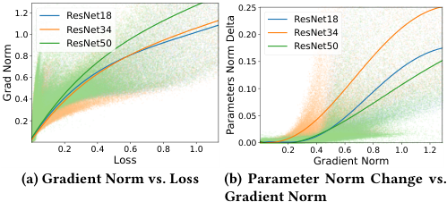

<!-- Start of picture text -->
1.2 ResNet18 0.25 ResNet18 1.0 ResNet34 0.20 ResNet34 ResNet50 ResNet50 0.8 0.15 0.6 0.10 0.4 0.2 0.05 0.00 0.2 0.4 0.6 0.8 1.0 0.2 0.4 0.6 0.8 1.0 1.2 Loss Gradient Norm (a) Gradient Norm vs. Loss (b) Parameter Norm Change vs. Gradient Norm Grad Norm Parameters Norm Delta <!-- End of picture text -->

**Figure 11: Relationship between Parameter Norm Change and Learning Loss on Random Label CIFAR-10.** 

In the experiments in Section 5, we excluded the first two task sequences for the following reasons: (1) Permuted MNIST is too simple for the ResNet-18 model, making it difficult to reflect changes in 

model plasticity; (2) The pixel permutation in Permuted CIFAR-10 disrupts the adjacent spatial structure of the images, which contradicts the prior knowledge underlying the design of Convolutional Neural Networks. 

In Figure 3b, we demonstrate the relationship between loss and changes in parameter norms, and propose that loss spikes amplify gradient magnitudes, and gradient-based optimizers convert these large gradients into large parameter updates. The relationships between loss and gradient magnitude, and between gradient magnitude and changes in parameter magnitude, are shown in Figure 11a and Figure 11b, respectively. 

## **B Experimental Baseline Hyperparameter Settings** 

All baseline methods are optimized using the Adam optimizer with a batch size of 128 and a learning rate of 10−3 . Regarding methodspecific hyperparameters: for CBP, we set the replace rate _𝜙_ = 10−4 , the decay rate _𝜂_ = 0 _._ 99, and the maturity threshold _𝑚_ = 100. For L2 Init and L2 Regularization, a weight decay of 10−2 is applied. For Shrink & Perturb, the shrinkage parameter is set to _𝜆_ = 0 _._ 6 with a noise scale of _𝜎_ = 0 _._ 01. 

## **C Supplementary Information for Resource Consumption Analysis** 

**Table 2: Relative Energy Consumption and Latency During Model Training** 

||Energy|Latency|
|---|---|---|
|Vanilla|1.000|1.000|
|PaCP|1.056|1.043|
|CBP|1.128|1.261|
|L2 Init|1.048|1.043|
|Shrink & Perturb|1.000|1.003|

For energy and latency overheads measurement on the NVIDIA Jetson TX2, we performed a 10-class classification task using 32× 32 RGB images with a batch size of 64. Energy consumption was calculated by integrating real-time power usage recorded via the jetson-stats tool. The relative training latency and energy consumption for each baseline are presented in Table 2. 

Shrink & Perturb incurs negligible overhead due to its extremely low intervention frequency during training. Since PaCP solely monitors the neuron death rate outside of the model expansion and pruning phases, its overhead remains significantly lower than that of CBP, which requires continuous intervention to reset model parameters. 

4961 

