# **A Creator-Aware Recommendation System for Content Platforms** 

Wenjing Li Jiang Rong wenjingli@sjtu.edu.cn rongjiang@xiaohongshu.com Shanghai Jiao Tong Univeristy Xiaohongshu Shanghai, China Beijing, China 

Yao Hu xiahou@xiaohongshu.com Xiaohongshu Beijing, China 

Zhenzhe Zheng zhengzhenzhe@sjtu.edu.cn Shanghai Jiao Tong University Shanghai, China 

Fan Wu fwu@cs.sjtu.edu.cn Shanghai Jiao Tong University Shanghai, China 

## **Abstract** 

_Dubai, United Arab Emirates._ ACM, New York, NY, USA, 11 pages. https: //doi.org/10.1145/3774904.3792828 

Recommender systems on major content platforms typically focus on user-side optimization, creating a “rich-get-richer” imbalance that harms creator diversity and long-term ecosystem health. To resolve the underlying supply-and-demand imbalance, we developed and deployed a creator-aware recommendation system to achieve three-player Stackelberg ecosystem equilibrium. Specifically, our framework operates on two core principles: (1) Creator Innovation, where a principled embedding model identifies and boosts novel, high-quality content, and (2) Creator Equity, where we design the sponsored content promotion marketplace as a community-first mechanism that provides fair opportunities for emerging creators. Our framework is grounded in a rigorous game-theoretic model of the three-sided stakeholder (platform, creator, user), which we formalize as a congestion game nested within a Stackelberg game to prove the existence of a stable and globally beneficial Stackelberg equilibrium. Validated in a large-scale online experiment, our framework confirmed a non-zero-sum outcome, driving a +2.16% increase in high-effort content from creators and a +1.04% lift in the video “good rate” from users. These gains were achieved alongside measurable improvements in content diversity, creator retention, and platform financial viability. 

## **1 Introduction** 

Content platforms like Facebook [12], TikTok [7], and YouTube [37] have grown rapidly, creating a dynamic ecosystem with billions of users. This ecosystem is comprised of creators who generate a stream of content (supply) and users who consume it (demand). The platform enables the supply and demand matching by deploying a recommendation system acting as the critical intermediary that governs this matching between the content and user . By controlling the recommended content, the platfroms facilitates a powerful feedback loop: user engagement—such as watch time, likes, and comments—is aggregated into motivating metrics for creators. This feedback directly influences the psychology and output of creators, shaping the future of the content supply, and then further influence user experience. Consequently, the recommendation system is not merely a passive delivery tool but the primary force that actively architects the ecosystem, shaping both the user experience and creator behavior. 

However, existing recommendation systems are predominantly and myopically optimized for user-side experience, an approach that fosters a problematic content ecosystem by missing key considerations for the creators and content platform health. This narrow focus creates a “rich-get-richer” dynamic where the platform becomes saturated with similar, low-quality, or “utility-deficient” content1 , while innovative, high-effort work from innovative and new creators is systematically suppressed. This stifles content diversity and creates a critical supply-demand imbalance. On the demand side, users face a monotonous experience and content fatigue [32, 33]. On the supply side, emerging creators are starved of feedback and visibility, leading to high rates of attrition. Ultimately, these recommendation systems are missing a holistic, multi-stakeholder perspective essential for the long-term vitality of the entire content platforms. 

## **CCS Concepts** 

• **Information systems** → **Recommender systems** ; • **Theory of computation** → **Algorithmic game theory** ; • **Human-centered computing** → **Collaborative content creation** ; **Social recommendation** . 

## **Keywords** 

Recommendation Systems, Creator Economy, Online Content Platforms 

### **ACM Reference Format:** 

Wenjing Li, Jiang Rong, Yao Hu, Zhenzhe Zheng, and Fan Wu. 2026. A Creator-Aware Recommendation System for Content Platforms. In _Proceedings of the ACM Web Conference 2026 (WWW ’26), April 13–17, 2026,_ 

Our research introduces a creator-aware recommendation system to resolve this supply-demand imbalance and architect a healthier content ecosystem by intervening at the discovery and distribution stages, which serves as the core innovation within a content platform that also maintains a robust user-side recommendation 

This work is licensed under a Creative Commons Attribution 4.0 International License. _WWW ’26, Dubai, United Arab Emirates._ 

> 1Content is defined as _utility-deficient_ if it has not yet accumulated sufficient user engagement signals (e.g., views, likes, shares) to be surfaced by traditional recommenders, often due to its novelty or origination from a new creator, rather than an inherent lack of quality or potential value. 

© 2026 Copyright held by the owner/author(s). ACM ISBN 979-8-4007-2307-0/2026/04 https://doi.org/10.1145/3774904.3792828 

8274 

WWW ’26, April 13–17, 2026, Dubai, United Arab Emirates. 

Wenjing Li, Jiang Rong, Yao Hu, Zhenzhe Zheng, and Fan Wu 

engine. First, to address creator innovation ability, we develop a principled embedding model to systematically measure and identify novel, high-quality content that might otherwise be overlooked, especially for new creators. Second, and more central to our work, we formalize the concept of _creator equity_ . Creator equity is the principle that a creator should receive a fair and comprehensive return from a platform for the value they contribute. This return includes not just financial payment, but also crucial opportunities for visibility, audience growth, and community engagement. Ultimately, it means architecting a fair system where all creators have a genuine chance to succeed based on the quality of their work, not just their prior popularity. To foster creator equity, we design the platform’s content promotion mechanism to ensure the identified content receives the crucial initial exposure it needs to thrive. By first measuring innovation at the discovery phase and then engineering for equity at the distribution phase, these two components work in concert to systematically reward the content with high-effort, thus promoting supply-side diversity and build a more sustainable creator economy. 

The theoretical foundations of our framework are grounded in a multi-layered game-theoretic analysis that validates its equilibrium properties. Recognizing that a stable creator equilibrium is foundational to the long-term health of content platforms, we first formalize the creator-side competition for limited exposure opportunity as a congestion game, proving the existence of a Nash equilibrium. Subsequently, we model the strategic interplay among the platform, creators, and users as a hierarchical Stackelberg game. By proving the existence of a Stackelberg equilibrium, we demonstrate that the platform, acting as a strategic leader, can implement policies that steer the entire content ecosystem toward a state of stable, long-term health. This provides a rigorous formal basis for the claim that creator-centric policies are not a zero-sum trade-off but a mechanism for achieving a globally beneficial market equilibrium. 

To empirically validate our creator-aware recommendation paradigm, we conducted a large-scale, user-creator online experiment for one of the most representative content platform, Xiaohongshu, in China. This test evaluated our integrated framework, which synergistically combines the Creator Innovation Module with the Equitable Content Promotion mechanism. The results are conclusive, providing strong evidence for our central thesis of a non-zero-sum outcome. Our framework stimulated a +2.16% increase in highquality content creation, which in turn delivered a superior user experience, evidenced by a +1.04% lift in the video “good rate”. Crucially, these gains were achieved alongside a +0.02% increase in the platform’s Retention Rate, confirming financial viability. These findings break the zero-sum assumption of traditional recommenders, proving that architecting for a balanced ecosystem is the most effective path toward achieving a globally beneficial equilibrium for creators, users, and the platform alike. 

This work presents a complete, theoretically-grounded, and empirically validated recommendation system that shifts the paradigm from myopic user-side optimization to holistic ecosystem management. Our main contributions are summarized as follows: 

- We introduce a novel creator-aware recommendation system designed to correct the supply-demand imbalance endemic to traditional platforms. Our approach achieves ecosystem 

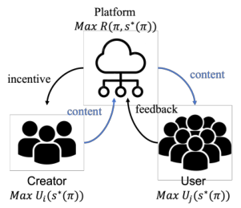

**Figure 1: A Stackelberg game model of the user interaction loop where the platform (Leader) influences users and creators (Followers). The figure labels the optimization objective for all three parties, corresponding to the formal utility functions defined in Section 5. Our framework balances to achieve a stable Stackelberg equilibrium.** 

equilibrium by simultaneously addressing creator innovation and creator equity, a dual objective that user-side recommendation systems neglect. 

- We address the challenge of formally modeling the threesided market by developing a multi-layered theoretical framework. We first model creator-side competition as a congestion game and then embed this within a hierarchical Stackelberg game to capture the interplay between the platform, creators, and users. This provides the first rigorous theoretical proof that a stable, globally beneficial equilibrium is achievable through creator-aware platform policy. 

- We deploy and validate our framework in a large-scale, creatordiverted online experiment, providing conclusive evidence of a non-zero-sum outcome that benefits all stakeholders: creators (+2.16% in high-quality content), users (+1.04% in content good rate), and the platform (+0.02% in Shutiao Retention Rate). 

## **2 A Two-Stage Framework: From Identifying Innovation to Engineering Equity** 

To engineer a healthier ecosystem, our framework intervenes at two critical stages of the content lifecycle: _discovery_ and _distribution_ . First, we develop a principled embedding model capable of identifying innovative, high-quality content that might otherwise be overlooked. Second, we redesign the platform’s paid promotion marketplace (“Shutiao” ) to serve as a mechanism for building creator equity, strategically allocating the initial exposure that innovative content needs to find an audience. These two components work in concert to systematically reward innovation and foster creator equity. 

## **2.1 Discovering Innovation with a Principled Embedding Model** 

To measure innovation, we first construct high-quality item embeddings that form a rich semantic representation of platform content. These embeddings are learned via a two-tower architecture, in which one tower encodes multimodal content features (video frames, audio, and text) and the other encodes user interaction 

8275 

WWW ’26, April 13–17, 2026, Dubai, United Arab Emirates. 

A Creator-Aware Recommendation System for Content Platforms 

histories. The model is trained offline using a contrastive loss that pulls embeddings of co-interacted user–item pairs together while pushing apart non-interacted pairs, following a two-stage pipeline: large-scale pretraining on historical interaction data and captionguided fine-tuning to align multimodal semantics. The resulting embeddings achieve strong retrieval and representation quality, with a Recall@10 of 90.91% on item-to-item retrieval and 63.98% accuracy in linear-probe category prediction, indicating that the embedding space reliably captures semantic similarity and content structure and provides a stable foundation for measuring innovation and novelty. 

There are two essential geometric properties related to fostering innovation in our embedding space: high agglomeration, where similar items are tightly clustered, and high dispersion, where dissimilar items are well separated. To quantify these properties, we use human-defined item categories as a ground-truth proxy and introduce two complementary metrics. First, agglomeration measures the average intra-category similarity, where a higher score indicates better local structure. 

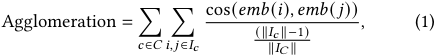

where _𝐼𝑐_ represents all items in a category. In this formula, the each three terms in ∥ _𝐼𝑐_ ∥(∥1 _𝐼𝑐_ ∥−1)× ∥_𝐼𝑐_∥× ∥ _𝐼𝐶_ <u>1</u> ∥represents the number of pairs per class, the weight per class, and the overall weight of all classes, respectively. This calculation yields a “weighted” intra-class aggregation metricm encouraging tight clustering of similar content. Second, dispersion captures inter-class novelty by penalizing excessive similarity across categories. Together, these two forces balance semantic fidelity and innovation, preventing both content collapse and semantic fragmentation, 

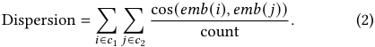

This principled evaluation framework provides a quantitative measure of “innovation”. By identifying content with high predicted engagement that is also semantically distant from its category centroid, we can systematically discover novel content that deserves attention. These two dimensions are synthesized into a single content innovation embedding score for each content item, which serves as the core signal for the interventions in our online experiment. 

## **2.2 Engineering Equity with a Community-First Marketplace** 

However, identifying innovative content is a necessary but insufficient step. In a competitive ecosystem dominated by established creators, even the most novel content will fail without initial visibility. To bridge this gap, we redesign the "Shutiao" marketplace, transforming it from a pure commercial advertisement into a mechanism that fosters _creator equity_ . 

The old commercial advertisement system uses a Generalized Second-Price (GSP) auction, ranking ads by expected revenue ( _𝑒𝑐𝑝𝑚_ = _𝑐𝑡𝑟_ · _𝑐𝑣𝑟_ · _𝑏𝑖𝑑_ ). This model inherently creates a rich-get-richer feedback loop. New entrants with no performance history (low _𝑐𝑡𝑟_ / _𝑐𝑣𝑟_ ) are systematically outbid, regardless of their content’s quality, starving them of the crucial early exposure needed to build an audience. 

Our solution migrates Shutiao to a **Community-Based Distribution Mechanism** that institutes **procedural fairness** . This approach ensures a more level playing field where a creator’s budget is not the sole determinant of success. We treat sponsored content not as a disruptive ad, but as boosted native content with intrinsic value. The ranking score for a promoted item directly integrates its organic community value ( _𝑟𝑠_ ) with its commercial bid: 

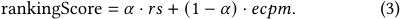

By giving significant weight ( _𝛼_ ) to the intrinsic quality and novelty of the content ( _𝑟𝑠_ ), our system ensures that emerging creators with high-quality work can effectively compete for exposure against established players with larger budgets. The weighting parameter _𝛼_ in Eq. (3) is selected via online Bayesian Optimization, targeting a joint objective that balances creator effort, user engagement, and platform revenue. This adaptive tuning allows the system to respond to evolving ecosystem dynamics while maintaining stability. This formula directly injects our goal of promoting innovation into the marketplace logic, allowing an excellent, novel post with a modest bid to fairly outrank a mediocre but well-funded post. This directly mitigates the cold-start penalty inherent in the old model. 

The principle of fairness is also embedded in our redesigned payment rule: 

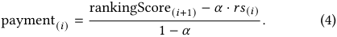

Under this model, a creator is charged only for the **incremental value** the promotion delivers beyond their organic rank. This is fundamentally fairer than a standard GSP auction, as it ensures creators do not pay for visibility their content would have earned on its own merits. It aligns the cost of promotion directly with the value it generates, fostering trust and encouraging participation from a broader range of creators. 

By using Shutiao to reallocate exposure based on both merit and budget, we transform it from a simple revenue tool into a strategic lever for fostering a more inclusive and innovative ecosystem. 

## **3 A Game-Theoretic Model of the Platform Ecosystem** 

To provide a formal foundation for our proposed creator-aware system, we model the platform’s content ecosystem as a multiparty game. This framework allows us to define the key players, their individual objectives, and the strategic interactions that shape the overall dynamics. By formalizing these concepts, we can rigorously analyze and address the real-world challenges of content convergence and creator equity. 

## **3.1 Players and Objective Functions** 

In our model, the Supply and Producers are the creators, represented by the set _𝐼_ = {1 _, . . . ,𝑛_ }. Each creator is an independent player who makes strategic decisions to maximize their personal gain. The strategy of each creator _𝑖_ is a two-part decision: selecting a content category, _𝑘𝑖_ ∈ _𝐾_ , and choosing an effort level, _𝐸𝑖_ ∈[0 _, 𝐸_¯ ], where _𝐸_¯ is a practical upper bound. In our system, the abstract concept of effort, _𝐸𝑖_ , is a function of observable signals, such as content quality (proxied by early engagement metrics like effective view rate), novelty score (derived from embedding distance), and 

8276 

WWW ’26, April 13–17, 2026, Dubai, United Arab Emirates. 

Wenjing Li, Jiang Rong, Yao Hu, Zhenzhe Zheng, and Fan Wu 

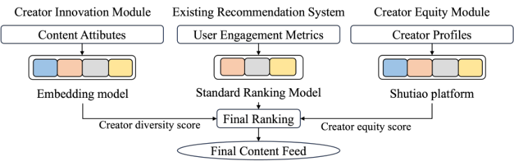

**Figure 2: Architecture of the creator-aware recommendation framework. User requests are processed by the standard retrieveand-rank pipeline. Our framework intervenes at two key points: (1) The Creator Innovation Module identifies novel content post-retrieval and applies a score boost. (2) The Equitable "Shutiao" Promotion mechanism uses a community-first ranking formula to blend sponsored content fairly into the final ranking stage.** 

production value (inferred from content features like resolution or editing complexity). The set of all possible categories, _𝐾_ , is assumed to be finite. The combined choices of all creators form a strategy profile, _𝑠_ = ( _𝑠_ 1 _, . . . ,𝑠𝑛_ ), which dictates the state of the entire content ecosystem. 

The core of our model lies in the distinct objective functions of the three main parties: creators, users, and the platform itself. Each player seeks to maximize their own utility, creating a multifaceted game of strategic interactions that we analyze to understand equilibrium and stability. 

Each creator _𝑖_ acts as a rational agent, choosing their effort level _𝐸𝑖_ to maximize their personal utility, _𝑈𝑖_ . We define this utility as the creator’s tangible equity or asset on the platform. This function is designed to mirror the real-world trade-offs creators face, balancing private benefits from their work, personal costs, and the competitive pressure of a crowded content category. The private benefit, _𝐵𝑖_ ( _𝐸𝑖_ ), is an increasing and concave function of their effort, capturing the diminishing returns of investment. The cost of effort, _𝐶𝑖_ ( _𝐸𝑖_ ), is a convex function, reflecting the increasing difficulty of sustaining high output. Finally, the congestion cost, _𝐺_ ( _𝜃𝑘𝑖_ ( _𝑠_ )), represents the negative externality of competing in a popular category, where the total effort from all creators in that category, _𝜃𝑘𝑖_ ( _𝑠_ ), makes it harder to gain visibility. Thus, we have the utility for creator: 

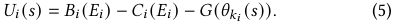

On the other side of the market, the Demand and Consumer, or users, seek to maximize their satisfaction from consuming content. A user’s utility, _𝑈 𝑗_ , is the total satisfaction derived from all content available to them. We select a logarithmic form, ln �1 +� _𝑖_ ∈ _𝐼 𝑗__𝑒_ _𝑖𝑗_ �, as it elegantly captures the well-documented phenomenon of diminishing marginal utility, where each additional piece of content provides progressively less satisfaction. The engagement _𝑒𝑖𝑗_ is assumed to be a continuous function of creator strategies and platform parameters. The utility for consumer is: 

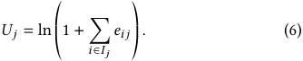

The platform acts as the central orchestrator, with the objective of maximizing total revenue, _𝑅_ , which is directly tied to total user engagement. This function highlights the platform’s dependence on the collective behavior of its users and creators. The platform’s 

strategic power lies in its ability to set the "rules of the game" by manipulating parameters and algorithms that influence creator and user behavior. Based on this, the platform’s revenue is formulated as: _𝑅_ = _𝑚_ ·� _𝑖,𝑗__𝑒_ _𝑖𝑗_. 

## **3.2 Exposure and Congestion Game** 

In a platform ecosystem governed by a recommender system, exposure and congestion are two fundamental, interconnected dynamics. Exposure is the allocation of user impressions—a scarce resource—to a vast pool of content. It is the core mechanism by which content is discovered and creators are rewarded. 

This scarcity naturally leads to congestion, a negative externality that occurs when a disproportionate number of creators compete for limited attention within a specific category. We model this by defining the congestion in a category _𝑘_ as the aggregate effort of all creators operating within it: 

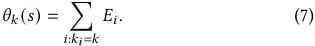

As _𝜃𝑘_ ( _𝑠_ ) increases, a creator’s visibility diminishes, leading to a palpable congestion cost, _𝐺_ ( _𝜃𝑘𝑖_ ( _𝑠_ )). This cost directly reduces a creator’s utility ( _𝑈𝑖_ ), discouraging participation in saturated areas and systematically disadvantaging new entrants. By modeling this congestion, we provide a rigorous foundation for our proposed interventions, which aim to mitigate this structural inequity and foster a more balanced ecosystem. 

## **4 Game-Theoretic Analysis: Equilibrium in the Creator Subgame** 

This section establishes that the creator-side interactions form a specific type of game known as an additive-cost congestion game [25]. This formalization is vital because it allows us to leverage well-established theorems to analyze the ecosystem’s stability. The game is defined by the following key conditions: 

- (1) **Continuity and Compactness** : The creator strategy space _𝑆𝑖_ = _𝐾_ × [0 _, 𝐸_¯ ] is a product of a finite set and a compact interval, making the overall strategy space _𝑆_ =� _𝑖_ ∈ _𝐼__𝑆_ _𝑖_compact. Creator benefit _𝐵𝑖_ , cost _𝐶𝑖_ , and the congestion cost _𝐺_ are all assumed to be continuous functions. 

- (2) **Exact Potential Game** : The game is an _exact potential game_ [22] because there exists a potential function Φ( _𝑠_ ) such that 

8277 

WWW ’26, April 13–17, 2026, Dubai, United Arab Emirates. 

A Creator-Aware Recommendation System for Content Platforms 

for any player _𝑖_ and unilateral deviation _𝑠𝑖_′, the change in player _𝑖_ ’s utility is exactly equal to the change in the potential function: 

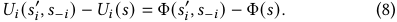

This structure is incredibly useful, as the global maxima of the potential function correspond to the game’s Nash equilibria. We can therefore define this function to analyze the system’s properties. 

Theorem 4.1. _The game admits the (exact) potential_ 

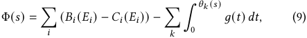

_which satisfies the exact potential property._ 

With the game’s structure formally defined, we can now establish its stability. The first critical question is whether a stable state can even exist in this competitive environment. The following theorem confirms that the creator ecosystem is not chaotic and that an equilibrium is guaranteed. 

Theorem 4.2. _Under the assumptions of continuity and compactness, a pure-strategy Nash equilibrium exists. The proof is detailed in the Appendix._ 

While the existence of an equilibrium is essential, its utility for platform governance depends on its predictability. If multiple Nash equilibria existed, the ecosystem could settle into any one of them, making the outcome of platform policies uncertain. Therefore, we establish a stronger condition: uniqueness. 

Theorem 4.3. _If we also assume that for each creator 𝑖, the private benefit function 𝐵𝑖 is strictly concave and the cost function 𝐶𝑖 is strictly convex, then the Nash equilibrium is unique. See the Appendix for a full proof._ 

Finally, a unique, stable equilibrium is only practically meaningful if the system can naturally reach it over time. We model the dynamic behavior of creators as a "best-response" process, where they iteratively adjust their strategies to improve their utility. The following theorem proves that this natural adaptation process is guaranteed to converge, confirming that our model describes a robust, self-stabilizing system. 

Theorem 4.4. _Under the assumptions of continuity, compactness, and strict concavity, best-response dynamics converge to the unique Nash equilibrium. The full proof is provided in the Appendix._ 

## **5 Platform Optimization as a Stackelberg Game** 

Having established the creator subgame’s stability, we now model the entire ecosystem’s strategic interactions using a Stackelberg game [13]. In this hierarchical model, the platform acts as the leader, setting the "rules of the game" by choosing a strategic policy, _𝜋_ . Creators act as followers, observing this policy and responding accordingly. 

The platform’s policy vector _𝜋_ is not abstract but corresponds to concrete system levers. Specifically, it consists of two key components: (1) the boost multiplier for novel content identified by our Creator Innovation Module, and (2) the weighting parameter _𝛼_ in our Equitable Shutiao ranking formula, which balances organic 

value against commercial bids. By adjusting these levers, the platform strategically shapes creator incentives to guide the ecosystem toward a desirable equilibrium. 

The game’s solution is found through backward induction. First, the creators (followers) play the congestion subgame described previously, taking the platform’s parameters _𝜋_ as given. Because this subgame has a unique Nash equilibrium, their collective response _𝑠_∗ ( _𝜋_ ) is predictable. 

Second, the platform (leader), anticipating this response, chooses its parameters _𝜋_ to maximize its own revenue. This reduces the platform’s complex problem to a tractable optimization task: 

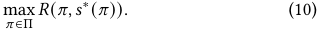

This two-stage optimization guarantees a stable state for the entire three-player ecosystem. The following theorem formalizes the existence of this solution. 

Theorem 5.1. _If the set of platform parameters_ Π _is compact and the platform’s revenue 𝑅_ ( _𝜋,𝑠_ ) _is continuous, then there exists an optimal set of parameters 𝜋_∗ ∈ Π _such that the resulting strategy profile_ ( _𝜋_∗ _,𝑠_∗ ( _𝜋_∗ )) _is a Stackelberg equilibrium. A complete proof is provided in the Appendix._ 

## **6 Experiment Design** 

A central contribution of this work is modeling strategic creator adaptation, which cannot be reliably evaluated through offline log replay. Creator behavior evolves over multi-week horizons in response to exposure, feedback, and perceived opportunity, whereas offline counterfactual methods treat creators as static content generators and therefore fail to capture equilibrium shifts in effort allocation, category choice, and persistence. Consequently, offline evaluation is insufficient for validating the dynamic congestion and Stackelberg equilibria underlying our theoretical model. To address this limitation, we conduct a rigorous online evaluation using a creator-diverted A/B testing methodology, implementing a twostage experiment to separately validate the Creator Innovation and Creator Equity modules. We hypothesize that these interventions improve creator outcomes, content diversity, and platform revenue without degrading core user-satisfaction metrics. 

## **6.1 Data and Methodology** 

We executed a large-scale creator-diverted A/B experiment, a methodology essential for directly measuring the causal impact of our framework on creator behavior. A traditional user-diverted test would be ineffective, as treatment effects on the content supply pool would be heavily diluted and statistically difficult to detect. By randomizing at the creator level, we robustly measure the shift in creator strategy. We use a Level-1 taxonomy to broaden sampling ensuring robustness; semantic embeddings recover fine-grained distinctions. 

Our target population was a 2% sample of active creators, drawn proportionally from the high-velocity food and entertainment categories to achieve statistical significance rapidly. This sample was further stratified by creator tenure, posting frequency, and innovation level to ensure our findings are generalizable across key creator segments. 

For the purpose of our analysis, creators are defined as: 

8278 

WWW ’26, April 13–17, 2026, Dubai, United Arab Emirates. 

Wenjing Li, Jiang Rong, Yao Hu, Zhenzhe Zheng, and Fan Wu 

**Table 1: Impact of the Integrated Framework on Creator-Centric Metrics.** 

|**Metric**|**Relative Change (%)**|**95% Conf.Interval**|**p-value**|
|---|---|---|---|
|Daily Active Creator|**+0.11%**|[+0.04%, +0.17%]|0.000195|
|Daily Created Posts|**+0.18%**|[+0.04%, +0.31%]|0.01096|
|Effective Daily Created Posts|**+0.16%**|[+0.003%, +0.32%]|0.04644|
|Effective Daily Created Long Posts|**+2.16%**|[+0.50%, +3.82%]|0.01095|
|Content Exposure in 30 min|**+1.83%**|[+1.53%, +2.14%]|0|
|Content Exposure in 2 days|**+0.15%**|[+0.02%, +0.27%]|0.029|
|Content Exposure in 7 days|**+0.22%**|[+0.10%, +0.33%]|0.0002|

- **New Creators** : Creators that published their first content within the last 30 days. 

- **Established Creators** : Creators with a tenure exceeding three months and a consistent history of publishing and user engagement. 

- **Active Creators** : Creators defined by a recent publishing volume of three or more contents within the last seven-day period. 

- **Innovative Creators** : Creators for whom more than half of their published content surpasses the platform-wide average innovation diversity score. 

This stratified sampling ensures our experiment captures the impact of our interventions on the creators most likely to benefit, particularly new entrants facing discoverability challenges. 

_6.1.1 Stage 1: Validating the Creator Innovation Module._ This stage tests our hypothesis that a targeted exposure boost for novel, highquality content can improve content diversity. The mechanism is designed to identify and promote content that is both unique and shows early signs of user resonance. 

All creators in the sample will be randomly assigned to a control group (A) or an experimental group (B). 

- **Control Group (A)** : Creators’ content is distributed via the existing, purely user-side recommendation system. 

- **Experimental Group (B)** : Creators’ content is subject to our Creator Innovation Module, which operates as follows: 

The Creator Innovation Module operates by first quantifying a content’s novelty upon upload. This is achieved by calculating its ‘innovation_diversity‘ score, defined as the L2 norm of the difference between the content’s embedding and the average embedding for its sector, where a higher score indicates greater uniqueness: 

innovation_diversity = ||content_sector_average_embedding_score 

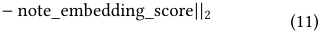

Subsequently, the system identifies promising content by assessing both this novelty score and its initial quality, which is proxied by early user interaction signals like the effective view rate and like rate. Content that scores highly on both dimensions receives a temporary exposure boost. This is implemented as a multiplicative factor applied to the item’s ranking score, with the boost’s magnitude being proportional to the novelty score to ensure that more innovative content receives a proportionally larger benefit. 

_6.1.2 Stage 2: Measuring the Impact of Equitable Promotion (Shutiao)._ This stage tests our hypothesis that a fairer allocation of the "Shutiao" 

promotional budget can improve outcomes for new creators and increase overall platform revenue. 

The subset of creators within our sample who purchase Shutiao will be randomly assigned to a control group (C) or an experimental group (D). 

- **Control Group (C)** : established creators who do not receive extra boosts while purchasing Shutiao. 

- **Experimental Group (D)** : new creator who receive boosts while purchasing Shutiao. The system reallocates the fixed exposure budget based on this fairer ranking, maximizing the impact for new entrants. 

## **6.2 Hypothesis** 

Based on our creator-aware framework and the two-stage experimental design, we formulate three primary hypotheses to test our central thesis. These hypotheses are designed to measure the framework’s impact across all three key stakeholders—creators, users, and the platform—to empirically validate our claim of a non-zerosum, globally beneficial equilibrium. Specifically, we predict that our interventions will not only reinvigorate the content supply side but also enhance the user experience and prove financially sustainable for the platform. 

Our hypotheses are as follows: 

- **H1** : The innovation and equity promotion module (Group B and Group D) will significantly increase creator-centric metrics, such as daily active creator, effective daily created long posts, and content exposure for novel content compared to the baseline (Group A and Group C). 

- **H2** : User-side guardrail metrics for Group B and Group D will show no significant decline. 

- **H3** : The improved efficiency of Shutiao for new creators (Group D) will lead to an increase in the number of new creators purchasing the promotion, thereby increasing overall Platform Shutiao Revenue. 

## **7 Experimemt Evaluation** 

To contextualize our findings, it is crucial to consider that on a platform serving hundreds of millions of users, any relative change greater than 0.1% is considered highly significant. Accordingly, all results presented in this paper have been validated for statistical significance against the entire platform’s data. 

The results of our large-scale, 30-day online experiment provide compelling validation for our central thesis: that a creator-aware framework can resolve the fundamental supply-demand imbalance 

8279 

WWW ’26, April 13–17, 2026, Dubai, United Arab Emirates. 

A Creator-Aware Recommendation System for Content Platforms 

**Table 2: Impact of the Integrated Framework on User-Centric Metrics.** 

|**Metric**|**Relative Change (%)**|**95% Conf. Interval**|**p-value**|
|---|---|---|---|
|First Page CTR|+0.17%|[+0.08%, +0.26%]|0.0002|
|Video Content View Time|+0.2%|[-0.3%, +0.7%]|n.s.|
|Video Content Good Rate|+1.0374%|[+0.03%, +2.05%]|0.0445|
|Video Content Interaction Rate|+0.4%|[-0.2%, +1.0%]|n.s.|
|Feed Page Exposure|+0.24%|[+0.19%, +0.30%]|0|
|Feed Page CTR|+0.24%|[0.12%, +0.36%]|0.0001|
|Content Diversity|**+0.08%**|[+0.07%, +0.09%]|0|
|tax1click|**+0.12%**|[+0.06%, +0.19%]|0.0002|
|tax2click|**+0.12%**|[+0.04%, +0.20%]|0.0025|

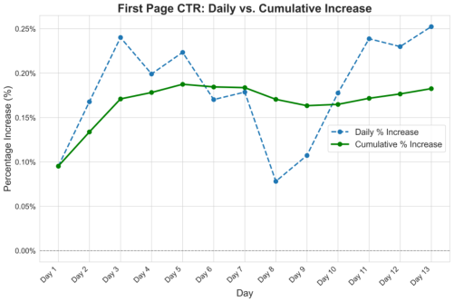

**Figure 3: A comparison of the daily and cumulative relative lift in first-page CTR over a 30-day online experiment. The cumulative curve demonstrates stable, sustained gains despite daily volatility.** 

plaguing modern content platforms. By moving beyond myopic, user-side optimization and instead intervening at the key leverage points of content innovation and creator equity, our approach successfully engineers a healthier ecosystem. The data demonstrates that a reinvigorated and more diverse supply side does not require a trade-off in user satisfaction. On the contrary, it is the very mechanism that fosters a more engaged user base, confirming that creator-centric policies are a powerful tool for achieving the globally beneficial, non-zero-sum equilibrium our theoretical model predicts. 

## **7.1 Creator-Centric Outcomes: Reinvigorating the Supply Side** 

The framework’s primary impact is on content supply health, directly mitigating the rich-get-richer dynamics and creator attrition described in the introduction. Results in Table 1 validate our first hypothesis (H1), showing a qualitative shift in creation behavior induced by the Innovation Module. 

This effect originates from a key upstream intervention: an immediate +1.83% increase in content exposure within the first 30 minutes. This early visibility enables novel content to escape algorithmic suppression and reach an audience, and it persists over time, yielding exposure gains of +0.15% after 2 days and +0.22% after 

7 days. By ensuring fair initial exposure, the framework creates strong incentives for creators to invest greater effort. 

Creators respond decisively to this incentive. The strongest signal is a highly significant +2.16% increase in Effective Daily Created Long Posts, indicating a shift toward higher-effort, higher-value content and countering the proliferation of utility-deficient production. This improvement is corroborated by a +0.16% lift in overall Effective Daily Created Posts. These quality gains translate into a healthier creator ecosystem, with +0.11% growth in Daily Active Creators and a +0.18% increase in total Daily Created Posts. The growth trajectory in Figure 4 shows accelerating creator participation; despite minor volatility, partly due to a public holiday, the positive trend remains robust, indicating a self-reinforcing cycle of engagement and retention. 

## **7.2 User-Centric Outcomes: Validating the Non-Zero-Sum Hypothesis** 

Our user-side results, detailed in Table 2, offer a powerful refutation of the zero-sum assumption. Not only were our guardrail hypotheses (H2) met, but the creator-centric improvements led to a statistically significant enhancement of the user experience. 

The most telling metric is the +1.04% increase in the Video Content Good Rate, a metric capturing a high-conviction signal of user satisfaction distinct from more common engagements. This proves that the novel content surfaced by our system was perceived as better by users. This directly addresses the "content fatigue" problem by improving supply quality. Furthermore, we see a clear remedy for the "monotonous experience," with a +0.08% lift in Content Diversity and corresponding +0.12% increases in topic exploration (tax1click and tax2click). This newfound diversity was actively compelling, driving a +0.24% lift in Feed Page Exposure which led to significant increases in both First Page CTR (+0.17%) and Feed Page CTR (+0.24%). The fact that these gains were achieved while core metrics like Video Content View Time and the overall Video Content Interaction Rate remained statistically neutral confirms we improved the ecosystem without negative trade-offs, validating our non-zero-sum thesis. 

## **7.3 Platform-Level Impact: Engineering Equity and Long-Term Stability** 

The platform-level results in Table 3 confirm our third hypothesis (H3) and the framework’s ability to engineer a more equitable and 

8280 

WWW ’26, April 13–17, 2026, Dubai, United Arab Emirates. 

Wenjing Li, Jiang Rong, Yao Hu, Zhenzhe Zheng, and Fan Wu 

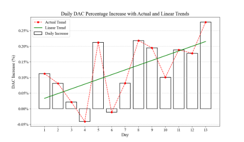

**Figure 4: This chart shows the daily percentage increase in DAC over the 30-day experiment. The sustained positive trend indicates accelerating creator participation and retention.** 

sustainable ecosystem, aligning with our game-theoretic model of the platform as a "strategic leader." By operationalizing creator equity via the redesigned "Shutiao" mechanism, we increased both creator utility and platform viability. Although the aggregate lift 

**Table 3: Impact of the Integrated Framework on PlatformLevel Metrics (specific absolute values are confidential).** 

|**Metric**|**Value**|
|---|---|
|Shutiao Retention Rate (Relative Change)|**+0.02%**|
|15-Day New User Retention (Absolute)|Greater than 50%|

in Shutiao Retention Rate is modest (+0.02%), it confirms the financial sustainability of the fairer system and supports H3. More importantly, this aggregate measure masks a pronounced effect on talent formation: the framework converts new participants into a highly retained cohort, a key indicator of long-term ecosystem health. This creator-side improvement reinforces user engagement, producing a stickier platform, as evidenced by a 15-day new user retention rate exceeding 50%. Together, these outcomes empirically validate the stable Stackelberg equilibrium predicted by our theory, in which platform-led policies yield a globally beneficial result. 

Post-deployment analysis further indicates that creators with fewer than 1,000 followers receive approximately 20% higher exposure and achieve a 19.74% higher CTR than creators with roughly 100k followers. This demonstrates that the system prioritizes highpotential content rather than merely redistributing traffic, providing concrete evidence of improved allocative efficiency alongside enhanced creator equity. 

be directly observed in a live system, stabilization of core creator and user metrics serves as a strong proxy for convergence: both creator output and user engagement rise and then settle at a persistently higher baseline rather than exhibiting transient spikes (Figure 3). Over the full 30-day horizon, no regression toward baseline is observed, confirming that the gains reflect sustained behavioral change rather than short-lived exposure effects, consistent with convergence to the predicted equilibrium. 

## **8 Related Works** 

**Industry Recommendation Systems** Recommender systems connect users with content across short video [4], search [15], and e-commerce [38], typically organizing as multi-stage pipelines that progressively refine candidate sets [1, 3, 15, 24, 29, 30, 36]. A substantial body of work focuses exclusively on modeling user preferences [9, 19]. Meanwhile, the boundary between passive recommendation and active search has increasingly blurred, motivating unified frameworks such as UniSAR, which bridges search and recommendation [27, 28], and STAR, which adapts a single model across multiple domains [26]. 

**Creator-Awareness and Cold-Start Recommendation** To mitigate creator marginalization in user-centric systems, prior research addresses: (i) user–creator balance via trade-off management [16, 21, 23, 41] or matching formulations [8]; (ii) cold-start issues using content-based [4, 11, 35] or transfer learning approaches [2, 6, 10, 18, 20, 40] validated for fair exposure [5]; and (iii) game-theoretic modeling of competition [14] and incentives [17, 31, 34, 39]. Our work unifies these by combining innovation measurement and equitable distribution with a multi-layered game-theoretic analysis. Using congestion and Stackelberg models, we prove that creatorcentric policies steer the three-sided market toward a globally beneficial equilibrium. 

## **9 Conclusion** 

This paper challenges the user-centric paradigm by validating a creator-aware framework for the three-sided marketplace. Grounded in a Stackelberg model, it integrates innovation discovery with equitable promotion, demonstrating a non-zero-sum outcome where a +2.16% high-quality content increase improves user experience (+1.04% “good rate”) while preserving financial viability. These results show supply-side investment drives user satisfaction. Despite coverage and horizon limitations, the study offers a blueprint for holistic management, proving sustainable growth arises from aligning creator, user, and platform incentives. 

## **Acknowledgments** 

## **7.4 Experiment Summary** 

In summary, the experiment validates all three hypotheses and demonstrates a non-zero-sum outcome. Incentivizing higher-quality creator output induces a virtuous cycle that improves content diversity and user satisfaction, empirically confirming that supply-side health drives long-term ecosystem growth, with effects remaining robust to external market volatility. 

The observed dynamics align with our game-theoretic prediction of a stable equilibrium. Although a Nash equilibrium cannot 

This work was supported in part by China NSF grant No. U2268204, 62322206, 62432007, 62132018, 62025204, 62272307, 62372296, 62441236, U25A6024. in part by Fundamental and Interdisciplinary Disciplines Breakthrough Plan of the Ministry of Education of ChinaNo. JYB2025XDXM103), in part by Xiaohongshu Group. The opinions, findings, conclusions, and recommendations expressed in this paper are those of the authors and do not necessarily reflect the views of the funding agencies or the government. 

Zhenzhe Zheng is the corresponding author. 

8281 

WWW ’26, April 13–17, 2026, Dubai, United Arab Emirates. 

A Creator-Aware Recommendation System for Content Platforms 

## **References** 

- [1] Avinandan Bose, Mihaela Curmei, Daniel L. Jiang, Jamie Morgenstern, Sarah Dean, Lillian J. Ratliff, and Maryam Fazel. [n. d.]. Initializing Services in Interactive ML Systems for Diverse Users. In _Advances in Neural Information Processing Systems_ . 57701–57732. 

- [2] Jiangxia Cao, Jiawei Sheng, Xin Cong, Tingwen Liu, and Bin Wang. 2022. CrossDomain Recommendation to Cold-Start Users via Variational Information Bottleneck. In _2022 IEEE 38th International Conference on Data Engineering_ . 2209–2223. 

- [3] Gaode Chen, Yuezihan Jiang, Rui Huang, Kuo Cai, Yunze Luo, Ruina Sun, Qi Zhang, Han Li, and Kun Gai. 2024. Missing Interest Modeling with Lifelong User Behavior Data for Retrieval Recommendation. In _Proceedings of the 33rd ACM International Conference on Information and Knowledge Management_ . 4390–4396. 

- [4] Gaode Chen, Ruina Sun, Yuezihan Jiang, Jiangxia Cao, Qi Zhang, Jingjian Lin, Han Li, Kun Gai, and Xinghua Zhang. 2024. A Multi-modal Modeling Framework for Cold-start Short-video Recommendation. In _Proceedings of the 18th ACM Conference on Recommender Systems_ . 391–400. 

- [5] Gaode Chen, Ruina Sun, Yinjie Jiang, Tianxiang Li, Yinlong Dai, Qifan Shi, Xiaojie Qin, Jialong Fu, Piaoyi Chen, Ronggeng Huang, Na Li, Qi Zhang, Jiang Liang, Han Li, and Kun Gai. 2025. A Cold-start Recommendation System at Kuaishou Designed from the Short-video Perspective. In _Proceedings of the ACM on Web Conference 2025_ . 124–132. 

- [6] Gaode Chen, Xinghua Zhang, Yijun Su, Yantong Lai, Ji Xiang, Junbo Zhang, and Yu Zheng. 2023. Win-win: a privacy-preserving federated framework for dual-target cross-domain recommendation. In _Proceedings of the AAAI Conference on Artificial Intelligence_ . 4149–4156. 

- [7] Sijie Chen, Zhibo Liu, Zhe Liu, Wen Zeng, Jiachen Zhao, and Jin Zhang. 2022. A Unified Solution for Search and Recommendation at ByteDance. In _Proceedings of the 28th ACM SIGKDD Conference on Knowledge Discovery and Data Mining_ . 2717–2725. 

- [8] Xiaoshuang Chen, Yibo Wang, Yao Wang, Husheng Liu, Kaiqiao Zhan, Ben Wang, and Kun Gai. 2025. Creator-Side Recommender System: Challenges, Designs, and Applications. In _Proceedings of the ACM on Web Conference 2025_ . 162–170. 

- [9] Sarah Dean and Jamie Morgenstern. 2022. Preference Dynamics Under Personalized Recommendations. In _Proceedings of the 23rd ACM Conference on Economics and Computation_ . 795–816. 

- [10] Manqing Dong, Feng Yuan, Lina Yao, Xiwei Xu, and Liming Zhu. 2020. MAMO: Memory-Augmented Meta-Optimization for Cold-start Recommendation. In _Proceedings of the 26th ACM SIGKDD International Conference on Knowledge Discovery & Data Mining_ . 688–697. 

- [11] Chantat Eksombatchai, Pranav Jindal, Jerry Zitao Liu, Yuchen Liu, Rahul Sharma, Charles Sugnet, Mark Ulrich, and Jure Leskovec. 2018. Pixie: A System for Recommending 3+ Billion Items to 200+ Million Users in Real-Time. In _Proceedings of the 2018 World Wide Web Conference_ . 1775–1784. 

- [12] Ariel Evnine, Stratis Ioannidis, Dimitris Kalimeris, Shankar Kalyanaraman, Weiwei Li, Israel Nir, Wei Sun, and Udi Weinsberg. 2024. Achieving a Better Tradeoff in Multi-stage Recommender Systems through Personalization. In _Proceedings of the 30th ACM SIGKDD Conference on Knowledge Discovery and Data Mining_ . 4939–4950. 

- [13] Drew Fudenberg and Jean Tirole. 1991. _Game Theory_ . MIT Press. 

- [14] Feiran Hu and Ramesh Johari. 2022. A Game-Theoretic Model of Competition on Recommendation Platforms. In _Proceedings of the 23rd ACM Conference on Economics and Computation_ . 853–854. 

- [15] Jui-Ting Huang, Ashish Sharma, Shuying Sun, Li Xia, David Zhang, Philip Pronin, Janani Padmanabhan, Giuseppe Ottaviano, and Linjun Yang. 2020. Embeddingbased Retrieval in Facebook Search. In _Proceedings of the 26th ACM SIGKDD International Conference on Knowledge Discovery & Data Mining_ . 2553–2561. 

- [16] Daniel Huttenlocher, Hannah Li, Liang Lyu, Asuman Ozdaglar, and James Siderius. 2024. Matching of Users and Creators in Two-Sided Markets with Departures. arXiv:2401.00313 [cs.GT] 

- [17] Meena Jagadeesan, Ananthakrishnan A. Nambi, and Dinesh Kalathil. 2022. A game-theoretic analysis of the strategic incentives in the creator economy. arXiv:2210.08272 [cs.GT] 

- [18] Yuezihan Jiang, Gaode Chen, Wenhan Zhang, Jingchi Wang, Yinjie Jiang, Qi Zhang, Jingjian Lin, Peng Jiang, and Kaigui Bian. 2024. Prompt Tuning for Item Cold-start Recommendation. In _Proceedings of the 18th ACM Conference on Recommender Systems_ . 411–421. 

- [19] Dimitris Kalimeris, Smriti Bhagat, Shankar Kalyanaraman, and Udi Weinsberg. 2021. Preference Amplification in Recommender Systems. In _Proceedings of the 27th ACM SIGKDD Conference on Knowledge Discovery & Data Mining_ . 805–815. 

- [20] Genki Kusano. 2024. Data Augmentation using Reverse Prompt for Cost-Efficient Cold-Start Recommendation. In _Proceedings of the 18th ACM Conference on Recommender Systems_ . 861–865. 

- [21] Tao Lin, Kun Jin, Andrew Estornell, Xiaoying Zhang, Yiling Chen, and Yang Liu. 2025. User-creator feature polarization in recommender systems with dual influence. In _Proceedings of the 38th International Conference on Neural Information Processing Systems_ . 39 pages. 

- [22] Dov Monderer and Lloyd S. Shapley. 1996. Potential games. _Games and Economic Behavior_ 14, 1 (1996), 124–143. 

- [23] Gourab K Patro, Arpita Biswas, Niloy Ganguly, Krishna P. Gummadi, and Abhijnan Chakraborty. 2020. FairRec: Two-Sided Fairness for Personalized Recommendations in Two-Sided Platforms. In _Proceedings of The Web Conference 2020_ . 1194–1204. 

- [24] Jiarui Qin, Jiachen Zhu, Bo Chen, Zhirong Liu, Weiwen Liu, Ruiming Tang, Rui Zhang, Yong Yu, and Weinan Zhang. 2022. RankFlow: Joint Optimization of MultiStage Cascade Ranking Systems as Flows. In _Proceedings of the 45th International ACM SIGIR Conference on Research and Development in Information Retrieval_ . 814–824. 

- [25] Robert W. Rosenthal. 1973. A class of games with path-like equilibrium points. _Journal of Mathematical Economics_ 2, 1 (1973), 61–70. 

- [26] Xiang-Rong Sheng, Liqin Zhao, Guorui Zhou, Xinyao Ding, Binding Dai, Qiang Luo, Siran Yang, Jingshan Lv, Chi Zhang, Hongbo Deng, and Xiaoqiang Zhu. 2021. One Model to Serve All: Star Topology Adaptive Recommender for MultiDomain CTR Prediction. In _Proceedings of the 30th ACM International Conference on Information & Knowledge Management_ . 4104–4113. 

- [27] Teng Shi, Zihua Si, Jun Xu, Xiao Zhang, Xiaoxue Zang, Kai Zheng, Dewei Leng, Yanan Niu, and Yang Song. 2024. UniSAR: Modeling User Transition Behaviors between Search and Recommendation. In _Proceedings of the 47th International ACM SIGIR Conference on Research and Development in Information Retrieval_ . 1029–1039. 

- [28] Zihua Si, Zhongxiang Sun, Xiao Zhang, Jun Xu, Xiaoxue Zang, Yang Song, Kun Gai, and Ji-Rong Wen. 2023. When Search Meets Recommendation: Learning Disentangled Search Representation for Recommendation. In _Proceedings of the 46th International ACM SIGIR Conference on Research and Development in Information Retrieval_ . 1313–1323. 

- [29] Jiaxi Tang and Ke Wang. 2018. Ranking Distillation: Learning Compact Ranking Models With High Performance for Recommender System. In _Proceedings of the 24th ACM SIGKDD International Conference on Knowledge Discovery & Data Mining_ . 2289–2298. 

- [30] Jianping Wei, Yujie Zhou, Zhengwei Wu, and Ziqi Liu. 2024. Enhancing PreRanking Performance: Tackling Intermediary Challenges in Multi-Stage Cascading Recommendation Systems. In _Proceedings of the 30th ACM SIGKDD Conference on Knowledge Discovery and Data Mining_ . 5950–5958. 

- [31] Fan Yao, Chuanhao Li, Denis Nekipelov, Hongning Wang, and Haifeng Xu. 2023. How bad is top-K recommendation under competing content creators?. In _Proceedings of the 40th International Conference on Machine Learning_ . 39674–39701. 

- [32] Fan Yao, Chuanhao Li, Karthik Abinav Sankararaman, Yiming Liao, Yan Zhu, Qifan Wang, Hongning Wang, and Haifeng Xu. 2023. Rethinking incentives in recommender systems: are monotone rewards always beneficial?. In _ICML 2023 Workshop The Many Facets of Preference-Based Learning_ . 

- [33] Fan Yao, Yiming Liao, Jingzhou Liu, Shaoliang Nie, Qifan Wang, Haifeng Xu, and Hongning Wang. 2025. Unveiling user satisfaction and creator productivity trade-offs in recommendation platforms. In _Proceedings of the 38th International Conference on Neural Information Processing Systems_ . 27 pages. 

- [34] Fan Yao, Yiming Liao, Mingzhe Wu, Chuanhao Li, Yan Zhu, James Yang, Jingzhou Liu, Qifan Wang, Haifeng Xu, and Hongning Wang. 2024. User Welfare Optimization in Recommender Systems with Competing Content Creators. In _Proceedings of the 30th ACM SIGKDD Conference on Knowledge Discovery and Data Mining_ . 3874–3885. 

- [35] Zheng Yuan, Fajie Yuan, Yu Song, Youhua Li, Junchen Fu, Fei Yang, Yunzhu Pan, and Yongxin Ni. 2023. Where to Go Next for Recommender Systems? IDvs. Modality-based Recommender Models Revisited. In _Proceedings of the 46th International ACM SIGIR Conference on Research and Development in Information Retrieval_ . 2639–2649. 

- [36] Yuan Zhang, Xue Dong, Weijie Ding, Biao Li, Peng Jiang, and Kun Gai. 2023. Divide and Conquer: Towards Better Embedding-based Retrieval for Recommender Systems from a Multi-task Perspective. In _Proceedings of the ACM Web Conference 2023_ . 366–370. 

- [37] Zhe Zhao, Lichan Hong, Li Wei, Jilin Chen, Aniruddh Nath, Shawn Andrews, Aditee Kumthekar, Maheswaran Sathiamoorthy, Xinyang Yi, and Ed Chi. 2019. Recommending what video to watch next: a multitask ranking system. In _Proceedings of the 13th ACM Conference on Recommender Systems_ . 43–51. 

- [38] Guorui Zhou, Xiaoqiang Zhu, Chenru Song, Ying Fan, Han Zhu, Xiao Ma, Yanghui Yan, Junqi Jin, Han Li, and Kun Gai. 2018. Deep Interest Network for ClickThrough Rate Prediction. In _Proceedings of the 24th ACM SIGKDD International Conference on Knowledge Discovery & Data Mining_ . 1059–1068. 

- [39] Banghua Zhu, Sai Praneeth Karimireddy, Jiantao Jiao, and Michael I. Jordan. 2023. Online Learning in a Creator Economy. arXiv:2305.11381 [cs.GT] 

- [40] Yongchun Zhu, Ruobing Xie, Fuzhen Zhuang, Kaikai Ge, Ying Sun, Xu Zhang, Leyu Lin, and Juan Cao. 2021. Learning to Warm Up Cold Item Embeddings for Cold-start Recommendation with Meta Scaling and Shifting Networks. In _Proceedings of the 44th International ACM SIGIR Conference on Research and Development in Information Retrieval_ . 1167–1176. 

- [41] Ziwei Zhu, Jingu Kim, Trung Nguyen, Aish Fenton, and James Caverlee. 2021. Fairness among New Items in Cold Start Recommender Systems. In _Proceedings_ 

8282 

WWW ’26, April 13–17, 2026, Dubai, United Arab Emirates. 

Wenjing Li, Jiang Rong, Yao Hu, Zhenzhe Zheng, and Fan Wu 

_of the 44th International ACM SIGIR Conference on Research and Development in Information Retrieval_ . 767–776. 

## **A Appendix** 

## **A.1 Ethical Considerations and Compliance** 

All data used in this study were processed in accordance with applicable data protection regulations and the platform’s internal governance policies. User- and creator-level data were anonymized and aggregated prior to analysis. No personally identifiable information (PII) was accessed, stored, or exposed at any stage of the study. 

The online experiments were conducted under established internal review and approval procedures for production A/B testing. Interventions were limited to content exposure and ranking mechanisms and did not alter content moderation policies, user privacy settings, or creators’ control over content publication. 

The proposed framework does not restrict creator participation, suppress content, or introduce differential treatment based on sensitive attributes. Exposure adjustments are determined solely by content-level signals (e.g., novelty and early engagement) and transparent marketplace mechanisms. As such, the system is designed to mitigate, rather than exacerbate, existing “rich-get-richer” dynamics. 

Overall, the study poses minimal risk to users and creators while enabling systematic evaluation of ecosystem-level outcomes. 

## **A.2 Proof of the Exact Potential Property** 

Theorem A.1. _The game_ G _is an exact potential game with potential_ 

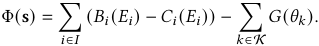

Proof. A game is an exact potential game if for any player _𝑖_ ∈ _𝐼_ and any pair of strategies _𝑠𝑖,𝑠𝑖_′∈_𝑆𝑖_,thechangeintheirutility is exactly equal to the change in the potential function. That is, _𝑈𝑖_ ( _𝑠𝑖_′_,_s−_𝑖_) −_𝑈𝑖_(_𝑠𝑖,_s−_𝑖_)= Φ(_𝑠_ _𝑖_′_,_s−_𝑖_) −Φ(_𝑠𝑖,_s−_𝑖_). Let’s fix the strategies of all players except player _𝑖_ , denoted by s− _𝑖_ , and consider a unilateral deviation by player _𝑖_ from _𝑠𝑖_ to a new strategy _𝑠𝑖_′. 

The change in player _𝑖_ ’s utility is: 

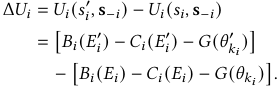

Since the private benefit _𝐵𝑖_ and the costs _𝐶𝑖_ depend only on player _𝑖_ ’s own effort, the change in these terms simplifies. The congestion term is the only one affected by the strategy of other players through the total congestion factor. 

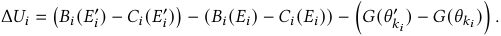

Now, let’s examine the change in the proposed potential function Φ. The change is given by: 

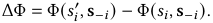

The potential function consists of two sums. The first sum,� _𝑗_ ∈ _𝐼_(_𝐵_ _𝑗_(_𝐸_ _𝑗_)− _𝐶 𝑗_ ( _𝐸 𝑗_ )), only changes for player _𝑖_ . The second sum is over the 

content categories. The only category whose congestion factor _𝜃𝑘_ changes is the category _𝑘𝑖_ to which player _𝑖_ belongs. 

ΔΦ = � _𝐵𝑖_ ( _𝐸𝑖_′) −_𝐶𝑖_(_𝐸_ _𝑖_′) � −[ _𝐵𝑖_ ( _𝐸𝑖_ ) − _𝐶𝑖_ ( _𝐸𝑖_ )] − � _𝐺_ ( _𝜃𝑘_′ _𝑖_) −_𝐺_(_𝜃𝑘_ _𝑖_) � _._ Comparing Δ _𝑈𝑖_ and ΔΦ, we see that Δ _𝑈𝑖_ = ΔΦ. This holds for any player _𝑖_ and any unilateral deviation, which proves that the game is an exact potential game. □ 

## **A.3 Proof of Existence of Pure-Strategy Nash Equilibrium** 

Theorem A.2. _Under the assumptions of continuity and compactness, a pure-strategy Nash equilibrium exists._ 

Proof. The strategy space _𝑆_ =� _𝑖_ ∈ _𝐼__𝑆_ _𝑖_isafiniteproductof compact sets, and by Tychonoff’s theorem, is also a compact set. Furthermore, we have established that the potential function Φ is continuous on _𝑆_ . By the **Weierstrass Extreme Value Theorem** , any continuous real-valued function on a non-empty compact space attains a global maximum. Therefore, there must exist at least one strategy profile s∗ ∈ _𝑆_ that globally maximizes the potential function Φ. 

We now prove that any such global maximizer s∗ is a purestrategy Nash equilibrium. A strategy profile s∗ is a Nash equilibrium if no player can unilaterally deviate to a new strategy and strictly increase their utility. In other words, for every player _𝑖_ ∈ _𝐼_ and every strategy _𝑠𝑖_′∈_𝑆𝑖_, we must have_𝑈𝑖_(_𝑠_ _𝑖_′_,_s∗ − _𝑖_)≤_𝑈𝑖_(s∗). Assume, for the sake of contradiction, that s∗ is not a Nash equilibrium. This means there exists some player _𝑖_ ∈ _𝐼_ and a strategy _𝑠𝑖_′∈_𝑆𝑖_such that_𝑈𝑖_(_𝑠_ _𝑖_′_,_s∗ − _𝑖_)_> 𝑈𝑖_(s∗). By the potential property, we know that the change in player _𝑖_ ’s utility is equal to the change in the potential function. Thus, 

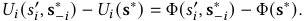

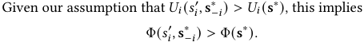

However, this contradicts our finding that s∗ is a global maximizer of the potential function, as it would mean there is a strategy profile with a higher potential value. Therefore, the assumption that s∗ is not a Nash equilibrium must be false. Hence, s∗ is a pure-strategy Nash equilibrium. □ 

## **A.4 Proof of Uniqueness** 

Theorem A.3. _If we also assume that for each creator 𝑖, the private benefit function 𝐵𝑖 is strictly concave and the cost function 𝐶𝑖 is strictly convex, then the Nash equilibrium is unique._ 

Proof. For the Nash equilibrium to be unique, the potential function Φ( _𝑠_ ) must have a unique global maximum. A sufficient condition for this is that Φ( _𝑠_ ) is strictly concave on the strategy space _𝑆_ . 

The potential function is given by: 

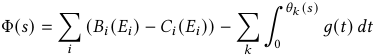

The first term,� _𝑖_(_𝐵_ _𝑖_(_𝐸_ _𝑖_) −_𝐶_ _𝑖_(_𝐸_ _𝑖_)), is a sum of functions that are strictly concave in the continuous effort variable _𝐸𝑖_ . This makes the 

8283 

WWW ’26, April 13–17, 2026, Dubai, United Arab Emirates. 

A Creator-Aware Recommendation System for Content Platforms 

entire sum strictly concave. The second term, the integral of the marginal congestion cost, is a function of the total effort within each category. As _𝐺_ is a strictly increasing convex function, its integral is also a strictly convex function. The sum of a strictly concave function and a convex function is a strictly concave function. The potential function Φ( _𝑠_ ) is therefore strictly concave with respect to the continuous effort variables. 

While the strategy space _𝑆_ =� _𝑖__𝑆_ _𝑖_is not fully convex due to the discrete category choices, the strict concavity of the potential function with respect to the continuous effort variables ensures that for any fixed set of category choices, there exists a unique effort profile that maximizes the potential. The overall potential function, a strictly concave function, has at most one global maximum. Since we have already proven that an equilibrium exists (and thus a global maximum exists), this maximum must be unique. Therefore, there exists a unique strategy profile that maximizes the potential function, which corresponds to a unique pure-strategy Nash equilibrium. □ 

## **A.5 Proof of Best-Response Dynamics** 

Theorem A.4. _Under the assumptions of continuity, compactness, and strict concavity, best-response dynamics converge to the unique Nash equilibrium._ 

- (1) **Follower Equilibrium** : For any fixed set of platform parameters _𝜋_ ∈ Π, the creators play a subgame. We have already proven that this subgame is a potential game and, under our assumptions, admits a unique pure-strategy Nash equilibrium. Let this unique equilibrium be denoted by _𝑠_∗ ( _𝜋_ ). This establishes a continuous and single-valued best-response function for the followers. 

- (2) **Leader Optimization** : The platform’s objective is to choose a parameter profile _𝜋_ to maximize its revenue, given by a function _𝑅_ ( _𝜋,𝑠_ ). The platform anticipates that creators will respond by playing their unique equilibrium strategy _𝑠_∗ ( _𝜋_ ). The platform’s optimization problem is to find: 

max _𝜋_ ∈Π_𝑅_(_𝜋,𝑠_∗(_𝜋_))_._ 

According to the theorem, the platform’s parameter space Π is compact, and the revenue function _𝑅_ ( _𝜋,𝑠_ ) is continuous. The follower’s equilibrium strategy, _𝑠_∗ ( _𝜋_ ), is a continuous function of _𝜋_ due to the strict concavity assumptions. A continuous function on a compact set attains a maximum. Therefore, the function _𝑅_ ( _𝜋,𝑠_∗ ( _𝜋_ )) is continuous and attains its maximum on the compact set Π. This proves the existence of an optimal parameter choice _𝜋_∗ ∈ Π for the platform. The pair ( _𝜋_∗ _,𝑠_∗ ( _𝜋_∗ )) constitutes a pure-strategy Stackelberg equilibrium, representing a stable state for the entire ecosystem. □ 

Proof. The dynamics of a potential game are well-understood. We can analyze the system’s behavior using best-response dynamics, where at each step, a creator chooses the strategy that maximizes their utility given the current strategies of the others. 

Let’s consider a sequence of strategy profiles { _𝑠𝑡_ } _𝑡_∞ =0generated by best-response dynamics. If a creator makes a profitable move from _𝑠𝑖,𝑡_ to _𝑠𝑖,𝑡_ +1, their utility must strictly increase. Because our game is an exact potential game, this also means the potential function must strictly increase: 

Φ( _𝑠𝑡_ +1) = Φ( _𝑠𝑖,𝑡_ +1 _,𝑠_ − _𝑖,𝑡_ ) _>_ Φ( _𝑠𝑖,𝑡 ,𝑠_ − _𝑖,𝑡_ ) = Φ( _𝑠𝑡_ ) _._ 

This holds for any profitable unilateral deviation. 

Since the potential function Φ( _𝑠_ ) is continuous on the compact set _𝑆_ , it is bounded above. The sequence of potential values, {Φ( _𝑠𝑡_ )} _𝑡_∞ =0, is strictly increasing and bounded, so it must converge. This implies that the best-response moves must eventually diminish in size, and the sequence of strategies converges to a state where no creator can make a profitable unilateral deviation. This convergence point is a local maximum of the potential function and thus a Nash equilibrium. 

As proven in the uniqueness theorem, the potential function has a unique global maximum. Therefore, best-response dynamics must converge to this unique Nash equilibrium. □ 

## **A.6 Proof of Stackelberg Equilibrium** 

Theorem A.5. _If the set of platform parameters_ Π _is compact and the platform’s revenue 𝑅_ ( _𝜋,𝑠_ ) _is continuous, then there exists an optimal set of parameters 𝜋_∗ ∈ Π _such that the resulting strategy profile_ ( _𝜋_∗ _,𝑠_∗ ( _𝜋_∗ )) _is a Stackelberg equilibrium._ 

Proof. The platform’s problem is a Stackelberg game with the platform as the leader and the creators as followers. The proof is a two-stage backward induction. 

8284 

