Proceedings of the Twenty-Eighth AAAI Conference on Artificial Intelligence 

# **A Strategy-Proof Online Auction with Time Discounting Values**_∗_ 

## **Fan Wu, Junming Liu, Zhenzhe Zheng, and Guihai Chen** 

Shanghai Key Laboratory of Scalable Computing and Systems Shanghai Jiao Tong University, China 

_{_ wu-fan, liu-jm, zhengzhenzhe, chen-gh _}_ @sjtu.edu.cn 

#### **Abstract** 

Online mechanism design has been widely applied to various practical applications. However, designing a strategy-proof online mechanism is much more challenging than that in a static scenario due to short of knowledge of future information. In this paper, we investigate online auctions with time discounting values, in contrast to the flat values studied in most of existing work. We present a strategy-proof 2-competitive online auction mechanism despite of time discounting values. We also implement our design and compare it with offline optimal solution. Our numerical results show that our design achieves good performance in terms of social welfare, revenue, average winning delay, and average valuation loss. 

## **1 Introduction** 

Online mechanism design, which is an extension of classic mechanism design to dynamic environments with multiple agents and private information, has been widely applied to various practical applications, _e.g._ , pricing WiFi access at Starbucks (Friedman and Parkes 2003), cloud resource allocation (Lin, Lin, and Wei 2010), and online advertising (Lahaie, Parkes, and Pennock 2008; Muthukrishnan 2009). Designing a strategy-proof online mechanism is much more challenging than that in a static scenario of classic mechanism design, because decisions must be made as information about types is revealed online and without knowledge of future information (Nisan et al. 2007). 

Most of existing work on online auction only considers flat values, _i.e._ , the agents have uniform valuations on the item during their presences in the online auction. However, in many time critical applications ( _e.g._ , real-time cloud services and online advertising), the agents have time discounting values. Therefore, in this paper, we consider an online 

> _∗_ This work was supported in part by the State Key Development Program for Basic Research of China (973 project 2014CB340303 and 2012CB316201), in part by China NSF grant 61272443 and 61133006, in part by Shanghai Science and Technology fund 12PJ1404900 and 12ZR1414900, and in part by Program for Changjiang Scholars and Innovative Research Team in University (IRT1158, PCSIRT) China. The opinions, findings, conclusions, and recommendations expressed in this paper are those of the authors and do not necessarily reflect the views of the funding agencies or the government. 

Copyright _⃝_ c 2014, Association for the Advancement of Artificial Intelligence (www.aaai.org). All rights reserved. 

auction, in which agents bid for multiple reusable/reproducible and identical items over a sequence of time slots. Each agent has her arrival and departure times, and a time discounting value for receiving one of the items during her interval of presence. The design objective is to achieve strategy-proofness and maximize social efficiency with respect to not only the time discounting values, but also the arrival and departure times of the agents. Noting that it is impossible to achieve a bounded competitive ratio on efficiency without any restriction on the types of possible misreports (Lavi and Nisan 2005), same as (Porter 2004) and (Hajiaghayi et al. 2005), we assume that the agents cannot report an arrival time earlier than their true arrival time or a departure time later than their true departure time. This assumption is backed by the heart-beat scheme (Nisan et al. 2007). 

On one hand, the celebrated Vickrey-Clarke-Groves (VCG) mechanism (Vickrey 1961; Clarke 1971; Groves 1973) is not appropriate to be applied to online auctions, because it is normally computationally intractable to compute an optimal allocation. On the other hand, directly applying existing online mechanisms, by which each winner is charged a uniform critical price, will leave the online auction considered in this paper not strategy-proof due to time discounting values of the agents. This motives our work. 

In this paper, we present a strategy-proof 2-competitive online auction mechanism with time discounting values. We incorporate a computationally and competitively efficient greedy allocation algorithm with a novel payment determination scheme. The payment scheme can calculate a distinguished payment for each possible time slot, in which an agent may win an item, and thus prevents the agent from manipulating her bid. The computation complexity of the allocation and payment determination algorithms are _O_ ( _n_ log _n_ ) and _O_ ( _n_2 _T_ log _n_ ), respectively. Here, _n_ is the number of agents and _T_ is the length of the online auction in terms of slot. We also implement our design and compare it with offline optimal solution. Our numerical results show that our design achieves good performance in terms of social welfare, revenue, average winning delay, and average valuation loss. 

The rest of the paper is organized as follows. In Section 2, we briefly review related work in the literature. In Section3, we introduce the model of online auction with time discounting values, and recall important solution concepts used in this paper. In Section 4, we present our design of a strategyproof 2-competitive online auction mechanism and analyze its computational and economic properties. In Section 5, we 

812 

show the evaluation results. Finally, we conclude the paper in Section 6. 

## **2 Related Works** 

Lavi and Nisan first introduced the problem of online auction within the literature of computer science (Lavi and Nisan 2000). Later, Friedman and Parkes pointed out the crucial challenges of online mechanism design (Friedman and Parkes 2003). Ng _et al._ showed a fast and strategyproof online mechanism (Ng, Parkes, and Seltzer 2003). Parkes and Singh analyzed VCG-based online mechanism with Markov Decision Process (Parkes and Singh 2003; Parkes, Singh, and Yanovsky 2004). Porter applied mechanism design to online real-time scheduling of jobs (Porter 2004). The closely related problem of online bipartite matching is studied in (Karp, Vazirani, and Vazirani 1990; Karande, Mehta, and Tripathi 2011). However, these online mechanisms do not take discounting values into consideration. 

Online mechanisms with expiring items were investigated in (Hajiaghayi et al. 2005) and (Lavi and Nisan 2005). Hajiaghayi _et al._ provided a strategy-proof and competitively efficient online mechanism with reusable goods (Hajiaghayi et al. 2005). Lavi and Nisan showed that it is impossible to achieve a bounded competitive ratio on efficiency without any restriction on the types of possible misreports (Lavi and Nisan 2005). Babaioff _et al._ included weights and discounts in secretary problem (Babaioff, Immorlica, and Kleinberg 2007; Babaioff et al. 2009). However, their mechanism cannot guarantee strategy-proofness, when applied to online auction with time discounting values. 

Furthermore, there exist a number of loosely related work on dynamic auctions, _e.g._ , unlimited supply digital good auctions (Bar-Yossef, Hildrum, and Wu 2002; Blum and Hartline 2005), double side online auctions (Bredin and Parkes 2005; Blum, Sandholm, and Zinkevich 2006), interdependent value auction (Constantin, Ito, and Parkes 2007), multi-dimensional online mechanism design (Gerding et al. 2011; Stein et al. 2012), false-name-proofness (Todo et al. 2012), and payment redistribution (Naroditskiy et al. 2013). 

## **3 Preliminaries** 

In this section, we present the model of online auction with time discounting values, and recall some related solution concepts from algorithmic mechanism design. 

### **3.1 Auction Model** 

We consider an online auction with a trusted auctioneer and a set of agents N = _{_ 1 _,_ 2 _,_ 3 _, · · · , n}_ . Time is divided into equal length slots and is numbered from 1 to _T_ , _i.e._ , T = _{_ 1 _,_ 2 _, · · · , T }_ . 

In each time slot _t ∈_ T, the auctioneer allocates _g_ reusable/reproducible and identical items to a set of winners W_t_ _⊆_ N. The auctioneer also determines the payment _pi_ for each agent _i ∈_ N. 

Each agent _i ∈_ N wants at most one unit of the item. Her type is denoted as _θi_ = ( _ai, di, vi_ ( _t_ )), where _ai ∈_ T is her arrival time, _di ∈_ T is her departure time, and _vi_ ( _t_ ) is her time discounting valuation of a single item. We consider that agent _i_ ’s valuation can be represented as 

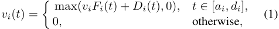

where _vi_ is the intrinsic valuation, and _Fi_ ( _t_ ) and _Di_ ( _t_ ) are exponential and linear discounting factors, respectively. This is a general discounting model. Its representative examples include but not limited to the following. 

- Exponential Discounting: _Fi_ ( _t_ ) = _η_(_t−ai_) , where _η ∈_ (0 _,_ 1), and _Di_ ( _t_ ) = 0. 

- Linear Discounting: _Fi_ ( _t_ ) = 1 _, Di_ ( _t_ ) = _−δ_ ( _t − ai_ ), where _δ >_ 0 is a constant. 

- Joint Discounting: _Fi_ ( _t_ ) = _η_(_t−ai_) , _Di_ ( _t_ ) = _−δ_ ( _t − ai_ ), where _η ∈_ (0 _,_ 1) and _δ >_ 0. 

- No Discounting: _Fi_ ( _t_ ) = 1 _, Di_ ( _t_ ) = 0. 

We consider that the agents are rational and selfish. They may cheat the arrival time, departure time, as well as the intrinsic valuation. Since early arrival and late departure can be prevented by the heart-beat scheme (Nisan et al. 2007), we focus on the scenario, in which the agents can only report an arrival time later than their true arrival time or a departure time earlier than their true departure time, in this paper. Hence, each agent _i_ propose a bid _bi_ = ( _a__′_ _i__, d′_ _i__, v_ _i__′_(_t_)), which can be different from her type. We define _⃗b__t_ as the bid profile in time slot _t_ . Same as (Babaioff et al. 2009), we assume that the agents share a common discounting function. Once an agent comes into the auction, she proposes her bid to the auctioneer, and cannot change it later. The auctioneer will calculate a discounted bid for the agent in each time slot, and determines the allocation. Each agent _i_ gets a utility of _ui_ = _vi_ ( _t_ ) _− pi_ , if she wins in time slot _t_ ; or 0, if she loses in the auction. 

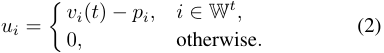

In contrast to the agents who always want to maximize their own utilities, the auctioneer’s objective is to maximize _social welfare_ , which is defined as follows. 

**Definition 1 (Social Welfare).** _The social welfare in an online auction is the sum of winners’ valuations on the allocated items in their corresponding winning time slots._ 

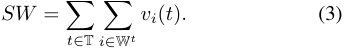

### **3.2 Solution Concepts** 

A strong solution concept from mechanism design is _dominant strategy_ . 

**Definition 2 (Dominant Strategy (Fudenberg and Tirole 1991; Osborne and Rubenstein 1994)).** _Strategy si is agent i’s dominant strategy, if for any strategy s__′_ _i̸_=_si_ _and any other player’s strategy profile s−i, we have_ 

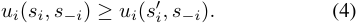

Intuitively, a dominant strategy of a player is a strategy that maximizes her utility, regardless of what strategy profile the other players choose. 

The solution to the afore mentioned online auction is a kind of _direct revelation mechanism_ , in which the strategies of the agents are to propose bids based on their types. The concept of dominant strategy is the basis of _incentivecompatible_ direct revelation mechanism, which means that 

813 

there is no incentive for any player to lie about her private information, and thus revealing truthful information is a dominant strategy for every player. An accompanying concept is _individual-rationality_ , which means that every player participating in the game expects to gain no less utility than staying outside. We now can introduce the definition of _strategyproof direct revelation mechanism_ . 

**Definition 3 (Strategy-Proof Direct Revelation Mechanism (Mas-Colell, Whinston, and Green 1995; Varian 1995)).** _A direct revelation mechanism is strategy-proof, when it satisfies both incentive-compatibility and individualrationality._ 

The objective of this work is to design strategy-proof online auction mechanisms despite of time discounting values. 

## **4 Auction Design** 

In this section, we present our design of online auction with time discounting values, and show its economic and computation properties, including strategy-proofness, computation efficiency, and competitive efficiency. Our mechanism consists of two parts: item allocation and payment determination. 

### **4.1 Item Allocation** 

Noting the dynamic arrival and departure of the agents, the auctioneer should employ an item allocation algorithm that only depends on the currently known information without any assumption on the bids of the future agents in the online auction. The item allocation algorithm should be both computationally efficient and competitively efficient. We design a computationally efficient greedy algorithm for item allocation to achieve 2-competitive efficiency. 

In each time slot _t_ , the auctioneer allocates the items to up to _g_ highest bidding agents from N_t_ . We note that N_t_ used here is the set of currently available agents excluding the winners in previous time slots. If there is a tie, the auctioneer breaks it randomly. Algorithm 1 shows the pseudocodes of our item allocation algorithm. The complexity of Algorithm 1 is _O_ ( _n_ log _n_ ). 

We consider a time slot _t ∈_ T. For each agent _i ∈_ OPT_t_ , if she does not win in a time slot before or equal _t_ in our mechanism, then there must be _g_ winners with higher valuations than _vi_ ( _t_ ) in time slot _t_ given our mechanism due to agent _i_ ’s presence, _i.e._ , 

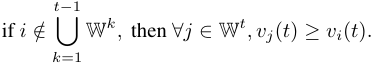

Thus, we have 

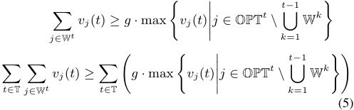

On the other hand, the agents who win earlier in our mechanism than in off-line optimal solution get higher valuations on allocated items in our mechanism. Here, we temporarily denote the sum of valuations on the allocated items of these agents by _σ_ . 

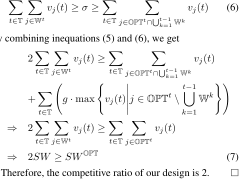

By combining inequations (5) and (6), we get 

### **4.2 Payment Determination** 

**Algorithm 1** Item allocation algorithm: _Alloc_ <u>(</u> _t,_ N_t_ <u>)</u> 

**Input:** Time slot _t ∈_ [1 _, T_ ], agents presented N_t_ and bid profile _⃗b__t_ in slot _t_ , number of items _g_ ; **Output:** Set of winners W_t_ in slot _t_ ; 1: W_t_ _←_ ∅; 2: **while** _g >_ 0 and N_t̸_ = ∅ **do** 3: _i ← argmax_ ( _vi__′_(_t_)); _i∈_ N_t_ 4: W_t_ _←_ W_t_ _∪{i}_ , N_t_ _←_ N_t_ _\ {i}_ , _g ← g −_ 1; 5: **end while** 6: **return** W_t_ . 

**Theorem 1.** _Our design is a 2-competitive online auction mechanism with time discounting values._ 

_Proof._ Let OPT_t_ _⊆_ N be the set of winners determined by an off-line optimal solution. For the analysis of competitive ratio, we use the true valuation _vi_ and the proposed valuation _vi__′_of agent_i_interchangeably. 

The payment needs to be determined in an online fashion in the sense that it can be calculated by the time an agent leaves the auction and no future information after the agents leaving is needed. Due to the discounting value/bid, an agent can manage to win in several different time slots by adjusting her proposed intrinsic valuation. Since the agent has different valuations in different time slots, charging a uniform price by directly applying the traditional critical payment will leave the online auction mechanism not strategy-proof. To guarantee strategy-proofness despite of discounting values/bids, we carefully design a novel payment determination algorithm. 

**Locating Candidate Winning Slots** Before introducing the payment determination algorithm, we have to first identify the set of candidate winning slots, in which an agent may win an item by adjusting her proposed intrinsic valuation. Given a winner _i ∈_ W, for each time slot _t ∈_ [ _a__′_ _i__, d′_ _i_], we calculate the critical price _Pi__t_for agent_i_to win in the time slot: 

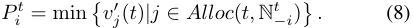

814 

We note that N_t_ _−i_usedhereisslightlydifferentfromthat of N_t_ used in the previous section. Here, N_t_ _−i_isthesetof currently available agents excluding the winners in previous time slots, if agent _i_ does not participate in the online auction. 

Then, the proposed intrinsic valuation ˆ _vi__t_that can result in _Pi__t_is: 

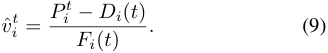

Finally, the set of candidate winning slots Γ _i ⊆_ [ _a__′_ _i__, d′_ _i_] of the winner _i_ should satisfy the following constraint: 

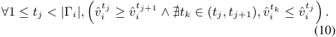

Algorithm 2 shows the pseudo-codes for locating the set of candidate winning slots. Algorithm 2 calls Algorithm 1 at most _T_ times, and thus results in a time complexity of _O_ ( _nT_ log _n_ ). We note that although Algorithm 2 is presented in the way of calling historical data to locate the candidate winning slots for an agent, the candidate winning slots can be determined on the go. Therefore, the payment can be calculated immediately when the agent is leaving the auction based on the previously determined set of candidate winning slots. 

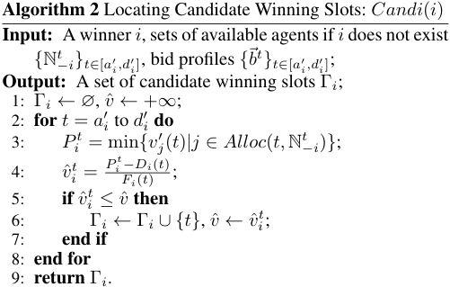

**Payment Calculation** To guarantee strategy-proofness, the payment of a winner in the case of discounting values/bids should depend not only on the bids of the competing agents, but also on the time the agent wins an item. Therefore, we determine the payment in a recursive way based on previously calculated set of candidate winning slots. 

We consider a winner _i_ . Suppose that there are _m_ elements in her set of candidate winning slots Γ _i_ , _i.e._ , Γ _i_ = _{t_ 1 _, t_ 2 _, · · · , tm}_ , where _∀_ 1 _≤ j < k ≤ m, tj < tk_ . If the agent _i_ wins an item in time slot _tk ∈_ Γ _i_ , her payment can be calculated as follows: 

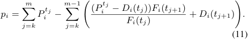

We note that (1) payment _pi_ is always no more than winner _i_ ’s valuation of an item in time slot _tk_ ; otherwise, agent 

_i_ cannot win in that slot; (2) to determine the payment for all the winners, our mechanism takes _O_ ( _n_2 _T_ log _n_ ) time. 

Given the above allocation and payment algorithms, we next prove the strategy-proofness of our design. 

**Lemma 1.** _In our mechanism, given any agent i ∈_ N _, proposing her true intrinsic valuation vi in the bid is a dominate strategy, for any proposed presence interval_ [ _a__′_ _i__, d′_ _i_]_and_ _any bid profile of the other agents⃗b−i._ 

_Proof._ Given an agent _i_ ’s proposed presence interval [ _a__′_ _i__, d_ _i__′_] and the bid profile of the other agents _⃗b−i_ , we can locate the set of candidate winning slots Γ _i_ = _{t_ 1 _, t_ 2 _, · · · , tm}_ by invoking Algorithm 2. Let _ui_ be the utility of the agent _i_ , when proposing her true intrinsic valuation _vi_ in the bid. We first consider the case, in which the agent wins an item in time slot _tk ∈_ Γ _i_ , when proposing her true intrinsic valuation _vi_ in the bid. Suppose that the agent proposes a different intrinsic valuation _vi__′_ _̸_=_vi_, and results in a utility of_u_ _i__′_. We distinguish two cases: 

- The agent proposes a higher intrinsic valuation, _i.e._ , _vi__′>_ _vi_ . The agent must be able to win an item in a time slot _tk′ ∈_ Γ _i_ no later than _tk_ , _i.e._ , _tk′ ≤ tk_ . Then the utility difference is: 

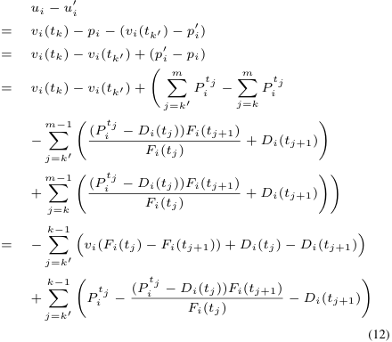

Since the agent should not win before time slot _tk_ in the truthful telling case, we have _∀j ∈{k__′_ _, k__′_ + 1 _, · · · , k −_ 1 _}, vi × Fi_ ( _tj_ ) + _Dj_ ( _tj_ ) _≤ Pi__tj_. Then, we have 

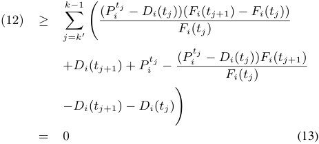

Therefore, the utility of the agent _i_ is decreased. 

- The agent proposes a lower intrinsic valuation, _i.e._ , _vi__′<_ _vi_ . We further distinguish two cases: 

815 

- The agent wins an item in a time slot _tk′ ∈_ Γ _i_ no earlier than _tk_ , _i.e._ , _tk__′_ _≥ tk_ . Then the utility difference is: 

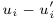

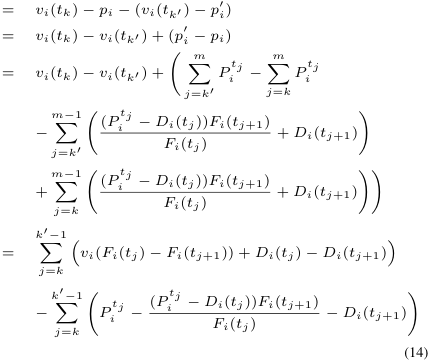

Since the agent should win before time slot _tk′_ , we have _∀j ∈{k, k_ +1 _, · · · , k__′_ _−_ 1 _}, vi×Fi_ ( _tj_ )+ _Dj_ ( _tj_ ) _≥ Pi__tj_. Then, we have 

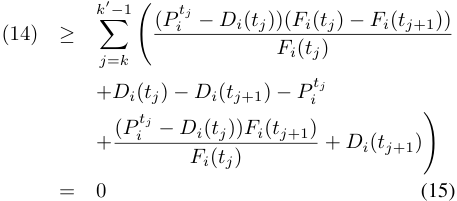

Therefore, the utility of the agent _i_ is decreased. 

- The agent loses in the online auction. Then, her utility _u__′_ _i_= 0_≤ui_. 

We next consider the case, in which the agent loses in the online auction, when proposing her true intrinsic valuation _vi_ in the bid. Suppose that the agent proposes a different intrinsic valuation _vi__′_ _̸_=_vi_, and results in a utility of_u_ _i__′_. We distinguish two cases: 

- The agent proposes a higher intrinsic valuation, _i.e._ , _vi__′>_ _vi_ , and wins an item in a time slot _tk′ ∈_ Γ _i_ . Then, her utility becomes 

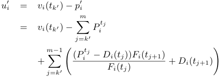

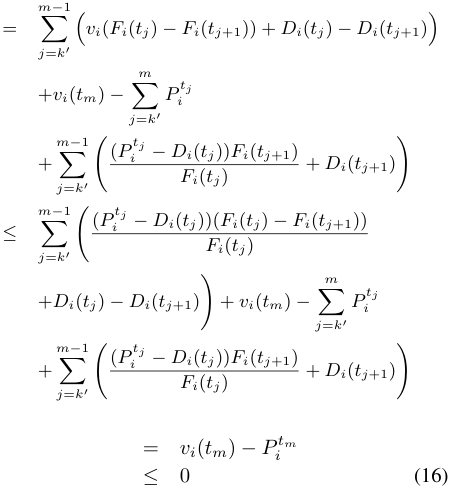

Hence, it is better not to cheat the intrinsic valuation. 

- The agent proposes a false intrinsic valuation, but still does not win. Then, her utility remains to be 0. 

From the above case by case analysis, we get that proposing true intrinsic valuation _vi_ in the bid is the agent _i_ ’s dominate strategy. 

**Lemma 2.** _In our mechanism, given any agent i ∈_ N _, proposing her true arrival and departure time_ [ _ai, di_ ] _is a dominate strategy, for any bid profile of the other agents⃗b−i._ 

Due to limitations of space, we omit the proof here. 

By combining Lemma 1 and Lemma 2, we get that our mechanism is an incentive compatible direct revelation mechanism. Noting that our mechanism also satisfies individual rationality, since _pi_ is always no more than _vi_ ( _tk_ ), if the agent _i_ truthfully participate in the online auction. Therefore, we can draw the following conclusion. 

**Theorem 2.** _Our mechanism is a strategy-proof online auction mechanism with time discounting values._ 

## **5 Numerical Results** 

We have implemented our design of online auction with time discounting values (named OASES in the evaluation), and compare its performance with the off-line VCG mechanism (named Off-line VCG in the evaluation), which achieves optimal social welfare. 

In the evaluation setup, we vary the number of agents from 50 to 1000 with a step of 50, uniformly distribute the agents’ intrinsic valuations over (0 _,_ 1], and set the two discounting factors of an agent _i_ to be _Fi_ ( _t_ ) = 0 _._ 9_t−ai_ and _Di_ ( _t_ ) = _−_ 0 _._ 05 _×_ ( _t − ai_ ). We vary the number _g_ of items for sale in each time slot from 1 to 5 with a step of 2, and set the number of time slots to 100. All the results are averaged over 200 runs. Since calculating an optimal allocation is extremely time consuming when _g >_ 1, we only collect the results of Off-line VCG when there is a single item for sale. 

816 

We consider four metrics, including social welfare, revenue, average winning delay, and average valuation loss. Winning delay is the number of time slots from an agent’s arrival to her winning of an item. Average winning delay captures how fast the mechanism allocates the items to newly arrived agents. Valuation loss is an agents’ valuation decrement by the time of winning. This metric captures valuepreservation of the winners. In practice, the auctioneer tends maximize social welfare and revenue, while the agents normally prefer to auctions with shorter average winning delay and less average valuation loss. 

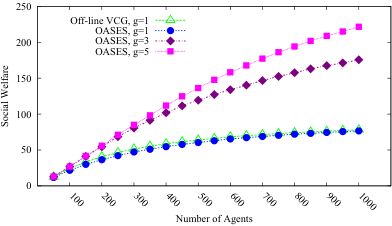

<!-- Start of picture text -->
 250 Off-line VCG, g=1 OASES, g=1  200 OASES, g=3 OASES, g=5  150  100  50  0 Number of Agents  100  200  300  400  500  600  700  800  900  1000 Social Welfare <!-- End of picture text -->

Figure 1: Comparisons on social welfare. 

Figure 1 shows the evaluation results on social welfare. Generally, the social welfare increases with the number of agents and the number of items for sale. When there is a single item for sale in each time slot, OASES achieves a social welfare very close to that of the optimal solution. This shows that OASES can perform well except in some rarely appeared extreme cases. 

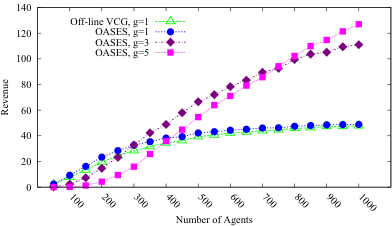

<!-- Start of picture text -->
 140 Off-line VCG, g=1  120 OASES, g=1 OASES, g=3  100 OASES, g=5  80  60  40  20  0 Number of Agents  100  200  300  400  500  600  700  800  900  1000 Revenue <!-- End of picture text -->

Figure 2: Comparisons on revenue. 

Figure 2 demonstrates the evaluation results on revenue of the two mechanisms. Same as social welfare, the revenue generated by OASES is very close to that of Off-line VCG for auctioning a single item in each time slot. We can observe that OASES with _g_ = 3 achieves lower revenue than OASES with _g_ = 1 when the number of agents is less than 250, and OASES with _g_ = 5 gets lower revenue than OASES with _g_ = 3 when the number of agents is less than 750. This is because the competition is less intense when there are more items for sale, and thus the payment for winning is lower. However, when there are sufficiently large number of agents, having more items sold can generate more revenue. To deal with the problem of low revenue in case of small number of agents and relatively high value of the pa- 

rameter _g_ , an intuitive way is to let the auctioneer dynamically determine the number of items for sale. Specifically, in the setting of our evaluations, the auctioneer can choose to sell 1, 3, and 5 items, when the number of agents is in the range of (0 _,_ 300), [300 _,_ 750), and [750 _,_ + _∞_ ), respectively. 

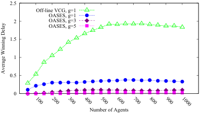

<!-- Start of picture text -->
 2.5 Off-line VCG, g=1 OASES, g=1  2 OASES, g=3 OASES, g=5  1.5  1  0.5  0 Number of Agents  100  200  300  400  500  600  700  800  900  1000 Average Winning Delay <!-- End of picture text -->

Figure 3: Comparisons on average winning delay. 

Figure 3 presents the evaluation results on average winning delay. We can see that OASES achieves much lower average winning delay than Off-line VCG. In OASES, most of winning agents immediately get the item at their arrival. With the increment of number of items for sale, the average winning delay of OASES approaches 0. 

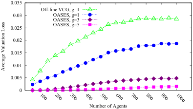

<!-- Start of picture text -->
 0.035 Off-line VCG, g=1  0.03 OASES, g=1 OASES, g=3  0.025 OASES, g=5  0.02  0.015  0.01  0.005  0 Number of Agents  100  200  300  400  500  600  700  800  900  1000 Average Valuation Loss <!-- End of picture text -->

Figure 4: Comparisons on average valuation loss. 

Finally, figure 4 shows the evaluation results on average valuation loss. We can see that OASES saves up to 63.8% valuation on average compared with Off-line VCG, when there is a single item for sale. When selling 3 and 5 items in each time slot, OASES only loses up to 0.0048 and 0.0015 valuation on average, respectively. 

## **6 Conclusions** 

In this paper, we have studied the problem of mechanism design for online auctions with time discounting values, and have proposed a strategy-proof 2-competitive online auction mechanism. We have also implemented our design and compare it with off-line optimal solution. Our numerical results have shown that our design achieves good performance in terms of social welfare, revenue, average winning delay, and average valuation loss. 

## **References** 

Babaioff, M.; Dinitz, M.; Gupta, A.; Immorlica, N.; and Talwar, K. 2009. Secretary problems: Weights and discounts. In 

817 

_Proceedings of the 20th Annual ACM-SIAM Symposium on Discrete Algorithms (SODA)_ , 1245–1254. 

Babaioff, M.; Immorlica, N.; and Kleinberg, R. 2007. Matroids, secretary problems, and online mechanisms. In _Proceedings of the 18th Annual ACM-SIAM Symposium on Discrete Algorithms (SODA)_ , 434–443. 

Bar-Yossef, Z.; Hildrum, K.; and Wu, F. 2002. Incentivecompatible online auctions for digital goods. In _Proceedings of the 13th Annual ACM-SIAM Symposium on Discrete Algorithms (SODA)_ , 964–970. 

Blum, A., and Hartline, J. D. 2005. Near-optimal online auctions. In _Proceedings of the 16th Annual ACM-SIAM Symposium on Discrete Algorithms (SODA)_ , 1156–1163. 

Blum, A.; Sandholm, T.; and Zinkevich, M. 2006. Online algorithms for market clearing. _Journal of ACM_ 53(5):845– 879. 

Bredin, J., and Parkes, D. C. 2005. Models for truthful online double auctions. In _Proceedings of the 21st Conference on Uncertainty in Artificial Intelligence (UAI)_ , 50–59. Clarke, E. 1971. Multipart pricing of public goods. _Public choice_ 11(1):17–33. 

Constantin, F.; Ito, T.; and Parkes, D. C. 2007. Online auctions for bidders with interdependent values. In _Proceedings of the 6th International Joint Conference on Autonomous Agents and Multiagent Systems (AAMAS)_ , 110:1–110:3. 

Friedman, E. J., and Parkes, D. C. 2003. Pricing WiFi at starbucks: issues in online mechanism design. In _Proceedings of the 4th ACM conference on Electronic Commerce (EC)_ , 240–241. 

Fudenberg, D., and Tirole, J. 1991. _Game Theory_ . MIT Press. Gerding, E. H.; Robu, V.; Stein, S.; Parkes, D. C.; Rogers, A.; and Jennings, N. R. 2011. Online mechanism design for electric vehicle charging. In _Proceedings of the 10th International Conference on Autonomous Agents and Multiagent Systems (AAMAS)_ , 811–818. 

Groves, T. 1973. Incentives in teams. _Econometrica: Journal of the Econometric Society_ 41(4):617–631. 

Hajiaghayi, M. T.; Kleinberg, R.; Mahdian, M.; and Parkes, D. C. 2005. Online auctions with re-usable goods. In _Proceedings of the 6th ACM Conference on Electronic Commerce (EC)_ , 165–174. 

Karande, C.; Mehta, A.; and Tripathi, P. 2011. Online bipartite matching with unknown distributions. In _Proceedings of the Forty-third Annual ACM Symposium on Theory of Computing (STOC)_ , 587–596. 

Karp, R. M.; Vazirani, U. V.; and Vazirani, V. V. 1990. An optimal algorithm for on-line bipartite matching. In _Proceedings of the Twenty-second Annual ACM Symposium on Theory of Computing (STOC)_ , 352–358. 

Lahaie, S.; Parkes, D. C.; and Pennock, D. M. 2008. An expressive auction design for online display advertising. In _Proceedings of the 23rd National Conference on Artificial Intelligence (AAAI)_ , 108–113. 

Lavi, R., and Nisan, N. 2000. Competitive analysis of incen- 

tive compatible on-line auctions. In _Proceedings of the 2nd ACM Conference on Electronic Commerce (EC)_ , 233–241. Lavi, R., and Nisan, N. 2005. Online ascending auctions for gradually expiring items. In _Proceedings of the 16th Annual ACM-SIAM Symposium on Discrete Algorithms (SODA)_ , 1146–1155. 

Lin, W.-Y.; Lin, G.-Y.; and Wei, H.-Y. 2010. Dynamic auction mechanism for cloud resource allocation. In _Proceedings of the 10th IEEE/ACM International Conference on Cluster, Cloud and Grid Computing (CCGrid)_ , 591–592. 

Mas-Colell, A.; Whinston, M. D.; and Green, J. R. 1995. _Microeconomic Theory_ . Oxford Press. Muthukrishnan, S. 2009. Ad exchanges: Research issues. In _Proceedings of the 5th International Workshop on Internet and Network Economics (WINE)_ , 1–12. 

Naroditskiy, V.; Ceppi, S.; Robu, V.; and Jennings, N. R. 2013. Redistribution in online mechanisms. In _Proceedings of the 2013 International Conference on Autonomous Agents and Multi-agent Systems (AAMAS)_ , 651–658. 

Ng, C.; Parkes, D. C.; and Seltzer, M. 2003. Virtual worlds: Fast and strategyproof auctions for dynamic resource allocation. In _Proceedings of the 4th ACM Conference on Electronic Commerce (EC)_ , 238–239. Nisan, N.; Roughgarden, T.; Tardos, E.; and Vazirani, V. V. 2007. _Algorithmic Game Theory_ . Cambridge University Press. 

Osborne, M. J., and Rubenstein, A. 1994. _A Course in Game Theory_ . MIT Press. 

Parkes, D. C., and Singh, S. P. 2003. An MDP-based approach to online mechanism design. In _Proceedings of the 17th Annual Conference on Neural Information Processing Systems (NIPS)_ . 

Parkes, D. C.; Singh, S. P.; and Yanovsky, D. 2004. Approximately efficient online mechanism design. In _Proceedings of the 18th Annual Conference on Neural Information Processing Systems (NIPS)_ . 

Porter, R. 2004. Mechanism design for online real-time scheduling. In _Proceedings of the 5th ACM Conference on Electronic Commerce (EC)_ , 61–70. Stein, S.; Gerding, E.; Robu, V.; and Jennings, N. 2012. A model-based online mechanism with pre-commitment and its application to electric vehicle charging. In _Proceedings of the 11st International Conference on Autonomous Agents and Multi-Agent Systems (AAMAS)_ , 669–676. Todo, T.; Mouri, T.; Iwasaki, A.; and Yokoo, M. 2012. Falsename-proofness in online mechanisms. In _Proceedings of the 11th International Conference on Autonomous Agents and Multiagent Systems (AAMAS)_ , 753–762. Varian, H. 1995. Economic mechanism design for computerized agents. In _USENIX Workshop on Electronic Commerce_ , 2–2. 

Vickrey, W. 1961. Counterspeculation, auctions, and competitive sealed tenders. _The Journal of finance_ 16(1):8–37. 

818 

