# **Mechanism Design with Predicted Task Revenue for Bike Sharing Systems** 

**Hongtao Lv,**1 **Chaoli Zhang,**1 **Zhenzhe Zheng,**1 **Tie Luo,**2 **Fan Wu,**1_∗_ **Guihai Chen**1 

1 Department of Computer Science and Engineering, Shanghai Jiao Tong University, Shanghai, China 

2 Department of Computer Science, Missouri University of Science and Technology, Rolla, USA 

_{_ lvhongtao, chaoli ~~z~~ hang, zhengzhenzhe _}_ @sjtu.edu.cn, tluo@mst.edu, fwu@sjtu.edu.cn, gchen@cs.sjtu.edu.cn 

#### **Abstract** 

Bike sharing systems have been widely deployed around the world in recent years. A core problem in such systems is to reposition the bikes so that the distribution of bike supply is reshaped to better match the dynamic bike demand. When the bike-sharing company or platform is able to predict the revenue of each reposition task based on historic data, an additional constraint is to cap the payment for each task below its predicted revenue. In this paper, we propose an incentive mechanism called FEITE to incentivize users to park bicycles at locations desired by the platform toward rebalancing supply and demand. FEITE possesses four important economic and computational properties such as truthfulness and budget feasibility. Furthermore, we prove that when the payment budget is tight, the overall revenue will still exceed or e- qual the budget. Otherwise, FEITE achieves 2-approximation as compared to the optimal (revenue-maximizing) solution, which is close to the lower bound of at least _~~√~~_ 2 that we also prove. Using an industrial dataset obtained from a large bikesharing company, our experiments show that FEITE is effective in rebalancing bike supply and demand and generating high revenue as a result, which outperforms several benchmark mechanisms. 

## **Introduction** 

Bike sharing is a new transportation mode with many benefits in offering convenience and flexibility as well as lowering economic cost. By 2015, more than 7000 bike sharing systems have been deployed around the world (Laporte, Meunier, and Calvo 2015). However, the flexibility of bike sharing systems, in particular the “anywhere-parking” convenience, brings forth a serious issue of imbalance between the distribution of bike supply and demand. This leads to many users being unable to find a bicycle nearby when they need it, and ultimately affects company revenue adversely. Hence there is an urgent need to rebalance the supply and demand by repositioning the bicycles, which we refer to as a bike rebalancing problem. 

There are two approaches to solving this problem. One is to relocate bicycles by the staff of the bike-sharing com- 

> _∗_ F. Wu is the corresponding author. 

Copyright _⃝_ c 2020, Association for the Advancement of Artificial Intelligence (www.aaai.org). All rights reserved. 

pany or platform, for example using trucks. This involves route planning and typically uses linear programming techniques, as has been extensively studied with static models (Maggioni et al. 2019; Schuijbroek, Hampshire, and Van Hoeve 2017) and dynamic models (Kek et al. 2009; Angeloudis, Hu, and Bell 2014). However, this approach is costly and not eco-friendly in terms of carbon footprint. 

Another approach is to design incentive mechanisms to motivate users to reposition bicycles at platform-desired locations for rebalancing supply and demand. This falls under the research area of crowdsourcing (Fricker and Gast 2016) which takes advantage of the power of crowd to complete tasks that are otherwise difficult (Luo et al. 2016). With this idea, Ghosh and Varakantham (2017) proposed a solution that generates repositioning tasks together with the use of bike trailers, and pays users using the Vickrey-ClarkeGroves (VCG) mechanism. Singla et al. (2015) introduced a crowdsourcing method that offers users monetary incentive for parking their bikes at recommended locations. 

However, most of existing mechanisms for this problem have not considered the predicted revenue (or value) of a repositioning task. Such predicted values are made available in recent years, due to the prosperity of deep learning technique which can well predict the bike demand in such systems (Yang et al. 2016; Li and Zheng 2019; Zhang et al. 2016). With this predictive power, the expected revenue or value of a repositioning task can be easily obtained. Therefore, the platform would assign a task to a user only if the payment to the user does not exceed the predicted revenue. This constraint is akin to the “reserve price” in forward auctions which are used to promote revenue. In our problem, it is used to better control the payments and thereby promote the profit of the platform. This constraint is generally overlooked in prior work on bike sharing or bipartite matching (Angelopoulos et al. 2018; **?** ; Vaze 2017), making them no longer applicable. For instance with classic budget feasible mechanisms such as (Singer 2010), the payment to a winning user is determined by the bids of other users and/or the budget. But in our case, this payment is invalid if it is above the value of the task assigned to the winning user. 

In this paper, we propose a truthFul and budgEt feasIble 

incentive mechanism with predicted <u>Task rEvenue</u> (FEITE) as the solution to the bike rebalancing problem, which we model as a reverse auction. In this auction, users bid for repositioning tasks and the platform determines task allocation and user payments. While we show that commonly used auctions and pricing mechanisms do not apply to our case, we specifically show that FEITE solves the problem and satisfies a number of desired economic and computational properties. We also prove two important theoretical guarantees backed by our mechanism. The performance of FEITE is then evaluated via simulations using a real industrial dataset obtained from a large bike-sharing company. Our main contributions are summarized as follows: 

- We model the bike rebalancing problem under a crowdsourcing framework using an reverse auction model. Importantly, we incorporate a bipartite graph into the auction - with a payment constraint - to determine the allocation rule and the payment rule for the auction mechanism. This also implies that a bridge is set up between bike demand prediction and incentive mechanism design. 

- We propose a mechanism FEITE which satisfies desired properties including incentive compatibility, budget feasibility, individual rationality, and computational efficiency. Notably, as is novel, we achieve this by combining Myerson’s Lemma and a greedy weighted maximum matching technique. 

- We prove two important theoretical guarantees: When the budget is tight, our mechanism ensures that the platform revenue is no less than its budget, under a practical largemarket assumption. When the budget is sufficient, FEITE achieves a 2-approximation ratio as compared to the optimal solution which maximizes revenue; in addition, we show that the lower bound of the approximation ratio is _√_ 2 which is rather close to our ratio. Putting in practice perspectives, we provide a guideline of how to use this result to set company budget in real dynamic systems. 

- We evaluate the effectiveness of our mechanism via extensive experiments using a real dataset from a large bikesharing company. The results show that our mechanism outperforms other benchmark mechanisms in terms of revenue and profit. 

## **Model** 

Consider a dynamic bike sharing system in which there is a batch of _n_ users _N_ = _{_ 1 _,_ 2 _, . . . , n}_ who have hired their bicycles and have not parked them (at the end of the hire) yet. There is also a set of _m_ discrete locations1 _L_ = _{_ 1 _,_ 2 _, . . . , m}_ as bicycle parking lots, where each location can accommodate multiple bicycles but is conceptually considered a point on a map. We assume that the destinations of each user is known to the platform when she hires a bicycle, since it can be either reported by users as is a practice adopted by some companies (e.g., Hellobike in China), 

> 1We do not consider continuous locations because, nowadays, many countries such as Singapore and China have stipulated municipal regulations that shared bikes must be parked at designated locations rather than arbitrarily. 

or predicted using historic information (Liu et al. 2018). The platform aims to incentivize the users to park their bicycles at system-desired locations for rebalancing the supply and demand of bicycles. Each user has a maximum relocation range _h_ , out of which they would not accept a repositioning task; in other words, _h_ is the maximum “extra mile” they are willing to relocate. 

Similar to the concept of _first come first served flow_ in (Waserhole, Jost, and Brauner 2013), we assume that a bicycle that is parked earlier will have a higher probability to be hired than a bicycle parked later. As such, each bicycle has a different probability of being hired even at the same location. Accordingly, we define a repositioning task _tlx_ as “park at location _l_ as the _x_ -th bicycle”, which is associated with an expected revenue _rlx_ . As mentioned above, _rlx_ can be derived from the prediction of bike demand at this location (Yang et al. 2016; Li and Zheng 2019). 

To address the task assignment problem, we construct a bipartite graph _G_ = _{N, T, E}_ , where the left nodes are the set of users _N_ , and the right nodes are the set of tasks _T_ . Since there are maximum _n_ possible tasks at each location, there are totally _m × n_ tasks in _T_ . The set _E_ is the edges connecting users and tasks and there is an edge between _i_ and _tlx_ if location _l_ is within the maximum relocation range of user _i_ . For notation simplicity, henceforth we use _j_ to denote a task _tlx_ when there is no ambiguity. 

Each user _i_ has a relocation cost _ci_ which is a private value only known to user _i_ . She bids for a task with a claimed cost _bi_ which is not necessarily equal to _ci_ . Each task _j_ has an expected revenue (or “value” as we use interchangeably) _rj_ for the platform. We aim to design an incentive mechanism that consists of an allocation rule and a payment rule, where the allocation rule specifies which task is allocated to which user, i.e., the matched pairs ( _i, j_ ), and the payment rule specifies a payment _pi_ for each matched user _i_ . The u- tility of a user is defined as _pi − ci_ . In addition, the platform has a budget _B_ for the rebalancing process, and the overall payment should not exceed the budget. As are desired, we want to design a mechanism that satisfies the following properties: 

- _Incentive Compatibility_ : a user can only maximize her u- tility by bidding truthfully, i.e., _bi_ = _ci_ . This property is also known as _truthfulness_ or _strategy-proofness_ . 

- _Individual Rationality_ for both users and platform: the payment to each winning (i.e., matched) user should be no less than her cost, i.e., _pi ≥ ci_ ; the payment for each matched task should also be no more than its value, i.e., _pi ≤ rj_ , which is similar to the term _reserve price_ in the theory of mechanism design. 

- _Budget Feasibility_ : the overall payment should be no more than the budget, i.e.,� ( _i,j_ ) _∈M__pi≤B_. 

- _Computational Efficiency_ : the mechanism should terminate in polynomial time. 

- Our objective is to maximize the platform revenue _R_ = 

- �( _i,j_ ) _∈M__rj_,where_M_=_{_(_i, j_)_}_isdenotedasthesetof matched user-task pairs. Thus, the problem of revenue max- 

imization from task allocation can be formulated as 

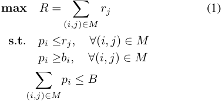

where the first two constraints indicate the individual rationality for platform and users, and the third one indicates the budget feasibility. 

We also evaluate platform profit which is defined as 

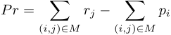

and will be compared with revenue in our experiments. 

### **Infeasibility of Existing Mechanisms** 

In this section, we show that some widely used mechanisms are not feasible for the bike rebalancing problem. 

**VCG mechnism.** This is a classical mechnism that is strategy-proof and maximizes social welfare. However, it does not guarantee budget feasibility as required in our case. Proof by counter-example: see Figure 1 (a), where the platform has budget 1 and there are two users _{a, b}_ both with a small cost _ϵ_ ; the two tasks _{_ 1 _,_ 2 _}_ both have value 1 and there are two edges _{_ ( _a,_ 1) _,_ ( _b,_ 2) _}_ . The VCG mechanism will output matching _M_ = _{_ ( _a,_ 1) _,_ ( _b,_ 2) _}_ and the payment for each user is 1. Thus, the overall payment exceeds the budget and hence the mechanism is not budget feasible. 

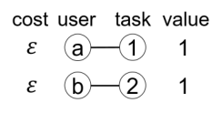

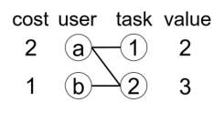

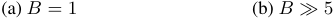

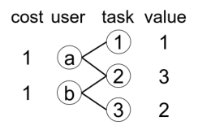

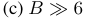

Figure 1: Counter examples for existing mechanisms. 

**Singer’s mechanism.** Proposed in (Singer 2010), this is another well-known mechanism yet is budget feasible. It greedily allocates user-task pairs with the highest ratio of _rj/bi_ , but does not consider the individual rationality of the platform (i.e., _pi ≤ rj_ ). If we adapt the mechanism by adding the constraint into the payment rule, it will no 

longer guarantee incentive compatibility. To illustrate this, see Figure 1 (b), the platform has sufficient budget, and there are two users _{a, b}_ with costs _ca_ = 2 _, cb_ = 1, t- wo tasks _{_ 1 _,_ 2 _}_ with values _r_ 1 = 2 _, r_ 2 = 3, and three edges _{_ ( _a,_ 1) _,_ ( _a,_ 2) _,_ ( _b,_ 2) _}_ . The adapted mechanism outputs match _M_ = _{_ ( _a,_ 1) _,_ ( _b,_ 2) _}_ , and _pa_ = 2. However, if user _a_ misreports her cost to be a small number _ϵ_ , she will be allocated task 2 and her payment becomes 3, making her better off. 

**Optimal matching.** The third method is to choose a subgraph with� _rj ≤ B_ and then use the optimal (i.e., maximum) matching (that maximizes platform revenue) to allocate tasks, where the payments to winners are set to the values of their matched tasks. Not only does this mechanism has zero profit for the platform, but more importantly, it is also not truthful. To see this, consider Figure 1 (c), where the budget is sufficient, and there are two users _{a, b}_ with costs _ca_ = 1 _, cb_ = 1, three tasks _{_ 1 _,_ 2 _,_ 3 _}_ with values _r_ 1 = 1 _, r_ 2 = 3 _, r_ 3 = 2, and four edges _{_ ( _a,_ 1) _,_ ( _a,_ 2) _,_ ( _b,_ 2) _,_ ( _b,_ 3) _}_ . The optimal matching will output match _M_ = _{_ ( _a,_ 2) _,_ ( _b,_ 3) _}_ since it achieves maximized revenue and the payments are _pa_ = 3 and _pb_ = 2. However, if user _b_ untruthfully bids a cost of 3 instead of 1, then she will be assigned task 2 instead of 3 because task value must be no less than the cost. Therefore, she will receive a higher payment than bidding truthfully. Therefore, incentive compatibility is violated. 

In fact, we will prove in Theorem 4 that there is no optimal mechanism that can satisfy the four properties simultaneously. Therefore, inspired by (Zhang, Wu, and Bei 2018), we propose an approximate mechanism (i.e., FEITE) in this paper. 

## **Mechanism Design of FEITE** 

In this section, we present our proposed mechanism FEITE for the bike rebalancing problem. We first introduce a notion called _right-perfect matching_ in a bipartite graph. 

**Definition 1** _A right-perfect matching in a bipartite graph G is a matching with size |T |, where T is the set of right nodes in graph G._ 

In other words, we say a bipartite graph has a right-perfect matching if all tasks in the graph on the right can be matched to a user on the left. It is easy to see that a right-perfect matching is also a maximum matching of a bipartite graph. 

The key idea of FEITE is to maintain a subgraph _G__′_ that always has a right-perfect matching. FEITE sorts all the tasks and users together in decreasing order of their values (costs), and then iterates over this sorted list. The mechanism tries to include more tasks with high values in _G__′_ and delete more users with high costs from it until the budget is exhausted or all elements are processed. 

The complete pseudo-code of the mechanism FEITE is p- resented in Algorithm 1. In the mechanism, we maintain a variable of the remaining budget _B__′_ which is initially set as _B_ . Once a user _i_ is matched with payment _pi_ , we update _B__′_ as _B__′_ _− pi_ . In addition, we update a decreasing global price _P_ during the algorithm process. Intuitively, for each 

**Algorithm 1:** FEITE: a truthful and budget feasible incentive mechanism with predicted task revenue 

- **Input** : Bipartite graph _G_ = ( _N, T, E_ ), budget _B_ , cost _ci_ , value _rj_ , _∀i ∈ N, ∀j ∈ T_ . 

- **Output** : Task allocation _M_ = _{_ ( _i, j_ ) _}_ and payment _pi_ for each winning user _i_ . 

- **1** Let _F_ = _N ∪ T_ . For an element _e ∈ F_ , if _e_ is a user _i_ , the value _ve_ is defined as her bid _bi_ ; if _e_ is a task _j_ , the value _ve_ is defined as the expected revenue _rj_ . 

- **2** Delete all edges ( _i, j_ ) with _bi > rj_ in _G_ . 

- **3** _M ←∅_ , _B__′_ _← B_ , _T__′_ _←∅_ , _N__′_ _←∅_ , _E__′_ _←∅_ , _G__′_ = ( _N__′_ _, T__′_ _, E__′_ ); 

- **4** Sort elements in _F_ in decreasing order of _ve_ , breaking ties randomly, but if the tie is between a task and a user, let the task go first. 

- **5 for** _each element e in the above order_ **do 6 if** _e is a task j_ **then 7** Let _Ej_ be the set of incident edges of _j_ in _G_ that connect to unmatched users. 

- **8 if** _G__′_ _∪ Ej has a right-perfect matching and_ **9** ( _|T__′_ _|_ + 1) _· rj ≤ B__′_ **then** 

- **10** _G__′_ _← G__′_ _∪ Ej_ . **11** _P ← rj_ . **12 else 13** Skip to next element. **14 if** _e is a user i in G__′_ **then 15 if** _G__′_ _\i has a right-perfect matching_ **then 16** _G__′_ _← G__′_ _\i_ . **17** _P ← bi_ . **18 for** _Each user i ∈ G__′_ **do 19 if** _G__′_ _\i doesn’t have a right-perfect matching_ **then** 

- **20 for** _Each edge_ ( _i, j_ ) _of i in G__′_ **do 21 if** _G__′_ _\i ∪_ ( _i, j_ ) _has a right-perfect matching_ **then** 

- **22** _M ← M ∪_ ( _i, j_ ), _pi ← P_ . **23** _B__′_ _← B__′_ _− pi._ **24** _G__′_ _← G__′_ _\{i, j}_ . **25** Skip to next user. **26 else 27** Skip to next edge. 

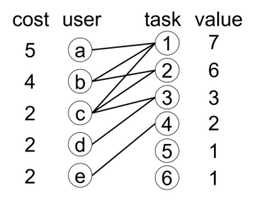

Figure 2: A walk-through example for our mechanism FEITE. Let the budget be _B_ = 14. Tasks 1 and 2 are first considered, and they are added to _G__′_ with their affiliated edges since the budget is enough for them. So _G__′_ has three users _a, b_ and _c_ and none of them is critical for the right-perfect matching of _G__′_ . In addition, the global price _P ←_ 6, and the remaining budget _B__′_ is still 14. Then, user _a_ is removed from _G__′_ while updating the price _P ←_ 5. Next, users _b_ and _c_ become critical for the right-perfect matching of _G__′_ now, and assume they are matched with task 1 and 2, respectively. The payment to each of _b_ and _c_ is _P_ = 5, and hence we update _B__′_ _←_ 4. After that, task 3 will be added to _G__′_ with edge ( _d,_ 3), we have _P ←_ 3, and obviously _d_ is critical and she will be allocated task 3 with payment 3. The remaining budget is also updated as _B__′_ _←_ 1. Finally, task 4 is considered but not added to _G__′_ because of the budget constraint, and tasks 5 and 6 are skipped because they have no edges. Therefore, the output matching is _{_ ( _b,_ 1) _,_ ( _c,_ 2) _,_ ( _d,_ 3) _}_ , and the revenue is 16 while the profit is 3. 

Once the subgraph _G__′_ is changed (either a task is added or a user is removed), we check if there are critical users for the right-perfect matching of _G__′_ , if so, for a critical user _i_ , we allocate task _j_ in _G__′_ to _i_ if _G__′_ _\i ∪_ ( _i, j_ ) has a right-perfect matching. The payment is set as the global price _P_ at this step, and then we update the remaining budget _B__′_ . 

A walk-through example of FEITE is given in Figure 2. 

## **Analysis of FEITE** 

**Lemma 1** _The mechanism FEITE satisfies incentive compatibility._ 

**Proof** _Since each user has only one private value (i.e., cost), this is a single-parameter problem and hence we can use the Myerson’s lemma:_ 

element in the iteration of the sorted list, if it is a task _j_ , the task and its affiliated edges (the connected user should be unmatched) will be added to _G__′_ if two conditions are satisfied after adding them: 1) _G__′_ still has a right-perfect matching and 2) the upper bound of the payment for all tasks in _G__′_ (i.e., ( _|T__′_ _|_ + 1) _· rj_ ) is below the remaining budget. If task _j_ is added to _G__′_ , we update the global price _P_ as _rj_ . If the element is a user _i_ , then if _G__′_ can maintain a rightperfect matching after discarding _i_ (i.e., _i_ is not _critical_ for the right-perfect matching of _G__′_ ), we then remove her from _G__′_ , in this case, we also update the global price _P_ as _bi_ . 

**Lemma 2 ((Myerson 1981))** _In single parameter auctions, for a normalized mechanism M_ = ( _f, p_ ) _, where f is the allocation rule and p is the payment rule, M is incentive compatible iff it satisfies:_ 

_1._ **_Monotone allocation rule:_** _∀i ∈ N , if b__′_ _i__≤bi,theni∈_ _f_ ( _bi, b−i_ ) _implies i ∈ f_ ( _b__′_ _i__, b−i_)_for every c−i;_ 

_2._ **_Threshold payment rule:_** _payment to each winning bidder is_ inf _{bi_ : _i ∈/ f_ ( _bi, b−i_ ) _}._ 

_First, we prove the monotone allocation rule, i.e., once user i is matched by bidding bi, she must be matched by bidding_ 

_b__′_ _i__<bi.Letebetheelementthatupdatestheglobalprice_ _P as pi. When bidding bi, we use G_1 _i__to denote the graph G′_ _after e is processed (i.e., the step that P is updated as pi), and G_2 _i__has same definition while in the case of bidding b′_ _i__._ _It’s obvious that the algorithm process before P is updated as pi is not affected by the bid of i. Therefore, we have G_1 _i_= _G_2 _i__, and user i is also critical for the right-perfect matching_ _of G_2 _i__, hence the monotone allocation rule is satisfied._ 

_Next, we prove the threshold payment rule, that is, if user i bids any cost larger than the payment pi, she will not be matched, otherwise, she will be matched with a task. If b__′_ _i__<pi,itcanbeobservedthatthevalueofalltasksin_ _G_2 _i__is higher than b_ _i__′, thus the edges of i will not be deleted_ _because b__′_ _i__> rj. Therefore, similar to the proof of the mono-_ _tone allocation rule, we have that G_1 _i_=_G_ _i_2_,anduseriis_ _still critical, so she will be matched. If b__′_ _i__> pi, user i will be_ _considered before the element e. However, we can observe that, in the steps before element e is processed, user i is either not added to G__′_ _or is not critical for the right-perfect matching of G__′_ _, otherwise she will be matched before element e. As a result, we have that user i will be discarded if b__′_ _i__> pi, and the threshold payment rule is satisfied._ 

**Lemma 3** _The mechanism FEITE is budget feasible._ 

**Proof** _We can observe that once a task j with value rj is added to G__′_ _, the payment to any user in G__′_ _is no more than rj, since the global price P is non-increasing. Let j__′_ _be the last task added to G__′_ _, Bj__′′the remaining budget before j′is_ _added, and |Tj__′_ _| the number of tasks in G__′_ _before adding j__′_ _. We have that_ 

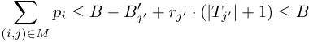

_which concludes the proof._ 

We omit the proofs of the following two lemmas due to space constraint, please refer to our full paper2 . **Lemma 4** _The mechanism FEITE is individually rational for both users and platform._ 

**Lemma 5** _The mechanism FEITE satisfies computational efficiency._ 

**Theorem 1** _Our proposed mechanism FEITE is an incentive compatible, budget feasible, individually rational, and computational efficient mechanism._ 

## **Theoretical Guarantee of Revenue** 

To show the theoretical guarantee of FEITE on revenue, we first introduce the large market assumption. **Assumption 1 (Large Market Assumption)** _We assume ci ≪ B and rj ≪ B for each user i and each task j._ Intuitively, it’s assumed that each individual user or task is negligible compared with the budget. This assumption is widely adopted in previous work (Vaze 2017; Anari, Goel, and Nikzad 2014) and it is practical in real world as the revenue of a single ride is indeed very small. 

Next, we prove the theoretical guarantee under tight budget. 

2https://arxiv.org/abs/1911.07706 

**Theorem 2** _Under the large market assumption, we have_ �( _i,j_ ) _∈M__rj≥B if the budget is tight._ 

**Proof** _Let j_ 1 _be the first task that is discarded because of budget constraint, j_ 0 _the last task added to G__′_ _before j_ 1 _, and |Tj_ 0 _| (|Tj_ 1 _|) the number of tasks in G__′_ _before considering j_ 0 _(j_ 1 _). Assume that the set of tasks allocated between considering j_ 0 _and j_ 1 _is AT , and the total payment for them is PA. We have rj_ 0 _·_ ( _|Tj_ 0 _|_ + 1) _≤ Bj__′_ 0_and rj_1_·_(_|Tj_1_|_+ 1)_> B_ _j__′_ 1_._ _Since the payments to users in AT are all between rj_ 0 _and rj_ 1 _, we can get that_ 

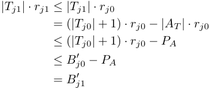

_Combining the above inequations, we have_ 

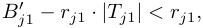

_and further we obtain_ 

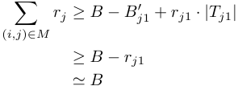

_where the first inequation is because of the individual rationality of both platform and users and the last approximate equation is due to the large market assumption._ 

Before we prove the theoretical guarantee under sufficient budget, we first demonstrate that a greedy algorithm as shown in Algorithm 2 has an approximation ratio of 2, i.e., it can achieve at least half of the optimal revenue under sufficient budget. 

**Algorithm 2:** A Greedy Mechanism 

- **1 for** _each task j in decreasing order of rj_ **do 2 for** _each edge_ ( _i, j_ ) _of task j_ **do 3 if** _user i is not matched_ **then 4** Match _i_ with _j_ . **5** Skip to next task. 

**Lemma 6** _Algorithm 2 is a 2-approximation algorithm if the budget is sufficient._ 

The proof is provided in our full paper due to space limitation. 

Next, we prove the following lemma by showing that the allocation of our mechanism coincides with a particular run of the greedy algorithm. 

**Theorem 3** _The mechanism FEITE is a 2-approximation mechanism if the budget is sufficient._ 

**Proof** _Since the budget is sufficient, we know that no task is discarded due to the budget limitation. We denote the matching in our mechanism as M . It’s assumed that this matching is produced as following: For each task j in decreasing order of rj, if j ∈ M , we allocate task j to its matched user in M , otherwise the task is skipped. Now we prove that, in the greedy algorithm, this process can also happen._ 

_It’s obvious that for task j ∈ M , we can assign task j to its matched user in M in the greedy algorithm, thus we only need to prove that for each task j̸ ∈ M , when we consider it in the greedy algorithm, there is no unassigned user that has an edge to j._ 

_Next, for contradiction, assume that we can find such an unmatched user i that has an edge to j̸ ∈ M when processing j in the greedy algorithm. Then in our mechanism, when considering j, there will be a right-perfect matching for graph G__′_ _∪{j}, i.e., M ∪_ ( _i, j_ ) _. Thus, the task will be added to G__′_ _. Note that in our mechanism, any task added to G__′_ _will end up being matched. This contradicts with our assumption and hence the lemma is proved._ 

To understand how “good” the approximation ratio of 2 is, next we prove that the lower bound is at least _√_ 2. 

**Theorem 4** _There is no mechanism that satisfies incentive compatibility and individual rationality can achieve better than √_ 2 _-approximation when the budget is sufficient._ 

**Proof** _We prove the lemma with a concrete counter example. Assume there exists a mechanism F that can achieve an approximation ratio better than √_ 2 _. Consider case 1 where there are two users {a, b}, three tasks {_ 1 _,_ 2 _,_ 3 _} and 4 edges {_ ( _a,_ 1) _,_ ( _a,_ 2) _,_ ( _b,_ 2) _,_ ( _b,_ 3) _}. In addition, we have that ca_ = _ϵ, cb_ = _√_ 2 + 1 _, r_ 1 = 1 + _ϵ, r_ 2 = _√_ 2 + 1 + _ϵ, r_ 3 = _√_ 2 + 1 _, where ϵ is a small positive number. We can observe that the optimal matching should be {_ ( _a,_ 2) _,_ ( _b,_ 3) _} which achieves revenue of_ 2 _√_ 2 + 2 + _ϵ, we now prove that any mechanism that satisfies the above properties can achieve total revenue of at most_ 2 + _√_ 2 + 2 _ϵ._ 

_First we consider case 2 where the only difference with case 1 is that cb_ = _√_ 2 + 1 + 2_<u>ϵ</u>andhencetheedge_(_b,_3) _has to be deleted. In case 2, mechanism F can only output the matching {_ ( _a,_ 1) _,_ ( _b,_ 2) _<u>},</u> otherwise, the approximation can be at least__<u>r</u>_<u>1+</u>_<u>r</u>_<u>2</u> _> √_ 2 _. Moreover, due to individual r_ 2 _rationality, pb ≥ √_ 2 + 1 + 2_<u>ϵ</u>._ 

_Then we consider case 1, in the output matching of F , if user b is matched with task_ 3 _, the payment is at most_ 1 + _√_ 2 _and the utility of user b is at most 0. If user b misreports cost of √_ 2 + 1 + 2_<u>ϵ</u>, it becomes case 2, and as stated above,_ _the utility of user b can be at least_ 2_<u>ϵ</u>.Thus,forincentive_ _compatibility, mechanism F has to allocate task_ 2 _to user b and pay at least √_ 2 + 1 + 2_<u>ϵ</u>. Hence the output matching_ _of F can achieve revenue of at most_ 2 + _√_ 2 + 2 _ϵ, and the approximation ratio limit is √_ 2 _when ϵ →_ 0 _._ 

**Practical Implication:** We now show how those results can be used when setting budget in a real dynamic system. The platform can set sufficient budget in the first time and obtain a revenue _Rsuf_ , then based on Theorem 3, we know 

the optimal revenue is at most 2 _·Rsuf_ . After that, the platform is able to set a tight budget _B_ = _β · Rsuf_ , and Theorem 2 guarantees that it achieves at least _β/_ 2 of the revenue of optimal solution. This way, the platform can control the budget while there are not a lot of revenue loss. 

## **Evaluation** 

We conduct simulation using a real-world dataset obtained from a large bike-sharing company in China called Mobike. The bike riding data cover 8 _×_ 8 regions of Beijing with each region being 0.6km _×_ 0.6km, and are dated from May 10th to 14th, 2017. With the same distribution of destinations in this dataset, we build a simulator which can randomly generate users’ destinations. In the experiments, we set the number of users _n_ = 200, and test different location numbers _m_ . The cost of each user _ci_ is drawn from uniform distribution over [0 _,_ _<u>c</u>_ ] where _<u>c</u>_ = 5. The value of a task is calculated as the difference between the Kullback-Leibler (KL) divergences (Kullback and Leibler 1951) before and after fulfilling the task, similarly to previous work (Pan et al. 2019; Lv et al. 2019). Because of the space limitation, we refer the authors to (Lv et al. 2019) for concrete calculation of the task value. The acceptable range _h_ is set as 300m and 600m, respectively. We also test the budget of 50 and 500 where 500 is sufficient while 50 is not. In addition, we conduct each experiment 10 times and take the average. 

We compare FEITE with the following mechanisms: 

- **APP-OPT:** As the budgeted matching problem is an NPhard problem (it can be reduced to the knapsack problem), we cannot give an optimal allocation as benchmark. However, if the budget is tight and the large market assumption holds simultaneously, the following strategy is approximately an optimal mechanism: consider edges in decreasing order of _rj/bi_ , match user _i_ and task _j_ if they are not ever matched before, and pay user _i_ exactly her bid. The process stops until the budget is exhausted or there are no more edges. This mechanism achieves the maximum revenue under the above two assumptions but it’s not truthful. 

- **Greedy:** The greedy mechanism considers users in increasing order of their bids and allocates the task with the highest value as long as it is higher than the bid of the user. Once a user is matched, the price for all winning users is updated as the bid of her next user (whose bid is higher). The mechanism stops once a user cannot find a feasible task or the overall payment is above the budget, and pays all the winning users the bid of this unmatched user. If all users can be matched, we don’t match the last one, and set her bid as the price for all other users. This greedy mechanism is incentive compatible but cannot provide any theoretical guarantee. 

- **Surge:** Surge pricing is widely used in practice and it’s an effective way to promote the revenue of platform (Guda and Subramanian 2019). We adopt a simple version of surge pricing here. Consider users in increasing order of their bids and allocate the task with the highest value to them once _αrj_ is higher than the bid of the user, where 

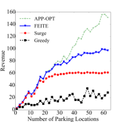

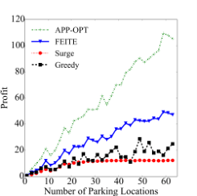

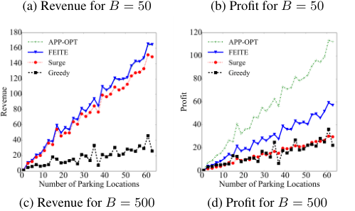

<!-- Start of picture text -->
(a) Revenue for  B = 50 (b) Profit for  B = 50 (c) Revenue for  B = 500 (d) Profit for  B = 500 <!-- End of picture text -->

Figure 3: Revenue and profit comparison when _h_ = 300 _m_ . 

_α ∈_ (0 _,_ 1) is a surge factor and _rj_ is the value of the task. The user is paid _αrj_ . The algorithm also terminates until the budget is exhausted or there are no feasible users. In the experiments, we set _α_ = 0 _._ 8. It can be easily shown that the Surge mechanism is not truthful. 

### **Results** 

The experiment results for different acceptable extra distance _h_ = 300 _m_ and _h_ = 600 _m_ are given in Figure 3 and Figure 4, respectively. In Figure 3, we show the revenue and profit of platform under different parking location number _m_ and different budget _B_ . In general, as _m_ increases, revenue and profit both increase, because of more right nodes in the bipartite graph. When the budget is tight ( _B_ = 50), we make the following specific observations. The revenue and profit of our mechanism are constantly higher than Surge and Greedy. When _m_ is less than 30, as the bipartite graph is small, the budget is enough and our mechanism achieves nearly the same revenue as APP-OPT. When _m_ is larger than 30, the budget will be exhausted and the revenue (and hence profit) of Surge mechanism stops increasing because it always has a constant ratio between payment and revenue. However, FEITE can output a better matching when the bipartite graph is larger and it shows much better performance over Surge and Greedy on both revenue and profit. When the budget is sufficient, our mechanism is not as good as APPOPT but outperforms the others. As APP-OPT pays users exactly their costs, the mechanism is budget-saving but not practical in application because users will bid higher costs. 

In Figure 4, _h_ is larger so more edges appear in the bipartite graph. In this case, the performance of APP-OPT, FEIT- 

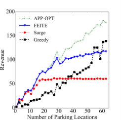

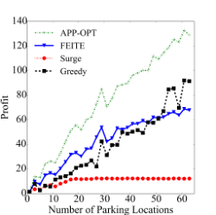

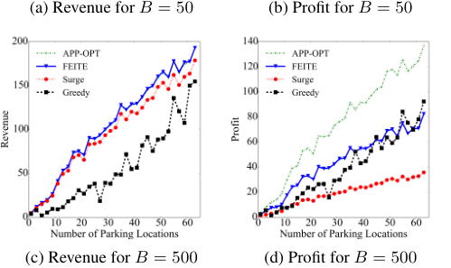

<!-- Start of picture text -->
(a) Revenue for  B = 50 (b) Profit for  B = 50 (c) Revenue for  B = 500 (d) Profit for  B = 500 <!-- End of picture text -->

Figure 4: Revenue and profit comparison when _h_ = 600 _m_ . 

E and Surge are similar to Figure 3, but Greedy shows both much better revenue and profit. This is due to the fragility of Greedy mechanism as a single user can determine the termination of the mechanism. Thus, when _B_ = 300 _m_ , the mechanism stops quickly because of the lack of edges, and when _B_ = 600 _m_ , the termination is delayed. To show this, we test another 100 rounds of _m_ = 60 for both Greedy and FEITE, and the maximum revenue of Greedy is 161.3, the minimum revenue is 19.7, and the variance is 648.1, while the data for FEITE is 127.2, 98.8 and 32.2 respectively. The profit shows similar results. Therefore, although Greedy can sometimes be slightly better than our mechanism, it is fragile and has much larger fluctuation. 

In summary, our mechanism FEITE performs well on both revenue and profit, on top of its several desirable theoretical properties. 

## **Conclusion and Future Work** 

In this paper, we have proposed an incentive mechanism to solve the bike rebalancing problem with predicted task value for bike sharing systems. It has desired theoretical properties as it satisfies incentive compatibility, budget feasibility, individual rationality and computational efficiency. In particular, we gave two theoretical guarantees under different budget constraints, and we showed how it can be applied in real dynamic systems. Its practical performance was evaluated using simulations based on real-world data, and the results demonstrate its superiority in terms of both revenue and profit. In our future work, we will explore tighter lower bounds and upper bounds for the problem. In addition, we plan to extend our algorithm into a real-time decision- 

making mechanism while maintaining the theoretical properties, and conduct pilot studies in actual cities. 

## **Acknowledgments** 

This work was supported in part by Science and Technology Innovation 2030 –“New Generation Artificial Intelligence” Major Project No. 2018AAA0100905, in part by China NSF grant No. 61972252, 61972254, 61672348, and 61672353, in part by Joint Scientific Research Foundation of the S- tate Education Ministry No. 6141A02033702, in part by the Open Project Program of the State Key Laboratory of Mathematical Engineering and Advanced Computing No. 2018A09, and in part by Alibaba Group through Alibaba Innovation Research Program. The opinions, findings, conclusions, and recommendations expressed in this paper are those of the authors and do not necessarily reflect the views of the funding agencies or the government. 

## **References** 

Anari, N.; Goel, G.; and Nikzad, A. 2014. Mechanism design for crowdsourcing: An optimal 1-1/e competitive budget-feasible mechanism for large markets. In _Proceedings of the 55th IEEE Annual Symposium on Foundations of Computer Science_ , 266–275. IEEE. 

Angelopoulos, A.; Gavalas, D.; Konstantopoulos, C.; Kypriadis, D.; and Pantziou, G. 2018. Incentivized vehicle relocation in vehicle sharing systems. _Transportation Research Part C: Emerging Technologies_ 97:175–193. 

Angeloudis, P.; Hu, J.; and Bell, M. G. 2014. A strategic repositioning algorithm for bicycle-sharing schemes. _Transportmetrica A: Transport Science_ 10(8):759–774. 

Fricker, C., and Gast, N. 2016. Incentives and redistribution in homogeneous bike-sharing systems with stations of finite capacity. _Euro journal on transportation and logistics_ 5(3):261–291. 

Ghosh, S., and Varakantham, P. 2017. Incentivizing the use of bike trailers for dynamic repositioning in bike sharing systems. In _Proceedings of the Twenty-Seventh International Conference on Automated Planning and Scheduling_ . AAAI Press. 

Guda, H., and Subramanian, U. 2019. Your uber is arriving: Managing on-demand workers through surge pricing, forecast communication, and worker incentives. _Management Science_ 65(5):1995–2014. 

Kek, A. G.; Cheu, R. L.; Meng, Q.; and Fung, C. H. 2009. A decision support system for vehicle relocation operations in carsharing systems. _Transportation Research Part E: Logistics and Transportation Review_ 45(1):149–158. 

Kullback, S., and Leibler, R. A. 1951. On information and sufficiency. _The annals of mathematical statistics_ 22(1):79– 86. 

Laporte, G.; Meunier, F.; and Calvo, R. W. 2015. Shared mobility systems. _4or_ 13(4):341–360. 

Li, Y., and Zheng, Y. 2019. Citywide bike usage prediction in a bike-sharing system. _IEEE Transactions on Knowledge and Data Engineering_ . 

Liu, Y.; Jia, R.; Xie, X.; and Liu, Z. 2018. A two-stage destination prediction framework of shared bicycles based on geographical position recommendation. _IEEE Intelligent Transportation Systems Magazine_ 11(1):42–47. 

Luo, T.; Kanhere, S. S.; Das, S. K.; and Hwee-Pink, T. 2016. Incentive mechanism design for heterogeneous crowdsourcing using all-pay contests. _IEEE Transactions on Mobile Computing_ 15(9):2234–46. 

Lv, H.; Wu, F.; Luo, T.; Gao, X.; and Chen, G. 2019. Hardness of and approximate mechanism design for the bike rebalancing problem. _Theoretical Computer Science_ . 

Maggioni, F.; Cagnolari, M.; Bertazzi, L.; and Wallace, S. W. 2019. Stochastic optimization models for a bikesharing problem with transshipment. _European Journal of Operational Research_ 276(1):272–283. Myerson, R. B. 1981. Optimal auction design. _Mathematics of operations research_ 6(1):58–73. Pan, L.; Cai, Q.; Fang, Z.; Tang, P.; and Huang, L. 2019. A deep reinforcement learning framework for rebalancing dockless bike sharing systems. In _Proceedings of the AAAI Conference on Artificial Intelligence_ , volume 33, 1393– 1400. AAAI Press. 

Schuijbroek, J.; Hampshire, R. C.; and Van Hoeve, W.-J. 2017. Inventory rebalancing and vehicle routing in bike sharing systems. _European Journal of Operational Research_ 257(3):992–1004. 

Singer, Y. 2010. Budget feasible mechanisms. In _Proceedings of the 51st IEEE Annual Symposium on Foundations of Computer Science_ , 765–774. IEEE. 

Singla, A.; Santoni, M.; Bart´ok, G.; Mukerji, P.; Meenen, M.; and Krause, A. 2015. Incentivizing users for balancing bike sharing systems. In _Proceedings of the AAAI Conference on Artificial Intelligence_ . AAAI Press. 

Vaze, R. 2017. Online knapsack problem and budgeted truthful bipartite matching. In _Proceedings of the IEEE INFOCOM 2017-IEEE Conference on Computer Communications_ , 1–9. IEEE. 

Waserhole, A.; Jost, V.; and Brauner, N. 2013. Vehicle sharing system optimization: Scenario-based approach. 2013b. _URL http://hal.archives-ouvertes.fr/hal-00727040_ . 

Yang, Z.; Hu, J.; Shu, Y.; Cheng, P.; Chen, J.; and Moscibroda, T. 2016. Mobility modeling and prediction in bikesharing systems. In _Proceedings of the 14th Annual International Conference on Mobile Systems, Applications, and Services_ , 165–178. ACM. 

Zhang, J.; Zheng, Y.; Qi, D.; Li, R.; and Yi, X. 2016. Dnnbased prediction model for spatio-temporal data. In _Proceedings of the 24th ACM SIGSPATIAL International Conference on Advances in Geographic Information Systems_ , 92. ACM. 

Zhang, C.; Wu, F.; and Bei, X. 2018. An efficient auction with variable reserve prices for ridesourcing. In _Proceedings of the Pacific Rim International Conference on Artificial Intelligence_ , 361–374. Springer. 

