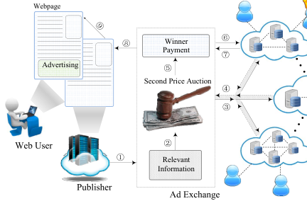
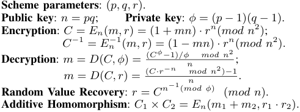
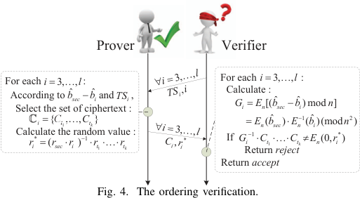
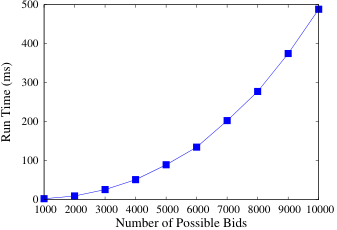
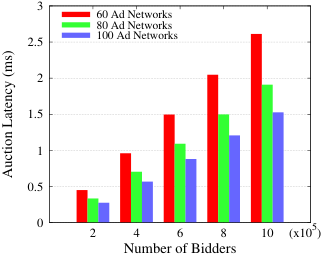
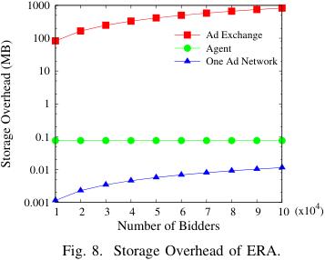

# An Efficient, Privacy-Preserving, and Verifiable Online Auction Mechanism for Ad Exchanges 

Minping Zhou, Chaoyue Niu, Zhenzhe Zheng, Fan Wu, and Guihai Chen 

Shanghai Key Laboratory of Scalable Computing and Systems 

Shanghai Jiao Tong University, China 

_{_ zhouminping1991, rvincency, zhengzhenzhe220 _}_ @gmail.com; _{_ fwu, gchen _}_ @cs.sjtu.edu.cn 

**_Abstract_ —Ad exchanges are kind of the most popular online advertising marketplaces for trading ad spaces over the Internet. Ad exchanges run auctions to sell the ad spaces on publishers’ web-pages to advertisers, who want to display ads on the ad spaces. However, the parties in the auction cannot check whether the auction is carried out correctly or not. Furthermore, the advertisers are usually not willing to reveal their sensitive information when participating in the auction. In this paper, we jointly consider the auction verifiability and advertisers’ privacy preservation, and propose ERA, which is an** **<u>Efficient, pRivacy-preserving, and verifiAble online auction mechanism for</u> ad exchanges. ERA exploits an Order Preserving Encryption Scheme (OPES) to guarantee privacy-preservation, and achieves verifiability by integrating a Certified Bulletin Board (CBB) and a protocol of Privacy-Preserving Integer Comparison (PPIC), which is based on the Paillier’s Homomorphic Encryption Scheme (PHES). We extensively evaluate the performance of ERA, and our evaluation results show that ERA satisfies the properties of verifiability and privacy-preservation with low overhead, so ERA can be easily deployed in today’s ad exchanges.** 

## I. INTRODUCTION 

An ad exchange is considered as a new type of Internet market, where ad places on web-pages are traded in realtime via an auction mechanism. A number of ad exchanges have emerged on the Internet, such as DoubleClick [1], RightMedia [2] and OpenX [3]. There are billions of ad transactions per day across more than 2 million websites [4], and Internet companies, such as Google and Microsoft, have extracted a large amount of revenue every year from the ad transactions in their ad exchange platforms. 

In ad exchanges, auctions are regarded as the most important core technique to efficiently allocate ad spaces. In an ad auction, interested advertisers are allowed to bid for an ad space, and the highest bidding advertiser gets the opportunity to present her advertisement. However, the current ad auction has two undesirable problems: privacy leakage and auction manipulation. On one hand, advertisers are required to submit their bids to participant in the ad auction, which will inevitably disclose their private information. On the other hand, publishers and advertisers have no control over the 

This work was supported in part by the State Key Development Program for Basic Research of China (973 project 2014CB340303), in part by China NSF grant 61422208, 61472252, 61272443 and 61133006, in part by CCF-Intel Young Faculty Researcher Program and CCF-Tencent Open Fund, in part by the Scientific Research Foundation for the Returned Overseas Chinese Scholars, and in part by Jiangsu Future Network Research Project No. BY2013095-1-10. The opinions, findings, conclusions, and recommendations expressed in this paper are those of the authors and do not necessarily reflect the views of the funding agencies or the government. 

F. Wu is the corresponding author. 

outcome determination, and are forced to unconditionally accept it, even if the ad exchange manipulates the auction. Under this paradigm, the correctness of ad auctions is totally relied on the reputation of ad exchanges. Thus, it is highly needed to design an ad auction mechanism that achieves both _privacy-preservation_ and _verifiability_ . In a privacy-preserving and verifiable auction, ad exchanges are able to calculate the auction outcome, and prove its correctness without knowing the private information of advertisers. If privacy-preservation and verifiability are guaranteed, ad exchanges will attract a wider range of advertisers and publishers to engage in. 

However, existing auction mechanisms rarely considered these two properties at the same time. The auction mechanisms [5] [6] [7] achieved verifiability with the assumption that the bid information should be revealed to the auctioneer. Although some researchers have proposed solutions for the problem of bid privacy-preservation [8], they ignored the consideration of verifiability. Moreover, the auction in the ad exchange is fundamentally different from these conventional auction mechanisms due to the following two requirements: 

_• Low-Latency_ : Unlike traditional goods, ad spaces are supremely perishable. If an auction for an ad space does not complete before the web-page is rendered on the user’s browser, then the opportunity to place an ad is lost. Therefore, the time for executing the ad auction is usually limited in a short time interval, _e.g._ , typically 100 milliseconds [9]. 

_• Large-Scale_ : There are billions of auctions for ad spaces per day with millions of advertisers participating in [4] [10]. 

Considering the above two requirements, there exists many challenges designing an efficient ad auction mechanism to achieve both privacy-preservation and verifiability. 

The first design challenge is the efficiency requirement of ad auctions, _i.e._ , ad auctions should support a large scale of advertisers with low latency. The process of winner determination and payment calculation should be computed in a short time, which hinders the application of time-consuming encryption schemes even if they have good security properties. The second design challenge comes from the requirement of privacy-preservation. The outcome of the auction should be calculated without knowing private information of advertisers. This seems to be contradictory, because the auctioneer should examine all bids to determine the winner and payment. The last but not least design challenge is the verifiability. Although the auction verification can be performed offline, and has no strict time restriction, it is not a easy job to design a verifiable auction without breaking the property of privacy-preservation. 

978-1-4799-5952-5/15/$31.00 ©2015 IEEE 

In this paper, we jointly consider the three design challenges, and develop ERA, which is an <u>Efficient, pRivacy-</u> preserving, and verifiAble online auction mechanism for ad exchanges. ERA first models the ad space allocation as a threetier auction model: one auctioneer, intermediary ad networks and advertisers. Rather than imposing all computation on the ad exchange, the intermediary ad networks can help the ad exchange calculate the auction outcome in a parallel way, and thus the auction latency can stay at a low level. By using OPES, ERA then encrypts the bids of advertisers while still maintaining the order of bids. Therefore, the auction outcome can be calculated in the ciphertext domain, which guarantees the property of privacy-preservation. At last, ERA achieves the property of verifiability by adopting a protocol of PPIC, which is based on PHES. 

In general, our contributions are summarized below: 

_•_ We model the problem of ad space allocation in ad exchanges as a three-tier auction model, in which there are one auctioneer, intermediary ad networks, and advertisers. 

_•_ We propose an efficient, privacy-preserving and verifiable online auction mechanism for ad exchanges, namely ERA. To the best of our knowledge, ERA is the first _private-preserving_ and _verifiable_ auction mechanism that can support a large scale of advertisers with low latency. 

_•_ We have implemented ERA, and extensively evaluated its performance. Our evaluation results show that ERA achieves good efficiency and is practical for today’s ad exchanges. 

The remainder of this paper is organized as follows. The ad exchange model and required properties are proposed in Section II. We describe several relevant cryptographic tools in Section III, and propose a protocol of PPIC in Section IV. The detailed design of ERA is proposed in Section V. In Section VI, we evaluate ERA, and report evaluation results. In Section VII, we briefly review the related work. Finally, we draw conclusions in Section VIII. 

## II. PRELIMINARIES 

In this section, we first propose the system model and auction model for ad exchanges, and then present two required properties for a practical ad exchange. 

## _A. System Model_ 

We consider a real-time online advertising marketplace, where there are web users, publishers, one ad exchange, ad networks, and advertisers. Generally, every view of web users on a publisher’s web-page stimulates the conduct of a secondprice ad auction, in which the ad spaces on the web-page are efficiently sold to advertisers. We now describe the system model of an ad exchange, which is based on the model proposed by Muthukrishnan [11], and is a generalization of current ad exchange models in the literature. 

As shown in Figure 1, an ad auction is initiated when a webuser visits to a publisher’s web-page, which contains an HTML iframe of JavaScript snippet that generates an ad request to the ad exchange (Step _⃝_ 1 ). From the ad request, the ad exchange can extract the relevant information, _e.g._ , the behaviour feature of the web-user, the reserve price set by the publisher and the type of the ad space (Step _⃝_ 2 ). The relevant information is transmitted to all advertisers through ad networks (Step _⃝_ 3 ). 

<!-- Start of picture text -->
������� � ������ � ������� � ������� ���� � �������������������� � � � � ��������� ����������� � <!-- End of picture text -->

Fig. 1. An ad exchange ecosystem. 

Based on these information, advertisers can accurately derive the valuation over the ad space. The advertisers submit their bids, which are calculated according to their valuations, to the ad networks they belong to, and then to the ad exchange (Step _⃝_ 4 ). According to the reported bids, the ad exchange runs a second-price auction to determine the winner and her payment, which are published to the public (Step _⃝_ 5 ). The ad exchange requires the winner to submit her ad tag and charge, which are further sent to the publisher. (Step _⃝_ 6 , _⃝_ 7 and _⃝_ 8 ). Finally, the publisher presents the winner’s advertisement on her web-page (Step _⃝_ 9 ). This process typically completes within 100ms. 

## _B. Auction Model_ 

We model the ad space trading as a sealed bid auction with a single item. The trading items in ad auctions are ad spaces, which are classified into several types, _e.g._ , videos, images, and texts, based on the information of web-pages. Without loss of generality, we consider a specific type of ad spaces in the following discussion. In our ad auction model, there are four major participants: ad bidders, ad networks, an agent, and an auctioneer, which are introduced in details as follows. 

_Ad bidders:_ The set of _l_ ad bidders are denoted by S = _{s_ 1 _, s_ 2 _, . . . , sl}_ . Each bidder _si ∈_ S has an ad tag and an _original_ bid _bi_ for the trading ad space. The original bids of all bidders are denoted by **b** = _{b_ 1 _, b_ 2 _, · · · , bl}_ . 

_Agent:_ We introduce a new party, called agent, to provide bidders with _mapped_ bids, which are used to design a privacypreserving auction. The agent employs OPES to construct the set of mapped bids, denoted by**ˆ** **_b_** = �ˆ _b_ 1 _,_ ˆ _b_ 2 _, . . . ,_ ˆ _bl_ �. We assume that the agent is honest-but-curious1 . 

_Ad networks:_ The set of _m_ ad networks is denoted by A = _{a_ 1 _, a_ 2 _, . . . , am}_ . Each ad network _aj ∈_ A contains a few subscribed ad bidders, who pre-store their mapped bids and ad tags on the ad network _aj_ . In this way, the bidders do not need to encrypt and submit their bids on the fly, and thus the interaction between bidders and ad networks can be reduced. 

_Auctioneer:_ The auctioneer acts as the ad exchange: calculate the auction outcome: the winner _smax_ and payment _bsec_ . We now define two requirements of ad auctions as follows. _Definition 1 (Privacy-Preserving Ad Auction):_ An ad auction is _privacy-preserving_ if and only if _no_ more information than the outcome of the auction, _i.e._ , _smax_ and _bsec_ , is revealed to any participant in the auction. 

> 1The agent is honest-but-curious if she follows the designed protocol but tries to gather information about other participants. 

**System parameters** ( _g, h, Gq_ ). **Sender’s input** : **M** = ( _m_ 1 _, m_ 2 _, . . . , mn_ ); **Receiver’s choice** : _α_ . **Protocol** : 

1. R sends to S: _y_ = _g__r_ _h__α_ , _r ∈R Zq_ ; 2. S replies _ξi_ = ( _g__ki_ _, mi_ ( _y/h__i_ )_ki_ ) _, ki ∈R Zq,_ 1 _≤ i ≤ n_ ; 3. By _ξα_ = ( _a, b_ ), R computes _mα_ = _b/a__r_ . 

Fig. 2. **Efficient 1-out-of-n Oblivious Transfer (OT)** 

<!-- Start of picture text -->
Scheme parameters : ( p, q, r ). Public key : n  =  pq ; Private key : φ  = ( p − 1)( q − 1). Encryption : C =  En ( m, r ) = (1 +  mn )  · r n ( mod n 2 ); C − 1 =  En − 1( m, r ) = (1  − mn )  · rn ( mod n 2) . mod n 2 DecryptionRandom Value : mm  = = Recovery  D D (( C, φC, r ) =) =: r = (( CC  C ·φrn−−− 1 n )1 /φ ( mod nnmod φ n ) 2 )( −mod 1;. n ). Additive Homomorphism : C 1  × C 2 =  En ( m 1 +  m 2 , r 1  · r 2) . <!-- End of picture text -->

Fig. 3. **Paillier’s Homomorphic Encryption Scheme (PHES)** 

_Definition 2 (Verifiable Ad Auction):_ An ad auction is verifiable if and only if the outcome of the auction can be verified by ad bidders and any external party. 

## III. CRYPTOGRAPHIC TOOLS 

In this section, we briefly describe the cryptographic tools. **Certified Bulletin Board (CBB)** is an electronic version of traditional bulletin board, which can be a public and trustworthy website maintained and updated by a certain authority. A CBB can be read by anybody, but can be written only by some authorized parties, such as the auctioneer and ad networks. We note that all posts on the CBB should be signatured by the corresponding data owners for non-repudiation. The CBB is introduced to solve the problem of information asymmetry so as to facilitate the design of verifiable auctions. 

**Order Preserving Encryption Scheme (OPES)** , introduced by Agrawal _et al._ in paper [12], is an encryption technique that preserves the ordering of plaintexts in the ciphertext space. The OPES allows the auctioneer to learn the order of plaintexts by applying comparison operations on the mapped data. By exploiting this property, the auction outcome can be calculated among the mapped bids, such that the property of privacy-preservation can be achieved. 

**Efficient 1-Out-n Oblivious Transfer (** **_OT_ )** was proposed in [13] to secretly exchange a certain message between a sender S and a receiver R. Specifically, the sender S has _n_ messages: **M** = ( _m_ 1 _, m_ 2 _, . . . , mn_ ), and the receiver R wants to know one of the messages, _e.g._ , _mα_ . The _OT_ guarantees that R just obtains the message _mα_ without knowing the other _n −_ 1 messages, and S does not know the receiver’s choice _α_ . Figure 2 shows the pseudocode. 

**Paillier’s Homomorphic Encryption Scheme (PHES)** [14] introduced by Paillier, is shown in Figure 3, where _p_ and _q_ are two large primes. The parameter _r ∈_ [1 _, n_ ] is a random value, and should be the common divisor of _n_ . 

IV. PRIVACY-PRESERVING INTEGER COMPARISON 

In this section, we propose a PPIC protocol, which is the basic for the design of the verifiable ad auction in next section. In PPIC protocol, there are two parties: a prover P and a verifier V. The prover P knows two non-negative integers 

_x_ 1 and _x_ 2 as well as their comparison relation, _e.g._ , _x_ 1 _≥ x_ 2. The main goal of P is to convince V that the declared comparison relation, _i.e._ , _x_ 1 _≥ x_ 2, is true without disclosing the value of _x_ 1 and _x_ 2. Here, we emphasize that if _x_ 1 _< x_ 2, it is computationally infeasible for P to convince V that _x_ 1 _≥ x_ 2. 

For two non-negative integers _x_ 1 _, x_ 2 _< n/_ 2, the inequality _x_ 1 _≥ x_ 2 holds if and only if ( _x_ 1 _− x_ 2) _mod n < n/_ 2. In order to demonstrate that _x_ 1 _≥ x_ 2, P can prove the three inequalities: _x_ 1 _< n/_ 2, _x_ 2 _< n/_ 2, and ( _x_ 1 _− x_ 2) _mod n < n/_ 2. Therefore, the problem of PPIC can be reduced to _Range Proof_ : the prover P, who knows the value of a plaintext _x_ , proves to V that _x <_ 2_t_ _≤ n/_ 2 without leaking _x_ . 

Before proposing the Range Proof protocol, we first introduce the concept of test set _TS_ , which is a set of Paillier’s ciphertexts: _TS_ = _{C_ 1 _, C_ 2 _, . . . , Ct},_ where _Ci_ = _En_ ( _mi, ri_ ) and the plaintext _mi_ = 2_i_ . We note that all elements in _TS_ should be randomly ordered to ensure the privacy of _mi_ . 

Given _C_ = _En_ ( _x, rx_ ), P can prove to V that _x <_ 2_t_ _< n/_ 2 by Range Proof, which consists of the following two steps. **Step 1: Proof Generation** An integer _x_ can be uniquely represented by _x_ = 2_t_1 + 2_t_2 + _. . ._ + 2_tk_ _._ The P selects the ciphertext set C _x_ = _{Ct_ 1 _, Ct_ 2 _, . . . , Ctk }_ of the plaintexts 2_t_1 _,_ 2_t_2 _, . . . ,_ 2_tk_ from _TS_ , and uses the corresponding random values _rt_ 1 _, rt_ 2 _, . . . , rtk_ and _rx_ to calculate a new random value: _r__∗_ = ( _rx__−_1 _× rt_ 1 _× rt_ 2 _. . . × rtk_ ) ( _mod n_ ) _._ The set of ciphertexts C _x_ and the random value _r__∗_ are packaged as the proof, which is sent to the verifier V. **Step 2: Verification** After receiving the proof, V can verify the relation _x <_ 2_t_ _< n/_ 2 by calculating the following equation: _En__−_1(_x, rx_)_· Ct_ 1_· Ct_ 2_· . . . · Ct_ _k_(_modn_2) =_En_(0_, r∗_)_,_ Due to the _Additive Homomorphism_ of PHES, the above equation holds if and only if _x_ = 2_t_1 +2_t_2 + _. . ._ +2_tk_ . Together with the fact that the number of elements in C _x_ is less than or equal to _t_ , V can conclude that _x <_ 2_t_ _< n/_ 2. 

Given the three crypttexts _En_ ( _x_ 1), _En_ ( _x_ 2) and _En_ [( _x_ 1 _− x_ 2) _mod n_ ] = _En_ ( _x_ 1) _× En__−_1(_x_2)(_modn_2),aproverPcan convince a verifier V that _x_ 1 _≥ x_ 2 by applying the Range Proof protocol to check the following three inequations: _x_ 1 _<_ 2_t_ _< n/_ 2, _x_ 2 _<_ 2_t_ _< n/_ 2 and ( _x_ 1 _− x_ 2) _mod n <_ 2_t_ _< n/_ 2. 

## V. EFFICIENT, PRIVACY-PRESERVING, AND VERIFIABLE ONLINE AD AUCTION 

In this section, we design an efficient, privacy-preserving, and verifiable online ad auction mechanism. 

## _A. Design Overview_ 

We illustrate the design challenges and design rationale of ERA. The first design challenge is privacy preservation in terms of bids. We introduce an honest-but-curious agent to encrypt the original bids as mapped bids using OPES. Therefore, the ad networks and the auctioneer can learn the ordering of the original bids by comparing the corresponding mapped bids, to calculate the auction outcome. However, the agent can know the original bids if she can obtain the mapped bids, and we tackle this problem by adopting two cryptographic methods. First, each bidder fetches her mapped bid from the agent via OT, which guarantees that the bidder does not leak any information about her original bid during 

the mapped bid selection. However, the agent may still get the mapped bids in some other ways, such as learning the mapped bids from the public information on the CBB. So we require the auctioneer to provide one more encryption on the mapped bids. In this way, as long as there is no collusion between the agent and the auctioneer, the privacy of bid is well protected. 

The second design challenge is auction verification. The ad networks and the auctioneer exclusively possess the bidding information, and any other participant cannot access it. This information asymmetry causes significantly difficulties to design a verifiable auction. To solve this problem, we introduce a CBB to publish the encrypted information, _i.e._ , doubly encrypted bids. We then employ the proposed PPIC protocol to enable any party to verify the order of the mapped bids, _i.e._ , the order of the original bids, and thus verify the correctness of auction execution. 

## _B. Design Details_ 

We now introduce ERA, which consists of three stages: _Initialization_ , _Auction Execution_ , and _Verification Operation_ . _1) Initialization:_ The initialization stage contains two parts: bid encryption and verification preparation. 

**Bid Encryption:** The bid space Θ is defined as the set of _n_ possible bids: Θ = _{θ_ 1 _, θ_ 2 _, . . . , θn} ,_ where _θ_ 1 _≥ θ_ 2 _≥ · · · ≥ θn_ . Based on the bid space, the agent runs OPES to generate a set of mapped bids: Θ =� � _θ_ ˆ1 _,_ ˆ _θ_ 2 _, . . . ,_ ˆ _θn_ � _,_ where _θ_ ˆ _i_ = _OPES_ ( _θi_ ) and _θ_ ˆ1 _≥ θ_ ˆ2 _≥· · · ≥ θ_ ˆ _n_ . Without loss of generality, we assume that the maximum mapped bid is 2_t_ for some _t_ , _e.g._ , _t_ = 32. 

Each bidder _si ∈_ S with original bid _bi_ = _θi′_ contacts the agent to fetch her mapped bidˆ _bi_ = _θ_ˆ _i__′_ from the mapped bid space Θ� via OT. This guarantees that bidder _si_ only knows _θ_ˆ _i′_ , and has no idea of the other _n −_ 1 mapped bids in Θ� , while the agent does not know which mapped bid is chosen by the bidder _si_ . However, the agent may still know the original bid of the bidder _si_ if she can access the mapped bidˆ _bi_ . Therefore, the ad network _aj_ , who is responsible for the bidder _si_ , further encrypts the bidˆ _bi_ using PHES with the public key _n_ and a random value _ri_ . We note that the public key _n_ is provided by the auctioneer, and the random value _ri_ is generated by the ad network _aj_ of the bidder _si_ . The doubly encrypted bid of bidder _si_ is denoted by _ci_ = _En_ (ˆ _bi, ri_ ). 

**Verification Preparation:** To facilitate the auction verification, the following information is posted on the CBB. 

_• l −_ 1 test sets _{TS_ 1 _, TS_ 2 _, · · · , TSl−_ 1 _}_ : these test sets are posted by the auctioneer with her signature, and will be used to verify the comparison relation of the _l_ bids. 

_• l_ commitments _{COM_ 1 _, COM_ 2 _, · · · , COMl}_ : the commitment of the bidder _si ∈_ S is defined as _COMi_ = ( _ci, si_ ). These commitments are calculated and posted by all the ad networks, and will be used to verify the auction outcome. 

_2) Auction Execution:_ The auction execution is divided into two stages: the internal auction stage and the global auction stage. Each ad network _aj ∈_ A conducts an internal auction among her bidder members. The ad network _aj_ selects the highest and second highest mapped bids, and sends them to the auctioneer with the signature. In the global auction stage, the auctioneer chooses the global highest and second highest 

<!-- Start of picture text -->
Prover Verifier For eachAccording toSelect the set of ciphertext : i � i � { C 3, t 1 � , b � ˆ sec , l , C � : tbk ˆ} i and TSi , For eachCalculate : Gi �� EEinn ( � [ b (ˆ b 3, sec ˆ sec � ) �� , Elb ˆ n � i :1) mod( b ˆ i )(mod n ] n 2 ) Calculate the random value : ri * � ( rsec � ri ) � 1 � rt 1 ��� rtk If G Return i � 1 � Ct 1 ���  rejectCtk � En (0, r i *) Return  accept Fig. 4. The ordering verification. �� i 3, � * , l Ci , ri �� i 3, � , l TSi , i <!-- End of picture text -->

mapped bids, _i.e._ ,ˆ _bmax_ andˆ _bsec_ , from the internal outcomes provided by ad networks. Finally, the auctioneer obtains the identity of winner _smax_ and determines the payment. The auctioneer sends the mapped bidˆ _bsec_ to the agent, and the agent sends back the winner’s payment, which is the original bid _bsec_ ofˆ _bsec_ . The agent can obtain this payment by using the inverse function of _OPES_ ( _·_ ): _i.e._ , _bsec_ = _OPES__−_1 (ˆ _bsec_ ) _. 3) Verification Operation:_ At the end of auction execution stage, the ad network in charge of the bidder withˆ _bsec_ is required to mark her commitment, on the CBB for verification. Intuitively, the auction outcome is correct if the ad space is sold to the bidder with the global highest bid, and the payment is equal to the global second highest bid. Formally, we claim that the auction outcome is correct if the two conditions: _bmax ≥ bsec_ and _bsec ≥ bi, ∀i̸_ = _max_ are satisfied. 

We assume that the auctioneer serves as the prover P, and any party can decide to be a verifier V. We now describe _Verifying Algorithm_ , which consists of three components: payment verification, ordering verification, and patching verification. **Step 1: Payment Verification** 

In this step, the auctioneer sends the public key _n_ and random value _rsec_2 to the V. After that, V re-encrypts the mapped paymentˆ _bsec_ provided by the agent: _csec_ = _En_ (ˆ _bsec, rsec_ ). The V then checks whether _csec_ is equal to the marked doubly encrypted payment on the CBB. 

## **Step 2: Ordering Verification** 

As the guarantee of OPES, we can just verify the order of mapped bids to see whether the order of original bids is correct. We assume that the mapped bids are sorted in a nonincreasing order: 

Γ :ˆ _b_ 1 _≥_ˆ _b_ 2 _≥· · · ≥_ˆ _bl,_ 

whereˆ _b_ 1 =ˆ _bmax_ andˆ _b_ 2 =ˆ _bsec_ . For ordering verification, the P should prove that the mapped paymentˆ _bsec_ is equal to or less than the winner’s mapped bidˆ _bmax_ , andˆ _bsec_ is equal to or larger than the mapped bids exceptˆ _bmax_ . Since the _l_ mapped bids are all in the range [1 _,_ 2_t_ ], 2_t_ _≤ n/_ 2, the correctness of the order Γ can be verified by applying PPIC protocol over the _l −_ 1 pairwise comparisons, _i.e._ , _<_ˆ _bsec,_ˆ _bi >, ∀ i̸_ = _sec_ . 

We describe the verification for the _l −_ 2 comparisons _<_ ˆ _bsec,_ ˆ _bi >, ∀_ 3 _≤ i ≤ l_ in Figure 4. The relation of ˆ _bmax_ and ˆ _bsec_ can be verified in a similar way. In order to verify the relation _<_ˆ _bsec,_ˆ _bi >_ , the verifier V chooses a certain test set _TSi_ , and sends it with the index _i_ to the prover P. The prover P then constructs the set of ciphertext C _i_ = _{Ct_ 1 _, Ct_ 2 _· · · , Ctk }_ 

> 2Using her private key _φ_ , the auctioneer can recover the random value _rsec_ , which is generated by the ad network. 

<!-- Start of picture text -->
 500  400  300  200  100  0  1000  2000  3000  4000  5000  6000  7000  8000  9000  10000 Number of Possible Bids Run Time (ms) <!-- End of picture text -->

Fig. 5. Computation overhead of mapped bid generation for each bidder. such thatˆ _bsec −_ˆ _bi_ = 2_t_1 + 2_t_2 + _· · ·_ + 2_tk_ , and calculates a new random value _ri__∗_.BoththesetC_i_andtherandomvalue _ri__∗_aretransmittedbacktotheverifierV,whothencalculates the value of _G__−_ _i_1 _× Ct_ 1 _× · · · × Ctk_ and _En_ (0 _.ri__∗_)todecide whether to accept the ordering verification or not. 

## **Step 3: Patching Verification** 

If the first two verification steps does not pass, the auctioneer is accused of cheating unless she can provide the evidence that the fault of the outcome is caused by some ad networks. The auctioneer uses her private key to decrypt the doubly encrypted bids on the CBB to obtain all mapped bids, and then re-sorts these mapped bids to check the correctness of the internal auction outcome in each ad network. By doing this, the auctioneer can catch the cheating ad networks. 

## VI. EVALUATION RESULTS 

In this section, we show the evaluation results of ERA in terms of computation, storage and communication overhead. **Simulation Setting:** We have implemented ERA using network simulation. The range of possible bids is from $0 _._ 01 to $100 with $0 _._ 01 increment, which is typically the smallest billable unit in today’s ad exchanges [15]. The maximum _mapped_ bid is set as 232 in OPES scheme and PPIC protocol. In OT, the length of the prime _q_ is set as 1024-bit, and the size of _ξi_ is bounded in 32-bit. The PHES is implemented using an open library [16], in which the length of key is set as 1024-bit. The running environment is a standard 64-bit Ubuntu 14 _._ 04 Linux operating system with Intel(R) Core(TM) _i_ 5 3 _._ 10 _GHz_ . 

**Computation Overhead:** We now show the computation overhead of three important components in ERA, _i.e._ , Mapped Bid Generation, Auction Execution and Verification. 

_1) Mapped Bid Generation:_ By averaging the evaluation of 1000 simulation instances, in Figure 5, we plot the computation overhead of the agent for generating mapped bid for one bidder, when the number of possible bids increases from 1000 to 10000. We can see that the computation overhead increases linearly with the number of possible bids, and achieves around 500ms for 10000 possible bids. This is because the computation overhead mainly comes from running the OT, in which the agent should calculate _n_ messages _ξi_ , 1 _≤ i ≤ n_ . 

_2) Auction Execution:_ We measure the metrics of auction latency and auction scale to understand the computation overhead of the auction execution in ERA. 

Figure 6 shows the auction latency of ERA when the number of bidders ranges from 2 _×_ 105 to 10 _×_ 105 with an increment of 2 _×_ 105 , and the number of ad networks can be chosen as 60, 80 and 100. We can see that the auction 

<!-- Start of picture text -->
 3 60 Ad Networks 80 Ad Networks 100 Ad Networks  2.5  2  1.5  1  0.5  0 2 4 6 8 10 (x10 5 ) Number of Bidders Auction Latency (ms) <!-- End of picture text -->

Fig. 6. Auction latency with varying number of bidders and ad networks. 

|||**Verification O**|**verhead (s)**||
|---|---|---|---|---|
|# bidders 4 ( ) 10 �|Prepa|ration|Oper|ation|
||Test Set Generation|Commitment Generation|Ordering|Patching|
|2|4 1.00 10 �|316.85|132.26|117.08|
|4|4 2.00 10 �|631.52|265.69|233.58|
|6|4 3.00 10 �|946.46|393.86|349.78|
|8|4 4.00 10 �|1263.91|527.03|466.04|
|10|4 5.00 10 �|1577.34|656.84|582.61|

Fig. 7. Computation overhead of verification. 

latency of ERA increases with the growing number of bidders when the number of ad networks is fixed, while it decreases when the number of bidders is fixed and the number of ad networks increases. The results demonstrate that ERA can indeed reduce the auction latency by introducing a proper number of intermediary ad networks, especially in large scale auction: we set the upper bound of the auction latency as 10ms and find that the ERA can support more than 5 million bidders. 

_3) Verification:_ We now investigate the computation overhead of the verification, which consists of _Preparation_ phase and _Operation_ phase. In this set of simulation, the maximum number of bidders and the number of ad networks are set as 105 and 100, respectively. Figure 7 plots the evaluation results. 

The Preparation phase is divided into two parts: the generation of test sets by the auctioneer and the generation of commitments by ad networks. In Figure 7, we can see that the auctioneer has higher computation overhead (about 31 _._ 70 _×_ ) than that of one ad network. This is because the auctioneer should calculate _l −_ 1 test sets for the verification with _l_ bidders, around 0 _._ 5s for each test set generation, while one ad network only generate commitments for her bidder members. 

The computation overhead of Operation phase is mainly from the ordering verification and patching verification3 . From Figure 7, we can see that the computation overhead of ordering verification and patching verification increase when there are more bidders in the auction. When the number of bidders is 10 _×_ 104 , the computation overhead of ordering verification and patching verification is 656 _._ 84s and 582 _._ 61s, respectively. 

We can also see from Figure 6 and Figure 7 that the computation overhead of verification is higher that that of auction execution. As the verification can be conducted offline, the running time constrain on verification is not so strict. Therefore, the time consumption of verification is tolerant when ERA is integrated into the practical ad exchanges. 

> 3The computation overhead of the payment verification is omitted here because it is extremely lower than the other two steps. 

<!-- Start of picture text -->
 1000  100 Ad Exchange Agent One Ad Network  10  1  0.1  0.01  0.001  1  2  3  4  5  6  7  8  9  10 (x10 4 ) Number of Bidders Fig. 8. Storage Overhead of ERA. Storage Overhead (MB) <!-- End of picture text -->

**Storage and Communication Overhead:** Figure 8 shows the storage overhead of the ad exchange, the agent and one ad network. The number of possible bids is fixed at 10000, the maximum number of bidders is 105 and the number of ad networks is 100. We can see that the storage overhead of the ad exchange and the ad network grow linearly with the number of bidders, while the storage overhead of the agent remains unchanged. The reason is that the storage overhead of the agent is mainly from storing the original and mapped bids, which are independent of the number of bidders. We also find that the ad exchange costs much more space than the ad network, because the ad exchange has to maintain a Certificate Bulletin Board, on which all test sets and commitments are posted, while each ad network only stores the mapped bids, identities and ad tags of her bidder members. 

We also measure the communication overhead of ERA, which is mainly caused by the interactions in OT and ordering verification. In OT, each bidder receives message _ξ_ with 32bits for each of the 10000 possible bids, while the prover and the verifier need to transfer about 800MB data to perform the ordering verification when the number of bidder is 105 . 

## VII. RELATED WORK 

In this section, we briefly review the related work. Inspired by early works [17], [18], various privacy-preserving and verifiable auction mechanisms have been extensively studied. The existing works mainly fall into the following three categories with different auction models. 

**No Auctioneer** : Bidders themselves jointly determine the auction outcomes by using _secure multiparty computation_ [19], [20]. These mechanisms guaranteed the privacy and correctness of the auction, but induced high computation and communication complexity. Therefore, these mechanisms are inefficient and impractical in the scenario of ad exchanges. 

**One Auctioneer** : One auctioneer is responsible for conducting and calculating the auction. In [5], a method based on the Paillier encryption scheme was proposed to achieve verification. In [6], Rabin _et al._ proposed a novel secure and efficient method for validating the correctness of the auction outcome. However, these mechanisms required that the bid information should be revealed to the auctioneer. 

**Additional Third Party** : An additional third party is introduced to cooperate with the auctioneer to run the auction. The scheme proposed by Naor _et al._ in [21] constructed a Boolean Circuit that calculated the auction outcomes for any given set of bid. Based on RSA, Juels and Szydlo proposed 

a privacy-preserving auction mechanism with a reasonable computational complexity [22]. Unfortunately, these works only guaranteed the privacy of bids, but did not consider the problem of verification. ERA belongs to this category, and moves forwards to solve the problem of verifiability and privacy-preservation at the same time. 

The most relevant work is paper [7], in which an online verifiable auction mechanism for ad exchanges was proposed. However, the interaction between the ad exchange and bidders was too much, and the bid privacy was not considered. ERA is the first efficient, privacy-preserving and verifiable online auction mechanism for ad exchanges. 

## VIII. CONCLUSION 

In this paper, we have proposed the first efficient, privacypreserving, and verifiable auction mechanism for ad exchanges, namely ERA. In ERA, the outcomes of ad auctions can be calculated and verified to be correct, while not disclosing private information of advertisers. We have implemented ERA and extensively evaluated its performance. Evaluation results have demonstrated that ERA satisfies the properties of low-latency and large-scale for ad exchanges. 

## REFERENCES 

- [1] DoubleClick, http://www.google.com/doubleclick/. 

- [2] Right Media, https://advertising.yahoo.com/Publishers/index.htm. 

- [3] OpenX, http://openx.com/product/ad-exchange/. 

- [4] DoubleClick, “Google white paper: The arrival of realtime bidding and what it means for media buyers,” http://static.googleusercontent.com/media/www.google.com/zhCN/us/doubleclick/pdfs/Google-White-Paper-The-Arrival-of-RealTime-Bidding-July-2011.pdf. 

- [5] D. C. Parkes, M. O. Rabin, S. M. Shieber, and C. Thorpe, “Practical secrecy-preserving, verifiably correct and trustworthy auctions,” _Electronic Commerce Research and Applications_ , vol. 7, no. 3, pp. 294–312, 2008. 

- [6] M. Rabin, Y. Mansour, S. Muthukrishnan, and M. Yung, “Strictly-blackbox zero-knowledge and efficient validation of financial transactions,” in _ICALP_ , 2012. 

- [7] S. Angel and M. Walfish, “Verifiable auctions for online ad exchanges,” in _SIGCOMM_ , 2013. 

- [8] Q. Huang, Y. Tao, and F. Wu, “SPRING: A strategy-proof and privacy preserving spectrum auction mechanism,” in _INFOCOM_ , 2013. 

- [9] DoubleClick Ad Exchange Real-Time Bidding Protocol, https://developers.google.com/ad-exchange/rtb/peer-guide. 

- [10] Y. Mansour, S. Muthukrishnan, and N. Nisan, “Doubleclick ad exchange auction,” _arXiv preprint arXiv:1204.0535_ , 2012. 

- [11] S. Muthukrishnan, “Ad exchanges: Research issues,” in _WINE_ , 2009. 

- [12] R. Agrawal, J. Kiernan, R. Srikant, and Y. Xu, “Order preserving encryption for numeric data,” in _SIGMOD_ , 2004. 

- [13] W.-G. Tzeng, “Efficient 1-out-n oblivious transfer schemes,” in _PKC_ , 2002. 

- [14] P. Paillier, “Public-key cryptosystems based on composite degree residuosity classes,” in _EUROCRYPT_ , 1999. 

- [15] Real-Time Bidding Protocol Buffer v.59, https://developers.google.com /ad-exchange/rtb/downloads/realtime-bidding-proto. 

- [16] Advanced Crypto Software Collection, http://hms.isi.jhu.edu/acsc/lib paillier/. 

- [17] H. Nurmi and A. Salomaa, “Cryptographic protocols for vickrey auctions,” _Group Decision and Negotiation_ , vol. 2, no. 4, pp. 363–373, 1993. 

- [18] M. Franklin and M. Reiter, “The design and implementation of a secure auction service,” in _S&P_ , 1995. 

- [19] D. Chaum, C. Cr´epeau, and I. Damgard, “Multiparty unconditionally secure protocols,” in _STOC_ , 1988. 

- [20] F. Brandt, “How to obtain full privacy in auctions,” _International Journal of Information Security_ , vol. 5, no. 4, pp. 201–216, 2006. 

- [21] M. Naor, B. Pinkas, and R. Sumner, “Privacy preserving auctions and mechanism design,” in _EC_ , 1999. 

- [22] A. Juels and M. Szydlo, “A two-server, sealed-bid auction protocol,” in _FC_ , 2003. 

