# MAPM: Movement-based Adaptive Prediction Mechanism for Energy Conservation in Body Sensor Networks 

Yuanyuan Li, Linghe Kong, Fan Wu, Zhenzhe Zheng, Guihai Chen 

Shanghai Key Laboratory of Scalable Computing and Systems 

Shanghai Jiao Tong University, China 

Email: _{_ l.yuanyuan02, linghe.kong, wu-fan, zhengzhenzhe, gchen _}_ @sjtu.edu.cn 

**_Abstract_ —Wearable devices with various sensors are useful instruments to monitor human health. Due to the limited size, these wearable devices, however, always encounter critical energy problem, which further hinders their widely application. Considering that wireless communication dominates the total energy consumption, we make an in-depth study on the problem of communication energy consumption in body sensor networks. We first observe that the communication signals from wearable devices have strong correlation with human movements. Based on this correlation, we propose a Movement-based Adaptive Prediction Mechanism (MAPM). Specifically, we exploit Gaussian process regression to precisely fit and predict the transmission power combined with the characteristics of human movements. This prediction enables transmitters to automatically control their transmission power without feedback. Through simulation, we demonstrate that MAPM can save more than 40% energy compared to the sate-of-the-art methods.** 

## I. INTRODUCTION 

Nowadays, healthcare monitoring is becoming a more and more important issue that people pay attention to, especially the health of the old and the people who have chronic disease. It is necessary to have long-term and continuous monitor for their physiological indices. With the rapid development of wearable devices [3] [18], it is becoming possible to use wearable devices to continuously monitor people’s physiological indices [4], such as blood oxygen, blood pressure, cardiac rate and body temperature. From these collected data, doctors and patients can obtain clear and prompt information about the body condition for a further disease diagnosis and treatment. 

Body sensor network (BSN) is a wireless network of wearable computing devices. One of the most critical problems in BSNs is the energy conservation, which heavily affects the lifetime of a BSN. Wearable devices communicate with each other to exchange necessary information, such as collected sensory data and control instructions, to coordinate their individual operations. Compared with computation and data 

This work was supported in part by the State Key Development Program for Basic Research of China (973 project 2014CB340303), in part by China NSF grant 61422208, 61472252, 61303202, 61272443 and 61133006, in part by Shanghai Science and Technology fund 15220721300, in part by CCFTencent Open Fund, and in part by the Scientific Research Foundation for the Returned Overseas Chinese Scholars. The opinions, findings, conclusions, and recommendations expressed in this paper are those of the authors and do not necessarily reflect the views of the funding agencies or the government. 

measurement, the energy consumption of wireless communication is much higher, and dominates the energy consumption in BSNs. Therefore, finding an appropriate scheme to control the transmission power is an effective way to lower the energy consumption, and can prolong the lifetime. 

In the literature, there are many efforts having contributed in energy conservation in BSNs. However, most of these works ignore the role of human movements. We observe that human movements have some particular patterns. Considering the highly correlation between human movements and wireless signals, we can exploit the patterns of human movements to predict the transmission power from wearable devices. Based on this prediction, sensor nodes dynamically transmit data with power as low as possible, while guaranteeing the transmission performance. Benefitting from the prediction, the receiver does not need to send current condition back, which reduces a lot of energy overhead of communication. 

To design a practical energy conservation mechanism for BSNs, we have to consider the following main challenges. First, the relationships between channel states and human movements can be described by many indicators such as Received Signal Strength Indication (RSSI), link quality indication (LQI) [2], acceleration, and angle acceleration. All these indicators can be sensed by sensors, however, some of sensors cost large energy. Therefore, it is important to select only some suitable indicators in order to balance the energy consumption and sensing accuracy. Second, the change of RSSIs are strongly related to the human activities, however it has no exact expression describe their relationship. It is hard to to depict the signal patterns and further to predict the optimal transmission power. 

In this paper, we make an thorough study on the problem of energy conservation in BSNs, jointly considering the above challenges: First, although accelerator and gyroscope can accurately detect the conditions of human movements, they are energy-intensive, thus unsuitable to estimate human movements. Considering the wide availability and stability [7] [16] of RSSI, we adopt RSSI as our predict indicator. Second, We introduce a general regression model, Gaussian process regression (GPR) [10], to fit the movement pattern. GPR can represent the relationship between variables obliquely, that is, give data more rights to represent themselves. This property allows the prediction model to predict these approximate 

978-1-5090-1328-9/16/$31.00 ©2016 IEEE 

## periodical activities. 

Integrating these components, we devise a _movement-based adaptive prediction mechanism_ , namely MAPM, to conserve the energy consumption in BSNs. Finally, we implement MAPM on the smartphone and USRP to evaluate its effectiveness. Compared to conventional transmission power schemes, the proposed MAPM saves more than 40% energy. 

The contributions of this paper are as follow: 

- Taking the human activities into account, we propose the novel MAPM to minimize the transmission power consumption in body sensor networks. 

- The Gaussian process regression (GPR) and the movement patterns are adopted into MAPM to predict the optimal transmission power according the real-time posture during the periodic activity. We exhibit that GPR is a satisfactory approximation to regress the human activity. 

- Extensive simulations are conducted to evaluate the MAPM. The performance results demonstrate that MAPM can dramatically reduce the energy consumption and it significantly outperforms existing power control methods in body sensor networks. 

The remainder of this paper is organized as follows. In Sec. II, the energy conservation problem in body sensor networks is stated. The observations of strong correlation between received signals and human movements is describes in Sec. III. The design details of Movement-based Adaptive Prediction Mechanism is depicted in Sec. IV and simulated in Sec. V. Sec. VI gives a brief account of the related work. And Sec. VII is our conclusion and future prospect for this paper. 

## II. PROBLEM STATEMENT 

In this section, first, we present the motivation of this problem. We then demonstrate the main idea and model for MAPM. 

## _A. Motivation_ 

Let’s consider the following scenario: two wearable devices are worn on wrist and waist, marked as Sender and Receiver separately. The Sender can measure some physiological indices, e.g. pulse information. After the Sender sends this information to Receiver, the Receiver sends a feedback containing signal’s RSSI to inform Sender that it has received! This wireless communication process is common and consumes plenty of energy. Being lightweight, wearable devices whereas have little energy storage. Hence communication overhead determines the lifetime of wearable devices in some way. What we would like to do is to reduce this energy consumption as much as possible. 

Humans are always in motion, the channel states of body sensor networks correspondingly always vary. Changing the transmission power according to the channel states thus is an effective method to save energy. Some of works have already made contribution by using RSSI contained in feedback. However, the frequent feedback is still a big expense in wireless communication. How to dynamically change the transmission power, meanwhile, reduce the feedback expense is our main concern. 

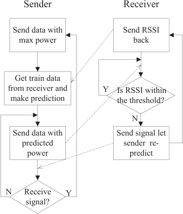

Fig. 1. The main model for MAPM. 

## _B. System model_ 

Since the main users of these wearable devices are the older or chronic patients, we classify the daily movements into three activities: stable, slow walk and quick walk (excluding run, since these groups of people seldom do such strenuous exercise). From the statistical data, every activity usually lasts for a long time, and there exists an obvious transition when activities change. For example, normally, people walk with a near-constant speed. When they plan to run or stop, there will be an accelerate or slower trend. 

Based on this common sense, we extract our model out and display in Fig. 1. The dotted lines in the model represent the necessary communication in our model. Our model comprises stable, slow walk, quick walk activities, and some transition states. First, the Sender sends signal at a constant power in different activities, and gets corresponding Received Signal Strength Indication (RSSI) from Receiver. Then, the Sender analyses and obtains the correlation between RSSI and different activities. Finally, the Sender adopts our energy control mechanism to send signal in accordance with this correlation. Our model saves energy in two main aspects: little feedback and adaptive transmission power. Instead of utilizing the feedback from Receiver, the Sender uses some of RSSI as training data to predict RSSI in the future, then change transmission power autonomously. At the same time, a threshold ought to be set to guarantee the performance of the system. If current predictions are unmatched with the real data, we will re-train the prediction model. 

## III. DATA OBSERVATIONS 

In our experiment, the Sender is implemented on an Android phone Samsung GT-I9505, and the Receiver is implemented on USRP N210 platform. USRP, which is an expert in wireless communication simulation, measures signal more accurately than smartphone. In above section, certain activities have been classified. In this section, the patterns of them will be shown, 

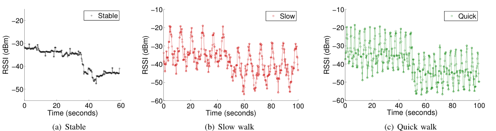

<!-- Start of picture text -->
−10 −10 Stable Slow Quick −20 −20 −20 −30 −30 −30 −40 −40 −40 −50 −50 −50 −60 −60 0 20 40 60 0 20 40 60 80 100 0 20 40 60 80 100 Time (seconds) Time (seconds) Time (seconds) (a) Stable (b) Slow walk (c) Quick walk RSSI (dBm) RSSI (dBm) RSSI (dBm) <!-- End of picture text -->

<!-- Start of picture text -->
Fig. 2. RSSI in different activities <!-- End of picture text -->

and our design is all based on these patterns. Fig. 2(a), 2(b) and 2(c) respectively demonstrate RSSI in Stable, Slow walk, Quick walk activity separately, and each figure contains RSSI sent by Receiver with transmission power of two different levels . 

- Stable: At this activity, both USRP and smartphone are in a stable state. The RSSI is fairly stable, with some fluctuations. This phenomenon is reasonable because of the variable communication channels. And RSSI sent by different transmission powers are distinct. High transmission power obviously leads to high RSSI. 

- Slow walk: This is a quite common activity for our target people: the older and chronic. When the wearable device swings from front to back of the body, RSSI is first increased and then decreased according to the period of hand swing. 

- Quick walk: Similar to slow walk, quick walk has the approximate periodical pattern as well. For activity with high frequency or complexity, sampling rate is necessary to be high. However, in our scenario, we only need to consider moderate and periodic exercise and our current sample rate 6 _M Hz_ is high enough to sample quick walk. Relatively lower sampling rate can help reduce energy consumption. 

We can deduce that if people keep doing one certain activity, the RSSI will keep some particular approximate periodicity. This periodicity is the basis of our mechanism. 

## IV. MOVEMENT-BASED ADAPTIVE PREDICTION MECHANISM 

Based on our observations in Sec. III, we come up with a novel energy conservation mechanism: Movement-based Adaptive Prediction Mechanism (MAPM). 

## _A. Design overview_ 

There are two main phases in our scheme: prediction and adaptive transmission power control. We first list some notations used in our scheme: _Tx_ and _Rx_ respectively represent the Sender and the Receiver. _Ptx_ and _Prx_ separately represent the transmission power and Received Signal Strength Indication (RSSI). _Prx__′_isthepredictionof_Prx_._Thl_and_Thu_arethe lower bound and upper bound of the threshold. 

The prediction phase is: 

- 1) _Tx_ transmits _α_ packages with _Ptx_ = maximum transmission power. 

- 2) _Rx_ receives these _α_ packages and gets corresponding _Prx_ s. 

- 3) _Rx_ sends package containing _Prx_ back. 

- 4) _Tx_ makes Gaussian process regression using _Prx_ s as training data, and predicts _Prx__′_s. 

- 5) _Tx_ dynamically changes _Ptx_ according to _Prx__′_s. Adaptive transmission power control phase is shown in 

- Algorithm 1. 

## **Algorithm 1:** Movement-based adaptive prediction mech- <u>anism</u> 

## **1 while** _True_ **do** 

- **2** call prediction phase **3** _Count_ = _β_ 

- **4** _Countl_ = _γl_ 

- **5** _Countu_ = _γu_ 

- **6 while** _Count_ **do** 

- **7 if** _Prx < Thl_ **then 8 if** _Ptx̸_ = _maximum transmission power_ **then 9** _Countl_ = _Countl −_ 1 

- **10 else** 

## **else** 

- **11** _Countl_ = _γl_ 

- **12 else if** _Prx > Thu_ **then** 

- **13 if** _Ptx̸_ = _minimum transmission power_ **then 14** _Countu_ = _Countu −_ 1 

## **else** 

- **15** 

- **16** _Countu_ = _γu_ 

   - **else** _Thl ≤ Prx ≤ Thu Countl_ = _γl Countu_ = _γu_ 

- **17** 

**18 19** 

- **20 if** _Countl_ = 0 _or Countu_ = 0 **then 21 Break** from this while 

- **22** _Count_ = _Count −_ 1 

The main idea inside MAPM is using prediction rather than feedback to adaptively change the transmission power. It derives from the fact that RSSI in different activities has particular pattern. Obtaining enough training data, i.e. RSSI, sent 

by Receiver, we use Gaussian process regression to predict forthcoming RSSI. In order to save power meanwhile ensuring the performance, we need to change the transmission power to maintain RSSI within specific threshold where received signal can be correctly decoded. If the prediction is precise, RSSI should maintain at a certain value and fluctuate between threshold _Thu_ and _Thl_ . Otherwise, the prediction is deemed as not correct and a new training should restart. 

Followings are details of MAPM. 

## _B. Prediction: Gaussian process regression_ 

Gaussian process regression (GPR) has three critical functions: covariance(kernel) function, mean function and likelihood function. As the most significant part in GPR, the covariance function should be selected depending on the practical application. As for likelihood function, parameters in covariance and mean function are calculated by it. 

After determining these three functions, we could make time series forecasting using GPR. _K_ is the matrix form of kernel function _k_ ( _y, y__′_ ) and **y** ∼ _N_ (0 _, K_ ). The size of **y** is equal to parameter _α_ , which is also the training size of GPR. For the sake of fitting performance, _α_ should larger than a particular value depending on practical scenario. For a new ( _x∗, y∗_ ), the joint distribution can be expressed as: 

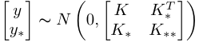

From the property of Gaussian distribution, we can get: 

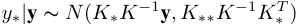

By now, according to the conditional distribution, we can get the prediction of _y∗_ using expectation of it. 

There are several differences between the GPR and those specific regression models, e.g. logistic regression and cos regression. Those specific regression models require data to obey explicit functions, so that people could choose one to describe the data. However, the given data sometimes cannot be expressed by explicit functions. Even if it can, finding this function is not an easy task. As for GPR, it can predict values depending on the relative relationship between the values other than human selection. In addition, the result of GPR is not a simple value, but rather the whole distribution of the values. The distribution of random variable could offer us complete information which gives us enough space to apply. This property benefits from Bayes theorem, the foundation of the GPR. 

## _C. Adaptive power control_ 

In order to maintain Received Signal Strength Indication (RSSI) within a certain threshold, the Sender should adaptively change transmission power on the basis of prediction. This threshold has a lower and upper bound ( _Thl_ and _Thu_ ). _Thl_ is the minimum RSSI for Receiver to correctly decode the signal, which has already been determined by lower layer design. _Thu_ is user-specified and the setting of it determines the granularity of power changing. If the RSSI exceeds the range of _Thl_ 

Fig. 3. Comparison of different kernels. The shadow in figure is the 95% confidence interval. 

TABLE I 

TRANSMISSION POWER LEVEL AND OUTPUT 

|level|1|2|3|4|5|
|---|---|---|---|---|---|
|output(dBm)|4|11|18|25|32|

and _Thu_ , the system will update the regression to find an appropriate model for the current signal strength variation. 

As far as the power change is concerned, in practical, the values of transmission power in wearable device are usually discrete (e.g. only have several levels). And there is a trade-off in setting transmission power same as _Thu_ . If we set different transmission power with a very little interval, it may control the transmission power precisely. However, the switches of transmission power will consume amounts of resource as well. 

In theory, if people keep doing a certain activity, RSSI will follow the prediction. And it will maintain the periodicity until people transform to another activity. Nevertheless, for the sake of system performance, we set _Count_ = _β_ to calibrate the prediction. This action aims at regularly re-train the model in case of the superposition errors. 

## V. SIMULATION AND ANALYSIS 

To verify the energy efficiency of our mechanism, we implement the Sender on an Android smartphone Samsung GT-I9505 while the Receiver on USRP N210 platform. Wi-Fi signal applying 802.11 standard is regarded as the transmitted signal. Our experiments are done in a small room which is nearly 6 _m_2 with glass walls. Some unknown interference is in this room, e.g. Wi-Fi signal transmitted by APs. Because wireless communication distances from these APs to body sensors are much further than distances between body sensors themselves. And signal attenuation is usually proportional to the square of the distance. Thus these noises are negligible. Specifically, RSSI of these noises, which are nearly -60 dBm measured by USRP, are insignificant compared to communication within body sensor network demonstrated in Fig. 2. Moreover, other noises, which in general satisfy the Gaussian distribution, can be offset by some filters. 

In the simulation, we first show the performance of Gaussian process regression. Fig. 3 displays the fitting effect using 

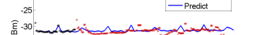

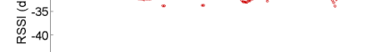

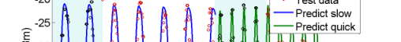

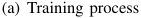

<!-- Start of picture text -->
(a) Training process <!-- End of picture text -->

Fig. 4. Stable Predict 

four different kernel functions: periodic kernel, SEiso kernel, SEiso times periodic kernel and SEiso add periodic kernel. These four functions are widely used in many applications. We can see directly that Periodic covariance function can fit and predict the RSSI best. 

This result is also credible from theoretical analysis. From our observations, human activities are approximate periodical, thus the variation of the variable should follow some periodicity. While both addition of functions and multiplication of functions will alter the periodicity, it is reasonable to use this Periodic covariance function alone to depict human activities. In the same way, through a series of experiments, we determine the best covariance function (eq. 1), mean function (eq. 2) and likelihood function (eq. 3) to depict human activity movements. 

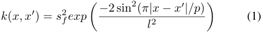

where _sf_ , _p_ and _l_ are parameters. 

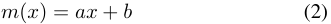

where _a_ and _b_ are parameterss 

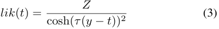

where _τ_ = 2 _~~√~~_ _<u>π</u>_ 3 _sn_,_Z_= _<u>τ</u>_ 2,_y_isthemeanand_s_ _n_2isthe variance. 

Fig. 4 and Fig. 5(a) are our fitting and prediction rendering for different activities. And we can get that if we keep doing same activity and maintain the movement as same as possible, the fitting and prediction results are pretty good. 

We divide transmission power into 5 levels from 4 _dBm_ to 32 _dBm_ for demonstration. Division can be seen in TABLE I. In our simulation, parameters _Countl_ and _Countu_ are set as 3 and the thresholds are set as _Thl_ = -46, _Thu_ = -38. The number of training data _α_ is set as 100, while the number of prediction data _β_ is set as 500. 

The blue line in Fig. 5(c) shows the transmission power applying MAPM, and corresponding RSSI is depicted in Fig. 5(b). Comparing Fig. 5(a), Fig. 5(b) and Fig. 5(c), we could clearly see that except the signal sent by level-1 transmission power, all the RSSI fluctuate between _−_ 46 and _−_ 38 _dBm_ . We 

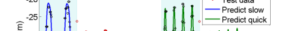

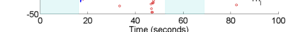

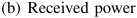

<!-- Start of picture text -->
(b) Received power <!-- End of picture text -->

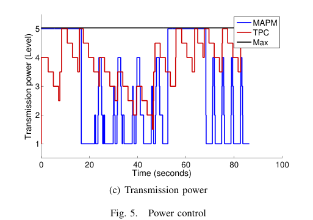

<!-- Start of picture text -->
MAPM 5 TPC Max 4 3 2 1 0 20 40 60 80 100 Time (seconds) (c) Transmission power Fig. 5. Power control Transmission power (Level) <!-- End of picture text -->

do not consider signal sent with level-1 transmission power, because level-1 transmission power is the lowest power and its corresponding RSSI cannot be lower anymore. 

To demonstrate the energy conservation ability of MAPM, we compare our scheme with some state-of-the-art works. 

- Max: Transmitter transmits data with the maximum power. 

- TPC [16]: On the basis of feedback from receiver, if the received signal power is too low, transmitter will double the transmission power and if the received signal power too high, the transmission power will be subtracted by a constant value. 

Although, Max needs no feedback from receiver, it requires the maximum transmission power, which is an energy waste. TPC could change its transmission power adaptively. However, 

every time it makes change, it requires the feedback of receiver, which is also a large consumption of energy. MAPM can both reduce feedback and change transmission power adaptively. Fig.5(c) shows the transmission power in different methods. Compared to Max and TPC, our mechanism can dramatically reduce the energy consumption in two main aspects. First, it needs little feedback from receiver, which saves much wireless communication overhead. Second, it can adaptively change transmission power, which is the minimum power required. In our simulation, only considering the transmission power, our mechanism can save 43.2% energy compared to Max and save 26.7% energy compared to TPC. Further, if we take feedback into consideration, MAPM needs little feedback while TPC needs feedback every time, which will reduce nearly half of energy. 

## VI. RELATED WORK 

Intuitively, body sensor networks (BSN) can be regard as a special kind of wireless sensor networks (WSN). However we cannot directly transplant the energy conservation scheme from WSN to BSN. Although BSN has the same features that WSN has so that they have some same posers need to be solved, e.g. energy conservation[1] [2] [5] . BSN also has some unique features that make the its energy conservation scheme different from WSNs. First, BSN is more mobile than WSN. WSN are usually deployed in a stable or homogenous changing environment. But for BSN, along with the movements of human body, the channel state varies a lot[17]. 

By and large, there are two categories of methods for energy conservation: the hardware design and the firmware design.We are more interested in the firmware design, which uses existing hardware and save power basically at the cost of system performance. [6] makes advantage of feedback information to dynamically change MAC parameters and a better performance will be achieved according to current condition. [8] designs a new MAC protocol. It enables a body sensor to choose an appropriate timing to send packets lest collision happens. In [16], they bought up a method similar to TCP congestion control protocols. Concrete details is demonstrated in V. [12] proposes a data-driven predict-based scheme. The sensors and sink node have the same predict model. Only the outlier readings will be sent by sensors, otherwise, the data is obtained by prediction of sink node. However, this scheme only suitable for the scenario where the value of data has some specific pattern. 

In our work, we make use of Wi-Fi to obtain correlations between signal changing and human movement. Actually, many work have used Wi-Fi to do movement recognition. [9] uses Doppler effect to distinguish different gesture, and transform the received signal into a narrowband pulse to amplify the Doppler effect on the basis of OFDM. [11] harnesses the Angle-of-Arrival values of transmission signal to judge the track of hand. The work derived from the idea that hand could block the signal, which is similar with our work exploiting the body shadow effect. By introducing Mouth Motion Profile, [13] extracts features of signal for distinguish different mouth 

motion, and exploits machine learning methods to classify the motion. [14] [15] use channel state information (CSI) to find certain change pattern among this information. 

## VII. CONCLUSION 

Because of limited battery on wearable devices, energy conservation is crucial for body sensor networks. As a main consumption, the wireless communication overhead needs to be reduced. Considering the strong correlation between human movements and RSSIs, we proposed a Movementbased adaptive prediction mechanism(MAPM), which is used for minimizing the transmission power consumption, tailoring for body sensor networks. Energy is saved in both using little feedback and dynamically changing transmission power to an appropriate level. The simulation demonstrates that MAPM could efficiently and dramatically save energy compared to existing methods. 

## REFERENCES 

- [1] G. Anastasi, M. Conti, M. Di Francesco, and A. Passarella. Energy conservation in wireless sensor networks: A survey. _Ad hoc networks_ , 7(3):537–568, 2009. 

- [2] C. A. Boano, M. A. Z´uniga, T. Voigt, A. Willig, and K. R¨omer. The triangle metric: Fast link quality estimation for mobile wireless sensor networks. In _ICCCN_ , 2010. 

- [3] M. Chan, D. Est`eve, J.-Y. Fourniols, C. Escriba, and E. Campo. Smart wearable systems: Current status and future challenges. _Artificial intelligence in medicine_ , 56(3):137–156, 2012. 

- [4] Y. Hao and R. Foster. Wireless body sensor networks for healthmonitoring applications. _Physiological measurement_ , 29(11):R27, 2008. 

- [5] B. Latr´e, B. Braem, I. Moerman, C. Blondia, and P. Demeester. A survey on wireless body area networks. _Wireless Networks_ , 17(1):1–18, 2011. 

- [6] H. Li and J. Tan. An ultra-low-power medium access control protocol for body sensor network. In _2005 IEEE Engineering in Medicine and Biology 27th Annual Conference_ , 2005. 

- [7] S. Lin, J. Zhang, G. Zhou, L. Gu, J. A. Stankovic, and T. He. Atpc: adaptive transmission power control for wireless sensor networks. In _SenSys_ , 2006. 

- [8] B. Otal, L. Alonso, and C. Verikoukis. Highly reliable energy-saving mac for wireless body sensor networks in healthcare systems. _Selected Areas in Communications, IEEE Journal on_ , 27(4):553–565, 2009. 

- [9] Q. Pu, S. Gupta, S. Gollakota, and S. Patel. Whole-home gesture recognition using wireless signals. In _MobiCom_ , 2013. 

- [10] C. E. Rasmussen. Gaussian processes for machine learning. 2006. 

- [11] L. Sun, S. Sen, D. Koutsonikolas, and K.-H. Kim. Widraw: Enabling hands-free drawing in the air on commodity wifi devices. In _MobiCom_ , 2015. 

- [12] D. Tulone and S. Madden. Paq: Time series forecasting for approximate query answering in sensor networks. In _European Workshop on Wireless Sensor Networks_ . 2006. 

- [13] G. Wang, Y. Zou, Z. Zhou, K. Wu, and L. M. Ni. We can hear you with wi-fi! In _MobiCom_ , 2014. 

- [14] W. Wang, A. X. Liu, M. Shahzad, K. Ling, and S. Lu. Understanding and modeling of wifi signal based human activity recognition. In _MobiCom_ , 2015. 

- [15] Y. Wang, J. Liu, Y. Chen, M. Gruteser, J. Yang, and H. Liu. E-eyes: device-free location-oriented activity identification using fine-grained wifi signatures. In _MobiCom_ , 2014. 

- [16] S. Xiao, A. Dhamdhere, V. Sivaraman, and A. Burdett. Transmission power control in body area sensor networks for healthcare monitoring. _Selected Areas in Communications, IEEE Journal on_ , 27(1):37–48, 2009. 

- [17] S. Yang, J.-L. Lu, F. Yang, L. Kong, W. Shu, and M.-Y. Wu. Behavioraware probabilistic routing for wireless body area sensor networks. In _GLOBECOM_ , 2013. 

- [18] J. Yick, B. Mukherjee, and D. Ghosal. Wireless sensor network survey. _Computer networks_ , 52(12):2292–2330, 2008. 

