2020 IEEE/ACM 28th International Symposium on Quality of Service (IWQoS) 

# GroupCoach: Compressed Sensing Based Group Activity Monitoring and Correction 

Yutong Liu, Linghe Kong, Fan Wu, Guihai Chen Shanghai Jiao Tong University, Shanghai, China 

_{_ isabelleliu, linghe.kong _}_ @sjtu.edu.cn, _{_ fwu, gchen _}_ @cs.sjtu.edu.cn 

**_Abstract_ —Group activities like group dance, military parade, or radio gymnastics have excellent ornamental value with its grand scale and uniform movements, while it also introduces difficulties in practice for coaches to monitor and correct the movements and locations of each participator. Wireless body area network (WBAN) is a promising direction for accurate motion tracking in large-scale group activities. Light-weight sensors can be deployed on participant bodies and transmit motion and channel sensing data through wireless spectrum for further analysis. To keep the high quality of service (QoS) of the WBAN on group activity monitoring and correction, three aspects should be achieved by careful designing: (i) less energy consumption; (ii) higher analysis accuracy; and (iii) lower feedback latency.** 

**Due to the low-rankness of motion and channel sensory data, we propose** **_GroupCoach_ , a Compressed Sensing (CS) based group activity monitoring and correction system. The data is collected and reconstructed by CS, where the spatial and temporal stabilities of group activities are explored for a higher reconstruction accuracy. These reconstructed sensory data are further compared with their anchor values for faulty movement detection and correction. The channel attenuation caused by body shielding is reduced by a near-to-far diffusion model with the consideration of the body impact factor. The correction suggestions are finally fed back to sensors for guidance. Evaluations based on the prototype deployed on real group activity participators prove the high QoS of the** **_GroupCoach_ . It achieves low sensor energy consumption, high data reconstruction accuracy, accurate faulty motion detection and correction, together with fast alert.** 

## I. INTRODUCTION 

Group activity, as opposed to couple activity or individual activity, is standardized for groups of participators to perform in same steps and directions synchronously, such as group dance, military parade, radio gymnastics, or collective rehabilitation exercises [1]. This kind of activities generally requires multiple coaches to monitor and correct the movements and locations of participators from different angles, which consumes more manpower with the scaling of the team [2]. 

With the help of modern technologies, a number of methods have been researched in multi-person motion tracking. The vision-based methods utilizing cameras [3], depth sensors [4], or infrared projectors [5] are intuitive but computationally expensive. The fibre-optic and joint bend body sensors [6] provide accurate transmission, while the massive cables dramatically limit the ranges and speeds of body motions. On the contrary, the Wireless Body Area Network (WBAN) is promising due to light-weight body sensors and flexible wireless communications [7]. As shown in Fig. 1, sensors are deployed 978-1-7281-6887-6/20/$31.00 _⃝_ c 2020 IEEE 

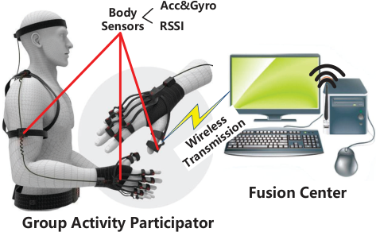

<!-- Start of picture text -->
�������� ����� ������� ���� ������������� ��������������������������� <!-- End of picture text -->

Fig. 1. The WBAN for group activity monitoring and correction [Acc: Accelerometer, Gyro: Gyroscope]. 

on key body parts of every participator, where the sensory data are continuously transmitted to the fusion centre for further movement analysis via the wireless spectrum. The motion sensory data collected from accelerometer and gyroscope reveal the motion accelerations and directions for individual body parts, and the channel status, such as Received Signal Strength Index (RSSI), is sensed to estimate the locations of participators. 

Nonetheless, it is still challengeable to deliver high quality of service (QoS) of this WBAN on group activity monitoring and correction. Three aspects should be achieved to guarantee QoS by careful designs: 

- 1) **Less consumption** : Body sensor nodes are expected to perform long-term sensing and transmission, so an energy-efficient sensing strategy is required to deal with their limited powers. 

- 2) **Higher accuracy** : The accuracy of data aggregation and analysis could be affected by transmission interferences in dynamic group activities, such as channel attenuation, packet loss, etc. Accurate data reconstruction and faulty movement detection algorithms should be designed to avoid their side effects. 

- 3) **Lower latency** : It is necessary to perform monitoring and correction in real-time, where both the transmission and calculation latencies should be low. 

Motivated by Fig. 2(a), the low-rankness of sensory data on single or multiple participators derives the utilization of Compressed Sensing (CS) [8] for data acquisition and reconstruction. It guarantees an accurate recovery with a lower sampling rate than the Shannon-Nyquist sampling on sparse 

978-1-7281-6887-6/20/$31.00 ©2020 IEEE 

Authorized licensed use limited to: Shanghai Jiaotong University. Downloaded on February 15,2022 at 23:35:35 UTC from IEEE Xplore.  Restrictions apply. 

2020 IEEE/ACM 28th International Symposium on Quality of Service (IWQoS) 

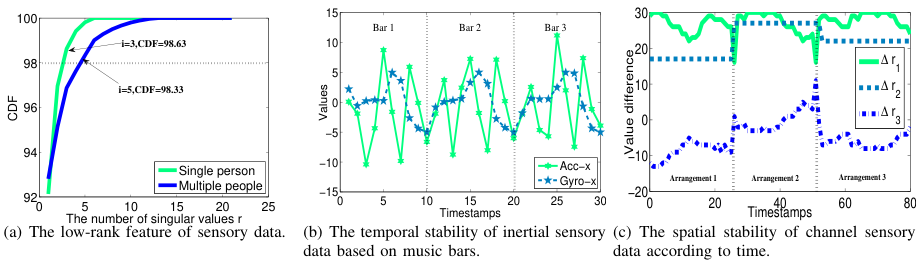

<!-- Start of picture text -->
100 15 30 Bar 1 Bar 2 Bar 3 i=3,CDF=98.63 10 20 98 5 ∆ r1 i=5,CDF=98.33 10 ∆ r2 96 0 0 ∆ r3 −5 94920 5 10 15Single personMultiple 20people25 −10−150 5 10 15 20 25Acc−xGyro−x30 −10−200 Arrangement 1 20 Arrangement 2 40 60 Arrangement 3 80 The number of singular values r Timestamps Timestamps (a) The low-rank feature of sensory data. (b) The temporal stability of inertial sensory (c) The spatial stability of channel sensory data based on music bars. data according to time. CDF Values Value difference <!-- End of picture text -->

Fig. 2. The motivations and observations of the CS design. 

sensory data [9]. We also observe the spatial and temporal stabilities of sensory data in group activities. For inertial sensory data ( _i.e._ , data from accelerometer and gyroscope), their values are replicated among bars of songs as shown in Fig. 2(b). For channel sensory data, the RSSI values between adjacent participators have fixed difference _w.r.t._ time but related to relative locations. As indicated in Fig. 2(c), when there are three dancers standing in a same line in front of the sink and their positions are changed by activity arrangements, then the RSSI differences (∆ _r_ 1 _,_ ∆ _r_ 2 _,_ ∆ _r_ 3 in the figure) is stable _w.r.t._ time within the range of faulty threshold. But they are changed _w.r.t._ distances, which is further proved to be impacted by the body shielding. Taking these observations into consideration, the optimization problem for data reconstruction can be improved to measure such stabilities, resulting in a higher reconstruction accuracy. Recent advances when apply CS into WBAN generally researched on an optimal sparsification model [10], a configurable quantization method [9], or a secure body sensory data transmission [11]. To the best of our knowledge, this work is the first attempt to apply CS in group activity monitoring, with characters of group movements involved. 

For further faulty movement detection and correction, the reconstructed data are compared with the calculated anchor values. Coming to the scene of group actions, the nonnegligible channel attenuation caused by body shielding of participators disturbs the estimation of their locations from RSSI values. To cope with this problem, we specially design a Body Impacted Near-to-Far (BINF) diffusion model to describe the mapping from RSSIs to real locations of group participators. As participators in the first row have no body shielded in front, their locations can be firstly settled down and ones in the farther rows can be calculated outwards when considering the body impact factor. 

To sum up, we propose _GroupCoach_ , a CS-based group activity monitoring and correction system with better QoS. It (i) utilizes the emerging CS techniques to prolong the lifespan of wireless body sensors, (ii) increases the reconstruction accuracy with the consideration of movement regularities, and (iii) accurately detects and corrects faulty movements with a BINF diffusion model. Besides, both the low calculation complexity and the less transmission quantity lead to the lower latency of this system. Although the _GroupCoach_ is designed 

for organized group activities, it can be easily extended to more complicated group scenarios. 

To evaluate the feasibility and efficiency of _GroupCoach_ , we deploy the prototype of this system to a real group of participators and collect their motion and channel data for analysis. According to the real-life evaluations, the average Mean Square Error (MSE) of data reconstruction in _GroupCoach_ is 5 _._ 49 _e__−_5 which is dramatically lower than the linear interpolation [12] (0.70), the tensor reconstruction [13] (1.50), and alternating steepest descent (ASD) [14] (3.37), even with the 70% compression ratio. Additionally, the _GroupCoach_ can remains over 98% recall and 95% precision in faulty movement detection and correction. The latency of one round reaction for _GroupCoach_ is around 1.836s in total, which is acceptable in QoS-required group activity monitoring. 

Our main contributions are as follows: 

- 1) We explore the spatial and temporal stabilities of organized group activities and the low-rankness of motion and channel sensory data, deriving the appliance of CS techniques into daily use, with higher accuracy on data reconstruction and energy saving. 

- 2) We design a BINF diffusion model to solve the channel attenuation problem caused by body shielding and increase the location estimation accuracy from sensed RSSI values. 

- 3) We comprehensively design a CS-based group activity monitoring and correction system named as _GroupCoach_ . It provides high QoS including less power consumption, higher aggregation and analysis accuracy, and lower processing latency, proved by a real-life deployed prototype. 

## II. RELATED WORK 

In this section, we discuss two related topics: multi-person motion tracking and energy-efficient WBAN. 

## _A. Multi-person Motion Tracking_ 

One intuitive multi-person motion tracking direction is vision-based, utilizing either cameras, depth sensors, or infrared projectors [3], [5]. As one of the popular off-the-shelf vision-based motion tracking device, Microsoft Kinect [4] is composed by all these facilities. It retrieves 3D information of a scene to analyze the depth map and skeletal joint information of the tracked human body. It is easy to install and fairly widespread especially in robotics, which can provide live 

Authorized licensed use limited to: Shanghai Jiaotong University. Downloaded on February 15,2022 at 23:35:35 UTC from IEEE Xplore.  Restrictions apply. 

2020 IEEE/ACM 28th International Symposium on Quality of Service (IWQoS) 

results for dynamic monitoring. But it requires pre-trained human body models which are computationally expensive for different tracking targets. 

Another promising direction is sensor-based, which deploys motion sensors directly on the target body. The fibre-optic, joint bend body sensors can provide accurate transmission by massive cables, which are preferred in extreme environments [6]. But they dramatically limit the speed and range of movements for group participators. Conversely, WBAN is quite flexible composed by several small-size, ultra-low-power, and intelligent-monitoring wearable sensors communicating in wireless scheme [7]. The wireless sensors mounted on the body range in WBAN can support continuous monitoring on multi-person physiological conditions and real-time transmission to the fusion centre for analysis and feedback. 

Several popular commercially available or open-source multi-body analysis systems are LifeModeler [15], AnyBody [16], D-Flow [17], Visual3D [18], Unity [19] and OpenSim [20]. They interface with third-party hardware and provide straightforward motion tracking results. However, none of them can support faulty motion detection, which is required to be extendedly designed for group activity correction. Saha et al. [21] inspires our faulty movement detection by their abnormal electroencephalography (EEG) analysis in driving. As guidance, their core idea is to find the difference between the collected sensory data and the anchor values. 

## _B. Energy-efficient WBAN_ 

Since the wireless body sensors mounted on the body are generally portable with the small size of the battery, it requires an energy-efficient design to prolong the lifespan of sensors and monitoring durations in WBAN. The energies of sensors are mainly consumed in three stages: data sensing, processing, and transmission, where the transmission stage is proved to be the most power-consumption [22]. Efforts have been devoted to transmission energy saving by designing energy-efficient hardware scheduling [23], routing protocol [24] or leveraging distributed beamforming [25]. Another promising solution is to decrease the transmission quantity. Optimized light-weight deep learning models for data preprocessing can accurately filter out redundant sensing data before transmission [26]. Although the transmission energy is saved by these methods, the processing energy for model running is nonnegligible. 

Due to the low-rankness of sensory data collected in WBAN, recent advances explore the feasibility of CS [8] techniques to compress the body sensory data. Compared with the above-mentioned methods, CS techniques have lower processing consumption on sensors and lower transmission cost, together with a high reconstruction accuracy [9]–[11]. Two directions have been thoroughly researched in recent advances: one is “how to optimally compress the sensory data”, which is related to the sparsification model selection [10] and a configurable quantization decision [9]; another one is “how to accurately reconstruct the compressed data”, by combining the spatial and temporal features of sensory data [13]. In this paper, we attempt to apply CS into group activity monitoring 

and correction, with the consideration of spatial and temporal stabilities of organized group movements. 

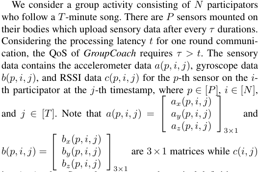

is a 1 _×_ 1 value. Several necessary mathematical definitions are presented below for problem formulation and the summary of notations are represented in Table. I. 

**Definition III.1.** (Original Matrix (OM)) OM is the full collection matrix at each time slot _τ_ with the sampling ratio _β_ , which is not compressed or distorted with missing values. We use three matrices _A, B_ , and _C_ to denote the OMs for accelerometer, gyroscope, and RSSI sensory data, respectively. For computational simplicity, the data of different sensors on different bodies at the same timestamp are arranged by rows, leading to three 2-dimension matrices: 

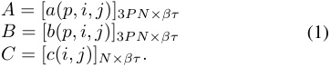

As the rest of definitions have the same operations on _A, B_ and _C_ , we will only explain the _A_ -version due to the limitation of paper space. 

**Definition III.2.** (Sampling Matrix (SaM)) The SaMs _MA, MB, MC_ are randomly generated matrices containing 0s and 1s, whose sizes are corresponding to OMs. They describe whether the data in OMs is for generating SeMs or not. The value “1” in each SaM is randomly generated according to the compression ratio _α_ . 

**Definition III.3.** (Sensory Matrix (SeM)) The SeM contains the sensory data uploaded to the fusion centre, where missing values may exist due to the transmission interferences. We denote SeM as _SA, SB_ , and _SC_ , and defined as: 

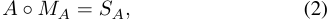

where the operator _◦_ represents standard matrix multiplication. 

Authorized licensed use limited to: Shanghai Jiaotong University. Downloaded on February 15,2022 at 23:35:35 UTC from IEEE Xplore.  Restrictions apply. 

2020 IEEE/ACM 28th International Symposium on Quality of Service (IWQoS) 

TABLE I 

SUMMARY OF NOTATIONS 

|_P_|The number of sensors on each body|**������������**|**��**||
|---|---|---|---|---|
|_N_|The number of participators||||
|_T_ |The length of background music ||||
|_τ, β_|The sampling duration and ratio ||||
|_α_ |The compression ratio for CS ||||
|_p, i, j_ |The sequence of body part, participator, and time||||
|_A, B, C_|OMs||||
|_MA, MB, MC_ |SaMs ||||
|_SA, SB, SC_ ˆ ˆˆ|SeMs||||
|_A,_ _B,_ _C_   |RMs|**������**|||
|_A_ _~~′~~, B_ _~~′~~, C_ _~~′~~_|AMs||||
|˜ _A,_ ˜_B,_ ˜_C_ |CMs|**�** **����������** **�����**|**������**||
|_δ_|The faulty threshold|**����������** **������** ������������ ���|����������������� ���|������ ����|
|**efinition III.4**|**.** (Reconstructed Matrix (RM)) The RM is|**����**  ����������|��������������|������� ����|
|constructed fr|om _SA, SB_ and _SC_ according to SaMs. We|**������**|���|�������� ���|
|enote RMs by||������� **�**|�������������|��������� ����|
||ˆ_A_= [ˆ_a_(_p, i, j_)]3_P N×βτ_ |**�������** **����������**|����|�������� �� ��|
||ˆ_B_ = [ˆ_b_(_p, i, j_)]3_P N×βτ_ ˆ_C_ = [ˆ_c_(_i, j_)]_N×βτ._ (3) |����������� **�����** |��������������� **�����������**|����|

**Definition III.4.** (Reconstructed Matrix (RM)) The RM is reconstructed from _SA, SB_ and _SC_ according to SaMs. We denote RMs by 

**Problem 1.** (Data Reconstruction) Given _SA, SB, SC_ , and _M_ , the data reconstruction is to determine the optimal _A,_ˆ _B_ˆ and _C_ ˆ with the minimum difference with OMs _A, B_ and _C_ . The optimization problem is formulated as: 

Fig. 3. The illustrations for the network model, sensor deployment, and system overview of _GroupCoach_ . 

## IV. DESIGN OF _GroupCoach_ 

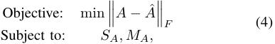

In this section, we will present the system overview of _GroupCoach_ and its detailed designs. 

where _∥·∥_ is the Frobenius norm. 

## _A. System Overview_ 

_GroupCoach_ is a CS-based system to monitor and correct the movements for group activity participators. Taking the group dance as an example, we present the system overview in Fig. 3. We deploy sensors on 9 key body parts, including upper arms, wrists, legs, ankles on two sides of the body and the chest. The previous 8 sensors are used for individual movement analysis, and the RSSIs reported by chest sensors are used for distance analysis. This system is composed of three main stages: compressed collection, data reconstruction, and faulty data detection and correction. Only the first stage is performed on sensors while others are in the fusion centre. The CS techniques are applied to the former two stages, which can reduce the energy consumption in both sensing and transmission stages for body sensors while guaranteeing the reconstruction accuracy. And a BINF model is designed to avoid body shielding effects in the third stage. 

**Definition III.5.** (Anchor Matrix (AM)) The AMs represent theoretical values for both motion and sensory data. According to the choreography of group activities, these theoretical values can be calculated by the standard movements and locations. We denote AMs as _A′ , B′_ and _C ′_ , performing as the anchor for faulty movement detection and correction. And 

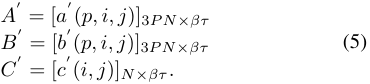

**Definition III.6.** (Correction Matrix (CM)) The CMs record the correction suggestions on motions and locations. We denote CMs as _A,_˜ _B,_˜ _C_˜ : 

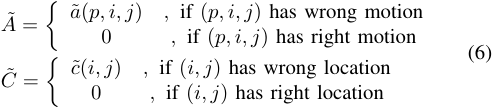

In the **collection** stage, each sensor periodically collects its SeMs under SaMs and packs them for transmitting to the sink, where the data type _d_ = _{A, B, C}_ , the sensor label _p_ , the belonging body label _i_ , and the slot _j_ are contained in the preamble of the package. In this paper, we simply consider that all body sensors can transmit their sensory data to the sink within one hop range, and it is easy to extend the scale by multi-hop routing or multi-coordinators. The _GroupCoach_ will require package retransmission if it is lost. 

**Problem 2.** (Faulty movement detection) Given RMs _A,_ˆ _B,_ˆ _C_ˆ , and AMs _A′ , B′ , C ′_ , the faulty movement is detected by comparing their values. With the faulty threshold _δ_ , the problem is formulated as: 

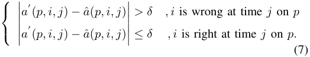

After aggregating all sensory data for slot _j_ , the sink will compensate the missing values by linear interpolation and 

Authorized licensed use limited to: Shanghai Jiaotong University. Downloaded on February 15,2022 at 23:35:35 UTC from IEEE Xplore.  Restrictions apply. 

2020 IEEE/ACM 28th International Symposium on Quality of Service (IWQoS) 

**reconstruct** the SeMs to RMs according to SaMs. The faulty movements for participator _i_ on sensor _p_ at slot _j_ will be **detected and corrected** with the comparison of AMs, where results are fed back to the corresponding sensor for alerting ( _e.g._ , by flashing the indicator lights or voice broadcasting). 

In the rest of this section, we will introduce the detailed design for each stage. Specifically, for the CS-related stage, we modify the data reconstruction optimization problem with the consideration of the spatial and temporal stabilities. And we design a BINF diffusion model for accurate faulty data detection and correction. 

## _B. CS Based Data Collection and Reconstruction_ 

CS is typically designed to compress the sensory data to reduce the data transmission cost [27]. According to the theory of CS, if a signal in a transform domain is sparse, we can utilize an observation matrix which is not related to the transformation matrix to project the high-dimensional signals to a low-dimensional space. And the original signal can be reconstructed from these few projections by solving an optimization problem. In this subsection, we first analyze the low-rankness of both motion and channel sensory data, and then introduce the compressed data collection and a regularity measured reconstruction in detail. 

_1) Low-rank Feature of Motion and Channel Sensing Data:_ The low-rankness of motion sensory data exists in individual sensors. At first, we take the accelerometer data as an example, where the gyroscope data follow the same rules. On each sensor, assuming there are _B_ duplicated bars in a _T_ -minute song, the accelerometer data in each bar _b_ ( _b ∈_ [ _B_ ]) can be denoted as _A_ ( _p, i, b_ ) with the size of 3 _×__T_ _B__<u>β</u>_.Then the data aggregated after the whole song is represented as _A_ ( _p, i, T_ ) = [ _A_ ( _p, i, b_ )]3 _×B_ . As shown in Fig. 2(b), the group activities show obvious regularity and repetition among bars. So we get _rank_ ( _A_ ( _p, i, T_ )) = _rank_ ( _A_ ( _p, i, b_ )), which proves the low-rankness of the motion sensory data. We further prove the low-rank feature of _A_ ( _p, i, b_ ) by Principal Component Analysis (PCA) [28]. If the sensory data can be approximately represented by its top- _r_ singular values, it is proved to be lowrank. Figure 2(a) shows the Cumulative Distribution Function (CDF) of the top- _r_ singular values evaluated on these sensory data. It is intuitive that at most top-3 singular values occupy over 98% of the total energy for _A_ ( _p, i, b_ ). 

Additionally, the low-rankness of channel sensory data is existed among multiple participators. Taking the first column of _C_ ( _N, T_ ), _C_ ( _N, t_ 1) = [ _c_ (1 _, t_ 1) _, c_ (2 _, t_ 1) _, . . . , c_ ( _N, t_ 1)]_T_ as the analyzing target, if every participator is arranged in a fixed position, then _C_ ( _N, t_ 1) can be represented by 

_C_ ( _N, t_ 1) = [ _c_ (1 _, t_ 1) _, c_ (1 _, t_ 1) + ∆ _r_ 1 _, . . . , c_ (1 _, t_ 1) + ∆ _rN −_ 1]_T_ (8) If we denote the difference matrix as ∆ _R_ = [∆ _r_ 1 _,_ ∆ _r_ 2 _, . . . ,_ ∆ _rN −_ 1]_T_ , then the _C_ ( _N, T_ ) can be elementarily transformed to a rank-2 matrix 

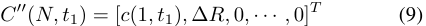

According to the Fig. 2(c), ∆ _R_ also shows low-rank feature. As proved by the PCA result in Fig. 2(a), top-5 singular values occupy over 98% energy among multiple participators. 

_2) CS-based Data Reconstruction:_ According to the problem. 1, the target of this data reconstruction is to estimate _A,_ ˆ _B,_ ˆ _C_ ˆ from _SA, SB, SC_ and their corresponding SaMs. Similarly, we only discuss the reconstruction of _A_ ˆ where another two matrices following the same procedures. Due to the sparsity of sensory data, we can describe the incomplete _A_ ˆ as [27]: 

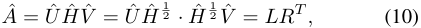

where _H_ˆ is an _r×r_ diagonal matrix with top- _r_ singular values. To find the optimal _A_ˆ , we can solve the problem: 

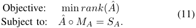

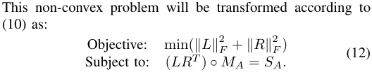

By the relaxation of Lagrange multiplier and the introduction of tuning parameter _λ_ 1, the optimization target is transformed as: min(��( _LRT_ ) _◦ MA − SA_ ��2 _F_+_λ_1(_∥L∥_ _F_2+_∥R∥_ _F_2))_._ (13) 

_3) Spatial and Temporal Stabilities Improvement:_ As discussed before, the sensory data has spatial and temporal stabilities in group activities. We can measure such stabilities into the optimization problem to enhance the reconstruction accuracy. For motion sensory data, we denote the temporal stability following the music bars by matrix Θ, then the optimization target in (13) changed to: 

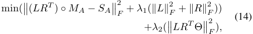

where Θ is adaptive to the length of one bar of the music _B__<u>T</u>_ 

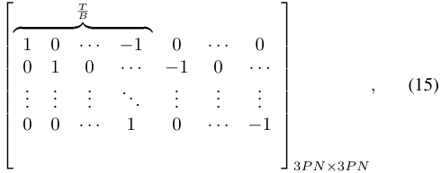

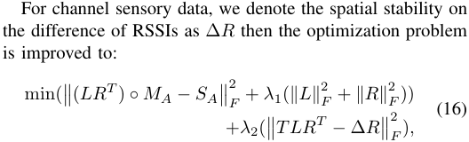

Authorized licensed use limited to: Shanghai Jiaotong University. Downloaded on February 15,2022 at 23:35:35 UTC from IEEE Xplore.  Restrictions apply. 

2020 IEEE/ACM 28th International Symposium on Quality of Service (IWQoS) 

where _T_ and ∆ _R_ are: 

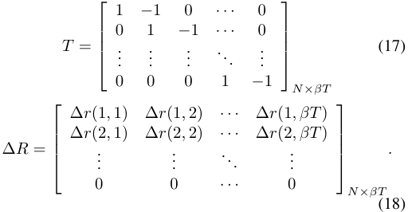

The ∆ _r_ ( _i, t_ ) in ∆ _R_ can be calculated from the location of the participator, _i.e._ , _d_ = [ _d_ 1 _, d_ 2 _, . . . , dN_ ], and the body impact factor, _i.e._ , _XB_ : 

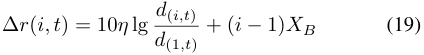

The optimization problems (14, 16) can be represented as the combination of functions related to _L_ and _R_ : 

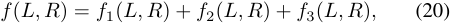

where 

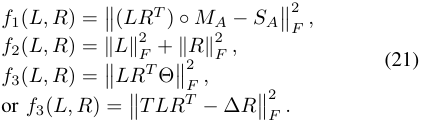

We solve this optimization by alternatively fix _L_ and _R_ , which is called Alternating Steepest Descent (ASD) algorithm [14], [27] because of its low computationally complexity and high reconstruction accuracy. 

## _C. Faulty Data Detection and Correction_ 

We consider that each group activity has its specific choreography clearly describing the exact movements at each timestamp, including the locations of participators and the movement directions and distances _w.r.t._ the previous timestamp. According to this, we can acquire the task-specific AMs theoretically. As mentioned in Problem. 2, the faulty data detection and correction is performed by the comparison between AMs and RMs. In this section, we will discuss the details about AMs acquisition and BINF diffusion model for faulty data detection and correction. 

_1) AMs Acquisition:_ The _A′_ and _B′_ can be easily collected by deploying sensors on the body of a teacher, who can provide a standard action demonstration. Here we mainly discuss the acquisition of _C ′_ . 

The log-normal shadow model is a general propagation model to describe the mapping from the distance to the RSSI value. In the group activity scenario, the channel attenuation caused by body shielding introduces serious side-effects. So under the distance _d_ , we reformulate the RSSI value as [29]: 

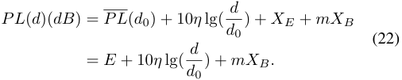

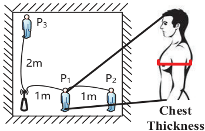

<!-- Start of picture text -->
�� �� �� �� �� �� Chest Thickness <!-- End of picture text -->

Fig. 4. The practical measurement of parameters in log-normal shadow model. 

TABLE II 

THE MAPPING BETWEEN THICKNESS AND _XB_ . 

|Thickness|10cm1|20cm|30cm|40cm|
|---|---|---|---|---|
|_XB_|-5|-6|-17|-20|

> 1 For system extension, we also measure the thickness except chest, such as arm or leg. 

As _PL_ ( _d_ 0) and _XE_ are assumed to be fixed for the same group target, which will be deducted in ∆ _R_ , so we combine them to one factor _E_ simply. The _η_ is a path loss ratio, the _m_ is the number of body shielded ahead, and the _XB_ is the body shielding factor. 

In our work, all above factors are experimentally measured as follows. As shown in Fig. 4, we deploy one sensor on the chest of 3 participators ( _P_ 1, _P_ 2, and _P_ 3 in this figure) and let them stand as illustrated ( _P_ 1 and _P_ 2 in the same line with 1 meter gap, and _P_ 3 has a 2 meter gap with the sink). After multiple measurements on these 3 nodes, we can get their average RSSI values _RP_ 1 _, RP_ 2 _, RP_ 3: 

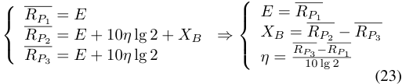

As indicated in (23), the _RP_ 1 is considered as _E_ . After fixing _E_ , we can calculate _η_ and _XB_ by formulation transformation. Practically, the different thickness of the body part leads to different _XB_ . Here we put the sensor behind the chest and measure the thickness as illustrated in Fig. 4(b). Volunteers are required to stand in the position of _P_ 1 one by one to collect their corresponding RSSI values. The representative mapping between thickness to _XB_ is summarized in Table. II. The calculation in our work is based on these measurements. 

Build the coordination system like Fig. 5, we assume that the initial coordination of each body sensor is pre-known. So the _C__′_ can be calculated according to the position arrangement in the group activity by (22) and Table. II. 

_2) BINF Diffusion Model:_ In the practical faulty movement detection, two challenges should be dealt with: 

- 1) The movements are conducted sequentially, where the correction on the faulty movement at the timestamp _t_ is given w.r.t the previous movement at _t−_ 1. If the previous movement is also a faulty movement, the following results are inaccurate also. 

Authorized licensed use limited to: Shanghai Jiaotong University. Downloaded on February 15,2022 at 23:35:35 UTC from IEEE Xplore.  Restrictions apply. 

2020 IEEE/ACM 28th International Symposium on Quality of Service (IWQoS) 

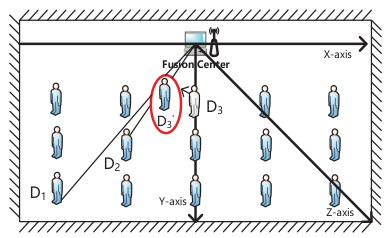

<!-- Start of picture text -->
������ ������������� �� �� � �� �� ������ ������ <!-- End of picture text -->

Fig. 5. The problem illustration to propose NF diffusion model. 

- 2) The mapping of the RSSI to the distance is shieldingaware. The different RSSI values between _C_ˆ and _C ′_ may not be caused by the faulty movement of participators, while the shielding of faulty dancers in their front can be another reason. 

For a better understanding of the second challenge, we draw a simplified diagram in Fig. 5. The dancer _D_ 3 is the nearest faulty dancer to the sink (in the fusion centre). She mistakenly locationmoves away( _D_ 3 _′_). fromThen herboth standardizedtheparticipators location_D_ (2 _D_and 3) to_D_ her1has reala new shielding ( _m_ + 1), resulting in a decreased RSSI value compared with AMs, even they are in correct locations. 

To cope with these two challenges, we design a BINF diffusion model for accurate faulty movement detection and calculation. The core idea of the NF is to diffusely detect the faulty dancer from the nearest one (no shielding) to farther one, where the shielding number is determined by the confirmed locations of frontal dancers. And their motion corrections are calculated from the starting time to the end. The detailed BINF based algorithm is shown in Algorithm. 1. 

Firstly, the _C_ˆ is sorted with a decreasing order on rows (line 1-4). From the nearest dancers to farther ones, the algorithm detects faulty locations by the comparisons between _C_ˆ ( _p, i, j_ ) with _C ′_ ( _p, i, j_ ) ( _i ∈_ [ _R_ ]). If the difference is not bigger than the threshold _δ_ 1, the location of the dancer is true, and then the algorithm starts checking their motion status (line 5-7). Otherwise, the algorithm will update AMs with the consideration of new _m_ and _XB_ (line 9-11), and record location correction in _C_˜ (line 26). The motion checking is according to the difference between _A,_ˆ _B_ˆ and _A′ , B′_ (line 1424). And the motion correction is to assign the difference to the CMs (line 28-30). In this algorithm, line 10 and 11 is the implementation of BINF. Under the new location of the nearer dancers, the new number of people shielded in front ( _m_ ) can be considered for updated AMs, which can avoid the body shielding misjudgement. 

## V. EVALUATION 

In this section, we mainly evaluate the QoS of _GroupCoach_ in terms of data reconstruction accuracy, faulty detection accuracy, and energy consumption. 

## **Algorithm 1** BINF-based algorithm 

**Input:** The RMs _A,_ˆ _B,_ˆ _C_ˆ and their sizes _P, N, T_ ; The AMs _A′ , B′ , C ′_ , the initial coordination of each sensor node ( _x_ ( _p, i,_ 0) _, y_ ( _p, i,_ 0) _, z_ ( _p, i,_ 0)). **Output:** The CMs _A,_˜ _B_˜ . 1: **for** _i_ = 1 to _N_ **do** 

- 2: Sort _C_ˆ with a descending order on the average value of each row. 

3: Correspondingly rearrange _C ′_ by rows. 4: **end for** 5: **for** _i_ = 1 to _N_ ; _j_ = 1 to _T_ **do** 6: **if** _C_ˆ ( _i, j_ ) _− C ′_ ( _i, j_ ) _≤ δ_ 1 **then** 7: MotionChecking(0) 8: **else** 9: MotionChecking( _i, j_ ) 10: Calculate _d_ˆ ( _i, j_ ) according to _C_ˆ ( _i, j_ ) using (22) 11: Update _C ′_ ( _i_ : _N, j_ ) based on _d_ ˆ( _i, j_ ) with the consideration of _m, XB_ . 12: **end if** 13: **end for** 14: MotionChecking(index,j): 15: **if** index==0 **then** 16: **for** _p_ = 1 to _PN_ ; _i_ = _p_ + 3; _j_ = 1 to _T_ ; **do** 17: **if** _A_ ˆ( _p, i, j_ ) _− A′_ ( _p, i, j_ ) _> δ_ 2 or _B_ ˆ( _p, i, j_ ) _− B′_ ( _p, i, j_ ) _> δ_ 3 **then** 18: MotionCorrect( _p, i, j_ ) 19: **else** 20: _A_ ˜( _p, i, j_ ) = 0 21: _B_ ˜( _p, i, j_ ) = 0 22: _C_ ˜( _i, j_ ) = 0 23: **end if** 24: **end for** 25: **else** 26: _C_ ˜( _index, j_ ) = _C ′_ ( _index, j_ ) 27: **end if** 28: MotionCorrect( _p, i, j_ ): 29: _A_˜ ( _p, i, j_ ) = _A_ˆ ( _p, i, j_ ) _− A′_ ( _p, i, j_ ) 30: _B_˜ ( _p, i, j_ ) = _B_ˆ ( _p, i, j_ ) _− B′_ ( _p, i, j_ ) 

## _A. Evaluation settings_ 

To demonstrate the feasibility of _GroupCoach_ , we have implemented a prototype deployed on a group of 3 activity participators who have similar heights but different weights for evaluation. Their positions are arranged the same as Fig. 4. We design a series of simple movements for them to perform: raise the left arm as high as the shoulder, raise the right arm, raise the left feet to 30 cm, put down the left feet, raise the right feet to 30 cm, put down the right feet, put down the right arm, and finally put down the left arm. Each step takes 3 seconds and the volunteers are required to perform this group of activity synchronously. The first volunteer should perform as organized; the second volunteer is required to perform wrong movements but keep right locations; and the third volunteer should perform wrong movements with wrong locations also. 

Authorized licensed use limited to: Shanghai Jiaotong University. Downloaded on February 15,2022 at 23:35:35 UTC from IEEE Xplore.  Restrictions apply. 

2020 IEEE/ACM 28th International Symposium on Quality of Service (IWQoS) 

The timestamps of wrong motions and locations are preknown. Then we successfully collect the real-world motion and channel sensing data with faulty records for 3 participators in 800 seconds with a constant rate of 60Hz. To extendedly evaluate our system, we emulate sensory data of another 6 people from these records by Simulink libraries in Matlab. The motion sensory data of these 6 people are generated same with the first volunteer, and the channel sensory data is calculated by (22) according to the location arrangement in Fig. 5 (1meter gap with adjacent volunteer). So finally we have sensory data for 9 participators in 800 seconds. 

On each body, there are 10 off-the-shelf smartwatches equipped with IMUs ( _i.e._ , accelerometer and gyroscope), wireless receiver and transmitter. We write an Android program to realize the compressed data collection and transmission, based on Android Studio 3.0.1, where the compile SDK version is 25 and the build tool version is 25.0.3. The sink continuously broadcast the 20dBm Wi-Fi signals for RSSI sensing. Besides, the data reconstruction is implemented by an R2014a Matlab code1 on a Thinkpad Carbon X1 laptop with Intel Core i56200U CPU 2.3GHz and no GPU supported. 

To dilute the effect of the transient signal, the gravitational part in accelerometer values is separated by a Butterworth low-pass filter [30]. Moreover, we apply the high-pass filter on gyroscope signals to suppress the drifting problem on data integral. To ensure the computational correctness, we keep the low-pass and high-pass filter applied here are complementary to 1. To evaluate the effect of missing values, we define a missing ratio _θ_ to manually create samples with missing values. The data compression ratio _α_ in evaluation can be selected from [50 _,_ 60 _,_ 70 _,_ 80 _,_ 90]. 

Four indexes are used to measure the performance of _GroupCoach_ : 

- 1) **Compression Ratio (CR)** : The CR describe the decreased ratio between the transmitted quantity ( _QT_ ) and the raw data quantity ( _QR_ ): 

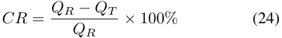

- 2) **Mean Absolute Error (MAE)** : The performance of data reconstruction accuracy is measured by MAE, defined as: 

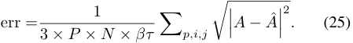

- 3) **Precision and Recall** : The performance of faulty movement detection and correction accuracy is judged by these two indexes: 

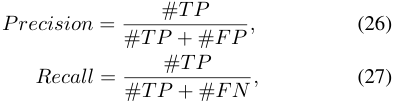

where # _TP_ , # _FP_ and # _FN_ represent True Positive, False Positive, and False Negative, respectively. 

> 1The data reconstruction Matlab code is open-sourced in http://www.cs.sjtu.edu.cn/ _∼_ linghe.kong/GroupCoach.rar 

TABLE III 

THE MAE OF RECONSTRUCTION METHODS WITH _θ_ = 0% 

|_α_(%)|50|60|70|80|90|
|---|---|---|---|---|---|
|LP|0.3918|0.4852|0.7036|1.1169|1.6022|
|TR|1.4414|1.4821|1.5100|1.6521|1.7001|
|ASD|2.9565|3.1260|3.3715|3.6242|4.1115|
|_GroupCoach_|3_._83_e__−_5|4_._4_e__−_5|5_._49_e__−_5|**0.0210**|**0.0031**|

- 4) **Processing Latency** _TP_ **:** The processing latency is composed by transmission ( _Tt_ ) and calculation ( _Tc_ ) latencies, which can be represented as: _TP_ = _Tt_ + _Tc_ . The measurement of _TP_ is from the starting timestamp of each movement to the receiving of its corresponding feedback. 

## _B. Evaluation results_ 

We first evaluate the **sensory data reconstruction accuracy** . Three benchmarks are chosen for comparison: 

- 1) _Linear interpolation (LP):_ We choose the simplest nearest neighbor interpolation algorithm for linear reconstruction, which leverages the left nearest integer as the estimated value for reconstruction [12]. 

- 2) _Tensor based reconstruction (TR):_ After transforming the SeMs and SaMs from a 2-dimensional vector to 3- dimensional tensor _A, B_ , and _C_ with the size of _N × P × βτ_ and _P × βτ_ , we apply MDTSC [13] for their reconstruction. 

- 3) _ASD without regularity consideration (ASD):_ This benchmark will reconstruct the sensory data following the original optimization process in [14], whose optimization target is (13). 

The compression ratio _α_ varies from 50% to 90%, when _α_ = 100% indicates no compression and not related to CS-based evaluation. Experimentally, the iteration time for data reconstruction is set to 300, and other indexes are _λ_ 1 = 0 _._ 001 _, λ_ 2 = 1 _._ 13, which can mostly result in a better accuracy with lower processing latency. The accuracies of data reconstruction for four methods are implied by MAE summarized in Table. III. It is obvious that the accuracy of data reconstruction in _GroupCoach_ outperforms than other methods. It highly exceeds the ASD method with its spatial and temporal optimization. Similarly, the TR is also better than ASD, since it can preserve the intrinsic structure of the multi-dimensional data, that is, the spatial and temporal relationships among motion or channel sensing data. Besides, with the increasing of the compression ratio, the accuracy of data reconstruction is decreasing for all methods. It is worth to note that for reconstruction in _GroupCoach_ , the reconstruction error jumps up to a 103 degree, indicating a threshold of 70% for data compression in our scenario. 

We then evaluate the effect of data missing during transmission for reconstruction. The missing ratio _θ_ is controlled to 0%, 20%, and 40%. According to Fig. 6, the increase of _θ_ leads to the decrease of reconstruction accuracies for all methods. Since the LP is relatively robust to deal with missing values, we further evaluate the possibility for LP to compensate for 

Authorized licensed use limited to: Shanghai Jiaotong University. Downloaded on February 15,2022 at 23:35:35 UTC from IEEE Xplore.  Restrictions apply. 

2020 IEEE/ACM 28th International Symposium on Quality of Service (IWQoS) 

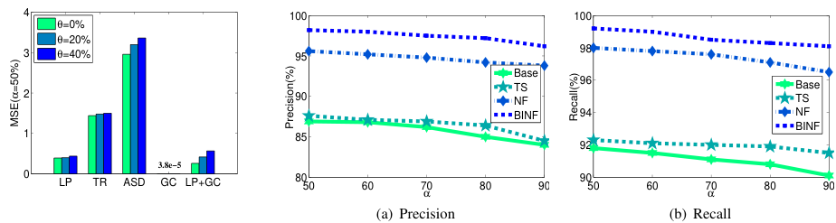

<!-- Start of picture text -->
4 100 100 θ=0% θ=20% 3 θ=40% 95 98 Base TS 96 Base 2 90 NF TS BINF 94 NF BINF 1 85 92 3.8e−5 0 LP TR ASD GC LP+GC 8050 60 70 80 90 9050 60 70 80 90 α α (a) Precision (b) Recall MSE(=50%)α Precision(%) Recall(%) <!-- End of picture text -->

Fig. 6. The MAE of reconstruction methods when _α_ = 50% (GC= _GroupCoach_ ). 

Fig. 7. Precision and recall of faulty data detection in the fusion centre 

missing values before reconstruction. However, compared with direct reconstruction in _GroupCoach_ , the linear interpolation before reconstruction (LP+GC in the figure) introduces error accumulation, although the result is better than the LP-only method. It also indicates the robustness of reconstruction in _GroupCoach_ to deal with missing values. 

Next, we evaluate the **accuracy of faulty movement detection and correction** . Here the _GroupCoach_ is compared with two benchmarks: 

- 1) _Baseline (Base):_ This basic method is to directly compare the difference between RMs and AMs without BINF model. 

- 2) _Time Sequence (TS):_ As the motion and channel sensory data are a series of data points indexed in time order. This benchmark utilize window-based time-series outlier detection [31]. 

- 3) _NF:_ This method utilize the near-to-far diffusion model without the consideration of the body impact factor _XB_ . 

The precision and recall are shown in Fig. 7(a) and (b) respectively. Considering the faulty detection and correction is performed on RMs, the reconstruction error in RMs will be accumulated to detection error, so the detection accuracy can not reach to 100%. Note that the correction is performed after detection, and calculated by the comparison with AMs, so we regard the accuracy for corrections as same as the accuracy for detection. As indicated in these figures, the increase of the compression ratio _α_ leads to the decrease of the detection and correction accuracy for all four methods. The BINF model-based algorithm in _GroupCoach_ outperforms with high precision and recall values, by its NF model and body impact factor consideration. 

As mentioned in Section. II-B, the most power consumption stage is in data transmission. So we evaluate the degree of **energy consumptions** by the transmission quantity of the data. Due to the utilization of CS-based techniques, the transmission quantity in _GroupCoach_ is directly related to the compression ratio _α_ . According to the results shown in Table. III, when _α_ = 70%, _MSE_ = 5 _._ 49 _e__−_5 for _GroupCoach_ . It indicates that a 70% compression ratio can still acquire a satisfactory reconstruction performance. It fulfills the QoS requirements for _GroupCoach_ : less transmission with high reconstruction accuracy. 

TABLE IV 

CALCULATION LATENCY FOR DIFFERENT METHODS WITH _α_ = 70% 

|Recon|struction |Detectio|n & Correction|
|---|---|---|---|
|LP|1_._16_e__−_4|Base|0.17|
|TR|3.2|TS|2.06|
|ASD|0.1943|NF|0.95|
|**GC**|**0.866**|**BINF**|**0.97**|

Another important factor in QoS evaluation is the processing latency of this system. We set the collection time slot _τ_ = 4 _s_ based on the rhythm of the music, so the processing latency is required to be less than 4 seconds. According to the discussion above, we set _α_ = 70% for the processing evaluation. The specific latencies are summarized in Table. IV. The combination of reconstruction in _GroupCoach_ and BINF has 1.836s latency in total, which fulfills the QoS requirements in group activity monitoring. So the feedback can reach to dancers before the next sensory data transmission. Although the combination between LP and ASD with Base and NF can also satisfy this requirement, their accuracies are relatively lower than _GroupCoach_ . 

## _C. Discussion_ 

The design of _GroupCoach_ in this paper has strong assumptions to simulate the simplified monitoring environment, while in practice, there are more complicated scenarios. Firstly, we consider that all group participators perform in the same movements. However, there are rich formats and arrangements in group activities, which separately divide the group into subgroups to assign different movements or locations. Such group division will not break the low-rank feature of the sensory data and the CS techniques are still feasible to be applied to it. Secondly, the environments of group activities can be outdoor or a grand stage, which have unfixed environmental factor ( _E_ in (22)). To be compatible with these environments, the function (22) should be adaptively updated. It can be realized by designing a feedback mechanism, where the accuracy of the correction is also evaluated. If the correction suggestion is wrong, then the system will adjust these factors accordingly. 

The computational complexity of BINF based algorithm is _O_ ( _NT_ ), which is enlarged with the scaling of the activity group and the duration of the monitoring. We believe that with 

Authorized licensed use limited to: Shanghai Jiaotong University. Downloaded on February 15,2022 at 23:35:35 UTC from IEEE Xplore.  Restrictions apply. 

2020 IEEE/ACM 28th International Symposium on Quality of Service (IWQoS) 

the help of a more powerful fusion centre (GPU supported), it can provide near real-time feedback for participators. A shining tip or a voice prompt mechanism can be designed as the feedback on-body sensors to alert the faulty participators. 

## VI. CONCLUSION 

With the increasing popularity of group activity, in this paper, we propose _GroupCoach_ , a CS-based system to accurately and energy-efficiently monitor group participators, which can provide the corresponding correction suggestions on faulty movements. The salient QoS performance of _GroupCoach_ explores the potential of the appliance of CS techniques into WBAN, which will be a promising direction to benefit our daily life. 

Several future works can be considered to improve this research work: 

- 1) We plan to extend _GroupCoach_ into the outdoor environment with more complicated effects on channel sensing data. As discussed in Section V-C, a feedback mechanism can be additionally designed into this system to adaptively update the environmental factors. 

- 2) We expect to enlarge the scale of _GroupCoach_ and break the limits of one-hop communication. A proper multihop routing protocol is required to be designed to avoid missing data [32]. 

## ACKNOWLEDGMENT 

This work was supported in part by National Key R&D Program of China 2018YFB1004703, NSFC grant 61972253, 61672349, U190820096, 61672348, 61672353, the Program for Professor of Special Appointment (Eastern Scholar) at Shanghai Institutions of Higher Learning. 

## REFERENCES 

- [1] E. Mezghani, E. Exposito, K. Drira, A model-driven methodology for the design of autonomic and cognitive iot-based systems: Application to healthcare, IEEE Trans. Emerging Topics in Comput. Intellig. 1 (3) (2017) 224–234. 

- [2] M. Qi, Y. Wang, J. Qin, A. Li, J. Luo, L. V. Gool, stagnet: An attentive semantic RNN for group activity and individual action recognition, IEEE Trans. Circuits Syst. Video Techn. 30 (2) (2020) 549–565. 

- [3] Z. Liu, Z. Lin, X. Wei, S. Chan, A new model-based method for multiview human body tracking and its application to view transfer in imagebased rendering, IEEE Trans. Multimedia 20 (6) (2018) 1321–1334. 

- [4] G. T. Papadopoulos, A. Axenopoulos, P. Daras, Real-time skeletontracking-based human action recognition using kinect data, in: MMM, Dublin, Ireland, 2014, pp. 473–483. 

- [5] S. Savazzi, V. Rampa, S. Kianoush, A. Minora, L. Costa, Occupancy pattern recognition with infrared array sensors: A bayesian approach to multi-body tracking, in: IEEE ICASSP, Brighton, United Kingdom, 2019, pp. 4479–4483. 

- [6] J. Nedoma, S. Kepak, M. Fajkus, J. Cubik, P. Siska, R. Martinek, P. Krupa, Magnetic resonance imaging compatible non-invasive fibreoptic sensors based on the bragg gratings and interferometers in the application of monitoring heart and respiration rate of the human body: A comparative study, Sensors 18 (11) (2018) 3713. 

- [7] M. Keally, G. Zhou, G. Xing, J. Wu, Remora: Sensing resource sharing among smartphone-based body sensor networks, in: IEEE/ACM IWQoS, Montreal, Canada, 2013, pp. 21–30. 

   - [10] S. Li, L. Xu, X. Wang, A continuous biomedical signal acquisition system based on compressed sensing in body sensor networks, IEEE Trans. Industrial Informatics 9 (3) (2013) 1764–1771. 

   - [11] L. Li, L. Liu, H. Peng, Y. Yang, S. Cheng, Flexible and secure data transmission system based on semitensor compressive sensing in wireless body area networks, IEEE Internet of Things Journal 6 (2) (2019) 3212–3227. 

   - [12] H. Xie, J. Lin, Z. Yan, B. W. Suter, Linearized polynomial interpolation and its applications, IEEE Trans. Signal Processing 61 (1) (2013) 206– 217. 

   - [13] F. Jiang, X. Liu, H. Lu, R. Shen, Efficient multi-dimensional tensor sparse coding using t-linear combination, in: AAAI, New Orleans, Louisiana, USA, 2018, pp. 3326–3333. 

   - [14] J. Tanner, K. Wei, Low rank matrix completion by alternating steepest descent methods, Applied and Computational Harmonic Analysis 40 (2) 417–429. 

   - [15] S. P. McGuan, Human modeling – from bubblemen to skeletons, in: SAE Technical Paper, SAE International, 2001. 

   - [16] M. Damsgaard, J. Rasmussen, S. T. Christensen, E. Surma, M. de Zee, Analysis of musculoskeletal systems in the anybody modeling system, Simulation Modelling Practice and Theory 14 (8) (2006) 1100–1111. 

   - [17] D-flow, https://www.motekmedical.com/product/d-flow/. 

   - [18] Visual3d, http://www.c-motion.com/products/visual3d.php. 

   - [19] J. R. Abella, E. Demircan, A multi-body simulation framework for live motion tracking and analysis within the unity environment, in: UR, Jeju, South Korea, 2019, pp. 654–659. 

   - [20] S. L. Delp, F. C. Anderson, A. S. Arnold, P. Loan, A. Habib, C. T. John, E. Guendelman, D. G. Thelen, Opensim: Open-source software to create and analyze dynamic simulations of movement, IEEE Trans. Biomed. Engineering 54 (11) (2007) 1940–1950. 

   - [21] A. Saha, A. Konar, A. K. Nagar, EEG analysis for cognitive failure detection in driving using type-2 fuzzy classifiers, IEEE Trans. Emerging Topics in Comput. Intellig. 1 (6) (2017) 437–453. 

   - [22] A. Majumdar, R. K. Ward, Energy efficient EEG sensing and transmission for wireless body area networks: A blind compressed sensing approach, Biomed. Signal Proc. and Control 20 (2015) 1–9. 

   - [23] M. Qiu, E. H. Sha, M. Liu, M. Lin, S. Hua, L. T. Yang, Energy minimization with loop fusion and multi-functional-unit scheduling for multidimensional DSP, J. Parallel Distrib. Comput. 68 (4) (2008) 443– 455. 

   - [24] N. Geddes, G. S. Gupta, F. Hasan, An energy efficient protocol for wireless body area network of health sensors, in: IEEE I2MTC, Auckland, New Zealand, 2019, pp. 1–6. 

   - [25] M. Swaminathan, A. Vizziello, D. Duong, P. Savazzi, K. R. Chowdhury, Beamforming in the body: Energy-efficient and collision-free communication for implants, in: IEEE INFOCOM, Atlanta, GA, 2017, pp. 1–9. 

   - [26] Y. Liu, L. Kong, M. Hassan, L. Cheng, G. Xue, G. Chen, Litedge: towards light-weight edge computing for efficient wireless surveillance system, in: IEEE/ACM IWQoS, Phoenix, AZ, USA, 2019, pp. 31:1– 31:10. 

   - [27] B. Wang, L. Kong, L. He, F. Wu, J. Yu, G. Chen, I(ts, CS): detecting faulty location data in mobile crowdsensing, in: IEEE ICDCS, Vienna, Austria, 2018, pp. 808–817. 

   - [28] T. Hachaj, Improving human motion classification by applying bagging and symmetry to pca-based features, Symmetry 11 (10) (2019) 1264. URL https://doi.org/10.3390/sym11101264 

   - [29] J. Xu, W. Liu, F. Lang, Y. Zhang, C. Wang, Distance measurement model based on RSSI in WSN, Wireless Sensor Network 2 (8) (2010) 606–611. 

   - [30] T. Pan, C. Kuo, H. Liu, M. Hu, Handwriting trajectory reconstruction using low-cost IMU, IEEE Trans. Emerging Topics in Comput. Intellig. 3 (3) (2019) 261–270. 

   - [31] A. Bl´azquez-Garc´ıa, A. Conde, U. Mori, J. A. Lozano, A review on outlier/anomaly detection in time series data, CoRR abs/2002.04236 (2020). 

   - [32] J. Luo, X. Liu, D. Ye, Research on multicast routing protocols for mobile ad-hoc networks, Comput. Networks 52 (5) (2008) 988–997. 

- [8] D. L. Donoho, Compressed sensing, IEEE Trans. Information Theory 52 (4) (2006) 1289–1306. 

- [9] A. Wang, F. Lin, Z. Jin, W. Xu, A configurable energy-efficient compressed sensing architecture with its application on body sensor networks, IEEE Trans. Industrial Informatics 12 (1) (2016) 15–27. 

Authorized licensed use limited to: Shanghai Jiaotong University. Downloaded on February 15,2022 at 23:35:35 UTC from IEEE Xplore.  Restrictions apply. 

