# Trust-Based Time Series Data Model for Mobile Crowdsensing_∗_ 

Xiao Ma, Zhenzhe Zheng, Fan Wu_†_ , and Guihai Chen 

Shanghai Key Laboratory of Scalable Computing and Systems, Shanghai Jiao Tong University _{_ yusufma555, zhengzhenzhe _}_ @sjtu.edu.cn, _{_ fwu, gchen _}_ @cs.sjtu.edu.cn 

**_Abstract_ —The recent proliferation of mobile devices embedded with capable sensors, provides an opportunity to the popular concept of mobile crowdsensing. By studying the correlation of crowd-sensed data in both spatial and temporal dimensions, we can get a clear understanding of the intrinsic pattern of data in mobile crowdsensing, which is the basic for further data analysis, such as data filtering, smoothing and prediction. However, the crowd-sensed data are normally noise and unreliable due to the diverse mobility patterns and selfish behaviours of mobile users, making the classical data models in wireless sensor networks fail in this new context. In this paper, we propose a robust and reliable time series data model based on Dynamic Bayesian Network to describe the characteristics of the crowd-sensed data. The proposed data model can figure out the spatial and temporal correlation of data in the environment, where the data has high noise levels and mobile users are untrustworthy. We conduct extensive evaluations based on both simulation and a real-world data set. Our evaluation results show that our method successfully modeled the crowd-sensed time series data with effectiveness, efficiency and trustworthiness.** 

## I. INTRODUCTION 

In recent years, we have witnessed the rapid and explosive growth of capable human-carried mobile devices, e.g., smartphones, smartbands, smartglasses. The smart devices embedded with powerful sensors, such as GPS, compass, and accelerator, provide a new paradigm for data collection, namely mobile crowdsensing, and revolute the traditional wireless sensor networks. People have deployed numerous mobile crowdsensing applications, including the indoor positioning [1], smart transportation [2], health care [3], social emergency events detection [4] and et al. 

The sensed data collected by mobile crowdsensing systems always have complex relations in the spatial and temporal dimensions. Although, in the traditional sensor networks, there are already some works proposing different time series models to capture the spatial and temporal correlation among sensed data, in the mobile crowdsensing, due to the following two challenges, those models would be not applicable anymore. The first challenge comes from the mobility of crowd. In 

### _†_ F. Wu is the corresponding author. 

> _∗_ This work was supported in part by the State Key Development Program for Basic Research of China (973 project 2014CB340303), in part by China NSF grant 61672348, 61672353, 61422208, 61472252, 61272443 and 61133006, in part by Shanghai Science and Technology fund 15220721300, in part by CCF-Tencent Open Fund, and in part by the Scientific Research Foundation for the Returned Overseas Chinese Scholars. The opinions, findings, conclusions, and recommendations expressed in this paper are those of the authors and do not necessarily reflect the views of the funding agencies. 

traditional sensor networks, the sensor devices are usually fixed in some pre-determined locations, but the users in mobile crowdsensing systems always have complex and unpredictable mobility patterns, leading to high noise levels of collected sensed data. For such noise and uncertain crowd-sensed data, it is extremely difficult to exploit the spatial and temporal correlation to facilitate data analysis, such as smoothing, filtering, and prediction. 

The second critical challenge is the unreliability of mobile users. The mobile users’ usage behaviors and activity contexts would have an impact on the status of the smart devices, and further influence the quality of collected data. For example, in noise map construction of the crowdsensing system, putting smartphones in mobile users’ pockets or bags would result in reporting different records of the noise levels in the same location. In addition, the selfish mobile users may report lowquality data to get extra payments. Thus, we should take the trustworthiness of mobile users into account when designing crowd-sensed data model. These issues are all not considered in traditional sensor networks, and the corresponding models and methods are intrinsically unable to handle both the high noise levels of crowd-sensed data and the trustworthiness of mobile users. 

In order to overcome the above two challenges in mobile crowdsensing, the proposed data model should have the following properties: 

- 1) **Effectiveness** : The data model should be able to capture the complex spatial and temporal correlation of crowdsensed data, even if the data has a high level of noise and uncertainty. 

- 2) **Efficiency** : The computational complexity of the data model should be controlled within an acceptable threshold to adapt to the requirement of large scale mobile crowd-sensing systems. 

- 3) **Trustworthiness** : The data model should consider the impact of the unreliability of mobile users on the quality of collected data, and give a quantity metric to measure the trustworthiness of mobile users. 

In this paper, jointly considering the two challenges, we propose a reliable time series data model for mobile crowdsensing to satisfy the above three properties. We first use random variables to describe the noisy and uncertain crowdsensed data collected by mobile users. As different mobile users would have different trustworthiness levels, we then 

assign each mobile user a confidence parameter to model his trustworthiness level. We also quantify the impact of the confidence parameter on the distribution of random variables. After that, we propose a reliable time series data model using a Dynamic Bayesian Network, satisfying the properties of effectiveness, efficiency, and trustworthiness. We show that the powerful Dynamic Bayesian Network can not only handle the time correlations of the stochastic data but also model the spatial correlations by mapping technique [5], similar to the singular value decomposition(SVD), even when the collected crowd-sensed data has a high level of noise and uncertainty. To the best of our knowledge, this is the first work that handles the untrustworthy time series data modeling in mobile crowdsensing. Based on the proposed reliable time series data model, we can conduct the data forecasting, missing value imputation and other applications on time series for the noise and uncertain crowd-sensed data. 

In this paper, our main contribution is to establish a new time series data model to handle the noisy and unreliable data collected from mobile crowdsensing. It shows how to exploit the spatial-temporal correlation even the data source is unreliable and the noise level is very high. We conducted extensive evaluations to demonstrate the effectiveness of our proposed model based on the real-world data. 

The rest part of the paper is organized as follows: In Section 2, we review the related work; in Section 3, we will introduce the system model of our approach; in Section 4, we propose the reliable time series data model, and in Section 5, experimental results will be presented. Finally, we conclude the paper in Section 6. 

## II. RELATED WORKS 

In recent years, crowdsourcing and crowdsensing have attracted increasing interest [1], [2], [6], [7], [8], [9], [10]. In [11], some of the existing challenges and potential topics have been discussed. In [6], a programming framework for mobile crowdsensing was proposed. In [7], Jin, Haiming, et al. proposed a novel incentive mechanism integrating data aggregation and data perturbation. Specifically, it helps to select workers who are more likely to provide reliable data. In [2], Hu, Shaohan, et al. developed the _Smartroad_ traffic event detection system to process the GPS data of in-vehicle smartphones collected through participatory sensing. Its results can be used for many assisted-driving or navigation systems. Another example, in [1], a novel indoor floor reconstruction model was proposed based on crowdsensing, which leverages the crowdsensed data from mobile users, extracting the position, size and orientation information of individual landmarks, as well as obtaining the spatial relation between the adjacent landmarks. In addition to the works mentioned above, there are still many interesting topics being discussed by researchers and we will not list them here. 

Similarly, time series always catches the researchers’ interests since there are always unexpected aspects for us to explore [3], [12], [13], [14], [15], [16], [17], [18]. In [3], [12], time series method are used to study the health-related 

problems. Kale, David C., et al. developed a new distance metric for multivariate time series with application to health care[3]; Caballero Barajas et al. It makes use of the locality sensitive hashing, solving the dilemma between quality and speed, enabling distance measuring with a fast search and a high quality. In [14], Jha, Abhay, et al. claimed that in the business scenario, the time series could be sparse if the commodity at the very beginning and the forecasting the time series could be hard with these data. They proposed a clustering model based on PLS regression and OPTMOVE clustering algorithm to forecast the sparse time series based on their similar time series. In a similar scenario with the crowdsensing, the sensor networks, SMiLer([15]) makes use of both kNN and Gaussian Process, solving the problem of the heavy cost introduced by Gaussian Process and output the prediction result with a superior accuracy and an effectively measured uncertainty. [5], [19] focus on the missing value imputation of time series, which is also another important task. [19], focusing on the medical time series, exploited fact that the missing data may appear to be lag-correlated, inputting the missing data using kNN; [5] makes use of the “smoothness” and the “correlation” of the time series data, introducing a Dynamic Bayesian Network based method for missing data imputation, which further supports prediction, smoothing and pattern recognition. There are still many works focusing on solving the realistic problem in time series, and we will not list them one by one. 

Nevertheless, all of these previous time series models are not capable for the crowdsensing. Different from the aforementioned prior works, we focus on the modeling of the time series in the crowdsensing. As mentioned in the previous section, the crowdsensed data has complex relations in the spatial and temporal dimensions, but none of the current works has considered this factor. Hence, we aim to solve this problem, the time series modeling in crowdsensing. Inspired by [5], [20], we develop a novel way to model the time series in the crowdsensing network. The general idea is to treat every report as a random variable and “tag” every it with a user correlated trustworthiness parameter. Then the reports will be synthesized into time series data, which will be modeled using a Dynamic Bayesian Network. 

## III. SYSTEM MODEL 

In this model, a crowd of _k_ users _U_ = _{_ 1 _,_ 2 _, . . . , n}_ keeps collecting data in a given area. With the arbitrary movement of the users, data will be generated at different location and at different time. Each user _i_ reports _ui_ reports, namely _{ri_(1) _, ri_(2) _, . . . , ri_(_ui_) _}_ , where each observation _ri_(_j_) consists of the following four values: (a) the user measured value _vi_(_j_) _∈R_ , which is a noisy observation; (b) the time _a_( _i__j_) indicating when the data was generated; (c) the geographic location _s_( _i__j_),representedinlongtitudeandlatitudewherethe data was generated; (d) an estimate of the precision of the user observation _θi_(_j_) _∈ R>_ 0. Thus, each report has form of 

_ri_(_j_) = _⟨vi_(_j_) _, a_( _i__j_)_, s_( _i__j_)_, θ_ _i_(_j_)_⟩_,andwewillhave_u_= ∑ _n ui i_ =1 reports in total. 

To model the uncertainty of the noisy data in crowdsensing, we assume in each report, the uncertainty is distributed normally. Given _ri_(_j_),theprobabilisticdensityfunctionofthe generic point _v_ could be expressed as 

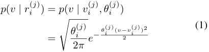

Next, we consider another property of the crowdsensing, the untrustworthiness. In crowdsensing, no user can be trusted. Because people tends to provide more quantity of data to earn more money but ignore the quality of the data or they simply fabricate the data to spoof the system. Thus, the reliability of the crowd-sensed data can pose another challenge to the crowdsensing. Formally, if the report is fully trustworthy, we have the following condition: 

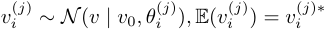

where _vi_(_j_)_∗_ is the ground truth value around location _s_( _i__j_). More specifically, the fully trustworthy reports can be regarded as the samples from a normal distribution whose expectation is the ground truth value. On the contrary, the untrustworthy reports are not necessarily related to the ground truth value, _vi_(_j_)_∗_ . Some deviations may be possible. For example, we may have _vi_(_j_) _∼N_ ( _vi_(_j_)_∗_ + _b, θi_(_j_))withabias_b_fromtheground truth _vi_(_j_)_∗_ . 

Given this, we introduce another set of parameters, namely trustworthiness parameters, as **c** = _{c_ 1 _, c_ 2 _, . . . , cn}_ , where the parameter 0 _≤ ci ≤_ 1 denotes the trustworthiness of user _i_ . Then we can update our probability density function as: 

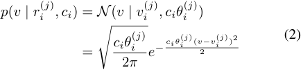

The trustworthiness parameter _ci_ represents the uncertainty of the confidentiality of the data uploaded by the user; _ci_ = 1 means the user can be fully trusted, and the above function equals to (1); the smaller _ci_ is, the noisier the variable _vi_(_j_) would be. 

In the crowdsensing based network, we have a set of fixed target nodes _L_ = _{l_ 1 _, l_ 2 _, . . . , lq}_ , where we are interested in the trend of the time series. For each location, it consists of a longitude and a latitude. We assume there is a global clock in the system such that the time at each position is the same. For simplicity, let the counter _t ∈_ N. Given these information, we can represent our stream time series at _lk_ as _Xk_ = _{xk,t}t__∞_ =1, where each _xk,t ∈ Xk_ is an aggregation of reports belonging to the cluster of this node at the time slot _t_ . The cluster is just based on the geographical distance of the location of the data to the node, and for simplicity, here, we define the cluster to be the circle centered at the node with a given radius. 

We then turn to find the ground-truth of the data in crowdsensing. Here, we use Dynamic Bayesian Network to accomplish this process. Our motivation comes from the correlation between time series and its own smoothness. Smoothness means that _xt ≃ xt_ +1, that the values in the nearby time slot can be tightly related to each other. We can denote that _xt_ +1 = _g_ ( _xt_ )+ _wt_ . Here, _g_ is a function and _wt_ is white noise. For every type of time series data, there is an intrinsic property that different time series may appear in the similar pattern, which we call it a correlation. For example, the time series of the acceleration of two elbows when you are running may be very similar with only a time lag. Dynamic Bayesian Network can help us combine these two properties, then we can handle the sequences, discovering the latent relation between time series, and output the groud-truth. We will introduce our Dynamic Bayesian Network based method in detail in the latter section. 

## IV. SOLUTION 

In this section, we will introduce our proposed model and algorithm in detail. First, the fusion of the data will be covered; second, we will talk about the Dynamic Bayesian Network and its learning procedure. 

## _A. Fusing Untrustworthy Reports_ 

In our assumption, reports will be fused into one value of a time series at a point _t_ only when they are geographically within the range of point _k_ and the observed time _a_( _i__j_) belongs to the time slot _t_ . Just as mentioned before, we only consider the range as a circle centered at _lk_ with radius _dk_ . Note that the circles can overlap, hence one reports could contribute to multiple values of different nodes at the same time tick. Specifically, given a report _ri_(_j_) and a location _lk_ and time slot _t_ , denote the set of reports contribute to the value _xk,t_ as **R** _k,t_ , then we have the following definition: 

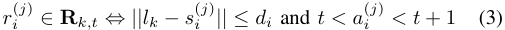

According to equation (3), we can find the the set of _m_ reports **R** _k,t_ = _{rk,t_(1)_, r_ _k,t_(2)_, . . . , r_ _k,t_(_m_)_}_contributesto_lk_at time slot _t_ , then we use a function _fk_ specialized for _lk_ to fuse these reports into one probability density distribution. Normally, we choose function _fk_ as sum function or average function. Note that all of the reports have the similar trustbased PDF _p_ ( _v | ri_(_j_)_, ci_),thentheresultwillstillbean Gaussian distribution, namely _fk_ ( **R** _k,t_ ). In many previous works, covariance intersection(CI) is widely used for data integration. However, in our scenario, traditional CI behaves poorly since the trustworthiness of user is not considered. We refered to the work of Matteo Venanzi et al., consider the set **R** _k,t_ , and set the fusion function as follows. To be concise, let **R** _k,t_ be **R** _k,t_ = _{r_ 1 _, r_ 2 _, . . . , rm}_ where _ri_ = _⟨vi, ai, li, θi⟩_ and the corresponding trustworthiness parameter of report _ri_ be _cri_ . 

## _C. Model Learning_ 

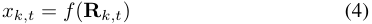

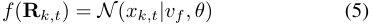

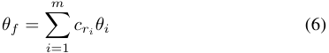

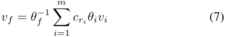

Given the above model, we propose our learning method, trust-based EM algorithm. We have the following parameters to estimate: 

- 1) The transition parameter **F** and **G** . 

- 2) **Z** 0 and the covariance matrices of the Gaussian white noises Γ0, Γ1 and Γ2. 

- 3) The hidden variables _{_ **Z** _i}_ . 

- 4) The trustworthiness parameters **c** of the users. 

Specifically, this trust-based fusion model is obtained by fusing the estimates as jointly weighted by the precision and the trustworthiness parameter of the user. 

To be concise, we denote the collections of the parameters as _α_ := _{_ **F** _,_ **G** _,_ Γ0 _,_ Γ1 _,_ Γ2 _,_ **c** _}_ . Normally, the goal of the parameter optimization is to maximize the log-likelihood of the network, _L_ ( _α_ ) = _P_ ( **Z** _,_ **X** ). However, this is not an easy task, since we have a set of hidden variables **Z** in this network and simply using the maximum-likelihood estimation can be quite expensive. An alternative way is using the EM algorithm. Traditional EM algorithm has two steps: 

## _B. Dynamic Bayesian Network_ 

Dynamic Bayesian Network is a kind of Bayesian Network specialized for handling time evolving events. Here is an illustration of Dynamic Bayesian Network in Fig. 1. In this network, we assume the linear projection **G** maps the latent variable **Z** _t_ to the fused data **X** _t_ , where **X** _t_ is a vector of the fusion of the raw data. This projection automatically catches the spatial correlation between the data, just like SVD. To model the temporal correlation, we assume the latent variable are time dependent on the previous latent variable through a linear projection matrix **F** , which is according to the smoothness of time series. The transition functions can be quantified as follows: 

- 1) _E step_ : estimate the distribution of the latent variables, i.e. the distribution of _Zi_ for every _i_ 

- 2) _M step_ : choose the parameters to maximize the loglikelihood of the network 

However, in our scenario, trustworthiness parameters are introduced and **X** are not directly observed variables as the normal case. Actually, they are the fusion of the measurements, which will change as we update the trustworthiness parameters. Hence, it could be hard for the current EM algorithms to learn the parameters. 

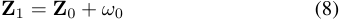

We have to consider two factors. First, in order to model **Z** _t_ +1 = **FZ** _t_ + _ωt_ (9) the temporal trend of the time series, we have to maximize **X** _t_ = **GZ** _t_ + _ϵt_ (10) the log-likelihood of the Dynamic Bayesian Network. Second, due to the unreliability of the users, their reports are not fully **Z** 0 is the initial value of the latent variable, and _ω_ 0 _∼_ trustworthy and we want to know the trustworthiness level of _,_ Γ0),0),),, _ωtt ∼N_ (0 _,_ Γ1),1),),, _ϵtt ∼N_ (0 _,_ Γ2)2)) are Gaussian white each user. However, maximizing one of them does not mean Besides, the fused-data is generated from the raw data that we can get the optimal solution of the other one. Hence, to by function (4)-(7). The joint distribution of **Z** and **X** is given handle this dilemma, we propose our trust-based EM algorithm to find the best trade-off between them. Our basic idea is to _T T_ maximize the log-likelihood of the joint distribution of the _p_ ( **Z** _,_ **X** ) = _p_ ( **Z** 0) ∏ _p_ ( **Z** _i |_ **Z** _i−_ 1) ∏ _p_ ( **X** _i |_ **Z** _i_ ) (11) network and the reports. The likelihood of the network is _i_ =1 _i_ =1 given by equation (11). As for the reports, let **R** ( _ri_(_j_))bethe collection of reports that report _ri_(_j_) belongs to, and we define the **V** _i_ denotes the collection of measures reported at the likelihood of corresponding trustworthiness parameter as _t_ . _L_ ( _ci | ri_(_j_)_, f_(**R**(_r_)( _i__j_))) = ∫ _R__p_(_v| r_ _i_(_j_)_, ci_)_f_(**R**(_r_ _i_(_j_)))_dv_. Our algorithm can be stated as follows: 

where **Z** 0 is the initial value of the latent variable, and _ω_ 0 _∼ N_ (0 _,_ Γ0),0),),, _ωtt ∼N_ (0 _,_ Γ1),1),),, _ϵtt ∼N_ (0 _,_ Γ2)2)) are Gaussian white noises. Besides, the fused-data is generated from the raw data by function (4)-(7). The joint distribution of **Z** and **X** is given by 

where the **V** _i_ denotes the collection of measures reported at time _t_ . 

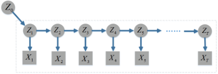

- 1) _E1 step_ : For every _k_ and _t_ , update the distribution of each _xk,t_ with 

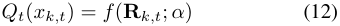

- 2) _E2 step_ : Estimate the distriution of the latent variables **Z** , i.e., the distributions of _Zt_ for every _t_ . Here, we use Belief Propagation for the latent variable inference. 

Fig. 1: Dynamic Bayesian Network Constructed 

function _u_ be _u_ ( _ri_(_j_))=_i_,thenthesummationfunction _fs_ ( _R_ ) = ∑ _n cu_ ( _ri_ ). The geological distribution of all the _i_ =1 

3) _M step_ : update _α_ with _α__∗_ 

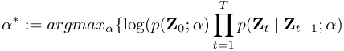

reports is shown in Fig. 2(a), and the original curve without processing by our model of the two nodes are shown in Fig. 2(b). 

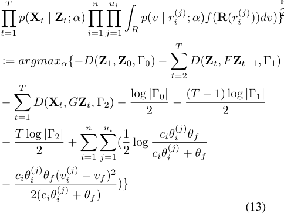

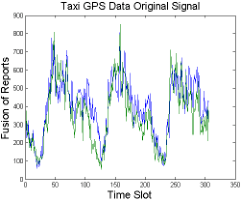

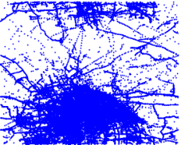

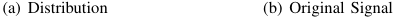

<!-- Start of picture text -->
(a) Distribution (b) Original Signal <!-- End of picture text -->

Fig. 2: Taxi Data 

Here, _D_ ( **v** 1 _,_ **v** 2 _,_ Λ) corresonds to the square of the Mahalanobis distance between two vectors **v** 1 and **v** 2, i.e., _D_ ( **v** 1 _,_ **v** 2 _,_ Λ) = ( **v** 1 _−_ **v** )Λ_−_1 ( **v** 1 _−_ **v** 2)_T_ . 

## _B. Results_ 

We tested our model on the datasets described above on two aspects: a) prediction, by setting the tail of the time series to be empty, b) missing value imputation, by setting the middle part of the time series empty. Meanwhile, we will display that by learning the trustworthiness parameter, our model will reduce the noise and return the ground truth. 

We want to note that this model can be easily extent to handle the reports consists of multiple dimensions. Currently, many mobile devices have various embedded sensors and can collect multiple types of data simultaneously. In order to handle this kind of reports, we only need separately handle each dimension using our model. 

In the simulation, we generated data on 200 time ticks on three time series. The original curve can be shown in Fig. 3. 

## V. EXPERIMENT RESULTS 

## _A. Data_ 

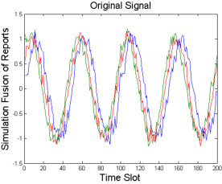

We tested the performance of our model on two datasets: one simulation dataset, another real-world dataset. 

_1) Simulation:_ We generated the test data according to the following principles: 

- We assume a fixed number of users exist in this scenario, and for every user, there is a randomly generated trustworthiness parameter. 

- We assume the time series at each fixed node satisfies a sinusoidal curve, and the corresponding number of reports are generated with randomly assigned user tag. 

Fig. 3: Simulation Original Signal 

- = 

- _•_ The value of _j__th_ report of user _i_ satisfies: at time _t_ , _vi_(_j_) _sinN_ <u>(</u> _t_ <u>)</u> + _δ_ . Here, _N_ is a constant which represents the total number of reports contributes to this location and _δ ∼N_ (0 _, c_ 01 _ci_)where_c_0isaconstant. 

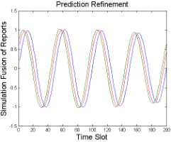

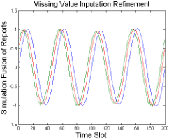

_2) Real-World Data:_ : We also tested our model on the Shanghai Taxi GPS dataset. This dataset consists of the GPS data of Shanghai taxis collected during July 2007. Each report consists of the taxi id, date, time, and the location information. We selected the taxi data on July 1st, 2nd, and 3rd, targeted the data around the downtown area which includes 121 locations in total, and tested the performance on two near locations. When fusing the reports, we select a fixed cluster radius and fused the reports by summation function _fs_ . Specifically, let the collection of reports be **R** = _{r_ 1 _, r_ 2 _, . . . , rn}_ , and user 

<!-- Start of picture text -->
(a) Prediction (b) Missing Value Inputation <!-- End of picture text -->

Fig. 4: Simulation Results 

For prediction, we use the first 150 data as the training set and the rest 50 data for testing. As the iteration times goes from 1 to 300, the standard error is being calculated. We find that our method successfully eliminated the noise and output the curve as expected. For missing value imputation, we also use 150 data as the training set, the rest for testing. The results can be shown in Fig. 4 to Fig. 5. 

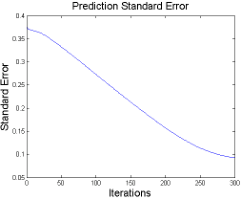

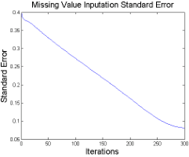

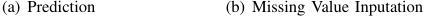

<!-- Start of picture text -->
(a) Prediction (b) Missing Value Inputation <!-- End of picture text -->

Fig. 5: Simulation Standard Error 

We can find that our model successfully made the prediction and missing value imputation, as well as got the ground truth of the sinusoidal curve. The result displayed in Fig 4. tends to have some shrink at the prediction part(the rightmost part of the Fig 4.(a)) and the imputation part(the third peak of the Fig 4.(b)). With the more iterations, this defect will be eliminated. 

For the taxi dataset, we randomly selected two close nodes to test its performance. We divide one day into 102 time slots, and similarly, by setting part of the time series to be the test set, we got the following results, shown in Fig. 6. 

According to the experiment, our method successfully outputs the reliable time series model. It efficiently and effectively learned the trustworthiness parameter of the users then catches the spatial correlation between two time series, as well as the temporal correlation within the time series, outputting satisfying prediction and missing value imputation result. The 

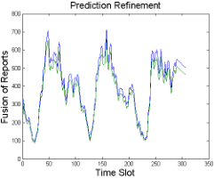

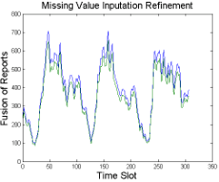

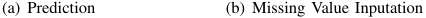

<!-- Start of picture text -->
(a) Prediction (b) Missing Value Inputation <!-- End of picture text -->

Fig. 6: Taxi Data Experiment 

result in Fig 6. showed that the noise has been reduced when processed by our model, and our model can make the prediction and missing value imputation in this scenario. 

## VI. CONCLUSION AND FUTURE WORK 

In this paper, we proposed a Trust-Based Time Series Data Model based on Dynamic Bayesian Network for crowdsens- 

ing. For each user, we used a trustworthiness parameter to model his trustworthiness level. Next, we proposed a corresponding EM algorithm to learn the parameters efficiently and effectively. In the experiment, we tested our algorithm both on simulation and real world dataset and proved that our algorithm is effective at finding the ground truth, reducing noise, prediction, and missing value imputation. 

However, we noticed that this model can only be applied to a limited number of time series. When handling dozens of time series, an overfitting problem may occur. We aim to solve the problem and continue to optimize our model in the future. 

## REFERENCES 

- [1] R. Gao, M. Zhao, T. Ye, F. Ye, Y. Wang, K. Bian, T. Wang, and X. Li, “Jigsaw: Indoor floor plan reconstruction via mobile crowdsensing,” in _MobiCom, 2014_ . 

- [2] S. Hu, L. Su, H. Liu, H. Wang, and T. F. Abdelzaher, “Smartroad: Smartphone-based crowd sensing for traffic regulator detection and identification,” _ACM Trans. Sen. Netw._ , vol. 11, no. 4, pp. 55:1–55:27, Jul. 2015. 

- [3] D. C. Kale, D. Gong, Z. Che, Y. Liu, G. Medioni, R. Wetzel, and P. Ross, “An examination of multivariate time series hashing with applications to health care,” in _ICDM, 2014_ . 

- [4] Z. Xu, H. Zhang, Y. Liu, and L. Mei, “Crowd sensing of urban emergency events based on social media big data,” in _TrustCom, 2014_ . 

- [5] L. Li, J. McCann, N. S. Pollard, and C. Faloutsos, “Dynammo: Mining and summarization of coevolving sequences with missing values,” in _KDD, 2009_ . 

- [6] M.-R. Ra, B. Liu, T. F. La Porta, and R. Govindan, “Medusa: A programming framework for crowd-sensing applications,” in _MobiSys, 2012_ . 

- [7] H. Jin, L. Su, H. Xiao, and K. Nahrstedt, “Inception: Incentivizing privacy-preserving data aggregation for mobile crowd sensing systems,” in _MobiHoc, 2016_ . 

- [8] Z. Huo, L. Shu, Z. Zhou, Y. Chen, K. Li, and J. Zeng, “Data collection middleware for crowdsourcing-based industrial sensing intelligence,” in _MobiMWareHN, 2015_ . 

- [9] L. Duan, T. Kubo, K. Sugiyama, J. Huang, T. Hasegawa, and J. Walrand, “Incentive mechanisms for smartphone collaboration in data acquisition and distributed computing,” in _INFOCOM, 2012_ . 

- [10] M. H. Cheung, R. Southwell, F. Hou, and J. Huang, “Distributed timesensitive task selection in mobile crowdsensing,” in _MobiHoc, 2015_ . 

- [11] N. D. Lane, E. Miluzzo, H. Lu, D. Peebles, T. Choudhury, and A. T. Campbell, “A survey of mobile phone sensing,” _IEEE Communications Magazine_ , vol. 48, no. 9, pp. 140–150, 2010. 

- [12] K. L. Caballero Barajas and R. Akella, “Dynamically modeling patient’s health state from electronic medical records: A time series approach,” in _KDD, 2015_ . 

- [13] B. Hu, Y. Chen, J. Zakaria, L. Ulanova, and E. Keogh, “Classification of multi-dimensional streaming time series by weighting each classifier’s track record,” in _ICDM, 2013_ . 

- [14] A. Jha, S. Ray, B. Seaman, and I. S. Dhillon, “Clustering to forecast sparse time-series data,” in _ICDE, 2015_ . 

- [15] J. Zhou and A. K. Tung, “Smiler: A semi-lazy time series prediction system for sensors,” in _SIGMOD, 2015_ . 

- [16] C. Luo, J.-G. Lou, Q. Lin, Q. Fu, R. Ding, D. Zhang, and Z. Wang, “Correlating events with time series for incident diagnosis,” in _KDD, 2014_ . 

- [17] L. Ulanova, T. Yan, H. Chen, G. Jiang, E. Keogh, and K. Zhang, “Efficient long-term degradation profiling in time series for complex physical systems,” in _KDD, 2015_ . 

- [18] Y. Cai, H. Tong, W. Fan, P. Ji, and Q. He, “Facets: Fast comprehensive mining of coevolving high-order time series,” in _KDD, 2015_ . 

- [19] S. A. Rahman, Y. Huang, J. Claassen, and S. Kleinberg, “Imputation of missing values in time series with lagged correlations,” in _ICDMW, 2014_ . 

- [20] M. Venanzi, A. Rogers, and N. R. Jennings, “Trust-based fusion of untrustworthy information in crowdsourcing applications,” in _AAMAS, 2013_ . 

