# SOAR: Strategy-Proof Auction Mechanisms for Distributed Cloud Bandwidth Reservation 

Yang Gui, Zhenzhe Zheng, Fan Wu, Xiaofeng Gao, and Guihai Chen Shanghai Key Laboratory of Scalable Computing and Systems 

Department of Computer Science and Engineering 

Shanghai Jiao Tong University, China 

Abstract—Bandwidth reservation is envisioned to be a valueadded feature for the cloud provider in the following years. We consider the bandwidth reservation trading between the cloud provider and tenants as an open market, and design practical mechanisms under an auction-based market model. To the best of our knowledge, we propose the first family of <u>Strategy-prOof Auction</u> mechanisms for cloud bandwidth <u>Reservation</u> (SOAR). First, we present SOAR-VCG that achieves both optimal social welfare and strategy-proofness when the tenants accept partially filled demands. Then, we propose SOAR-GDY that guarantees strategy-proofness and achieves good social welfare when the tenants do not satisfy with partial bandwidth reservations. We do not only theoretically prove the properties of SOAR family of auction mechanisms, but also extensively show that they achieve good performance in terms of social welfare, bandwidth satisfaction ratio, and bandwidth utilization in the simulation. 

## I. INTRODUCTION 

One of the most important business paradigms brought by cloud computing is Infrastructure as a Service (IaaS), by which virtual machines that abstract bundles of computation, storage, and network resources, are provided to applications/tenants. More and more Internet applications move their platform to cloud providers. For example, Netflix moved its data storage system, streaming servers, encoding engine, and other major modules to Amazon Web Services (AWS) in 2010. 

A number of such applications that provide online streaming services need guaranteed bandwidth to maintain their quality of service (QoS) at required level. However, in contrast to the CPU or storage resources, the bandwidth resource currently provided by major cloud providers does not have any quantitative guarantee. Fortunately, recent developments of data center networking techniques make it possible to offer bandwidth reservations for tenants [1], [2]. Therefore, we believe that there will be a newly emerged market, in which the tenants purchase bandwidth reservations from cloud providers to guarantee their QoS requirements. 

Recently, Niu et al. [3] elegantly introduced a profit making broker to negotiate the bandwidth reservation price with the tenants and lead the system to converge to a unique Nash equilibrium (NE). However, NE may not be an ideal solution to the problem of cloud bandwidth reservation due to three reasons [4]: First, NE is not a very strong solution concept in game theory. NE does not hold when the players do not have belief on the others’ behaviors. Second, NE usually cannot guarantee optimal social welfare. 

This work was supported in part by the State Key Development Program for Basic Research of China (973 project 2014CB340303 and 2012CB316201), in part by China NSF grant 61422208, 61472252, 61272443 and 61133006, in part by Shanghai Science and Technology fund 12PJ1404900 and 12ZR1414900, and in part by Program for Changjiang Scholars and Innovative Research Team in University (IRT1158, PCSIRT) China. The opinions, findings, conclusions, and recommendations expressed in this paper are those of the authors and do not necessarily reflect the views of the funding agencies or the government. 

F. Wu is the corresponding author. 

We consider the bandwidth reservation trading between a cloud provider and a number of tenants as an open market, and introduce auction to strengthen the marketing mechanism. Designing a practical auction mechanism for cloud bandwidth reservation has two major challenges. One major challenge is strategy-proofness, which guarantee that only reporting true valuation as a bid can maximizes one’s utility and no participant can benefit herself by manipulating.The other major challenge is the optimality of the auction outcome, which is an allocation of the cloud bandwidth. In general case, finding the optimal cloud bandwidth reservation is a combinatorial problem that cannot be solved in polynomial time and classic strategy-proof auction mechanisms cannot be applied. 

In this paper, we model the problem of cloud bandwidth reservation as a sealed-bid auction, and carry out in-depth study of mechanism design on the problem. We propose SOAR, which is the first family of <u>Strategy-prOof Auction</u> mechanisms for cloud bandwidth <u>Reservation.</u> SOAR contains two auction mechanisms, SOAR-VCG and SOAR-GDY. SOAR-VCG is a VCG-based auction mechanism for cloud bandwidth reservation, achieving both optimal social welfare and strategy-proofness when the tenants accept partially filled demands. When the tenants are single-minded, meaning that they cannot be satisfied by partial bandwidth reservations, SOAR-GDY can be applied to guarantee strategy-proofness and to achieve good social welfare in most cases. Finally, we implement these two auction mechanisms and extensively evaluate their performance. Our evaluations results show that they achieve good performance in terms of social welfare, bandwidth satisfaction ratio, and bandwidth utilization. We note that SOAR can also be applied to provisioning other kinds of cloud resources, e.g., CPU, memory, and storage. 

The rest of this paper is organized as follows. We present technical preliminaries in Section II. We consider the tenants who would like to pay for every unit of bandwidth reserved up to her maximum demand and present SOAR-VCG in Section III. In Section IV, we present SOAR-GDY, for the case that each tenant can only be satisfied when all her demanded bandwidth is reserved. We show evaluation results and related works Section V and Section VI, respectively. The conclusion and possible future work are given in Section VII. 

## II. TECHNICAL PRELIMINARIES 

In this section, we present our auction model for the problem of cloud bandwidth reservation, and review some useful solution concepts from classic mechanism design. 

## A. Auction Model 

As shown in Fig. 1, we consider an open market for cloud bandwidth reservation, in which there is a cloud provider having multiple data centers and a number of cloud tenants renting cloud bandwidth to provide their online streaming 

978-1-4799-5832-0/14/$31.00 ©2014 IEEE 

162 

Proceedings of the 2014 IEEE ICCS 

services, such as online video. The data centers of the cloud provider are geographically located, and have different capacities of bandwidth. The cloud tenants, especially the providers of online video streaming services, need to compete with each other to reserve bandwidth to guarantee their requirements on quality of service (QoS) of data rate. The cloud provider manages the allocation of available bandwidth of the data centers, according to the cloud tenants’ bandwidth demands. 

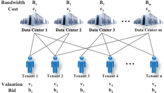

<!-- Start of picture text -->
��������� �� �� �� �� ���� �� �� �� �� � ���� ������ � ���� ������ � ���� ������ � ���� ������ � � ������ � ������ � ������ � ������ � ������ � ��������� �� �� �� �� �� ��� �� �� �� �� �� <!-- End of picture text -->

Fig. 1. An open market for cloud bandwidth reservation with m data centers and n tenants. 

We model the problem of cloud bandwidth reservation as a sealed-bid auction, in which all the buyers simultaneously submit sealed bids periodically, so that no buyer knows the bid of any of the other participants. The cloud provider is assume to be trustworthy, and let it make the decision on the allocation of reserved cloud bandwidth and the charge to each tenant. The auction is carried out periodically (e.g., every hour or day) or on demand (e.g., one of the cloud provider raise a request for bandwidth adjustment). 

Cloud Provider: A cloud provider (e.g., Azure, Amazon EC2, and Google AppEngine) possesses a number of data centers geographically located all over the world, denoted by M = {1, 2, . . . , m} . Each data center l ∈ M may have a different outgoing bandwidth capacity of Bl , and a serving cost of cl per unit of bandwidth. B#– = (B1, B2, . . . , Bm) and#– c = (c1, c2, . . . , cm) denote the vector of bandwidth capacities and per unit bandwidth costs, respectively. 

= Tenant: There is a set of tenants, denoted by N {1, 2, . . . , n} , who are online streaming service providers (e.g., Netflix, Hulu, and Youku). The tenants compete to reserve bandwidth from the cloud provider to serve their customers. Each tenant i ∈ N demands to reserve bandwidth di to satisfy her requirement on QoS, and has a valuation of vi on each unit of bandwidth reserved. This valuation can be derived from the revenue obtained by a tenant for serving her subscribers, and is the private information to the tenant. We denote the valuation profile of the tenants by#– v = (v1, v2, . . . , vn) . In the auction, the tenants simultaneously submit their sealed bids#– b = (b1, b2, . . . , bn) , which are not necessarily equal to their valuations, the bandwidth demands #–d = (d1, d2, . . . , dn) , to the cloud provider. In Section III, we consider the case that each tenant would like to pay for every unit of bandwidth reserved up to her maximum demand. In Section IV, we consider the case, in which each tenant can only be satisfied when all her demanded bandwidth is reserved. 

The cloud provider determines the set of winning tenants W , bandwidth reserved for the tenants A = (al i)i∈N,l∈M , and the charge to the tenants#– p = (p1, p2, . . . , pn) . Here, al idenotesthebandwidthreservedinthedatacenterlfor the tenant i , and pi denotes the per unit bandwidth charge for the tenant i . To guarantee the profit of the cloud provider, we require that the charge must be no less than a predefined constant p0 > 0 (e.g., p0 = maxl∈M(cl) ). 

The utility ui of the tenant i is defined to be the difference between her valuation on the reserved bandwidth and the charge, namely ui = ai(vi − pi) , where ai =� l∈Mia ilis the total amount of bandwidth reserved for the tenant i . 

We assume that the tenants are rational, that means the only objective of each tenant is to maximize her own utility. A tenant has no preference over different outcomes, if the utility is same to the tenant herself. The tenants may try to manipulate their bids in order to seek for higher utilities, but do no cheat about their bandwidth demands. We also assume that the tenants do not collude with each other. 

In contrast to the tenants, the auction’s objective is to maximize social welfare, which is defined as follows. 

Definition 1 (Social Welfare). The social welfare in an auction for cloud bandwidth reservation is the difference between the sum of tenants’ valuations and the sum of costs on the reserved bandwidths: SW =� i∈W �l∈Mi(vi −cl)a il. 

## B. Solution Concepts 

A strong solution concept from mechanism design is dominant strategy. 

Definition 2 (Dominant Strategy [5]). Strategy (bid in this paper) si is the player (tenant in this paper) i ’s dominant strategy, if for any strategy s′ i̸=siandanyotherplayers’ strategy profile s−i : ui(si, s−i) ≥ ui(s′ i, s−i). 

Intuitively, a dominant strategy of a player/tenant is a strategy/bid that maximizes her utility, regardless of what strategy/bid profile the other players/tenants choose. 

The concept of incentive-compatibility means that there is no incentive for any player/tenant to lie about her private information, and thus revealing truthful information is the dominant strategy for every player/tenant. An accompanying concept is individual-rationality, which means that for every player/tenant participating the game/auction is expected to gain no less utility than staying outside. Now we introduce the definition of Strategy-Proof Mechanism. 

Definition 3 (Strategy-Proof Mechanism [5]). A mechanism is strategy-proof when it satisfies both incentive-compatibility and individual-rationality. 

The objective of our work is to design strategy-proof auction mechanisms for cloud bandwidth reservation. 

## III. VCG-BASED AUCTION 

In this section, we consider the case that each tenant would like to pay for every unit of bandwidth reserved up to her maximum demand. We present SOAR-VCG, a VCG-based auction mechanism for cloud bandwidth reservation, which achieves both optimal social welfare and strategy-proofness. SOAR-VCG is composed of optimal bandwidth reservation and VCG-based charging. 

## A. Optimal Bandwidth Reservation 

Given the bandwidth capacity profile B#– and per unit bandwidth cost profile#– c of the data centers, and demand profile #–d and bid profile #–b from the tenants, we model the problem of social welfare maximizing bandwidth reservation as a linear program LP . The objective is to maximize the social welfare. Here, we use bi instead of vi to calculate social welfare, because the strategy-proof mechanism shown in Section III-B 

163 

Proceedings of the 2014 IEEE ICCS 

will guarantee that bidding bi = vi is the dominate strategy of each tenant i ∈ N . Constraint (1) indicates the bandwidth capacity limitation on the data centers. Constraint (2) indicates the maximal demands from the tenants. Constraint (3) guarantees that each bandwidth reservation is non-negative. 

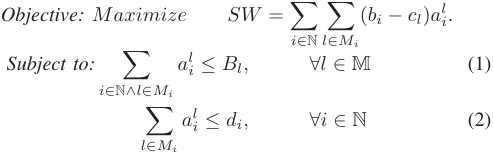

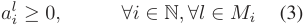

We can get the optimal bandwidth reservation A⋆ to achieve optimal social welfare by solving the above linear program in polynomial time. 

## B. VCG-Based Charging 

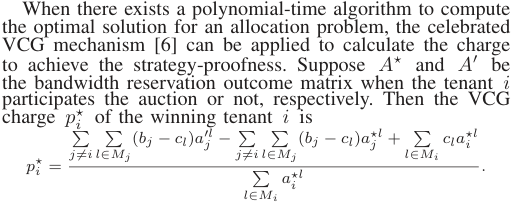

Intuitively, the VCG charge p⋆ i of the winning tenant i is the difference between the two social welfare excluding herself, when she participates the auction or not. It cannot happen that 0 < p⋆ i<p0 ,becausebi≥p0, ∀i∈N.Then, the charge pi for the winning tenant i is pi = max{p⋆ i, p0}. For the losers, they are free of any charge. 

Since SOAR-VCG has an optimal allocation and calculates the charge based on VCG, we have the following conclusion. 

Theorem 1. SOAR-VCG is a strategy-proof and optimal auction mechanism for cloud bandwidth reservation. 

## IV. GREEDY AUCTION 

In reality, some tenants may have strict requirement on QoS, and they can only be satisfied and would like to pay for the reserved bandwidth, when all of the demanded bandwidth is reserved. In this section, we consider the situation that each tenant pays for the reserved bandwidth only when her demand is fully filled, and model the social welfare maximization problem as the following binary programm BP . 

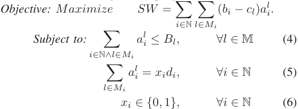

The above binary programm version of the social welfare maximization can be reduced to the Generalized Assignment Problem (GAP), which has been proven to be NP-hard [7]. Considering the computational intractability of the problem of social welfare maximization and infeasibility of VCG mechanism, we propose SOAR-GDY, an alternative greedybased auction mechanism for cloud bandwidth reservation. 

## A. Design of SOAR-GDY 

Similar to SOAR-VCG, SOAR-GDY also contains two components: greedy bandwidth reservation and charging. 

1) Greedy Bandwidth Reservation: Intuitively, SOAR-GDY tries to greedily reserve the bandwidth for the tenants that may bring higher social welfare. Since the part of social welfare achieved by the bandwidth reservation of the tenant i depends on the outcome of bandwidth allocation, which is not known before running the algorithm, we approximate the social welfare that might be achieved by the tenant i by introducing a virtual bidˆ bi = ~~√~~ <u>d|Mi</u> i| �bi − <u>�</u> ~~�~~ l∈l∈MMiicBlBll � . 

SOAR-GDY sorts the tenants by their virtual bids in nonincreasing order, and then greedily reserves bandwidths according to the tenants’ demands following the ordering. 

Algorithm 1 shows the pseudo-code of SOAR-GDY’s bandwidth reservation algorithm. After calculating the virtual bid of each tenant (Line 2-4), SOAR-GDY sorts the tenants according to their virtual bids in non-increasing order (Line 5) β . Then, SOAR-GDY checks the tenants one by one following the order β to see whether each tenant i ’s demand can be satisfied by the rest of the bandwidth. If yes, SOAR-GDY adds the tenant i to the set of winners, and allocates the bandwidth with the smallest cost to the tenant i . Otherwise, SOAR-GDY simply ignores the tenant i (Lines 6-15). Finally, SOAR-GDY outputs the set of winning tenants W and the matrix of bandwidth reservation A . The runtime of Algorithm 1 is O(mn) . 

## Algorithm 1: SOAR-GDY Bandwidth Reservation 

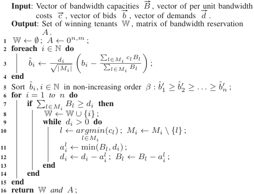

2) Charging: The charge is calculated by finding critical competitor first, which is defined as follow. 

Definition 4 (Critical Competitor). The critical competitor cc(i) ∈ N of tenant i ∈ W is the first tenant, after which has been selected as a winner by Algorithm 1 given N \ {i} , such that the tenant i ’s demand can no longer be satisfied by the remaining bandwidths. 

Now we can show the method to calculate the charge for the tenant i by distinguishing three cases: 

- 1) If tenant i loses in the auction, then her charge is 0 . 

- 2) If tenant i ∈ W and cc(i) does not exist (denoted by cc(i) = 0 ), then her charge is p0 . 

- 3) If tenant i ∈ W and there exists a critical competitor cc(i) , the charge pi of the tenant i is set to pi = 

164 

Proceedings of the 2014 IEEE ICCS 

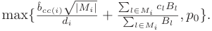

Algorithm 2 shows the pseudo-code of SOAR-GDY’s charging algorithm, and the runtime is O(mn) . 

Algorithm 1 is called once to determine the set of winner and bandwidth reservation, and we need to call Algorithm 2 O(n) times to calculate the charge for each of the winning tenants. Therefore, the total runtime of SOAR-GDY is O(mn2 ) . 

## Algorithm 2: SOAR-GDY Charging for Tenant i ∈ W 

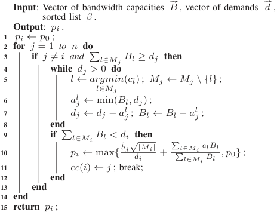

<!-- Start of picture text -->
Input: Vector of bandwidth capacities B #–  , vector of demands #– d , sorted list β . Output: pi . 1 pi ← p0 ; 2 for j = 1 to n do 3 if j̸ = i and � l∈Mj Bl ≥ dj then 4 while dj > 0 do 5 l ← argmin(cl) ; Mj ← Mj \ {l} ; l∈Mj 6 a l j ← min(Bl, dj ) ; 7 dj ← dj − a l j ; Bl ← Bl − al j ; 8 end 9 if � l∈Mi Bl < di then 10 pi ← max{ ˆbj√d|iMi| + � � l∈l∈MMii cBlBl l , p0} ; 11 cc(i) ← j ; break; 12 end 13 end 14 end 15 return pi ; <!-- End of picture text -->

## B. Analysis 

In this section, we prove the strategy-proofness. 

Theorem 2. SOAR-GDY is a strategy-proof auction mechanism for cloud bandwidth reservation. 

Proof: We first show that for each tenant i ∈ N , bidding truthfully is her dominant strategy. We distinguish two cases: 

- The tenant i wins in the auction and gets utility ui when bidding truthfully, i.e., bi = vi . If she manipulates her bid b′ i̸= vi ,thefollowingtwocasesmayhappen: – The tenant i still wins in the auction. Her utility does not change, because her critical competitor and charge are independent on her bid. 

   - The tenant i turns to loss in the auction. Then, her utility becomes 0, which is definitely no more than ui ( ui ≥ 0 ). 

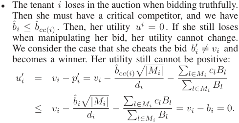

Therefore, the tenant i cannot increase her utility by bidding any other value than vi , namely, bidding truthfully is her dominant strategy. So, SOAR-GDY is incentive-compatibility. Second, we show that for each tenant, truthfully participating the auction is always better than staying outside, which results in a utility of 0. It is clear that if tenant i loses in the auction and gets utility ui = 0 , this is not worse than staying 

outside. If the tenant i wins in the auction and gets utility ui = vi − pi , we further consider two cases: 

- The tenant i ’s critical competitor does not exist, and thus pi = p0 ≤ bi = vi . 

- The tenant i has a critical competitor cc(i) . Her charge pi is no larger than vi . 

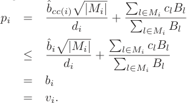

Therefore, SOAR-GDY provides individual-rationality. 

Therefore, SOAR-GDY is strategy-proof because it is both incentive-compatibility and individual-rationality. 

## V. EVALUATION RESULTS 

We implemented SOAR and gave a similar experimental setup with [8] to evaluate the performance in this section. 

Consider a cloud provider with a number of data centers provides bandwidth reservation to multiple tenants, the data center’s cost of per unit bandwidth is normalized and uniformly distributed over interval (0, 1] while the tenant’s valuation on per unit of bandwidth is uniformly distributed over (1, 2] . Similarly, each tenant’s bandwidth demand is normalized and range from 0 to 1, and we assume that the bandwidth capacity of each data center is randomly selected in the range of (1, 10] . We fix the number of data centers at 5 and 15 , respectively, and evaluate the performance of SOAR with the number of tenants vary from 20 to 3001 . For each simulation setting, we calculate the results averaged over 1000 rounds. 

The following three metrics are used to evaluate performance of SOAR. As shown in Fig. 2 and 3, SOAR outperforms Nash Equilibrium (NE) method in terms of the three performance metrics. We also compare SOAR-GDY with the suboptimal solution of binary programm BP shown in Section IV achieve by integer programming tools2 . 

- Social welfare: The definition is given in Definition1. 

- Bandwidth satisfaction ratio: Bandwidth satisfaction ratio is the percentage of tenants’ bandwidth demands that can be satisfied in the auction. 

- Bandwidth utilization: Bandwidth utilization is ratio of the total bandwidth that is utilized in the auction. 

In Fig. 2, we show the performance of SOAR-VCG as a function of the number of tenants. We can see that the social welfare and bandwidth utilization increases with the number of tenants, and bandwidth satisfaction ratio decrease. When there are 15 datacenters and less than 200 tenants, bandwidth satisfaction ratio exceeds 90% , and the bandwidth utilization ratio of SOAR-VCG is higher than 90% when there are more than 180 tenants in the auction. That point indicates the bandwidth satisfaction tends to be saturated. 

Fig. 3 shows evaluation results achieved by SOAR-GDY as the number of tenants increases. Which is similar to SOARVCG, when the number of datacenter is 15 and the number of 

> 1The ranges of the number of data center can be different from the ones used here. However, the evaluation results of using different ranges are identical. Therefore, we only show the results of the above ranges in this paper. 

> 2Since finding the optimal solution for the SOAR-GDY case is NP-hard and the computation time of 100 rounds is more than an hour, we only calculate the optimal solution with small-scale bidders. 

165 

Proceedings of the 2014 IEEE ICCS 

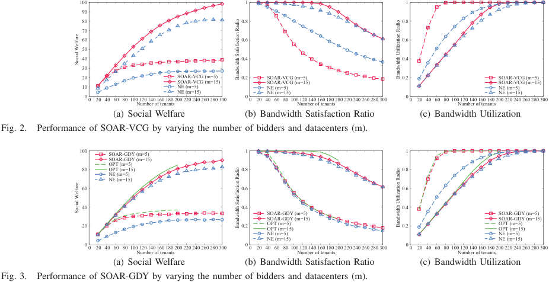

<!-- Start of picture text -->
���� �� �� ��� ��� ���� ���� ��� ��� ���� ���� ��� ��� ���� ���� ��� ��� �������������� ���� �������������� ���� �������������� ��� ����������������������� ����������������������� ����������������������� ���� ��� ��� ��� ��� ����������������������������������������������������� ���� ��� ��������������� ��� �������������������������������������������� ���� ��� ��� ��� ��� ����������������������������������������������������� ����������������� ����������������� ����������������� (a) Social Welfare (b) Bandwidth Satisfaction Ratio (c) Bandwidth Utilization Fig. 2. Performance of SOAR-VCG by varying the number of bidders and datacenters (m). ���� �������������� �� �� ��������������� ��������� ��� ���������� ���� ���� �������� ��������� ��� ���� ���� ��� ���� ���� �������������� �������������� ��������������� ��������������� ��� ���� ������������������� ���� ������������������� �������� �������� ��������� ��������� ���� ��� ��� ��� ��� �������������������������������������������� ���� ��� ��� ��� ��� �������������������������������������������� ���� ��� ��� ��� ��� �������������������������������������������� ����������������� ����������������� ����������������� (a) Social Welfare (b) Bandwidth Satisfaction Ratio (c) Bandwidth Utilization Fig. 3. Performance of SOAR-GDY by varying the number of bidders and datacenters (m). �������������� ���������������������������� ��������������������������� �������������� ���������������������������� ��������������������������� <!-- End of picture text -->

tenants is less than 180 , bandwidth satisfaction ratio SOARGDY exceed 90% , and after that the bandwidth utilization ratio of it is higher than 80%. We also use lines without point plots the suboptimal solution in Fig. 3. Compared to suboptimal solution of binary programm BP , SOAR-GDY can get more than 93.58% of the optimal solution in general case. The social welfare achieved by SOAR-GDY is closely approximated to that of suboptimal solutions, which demonstrates that the greedy-based bandwidth reservation algorithm has a high social welfare in most cases. 

## VI. RELATED WORKS 

A number works such as SecondNet [2], Oktopus [1], PROTEUS [9] and Seawall [10], have been proposed to address the problem of cloud bandwidth allocation and reservation. Popa et al. propose three allocation policies to navigate tradeoffs between min-guarantee, high utilization and payment proportionality requirements for cloud networks sharing [11]. 

Since the traditional pay-as-you-go model [12] can not satisfy the needs of online streaming service applications, new approaches are proposed for the cloud bandwidth allocation problem. Broker or allocator is proposed to processes requests and negotiate the bandwidth prices in [8], [13]. Several pricing schemes [14]–[16] are also proposed for cloud resource allocation. In coupled systems without complicating message-passing, a new iterative approach to distributed resource allocation was proposed in [17]. A truthful online auction was design in cloud computing where users with heterogeneous demands could come and leave on the fly [18]. The rigorous cooperative game framework has also been applied to share multi-tenant data center networks [19]. In contrast to their work, we propose a family of strategyproof auction mechanisms for cloud bandwidth reservation. Our approaches not only achieve strategy-proofness, but also provide guaranteed performance in most of the cases. 

## VII. CONCLUSION 

In this paper, we have modeled the problem of cloud bandwidth reservation as a sealed-bid auction and propose SOAR, a family of strategy-proof auction mechanisms for cloud bandwidth reservation. Our evaluation results have shown that 

SOAR achieves good performance in terms of social welfare, bandwidth satisfaction ratio, and bandwidth utilization. 

## REFERENCES 

- [1] H. Ballani, P. Costa, T. Karagiannis, and A. Rowstron, “Towards predictable datacenter networks,” in Proc. ACM SIGCOMM’11. 

- [2] C. Guo, G. Lu, H. Wang, S. Yang, C. Kong, P. Sun, W. Wu, and Y. Zhang, “SecondNet: A data center network virtualization architecture with bandwidth guarantees,” in Proc. ACM Co-NEXT’10. 

- [3] D. Niu, C. Feng, and B. Li, “A theory of cloud bandwidth pricing for video-on-demand providers,” in Proc. IEEE INFOCOM’12. 

- [4] F. Wu, N. Singh, N. Vaidya, and G. Chen, “On adaptive-width channel allocation in non-cooperative, multi-radio wirelesss networks,” in Proc. IEEE INFOCOM’11. 

- [5] M. Osborne and A. Rubinstein, A course in game theory. The MIT press, 1994. 

- [6] N. Nisan, T. Roughgarden, E. Tardos, and V. V. Vazirani, Algorithmic game theory. Cambridge University Press, 2007. 

- [7] G. Ross and R. Soland, “A branch and bound algorithm for the generalized assignment problem,” Mathematical programming, vol. 8, no. 1, pp. 91–103, 1975. 

- [8] D. M. Divakaran and M. Gurusamy, “Probabilistic-bandwidth guarantees with pricing in data-center networks,” in Proc. IEEE ICC’13. 

- [9] D. Xie, N. Ding, Y. C. Hu, and R. Kompella, “The only constant is change: incorporating time-varying network reservations in data centers,” ACM SIGCOMM Computer Communication Review, vol. 42, no. 4, pp. 199–210, 2012. 

- [10] A. Shieh, S. Kandula, A. Greenberg, C. Kim, and B. Saha, “Sharing the data center network,” in NSDI, 2011. 

- [11] L. Popa, G. Kumar, M. Chowdhury, A. Krishnamurthy, S. Ratnasamy, and I. Stoica, “Faircloud: sharing the network in cloud computing,” in Proc. ACM SIGCOMM’12. 

- [12] M. Armbrust, A. Fox, R. Griffith, A. Joseph, R. Katz, A. Konwinski, G. Lee, D. Patterson, A. Rabkin, I. Stoica, and M. Zaharia, “A view of cloud computing,” Communications of the ACM, vol. 53, no. 4, pp. 50–58, 2010. 

- [13] D. Niu, C. Feng, and B. Li, “Pricing cloud bandwidth reservations under demand uncertainty,” in Proc. ACM SIGMETRICS’12. 

- [14] Q. Wang, K. Ren, and X. Meng, “When cloud meets ebay: Towards effective pricing for cloud computing,” in Proc. IEEE INFOCOM’12. 

- [15] W. Wang, B. Li, and B. Liang, “Towards optimal capacity segmentation with hybrid cloud pricing,” in Proc. IEEE ICDCS’12. 

- [16] H. Roh, C. Jung, W. Lee, and D.-Z. Du, “Resource pricing game in geo-distributed clouds,” in Proc. IEEE INFOCOM’13. 

- [17] D. Niu and B. Li, “An efficient distributed algorithm for resource allocation in large-scale coupled systems,” in Proc. IEEE INFOCOM’13. 

- [18] H. Zhang, B. Li, H. Jiang, F. Liu, A. V. Vasilakos, and J. Liu, “A framework for truthful online auctions in cloud computing with heterogeneous user demands,” in Proc. IEEE INFOCOM’13. 

- [19] J. Guo, F. Liu, D. Zeng, J. Lui, and H. Jin, “A cooperative game based allocation for sharing data center networks,” in Proc. IEEE INFOCOM’13. 

166 

