2017 IEEE 33rd International Conference on Data Engineering 

# Trading Data in Good Faith: Integrating Truthfulness and Privacy Preservation in Data Markets 

Chaoyue Niu, Zhenzhe Zheng, Fan Wu, Xiaofeng Gao, and Guihai Chen 

Shanghai Key Laboratory of Scalable Computing and Systems 

Department of Computer Science and Engineering 

Shanghai Jiao Tong University, China 

Email: _{_ rvincency, zhengzhenzhe220 _}_ @gmail.com; _{_ fwu, gao-xf, gchen _}_ @cs.sjtu.edu.cn 

**_Abstract_ —As a significant business paradigm, many online information platforms have emerged to satisfy society’s needs for person-specific data, where a service provider collects raw data from data contributors, and then offers value-added data services to data consumers. However, in the data trading layer, the data consumers face a pressing problem,** **_i.e._ , how to verify whether the service provider has truthfully collected and processed data? Furthermore, the data contributors are usually unwilling to reveal their sensitive personal data and real identities to the data consumers. In this paper, we propose TPDM, which efficiently integrates** **<u>Truthfulness</u> and** **<u>Privacy</u> preservation in** **<u>Data Markets.</u> TPDM is structured internally in an Encrypt-then-Sign fashion, using somewhat homomorphic encryption and identitybased signature. It simultaneously facilitates batch verification, data processing, and outcome verification, while maintaining identity preservation and data confidentiality. We also instantiate TPDM with a profile-matching service, and extensively evaluate its performance on Yahoo! Music ratings dataset. Our evaluation results show that TPDM achieves several desirable properties, while incurring low computation and communication overheads when supporting a large-scale data market.** 

## I. INTRODUCTION 

In the era of big data, society has developed an insatiable appetite for sharing personal data. Realizing the potential of personal data’s economic value in decision making and user experience enhancement, several open information platforms have emerged to enable person-specific data to be exchanged on the Internet [6], [11], [13], [14]. For example, Gnip, which is Twitter’s enterprise API platform, collects social media data from Twitter users, mines deep insights into customized audiences, and provides data analysis solutions to more than 95% of the Fortune 500 [11]. 

However, there exists a critical security problem in these market-based platforms, _i.e._ , it is difficult to guarantee the truthfulness in terms of data collection and data processing, especially when privacies of the data contributors are needed to be preserved. Let’s examine the role of a pollster in the presidential election as follows. As a reliable source of intelligence, the Gallup Poll [10] uses impeccable data to assist presidential candidates in identifying and monitoring economic and behavioral indicators. In this scenario, simultaneously ensuring truthfulness and preserving privacy require the Gallup Poll to convince the presidential candidates that those indicators are derived from live interviews without leaking any interviewer’s real identity ( _e.g._ , social security number) or the content of her interview. If raw data sets for drawing these indicators are mixed with even a small number of bogus or synthetic samples, it will exert bad influence on the final election result. 

Ensuring truthfulness and protecting the privacies of data contributors are both important to the long term healthy 

This work was supported in part by the State Key Development Program for Basic Research of China (973 project 2014CB340303), in part by China NSF grant 61672348, 61672353, 61422208, and 61472252, in part by Shanghai Science and Technology fund 15220721300, and in part by the Scientific Research Foundation for the Returned Overseas Chinese Scholars. The work of Z. Zheng was supported by a Google Ph.D. Fellowship and a Microsoft Asia Ph.D. Fellowship. The opinions, findings, conclusions, and recommendations expressed in this paper are those of the authors and do not necessarily reflect the views of the funding agencies or the government. 

F. Wu is the corresponding author. 

development of data markets. On one hand, the ultimate goal of the service provider in a data market is to maximize her profit. Therefore, in order to minimize the expenditure for data acquisition, an opportunistic way for the service provider is to mingle some bogus or synthetic data into the raw data sets (called “partial data collection attack”). Yet, to reduce operation cost, a strategic service provider may return a fake result without processing the data from designated sources, or provide data services based on a subset of the whole raw data set (called “no/partial data processing attack”). However, if such speculative and illegal behaviors cannot be identified and prohibited, it will cause heavy losses to the data consumers, and thus destabilize the data market. On the other hand, while unleashing the power of personal data, it is the bottom line of every business to respect the privacies of data contributors. The debacle, which follows AOL’s public release of “anonymized” search records of its customers, highlights the potential risk to individuals in sharing personal data with private companies [2]. Therefore, the content of raw data should not be disclosed to data consumers to guarantee data confidentiality, even if the real identities of the data contributors are hidden. 

To integrate truthfulness and privacy preservation in a practical data market, there are three major challenges. The first and the thorniest design challenge is that verifying the truthfulness of data collection and preserving the privacy seem to be contradictory objectives. Specifically, the non-repudiation property in classical digital signature schemes implies the truthfulness of data collection in our model. However, the verification requires the knowledge of raw data, and can easily leak a data contributor’s real identity [5]. 

Yet, another challenge comes from data processing, which makes verifying the truthfulness of data collection even harder. In data markets, some of the service providers process data for value-added data services rather than directly offering raw data [1]. This differs from most conventional data sharing scenarios, _e.g._ , data publishing. However, the data service may no longer be semantically consistent with the raw data [9], which makes the data consumer hard to believe the truthfulness of data collection. Moreover, although data provenance [12] helps to determine the derivation history of a data processing result, it cannot guarantee the truthfulness of data collection. 

The last but not least design challenge is the efficiency requirement of data markets, especially for data acquisition. For example, 25 billion data collection activities take place on Gnip every day [11]. Meanwhile, the service provider needs to verify data authentication and data integrity. However, the sequential verification method in classical signature schemes may fail to satisfy the stringent time requirement of data markets. Furthermore, the maintenance of digital certificates under the traditional Public Key Infrastructure (PKI) also incurs significant communication overhead. 

In this paper, by jointly considering above three challenges, we propose TPDM. TPDM first exploits somewhat homomorphic encryption to construct a ciphertext space1 , which enables the service provider to launch data services and the data 

> 1The ciphertext space construction by exploiting conventional symmetric/asymmetric encryption is vulnerable to no/partial data processing attack. 

2375-026X/17 $31.00 © 2017 IEEE2375-026X/17 $31.00 © 2017 IEEE DOI 10.1109/ICDE.2017.80DOI 10.1109/ICDE.2017.80 

223225225225223 

consumers to perform outcome verification, while maintaining data confidentiality. In contrast to classical digital signature schemes, which are operated over plaintexts, our new identitybased signature scheme is conducted in the ciphertext space. Furthermore, each data contributor’s signature is derived from her real identity, and is unforgeable against the service provider or other external attackers. This appealing property can convince data consumers that the service provider has truthfully collected data. To reduce the latency caused by verifying a bulk of signatures, we propose a two-layer batch verification scheme. At last, TPDM realizes identity preservation and recoverability by carefully adopting ElGamal encryption. 

## II. DESIGN OF TPDM 

In this section, we propose TPDM. 

## _A. System Model_ 

We consider a general system model for data markets [1]. The model has a data acquisition layer and a data trading layer. There are four major kinds of entities: data contributors, a service provider, data consumers, and a registration center. 

In the data acquisition layer, the service provider procures massive raw data from the data contributors, such as social network users, mobile smart devices, smart meters, and so on. For the sake of security, each registered data contributor is equipped with a tamper-proof device. The tamper-proof device can be implemented in the form of either specific hardware [16] or software [5]. It prevents any adversary from extracting the information stored in the device, including cryptographic keys, codes, and data. 

We consider that the service provider tends to offer valueadded data services to data consumers rather than directly revealing sensitive raw data, _e.g._ , social network analyses, personalized recommendations, and aggregate statistics. 

The registration center maintains an online database of registrations, and assigns each registered data contributor an identity and a password to activate her tamper-proof device. In addition, the registration center maintains an official website, called certificated bulletin board [4], on which the legitimate system participants can publish information. 

## _B. Fine-grained Profile Matching_ 

In this work, from a practical standpoint, we elaborate on a classic data service in social networking, _i.e._ , fine-grained profile matching. Unlike the interactive scenario in [18], our centralized data market breaks the limit of neighborhood finding. In particular, a data consumer’s friending strategy can be derived from a large scale of data contributions. 

During the initial phase of profile matching, the service provider, _e.g._ , Twitter or OkCupid, defines a public attribute set consisting of _β_ attributes A = _{A_ 1 _, A_ 2 _, · · · , Aβ}_ , where _Ai_ corresponds to a personal interest such as movie, sports, cooking, and so on. Then, to create a fine-grained personal profile, a data contributor _oi_ , _e.g._ , a Twitter or OkCupid user, selects an integer _uij ∈_ [0 _, θ_ ] to indicate her level of interest in _Aj ∈_ A, and thus forms her profile vector _Ui_ = ( _ui_ 1 _, ui_ 2 _, · · · , uiβ_ ) _._ Subsequently, _oi_ submits her profile vector _⃗Ui_ to the service provider for matching process. 

To facilitate profile matching, the data consumer is also required to provide her profile vector _⃗V_ = ( _v_ 1 _, v_ 2 _, · · · , vβ_ ) and an acceptable similarity threshold _δ_ , where _δ_ is a nonnegative integer. Without loss of generality, we assume that the service provider employs _Euclidean distance f_ ( _·_ ) to measure the similarity between the data contributor _oi_ and the data consumer, where _f_ ( _⃗Ui,⃗V_ ) = � ~~�~~ _βj_ =1(_uij−vj_)2_._Tosimplify construction, we covert the matching metric _f_ ( _⃗Ui,⃗V_ ) _< δ_ to its squared form _f_ ( _⃗Ui,⃗V_ )2 =�_β_ _j_ =1(_uij−vj_)2_< δ_2_._ 

Given the profile-matching scenario considered here, we utilize a somewhat homomorphic encryption scheme based on bilinear maps, called Boneh-Goh-Nissim (BGN) cryptosystem [4]. This is because we only require the oblivious evaluation of quadratic polynomials, _i.e._ ,�_β_ _j_ =1(_uij−vj_)2. In particular, the BGN scheme supports any number of homomorphic additions after a single homomorphic multiplication. _C. Design Details_ 

We now introduce TPDM in details. TPDM consists of 4 phases: initialization, signing key generation, data submission, and data processing and verifications. 

## **Phase I: Initialization** 

We assume that the registration center sets up the system parameters at the beginning of data trading as follows: 

_•_ The registration center chooses three multiplicative cyclic groups G1, G2, and G _T_ with the same prime order _q_ . Besides, _g_ 1 is a generator of G1, and _g_ 2 is a generator of G2. Moreover, these three cyclic groups compose an admissible pairing [3] _e_ ˆ : G1 _×_ G2 _→_ G _T_ . 

_•_ The registration center randomly picks _s_ 1 _, s_ 2 _∈_ Z_∗_ _q_as her two master keys, and then computes 

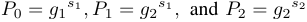

as public keys. The two master keys _s_ 1 _, s_ 2 are preloaded into each registered data contributor’s tamper-proof device. 

_•_ The registration center sets up parameters for the BGN cryptosystem: a private key _SK_ , a public key _PK_ , an encryption scheme _E_ ( _·_ ), and a decryption scheme _D_ ( _·_ ). 

_•_ To activate the tamper-proof device, each registered data contributor _oi_ is assigned with a “real” identity _RIDi ∈_ G1 and a password _PWi_ . Here, _RIDi_ uniquely identifies _oi_ , while _PWi_ is required in the access control stage. 

_•_ The system parameters 

_{e,_ ˆ G1 _,_ G2 _,_ G _T , q, g_ 1 _, g_ 2 _, P_ 0 _, P_ 1 _, P_ 2 _, PK, E_ ( _·_ ) _}_ are published on the certificated bulletin board. 

## **Phase II: Signing Key Generation** 

To achieve anonymous authentication in the data market, the tamper-proof device is utilized to generate a pair of pseudo identity _PIDi_ and secret key _SKi_ for _oi_ : 

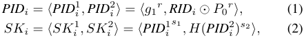

where _r_ is a per-session random nonce, _⊙_ represents the Exclusive-OR (XOR) operation, and _H_ ( _·_ ) is a MapToPoint hash function [3], _i.e._ , _H_ ( _·_ ) : _{_ 0 _,_ 1 _}__∗_ _→_ G1. We note that _PIDi_ is actually an ElGamal encryption [8] of _RIDi_ over the elliptic curves, while _SKi_ is generated accordingly by exploiting identity-based encryption (IBE) [3]. 

## **Phase III: Data Submission** 

Ahead of submission, each data contributor _oi_ encrypts her profile _⃗Ui_ with the BGN scheme, and gets the ciphertext vector 

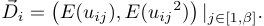

After encryption, each data contributor _oi_ computes the signature _σi_ on the ciphertext vector _⃗Di_ using her secret key: 

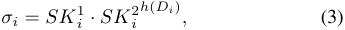

where “ _·_ ” denotes the group operation in G1, _h_ ( _·_ ) is a oneway hash function such as SHA-1 [7], and _Di_ is derived by concatenating all the elements of _⃗Di_ together. 

224224224224224224224224224226 

Eventually, the data contributor _oi_ submits her tuple _⟨PIDi,⃗Di, σi⟩_ to the service provider. Once receiving the tuple, the service provider is required to post the pseudo identity _PIDi_ on the certificated bulletin board for non-repudiation. 

## **Phase IV: Data Processing and Verifications** 

Before introducing this phase, we assume that the service provider receives a bundle of data tuples from _n_ distinct data contributors, denoted as _{⟨PIDi,⃗Di, σi⟩|i ∈_ [1 _, n_ ] _}._ 

## ▶ **First-layer Batch Verification** 

To verify data authentication and data integrity, the service provider needs to check whether 

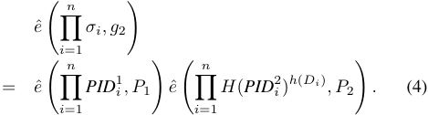

Proof of correctness can be derived by the bilinear property of admissible pairing. Besides, compared with individual verification, this batch verification scheme can dramatically reduce verification latency, especially when verifying a large number of signatures. Since 3 pairing operations in Equation (4) dominate the overall computation cost, the batch verification time is almost a constant if the time overhead of _n_ MapToPoint hashings and _n_ exponentiations is small enough to be emitted. 

## ▶ **Data Processing and Signatures Aggregation** 

To facilitate generating a precise and customized friending strategy, the data consumer also needs to provide her encrypted profile vector _⃗D_ 0 and a threshold _δ_ , where 

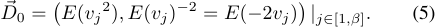

Now, the service provider can directly do matching on the encrypted profiles. To obliviously calculate the similarity difference, the service provider first preprocesses _⃗Di_ and _⃗D_ 0 by adding _E_ (1) to the first and the last places of two vectors, respectively, and gets new vectors _⃗Ci_ = � _Cij_1_, C_ _ij_2_, C_ _ij_3 � _|j∈_ [1 _,β_ ] and _⃗C_ 0 = � _C_ 01 _j__, C_ 02 _j__, C_ 03 _j_ � _|j∈_ [1 _,β_ ], where 

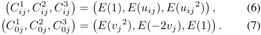

After preprocessing, the service provider can compute the “dot product” of Equation (6) and Equation (7), by first applying homomorphic multiplication _⊗_ and then homomorphic addition _⊕_ , and obtains _Rij_ , where 

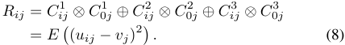

Next, the service provider applies _⊕_ to _Rij_ with _∀j ∈_ [1 _, β_ ], and gets _Ri_ = _E_ (�_β_ _j_ =1(_uij−vj_)2)=_E_(_f_(_⃗Ui,⃗V_)2)_._ 

At this point, the service provider sends _Ri_ to the registration center for decryption. We note that for each data contributor, the registration center just needs to do one decryption, _i.e._ , she can only perform _n_ decryptions in total. She cannot do more decryptions than required, since the service provider may still obtain a correct and complete matching strategy by revealing the profiles of all the data contributors and the data consumer. However, this case requires at least ( _n_ +1) _β_ decryptions. To speed up BGN decryption in outcome verification, the registration center should retain the decrypted similarity differences in storage for a preset validity period. 

Upon getting _f_ ( _⃗Ui,⃗V_ )2 , the service provider can compare it with _δ_2 , and thus determines whether the data contributor _oi_ matches the data consumer. We assume that _m_ data contributors are matched, and the subscripts of their pseudo identities are denoted as _{c_ 1 _, c_ 2 _, · · · , cm} ._ 

After data processing, to further reduce communication overhead, the service provider aggregates the signatures of _m_ matched data contributors into one signature. In our scheme, the aggregate signature _σ_ =�_m_ _i_ =1_σci._ 

At last, the service provider sends the aggregate signature, the indexes of matched data contributors, and their encrypted profile vectors to the data consumer. To prevent the service provider from changing/revaluating the similarity differences of unmatched data contributors in the completeness verification later, their one-way hashes should also be forwarded. 

## ▶ **Second-layer Batch Verification** 

Similar to the first-layer batch verification, the data consumer can verify the legitimacy of _m_ matched data sources by checking whether 

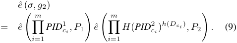

Proof of correctness is similar to that of the first-layer batch verification, where we can just replace _σ_ with�_m_ _i_ =1_σci_. Besides, the pseudo identities in the equation can be fetched from the certificated bulletin board according to their indexes. 

Given a matched data contributor _oci_ ’s pseudo identity _PIDci_ , the registration center can use her master key _s_ 1 to perform revealing by computing 

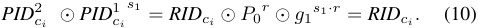

The above equation indicates that the pseudo identities of _m_ matched data contributors can be viewed as the friending strategy, since the data consumer can resort to the registration center, as a relay, for handshaking with those matched ones. 

## ▶ **Outcome Verification** 

During the validity period preset by the registration center, the data consumer can verify the truthfulness of data processing via homomorphic properties. For correctness, the data consumer just needs to evaluate on the _m_ matched profiles. Of course, for completeness, the data consumer reserves the right to do verification on the other ( _n − m_ ) unmatched ones. Note that the most time-consuming homomorphic multiplications are no longer needed in outcome verification, since Equation (8) can be computed by _E_ ( _uij_2 ) _⊕ E_ ( _uij_ )_−_2_vj_ _⊕ E_ ( _vj_2 ). To further reduce verification cost, the data consumer can take the stratified sampling strategy in practice. We assume that the greedy service provider cheats by not evaluating each data contributor in the original data processing with a probability _p_ . Then, the probability of successfully detecting an attempt for returning an incorrect/incomplete result, _ϵ_ , increases exponentially with the number of checks _t_ , _i.e._ , _ϵ_ = 1 _−_ (1 _− p_ )_t_ . When _p_ = 20% and _t_ = 26, the success rate _ϵ_ is already 99 _._ 70%. 

## III. EVALUATION RESULT 

Table I. COMPUTATION OVERHEAD OF IDENTITY-BASED SIGNATURE SCHEME PER DATA CONTRIBUTOR. 

||Prepar|ation|Operation|
|---|---|---|---|
|Setting |Pseudo Identity Generation |Secret Key Generation |Signing |
|SS512 MNT159|4.698ms (39.40%) 1.958ms (57.33%)|6.023ms (50.53%) 1.028ms (30.10%)|1.201ms (10.07%) 0.429ms (12.57%)|
|In this terms of c|section, we show omputation overh|the evaluation re ead and commu|sults of TPDM in nication overhead.|

225225225225225225225225225227 

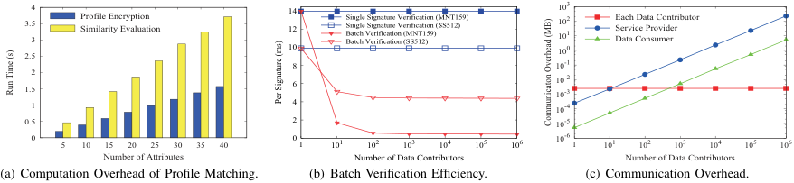

<!-- Start of picture text -->
������������ ��������������������������������������� ��������� �������������������������������������������������������������������������������������������������������������������������������� �������� ���� �������������������������������������������������� �� �� �� ������ �� ���� ���� �� �� �� �� ���� �� �� �� �� � �� �� �� �� �� �� �� �� � �� � �� � �� � �� � �� � �� � �� �� � �� � �� � �� � �� � �� � �� � �������������������� ��������������������������� ��������������������������� (a) Computation Overhead of Profile Matching. (b) Batch Verification Efficiency. (c) Communication Overhead. ������������ ������������������ �������������������������� <!-- End of picture text -->

Figure 1. Performance of TPDM on Yahoo! Music Ratings Dataset. 

**Dataset:** We use a real-world dataset, called R1-Yahoo! Music User Ratings of Musical Artists Version 1.0 [17]. The dataset contains 11,557,943 ratings of 98,211 artists given by 1,948,882 anonymous users. In this evaluation, we choose _β_ common artists as the evaluating attributes, append each user’s corresponding ratings ranging from 0 to 10, and thus form her fine-grained profile. 

**Evaluation Settings:** We implemented TPDM using the latest Pairing-Based Cryptography (PBC) library [15]. The elliptic curves utilized in our identity-based signature scheme include a supersingular curve with a base field size of 512 bits and an embedding degree of 2 (SS512), and a MNT curve with a base field size of 159 bits and an embedding degree of 6 (MNT159). In addition, the group order _q_ is 160-bit long, and all hashings are implemented in SHA1, considering its digest size closely matches the order of G1. The BGN cryptosystem is realized using Type A1 pairing, in which the group order is a product of two 512-bit primes. The running environment is a standard 64-bit Ubuntu 14.04 Linux operation system on a desktop with Intel(R) Core(TM) _i_ 5 3 _._ 10 _GHz_ . 

## _A. Computation Overhead_ 

We show the computation overheads of three important components in TPDM, including profile matching, identitybased signature, and batch verification. 

**Profile Matching:** In Figure 1(a), we plot the computation overheads of profile encryption and similarity evaluation per data contributor, when the number of attributes _β_ increases from 5 to 40 with a step of 5. From Figure 1(a), we can see that the computation overheads of these two phases increase linearly with _β_ . This is because the profile encryption requires 2 _β_ BGN encryptions, and the similarity evaluation mainly consists of _β_ secure “dot” products, which are both proportional to _β_ . Additionally, when _β_ = 10, one decryption overhead at the registration center is 1.648ms in data processing, while in outcome verification, it is in tens of microseconds. 

**Identity-Based Signature:** We now investigate the computation overhead of the identity-based signature scheme. In this set of simulations, we set the number of data contributors to be 10000. Table I lists the average time overhead per data contributor. From Table I, we can see that the time cost of the preparation phase dominates the total overhead in both SS512 and MNT159. This outcome stems from that the pseudo identity generation employs ElGamal encryption, and the secret key generation is composed of one MapToPoint hash operation and two exponentiations. In contrast, the operation phase mainly consists of one exponentiation. 

**Batch Verification:** To examine the efficiency of batch verification, we vary the number of data contributors from 1 to 1 million by exponential growth. The performance of the corresponding single signature verification is provided as a baseline. Figure 1(b) depicts the evaluation results using SS512 and MNT159, where verification time per signature is computed by dividing total batch verification time by the number of data contributors. From Figure 1(b), we can see that when the scale of data acquisition or data trading is small, _e.g._ , when the number of data contributors is 10, TPDM saves 

48.22% and 87.94% of verification time per signature in SS512 and MNT159, respectively. When the scale becomes larger, TPDM’s advantage over the baseline is more remarkable. 

## _B. Communication Overhead_ 

Figure 1(c) plots the communication overheads of each data contributor, the service provider, and the data consumer in MNT159, where the number of attributes _β_ is fixed at 10 and the threshold _δ_ takes 12. Here, the communication overheads merely count in the amount of sending content. Besides, we only consider the correctness verification. In fact, when the number of data contributors is 104 , if we randomly check 26 unmatched ones for completeness, it incurs additional communication overheads of 252.62KB at the service provider, and 3.35KB at the data consumer. 

## IV. CONCLUSION 

In this paper, we have proposed the first secure mechanism TPDM for personal data markets, achieving both truthfulness and privacy preservation. We have instantiated TPDM with the profile-matching service, and extensively evaluated its performance on a real-world dataset. Evaluation results have demonstrated the scalability of TPDM in the context of large user base from computation and communication overheads. 

## REFERENCES 

- [1] M. Balazinska, B. Howe, and D. Suciu, “Data markets in the cloud: An opportunity for the database community,” in _VLDB_ , 2011. 

- [2] M. Barbaro, T. Zeller, and S. Hansell, “A face is exposed for AOL searcher no. 4417749,” _New York Times_ , Aug. 2006. 

- [3] D. Boneh and M. Franklin, “Identity-based encryption from the weil pairing,” in _CRYPTO_ , 2001. 

- [4] D. Boneh, E. Goh, and K. Nissim, “Evaluating 2-dnf formulas on ciphertexts,” in _TCC_ , 2005. 

- [5] T. W. Chim, S. Yiu, L. C. K. Hui, and V. O. K. Li, “SPECS: secure and privacy enhancing communications schemes for VANETs,” _Ad Hoc Networks_ , vol. 9, no. 2, pp. 189 – 203, 2011. 

- [6] “DataSift,” http://datasift _._ com/. [7] D. Eastlake and P. Jones, “US Secure Hash Algorithm 1 (SHA1),” _IETF RFC 3174_ , 2001. 

- [8] T. ElGamal, “A public key cryptosystem and a signature scheme based on discrete logarithms,” _IEEE Transactions on Information Theory_ , vol. 31, no. 4, pp. 469–472, 1985. 

- [9] B. C. M. Fung, K. Wang, R. Chen, and P. S. Yu, “Privacy-preserving data publishing: A survey of recent developments,” _ACM Computing Surveys_ , vol. 42, no. 4, pp. 1–53, Jun. 2010. 

- [10] “Gallup Poll,” http://www _._ gallup _._ com/. [11] “Gnip,” https://gnip _._ com/. [12] R. Ikeda, A. D. Sarma, and J. Widom, “Logical provenance in dataoriented workflows?” in _ICDE_ , 2013. 

- [13] “Infochimps,” http://www _._ infochimps _._ com/. 

- [14] “Microsoft Azure Marketplace,” https://datamarket _._ azure _._ com/home/. 

- [15] “PBC Library,” https://crypto _._ stanford _._ edu/pbc/. [16] M. Raya and J. Hubaux, “Securing vehicular ad hoc networks,” _Journal of Computer Security_ , vol. 15, no. 1, pp. 39–68, 2007. 

- [17] “Yahoo! Webscope datasets,” http://webscope _._ sandbox _._ yahoo _._ com/. 

- [18] R. Zhang, Y. Zhang, J. Sun, and G. Yan, “Fine-grained private matching for proximity-based mobile social networking,” in _INFOCOM_ , 2012. 

226228228228226 

