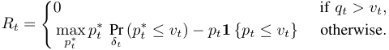
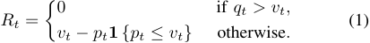
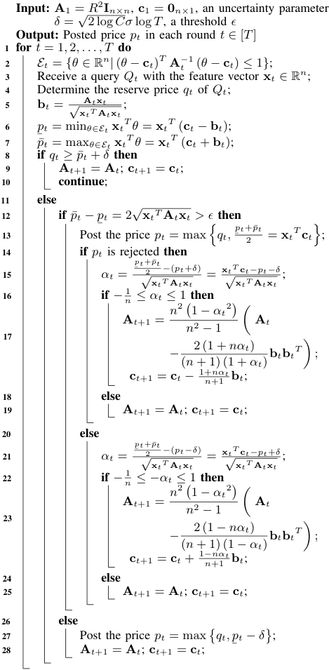

2020 IEEE 36th International Conference on Data Engineering (ICDE) 

# Online Pricing with Reserve Price Constraint for Personal Data Markets 

Chaoyue Niu, Zhenzhe Zheng, Fan Wu, Shaojie Tang_†_ , and Guihai Chen 

Shanghai Key Laboratory of Scalable Computing and Systems, Shanghai Jiao Tong University, China _†_ Department of Information Systems, University of Texas at Dallas, USA Email: _{_ rvince, zhengzhenzhe, wu-fan _}_ @sjtu.edu.cn; tangshaojie@gmail.com; gchen@cs.sjtu.edu.cn 

**_Abstract_ —The society’s insatiable appetites for personal data are driving the emergency of data markets, allowing data consumers to launch customized queries over the datasets collected by a data broker from data owners. In this paper, we study how the data broker can maximize her cumulative revenue by posting reasonable prices for sequential queries. We thus propose a contextual dynamic pricing mechanism with the reserve price constraint, which features the properties of ellipsoid for efficient online optimization, and can support linear and non-linear market value models with uncertainty. In particular, under low uncertainty, our pricing mechanism provides a worst-case regret logarithmic in the number of queries. We further extend to other similar application scenarios, including hospitality service and online advertising, and extensively evaluate all three application instances over MovieLens 20M dataset, Airbnb listings in U.S. major cities, and Avazu mobile ad click dataset, respectively. The analysis and evaluation results reveal that our proposed pricing mechanism incurs low practical regret, online latency, and memory overhead, and also demonstrate that the existence of reserve price can mitigate the cold-start problem in a posted price mechanism, and thus can reduce the cumulative regret.** **_Index Terms_ —personal data market, revenue maximization, contextual dynamic pricing, reserve price** 

## I. INTRODUCTION 

With the proliferation of Internet of Things (IoTs), tremendous volumes of data are collected to monitor human behaviors in daily life. However, for the sake of security, privacy, or business competition, most of data owners are reluctant to share their data, resulting in a large number of data islands. The data isolation status locks the value of personal data against potential data consumers, such as commercial companies, financial institutions, medical practitioners, and researchers. To facilitate personal data circulation, more and more data brokers have emerged to build bridges between the data owners and the data consumers. Typical data brokers in industry include Factual, DataSift, Datacoup, CitizenMe, and CoverUS. On one hand, a data broker needs to adequately compensate the privacy leakages of data owners during the usage of their data, and thus incentivize them to contribute private data. On the other hand, the data broker should properly charge the online data consumers for their sequential queries over the 

This work was supported in part by Science and Technology Innovation 2030 - “New Generation Artificial Intelligence” Major Project No. 2018AAA0100905, in part by China NSF grant 61972252, 61972254, 61672348, and 61672353, in part by the Open Project Program of the State Key Laboratory of Mathematical Engineering and Advanced Computing 2018A09, and in part by Alibaba Group through Alibaba Innovation Research (AIR) Program. The opinions, findings, conclusions, and recommendations expressed in this paper are those of the authors and do not necessarily reflect the views of the funding agencies or the government. 

Fan Wu is the corresponding author. 

collected datasets, since the behaviors of both underpricing and overpricing can incur the loss of revenue at the data broker. Such a data circulation ecosystem is conventionally called “data market” in the literature [1]. 

In this paper, we study how to trade personal data for revenue maximization from the data broker’s standpoint in online data markets. We summarize three major design challenges as follows. The first and the thorniest challenge is that the objective function for optimization is quite complicated. The principal goal of a data broker in data markets is to maximize her cumulative revenue, which is defined as the difference between the prices of queries charged from the data consumers and the privacy compensations allocated to the data owners. Let’s examine one round of data trading as follows. Given a query, the privacy leakages together with the total privacy compensation, regarded as the reserve price of the query, are virtually fixed. Thus, for revenue maximization, an ideal way for the data broker is to post a price, which takes the larger value of the query’s reserve price and market value. However, the reality is that the data broker does not know the exact market value, and can only estimate it from the context of the current query and the historical transaction records. Of course, loose estimations will lead to different levels of regret: if the reserve price is higher than the market value, the query definitely cannot be sold, and the regret is zero; if the reserve price is no more than the market value, a slight underestimation of the market value incurs a low regret, whereas a slight overestimation causes the query not to be sold, generating a high regret. Therefore, the initial goal of revenue maximization can be equivalently converted to regret minimization. Considering even the single-round regret function is piecewise and highly asymmetric, it is nontrivial for the data broker to perform optimization for multiple rounds. 

Yet, another challenge lies in how to model the market values of the customized queries from the data consumers. To minimize the regret in pricing online queries, the pivotal step for the data broker is to gain a good knowledge of their market values. However, markets for personal data significantly differ from conventional markets in that each data consumer as a buyer, rather than the data broker as a seller, can determine the product, namely a query. In general, each query involves a concrete data analysis method and a tolerable level of noise added to the true answer, which are both customized by a data consumer [2]. Hence, the queries from different data consumers are highly differentiated, and are uncontrollable by the data broker. This striking property 

2375-026X/20/$31.00 ©2020 IEEE DOI 10.1109/ICDE48307.2020.00218 

1978 

Authorized licensed use limited to: Shanghai Jiaotong University. Downloaded on January 21,2022 at 09:06:05 UTC from IEEE Xplore.  Restrictions apply. 

<!-- Start of picture text -->
T Query Data Analysis 3 Posted Price Personal Data Payment 2 Privacy Noise Perturbation Compensation Answer 1 Data Consumers Data Broker Data Owners <!-- End of picture text -->

Fig. 1. A general system model of online personal data markets. (The smile indicates that the posted price is accepted and a deal is made.) 

further implies that most of the dynamic pricing mechanisms, which target identical products or a manageable number of distinct products, cannot apply here. Besides, existing works on data pricing, which either considered a single query [3] or investigated the determinacy relation among multiple queries [2], [4]–[10], but ignored whether the data consumers accept or reject the marked prices, and thus omitted modeling the market values of queries, are parallel to this work. 

The ultimate challenge comes from the novel online pricing with reserve price setting. For the market value estimation of a query, the data broker can only exploit the current and historical queries. Thus, the pricing of sequential queries can be viewed as an online learning process. In addition to the usual tension between exploitation and exploration, our pricing problem also needs to incorporate three atypical aspects. First, the feedback after trading one query is very limited. In particular, the data broker can only observe whether the posted price for the query is higher than its market value or not, but cannot obtain the exact market value, which makes standard online learning algorithms inapplicable. Second, the reserve price essentially imposes a lower bound on the posted price beyond the market value estimation, while the ordering between the reserve price and the market value is unknown. Besides, the impact of such a lower bound on the whole learning process has not been studied. Last but not least, the online mode requires our design of the posted price mechanism to be quite efficient. In other words, the data broker needs to choose each posted price and further update her knowledge about the market value model with low latency. 

Jointly considering the above three challenges, we propose a contextual dynamic pricing mechanism with the reserve price constraint for the data broker to maximize her revenue in online personal data markets. For problem formulation, we first adopt contextual/hedonic pricing to model the market values of different queries, which are a certain linear or nonlinear function of their features plus some uncertainty. Besides, we choose the state of the privacy compensations under a query as its feature vector. In fact, such a feature representation inherits the key principle of cost-plus pricing. For posted price mechanism design, we start with the fundamental linear model, and covert the market value estimation problem to dynamically exploiting and exploring the market values of different features, _i.e._ , the weight vector in the linear model. Specifically, depending on whether a sale occurs or not in each round, the data broker can introduce a linear inequality to update her knowledge set about the weight vector. Thus, 

the raw knowledge set is kept in the shape of polytope, which makes the real-time task of predicting the range of a query’s market value computationally infeasible. To handle this problem, we replaces the raw knowledge set with its smallest enclosing ellipsoid, namely L¨owner-John ellipsoid. Under the ellipsoid-shaped knowledge set, it only requires a few matrixvector and vector-vector multiplications to obtain a lower bound and an upper bound on each query’s market value. By further incorporating the total privacy compensation, namely the reserve price, as an additional lower bound, we define a conservative posted price and an exploratory posted price for a query. These two kinds of posted prices give different biases to the immediate rewards (exploitation) and the future rewards (exploration). Besides, the choice of which price in a certain round hinges on the size measure of the latest knowledge set. We further investigate how to tolerate uncertainty, and mainly introduce a “buffer” in posting the price and updating the knowledge set. We finally extend to several non-linear models commonly used in interpreting market values, including loglinear, log-log, logistic, and kernelized models. 

We outline our key contributions in this paper as follows. 

_•_ To the best of our knowledge, we are the first to study trading personal data for revenue maximization, from the data broker’s point of view in online data markets. Additionally, we formulate this problem into a contextual dynamic pricing problem with the reserve price constraint. 

_•_ Our proposed pricing mechanism features the properties of ellipsoid to exploit and explore the market values of sequential queries effectively and efficiently. It facilitates both linear and non-linear market value models, and is robust to some uncertainty. In particular, the worst-case regret under low uncertainty is _O_ (max( _n_2 log( _T/n_ ) _, n_3 log( _T/n_ ) _/T_ )), where _n_ is the dimension of feature vector and _T_ is the total number of rounds. Besides, the time and space complexities are _O_ ( _n_2 ). Furthermore, our market framework can also support trading other similar products, which share customization, existence of reserve price, and timeliness with online queries. 

_•_ We extensively evaluate three application instances over three real-world datasets. The analysis and evaluation results reveal that our pricing mechanism incurs low practical regret, online latency, and memory overhead, under both linear and non-linear market value models and over both sparse and dense feature vectors. In particular, (1) for the pricing of noisy linear query under the linear model, when _n_ = 100 and the number of rounds _t_ is 105 , the regret ratio of our pricing mechanism with reserve price ( _resp._ , with reserve price and uncertainty) is 7 _._ 77% ( _resp._ , 9 _._ 87%), reducing 57 _._ 19% ( _resp._ , 45 _._ 64%) of the 

1979 

Authorized licensed use limited to: Shanghai Jiaotong University. Downloaded on January 21,2022 at 09:06:05 UTC from IEEE Xplore.  Restrictions apply. 

regret ratio than a risk-averse baseline, where the reserve price is posted in each round; (2) for the pricing of accommodation rental under the log-linear model, when _n_ = 55, _t_ = 74 _,_ 111, and the ratio between the natural logarithms of market value and reserve price is set to 0 _._ 6, the regret ratio of our pricing mechanism is 3 _._ 83%, reducing 77 _._ 46% of the regret ratio compared with the risk-averse baseline; (3) for the pricing of impression under the logistic model, when _n_ = 1024 and _t_ = 105 , the regret ratios of our pure pricing mechanism are 8 _._ 04% and 0 _._ 89% in the spare and dense cases, respectively. Furthermore, the online latencies of three applications per round are in the magnitude of millisecond, and the memory overheads are less than 160MB. 

_•_ We instructively demonstrate that the reserve price can mitigate the cold-start problem in a posted price mechanism, and thus can reduce the cumulative regret. Specifically, for the pricing of noisy linear query, when _n_ = 20 and _t_ = 104 , our pricing mechanism with reserve price ( _resp._ , with reserve price and uncertainty) reduces 13 _._ 16% ( _resp._ , 10 _._ 92%) of the cumulative regret than without reserve price; for the pricing of accommodation rental, as the reserve price is approaching the market value, its impact on mitigating cold start is more evident. These findings may be of independent interest. 

## II. TECHNICAL OVERVIEW 

In this section, we introduce system model and problem formulation, and also sketch the fundamental design. 

## _A. System Model_ 

As shown in Fig. 1, we consider a general system model for online personal data markets. There are three kinds of entities: data owners, a data broker, and data consumers. 

The data broker first collects massive personal data from data owners. Then, the data consumers comes to the data market in an online fashion. In round _t ∈_ [ _T_ ], a data consumer arrives, and makes her customized query _Qt_ over the collected dataset. Specifically, _Qt_ comprises a concrete data analysis method and a tolerable level of noise added to the true answer [2]. Here, the noise perturbation can not only allow the data consumer to control the accuracy of a returned answer, but also preserve the privacies of data owners. 

Depending on the query _Qt_ and the underlying dataset, the data broker quantifies the privacy leakage of each data owner, and needs to compensate her if a deal occurs. The data broker then offers a price _pt_ to the data consumer. If _pt_ is no more than the market value _vt_ of _Qt_ , this posted price will be accepted. The data broker charges the data consumer _pt_ , returns the noisy answer, and compensates the data owners as planned. Otherwise, this deal is aborted, and the data consumer goes away. We note that to guarantee non-negative utility at the data broker no matter whether a deal occurs in round _t_ or not, the posted price _pt_ should be no less than the total privacy compensation _qt_ , where _qt_ functions as the _reserve price_ , and can be pre-computed when given _Qt_ . 

## _B. Problem Formulation_ 

We now formulate the regret minimization problem for pricing sequential queries in online personal data markets. 

We first model the market values of queries. We use an elementary assumption from _contextual pricing_ in computational economics [11]–[13] and _hedonic pricing_ in marketing [14], [15], which states that the market value of a product is a deterministic function of its features. Here, the product is a query, and the function can be linear or non-linear. Besides, to make the pricing model more robust, we allow for some uncertainty in the market value of each query. In particular, for a query _Qt_ , we let **x** _t ∈_ R_n_ denote its _n_ -dimensional feature vector, let _f_ : R_n_ _�→_ R denote the mapping from the feature vector **x** _t_ to the deterministic part in its market value, and let _δt ∈_ R denote the random variable in its market value, which is independent of **x** _t_ . In a nutshell, _vt_ = _f_ ( **x** _t_ ) + _δt_ . 

We next identify the features of a query for measuring its market value. One naive way is to directly encode the contents of the query, including the data analysis method and the noise level. However, the query alone, especially the data analysis method, is hard to embody its economic value. Thus, we turn to utilizing the underlying valuations from massive data owners about the query, namely the privacy compensations, as the feature vector. We give some comments on such a feature representation: (1) The market value of a query depending on the privacy compensations inherits the core principle of _cost-plus pricing_ [16], [17], and has been widely used in personal data pricing [2], [9], [10]. In particular, cost-plus pricing states that the market value of a product is determined by adding a specific amount of markup to its cost. Here, the cost is the total privacy compensation, the determinacy is reflected in the feature representation, and the markup is realized by setting the reserve price constraint. (2) The privacy compensations are observable by the data broker, and can help her to discriminate the economic values of distinct queries. For example, the privacy compensations are higher, which implies that the privacy leakages to the data owners are larger, the knowledge discovered by the data consumer is richer, and thus the market value of the query to the data consumer should be higher. (3) Considering the large scale of data owners, the dimension of feature vector can be prohibitively high. Under such circumstance, we can apply some celebrated dimensionality reduction techniques, _e.g._ , Principal Components Analysis (PCA). Yet, we can also apply aggregation/clustering to the privacy compensations, and regard the aggregate results as the feature vector, where its dimension _n_ controls the granularity of aggregation. For example, we can sort the privacy compensations, and evenly divide them into _n_ partitions. We sum the privacy compensations falling into a certain partition, and thus obtain a feature. In this aggregation pattern, one extreme case is _n_ = 1, where the only feature is the total privacy compensation. Another extreme case is _n_ equal to the number of data owners, where every feature corresponds to a data owner’s individual privacy compensation. 

We finally define the cumulative regret of the data broker due to her limited knowledge of market values. We consider a game between the data broker and an adversary. During this game, the adversary chooses the sequence of queries _Q_ 1 _, Q_ 2 _, . . . , QT_ , selects the mapping _f_ , but cannot control the uncertainty _δt_ in each round _t_ , _i.e._ , she can determine the 

1980 

Authorized licensed use limited to: Shanghai Jiaotong University. Downloaded on January 21,2022 at 09:06:05 UTC from IEEE Xplore.  Restrictions apply. 

part _f_ ( **x** _t_ ) in the market value _vt_ . In contrast, the data broker can only passively receive each query _Qt_ , and then post a price _pt_ . If the posted price is no more than the market value, _i.e._ , _pt ≤ vt_ , a deal occurs, and the data broker earns a revenue of _pt_ . Otherwise, the deal is aborted, and the data broker gains no revenue. We define the regret in round _t_ as the difference between the adversary’s revenue and the data broker’s revenue for trading the query _Qt_ , _i.e._ , 

Here, in the first branch, if the reserve price and thus the posted price are higher than the market value, there is no regret. This is because under such circumstance, no matter whether the adversary knows the market value in advance or the data broker does not, there is definitely no deal/revenue. Besides, _p__∗_ _t_istheadversary’soptimalpostedpricetomaximizeher expected revenue in round _t_ , where the expectation is taken over _δt_ . When _δt_ is omitted, the adversary will just post the market value, if the reserve price is no more than the market value, _i.e._ , _qt ≤ p__∗_ _t_=_vt_,and_Rt_willchangeto: 

At last, considering the queries can be chosen adversarially, _e.g._ , by other competitive data brokers or malicious data consumers, our design goal is to minimize the total worst-case regret accumulated over _T_ rounds. 

## _C. Fundamental Design Under Linear Market Value Model_ 

Due to space limitations, we sketch our proposed pricing mechanism under the linear market value model with _σ_ - subGaussian uncertainty in Algorithm 1. Interested readers can refer to our full article in [18] for design principles, design details, analyses of complexities and worst-case regret, extensions to non-linear market value models, application scenarios, evaluation results, and related work. 

## REFERENCES 

- [1] M. Balazinska, B. Howe, and D. Suciu, “Data markets in the cloud: An opportunity for the database community,” _PVLDB_ , vol. 4, no. 12, pp. 1482–1485, 2011. 

- [2] C. Li, D. Y. Li, G. Miklau, and D. Suciu, “A theory of pricing private data,” _Communications of the ACM_ , vol. 60, no. 12, pp. 79–86, 2017. 

- [3] A. Ghosh and A. Roth, “Selling privacy at auction,” in _Proc. of EC_ , 2011, pp. 199–208. 

## **Algorithm 1:** Online Personal Data Pricing 

<!-- Start of picture text -->
Input: A 1 =  R 2 I n×n , c 1 =  0 n× 1, an uncertainty parameter δ = √ 2 log  Cσ  log  T , a threshold ϵ Output: Posted price pt in each round t ∈ [ T ] 1 for t  = 1 ,  2 , . . . , T do 2 Et =  {θ ∈ R n |  ( θ − c t ) T A t − 1 ( θ − c t )  ≤ 1 } ; 3 Receive a query Qt with the feature vector x t ∈ R n ; 4 Determine the reserve price qt of Qt ; 5 b t = √ xA t T t xA tt x t ; 6 ¯ pt = min θ∈Et  x tT θ =  x tT ( c t − b t ); 7 p ¯ t = max θ∈Et  x tT θ =  x tT ( c t  +  b t ); 8 if qt ≥ p ¯ t  +  δ then 9 A t +1 =  A t ; c t +1 =  c t ; 10 continue ; 11 else 12 if p ¯ t − ¯ pt = 2 √ x t T A t x t > ϵ then pt +¯ pt 13 Post the price pt = max � qt, ¯ 2 =  x tT  c t �; 14 if pt is rejected then 15 αt = ¯ pt +¯2 pt − ( pt + δ ) = x t T  c t−pt−δ √ x t T A t x t √ x t T A t x t ; 16 if − n 1 ≤ αt ≤ 1 then 1  − αt 2 � A t +1 = n 2 � A t 17 n 2 − 1 � − ( n  + 1) (1 +2 (1 +  nαt α ) t ) b t b t T � ; c t +1 =  c t − 1+ n +1 nαt b t ; 18 else 19 A t +1 =  A t ; c t +1 =  c t ; 20 else 21 αt = ¯ pt +¯2 pt − ( pt−δ ) = x t T  c t−pt + δ √ x t T A t x t √ x t T A t x t ; 22 if − n 1 ≤−αt ≤ 1 then 1  − αt 2 � A t +1 = n 2 � A t 23 n 2 − 1 � − ( n  + 1) (12 (1  − nα −tα ) t ) b t b t T � ; c t +1 =  c t  + 1 − n +1 nαt b t ; 24 else 25 A t +1 =  A t ; c t +1 =  c t ; 26 else 27 Post the price pt = max � qt, ¯ pt − δ �; 28 A t +1 =  A t ; c t +1 =  c t ; <!-- End of picture text -->

- [4] P. Koutris, P. Upadhyaya, M. Balazinska, B. Howe, and D. Suciu, “Query-based data pricing,” in _Proc. of PODS_ , 2012, pp. 167–178. 

- [5] ——, “Toward practical query pricing with querymarket,” in _Proc. of SIGMOD_ , 2013, pp. 613–624. 

- [6] B. Lin and D. Kifer, “On arbitrage-free pricing for general data queries,” _PVLDB_ , vol. 7, no. 9, pp. 757–768, 2014. 

- [7] S. Deep and P. Koutris, “QIRANA: A framework for scalable query pricing,” in _Proc. of SIGMOD_ , 2017, pp. 699–713. 

- [8] ——, “The design of arbitrage-free data pricing schemes,” in _Proc. of ICDT_ , 2017, pp. 12:1–12:18. 

- [9] C. Niu, Z. Zheng, F. Wu, S. Tang, X. Gao, and G. Chen, “Unlocking the value of privacy: Trading aggregate statistics over private correlated data,” in _Proc. of KDD_ , 2018, pp. 2031–2040. 

- [10] C. Niu, Z. Zheng, S. Tang, X. Gao, and F. Wu, “Making big money from small sensors: Trading time-series data under pufferfish privacy,” in _Proc. of INFOCOM_ , 2019, pp. 568–576. 

- [11] M. C. Cohen, I. Lobel, and R. P. Leme, “Feature-based dynamic pricing,” in _Proc. of EC_ , 2016, p. 817. 

- [12] I. Lobel, R. P. Leme, and A. Vladu, “Multidimensional binary search for contextual decision-making,” in _Proc. of EC_ , 2017, p. 585. 

- [13] R. P. Leme and J. Schneider, “Contextual search via intrinsic volumes,” in _Proc. of FOCS_ , 2018, pp. 268–282. 

- [14] S. Malpezzi, “Hedonic pricing models: a selective and applied review,” _Housing economics and public policy_ , pp. 67–89, 2002. 

- [15] P. Ye, J. Qian, J. Chen, C. Wu, Y. Zhou, S. D. Mars, F. Yang, and L. Zhang, “Customized regression model for airbnb dynamic pricing,” in _Proc. of KDD_ , 2018, pp. 932–940. 

- [16] K. B. Monroe, _Pricing : making profitable decisions_ , 3rd ed. McGrawHill/Irwin, 2003. 

- [17] T. T. Nagle and G. M¨uller, _The strategy and tactics of pricing: A guide to growing more profitably_ , 6th ed. Routledge, 2018. 

- [18] “Technical report for online personal data markets,” https: //www _._ dropbox _._ com/s/97rosb90itd3ttt/. 

1981 

Authorized licensed use limited to: Shanghai Jiaotong University. Downloaded on January 21,2022 at 09:06:05 UTC from IEEE Xplore.  Restrictions apply. 

