# **Dynamic Knapsack Optimization Towards Efficient Multi-Channel Sequential Advertising** 

**Xiaotian Hao*** 1 **Zhaoqing Peng*** 2 **Yi Ma*** 1 **Guan Wang**3 **Junqi Jin**2 **Jianye Hao**1 **Shan Chen**2 **Rongquan Bai**2 **Mingzhou Xie**2 **Miao Xu**2 **Zhenzhe Zheng**4 **Chuan Yu**2 **Han Li**2 **Jian Xu**2 **Kun Gai**2 

## **Abstract** 

In E-commerce, advertising is essential for merchants to reach their target users. The typical objective is to maximize the advertiser’s cumulative revenue over a period of time under a budget constraint. In real applications, an advertisement (ad) usually needs to be exposed to the same user multiple times until the user finally contributes revenue (e.g., places an order). However, existing advertising systems mainly focus on the immediate revenue with single ad exposures, ignoring the contribution of each exposure to the final conversion, thus usually falls into suboptimal solutions. In this paper, we formulate the sequential advertising strategy optimization as a dynamic knapsack problem. We propose a theoretically guaranteed bilevel optimization framework, which significantly reduces the solution space of the original optimization space while ensuring the solution quality. To improve the exploration efficiency of reinforcement learning, we also devise an effective action space reduction approach. Extensive offline and online experiments show the superior performance of our approaches over state-of-theart baselines in terms of cumulative revenue. 

## **1. Introduction** 

In E-commerce, online advertising plays an essential role for merchants to reach their target users, in which Real-time Bidding (RTB) (Zhang et al., 2014; 2016; Zhu et al., 2017) is an important mechanism. In RTB, each advertiser is al- 

*Equal contribution 1College of Intelligence and Computing, Tianjin University, Tianjin, China2 Alimama, Alibaba Group, Beijing, China3 Department of Automation, Tsinghua University, Beijing, China4 Department of Computer Science and Engineering, Shanghai Jiao Tong University, Shanghai, China. Correspondence to: Junqi Jin _<_ junqi.jjq@alibaba-inc.com _>_ , Jianye Hao _<_ jianye.hao@tju.edu.cn _>_ . 

_Proceedings of the 37__th_ _International Conference on Machine Learning_ , Vienna, Austria, PMLR 119, 2020. Copyright 2020 by the author(s). 

lowed to bid for every individual ad impression opportunity. Within a period of time, there are a number of impression opportunities (user requests) arriving sequentially. For each impression, each advertiser offers a bid based on the impression **value** (e.g., revenue) and competes with other bidders in real-time. The advertiser with the highest bid wins the auction and thus display ad and enjoys the impression value. Displaying an ad also associates with a **cost** : in Generalized Second-Price (GSP) Auction (Edelman et al., 2007), the winner is charged for fees according to the second highest bid. The typical advertising objective for an advertiser is to maximize its cumulative revenue of winning impressions over a time period under a fixed budget constraint. 

In a digital age, to drive conversion, advertisers can reach and influence users across various channels such as display ad, social ad, paid search ad (Ren et al., 2018). As illustrated in Figure 9, the user’s decision to convert (purchase a product) is usually driven by multiple interactions with ads. Each ad exposure would influence the user’s preferences and interests, and therefore contributes to the final conversion. However, existing advertising systems (Yuan et al., 2013; Zhang et al., 2014; Ren et al., 2017; Zhu et al., 2017; Jin et al., 2018; Ren et al., 2019) mainly focus on maximizing the single-step revenue, while ignoring the contribution of previous exposure to the final conversion, and thus usually falls into suboptimal solutions. The reason is that simply optimizing the total immediate revenue cannot guarantee the maximazation of long-term cumulative revenue. Besides, there exist some works (Boutilier & Lu, 2016; Du et al., 2017; Cai et al., 2017; Wu et al., 2018) which optimize the overall revenue under an extra-long (billions) request sequence using a single Constrained Markov Decision Process (CMDP) (Altman, 1999). However, the optimization of these methods above is myopic as they ignore the mental evolution of each user and long-term advertising effects. The learning is particularly inefficient as well. 

Apart from the myopic approaches, there exists some literatures considering the long-term effect of each ad exposure. Multi-touch attribution (MTA) (Ji & Wang, 2017; Ren et al., 2018; Du et al., 2019) study the credits assignment to the previous ad displays before conversion. However, these 

**Dynamic Knapsack Optimization Towards Efficient Multi-Channel Sequential Advertising** 

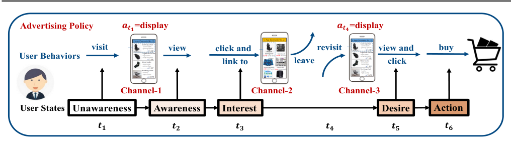

<!-- Start of picture text -->
Advertising Policy visit 𝒂𝒂𝒕𝒕𝟏𝟏 =displayview click and  revisit 𝒂𝒂𝒕𝒕𝟒𝟒 =displayview and  buy User Behaviors link to leave click Channel-1 Channel-2 Channel-3 User States Unawareness Awareness Interest Desire Action 𝒕𝒕𝟏𝟏 𝒕𝒕𝟐𝟐 𝒕𝒕𝟑𝟑 𝒕𝒕𝟒𝟒 𝒕𝒕𝟓𝟓 𝒕𝒕𝟔𝟔 <!-- End of picture text -->

_Figure 1._ An illustration of the sequential multiple interactions (across different channels) between a user and an ad. Each ad exposure has long-term influence on the user’s final purchase decision. 

methods only attend to figure out the contribution of each ad exposure, while not providing methods to optimize the strategies. Besides, since all media channels could affect users’ conversions, Li et al. (2018); Nuara et al. (2019) propose multi-channel budget allocation algorithms to help advertisers understand how particular channels contribute to user conversions. They optimize the budget allocation among all channels accordingly to maximize the overall revenue. However, the granularity of their optimizations is too coarse. They only optimize the budget allocation in the channel level and do not specifically optimize the advertising sequence for each user, which could lead to suboptimal overall performance. 

Considering the shortcomings of existing works, we aim at optimizing the budget allocation of an advertiser among all users such that the cumulative revenue of the advertiser could be maximized, by explicitly taking into consideration the long-term influence of ad exposures to individual users. This problem consists of two levels of coupled optimization: bidding strategy learning for each user and budget allocation among users, which we termed as Dynamic Knapsack Problem. Different from traditional Knapsack problem, a number of challenges arise: 1) Given the estimated longterm value and cost for each user, the optimization space of the budget allocation grows exponentially in the number of users. Besides, since different advertising policies for each user will lead to different long-term values and costs, the overall optimization space is extremely large. 2) The longterm cumulative value and cost for each user are unknown, which are difficult to make accurate estimations. 

To address the above challenges, we propose a novel bilevel optimization framework: Multi-channel Sequential Budget Constrained Bidding ( **MSBCB** ), which transforms the original bilevel optimization problem into an equivalent two-level optimization with significantly reduced searching space. The higher-level only needs to optimize over one dimensional variable and the lower-level learns the optimal bidding policy for each user and computes the correspond- 

ing optimal budget allocation solution. For the lower-level, we derive an optimal reward function with theoretical guarantee. Besides, we also propose an action space reduction approach to significantly increase the learning efficiency of the lower-level. Finally, extensive offline analyses and online A/B testing conducted on one of the world’s largest E-commerce platforms, Taobao, show the superior performance of our algorithm over state-of-the-art baselines. 

## **2. Formulation: Dynamic Knapsack Problem** 

Within a time period of _k_ days, we assume that there are _N_ users _{i_ = 1 _, ..., N }_ visiting the E-commerce platform. Each user may interact with the app multiple times and trigger multiple advertising requests. During the sequential interactions between an ad and a user, each ad exposure could influence the user’s mind and therefore contributes to the final conversion. Given a fixed ad, for each user _i_ , we build a separate Markov Decision Process (MDP) (Sutton & Barto, 2018) to model its sequential interactions with the same ad. We use _πi_ to denote the advertising policy of the ad towards user _i_ , which takes user _i_ ’s state as input and outputs the auction bid. Details of the MDP will be discussed in Section 3.2. For the fixed ad, we define _VG_ ( _i|πi_ ) and _VC_ ( _i|πi_ ) as the expected long-term cumulative value and cost for each user _i_ under policy _πi_ . Formally, 

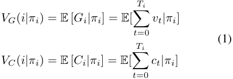

where _vt_ and _ct_ represent the value (i.e., the revenue) and cost obtained from each request _t_ according to policy _πi_ , _Gi_ =�_T_ _t_ =0_ivt_and_Ci_= �_T_ _t_ =0_ict_representthelong-term cumulative value and cumulative cost, _Ti_ is the length of the interaction sequence between user _i_ and the current ad. 

Given the above definitions, for an advertiser, our target is 

**Dynamic Knapsack Optimization Towards Efficient Multi-Channel Sequential Advertising** 

to maximize its long-term cumulative revenue over _k_ days under a budget constraint _B_ , which is formulated as: 

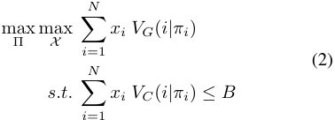

where Π= _{π_ 1 _, ..., πN }_ , _X_ = _{x_ 1 _, ..., xN }_ , and _xi ∈{_ 0 _,_ 1 _}_ indicates whether the user _i_ is selected. Since whether displaying an ad to user _i_ does not have any impact on user _j_ ’s behaviors, _VG_ ( _i|πi_ ), _VC_ ( _i|πi_ ) and _πi_ among different users are independent. Thus, given any fixed advertising policy Π = _{π_ 1 _, ..., πN }_ , _VG_ ( _i|πi_ ) and _VC_ ( _i|πi_ ) for each user _i_ are fixed and the inner optimization of Equation (2) can be viewed as a classic knapsack problem. The items to be put into the knapsack is the users. However, different advertising policies would lead to different _VG_ ( _i|πi_ )s and _VC_ ( _i|πi_ )s for each user, thus here we define Equation (2) as a Dynamic Knapsack Problem where the value and cost of each item in the knapsack are dynamic. From the perspective of optimization, Formulation (2) is a typical bilevel optimization, where the optimization of Π is embedded (nested) within the optimization of _X_ . This bilevel optimization is challenging due to the following reasons: 

- (1) The optimization space of the joint Π is continuous (for the bid space is continuous). The optimization space of _X_ is discrete, which grows exponentially in the number of users (hundreds of millions). Therefore, the solution space of the combination of Π and _X_ is enormous and thus is difficult or even impossible to optimize directly. 

- (2) The value of _VG_ ( _i|πi_ ) and _VC_ ( _i|πi_ ) are unknown and variable, efficient approaches are required to estimate these values online under limited samples. 

## **3. Methodology: MSBCB Framework** 

### **3.1. Bilevel Decomposition and Proof of Correctness** 

Based on the above analysis, the bilevel optimization (2) is computationally prohibitive and cannot be solved directly. In this paper, we first decompose it into an equivalent twolevel sequential optimization process. When taking a fixed policy Π as input, we denote the optimal solution of the degraded and static Knapsack Problem as _K_ = KP(Π). Further, the global optimal solution of Problem (2) could be defined as: 

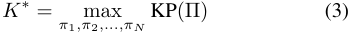

where _π_ 1 _, ..., πN_ are independent variables and _K__∗_ is the global optimal solution. To obtain _K__∗_ , we must firstly specify the form of the function KP(Π). 

When taking a fixed policy Π as input, computing KP(Π) is a classic static knapsack problem. However, another challenge in online advertising is that the user requests are arriving sequentially in real time and thus real-time decision makings are required. Complicated algorithms (e.g. dynamic programming) are not applicable due to the incompleteness of all users values and costs. 

On the contrary, the Greedy algorithm could compute a greedy solution without completely knowing the whole set of candidate users beforehand. We will discuss this latter. Besides, the Greedy algorithm can achieve nearly optimal solution in the online advertising (Zhang et al., 2014; Wu et al., 2018). As proved by Dantzig (1957), if _∀i ∈_ 1 _, ..., N_ , _VC_ ( _i|πi_ ) _≤_ (1 _− λ_ ) _B,_ 0 _≤ λ ≤_ 1, i.e., the cumulative cost for each user is much less than the budget, the Greedy algorithm achieves an approximation ratio of _λ_ , which means the greedy solution is at least _λ_ times of the optimal solution _K_ . The closer the _λ_ gets to 1, the higher the quality of the greedy solution will be. In online advertising, _λ_ is usually greater than 99.9%. Thus, the greedy solution is approximately optimal. We provide the detailed data and proof in Section B.1 of the Appendix. Therefore, in this paper, we refer to the Greedy algorithm, i.e., KP(Π) _←_ Greedy(Π). 

We define CPR _i_ =_VG_<u>(</u>_i|πi_<u>)</u> _VC_ ( _i|πi_ )as the Cost-Performance Ratio of each user _i_ . The greedy solution is computed by: 

- (1) Sorting all users according to the Cost-Performance Ratio CPR _i_ in a descending order; 

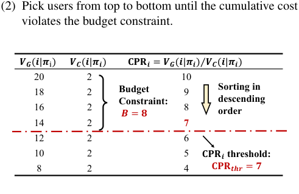

<!-- Start of picture text -->
(2) Pick users from top to bottom until the cumulative cost violates the budget constraint. ⁄ 20 2 10 𝑽𝑽𝑮𝑮(18𝒊𝒊|𝝅𝝅i) 𝑽𝑽𝑪𝑪(𝒊𝒊2|𝝅𝝅𝒊𝒊) Budget   𝐂 𝐂 𝐂𝐂𝒊𝒊 = 𝑽𝑽𝑮𝑮(𝒊𝒊|9𝝅𝝅𝒊𝒊) 𝑽𝑽𝑪𝑪( Sorting in 𝒊𝒊|𝝅𝝅𝒊𝒊) Constraint: descending 16 2 8 order 14 2 7 12 2 𝑩𝑩= 𝟖𝟖 6 10 2 5 8 2 4 𝐂 𝐂 𝐂𝐂𝒊𝒊 threshold: 𝐂 𝐂 𝐂𝐂𝒕 𝒕 𝒕𝒕 = 𝟕𝟕 <!-- End of picture text -->

_Figure 2._ The solution computing process of the Greedy algorithm. 

An illustration is shown in Figure 2. In this example, the budget constraint _B_ = 8. We denote the CPR _i_ of the last picked user as CPRthr, the threshold of the cost-performance ratio. In this example, the CPRthr = 7. The advantage is that the Greedy algorithm only selects users whose CPR _i ≥_ CPRthr. If we could estimate the CPRthr beforehand, the Greedy algorithm could compute the solution online, without completely knowing the values and costs of all users. 

Now that KP(Π) _←_ Greedy(Π) and the Greedy algorithm 

**Dynamic Knapsack Optimization Towards Efficient Multi-Channel Sequential Advertising** 

prefers users with larger CPR _i_ (only pick users whose CPR _i ≥_ CPRthr), according to Equation 3, to further improve the solution quality, an intuitive way is to optimize _πi_ for each user _i_ such that each CPR _i_ could be maximized, i.e., _πi__′_=argmax _πi_CPR_i_.However, this intuition is incorrect. Maximizing the CPR _i_ of each user cannot guarantee that the greedy solution _K_ = Greedy(Π) could be maximized. Next, we show that given all users’ CPRs are maximized, we can still further improve the solution quality by increasing certain users’ allocated budgets and decreasing their CPRs in exchange for greater overall cumulative value. Before we go into the details, we firstly give Lemma 1. 

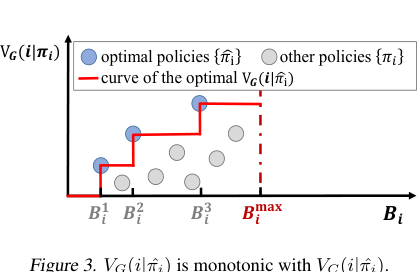

<!-- Start of picture text -->
optimal policies  other policies V𝑮𝑮(𝒊𝒊|𝝅𝝅𝒊𝒊) �𝜋𝜋i 𝜋𝜋𝑖𝑖 curve of the optimal V𝑮𝑮(𝒊𝒊|�𝜋𝜋i) 𝟐𝟐 𝟑𝟑 𝐦 𝐦 𝐦𝐦 Figure 3. 𝑩𝑩𝒊𝒊𝟏𝟏 VGG 𝑩𝑩( i|ππ 𝒊𝒊 |ππ  ˆ i ) is monotonic with𝑩𝑩𝒊𝒊 is monotonic with𝑩𝑩𝒊𝒊 𝑩𝑩𝒊𝒊  VCC ( i|π|ππ  ˆ i )𝑩𝑩.. 𝒊𝒊 <!-- End of picture text -->

_Figure 3. VGG_ ( _i|ππ_ ˆ _i_ ) is monotonic with𝑩𝑩𝒊𝒊 is monotonic with𝑩𝑩𝒊𝒊 _VCC_ ( _i|π|ππ_ ˆ _i_ )𝑩𝑩.. 

**Lemma 1.** _For each user i, the cumulative value VG_ ( _i|π_ ˆ _i_ ) _increases monotonically with the increase of cost VC_ ( _i|π_ ˆ _i_ ) _within the range of all possible optimal policies {π_ ˆ _i}._ 

Proof. We assume that the maximum budget allocated to each user _i_ as _Bi ∈_ [0 _, Bi_max ], where _Bi_max is the maximum cost user _i_ can consume. Then, for each user _i_ , within the current budget constraint _Bi_ , the optimal advertising policy _π_ ˆ _i_ must be the one which could maximize the cumulative value, i.e., _π_ ˆ _i_ = argmax _πi VG_ ( _i|πi_ ) _,_ s.t. _VC_ ( _i|πi_ ) _≤ Bi_ . Obviously, as _Bi_ moves from 0 to _Bi_max , we will get a set of optimal policies _{π_ ˆ _i}_ , whose cost _VC_ ( _i|π_ ˆ _i_ ) and value _VG_ ( _i|π_ ˆ _i_ ) are both increasing. An illustration is shown in Figure 3. Thus we complete the proof. 

As illustrated in Figure 4, each user’s CPR _i_ (the width of each rectangular slice) is maximized initially. According to Lemma 1, for a user _i_ , if we increase _VC_ ( _i|πi_ ) by ∆ _VC_ ( _i_ ), i.e., increase the height of user _i_ by ∆ _VC_ ( _i_ ), the corresponding _VG_ ( _i|πi_ ) will also increase. We denote this increase in value as ∆ _VG_ ( _i_ ). Since there is a budget limit, a small increased height ∆ _VC_ ( _i_ ) will squeeze out a small area nearby the CPRthr, whose height is also ∆ _VC_ ( _i_ ) and width is CPRthr1 . We denote the increased area by reshaping user _i_ as ∆ _VG_+= ∆_VG_(_i_) and the decreased area due to extrusion as ∆ _VG__−_=CPRthr_∗_∆_VC_(_i_).Overall, if ∆ _VG_+_>_∆_V_ _G__−_, the total area will be further increased.For 

> 1Since ∆ _VC_ ( _j_ ) _≪ B_ , the area squeezed out could be considered as a tiny and smooth change and the width of the last user is approximately equal to CPRthr 

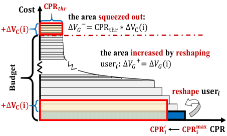

<!-- Start of picture text -->
𝐂𝐨𝐬𝐭 𝐂𝐏𝐑𝒕𝒉𝒓 the area squeezed out: + ∆𝐕𝐂�𝐢� ∆𝑉���CPR��� ∗∆V��i� the area increased by reshaping user𝒊 :  ∆𝑉���∆𝑉��i� reshape  𝐮𝐬𝐞𝐫𝒊 + ∆𝐕𝐂�𝐢� 𝐂𝐏𝐑�𝒊 𝐂𝐏𝐑𝐦𝐚𝐱𝐢 𝐂𝐏𝐑 Budget <!-- End of picture text -->

_Figure 4._ The x-axis denotes each user’s CPR _i_ and y-axis denotes the cumulative cost of the Greedy algorithm. All users are sorted in descending order and arranged from bottom to top. Each rectangular slice’s area (in gray) represents _VG_ ( _i|πi_ )= CPR _i ∗ VC_ ( _i|πi_ ), where CPR _i_ and _VC_ ( _i|πi_ ) are the width and height. Note that, the height of each rectangular slice is much less than the budget constraint, i.e., _VC_ ( _i|πi_ ) _≪ B_ . The red dashed line marks the position of the budget constraint. The total area of all rectangular slices under the red dashed line constitutes the greedy solution. 

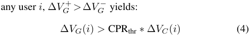

where ∆ _VG_ ( _i_ ) and ∆ _VC_ ( _i_ ) are caused by the change of _πi_ , e.g., from _πi__′_to_π_ _i__′′_.We denote ∆_VG_(_i_) as_VG_(_i|π_ _i__′′_)_−_ _VG_ ( _i|πi__′_) and ∆_VC_(_i_) as_VC_(_i|π_ _i__′′_)_−VC_(_i|π_ _i__′_). We conclude that the greedy solution _K_ = Greedy(Π_′_ ) can be further improved if there exists any user _i_ whose current policy _πi__′_ can be further improved to _πi__′′_such that ∆_VG_(_i_)_>_CPRthr_∗_ ∆ _VC_ ( _i_ ). Otherwise, the current solution is optimal. Finally, we provide the definition of the optimal _πi__∗_in Theorem 1. 

**Theorem 1.** _Under the Greedy paradigm (K_ = _Greedy_ (Π) _), for any given CPRthr, the optimal advertising policy πi__∗for_ _each user i is the one which could maximize VG_ ( _i|πi_ ) _− CPRthr ∗ VC_ ( _i|πi_ ) _. In other words, πi__∗is defined as:_ 

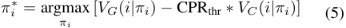

We denote Π_∗_ = _{π_ 1_∗, ..., π_ _N__∗}_.The corresponding solution _K_ greedy_∗_=Greedy(Π_∗_) is the optimal Greedy solution of the Dynamic Knapsack Problem defined in Equation (2). **Proof of Theorem 1.** We define Π_∗_ = _{π_ 1_∗, ..., π_ _N__∗}_, where _πi__∗_isdefinedaccordingtoEquation(5),_∀i∈{_1_, ..., N}_. We prove Theorem 1 by contradiction. Given the threshold CPRthr, we firstly assume that Greedy(Π_∗_ ) is not the optimal greedy solution of the Dynamic Knapsack Problem, which means we could at least find a user _i_ , whose policy _πi__∗_ could be further improved to policy _πi__′′_such that the overall area is increased. This means we could find a better policy _πi__′′_for user_i_such that ∆_VG_(_i_)_>_CPRthr_∗_∆_VC_(_i_) accord- ing to Equation (4), where ∆ _VG_ ( _i_ ) = _VG_ ( _j|πi__′′_)_−VG_(_i|π_ _i__∗_) 

**Dynamic Knapsack Optimization Towards Efficient Multi-Channel Sequential Advertising** 

and ∆ _VC_ ( _i_ ) = _VC_ ( _i|πi__′′_)_−VC_(_i|π_ _i__∗_) (_VG_(_i|π_ˆ_i_) increases monotonically with the increase of _VC_ ( _i|π_ ˆ _i_ ) according to Lemma 1). Further, ∆ _VG_ ( _i_ ) _>_ CPRthr _∗_ ∆ _VC_ ( _i_ ) yields: 

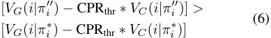

Equation (6) indicates that 

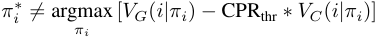

which contradicts the definition of _πi__∗_in Equation (5).Thus, the theorem statement is obtained. 

**Algorithm 1** MSBCB Framework. 

- 1: **Input:** an initial CPRthr; 

- 2: **Output:** optimal greedy solution of the Dynamic Knapsack Problem; 

- 3: **for** each period until convergence **do** 

- 4: Taking the current estimated CPRthr as input, the agent optimizes the advertising policy _πi_ for each user _i_ according to Section 3.2 and acquires the optimal Π_∗_ = _{π_ 1_∗, ..., π_ _N__∗}_. 

- 5: Based on the current estimated CPRthr and the obtained Π_∗_ , the agent calculates the greedy solution according to Section 3.3 and collects the actual feedback cost and the predefined budget. 

- 6: Update the estimated CPRthr towards CPR_∗_ thrby min- imizing the gap between the actual feedback cost and the budget according to Section 3.4. 

- 7: **end for** 

We present the overall MSBCB framework in Algorithm 1, which involves a two-level sequential optimization process. **(1) Lower-level:** Given any CPRthr, we could obtain the optimal advertising policy Π_∗_ following Equation 5 of Theorem 1, which will be discussed in Section 3.2. Then, based on CPRthr and the optimized Π_∗_ , we could acquire the Greedy solution by selecting users whose CPR _i ≥_ CPRthr, which will be detailed in Section 3.3. **(2) Higher-level:** However, the current CPRthr might _̸_ = CPR_∗_ thr, which means selecting all users whose CPR _i ≥_ CPRthr might violate the budget constraint or lead to a substantial budget surplus. Thus, we optimize the current CPRthr towards CPR_∗_ thrin Section 3.4. Overall, the optimization space of _X_ is reduced from 2_N_ to a one-dimensional continuous variable CPRthr. We conclude that Algorithm 1 could iteratively converge to a unique and approximate optimal solution. We present the proof of convergence in Section B.3 of the Appendix. 

### **3.2. Lower-level Advertising Policy Optimization with Reinforcement Learning** 

Given a threshold CPRthr as input, we aim to acquire the optimal advertising policy _πi__∗_definedinEquation(5)of 

Theorem 1. Combining the definitions of _VG_ ( _i|πi_ ) and _VC_ ( _i|πi_ ) with Equation (5), we have 

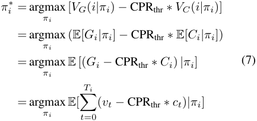

Accordingly, we define _rt_ = _vt −_ CPRthr _∗ ct_ , i.e., value _−_ CPRthr _∗_ cost, as the immediate profit acquired at each step _t_ . The objective of Equation (7) is to obtain the optimal advertising policy _πi__∗_which could maximize the expected long-term cumulative profit. To solve this sequential decision making problem, we formulate it as an MDP and use Reinforcement Learning (RL) (Sutton & Barto, 2018) techniques to acquire the optimal policy _πi__∗_. 

We consider an episodic MDP, where an episode starts with the first interaction between a user and an ad, and ends up with a purchase or exceeding the maximum step _Ti_ as: 

- **State** _S_ : The state _st_ should in principle reflect the user request status, ad info, user-ad interaction history info and the RTB environment. 

- **Action** _A_ : The action each agent can take in the RTB platform is the bid, which is a real number between 0 and the upper bound bidmax, i.e., _at ∈_ [0 _,_ bidmax]. 

- **Reward** _R_ ( _S × A →_ R): The immediate reward at step _t_ is defined as _rt_ = _vt −_ CPRthr _∗ ct_ . 

- **Transition probability** _P_ ( _S ×A×S →_ [0 _,_ 1]): Transition probability is defined as the probability of state transitioning from _st_ to _st_ +1 when taking action _at_ . 

- **Discount factor** _γ_ : The bidding agent aims to maximize the total discounted reward _Rj_ =�_T_ _k_ =_i_ _t__γrk_ from step _t_ onwards, where _γ ∈_ [0 _,_ 1]. 

For each user _i_ , we define the state-action value function _Q_ ( _s, a_ ) = E[ _Ri|s, a, πi_ ] as the expected cumulative reward achieved by following the advertising policy _πi_ . The MDP can be solved using existing Deep Reinforcement Learning (DRL) algorithms such as DQN (Mnih et al., 2013), DDPG (Lillicrap et al., 2015) and PPO (Schulman et al., 2017). After sufficient training, we would acquire the optimized advertising policies Π_∗_ = _{π_ 1_∗, ...π_ _N__∗}_for all users. 

### **3.3. Lower-level User Selection by Greedy Algorithm** 

Taking the current CPRthr and the optimized advertising policies Π_∗_ = _{π_ 1_∗, ...π_ _N__∗}_as inputs,we aim to obtain the 

**Dynamic Knapsack Optimization Towards Efficient Multi-Channel Sequential Advertising** 

greedy solution of the Dynamic Knapsack Problem. In reality, we cannot know all users’ request sequences and their values and costs beforehand because the user requests are arriving sequentially in real time. Thus, many complicated methods depending on the completeness of all users’ data, e.g., the dynamic programming approach (Martello et al., 1999), are not applicable. Even the traditional Greedy algorithm cannot be applied either. Fortunately, the greedy solution could be computed online in an easy way: given the threshold CPRthr, the agent only has to select users online whose CPRs are greater than the threshold (an illustration is shown in Figure 2). Therefore, we only have to estimate the CPR _i_ =_VG_<u>(</u>_i|πi_<u>)</u> _VC_ ( _i|πi_ )foreachuser_i_.Toacquire _VG_ ( _i|πi_ ) and _VC_ ( _i|πi_ ), besides Q(s,a), we also maintain two other state value functions _VG_ ( _s_ ) and _VC_ ( _s_ ) according to the Bellman Equation (Sutton & Barto, 2018), where _VG_ ( _s_ ) = E[ _Gj|s, πj_ ] and _VC_ ( _s_ ) = E[ _Cj|s, πj_ ]. 

### **3.4. Higher-level Optimization by Feedback Control** 

However, the current estimated threshold CPRthr might have some bias from the optimal CPR_∗_ thr.Thus, selecting all users whose CPR _i ≥_ CPRthr might violate the budget constraint or lead to a substantial budget surplus. Only when the estimated CPRthr is exactly the same with the optimal CPR_∗_ thr, the actual total advertising cost will be equal to the budget. To achieve this, we design a feedback control mechanism, i.e., a PID controller (Astr˚ om & H¨ agglund¨ , 1995), to dynamically adjust the CPRthr towards CPR_∗_ thraccording to actual feedback of the overall cost. The core formula is: 

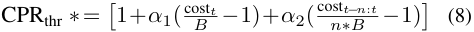

where cost _t_ is the actual feedback cost of the current period, _B_ is the budget, cost _t−n_ : _t_ and _n∗B_ are the overall cost and the overall budget of the most recent _n_ periods. _α_ 1 and _α_ 2 are two learning rates. The main idea is when the actual cost exceeds (is less than) the budget, the threshold CPRthr will be increased (decreased) accordingly such that less (more) users will be selected, which will reduce (increase) the cost in turn. The first term _α_ 1(<u>cost</u> _B__<u>t</u>−_1) is designed to keep up with the latest changes. The second term _α_ 2(cost _n∗__t−_ _B__n_:_t−_1) is designed to stabilize learning. 

### **3.5. Action Space Reduction for RL in Advertising** 

However, when applying the RL approaches mentioned in Section 3.2 to online advertising, one typical issue is that the sample utilization is inefficient. The main reason is that the action space of the agent is continuous, thus the range of [0 _,_ bidmax] needs to be fully explored in all states. To resolve this problem, we reduce the magnitude of the continuous action space (i.e., _at ∈_ [0 _,_ bidmax]) to a binary one (i.e., _a_ � _t ∈{_ 0 _,_ 1 _}_ ) by making full use of the prior knowledge in advertising, which greatly improves the sample utilization 

of the RL approaches. Specifically, since different bids _at_ can only result in two different outcomes _a_ � _t ∈{_ 0 _,_ 1 _}_ , where _a_ � _t_ = 1 or 0 indicates whether the ad is displayed to the user, we only have to evaluate the different expected returns resulted by _a_ � _t_ = 1 or _a_ � _t_ = 0 for _Q_ ( _s, a_ ). We denote the greedy action _a_ � _t∗_ based on the current value estimations as: 

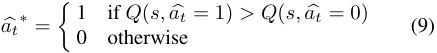

Then, to obtain an executable bid, for _a_ � _t∗_ = 0, we could offer a low enough bid, e.g., _at_ = 0, to make sure that it is impossible to win the auction. For _a_ � _t∗_ =1, we propose an optimal bid function which could output a bid greater than the second highest bid while not overbidding. 

In detail, we maintain two state-action value functions _QG_ ( _s, a_ � _t_ )= E[ _Gi|s, a_ � _t, πi_ ] and _QC_ ( _s, a_ � _t_ )= E[ _Ci|s, a_ � _t, πi_ ]. Since the reward function is defined as _rt_ = _vt −_ CPRthr _∗ ct_ , we have _Q_ ( _s, a_ � _t_ ) = _QG_ ( _s, a_ � _t_ ) _−_ CPRthr _∗QC_ ( _s, a_ � _t_ ). Then _Q_ ( _s, a_ � _t_ =1) _>Q_ ( _s, a_ � _t_ =0) yields: 

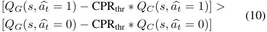

If _a_ � _t_ = 0, the expected immediate cost is 0 (since the ad is not exposed). If _a_ � _t_ = 1, we denote the expected immediate cost as E[ _ct|a_ � _t_ = 1], whose value depends on the pricing model. In online advertising, typical pricing models includes CPM (Cost Per Mille, the advertiser bid for impressions and is charged based on impressions), CPC (Cost Per Click, the advertiser bid for clicks and is charged based on clicks) and CPS (Cost Per Sales, the advertiser bid for conversions and is charged based on conversions). If CPM is used, E[ _ct|a_ � _t_ = 1] = **bid****2nd** _t_ , where **bid****2nd** _t_ denotes the second highest bid in the auction. If CPC is used, E[ _ct|a_ � _t_ = 1] = **bid****2nd** _t ∗_ pCTR, where pCTR represents the predicted Click-Through Rate. If CPS is used, E[ _ct|a_ � _t_ = 1] = **bid****2nd** _t ∗_ pCTR _∗_ pCVR, where pCVR represents the predicted Conversion Rate. For ease of presentation, we take CPM for an example. Under CPM, 

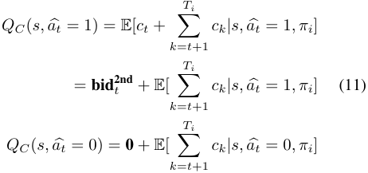

Notice that the second highest bid **bid****2nd** _t_ is unknown until the current auction is finished. Substituting Equation (11) 

**Dynamic Knapsack Optimization Towards Efficient Multi-Channel Sequential Advertising** 

into Equation (10), we acquire 

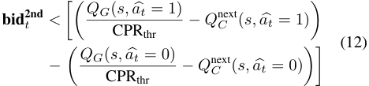

where _Q_next _C_(_s,a_�_t_)=E[�_T_ _k_ =_j_ _t_ +1_ck|s,a_�_t, πi_].Wedenote the term on the right of the ’ _<_ ’ in Equation (12) as **b**_∗_ _t_.And we conclude that the bidding agent can always set the bid price _at_ = **b**_∗_ _t_duringtheonlinebiddingphase,whichis the optimal action without any loss of accuracy. Refer to Section B.2 of the Appendix for proof. For CPC or CPS, the optimal bid formula **b**_∗_ _t_can be easily acquired by sub- stituting the corresponding E[ _ct|a_ � _t_ = 1] into Equation 11. Here, we reaffirm that our action space reduction technique is a generalized design and is applicable to different pricing models. 

## **4. Empirical Evaluation: Simulations** 

We start with designing simulation experiments to shed light on the contributions of the proposed framework MSBCB under more controlled settings. Similar to the simulation settings of (Ie et al., 2019), we assume there are a set of users _{i_ = 1 _, ..., N }_ , a set of ads _D_ and a set of commodity categories _T_ . Each ad _d ∈D_ has an associated category. Each user _i_ has various degrees of interests in commodity categories, which is influenced by the displayed ad. When user _i_ consumes ad _d_ , his interest in category _T_ ( _d_ ) is nudged stochastically, biased slightly towards increasing his interest, but allows some chance of decreasing his interest. We set _N_ = 10000, _|D|_ = 2000 and _|T |_ = 20 in the following experiments. Detailed settings of the simulation environment can be found in Section D of the Appendix. 

### **4.1. Baselines** 

We compare our MCBCB with following baseline strategies: 

- Myopic Approaches: (1) Manual Bid is a strategy that the agent continuously bids at the same price initialized by the advertiser. (2) Contextual Bandit (Zhang et al., 2014) aims at maximizing the accumulated short-term value of each request based on the Greedy framework. 

- Greedy with maximized CPR: This approach is similar to our method under the Greedy framework except that each _πi_ is optimized by maximizing the long-term CPR. In the offline simulation, we enumerate all policies for each user and select the one which could maximize its CPR. This approach is named as Greedy+maxCPR. 

- Greedy with state-of-the-art RL approaches: These baselines, i.e., Greedy+DQN, Greedy+DDPG and 

Greedy+PPO, utilize the same reward function with our MSBCB to optimize the lower-level optimization of Π. The difference is that our MSBCB leverages the action space reduction technique. For DQN and PPO, we discretize the bid action space [0 _,_ bidmax] evenly into 11 real numbers as the valid actions. 

- Undecomposed Optimization: These baselines are RL approaches (DQN,DDPG and PPO) based on the Constrained Markov Decision Process (CMDP). They are named as Constrained+DQN, Constrained+DDPG, Constrained+PPO respectively. We follow the CMDP design and settings in (Wu et al., 2018). 

- Offline Optimal: The optimal solution of the Dynamic Knapsack Problem can be computed by dynamic programming in offline simulation because we could enumerate all possible policies to get the corresponding long-term values and costs for each user. Note that since users’ request sequences are unknown beforehand and there is only one chance for the ad to bid for each request in the online advertising systems, the optimal solution can only be obtained in offline simulation. 

### **4.2. Experimental Results** 

We conduct extensive analysis of our MSBCB in the following 5 aspects. All approaches aim to maximize the advertiser’s cumulative revenue under a fixed budget constraint. All experimental results are averaged over 10 runs. The hyperparameters for each algorithm are set to the best we found after grid-search optimization. 

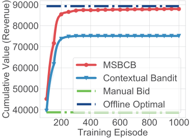

_Figure 5._ Values comparisons (learning curves) of the myopic approaches with non-myopic approaches and the offline optimal. 

**Myopic vs Non-myopic.** To show the benefits of upgrading the myopic advertising system into a farsighted one, we compare the cumulative revenue achieved by our MSBCB with two other myopic baselines. The learning curves and results are shown in Figure 5 and Table 1. We see that MSBCB outperforms the Manual Bid and the Contextual Bandit by a large margin, which indicates that taking account of 

**Dynamic Knapsack Optimization Towards Efficient Multi-Channel Sequential Advertising** 

the long-term effect of each ad exposure could significantly improve the cumulative advertising results. 

**MSBCB vs the Offline Optimal.** In Figure 5, we also compare our MSBCB with the Offline Optimal, which is computed by a modified dynamic programming algorithm. We see that as the training continues, our MSBCB gradually achieves an approximately optimal solution. Detailed results are summarized in Table 1. Our MSBCB empirically achieves an approximation ratio of 98.53%( _±_ 0.36%). 

**MSBCB vs Greedy with maximized CPR.** As discussed in Section 3.1, under the Greedy framework, maximizing each user’s CPR _i_ cannot guarantee that the greedy solution of the Dynamic Knapsack Problem (2) could be maximized. The optimal advertising policy _πi_ for each user is given by Theorem 1. To experimentally verify the correctness of Theorem 1, we compare the cumulative revenue achieved by MSBCB and the Greedy with maximized CPR. As shown in Figure 6 and Table 1, MSBCB outperforms Greedy with maximized CPR and achieves a +5 _._ 11% improvement. 

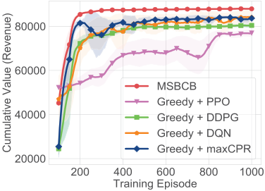

_Figure 6._ Value comparisons of MSBCB with the Greedy with maximized CPR and the Greedy with state-of-the-art RL. 

**MSBCB vs Greedy with state-of-the-art RL approaches.** Besides, to show the effectiveness of the action-space reduction proposed in Section 3.5, we compare MSBCB with the state-of-the-art DRL approaches under the Greedy framework. As shown in Figure 6 and Table 1, MSBCB outperforms Greedy+DQN, Greedy+DDPG and Greedy+PPO both in the cumulative revenue and the convergence speed, which shows that the action space reduction effectively improves the sample efficiency of RL approaches. 

**Decomposed MSBCB vs Undecomposed optimization.** Similar to (Wu et al., 2018), the undecomposed optimization baselines consider all users requests as a whole and model the budget allocations among all request as a CMDP. As shown in Figure 7 and Table 1, MSBCB outperforms the CMDP based RL approaches by a large margin. The reason of the poor performance in CMDP-based approaches is that these methods model all users’ requests as a whole sequence and thus the learning process is particularly inefficient. In 

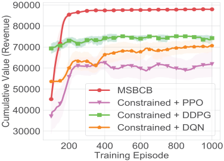

_Figure 7._ Values comparison (learning curves) of MSBCB and state-of-the-art CMDP based RL approaches. 

contrast, our MSBCB decomposes the whole sequence optimization into an efficient two-level optimization process, thus can achieve better performance more easily. 

_Table 1._ Cumulative values, costs, value improvements (over Contextual Bandit) and the approximation ratio of all approaches. 

|Method|Revenue|Cost|Revenue Impro|Approximation Ratio|
|---|---|---|---|---|
|Manual Bid|38838.28|11995.10|-48.31%|43.5%|
|Contextual Bandit|75137.30|11995.46|0%|84.15%|
|Constrained + PPO|61890.92|11954.07|-17.63_±_16.11%|69.31_±_13.56%|
|Constrained + DDPG|74259.12|11996.12|-1.19_±_3.66%|83.17_±_3.08%|
|Constrained + DQN|70662.65|11881.12|-5.96_±_7.83%|79.14_±_6.59%|
|Greedy + maxCPR|83668.70|11914.12|11.35_±_2.84%|93.70_±_2.36%|
|Greedy + PPO|76970.35|11825.59|2.44_±_3.52%|86.20_±_2.93%|
|Greedy + DDPG|80424.69|11841.28|7.04_±_1.13%|90.07_±_0.92%|
|Greedy + DQN|84117.09|11794.24|11.95_±_4.96%|94.21_±_4.14%|
|**MSBCB**|**87947.99**|**11957.57**|**17.95**_±_**0.42**%|**98.50**_±_**0.33**%|
|**MSBCB (enum)**|**89251.77**|**11988.36**|**18.78**%|**99.96**%|
|Offline Optimal|89291.11|11999.23|18.84%|100.00%|

The complete comparisons of all approaches are shown in Table 1. The budget constraint _B_ is set to 12000 for all experiments. In Table 1,we also add an MSBCB (enum), which is the theoretical upper bound of our MSBCB. The difference between MSBCB (enum) and MSBCB is that: the MSBCB (enum) computes the optimal advertising policy _πi__∗_ for each user _i_ by enumerating all possible policies. Instead of utilizing the RL approach, MSBCB (enum) could find the one which maximizes _VG_ ( _i|πi_ ) _−_ CPRthr _∗ VC_ ( _i|πi_ ). We see MSBCB (enum) is very close to the optimal solution and reaches an approximation ratio of 99.96%. 

### **4.3. Effectiveness of Action Space Reduction** 

As shown in Table 2, MSBCB achieves a revenue of 75000 in only 61 epochs, reducing more than 60% samples compared with the state-of-the-art RL baselines without using the action-space reduction technique. As for learning process, our MSBCB achieves the same revenue (80000) more than 10 times faster than the baselines, reducing more than 90% samples and finally reaches the highest revenue. Thus, 

**Dynamic Knapsack Optimization Towards Efficient Multi-Channel Sequential Advertising** 

with the action space reduction technique, our MSBCB could reach a higher performance with a faster speed and significantly improve the sample efficiency. More analysis of our MSBCB, e.g., the convergence of Π_∗_ and CPR_∗_ thr, and the hyperparameter settings of the offline experiments are shown in Section D of the Appendix. 

_Table 3._ The overall performance comparisons of the A/B testing. CVR represents the Conversion Rate of the users. #PV represents the number of page views. ROI =<u>Revenue</u> Cost means Return On Investment. (Notice that CEM is the control group and the improvements of Contextual Bandit and MSBCB are compared over CEM.) 

|Method|Revenue|Cost|CVR|#PV|ROI|
|---|---|---|---|---|---|
|Contextual Bandit|+0.91%|-3.26%|+4.78%|+4.62%|+4.31%|
|**MSBCB**|**+10.08**%|**-0.20**%|**+6.04**%|**+15.37**%|**+10.31**%|

_Table 2._ The training epochs and the number of samples needed by different approaches when achieving the same revenue level. 

|Revenue|75|000|80|000|85|000|
|---|---|---|---|---|---|---|
|Method|#Epoch|#Samples|#Epoch|#Samples|#Epoch|#Samples|
|Greedy+PPO|817|4183040|-|-|-|-|
|Greedy+DDPG|154|788480|853|4362240|-|-|
|Greedy+DQN|373|1909760|754|3855360|-|-|
|**MSBCB**|**61**|**312320**|**71**|**363520**|**104**|**532480**|

## **5. Empirical Evaluation: Online A/B Testing** 

We deployed MSBCB on one of the world’s largest E- commerce platforms, Taobao. Our platform is authorized by the advertisers to dynamically adjust their bid prices for each user request according its value in the real-time auction. In the online experiments, we compare MSBCB with two models widely used in the industry. 

- Cross Entropy Method (CEM), which is a deployed production model, whose target is to optimize the immediate rewards. We consider CEM as the control group in the following evaluations. 

- Contextual Bandit, which has been explained in previous section and is reserved as a contrast test. 

The experiment involves 135,858,118 users and 72,147 ad items from 186 advertisers. For fair comparison, we control the consumers and the advertisers involved in the A/B testing to be homogeneous. In detail, the 135,858,118 users are randomly and evenly divided into 3 groups. For users in group #1, all 186 advertisers adopt the CEM algorithm. For users in group #2, all 186 advertisers adopt the Contextual Bandit algorithm. For users in group #3, all 186 advertisers adopt our MSBCB. Table 3 summarises the effects of the Contextual Bandit and our MSBCB compared to the Cross Entropy Method from Dec.10 to Dec.20 in 2019. From Table 3, we see that our MSBCB achieves a +10.08% improvement in revenue and a +10.31% improvement in ROI with almost the same cost (-0.20%). The results indicate that upgrading the myopic advertising strategy into a farsighted one could significantly improves the cumulative revenue. Besides, as shown in Figure 8, the daily ROI improvement also demonstrates the effectiveness of our MSBCB compared with the Contextual Bandit. 

Given that there are only 186 advertisers take part in our online experiment, one frequently asked question is“ **How** 

**does the MSBCB work across all ads?** ” Since 186 is relatively small compared with the total number of advertisers, their policy updates would not cause dramatic changes to the RTB environment. In other words, the RTB environment is still approximately stationary from a single-ad perspective. This setting also works well with our practical business model-providing better service for VIP advertisers (about 0.2% of all the advertisers). In the case that the majority of the advertisers adopt MSBCB, the system cannot be estimated as being stationary from any single-ads perspective and explicit multi-agent modeling and coordination should be incorporated. Detailed analysis of the improvement in revenue for each advertiser is presented in Table 7 and Figure 19 of the Appendix. More details about the deployment and experimental results (e.g., the online model architecture) can also be found in Section C and E of the Appendix. 

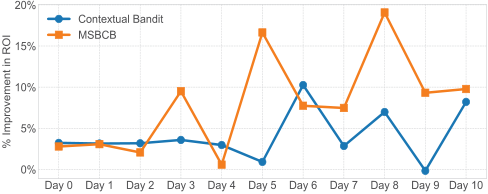

_Figure 8._ Daily ROI improvement comparisons of Contextual Bandit and MSBCB over Cross Entropy Method. 

## **6. Conclusion** 

We formulate the multi-channel sequential advertising problem as a Dynamic Knapsack Problem, whose target is to maximize the long-term cumulative revenue over a period of time under a budget constraint. We decompose the original problem into an easier bilevel optimization, which significantly reduces the solution space. For the lower-level optimization, we derive an optimal reward function with theoretical guarantees and design an action space reduction technique to improve the sample efficiency. Extensive offline experimental analysis and online A/B testing demonstrate the superior performance of our MSBCB over the state-of-the-art baselines in terms of cumulative revenue. 

**Dynamic Knapsack Optimization Towards Efficient Multi-Channel Sequential Advertising** 

## **Acknowledgements** 

The work is supported by the National Natural Science Foundation of China (Grant Nos.: 61702362, U1836214), the Special Program of Artificial Intelligence and the Special Program of Artificial Intelligence of Tianjin Municipal Science and Technology Commission (No.: 569 17ZXRGGX00150) and the Alibaba Group through Alibaba Innovative Research Program. We deeply appreciate all teammates from Alibaba group for the significant supports for the online experiments. 

## **References** 

- Altman, E. _Constrained Markov decision processes_ , volume 7. CRC Press, 1999. 

- Astr˚ om,¨ K. J. and Hagglund,¨ T. _PID controllers: theory, design, and tuning_ , volume 2. Instrument society of America Research Triangle Park, NC, 1995. 

- Boutilier, C. and Lu, T. Budget allocation using weakly coupled, constrained markov decision processes. 2016. 

- Cai, H., Ren, K., Zhang, W., Malialis, K., Wang, J., Yu, Y., and Guo, D. Real-time bidding by reinforcement learning in display advertising. In _Proceedings of the Tenth ACM International Conference on Web Search and Data Mining_ , pp. 661–670. ACM, 2017. 

- Dantzig, G. B. Discrete-variable extremum problems. _Operations research_ , 5(2):266–288, 1957. 

- Du, M., Sassioui, R., Varisteas, G., Brorsson, M., Cherkaoui, O., et al. Improving real-time bidding using a constrained markov decision process. In _International Conference on Advanced Data Mining and Applications_ , pp. 711–726. Springer, 2017. 

- Du, R., Zhong, Y., Nair, H., Cui, B., and Shou, R. Causally driven incremental multi touch attribution using a recurrent neural network. _arXiv preprint arXiv:1902.00215_ , 2019. 

- Edelman, B., Ostrovsky, M., and Schwarz, M. Internet advertising and the generalized second-price auction: Selling billions of dollars worth of keywords. _American economic review_ , 97(1):242–259, 2007. 

- Ie, E., Jain, V., Wang, J., Navrekar, S., Agarwal, R., Wu, R., Cheng, H.-T., Lustman, M., Gatto, V., Covington, P., et al. Reinforcement learning for slate-based recommender systems: A tractable decomposition and practical methodology. _arXiv preprint arXiv:1905.12767_ , 2019. 

- Ji, W. and Wang, X. Additional multi-touch attribution for online advertising. In _Thirty-First AAAI Conference on Artificial Intelligence_ , 2017. 

- Jin, J., Song, C., Li, H., Gai, K., Wang, J., and Zhang, W. Real-time bidding with multi-agent reinforcement learning in display advertising. In _Proceedings of the 27th ACM International Conference on Information and Knowledge Management_ , pp. 2193–2201. ACM, 2018. 

- Li, P., Hawbani, A., et al. An efficient budget allocation algorithm for multi-channel advertising. In _2018 24th International Conference on Pattern Recognition (ICPR)_ , pp. 886–891. IEEE, 2018. 

- Lillicrap, T. P., Hunt, J. J., Pritzel, A., Heess, N., Erez, T., Tassa, Y., Silver, D., and Wierstra, D. Continuous control with deep reinforcement learning. _arXiv preprint arXiv:1509.02971_ , 2015. 

- Martello, S., Pisinger, D., and Toth, P. Dynamic programming and strong bounds for the 0-1 knapsack problem. _Management Science_ , 45(3):414–424, 1999. 

- Mnih, V., Kavukcuoglu, K., Silver, D., Graves, A., Antonoglou, I., Wierstra, D., and Riedmiller, M. Playing atari with deep reinforcement learning. _arXiv preprint arXiv:1312.5602_ , 2013. 

- Nuara, A., Sosio, N., TrovA,˜ F., Zaccardi, M. C., Gatti, N., and Restelli, M. Dealing with interdependencies and uncertainty in multi-channel advertising campaigns optimization. In _The World Wide Web Conference_ , pp. 1376–1386. ACM, 2019. 

- Ren, K., Zhang, W., Chang, K., Rong, Y., Yu, Y., and Wang, J. Bidding machine: Learning to bid for directly optimizing profits in display advertising. _IEEE Transactions on Knowledge and Data Engineering_ , 30(4):645–659, 2017. 

- Ren, K., Fang, Y., Zhang, W., Liu, S., Li, J., Zhang, Y., Yu, Y., and Wang, J. Learning multi-touch conversion attribution with dual-attention mechanisms for online advertising. In _Proceedings of the 27th ACM International Conference on Information and Knowledge Management_ , pp. 1433–1442. ACM, 2018. 

- Ren, K., Qin, J., Zheng, L., Yang, Z., Zhang, W., and Yu, Y. Deep landscape forecasting for real-time bidding advertising. In _Proceedings of the 25th ACM SIGKDD International Conference on Knowledge Discovery & Data Mining_ , pp. 363–372. ACM, 2019. 

- Roberge, M. _The Sales Acceleration Formula: Using Data, Technology, and Inbound Selling to go from_ 0 _to100 Million_ . John Wiley & Sons, 2015. 

- Schulman, J., Wolski, F., Dhariwal, P., Radford, A., and Klimov, O. Proximal policy optimization algorithms. _arXiv preprint arXiv:1707.06347_ , 2017. 

**Appendix** 

- Sutton, R. S. and Barto, A. G. _Reinforcement learning: An introduction_ . MIT press, 2018. 

- Wu, D., Chen, X., Yang, X., Wang, H., Tan, Q., Zhang, X., Xu, J., and Gai, K. Budget constrained bidding by modelfree reinforcement learning in display advertising. In _Proceedings of the 27th ACM International Conference on Information and Knowledge Management_ , pp. 1443– 1451. ACM, 2018. 

- Yuan, S., Wang, J., and Zhao, X. Real-time bidding for online advertising: measurement and analysis. In _Proceedings of the Seventh International Workshop on Data Mining for Online Advertising_ , pp. 1–8, 2013. 

- Zhang, W., Yuan, S., and Wang, J. Optimal real-time bidding for display advertising. In _Proceedings of the 20th ACM SIGKDD international conference on Knowledge discovery and data mining_ , pp. 1077–1086. ACM, 2014. 

- Zhang, W., Ren, K., and Wang, J. Optimal real-time bidding frameworks discussion. _arXiv preprint arXiv:1602.01007_ , 2016. 

- Zhou, G., Zhu, X., Song, C., Fan, Y., Zhu, H., Ma, X., Yan, Y., Jin, J., Li, H., and Gai, K. Deep interest network for click-through rate prediction. In _Proceedings of the 24th ACM SIGKDD International Conference on Knowledge Discovery & Data Mining_ , pp. 1059–1068. ACM, 2018. 

- Zhu, H., Jin, J., Tan, C., Pan, F., Zeng, Y., Li, H., and Gai, K. Optimized cost per click in taobao display advertising. In _Proceedings of the 23rd ACM SIGKDD International Conference on Knowledge Discovery and Data Mining_ , pp. 2191–2200. ACM, 2017. 

# **Appendix** 

## **A. Background of Online Advertising** 

Online advertising is a marketing strategy involving the use of _advertising platform_ as a medium to obtain website traffics and targets, and deliver marketing messages of _advertisers_ to the suitable _customers_ . 

_Platform._ Advertising platform plays an important role in connecting consumers and advertisers. For consumers, it provides multiple advertising channels, e.g., channels on news media, social media, E-commerce websites and apps to explore. For advertisers, it provides automated bidding strategies to compete for consumers in all channels under the setting of real-time bidding (RTB), in which advertisers bid for ad exposures and the exposures opportunities go to the highest bidder with a cost which equals to the second-highest bid in the auction. 

_Consumers._ Consumers explore multiple channels during the several visits to the platform within a couple of days. A consumer’s final purchase of an item is usually a gradually changing process, which often includes the phases of Awareness, Interest, Desire, and Action (AIDA) (Roberge, 2015). The consumer’s decision to convert (purchase a product) is usually and has to be driven by multiple touchpoints (exposures) with ads. Each advertising exposure during the sequentially multiple interactions could influence the consumers mind (preferences and interests) and therefore contribute to the final conversion. 

_Advertisers._ The goal of advertisers is to cultivate the consumer’s awareness, interest and finally driving purchase. As different ad strategies can affect consumers’ AIDA, an advertiser should develop a competitive strategy to win the ad exposures in RTB setting. When the ad is displayed to a consumer, in Cost Per Click (CPC) setting, the advertisers should pay commission to the platform after the consumer clicking the ad. When the consumer purchases the advertised item, the advertiser will get the corresponding revenue. 

The objective of an advertiser is usually to optimize the accumulated revenue within a time period under a budget constraint. A strategy that maximizes short-term revenue of each ad exposure on different channels independently is obviously unreasonable, since the final purchase is a result of long-term ad-consumer sequential interactions and the consumer’s visits between different channels are interdependent. Therefore, the advertiser must develop a strategy to overcome following two key challenges: (1) Find the optimal interaction sequence including interaction times, channels selection and channel orders for a targeted consumer; (2) Choose targeted consumers and allocate predefined limited budget to them in multiple interaction sequences. 

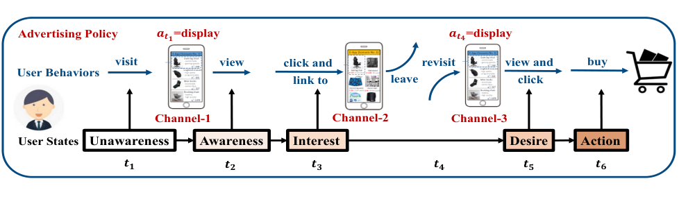

<!-- Start of picture text -->
Advertising Policy visit 𝒂𝒂𝒕𝒕𝟏𝟏 =displayview click and  revisit 𝒂𝒂𝒕𝒕𝟒𝟒 =displayview and  buy User Behaviors link to leave click Channel-1 Channel-2 Channel-3 User States Unawareness Awareness Interest Desire Action 𝒕𝒕𝟏𝟏 𝒕𝒕𝟐𝟐 𝒕𝒕𝟑𝟑 𝒕𝒕𝟒𝟒 𝒕𝒕𝟓𝟓 𝒕𝒕𝟔𝟔 <!-- End of picture text -->

_Figure 9._ An illustration of the sequential multiple interactions (across different channels) between a user and an ad. Each ad exposure has long-term influence on the user’s final purchase decision. 

An example of a user’s shopping journey is shown in Figure 9. At time _t_ 1, a user visits the news media channel and triggers an advertising exposure opportunity. Then, the advertising agent executes a display action and leaves an exposure on the user. After that, the user becomes aware of and is interested in the commodity, so he clicks the hyperlink. Quickly, the user is induced into the landing (detail) page of the commodity in the shopping app. After fully understanding the product information, the user leaves the shopping app. After a period of time, the user comes back to the shopping app at time 

**Appendix** 

_t_ 4 and triggers an exposure opportunity of banner advertising. The advertising agent executes a display action as well. Consequently, the users desire is stimulated. At time _t_ 6, the user makes a purchase. In this example, the ad exposure at time _t_ 1 influences the users mind and contributes to the ad exposure at time _t_ 4 and the delayed purchase, which means the ad exposure on one channel would influence the users preferences and interests, and therefore contributes to the final conversion. Thus, the goal of advertising should maximize the total cumulative revenue over a period of time instead of simply maximizing the immediate revenue. 

## **B. Proof and Analysis** 

### **B.1. Knapsack Problem in Online Advertising Settings** 

**Theorem 2.** _The greedy solution to the proposed dynamic knapsack problem of online advertising is λ approximately optimal where λ >_ 99 _._ 9% 

_Proof._ In the proposed online advertising problem, each user is with value _VG_ (i.e. the profit of advertiser when the user purchase the commodity) and weight _VC_ (i.e. the total budget consumption for the target user in the real-time bidding to reach the final purchase). As the item (i.e. user) is non-splittable, the proposed dynamic knapsack problem is essentially a 0-1 knapsack problem which aims to maximize the total value of the knapsack given a fixed capacity _B_ . For each item, we can calculate the Cost-Performance Ratio (CPR) as _VG/VC_ . Sort all items in descending order of CPR, i.e. ( _VG_ 1 _, VC_ 1) _,_ ( _VG_ 2 _, VC_ 2) _, . . . ,_ ( _VGn, VCn_ ) where CPR _i ≥_ CPR _j, ∀i ≤ j ≤ n_ . For _VC >_ 0, _VG >_ 0 and _B >_ 0, we first define that this 0-1 knapsack problem has optimal solution _K__∗_ ( _VC, VG, B_ ) and greedy solution _K_ ( _VC, VG, B_ ) where _K__∗_ and _K_ represent the total value of the knapsack. 

Assume _Bend_ is the remaining budget after greedy algorithm, the following inequality holds: 

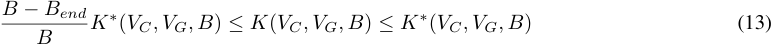

This is because: 

- 1) If the knapsack can hold all the items after the greedy algorithm, that is, the optimal solution is equal to the greedy solution. As _Bend ≥_ 0, we have_<u>B−</u>_ _B__<u>Bend</u>_ _K__∗_ ( _VC, VG, B_ ) _≤ K__∗_ ( _VC, VG, B_ ) = _K_ ( _VC, VG, B_ ) 

- _VG_ <u>1</u> _VG_ <u>2</u> _VGl_ 

- 2) If the knapsack cannot hold all the items after the greedy algorithm, as _≥ ≥ ... ≥ VC_ 1 _VC_ 2 _VCl_,we _VGl K_ <u>(</u> _VC_ _<u>,VG,B</u>_ <u>)</u> 

- have _VGl_ � _jl−_ =11_VC_ _j ≤ VCl_ � _lj−_ =11_VG_ _j ⇔ VGl_ ( _B − Bend_ ) _≤ VCl K_ ( _VC, VG, B_ ) _⇔ VCl ≤ B−Bend ⇔ K_ ( _VC, VG, B_ ) _≥ K__∗_ ( _VC, VG, B_ ) _−__Bend_ _B__K_ _−_<u>(</u>_V_ _B__<u>C</u>_ _end__<u>,VG,B</u>_<u>)</u> where _l_ is the index of last item picked by greedy algorithm. This derivation can be simplified to _K_ ( _VC, VG, B_ ) _≥__<u>B−</u>_ _B__<u>Bend</u>_ _K__∗_ ( _VC, VG, B_ ). 

In online advertising settings, the budget spent on a single user is much smaller than the advertiser’s total budget. We conduct statistics on one of the world’s largest E-commerce platforms to prove it. On Feb 3rd of 2020, a total of 1136149 ads result in 983414548 user-ad sequences (a user sequence consists of multiple interactions of the same user with the same ad), with an average of 865 user sequences per ad. Interactions with users of each ad forms a knapsack problem, where each user sequence is an item in the knapsack. The average maximum budget consumed by each user sequence accounts for 0.07068% of the total budget capacity of the advertisers. We also list details of 5 ads with largest budget consumption in Table 4, where the maximum budget consumed by each user sequence is much smaller than 1/1000 (smaller than 3/10000 specifically) of the total budget of each ad. 

As proposed in Dantzig (1957), _∀i ∈_ 1 _,_ 2 _, . . . , n, VCi ≤_ (1 _− λ_ ) _B,_ 0 _≤ λ ≤_ 1, the greedy algorithm achieves an _VCi_ <u>1</u> approximation guarantee of _λ_ . We can conclude from above statistics that max _i B__≤_ 1000, which means_λ_is much greater than 1 _−_ <u>1</u> 1000. 

The thesis above can be further proved: 

- 1) If the knapsack can hold all the items after the greedy algorithm, that is, the greedy solution is obviously equal to the optimal solution, which is also the _λ_ approximately optimal solution. 

**Appendix** 

|Ad|#Users Sequences|Budget|Avg Cost|(Avg Cost)/Budget|Max Cost|(Max Cost)/Budget|
|---|---|---|---|---|---|---|
|Ad 1|2460976|119352.51|0.048498039|0.0000406343%|20.04|0.0167905979%|
|Ad 2|2674738|114388.54|0.04276626|0.000037388%|26.22|0.0229218766%|
|Ad 3|2848816|90113.08|0.031631766|0.0000351023%|15.29|0.0169675701%|
|Ad 4|2107497|82951.82|0.03936035|0.0000474497%|5.6|0.0067509067%|
|Ad 5|1087011|77140.49|0.070965694|0.0000919954%|19.32|0.0250452130%|

_Table 4._ Detailed Comparison between an ad’s total budget and cost on a user sequence. 

- 2) If the knapsack cannot hold all the items after the greedy algorithm, we have _VCl > Bend_ , that is, _Bend < VCl ≤_ (1 _−λ_ ) _B_ . According to Formula 13, we have 

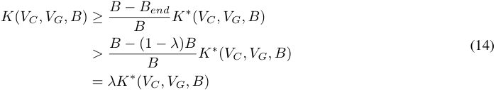

Therefore, in theory, the greedy solution in our online advertising settings is _λ_ approximately optimal and the _λ_ is much greater than 99.9% in our case. 

### **B.2. Regretless Optimal Bidding Strategy** _b__∗_ _t_ 

#### _t_ 

**Theorem 3.** _During the online bidding phase, the bidding agent can always set the bid price as:_ 

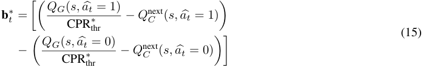

_where Q__next_ _C_(_s,a_�_t_) = E[�_T_ _k_ =_j_ _t_ +1_ck|s,a_�_t, πj_]_._**_b_** _t__∗is a regretless optimal bidding strategy without any loss of accuracy._ 

_Proof._ Since **bid****2nd** _t_ is unknown until the current auction is finished, we prove the regretless of **b**_∗_ _t_from the following two cases: 

- 1) If **b**_∗_ _t__>_**bid2nd** _t_ : **b**_∗_ _t__>_**bid2nd** _t ⇔ Q_ ( _s, a_ � _t_ =1) _>Q_ ( _s, a_ � _t_ =0), which means the agent should take action _a_ � _t_ = 1 in this case. Exactly, **b**_∗_ _t_is greater than the second highest price**bid** _t_**2nd** based on the condition for entering the current branch. Thus, the agent will always win the auction and the executed action is indeed _a_ � _t_ = 1. 

- 2) If **b**_∗_ _t__≤_**bid2nd** _t_ : **b**_∗_ _t__≤_**bid2nd** _t ⇔ Q_ ( _s, a_ � _t_ =1) _≤ Q_ ( _s, a_ � _t_ =0), which means the agent should take action _a_ � _t_ = 0 in this case. Exactly, **b**_∗_ _t_is less than the second highest price**bid2nd** _t_ according to the condition. Thus, the agent will always lose the auction and the executed action is indeed _a_ � _t_ = 0. 

Thus, we complete the proof. 

### **B.3. Convergence Analysis of** **_MSBCB_** 

The overall framework of _MSBCB_ can be described as follows: 

- (1) Let the budget constraint of an advertiser be _B_ . Given a CPRthr, we can use reinforcement learning algorithms to ensure that each user _i_ is optimized according to _πi__∗_:= argmax _πi_[_VG_(_i|πi_)_−_CPRthr_∗VC_(_i|πi_)] and converges to the optimal policy _πi__∗_under the current CPRthr.Further, picking all users whose CPR_i≥_CPRthr will result in a total cost of_B′_(i.e., the advertiser spends a budget _B__′_ ). 

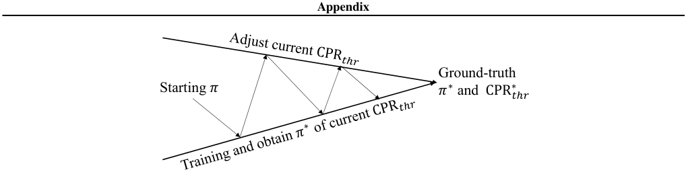

<!-- Start of picture text -->
Appendix Ground-truth Starting 𝜋 𝜋 ∗ and  CPR∗��� <!-- End of picture text -->

_Figure 10._ Convergence demonstration of _MSBCB_ 

- (2) As the current estimated threshold CPRthr might have some bias from the optimal CPR_∗_ thr,_B′_may not equal to the budget _B_ . Thus, we design a PID controller to dynamically adjust the estimated CPR_∗_ thrso as to minimize the gap between the budget constraint _B_ and the actual feedback of the daily cost _B__′_ . 

As described in Figure 10, _MSBCB_ repeats the above two steps iteratively. Given an updated CPRthr, each _π_ will be optimized by the lower-level reinforcement learning algorithms and _π_ will move towards the optimal _π__∗_ . As a result, users whose optimized CPR _i ≥_ CPRthr will be selected and we get the daily cost _B__′_ . Then, the current CPRthr will be updated so that the gap between the cost _B__′_ and the budget _B_ will be further minimized. Thus, CPRthr will move towards the optimal CPR_∗_ thrgradually.As long as the learning rates of_π_and CPRthrare small enough, the overall iterations will finally converge. In this paper, we also validate the convergence of our _MSBCB_ in the experiments. As shown in Section 4.2 of the paper, our method converges quickly and finally reaches an approximation ratio of 98.53%. 

## **C. Deployment** 

Here we give the online deployment details of our _MSBCB_ . 

### **C.1. Myopic to Non-Myopic Advertising System Upgrade Solution** 

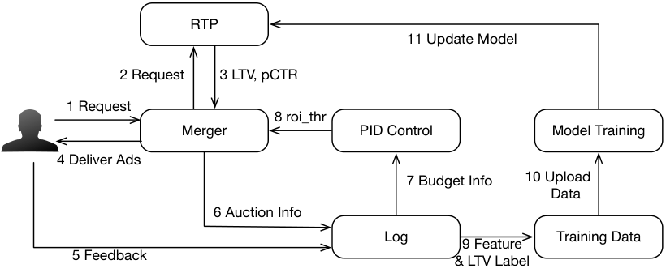

<!-- Start of picture text -->
RTP 11 Update Model 2 Request 3 LTV, pCTR 1 Request 8 roi_thr Merger PID Control Model Training 4 Deliver Ads 7 Budget Info 10 Upload     Data 6 Auction Info Log 9 Feature Training Data 5 Feedback & LTV Label <!-- End of picture text -->

_Figure 11._ Online System 

A myopic advertising system includes several key components as Figure 11 shows: (1) Log module collects auction information and user feedback. (2) Training data are constructed based on log followed by model training with offline evaluation. (3) Real-time prediction (RTP) module provides service for myopic value prediction of user-ad pairs. RTP periodically pulls newly trained models. (4) Merger module receives the user visit, requests RTP for myopic value with which ad bid adjustment ratios and ranking scores are calculated (In advertising, ranking score is _ecpm_ = _pCTR ∗ bid_ where _pCTR_ is predicted Click Through Rate and _bid_ is the bidding price). Finally, top-scored ads are delivered to the user. Above myopic advertising system can upgrade to a non-myopic system by considering the following key changes. 

**Appendix** 

(1) Log module needs to keep long-term auction information and users’ feedback, and these data are used to construct features and long-term labels for training. Besides, logged data have to track each advertised item’s budget and current cost data which are fed to a PID control module to compute CPRthr for users selection in Merger. (2) Model training can use Monte Carlo (MC) or Temporal Difference (TD) methods. For MC, the long-term labels are cumulative rewards of a sequence and the training becomes a supervised regression problem. For TD, one-step or multi-step rewards are used to compute a bootstrapped long-term value using a separate network for training. (3) RTP module should periodically pull both myopic and non-myopic newly trained models and provide corresponding value prediction service. (4) Merger maintains an _<_ item _,_ CPRthr _>_ table which is updated periodically from PID module. When a user visit comes, Merger requests RTP for both _pCTR_ and long-term values (long-term _GMV_ i.e. _VG_ and _cost_ i.e. _VC_ in our paper), and with CPRthr decides the selection of current user and bid adjustment. 

### **C.2. Long-Term Value Prediction Model** 

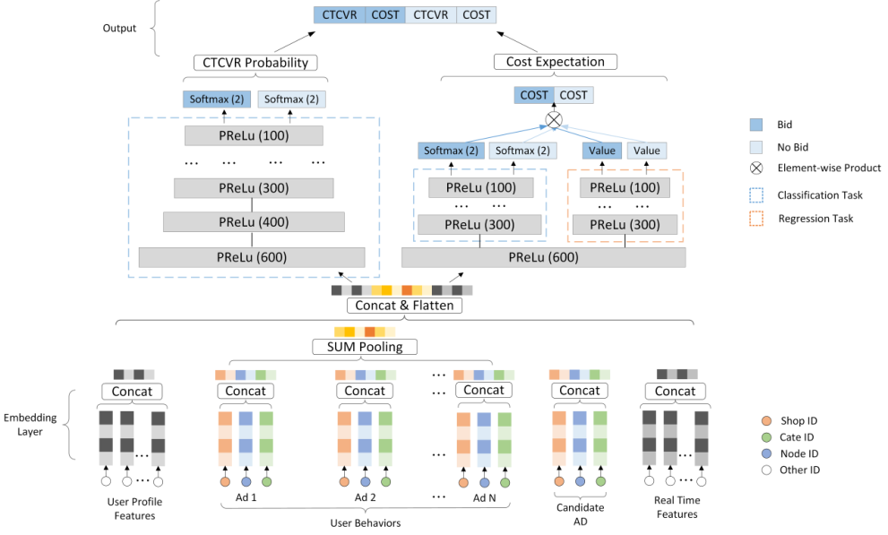

_Figure 12._ Long-Term Value Prediction Model 

### C.2.1. FEATURES AND LABELS 

Features for long-term value prediction should contain sufficient user’s static profile and historical behavior information. Most myopic advertising systems already have a sound feature system which can summarize user-oriented, ad-oriented and user-ad interactive history very well. Besides, due to the large amount of data collected by the online advertising system, these features are able to generalize across large number users where each user-ad pair’s interaction is considered as a separate MDP, thus, help the prediction model learning. To be specific, the state _st_ at step _t_ includes: 1) user profile features; 2) user behavior features; 3) real-time user behavior features; 4) context features; 5) user-ad interaction histories; 6) user feedback before current step _t_ and so on. Features are constructed based on past 7-14 days data before user visit time t. For the MC training method, labels are constructed using the following 7 days data after user visit time _t_ . For the TD method, labels are the instant rewards at time _t_ and the long-term labels are constructed using a bootstrap method. 

**Appendix** 

### C.2.2. MODEL ARCHITECTURE 

The long-term value model architecture is shown in Figure 12, where the model takes the features as input and output long-term value of _GMV_ (i.e. _VG_ in our formulation) and _cost_ (i.e. _VC_ in our formulation) for both action=1 (display the ad) and action = 0 (do not display the ad). 

We use one model to output multiple long-term values ( _GMV_ and _cost_ for action=1 and action=0). Multiple prediction tasks share the same bottom layers because we consider the underlying knowledge of the user’s sequence behaviors such as opening the app, jumping across channels, turning off the phone and revisiting the app should be learned together and shared. The shared layer converts input features to embeddings and embeddings in the same group are concatenated. The user-behavior group embeddings are then pooled with sum operation. User-profile embeddings, user-behavior embeddings, candidate ad embeddings, and real-time features are finally concatenated and flattened as the output of the bottom layers. 

Following the shared bottom layers, the network is split into two forward-pass branches where one is for long-term _GMV_ prediction and one for long-term cost prediction. We find this two-branch design can reduce the influences among different tasks and stabilize the learning. For the long-term _GMV_ prediction, since each user usually buys a commodity only once, we only have to predict _P_ ( _buy >_ 0 _|feature_ ) denoted as _CTCV R_ . In the online inference phase, the long-term _GMV_ is computed with _GMV_ = _P_ ( _buy >_ 0 _|feature_ ) _∗ item_ _~~p~~ rice_ where _item_ _~~p~~ rice_ is the price of the commodity. For the long-term cost prediction, in CPC (Cost-Per-Click) advertising, a user usually clicks several times before buys and the cost per click along with each click varies, thus, the long-term _cost_ prediction cannot be decomposed as the long-term _GMV_ prediction and the only way is to regress the long-term cost value. However, as most sequences’ costs are zero, the direct regression learning process will be very noisy. Therefore, we design an additional hidden layer to compute _P_ ( _cost >_ 0 _|feature_ ) _, P_ ( _cost_ = 0 _|feature_ ) and _E_ ( _cost|cost >_ 0 _, feature_ ). Then, the predicted long-term cost is computed as _pcost_ = _P_ ( _cost >_ 0 _|feature_ ) _∗ E_ ( _cost|cost >_ 0 _, feature_ ) + _P_ ( _cost_ = 0 _|feature_ ) _∗_ 0 = _P_ ( _cost >_ 0 _|feature_ ) _∗E_ ( _cost|cost >_ 0 _, feature_ ) where _P_ ( _cost >_ 0 _|feature_ ) and _P_ ( _cost_ = 0 _|feature_ ) are learned using logistic regression loss and _pcost_ is learned using mean-square error loss ( _pcost − cost_ )2 . We find the above designs help improve the model’s prediction performance in practice. For _CTCV R_ and _P_ ( _cost >_ 0 _|feature_ ), _P_ ( _cost_ = 0 _|feature_ ), we use GAUC (Zhou et al., 2018) as metric, and for _pcost_ regression, we use mean-square error and reverse order metrics. 

## **D. Empirical Evaluation: Supplementary of Offline Experiments** 

### **D.1. Experiments Settings.** 

Considering the potential losses of assets and money, it’s usually forbidden to do a lot of trial and error and thoroughly comparisons between available baselines in a live advertising system. Thus we implement a fairly general simulation environment so that we could make extensive analyses of our approach. All experiments are conducted on an Intel(R) Xeon(R) E5-2682 v4 processor based Red Had Enterprise Linux Server, which consists of two processors (each with 16 cores), running at 2.50GHz (16 cores in total) with 32KB of L1, 256 KB of L2, 40MB of unified L3 cache, and 128 GB of memory and 2 Tesla M40 GPUs. 

### **D.2. Simulation Environment.** 

Here, we give the detail of the simulation environment. Similar to (Ie et al., 2019), the simulation environment includes the following 5 modules: 

- _Advertisements and Topic Model:_ We assume a set of documents _D_ representing the content available for advertising. We also assume a set of topics (or users interests) _T_ that capture fundamental characteristics of interest to users; we assume topics are indexed 1 _,_ 2 _, ...|T |_ . Each commodity _d ∈D_ has an associated topic vector **d** _∈_ [0 _,_ 1]_|T |_ , where _dj_ is the degree to which _d_ reflects topic _j_ . Each document _d ∈D_ also have an inherent quality _Qd ∈_ [0 _,_ 1], representing the topic-independent attractiveness to the average user. 

- _Consumer Interest and Satisfaction Model:_ Each user _i_ has various degrees of interests in topics, ranging from 0 (completely uninterested) to 1 (fully interested), with each user _i_ associated with an interest vector **u** _∈_ [0 _,_ 1]_|T |_ . Consumer _i_ ’s interest in advertisement _d_ is given by the dot product _I_ ( _u, d_ ) = **ud** . We assume some prior distribution _Pu_ over user interest vectors, but user _i_ ’s interest vector is dynamic, i.e., influenced by their advertisement consumption (see 

**Appendix** 

below). Besides, a user’s satisfaction _S_ ( _u, d_ ) with a consumed (viewed) advertisement _d_ is a function _f_ ( _I_ ( _u, d_ ) _, Qd_ ) of user _i_ ’s interest and ad _d_ ’s quality. Here, we assume a simple convex combination _S_ ( _u, d_ ) = (1 _− α_ ) _I_ ( _u, d_ ) + _αQd_ . Satisfaction influences user dynamics as we discuss below. 

- _Consumer Choice Model:_ The user’s Click-Through Rate (CTR) and Conversion Rate (cvr) are represented by _I_ ( _u, d_ ) and _S_ ( _u, d_ ) respectively. Each user has the probability of clicking and buying an advertising commodity according the CTR and CVR. 

- _Consumer Dynamics:_ We assume that a user’s interest evolves as a function of the documents consumed (viewed). When user _i_ consumes document _d_ , her interest in topic _T_ ( _d_ ) is nudged stochastically, biased slightly towards increasing her interest, but allows some chance of decreasing her interest. In this paper, we set **u** _← γ_ **u** + _β ∗ S_ ( _u, d_ ) _∗_ **d** , where _γ_ is the interest decay rate and _β ∈_ [ _−_ 1 _,_ 1] is a user independent parameter. 

- _Consumer Visiting Model and Advertising System Dynamics:_ The users’ request sequence are generated from a stable distribution _Preq_ . For each user’s request, all advertisements _d ∈D_ give a bid and competes with other bidders in real-time. The winner has the privilege to display its ad to the user, which could further influence the user’s interest and behavior. 

### **D.3. Codes and Datasets.** 

The codes and datasets to reproduce our offline experiments are provided in another supplementary material. 

### **D.4. Cost Comparison.** 

The consumption of budget during the training process is shown in Figure 13. As we can see, the costs of all approaches converge to about 12000, which is exactly equal to the budget we set in experiments. Specific costs of each approach can be found in Table 1 of paper. 

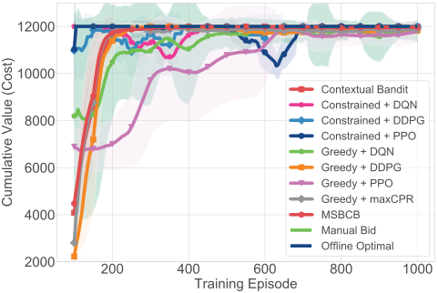

_Figure 13._ The learning curves of costs of our _MSBCB_ and the other baseline approaches. 

### **D.5. Convergence Analyses** 

### D.5.1. CONVERGENCE OF EACH _πi__∗_GIVENANY CPRTHR. 

As shown in Figure 14, given a CPRthr, the learned advertising policy _π_ of our _MSBCB_ converges to the optimal _πj__∗_.In Figure 14, the x-axis denotes the cumulative cost, the y-axis denotes the cumulative value and the dots in blue represent the cumulative values and costs of all possible policies for each user. The red line represents _y_ = CPRthr _∗ x_ , whose slope is CPRthr. The orange point represents the optimal policy _πi__∗_computed by enumerating all possible policies (blue points) and finding the one which maximize _VG_ ( _i|πi_ ) _−_ CPRthr _∗ VC_ ( _i|πi_ ) according to **Theorem 1** . The green point denotes the learned policy of _MSBCB_ . _In theory, the point of the optimal policy is the one whose CPR > CPR__∗_ _thr__andvertical_ _distance is the farthest from the red line._ A proof is provided in the **Theorem 4** in the later part. We present 3 convergence examples of different types in Figure 14. In Figure 14 (a) and (b), the learned _π_ by the RL algorithm is exactly the same with the optimal _π__∗_ . In Figure 14 (b), the optimal policy is do not advertise to this user. In Figure 14 (c), the learned _π_ is 

**Appendix** 

approximately optimal. Detail convergence statistics on the proportion of users whose policies converged to the optimal 

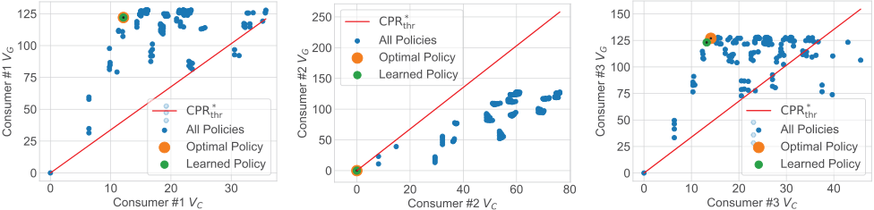

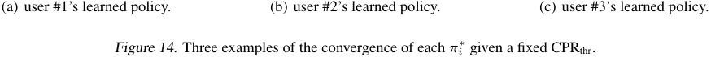

<!-- Start of picture text -->
(a) user #1’s learned policy. (b) user #2’s learned policy. (c) user #3’s learned policy. Figure 14. Three examples of the convergence of each  πi ∗ given a fixed CPRthr. <!-- End of picture text -->

ones among all users are shown in Table 5. For each user, we denote the vertical distance of the learned policy to the CPR_∗_ _thr_line as dis_∗_ _learned_and the vertical distance of the optimal policy_π∗_to the CPR_∗_ _thr_line as dis_∗_ _optimal_.We denote R_∗_ _opt_= dis _learned__∗/_dis_∗_ _optimal_as the approximation ratio.According to**Theorem 4**, if the R_∗_ _opt_is 100%, then the learned strategy is exactly the optimal strategy. Otherwise, we denote that the learned strategy is the R_∗_ _opt_-approximation strategy. As shown in Table 5, there are 74.9% policies achieve more than 90%-approximation ratios and 53.3% policies achieve exactly the optimal. 

|_Table 5._|Optimal typ|es of each_π__∗_ _i_ of 10000 users|
|---|---|---|
|R_∗_ _opt_|100%|[90%, 100%) [0%, 90%)|
|Percentage|53.3%|21.6% 25.3%|

**Theorem 4.** _The point of the optimal policy is the one whose CPR > CPR__∗_ _thr__and vertical distance to CPR∗_ _thr__line (red line)_ _is the farthest among all policy dots in Figure 14._ 

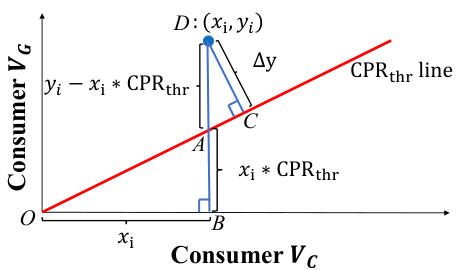

<!-- Start of picture text -->
D : �𝑥�, 𝑦�� ∆y CPR��� line 𝑦� �𝑥� ∗CPR��� C A 𝑥� ∗CPR��� O B 𝑥� Consumer Consumer <!-- End of picture text -->

_Figure 15._ Proof of Optimal Policy Dot 

_Proof._ Here we give a simple proof of **Theorem 4** . As we can see in Figure 15, the blue dot _D_ : ( _xi, yi_ ) is an arbitrary policy _i_ in Figure 14. Suppose the vertical distance of _D_ to _CPRthr__∗_line (red line) is ∆_yi_(segment_DC_in the figure). We then draw a vertical line of x-axis from dot _D_ to dot _B_ . We can then calculate the length of segments: _OB_ = _xi_ , _BA_ = _xi ∗_ CPR _thr_ , _DA_ = _yi − xi ∗_ CPR _thr_ . It’s evident that _△OAB ∼△DAC_ , which means_<u>DC</u>_ _OB_=_<u>DA</u>_ _OA_= _<u>DA</u>_ _~~√~~_ ( _OB_ )2 +( _AB_ )2.We can derive that 

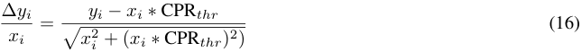

**Appendix** 

As _xi >_ 0, we can further derive that 

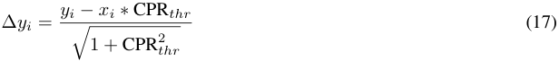

Suppose the dot of a policy is ( _x__∗_ _, y__∗_ ), which has farthest vertical distance ∆ _y__∗_ from the _CPRthr__∗_line, that is, for a dot of arbitrary policy _i_ , we have ∆ _yi ≤_ ∆ _y__∗_ . According to Equation 17, we have 

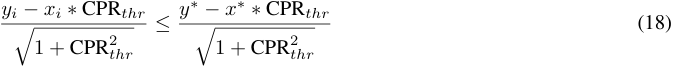

Then we get _yi − xi ∗_ CPR _thr ≤ y__∗_ _− x__∗_ _∗_ CPR _thr_ , which means ( _x__∗_ _, y__∗_ ) is the dot of the optimal policy. Thus, we complete the proof. 

### D.5.2. CONVERGENCE OF CPR_∗_ 

### THR. 

In Figure 16, we plot the learning curves of the CPRthr of our _MSBCB_ as well as 3 RL approaches. The dotted blue line denotes the optimal CPR_∗_ thrcomputed by the_MSBCB (enum)_of Table 1 of paper.Figure 16 shows that the learned CPRthr of our _MSBCB_ could gradually converge to the optimal CPR_∗_ thrapproximately, which is much better than the other 3 RL approaches. 

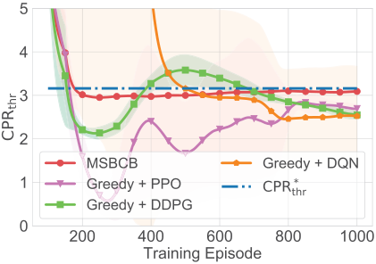

_Figure 16._ The convergence of CPRthr_∗_ 

### **D.6. Gap to Market Second Price.** 

Figure 17 shows average gaps between the bid of the agent of different approaches and the second price in the auction. Results indicate that the bid prices given by the _MSBCB_ agent are closer to the second price in the auction, which can reduce the risk of economic loss when the market price fluctuates. 

### **D.7. Effectiveness of Action Space Reduction.** 

Here we give a more detailed comparison of _MSBCB_ and RL baselines to demonstrate the effectiveness of action space reduction. As shown in Figure 18 and Table 6, _MSBCB_ (with action space reduction) can reach exactly the same cumulative value much more quickly than the other 3 RL baselines. _MSBCB_ can reach a cumulative value of 85000 in only 104 epochs, which proves that action space reduction can effectively improve the sample utilization to converge to higher performance with faster speed. 

## **E. Empirical Evaluation: Supplementary of Online A/B Testing** 

In online A/B Testing, we conduct further analyses to verify the effectiveness of our _MSBCB_ and find out whether our approach could benefit most advertisers. 

**Appendix** 

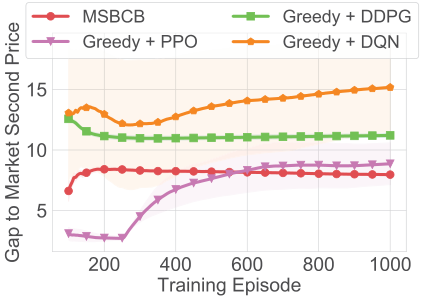

_Figure 17._ The average gaps of the bids to the second prices in the auction by different methods. 

_Table 6._ The training epochs and the number of samples needed by different approaches when achieving the same revenue level. 

|Cumulative Value|60|000|65|000|70|000|75|000|80|000|8|5000|
|---|---|---|---|---|---|---|---|---|---|---|---|---|
|Method|#Epoch|#Samples|#Epoch|#Samples|#Epoch|#Samples|#Epoch|#Samples|#Epoch|#Samples|#Epoch|#Samples|
|Greedy + PPO|251|1280000|299|1530880|776|3973120|817|4183040|-|-|-|-|
|Greedy + DDPG|68|343040|76|389120|92|471040|154|788480|853|4362240|-|-|
|Greedy + DQN|90|455680|109|558080|153|783360|373|1909760|754|3855360|-|-|
|**MSBCB**|**22**|**112640**|**33**|**163840**|**48**|**245760**|**61**|**312320**|**71**|**363520**|**104**|**532480**|

Firstly, we analyze the performance of our _MSBCB_ for each advertiser. To guarantee the statistical significance, only the advertisers with more than 100 conversions in a week are included. The detail results of top-10 advertisers with the largest costs are shown in Table 7. In Table 7, under the same budget constraint, our _MSBCB_ can increase the Revenues and ROIs of most advertisers compared with the myopic _Contextual Bandit_ approach. Although the ROI of advertiser 7 drops slightly, our _MSBCB_ contributes to much more PVs (Page Views). 

Besides, in Figure 19, we give the detail proportions of advertisers whose ROIs are improved. Among all advertisers, 85.1% advertisers obtain positive ROI improvements while the rest of 14.9% advertisers are in the so-called quantity and quality exchange situations: their PV increments are larger than the ROI drops. We say that its also acceptable for some advertisers because the PV increments might lead to secondary exposures to an advertiser and thus lower the ROI within the current time period. But the increase in PV may leave deeper impressions to the users and contribute to the long-term future revenues. In addition, Figure 19 demonstrates that our _MSBCB_ can be well applied to the multi-agent setting (which involves multiple advertisers) in the real-world auction environment, which could increase the overall revenue for most advertisers. 

In order to highlight the advantage of our method in long-term revenue optimization, we compared the average number of 

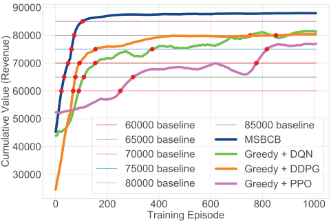

_Figure 18._ The comparison of the number of training episodes needed by different approaches when achieving the same revenue level. 

**Appendix** 

||Revenue|Cost|CVR|PV|ROI|
|---|---|---|---|---|---|
|Advertiser 1|5.1%|-6.3%|17.2%|9.6%|12.2%|
|Advertiser 2|7.5%|2.1%|5.2%|12.2%|5.3%|
|Advertiser 3|48.6%|10.9%|27.6%|28.9%|33.9%|
|Advertiser 4|3.1%|2.8%|1.1%|9.6%|0.3%|
|Advertiser 5|12.7%|1.7%|12.9%|17.8%|10.8%|
|Advertiser 6|10.8%|2.2%|4.4%|13.8%|8.4%|
|Advertiser 7|1.9%|3.8%|4.6%|31.5%|-1.8%|
|Advertiser 8|5.6%|-4.8%|2.9%|10.7%|11.1%|
|Advertiser 9|6.7%|-2.4%|6.3%|21.0%|9.4%|
|Advertiser 10|5.8%|-0.8%|2.5%|8.0%|6.7%|

_Table 7._ The improvements in Revenue, CVR, PV and ROI of our _MSBCB_ compared with the myopic _Contextual Bandit_ method. 

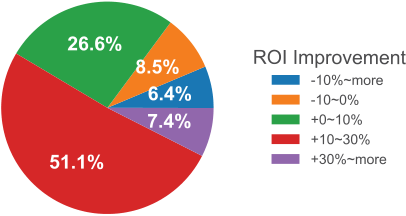

_Figure 19._ The distribution of ROI improvements for all advertisers of our _MSBCB_ compared with the myopic _Contextual Bandit_ method. 

times (we call the sequence length) that a user contact with an advertisement under different approaches. Figure 20 shows the extent of _MSBCB_ ’s improvement relative to _Contextual Bandit_ in the proportion of the user sequence length. The results show that our _MSBCB_ can increase the proportion of the sequences with larger sequence length. Especially, the ratio of sequence length of 7 is increased by nearly 30%. It shows that our method can promote longer user behavior sequences, and longer user behavior sequence means more opportunities to affect the user’s mentality towards an advertisement, thereby improving the long-term revenue for an advertisement. 

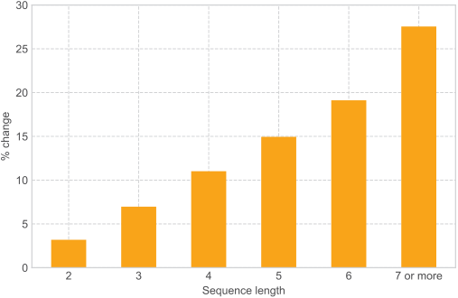

_Figure 20._ The proportion improvements in the sequence length of our _MSBCB_ compared with the myopic _Contextual Bandit_ method. 

Further, we also analyze the ROI performances of the compared 3 algorithms (i.e., _CEM_ , _Contextual Bandit_ and our _MSBCB_ ) in different channels. Figure 21 shows the budget allocation distributions of all approaches among 6 channels and the corresponding ROIs. The left axis represents the ROI, and the ROI performances of each algorithm among different channels are given by the corresponding bar charts. The right axis represents the increments or decrements of the actual costs of _MSBCB_ and _Contextual Bandit_ relative to _CEM_ , which are indicated by the line charts. In Figure 21, we observe the 

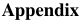

<!-- Start of picture text -->
Appendix <!-- End of picture text -->

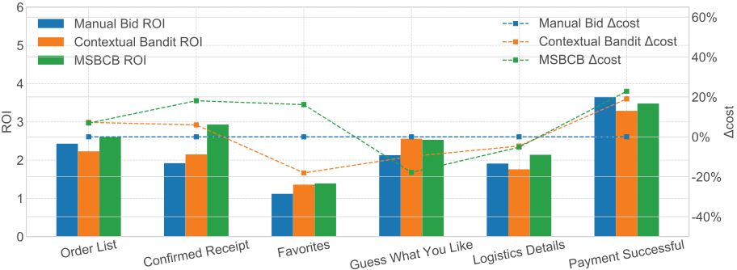

_Figure 21._ ROI and budget allocation among different channels. 

following two phenomena: 

- 1) _MSBCB_ and _Contextual Bandit_ both spend more budgets on channels with higher ROIs, especially on the _Payment Successful_ channel, where the average ROI is much higher. 

- 2) Compared with _Contextual Bandit_ , _MSBCB_ allocates more budget from the _Guess What You Like_ channel to other channels, especially the _Favorites_ channel, _Confirmed Receipt_ channel and the _Payment Successful_ channel. 

These phenomena show that our _MSBCB_ can reasonably allocate budgets among different channels and spend more budgets in channels with higher ROIs. In addition, compared with the myopic method _Contextual Bandit_ , our long-term _MSBCB_ is more optimistic about channels during and after purchasing, which shows that our _MSBCB_ prefers a longer interaction sequence to optimize cumulative long-term values. 

