2013 19th IEEE International Conference on Parallel and Distributed Systems2013 19th IEEE International Conference on Parallel and Distributed Systems2013 19th IEEE International Conference on Parallel and Distributed Systems2013 International Conference on Parallel and Distributed Systems 

# **SAIL: A Strategy-Proof Auction Mechanism for Cooperative Communication** 

Zhenzhe Zheng, Juntao Wang, Fan Wu, and Guihai Chen _Shanghai Key Laboratory of Scalable Computing and Systems Department of Computer Science and Engineering Shanghai Jiao Tong University, China_ 

{ _zhengzhenzhe, wjtcute_ } _@sjtu.edu.cn;_ { _fwu, gchen_ } _@cs.sjtu.edu.cn_ 

**_Abstract_ —Cooperative communication is a new fashion to alleviate the low channel utilization and signal fading problems in today’s wireless network. The success of cooperative communication heavily depends on the efficient assignment of relay resource. Auction theory has been applied successfully to allocate limited resources in wireless network for decades. However, most of the existing auction mechanisms restricted buyers to use simple bidding language, which greatly lowers the social welfare and relay assignment efficiency. In this paper, we model the relay assignment as a combinatorial auction with flexible bidding language and propose SAIL, which is a** **<u>Strategy-proof</u> and** **<u>Approximately</u> effIcient combinatoriaL auction for relay assignment in cooperative communication. We show analytically that SAIL is strategy-proof and achieves approximate efficient social welfare. Furthermore, we present evaluation results to show that SAIL achieves a good system performance in terms of social welfare, buyer satisfaction and relay utilization.** 

**_Keywords_ -Cooperative Communication; Combinatorial Auction; Relay Selection;** 

## I. INTRODUCTION 

The wireless networks today are facing the challenges of low channel utilization and signal fading, as more and more wireless devices are added into networks to support different kinds of tasks around the world. A main idea proposed to alleviate this dilemma is using relay nodes for cooperative communication [1, 2]. Under cooperative communication, a source-destination pair can improve its channel capacity and achieve spatial diversity with the help of relay nodes. There are two primary modes in cooperative communication: _Amplify-and-Forward_ (AF) and _Decodeand-Forward_ (DF)[2], which are categorized by the relay’s operation on the received signal before forwarding it to destination nodes. 

Cooperative communication, which exploits the nature of broadcast and takes the advantage of antennas on wireless devices, has been rarely deployed in practice, even in some scenarios where network capacity continually grows such as 

This work was supported in part by the State Key Development Program for Basic Research of China (Grant No. 2014CB340303, 2012CB316201), in part by China NSF grant 61272443, 61133006, 61073152, and in part by Shanghai Science and Technology fund 12PJ1404900 and 12ZR1414900. The opinions, findings, conclusions, and recommendations expressed in this paper are those of the authors and do not necessarily reflect the views of the funding agencies or the government. 

F. Wu is the corresponding author. 

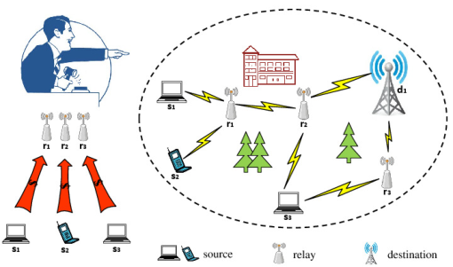

Figure 1. Auction for relay assignment in cooperative communication. Relay nodes are leased out for relay service. Source nodes bid for these relays to assist in transmitting data traffic to destination nodes. The auctioneer determines the winners and the prices. 

cellular networks [3, 4] and cognitive radio networks [1]. Due to the extra energy overhead, few wireless devices are willing to serve as relay nodes for cooperative communication. To overcome this obstacle, many works have been done to stimulate devices to participate in cooperative communication [3, 5–7]. Meanwhile, other studies focus on improving the performance of cooperative networks under limited relays [8, 9]. Our work aims at further maximizing the social welfare (Please refer to the definition in Section III-B) by introducing diverse bidding language to combinatorial relay auction in cooperative communication. 

For decades, auction theory [8, 10] has been regarded as a useful tool to efficiently allocate limited resources to achieve certain objectives, such as social welfare, revenue. As shown in Figure 1, source nodes select relays to assist in transmitting their traffic to destination nodes. Source nodes are buyers in the auction, who pay for relay service. Relay nodes, which are regarded as goods in the auction, deserve compensatory monetary for consumptions of extra resources. Some incentive mechanisms for relay assignment have been developed in cooperative communication systems [11, 12]. However, these existing auction-based mechanisms restricted buyers to bid with a simple format _e.g._ , single-relay bid in [3, 7] and single-bundle bid in [6]. In this paper, we model the relay trade market as a _Combinatorial Auction_ with diverse bidding language, in which buyers can bid for 

1521-9097/13 $31.00 © 2013 IEEE DOI 10.1109/.59DOI 10.1109/.59DOI 10.1109/.59DOI 10.1109/ICPADS.2013.60 

380 

not only multiple relays but also multiple relay bundles. 

Designing a practical combinatorial auction for relay assignment in cooperative networks has the following challenges: 

- _Strategy-Proofness:_ Most auction mechanisms pursue strategy-proofness by nature. Because auction participants are normally rational and their selfish strategic behaviors always lead the auction to a unpredictable outcome. A strategy-proof auction mechanism guarantees that the dominant strategy of each participant is to behave truthfully. Thus, the auctioneer can avoid the market manipulation and achieve certain auction objective based on the truthful information revealed from the participants. 

- _Bid Diversity:_ There may exist multiple candidate relay bundles for source nodes to choose in cooperative communication. Any one of the the candidate relay bundles can satisfy their quality of transmission. Bid diversity allows buyers to submit multiple candidate relay bundles. Consequently, buyers can have higher opportunities to receive relay service. Meanwhile, the performance of the relay auction, _i.e._ , social welfare and relay utilization, can be significantly improved. 

- _Social Welfare:_ Maximization of social welfare is a basic and common goal of auctions. Social welfare is generally defined as the sum of winners’ valuations in auction. However, the maximization of social welfare is always computationally intractable or incompatible of other features such as strategy-proofness and bid diversity in combinatorial auction. 

In this paper, we model the relay assignment problem in cooperative communication as a combinatorial auction, in which the bidding language is powerful enough to express the diverse relay requirements of buyers. Then, we jointly consider the above challenges and propose SAIL, which is a Strategy-proof and Approximately effIcient combinatoriaL auction mechanism for cooperative communication. SAIL allows buyers to submit multiple relay bundles. It greedily determines the winners, achieving an approximate social welfare, and applies a novel payment scheme to guarantee the strategy-proofness. 

To our best knowledge, SAIL is the first framework to address the combinatorial auction with diverse bidding language for cooperative communication. The main contributions of this paper are listed as follows. 

- First, we model the relay assignment problem in cooperative communication as a combinatorial auction with diverse bidding language and propose SAIL, which is a strategy-proof auction mechanism. SAIL is more powerful than the conventional combinatorial auction with single-minded bidding language. 

- Second, our theoretical analysis shows that SAIL guarantees strategy-proofness and achieves an approximate social welfare. The approximate ratio of SAIL is 

- O(√L × m), where L is the maximum size of relay bundle and m is the number of relay nodes. 

- Third, we evaluate SAIL using network simulation and the results show that SAIL achieves good performance in terms of social welfare, buyer satisfaction and relay utilization. 

The remainder of the paper is organized as follows. In Section II, we briefly review the related works. In Section III, we introduce the system model considered in this paper. We then propose a combinatorial auction mechanism and analyze its economic property and approximate ratio in Section IV. Next we show our simulation results in Section V, and conclude our paper in Section VI. 

## II. RELATED WORKS 

In this section, we briefly review existing works in relay assignment problem in cooperative communication. 

The primary work on cooperative communication was done by Laneman _et al._ [2], which introduced the concept of _cooperative communication_ in wireless networks and proposed two basic cooperative communication modes, _amplify-and-forward_ (AF) and _decode-and-forward_ (DF). Zhao _et al._ [13] studied the optimal power allocation and relay selection problem, pointing out that it was possible to select the best relay to achieve the full spatial diversity when multiple relays are available in AF mode. Based on Zhao’s work, [4, 9] further explored the relay assignment problem with different assumptions and circumstances. Another work done by H. Yao et al. [14] applies cooperative communication to cognitive ratio network and deals with the cheating problem. 

Game theory has been widely used in resource management in cooperative communication to avoid the selfish behaviors of wireless devices. Some works have been done in encouraging wireless users to participate in cooperative communication. Huang _et al._ in [8] were pioneers that researched the resource allocation in cooperative communication with auction theory. Besides, Yang _et al._ have done a series of works [3, 5, 6] in this direction. In [3], they designed a truthful, individually rational, and budgetbalanced double auction for cooperative communication with limited degradation on social welfare. In [6], they designed a truthful auction mechanism to maximize the revenue based on the distribution functions of bidders’ private valuations in previous auctions. 

However, none of the above studies ever considered the flexible bidding format. The diverse bidding language can greatly improve the system performance. 

## III. SYSTEM MODEL 

In this section, we consider the network model and auction model for cooperative communication. We also review some of solution concepts from game theory used in this paper. 

381 

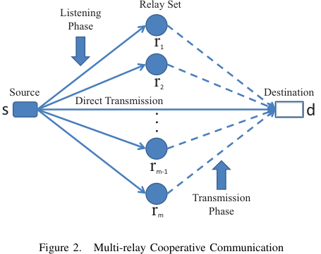

<!-- Start of picture text -->
Relay Set Listening Phase r1 r2 Source Destination Direct Transmission s  d rm-1 Transmission rm Phase Figure 2. Multi-relay Cooperative Communication . . . <!-- End of picture text -->

_A. Network Model_ 

We consider a static wireless network consisting of n source nodes, denoted by S = {s1, s2, · · · , sn}, and m heterogeneous relay nodes, denoted by R = {r1, r2, · · · , rm}. Source nodes have their own destination nodes. Each source node si ∈ S bids for some relay nodes, denoted as a relay bundle Ci ⊆ R, to assist their data transmission. In Figure 2, we consider the multi-relay cooperative communication. We adopt the network models in [6, 11], and divide the transmission into two phases: _listening phase_ and _transmission phase_ . In the listening phase, the source node s transmits data to the destination node d directly. Meanwhile, due to the broadcast nature of wireless transmission, the nearby relay nodes can overhear the signal transmitted by the source node. After receiving the data, the relay node(s), selected by the source node, forward the data to the destination using two different cooperative communication modes ( _i.e._ , Amplify-and-Forward (AF) and Decode-and-Forward (DF)) in the cooperative phase. Note that our auction mechanism is independent of the cooperative model adopted by relay nodes. In addition, how to select the optimal relay set Ci for each source node Si is out of the scope of this paper. Readers can refer papers [15, 16] for more information. We also assume that there are enough orthogonal channels available to mitigate the interference. 

## _B. Auction Model_ 

We consider a static scenario, where a set of heterogeneous relay nodes are leased out for providing relay service, and source nodes, called “buyers”, desire some of relay nodes for cooperative communication. In realistic cooperative communication, relay nodes may be equipped with different transmitting power and energy constraints, so we regard the relay nodes as heterogeneous resource. Buyers select some candidate subsets of relay nodes, each of which can satisfy their requirements of transmission. Therefore, the buyers are willing to pay for the relay service if any one of their requested bundles is allocated, _i.e._ , buyers have 

uniform valuations over all their candidate relay bundles. The valuation is derived from the gain of quality of service (QoS) that a source node can achieve under the help of allocated relay nodes. 

We model the relay assignment in cooperative communication as a sealed-bid combinatorial auction with diverse bidding language. In the sealed-bid combinatorial auction, buyers simultaneously submit their requests and bids to a trustworthy third-party auctioneer, such that no buyer can know the other participants’ information. The auctioneer makes decision on relay allocation and the payment to winners based on the collected requests and bids. 

The _requests_ of the buyer si ∈ S are denoted as a vector **C** i = (Ci1, C i2, · · ·, C iK),whereC ijisthesubsetofrelay nodes R and K is the maximum number of bundles that the buyer can submit. Due to the limited wireless transmission range, source nodes can only access to a subset of the relay nodes around herself. We assume that the maximum size of relay bundle is L. A buyer, who can submit K relay bundles, is also called as a K-minded buyer. If K = 1, the buyer is single-minded, which has been discussed in [6]. We denote the _bids_ of buyers by vector⃗ **b** = (b1, b2, · · · , bn). Bid bi means the maximum amount of money that the buyer si is willing to pay if she wins any one of her requested relay bundles. The bidding language in our model is a relay request vector⃗ **C** i associated with an uniform bid bi.1 Buyers can express their diverse relay demand using this powerful bidding language. The _valuations_ of buyers are denoted by vector⃗ **v** = (v1, v2, · · · , vn). Here valuation vi is the private information of the buyer si, and is also known as _type_ in mechanism design. Note that the valuations of buyers may not be necessarily equal to their submitted bids since buyers can improve their utilities by cheating on their valuations. Each buyer also has a _clearing price_ which is determined and charged by the auctioneer. The loser is free of any charge. We denote the vector of clearing price of all buyers by⃗ **p** = (p1, p2, · · · , pn). The _utility_ of the buyer si, denoted by ui, is defined as the difference between her valuation and clearing price, _i.e._ , 

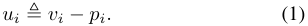

The utility of loser is zero. We denote the utility vector by **u** = (u1, u2, · · · , un). We assume that buyers are rational and selfish, thus their goals are to maximize their own utilities. In contrast to the buyers’ goals, the objective of the auctioneer is to maximize social welfare. We list its definition below. 

_Definition 1 (Social Welfare):_ The social welfare in a cooperative communication relay auction is the sum of winning buyers’ valuations on their allocated bundles of relay nodes, 

> 1Our model is the known single value model in [17], which falls into the family of single parameter domains defined in paper [18]. We leave the unknown single value model [19] and multi-parameter domains to our future works. 

382 

## _i.e._ , 

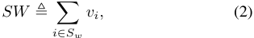

where Sw is the set of winners. 

We assume in this paper that buyers do not collude with each other and do not cheat on their requested relay bundles, while leaving these problems to our future works. 

## _C. Solution Concepts_ 

We review some important solution concepts from game theory. First, we recall the definition of _Dominant Strategy_ . 

_Definition 2 (Dominant Strategy [20][21]):_ Strategy si is player i’s dominant strategy, if for any strategy s′ i̸=si and any other player’s strategy profile s−i: 

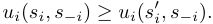

Intuitively, a dominant strategy for a player is the one that maximizes the player’s utility regardless of what strategies the other players chose. We recall the _Strategy-proof Mechanism_ definition in the following. 

_Definition 3 (Strategy-Proof Mechanism [22]):_ A mechanism is strategy-proof if it satisfies _Incentive-Compatibility_ ( **IC** ) and _Individual-Rationality_ ( **IR** ). 

Incentive-compatibility means truthfully revealing privacy information is the dominant strategy for each player, and individual-rationality requires that the player’s utility can not be less than the utility she can get when staying out of the mechanism. 

## IV. A COMBINATORIAL AUCTION FOR COOPERATIVE COMMUNICATION 

In this section, we discuss the detailed design of combinatorial auction for relay assignment in cooperative communication. We first present the relay assignment problem in the form of binary program, which is proved to be NPhard. To overcome the high time complexity, we design a computationally efficient combinatorial auction mechanism, namely SAIL, which achieves both strategy-proofness and approximate social welfare. Finally, we analyze the economic property and approximate ratio of SAIL. 

## _A. Formalization of Relay Assignment_ 

Based on the cooperative communication system model, we formulate the relay assignment procedure as a classic combinatorial optimization problem. The inputs of the problem are the relay requests and bids submitted by buyers, while the outcomes are the set of winning buyers and their assigned relay bundles. 

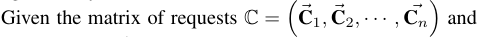

the bids vector⃗ **b** , the auctioneer makes decision on relay assignment with the objective of maximizing social welfare. The framework of relay node assignment can be described and clarified by a binary program. The variables in the program are x(si, Cij)∈{0, 1}, 1≤j≤K, 1≤i≤n. 

We denote x(si, Cij)=1ifthebuyersiwinstherelay bundle Cij, otherwise, x(si, C ij) = 0. Here we use bi, instead of vi, to calculate the social welfare. This is because the strategy-proofness (discussed in Section IV-C) guarantees that bi = vi is the dominate strategy for each buyer. We write the binary program as follows: _Objective:_ 

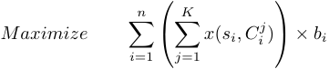

_Subject to:_ 

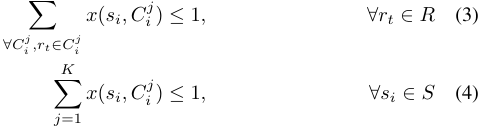

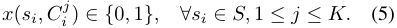

Here constraint (3) indicates the quantity limitation of relay nodes _i.e._ a relay node can only be assigned to one buyer. Constraint (4) depicts the condition that only one request can be granted to one buyer. 

We can find the optimal social welfare in small scale auction by solving the binary program. Unfortunately, it becomes computationally intractable when the number of buyers and the number of relays are large. We can prove that the binary program is NP-hard by reducing it to the _exact cover_ problem. The well-known VCG mechanism becomes useless when the optimal social welfare can not be achieved. In next section, we design a computationally efficient allocation algorithm, which achieves approximate social welfare. Combined with a novel payment scheme, we propose a strategy-proof combinatorial auction mechanism. 

## _B. Design of SAIL_ 

In general settings, it has been proved that there is no combinatorial auction that can simultaneously achieves strategy-proofness and approximate efficiency in polynomial time [23][24]. Our setting, actually, is a special case, in which each buyer has an uniform valuation over all her requests. This practical assumption in cooperative communication gives birth to the strategy-proof and approximate efficient auction mechanism with polynomial time complexity. 

SAIL is consisted of two main components: relay assignment and payment scheme. For convenience to introduce the rationale of SAIL, we define _bid diameter_ di as the largest size of requested bundle of the buyer si. 

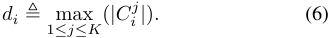

In relay assignment algorithm, we first sort buyers in nonincreasing order with the value of expression bi/√ di. The sorted list is denoted by G. To break the tie, we follow the 

383 

**Algorithm 1** : Relay Node Assignment Algorithm for <u>SAIL</u> 

**Input** : The source nodes set S, the relay nodes set R, The relay node requests matrix C and the bid vector⃗ **b** . **Output** : The set of winners Sw, the set of relay bundles allocated to the corresponding winners A. **1** Sw ← ∅; A ← ∅; **2 foreach** si ∈ S **do 3** di = 1≤maxj≤K(|C ij|); **4 end** <u>bi</u> **5** Sort the buyers in non-increasing order of ~~√~~ di: G : ~~√~~ <u>bd11</u>≥ ~~√~~ <u>bd22</u>≥· · · ≥ ~~√~~ <u>bdnn</u>; **6 foreach** si ∈ S **do 7** Sort requested relay bundles of the buyer si in non-decreasing order of bundle size i ���C j���: ��Ci1�� ≤ ��Ci2�� ≤· · · ≤ ��CiK ��; **8 for** j = 1, 2, · · · , K **do 9 if** Cij∩A = ∅**then** **10** Sw ← Sw ∪ si; **11** A ← A ∪ Cij; **12 break** ; **13 end 14 end 15 end 16 return** (Sw, A); 

lexicographic order of buyer ID, which is bid independent. Then we greedily check the buyers following the order in G. A buyer is selected as a winner if she has a relay bundle that does not conflict with any relay nodes that have been allocated to the previous winners. If multiple bundles are available for one buyer, we select the one with the smallest size. Intuitively, the smaller bundle leads to less conflict with the buyers behind her in list G. 

The pseudo-code of relay node assignment process is shown in Algorithm 1. The sorting step in line 5 is the most time consumption part, thus the time complexity of Algorithm 1 is O (n log(n)), where n is the number of buyers. 

Now we consider the payment scheme of SAIL. Specifically, the clearing prices of losers are zero and the payments of the winners are determined by their _critical prices_ , which are defined as follow. 

_Definition 4 (Critical Price):_ The critical price of the buyer si is the minimal value that she must bid for winning the auction, _i.e._ , if the buyer si bids higher than her critical price, she will win the auction, if she bids lower than that, she will lose the auction. 

The critical price of the winning buyer si can be found 

in the following steps. We first remove the buyer si from the auction. Then, we run Algorithm 1 with the input S−i, R, C−i,⃗ **b** −i , in which C−i,⃗ **b** −i represents the � � � � request matrix and bid vector excluding the bidding information of the buyer si. After executing the Algorithm 1, we can obtain the _critical buyer_ of si, denoted as cb(i). The critical buyer cb(i) is the first buyer in the ordered list G such that if we allocate the relay nodes to cb(i), buyer si will lose the auction. Finally, the critical price of buyer si can be calculated as: 

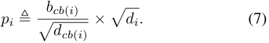

Note that the critical buyer of si may not exist, which happens when si does not conflict with any other buyers. We set pi = 0 in this case. From the discussion above, we can observe that the critical price is independent of buyers’ bids. Charging winners the critical prices guarantees the strategy-proofness property, which will be analyzed in the next section. 

## _C. Analysis of SAIL_ 

We first prove the strategy-proofness of SAIL. 

_Theorem 1:_ SAIL is a strategy-proof combinatorial auction mechanism for relay assignment in cooperative communication. 

_Proof:_ We prove that SAIL satisfies both _IncentiveCompatibility_ and _Individual-Rationality_ . We first show that truthfully revealing the private valuation on relay resource is the dominant strategy for each buyer. We distinguish the following two scenarios: 

- If the buyer si wins when bidding truthfully, _i.e._ , bi = vi, then obviously she can not improve her utility any more because her critical price is independent of her bid. 

- If the buyer si loses when bidding truthfully, her position in the ordered list G must be behind her critical buyer cb(i), thus we have ~~√~~ bcbdcb(i()i)≥ ~~√~~ <u>vdi</u> i.Obviously, buyer si still cannot win the auction by decreasing her bid. Therefore, we consider the case, in which buyer si wins the auction by increasing her bid to b′ i,_i.e._, b′ i≥vi.Theutilityofbuyersiwhenshecheatsonbid is 

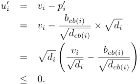

The utility becomes negative when buyer si deviates her bid from the truthful valuation. 

384 

In the above two cases, buyers can not increase their utilities by changing their bids, which satisfies the incentive compatibility property. 

Now we consider the utility of the winner si. 

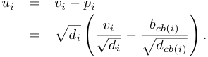

Since si is a winner, she must be placed in front of her critical buyer cb(i) in the list G, thus we have ui ≥ 0. For the loser, her utility is zero. Therefore, SAIL satisfies individual rationality. 

Since SAIL satisfies both **IC** and **IR** , according to definition 2, our claim holds. 

Before we analyze the approximate ratio for SAIL, we introduce the concept of _Maximum Eccentricity Ratio_ , denoted as eS, for set of buyers S. 

_Definition 5 (Maximum Eccentricity Ratio):_ The maximum eccentricity ratio for set of buyers S is the maximum ratio of the maximum size of requested relay bundles to the minimum size of requested relay bundles over all buyers, _i.e._ , 

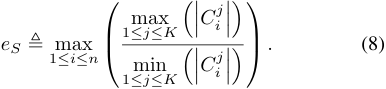

In the worst case, the maximum eccentricity ratio is the maximum size of relay bundle L, _i.e._ , eS ≤ L. 

Now we present the approximate ratio of SAIL. Let Sw∗denotethesetofwinnersinoptimalallocation.Let A∗ denote the set of relay node bundles allocated to the corresponding winners in Sw∗.Thesetofwinnersand corresponding set of relay bundles derived by Algorithm 1 is denoted as (Sw, A). For each si ∈ Sw, we also define Si∗ as the set of winners in Sw∗thatsatisfies: 

- 1) For any sj ∈ Si∗,sjeitherappearsbehindofsiinthe ordered list G or sj is just si itself, 

- 2) For any sj ∈ Si∗, her winning relay bundle A∗ jconflicts with the assigned relay bundle of si, _i.e._ , A∗ j∩Ai̸= ∅. 

- The approximate ratio of SAIL is implied by the following 

- lemma. 

_Lemma 1:_ For each si ∈ Sw, the sum of valuations from buyers in Si∗canbeboundedin 

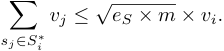

_Proof:_ Let si be any winner in Sw. For each sj ∈ Si∗, we have ~~√~~ bjdj≤ ~~√~~ <u>bdi</u> i.Sinceforanybuyer,wehavebi= vi guaranteed by the strategy-proofness property in Theorem 1. We can translate the former inequality to vj ≤ ~~√~~ <u>vdi</u> i �dj. Summing over all sj ∈ Si∗,weget 

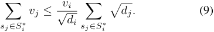

Applying the Cauchy-Schwarz inequality on � �dj, we sj ∈Si∗ can bound 

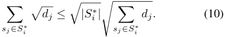

Since (Sw∗, A∗)isafeasibleallocation,foranytwowinners si, sj ∈ Sw∗, si ̸=sj,itholdsA i∗∩A∗ j=∅.Andforany sj ∈ Si∗,A∗ jintersectswithAiatleastonerelaynode.We can get that 

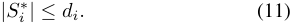

On the other hand, we have dj ≤ eS ��A∗j �� for all sj ∈ Si∗ according to the definition of eS. We can get � dj ≤ sj ∈Si∗ 

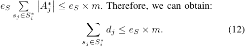

Applying (11) and (12), we further relax the inequality (10) to 

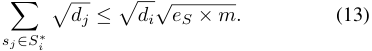

Integrating (9) and (13), we finally get for each si ∈ Sw, 

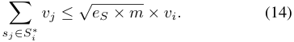

Now we give out the following theorem. _Theorem 2:_ The approximate ratio of SAIL is O (m), where m is the number of relay nodes. 

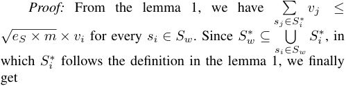

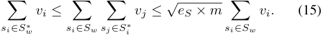

Since the upper bound of eS is L, the approximate ratio is O �√L × m ~~�~~ . 

In single-relay cooperative communication, buyers can request at most one relay, _i.e._ the maximum eccentricity ratio eS is equal to 1, and the approximate ratio is promoted to a better one O(√ <u>m).</u> The approximate ratio is analysed in the worst-case scenarios. The evaluation results, presented in the next section, indicate that SAIL approaches the optimal social welfare in average case. 

## V. EVALUATION RESULTS 

In this section, we evaluate the performance of SAIL and study the impact of diverse bidding language on system performance. 

385 

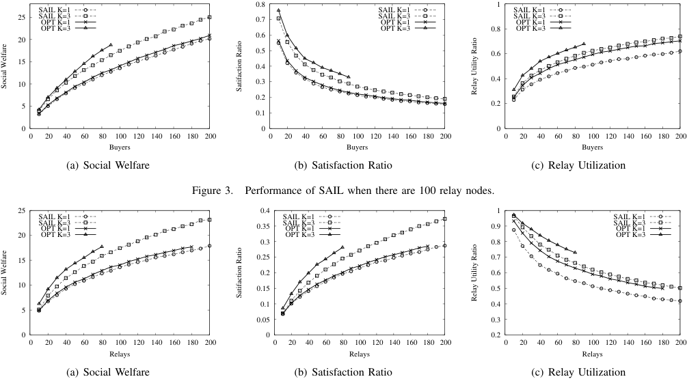

<!-- Start of picture text -->
 0.8  1 SAIL K=1 SAIL K=1 SAIL K=1  25 SAIL K=3OPT K=1  0.7 SAIL K=3OPT K=1 SAIL K=3OPT K=1 OPT K=3 OPT K=3  0.8 OPT K=3  0.6  20  0.5  0.6  15  0.4  10  0.3  0.4  0.2  5  0.2  0.1  0  0  0  0  20  40  60  80  100  120  140  160  180  200  0  20  40  60  80  100  120  140  160  180  200  0  20  40  60  80  100  120  140  160  180  200 Buyers Buyers Buyers (a) Social Welfare (b) Satisfaction Ratio (c) Relay Utilization Figure 3. Performance of SAIL when there are 100 relay nodes.  25  0.4  1 SAIL K=1 SAIL K=1 SAIL K=1 SAIL K=3OPT K=1  0.35 SAIL K=3OPT K=1  0.9 SAIL K=3OPT K=1  20 OPT K=3 OPT K=3 OPT K=3  0.3  0.8  15  0.25  0.7  0.2  0.6  10  0.15  0.5  0.1  0.4  5  0.05  0.3  0  0  0.2  0  20  40  60  80  100  120  140  160  180  200  0  20  40  60  80  100  120  140  160  180  200  0  20  40  60  80  100  120  140  160  180  200 Relays Relays Relays (a) Social Welfare (b) Satisfaction Ratio (c) Relay Utilization Social Welfare Satifaction Ratio Relay Utility Ratio Social Welfare Satifaction Ratio Relay Utility Ratio <!-- End of picture text -->

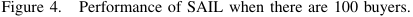

<!-- Start of picture text -->
Figure 4. Performance of SAIL when there are 100 buyers. <!-- End of picture text -->

## _A. Methodology_ 

We implement SAIL and evaluate its performance using network simulation. We also solve the binary program to get an optimal relay assignment in small scale auction. The optimal relay assignment is denoted by OPT. 

We evaluate SAIL in two different network scenarios. In the first case, the number of relays is fixed at 100 and the number of buyers varies from 10 to 200 with increment of 10. In the second case, we fix the number of buyers at 100 and vary the number of relays from 10 to 200 with increment of 10. We evaluate the performance of SAIL and OPT when buyers have different bidding languages. The maximum number of bundles that buyers can submit is set to 1 and 3. The valuations of buyers are randomly distributed over the interval (0, 1]. The size of relay bundle is a random number uniformly distributed over [1, 10]. These parameters in our simulation are similar to those used in [6]. All the results are averaged over 50 runs. 

We consider the following three performance metrics: 

- _Social Welfare:_ Social welfare is the sum of winners’ valuations on their assigned bundles of relay nodes. Social welfare is the maximum optimization objective in our auction mechanism. 

- _Satisfaction Ratio:_ Satisfactory ratio is the percentage of winners among all buyers. 

- _Relay Utilization Ratio:_ Relay utilization ratio is the percentage of assigned relay nodes among all relays. 

## _B. Performance of SAIL_ 

Figure 3 shows the evaluation results when there are 100 relay nodes and the number of buyers varies from 10 to 200 with increment of 10. We see that SAIL approaches OPT in all three metrics. SAIL achieves a near-optimum in terms of social welfare and buyer satisfactory ratio while there is a slightly larger difference in relay utilization ratio. This is partly because the relay assignment algorithm in SAIL always chooses the bundle with the smallest size when multiple bundles are available for a buyer. This result also indicates that SAIL will save more unnecessary relays when achieving a certain social welfare. We observe the impact of bidding language on system performance. The evaluation results show that both SAIL and OPT achieve a higher system performance when buyers can use diverse bidding language. The reason is that multi-minded buyers ( _i.e._ , K ≥ 2) have higher possibilities to obtain relay bundles than single-mined buyers ( _i.e._ , K = 1). In other words, the bidding diversity leads to more trades in an auction, which can improve the performances of an auction. Consequently, the diverse bidding language is an efficient strategy to improve the system performance. Figure 3 also shows that with the increasing number of buyers, the social welfare and relay utilization ratio increase, while the satisfaction ratio decreases. On one hand, the larger number of buyers leads to more intense competition on limited relay nodes, thus the satisfaction ratio decreases. On the other hand, SAIL can allocate relay nodes more efficiently among more buyers, hence the social welfare and relay utilization ratio increase. 

386 

Figure 4 shows the evaluation results when there are 100 buyers and the number of relay nodes varies from 10 to 200 with increment of 10. Again, SAIL draws near OPT in all three metrics whenever K = 1 or K = 3. We can also observe in Figure 4 that when the number of relay nodes increases, the social welfare and satisfaction ratio increase and the relay utilization ratio decreases. Larger supply of leasing relay nodes leads to more trades in the auction, thus the social welfare and satisfaction ratio increase. Since the number of buyer is fixed, the relay utilization ratio decreases when the number of relay nodes increases. 

To sum up, we can conclude that SAIL sacrifices limited system performance to guarantee strategy-proofness. Furthermore, SAIL with diverse bidding language performs better in all three metrics compared to SAIL with simple bidding language, which indicates that diverse bidding language is really an efficient tool to improve the system performance. 

## VI. CONCLUSIONS 

In this paper, we have studied the relay assignment problem in cooperative communication. We have jointly considered the relay assignment and payment scheme. Since achieving an optimal social welfare requires to solve a NP-hard problem, we present SAIL, which is a strategyproof and approximately efficient combinatorial auction mechanism with diverse bidding language. Powerful bidding language allows buyers to express their diverse relay requirements. Our analysis has shown that SAIL satisfies strategy-proofness and achieves a good approximate social welfare. Our simulation results verify our analysis and show that diverse bidding language can significantly improve the system performance in terms of social welfare, buyer satisfaction ratio and relay utilization. 

For future works, Designing an auction mechanism to avoid cheating behaviour on relay bundles is an interesting research direction. It is also interested to design a privacy preserving auction, considering the privacy of relay nodes. 

## REFERENCES 

- [1] Q. Zhang, J. Jia, and J. Zhang, “Cooperative relay to improve diversity in cognitive radio networks,” _IEEE, Communications Magazine_ , vol. 47, no. 2, pp. 111– 117, 2009. 

- [2] J. N. Laneman, D. N. Tse, and G. W. Wornell, “Cooperative diversity in wireless networks: Efficient protocols and outage behavior,” _IEEE Transactions on Information Theory_ , vol. 50, no. 12, pp. 3062–3080, 2004. 

- [3] D. Yang, X. Fang, and G. Xue, “Truthful auction for cooperative communications,” in _Mobihoc_ , 2011. 

- [4] S. Kadloor and R. Adve, “Optimal relay assignment and power allocation in selection based cooperative cellular networks,” in _ICC_ , 2009. 

- [5] D. Yang, X. Fang, and G. Xue, “Hera: An optimal relay assignment scheme for cooperative networks,” _IEEE_ 

_Journal on Selected Areas in Communications_ , vol. 30, no. 2, pp. 245–253, 2012. 

- [6] ——, “Truthful auction for cooperative communications with revenue maximization,” in _ICC_ , 2012. 

- [7] Y. Wang, Y. Li, X. Yang, C. Liao, and Q. Chen, “Double auction-based optimal relay assignment for manyto-many cooperative wireless networks,” in _GLOBECOM_ , 2012. 

- [8] J. Huang, Z. Han, M. Chiang, and H. V. Poor, “Auctionbased resource allocation for cooperative communications,” _IEEE Journal on Selected Areas in Communications_ , vol. 26, no. 7, pp. 1226–1237, 2008. 

- [9] Y. Shi, S. Sharma, Y. T. Hou, and S. Kompella, “Optimal relay assignment for cooperative communications,” in _Mobihoc_ , 2008. 

- [10] V. Krishna, _Auction theory_ . Academic press, 2009. [11] S. Zhang and V. K. N. Lau, “Design and analysis of multi-relay selection for cooperative spatial multiplexing,” in _ICC_ , 2008. 

- [12] S. Sharma, Y. Shi, Y. Hou, H. Sherali, and S. Kompella, “Cooperative communications in multi-hop wireless networks: Joint flow routing and relay node assignment,” in _INFOCOM_ , 2010. 

- [13] Y. Zhao, R. Adve, and T. J. Lim, “Improving amplifyand-forward relay networks: optimal power allocation versus selection,” _IEEE Transactions on Wireless Communications_ , vol. 6, no. 8, pp. 3114–3123, 2007. 

- [14] H. Yao and S. Zhong, “Towards cheat-proof cooperative relay for cognitive radio networks,” in _Mobihoc_ , 2011. 

- [15] W. Li, X. Cheng, T. Jing, and X. Xing, “Cooperative multi-hop relaying via network formation games in cognitive radio networks,” in _INFOCOM_ , 2013. 

- [16] T. Jing, S. Zhu, H. Li, X. Cheng, and Y. Huo, “Cooperative relay selection in cognitive radio networks,” in _INFOCOM Mini-Conference_ , 2013. 

- [17] M. Babaioff, R. Lavi, and E. Pavlov, “Mechanism design for single-value domains,” in _AAAI_ , 2005. 

- [18] A. Archer and E. Tardos, “Truthful mechanisms for one-parameter agents,” in _FOCS_ , 2001. 

- [19] M. Babaioff, R. Lavi, and E. Pavlov, “Single-value combinatorial auctions and implementation in undominated strategies,” in _SODA_ , 2006. 

- [20] M. J. Osborne and A. Rubenstein, _A Course in Game Theory_ . MIT Press, 1994. 

- [21] D. Fudenberg and J. Tirole, _Game Theory_ . MIT Press, 1991. 

- [22] A. Mas-Colell, M. D. Whinston, and J. R. Green, _Microeconomic Theory_ . Oxford Press, 1995. 

- [23] D. Lehmann, L. I. O´callaghan, and Y. Shoham, “Truth revelation in approximately efficient combinatorial auctions,” _Journal of the ACM_ , vol. 49, no. 5, pp. 577–602, 2002. 

- [24] S. Dobzinski, “An impossibility result for truthful combinatorial auctions with submodular valuations,” in _STOC_ , 2011. 

387 

