# **Learning From Your Neighbours: Mobility-Driven Device-Edge-Cloud Federated Learning** 

|Songli Zhang|Zhenzhe Zheng|Fan Wu|
|---|---|---|
|Shanghai Jiao Tong University|Shanghai Jiao Tong University|Shanghai Jiao Tong University|
|Shanghai, China|Shanghai, China|Shanghai, China|
|zhang_sl@sjtu.edu.cn|zhengzhenzhe@sjtu.edu.cn|fwu@cs.sjtu.edu.cn|
|Bingshuai Li|Yunfeng Shao|Guihai Chen|
|Huawei Noah’s Ark Lab|Huawei Noah’s Ark Lab|Shanghai Jiao Tong University|
|Shanghai, China|Beijing, China|Shanghai, China|
|libingshuai@huawei.com|shaoyunfeng@huawei.com|gchen@cs.sjtu.edu.cn|

## **ABSTRACT** 

Federated learning (FL) in large-scale wireless networks is implemented in a hierarchical way by introducing edge servers as relays between the cloud server and devices, where devices are dispersed within multiple clusters coordinated by edges. However, the devices are usually mobile users with unpredictable mobile trajectories, whose effects on the model training process are still less studied. In this work, we propose a new <u>MobIlity-Driven feDerated LEarning</u> framework, namely MIDDLE in wireless networks, which can relieve unbalanced and biased model updates by leveraging the new model aggregation opportunities on mobile devices due to their mobility across edges. Specifically, mobile devices can have different models while traversing across edges, and adequately aggregate these models on the device. By theoretical analysis, we can show that this on-device model aggregation can reduce the bias of model updating on edges and cloud, and then accelerate the convergence of model training in FL. Then, we define a model similarity utility to measure the difference in gradient updates among various models, which guides the adaptive on-device model aggregation and inedge device selection to facilitate the comprehensive information sharing between edges. Extensive experiment results validate that MIDDLE can achieve 1 _._ 51 × −6 _._ 85× speedup on the model training, compared with the state-of-the-art model training approaches in hierarchical FL. 

## **CCS CONCEPTS** 

• **Human-centered computing** → **Mobile devices** ; • **Computing methodologies** → Machine learning. 

## **KEYWORDS** 

Federated Learning, Device-Edge-Cloud Cooperation, Device Mobility. 

Permission to make digital or hard copies of all or part of this work for personal or classroom use is granted without fee provided that copies are not made or distributed for profit or commercial advantage and that copies bear this notice and the full citation on the first page. Copyrights for components of this work owned by others than the author(s) must be honored. Abstracting with credit is permitted. To copy otherwise, or republish, to post on servers or to redistribute to lists, requires prior specific permission and/or a fee. Request permissions from permissions@acm.org. _ICPP 2023, August 07–10, 2023, Salt Lake City, UT, USA_ 

© 2023 Copyright held by the owner/author(s). Publication rights licensed to ACM. ACM ISBN 979-8-4007-0843-5/23/08...$15.00 https://doi.org/10.1145/3605573.3605643 

### **ACM Reference Format:** 

Songli Zhang, Zhenzhe Zheng, Fan Wu, Bingshuai Li, Yunfeng Shao, and Guihai Chen. 2023. Learning From Your Neighbours: Mobility-Driven DeviceEdge-Cloud Federated Learning. In _52nd International Conference on Parallel Processing (ICPP 2023), August 07–10, 2023, Salt Lake City, UT, USA._ ACM, New York, NY, USA, 10 pages. https://doi.org/10.1145/3605573.3605643 

## **1 INTRODUCTION** 

Federated learning (FL) is an emerging privacy-preserving distributed machine learning paradigm [11]. Classical FL algorithms, _e.g._ FedAvg [23], require devices to perform multiple local training rounds before uploading local models, but the non-independent identical (Non-IID) data across devices can cause gradient drift [21], resulting in the slow convergence of model training. To overcome this drawback, hierarchical federated learning (HFL) [1, 2] is introduced in large-scale wireless networks, which leverages edge servers ( _e.g._ , base stations, routers, and switches) as relays between the cloud and devices, and divides the devices into multiple clusters. Multiple edges can frequently aggregate the local models from devices within the associated cluster in a parallel way, and then to relieve gradient drift and also promote communication efficiency [19, 33]. 

However, HFL still cannot fully escape the curse of Non-IID data distribution within the classical FL. Specifically, the edge model1 is subject to the data distributions within the edge, which could still be biased from the global distribution, and guide mobile devices to update their local models in a gradient descent direction deviating from the global one [22]. We emphasize that devices in FL are geographically distributed and can move across edges [32], which can be leveraged as a new opportunity to solve the notorious problem of Non-IID data distribution. The natural idea is that edge servers can filter the beneficial data samples from incoming mobile devices to assist in training their edge models. The more profound discovery is that each edge can also use mobile devices as relays to learn complementary information from the other edge models, which is different from the traditional model aggregation in the cloud server. However, it is challenging for the edge to screen valuable data samples and complementary information from the devices with unpredictable mobility patterns, which leads to the 

> 1The term edge model, local model, and global model refer to the model on edge, device, and cloud, respectively. Edges distribute edge models to the coordinated devices for their local model training, and submit edge models to the cloud for model aggregation, forming the global model. 

462 

ICPP 2023, August 07–10, 2023, Salt Lake City, UT, USA 

Songli Zhang et al. 

dynamic devices accessing the edges, instead of the static device sets as in classical FL[4, 30]. 

In this work, we attempt to exploit device mobility on FL model training to resolve Non-IID data distributions across devices and edges, and then enhance model convergence speed in device-edgecloud FL. Achieving this goal needs to overcome the following two major challenges. The first and basic challenge comes from dynamic candidate devices within edges, directly brought by the unpredictable devices’ mobility patterns. Appropriate device selection strategies in FL have been proven effective in dealing with the problems of Non-IID data distribution and stragglers [29], and the classical device selection approaches usually depend on the historical training performance of devices, such as training loss and testing accuracy[4, 30]. However, the arbitrary mobility patterns can lead to a dynamic and unpredictable candidate device set for each edge to select, and the edge lacks historical information about the training performance of the newly entered devices. Furthermore, mobile devices experience various model training processes within different edges, and thus the historical training performance could not be directly used for the current edge to select devices. 

The other thorny challenge is that the edge should reduce the impact of the low-quality models introduced by the newly entered devices when leveraging the mobile devices as a new opportunity for model aggregation. Although the edge can learn the complementary information from local models brought by newly entered devices, which is inherited within the previous edge models, these local models are not all beneficial. On the one hand, each device participates in training intermittently due to the device selection in FL, resulting in the stale local models on some devices. On the other hand, the Non-IID data distribution across edges leads to some edge models being updated in a more biased way from the global [17]. Introducing these local models with low quality into the edge can result in large gradient drift, which makes the edge model and then the global model hard to converge [26]. 

In this work, jointly considering the above two challenges, we propose <u>MobIlity-Driven feDerated LEarning framework, namely</u> MIDDLE, to improve the training efficiency of the global model in FL. The key idea behind MIDDLE is to exploit the devices’ mobility to mitigate the bias updates of edge models with respect to the direction of the global model. First, we analyze the limitations of the current FL approaches through illustrated experiments, and motivate the potential opportunities for exploiting the mobility of devices. MIDDLE contains two components, including on-device model aggregation and in-edge device selection. Then, we define a similarity utility metric to quantify the divergence of the gradient descent directions between two models. For on-device model aggregation, the mobile device aggregates its carried local model from the previous edge and the current edge model with the weights, which are the similarly utility between these two models. In this way, the mobile device can provide complementary information and promote information exchange across edges by adjusting its local model aggregation. The aggregated local model is then considered as the new starting point of the device’s local training. For in-edge device selection, each edge calculates the similarity utility of each local model within the edge to the global model, which is then used as a principle for device selection to fully exploit the dynamic data samples within edges for optimizing the global model training. 

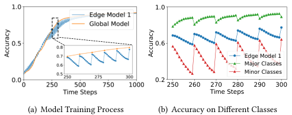

<!-- Start of picture text -->
1.0 0.6 Edge Model 1 Major Classes Minor Classes 0.2 250 260 270 280 290 300 Time Steps (a) Model Training Process (b) Accuracy on Different Classes Accuracy <!-- End of picture text -->

**Figure 1: The Non-IID data across edges makes the edge models insufficiently learn the minor classes, hindering the convergence of the global model.** 

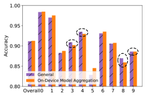

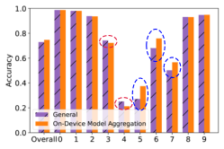

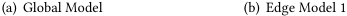

<!-- Start of picture text -->
(a) Global Model (b) Edge Model 1 <!-- End of picture text -->

**Figure 2: Model accuracy comparison between whether to perform on-device model aggregation.** 

We summarize our key contributions in this work as follows: 

- We explore the impact of devices’ mobility on the performance of model training in FL, and propose MIDDLE to leverage the devices’ mobility to overcome the notorious problem of Non-IID data distribution, and then accelerate the model convergence. 

- We define the similarity utility metric to describe the differences between various models, and promote information exchanging across edges by on-device model aggregation and in-edge device selection in MIDDLE. 

- For on-device model aggregation, we provide the theoretical analysis of model convergence bound to show the mobility of devices can correct the bias of the local model training process, which can accelerate the model convergence. 

- The extensive data-driven simulations with various learning tasks show that MIDDLE can effectively reduce the time steps to a target accuracy, which outperforms all competitive baselines by 1 _._ 51 × −6 _._ 85× in terms of model convergence speed, and improve the model accuracy. 

## **2 MOTIVATION** 

In this section, we conduct some simple experiments to demonstrate our goal of leveraging devices’ mobility to accelerate HFL convergence, aiming to answer the following two questions: 

**Question 1:** In HFL, how does Non-IID data distribution across edges hinder the convergence of global model? 

**Question 2:** When devices move across edges, what is the impact of on-device model aggregation on the convergence of global model? 

To answer Question 1, we simulate a three-layer HFL with two edges: edge 1 and edge 2, and 50 devices, to train a CNN on MNIST data set with a learning rate of 0.001. The training data is divided 

463 

Learning From Your Neighbours: 

Mobility-Driven Device-Edge-Cloud Federated Learning 

ICPP 2023, August 07–10, 2023, Salt Lake City, UT, USA 

skew across devices and edges in an unbalanced manner. There are 70% of training data labeled as {0 _,_ 1 _,_ 2 _,_ 3 _,_ 4} (major classes) and 30% of data labeled as {5 _,_ 6 _,_ 7 _,_ 8 _,_ 9} (minor classes) in edge 1, while the data distribution is opposite in edge 2. The devices perform 10 local SGD in each time step, and update local models to aggregate on the corresponding edge to form the edge model. Then all edge models are aggregated on the cloud to obtain the global model every 10 time steps. 

**Response to Question 1:** As shown in Figure 1(a), although the average accuracy of the global model is steadily improving during the training process, the accuracy of edge model 1 could decrease. In Figure 1(b), we further analyze the accuracy of edge model 1 on the major classes and minor classes. For the major classes, the edge 1 contains more training samples, and the accuracy on the major classes gradually improves. However, since there are fewer data on minor classes in edge 1, the accuracy on minor classes decreases. The Non-IID data across edges leads to edge models updated towards different directions, eventually hindering the convergence of the global model. Furthermore, when the device moves across edges, each edge model will be updated towards different directions according to the associated dynamic data distribution. 

To answer Question 2, we conduct a set of similar experiments as Question 1, but each device is assigned the samples of only one class. The training data of two edges are associated with the devices with labels {0 _,_ 1 _,_ 2 _,_ 3 _,_ 4} and {5 _,_ 6 _,_ 7 _,_ 8 _,_ 9}, respectively. Then, the mobile devices with labels {3 _,_ 4} move from edge 1 to edge 2, and the devices with labels {8 _,_ 9} move from edge 2 to edge 1, _i.e._ , the training data within two edges are changed to {0 _,_ 1 _,_ 2 _,_ 8 _,_ 9} and {5 _,_ 6 _,_ 7 _,_ 3 _,_ 4}, respectively. Two methods are conducted to compare: 1) “General”: the device downloads the edge model from the associated edge, and directly uses the newly downloaded edge model as the starting point of local training; 2) “On-Device Model Aggregation (A Case)”: each moved device simply averages the newly downloaded edge model and its own local model for local training. These two methods then continue training for several steps, and aggregate all local models as the cloud model. Finally, the test accuracy of the cloud model and the edge model 1 is presented for the overall classes and also for each class, in Figure 2. 

**Response to Question 2:** When evaluating the overall model accuracy across all classes, the “On-Device Model Aggregation” shows slight improvements in both the cloud model and edge model 1. However, when examining the accuracy of each individual class of the global model, “On-Device Model Aggregation” performs lower than “General” on several classes (marked with black circles), which is consistent with the exchanged classes {3 _,_ 4 _,_ 8 _,_ 9}. For the edge model 1 in Figure 2(b), “On-Device Model Aggregation” achieves higher accuracy on classes {5 _,_ 6 _,_ 7} (marked with blue circles), while experiencing lower accuracy on classes {3 _,_ 4} (marked with red circles), compared with the “General”. It is worth noting that in “On-Device Model Aggregation”, the moved device does not directly adopt the directly downloaded edge model when initializing its starting point of local update, but retains part of the local model inherited from edge 2. Edge 2 is initialized with data samples of class {5 _,_ 6 _,_ 7 _,_ 8 _,_ 9}, and the inherited local models on moved devices can bring the feature of classes {5 _,_ 6 _,_ 7}, which is the complementary information for edge 1. Thus, “On-Device Model Aggregation” has a significant improvement on classes {5 _,_ 6 _,_ 7}. However, there is a 

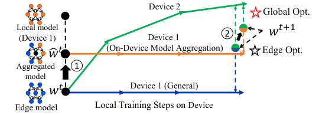

<!-- Start of picture text -->
Device 2 Global Opt. Local model (Device 1) Device 1  2 � �+1 � � (On-Device Model Aggregation) Edge Opt. Aggregated 1 model � � Device 1 (General) Edge model Local Training Steps on Device <!-- End of picture text -->

**Figure 3: Illustration of the edge model parameter space, the device 1 performs on-device model aggregation, resulting in the change of the local training starting point and further the aggregated edge model.** 

slight drop on classes {3 _,_ 4} in Figure 2(b), since “On-Device Model Aggregation” do not directly use a fully trained edge model 1 on classes {3 _,_ 4} as the starting point of training. 

We further analyze the impact of “General” and “On-Device Model Aggregation” on the FL training by showing the parameter space of edge models in Figure 3. Supposing devices 1 and 2 participate in model training at the current edge, where device 1 is newly entering. The solid line indicates the device’s local gradient update direction. 

**General:** Under the classical HFL setting [1, 2], devices directly download the edge model _𝑤__𝑡_ from the currently associated edge, and then perform multiple local SGD starting from the downloaded edge model, which is optimized towards their local optima. The new edge model is the average of the updated local models from device 1 and device 2, which is still approximately optimized towards the edge optimum but may also deviate from the global optimum. 

**On-Device Model Aggregation:** Device 1 aggregates the local model and the edge model, and uses this aggregated model _𝑤_ ˆ_𝑡_ as the starting point for local model updating. The change of the starting point directly affects its local updating, which further leads to the change of the aggregated edge models and the cloud model. Due to the Non-IID data distributions across edges, the local model of the newly entering device 1, which is inherited from the previous edge, may contain the complementary information for the current edge. Although the aggregated edge model deviates from the edge optimum, it may be closer to the global optimum when introducing the complementary information from other edges, accelerating the convergence of global model. 

## **3 PRELIMINARIES** 

In this section, we first discuss the background of general FL. Then, we introduce the device-edge-cloud HFL, emphasizing the devices’ mobility in wireless networks. 

## **3.1 Federated Learning** 

In general FL, one cloud server and multiple devices coordinately train a global cloud model for some learning task, such as image classification and speech recognition in IoT applications [17]. The model training process of FL is performed by a set of _𝑀_ mobile devices M over a series of time steps, denoted by T = {1 _, ..,𝑡, ...,𝑇_ }. Each device _𝑚_ ∈ M trains the local model based on its local data samples by running _𝐼_ local updates: 

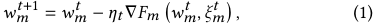

464 

ICPP 2023, August 07–10, 2023, Salt Lake City, UT, USA 

Songli Zhang et al. 

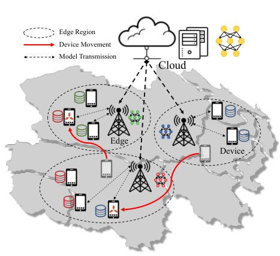

<!-- Start of picture text -->
Edge Region Device Movement Model Transmission Cloud Edge Device <!-- End of picture text -->

**Figure 4: Device-edge-cloud Hierarchical Federated Learning** 

where _𝑤𝑚__𝑡_ is the local model of the device _𝑚_ at time step _𝑡_ , _𝐹𝑚_ (·) is the loss function, _𝜉𝑚__𝑡_ is the randomly selected data samples at time step _𝑡_ , and _𝜂𝑡_ is the learning rate. Let _𝑑𝑚_ be the number of data samples on device _𝑚_ . Considering that full device participation is impossible in practice, the cloud server often selects a subset of devices _𝑆_ (M) ∈ M with the size _𝐾_ at each time step for local training. The goal of the cloud server is to solve the following optimization problem: 

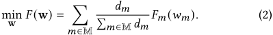

All devices follow the two basic principles during the training process: 1) each device _𝑚_ ∈ M always connects to the nearest edge due to the consideration of communication quality: 

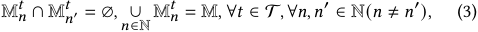

2) any device _𝑚_ ∈ M _𝑛__𝑡_ can complete the entire one-round model training process in time step _𝑡_ , which involves downloading the current edge model, performing local model training and uploading the local model. 

We note that our solution is orthogonal to the classic mobility models [16] or mobile trajectory prediction algorithms [27], since we do not need a whole mobile trajectory. 

**The Edges:** At each time step _𝑡_ , each edge _𝑛_ ∈ N selects a subset of devices _𝑆_ (M _𝑛__𝑡_ ) of the size _𝐾_ based on the current available device set M _𝑛__𝑡_ to participate in the model training. The edge _𝑛_ distributes the edge model _𝑤𝑛__𝑡_ to each device _𝑚_ ∈ _𝑆_ (M _𝑛__𝑡_ ), receives the updated local model _𝑤𝑚__𝑡_+1 from all the selected devices, and aggregate the edge model _𝑤𝑛__𝑡_+1 for the next time step. After every _𝑇𝑐_ time steps, the edge communicates with the cloud server. 

**The Cloud Server:** After all edges uploading the edge models, the cloud server aggregates these edge models to obtain the cloud model _𝑤𝑐__𝑡_+1 . Similar to the vanilla FL, the cloud server aims to obtain the optimal cloud model _𝑤𝑐_∗ by solving the following optimization problem: 

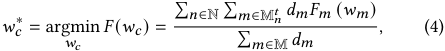

which is the extension of Eq. (2) based on the hierarchical architecture. In this work, we expect to accelerate the convergence of the FL training process with the help of the devices’ mobility. 

## **4 DESIGN OF MIDDLE** 

## **3.2 Device Mobility in Federated Learning** 

In contrast with the vanilla cloud-based FL, device-edge-cloud HFL introduces multiple edges between the cloud server and devices, forming a three-layer FL framework, as illustrated in Figure 4. First, for the bottom device layer, mobile devices are dispersed into different edge regions, and can move across edges. For the middle edge layer, each edge is connected to a wide variety of devices via wireless networks, and to the remote cloud server via wide area networks. Each edge dynamically selects a subset of devices within the edge region to participate in each round of FL model training. The data samples of devices are Non-IID across edges, resulting in different edge models. For the top cloud layer, the cloud server periodically aggregates all edge models to get the global model. In the following discussion, we mainly illustrate the differences between HFL with mobile devices and the vanilla FL. 

**Mobile Devices:** Let N be the set of all edges, and the devices connected to the edge _𝑛_ ∈ N in the time step _𝑡_ form a set M _𝑛__𝑡_ . Each device _𝑚_ ∈ M updates the local model _𝑤𝑚__𝑡_ to _𝑤𝑚__𝑡_+1 based on local data samples according to Eq. (1). 

The device can move geographically between two sequential time steps _𝑡_ −1 and _𝑡_ , and the edges only focus on the newly coming devices from the other edges. Let _𝑃𝑚_ be the probability of the device _𝑚_ to move across edges, and global mobility probability _𝑃_ is defined as the average of _𝑃𝑚_ . 

In this section, we introduce the design of MIDDLE in a top-down manner. We first provide a description of its top-level architecture, and then show the two underlying components: on-device model aggregation and in-edge device selection in details. In on-device model aggregation, we also define the similarity utility metric. 

## **4.1 Overview of MIDDLE** 

The key idea of mobile-driven FL is to leverage the devices’ mobility to accelerate the convergence of FL model training, where edges and devices alternately update edge models and local models on devices in each time step _𝑡_ . 

We describe the detailed procedure of the training process within a single time step in Algorithm 1. At the beginning of each time step _𝑡_ , each edge _𝑛_ ∈ N selects a subset of devices _𝑆_ (M _𝑛__𝑡_ ) of size _𝐾_ to participate in its edge model training (Line 2). Each edge should select the devices which can promote the edge model updating closer to the global optimum rather than its edge optimum. We describe the detailed procedure of in-edge device selection in Sub-Section 4.3. Each device _𝑚_ ∈ M _𝑛__𝑡_ downloads the edge model _𝑤𝑛__𝑡_ , and updates this model to a new initial local model _𝑤_ ˆ _𝑚__𝑡_ by jointly considering the current edge model and the previous ones (Line 5). We leverage the on-device model aggregation by the incoming devices to learning the “knowledge” from the previous edges, which will be discussed in Sub-Section 4.2 in details. With this new initialized 

465 

Learning From Your Neighbours: Mobility-Driven Device-Edge-Cloud Federated Learning 

ICPP 2023, August 07–10, 2023, Salt Lake City, UT, USA 

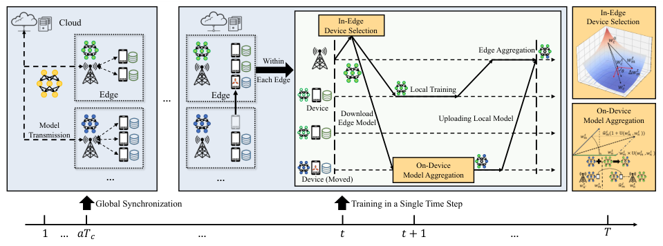

<!-- Start of picture text -->
In-Edge Cloud In-Edge Device Selection Device Selection Edge Aggregation Within Each Edge Edge … Edge Local Training Device Download  On-Device Model Edge Model Uploading Local Model Model Aggregation Transmission On-Device … …  Device (Moved) Model Aggregation Global Synchronization Training in a Single Time Step 1 … ��� … � �+ 1 … � <!-- End of picture text -->

**Figure 5: MIDDLE Framework** 

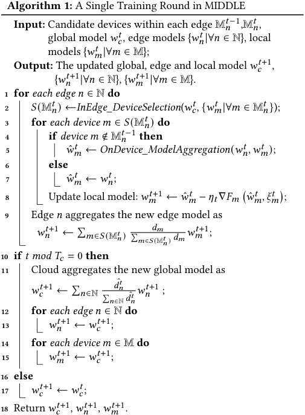

<!-- Start of picture text -->
Algorithm 1:  A Single Training Round in MIDDLE Input:  Candidate devices within each edge M 𝑛 𝑡 −1 ,M 𝑛 𝑡 , global model  𝑤𝑐 𝑡 , edge models { 𝑤𝑛 𝑡 |∀ 𝑛 ∈ N}, local models { 𝑤𝑚 𝑡 |∀ 𝑚 ∈ M}; Output:  The updated global, edge and local model  𝑤𝑐 𝑡 +1 , { 𝑤𝑛 𝑡 +1 |∀ 𝑛 ∈ N}, { 𝑤𝑚 𝑡 +1|∀ 𝑚 ∈ M}. 1 for  each edge 𝑛 ∈ N  do 2 𝑆 (M 𝑛 𝑡 ) ← InEdge_DeviceSelection ( 𝑤𝑐 𝑡 ,  { 𝑤𝑚 𝑡 |∀ 𝑚 ∈ M 𝑛 𝑡 }); 3 for  each device 𝑚 ∈ 𝑆 (M 𝑛 𝑡 ) do 4 if device 𝑚 ∉ M 𝑛 𝑡 −1 then 5 𝑤 ˆ 𝑚 𝑡 ← OnDevice_ModelAggregation ( 𝑤𝑛 𝑡 ,𝑤𝑚 𝑡 ); 6 else 7 𝑤 ˆ 𝑚 𝑡 ← 𝑤𝑛 𝑡 ; 8 Update local model:  𝑤𝑚 𝑡 +1 ← 𝑤 ˆ 𝑚 𝑡 − 𝜂𝑡 ∇ 𝐹𝑚 � 𝑤 ˆ 𝑡𝑚, 𝜉𝑡𝑚 �; 9 Edge  𝑛 aggregates the new edge model as 𝑤𝑛 𝑡 +1 ← � 𝑚 ∈ 𝑆 (M 𝑛 𝑡 ) � 𝑚 ∈ 𝑆𝑑 ( 𝑚 M 𝑛 𝑡 ) 𝑑𝑚 𝑤 𝑚 𝑡 +1; 10 if  𝑡𝑚𝑜𝑑𝑇𝑐 = 0  then 11 Cloud aggregates the new global model as 𝑑 ˆ 𝑛𝑡 𝑤𝑐 𝑡 +1 ← � 𝑛 ∈N � 𝑛 ∈N 𝑑 ˆ 𝑛 𝑡 𝑤𝑛 𝑡 +1 ; 12 for  each edge 𝑛 ∈ N  do 13 𝑤𝑛 𝑡 +1 ← 𝑤𝑐 𝑡 +1 ; 14 for  each device 𝑚 ∈ M  do 15 𝑤𝑚 𝑡 +1 ← 𝑤𝑐 𝑡 +1 ; 16 else 17 𝑤𝑐 𝑡 +1 ← 𝑤𝑐 𝑡 ; 18 Return  𝑤𝑐 𝑡 +1 ,  𝑤𝑛 𝑡 +1 ,  𝑤𝑚 𝑡 +1. <!-- End of picture text -->

local model _𝑤_ ˆ _𝑚__𝑡_ , each participating device _𝑚_ ∈ _𝑆_ (M _𝑛__𝑡_ ) performs _𝐼_ local updates based on its local data samples to obtain the new local model _𝑤𝑚__𝑡_+1, and uploads the new local model to edge_𝑛_(Line 8): 

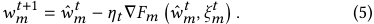

After receiving local models from all the selected devices _𝑚_ ∈ _𝑆_ (M _𝑛__𝑡_ ), the edge _𝑛_ aggregates these local models using the weight 

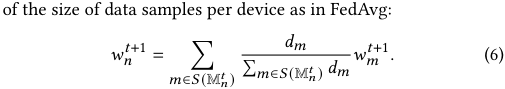

After every _𝑇𝑐_ time steps, _i.e._ , _𝑡𝑚𝑜𝑑𝑇𝑐_ = 0, all edges upload the new edge models to the cloud server (Lines 11). The cloud server aggregates these edge models to a new global model _𝑤𝑐__𝑡_+1 : 

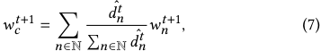

where the weight of each edge model _𝑑_ˆ _𝑛__𝑡_ is the number of data samples on devices participating in the training process of edge _𝑛_ , and _𝑑_ˆ _𝑛__𝑡_ =�_𝑡_ _𝑡_′′= =_𝑡_ _𝑡_ − _𝑇𝑐_ � _𝑚_ ∈ _𝑆_ (M _𝑛__𝑡_′)_𝑑𝑚_. Then, the cloud distributes_𝑤_ _𝑐__𝑡_+1 to edges and devices to update the edge models and local models. Finally, the cloud, edges, and devices repeat the above procedure until the preset number of time steps is reached. 

Figure 5 also summarizes the MIDDLE framework over the entire training process, and the process of “on-device aggeration” and “in-edge device selection” are shown on the right. The cloud communicates with edges to perform global synchronization every _𝑇𝑐_ time steps. In each single time step, each edge performs in-edge device selection and distributes its edge model to each device. Then, the moved device performs on-device model aggregation, which aggregates the downloaded edge model with its local model to a new initial local model _𝑤_ ˆ _𝑚__𝑡_ as the starting point of its local training. 

## **4.2 On-Device Model Aggregation** 

To efficiently utilize the various “knowledge” in different edge models, we propose on-device model aggregation to relieve the unbalanced updates to accelerate the convergence of the global model in FL. In traditional multi-level FL, “knowledge” sharing across edges relies on model aggregation on the cloud. However, the incoming devices bring their own local models inherited from the previous edges, which may contain the “knowledge” missing from the current edge model due to the biased update of the model caused by the Non-IID data distribution across edges. The current edge desires this complementary “knowledge” to reduce the biased updating of the edge model for accelerating the convergence of global model 

466 

ICPP 2023, August 07–10, 2023, Salt Lake City, UT, USA 

Songli Zhang et al. 

training. For a mobile device _𝑚_ , by aggregating the edge model _𝑤𝑛__𝑡_ from the current edge and the local model _𝑤𝑚__𝑡_ inherited from the previous edges, we expect to introduce complementary knowledge to the current edge model training process. However, the local model _𝑤𝑚__𝑡_ could be stale due to the device participating in model training aperiodically in FL. Furthermore, the inherited local model _𝑤𝑚__𝑡_ could vary greatly in the gradient descent direction due to the Non-IID data distribution across edges. Thus, simply aggregating the models, which are stale or with large differences, will introduce additional noise into the current edge model training, making the FL model training difficult to converge[26]. 

With the above consideration, we adopt the cosine similarity between the local model _𝑤𝑚__𝑡_ and the current edge model _𝑤𝑛__𝑡_ to measure the utility of gradient updates from different parameter models [10, 35]. Then, we define the similarity utility _𝑈_ (·), and _𝑈_� _𝑤𝑚__𝑡_ _,𝑤𝑛__𝑡_ � is the similarity utility between the previous local model _𝑤𝑚__𝑡_ and the edge model _𝑤𝑛__𝑡_ : 

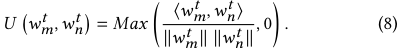

The similarity utility is set to zero when the cosine similarity score is lower than 0 to avoid blind aggregation introducing noise. Then, when device _𝑚_ moves across the edges and participates in the current edge training process, device _𝑚_ calculates the similarity utility _𝑈_� _𝑤𝑚__𝑡_ _,𝑤𝑛__𝑡_ � between the previous local model _𝑤𝑡𝑚_ and the downloaded edge model _𝑤𝑛__𝑡_ , uses it as the weight of the model aggregation on device, and gets a new initial local model _𝑤_ ˆ _𝑚__𝑡_ : 

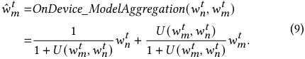

In this way, the new initial local model _𝑤_ ˆ _𝑚__𝑡_ is still dominated by the current edge model, but also introducing the complementary knowledge of other edge models. 

## **4.3 In-Edge Device Selection** 

The devices’ mobility makes each edge cover different devices under various time steps, and each edge needs to select devices under an uncertain device set at each time step. The historical training experiences of the newly entered devices are based on the previous edge models, and thus cannot be directly used as the criteria for the device selection in the current edge. We need to design a new model quality metric, jointly considering local data privacy and global optimization objective. 

Considering the global optimization objective, the edge should select the devices that can regulate the edge model’s update direction closer to the global optimum _𝑤𝑐_∗ . Data privacy requirement in FL makes it fail to directly use the device’s data distribution to select devices. Thus, we turn to the available local model parameters for device selection. Let the accumulative updating of local model _𝑤𝑚__𝑡_ with respective to the global _𝑤𝑐__𝑡_ be Δ _𝑤𝑚__𝑡_ : 

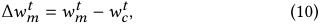

which is optimized towards the local optimum of the device _𝑚_ . We can calculate the similarity utility _𝑈_� _𝑤𝑐_∗ _,_ Δ _𝑤𝑚__𝑡_ � between _𝑤𝑐_ ∗ and Δ _𝑤𝑚__𝑡_ as the criterion for device selection within the edge. However, the optimal cloud model parameters _𝑤𝑐_∗ cannot be obtained during 

the training process. Since the update direction of _𝑤𝑐__𝑡_ in each iteration attempts to approach the optimal global model _𝑤𝑐_∗ due to Eq. (4), We can approximate _𝑈_� _𝑤𝑐_∗ _,_ Δ _𝑤𝑚__𝑡_ � by: 

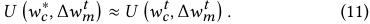

Finally, to avoid getting stuck in the local optimum, the edge should select the devices with data samples which are not sufficiently learned by the global cloud model[14, 18], meaning the local model with less similarity to the cloud model should be assigned with a high probability to select. With the above consideration, the _𝑘_ devices are selected from the candidate devices M _𝑛__𝑡_ to participate in the edge model training: 

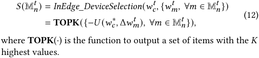

## **5 THEORETICAL ANALYSIS** 

In this section, we provide an analysis of the convergence bound on the FL under devices’ mobility to demonstrate that on-device model aggregation can relieve unbalanced updates across edges. 

We stick to the following assumptions, which are widely used in the literature. 

Assumption 1. _𝐹𝑚_ ( _𝑤𝑚_ ) _is 𝛽_ − _Lipschitz smoothness for each device 𝑚_ ∈ M _,_ i.e. _, 𝐹𝑚_ ( _𝑤𝑚_ ) ≤ _𝐹𝑚_ ( _𝑤𝑚_′ ) + ( _𝑤𝑚_ − _𝑤𝑚_′ )∇ _𝐹𝑚_ ( _𝑤𝑚_′ ) + _<u>𝛽</u>_ <u>2</u>∥_𝑤𝑚_−_𝑤𝑚_′∥2_for any two parameter model 𝑤𝑚and 𝑤𝑚_′_._ 

Assumption 2. _𝐹𝑚_ ( _𝑤𝑚_ ) _is 𝜇_ − _strongly convex for each device 𝑚_ ∈ M _,_ i.e. _, 𝐹𝑚_ ( _𝑤𝑚_ ) ≥ _𝐹𝑚_ ( _𝑤𝑚_′ )+( _𝑤𝑚_ − _𝑤𝑚_′ )∇ _𝐹𝑚_ ( _𝑤𝑚_′ )+_<u>𝜇</u>_ <u>2</u>∥_𝑤𝑚_−_𝑤𝑚_′∥2 _for any two parameter model 𝑤𝑚 and 𝑤𝑚_′ _._ 

Assumption 3. _Let 𝜉𝑚__𝑡_ _be a randomly selected data samples from the device 𝑚 at time step 𝑡, the variance of stochastic gradients in each device 𝑚_ ∈ M _is bounded,_ i.e. _,_ E∥∇ _𝐹𝑚_ ( _𝑤𝑚__𝑡_ _, 𝜉𝑚__𝑡_ ) −∇ _𝐹𝑚_ ( _𝑤𝑚__𝑡_ )∥≤ _𝜎𝑚_2 _._ 

Assumption 4. _The expected squared norm of stochastic gradients is uniformly bounded,_ i.e. _,_ E∥∇ _𝐹𝑚_ ( _𝑤𝑚__𝑡_ _, 𝜉𝑚__𝑡_ )∥2 ≤ _𝐺_2 _for_ ∀ _𝑚_ ∈ M _and_ ∀ _𝑡_ ∈T _._ 

Assumptions 1 and 2 are standard, which are satisfied in the linear regression, logistic regression, and softmax classifier. Assumptions 3 and 4 are typical in the general theoretical analysis of FL algorithms. Furthermore, to simplify the analysis, all devices are assumed to participate in the training. An additional virtual variable _<u>𝑤</u>__~~𝑡~~_+1 is introduced to represent the aggregation of local models after time step _𝑡_ + 1: 

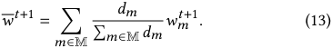

_<u>𝑤</u>__~~𝑡~~_+1 is equal to _𝑤𝑐__𝑡_+1 at the time step when the edge communicates with the cloud server. From the _𝛽_ −Lipschitz smoothness of loss function _𝐹_ , we have: 

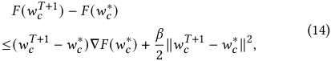

467 

Learning From Your Neighbours: 

Mobility-Driven Device-Edge-Cloud Federated Learning 

ICPP 2023, August 07–10, 2023, Salt Lake City, UT, USA 

_𝑤𝑐__𝑇_+1 is the final cloud model on the cloud server. By taking expectation at both sides: 

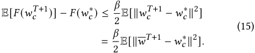

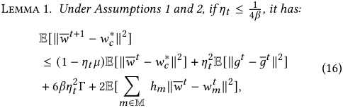

_where 𝑔__𝑡_ =� _𝑚_ ∈M_ℎ_ _𝑚_∇_𝐹_ _𝑚_(_𝑤_ˆ _𝑚__𝑡, 𝜉_ _𝑚__𝑡_)_,_ _<u>𝑔</u>__~~𝑡~~_ =� _𝑚_ ∈M_ℎ_ _𝑚_∇_𝐹_ _𝑚_(_𝑤_ˆ _𝑚__𝑡_)_,_ _ℎ𝑚_ = <u>�</u> _𝑚𝑑_ ∈ _<u>𝑚</u>_ M_𝑑_ _𝑚__,and_Γ=_𝐹_∗−� _𝑚_ ∈M_ℎ_ _𝑚__𝐹_ _𝑚_∗_.𝐹_∗_and𝐹_ _𝑚_∗_arethe_ _minimum value of 𝐹 and 𝐹𝑚, respectively._ Proof. _Please see the Lemma 1 in [8, 20] for the proof. We omit the similar proof due to space limitation._ ■ 

To facilitate the analysis, we set a fixed on-device model aggregation coefficient _𝛼_ , instead of the dynamic value in the on-device model aggregation, _i.e._ , _𝑤_ ˆ _𝑚__𝑡_ = (1 − _𝛼_ ) _𝑤𝑚__𝑡_ + _𝛼𝑤𝑛__𝑡_ . 

Theorem 1. _Under Assumptions 1 to 4 and assuming 𝛼_ ∈(0 _,_ 1) _, by selecting 𝑃𝑚_ = _𝑃_ (∀ _𝑚_ ∈ M) _, 𝑃_ ∈(0 _,_ 1] _, 𝛾_ = max{8 _<u>𝜇</u>__<u>𝛽</u>, 𝐼_}_, and the_ _learning rate 𝜂𝑡_ = _𝜇_ ( _𝛾_ <u>2+</u> _𝑡_ )_, the convergence bound of MIDDLE at time_ _step 𝑡 with full device participation satisfies:_ 

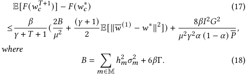

Proof Sketch. _We now give an outline of the proof for Theorem 1. According to Lemma 1 and Eq._ (15) _, we can prove Theorem 1 by proving the upper bound of_ E[∥ _<u>𝑤</u>__~~𝑡~~_+1 − _𝑤𝑐_∗ ∥2 ] _. Specifically, we first determine upper bounds for_ E[<u>�</u> _𝑚_ ∈M_ℎ_ _𝑚_∥ _<u>𝑤</u>__~~𝑡~~_ − _𝑤𝑚__𝑡_ ∥2 ] _and 𝜂𝑡_2E[∥_𝑔𝑡_− _<u>𝑔</u>__~~𝑡~~_ ∥2 ] _. For_ E[� _𝑚_ ∈M_ℎ_ _𝑚_∥ _<u>𝑤</u>__~~𝑡~~_ − _𝑤𝑚__𝑡_ ∥2 ] _, it can be expanded into:_ 

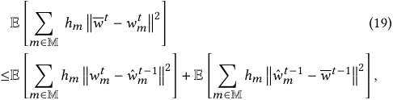

_which can be proofed from_ E[∥ _𝑋_ −E [ _𝑋_ ] ∥2 ] ≤ E∥ _𝑋_ ∥2 _and_ E[ _𝑤_ ˆ _𝑚__𝑡_ ] = _<u>𝑤</u>__~~𝑡~~_ _._ E �� _𝑚_ ∈M_ℎ_ _𝑚_ �� _𝑤𝑡𝑚_ − _𝑤_ ˆ _𝑚𝑡_ −1��2� _is general in typical federated learning convergence analysis, which indicates the local updating of device_ − _𝑚. Moreover,_ E �� _𝑚_ ∈M_ℎ_ _𝑚_ �� _𝑤_ ˆ _𝑚𝑡_ −1 _<u>𝑤</u>__~~𝑡~~_−1��2� _is unique, which indicates the divergence between the changed local updating starting point and the global average after the on-device model aggregation and can be bounded with fixed value 𝛼 and global mobility 𝑃. The proof of 𝜂𝑡_2E[∥_𝑔𝑡_− _<u>𝑔</u>__~~𝑡~~_ ∥2 ] _is also typical[8, 20]. Finally, Theorem 1 can be proofed by mathematical induction._ ■ 

Remark 1. _We next investigate how the devices’ mobility affects the convergence bound of FL. By taking the first-order derivative of_ (E[ _𝐹_ ( _𝑤𝑐__𝑇_+1 )] − _𝐹_ ( _𝑤𝑐_∗ )) _over the global mobility 𝑃, we have_ 

_𝜕_ E[ _𝐹_ ( _𝑤𝑐__𝑇_+1 )] − _𝐹_ ( _𝑤𝑐_∗ ) <u>� �</u> 8 _<u>𝛽𝐼</u>_2 _𝐺_2 = − (20) _𝜕𝑃 𝜇_2 _𝛾_2 _𝛼_ (1 − _𝛼_ ) _𝑃_~~2~~_._ _<u>𝑐</u>_ <u>)]−</u> _𝐹_ <u>(</u> _𝑤𝑐_∗<u>))</u> _Thus, it can be observed that__𝜕_<u>(E[</u>_𝐹_<u>(</u>_𝑤𝑇_+1 _<_ 0 _over 𝑃_ ∈ _𝜕𝑃_ (0 _,_ 1] _and 𝛼_ ∈(0 _,_ 1) _. These results show that the error between the final cloud model 𝑤𝑐__𝑇_+1 _and the optimal cloud model 𝑤𝑐_∗ _can be always reduced under any global mobility 𝑃. Moreover, according to the first-order derivative of_ (E[ _𝐹_ ( _𝑤𝑐__𝑇_+1 )] − _𝐹_ ( _𝑤𝑐_∗ )) _, this model error can gradually decrease with the increase of the global mobility 𝑃._ 

## **6 EVALUATION RESULTS** 

In this section, we evaluate MIDDLE through extensive numerical experiments. We first introduce the experiment settings, and then provide the experimental results with corresponding analysis. 

## **6.1 Experiment Settings** 

_6.1.1_ **Dataset** _._ We aim at two typical applications in mobile computing, _i.e._ , image classification and speech recognition. For image classification tasks, we adopt three open source datasets, including MNIST [15], EMNIST [3] and CIFAR10 [13]. In MNIST and CIFAR10, there are 10 classes of grayscale and color images, respectively. In EMNIST, the “Letters” track containing 26 classes of grayscale images from letters ‘A’ to ‘Z’ is used as the learning task. For the speech recognition, we use the open source dataset SpeechCommands [34] to detect the voice ‘zero’ to ‘nine’. All training tasks are divided into training and test sets. We use the ONE simulator [12] to generate the traces of mobile devices, which is a common simulator to generate user movement traces using different mobility models. All devices move between edges with different probabilities, and the expectation meets the value of global mobility _𝑃_ . 

_6.1.2_ **Parameter Settings** _._ In MIDDLE, we simulate 10 edges and 100 mobile devices. We assume 50% of the devices participating in training at each time step, and the number of selected devices _𝐾_ within each edge is set as 5. The local data samples in each device are supposed to have large Non-IID distribution: there exists a major class for the device’ data samples (more than 80% of all samples). The local training epochs _𝐼_ and the time step interval _𝑇𝑐_ of communication between cloud and edge are both set as 10. The expected mobility probability _𝑃_ is set as 0 _._ 5. The MNIST and EMNIST are trained on the convolutional neural network (CNN) with 2 convolutional layers and 2 fully connected layers. The CIFAR10 and SpeechCommands are trained on the convolutional neural network with 3 convolutional layers and 2 fully connected layers. For three image classification tasks, the optimizer is SGD, and the stochastic gradient descent with momentum is used for training, which has an initial learning rate of 0.01 and a momentum term of 0.9. For the speech recognization task, the optimizer is Adam, and the learning rate is 0.001. The convergence speed of different algorithms is reflected in the time steps of reaching the target accuracy, which are set as 0 _._ 95, 0 _._ 80, 0 _._ 55, and 0 _._ 85 for MNIST, EMNIST, CIFAR10, and SpeechCommands, respectively. 

468 

ICPP 2023, August 07–10, 2023, Salt Lake City, UT, USA 

Songli Zhang et al. 

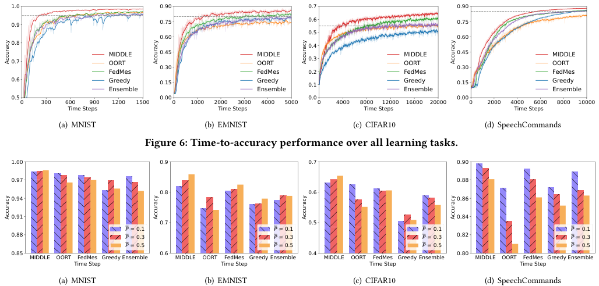

<!-- Start of picture text -->
1.0 0.90 0.7 0.90 0.9 0.75 0.6 0.75 0.5 0.60 0.60 0.8 0.4 MIDDLE 0.45 MIDDLE MIDDLE 0.45 MIDDLE 0.7 OORT OORT 0.3 OORT OORT 0.30 0.30 FedMes FedMes 0.2 FedMes FedMes 0.6 Greedy 0.15 Greedy 0.1 Greedy 0.15 Greedy Ensemble Ensemble Ensemble Ensemble 0.5 0.00 0.0 0.00 0 300 600 900 1200 1500 0 1000 2000 3000 4000 5000 0 4000 8000 12000 16000 20000 0 2000 4000 6000 8000 10000 Time Steps Time Steps Time Steps Time Steps (a) MNIST (b) EMNIST (c) CIFAR10 (d) SpeechCommands Figure 6: Time-to-accuracy performance over all learning tasks. 1.00 0.9 0.7 0.90 0.97 0.88 0.8 0.6 0.94 0.86 0.91 0.84 0.7 0.5 P  = 0.1 P  = 0.1 P  = 0.1 P  = 0.1 0.88 P  = 0.3 P  = 0.3 P  = 0.3 0.82 P  = 0.3 P  = 0.5 P  = 0.5 P  = 0.5 P  = 0.5 0.85 0.6 0.4 0.80 MIDDLE OORT FedMes Greedy Ensemble MIDDLE OORT FedMes Greedy Ensemble MIDDLE OORT FedMes Greedy Ensemble MIDDLE OORT FedMes Greedy Ensemble Time Step Time Step Time Step Time Step (a) MNIST (b) EMNIST (c) CIFAR10 (d) SpeechCommands Accuracy Accuracy Accuracy Accuracy Accuracy Accuracy Accuracy Accuracy <!-- End of picture text -->

**Figure 7: Final accuracy of global models on various global mobility** _𝑃_ **.** 

_6.1.3_ **Baselines** _._ We compare MIDDLE with four existing baselines, which do not specifically deal with the devices’ mobility. Some adaptive adjustments are made to these baselines to be applied to our problem, and the details are as follows: 

**OORT:** The OORT is the latest device selection strategy in [14, 18]. The system utilities of devices are set as the same, and each edge selects the devices with the top _𝐾_ highest statistical utilities for model training. It is without on-device model aggregation. 

**FedMes:** The FedMes utilizes the devices located in the overlap of two edges to accelerate the model convergence of FL, where each two edge models are aggregated on the devices in an averaged way [8]. In the experiments, devices moving across edges are regarded as the overlapped devices. FedMes adopts the random device selection for edges. 

**Greedy:** When a device moves across edges, it greedily keeps the previous local model as the initial local model for local updates . As in OORT, Greedy selects the devices with the _𝐾_ highest statistical utility to participate in the training. 

**Ensemble:** An ensemble approach combines the OORT and FedMes, which aggregates on-device in an averaged way and selects the devices with the _𝐾_ highest statistical utility. 

To show the experiment results more clearly, all results are smoothed and presented by their averages, and the shades are the actual experimental results. 

## **6.2 Experimental Results and Analysis** 

_6.2.1 Overall Performance._ First, a set of experiments is conducted to verify the performance of MIDDLE over various training tasks. In Figure 6, the MIDDLE outperforms all the baselines over both the model accuracy and the convergence speed in all learning tasks. It shows that MIDDLE can effectively improve model accuracy and speed up model convergence through dynamic device selection within edge and model sharing between edges. However, in the 

early stage of training, OORT has a faster convergence speed than the other approaches. Because each edge in the OORT does not introduce the parameter models of other edges, OORT avoids introducing the noise brought by model aggregation on devices. By observing the results of FedMes, Ensemble, and Greedy, they all have higher final model accuracy than OORT in Figure 6(b) and Figure 6(d). This is because EMNIST and SpeechCommands are two more complex learning tasks, which contain more classes and more complex input data, and the aggregation of different models on devices can make the best of the advantages of introducing complementary knowledge, and improve the final model accuracy. It is also shown that introducing other edge models can assist each edge in learning the global data distribution, which can effectively avoid the local optimum of edge models due to the Non-IID data distribution across edges. Furthermore, with the learning task becoming complex, all other approaches achieve a higher final model accuracy than OORT on the EMNIST, CIFAR10, and SpeechCommands, which is shown in Figure 6(b) to Figure 6(d). In Figure 6(a) and Figure 6(c), the time-to-accuracy curve of Greedy shows certain oscillations. This suggests that Greedy approach could introduce too much noise from low-quality local models, leading to gradient drift. The results show that MIDDLE can effectively learn from abundant data samples and the complementary knowledge from the other edge models by the devices’ mobility, which can reduce the time steps to the target accuracy and outperform all competitive baselines by 1 _._ 51 × −6 _._ 85× in terms of model convergence speed while improving the model accuracy. 

_6.2.2 Performance of the various global mobility 𝑃._ We compare the results of MIDDLE on different global mobility _𝑃_ , in Figure 7. First, MIDDLE outperforms the other baselines for various global mobility. From our theoretical analysis in Remark 1, the final global model would be closer to the optimal one with the increase of _𝑃_ . However, 

469 

Learning From Your Neighbours: Mobility-Driven Device-Edge-Cloud Federated Learning 

ICPP 2023, August 07–10, 2023, Salt Lake City, UT, USA 

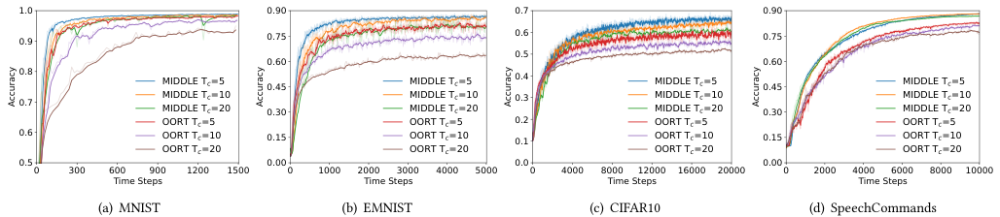

<!-- Start of picture text -->
1.0 0.90 0.7 0.90 0.9 0.75 0.6 0.75 0.5 0.60 0.60 0.8 MIDDLE T c =5 0.45 MIDDLE T c =5 0.4 MIDDLE T c =5 0.45 MIDDLE T c =5 0.7 MIDDLE TMIDDLE T cc =10=20 0.30 MIDDLE TMIDDLE T cc =10=20 0.3 MIDDLE TMIDDLE T cc =10=20 0.30 MIDDLE TMIDDLE T cc =10=20 OORT T c =5 OORT T c =5 0.2 OORT T c =5 OORT T c =5 0.6 OORT T c =10 0.15 OORT T c =10 0.1 OORT T c =10 0.15 OORT T c =10 OORT T c =20 OORT T c =20 OORT T c =20 OORT T c =20 0.5 0.00 0.0 0.00 0 300 600 900 1200 1500 0 1000 2000 3000 4000 5000 0 4000 8000 12000 16000 20000 0 2000 4000 6000 8000 10000 Time Steps Time Steps Time Steps Time Steps (a) MNIST (b) EMNIST (c) CIFAR10 (d) SpeechCommands Accuracy Accuracy Accuracy Accuracy <!-- End of picture text -->

**Figure 8: Effects of the different time step interval** _𝑇𝑐_ **of communication between cloud and edges.** 

only in Figure 7(a) to Figure 7(c), the final model accuracy of MIDDLE increases with the increase of global mobility _𝑃_ . But for most baselines, the experimental results do not follow our theoretical analysis. This is because the device mobility will cause the dynamic edge optima, resulting in certain oscillations in the edge update direction. Moreover, our theoretical analysis focuses on proving the on-device model aggregation leading to the starting point of the device’s local updating closer to the global model, assuming all devices’ participation. In FL training, all devices’ participation is unrealistic, so an in-edge device selection strategy is necessary for MIDDLE, which creates a bit of deviation between the theoretical analysis and experiment results. The input of the SpeechCommands is long sparse vectors, which presents challenges in training and leads to larger discrepancies between experimental results and expectations. In Figure 7, we can observe an approximate conclusion that the final model accuracy of all methods presents a trend of rising first and then falling. When the peak comes too early or too late, the final model accuracy shows continuously falling or rising. Moreover, in Figure 7(a) to Figure 7(d), with the global mobility _𝑃_ increasing, the improvement of MIDDLE in model accuracy is more obvious, which shows that MIDDLE has good robustness and can reduce noise interference. 

_6.2.3 Performance under the different edge-cloud communication interval 𝑇𝑐 ._ As shown in Figure 8, we expect to illustrate further the importance of model sharing between edges by comparing the performance on different time step intervals _𝑇𝑐_ of the communication interval between the cloud and edges. Specifically, we compare MIDDLE with OORT, which is a baseline introducing no knowledge from the other edges. We can observe that OORT has a larger reduction on the final model accuracy with the increase of _𝑇𝑐_ , especially on complex training tasks in Figure 8(b) to Figure 8(d). Although OORT can strategically select devices within each edge, the Non-IID data distribution across edges causes the edge models to update in different directions, which makes the cloud model hard to converge to a stable final global model. After the cloud model has converged, the time-to-accuracy curves of the MIDDLE have smaller oscillations, indicating that its edge models have lower differences. At the same time, in Figure 8(b), the model accuracy on EMNIST drops more obviously, with the increase of _𝑇𝑐_ . This is because the EMNIST has more training sample classes, resulting in larger differences between edge models. With the above results, we can conclude that MIDDLE can make edge models effectively benefit from local models on mobile devices by exchanging complementary information. 

## **7 RELATED WORK** 

As a typical HFL framework, device-edge-cloud FL is implemented to improve communication efficiency in wireless networks [33, 37], in which the master aggregator dynamically schedules multiple aggregators to scale with the number of devices and update size in training [1]. Castiglia et al. [2] first proposed multi-level SGD and analyzed the convergence of multi-level SGD. Wang et al. [33] analyzed the impact of the number of edges on the communication resource and convergence speed of FL training. Zhong et al. [37] proposed parallelizing federated learning to speed up learning efficiency. However, edges dividing all devices into subsets bring more complex heterogeneity on both system overhead and data distribution. Yang et al. [36] and Feng et al. [7] focused on the resource allocation in HFL, which formulated the optimization problem and solved it. They ignore the imbalance updating of edge models caused by Non-IID data distribution across devices and edges, which hinders the convergence of the global model and requires longer training iterations to reach the target accuracy. 

Each edge coordinates the training of devices within the edge independently, and existing literature has made efforts to study how the interaction between devices and edges affects the convergence of the global model. Wang et al. [31] defined the concepts of upward divergence and downward divergence, which represent the model updating deviation between cloud and edges, edges and devices, respectively, and pointed out that reducing the heterogeneity between edges is more conducive to convergence. Qu et al.[28] and Han et al.[8] proposed to leverage the devices in the overlapping edge areas acting as bridges connecting different edges, and the devices in the overlapping areas download models from multiple edges and aggregate these models on the devices. However, the same device participates in the training process of different edges simultaneously, which causes these devices’ local models to be repeatedly calculated by multiple edges and actually results in the biased updating of the global model. Hu et al. [9] and Li et al. [19] divided devices into multiple clusters in advance to meet the requirements of system scalability and various heterogeneity. Ng et al. [24, 25] designed incentive mechanisms for HFL to encourage devices to participate in the training of edges, which were more conducive to cloud model convergence. However, these pre-divide and subjective incentive methods guide devices to participate in the training process of different edges, ignoring the objective geographical distribution of devices. Feng et al. [5, 6] studied the uncertain mobility of devices, but did not consider how to leverage the mobile devices to accelerate the convergence of the global model. 

470 

ICPP 2023, August 07–10, 2023, Salt Lake City, UT, USA 

Songli Zhang et al. 

## **8 CONCLUSION** 

In this work, to deal with the Non-IID data distribution across devices and edges in device-edge-cloud FL, we propose a mobilitydriven FL, namely MIDDLE, which utilizes the characteristic of unpredictable mobility of devices and the differences between models to accelerate convergence. Specifically, MIDDLE contains two components, on-device model aggregation and in-edge device selection. We define a similarity utility metric to measure the differences in gradient descent directions between different models as the basic component for on-device model aggregation and in-edge device selection, which are used to learn complementary information across edges and process dynamic training samples within edges, respectively. Theoretical analysis demonstrates that MIDDLE can effectively correct the bias of the local training process through on-device model aggregation to accelerate global training. Finally, extensive evaluation results confirm that MIDDLE can effectively improve the convergence speed while improving the model accuracy. 

## **ACKNOWLEDGMENTS** 

This work was supported in part by National Key R&D Program of China No. 2020YFB1707900, in part by China NSF grant No. 62132018, U2268204, 62272307, 61902248, 61972254, 61972252, 620252 04, 62072303, in part by Shanghai Science and Technology fund 20PJ1407900, in part by Huawei Noah’s Ark Lab NetMIND Research Team. The opinions, findings, conclusions, and recommendations expressed in this paper are those of the authors and do not necessarily reflect the views of the funding agencies or the government. Zhenzhe Zheng is the corresponding author. 

## **REFERENCES** 

- [1] Keith Bonawitz, Hubert Eichner, Wolfgang Grieskamp, Dzmitry Huba, Alex Ingerman, Vladimir Ivanov, Chloe Kiddon, Jakub Konečny, Stefano Mazzocchi,` Brendan McMahan, et al. 2019. Towards federated learning at scale: System design. _Proceedings of MLSys_ 1 (2019), 374–388. 

- [2] Timothy Castiglia, Anirban Das, and Stacy Patterson. 2021. Multi-level local SGD: Distributed SGD for heterogeneous hierarchical networks. In _Proceedings of ICLR_ . 

- [3] Gregory Cohen, Saeed Afshar, Jonathan Tapson, and Andre Van Schaik. 2017. EMNIST: Extending MNIST to handwritten letters. In _Proceedings of IJCNN_ . 2921– 2926. 

- [4] Yongheng Deng, Feng Lyu, Ju Ren, Yi-Chao Chen, Peng Yang, Yuezhi Zhou, and Yaoxue Zhang. 2021. Fair: Quality-aware federated learning with precise user incentive and model aggregation. In _Proceedings of INFOCOM_ . 1–10. 

- [5] Chenyuan Feng, Howard H Yang, Deshun Hu, Tony QS Quek, Zhiwei Zhao, and Geyong Min. 2021. Federated Learning with User Mobility in Hierarchical Wireless Networks. In _Proceedings of GLOBECOM_ . 01–06. 

- [6] Chenyuan Feng, Howard H. Yang, Deshun Hu, Zhiwei Zhao, Tony Q. S. Quek, and Geyong Min. 2022. Mobility-Aware Cluster Federated Learning in Hierarchical Wireless Networks. _IEEE Transactions on Wireless Communications_ 21, 10 (2022), 8441–8458. 

- [7] Jie Feng, Lei Liu, Qingqi Pei, and Keqin Li. 2021. Min-max cost optimization for efficient hierarchical federated learning in wireless edge networks. _IEEE Transactions on Parallel and Distributed Systems_ 33, 11 (2021), 2687–2700. 

- [8] Dong-Jun Han, Minseok Choi, Jungwuk Park, and Jaekyun Moon. 2021. FedMes: Speeding Up Federated Learning With Multiple Edge Servers. _IEEE Journal on Selected Areas in Communications_ 39, 12 (2021), 3870–3885. 

- [9] Chuang Hu, Huang Huang Liang, Xiao Ming Han, Bo An Liu, Da Zhao Cheng, and Dan Wang. 2022. Spread: Decentralized Model Aggregation for Scalable Federated Learning. In _Proceedings of ICPP_ . 1–12. 

- [10] Wonyong Jeong and Sung Ju Hwang. 2022. Factorized-FL: Personalized Federated Learning with Parameter Factorization & Similarity Matching. In _Proceedings of NeurIPS_ . 

- [11] Peter Kairouz, H Brendan McMahan, Brendan Avent, Aurélien Bellet, Mehdi Bennis, Arjun Nitin Bhagoji, Kallista Bonawitz, Zachary Charles, Graham Cormode, Rachel Cummings, et al. 2021. Advances and open problems in federated learning. _Foundations and Trends® in Machine Learning_ 14, 1–2 (2021), 1–210. 

- [12] Ari Keränen, Jörg Ott, and Teemu Kärkkäinen. 2009. The ONE simulator for DTN protocol evaluation. In _Proceedings of SimuTools_ . 1–10. 

- [13] A Krizhevsky. 2009. Learning Multiple Layers of Features from Tiny Images. _Master’s thesis, University of Tront_ (2009). 

- [14] Fan Lai, Xiangfeng Zhu, Harsha V Madhyastha, and Mosharaf Chowdhury. 2021. Oort: Efficient federated learning via guided participant selection. In _Proceedings of OSDI_ . 19–35. 

- [15] Yann LeCun, Léon Bottou, Yoshua Bengio, and Patrick Haffner. 1998. Gradientbased learning applied to document recognition. _Proc. IEEE_ 86, 11 (1998), 2278– 2324. 

- [16] Jong-Kwon Lee and Jennifer C Hou. 2006. Modeling steady-state and transient behaviors of user mobility: formulation, analysis, and application. In _Proceedings of MobiHoc_ . 85–96. 

- [17] Ang Li, Jingwei Sun, Pengcheng Li, Yu Pu, Hai Li, and Yiran Chen. 2021. Hermes: an efficient federated learning framework for heterogeneous mobile clients. In _Proceedings of MobiCom_ . 420–437. 

- [18] Chenning Li, Xiao Zeng, Mi Zhang, and Zhichao Cao. 2022. PyramidFL: A finegrained client selection framework for efficient federated learning. In _Proceedings of MobiCom_ . 158–171. 

- [19] Guanghao Li, Yue Hu, Miao Zhang, Ji Liu, Quanjun Yin, Yong Peng, and Dejing Dou. 2022. FedHiSyn: A hierarchical synchronous federated learning framework for resource and data heterogeneity. In _Proceedings of ICPP_ . 1–11. 

- [20] Xiang Li, Kaixuan Huang, Wenhao Yang, Shusen Wang, and Zhihua Zhang. 2020. On the Convergence of FedAvg on Non-IID Data. In _Proceedings of ICLR_ . 

- [21] Bing Luo, Xiang Li, Shiqiang Wang, Jianwei Huang, and Leandros Tassiulas. 2021. Cost-effective federated learning design. In _Proceedings of INFOCOM_ . 1–10. 

- [22] Xinchen Lyu, Chenshan Ren, Wei Ni, Hui Tian, Ren Ping Liu, and Eryk Dutkiewicz. 2019. Optimal online data partitioning for geo-distributed machine learning in edge of wireless networks. _IEEE Journal on Selected Areas in Communications_ 37, 10 (2019), 2393–2406. 

- [23] Brendan McMahan, Eider Moore, Daniel Ramage, Seth Hampson, and Blaise Aguera y Arcas. 2017. Communication-efficient learning of deep networks from decentralized data. In _Proceedings of AISTATS_ . 1273–1282. 

- [24] Jer Shyuan Ng, Wei Yang Bryan Lim, Zehui Xiong, Xianbin Cao, Jiangming Jin, Dusit Niyato, Cyril Leung, and Chunyan Miao. 2021. Reputation-aware hedonic coalition formation for efficient serverless hierarchical federated learning. _IEEE Transactions on Parallel and Distributed Systems_ 33, 11 (2021), 2675–2686. 

- [25] Jer Shyuan Ng, Wei Yang Bryan Lim, Zehui Xiong, Xianbin Cao, Dusit Niyato, Cyril Leung, and Dong In Kim. 2021. A hierarchical incentive design toward motivating participation in coded federated learning. _IEEE Journal on Selected Areas in Communications_ 40, 1 (2021), 359–375. 

- [26] Kenta Niwa, Guoqiang Zhang, W Bastiaan Kleijn, Noboru Harada, Hiroshi Sawada, and Akinori Fujino. 2021. Asynchronous decentralized optimization with implicit stochastic variance reduction. In _Proceedings of ICML_ . 8195–8204. 

- [27] Pubudu N Pathirana, Andrey V Savkin, and Sanjay Jha. 2003. Mobility modelling and trajectory prediction for cellular networks with mobile base stations. In _Proceedings of MobiHoc_ . 213–221. 

- [28] Zhe Qu, Xingyu Li, Jie Xu, Bo Tang, Zhuo Lu, and Yao Liu. 2022. On the Convergence of Multi-Server Federated Learning with Overlapping Area. _IEEE Transactions on Mobile Computing_ (2022). https://doi.org/10.1109/TMC.2022.3200016 

- [29] Lina Su, Ruiting Zhou, Ne Wang, Guang Fang, and Zongpeng Li. 2022. An Online Learning Approach for Client Selection in Federated Edge Learning under Budget Constraint. In _Proceedings of ICPP_ . 1–11. 

- [30] Hao Wang, Zakhary Kaplan, Di Niu, and Baochun Li. 2020. Optimizing federated learning on non-iid data with reinforcement learning. In _Proceedings of INFOCOM_ . 1698–1707. 

- [31] Jiayi Wang, Shiqiang Wang, Rong-Rong Chen, and Mingyue Ji. 2022. Demystifying Why Local Aggregation Helps: Convergence Analysis of Hierarchical SGD. In _Proceedings of AAAI_ . 8548–8556. 

- [32] Yidan Wang, Zahir Tari, Xiaoran Huang, and Albert Y Zomaya. 2019. A networkaware and partition-based resource management scheme for data stream processing. In _Proceedings of ICPP_ . 1–10. 

- [33] Zhiyuan Wang, Hongli Xu, Jianchun Liu, He Huang, Chunming Qiao, and Yangming Zhao. 2021. Resource-efficient federated learning with hierarchical aggregation in edge computing. In _Proceedings of INFOCOM_ . 1–10. 

- [34] Pete Warden. 2018. Speech commands: A dataset for limited-vocabulary speech recognition. _arXiv preprint arXiv:1804.03209_ (2018). 

- [35] Xinyi Xu, Lingjuan Lyu, Xingjun Ma, Chenglin Miao, Chuan Sheng Foo, and Bryan Kian Hsiang Low. 2021. Gradient driven rewards to guarantee fairness in collaborative machine learning. _Proceedings of NeurIPS_ (2021), 16104–16117. 

- [36] Lei Yang, Yingqi Gan, Jiannong Cao, and Zhenyu Wang. 2022. Optimizing Aggregation Frequency for Hierarchical Model Training in Heterogeneous Edge Computing. _IEEE Transactions on Mobile Computing_ (2022). doi: 10.1109/TMC.2022.3149584. 

- [37] Zhicong Zhong, Yipeng Zhou, Di Wu, Xu Chen, Min Chen, Chao Li, and Quan Z Sheng. 2021. P-FedAvg: parallelizing federated learning with theoretical guarantees. In _Proceedings of INFOCOM_ . 1–10. 

471 

