# **Nebula: An Edge-Cloud Collaborative Learning Framework for Dynamic Edge Environments** 

|Yan Zhuang|Zhenzhe Zheng|Yunfeng Shao|
|---|---|---|
|Shanghai Jiao Tong University|Shanghai Jiao Tong University|Huawei Noah’s Ark Lab|
|Shanghai, China zhuang00@sjtu.edu.cn|Shanghai, China zhengzhenzhe@sjtu.edu.cn|Beijing, China shaoyunfeng@huawei.com|
|Bingshuai Li|Fan Wu|Guihai Chen|
|Huawei Noah’s Ark Lab|Shanghai Jiao Tong University|Shanghai Jiao Tong University|
|Beijing, China|Shanghai, China|Shanghai, China|
|libingshuai@huawei.com|fwu@cs.sjtu.edu.cn|gchen@cs.sjtu.edu.cn|

## **ABSTRACT** 

To bring the great power of modern DNNs into mobile computing and distributed systems, current practices primarily employ one of the two learning paradigms: cloud-based learning or ondevice learning. Despite their distinct advantages, neither of these two paradigms could effectively deal with highly dynamic edge environments reflected in quick data distribution shifts and ondevice resource fluctuations. In this work, we propose Nebula, an edge-cloud collaborative learning framework to enable rapid model adaptation for changing edge environments. To achieve this, we first propose a new block-level model decomposition scheme to decompose the large cloud model into multiple combinable modules. With this design, we can agilely derive personalized sub-models with compact sizes for edge devices, and quickly aggregate the updated sub-models to integrate new knowledge learned on the edge into the cloud model. We further propose an end-to-end learning framework that incorporates the modular model design into an efficient model adaptation pipeline, including an offline on-cloud model prototyping and training stage, and an online edge-cloud collaborative adaptation stage. Extensive experiments demonstrate that Nebula improves model performance ( _e.g._ , 18.89% accuracy increase) and resource efficiency ( _e.g._ , 7.12× communication cost reduction) in adapting models to dynamic edge environments. 

## **CCS CONCEPTS** 

• **Human-centered computing** → **Ubiquitous and mobile computing** ; • **Computing methodologies** → **Machine learning** . 

## **KEYWORDS** 

Edge-Cloud Collaborative Learning, Model Adaptation, Dynamic Edge Environments 

### **ACM Reference Format:** 

Yan Zhuang, Zhenzhe Zheng, Yunfeng Shao, Bingshuai Li, Fan Wu, and Guihai Chen. 2024. Nebula: An Edge-Cloud Collaborative Learning Framework 

Permission to make digital or hard copies of all or part of this work for personal or classroom use is granted without fee provided that copies are not made or distributed for profit or commercial advantage and that copies bear this notice and the full citation on the first page. Copyrights for third-party components of this work must be honored. For all other uses, contact the owner/author(s). _<mark>ICPP ’24, August 12–15, 2024, Gotland, Sweden</mark>_ 

© 2024 Copyright held by the owner/author(s). ACM ISBN 979-8-4007-1793-2/24/08 https://doi.org/10.1145/3673038.3673120 

for Dynamic Edge Environments. In _The 53rd International Conference on Parallel Processing (ICPP ’24), August 12–15, 2024, Gotland, Sweden._ ACM, New York, NY, USA, 10 pages. https://doi.org/10.1145/3673038.3673120 

## **1 INTRODUCTION** 

To support ubiquitous mobile intelligence applications powered by deep neural networks (DNNs), current practices primarily employ one of the two learning paradigms: cloud-based learning or on-device learning. The former leverages abundant computational resources on the cloud to provide high-performance services with large models, while the latter executes small models close to users, enabling fast-response and low-cost model services. Although having their own advantages, problems arise when faced with highly dynamic edge environments [11, 36] reflected in two aspects. First, the application context in edge environments could frequently change, leading to shifting local data distributions and varying performance requirements. For example, the target objects and their appearances in video analysis tasks change with scenes, angles, and lighting conditions [5, 22]. Second, on-device resources for model execution could vary dramatically across devices and times, which necessitates flexible accuracy-latency tradeoffs [39]. These dynamics require the learning system to quickly adapt model sizes and abilities to maintain satisfying performance. 

Unfortunately, neither the cloud-based learning paradigm nor the on-device learning paradigm alone could effectively deal with highly dynamic edge environments, and inevitably suffer from model performance drops. For cloud-based learning, edge devices could request the cloud for help when encountering new environments. However, the cloud model is trained using historical (proxy) data prior to deployment, which can not provide up-to-date models, resulting in large (e.g., 11%) accuracy drops demonstrated in our experiments (Section 2). Besides, this paradigm would induce prohibitive computation and communication costs to serve huge amount of edge devices. For on-device learning, edge devices could update their models locally using newly collected data to adapt to the new environments. Nevertheless, they still suffer from severe accuracy drops (more than 10%) due to the sparse and biased training data on edge devices. Furthermore, the on-device resource competition among model training and inference processes [5, 32] could lead to 5 _._ 06× prolonged model response latency. 

782 

To tackle the drawbacks of cloud-based or edge-based learning paradigm, in this work, we propose Nebula, an edge-cloud collaborative learning framework to support rapidly adapting models for dynamic edge environments. Within Nebula, the cloud maintains a powerful large model that is responsible for aggregating and storing new knowledge learned from edge devices in dynamic environments. Edge devices can directly retrieve sub-models from the cloud to execute and also collect new knowledge from encountering new edge environments. The key to edge-cloud collaborative learning relies on two critical steps: (i) the first is to efficiently derive sub-models with the necessary abilities for the current environments from the large cloud model for resource-limited edge devices. (ii) The second is to integrate new knowledge learned on edge devices back into the cloud model to deal with the new environments. Based on this idea, Nebula is able to provide high-performance and fast-adaptation learning for dynamic edge environments. 

Two challenges arise in this cloud-and-edge collaborative learning framework for dynamic edge environments. (i) The first challenge comes from that edge devices have limited hardware resources and time-varying non-IID data distributions [11]. Due to the limitation of resources, edge devices could not afford to train a large once-for-all model for various edge environments. The varying non-IID data distribution reflects that the local task of an edge device at a certain time slot ( _e.g._ , recognizing a subset of target objects) is a sub-task of the global task ( _e.g._ , recognizing all potential target objects), which calls for dynamic and personalized sub-models instead of a static and general model. Therefore, we need to derive the sub-models with compact sizes (for limited ondevice resources) and specialized abilities (to deal with target local tasks) on demand, which are non-trivial to achieve simultaneously and in a real-time manner. (ii) The second challenge comes from that the edge models are heterogeneous in both model structures and parameters, introducing difficulties in integrating knowledge from edge models to the cloud. Simply averaging overlapped parameters could lead to negative knowledge transfer due to parameter conflicts [29, 31], as the edge models are trained on diverse local tasks independently. A possible solution is knowledge distillation (KD) [14, 16, 27]. However, this imposes extra storage and computation burden on edge devices, and is time-consuming due to its re-training process, which prohibits the rapid response to dynamic edge environments. Besides, the high change frequency of edge environments increases the efficiency requirements of adaptation, further exacerbating these two challenges. 

The core idea of Nebula to tackle the above challenges is a new modular model decomposition design, based on which we can efficiently derive personalized sub-models for edge devices, and effectively aggregate the updated sub-models to integrate new-learned knowledge back into the cloud. Specifically, Nebula decomposes the large cloud model into multiple well-separated but combinable modules. In its essence, Nebula decomposes the global task (represented by the global data distribution) to multiple sub-tasks (represented by the local data distributions on edge devices), each of which can be solved by a sub-model built by combining a proper subset of the modules. This design allows us to flexibly derive and aggregate personalized sub-models with diverse model sizes and specialized abilities, while avoiding time-consuming model architecture searches or KD processes. 

Based on the above idea, we further propose an end-to-end learning framework that incorporates the modular model design into an agile model adaptation pipeline for dynamic edge environments. This learning framework comprises an offline on-cloud model training stage and an online edge-cloud collaborative adaptation stage. In the offline stage, we modularize the cloud model and design a unified module selector to learn model/task decomposition strategies and to associate specific sub-tasks to modules. In the online stage, Nebula efficiently derives personalized sub-models from the cloud model regarding edge devices’ local tasks1 and available resources. During serving on edge devices, the sub-models are periodically updated using fresh data, and are further aggregated into the cloud model in a module-wise manner with minimal parameter conflicts. 

We summarize the contributions in this work as follows: 

- We propose a novel modular model design to decompose the large cloud model into multiple well-separated but combinable modules, based on which we can flexibly derive personalized edge models and further aggregate their parameter updates, facilitating efficiently knowledge transfer between the edge and the cloud. 

- We design Nebula, an edge-cloud collaborative learning framework, for agile model adaptation to dynamic edge environments. From cloud to edge, we efficiently derive personalized edge models regarding local data distributions and available on-device resources. From edge to cloud, we aggregate updated edge models to form a new cloud model with enhanced model ability. 

- We implemented Nebula on a simulation platform and a realworld testbed with 20 heterogeneous edge devices, and evaluated Nebula over three representative applications: mobile sensing, image classification, and speech recognition. The evaluation results demonstrate the superiority of Nebula in adapting to the dynamic edge environments, achieving up to 18.89% accuracy improvement and 7.12 × communication cost reduction. 

## **2 MOTIVATION AND CHALLENGES** 

## **2.1 Motivation and Related Work** 

Edge environments are highly complex and frequently changing, reflected in two aspects: (i) outer environment dynamic: the changes of application context ( _e.g._ , varying lighting conditions of a camera or varying usage patterns of edge devices over time), leading to shifting data distributions and varying model performance requirements. (ii) inner runtime dynamic: there might have multiple applications co-running on an edge device competing for available resources, which leads to resource fluctuation and unstable local processing time and communication latency. Ignoring these kinds of dynamics will lead to the degradation of system performance. 

We conduct experiments to further illustrate the impact of dynamic edge environments. For outer environment dynamic, Figure 1(a) shows on-device model accuracy with different adaptation approaches. We shifted data distributions on devices in each time slot by replacing a part of the local data with new data. We observe that: (i) the static models, both the large cloud model and small edge models, cannot well-adapt to dynamic environments, _e.g._ , the edge model accuracy decreases by around 11% as data distribution shifts. 

1In this work, we interchangeably use the term local task/local data distribution and edge model/sub-model. 

2 

783 

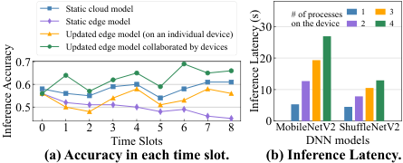

<!-- Start of picture text -->
Static cloud model # of processes 1 3 Static edge model 30 on the device 2 4 Updated edge model (on an individual device) Updated edge model collaborated by devices 0.7 20 0.6 10 0.5 0 1 2 3 4 5 6 7 8 0 MobileNetV2 ShuffleNetV2 Time Slots DNN models (a) Accuracy in each time slot. (b) Inference Latency. Inference Latency (s) Inference Accuracy <!-- End of picture text -->

**Figure 1: Impact of dynamic edge environments in terms of model accuracy and inference latency using CIFAR100 dataset and VGG16 model on NVIDIA Jetson Nano devices.** 

(ii) the updated edge models could have better accuracy, but updating the edge model with the data from an individual device does not have satisfactory performance: around 10% lower than the ideal situation where the edge model is strengthened by new data across devices. For inner runtime environment dynamic, Figure 1(b) shows the model inference latency under different numbers of processes co-running on the device. The competition for on-device resources could significantly increase model processing time, increasing up to 5.06× inference latency with 3 background processes. 

To overcome the drawbacks of static models, previous works [4, 11, 12, 23, 39] enabled on-device model adaptation, _e.g._ , dynamically selecting sub-models from a large model, which nests multiple DNNs within a single large DNN [11] or searching suitable submodels with neural architecture search (NAS) [6] from an offline supernet [39], to achieve flexible accuracy-latency tradeoffs in facing new edge environments. Although effective in resisting resource fluctuations, they do not leverage newly collected data on edge devices. Thus, the weak edge models still suffer from performance degradation in dynamic edge environments. 

Noticing the above issues, existing works have also explored collaborative learning between edge and cloud, which can be categorized into _logits sharing-based methods_ [7, 14, 20, 27] and _parameter sharing-based methods_ [2, 9, 17, 18, 21, 26, 28]. The methods in the first category share model output logits, and transfer knowledge between models using the KD technique [16]. For approaches in the second category, the cloud maintains a large model, from which various edge models can be extracted by strategies such as ordered-dropout [18] or rolling sub-model extraction [2]. While these methods offer flexibility in defining various edge models, they are not lightweight enough due to the time-consuming KD and pruning process. Thus, these methods are still hard to deal with frequently changing edge environments. 

Based on the above discussion, we are motivated to propose an edge-cloud collaborative learning framework to agilely support model adaptation on resource-constrained edge devices in dynamic edge environments. The powerful cloud model can help edge models adapt to the new environment efficiently with negligible model re-training overhead by reusing the sub-models for the same environment learned by other edge devices. The front-end edge models can capture features of new environments, and transfer this knowledge back to form an updated cloud model for future use. 

## **2.2 Design Challenges** 

The design challenges mainly stem from the inherent characteristics of edge devices, _i.e._ , heterogeneity in data distributions and limitations in system resources. We first analyze these characteristics, 

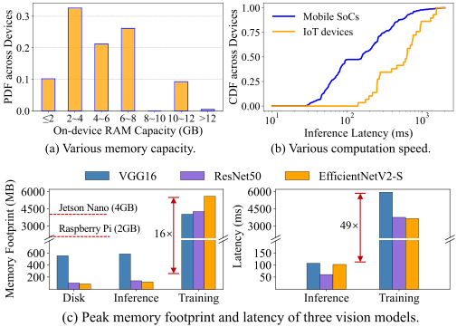

<!-- Start of picture text -->
Jetson Nano (4GB) Raspberry Pi (2GB) 16× 49× <!-- End of picture text -->

**Figure 2: Heterogeneous on-device resources, and intensive resource requirements for on-device model training.** 

and then present design challenges within _personalized edge model derivation_ and _heterogeneous edge model aggregation_ , respectively. Edge devices have strong heterogeneity and large limitations in both systematic and statistical aspects, raising the need for compact and personalized local models. For the systematic aspect, diverse on-device resources ( _e.g._ , computation power, memory capacity, and network bandwidth) cause various model performance. In Figure 2(a) and (b), we showcase the RAM capacity and the inference latency of MobileNetV3 [19] in popular mobile phones using the statistics from AI Benchmark [1]. As shown in Figure 2(c), model training can cost more than ten times of peak memory and execution time than model inference, which hinders edge devices to train a full large model [10, 35]. For the statistical aspect, the local task of a device is essentially a sub-task of the global task. For example, in an object recognition task, the global task is to recognize all objects, while the local task only needs to recognize a small subset of objects in the surrounding environment [26, 40]. The sub-tasks across devices could be quite different, depending on their application contexts, and reflected in the non-IID data distributions as well. 

**_Challenge 1:_** Consider the above characteristics, deriving compact and personalized edge models from the large cloud model is non-trivial. It not only needs to derive lightweight edge models with proper structures, but also needs to derive the models with specialized abilities to deal with the targeted sub-tasks. The parameters of DNNs are tightly coupled with dense connections [15, 35], making it hard to divide them to form compact yet specialized submodels. In addition, the frequently changing environments further exacerbate this challenge in that the optimal sub-models for edge devices are changing as well, raising high requirements for low computational complexity of the edge model derivation. Although model compression techniques such as model pruning [13] and distillation [16], are able to scale down a large cloud model, exhaustively pruning or distilling personalized models for the huge amount of edge devices is prohibitively time-consuming. 

**_Challenge 2:_** The personalized edge models are heterogeneous in both model structures and parameters, making it difficult to aggregate them effectively. We analyze the difficulty in two folds. First, the commonly used method for transferring knowledge between the heterogeneous cloud and edge models is KD [8, 16, 20, 27], but 

3 

784 

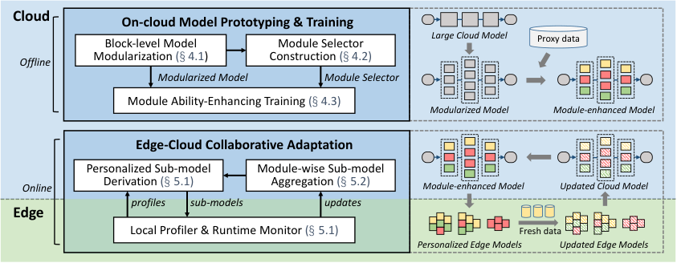

<!-- Start of picture text -->
Cloud On-cloud Model Prototyping & Training Block-level Model Module Selector Large Cloud Model Proxy data Modularization (§ 4.1) Construction (§ 4.2) Offline Modularized Model Module Selector Module Ability-Enhancing Training (§ 4.3) Modularized Model Module-enhanced Model Edge-Cloud Collaborative Adaptation Personalized Sub-model Module-wise Sub-model Online Derivation (§ 5.1) Aggregation (§ 5.2) Module-enhanced Model Updated Cloud Model profiles sub-models updates Edge Local Profiler & Runtime Monitor (§ 5.1) Fresh data Personalized Edge Models Updated Edge Models <!-- End of picture text -->

**Figure 3: Overview of Nebula framework.** 

it is impractical since it may introduce time-consuming model retraining processes and additional computation and storage burdens on edge devices ( _e.g._ , calculating model logits on a shared dataset). Second, even with the same model structure, parameter conflicts during model aggregation can not be ignored, because the models trained on edge devices with non-IID data distributions could lead to large discrepancies in parameters or gradients. Simply averaging (overlapping) parameters could result in conflicts, which could significantly degrade model performance [29, 31]. 

It is important to note that these two challenges should not be considered separately, since the way sub-models are derived from the large cloud model determines the sub-model structures and parameters, further affecting the way they are aggregated. Therefore, the two processes should be jointly designed and the method should be lightweight for fast model adaptation against frequently changing edge environments. 

## **3 NEBULA OVERVIEW** 

In Figure 3, we illustrate the overall design of Nebula with an offline and an online stage: _on-cloud model prototyping and training_ and _edge-cloud collaborative adaptation_ , respectively. 

In the offline stage, we decompose the large cloud model to multiple combinable modules, design a module selector to organize the modules, and train them jointly with proxy data on the cloud to prepare for the subsequent online adaptation stage. Specifically, in Block-level Model Modularization component (Section 4.1), Nebula takes over an initial large cloud model, identifies the basic blocks within its structure, and then decomposes the cloud model into several module layers, each containing a set of substitute modules. In Module Selector Construction component (Section 4.2), we construct a unified module selector to organize the modules by intentionally forwarding input samples to proper modules for processing, which indeed encodes the mapping from sub-tasks to corresponding modules. This ability is learned in Module AbilityEnhancing Training (Section 4.3), which decomposes the global task and assign sub-tasks to modules. As such, various sub-models with distinct structures and specialized abilities for various edge devices can be derived from the large cloud model. 

In the online stage, Nebula periodically derives and aggregates personalized sub-models to keep adapting to new environments. For Personalized Sub-model Derivation (Section 5.1), a local profiler 

first characterizes each device’s local data distribution and available resources. Under resource constraints of each device, we select the most important modules with respect to its targeted local task to form a personalized sub-model. During model execution on the edge, devices can adjust local modules to flexibly scale their local model sizes for resource fluctuations, and update their local submodels with newly collected data to adapt to data distribution shifts. The cloud conducts a Module-wise Sub-model Aggregation (Section 5.2) periodically to form an updated cloud model that integrates new knowledge learned by edge devices, further providing up-to-date sub-models in return. 

## **4 ON-CLOUD MODEL PROTOTYPING AND TRAINING** 

## **4.1 Block-level Model Modularization** 

Instead of directly pre-defining a fixed set of sub-models for edge devices to choose from [9, 11], we decompose a large cloud model to multiple reusable modules, which can be selectively combined to form various sub-models. We identify the principle of model modularization in two folds: (i) the modules should form a large design space that is able to derive various personalized sub-models at a fine granularity; (ii) each sub-model should be responsible for a sub-task, _e.g._ , the local task on an edge device. With this principle, we propose _block-level modularization_ that identifies basic building blocks within a large model as module layers, and further decomposes each module layer into fine-grained modules. **Identify blocks in a large cloud model.** We identify basic building blocks as the smallest repeated layer patterns within a large cloud model. Each block contains several consecutive network layers. For example, a VGG model contains repeated layer sequences such as [Conv, BN, ReLU, Pooling, Dropout], which are identified as VGG blocks, and a ResNet block has a similar layer structure but is enhanced with residual connections. The rationale behind this block definition is that each block is considered to perform a certain function in the learning task, such as feature extraction or classification. Thus, it is reasonable to consider the sub-model constructed from the connection of these semantic blocks as a whole to undertake a certain sub-task. 

As shown in Figure 4, we formally define the blocks within a large model as functions _𝑓_(_𝑙_) ( _𝑥_(_𝑙_) ; _𝜔_(_𝑙_) ) _,𝑙_ ∈{1 _,_ 2 _, . . . , 𝐿_ }, where _𝑥_(_𝑙_) is the input vector to the _𝑙_ th block parameterized by _𝜔_(_𝑙_) . The 

4 

785 

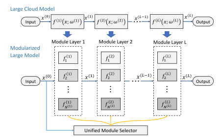

<!-- Start of picture text -->
Large Cloud Model Input 𝑥 (') 𝑓 ! 𝑥; 𝜔 (!) 𝑥 (!) 𝑓 $ 𝑥; 𝜔 ($) 𝑥 (%(!) 𝑓 % 𝑥; 𝜔 (%) 𝑥 (%) Output Module Layer 1 Module Layer 2 Module Layer L Modularized Large Model ! $ % 𝑓! 𝑓! 𝑓! 𝑥 (&) 𝑓$ ! 𝑥 (") 𝑓$ $ 𝑥 ($%") 𝑓$ % 𝑥 ($) Input Output 𝑓&!(") 𝑓&$($) 𝑓&%(%) Unified Module Selector <!-- End of picture text -->

**Figure 4: Illustration of modularizing large models.** 

output of the _𝑙_ th block is fed into the ( _𝑙_ + 1)th block until reaches the final output. As such, a large cloud model _𝐹_ can be represented as the composite of the blocks: 

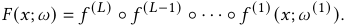

**Generate substitute modules for blocks.** To construct a sufficiently large design space, we further generate _𝑁_(_𝑙_) substitutable modules { _𝑓_ 1(_𝑙_) _, 𝑓_ 2(_𝑙_) _, . . . , 𝑓𝑁_(_𝑙_()_𝑙_) } for each block_𝑓_(_𝑙_) (_𝑥_(_𝑙_);_𝜔_(_𝑙_)), where a subset of modules can work cooperatively to implement the function of the original block (we also call module layer thereafter). By doing this, we can have more choices to construct a block and then a sub-model, enabling to generate various sub-models. Specifically, within a module layer _𝑓_(_𝑙_) ( _𝑥_(_𝑙_) ; _𝜔_(_𝑙_) ), each module _𝑖_ is an independent function _𝑓𝑖_(_𝑙_) ( _𝑥_(_𝑙_) ; _𝜔𝑖_(_𝑙_) ). The modules take the same input _𝑥_(_𝑙_) , but generate distinct outputs. For a given input _𝑥_(_𝑙_) , we introduce a module selector g(_𝑙_) ( _𝑥_(_𝑙_) ; _𝜃_(_𝑙_) ) to selectively activate a subset of the modules in this module layer, and generates the output by combining the outputs of the activated modules. The final output of a module layer is: 

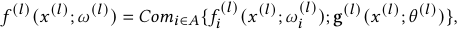

where _𝐴_ is the set of activated modules. 

**Design network structures for modules.** A module can have arbitrary neural network structures as long as its input and output dimensions are matched with the original block. Without loss of generality, we consider two specific types of modules: shrunk modules and residual modules. A shrunk module _𝑓𝑖_(_𝑙_) adopts the same layer sequence with the original block _𝑓_(_𝑙_) , but shrinking its size by reducing hidden units (channels or neurons) of its inside network layers. A residual module provides a residual connection to allow inputs to bypass the current module layer, as not all inputs need layer-by-layer processing for all layers [15, 25, 37]. 

As such, Nebula can provide a large design space for deriving sub-models. For example, we can modularize ResNet18 to have 4 module layers, each containing 16 modules. In this way, we can obtain at most (216 )4 ≈ 2 × 1019 distinct sub-models. 

## **4.2 Module Selector Construction** 

**Module selector within a module layer.** A module selector g(_𝑙_) is responsible for routing inputs _𝑥_(_𝑙_) to different subsets of modules in the module layer _𝑙_ : { _𝑓𝑖_(_𝑙_) | _𝑖_ = 1 _,_ 2 _,_ · · · _, 𝑁_(_𝑙_) }, which can also be interpreted as a mapping from sub-tasks to activated modules. 

Given an input _𝑥_(_𝑙_) , The output of the module selector g(_𝑙_) is a probability distribution over the modules, which can be regarded as the importance weight of each module with respect to _𝑥_(_𝑙_) . To reduce on-device computation overhead, we employ a top- _𝑘_ strategy to activate only _𝑘_ out of _𝑁_(_𝑙_) available modules for each input _𝑥_(_𝑙_) . To combine the outputs of the activated modules, we take their weighted summation as the final output of the current module layer, which can be rewritten as: 

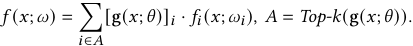

**Unified module selector for all module layers.** The above module selection is a sequential decision-making process: module selector g(_𝑙_) takes _𝑥_(_𝑙_−1) as the input, which depends on the output of the previous module layers. To speed up this process, we model the module selection for all layers as a one-shot decision-making process by combining all g(_𝑙_) to form a unified module selector. We further employ an additional embedding network to extract features _ℎ_ from the input _𝑥_ for g(_𝑙_) . Thus, the output of the unified module selector g( _𝑥_ ; _𝜃_ ) is: 

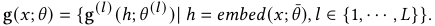

As such, the unified module selector can determine the activated modules for all module layers at once, and is decoupled from the execution of the modules, enabling to work independently to help edge devices identify important modules locally regarding their local data distributions (Section 5.1). 

## **4.3 End-to-end Model Training** 

In this sub-section, we propose an end-to-end algorithm to pretrain the modularized model and its unified module selector. During this process, the module selector learns to decompose the global task into multiple sub-tasks, and maps the sub-tasks to properly activated modules. The modules are trained under the coordination of the module selector to deal with the assigned sub-tasks. 

**Vanilla end-to-end training.** To train such a model, besides the original training loss that aligns model outputs to target labels, we also add a module load-balancing loss term to ensure every module is sufficiently trained. This load-balancing technique can route similar data samples to the same activated modules. Thus, a sub-model formed by a subset of activated modules can be trained to handle a specific sub-task. Take the classification task as an example, the overall loss function is: 

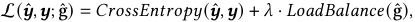

where gˆ is the output of the unified module selector and _𝜆_ is the weight of the load-balancing loss term. Besides, we employ a noisy top- _𝑘_ technique [33] to enable end-to-end training with the nondifferentiable top- _𝑘_ operator. 

Although a sub-task decomposition and mapping strategy can be learned automatically by the above end-to-end training, it could be sub-optimal when deriving sub-models for edge devices. This is because the sub-model needed by a given device might be a combination of a large number of modules, which breaks the memory limitation of edge devices. Therefore, we further propose an module-ability enhancing algorithm to learn a favorable sub-task 

5 

786 

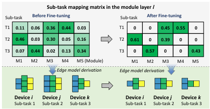

<!-- Start of picture text -->
Sub-task mapping matrix in the module layer  l Sub-task Before Fine-tuning Sub-task After Fine-tuning T1 0.11 0.06 0.36 0.44 0.03 T1 0 0 0.45 0.55 0 T2 0.46 0.03 0.30 0.05 0.16 T2 0.61 0 0.39 0 0 T3 0.07 0.44 0.02 0.13 0.34 T3 0 0.57 0 0 0.43 M1 M2 M3 M4 M5 (Module) M1 M2 M3 M4 M5 Edge model derivation Edge model derivation Device  i Device  j Device  k Device  i Device  j Device  k Sub-task 1 Sub-task 2 Sub-task 3 Sub-task 1 Sub-task 2 Sub-task 3 <!-- End of picture text -->

**Figure 5: Module ability-enhancing training algorithm.** 

decomposition and mapping strategy such that each device’s local task can be covered by as few modules as possible. **Module ability-enhancing training.** Figure 5 illustrates the effect of this algorithm, which follows three steps: 

(1) _Define application-specific sub-tasks._ We first define the interested sub-tasks with respective to the target application, which is a subset of data samples, having certain common properties, such as the same data distribution, the same class, etc. The sub-tasks can be defined according to the underlying reasons behind non-IID data distributions across edge devices. For instance, for label skew where each device only holds a small subset of all the potential classes, we can define a sub-task as the classes that usually appear together on a device. In Figure 5, we have three sub-tasks and the corresponding sub-task mapping matrix _𝑯𝑇_ × _𝑁_ . Each entry _ℎ𝑡𝑛_ is the load of module _𝑛_ in sub-task _𝑡_ , and can also be interpreted as the probability of mapping sub-task _𝑡_ to module _𝑛_ . 

(2) _Identify modules’ targeted sub-tasks._ With the current _𝑯𝑇_ × _𝑁_ obtained from the end-to-end training, we aim to identify the subtasks that a given module _𝑛_ is best at, and let the module focus on these sub-tasks, leaving the other sub-tasks to the other modules. Based on this intuition, we formulate this task identification process as a constrained linear programming problem: 

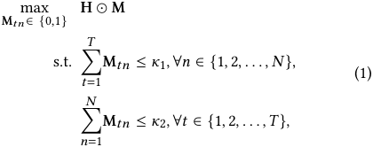

where M is a mask matrix, denoting the sub-tasks assignment to modules. The first constraint aims to prevent the overload of a given module, that is the load should be less than _𝜅_ 1. The second constraint limits the maximum number of modules that can be activated by a sub-task. For objective, we maximize the element-wise product to preserve the information of the original matrix, which reflects the strategy learned by the end-to-end training. Preserving this knowledge is conducive to reducing fine-tuning overhead and enhancing convergence speed, since it embeds the global task’s internal structure learned in the end-to-end training stage. 

(3) _Fine-tuning for enhancing modules’ abilities._ Based on the obtained target mapping matrix P = H ⊙ M, the goal of the finetuning process is two folds: one is to train each module using more data from the sub-tasks it focuses on to further enhance its ability on that sub-tasks, and the other is to let the module selector update at the guideline of the new sub-task mapping strategy. To this end, 

the samples from each sub-task are attached by an additional label g _𝑙𝑎𝑏𝑒𝑙_ denoting the recommended modules to activate. The loss function of the fine-tuned training becomes: 

L( _𝒚_ ˆ _, 𝒚_ ; ˆg _,_ g _𝑙𝑎𝑏𝑒𝑙_ ) = _𝐶𝑟𝑜𝑠𝑠𝐸𝑛𝑡𝑟𝑜𝑝𝑦_ ( _𝒚_ ˆ _, 𝒚_ ) + _𝜆_ · _𝐾𝐿_ (gˆ _,_ g _𝑙𝑎𝑏𝑒𝑙_ ) _._ 

Following the above process, we could obtain an enhanced modularized cloud model and a unified module selector with a favorable sub-task decomposition and mapping strategy. 

## **5 EDGE-CLOUD COLLABORATIVE ADAPTATION** 

Built upon the modularized cloud model, in the online stage, we introduce _importance-based sub-model derivation_ to extract personalized sub-models for edge devices and _module-wise weighted model aggregation_ to aggregate the updated heterogeneous edge models. 

## **5.1 Personalized Sub-model Derivation** 

To fit personalized sub-models for heterogeneous edge devices within the huge search space, Nebula jointly takes local tasks and available on-device system resources into account, achieving flexible tradeoffs between model performance and resource overhead. The objective of fitting sub-models for a given device is to minimize the loss over its local dataset under the resource constraints. We first define an importance metric for modules using the outputs of the unified module selector, and estimate the candidate sub-models’ resource overhead with the local resource constraints captured by a local resource profiler. Finally, a set of modules can be chosen to form a sub-model that achieves desired performance-cost tradeoff. 

To identify important modules for edge devices, we define a module’s importance score for a given device as the average sample scores of its local data: _𝐼𝑚𝑝𝑜𝑟𝑡𝑎𝑛𝑐𝑒_ ( _𝜔𝑖_ | _𝐷𝑘_ ) = | _𝐷_ <u>1</u> _𝑘_ | �| _𝑗𝐷_ =1 _𝑘_ |g(_𝑥𝑗_;_𝜃_)_𝑖_, where _𝐷𝑘_ is the local dataset of device _𝑘_ . This importance score embeds the personalized information of the local data distribution, and thus can be used for selecting modules for edge devices. 

To capture resource constraints, we first employ a local resource profiler to capture available resources of edge devices in dynamic runtime environments, including memory capacity, computational power and network bandwidth. These measurements will serve as the resource constraints in deriving sub-models. We next estimate the resource costs of the candidate sub-models on a given device. Since the structure of the modules is determined in the modularization stage, we are able to calculate their resource costs in advance on the cloud. A sub-model’s resource costs are to add up the resource costs of all its containing modules. 

After obtaining the importance of modules and the resource profile, we formulate the personalized sub-model derivation process as a constrained optimization problem: 

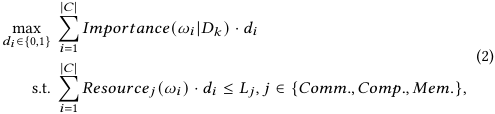

where _𝐶_ denotes the indices of candidate modules. To solve this multi-dimensional knapsack problem, we first select the most important module in each module layer to avoid the situation where 

6 

787 

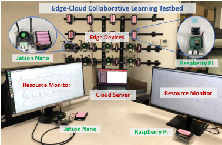

<!-- Start of picture text -->
Edge-Cloud Collaborative Learning Testbed Edge Devices Jetson Nano Raspberry Pi Resource Monitor Cloud Server Resource Monitor Jetson Nano Raspberry Pi <!-- End of picture text -->

**Figure 6: Our edge-cloud collaborative learning testbed.** 

no module is selected for a certain module layer. Then, the residual problem, still a multi-dimension knapsack problem, can be solved efficiently using optimization tools such as SciPy and OR-Tools. As such, we can obtain a subset of modules S _𝑘_ = { _𝜔𝑖_( 1_𝑙_1) _,𝜔𝑖_( 2_𝑙_2) _,_ · · · _,𝜔𝑖_( _𝑛__𝑙𝑛_) } that forms a personalized sub-model for the edge device. In Nebula, edge devices can also adjust sub-models locally for desired performance-cost tradeoffs. Each device can occupy a set of feasible sub-models, which can be dynamically adjusted to adapt to the runtime resources fluctuation or data distribution shifts. 

## **5.2 Module-wise Sub-model Aggregation** 

To aggregate the heterogeneous edge models, we propose a modulewise weighted average aggregation method. The rationale is that the sub-models are built from the same basic building blocks, _i.e.,_ the modules, we can aggregate them in a module-wise manner. Specifically, we could update the parameters of module _𝑖_ by calculating the weighted average over the parameters of module _𝑖_ from all sub-models within U _𝑖_ , which is the set of sub-models that contains module _𝑖_ . Considering that each module _𝑖_ could be updated a different number of times by different sub-models, we exploit the (normalized) importance value of module _𝑖_ with respective to the sub-models as the averaging weights to balance the contribution of each sub-model. That is, the parameters _𝜔𝑖_ of module _𝑖_ are updated as _𝜔_′ _𝑖_=� _𝑘_|U =_𝑖_ 1|_𝐼𝑚𝑝𝑜𝑟𝑡𝑎𝑛𝑐𝑒_(_𝜔𝑖_|_𝐷𝑘_)·_𝜔_ _𝑖𝑘_′. This module-wise aggregation reduces the parameter conflicts, because each module is trained by the data samples from a specific sub-task without interference from the different sub-tasks on other edge devices. 

## **6 EVALUATION** 

## **6.1 Experimental Methodology** 

**Implementation.** We have implemented Nebula on a simulation platform and a real-world testbed based on PyTorch. Our simulation platform is a Linux server equipped with a 10-core 2.4GHz Intel Xeon Silver 4210R CPU, and two NVIDIA 3090 GPUs. The realworld testbed is shown in Figure 6, which comprises 10 NVIDIA Jetson Nanos and 10 Raspberry Pi 4Bs as edge devices, and a Lenovo laptop as the cloud server. The Nano devices have stronger system performance with on-device GPUs than the Pi devices with CPU only. All devices are equipped with WiFi module, and can connect with the cloud server through a wireless local area network. **Tasks, Datasets and Models.** We evaluate Nebula on three representative AI applications with four datasets and models: 

- _Mobile Sensing._ Human activity recognition is important for smart devices to understand user behaviors. We use HAR dataset [3] with a 3-layer MLP to recognize 6 kinds of human activities. 

- _Image Classification._ Image classification is a fundamental task in computer vision. In this task, we use two datasets, CIFAR-10 and CIFAR-100 [24], with 10 and 100 categories, respectively, and employ ResNet18 [15] and VGG16 [34] models. 

- _Speech Recognition._ Speech recognition is a basic component of human-computer interaction, where we use Google Speech [38] and ResNet34 [15] to classify audio commands of 35 categories. 

**Data and System heterogeneity.** We consider two common types of non-IID data distributions, _i.e._ , feature skew and label skew. For HAR, we assign each device a certain user’s data. For the other datasets, we let each device holds only _𝑚_ out of _𝑛_ total classes of data. In particular, we test two degrees of data heterogeneity for each dataset (Data Partition 1 and 2) by choosing different values of _𝑚_ . Besides, the data volumes across devices are unbalanced, ranging from 50 to 150 samples. To simulate real-world hardware heterogeneity on edge devices, we use the statistics from an opensource AI benchmark [1] to sample on-device resource budgets. **Baselines.** We compare Nebula with various baselines in the following paradigms for dynamic edge environments: 

- **No Adaptation:** Edge devices use the pre-trained large cloud model without any local adaptation on devices. 

- **On-device Adaptation:** Each edge device adapts its model locally without collaboration with the cloud. In this case, we select _Local adaptation_ (LA) and _AdaptiveNet_ (AN) [39] as our baselines. For LA approach, each device can update its models using its new local data, while for AN approach, devices get a multi-branch large model pre-trained on the cloud, and can adapt the branch in use locally to flexibly tradeoff between model accuracy and inference latency. 

- **Edge-cloud Collaborative Adaptation:** In this case, we choose _FedAvg_ (FA) [30] and _HeteroFL_ (HFL) [9] as baselines. _HeteroFL_ is a resource-aware federated learning solution, which trains a series of nested models with various sizes for edge devices with different available resources. 

**Parameter settings.** For edge-cloud collaborative training, 25 out of 500 devices are randomly selected to participate in each communication round. Each selected device trains its model with 3 local epochs. The learning rate is set as 0.001 and the batch size is 16. For on-device adaptation, each edge device fine-tunes the local model for 10 epochs using its local data. For model modularization, we employ 1 module layer with 16 modules for MLP model, and 4 module layers each with 16 modules for ResNet18. Since the parameters of VGG16 and ResNet34 are mainly concentrated at the deep layers, we only modularize the last three blocks with 32 modules each. 

## **6.2 Overall System Performance** 

To demonstrate the adaptation ability of different approaches in dynamic edge environments, we evaluate the system performance ( _i.e._ , model accuracy and resource costs in terms of communication, memory and latency) after one adaptation step. To simulate an adaptation step, we use 30% of the training dataset as the proxy dataset for model pre-training on the cloud, and the remaining 70% is distributed to edge devices as newly collected data for adaptation. 

7 

788 

**Table 1: Model accuracy of Nebula and baselines after an adaptation step.** 

|Task|Dataset|Model|Data Per Device|No Adaptation|On- Adap|device tation Coll|Edge-clou aborative Ad|d aptation|
|---|---|---|---|---|---|---|---|---|
|||||NA|LA|AN FA|HFL|Nebula|
|Sensing|HAR|MLP|1 subject|93.96|96.07|97.42 97.35|98.31|**98.63**|
||CIFAR10|ResNet18|2 classes|73.55|84.19|87.63 73.68|70.19|**90.86**|
|Image|||5 classes|73.55|73.56|81.17 76.12|77.32|**85.76**|
|Classification|CIFAR100|VGG16|10 classes|56.79|67.10|69.89 60.81|52.54|**74.20**|
||||20 classes|56.79|58.03|67.53 61.66|55.23|**75.68**|
|Speech|Google|ResNet34|5 classes|62.72|60.52|69.33 70.48|71.73|**80.87**|
|Recognition|Speech||10 classes|62.72|59.04|67.91 73.55|72.34|**77.16**|
|MB) FedAvg|HeteroFL Nebula|4 GB) ~~FedAvg~~ ~~H~~|~~eteroFL~~ ~~Nebula~~||Full m|odel HeteroFL N|ebula (m1) N|ebula (m2)|
|20 40 60 80 100 unication Cost ( ||1 2 3  unication Cost ( ||0.0 0.1 0.2 Jetson Nano||0.0 0.5 0.0 0.5|0.0 0.5 1.0 10||
|Data Par 0 Comm (a) H|tition: Subjects AR, MLP.|m=2 0 Comm (b) CIFAR|m=5 10, ResNet18.|0.01 0.02 spberry Pi||0.2 0.2 0.4|0.5 .||
|6 8 10 n Cost (GB) FedAvg|HeteroFL Nebula|6 8 n Cost (GB) FedAvg H|eteroFL Nebula|0.00 Ra **Figure**|HAR, MLP. **8: Memo**|0.0 CIFAR10, ResNet18. 0.0 CIFA **ry footprint (GB) d**|R100, VGG16. 0.0 S **uring model**|peech, ResNet34. **adaptatio**|
|4 icatio||4 icatio|||Full m|odel HeteroFL N|ebula (m1) N|ebula (m2)|
|m=10 0 2 Commun (c) CIFA|m=20 R100, VGG16.|m=5 0 2 Commun (d) Speec|m=10 h, ResNet34.|0.01 son Nano||02 0.4 0.6 0.2 0.4|5||

**Figure 8: Memory footprint (GB) during model adaptation.** 

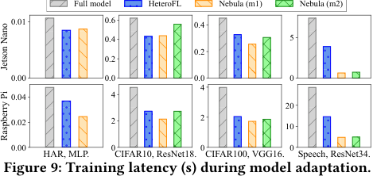

<!-- Start of picture text -->
Full model HeteroFL Nebula (m1) Nebula (m2) 0.01 0.6 0.4 0.4 5 0.2 0.2 0.00 0.0 0.0 0 4 0.04 4 20 0.02 2 2 10 0.00 0 0 0 HAR, MLP. CIFAR10, ResNet18. CIFAR100, VGG16. Speech, ResNet34. Figure 9: Training latency (s) during model adaptation. Jetson Nano Raspberry Pi <!-- End of picture text -->

**Figure 7: Communication costs during model adaptation.** 

We summarize the model accuracy after adaptation in Table 1. The results demonstrate that Nebula outperforms the baselines in all the learning tasks and models. Specifically, Nebula has huge superior performance over the No Adaptation approach, indicating the necessity to conduct adaptation. Furthermore, Nebula improves model accuracy by 9.06% and 11.07% on average compared to ondevice adaptation and the other edge-cloud collaborative adaptation methods, respectively. These accuracy improvements are attributed to the effective collaboration between edge devices and the cloud. Compared with the on-device adaptation approaches, Nebula relies on the large cloud model to flexibly and dynamically derive the personalized sub-model for each device. For example, in the speech recognition task, Nebula achieves 80.87% accuracy, while AN only obtains 69.33%. Furthermore, compared with the other edge-cloud collaborative adaptation approaches, Nebula effectively aggregates the updated sub-models in a module-wise manner, where each module is updated by similar data samples, thus alleviate the impact of non-IID data distributions, which is the major reason to the performance degradation in FA and HFL. For example, in CIFAR10 task with _𝑚_ = 2, Nebula achieves 90.86% accuracy, significantly outperforming FA (73.68%) and HFL (70.19%). 

communicates only partial model parameters, its lack of consideration for non-IID data distributions leads to slower convergence (1.83× more communication rounds on average than FedAvg). 

We now measure the memory footprint in Figure 8 and perbatch training latency in Figure 9 on Jetson Nano and Raspberry Pi. Benefiting from the compact sub-models employed by Nebula, we can achieve a remarkable reduction in memory footprint and training latency compared with methods using a full model ( _e.g._ , FedAvg), with a reduction up to 9.28× and 11.64×, respectively. Besides, we observe that Nebula demonstrates an even stronger reduction in memory and latency when the cloud model is larger. This is because Nebula can scale down the large model into compact sub-models tailored for edge devices with limited resources. 

From the above experiment results, we can conclude that Nebula has superior performance in improving model adaptation accuracy and reducing resource costs for edge devices. 

## **6.3 Continuous Adaptation Performance** 

We next report the communication costs of the edge-cloud collaborative adaptation strategies in Figure 7. Nebula obtains significant communication cost savings compared to FedAvg and HeteroFL, with average reductions of 4 _._ 60× and 2 _._ 76×, respectively. This is because Nebula only transmits the sub-model parameters between edge devices and the cloud. The size of these sub-models is considerably smaller ( _e.g._ , 3.14× smaller on the speech recognition task) than that of the full large cloud model. Although HeteroFL also 

We further breakdown and evaluate the model accuracy of Nebula after multiple adaptation steps on two specific edge devices. In each adaptation step, we randomly replace 50% of the local data with new data to simulate data shifts caused by dynamic edge environments. We also compare two variants of Nebula to provide insights behind its superior performance: (i) Nebula w/o local adaptation: the edge device queries the cloud for a new sub-model in each step without 

8 

789 

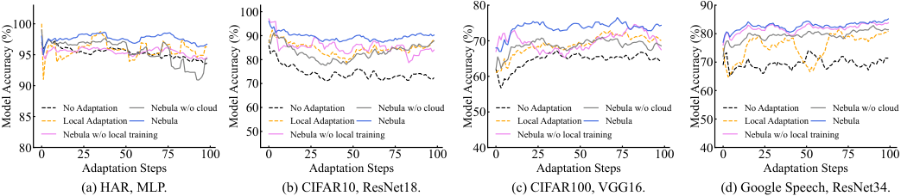

<!-- Start of picture text -->
80 90 100 100 90 70 80 95 80 70 60 90 70 60 85 No AdaptationLocal Adaptation Nebula w/o cloudNebula 60 No AdaptationLocal Adaptation Nebula w/o cloudNebula 50 No AdaptationLocal Adaptation Nebula w/o cloudNebula 50 No AdaptationLocal Adaptation Nebula w/o cloudNebula Nebula w/o local training 50 Nebula w/o local training Nebula w/o local training Nebula w/o local training 80 40 40 0 25 50 75 100 0 25 50 75 100 0 25 50 75 100 0 25 50 75 100 Adaptation Steps Adaptation Steps Adaptation Steps Adaptation Steps (a) HAR, MLP. (b) CIFAR10, ResNet18. (c) CIFAR100, VGG16. (d) Google Speech, ResNet34. Model Accuracy (%) Model Accuracy (%) Model Accuracy (%) Model Accuracy (%) <!-- End of picture text -->

**Figure 10: Model accuracy during multiple adaptation steps. The first two tasks (HAR and CIFAR10) were performed on Raspberry Pi, and the other two (CIFAR100 and Speech) were performed on Jetson Nano.** 

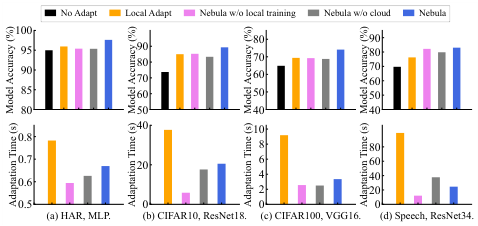

<!-- Start of picture text -->
No Adapt Local Adapt Nebula w/o local training Nebula w/o cloud Nebula 100 80 90 9590 908070 7060 807060 85 60 50 50 80 50 40 40 40 10 0.8 8 80 0.7 20 6 60 0.6 4 40 2 20 0.5 0 0 0 (a) HAR, MLP. (b) CIFAR10, ResNet18. (c) CIFAR100, VGG16. (d) Speech, ResNet34. Model Accuracy (%) Model Accuracy (%) Model Accuracy (%) Model Accuracy (%) Adaptation Time (s) Adaptation Time (s) Adaptation Time (s) Adaptation Time (s) <!-- End of picture text -->

**Figure 11: Adaptation accuracy and adaptation time.** 

updating the sub-model locally. (ii) Nebula w/o cloud: the edge device queries the cloud once for a sub-model, and updates it locally with ~~ou~~ t relying on the cloud in the following adaptation steps. The model accuracy in each step and the average adaptation accuracy of 100 steps are illustrated in Figure 10 and Figure 11, respectively. Nebula consistently outperforms the baselines, achieving an average improvement in model accuracy of 1.68%, 4.33%, 4.72%, and 6.81% compared with LA approach on the four tasks. Again, the advantages of Nebula come from the effective collaboration between edge and cloud, where the powerful cloud model provides personalized sub-models for devices, and devices transfer new knowledge back to the cloud in return for greater adaptability. 

We report the average time cost for each adaptation step in Figure 11. Nebula outperforms LA on four tasks, reducing adaptation times by 14.5%, 45.5%, 63.5%, and 75.3%, respectively, which demonstrates the efficiency of Nebula in adapting to new environments. The benefits arise from compact sub-models for local training, and fast convergence enabled by the effective module-wise aggregation. 

## **6.4 Sub-model Performance Evaluation** 

We use VGG16 model trained on CIFAR100 dataset as an example to evaluate the performance of candidate sub-models generated by Nebula. As shown in Figure 12, each point is a sub-model generated by randomly selecting a set of modules from each module layer in the modularized cloud model. We have three observations: (i) Our modularized cloud model is able to generate diverse sub-models with varying sizes (from 3M to 25M parameters) and capabilities. (ii) Through our module ability-enhancing training, the performance of the sub-models is improved compared to the sub-models of the same size without such training ( _e.g._ , the accuracy improves by 11.5% on average with 5M sub-model parameters). (iii) Our personalized submodel derivation method effectively identifies near-optimal submodels under model size constraints, which forms a Pareto optimal curve. Besides, often small sub-models are enough to saturate the 

on-device model performance, as local tasks are typically sub-tasks of the global task. 

## **6.5 Sensitivity Analysis** 

To evaluate the robustness of Nebula, we vary on-device resources, module granularity, and the number of participating devices during our experiments. The results are shown in Figure 13. We conclude the key insights as follows: (i) As expected that larger sub-models lead to higher accuracy, but even 20%-sized sub-model is able to achieve satisfactory performance (only 3.65% lower accuracy than 50% sub-model on average). (ii) Modularizing the large model into more and smaller modules slightly impacts accuracy, but can provide finer granularity when adjusting the size of sub-models, indicating a tradeoff between sub-model size and accuracy. (iii) Increasing the number of participating devices contributes little to training speed for FedAvg, whereas benefiting from the modular design that reduces parameter conflicts, Nebula consistently enjoys the training speedup from more devices contributing their knowledge. 

## **7 CONCLUSION** 

In this paper, we propose Nebula, an edge-cloud collaborative learning framework for continuous dynamic environment adaptation. Based on our modular large model decomposition and combination design, edge devices can collaborate with the cloud by efficiently deriving compact and personalized sub-models, and effectively contribute new knowledge back to facilitate model adaptation. Extensive experiments demonstrate that Nebula not only improves model performance and resource efficiency under dynamic edge environments, but also provides more flexibility for edge devices to do on-device adaptation by module scheduling and updating. 

## **ACKNOWLEDGMENTS** 

<mark>This work was supported in part by National Key R&D Program of China (No. 2023YFB4502400),</mark> in part by China NSF grant No. 62322206, 62132018, U2268204, 62025204, 62272307, 62372296. The opinions, findings, conclusions, and recommendations expressed in this paper are those of the authors and do not necessarily reflect the views of the funding agencies or the government. Zhenzhe Zheng is the corresponding author. 

## **REFERENCES** 

> [1] 2022. AI Benchmark: All About Deep Learning on Smart phones. http://aibenchmark.com/ranking_deeplearning_detailed.html 

> [2] Samiul Alam, Luyang Liu, Ming Yan, and Mi Zhang. 2022. FedRolex: ModelHeterogeneous Federated Learning with Rolling Sub-Model Extraction. In _NeurIPS_ . 29677–29690. 

9 

790 

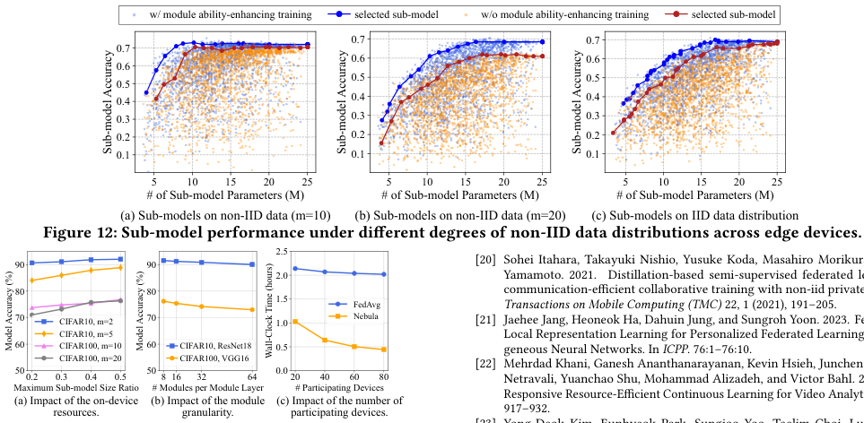

<!-- Start of picture text -->
w/ module ability-enhancing training selected sub-model w/o module ability-enhancing training selected sub-model 0.7 0.7 0.7 0.6 0.6 0.6 0.5 0.5 0.5 0.4 0.4 0.4 0.3 0.3 0.3 0.2 0.2 0.2 0.1 0.1 0.1 5 10 15 20 25 5 10 15 20 25 5 10 15 20 25 # of Sub-model Parameters (M) # of Sub-model Parameters (M) # of Sub-model Parameters (M) (a) Sub-models on non-IID data (m=10) (b) Sub-models on non-IID data (m=20) (c) Sub-models on IID data distribution Figure 12: Sub-model performance under different degrees of non-IID data distributions across edge devices. 2.5 90 90 [20] Sohei Itahara, Takayuki Nishio, Yusuke Koda, Masahiro Morikura, 2.0 Yamamoto. 2021. Distillation-based semi-supervised federated 80 80 communication-efficient collaborative training with non-iid private data. 1.5 FedAvg Transactions on Mobile Computing (TMC)  22, 1 (2021), 191–205. 70 CIFAR10, m=2 70 1.0 Nebula [21] Jaehee Jang, Heoneok Ha, Dahuin Jung, and Sungroh Yoon. 2023. CIFAR10, m=5 Local Representation Learning for Personalized Federated Learning on Hetero- 60 CIFAR100, m=10 60 CIFAR10, ResNet18 0.5 geneous Neural Networks. In  ICPP . 76:1–76:10. 50 CIFAR100, m=20 50 CIFAR100, VGG16 0.0 [22] Mehrdad Khani, Ganesh Ananthanarayanan, Kevin Hsieh, Junchen Jiang, Ravi 0.2 0.3 0.4 0.5 8 16 32 64 20 40 60 80 Netravali, Yuanchao Shu, Mohammad Alizadeh, and Victor Bahl. 2023. Maximum Sub-model Size Ratio # Modules per Module Layer # Participating Devices Responsive Resource-Efficient Continuous Learning for Video Analytics. In (a) Impact of the on-device (b) Impact of the module (c) Impact of the number of resources. granularity. participating devices. 917–932. Sub-model Accuracy Sub-model Accuracy Sub-model Accuracy Model Accuracy (%) Model Accuracy (%) Wall-Clock Time (hours) <!-- End of picture text -->

- [20] Sohei Itahara, Takayuki Nishio, Yusuke Koda, Masahiro Morikura, and Koji Yamamoto. 2021. Distillation-based semi-supervised federated learning for communication-efficient collaborative training with non-iid private data. _IEEE Transactions on Mobile Computing (TMC)_ 22, 1 (2021), 191–205. 

- [21] Jaehee Jang, Heoneok Ha, Dahuin Jung, and Sungroh Yoon. 2023. FedClassAvg: Local Representation Learning for Personalized Federated Learning on Heterogeneous Neural Networks. In _ICPP_ . 76:1–76:10. 

- [22] Mehrdad Khani, Ganesh Ananthanarayanan, Kevin Hsieh, Junchen Jiang, Ravi Netravali, Yuanchao Shu, Mohammad Alizadeh, and Victor Bahl. 2023. RECL: Responsive Resource-Efficient Continuous Learning for Video Analytics. In _NSDI_ . 917–932. 

- [23] Yong-Deok Kim, Eunhyeok Park, Sungjoo Yoo, Taelim Choi, Lu Yang, and Dongjun Shin. 2016. Compression of Deep Convolutional Neural Networks for Fast and Low Power Mobile Applications. In _ICLR_ . 

**Figure 13: Sensitivity Analysis of Nebula.** 

   - [24] Alex Krizhevsky, Geoffrey Hinton, et al. 2009. Learning multiple layers of features from tiny images. 

- [3] Davide Anguita, Alessandro Ghio, Luca Oneto, Xavier Parra Perez, and Jorge Luis Reyes Ortiz. 2013. A public domain dataset for human activity recognition using smartphones. In _ESANN_ . 

   - [25] Stefanos Laskaridis, Stylianos I. Venieris, Mario Almeida, Ilias Leontiadis, and Nicholas D. Lane. 2020. SPINN: Synergistic Progressive Inference of Neural Networks over Device and Cloud. In _MobiCom_ . 37:1–37:15. 

- [4] Soroush Bateni and Cong Liu. 2020. NeuOS: A Latency-Predictable MultiDimensional Optimization Framework for DNN-Driven Autonomous Systems. In _ATC_ . 371–385. 

   - [26] Ang Li, Jingwei Sun, Pengcheng Li, Yu Pu, Hai Li, and Yiran Chen. 2021. Hermes: an efficient federated learning framework for heterogeneous mobile clients. In _MobiCom_ . 420–437. 

- [5] Romil Bhardwaj, Zhengxu Xia, Ganesh Ananthanarayanan, Junchen Jiang, Yuanchao Shu, Nikolaos Karianakis, Kevin Hsieh, Paramvir Bahl, and Ion Stoica. 2022. Ekya: Continuous learning of video analytics models on edge compute servers. In _NSDI_ . 119–135. 

   - [27] Tao Lin, Lingjing Kong, Sebastian U Stich, and Martin Jaggi. 2020. Ensemble Distillation for Robust Model Fusion in Federated Learning. In _NeurIPS_ . 2351– 2363. 

   - [28] Ruixuan Liu, Fangzhao Wu, Chuhan Wu, Yanlin Wang, Lingjuan Lyu, Hong Chen, and Xing Xie. 2022. No One Left Behind: Inclusive Federated Learning over Heterogeneous Devices. In _SIGKDD_ . 3398–3406. 

   - [29] Jiaqi Ma, Zhe Zhao, Xinyang Yi, Jilin Chen, Lichan Hong, and Ed H. Chi. 2018. Modeling Task Relationships in Multi-Task Learning with Multi-Gate Mixtureof-Experts. In _SIGKDD_ . 1930–1939. 

- [6] Han Cai, Chuang Gan, and Song Han. 2019. Once for All: Train One Network and Specialize it for Efficient Deployment. In _ICLR_ . 

- [7] Yae Jee Cho, Andre Manoel, Gauri Joshi, Robert Sim, and Dimitrios Dimitriadis. 2022. Heterogeneous Ensemble Knowledge Transfer for Training Large Models in Federated Learning. In _IJCAI_ . 2881–2887. 

- [8] Jae-Won Chung, Jae-Yun Kim, and Soo-Mook Moon. 2020. ShadowTutor: Distributed Partial Distillation for Mobile Video DNN Inference. In _ICPP_ . 8:1–8:11. 

   - [30] Brendan McMahan, Eider Moore, Daniel Ramage, Seth Hampson, and Blaise Aguera y Arcas. 2017. Communication-efficient learning of deep networks from decentralized data. In _AISTATS_ . 1273–1282. 

- [9] Enmao Diao, Jie Ding, and Vahid Tarokh. 2021. HeteroFL: Computation and Communication Efficient Federated Learning for Heterogeneous Clients. In _ICLR_ . 

- [10] Alexey Dosovitskiy, Lucas Beyer, Alexander Kolesnikov, Dirk Weissenborn, Xiaohua Zhai, Thomas Unterthiner, Mostafa Dehghani, Matthias Minderer, Georg Heigold, Sylvain Gelly, Jakob Uszkoreit, and Neil Houlsby. 2021. An Image is Worth 16x16 Words: Transformers for Image Recognition at Scale. In _ICLR_ . 

   - [31] Ishan Misra, Abhinav Shrivastava, Abhinav Gupta, and Martial Hebert. 2016. Cross-Stitch Networks for Multi-task Learning. In _CVPR_ . 3994–4003. 

   - [32] Arthi Padmanabhan, Neil Agarwal, Anand Iyer, Ganesh Ananthanarayanan, Yuanchao Shu, Nikolaos Karianakis, Guoqing Harry Xu, and Ravi Netravali. 2023. Gemel: Model Merging for Memory-Efficient, Real-Time Video Analytics at the Edge. In _NSDI_ . 973–994. 

   - [33] Noam Shazeer, Azalia Mirhoseini, Krzysztof Maziarz, Andy Davis, Quoc Le, Geoffrey Hinton, and Jeff Dean. 2017. Outrageously Large Neural Networks: The Sparsely-Gated Mixture-of-Experts Layer. In _ICLR_ . 

- [11] Biyi Fang, Xiao Zeng, and Mi Zhang. 2018. NestDNN: Resource-Aware MultiTenant On-Device Deep Learning for Continuous Mobile Vision. In _MobiCom_ . 115–127. 

- [12] Rui Han, Qinglong Zhang, Chi Harold Liu, Guoren Wang, Jian Tang, and Lydia Y. Chen. 2021. LegoDNN: Block-Grained Scaling of Deep Neural Networks for Mobile Vision. In _MobiCom_ . 406–419. 

   - [34] Karen Simonyan and Andrew Zisserman. 2015. Very deep convolutional networks for large-scale image recognition. In _ICLR_ . 

- [13] Song Han, Huizi Mao, and William J. Dally. 2015. Deep Compression: Compressing Deep Neural Network with Pruning, Trained Quantization and Huffman Coding. In _ICLR_ . 

   - [35] Ashish Vaswani, Noam Shazeer, Niki Parmar, Jakob Uszkoreit, Llion Jones, Aidan N Gomez, Ł ukasz Kaiser, and Illia Polosukhin. 2017. Attention is All you Need. In _NeurIPS_ . 5998–6008. 

- [14] Chaoyang He, Murali Annavaram, and Salman Avestimehr. 2020. Group Knowledge Transfer: Federated Learning of Large CNNs at the Edge. In _NeurIPS_ . 14068– 14080. 

   - [36] Jianyu Wang and Gauri Joshi. 2019. Adaptive Communication Strategies to Achieve the Best Error-Runtime Trade-off in Local-Update SGD. In _MLSys_ . 212– 229. 

- [15] Kaiming He, Xiangyu Zhang, Shaoqing Ren, and Jian Sun. 2016. Deep residual learning for image recognition. In _CVPR_ . 770–778. 

   - [37] Xin Wang, Fisher Yu, Zi-Yi Dou, Trevor Darrell, and Joseph E Gonzalez. 2018. Skipnet: Learning dynamic routing in convolutional networks. In _ECCV_ . 420–436. 

- [16] Geoffrey Hinton, Oriol Vinyals, and Jeff Dean. 2015. Distilling the knowledge in a neural network. _arXiv preprint arXiv:1503.02531_ (2015). 

   - [38] Pete Warden. 2018. Speech commands: A dataset for limited-vocabulary speech recognition. _arXiv preprint arXiv:1804.03209_ (2018). 

- [17] Junyuan Hong, Haotao Wang, Zhangyang Wang, and Jiayu Zhou. 2022. Efficient Split-Mix Federated Learning for On-Demand and In-Situ Customization. In _ICLR_ . 

   - [39] Hao Wen, Yuanchun Li, Zunshuai Zhang, Shiqi Jiang, Xiaozhou Ye, Ye Ouyang, Ya-Qin Zhang, and Yunxin Liu. 2023. AdaptiveNet: Post-deployment Neural Architecture Adaptation for Diverse Edge Environments. In _MobiCom_ . 28:1– 28:17. 

- [18] Samuel Horváth, Stefanos Laskaridis, Mario Almeida, Ilias Leontiadis, Stylianos Venieris, and Nicholas Lane. 2021. FjORD: Fair and Accurate Federated Learning under heterogeneous targets with Ordered Dropout. In _NeurIPS_ . 12876–12889. 

   - [40] Yue Zhao, Meng Li, Liangzhen Lai, Naveen Suda, Damon Civin, and Vikas Chandra. 2018. Federated Learning with Non-IID Data. _arXiv preprint arXiv:1806.00582_ (2018). 

- [19] Andrew Howard, Mark Sandler, Grace Chu, Liang-Chieh Chen, Bo Chen, Mingxing Tan, Weijun Wang, Yukun Zhu, Ruoming Pang, Vijay Vasudevan, et al. 2019. Searching for mobilenetv3. In _ICCV_ . 1314–1324. 

10 

791 

