Proceedings of the Twenty-Seventh International Joint Conference on Artificial Intelligence (IJCAI-18) 

# **Online Pricing for Revenue Maximization with Unknown Time Discounting Valuations** 

**Weichao Mao**1 **, Zhenzhe Zheng**1 **, Fan Wu**1_∗_ **, Guihai Chen**2 

- 1 Shanghai Key Laboratory of Scalable Computing and Systems, Shanghai Jiao Tong University, China 

   - 2 Department of Computer Science and Technology, Nanjing University, China 

      - _{_ maoweichao,zhengzhenzhe _}_ @sjtu.edu.cn, _{_ fwu,gchen _}_ @cs.sjtu.edu.cn 

## **Abstract** 

Online pricing mechanisms have been widely applied to resource allocation in multi-agent systems. However, most of the existing online pricing mechanisms assume buyers have fixed valuations over the time horizon, which cannot capture the dynamic nature of valuation in emerging applications. In this paper, we study the problem of revenue maximization in online auctions with unknown time discounting valuations, and model it as non-stationary multi-armed bandit optimization. We design an online pricing mechanism, namely Biased-UCB, based on unique features of the discounting valuations. We use competitive analysis to theoretically evaluate the performance guarantee of our pricing mechanism, and derive the competitive ratio. Numerical results show that our design achieves good performance in terms of revenue maximization on a real-world bidding dataset. 

## **1 Introduction** 

Online pricing mechanisms have been widely adopted for allocating resources in multi-agent systems. Typical applications include cloud resource allocation [Zhang _et al._ , 2017], online advertising [Sumita _et al._ , 2017], microtask crowdsourcing [Hu and Zhang, 2017] and crowdsensed data pricing [Zheng _et al._ , 2017]. These emerging applications also require online pricing mechanisms to handle new features, one of which is time discounting valuations. For example, advertisers’ willingness-to-pay usually decays over the time horizon in new mobile ad auctions, where ad space is sold in different time slots [Mehta _et al._ , 2017]. The time discounting valuation phenomenon also shows up in more general e-commerce scenarios, as customers always prefer newly released products [Chawla _et al._ , 2016]. 

In this paper, we study revenue maximization for posted price online auctions with unknown time discounting valuations. The items sold in the auctions can be digital goods, such as information, digital music, and software, or reusable goods, such as cloud computing processors and advertising impressions. The seller sequentially interacts with a set of 

> _∗_ F. Wu is the corresponding author. 

buyers, and offers each buyer a price, without knowing the valuations of buyers. The buyer has time discounting valuations over the items, and decides whether to take the price by comparing her current valuation with the price. The seller’s objective is to maximize the overall revenue, by setting the proper prices based on the observation of buyers’ responses to prices. 

Designing an online pricing mechanism for revenue maximization with time discounting valuations in an incomplete information environment has three major challenges. The first challenge is the unknown valuation setting, meaning that the seller does not know the buyers’ valuations, even the valuation distributions. Most of dynamic pricing works from management science literature [Myerson, 1981; Gallego and Van Ryzin, 1994] assume that seller has the accurate knowledge of the valuation distribution. However, this assumption seldom holds in practice, as it requires a longterm marketing research and the results can still contain inaccuracies. The related works from computer science community handle this challenge by formulating the online pricing problem as a multi-armed bandit (MAB) optimization [Kleinberg and Leighton, 2003]. The intuition behind these works is to maintain a weight vector for the performance of candidate prices, and make a trade-off between exploiting the current best price and exploring the potential ultimate optimal price. However, the MAB-based pricing schemes only work for fixed valuation model. It is non-trivial to extend them to handle time discounting valuation settings. 

The second challenge is the multi-dimensional private information. Since both the valuation distribution and the discounting function are unknown, a price offer may be rejected due to either the buyer originally possesses a low valuation, or the buyer’s valuation goes through a large discount in the past few time slots. The traditional pricing mechanisms cannot distinguish these two cases under such limited information environments, making it difficult to determine whether to lower the price for future buyers at certain time. 

The third challenge comes from the misalignment of historical and future valuations in time discounting valuation scenarios. When valuations are time discounting, historical information cannot provide accurate descriptions of future valuations, causing the revenue loss of methods that rely on historical valuations. The MAB-based pricing scheme, one representative of such methods, refers to the previous perfor- 

440 

Proceedings of the Twenty-Seventh International Joint Conference on Artificial Intelligence (IJCAI-18) 

mance of prices to determine the prices for future buyers, who have significantly lower valuations than the previous buyers. These price offers inevitably get rejected by the future buyers, leading to the decrease of revenue. It is not an easy job to extend the MAB-based pricing schemes to handle the misalignment of historical information and future information, and thus new technical tools are needed. 

In this paper, jointly considering the above challenges, we present an online pricing mechanism for revenue maximization in unknown time discounting valuation settings. To handle the first two challenges, we associate each candidate price with a reward distribution varying with time, and model the online pricing problem as a non-stationary MAB optimization. Specifically, we introduce an attenuation factor to attach more importance to recent intersections with buyers than transactions long ago. This procedure does not need to know the information of valuations, valuation distribution, and discounting function, but only relies on buyers’ responses to prices. To address the third challenge, instead of simply feeding historical records into the weight vector, we proactively predict for future valuations. We modify the weight update scheme of candidate prices, and make our mechanism biased towards lower prices. Such biased operation amends the misalignment between historical information and future discounting valuations. Combing the above ideas, we propose the first online pricing mechanism, namely biased-UCB, for time discounting valuation setting, and derive a good competitive ratio in terms of revenue maximization. 

We summarize our contributions in this paper as follows. 

- First, we formulate the revenue maximization problem in online auction with time discounting valuations, based on the observations of dynamic nature of valuation in emerging applications. We model this problem as a non-stationary multi-armed bandit optimization. 

- Second, we fully exploit the time discounting characteristic in valuations, and present an online pricing mechanism, namely Biased-UCB, that is biased towards lower prices. We theoretically analyze Biased-UCB, and provide the competitive ratio in the worst case, which is a function of the price discretization level and reaction time towards stepwise valuation changes. 

- Finally, based on a real world real-time bidding dataset, we evaluate Biased-UCB in advertising auctions. Numerical results show that Biased-UCB outperforms the existing mechanisms in terms of revenue, and approaches to the optimal revenue. 

## **2 Preliminaries** 

In this section, we present the model of posted price online auction with time discounting valuations. 

A seller has unlimited supply of identical items and sequentially interacts with a set of buyers. The time horizon is divided into _T_ slots, and is denoted by a set T = _{_ 1 _,_ 2 _, . . . , T }_ . In each slot _t_ , one buyer _bi_ shows up and requests one copy of the item. We use _g_ ( _t_ ) to denote the inherent discounting function for the “quality” of the item over the time horizon. For example, in mobile ad auctions, the clickthrough rate of the ad space decreases with time [Mehta _et_ 

_al._ , 2017]; in data marketplace, the accuracy of the data decays over time [Zheng _et al._ , 2017]. Since buyers may have different responses to the quality decrease of the item, we represent buyer _bi_ ’s _discounted valuation_ at slot _t_ as 

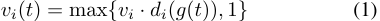

where _di_ ( _g_ ( _t_ )) is the _discounting function_ for buyer _bi_ , and _vi_ is the _original valuation_ , denoting the valuation for the item with the highest quality. We consider the independent identical valuation case, in which the original valuations of buyers follow the same distribution with cumulative distribution function _F_ ( _x_ ). For the convenience of analysis, we normalize buyers’ original valuations into the range of [1 _,_ ¯ _v_ ]. Since _di_ ( _g_ ( _t_ )) is also a function of _t_ , we simply use _di_ ( _t_ ) to denote the discounting function of buyer _bi_ in the following discussion. A discounting function can be any decreasing function subject to _di_ ( _t_ ) _∈_ (0 _,_ 1] for all _t ∈_ T. We assume that different discounting functions are bounded by a constant, i.e.,_di_<u>(</u>_t_<u>)</u> _dj_ ( _t_ )_≤η_forall_i, j_and_t_.Thisassumptionis based on the observation that the buyers usually have different but similar perspectives over the quality of the item, making the discounting functions not far away from each other. We denote _d_ ( _t_ ) = min _i di_ ( _t_ ). Following traditional priorindependent mechanism design [Goldberg _et al._ , 2001], we assume that both the cumulative distribution function and discounting functions are unknown to the seller. 

At each slot _t_ , the seller offers a price _pt_ to the current buyer _bi_ . We restrict the candidate prices to be discrete. Specifically, at each slot _t_ , we allow the seller to select a price from a discrete candidate price vector **_p_ ˆ** = (ˆ _p_ 0 _,_ ˆ _p_ 1 _, · · · ,_ ˆ _pH_ ), where _p_ ˆ _k_ = (1 + _β_ )_k_ for any 0 _≤ k ≤ H_ and _β >_ 0. Since _vi_ is normalized into [1 _,_ ¯ _v_ ] and _di_ ( _t_ )’s are upper bounded by 1, we have _H_ = _⌊_ log1+ _β_ ¯ _v⌋_ . The pricing strategies with discrete prices will bear a loss of the revenue by at most a (1+ _β_ ) factor, and thus _β_ can be regarded as a trade-off between optimality and computational complexity. Bidder _bi_ will decide whether to take the offer by comparing the price _pt_ with her current discounted valuation _vi_ ( _t_ ). Based on the decision, the _utility_ function of buyer _bi_ can be expressed as 

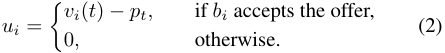

As buyers are rational, buyer _bi_ takes the offer if and only if _vi_ ( _t_ ) _≥ pt_ . The seller’s objective is to maximize the _revenue_ , which is defined as the sum of all accepted prices along the time horizon. 

We emphasize two important features of the above posted price online auction model. First, the seller would not learn the valuation _vi_ ( _t_ ) of any buyer, but only observes buyers’ responses to the prices. Second, in each time slot, the seller has to decide the price for the current buyer before seeing the next buyer. In an online auction, the seller has to utilize a pricing mechanism that can gradually learn the optimal prices through interacting with the buyers. 

Following [Goldberg _et al._ , 2001], we adopt the concept of competitive analysis to measure the performance of different pricing mechanisms. If the cumulative distribution function 

441 

Proceedings of the Twenty-Seventh International Joint Conference on Artificial Intelligence (IJCAI-18) 

#### **Algorithm 1:** DescendUponRejection 

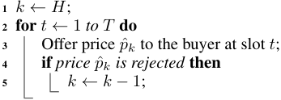

_F_ and discounting function _di_ ( _t_ )’s are known, the best strategy for the seller is to compute 

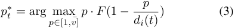

and then offer price _p__∗_ _t_tothebuyeratslot_t_. Following [Kleinberg and Leighton, 2003], we call this strategy the _ex ante_ optimal strategy, and call the revenue obtained by this strategy the _ex ante_ optimal revenue, in that it only observes the distribution _F_ , but not the individual realization of actual _vi_ ’s. We will utilize this revenue as a benchmark to evaluate the performance of different pricing mechanisms. 

## **3 Online Pricing Mechanism Design** 

In this section, we present the pricing mechanism to maximize revenue in online auction with time discounting valuations. We begin with a simple setting, where all buyers’ original valuations are fixed as a constant value. We provide a trivial pricing strategy that can perfectly fit in this setting. We further consider the general setting, where the original valuations are random variables following the same distribution, and propose a new pricing mechanism, namely Biased-UCB. 

#### **Algorithm 2:** Biased-UCB 

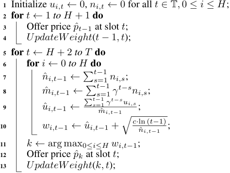

#### **Algorithm 3:** UpdateWeight 

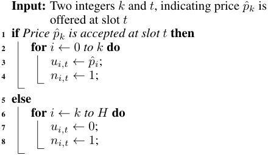

<!-- Start of picture text -->
Input: Two integers  k  and  t , indicating price p ˆ k is offered at slot  t 1 if  Price p ˆ k is accepted at slot t  then 2 for  i ← 0  to k  do 3 ui,t ← p ˆ i ; 4 ni,t ← 1; 5 else 6 for  i ← k to H do 7 ui,t ← 0; 8 ni,t ← 1; <!-- End of picture text -->

### **3.1 A Simple Case: Fixed Original Valuations** 

In this case, _vi_ ( _t_ ) is non-increasing in _t_ since all _vi_ ’s are equal to an unknown constant _v__∗_ and _di_ ( _t_ )’s are non-increasing. 

For convenience of analysis, we introduce the notation of _segment_ . We divide the whole time horizon T into _H_ + 1 segments S = _{S_ 0 _, S_ 1 _, · · · , SH }_ , where _Si_ is the set of slots in which ˆ _pi_ is the optimal discrete price regarding to the lower bound of buyers’ discounted valuations. Formally, 

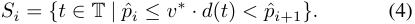

Please note that one or more segments may be empty if _v__∗_ _< p_ ˆ _H_ . In the following, we only refer to the non-empty segments when using the term segment. We assume that every segment is sufficiently long, such that _|Si| ≥_ 2( _H_ + 1) for all _Si ∈_ S. Note that we can always make this inequality hold true by choosing an appropriate value for _β_ . 

We now provide a naive pricing strategy, _DescendUponRejection_ in Algorithm 1. This strategy performs well in the fixed valuation setting, and is 21 _η_-competitivetothedis- crete _ex ante_ optimal strategy even from worst-case analysis. _DescendUponRejection_ makes only one “error guess” in each segment, except for the very first segment, where it may spend up to _H_ + 1 slots seeking the optimal price. 

The effectiveness of _DescendUponRejection_ relies on the fact that the discounted valuation _vi_ ( _t_ )’s are non-increasing in _t_ . Nevertheless, its performance can be arbitrarily bad in 

the general setting, where the original valuations are not constant. The reason is it cannot tell whether the price is rejected by a small _vi_ from _F_ , or by a sharp discount in _d_ ( _t_ ). For example, consider the non-discounting case where _d_ ( _t_ ) = 1 for all _t ∈_ T, and the _vi_ ’s are drawn from a Gaussian distribution. Every time this naive strategy is rejected by a small _vi_ , it will descend to a lower price, even though the valuation is actually not discounting in time. Soon enough, this strategy will end up offering only the lowest price. 

### **3.2 General Case: Random Original Valuations** 

In the general case where _vi_ ’s are random variables, we propose the Biased-UCB algorithm in Algorithm 2. Parameter _ui,t_ denotes the profit made at slot _t_ by offering price _p_ ˆ _i_ to the buyer. Parameter _ni,t_ reflects whether price _p_ ˆ _i_ has been _tried_ at slot _t_ . We have _ui,t_ = _p_ ˆ _i_ , _ni,t_ = 1 if price _p_ ˆ _i_ is tried and accepted at slot _t_ , _ui,t_ = 0 _, ni,t_ = 1 if price _p_ ˆ _i_ is tried but rejected, and _ui,t_ = 0 _, ni,t_ = 0 if price _p_ ˆ _i_ is not tried. Parameter _c_ determines the trade-off between the exploitation and exploration. _γ_ is the _attenuation factor_ that measures to what extent the historical information is valued, where 0 _< γ ≤_ 1. The _UpdateWeight_ procedure is defined in Algorithm 3. 

The Biased-UCB algorithm follows the Upper Confidence Bound (UCB) framework from bandit problems. In the classical UCB1 algorithm proposed in [Auer _et al._ , 2002], the 

442 

Proceedings of the Twenty-Seventh International Joint Conference on Artificial Intelligence (IJCAI-18) 

authors keep a record of the average reward ( _u_ ˆ _i,t_ ) of each arm, and use the number of plays ( _n_ ˆ _i,t_ ) to denote the uncertainty of the arms. In our problem, however, since the reward distribution behind each candidate price is not fixed, we are confronted with a non-stationary MAB problem, and thus we value the recent information more than the historical records a long time ago. In this case, we utilize the parameter _γ_ to make the value of information attenuate over time. 

Additionally, in _UpdateWeight_ , instead of only updating the weight of one particular price _p_ ˆ _k_ , we update the weights of all the prices no higher than (or no lower than) this offered price. Here, we distinguish the expression of _trying_ a candidate price from _offering_ a candidate price. Only one price will be offered to the buyer at one slot, but we can imagine the results of trying some other prices. For example, if _p_ ˆ _k_ is offered and accepted at a certain slot, we are sure that all the prices no higher than _p_ ˆ _k_ will also be accepted. We then hypothetically try these prices and also update their information accordingly (line 3 and 4). On the other hand, if _p_ ˆ _k_ is rejected, the profit information of all the prices no lower than _p_ ˆ _k_ will be updated with 0 (line 7 and 8). 

Our proposed algorithm is _biased_ , in that it always encourages lower prices and suppresses higher prices. In the following subsection, we will see this biased characteristic fits perfectly in the discounting setting, as well as provides much convenience for mathematical analysis. 

### **3.3 Theoretical Analysis of Biased-UCB** 

In [Kleinberg and Leighton, 2003], the authors provide mathematical analysis for applying UCB1 algorithm to postedprice online auctions. However, the techniques they employed cannot be applied to our non-stationary MAB setting. One of the fundamental challenges in our problem is that the reward distribution behind each non-stationary arm is not constant, and thus the Chernoff-Hoeffding bound is not available. Therefore, we have to carry out our theoretical analysis from a brand-new perspective. 

We will first analyze the performance of Biased-UCB in the fixed original valuation case as defined in 3.1, and then extend the proof idea to the general case. In the following discussion, we focus on the discounting function lower bound _d_ ( _t_ ), and by doing so we bear a loss of revenue by no more than a factor _η_ . 

We propose three properties, namely, _accurate start_ , _stable optimality_ , and _quick reaction_ . Accurate start requires an algorithm to find exactly the optimal price at the very beginning; stable optimality guarantees the algorithm will stick to the optimal price once it is found; and quick reaction asks the algorithm to find the new optimal price quickly once the optimal price changes. These three properties together ensure the pricing mechanism is competitive. 

We show Biased-UCB indeed possesses these properties, and its competitive ratio towards discrete _ex ante_ optimal strategy is lower bounded by _η_<u>1</u>(1_−βr_)(1_−_ 1+1 _βr_),where 

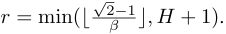

#### **Accurate Start** 

Recall that in 3.1, one severe drawback of _DescendUponRejection_ is that it may waste a long time in seeking the opti- 

mal price in the first segment. To address this issue, we want a competitive pricing strategy to “start” in a reasonably fast way in the first segment. Since the UCB framework forces our algorithm to try each price at least once in the first _H_ + 1 slots, we put the accurate start constraint on the ( _H_ + 2)-th slot by proving the following theorem. 

**Theorem 3.1.** _At the_ ( _H_ + 2) _-th slot, Biased-UCB always offers the optimal price of the first segment._ 

_Proof._ Let _Se_ denote the first segment, where _e_ not necessarily equals _H_ . According to our previous definitions, _p_ ˆ _e_ denotes the optimal price of segment _Se_ , i.e., _p_ ˆ _e ≤ v__∗_ _· d_ ( _t_ ) _< p_ ˆ _e_ +1 for all _t ∈ Se_ . It’s then equivalent to prove that _we,H_ +1 _> wk,H_ +1 for all _k ∈{_ 0 _,_ 1 _, . . . , e−_ 1 _, e_ +1 _, . . . , H}_ . 

For any candidate price _p_ ˆ _k_ 1 ( _e < k_ 1 _≤ H_ ), we must have _u_ ˆ _k_ 1 _,H_ +1 = 0 and _n_ ˆ _k_ 1 _,H_ +1 = _k − e_ , since every time a price lower than _p_ ˆ _k_ 1 is offered and rejected, _p_ ˆ _k_ 1 will also be hypothetically tried and rejected. Similarly, for any candidate price _p_ ˆ _k_ 2 (0 _≤ k_ 2 _≤ e_ ), we must have _n_ ˆ _k_ 2 _,H_ +1 = _e − k_ 2 + 1 <u>�</u> _Hs_ =+11_<u>γt−suk</u>_ <u>2</u>_<u>,s</u>_ and _u_ ˆ _k_ 2 _,H_ +1 = <u>�</u> _Hs_ =1+1_γt−snk_ 2_,s_= (1 +_β_)_k_2.Therefore, the following two inequalities trivially hold true: 

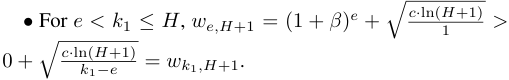

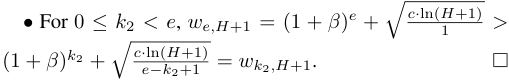

#### **Stable Optimality** 

The stable optimality property requires that once an algorithm finds the optimal price of a segment, it will stick to that price until the end of this segment. We show Biased-UCB partially possesses this property by proving the following theorem. 

**Theorem 3.2.** _For the first r segments, once Biased-UCB offers the optimal price of this segment at a certain slot, it will continue offering that optimal price in the following slots of this segment. By abandoning the last e − r_ + 1 _segments and the first_ ∆ _slots in each remaining segment, the competitive ratio towards discrete ex ante optimal revenue is lower bounded by η_ <u>1</u>(1_−βr_)(1_−_ 1+1 _βr_)_,where_ _r_ = min( _⌊_ _<u>√</u>_ <u>2</u> _β−_ <u>1</u> _⌋, H_ + 1) _._ 

_Proof._ We leave the proof of Theorem 3.2 to our technical report [Mao _et al._ , 2018] due to limitation of space. 

#### **Quick Reaction** 

According to the stable optimality property, _p_ ˆ _h_ is the offered price by the end of segment _Sh_ . When first entering segment _Sh−_ 1, where price _p_ ˆ _h_ will be rejected and produce 0 profit, it may take some time for our algorithm to realize _p_ ˆ _h_ is not optimal anymore and adjust the weights accordingly. The quick reaction property requires that our algorithm should spend no more than a bounded number (∆) of slots seeking the new optimal price _p_ ˆ _h−_ 1. We show Biased-UCB partially possesses this property by proving the following theorem. 

443 

Proceedings of the Twenty-Seventh International Joint Conference on Artificial Intelligence (IJCAI-18) 

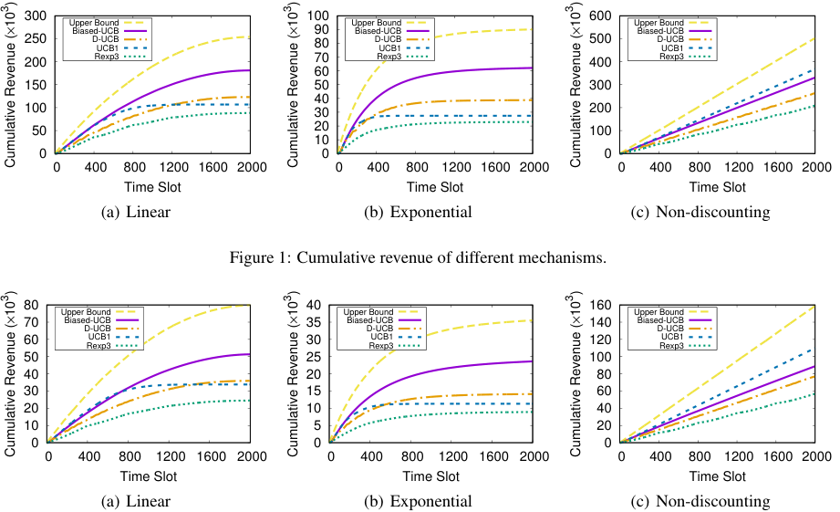

<!-- Start of picture text -->
300 100 600 Upper Bound Upper Bound Upper Bound Biased-UCB 90 Biased-UCB Biased-UCB 250 D-UCBUCB1 80 D-UCBUCB1 500 D-UCBUCB1 200 Rexp3 70 Rexp3 400 Rexp3 60 150 50 300 40 100 30 200 50 20 100 10 0 0 0  0  400  800  1200  1600  2000  0  400  800  1200  1600  2000  0  400  800  1200  1600  2000 Time Slot Time Slot Time Slot (a) Linear (b) Exponential (c) Non-discounting Figure 1: Cumulative revenue of different mechanisms. 80 40 160 Upper Bound Upper Bound Upper Bound 70 Biased-UCBD-UCB 35 Biased-UCBD-UCB 140 Biased-UCBD-UCB 60 UCB1 30 UCB1 120 UCB1 Rexp3 Rexp3 Rexp3 50 25 100 40 20 80 30 15 60 20 10 40 10 5 20 0 0 0  0  400  800  1200  1600  2000  0  400  800  1200  1600  2000  0  400  800  1200  1600  2000 Time Slot Time Slot Time Slot (a) Linear (b) Exponential (c) Non-discounting 3Cumulative Revenue ()10× 3Cumulative Revenue ()10× 3Cumulative Revenue ()10× 3Cumulative Revenue ()10× 3Cumulative Revenue ()10× 3Cumulative Revenue ()10× <!-- End of picture text -->

Figure 2: Cumulative revenue for dispersed valuations. 

**Theorem 3.3.** _For the first r segments, it takes Biased-UCB no more than_ ∆ _slots before switching to the new optimal price when entering a new segment. The value of r and the competitive ratio remain the same as in Theorem 3.2._ 

_Proof._ We leave the proof of Theorem 3.3 to our technical report [Mao _et al._ , 2018] due to limitation of space. 

Now we extend the preceding proof idea to the general case. Since buyers’ original valuations are not fixed in the general case, our previous definition of segment no longer holds. We present a slightly different definition of _segment_ based on the price _p__∗_ _t_offered by the discrete_ex ante_optimal strategy at slot _t_ . 

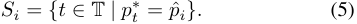

In the general case, the validity of the three properties relies on a further assumption that buyers’ original valuations _d_ <u>(</u> _t_ <u>)</u> are not too dispersed. Formally, we assume _v_ ¯ _≤ d_ ( _t_ + _δ_ )for all _t ∈_ T, where the value of _δ_ determines the balance between the stringency of the cumulative distribution function _F_ and optimality of the guaranteed revenue. Intuitively, this assumption ensures that violations of the three properties can only occur near the two endpoints of a segment. 

Following the same procedure as the simple case, we abandon the first _δ_ + ∆ slots and the last _δ_ slots in each segment, and argue that the remaining slots satisfy the three properties. Therefore, Biased-UCB is at least _η_<u>1</u>[1_−βr −_2_δ_<u>(</u>_e_ _T_<u>+1)</u> ](1 _−_ 1+1 _βr_)-competitivetowardsdiscrete_exante_optimalstrategy 

in the general case, where _r_ = min( _⌊_ _<u>√</u>_ <u>2</u> _β−_ <u>1</u> _⌋, H_ + 1), as- _d_ <u>(</u> _t_ <u>)</u> suming _v_ ¯ _≤ d_ ( _t_ + _δ_ )forall_t∈_T.Pleasenotethattheper- formance guarantee relies on an overly stringent assumption on buyers’ valuations and seems relatively weak. This is because we are performing worst-case analysis without putting any restriction on the discounting functions. Considering the difficulty of our general discounting model, we think this relatively weak bound is acceptable. 

## **4 Numerical Results** 

In this section, we empirically compare our mechanism with the upper bound of total revenue, and with mechanisms adapted from existing bandit algorithms, including UCB1 [Auer _et al._ , 2002], D-UCB [Garivier and Moulines, 2011] and Rexp3 [Besbes _et al._ , 2014]. The upper bound of total revenue is defined as the sum of all buyers’ discounted valuations, and is obviously the upper bound of any pricing mechanism. D-UCB is a non-stationary MAB algorithm that employs similar concept to the attenuation factor in our paper. Rexp3 is also a non-stationary MAB algorithm. It divides the time horizon into several batches and restarts an Exp3 algorithm [Auer _et al._ , 1995] at the beginning of each batch. 

We use the real-world bidding feedback log [Zhang _et al._ , 2014] from the iPinYou company as our dataset. This dataset was released in a real-time bidding competition held by iPinYou in 2013. It contains logs of ad auctions, bids, impressions, clicks and final conversions during ten days in 2013, and we use the 9 _._ 58 _×_ 106 records of bidding prices on June 6, 2013 as our valuation distribution. The bidding prices 

444 

Proceedings of the Twenty-Seventh International Joint Conference on Artificial Intelligence (IJCAI-18) 

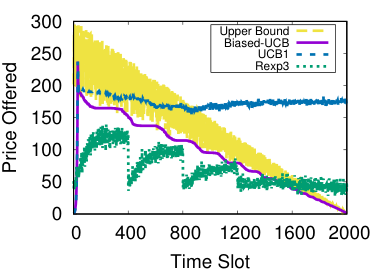

<!-- Start of picture text -->
300 Upper Bound Biased-UCB 250 UCB1 Rexp3 200 150 100 50 0  0  400  800  1200  1600  2000 Time Slot Price Offered <!-- End of picture text -->

Figure 3: Prices offered at each time slot. 

range from 227 to 300 and the unit is RMB fen _×_ 1000. We try three discounting functions, including linear discount _g_ ( _t_ ) = 1 _−__<u>t−</u>_ _T_<u>1</u>, exponential discount_g_(_t_) =_α_1_−t_and non-discount _g_ ( _t_ ) = 1. We set _di_ ( _g_ ( _t_ )) = _ai · g_ ( _t_ ), where _ai_ ’s are independently and uniformly drawn from [0 _._ 8 _,_ 1 _._ 0]. In each run we randomly select 2000 bids (i.e., _T_ = 2000) from the dataset as buyers’ original valuations, and multiply each price by the current value of discounting function to get the discounted valuation. We set price discretization level _β_ = 0 _._ 2, exploration-exploitation control parameter _τ_ = 0 _._ 5 for Rexp3 and _c_ = 400 _._ 0 for other algorithms, exponential discount factor _α_ = 1 _._ 003, attenuation factor _γ_ = 0 _._ 9 for Biased-UCB and D-UCB, and batch size ∆= 400 for Rexp3. All results are averaged over 200 runs. 

Figure 1 shows the evaluation results for cumulative revenue obtained in the first _t_ slots. We can see that Biased-UCB performs better than existing methods. The total revenue of Biased-UCB is 71 _._ 2% of the upper bound for linear discount, and 69 _._ 0% for exponential discount. In the non-discount case, Biased-UCB performs slightly worse than UCB1, since it is designed to try lower prices first when being rejected. Nevertheless, it still achieves 89 _._ 9% revenue of UCB1. 

Figure 2 shows the results for more dispersed valuations, where the original valuations are drawn from a Gaussian distribution _N_ (150 _,_ 302 ) rather than the bidding dataset. Although our theoretical analysis relies on the compactness of buyers’ valuation distribution, we can see Biased-UCB still performs well on very dispersed valuations. 

To give an intuitive description of different mechanisms, we now plot the prices offered by different mechanisms at each time slot. Take linear discount as an example. The prices offered by the upper bound are exactly buyers’ actual discounted valuations. These prices roughly form a triangular shape in Figure 3, and at the first slot, buyers’ discounted valuations are in the range of [0 _._ 8 _×_ 227 _,_ 1 _._ 0 _×_ 300]. The UCB1 algorithm is a stationary MAB algorithm. It first finds an optimal price at the early stage, accumulating (overly) large weight on that price, and then stick to that price ever since. Therefore, the prices offered by UCB1 basically form a horizontal line in Figure 3. The prices offered by Rexp3, unsurprisingly, show an obvious restarting pattern. The D-UCB algorithm possesses a similar restarting pattern as Rexp3, only with shorter restarting period, and is thus omitted. The prices offered by the Biased-UCB mechanism firmly follow 

the lower bound of buyers’ discounted valuations, and thus Biased-UCB achieves good performance in terms of revenue. 

## **5 Related Works** 

In [Lavi and Nisan, 2000], the problem of online auction was first introduced to the literature of computer science. Later, Goldberg _et al._ [2001] began the study of (offline) auctions for digital goods. Bar-Yossef _et al._ [2002] studied online auctions for digital goods, and employed randomization to ensure truthfulness. Online learning was first applied to online auctions in an early version of [Blum _et al._ , 2004]. Kleinberg and Leighton [2003] demonstrated how to apply bandit algorithms to online auctions. Hajiaghayi _el al._ [2005] studied the problem of online scheduling for reusable goods. However, these mechanisms did not take time discounting valuation into consideration. 

In management science literature, the stochastic demand model is categorized into dynamic pricing problems. Gallego and Van Ryzin [1994] investigated the problem of selling a given stock of items by a deadline. Problems of similar setting were also considered in [Levin _et al._ , 2010; Gershkov _et al._ , 2017]. Nevertheless, these works are only concerned with finite inventories, assuming the demand curve is known to the seller, and are essentially different from our problem. Mechanisms with discounting values are also considered in computer science literature. Secretary problems with weights and discounts were discussed in [Babaioff _et al._ , 2009]. Wu _et al._ [2014] presented a strategy-proof online auction with discounting valuations, but they assume the discounting functions are known to the seller, and their objective is to maximize social welfare instead of revenue. A recent work [Xu _et al._ , 2017] considered dynamic pricing with time-variant rewards, but the variant part in their setting is the utility function instead of the valuations, and their weight function is basically linear. 

In the seminal work of [Auer _et al._ , 2002], the UCB framework was proposed to solve multi-armed bandit problems. For bandits with non-stationary rewards, Besbes _et al._ [2014] suggested dividing the time horizon into batches, and restarting a traditional bandit algorithm at the beginning of each batch. Bandits with abruptly changing rewards were discussed in [Hartland _et al._ , 2006; Garivier and Moulines, 2011]. Similar works include bandit problem with Markovian rewards [Tekin and Liu, 2010] and reward functions following Brownian motion [Slivkins and Upfal, 2008]. Nonetheless, bandit algorithms need to be carefully modified before being applied to pricing problems. 

## **6 Conclusion** 

In this paper, we have studied the problem of revenue maximization in posted-price auctions with unknown time discounting valuations. We have modeled the revenue maximization problem as a non-stationary MAB optimization, and proposed the Biased-UCB mechanism based on unique features of the discounting valuations. We have theoretically analyzed the lower bound of the competitive ratio. Our numerical results have shown that our design achieves good performance in terms of revenue. 

445 

Proceedings of the Twenty-Seventh International Joint Conference on Artificial Intelligence (IJCAI-18) 

## **Acknowledgments** 

This work was supported in part by the State Key Development Program for Basic Research of China (973 project 2014CB340303), in part by China NSF grant 61672348, 61672353, and 61472252, and in part by Shanghai Science and Technology fund 15220721300. The opinions, findings, conclusions, and recommendations expressed in this paper are those of the authors and do not necessarily reflect the views of the funding agencies or the government. 

## **References** 

- [Auer _et al._ , 1995] Peter Auer, Nicolo Cesa-Bianchi, Yoav Freund, and Robert E Schapire. Gambling in a rigged casino: The adversarial multi-armed bandit problem. In _FOCS_ , 1995. 

- [Auer _et al._ , 2002] Peter Auer, Nicolo Cesa-Bianchi, and Paul Fischer. Finite-time analysis of the multiarmed bandit problem. _Machine learning_ , 47(2-3):235–256, 2002. 

- [Babaioff _et al._ , 2009] Moshe Babaioff, Michael Dinitz, Anupam Gupta, Nicole Immorlica, and Kunal Talwar. Secretary problems: weights and discounts. In _SODA_ , 2009. 

- [Bar-Yossef _et al._ , 2002] Ziv Bar-Yossef, Kirsten Hildrum, and Felix Wu. Incentive-compatible online auctions for digital goods. In _SODA_ , 2002. 

- [Besbes _et al._ , 2014] Omar Besbes, Yonatan Gur, and Assaf Zeevi. Stochastic multi-armed-bandit problem with nonstationary rewards. In _NIPS_ , 2014. 

- [Blum _et al._ , 2004] Avrim Blum, Vijay Kumar, Atri Rudra, and Felix Wu. Online learning in online auctions. _Theoretical Computer Science_ , 324(2-3):137–146, 2004. 

- [Chawla _et al._ , 2016] Shuchi Chawla, Nikhil R Devanur, Anna R Karlin, and Balasubranianian Sivan. Simple pricing schemes for consumers with evolving values. In _SODA_ , 2016. 

- [Gallego and Van Ryzin, 1994] Guillermo Gallego and Garrett Van Ryzin. Optimal dynamic pricing of inventories with stochastic demand over finite horizons. _Management Science_ , 40(8):999–1020, 1994. 

- [Garivier and Moulines, 2011] Aur´elien Garivier and Eric Moulines. On upper-confidence bound policies for switching bandit problems. In _ALT_ , 2011. 

- [Gershkov _et al._ , 2017] Alex Gershkov, Benny Moldovanu, and Philipp Strack. Revenue-maximizing mechanisms with strategic customers and unknown, markovian demand. _Management Science_ , 2017. 

- [Goldberg _et al._ , 2001] Andrew V Goldberg, Jason D Hartline, and Andrew Wright. Competitive auctions and digital goods. In _SODA_ , 2001. 

- [Hajiaghayi, 2005] Mohammad T Hajiaghayi. Online auctions with re-usable goods. In _EC_ , 2005. 

- [Hartland _et al._ , 2006] C´edric Hartland, Sylvain Gelly, Nicolas Baskiotis, Olivier Teytaud, and Michele Sebag. Multiarmed bandit, dynamic environments and meta-bandits. _Online Trading between Exploration and Exploitation Workshop, NIPS_ , 2006. 

- [Hu and Zhang, 2017] Zehong Hu and Jie Zhang. Optimal posted-price mechanism in microtask crowdsourcing. In _IJCAI_ , 2017. 

- [Kleinberg and Leighton, 2003] Robert Kleinberg and Tom Leighton. The value of knowing a demand curve: Bounds on regret for online posted-price auctions. In _FOCS_ , 2003. 

- [Lavi and Nisan, 2000] Ron Lavi and Noam Nisan. Competitive analysis of incentive compatible on-line auctions. In _EC_ , 2000. 

- [Levin _et al._ , 2010] Yuri Levin, Jeff McGill, and Mikhail Nediak. Optimal dynamic pricing of perishable items by a monopolist facing strategic consumers. _Production and Operations Management_ , 19(1):40–60, 2010. 

- [Mao _et al._ , 2018] Weichao Mao, Zhenzhe Zheng, Fan Wu, and Guihai Chen. Technical report, 2018. https://drive.google.com/open?id= 18GwsahidHGFGxhrwMqCAhgexpJKNRA2l. 

- [Mehta _et al._ , 2017] Sameer Mehta, Milind Dawande, Ganesh Janakiraman, and Vijay Mookerjee. Sustaining a good impression: mechanisms for selling ’partitioned’ impressions at ad-exchanges. 2017. 

- [Myerson, 1981] Roger B Myerson. Optimal auction design. _Mathematics of operations research_ , 6(1):58–73, 1981. 

- [Slivkins and Upfal, 2008] Aleksandrs Slivkins and Eli Upfal. Adapting to a changing environment: the brownian restless bandits. In _COLT_ , 2008. 

- [Sumita _et al._ , 2017] Hanna Sumita, Yasushi Kawase, Sumio Fujita, and Takuro Fukunaga. Online optimization of video-ad allocation. In _IJCAI_ , 2017. 

- [Tekin and Liu, 2010] Cem Tekin and Mingyan Liu. Online algorithms for the multi-armed bandit problem with markovian rewards. In _Allerton_ , 2010. 

- [Wu _et al._ , 2014] Fan Wu, Junming Liu, Zhenzhe Zheng, and Guihai Chen. A strategy-proof online auction with time discounting values. In _AAAI_ , 2014. 

- [Xu _et al._ , 2017] Lei Xu, Chunxiao Jiang, Yi Qian, Youjian Zhao, Jianhua Li, and Yong Ren. Dynamic privacy pricing: A multi-armed bandit approach with time-variant rewards. _IEEE Transactions on Information Forensics and Security_ , 12(2):271–285, 2017. 

- [Zhang _et al._ , 2014] Weinan Zhang, Shuai Yuan, Jun Wang, and Xuehua Shen. Real-time bidding benchmarking with ipinyou dataset. _arXiv preprint arXiv:1407.7073_ , 2014. 

- [Zhang _et al._ , 2017] Zijun Zhang, Zongpeng Li, and Chuan Wu. Optimal posted prices for online cloud resource allocation. In _SIGMETRICS_ , 2017. 

- [Zheng _et al._ , 2017] Zhenzhe Zheng, Yanqing Peng, Fan Wu, Shaojie Tang, and Guihai Chen. An online pricing mechanism for mobile crowdsensing data markets. In _MobiHoc_ , 2017. 

446 

