Proceedings of the Thirty-Second International Joint Conference on Artificial Intelligence (IJCAI-23) 

# **Truthful Auctions for Automated Bidding in Online Advertising** 

**Yidan Xing**1 , **Zhilin Zhang**2 , **Zhenzhe Zheng**1_,∗_ , **Chuan Yu**2 , **Jian Xu**2 , **Fan Wu**1 and **Guihai Chen**1 

1Department of Computer Science and Engineering, Shanghai Jiao Tong University 

2Alibaba Group 

_{_ katexing, zhengzhenzhe _}_ @sjtu.edu.cn, _{_ zhangzhilin.pt, yuchuan.yc, xiyu.xj _}_ @alibaba-inc.com, _{_ fwu, gchen _}_ @cs.sjtu.edu.cn 

## **Abstract** 

Automated bidding, an emerging intelligent decision making paradigm powered by machine learning, has become popular in online advertising. Advertisers in automated bidding evaluate the cumulative utilities and have private financial constraints over multiple ad auctions in a long-term period. Based on these distinct features, we consider a new ad auction model for automated bidding: the values of advertisers are public while the financial constraints, such as budget and return on investment (ROI) rate, are private types. We derive the truthfulness conditions with respect to private constraints for this multi-dimensional setting, and demonstrate any feasible allocation rule could be equivalently reduced to a series of non-decreasing functions on budget. However, the resulted allocation mapped from these non-decreasing functions generally follows an irregular shape, making it difficult to obtain a closed-form expression for the auction objective. To overcome this design difficulty, we propose a family of truthful automated bidding auction with personalized rank scores, similar to the Generalized Second-Price (GSP) auction. The intuition behind our design is to leverage personalized rank scores as the criteria to allocate items, and compute a critical ROI to transform the constraints on budget to the same dimension as ROI. The experimental results demonstrate that the proposed auction mechanism outperforms the widely used ad auctions, such as first-price auction and second-price auction, in various automated bidding environments. 

## **1 Introduction** 

With the success of machine learning in online advertising [Zhang _et al._ , 2014; Gharibshah and Zhu, 2021], advertisers turned to adopting automated bidding ( _auto-bidding_ ) tools instead of bidding manually, bringing significant changes to the interaction between advertisers and online platforms [Google Ads, 2021; Facebook Ads, 2021]. In auto-bidding services, advertisers submit their high-level optimization objectives 

> _∗_ Zhenzhen Zheng is the corresponding author. 

and constraints to the platform, and then the bidding agents, powered by machine learning algorithms, make detailed bidding decisions in each of ad auctions on behalf of the advertisers. With the help of automated bidding tools, advertisers can optimize their overall advertising objectives with respect to their financial constraints in a high-level way. 

Under automated bidding, we revisit a fundamental problem in auction theory: whether the conventional auction model, where advertisers have private values for items ( _i.e._ , ad impressions) and conduct corresponding strategic bidding for each single auction, is still appropriate for the new advertising paradigm. As the platform can access historical data about the interactions between advertisers and users, we can estimate the potential actions of users (such as clicks and conversions), which can be regarded as public values of items for advertisers. In auto-bidding, the private information from advertisers are actually their constraints for the whole advertising campaign. These features require a new ad auction model to incentivize advertisers to truthfully reveal the high-level private constraints given the values of items are public. 

In this work, we consider a new automated bidding auction model, where advertisers submit budget as well as return on investment (ROI) requirement as their (private) constraints, and aim to maximize the cumulative values of winning impressions from multiple auctions during a certain period. We analyse the truthfulness conditions with respect to the private constraints of budget and ROI. Remarkably, we show that any truthful auction mechanism for this multi-dimensional setting could be equivalently represented by a series of nondecreasing functions with budget as input. When these nondecreasing functions are realized to derive the corresponding auction mechanism, the truthful conditions of budget and ROI introduce a new value grouping phenomenon: different budget-ROI types are grouped to share the same cumulative value, and the grouping pattern is determined by a threshold ROI function (transformed from the above non-decreasing function). As the threshold ROI functions are not constrained in monotonicity, the grouping shape of budget-ROI types is generally irregular, making it difficult to obtain the closedform expression of grouping types and then the auction optimization objectives, such as revenue and social welfare. 

Facing these design difficulties, we propose a family of ad auctions with personalized rank scores to optimize various design objectives. Our auction adopts rank scores as the cri- 

2915 

Proceedings of the Thirty-Second International Joint Conference on Artificial Intelligence (IJCAI-23) 

teria to determine item allocations, which shares the similar ideas with Generalized Second-Price (GSP) auction [Edelman _et al._ , 2007]. In guaranteeing truthfulness for the private constraints, we design _critical ROI_ to be the largest ROI that can win the most items without breaking the budget constraint. It equivalently transforms budget to the same dimension as ROI, thus allowing us to find a tight constraint limits the bidder from getting extra utilities and utilize this tight constraint to prevent misreporting. We conduct extensive experiments to evaluate the performances of the proposed auction mechanism under various auto-bidding settings. The evaluation results demonstrate that the designed truthful auction can generally achieve more than 90% performance (in terms of revenue and social welfare) of the optimal baselines without the consideration of truthfulness. The main contributions can be summarized as follows: 

_•_ We consider the unique features within the interaction between advertisers and online platforms in the context of automated bidding. Based on these features, we formulate a new auto-bidding auction model, where value-maximizing bidders have high-level constraints as private information and the values of items are public. 

- We investigate truthfulness conditions of two-dimensional 

- private constraints, budget and ROI, under public value setting. We provide full characterizations for the feasible space of allocation and payment for truthful auctions. 

- Based on the derived truthfulness conditions, we design a 

- family of truthful ad auction mechanisms for automated bidding. With the newly designed rank score functions, the proposed ad auction is simple and flexible to be adapted into various auto-bidding settings with different optimization goals such as revenue and social welfare. 

_•_ We evaluate our proposed auction mechanisms with various experimental settings, and the empirical results validate the effectiveness of the proposed auctions regarding its performances in terms of social welfare and revenue. 

## **2 Preliminaries** 

In this section, we first motivate the considered auction design problem by the online advertising system with automated bidding services, and afterwards propose the formal auction model based on the features of automated bidding. 

### **2.1 Online Advertising System** 

The working process of the online advertising auction system is illustrated in Figure 1. From an advertiser’s perspective, it can be described as follows: 

1) The advertiser sets the bidding configuration in autobidding interface: chooses optimization objectives ( _e.g._ , maximizing clicks or conversions) and sets cost constraints ( _e.g._ , budget per day, targeted return on investment (ROI) and maximum cost per click). The advertiser requires her realized ROI, defined as the ratio of her gained value and payment, to be higher than her targeted ROI. 

2) Based on the advertiser’s configuration, an auto-bidding agent represents the advertisers to make bid decisions in multiple auctions. When each user impression comes, the autobidding agents attend an ad auction to compete for the ad display opportunities. 

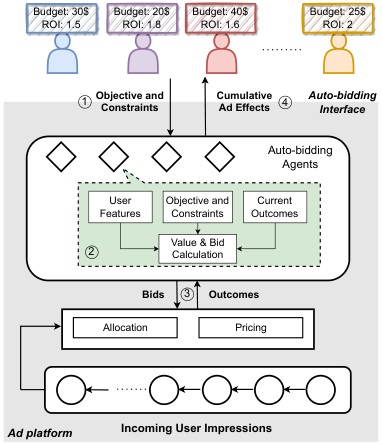

<!-- Start of picture text -->
Budget: 30$  Budget: 20$  Budget: 40$  Budget: 25$ ROI: 1.5 ROI: 1.8 ROI: 1.6 ROI: 2 1 Objective and Constraints CumulativeAd Effects 4 Auto-bidding Interface Auto-bidding Agents User Objective and Current Features Constraints Outcomes Value & Bid 2 Calculation Bids 3 Outcomes Allocation Pricing Ad platform Incoming User Impressions <!-- End of picture text -->

Figure 1: Ad Auction System Overview 

3) The auto-bidding agent adopts data-driven algorithms to predict the value (click through rate or conversion rate) of the incoming user impression, and bid for each impression while taking the cost constraints into consideration. 

4) During the multiple auctions, the advertiser can check the cumulative auction outcomes, including spent budget, received impressions, clicks, conversions and the average costs. The advertisers can further adjust their auto-bidding settings in the interface to achieve their own advertising objectives. 

From the above interaction between advertisers and the platform/auctioneer, we summarize three new features about the online advertising with auto-bidding services. First, advertisers only report _high-level optimization objectives and constraints_ in the bidding configurations for multiple auctions, but not the fine-grained bid for each auction. Second, advertisers only evaluate _cumulative long-term performances and costs_ of multiple auctions, instead of the outcome of each individual auction. Third, since the online platform can access all the data produced in advertising, it is reasonable to claim _the monetary value_ of an incoming impression to a specific advertiser can be calculated exactly. As the behavior patterns of advertisers and the online platform change distinctly in automated bidding, we need to investigate the mechanism design whose formats align with these new features. 

### **2.2 Auction Model** 

Based on the motivations of the above online advertising system with auto-bidding, we propose the formal auction model considered in this work. There are _n_ advertisers competing for _m_ items (user impressions) coming in sequence during a time period with _m_ time slots, where only one item would appear in each time slot.1 The advertisers are _value-maximizing_ bidders [Fadaei and Bichler, 2016; Balseiro _et al._ , 2022; Mehta, 2022], who care about the cumulative value of her 

1We would use advertisers with bidders, and items with impressions interchangeably throughout the work. 

2916 

Proceedings of the Thirty-Second International Joint Conference on Artificial Intelligence (IJCAI-23) 

allocated impressions across all the time slots when the payment is within their financial constraints. Each advertiser _i_ has budget ( _Bi ≥_ 0) and ROI ( _Ri >_ 0) constraints, which are private information and are also called as type _ti_ = ( _Bi, Ri_ ) in mechanism design literature. We denote the type profile of all the advertisers as **_t_** = ( _ti_ )_n_ _i_ =1andthespaceofthetype profile as _T_ =�_n_ _i_ =1_Ti_with**_t_**_∈T_and_Ti_=_Bi× Ri_.We denote the reported type of the other bidders except bidder _i_ as **_t_** _−i_ = ( _t_ 1 _, . . . , ti−_ 1 _, ti_ +1 _, . . . , tn_ ) and _T−i_ =�_n_ _k̸_ = _i__Tk_. We assume advertisers’ valuations on items are public information to the platform. We use _vi,j >_ 0 to represent the advertiser _i_ ’s valuation on item _j_ . 

After collecting the budget and ROI of all the bidders, the online platform employs some auction mechanism ( _A, P_ ) to decide ad allocations and payments, where _A_ denote a (randomized) allocation rule _A_ : _T →_ [0 _,_ 1]_n×m_ and _P_ denote a (randomized) payment rule _P_ : _T →_ R_n_ . Specifically, for a reported type profile **_t_**_′_ _∈T_ , the probability of bidder _i_ being allocated item _j_ is denoted by _ai,j_ ( **_t_**_′_ ) and the expected payment of bidder _i_ is denoted by _pi_ ( **_t_**_′_ ). For any item _j ∈_ [ _m_ ], the allocation constraint is�_n_ _i_ =1_ai,j_(**_t_**_′_)_≤_1.Bidder_i_’s cu- mulative value in these auctions is 

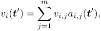

and her realized ROI is ROI _i_ ( **_t_**_′_ ) := _vi_ ( **_t_**_′_ ) _/pi_ ( **_t_**_′_ ) (considered as + _∞_ if _pi_ ( **_t_**_′_ ) = 0). 

The utility for a bidder with budget and ROI constraints and true type _ti_ when reporting _t__′_ _i_is defined as 

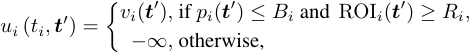

where the type profile **_t_**_′_ = ( _t__′_ _i__,_**_t_** _−__′_ _i_). 

In this work, we focus on designing _truthful_ auction mechanisms satisfying incentive compatible (IC) and individual rationality (IR) conditions for budget and ROI, which is a two-dimensional mechanism design problem. Various multidimensional mechanism design problems are shown to be difficult in both analytical and computational aspects [Pavlov, 2011; Chen _et al._ , 2014; Daskalakis, 2015]. In particular, we consider _dominant-strategy incentive compatible_ (DSIC) and individual rationality (IR) direct-revelation mechanisms. 

**Definition 2.1.** _An auction mechanism is dominant strategy incentive compatible (DSIC) if ∀i ∈_ [ _n_ ] _, ti, t__′_ _i__∈Ti,_**_t_**_−i∈_ _T−i: ui_ ( _ti,_ ( _ti,_ **_t_** _−i_ )) _≥ ui_ ( _ti,_ ( _t__′_ _i__,_**_t_**_−i_))_._ **Definition 2.2.** _An auction mechanism is individual rationality (IR) if ∀_ **_t_** _∈T , i ∈_ [ _n_ ] _: pi_ ( **_t_** ) _≤ Bi and_ ROI _i_ ( **_t_** ) _≥ Ri._ 

The online platform typically has some objectives to maximize. Two common design objectives are _revenue_ and _social welfare_ . Revenue is defined as the sum of payment from bidders, _i.e._ ,� _i__pi_(**_t_**).For social welfare, we need a synony- mous metric, _liquid welfare_ , defined as the maximum revenue that can be extracted from bidders without breaking IR constraints, to incorporate the existence of financial constraints [Azar _et al._ , 2017; Aggarwal _et al._ , 2019]. In our context, liquid welfare can be defined as 

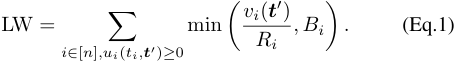

## **3 Characterization of Truthfulness** 

### **3.1 Conditions for Truthfulness** 

In this section, we investigate the truthfulness conditions for this multi-dimensional mechanism design problem. Due to the limitation of space, we present the detailed proofs of our results in the full version of this paper [Xing _et al._ , 2023]. 

To provide an intuition about the differences between auction models with private constraint and private valuation, we start from the analysis of one private constraint. To satisfy the IC property on budget, we need to guarantee the bidders for not obtaining a higher utility by reporting a smaller or larger budget. As reporting a smaller budget will not lead a bidder to break her original budget constraint, the gained utility should decrease for reducing the budget. For the bidder misreporting a larger budget and obtaining higher values, we need to charge the bidder to break her original budget constraint, resulting in negative infinite utility to prevent misreporting. 

**Theorem 3.1.** _An auction mechanism is DSIC on budget B only if ∀i ∈_ [ _n_ ] _, R ∈Ri,_ **_t_** _−i ∈T−i:_ 

_(1) vi_ (( _B, R_ ) _,_ **_t_** _−i_ ) _is non-decreasing in B;_ 

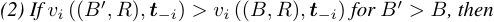

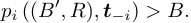

We can form a similar statement for ROI by showing that there is no incentive for a bidder to misreport her ROI. **Theorem 3.2.** _An auction mechanism is DSIC on ROI R only if ∀i ∈_ [ _n_ ] _, B ∈Bi,_ **_t_** _−i ∈T−i:_ 

_(1) vi_ (( _B, R_ ) _,_ **_t_** _−i_ ) _is non-increasing in R;_ 

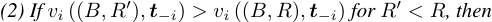

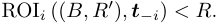

Although the monotone properties required by conditions (1) in Theorem 3.1 and 3.2 seem similar to the truthfulness conditions for quasi-linear bidder with private valuations, _e.g._ , Myerson’s Lemma [Myerson, 1981], conditions (2) reveal their basic differences: assigning a payment to break at least one constraint (lead to negative infinite utility) is indispensable to prevent misreporting for private constraints. 

Theorem 3.1 and 3.2 naturally provide necessary conditions on the DSIC of two-dimensional type ( _B, R_ ). The following result shows that these conditions also provide the sufficient conditions. That is, if a bidder cannot obtain higher utility through misreporting one of her constraints, misreporting the two constraints can also not obtain higher utility. **Theorem 3.3.** _An auction mechanism is DSIC on both budget and ROI if and only if it satisfies Theorem 3.1 and 3.2._ 

Theorem 3.3 is proved through showing none of the misreporting may bring the bidder higher utility when conditions in Theorem 3.1 and 3.2 hold, which relies on the mathematical relationship between payment and ROI. In Theorem 3.3, the truthful conditions in Theorem 3.1 for budget appear to be independent with the truthful conditions in Theorem 3.2 for ROI. Nevertheless, the payment term actually appear in both the conditions (recall ROI = _v/p_ ), _i.e._ , we have to use the same payment scheme to satisfy these two sets of conditions. In order to step toward the full characterization of truthfulness, we need to further analyse how payment is influenced and constrained by financial constraints and allocation. 

2917 

Proceedings of the Thirty-Second International Joint Conference on Artificial Intelligence (IJCAI-23) 

To facilitate our discussion, we define an allocation rule _A_ to be _feasible_ if there exists a payment rule _P_ such that the mechanism ( _A, P_ ) is truthful. The set of feasible allocation rule is the space we can search for truthful auctions. Although there may exist multiple payment rules that constitute a truthful auction for a feasible allocation rule _A_ , the following theorem allows us to focus on the maximum payment rule. 

**Theorem 3.4.** _For a feasible allocation rule A, assigning_ 

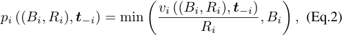

_for ∀i ∈_ [ _n_ ] _,_ ( _Bi, Ri_ ) _∈Ti,_ **_t_** _−i ∈T−i constitutes a truthful auction mechanism._ 

Theorem 3.4 naturally holds because each type is charged the maximum payment under her financial constraints. If some other payment could constitute a truthful auction with _A_ , then improving the payment to this maximum amount would not break the originally held conditions (2) in Theorem 3.1 and Theorem 3.2. By Theorem 3.4, given any feasible allocation rule _A_ , we could find a corresponding payment rule to constitute a truthful auction. As the bidders do not evaluate detailed allocation results of each individual auction, searching for the truthful allocation rule is equal to designing cumulative value functions _vi_ (( _Bi, Ri_ ) _,_ **t** _−i_ ) that can be realized. Thus, we could use the corresponding cumulative value function to represent a feasible allocation rule. 

Our next step is to further shrink the consideration space of comparison in conditions of truthfulness. Previous conditions in Theorem 3.3 include comparisons between any two type sharing the same budget or ROI, _e.g._ , comparing any ( _B, R_ ) and ( _B__′_ _, R_ ) in Theorem 3.1, which is still a large consideration space and leads to difficulties in finding the cumulative value functions. To enable analysis between “neighbouring” types, for any allocation rule _A_ and its cumulative value function _v_ ( **_t_** ), we assume the limits lim _B→Bi−__vi_((_B, Ri_)_,_**_t_**_−i_)andlim_R→R_ _i_+_vi_((_Bi, R_)_,_**_t_**_−i_) exist for any **_t_** _∈T , i ∈_ [ _n_ ]. Through considering these infinitely close types and substituting the payment terms in Theorem 3.3 by the payment rule (Eq.2), conditions that constrain the payment or realized ROI of misreporting another type to break the original constraints could be converted to conditions regarding cumulative value of the type itself. 

**Theorem 3.5.** _An allocation rule A can derive a truthful auction if and only if ∀_ **_t_** _∈T , i ∈_ [ _n_ ] _: (1) The cumulative value vi_ (( _B, R_ ) _,_ **_t_** _−i_ ) _is non-decreasing in B for R_ = _Ri and non-increasing in R for B_ = _Bi; (2) If vi_ (( _Bi, Ri_ ) _,_ **_t_** _−i_ ) _>_ lim _B→Bi−__vi_((_B, Ri_)_,_**_t_**_−i_)_, then_ 

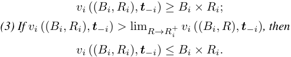

### **3.2 Structures of Feasible Allocation Rule** 

Theorem 3.5 fully characterizes the conditions of a feasible allocation rule. In this subsection, we would further exploit the structures of feasible allocation rule indicated by Theorem 3.5 to provide more instructions on truthful auction design. 

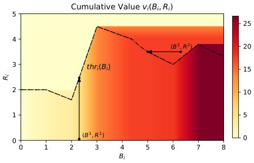

<!-- Start of picture text -->
Cumulative Value  vi ( Bi ,  Ri ) 5 25 4 ( B 2 ,  R 2 ) 20 3 thri ( Bi ) 15 2 10 1 5 0 ( B 1 ,  R 1 ) 0 0 1 2 3 4 5 6 7 8 Bi Ri <!-- End of picture text -->

Figure 2: An example of mapping from a threshold ROI function to cumulative values fixing the others’ types **_t_** _−i_ . 

By Theorem 3.5, the relation between cumulative value _v_ and the term _B × R_ strictly characterizes whether this type shares the same cumulative value with its neighbouring types, which allows us to further clearly represent the structure of _v_ . Fixing the budget, with the decrease of ROI, the cumulative value assigned to the type should be increasing, notice the term _B × R_ decreases along with _R_ ; however, condition (3) in Theorem 3.5 requires that if the cumulative value strictly increases in this process, then its value should not exceed _B × R_ . Thus, there must exist some threshold ROI, such that the increasing cumulative value intersects with the decreasing _B × R_ , and the cumulative value could not increase anymore. Based on the above observation, we define 

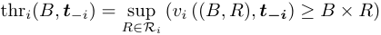

if the considered set is non-empty and bounded, or otherwise be 0. It turns out that the cumulative value assigned to this threshold ROI is exactly _B × R_ . 

**Theorem 3.6.** _∀i ∈_ [ _n_ ] _,_ **_t_** _−i ∈T−i, Bi ∈Bi, Ri ≤_ thr _i_ ( _Bi,_ **_t_** _−i_ ) _:_ 

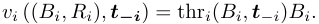

We could then combine different budgets together to obtain the complete characterization of feasible allocation in the two-dimensional type space. Since all types above the threshold ROI has cumulative value _v < B × R_ by the definition of thr function, they could not satisfy the condition (2) in Theorem 3.5, and thus are forced to have the same cumulative value with their neighbouring types with a smaller budget. **Theorem 3.7.** _∀i ∈_ [ _n_ ] _,_ **_t_** _−i ∈T−i, Bi ∈Bi\{_ 0 _}, Ri >_ thr _i_ ( _Bi,_ **_t_** _−i_ ) _:_ 

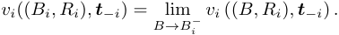

Since the types below (Theorem 3.6) and above (Theorem 3.7) the ROI threshold have both been fully described, the cumulative values on the entire type space could be fully defined if thr _i_ ( _Bi,_ **_t_** _−i_ ) is given and **_t_** _−i_ is fixed. We provide an example in Figure 2 to illustrate these characterizations. For types below the threshold ROI curve and have the same budget _B_ ( _i.e._ , types lie in the same vertical line), they share 

2918 

Proceedings of the Thirty-Second International Joint Conference on Artificial Intelligence (IJCAI-23) 

the same cumulative value thr _i_ ( _B_ ) _× B_ . For each type above the curve, its cumulative value is equal to that of its neighbouring type with a smaller budget until it reaches some type on the threshold ROI curve. This is equivalent to search horizontally to the left to find the closest type on its corresponding ROI threshold, where all the types along this horizontal search share the same cumulative value. 

We have shown that each feasible two-dimensional cumulative value function (whose input is ( _B, R_ )) for a single bidder could be represented by a one-dimensional threshold ROI function (whose input is _B_ ) when other bidders’ profile is fixed, but it is unknown what kinds of one-dimensional threshold ROI functions could represent a feasible cumulative value function. By condition (1) in Theorem 3.5, the cumulative value when _R_ is infinitely close to 0 should be increasing for different _B_ , which indicates thr _i_ ( _B,_ **_t_** _−i_ ) _× B_ needs to be non-decreasing in _B_ . Since every cumulative value function mapped from a non-decreasing thr _i_ ( _B,_ **_t_** _−i_ ) _× B_ satisfies Theorem 3.5, this becomes the only requirement for a feasible thr _i_ function. For convenience in notations, we denote _gi_ ( _Bi,_ **_t_** _−i_ ) = thr _i_ ( _Bi,_ **_t_** _−i_ ) _× Bi_ . We denote _V_ as the space of feasible cumulative value function when _i_ and **_t_** _−i_ are fixed, _i.e._ , _vi_ : _Ti →_ R+ , and denote _G_ as the space of non-decreasing function _g_ : R+ _→_ R+ with _g_ (0) = 0. 

**Corollary 3.8.** _There exists a bijective map m_ : _G →V with_ 

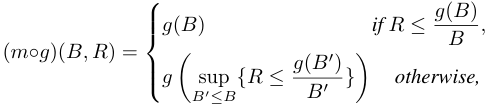

_where we define_ sup ∅ = 0 _._ 

In other words, given any one-dimensional non-decreasing function with _g_ (0) = 0, we could transform it to a feasible2 cumulative value function by the above mapping process. 

## **4 Truthful Auction Design** 

The derived structure of feasible allocation rules give rise to a _value grouping phenomenon_ . Viewing the above process of finding the cumulative value of a certain type given threshold ROI curve in a reverse way, every type on the threshold ROI curve shares the same cumulative value with two groups of types: the types vertically below it, as well as the types locate horizontally right to it and above its corresponding threshold ROI, as shown in Figure 2. This intricate value grouping phenomenon are enforced by the truthful conditions instead of the optimization requirement. As we can observe in Figure 2, since the horizontal search terminates when meeting a type on the threshold ROI curve, the grouping shape is determined by the relative rank of _thri_ ( _Bi,_ **_t_** _−i_ ) for different _Bi_ . However, though _thri_ ( _Bi,_ **_t_** _−i_ ) is required to keep _g_ ( _B_ ) non-decreasing, it is not required to be monotone itself, which leads the terminate of horizontal search and the grouping shapes to be irregular. This also brings difficulties in deriving general closed-form conditions for the group of 

> 2Our feasibility is with respective to truthfulness, and does not specify how to realize the allocations from detailed items. 

- **Algorithm 1:** A Family of Simple Truthful Auctions **Input:** Bidder’s reported type ( _Bi, Ri_ ), and non-increasing rank score functions _fi,j_ . 

- **Output:** Bidder’s allocated items _Ai_ and payment _pi_ . 

- **1** Initialize _Ai_ = _{}_ for _i ∈_ [ _n_ ]; **2** Compute virtual bids _bi,j ← vi,j × fi,j_ ( _Ri_ ); **3 for** _each item j ∈_ [ _m_ ] **do 4** Find bidder _i_ 0 with the highest virtual bid _bi_ 0 _,j_ ; **5** Record the second highest bid _cj ←_ max _i̸_ = _i_ 0 _bi,j_ ; **6** Add item _j_ into _Ai_ 0 and set _ai_ 0 _,j_ = 1; **7 for** _each bidder i ∈_ [ _n_ ] **do 8** Compute ROI _ri,j_ = _fi,j__−_1( _v__c_ _i,j__<u>j</u>_) required for winning the item _j ∈ Ai_ ; 

- **9** Find a largest _Ri__c∈Ri_s.t. � _j∈Ai_I (_R_ _i__c≤ri,j_)_×v_ _R__i,j_ _i__<u>c</u>≥Bi_, and let _d ←_ the difference between left-hand side and right-hand side of the above inequality; 

- **10 if** _d >_ 0 **then 11** Find the items _j__′_ with _ri,j′_ = _Ri__c_, and remove parts of these items with value _d/Ri__c_; 

- **12 if** _Ri ≤ Ri__c_**then** **13** Remove the items with _ri,j < Ri__c_from_Ai_; _<u>j∈Ai</u>__vi,j·ai,j_ 

- **14** _pi ←_ min <u>�</u><u>�</u> _Ri , Bi_ <u>�</u> ; **15 return** ( _Ai, pi_ ) for _i ∈_ [ _n_ ]. 

types to share the same allocation. Furthermore, although the cumulative values of the grouping types are forced to be the same, their payment are calculated by Theorem 3.4, leading to varying payments between grouping types and the nonlinear revenue with respective to the threshold ROI. 

The above characteristics of value grouping phenomenon, _i.e._ , irregularity in grouping shape and non-linear payment, make any analytical or mathematical programming approach difficult to adopt. To reach feasible and implementable auction design, we propose a family of simple truthful auctions based on newly designed rank score functions. 

The detailed auction mechanism is presented in Algorithm 1. For each item, bidders are ranked based on their _virtual bids bi,j_ , which is defined as _vi,j_ multiplying a rank score _fi,j_ ( _Ri_ ) with some pre-defined non-increasing function _fi,j_ (Line 2). The items are then temporarily allocated to each bidder with the highest virtual bids (Line 3-6). After the candidate allocation set _Ai_ for each bidder _i_ has been determined, we compute the the corresponding ROI requirement _ri,j_ for the bidder _i_ to rank the first in item _j ∈ Ai_ , _i.e._ , bidder _i_ needs to report _Ri ≤ ri,j_ in order to maintain ranked first for item _j_ (Line 8). The critical ROI in Line 9 is our key design to guarantee truthfulness, which computes the largest ROI a bidder could report to win enough items in _Ai_ and spend out her budget. Intuitively, critical ROI simulates the best-response ROI of the bidder given her budget constraint, which does not involve and thus keeps independent of her true ROI constraint. We naturally utilize this critical ROI, which transforms the budget to the same dimension of ROI, as the threshold ROI 

2919 

Proceedings of the Thirty-Second International Joint Conference on Artificial Intelligence (IJCAI-23) 

function and design the remaining parts based on the truthful conditions in Section 3. Line 10-11 are designed to guarantee the value of remaining items in _Ai_ would exactly equal to the budget of the bidder times the computed critical ROI (Theorem 3.6). Line 12-13 are designed to guarantee the types with ROI larger than the corresponding critical ROI would be allocated based on their reported ROI (Theorem 3.7) and get all items with _ri,j ≥ Ri_ . Line 14 determines the payment for each bidder based on Theorem 3.4. Due to its low time complexity, Algorithm 1 has good implementation scalability. 

**Theorem 4.1.** _If the pre-determined functions fi,j_ ( _R_ ) _are non-increasing with R, then the auction mechanism corresponding to Algorithm 1 is truthful._ 

Our proof is conducted through figuring out and verifying the corresponding _g_ ( _B_ ) and threshold ROI function of Algorithm 1. We can design personalized _fi,j_ ( _R_ ) for bidders and items according to the auction objective and prior knowledge before the advertising campaign, such as the type distribution of bidders and the information of incoming items. 

## **5 Experiments** 

In this section, we conduct experiments with synthetic data to validate the performance of our proposed auctions. 

### **5.1 Experimental Setup** 

There are two sets of experiments with i.i.d. and non-i.i.d. bidders, respectively. We vary the number of bidders and items to simulate the changes in demand and supply. The presented results are averaged by 50 runs. We choose distribution parameters based on the common fluctuations in advertising markets, and normalize the lower bound of _vi,j_ . **Symmetric bidders** Bidders are symmetric with _vi,j ∼ U_ [1 _,_ 4], _Bi ∼ U_ [40 _,_ 80] and _Ri ∼ U_ [1 _,_ 3], where _U_ [ _a, b_ ] is the uniform distribution within the range [ _a, b_ ].3 **Mixed bidders** There are low and high distributions for _vi,j_ , _Bi_ and _Ri_ as bidders’ possible types. Specifically, _vi,j ∼ U_ [1 _,_ 2] or _vi,j ∼ U_ [2 _,_ 3], _Bi ∼ U_ [20 _,_ 40] or _Bi ∼ U_ [80 _,_ 100], and _Ri ∼ U_ [1 _,_ 2] or _Ri ∼ U_ [2 _,_ 3]. Combinations of these categories result in 8 groups of bidders. 

**Baseline Auctions** Since no existing mechanism guarantees the IC properties of both budget and ROI, we consider common repeated auction formats: first-price and second-price auctions. Due to their non-truthfulness (see full version of this paper), we involve misreporting for these auctions. 

_• Repeated first-price and second-price auctions:_ The auctioneer holds first-price (second-price) auctions for every single item, where bidder _i_ bids _vi,j/Ri_ for item _j_ . The auctioneer allocates the item to the highest ranking bidder who has remaining budget to afford, and charge the first-price (secondprice) payment. We simulate bidders’ misreporting behaviors by the classical _best-response_ dynamics with the true profile as starting points. In repeated first-price (second-price) auctions, the bidders have no incentive to misreport their budget. We calculate the best response ROI as the smallest ROI that achieves the highest utility in historical auctions. 

> 3We have tested several other parameters under uniform distribution, and the trends of results are the same. 

_• Non-truthful Optimal Baseline:_ The optimal offline revenue could be computed through linear programming, where we set each bidder _i_ ’s payment to item _j_ as exactly _vi,j ×ai,j/Ri_ , and her total payment is constrained to not exceed _Bi_ . **Evaluation Metrics** We consider revenue and liquid welfare as the optimization goal. Since the payment formula (Eq.2) in Theorem 3.4 aligns with the definition of liquid welfare in equation (Eq.1) when no bidder receives negative infinite utility, the metrics of revenue and liquid welfare would be the same for truthful auctions, and we will thus only report revenue in our results. Besides, as advertisers may have fluctuating auction performances across time slots, _fairness_ should also be considered in order to preserve bidders’ willingness to attend the auctions. Using liquid welfare to substitute the traditional valuation function [Bez´akov´a and Dani, 2005; Chakrabarty _et al._ , 2009], fairness is defined as 

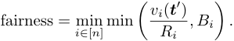

**Rank Score Function** We adopt rank scores in the form _fi,j_ ( _R_ ) = _αi,j × e__−βR_ , where _αi,j_ is drawn from a rectified normal distribution _N_ ( _µi, σi_2),and_β, µi, σi_arepre-set parameters. In _f_ ( _R_ ), _β_ is used to adjust the impact of ROI on equivalent bids, and _α_ maintains the rank scores of various bidders in a comparable range. Since items may be discarded when some bidders win excessive items (Line 13 in Algorithm 1), in order to avoid loss in welfare and revenue, we should give other bidders non-trivial winning opportunities when the supply is sufficient, which is provided by the randomness in _α ∼ N_ ( _µi, σi_2).For each automated bidding environment, we set rank score function parameters to be the same for bidders following the same distribution, and choose the parameters with better revenue in this environment. 

### **5.2 Experimental Results** 

**Symmetric bidders** The revenue of our truthful auction (referred as DSIC) and the baseline auctions with different number of bidders is reported in Figure 3a, and revenue when number of items changes is reported in Figure 3b. Our truthful auction achieves better revenue than first-price and second-price auctions, and generally achieves more than 90% revenue of the near optimal baseline. Remarkably, first-price auctions displays evident decrease in revenue when the items are excessive, which also leads to decreases in fairness (Figure 3c). This is because the bidders exceedingly increase their reported ROI when facing some unsold items with low prices, leading all their payment to decrease proportionally. 

In Figure 3c, we report the fairness results under different number of items a fixed number of 40 bidders as in Figure 3b. As designed in the rank score function, our auction does not allocate excessive items to a certain bidder to avoid waste of items, and thus achieves better fairness then the optimal baseline when the number of items is in the range of 600 to 1200. When items are in shortage (200 _/_ 400 items in Figure 3c), our truthful auction harms the fairness to some extent due to the pursuit of revenue. We can control the tradeoff between fairness and revenue with different rank score functions through the parameter _β_ . Figure 3d reports a set of revenue and fairness performances with different _β_ in the same setting as 400 

2920 

Proceedings of the Thirty-Second International Joint Conference on Artificial Intelligence (IJCAI-23) 

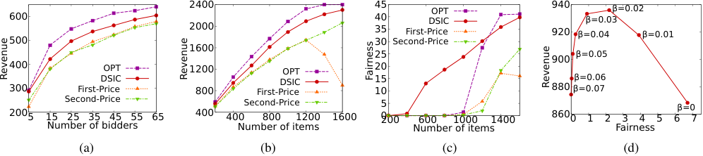

<!-- Start of picture text -->
2400 45 OPT 940 β=0.02 600 40 DSIC β=0.03 2000 35 First-Price 920 β=0.04 β=0.01 500 30 Second-Price 1600 25 900 β=0.05 400 OPT 1200 OPT 20 DSIC DSIC 15 β=0.06 30 0 First-Price 800 First-Price 10 880 β=0.07 Second-Price Second-Price 5 2005 15 25 35 45 55 65 400 400 800 1200 1600 0 200 600 1000 1400 8600 1 2 3 4 5 6β=07 Number of bidders Number of items Number of items Fairness (a) (b) (c) (d) Revenue Revenue Fairness Revenue <!-- End of picture text -->

Figure 3: Revenue and fairness in different experiment setting for symmetric bidders: (a) Revenue for different number of i.i.d bidders with 200 items; (b) Revenue for different number of items with 40 i.i.d bidders; (c) Fairness for different number of items with 40 i.i.d bidders; (d) Fairness of our DSIC auction with 40 i.i.d bidders and 400 items using different parameter _β_ in rank score functions; 

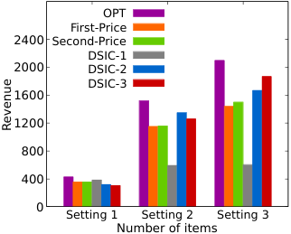

<!-- Start of picture text -->
OPT First-Price 2400 Second-Price DSIC-1 2000 DSIC-2 DSIC-3 1600 1200 800 400 0 Setting 1 Setting 2 Setting 3 Number of items Revenue <!-- End of picture text -->

Figure 4: Revenue with 40 mixed bidders in Setting 1: 200 items; Setting 2: 1000 items; Setting 3: 1600 items; with three different groups of rank score functions for our DSIC auction 

items in Figure 3c. To achieve higher revenue, it is inevitable to have discriminating allocation among different bidders and harms the fairness when items are not abundant. **Mixed bidders** Instead of presenting similar trends, we demonstrate the importance of choosing appropriate rank score functions in non-i.i.d. settings. We choose three groups of rank score functions respectively with good performance in three typical settings: 40 mixed bidders with 200/1000/1600 items, and test their performances in the other two settings. The results are presented in Figure 4, where DSIC- _n_ represents the truthful auction with rank score functions performing well in the Setting _n_ . The DSIC-n mechanism only perform well in Setting _n_ , and the reason should come from the distinct allocation approaches needed to achieve high revenue for different number of items. For example, to achieve high revenue when items are in shortage (Setting 1), DSIC-1 auction allocates most items to the bidders with high value and low ROI, leading to allocating excessive items to these bidders and neglecting other bidders in Setting 2 and 3. 

## **6 Related Work** 

Due to the unique features compared to traditional ad auctions, auction design and game theoretical analysis for automated bidding come into researchers’ view in recent years. Our work could be classified as considering the incentive of bidders when setting automated bidding parameters. Under this topic, [Li _et al._ , 2020] provided distributed bidding algo- 

rithms for IC issues assuming public values and private ROI. [Balseiro _et al._ , 2021] studied the optimal mechanism design for bidders with ROI constraint under different information structure. [Balseiro _et al._ , 2022] considered the mechanism design with private ROI constraint and public budget, and derived the optimal auction for all the two-bidder cases and some specific multi-bidder cases. 

Another closely relevant line of work is mechanism design for financially-constrained quasi-linear bidders. Since [Laffont and Robert, 1996], intensive research has been conducted for bidders with budget constraint [Borgs _et al._ , 2005; Bhattacharya _et al._ , 2010; Dobzinski _et al._ , 2008; Pai and Vohra, 2014]. [Szymanski and Lee, 2006] analysed the impact of ROI constraints on bidding and revenue of several common auction forms, and [Golrezaei _et al._ , 2021] firstly considered auction design for bidders with ROI constraints. Distinct from the above work4 , we consider both budget and ROI as private constraints for value-maximizing bidders, which fits the real automated bidding and reveals the complex value grouping phenomenon for the first time. 

## **7 Conclusion** 

In this work, we have considered truthful auto-bidding auction design for bidders with private budget and ROI constraints across multiple impressions, while the values of impressions are public to the auctioneer. We have characterized the truthfulness conditions in this new auto-bidding auction model, which involves irregular grouping constraints on bidders’ cumulative utilities. We have proposed a series of simple truthful auction mechanisms with flexible rank score functions as a solution to this automated bidding auction design problem. The experimental results validate the performances and flexibility of the proposed auction mechanisms. 

## **Acknowledgements** 

This work was supported in part by National Key R&D Program of China No. 2018AAA0100900, in part by China NSF grant No. 62132018, U2268204, 62272307, 61902248, 61972254, 61972252, 62025204, 62072303, in part by Shanghai Science and Technology fund 20PJ1407900, and in part by Alibaba Group through Alibaba Innovative Research 

> 4More related work are covered in the full version of this paper. 

2921 

Proceedings of the Thirty-Second International Joint Conference on Artificial Intelligence (IJCAI-23) 

Program. The opinions, findings, conclusions, and recommendations expressed in this paper are those of the authors and do not necessarily reflect the views of the funding agencies or the government. 

## **References** 

- [Aggarwal _et al._ , 2019] Gagan Aggarwal, Ashwinkumar Badanidiyuru, and Aranyak Mehta. Autobidding with constraints. In _Web and Internet Economics_ , pages 17–30. Springer, 2019. 

- [Azar _et al._ , 2017] Yossi Azar, Michal Feldman, Nick Gravin, and Alan Roytman. Liquid price of anarchy. In _International Symposium on Algorithmic Game Theory_ , pages 3–15. Springer, 2017. 

- [Balseiro _et al._ , 2021] Santiago Balseiro, Yuan Deng, Jieming Mao, Vahab S Mirrokni, and Song Zuo. The landscape of auto-bidding auctions: Value versus utility maximization. In _Proceedings of the ACM Conference on Economics and Computation_ , pages 132–133. ACM, 2021. 

- [Balseiro _et al._ , 2022] Santiago Balseiro, Yuan Deng, Jieming Mao, Vahab Mirrokni, and Song Zuo. Optimal mechanisms for value maximizers with budget constraints via target clipping. In _Proceedings of the ACM Conference on Economics and Computation_ , page 475. ACM, 2022. 

- [Bez´akov´a and Dani, 2005] Ivona Bez´akov´a and Varsha Dani. Allocating indivisible goods. _ACM SIGecom Exchanges_ , 5(3):11–18, 2005. 

- [Bhattacharya _et al._ , 2010] Sayan Bhattacharya, Gagan Goel, Sreenivas Gollapudi, and Kamesh Munagala. Budget constrained auctions with heterogeneous items. In _Proceedings of the ACM Symposium on Theory of Computing_ , pages 379–388. ACM, 2010. 

- [Borgs _et al._ , 2005] Christian Borgs, Jennifer Chayes, Nicole Immorlica, Mohammad Mahdian, and Amin Saberi. Multi-unit auctions with budget-constrained bidders. In _Proceedings of the ACM Conference on Electronic Commerce_ , pages 44–51. ACM, 2005. 

- [Chakrabarty _et al._ , 2009] Deeparnab Chakrabarty, Julia Chuzhoy, and Sanjeev Khanna. On allocating goods to maximize fairness. In _IEEE Symposium on Foundations of Computer Science_ , pages 107–116. IEEE, 2009. 

- [Chen _et al._ , 2014] Xi Chen, Ilias Diakonikolas, Dimitris Paparas, Xiaorui Sun, and Mihalis Yannakakis. The complexity of optimal multidimensional pricing. In _Proceedings of the ACM-SIAM Symposium on Discrete algorithms_ , pages 1319–1328. SIAM, 2014. 

- [Daskalakis, 2015] Constantinos Daskalakis. Multi-item auctions defying intuition? _ACM SIGecom Exchanges_ , 14(1):41–75, 2015. 

- [Dobzinski _et al._ , 2008] Shahar Dobzinski, Ron Lavi, and Noam Nisan. Multi-unit auctions with budget limits. In _IEEE Symposium on Foundations of Computer Science_ , pages 260–269. IEEE, 2008. 

- [Edelman _et al._ , 2007] Benjamin Edelman, Michael Ostrovsky, and Michael Schwarz. Internet advertising and the 

generalized second-price auction: Selling billions of dollars worth of keywords. _American Economic Review_ , 97(1):242–259, March 2007. 

- [Facebook Ads, 2021] Facebook Ads. Online advertising on facebook. https://www.facebook.com/business/ads, 2021. Accessed: 2022-01-05. 

- [Fadaei and Bichler, 2016] Salman Fadaei and Martin Bichler. Truthfulness and approximation with valuemaximizing bidders. In _International Symposium on Algorithmic Game Theory_ , pages 235–246. Springer, 2016. 

- [Gharibshah and Zhu, 2021] Zhabiz Gharibshah and Xingquan Zhu. User response prediction in online advertising. _ACM Computing Surveys_ , 54(3):64:1–64:43, 2021. 

- [Golrezaei _et al._ , 2021] Negin Golrezaei, Ilan Lobel, and Renato Paes Leme. Auction design for ROI-constrained buyers. In _Proceedings of the Web Conference_ , pages 3941– 3952. ACM, 2021. 

- [Google Ads, 2021] Google Ads. About smart bidding. https://support.google.com/google-ads/answer/ 7065882, 2021. Accessed: 2022-01-05. 

- [Laffont and Robert, 1996] Jean-Jacques Laffont and Jacques Robert. Optimal auction with financially constrained buyers. _Economics Letters_ , 52(2):181–186, 1996. 

- [Li _et al._ , 2020] Bin Li, Xiao Yang, Daren Sun, Zhi Ji, Zhen Jiang, Cong Han, and Dong Hao. Incentive mechanism design for ROI-constrained auto-bidding. _arXiv preprint arXiv:2012.02652_ , 2020. 

- [Mehta, 2022] Aranyak Mehta. Auction design in an autobidding setting: Randomization improves efficiency beyond VCG. In _Proceedings of the ACM Web Conference_ , pages 173–181. ACM, 2022. 

- [Myerson, 1981] R. B. Myerson. Optimal auction design. _Mathematics of Operations Research_ , 6(1):58–73, 1981. 

- [Pai and Vohra, 2014] Mallesh M. Pai and Rakesh Vohra. Optimal auctions with financially constrained buyers. _Journal of Economic Theory_ , 150:383–425, 2014. 

- [Pavlov, 2011] Gregory Pavlov. Optimal mechanism for selling two goods. _The B.E. Journal of Theoretical Economics_ , 11(1), 2011. 

- [Szymanski and Lee, 2006] Boleslaw K. Szymanski and Juong-Sik Lee. Impact of ROI on bidding and revenue in sponsored search advertisement auctions. In _Proceedings of ACM Workshop on Sponsored Search Auctions_ , 2006. 

- [Xing _et al._ , 2023] Yidan Xing, Zhilin Zhang, Zhenzhe Zheng, Chuan Yu, Jian Xu, Fan Wu, and Guihai Chen. Truthful auctions for automated bidding in online advertising. _arXiv preprint arXiv:2301.13020_ , 2023. 

- [Zhang _et al._ , 2014] Weinan Zhang, Shuai Yuan, and Jun Wang. Optimal real-time bidding for display advertising. In _Proceedings of the SIGKDD International Conference on Knowledge Discovery and Data Mining_ , pages 1077– 1086. ACM, 2014. 

2922 

