# Context-Aware Data Quality Estimation in Mobile Crowdsensing 

Shengzhong Liu_†∗_ , Zhenzhe Zheng_†∗_ , Fan Wu_†‡_ , Shaojie Tang_§_ , and Guihai Chen_†_ 

> _†_ Shanghai Key Laboratory of Scalable Computing and Systems, Shanghai Jiao Tong University, China 

> _§_ Department of Information Systems, University of Texas at Dallas, USA 

_{_ liushengzhong1023, zhengzhenzhe220 _}_ @gmail.com; _{_ fwu, gchen _}_ @cs.sjtu.edu.cn;_§_ shaojie.tang@utdallas.edu 

**_Abstract_ —With the rapid growth of smart devices, mobile crowdsensing is becoming an important paradigm to acquire information from physical environments. Considering that the sensing data collected by mobile users are normally noisy and imprecise, one of the pressing problems in mobile crowdsensing is to evaluate the data quality in real time and to steer users to acquire data with high quality. However, it is challenging to estimate the data quality without the availability of ground truth data. In this paper, we observe that sensing context has a significant impact on data quality, which motivates us to propose a context-aware data quality estimation scheme. With historical sensing data, we train a context-quality classifier, which captures the relation between context information and data quality, to estimate data quality in an online manner. We apply such a context-aware data quality estimation scheme to guide user recruitment in mobile crowdsensing. We model the process of user recruitment as a stochastic submodular maximization problem, and design a random adaptive greedy algorithm to guarantee a constant approximation ratio. We evaluate our algorithm on a real-world temperature data set. The evaluation results show that our algorithm outperforms other existing techniques, in terms of prediction accuracy.** 

## I. INTRODUCTION 

In recent years, with the explosive increasing of smart devices embedded with various powerful sensors ( _e.g._ , camera, microphone, accelerometer, digital compass, gyroscope, etc.), mobile crowdsensing (MCS) has been recognized as an innovative sensing data gathering paradigm [10], [18]. It has permeated many aspects of our daily life, including recording personal body indexes for health care [25], measuring environment phenomena like pollution level [10], monitoring traffic conditions ( _e.g._ , availability of parking lot [19] and road congestion [20]), and sharing exercise data in social communities [11]. 

The main feature of mobile crowdsensing is the involvement of mobile users, which may be a double edged sword. On one hand, the service provider can leverage the intelligence of mobile users to improve the efficiency of data acquisition. For example, mobile users can easily identify the location of available parking lots and report them with pictures and comments, achieving much higher flexibility than the currently used ultrasound-based scanning system. On the other hand, compared with traditional wireless sensor networks [29], user’s 

### _∗_ S. Liu and Z. Zheng make the same contribution to this work. _‡_ F. Wu is the corresponding author. 

This work was supported in part by the State Key Development Program for Basic Research of China (973 project 2014CB340303), in part by China NSF grant 61672348, 61672353, 61422208, 61472252, 61272443 and 61133006, in part by Shanghai Science and Technology fund 15220721300, in part by CCFTencent Open Fund, and in part by the Scientific Research Foundation for the Returned Overseas Chinese Scholars. The opinions, findings, conclusions, and recommendations expressed in this paper are those of the authors and do not necessarily reflect the views of the funding agencies.Z. Zheng was also supported by Google PhD Fellowship and Microsoft Asia PhD Fellowship. 

involvement may introduce even higher uncertainty in data quality, mainly due to various human activities during data collection. For example, in a noise measurement crowdsensing system, the collected sensing data would have poor quality if mobile users put their smartphones in pockets or even walk or run during data acquisition process. 

Ensuring high data quality is a fundamental requirement to guarantee the success of mobile crowdsensing, which is the basic for other design components, such as user recruitment and incentive mechanism design. The data quality measures the degree of deviation to ground truth data, and is sometimes defined as data noise. There are many factors, captured by _sensing context_ in this paper, that can influence the sensing data quality. We further divide these factors into two categories: hardware factors ( _e.g._ , phone brand, sensor models, sensor calibration level, and etc) and human behaviour factors ( _e.g._ , holding position of smartphone, human movement during sensing, and etc). Unfortunately, most of existing works in mobile crowdsensing did not investigate the impact of sensing context on data quality, or simply use a constant parameter to describe data quality [15]. However, different user activities in diverse context environments will lead to significantly different data qualities, indicating that a single constant parameter is not sufficient enough to describe the quality of data from mobile users. Considering that data quality may change over time (human behavior is always dynamic and variable), we have to determine the data quality in a real time manner, which is not a easy job without knowing the ground truth data. Peng _et al._ , [24] used unsupervised learning technique to estimate data quality, but this can only be done after collecting the historical data from all users. Our work, on the contrary, aims to develop a framework that can estimate the data quality on-the-fly. 

There exist many challenges in the design of data quality estimation scheme. We list the major ones as follows: 

_•_ **Lack of Ground Truth** : It is trivial to estimate the data quality with the availability of ground truth. The sensing data consists of two parts: ground truth and data noise. With the ground truth data, we can extract the data noises from the sensing data directly, and further calculate its corresponding data quality in real time. However, in most crowdsensing applications, it is hard or even impossible to obtain the ground truth data, leading to the failure of ground truth-based data quality estimation schemes. 

_•_ **Lack of Historical Data** : Even without knowing the ground truth data, we can still determine the data quality in an offline manner as long as there is enough historical data. Given the historical data for a certain task, we can first estimate its corresponding ground truth, and then apply the ground truthbased scheme to calculate the data quality. However, in many scenarios, such as user recruitment, we have to determine the 

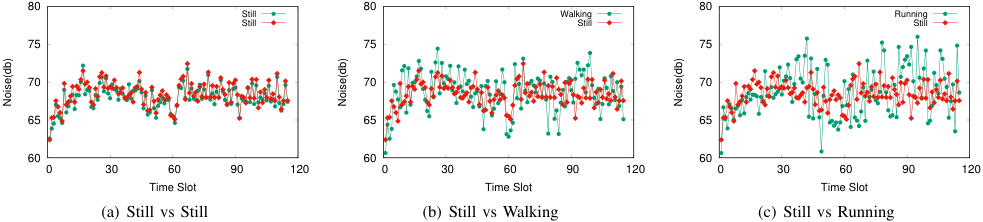

<!-- Start of picture text -->
 80  80  80 Still Walking Running Still Still Still  75  75  75  70  70  70  65  65  65  60  60  60  0  30  60  90  120  0  30  60  90  120  0  30  60  90  120 Time Slot Time Slot Time Slot (a) Still vs Still (b) Still vs Walking (c) Still vs Running Noise(db) Noise(db) Noise(db) <!-- End of picture text -->

Figure 1: An example to illustrate the influence of different phone sensing contexts on the quality of sensing data. 

data quality for a new task in an online manner, such that no historical data could be used to calculate the ground truth and estimate the data quality. 

Considering the challenges above, it is difficult to estimate data quality directly. In this paper, we seek to build a connection between contextual information and data quality, based on which we infer the data quality through the real-time contextual information. Specifically, we design this contextaware data quality estimation scheme by using supervised learning algorithms to train a context-quality classifier. In order to prepare training data set, we have to obtain data quality and contextual information for each piece of historical data. For data quality, we first build a Gaussian Mixture Model to describe sensing data, and propose an Expectation Maximization (EM)-based algorithm to estimate the ground truth of each task. Based on the ground truth data, we then calculate the data noises of the historical data, and derive the data quality distribution for each mobile user by applying the maximum likelihood estimation (MLE) method. With the data quality distribution as the prior distribution, we determine the data quality for each piece of historical data using the maximum a posterior probability (MAP) approach. To obtain contextual information, we directly read the hardware information from smart devices, and apply activity recognition technique to detect human behaviour based on the sensing data from idle sensors. 

With the context-quality classifier, we are able to determine the data quality with the aid of contextual information, in a real-time manner. We integrate our context-aware data quality estimation scheme into a specific application: user recruitment, and model it as a stochastic submodular maximization problem. We cannot directly adopt the classical greedy algorithm from submodular optimization, because the data quality of each user is not determined in advance. Taking advantage of adaptive submodularity property, we design a random adaptive greedy algorithm, achieving a constant approximation ratio of 1 _/e_ . 

We summarize the main contributions of this paper: 

_•_ First, we make an in-depth study on real-time data quality estimation in mobile crowdsensing without the knowledge of ground truth data. 

_•_ Second, we investigate the relation between contextual information and data quality, and design a context-aware data quality estimation scheme. We calculate data quality and detect contextual information for each piece of historical data. With the training data set (contextual information and data quality pairs), we build a context-data quality classifier, which is used to estimate the data quality in real time. 

_•_ Third, we use the context-aware data quality estimation scheme to guide user recruitment process. We model it as an adaptive non-monotone submodular maximization problem, 

and propose a random adaptive greedy algorithm with a constant approximation ratio of 1 _/e_ . 

_•_ Finally, we show the performance of our algorithm through simulations on a real-world sensing data set. The simulation results show that our algorithm outperforms the previous techniques in terms of prediction accuracy. 

The rest of this paper is organized as follows: In Section II, we use a simple experiment to demonstrate the influence of sensing context on data quality. The context-quality model and problem formulation of user recruitment are presented in Section III. In Section IV, we illustrate the design details of the context-aware data quality estimation scheme, and further apply it to guide user recruitment in Section V. The evaluation results are shown in Section VI, followed by related work in Section VII. Finally, we conclude the paper in Section VIII. 

## II. A MOTIVATING EXAMPLE 

In order to capture the influence of different sensing contexts on sensing data quality, we carry out a simple experiment about noise pollution profile description in campus. In this experiment, we mainly focus on the human factor, _i.e._ , the influence of user activity on the data quality. 

We install Noisetube [23] app on four Apple iPhone 6, and use the embedded acoustic sensor to measure the noise levels in our campus. Four volunteers holding these devices measure the noise level at the same location, but may be in different contexts, simultaneously. Two volunteers keep still during sensing, one volunteer keeps walking, and the remaining one keeps running. The whole process lasts for about 115 time slots. One slot is set to be two seconds. 

We first compare the data quality collected by different volunteers under the same activity. The noise measurements from the two standing volunteers is presented in Figure 1(a). We can see that the two lines almost overlap with each other, implying that the impact of hardware on the data quality is negligible. We then compare the measurements from one standing volunteer and one walking volunteer. As shown in Figure 1(b), there exists obvious difference between the two lines, where the variance of the line corresponding to the walking volunteer is apparently greater than that of the standing volunteer. Finally, the measurements from one standing volunteer and one running volunteer are reported in Figure 1(c). We can observe that the variance of the line corresponding to the running volunteer is even greater than that of the walking volunteer. 

The above experiment results indicate that different sensing contexts indeed have a significant impact on the quality of sensing data. It motivates us to explore the relation between context and data quality, and leverage such relation to estimate the data quality in the scenario that the ground truth data is unavailable while the contextual information is easy to collect. 

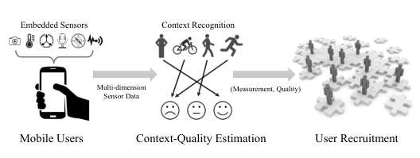

<!-- Start of picture text -->
Embedded Sensors Context Recognition Multi-dimension  (Measurement, Quality) Sensor Data Mobile Users Context-Quality Estimation User Recruitment <!-- End of picture text -->

Figure 2: System Overview 

III. PRELIMINARIES AND PROBLEM FORMULATION 

In this section, we first present a system overview. We then describe the context-aware data quality estimation model. After that, we formally formulate the problem of user recruitment. 

## _A. System Overview_ 

A typical mobile crowdsensing system contains three major components: a service provider, a set of clients, and a set of mobile users. The service provider is the central platform connecting clients and mobile users. The service provider receives queries about information in specific locations from clients, and announces a set of points of interest (PoIs) L ≜ _{l_ 1 _, l_ 2 _, . . . , lM }_ . The PoIs are the physical locations, at which the service provider intends to acquire sensing data to answer the queries of clients. Based on the consideration of their current locations and available resources, the mobile users choose the preferred PoIs, indicating that they are willing to carry out the corresponding sensing tasks at these PoIs. We denote the _M_ mobile users by a set V = _{v_ 1 _, v_ 2 _, . . . , vM }_ . For convenience of discussion, we assume there is exact one mobile user at each of PoIs. Our results can be easily extended to the scenario that multiple mobile users stay at one PoI. 

Due to the unreliable sensors and dynamic environment, the sensing data collected by mobile users are normally noisy and imprecise. Considering the uncertainty of sensing data, the service provider faces two fundamental problems in mobile crowdsensing: _how to evaluate the quality of collected sensing data in real time and how to recruit the reliable mobile users to maximize the service utility?_ As shown in Figure 2, the service provider leverages the historical sensing data to estimate the relation between contextual information and data quality, and to measure the reliability of mobile users, which are two critical steps to tackle the above two problems. For the contextquality relation, we construct a classifier to map contextual information to data quality, such that we can evaluate the data quality through the real-time contextual information. For the reliability measurement, the service provider uses the historical sensing data of a mobile user to calculate her data quality distribution, indicating the probability of data quality of this user in future data acquisition. Such data quality distribution is considered as the reliability of the mobile user. We adopt the reliability of mobile users as selection criteria in user recruitment, leading to a high service utility. 

## _B. Data Quality and Context_ 

We assume that the data quality can only be chosen from _N_ different levels, each of which corresponds to an independent gaussian distribution. The gaussian distribution has been widely used to describe sensing data [9], [14]. Given a sensing task, the sensing data from the _φ_ th data quality level is regarded as a random sample from the Gaussian distribution 

_N_ ( _µ, σφ_2), where the mean_µ_is the ground truth of the task and the variance _σφ_2is a predefined constant number. We denote the total possible data quality levels by a set N = (1 _,_ 2 _, · · · , N_ ). 

Mobile users may involve in various and dynamic contexts during data acquisition process, leading to the collected data in diverse data quality levels. It is not sufficient enough to use a single fixed constant parameter to describe the data quality level of each user over the time. Therefore, for each mobile user _vi ∈_ V, we use a random variable Φ _i_ to represent her possible data quality level. The random variable Φ _i_ follows a multinomial distribution with the parameters _{πi_ ( _φ_ ) _, φ ∈_ N _}_ , where _πi_ ( _φ_ ) = P(Φ _i_ = _φ_ ), 0 _≤ πi_ ( _φ_ ) _≤_ 1 and�_N_ _φ_ =1_πi_(_φ_) = 1. We call such multinomial distribution _{πi_ ( _φ_ ) _}_ as _quality distribution_ for the mobile user _vi ∈_ V. We use the vector **Φ** = (Φ1 _,_ Φ2 _, · · · ,_ Φ _M_ ) to denote the random variables of all the mobile users. 

As for contextual information, we represent it using a feature vector **c** = ( _c_ 1 _, c_ 2 _, . . . , cQ_ ), in which each element denotes activity information or hardware information. For example, we can use _ci_ to denote whether the user is walking or not. For hardware information, we can use one feature element to represent mobile phone brand and another for calibration level of sensors. 

## _C. User Recruitment_ 

We model user recruitment in the scenario of unknown data quality level as a stochastic submodular maximization problem. The ground set is all the mobile users V. Mobile users may have different possible data quality levels in different context situations. For a specific context, we can realize the random variable Φ _i_ to be a certain value _φi_ , and denote the realizations of all the mobile users as **_φ_** = ( _φ_ 1 _, φ_ 2 _, · · · , φM_ ). Before selecting mobile users, the service provider only knows the quality distributions of mobile users, and can calculate the probability distribution P( **_φ_** ) over a possible realization **_φ_** , _i.e._ , P( **_φ_** ) =�_M_ _i_ =1_πi_(_φi_).Oncetheserviceproviderselects a mobile user, she can collect the contextual information and exploit the context-quality classifier to determine the mobile user’s specific data quality level. Therefore, for a selected subset of mobile users, the service provider can observe their partial realization, denoted by _ψ ⊆_ V _×_ N, which is a collection of mobile users-data quality level pairs ( _v, φ_ ). For a partial realization _ψ_ , we use _dom_ ( _ψ_ ) to represent the contained users, _i.e._ , _dom_ ( _ψ_ ) = _{v ∈_ V _| ∃φ ∈_ N : ( _v, φ_ ) _∈ ψ}_ . We write _ψ_ ( _v_ ) = _φ_ , when ( _v, φ_ ) _∈ ψ_ . Additionally, we call a partial realization _ψ_ consistent with a full realization **_φ_** , denoted by **_φ_** _∼ ψ_ when _ψ_ ( _v_ ) = **_φ_** ( _v_ ), for all _v ∈ dom_ ( _ψ_ ), meaning that the realized quality levels of a user subset according to _ψ_ agree with that of the ground set according to **_φ_** . 

The utility function of the service provider is _F_ : 2V _× N_V _→_ R, which assigns a value to every subset of mobile users and the corresponding data quality level realization. The primal goal of the service provider is to select a user subset _V ⊆_ V to maximize the resulting expected utility, subjecting to the cardinality constraint _|V| ≤ K_ . We can formulate the user recruitment problem in unknown data quality scenario as: 

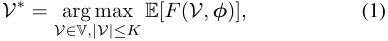

where E[ _F_ ( _V,_ **_φ_** )] is the expected utility with respect to the realization probability distribution P( **_φ_** ): 

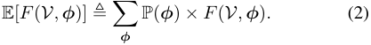

We now define an important property: _adaptive submodularity_ , that the utility function should satisfy to achieve good performance guarantee. Adaptive submodularity is an extension of submodularity to adapt to the scenarios of unknown quality realization. We first give the formal definition of submodular function. 

**Definition 1** (Submodularity) **.** _Given the ground set_ V _, a set function f_ : 2V _→_ R _is called submodular if, for any A ⊆ B ⊆_ V _and v ∈_ V _\B, it satisfies that: f_ ( _A ∪{v}_ ) _− f_ ( _A_ ) _≥ f_ ( _B ∪{v}_ ) _− f_ ( _B_ ) _._ 

Although many submodular maximization problems are NPhard, we can apply the simple greedy algorithms to derive near-optimal performance [4], [5], [14]. However, the greedy algorithms cannot guarantee performance when the realization is not available before running the algorithms. Golovin and Krause introduced the concept of adaptive submodularity [13] to deal with the unknown realization scenario. We present the definition of conditional expected marginal utility. 

**Definition 2** (Conditional Expected Marginal Utility) **.** _Given a partial realization ψ and a user v, the conditional expected marginal utility of v conditioned on ψ is:_ 

∆( _v|ψ_ ) = E[ _F_ ( _dom_ ( _ψ_ ) _∪{v},_ **_φ_** ) _− F_ ( _dom_ ( _ψ_ ) _,_ **_φ_** ) _|_ **_φ_** _∼ ψ_ ] _._ (3) 

_ψ is consistent with_ **_φ_** _, which is the realization of ground set._ 

**Definition 3** (Adaptive Submodularity [13]) **.** _Given the ground set_ V _, a set function F:_ 2V _×_ NV _→_ R _is called adaptive submodular with respect to the realization distribution_ P(Φ) _if, for any partial realizations ψ and ψ__′_ _, where ψ is a subrealization of ψ__′_ i.e. _, dom_ ( _ψ_ ) _⊆ dom_ ( _ψ__′_ ) _, and for any v ∈_ V _\dom_ ( _ψ__′_ ) _, it satisfies that:_ ∆( _v|ψ_ ) _≥_ ∆( _v|ψ__′_ ) _._ 

**Definition 4** (Adaptive Monotonicity [13]) **.** _Given the ground set_ V _, a set function F:_ 2V _×_ NV _→_ R _is called adaptive monotone with respect to the distribution_ P(Φ) _if, for any partial realization ψ and user v, it satisfies that:_ ∆( _v|ψ_ ) _≥_ 0 _._ 

## IV. CONTEXT-AWARE DATA QUALITY ESTIMATION 

In this section, we describe the design details of our contextaware data quality estimation scheme. The basic idea is to exploit contextual information to infer the data quality of mobile users, without knowing the ground truth of the sensing tasks. To fulfill this goal, we build a connection between contextual information and data quality by training a contextdata quality classifier based on the historical sensing data. 

## _A. Quality Estimation_ 

Expectation Maximization (EM) algorithm is a classical iterative method for finding maximum likelihood or maximum posteriori estimation of parameters in statistical models [8]. The key parts of adopting the EM algorithm are the choice of unobserved latent variables and the design of likelihood function. Different from the previous work about data quality management in mobile crowdsensing [24], [27], which choose the ground truth as the latent variable, we regard the latent variable as the data quality level **Φ** of mobile users. We assume that there are _T_ tasks in historical data set, and _uj_ is the ground truth of the _j_ th task. We use a _M × T_ matrix **X** to denote the historical data set, where _xij_ is the data that the mobile user _i_ collects for the _j_ th task. Without loss of generality, we assume that each mobile user has carried out all the _T_ tasks, _i.e._ , _xij >_ 0. We represent the collected data of the mobile user _i_ and the observations for the _j_ th task as 

_xi,∗_ = ( _xi_ 1 _, xi_ 2 _, · · · , xiT_ ) and _x∗,j_ = ( _x_ 1 _j, x_ 2 _j, · · · , xMj_ ), respectively. 

Before estimating the data quality distribution, we first calculate the ground truth for each task by introducing a Gaussian Mixture Model (GMM). We can consider the _M_ data _X∗,j_ for the _j_ th task are i.i.d samples from a probability density distribution (pdf) _pθ_ ( _x_ ), which is the mixture of _N_ univariate Gaussian distributions: 

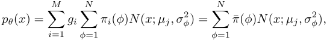

where _N_ ( _x, µj, σφ_2)denotestheGaussianpdfwithmean_µj_ and variance _σ_2 _φ_: 

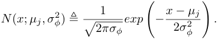

The value _gi_ = 1 _/M_ is the probability that the data comes from the mobile user _i_ . The probability ¯ _π_ ( _φ_ ) can be considered as the average of all the _πi_ ( _φ_ ), _i.e._ , _π_ ¯( _φ_ ) =�_M_ _i_ =1_giπi_(_φ_). We note that the Gaussian distributions share the same mean _uj_ , which is the ground truth of the _j_ th sensing task. To simply the notation, we omit the index _j_ in the following discussion. We can interpret such GMM model for the generalization of the observation data: we first draw a data quality level that takes value _φ_ with probability _π_ ¯( _φ_ ), and then generate the observation data _Xi ∼ N_ ( _µ, σφ_2). 

In GMM model, we consider mean _u_ and average probabilities _{π_ ¯( _φ_ ) _}_ as the parameters: _θ_ ≜ _{u,_ ¯ _π_ ( _φ_ ) _,_ 1 _≤ φ ≤ N }_ , while the variance _{σφ_2_}_isthegivenconstantnumbers.The latent variable is the average data quality level Φ¯ , which follows the multinomial distribution with _{π_ ¯( _φ_ ) _}_ . We introduce the incomplete-data log likelihood function for _θ_ as 

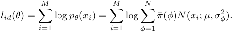

Maximizing this likelihood function with respect to the parameters _θ_ is a nonconcave maximization problem, leading to the intractability to derive closed form solutions. Therefore, we adopt EM algorithm to iteratively estimate the parameters. 

We first introduce the complete data log likelihood function. Let the complete data be ( _Xi,_ Φ¯ _i_ ), 1 _≤ i ≤ M_ , where Φ¯ _i_ is the random variable selected to produce the data _Xi_ . 

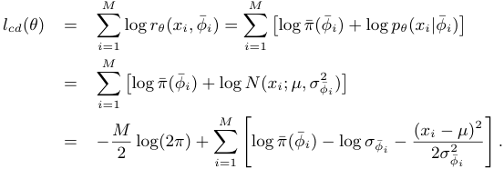

EM algorithm consists of two major steps: the expectation (E) step and the maximization (M) step. 

_•_ **E-step:** Compute the expectation of the complete data log likelihood function _lcd_ ( _θ_ ), with respect to the conditional 

distribution of latent variables Φ¯ under the current estimate of parameters _θ_(_k_) : 

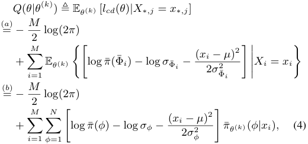

where the (a) holds because the random variable Φ¯ _i_ is conditionally independent of _{Xk}k̸_ = _i_ given _Xi_ . In (b), we have introduced the conditional probability distribution 

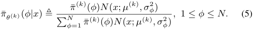

_•_ **M-step:** Calculate the updated parameters _θ_(_k_+1) that maximize the _Q_ ( _θ|θ_(_k_) ) in Equation (4), _i.e._ , 

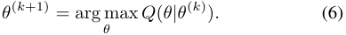

The function _Q_ ( _θ|θ_(_k_) ) is concave quadratic in _µ_ . Setting the partial derivatives of _Q_ ( _θ|θ_(_k_) ) with respect to _µ_ to zero, we obtain 

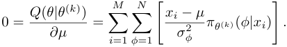

Hence, the updated mean _µ_(_k_+1) is: 

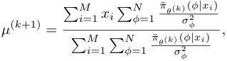

which is a weight average of the observations _x∗,j_ . 

To derive the update of the mixture probabilities, we maximize the _Q_ ( _θ|θ_(_k_) ) with respect to the _π_ ¯( _φ_ ). Here, we must take account of the constraint that the mixture probabilities sum to one, _i.e._ ,�_N_ _φ_ =1_π_¯(_φ_) = 1.Thiscanbeachievedusing a Lagrange multiplier and maximizing the following quantity: 

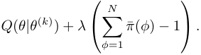

Setting the partial derivatives of the above equality with respect to _π_ ¯ _φ_ , and we have 

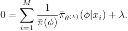

If we now multiple both side by _π_ ¯( _φ_ ) and sum over _N_ , we can derive _λ_ = _−M_ . Using this to eliminate _λ_ and rearranging, we obtain the updated mixture probability _π_ ¯(_k_+1) ( _φ_ ): 

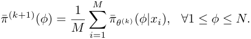

We iteratively execute the E-step and the M-step until the converge condition holds. We can manually set the convergence condition, _e.g._ , the difference of log likelihood function between two iterations goes below a predefined threshold. The final ground truth for the task _j_ is denoted by _µ__∗_ _j_. 

_j_. 

We now turn to calculate the data quality distribution, _i.e._ , the mixture probabilities _{πi_ ( _φ_ ) _}_ , for each mobile user. We emphasize that the data quality levels are not relevant to the ground truths of the tasks, but only capture the noise of the collected data. We define the noise of the data collected by the mobile user _i_ for the task _j_ as _yij_ ≜ _xij −µ__∗_ _j_. For each mobile user _i_ , we use the vector _yi,∗_ to denote the noises for all the collected data, _i.e._ , _yi,∗_ = ( _yi_ 1 _, yi_ 2 _, · · · , yiT_ ). We can consider that the data noises are drawn i.i.d from a probability density function _pθ_ ( _y_ ), which is the mixture of _N_ univariate Gaussian distributions with respective probability _πi_ ( _φ_ ), means 0, and variances _σφ_2,for1_≤φ ≤N_: 

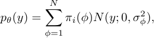

where _N_ ( _y_ ; 0 _, σφ_2)istheGaussiandistributionwithmean0 and variance _σφ_2.InthisGaussianMixtureModel,theparam- eters _θ_ are the mixture probabilities _{πi_ ( _φ_ ) _},_ 1 _≤ φ ≤ N_ . We try to derive the parameters _θ_ to maximize the log likelihood function, subjecting to the constraint that the sum of the mixture probabilities is equal to 1. We formulate this log likelihood maximization problem as _MAX-ML_ : 

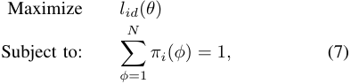

where the log likelihood function is defined as: 

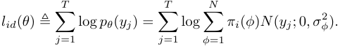

Since the quantities _yj_ and _σφ_2havebeengiven,_N_(_yj_; 0_, σ_ _φ_2) is a constant value, such that _MAX-ML_ is a concave maximization problem. We can derive the optimal results, denoted as _πi__∗_(_φ_),byapplyingtheclassicaloptimizationtechnique[3]. We describe the detailed steps of the quality estimation scheme in Algorithm 1. The input of the algorithm is the historical sensing data **X** over _T_ tasks from _M_ mobile users, and the output of the algorithm is the data quality distribution of each mobile user. We first estimate the ground truth _µ__∗_ _j_of each task _j_ using the EM algorithm with the input of data _x∗,j_ from the _M_ mobile users, and then derive the quality distribution _{πi__∗_(_φ_)_}_foreachmobileuser_i_bysolvinga concave maximization problem over the data _xi,∗_ of _T_ tasks. In the EM algorithm, we set the initial ground truth of the _j_ th task to be the average of all the data for the _j_ th task, and the average quality distribution to be a uniform distribution (Lines 3 to 6). After the initialization stage, we iteratively execute the E-step (Lines 9 to 10) and the M-step (Lines 12 to 15) until the converge condition holds. To derive the data quality distribution _{πi__∗_(_φ_)_}_for the mobile user_i_, we calculate the noise vector _yi,∗_ for her collected data based on the estimated ground truths for the tasks, and then solve the _MAXML_ problem using the optimization technique (Lines 20 to 22). 

selected approaches to conduct the activity recognition. Combing with the obtained hardware information, we can construct the complete context vector. 

## **Algorithm 1:** EM-based Quality Estimation Algorithm 

|**I** **O** **1** / **2 fo** **3** **4** **5**|**nput**: Historical data set **X**; A set of variances _{σ_2 _φ__}_ **utput**: Data quality distribution _{π__∗_ _i_ (_φ_)_}_ of each user _i ∈_V. / Estimate the ground truth **r** _j_ = 1 _to T_ **do** _µj_ = �_M_ _i_=1 _xij_ _M_ ; **for** _φ_= 1 _to N_ **do** ¯_π_(_φ_) = 1 _N_ ;     i|
|---|---|
|**6** **7** **8** **9** **10**|_k ←_0; _θ_(_k_) _←_(_{_¯_π_(_φ_)_}, µj_); **while** _not converged_ **do** // E-step: Calculate ¯_πθ_(_k_)(_φ|xij_) using Equation (5); _Q_(_θ|θ_(_k_))_←−__M_ 2 log(2_π_) + �_M_ _i_=1 �_N_ _φ_=1 � log ¯_π_(_φ_)_−_log_σφ −_ (_xij−µj_)2 2_σ_2 _φ_ � ¯_πθ_(_k_)(_φ|xij_); i       |
|**11** **12**|// M-step: _µ_(_k_+1) _j_ _←_ �_M_ _i_=1 _xij_ �_N_ _φ_=1 ¯_πθ_(_k_)(_φ|xij_) _σ_2 _φ_ �_M_ _i_=1 �_N_ _φ_=1 ¯_πθ_(_k_)(_φ|xij_) _σ_2 _φ_ ;   i   |
|**13** **14**|**for** _φ_= 1 _to N_ **do** ¯_π_(_k_+1)(_φ_)_←_ 1 _M_ �_M_ _i_=1 ¯_π__θ_(_k_)(_φ|xij_);   |
|**15** **16**|_θ_(_k_+1) _←_(_{_¯_π__k_+1(_φ_)_}, µ__k_+1 _j_ ); _k ←k_+ 1;   |
|**17**|_µ__∗_ _j __←µk_ _j_ ; |
|**18** / **19 fo** **20** **21**|/ Estimate the data quality distribution **r** _i_= 1 _to M_ **do** **for** _j_ = 1 _to T_ **do** _yij ←xij −µ__∗_ _j_; |
|**22** **23 r**|_{π__∗_ _i_ (_φ_)_} ←_Solving the MAX-ML problem in (7); **eturn** _{π__∗_ _i_ (_φ_)_} for each user i ∈_V;   |

## _C. Context-Quality Classifier_ 

We rely on the previous two components: data quality estimation and context recognition, to train context-quality classifier. The historical sensing data consists of primary data (the data used to answer the queries of clients) and secondary data (the data used to obtain context information). For each piece of historical data, we derive data quality from the primary data by applying the data quality estimation scheme, and extract context vector from the secondary data using the activity recognition technique. Taking these context and data quality level pairs as the training set, the service provider construct a context-quality classifier using the classical supervised learning algorithm. We intend to train a multi-class classifier through the binary classification algorithm, such as support vector machine (SVM) [6]. We adopt a classical method that train a binary classifier between each data quality level and the rest. Once we build the context-quality classifier, we can determine the data quality for the collected data only through the contextual information, even without knowing the ground truth of the sensing task, in a real-time manner. 

## V. ADAPTIVE USER SELECTION 

In this section, we apply the context-quality classifier to guide the process of user recruitment. We first extend the classical Gaussian Process to model sensing data in the scenarios of diverse data quality levels, and define the specific utility function based on the concept of mutual information. Taking advantage of the adaptive submodularity property of the utility function, we design a random adaptive user selection algorithm, achieving a constant approximation ratio. 

We can use the obtained data quality distribution to determine the data quality level of each historical sensing data, which will be regarded as the training data set in the contextquality classifier. Here, we follow the idea of maximum a posteriori estimation: selecting the parameter _φij_ that maximizes the posterior distribution to be the quality level of the data _xij_ . 

## _A. Quality-related Gaussian Process_ 

We introduce the classical Gaussian Process (GP) model for sensing data, and extend it to involve the consideration of data quality. In GP model, every point is associated with a random variable, following a univariate Gaussian distribution. The joint distribution over a set of random variables is a multivariate normal distribution. The parameters of GP model are a mean vector **_µ_** and a covariance matrix **Σ** , which is a symmetric positive-definite matrix. In mobile crowdsensing, we can use the Gaussian Process to model the sensing data collected at POIs. Specifically, we associate each PoI _l ∈_ L with a random variable _Xl_ , which follows a one-dimension Gaussian distribution with mean **_µ_** _l_ and variance **Σ** _l,l_ . For each PoIs pair _l_ 1 _, l_ 2 _∈_ L, their covariance is **Σ** _l_ 1 _,l_ 2. The GP model is extremely powerful to represent sensing data [14]. If we observe sensing data on a set of PoIs, we can predict the data at unobserved PoIs, and provide the variance of such prediction. The classical GP model either does not consider the noises of the observed data, or simply assume that all the data noises are sampled from the same distribution. However, as we have discussed, different context environments may result in different data quality levels, implying that the observed data may have different levels of noises. Thus, the classical GP model fails to describe the diverse data quality in crowdsensing. 

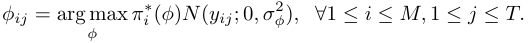

## _B. Context Recognition_ 

We now discuss the context recognition, which is to collect hardware information and activity information. The hardware information, such as the accuracy of accelerometer and the resolution of camera, can be read directly from the devices. Thus, the remaining challenge lies in how to assess the user activity during data acquisition process. 

Mobile phones are embedded with a bundle of powerful sensors, such as accelerometers, microphones, GPS, and etc. We can exploit the data collected from these sensors to recognize diverse activities in different environments. The activity recognition through analyzing the sensing data have been widely studied in the ubiquitous computing literature [2], [17], [21]. For example, Kwapisz _et al._ implemented a system that uses accelerometers to perform activity recognition [17]. Mun _et al._ designed a hybrid approach utilizing both Wi-Fi and GSM signals to infer the mobility patterns of users [21]. For specific mobile crowdsensing application, we can adopt 

Suppose the set of PoIs selected to observe data is _A ⊆_ L and the rest unobserved PoIs are _B_ = L _\A_ .1 We have the following expressions for the means and variances: 

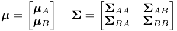

In order to make GP model accordant with our data quality model, we introduce a noise matrix **Γ** , where the diagonal entries represent the variances of the noise distributions at the corresponding PoIs and the others are zeros. In this case, we can capture the scenario that the data collected at different PoIs have different noise levels. We note that the vector of the diagonal entries from the matrix **Γ** is actually a realization **Φ** of data quality levels from mobile users. Given the observations _xA_ at the selected PoIs _A_ , we can predict the values at the unobserved PoIs _B_ , _i.e._ , the probability distribution _P_ ( _XB|xA_ ), which is a conditional Gaussian distribution with mean **_µ_** _B|A_ and variance **Σ** _B|A_ : 

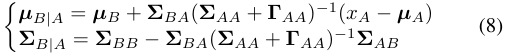

With the quality-related Gaussian Process model, now we can quantitatively measure the utility of the selected PoIs, and then define the detailed format of the utility function. Intuitively, the service provider always wants to select a set of PoIs _A_ that most significantly reduces the uncertainty about the prediction on the rest of PoIs _B_ [14]. A nature notion of uncertainty is _entropy_ . Thus, for a set of selected PoIs _A_ and a data quality level realization Φ, we define the utility function as the reduction of the entropy of the unselected PoIs _B_ before and after observing the random variables _XA_ : 

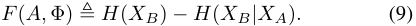

We note that this reduction is also known as the _mutual information_ between the selected PoIs _A_ and the rest of the PoIs _B_ [7]. According to the definition of entropy, we can calculate the entropy of the Gaussian random variable _XB_ and the entropy of the random variable _XB_ condition on the set of variables _XA_ : 

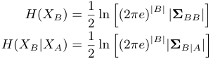

We integrate the above two equalities into Equation (9) to derive the specific format of the utility function. It is worth noting that the utility function depends on both the selected PoIs _A_ and the realization **Φ** . The realization **Φ** determines the noise matrix **Γ** in calculating _H_ ( _XB|XA_ ). 

## _B. Design Details_ 

The challenges of designing efficient algorithms for stochastic submodular maximization problem lies in the unknown data quality levels of mobile users during the optimization. One trivial solution is to enumerate the possible realization of the data quality levels, and run the simple greedy algorithm, which guarantees the constant approximation ratio in nonstochastic submodular maximization setting [14], for each realization. There are _N_ possible quality levels for each mobile user. To compute the expectation of the utility over the user subset of size _K_ , we have to take average of _O_ ( _N__M_ ) 

> 1As we have assumed there is exact one mobile user at one PoI, selecting PoIs is equal to selecting the corresponding mobile users at the PoIs. 

**Algorithm 2:** Random Adaptive Greedy User Selection 

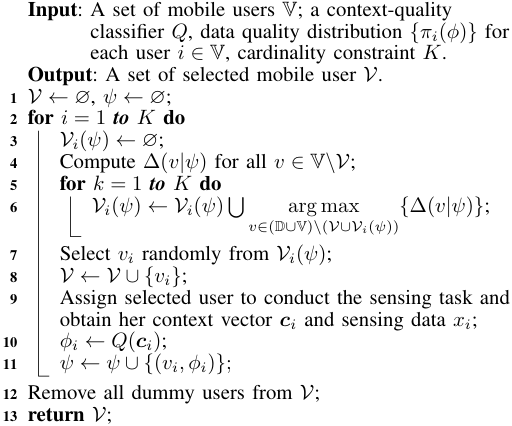

instances of possible realizations. Thus, such solution leads to an exponential time complexity. 

We turn to an adaptive selection policy. The service provider selects only one mobile user according to a certain criterion in each round. After that, the service provider assigns her a sensing task, receives her sensing data, and determines her data quality level. Based on the collected data and the realized data quality level, the service provider then updates the GP model according to Equations (8). The service provider iteratively executes these steps until selecting _K_ qualified mobile users. With such adaptive selection policy, we can reduce the time complexity to a polynomial order _O_ ( _KM_ ). 

In order to design a good selection criterion, we take advantage of the adaptive submodularity of the utility function. 

**Lemma 1.** _The utility function F_ ( _·, ·_ ) _defined in Equation (9) is adaptive submodular._ 

Due to the limitation of space, we leave the detailed proof into our technical report [1]. 

We observe that _F_ (L _,_ **Φ** ) = _F_ (∅ _,_ **Φ** ) = 0, thus the utility function is not adaptive monotone. When running the traditional adaptive greedy policy for the monotone objective function: selecting the user with the highest marginal utility ∆( _v|ψ_ ) in each round, the non-monotonicity would lead to the traps of low utility. We slightly modify the traditional adaptive greedy policy by introducing a random procedure, to deal with such traps. In order to avoid selecting the user with a negative marginal value, we introduce 2 _K −_ 1 additional dummy users, denoted by D, to the ground set. The expectation of marginal utility for each dummy user _d ∈_ D is always 0, _i.e._ , ∆( _d|ψ_ ) = 0. It is obvious that the dummy users do not affect the optimal policy, and can be removed from the solution of any selection policy, without affecting its expected utility. 

We present the detailed steps of the random adaptive greedy user selection policy in Algorithm 2. We select _K_ candidate mobile users in an adaptive manner. In each iteration, given the current partial realization, we first calculate the expected marginal utility for each available users (Line 4). Then, we select _K_ candidate users with the maximum expected marginal utility, and randomly choose one of them as the selected user 

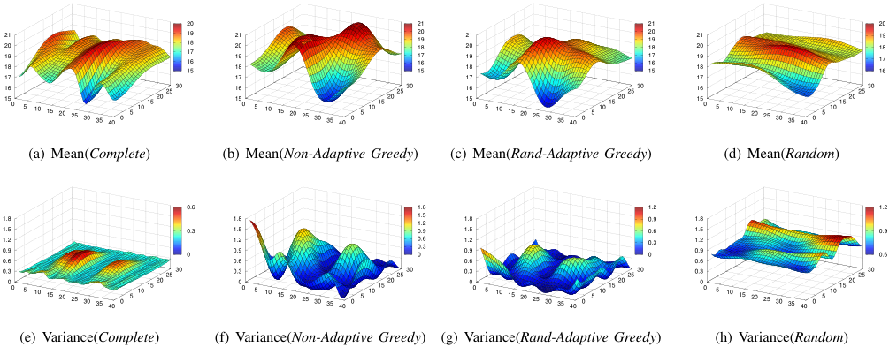

<!-- Start of picture text -->
 20  21  21  20  21 20 19 18  19 18 17 16 15  21 20 19 18  20 19 18 17 16 15  21 20 19 18  20 19 18 17 16 15  21 20 19 18  19 18 17 16  17  17  17  17  16 15 0  5  10  15  20  25  30  35  40  0  5  10  15  20  25  30  16 15 0  5  10  15  20  25  30  35  40  0  5  10  15  20  25  30  16 15 0  5  10  15  20  25  30  35  40  0  5  10  15  20  25  30  16 15 0  5  10  15  20  25  30  35  40  0  5  10  15  20  25  30 (a) Mean( Complete ) (b) Mean( Non-Adaptive Greedy ) (c) Mean( Rand-Adaptive Greedy ) (d) Mean( Random )  0.6  1.8  1.2  1.2  1.8  1.8  1.5 1.2  1.8  0.9  1.8  1.5  0.3  1.5  0.9  1.5  0.6  1.5  0.9  1.2 0.9  0  1.2 0.9  0.6 0.3 0  1.2 0.9  0.3 0  1.2 0.9  0.6  0.6  0.6  0.6  0.6  0.3 0 0  5  10  15  20  25  30  35  40  0  5  10  15  20  25  30  0.3 0 0  5  10  15  20  25  30  35  40  0  5  10  15  20  25  30  0.3 0 0  5  10  15  20  25  30  35  40  0  5  10  15  20  25  30  0.3 0 0  5  10  15  20  25  30  35  40  0  5  10  15  20  25  30 (e) Variance( Complete ) (f) Variance( Non-Adaptive Greedy ) (g) Variance( Rand-Adaptive Greedy ) (h) Variance( Random ) <!-- End of picture text -->

Figure 3: Comparision between different gaussian process models. 

in this iteration (Lines 5 to 8). When the selected user finishes the sensing task, we can obtain her contextual information and the sensing data. Taking the contextual information as input, the context-quality classifier outputs the data quality level of the user, which is used to update the partial realization. After selecting _K_ mobile users, we remove all the dummy users, and return the ultimate set as the result. 

We now show that the random adaptive greedy algorithm achieves a constant approximation ratio of 1 _/e_ . 

**Theorem 1.** _For the adaptive submodular utility function F_ ( _·, ·_ ) _, the user set V returned by the random adaptive greedy algorithm attains at least_ 1 _/e of the optimal value, that is:_ 

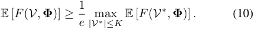

Due to the limitation of space, we supply the complete proof in our technical report [1]. 

In this section, we report the evaluation results on adaptive user selection process. We base on a real-world temperature data set to perform a sequence of simulations to emulate the behavior of mobile phone users and user selection process. 54 sensor nodes were deployed in a lab and kept collecting temperature information for several days. We select the samples between 1 am and 2 am to train a primal covariance matrix, which is used to compute the mutual information. Since the sensor readings have much smaller noises than user data, we regard the sensor readings as the ground truth here. 

Then, we assume that there are 200 users willing to participate in this project. We generate a random quality distribution vector for each user, where there are 5 predefined qualities. They respectively map to the gaussian noise with variance 0.1, 0.5, 1, 2, and 5. User locations are randomly selected from the 54 sensor locations deployed in the lab. 

In our first experiment, we construct four gaussian process models using data from (a)sensor readings from all of the 54 locations, (b)”noisy” readings from 20 users selected by non-adaptive simple greedy algorithm only based on their locations, (c)”noisy” readings from 20 users selected by our 

Table I: Relative Deviation Comparision 

|GP model|Relative Deviation|
|---|---|
|Complete Data Set|0.0133|
|Random Adaptive Greedy Algorithm|0.0414|
|Non-adaptive Greedy Algorithm Random Algorithm|0.0592 0.0876|

random adaptive greedy algorithm, and (d)”noisy” readings from 20 randomly selected users. The ”noisy” reading of user is generated as follows: After determining the quality of the selected user, we sample a gaussian noise randomly from the corresponding normal distribution. Add the generated gaussian noise to the sensor reading, we then get the ”noisy” user data. The recovering results of these four gaussian process models are presented in Figure 3. The predicted mean values are shown in (a), (b), (c), and (d), while the prediction variances are shown in (e), (f), (g), and (h). Besides, the relative deviations of these four recovered models are presented in _<u>||y</u>_ ˆ _−y||_ 2 Table I, which is defined as: Relative Deviation = _||y||_ 2 where _y_ denotes ground truth at those 54 locations, and _y_ ˆ denotes the vector of predicted values. 

As we can see, the GP model recovered from all of the 54 sensor readings are the best, with the lowest variance and relative deviation. The GP model recovered by our random adaptive greedy algorithm, although has relatively higher variance than complete model, shows better performance than the model recovered by random algorithm and non-adaptive greedy algorithm in both prediction variance and prediction accuracy. The non-adaptive greedy algorithm only considers the impact of locations, but not the impact of data quality. So it only outperforms the random algorithm, but is inferior to our random adaptive greedy algorithm. 

In our second experiment, we compare the mutual information of the sets returned by our random adaptive greedy algorithm, random algorithm, non-adaptive greedy algorithm and the simple adaptive greedy algorithm. Each point in Figure 4 is the average of 10 runs of the algorithms. As shown in Figure 4, when the cardinality constraint is small, _i.e._ , less than 30, the simple adaptive greedy algorithm and 

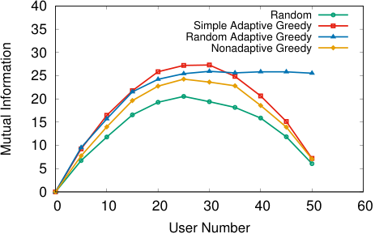

<!-- Start of picture text -->
 40 Random  35 Simple Adaptive Greedy Random Adaptive Greedy  30 Nonadaptive Greedy  25  20  15  10  5  0  0  10  20  30  40  50  60 User Number Mutual Information <!-- End of picture text -->

Figure 4: Mutual information of different algorithms. 

the random adaptive greedy algorithm obtain similar mutual information. However, due to the non-monotonicity of mutual information, when the cardinality constraint gets approach to 50, the mutual information of sets returned by other three algorithm all decreases. Since we add enough dummy users and provide a random step in our random adaptive greedy algorithm, the mutual information gain will not decrease even when the cardinality constraint increases to 50. Moreover, since the non-adaptive greedy algorithm only considers the influence of location, mutual information of selected users is always lower than sets returned by simple adaptive greedy algorithm and random adaptive greedy algorithm. Here we can see the superiority of our random adaptive greedy algorithm. 

## VII. RELATED WORK 

In this section, we briefly review the related works. 

**Data Quality in crowdsensing.** In recent years, many researchers have paid their attention to the data quality problem in crowdsensing. However, they either ignored how to estimate the data quality and used it directly [15], [16], [26], [28], or only focused on estimating the data quality without further usage [24]. To the best of our knowledge, our work is the first to estimate the data quality and use it to guide user selection. Different from the labeling task in crowesourcing [30], sensor data in crosdsensing is always continuous. It is not suitable to describe its quality with confusion matrix model. We exploit the gaussian process model and use variance of gaussian noise to describe the quality of sensing data. 

**Submodular maximization** is a well-studied mathematical problem. Nemhauser _et.al._ [22] firstly proved the approximation ratio of greedy algorithm in the maximization of monotone submodular functions. Then, in 2010, Golovin and Krause [13] proposed the concept of adaptive submodularity and proved the approximation ratio of simple adaptive greedy algorithm. There are some recent works on the maximization of non-monotone submodular function [4], [12]. 

## VIII. CONCLUSION 

In this paper, we have studied real-time data quality estimation in mobile crowdesing. We have investigated the relation between sensing context and data quality, and proposed the context-aware data quality estimation scheme. We have integrated the data quality estimation scheme to guide user recruitment. We have modeled the user recruitment process as an adaptive non-monotone submodular maximization problem, and designed a random adaptive greedy algorithm to achieve a constant approximation ratio. Through simulation on a realworld temperature data set, we have shown the excellent 

performance of our algorithm when recovering the GP model in the whole target area with finite observed locations. 

## REFERENCES 

- [1] Context-aware data quality estimation in mobile crowdsensing. Technical report, https://www.dropbox.com/s/agj6qs2uva8b4av/mcs liushengzhong.pdf?dl=0, 2017. 

- [2] Y. Arase, F. Ren, and X. Xie. User activity understanding from mobile phone sensors. In _UbiComp Adjunct_ , 2010. 

- [3] S. Boyd and L. Vandenberghe. _Convex optimization_ . Cambridge university press, 2004. 

- [4] N. Buchbinder, M. Feldman, J. Naor, and R. Schwartz. A tight linear time (1/2)-approximation for unconstrained submodular maximization. In _FOCS_ , 2012. 

- [5] N. Buchbinder, M. Feldman, J. S. Naor, and R. Schwartz. Submodular maximization with cardinality constraints. In _SODA_ , 2014. 

- [6] C.-C. Chang and C.-J. Lin. Libsvm: A library for support vector machines. _ACM Transactions on Intelligent Systems and Technology_ , 2(3):27:1–27:27, 2011. 

- [7] T. M. Cover and J. A. Thomas. _Elements of information theory_ . John Wiley & Sons, 2012. 

- [8] A. P. Dawid and A. M. Skene. Maximum likelihood estimation of observer error-rates using the em algorithm. _Applied statistics_ , 28(1):20– 28, 1979. 

- [9] A. Deshpande, C. Guestrin, S. R. Madden, J. M. Hellerstein, and W. Hong. Model-driven data acquisition in sensor networks. In _VLDB_ , 2004. 

- [10] P. Dutta, P. M. Aoki, N. Kumar, A. Mainwaring, C. Myers, W. Willett, and A. Woodruff. Common sense: participatory urban sensing using a network of handheld air quality monitors. In _SenSys_ , 2009. 

- [11] S. B. Eisenman, E. Miluzzo, N. D. Lane, R. A. Peterson, G.-S. Ahn, and A. T. Campbell. Bikenet: A mobile sensing system for cyclist experience mapping. _ACM Transactions on Sensor Networks_ , 6(1):6, 2009. 

- [12] U. Feige, V. S. Mirrokni, and J. Vondrak. Maximizing non-monotone submodular functions. _SIAM Journal on Computing_ , 40(4):1133–1153, 2011. 

- [13] D. Golovin and A. Krause. Adaptive submodularity: A new approach to active learning and stochastic optimization. In _COLT_ , 2010. 

- [14] C. Guestrin, A. Krause, and A. P. Singh. Near-optimal sensor placements in gaussian processes. In _ICML_ , 2005. 

- [15] H. Jin, L. Su, D. Chen, K. Nahrstedt, and J. Xu. Quality of information aware incentive mechanisms for mobile crowd sensing systems. In _MobiHoc_ , 2015. 

- [16] R. Kawajiri, M. Shimosaka, and H. Kashima. Steered crowdsensing: Incentive design towards quality-oriented place-centric crowdsensing. In _UbiComp_ , 2014. 

- [17] J. R. Kwapisz, G. M. Weiss, and S. A. Moore. Activity recognition using cell phone accelerometers. _SIGKDD Explorations Newsletter_ , 12(2):74– 82, 2011. 

- [18] N. D. Lane, E. Miluzzo, H. Lu, D. Peebles, T. Choudhury, and A. T. Campbell. A survey of mobile phone sensing. _IEEE Communications Magazine_ , 48(9):140–150, 2010. 

- [19] S. Mathur, T. Jin, N. Kasturirangan, J. Chandrasekaran, W. Xue, M. Gruteser, and W. Trappe. Parknet: drive-by sensing of road-side parking statistics. In _MobiSys_ , 2010. 

- [20] P. Mohan, V. N. Padmanabhan, and R. Ramjee. Nericell: rich monitoring of road and traffic conditions using mobile smartphones. In _SenSys_ , 2008. 

- [21] M. Mun, D. Estrin, J. Burke, and M. Hansen. Parsimonious mobility classification using gsm and wifi traces. In _HotEmNets_ , 2008. 

- [22] G. L. Nemhauser, L. A. Wolsey, and M. L. Fisher. An analysis of approximations for maximizing submodular set functions. _Mathematical Programming_ , 14(1):265–294, 1978. 

- [23] Noisetube. http://www.noisetube.net/. 

- [24] D. Peng, F. Wu, and G. Chen. Pay as how well you do: A quality based incentive mechanism for crowdsensing. In _MobiHoc_ , 2015. 

- [25] R. Pryss, M. Reichert, B. Langguth, and W. Schlee. Mobile crowd sensing services for tinnitus assessment, therapy, and research. In _MS_ , 2015. 

- [26] Z. Song, B. Zhang, C. H. Liu, A. V. Vasilakos, J. Ma, and W. Wang. Qoi-aware energy-efficient participant selection. In _SECON_ , 2014. 

- [27] D. Wang, L. Kaplan, H. Le, and T. Abdelzaher. On truth discovery in social sensing: A maximum likelihood estimation approach. In _IPSN_ , 2012. 

- [28] Y. Wen, J. Shi, Q. Zhang, X. Tian, Z. Huang, H. Yu, Y. Cheng, and X. Shen. Quality-driven auction-based incentive mechanism for mobile crowd sensing. _IEEE Transactions on Vehicular Technology_ , 64(9):4203–4214, 2015. 

- [29] J. Yick, B. Mukherjee, and D. Ghosal. Wireless sensor network survey. _Computer Networks_ , 52(12):2292 – 2330, 2008. 

- [30] Y. Zhang, X. Chen, D. Zhou, and M. I. Jordan. Spectral methods meet em: A provably optimal algorithm for crowdsourcing. In _NIPS_ , 2014. 

