# Pricing for Revenue Maximization in Inter-DataCenter Networks 

Zhenzhe Zheng_∗_ , R. Srikant_†_ , Guihai Chen 

Department of Computer Science and Engineering, Shanghai Jiao Tong University, China _†_ Coordinate Science Lab, Department of Electrical and Computer Engineering 

University of Illinois at Urbana-Champaign, Urbana, IL, USA 

Email: zhengzhenzhe@sjtu.edu.cn, rsrikant@illinois.edu, gchen@cs.sjtu.edu.cn 

**_Abstract_ —As more applications and businesses move to the cloud, pricing for inter-datacenter links has become an important problem. In this paper, we study revenue maximizing pricing from the perspective of a network provider in inter-datacenter networks. Designing a practical bandwidth pricing scheme requires us to jointly consider the requirements of envy-freeness and arbitrage-freeness, where envy-freeness guarantees the fairness of resource allocation and arbitrage-freeness induces users to truthfully reveal their data transfer requests. Considering the non-convexity of the revenue maximization problem and the lack of information about the users’ utilities, we propose a framework for computationally efficient pricing to approximately maximize revenue in a range of environments. We first study the case of a single link accessed by many users, and design a** (1 + _ϵ_ ) **approximation pricing scheme with polynomial time complexity and information complexity. Based on dynamic programming, we then extend the pricing scheme for the tollbooth network, preserving the** (1+ _ϵ_ ) **approximation ratio and the computational complexity. For the general network setting, we analyze the revenue generated by uniform pricing, which determines a single per unit price for all potential users. We show that when users have similar utilities, uniform pricing can achieve a good approximation ratio, which is independent of network topology and data transfer requests. The pricing framework can be extended to multiple time slots, enabling time-dependent pricing.** 

## I. INTRODUCTION 

With the growing deployment of globally-distributed applications, inter-datacenter networks are becoming an important resource in cloud computing. Many services rely on lowlatency communication and high-throughput data transfers among data centers to improve the quality of experience for their consumers. For example, media companies can deliver high definition video content to consumers in multiple areas [1], search engines can synchronize search indexes between data centers [2], and big data applications can move datasets collected at one data center to another for further analysis. Considering the emerging market demand for interdatacenter bandwidth, online service providers, such as Amazon, Google, and Microsoft, have built dedicated wide area networks (WANs) to connect their datacenters [2], [3], and launched data transfer services like AWS direct connect [4], to facilitate the success of globally-distributed applications. 

> _∗_ This work was done while the author visited Coordinate Science Lab, University of Illinois at Urbana-Champaign, Urbana, IL, USA This work was supported in part by the State Key Development Program for Basic Research of China (973 project 2014CB340303), by NSF Grants CIF-1409106 and CPS ECCS-1739189, in part by China NSF grant 61672353 and 61472252. 

In this paper, we study the pricing for network connectivity in inter-datacenter networks from a network provider’s point of view. To access inter-datacenter networks, users submit data transfer requests, containing source and destination data centers and transmission time intervals, to the network provider. The network provider designs a dynamic pricing scheme to specify the bandwidth charges to potential users. Users response to the charges by choosing a certain data rate to transmit data over the network. A recent work [5] has considered the objective of maximizing social welfare, which measures the aggregated “happiness” of network provider and users. This objective may not be in the interest of network provider, especially in public WANs, where the network provider wants to extract more revenue to maximize the return on investment in inter-datacenter WAN. Thus, our focus here is on designing pricing scheme for revenue maximization. 

A practical revenue maximizing pricing scheme should satisfy the properties of _envy-freeness_ and _arbitrage-freeness_ . In economics, envy-freeness is a natural fairness criterion, requiring that given a pricing rule, users would be allocated the resources, _i.e._ , data transmission rates in our context, that maximize their utilities [6]. We further extend this criterion to avoid other possible unfairness among users. We require that users consuming a set of resources, should be charged no less than the users consuming only a subset of the resources, as they use more resources. In the context of inter-datacenter networks, this requires the per unit price for users to transmit data over a certain route, should be no smaller than that to users, who only use a sub-path of the route. In designing pricing schemes, the network provider also needs to consider the potential arbitrage behaviors from users. One simple arbitrage behavior may be purchasing a sequence of single resources rather than buying a bundle of resources at one time, if the total price of individual resource is less than the price of the bundle. Suppose a user requires data transfer over a route _A → B → C_ . An intelligent user may have an incentive to divide her request into two sub requests over routes _A → B_ and _B → C_ , respectively, if the price of the whole request is larger than the sum of prices of the two sub requests. Hence, designing a pricing scheme with the guarantee of envyfreeness and arbitrage-freeness can avoid discontent among users and induce users to truthfully reveal their requests. 

To design an efficient revenue maximizing pricing scheme, we have to consider the computational complexity from the perspectives of both time complexity and information 

complexity. Existing works only examined the special cases of revenue maximization problem, such as adopting specific utility functions for users [7], [8] or considering a simplified network topology [9]–[11], to derive positive results. However, the revenue maximization problem in general is non-convex, and thus it is computationally intractable to calculate the optimal prices. Therefore, we are interested in designing computationally efficient pricing to achieve approximate revenue maximization in general scenarios. Different from the previous works in the complete information setting [8], [12], we attempt to maximize revenue without full knowledge of users’ utility functions, taking only a limited amount of communication with users. We measure the information complexity by the number of rounds of interaction needed to achieve the optimal revenue within some given approximation factor. Considering the high computational complexity of deriving optimal revenue, the network provider faces a trade-off between achieving optimal revenue and keeping pricing schemes efficient. 

We now summarize the main contributions in this paper. 

_•_ We model the interaction between network provider and users: the network provider sets a per unit price for each user and the user responds to the price by choosing a certain data rate to transmit data. We consider two types of envy-free and arbitrage-free pricing: _item pricing_ and _uniform pricing_ , to determine the prices, and investigate their revenue guarantees within a range of environments. 

_•_ We begin with studying a single link case, in which the network provider determines the price of link to maximize revenue. Using a straightforward idea, we can design a (1 + _ϵ_ )-approximation pricing scheme with polynomial time complexity and information complexity. This result is the basis of developing solutions for more complex network cases. 

_•_ Motivated by the current pricing strategy in interdatacenter networks, we then consider a tollbooth case with a tree network topology. Based on the idea of dynamic programming, we propose an item pricing scheme to determine the price for each link, and charge a user with the sum of prices of links in her route. Our analysis shows that this item pricing scheme preserves the (1 + _ϵ_ ) approximation ratio and the computational complexity. 

_•_ For general network setting, we investigate two variants of item pricing, and show that they are impractical due to either high computational complexity or loose revenue guarantee. Our main result shows that uniform pricing, which charges a single per unit price to all users, satisfies the requirements of envy-freeness and arbitrage-freeness, and has good revenue guarantee when users have similar utility functions. 

_•_ We further extend pricing schemes to multiple time slots, enabling time-dependent pricing. We show that the pricing schemes preserve the approximation ratio and only introduce an additional constant factor for computational complexity. 

_•_ Finally, we evaluate the performance of uniform pricing with specific utility functions in a real inter-datacenter networks. The evaluation results show that uniform pricing outperforms a trivial item pricing, and the ratio between the optimal revenue and the obtained revenue is less than 1 _._ 6. 

## II. RELATED WORK 

Pricing for communication networks has been well studied in the literature. The Transmission Control Protocol (TCP) can be viewed as a congestion pricing scheme [13], [14], and new network protocol can also be reverse-engineered as a pricingbased solution to a Network Utility Maximization (NUM) [15] with specific utility functions. The objective in NUM is to maximize the sum of users’ utilities, which can be considered as the social welfare of network. Our work differs from this line of works, because our goal is to maximize revenue, which is non-convex in general and is more challenging. 

There is an extensive literature investigating revenue maximization with various pricing schemes in communication network [7], [8], [10], [12], [16]. Acemoglu _et al._ studied entry price strategy and power allocation rule in wireless network [16]. Bas¸ar and Srikant designed usage-based pricing schemes in a single link network [8] and a multiple-link network [7], and derive the condition under which expanding network capacity increases revenue. Shakkottai _et al._ proposed the concept of price of simplicity to measure the revenue loss due to using flat entry pricing in single link network [9]. Our result can be considered as the extension of this concept to multiple-link network. Our work differs from the above works due to the factor that we consider general utility functions and network topologies in incomplete information setting. Most of the above works either adopted specific utility functions, such as logarithmic function [7], [8], or considered a simplified network topology, such as single link network [9]–[11]. The problem of revenue maximization has also been extensively studied in economics and theoretical computer science [6], [17], [18]. However, most of these works focused on discrete linear utilities [6], [17], rather than the continuous concave utilities considered in this work. The work [18] needs to know the distribution of users’ utilities to maximize revenue. 

Employing software defined networking (SDN) technique, large cloud companies have built dedicated WANs, such as Google’s B4 [2] and Microsoft’s SWAN [3], to connect their geo-distributed data centers. Kandula _et al._ presented Tempus, a WAN data transfer framework, to schedule long-running data transfers in spatial and temporal dimension [19]. Kumar _et al._ presented Google’s Bandwidth Enforce (BwE) for WAN bandwidth allocation, enabling WAN to run at a high level of utilization [20]. These works enable network provider to improve the utilization of inter-datacenter bandwidths from the perspective of engineering, our work, from the perspective of economics, attempts to design a revenue maximizing pricing scheme for network provider to extract more revenue from inter-datacenter bandwidth market. 

## III. PRELIMINARIES 

## _A. System Model_ 

**A Network Provider** : We consider a network provider managing a WAN _G_ = ( _V, E_ ) of interconnected datacenters. Each node _v ∈ V_ denotes a data center, and each edge _e_ = ( _v, w_ ) represents a WAN link connecting datacenters _v_ and _w_ or an ingress/egress link between datacenter _v_ and an ISP _w_ . We discretize time into _T_ time slots, where each time 

slot corresponds to a fixed time interval, such as five minute interval. The provider associates a price _pe,t_ for each link _e ∈ E_ at each time slot _t_ , meaning that users have to pay _pe,t_ for transferring data with unit data rate over link _e_ at time slot _t_ . We use matrix **_P_** = ( _pe,t_ ) _∈_ R_|E|×T_ to denote the prices for different links at different time slots. We assume that links do not have explicit capacity constraints, and adjust demands over links through the control of prices on the links [21]. 

**Network Users** : There is a set of _N_ network users, denoted by _N_ = _{_ 1 _,_ 2 _, · · · , N }_ , who make data transfer requests. The request from user _i ∈N_ can be specified as a tuple _{si, di, t_1 _i__, t_2 _i__, ui_(_·_)_}_.Thenodes_si_and_di_representthesource and destination of data transfer, respectively, meaning that the data can be transmitted along a set of possible paths (or routes) _Ri_ from _si_ to _di_ . For convenience of discussion, we only express explicit solutions to the single-minded case, in which each of user _i ∈N_ pre-determines a specific route _ri_ from _Ri_ , to transmit data.1 We consider a data rate request scenario, in which each of users requires a constant data transmission rate over a certain period of time. The user _i ∈N_ also specifies a time interval [ _t_1 _i__, t_2 _i_],where_t_1 _i_correspondstothestarting time slot to transmit data and _t_2 _i_representstheendingtime slot. We assume that the lengths of time intervals are bounded by a constant _t_¯ , _i.e._ , _t_2 _i__−t_1 _i__≤t,_¯_∀i∈N_.Theuser_i∈N_ has a (private) utility _ui_ ( _xi_ ), which measures the worth of the data transfer at data rate _xi_ over the time interval [ _t_1 _i__, t_2 _i_]. Throughout the paper, we adopt the following assumption on the utility function _u_ ( _x_ ). 

**Assumption 1.** _The utility function u_ : [0 _, ∞_ ] _→_ [0 _, ∞_ ] _is an increasing, strictly concave, and differentiable function._ 

**Charge** : The network provider charges a payment _pi_ ( _xi_ ) to user _i ∈N_ for using the network with a data rate _xi_ during the time interval [ _t_1 _i__, t_2 _i_]. In general, the price of a data transfer is related to the allocated data rate, the source and destination nodes, the requested transmission time interval, the market competition for resources, etc. For simplicity, we consider a linear usage-based pricing: the charge to a user is proportional to the amount of allocated data rate, _i.e._ , _pi_ ( _xi_ ) = _pi × xi_ . For convenience of discussion, we normalize the feasible prices for _pi_ into the interval [1 _,_ ¯ _p_ ]. To determine the per unit price _pi_ , we further investigate two different pricing schemes under the requirements of envy-freeness and arbitrage-freeness: 

_• Item Pricing Scheme_ [6], [17]: We can set the per unit price _pi_ for user _i ∈N_ during the time interval [ _t_1 _i__, t_2 _i_]as _pi_ ≜� _t_1 _i__≤t≤t_2 _i__pi,t,_where_pi,t_istheunitpriceforuser_i_at time slot _t_ , and is equal to the total price of links over the selected route _ri_ , _i.e._ , _pi,t_ ≜� _e∈ri__pe,t_,leadingto 

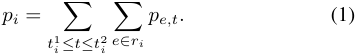

_• Uniform Pricing Scheme_ : We also consider the simplest usage-based pricing scheme: uniform pricing, which charges a single per unit price for all potential users, independent of their selected routes and requested time intervals. 

> 1Our solution can also handle the multi-minded case, in which users can transmit data over multiple paths simultaneously. 

**Demand** : The net utility of user _i_ can be expressed as the difference between her utility and payment over the allocated data transmission rate, _i.e._ , _ui_ ( _xi_ ) _− pi × xi._ Given the price quote _pi_ , each user _i ∈N_ determines her demand for data rate by solving a utility maximization problem: 

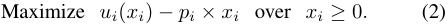

Since _ui_ ( _xi_ ) is strictly concave by Assumption 1, the utility maximization problem admits a unique solution _x__∗_ _i_suchthat _u__′_ _i_(_x∗_ _i_) =_pi,_ if _x__∗_ _i__>_0_,_ and _u__′_ _i_(_x∗_ _i_)_< pi_if_x∗_ _i_= 0_._ We can also express the demand of user _i_ with the per unit price _pi_ as: 

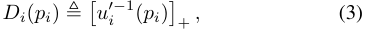

where � _u__′−_ _i_1 ( _pi_ )�+denotesmax(_u_ _i__′−_1 ( _pi_ ) _,_ 0). Since the utility function _ui_ ( _x_ ) is strictly concave, _u__′_ _i_(_x_)isadecrea- sing function, and thus the demand function _Di_ ( _pi_ ) is nonincreasing with respect to price _pi_ over the range [0 _, u__′_ _i_(0)]. 

## _B. Problem Formulation_ 

We associate with the network provider a revenue maximization problem to determine the optimal prices to charge, which can be formally formulated as follows: 

**Problem:** _Revenue Maximization with Item Pricing_ **Objective:** Maximize _L_ ( **_P_** ) =� _i∈N__pi × xi_ **Subject to:** 

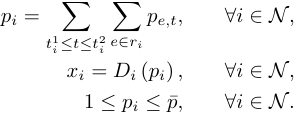

The objective of the optimization problem is to maximize the overall revenue _L_ ( **_P_** ) from _N_ users. The decision variable _pe,t ∈_ **_P_** denotes the unit price of link _e_ at time slot _t_ . The first set of constraints states the unite price to each user given the price matrix **_P_** = ( _pe,t_ ), when we adopt item pricing. The second set of constraints is the requirement of _envy-free_ rate allocation [6], meaning that each user receives the data rate equal to her demand. The third set of constraints states the feasible range of unite prices to users. 

Solving the above revenue maximization problem is nontrivial because of the following three major challenges. The first challenge comes from the non-convexity of the objective function. The revenue function _piDi_ ( _pi_ ) (or _xiu__′_ _i_(_xi_))could be non-convex in general. The second challenge comes from the incomplete information of the network provider. In large markets, the network provider may not have full knowledge of users’ utilities, and can only observe the responses (or demands) of users given certain prices. The last challenge is the complex price correlation in both link and temporal dimensions. The adjustment of the price on one single link at a specific time slot has a/an direct/indirect effect on the charge to potentially all users, due to coupling of users through shared links and common time intervals. Jointly considering the above challenges, we propose a framework of pricing mechanisms to 

approximate the maximum revenue (in the sense of bounded approximation ratios) under different scenarios. We formally define the revenue loss metric used in this paper. 

**Definition 1** ( _α_ **-Approximation Pricing Scheme** ) **.** _A pricing scheme is called α-approximation if the ratio between optimal revenue and the revenue obtained by the pricing scheme is less than or equal to α for all instances of the problem. α is also called the approximation ratio of the pricing scheme._ 

We measure the computational complexity of pricing schemes from time complexity and information complexity. The information complexity measures the smallest number of rounds of interaction (between network provider and users) needed to maximize revenue within a desired approximation ratio [22]. 

## IV. PRICING SCHEMES FOR A SPECIAL CASE 

In this section, we first consider a special case of the problem formulated above, where there is only one time slot, _i.e._ , _T_ = 1. The assumption _T_ = 1 is equivalent to considering a problem where all users transmit for the same duration of time, and thus, is an important special case to study in its own right. In this special case, we only need to determine the prices of links, not necessary to consider price constraints in the temporal dimension. However, it is still non-trivial to derive a complete solution for the general network setting. We begin with designing pricing scheme for the simplest single link case, and then extend it to adapt to the tollbooth case, in which the network topology is restricted to a tree. We finally derive some positive results for the general network topology under some assumptions on demand functions. 

## _A. Single Link Case_ 

In single link case, the network provider only needs to determine a single price for the link to maximize revenue, further reducing the complexity of price correlation. Hence, we have a simple version of revenue maximization: 

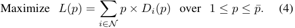

In general, this optimization problem remains to be nonconvex, and the demand functions are also unknown to the network provider. By leveraging the specific structure of this optimization problem, we propose a simple and efficient pricing scheme to achieve good revenue guarantee. We define a vector of candidate discrete prices as 

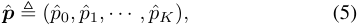

where _p_ ˆ _k_ = (1 + _ϵ_ )_k_ for _k_ = 0 _,_ 1 _, · · · , K_ and a constant parameter _ϵ >_ 0. Since the upper bound of feasible prices is log( _<u>p</u>_ ¯) _p_ ¯, we can set _K_ = . The specific pricing scheme � log(1+ _ϵ_ ) � contains two steps: 

- Step 1: For each candidate price _p_ ˆ _k_ , we calculate the total revenue _L_ (ˆ _pk_ ) =� _i∈N__p_ˆ_k × Di_(ˆ_pk_). 

- Step 2: We select the candidate price _p_ ˆ _k_ with the maximum revenue _L_ (ˆ _pk_ ) as the final price. 

Suppose the selected price is _p_ ˆ_∗_ , and the corresponding revenue is _ALG_ = _L_ (ˆ _p__∗_ ). We denote the optimal revenue 

TABLE I 

APPROXIMATION RATIO VS. COMPUTATIONAL COMPLEXITY ( _p_ ¯ = 100) 

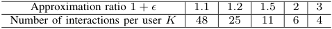

as _OPT_ = _L_ ( _p__∗_ ), where _p__∗_ is the optimal price. Using a straightforward analysis, we can characterize the revenue guarantee of the pricing scheme in the following theorem. 

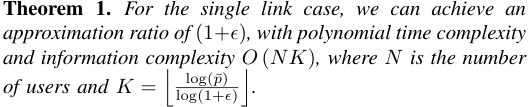

_Proof._ For the optimal price _p__∗_ , there exists some integer _k ∈_ [0 _, K_ ] such that (1+ _ϵ_ )_k_ _≤ p__∗_ _≤_ (1+ _ϵ_ )_k_+1 . Thus, we can get 

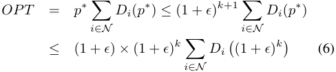

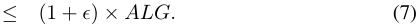

The inequality (6) comes from the fact that _Di_ ( _p_ ) is nonincreasing with respect to price _p_ over the range [1 _,_ ¯ _p_ ]. The inequality (7) holds due to Step 2 in the pricing scheme. 

Since we have to calculate the revenue of all candidate prices, each of which takes _O_ ( _N_ ) time, the time complexity is _O_ ( _NK_ ). The network provider needs to interact with each user for _K_ times, to learn her demands under different candidate prices. Thus, the information complexity is _O_ ( _NK_ ). 

It is worth emphasizing that the pricing scheme works for general demand functions, only requiring the demand to be a non-increasing function of the price. Another interesting observation can be made from the theorem above is that the pricing scheme achieves a good approximation ratio through only evaluating the demand functions a polynomial number of times, without full knowledge of demand functions. In other words, the network provider only needs to interact with each user _K_ times to obtain a (1+ _ϵ_ ) approximation ratio.2 We show the trade-off between approximation ratio and computational complexity in Table I when the upper bound of prices is 100. 

## _B. Tollbooth Case_ 

We now extend the pricing scheme in single link case to a more complex network called tollbooth network. In the tollbooth case, the network topology is a tree, and users share one common source, which we consider as the root of the tree. This case is motivated by the current pricing strategy in inter-datacenter networks, where the network provider designs different price quotes for data transfer requests from different data centers. We illustrate the tollbooth case in Figure 1, which is a minimum spanning tree of Google’s inter-deatacenter networks in the United States [2]. 

> 2We assume users are price takers and will truthfully reveal their demands given a price. We leave the consideration of strategic behaviors of users [23] to our future work. 

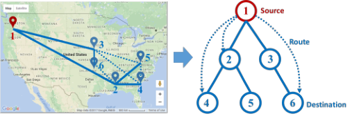

Fig. 1. A tollbooth network, which is a minimum spanning tree of Google’s Inter-datacenter networks in the United States [2]. 

We propose a pricing scheme for the tollbooth case based on dynamic programming. For each node _w_ in the tree, we use _Nw_ to denote the set of users, who request data transfer over the route _rw_ from the root to the destination node _w_ . We also denote the children of node _w_ by a set _Vw_ . We define _L_ ( _w, pw_ ) to be the maximum revenue that we can obtain from the users, whose destinations are located in the subtree _Trw_ , given that the route _rw_ has an exact price _pw_ . We are then interested in calculating _L_ ( _wr,_ 0), where node _wr_ is the root of tree. Using these terminologies, we can now define the Bellman equation of dynamic programming: 

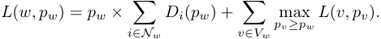

Here, we require _pv_ to be no less than _pw_ , because the price of edge _e_ = ( _w, v_ ), _i.e._ , _pe_ = _pv −pw_ , should be non-negative. The Bellman equation above shows that revenue _L_ ( _w, pw_ ) comes from two parts: the revenue of users with destinations at node _w_ (the first term) and the maximum revenue of users with destinations at the descendants of node _w_ (the second term), given that the price of route _rw_ is _pw_ . 

We have to examine every possible price if we directly solve the above dynamic programming, resulting in exponential computational complexity. The crucial observation is that we can borrow the idea from single link case, and only need to consider a polynomial number of discrete prices without losing much performance. Specifically, in the revised Bellman equation, we only examine the candidate discrete prices from the vector **_p_** ˆ, which has been defined as earlier in (5). We can write the Bellman equation in discrete price domain as 

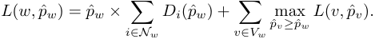

We then use the backwards dynamic programming recursion to solve for the optimal price in discrete price domain. Finally, we recursively construct the price _p_ ˆ_∗_ _w_foreverypossiblepath _rw_ . With these path prices, we can set the price _pe_ for edge _e_ = ( _w, v_ ) as _pe_ = _p_ ˆ_∗_ _v__−p_ˆ_∗_ _w_, and the per unit price for user_i ∈_ _N_ as _pi_ =� _e∈ri__pe_.Wehavethefollowinglemmaforany subproblem _L_ ( _w, pw_ ),3 which allows us to bound the revenue loss due to the restriction of only considering discrete prices. 

**Lemma 1.** _For the subproblem L_ ( _w, pw_ ) _, we have_ 

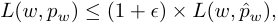

> 3We abuse notations, and use _L_ ( _w, pw_ ) and _L_ ( _w,_ ˆ _pw_ ) to denote the subproblems at _w_ that use continuous prices and discrete prices, respectively. 

_where p_ ˆ _w is the largest discrete price that is smaller than pw,_ i.e. _, p_ ˆ _w_ = (1 + _ϵ_ )_k_ _and_ (1 + _ϵ_ )_k_ _≤ pw ≤_ (1 + _ϵ_ )_k_+1 _._ 

_Proof._ We can prove this theorem by induction, starting at the leaves of the tree. 

_•_ For leaf node _w_ , we have the same revenue maximization problem in the single link case: there exists some integer _k ∈_ [0 _, K_ ] such that (1 + _ϵ_ )_k_ _≤ pw ≤_ (1 + _ϵ_ )_k_+1 , and 

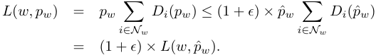

Therefore, the lemma holds for leaf nodes. 

_•_ For internal node _w_ , suppose the lemma holds for node _w_ ’s children: _i.e._ , _L_ ( _v, pv_ ) _≤_ (1+ _ϵ_ ) _×L_ ( _v,_ ˆ _pv_ ), for all _v ∈ Vw_ , we then have 

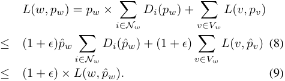

The inequality (8) follows from the result of single link case and the induction hypothesis. In the continuous price domain, the price _pv_ of node _v ∈ Vw_ is always no less than the price _pw_ of her parent _w_ . We have to preserve this property in the discrete price domain. This property indeed holds, because _p_ ˆ _v_ (and _p_ ˆ _w_ ) is the largest discrete price that is smaller than _pv_ (and _pw_ ). Hence, the set of discrete prices _{p_ ˆ _v|v ∈ Vw}_ is a feasible solution to the subproblem at node _w_ . By definition, _L_ ( _w,_ ˆ _pw_ ) is the optimal solution for this subproblem in the discrete price domain. Therefore, we can then derive inequality (9), and get the result for internal nodes. 

The proof follows from the above discussion. 

We now have the main theorem for the tollbooth case. 

**Theorem 2.** _For the tollbooth problem with a common source, we can achieve an approximation ratio of_ (1 + _ϵ_ ) _with time complexity O_ ( _|V |K_2 _N_ ) _and information complexity O_ ( _NK_ ) _._ 

_Proof._ Let _OPT_ and _ALG_ denote the revenue achieved by the optimal solution and our pricing scheme, respectively. Let _p__∗_ _v_and_p_ˆ_∗_ _v_bethecorrespondingoptimalpriceandtheprice selected by our scheme, respectively. By Lemma 1, we have 

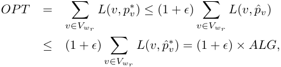

where the second inequality follows from the fact that _ALG_ is the optimal solution in discrete price domain. 

Since we only have to consider discrete prices in the Bellman equation, the dynamic programming table has size _O_ ( _|V |K_ ). In addition, each entry _L_ ( _w,_ ˆ _pw_ ) can be computed in polynomial time _O_ ( _KN_ ). Thus, the time complexity is _O_ ( _|V |K_2 _N_ ). Similar to the single link case, we need _O_ ( _NK_ ) rounds of interaction to know the demands of users, resulting in the information complexity of _O_ ( _NK_ ). 

## _C. General Network Case_ 

We next consider general network case, and derive three results: two item pricing schemes and one uniform pricing scheme, for different situations. Similar to the idea of single link case, our first pricing scheme is to enumerate every possible price profile of all links, and output the one with the maximum revenue as the final result. The candidate prices for each link also come from the vector **_p_** ˆ in (5). Given a possible set of prices **_P_** = _{pe}_ , each user _i_ would declare her demand _Di_ ( _pi_ ) to the network provider, where _pi_ =� _e∈ri__pe_.With the demands from users, the network provider can calculate the overall revenue for each price profile. The network provider finally selects the price profile with the maximum revenue. We have the following theorem for this pricing scheme. The proof is similar to that in single link case, and we reserve it in the technical report [24]. 

**Theorem 3.** _For the general network case, we can achieve an approximation ratio of_ (1+ _ϵ_ ) _with exponential computational complexity O_ ( _NK__|E|_ ) _._ 

Considering the high computational complexity of the above scheme, we turn to two other simple and efficient pricing schemes. Instead of enumerating every possible price for all links, a simple item pricing scheme is to set a single price for all links, which we call single link pricing. Following the same principle as before, we examine the revenue of each possible price from **_p_** ˆ in (5), and select the price with the maximum revenue. We show that such single link pricing scheme is computationally efficient, and has a bounded approximation ratio. We can complete the proof by extending the analysis in single link case, and reserve it to the technical report [24]. 

**Theorem 4.** _For the general network case, we can achieve an approximation ratio of p_ ¯ _with polynomial computational complexity O_ ( _NK_ ) _, where p_ ¯ _is the upper bound of price._ 

The above pricing scheme only guarantees a bounded approximation ratio, which may be pretty large in practice, we now further improve the approximation ratio under some reasonable assumptions. We recall that the hardness of item pricing in a general network arises from the price constraints, which requires the price of a user to be equal to the total price of the links in her selected route. However, other pricing schemes are possible to ensure envy-freeness and arbitragefreeness. If our goal is to maximize revenue, other pricing schemes may be better and lead to better revenue guarantees. For example, one can first determine link prices as an intermediate step and charge a user something other than the sum of link prices. Therefore, we now generalize our requirement on the pricing scheme, which we present as Assumption 2 below, and discuss why such a pricing scheme is quite reasonable. 

**Assumption 2.** _The per unit price pi to user i satisfies a relaxed price constraint:_ i.e. _,_ max _e∈ri pe ≤ pi ≤_� _e∈ri__pe._ 

The above assumption on prices is motivated by the requirements of envy-freeness and arbitrage-freeness in practice. On the one hand, as the user with the route over multiple links consumes more resources, the charge to her should be 

no less than that of the user who uses only one single link, guaranteeing the fairness to some extent. On the other hand, the charge to a user should be no more than the total price of the links in her selected route; otherwise, the user may have an incentive to engage in the following arbitrage behavior: declaring a sequence of data transfer requests, each over a single link, rather than a single request over a route.4 

With such a price assumption, we can reformulate the problem of revenue maximization as 

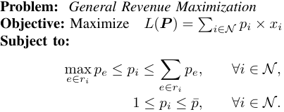

We note that the optimal solution to this relaxed optimization is an upper bound of the original revenue maximization problem. Unfortunately, it is still challenging to directly solve the above problem. Here, we are interested in the loss of revenue incurred by using simple envy-free and arbitrage-free pricing schemes. We adopt another simple pricing strategy: charging each user with the same per unit price. We call such pricing scheme as uniform pricing, which has been widely adopted today by Internet service providers and cloud bandwidth providers. We can verify that uniform pricing satisfies Assumption 2, and is envy-free and arbitrage-free. 

In order to determine the uniform price and derive a good approximation ratio, we introduce an assumption on the demand functions of users. Such assumption would hold in practice when users have similar utility functions. 

**Assumption 3.** _There exists a representative demand function andD_ ( _p_ ) _any, such thatpossible_ ¯ _βDprice_ ( _p_ ) _≤p ∈D_ [1 _i_ ( _p,_ ¯ _p_ ) _≤_ ] _. βD_¯ ( _p_ ) _, for any user i ∈N_ 

With this assumption, the uniform pricing scheme is quite simple. We optimally solve the optimization problem: Maximize1 _≤p≤p_ ¯ _p × D_ ( _p_ ) _,_ and denote the resulting price as _p_ ˆ_∗_ 0.5Wechargeuserswiththeperunitprice_p_ˆ_∗_ 0,and collect revenue _p_ ˆ_∗_ 0_×_� _i∈N__Di_(ˆ_p_ 0_∗_). We show that such uniform pricing scheme can achieve a good approximation ratio. 

**Theorem 5.** _For the general network under Assumptions 2_ _<u>β</u>_ ¯ _andcomputational3, we can complexityachieve anofapproximationsolving Maximizeratio_ 1 _≤ofp≤_ ¯ _βp_ ¯_with_ _pD_ ( _p__the_ ) _._ 

_Proof._ Let _{p__∗_ _i__, i ∈N}_to be the optimal prices in the problem of general revenue maximization. According to Assumption 3, 

> 4We can further extend Assumption 2 to satisfy more general concept of fairness and to avoid more complex arbitrage behaviors. For example, we can require the unit price _pi_ of user _i_ to be no less than the price of any sub-path of route _ri_ . We could also constrain _pi_ to be no larger than the total price of sub-pathes of _ri_ , that also form a path between the source and destination. 

> 5For some specific demand functions, we can derive the (almost) optimal solution using efficient algorithms, such as applying Golden-section search [25] for strictly unimodular functions. For the general demand function, we can adopt the technique in single link case to obtain the sub-optimal solution with an approximation ratio of 1 + _ϵ_ . 

we can have 

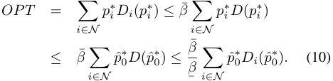

The second inequality follows from that _p_ ˆ_∗_ 0istheoptimal solution of maximizing _pD_ ( _p_ ). 

It is worth noting that the approximation ratio of uniform pricing only depends on the similarity of demand functions, but not on network topology or data transfer routes. 

The remaining task is to construct a representative demand function _D_ ( _p_ ) that satisfies Assumption 3 and minimizes the ratioto derive _β/_¯ ¯ _β_ .theForoptimalgeneral _D_ demand( _p_ ). In functions,the technicalit mightreportbe[24],difficultwe provide one example using a standard demand function to shed light on the principle of finding _D_ ( _p_ ). However, this approach requires the knowledge of demand functions. We can achieve _<u>β</u>_ ¯ an approximation ratio ofsolving the revenue maximization¯ _β_(1+_ϵ_), without knowing in single link case_D_ (4),(_p_), by and regarding the resulting price _p_ ˆ_∗_ as the uniform price. Using Theorem 1, we can further derive (10) to 

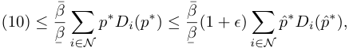

where _p__∗_ is the optimal price in single link case. We have the following result for this approach. 

**Theorem 6.** _For the general network under Assumptions 2_ _<u>β</u>_ ¯ _andwith 3,timewecomplexitycan achieveandaninformationapproximationcomplexityratio ofO_ (¯ _βNK_(1 + ) _.__ϵ_) 

We trade-off a small revenue loss (an additional factor of (1 + _ϵ_ )) to bypass the difficulty in finding the exact representative demand function, which would be more attractive in the scenarios with complicated demand functions. 

## V. EXTENSION TO MULTIPLE TIME SLOTS 

We now return to the original problem with multiple time slots, and extend the previous pricing schemes to enable timedependent pricing [26]. By a slight abuse of notations, we will use the same notations as in the previous section, when appropriate. Due to space limitations, we only express the solution in single link case, which provides insight into the extensions to multiple time slots, and reserve the discussion of tollbooth case and network case to the technical report [24]. 

The basic idea to design time-dependent pricing scheme is to enumerate possible prices for link(s) at different time slots, and reduce the time complexity via dynamic programming. Due to the assumption that the lengths of time intervals are upper bounded by a constant _t_¯ , we just need to examine the prices at only a constant number of time slots in the dynamic programming. Let vector **_p_** _t__t−t_¯+1 = ( _pt, pt−_ 1 _, · · · , pt−t_ ¯+1) denote the possible prices for the single link at _t_¯ sequential time slots _t, t −_ 1 _, · · · , t − t_¯ +1. In the dynamic programming, we maintain a state table _L_˜ ( _t,_ **_p_**_t_ _t__−t_¯+1 ), where each entry 

records the maximum revenue that we can obtain from users with time intervals ending at time slot _t_ or before, given that the prices at time slots _t, t −_ 1 _, · · · , t − t_¯ + 1 are set as _pt, pt−_ 1 _, · · · , pt−t_ ¯+1, respectively. We use _Nt_ to denote the set of users, whose time intervals ends exactly at slot _t_ . We now can define the Bellman equation for dynamic programming 

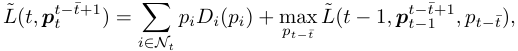

where _pi_ is the per unit price to user _i_ , _i.e._ , _pi_ =� _t∈_ [ _ti_1_,t_2 _i_]_pt_. We note that price vector **_p_**_t_ _t__−t_¯+1 is sufficient to calculate the price _pi_ and then the revenue of users _Nt_ (the first term of the equation), because no time interval has length larger than _t_ ¯. The second term of the equation is the maximum revenue among the subproblem at time slot _t −_ 1 with prices **_p_**_t_ _t__−_ _−__t_ 1¯+1 to time slots _t−_ 1 _, t−_ 2 _, · · · , t−t_¯ +1. Similar to the development in the previous section, we only consider discrete prices in the Bellman equation. Using the standard backward recursion approach, we can solve the dynamic programming in discrete price regime, and obtain the price _p_ ˆ _t_ for each time slot _t_ . The following lemma bounds the revenue loss due to only considering discrete prices in the dynamic programming. 

**Lemma 2.** _For any state L_˜ ( _t,_ **_p_**_t_ _t__−t_¯+1 ) _, there always exists a state L_˜ ( _t,_ ˆ **_p_**_t_ _t__−t_¯+1 ) _using only discrete prices, such that_ 

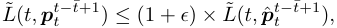

_where_ **_p_** ˆ_t_ _t__−t_¯+1 = (ˆ _pt,_ ˆ _pt−_ 1 _, · · · ,_ ˆ _pt−t_ ¯+1) _, and p_ ˆ _t is the largest discrete price that is smaller than pt,_ i.e. _, p_ ˆ _t_ = (1 + _ϵ_ )_k_ _and_ (1 + _ϵ_ )_k_ _≤ pt ≤_ (1 + _ϵ_ )_k_+1 _for some integer k ∈_ [0 _, K_ ] _._ 

Using the preceding result, we can show the performance guarantee of the time-dependent pricing for single link case. 

**Theorem 7.** _For the single link with multiple time slots, we can achieve an approximation ratio of_ (1+ _ϵ_ ) _with time complexity O_ ( _TK__t_¯+1 _N_ ) _and information complexity O_ ( _NK_ ) _, where T is the number of time slots._ 

Due to space limitations, we put the detailed proofs of Lemma 2 and Theorem 7 into our technical report [24]. 

## VI. EVALUATION RESULTS 

In this section, we only provide evaluation results for the general network case, considering that we can obtain nearoptimal results for the single link and tollbooth network cases. We also observe that the evaluation result in multiple time slot setting is similar to that in single time slot, and thus we only report results for the special single time slot case. 

## _A. Methodology_ 

We first present the evaluation setting. The network topology we consider in our evaluation is B4, a WAN connecting Google’s data centers across the world in 2011 [2]. In this WAN graph, there are 19 links/edges connecting 12 regions/nodes. We randomly generate a pair of source and destination nodes for each user, and regard the shortest path between the source and destination as her selected route to 

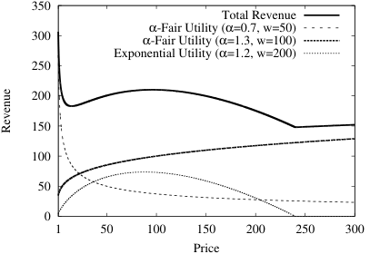

<!-- Start of picture text -->
 350 Total Revenue  300 αα -Fair Utility (-Fair Utility ( αα =1.3, w=100)=0.7, w=50) Exponential Utility ( α =1.2, w=200)  250  200  150  100  50  0 1 50 100 150 200 250 300 Price Revenue <!-- End of picture text -->

Fig. 2. Revenue curves for two different _α_ -fair utility functions (one with parameters _α_ = 0 _._ 7, _w_ = 50 and the other with _α_ = 1 _._ 3, _w_ = 100) and one exponential utility function with parameters _α_ = 1 _._ 2, _w_ = 200. 

transmit data. We consider two specific classes of utility functions: _α_ -fair utility function 

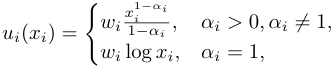

and exponential utility function _ui_ ( _xi_ ) = _wi_ (1 _− e__−αix_ ) _._ By the definition of demand function in (3), we can obtain the corresponding revenue functions 

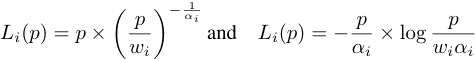

for _α_ -fair utility and exponential utility, respectively. In Figure 2, we plot the curves for three revenue functions with different parameters over price range [1 _,_ 300]. From the figure, we can observe that for _α >_ 1, the revenue of _α_ -fair utility increases with price _p_ , whereas for _α <_ 1 it decreases with price. The revenue function of exponential utility is concave, reaches the maximum value at price _wiαi/e_ , and becomes negative when price is larger than _wiαi_ . In Figure 2, we also draw the overall revenue function, which is non-convex and demonstrates the difficulty in directly solving the revenue maximization problem. Each of users is associated with either an _α_ -fair utility or an exponential utility with equal probability. The parameters ( _αi_ and _wi_ ) of utility functions are draw from some distributions. Specifically, _αi_ follows a uniform distribution over the interval [0 _._ 5 _,_ 1 _._ 5], and _wi_ follows either a uniform distribution or a Pareto distribution. We adopt Pareto distribution for _wi_ to model the scenario that most of users have similar utilities. As we observe in Figure 2, the revenue of exponential utility would be negative when _p > wiαi_ , and thus we set a relatively large _wi_ for exponential utility. The supports of the uniform distributions for _w_ in _α_ -fair utility and exponential utility are set as [1 _,_ 60] and [1 _,_ 1000], respectively. The scale and shape pairs of the Pareto distributions for _w_ in _α_ -fair utility and exponential utility are set as (1 _,_ 1) and (50 _,_ 1), respectively. We investigate the performance of pricing schemes with different number of users, varying from 20 to 200 with increment of 20, and with different upper bounds 

of prices, ranging from 20 to 200 with increase 20. All the evaluation results are averaged over 1000 runs.6 

We implement uniform pricing and single link pricing, and compare their performance with that of random uniform pricing and random single link pricing. Considering that we cannot optimally solve the general revenue maximization in Section IV-C, we compute a trivial upper bound of the optimal revenue by solving Maximize1 _≤pi≤p_ ¯ � _i∈N__pi× Di_(_pi_)_._As we do not have specific price correlation among users in this optimization, we can separately maximize each term in the objective, which is easy to deal with in the context of _α_ -fair utility and exponential utility. We compare the performance of pricing schemes with this upper bound, to measure the revenue loss of considering the envy-freeness and arbitrage-freeness. 

## _B. Performance of Pricing Schemes_ 

Figure 3 shows the revenue achieved by different pricing schemes under various evaluation settings. Generally, we can see from Figure 3(b) and Figure 3(d) that in the market with larger number of users, all pricing schemes obtain higher revenue. For the cases of _w_ -Uniform distribution (Figure 3(a)), the revenue increases with _p_ ¯, because pricing schemes have higher probability to obtain large revenue when there are more candidate prices to choose. However, when _w_ follows a Pareto distribution (Figure 3(c)), the revenue does not have an explicit relation with _p_ ¯. Although Pareto distribution only has small probability to generate a large _w_ , if this happens (independent of _p_ ¯), the revenue from the user with such large _w_ would dominate the revenue of other users, leading to a surge in the overall revenue. 

We now compare the performance of uniform pricing with that of other pricing schemes to show its advantage in maximizing revenue. From Figure 3, we can observe that the ratio between the upper bound of optimal revenue and the revenue achieved by uniform pricing is not so large, especially when _w_ follows a Pareto distribution. This indicates that we do not sacrifice too much revenue to guarantee the properties of envy-freeness and arbitrage-freeness. Theorem 5 states that the approximation ratio of uniform pricing isto the similarity of utility (or demand) functions _β/_¯ ¯ _β_ , which is relatedamong users. The observations from the evaluation results explicitly indicate this relation. As shown in Figure 3(a), the ratio stays at around 1 _._ 6 for all the possible _p_ ¯. The reason is that the similarity of utility functions does not change much in different rounds when _N_ is fixed. In contrast, we can see from Figure 3(b) that the ratio becomes large with the increase of _N_ , because utility functions would be more diverse when _N_ is larger. Again, we have the same observations from Figure 3(c) and Figure 3(d) when _w_ follows a Pareto distribution. We also find that the ratio in the case of _w_ -Pareto Distribution is smaller than that in the case of _w_ -Uniform Distribution under the same simulation setting. This is because most of _w_ ’s generated by Pareto distribution locate densely in a small interval, reflecting the high similarity of utility functions. 

> 6All parameters can be different from the ones used here. As the evaluation results of using other parameters are similar, we only report the results for these parameters in this paper. 

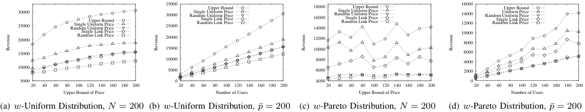

<!-- Start of picture text -->
 30000 25000 Random Uniform PriceSingle Uniform PriceUpper Bound  35000 30000 25000 Random Uniform PriceSingle Uniform PriceRandom Link PriceSingle Link PriceUpper Bound  18000 16000 14000 Random Uniform PriceSingle Uniform PriceRandom Link PriceSingle Link PriceUpper Bound  16000 14000 12000 Random Uniform PriceRandom Link PriceSingle Link PriceUniform PriceUpper Bound  20000 Random Link PriceSingle Link Price  20000  12000  10000 8000  15000  15000  10000  6000  10000  8000  4000  10000  5000  6000  2000  5000  0  4000  0  20  40  60  80  100  120  140  160  180  200  20  40  60  80  100  120  140  160  180  200  20  40  60  80  100  120  140  160  180  200  20  40  60  80  100  120  140  160  180  200 Upper Bound of Price Number of Users Upper Bound of Price Number of Users (a) w -Uniform Distribution, N = 200 (b) w -Uniform Distribution, p ¯ = 200 (c) w -Pareto Distribution, N = 200 (d) w -Pareto Distribution, p ¯ = 200 Revenue Revenue Revenue Revenue <!-- End of picture text -->

Fig. 3. Performance of different pricing schemes under various evaluation settings. 

From Figure 3, we can observe that uniform pricing always outperforms single link pricing, which demonstrates that we can extract more revenue by relaxing the price constraints in item pricing, and using the price constraints in Assumption 2. In single link pricing scheme, we require that the per unit price to a user should be proportional to the length of her route. As we also require the per unit price to be less than an upper bound, the feasible prices to links would be quite small if there exist some users who transmit data over long routes in network. This would result in large revenue loss especially when the overall revenue increases with price. 

In Figure 3, both uniform pricing and single link pricing achieve higher revenue than their random counterparts. This indicates that we can significantly improve the performance of pricing schemes through a polynomial number of interactions with users. These interactions provide information for the network provider to optimize price and then extract more revenue. Thus, the network provider has an economic incentive to interact with users to learn their demands, 

## VII. CONCLUSION AND FUTURE WORK 

In this paper, we have studied a revenue maximization problem in inter-datacenter networks, where a network service provider sets the price to each user and then users decide a certain rate to transmit data over the network. We focus on the family of envy-free and arbitrage-free pricing schemes. For single link and tollbooth cases, we have designed a (1 + _ϵ_ )-approximation pricing scheme with polynomial time complexity and information complexity. For general network case, we have established the following result: when users have similar utility functions, uniform pricing can achieve a good approximation ratio, which is independent of network topology and data transfer requests. 

One possible direction for future work is to consider capacity constraints and congest effect in pricing scheme design. Another interesting research topic is to design item pricing for revenue maximization in general network topology. 

## REFERENCES 

- [1] V. K. Adhikari, Y. Guo, F. Hao, M. Varvello, V. Hilt, M. Steiner, and Z. L. Zhang, “Unreeling netflix: Understanding and improving multi-cdn movie delivery,” in _INFOCOM_ , 2012. 

- [2] S. Jain, A. Kumar, S. Mandal, J. Ong, L. Poutievski, A. Singh, S. Venkata, J. Wanderer, J. Zhou, M. Zhu, J. Zolla, U. H¨olzle, S. Stuart, and A. Vahdat, “B4: Experience with a globally-deployed software defined wan,” in _SIGCOMM_ , 2013. 

- [3] C.-Y. Hong, S. Kandula, R. Mahajan, M. Zhang, V. Gill, M. Nanduri, and R. Wattenhofer, “Achieving high utilization with software-driven wan,” in _SIGCOMM_ , 2013. 

- [4] “AWS Direct Connect:,” https://aws.amazon.com/directconnect/. 

- [5] V. Jalaparti, I. Bliznets, S. Kandula, B. Lucier, and I. Menache, “Dynamic pricing and traffic engineering for timely inter-datacenter transfers,” in _SIGCOMM_ , 2016. 

- [6] V. Guruswami, J. D. Hartline, A. R. Karlin, D. Kempe, C. Kenyon, and F. McSherry, “On profit-maximizing envy-free pricing,” in _SODA_ , 2005. 

- [7] T. Bas¸ar and R. Srikant, “A stackelberg network game with a large number of followers,” _Journal of Optimization Theory and Applications_ , vol. 115, no. 3, pp. 479–490, 2002. 

- [8] ——, “Revenue-maximizing pricing and capacity expansion in a manyusers regime,” in _INFOCOM_ , 2002. 

- [9] S. Shakkottai, R. Srikant, A. Ozdaglar, and D. Acemoglu, “The price of simplicity,” _IEEE Journal on Selected Areas in Communications_ , vol. 26, no. 7, pp. 1269–1276, 2008. 

- [10] P. Marbach and R. Berry, “Downlink resource allocation and pricing for wireless networks,” in _INFOCOM_ , 2002. 

- [11] S. Li and J. Huang, “Price differentiation for communication networks,” _IEEE/ACM Transactions on Networking_ , vol. 22, no. 3, pp. 703–716, 2014. 

- [12] P. Hande, M. Chiang, R. Calderbank, and J. Zhang, “Pricing under constraints in access networks: Revenue maximization and congestion management,” in _INFOCOM_ , 2010. 

- [13] F. P. Kelly, A. K. Maulloo, and D. K. H. Tan, “Rate control for communication networks: shadow prices, proportional fairness and stability,” _Journal of the Operational Research Society_ , vol. 49, no. 3, pp. 237–252, Mar 1998. 

- [14] R. Srikant, _The mathematics of Internet congestion control_ . Cambridge, MA: Birkhauser, 2004. 

- [15] M. Chiang, S. H. Low, A. R. Calderbank, and J. C. Doyle, “Layering as optimization decomposition: A mathematical theory of network architectures,” _Proceedings of the IEEE_ , vol. 95, no. 1, pp. 255–312, 2007. 

- [16] D. Acemoglu, A. Ozdaglar, and R. Srikant, “The marginal user principle for resource allocation in wireless networks,” in _CDC_ , 2004. 

- [17] M.-F. Balcan, A. Blum, and Y. Mansour, “Item pricing for revenue maximization,” in _EC_ , 2008. 

- [18] R. B. Myerson, “Optimal auction design,” _Mathematics of operations research_ , vol. 6, no. 1, pp. 58–73, 1981. 

- [19] S. Kandula, I. Menache, R. Schwartz, and S. R. Babbula, “Calendaring for wide area networks,” in _SIGCOMM_ , 2014. 

- [20] A. Kumar, S. Jain, U. Naik, A. Raghuraman, N. Kasinadhuni, E. C. Zermeno, C. S. Gunn, J. Ai, B. Carlin, M. Amarandei-Stavila, M. Robin, A. Siganporia, S. Stuart, and A. Vahdat, “BwE: Flexible, hierarchical bandwidth allocation for wan distributed computing,” in _SIGCOMM_ , 2015. 

- [21] T. Roughgarden and E. Tardos, “How bad is selfish routing?” _Journal of the ACM_ , vol. 49, no. 2, pp. 236–259, 2002. 

- [22] J. F. Traub, _Information-based complexity_ . John Wiley and Sons Ltd., 2003. 

- [23] R. Johari and J. N. Tsitsiklis, “Efficiency of scalar-parameterized mechanisms,” _Operations Research_ , vol. 57, no. 4, pp. 823–839, 2009. 

- [24] “Pricing for revenue maximization in interdatacenter networks,” Tech. Rep., 2017, available at https://drive.google.com/open?id=0BzPQ3WpemY1VTzFjNk1kbzF3QzA. 

- [25] D. P. Bertsekas, _Nonlinear programming_ . Athena scientific Belmont, 1999. 

- [26] L. Jiang, S. Parekh, and J. Walrand, “Time-dependent network pricing and bandwidth trading,” in _IEEE Network Operations and Management Symposium Workshops_ , 2008. 

