# Towards Personalized Task Matching in Mobile Crowdsensing via Fine-Grained User Profiling 

Shuo Yang_†_ , Kunyan Han_†_ , Zhenzhe Zheng_†_ , Shaojie Tang_‡_ , Fan Wu_†_ 

> _†_ Department of Computer Science and Engineering, Shanghai Jiao Tong University, China 

> _‡_ Department of Information Systems, University of Texas at Dallas, USA 

> _†{_ wnmmxy, hankunyan, zhengzhenzhe _}_ @sjtu.edu.cn; _‡_ tangshaojie@gmail.com; _†_ fwu@cs.sjtu.edu.cn 

**_Abstract_ —In mobile crowdsensing, finding the best match between tasks and users is crucial to ensure both the quality and effectiveness of a crowdsensing system. Existing works usually assume a centralized task assignment by the platform, without addressing the need of fine-grained personalized task matching. In this paper, we argue that it is essential to match tasks to users based on a careful characterization of both the users’ preferences and reliability levels. To that end, we propose a personalized task recommender system for mobile crowdsensing, which recommends tasks to users based on a recommendation score that jointly takes each user’s preference and reliability into consideration. We first present a simple but effective method to profile the users’ preferences by exploiting the implicit feedback from their historical performance. Then, to profile the users’ reliability levels, we formalize the problem as a semi-supervised learning model, and propose an efficient block coordinate descent algorithm to solve the problem. For some tasks that lack historical information, we further propose a matrix factorization method to infer the users’ reliability on those tasks. We conduct extensive experiments to evaluate the performance of our system, and the evaluation results demonstrate that our system can achieve superior performance to our benchmarks in both user profiling and personalized task matching.** 

## I. INTRODUCTION 

Due to the rapid development of smart devices and wireless technology, mobile crowdsensing [1] has risen as an emerging sensing paradigm. It can employ a large number of smart devices to extract and share their local information using their embedded sensors. A typical mobile crowdsensing system usually consists of three major components: crowdsensing platform, service requesters, and mobile device users. The platform is responsible for handling information requests from the service requesters and publishing sensing tasks to the users through the interaction of their smartphone applications. 

A critical problem in crowdsensing is to find the best match between users and tasks. Most of the existing works adopt a _platform-centric model_ [2]–[7], which allows the platform to make centralized decisions on which users are selected to perform which sensing tasks. These works usually focus on the 

This work was supported in part by the State Key Development Program for Basic Research of China (973 project 2014CB340303), in part by China NSF grant 61672348, 61672353, and 61472252, in part by Shanghai Science and Technology fund 15220721300, and in part by the Scientific Research Foundation for the Returned Overseas Chinese Scholars. The opinions, findings, conclusions, and recommendations expressed in this paper are those of the authors and do not necessarily reflect the views of the funding agencies or the government. 

F. Wu is the corresponding author. 

incentive problem, where a typical procedure goes like this: each user submits a bid reflecting her willingness or cost in participating in a task, and then the platform determines the set of selected users and their payments, so as to optimize certain utility metric and satisfy some game-theoretic properties. The underlying assumption behind this type of model is that the users are fully rational and are capable of determining their optimal strategies. However, as pointed out in [8], this assumption, as well as the setting that each user’s preference can be abstracted as a single bidding parameter, could be an oversimplification of the complicated user behaviors. 

Another type of task matching systems, referred as _usercentric model_ , gives the users more freedom to choose their interested tasks. It has been widely adopted in many commercial crowdsensing systems, such as Waze [9], Field Agent [10], and Gigwalk [11]. In these systems, the available tasks are shown to the users via their smartphone applications. The users can manually browse through the task corpus (often with simple built-in filters, such as proximity filter and payment filter), and choose their interested tasks to participate in. However, since the number of tasks is often really large, it is inefficient for the users to browse page by page searching for suitable tasks. Without an efficient personalized task matching solution, the users may end up selecting tasks that they are not familiar with or not interested in, which may result in a decrement of the quality of their collected sensing data. 

Considering the limitations of existing task matching works, we propose to design a personalized task recommender system for crowdsensing, so as to facilitate the match of the users with suitable tasks. We note that in traditional recommender systems, such as movie recommendation, items are recommended based only on customers’ preferences [12]. Whereas, in mobile crowdsensing, besides the metric of the users’ preferences, we also need to take the users’ reliability/data quality into consideration. That is because the users may have heterogeneous sensing behaviors towards different tasks, which could influence the quality of their collected data [13]. Achieving preference- and quality-aware task recommendation can have a positive impact on both attracting the user’s further participation and improving the crowdsensing system’s effectiveness. However, such a personalized task recommender system is missing in the current crowdsensing literature. Jin _et al._ [7] and Wang _et al._ [14] studied the quality-aware incentive mechanism design without addressing the need of personalized 

task recommendation. Karaliopoulos _et al._ [8] proposed to assign the tasks to the users based on the profile of each user’s probability of accepting a task, but did not consider the users’ reliability information. 

Central to the personalized task recommender system is a careful characterization on each user’s preferences and reliability towards different tasks. However, it is not a trivial task, due to the unique nature of the crowdsensing scenarios. One of the challenges is finding a good way to model the users’ preferences over different tasks. In some traditional recommender systems, customers’ preferences can be readily obtained from their previous ratings [12]. However, the users in mobile crowdsensing do not typically provide explicit ratings on their preferences, _s.t._ , we have to infer the users’ preferences from their implicit feedback, including the task browsing history, task selection record, and so on. 

The most challenging part is estimating the users’ reliability levels. In particular, we have to learn the users’ reliability information for different tasks based on their submitted sensing data, if any, so as to build each user a profile characterizing the reliability levels of the users’ data for performing the tasks. Although _truth discovery_ algorithms [15] can be adopted to jointly estimate the users’ data quality and the underlying truths, they cannot fully address the need of user reliability profiling in the context of task recommendation. We note that truth discovery algorithms usually generate a single reliability parameter for each user representing the overall trustworthiness level of the user. However, to conduct personalized task recommendation, the heterogeneity of a user’s reliability in different tasks has to be reflected, and thus a more finegrained reliability profiling of the users should be considered. A possible alternative is to independently generate each user a reliability parameter for each task by applying truth discovery algorithms to the data of each sensing task. Unfortunately, this approach may suffer from scalability issue, and what’s worse, a user’s reliability for a task cannot be estimated by truth discovery algorithms, if the user did not contribute data to that task. This could often be a problem in real crowdsensing scenarios, especially when the users’ data are sparse, _i.e._ , each user only contributes data to only a small number of the tasks. Besides, without the prior knowledge of truth and reliability measures, typical truth discovery algorithms are likely to fail, when the majority of data are inaccurate [16]. 

In this work, we jointly consider the problems of user profiling and personalized task matching in mobile crowdsensing, and propose a personalized task recommender system framework, which recommends tasks to users based on both the users’ preferences and reliability. We propose approaches to measure the users’ preferences and reliability, respectively. First, in profiling the users’ preferences, we introduce a hybrid preference metric that integrates the feedback against both the users’ historical operations and the preference of their peers. Then, to tackle the more challenging part of profiling the users’ reliability, we model the problem as a semi-unsupervised learning problem, and propose an efficient block coordinate descent algorithm to jointly estimate the users’ reliability and the unknown ground truths. We surpass the existing truth 

discovery methods by not only taking the information of failed tasks into consideration but also using a small number of available truth data to facilitate the estimation accuracy. We further propose a matrix factorization method to address the missing entries in the users’ reliability estimation. We conduct a realworld experiment and a large-scale crowdsensing simulation to evaluate the performance of our methods. The evaluation results show that our proposed methods can achieve superior performance over existing works and our benchmarks. 

The main contributions of this work are listed as follows. 

- First, we design a personalized task recommender system framework that matches tasks to users based on both the users’ preferences and reliability levels of the tasks. We propose a method to profile each user’s preferences over the tasks based on the user’s implicit feedback. 

- Second, we model the problem of user reliability profiling as a semi-supervised learning model, and propose an efficient algorithm to estimate the users’ reliability and the unknown ground truths simultaneously. We also propose a matrix factorization method to estimate the users’ reliability levels in their uninvolved tasks. 

- Third, we conduct a real-world crowdsensing experiment and a large-scale simulation to evaluate the performance of our methods. Both the experiment and simulation results show that our proposed methods achieve dramatic performance improvements to our benchmarks. 

The rest of the paper is organized as follows. We first present the system overview in Section II, and then introduce the problem formulations in Section III. In Section IV, we propose our reliability profiling algorithms. We evaluate our proposed methods and present the evaluation results in Section V. In Section VI, we review the related works. Finally, we conclude this paper in Section VII. 

## II. SYSTEM OVERVIEW 

In this section, we present an overview of our proposed personalized task recommender system. 

## _A. System Model_ 

Suppose there are _N_ users and _M_ sensing tasks in the system. The set of users and tasks are denoted by N and S, respectively. We consider a _user-centric model_ , where the users can browse the tasks in their smartphone applications and choose to participate in their interested tasks. If a user _i_ wants to participate in a task _j_ , she can click on some button to inform the platform her participation. After that, the user will use her smartphone to collect and then submit sensing data to the platform. Let _xi,j_ denote the data submitted by the user _i_ to the task _j_ . The ground truth of the task _j_ is denoted by _x__∗_ _j_,whichisusuallyunavailabletotheplatform. 

We tend to build a personalized task recommender system, where the tasks are recommended to the users based on a joint consideration of the users’ preferences and reliability. Specifically, for each task _j_ , suppose each user _i_ ’s preference and reliability regarding the task is denoted by _pi,j_ and _qi,j_ , respectively. We propose a recommendation score _Score_ ( _i, j_ ) that takes both the user _i_ ’s preference and reliability for the 

task _j_ into account, _i.e._ , _Score_ ( _i, j_ ) = _f_ ( _pi,j, qi,j_ ), where the function _f_ () outputs the recommendation score based on the two input parameters. For simplicity, we use a linear combination of the two parameters, _i.e._ , 

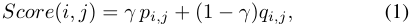

where _γ_ is a hyper parameter. Other instances of the function _f_ are possible, and the platform can determine the specific instance of the function according to its actual needs. We note that central to the system model is the users’ preference and reliability measures. To that end, we need to carefully examine the historical data of the crowdsensing system, in order to acquire profiles of the users’ preferences and reliability. 

## _B. User Preference Profiling_ 

To characterize the users’ preferences on the tasks, the users’ feedback information is needed. However, due to the unavailability on the users’ explicit feedback ( _e.g._ , ratings, like or dislike), implicit feedback has to be exploited. Fortunately, the crowdsensing platform can have access to each user’s performance records on the applications, including which tasks the user has browsed, selected, or successfully completed. This information can be used to infer the users’ preferences from two different perspectives, _i.e._ , either against the user’s historical performance (content-based characteristics), or against the preferences of other similar users (collaborativebased characteristics) [12]. 

_1) Content-Based Characteristic:_ Each task has many attributes, including time, location, travel distance, payment, and so on. Along with the users’ task selection choices (selected or not), this information can be regarded as training examples. By using classification methods, such as logistic regression or Bayesian classifier, we can build a classifier to infer each user probability of selecting each task [8]. We let _P_ ( _i, j_ ) denote the probability of the user _i_ selecting the task _j_ . 

_2) Collaborative-Based Characteristic:_ In mobile crowdsensing, the platform usually does not have users’ ratings on tasks. Thus, implicit feedback from the users has to be exploited to infer the users’ preferences. We let _U_ denote the users’ task preference matrix, where the entry _ui,j_ means the user _i_ ’s preference over the task _j_ . The value of each _ui,j_ can be calculated by mapping the user’s implicit feedback to a task preference value, _i.e._ , 

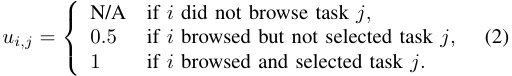

The matrix _U_ could be sparse, where many entries remain unknown. In this case, state-of-the-art collaborative filtering methods can be adopted to predict these missing entries [17]. 

To combine the two separate characteristics, we define each user _i_ ’s preference for each task _j_ as a linear combination of the content-based characteristic and the collaborative-based characteristic, _i.e._ , 

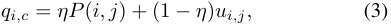

where _η ∈_ [0 _,_ 1] is a constant parameter. 

We note that many previous recommendation systems have investigated the problem of exploiting customers’ implicit feedback in other application contexts ( _e.g._ , [18], [19]), the intuitions of them can be further incorporated to improve our model of the users’ preferences. 

## _C. User Reliability Profiling_ 

In the rest of the paper, we tend to put our most efforts on user reliability profiling, which is the most challenging part of the system. Given the set of collected sensing data, our objective is to jointly estimate the users’ heterogeneous reliability levels for different tasks and the unknown ground truth values. An intuitive approach is to treat each task _j_ independently and generate each user _i_ a reliability measure _qi,j_ for each task _j_ . However, estimating each user’s reliability based only on her data to a single task may be susceptible to noise, and thus cannot accurately reflect the user’s reliability level. Besides, due to the large number of tasks, calculating a reliability parameter per user per task may not be efficient. 

To tackle this problem, we tend to take the similarities among tasks into consideration by classifying the tasks into different categories, where the tasks within the same category focus on a similar sensing target. For example, some category only focuses on noise monitoring tasks, and some only focuses on traffic congestion monitoring. The classification of the tasks is common in current crowdsensing applications, _e.g._ , Waze [9]. It can be done by the platform’s direct designation in the task release phase, or by applying text classification techniques [20] to automatically analyze the descriptions of the tasks. Specifically, we categorize the _M_ tasks into _C_ categories ( _C ≪ M_ ). For each category _c ∈{_ 1 _, . . . , C}_ , the set of the tasks belong to the category is denoted by S _c_ (S _c ⊆_ S). We assume that each task _j ∈_ S can only belong to one category, thus the sets S1 _, . . . ,_ S _C_ are mutually disjoint. For each task category _c_ , let _qi,c_ denote each user _i_ ’s reliability of the task category. Now, the user reliability profiling problem becomes to infer each user _i_ ’s reliability _qi,c_ in each category. 

We note that different tasks may have different data types. For example, a task of weather report usually requires categorical data ( _e.g._ , sunny, rainy, or cloudy), while a noise monitoring task may require continuous numerical data ( _i.e._ , the noise levels of the users’ surrounding environment). Thus, the reliability profiling algorithm needs to be carefully designed to handle both categorical and continuous data types. 

## III. PROBLEM FORMULATION AND OUR CONTRIBUTIONS 

In this section, we present the problem formulation of user reliability profiling. We first present a preliminary version of our problem model, and then propose two enhancements. One enhancement is to incorporate the information of failed tasks, and the other is to integrate a small portion of truth data to improve the estimation accuracy. 

## _A. Preliminary Problem Formulation_ 

We assume that the tasks in different categories are independent, _s.t._ , we can estimate the users’ reliability for each category separately. Let N _c_ denote the set of users who 

contributed data to tasks in category _c_ . To estimate users’ reliability, for each category _c_ , we aim to solve the following optimization problem. 

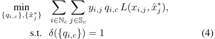

where _yi,j_ indicates if the user _i_ has contributed data to the task _j_ , _x_ ˆ_∗_ _j_isourestimationforthetask_j_’sgroundtruth, and _δ_ () is a regularization function. Following the convention of truth discovery literature [21], we adopt the exponential regularization function, _i.e._ , _δ_ ( _{qi,c}_ ) =∑ _i∈_ N _c_exp(_−qi,c_). The loss function _L_ () measures the distance between a user’s data and the estimated truth. For continuous data, _L_ () can be defined as the squared distance, _i.e._ , _L_ ( _x,_ ˆ _x__∗_ ) = ( _x − x_ ˆ_∗_ )2 , while for categorial data, _L_ () can be defined as the 0 _−_ 1 distance, _i.e._ , _L_ ( _x,_ ˆ _x__∗_ ) = 0 if _x_ = _x_ ˆ_∗_ , and 1 otherwise. An intuitive interpretation of the problem formulation is that the ground truth should be close to the data contributed by reliable users, and the users whose data are close to the ground truth should be the reliable ones. 

## _B. Contribution 1: Incorporating Information of Failed Tasks_ 

We observe that in practice, the users may select certain tasks, but did not successfully complete them ( _e.g._ , decide to terminate the sensing procedure half way). This phenomenon, referred as _failed tasks_ , is likely to reflect the users’ unreliability in performing certain tasks. In this part, we improve the above problem formalization by taking this issue into account. 

We first introduce some notations. Among the set of tasks in category _c_ , we let S _i,c_ denote the set of tasks the user _i_ selected, and D _i,c_ the set of tasks the user _i_ has successfully completed, where D _i,c ⊆_ S _i,c ⊆_ S _c_ . For each category _c_ , we calculate each user _i_ ’s task completion ratio _ri,c_ , which is defined as the number of tasks the user _i_ has finished over the number of tasks the user _i_ has selected, _i.e._ , _ri,c_ =_<u>|</u>_ _|_D S _i,c__i,c_ _|__<u>|</u>_.We revise the original formulation by multiplying a penalty term to _qi,c_ . The revised problem is presented as follows. 

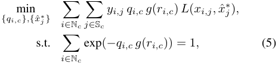

where _g_ ( _x_ ) = 1 _−_ log( _x_ ) is a function mapping each user’s completion ratio to a penalty. We can see that the users who have failed tasks will receive a completion ratio less than 1, and thus their reliability outputs should be less than the ones estimated by the previous method shown in Equation 4. An extreme case is that some user _i_ may select multiple tasks but completed zero ( _i.e._ , S _i,c >_ 0 and D _i,c_ = 0). In this case, the system cannot generate a reliability estimation for the user. We will handle this problem in Section IV-B. 

## _C. Contribution 2: Incorporating Available Ground Truths_ 

The above formulation extends the basic truth discovery problem, which is built upon an underlying assumption that 

the majority of data are reliable. Unfortunately, it may suffer from a reliability initialization problem, _i.e._ , when most of the data are unreliable, the above estimation procedure may have bad performance [16]. To tackle this issue, we propose a _semi-supervised_ learning framework, which incorporates a small number of ground truths to improve the estimation accuracy. To this end, the platform may intentionally add a few tasks with known ground truths into the task corpus to collect additional information on the users’ reliability, whereas the users have no idea which tasks are inserted by the platform. The platform may also sample a few tasks, and employ some trusted workers to obtain their ground truths. 

We let S denote the set of tasks with unknown ground truths, and O denote the set of tasks that are intentionally inserted by the platform with known truth information. For each category _c_ of tasks, we let S _c_ and O _c_ denote the set of the tasks without and with prior ground truths respectively. 

Having the ground truths of some tasks in hand, we propose to leverage those information to further enhance our estimation accuracy. To distinguish the notations, we let _x_ ˆ_∗_ _j_denotethe estimation of the ground truth ( _j ∈_ S), and _x__∗_ _o_denotethe known truth ( _o ∈_ O). Then, for each category _c_ , the modified learning optimization problem is given by 

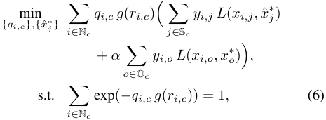

where _α_ is a hyper parameter controlling the relative weight of the second loss terms. We can see that the second loss term ∑ _o∈_ O _c__yi,o L_(_xi,o, x_ _o__∗_)isconstantforeachuser_i_ineachtask category _c_ . We let _ϵi,c_ denote the term∑ _o∈_ O _c__yi,o L_(_xi,o, x_ _o__∗_), and the problem presentation can be simplified as follows. 

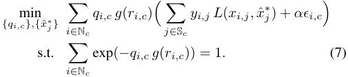

In this section, we first propose a block coordinate descent algorithm to solve the user reliability profiling problem formulated above. Then, we further propose a matrix factorization method to estimate each user’s reliability for the task categories that lack the user’s historical performance. 

## _A. Estimating Users’ Reliability for Involved Categories_ 

In our problem formulated in Equation 7, two sets of variables need to be estimated. We propose a block coordinate descent algorithm to solve it. The core idea of the algorithm is to fix one set of variables to solve the other, and repeat this process until convergence. Since the estimation process for each category can be done independently, parallel computing can be adopted to speed up the entire calculation process. For each task category _c_ , we perform the following three steps. 

_0)_ **_Parameter Initialization_** _:_ We first initialize the users’ reliability _{qi,c}_ . Since a random or uniform initialization may result in poor estimation performance, which is especially true when most data are inaccurate, we propose to enhance the initialization stage by incorporation available ground truths. For each category _c_ , let N_o_ _c_denotethesetofuserswho contributed data to tasks in O _c_ . For the users in N_o_ _c_,their reliability can be initialized by solving the following problem. 

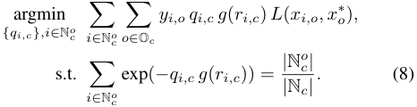

As for the remaining users in N _c \_ N_o_ _c_,theirreliabilityparam- eters are uniformly initialized such that 

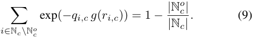

Solving Equation 8 and Equation 9, we have the initialization of the users’ reliability parameters, _i.e._ , 

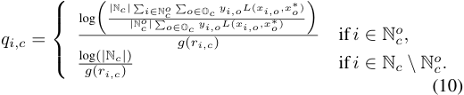

Due to limitation of space, we put the details of solving the initialization problem into our technical report [22]. 

_1)_ **_Truth Update_** _:_ After obtaining an initial estimation of the users’ reliability, we can update the estimation of truths by treating the estimated reliability parameters _{qi,c}_ as fixed values. Then, the truth of each task _j ∈_ S _c_ can be updated using the following rule. 

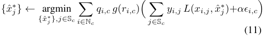

**Theorem 1.** _Given the users’ reliability parameters, the optimization problem in Equation 11 can be optimally solved. For continuous data type, the optimal solution is given by_ 

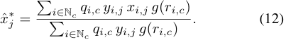

_As for categorial data type, the solution is_ 

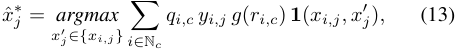

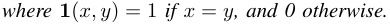

_Proof._ ( _Sketch_ ) For either data type, we take partial derivative of the objective function with respect to _x__∗_ _j_andsetittozero. Solving the equation, we can get the solution. Please refer to our technical report [22] for details. 

_2)_ **_Reliability Estimation_** _:_ After updating the estimation of the ground truth, we now fix the values of _{x_ ˆ_∗_ _j__}_, and calculate the users’ data qualities _{qi,c}_ by solving the following 

## **Algorithm 1:** User Reliability Estimation for Category _c_ 

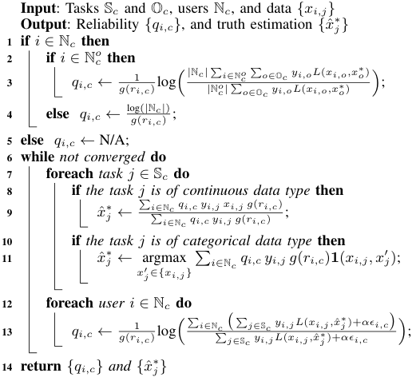

optimization function. Intuitively, the users whose data are close to the ground truth estimations will have high reliability estimations, and vice versa. 

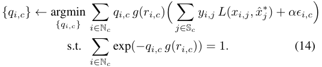

**Theorem 2.** _Given fixed truth estimation {x_ ˆ_∗_ _j__},theproblem_ _in Equation 14 can be optimally solved. The optimal value of each qi,c, i ∈_ N _c is given by_ 

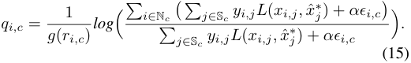

_Proof._ ( _Sketch_ ) We can see that the problem is convex. Therefore, we can apply the Lagrangian multiplier method to solve it. Due to limitation of space, we leave the details into our technical report [22]. 

The pseudo-code of the algorithm is presented in Algorithm 1. We first initialize the users’ reliability parameters, and then keep iterating the steps of truth update and reliability estimation until convergence. Due to the convexity of our problem and the ability to achieve the optimal solution for each step (Theorem 1 and Theorem 2), our algorithm is guaranteed to converge to some local optimum, according to the proposition of the block coordinate descent [23]. Further improvements can be made to find a 2-approximation of the global optimum within nearly linear time [24]. 

_B. Estimating Missing Entries: A Latent Factor Model_ 

So far, we have obtained each user’s reliability information over the task categories that she has contributed data to. 

However, we observe that if a user _i_ did not contribute data to some category _c_ ( _i.e._ , _i ∈/_ N _c_ ), then Algorithm 1 is not able to estimate the user _i_ ’s reliability over _c_ . In this part, we propose a matrix factorization method to address this problem. 

We use _Q_ to denote the users’ reliability matrix, where each entry _qi,c_ is the user _i_ ’s reliability for task category _c_ . We map both users and task categories to a joint latent factor space of dimensionality _k_ . Specifically, we assume that each user _i_ is associated with a vector **_w_** _i ∈_ R_k_ , and each category is associated with **_θ_** _c ∈_ R_k_ . The vector **_w_** _i_ = [ _wi,_ 1 _, wi,_ 2 _, . . . , wi,k_ ]_T_ can be interpreted as the user _i_ ’s capabilities in _k_ different dimensions, and the vector **_θ_** _c_ = [ _θc,_ 1 _, θc,_ 2 _, . . . , θc,k_ ]_T_ can be seen as the weight of each capability needed by the category _c_ . Then, each user _i_ ’s reliability for each category _c_ can be calculated as _qi,c_ = **_w_** _i__T_**_θ_**_c_. 

To estimate the missing entries in matrix _Q_ , we tend to calculate each user _i_ ’s latent vector **_w_** _i_ and each category’s latent vector **_θ_** _c_ . Let _W_ and Θ denote the sets of users’ and categories’ latent vectors, respectively. Then, the objective function can be formalized as follows. 

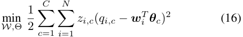

where _zi,c_ indicates if user _i_ has contributed data to category _c_ (1 means yes, and 0 otherwise). To prevent over-fitting, we add regularization terms in Equation 16. 

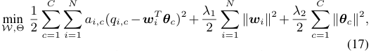

where _∥_ **_w_** _i∥_2 =∑_k_ _t_ =1_w_ _i,t_2and_∥_**_θ_**_c∥_2= ∑ _t__k_ =1_θ_ _c,t_2._λ_1and_λ_2 are parameters controlling the weights of regularization terms. 

We propose to use a simple gradient descent method to solve the above problem. The pseudo-code is presented in Algorithm 2. We first initialize _{wi,t}_ and _{θc,t}_ to small random values. After that, we apply gradient descent algorithm, _i.e._ , for every _i_ and _t_ , we update _{wi,t}_ and _{θc,t}_ using the following rules 

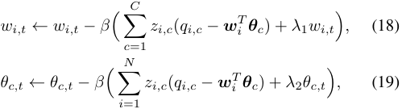

where _β_ is the learning rate. Finally, we can predict a user _i_ ’s reliability for a task category _c_ even if the user _i_ did not provide any data to _c_ , _i.e._ , for _i ∈/_ N _c_ , _qi,c ←_ **_w_** _i__T_**_θ_**_c_. 

## V. EVALUATION 

In this section, we implement and evaluate the performance of our proposed methods. We first conduct a real-world crowdsensing experiment, and then simulate a large-scale scenario to further examine the performance of our methods. 

## _A. Experiment Setup_ 

We recruit 10 users (8 males and 2 females) to participate in our experiment. In the experiment, we manually create 123 sensing tasks for 9 different categories. The tasks within 

**Algorithm 2:** Unknown Reliability Estimation 

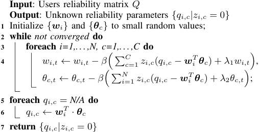

the same category focus on the same sensing target (such as noise, traffic, or weather), but with different attributes, including time, locations, and payments. Each task category has a data type requirement. For instance, noise monitoring requires continuous data type, while weather monitoring requires categorical data type. The entire task corpus is shown to the users through the browsers on the users’ smartphones. Each user can browse through these tasks, and choose their interested tasks to work on. The ground truth of each task is monitored by the authors themselves, and unavailable to the users. We collect the users’ sensing data, as well as their operation records, including each user’s task browsing history, task selection history, and task completion history. 

According to our collected data, each user contributes data to about 60% of the tasks in average. The parameter _α_ used in our semi-supervised learning model is set to 1. And for each task category, we use the ground truths of 10% of the tasks. The parameters _k_ , _λ_ 1 and _λ_ 2 used in our matrix factorization method are set to 3, 5 and 5, respectively. 

## _B. Experiment Results on User Reliability Profiling_ 

In the experiment, we evaluate the performance of our proposed user profiling algorithm. To differentiate the notations, we use “URP-BA” to denote the basic version shown in III-A, and “URP-E1” and “URP-E2” to denote the first enhancement and the second enhancement, respectively. We compare our algorithms with two benchmarks. One is a heuristic method that treats each user’s data equally, _i.e._ , simple average (“Avg.”) for continuous data and majority voting (“Voting”) for categorical data. The other benchmark is a general truth discovery framework, called “CRH” [21], which uses a single parameter to model each user’s reliability level. We adopt the following two metrics to measure the performance of the algorithms. 

- RMSE: For continuous data, we use Root Mean Square Error (RMSE) to measure the distance between the estimation result and the <u>ground</u> truth. Mathematically, the RMSE is defined as ~~√∑~~ _j∈_ S(_x_ _j__∗−x_ˆ_∗_ _j_)2_/|M|_. 

- Error Rate: For categorical data, we use Error Rate to quantify the performance of an algorithm. The Error Rate of an algorithm is defined as the percentage of the tasks to which the algorithm’s estimations are different from <u>∑</u> _<u>j∈</u>_ S**1**(_x_ _<u>j</u>__∗,x_ˆ_∗_ _<u>j</u>_) 

- the ground truth, _i.e._ , 1 _− M_ . 

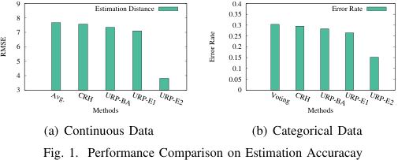

<!-- Start of picture text -->
 9  0.4 Estimation Distance Error Rate  8  0.35  0.3  7  0.25  6  0.2  5  0.15  0.1  4  0.05  3  0 Methods Methods (a) Continuous Data (b) Categorical Data Fig. 1. Performance Comparison on Estimation Accuracay Avg. CRH URP-BAURP-E1 URP-E2 Voting CRH URP-BAURP-E1URP-E2 RMSE Error Rate <!-- End of picture text -->

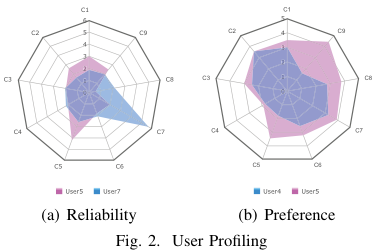

<!-- Start of picture text -->
�� C1 6 5 C2 5 C9 C2 4 C9 4 3 3 2 2 C3 1 C8 C3 1 C8 0 0 C4 C7 C4 C7 C5 C6 C5 C6 User5 User7 User4 User5 (a) Reliability (b) Preference Fig. 2. User Profiling <!-- End of picture text -->

Fig. 1 presents the performance comparison between our algorithms and the benchmarks. We can see that for either data type, the truth discovery-based algorithms can achieve higher estimation accuracy than the simple average or majority voting, indicating the effectiveness of truth discovery algorithms. However, the performance of Avg./Voting, CRH, URP-BA, and URP-E1 tends to be similar. The main reason is that under the crowdsensing scenarios, these usually exist many tasks to which the majority of the users’ data are inaccurate, thus the traditional unsupervised learning models may have trouble identifying the users’ true reliability levels. In this case, as we can see that URP-E2 has superior performance to the other four algorithms, incorporating even a small number of ground truths can dramatically improve the estimation accuracy. 

## _C. Experiment Results on Personalized Task Matching_ 

Besides profiling the users’ reliability, we also profile each user’s preference towards each task using the methods proposed in Section II-B. In Fig. 2(a) and Fig. 2(b), we present the reliability profiles and preference profiles of two representative users respectively, where the user’s preference towards a task category is calculated as the user’s average preference score of the tasks in the category. We normalize the users’ preferences to [0,5] for better graphical presentation. 

To evaluate the performance of our personalized task recommender system, we provide each user a list of 20 recommended tasks, and ask each user to choose their interested tasks. Recall that our personalized task recommender system recommends tasks to the users based on both the users’ reliability and preference. Specifically, for each user and task pair ( _i, j_ ), we calculate a recommendation score _Score_ ( _i, j_ ) = _γpi,j_ + (1 _− γ_ ) _qi,j_ . Suppose task _j_ belongs to category _c_ , then we set _pi,j_ to _pi,c_ . We use _γ_ = 0 _._ 4 and _η_ = 0 _._ 5 in our experiment. After that, our system recommends each user 20 tasks with the highest recommendation scores. Three benchmarks are adopted, including random recommendation, preference-only recommendation, and reliability-only recommendation. Ran- 

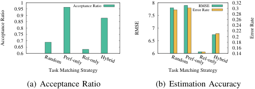

<!-- Start of picture text -->
 0.95 1 Acceptance Ratio  8 Error RateRMSE  0.32 0.3  0.9  7.5  0.28  0.85  0.26  0.8  7  0.24 0.22  0.75  0.2  0.7  6.5  0.18  0.65  0.16  0.6  6  0.14 Task Matching Strategy Task Matching Strategy (a) Acceptance Ratio (b) Estimation Accuracy Random Pref-onlyRel-only Hybrid RandomPref-onlyRel-onlyHybrid RMSE Error Rate Acceptance Ratio <!-- End of picture text -->

<!-- Start of picture text -->
Fig. 3. Comparison on Different Task Matching Strategies <!-- End of picture text -->

dom task recommendation strategy provides each user a list of 20 randomly chosen tasks, while the preference- or reliabilityonly recommendation strategies provide each user 20 tasks with highest preference or reliability scores, respectively. 

The performance of task matching strategies is measured on two different perspectives, _i.e._ , task acceptance ratio and estimation accuracy. The task acceptance ratio is defined as the percentage of the recommended tasks that the users have selected, and the estimation accuracy is measured using RMSE or Error Rate depending on the data types of the tasks. The performance comparison of different task matching strategies is presented in Fig. 3. We can see that the preferenceonly strategy has the highest task acceptance ratio, while the reliability-only strategy outputs the most accurate estimation results. That is because these two strategies match tasks to the users with the tendency of facilitating the match of one certain perspective. Comparing with other task matching strategies, we can see that our proposed hybrid recommendation strategy can achieve a good balance between the acceptance ratio and the estimation accuracy. 

## _D. Evaluations on A Large-Scale Scenario_ 

In this subsection, we examine the performance of our user profiling algorithm on a large-scale crowdsensing scenario. 

In our simulation, there are 100 users and 1000 tasks. These tasks are randomly distributed among 20 categories. Each user’s task selection rate is set to 10%, _i.e._ , each user contributes data to each task with 10% probability. The ground truth of each task is randomly distributed within [30,100]. For each user _i_ , if she contributes data to the task _j_ of category _c_ , then her data _xi,j_ is generated based on a Gaussian distribution with the mean _x__∗_ _j_andvariance _qi,c_ <u>2</u>,_i.e._,_xi,j∼N_(_x_ _j__∗,_ _qi,c_ <u>2</u>). In URP-E2, we randomly choose 1% of tasks, and incorporate their ground truths in the user reliability profiling process. All the results are averaged over 1000 rounds. 

We classify the users into three groups: reliable users, normal users, and unreliable users, where the users’ reliability parameter in these three groups are assumed to follow _N_ (0 _._ 75 _,_ 0 _._ 1), _N_ (0 _._ 5 _,_ 0 _._ 1), and _N_ (0 _._ 25 _,_ 0 _._ 1), respectively. We consider three different settings. In the first setting, the users are classified into the three groups randomly. In the second setting, each user has 60% probability of being classified into reliable users, 30% normal users, and 10% unreliable users, while in the third setting, each user has 10% being reliable, 30% being normal, and 60% being unreliable. We assume that for each user, if her reliability for certain task is below 0.2, then the user will have 50% probability of failing the task. 

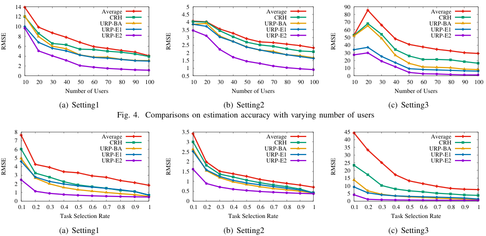

<!-- Start of picture text -->
 14  5  90  12 AverageCRH  4.5 AverageCRH  80 AverageCRH URP-BA  4 URP-BA  70 URP-BA  10 URP-E1  3.5 URP-E1  60 URP-E1  8 URP-E2  3 URP-E2  50 URP-E2  6  2.5  40  2  30  4  1.5  20  2  1  10  0  0.5  0  10  20  30  40  50  60  70  80  90  100  10  20  30  40  50  60  70  80  90  100  10  20  30  40  50  60  70  80  90  100 Number of Users Number of Users Number of Users (a) Setting1 (b) Setting2 (c) Setting3 Fig. 4. Comparisons on estimation accuracy with varying number of users  8  3.5  45  7 AverageCRH  3 AverageCRH  40 AverageCRH  6 5 URP-BAURP-E1URP-E2  2.5 2 URP-BAURP-E1URP-E2  35 30 25 URP-BAURP-E1URP-E2  4  1.5  20  3  15  2  1  10  1  0.5  5  0  0  0  0.1  0.2  0.3  0.4  0.5  0.6  0.7  0.8  0.9  1  0.1  0.2  0.3  0.4  0.5  0.6  0.7  0.8  0.9  1  0.1  0.2  0.3  0.4  0.5  0.6  0.7  0.8  0.9  1 Task Selection Rate Task Selection Rate Task Selection Rate (a) Setting1 (b) Setting2 (c) Setting3 RMSE RMSE RMSE RMSE RMSE RMSE <!-- End of picture text -->

<!-- Start of picture text -->
Fig. 5. Comparisons on estimation accuracy with varying users’ task selection rate <!-- End of picture text -->

Fig. 4 presents the estimation accuracy of different algorithms with a varying number of the users. The number of users varies from 10 to 100 with the increment of 10. We can see that the simple average has the worst estimation accuracy, while URP-E2 achieves the lowest RMSE in all the three settings. In 4(c), we observe that the RMSE first grows as the number of users increases, and then decrease when the number of users is getting larger. This is because that when the number of users is small, slightly increasing the number of users, especially unreliable users, may bring extra errors to the estimation results. As the number of users increases, the platform can access to more information, and thus can reduce the estimation errors. 

Fig. 5 shows the estimation accuracy of different algorithms with varying task selection rate. We increase the task selection rate from 0.1 to 1 with the increment of 0.1. It can be seen that our proposed user profiling algorithm achieves the lowest RMSE, indicating the effectiveness of our algorithm. Besides, we can observe that the RMSE decreases as the task selection rate increases. This is because that increasing the task selection rate usually means having more data, _s.t._ , the platform can identify the users’ reliability levels more accurately. A similar phenomenon was also observed in [25]. 

We also examine the effect of the number of incorporated ground truths on the estimation accuracy. The results are shown in Fig. 6. We can see that having more truth can improve our estimation results. Besides, comparing the different settings, we can see that Setting 2 achieves the best estimation accuracy, since most users in Setting 2 are reliable. 

## VI. RELATED WORK 

Many researchers have studied the user selection problem in mobile crowdsensing from the game-theoretic perspective. Yang _et al._ [2] proposed incentive mechanisms for both platform-centric model and user-centric model. Zhao _et al._ [3] considered the problem of budget feasible mechanism 

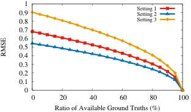

<!-- Start of picture text -->
 1  0.9 Setting 1Setting 2  0.8 Setting 3  0.7  0.6  0.5  0.4  0.3  0.2  0.1  0  0  20  40  60  80  100 Ratio of Available Ground Truths (%) RMSE <!-- End of picture text -->

Fig. 6. The Effect of Available Truth on Estimation Accuracy 

design for crowdsensing, and proposed mechanisms for both offline and online scenarios. He _et al._ [26] studied the optimal task allocation problem for location-dependent crowdsensing. Karaliopoulos _et al._ [8] adopted logistic regression techniques to estimate a user’s probability of accepting a task, and tend to match tasks to users based on the information. However, none of these work considered the users’ data quality or reliability in performing the sensing tasks. Although Jin _et al._ [7] and Han _et al._ [27] considered the problem of quality-aware task matching, they were based on the platform-centric model, and were unable to recommend personalized tasks for the users. 

The problem of truth discovery has been widely studied to handle the situation where data collected from multiple sources tend to be conflicting and the ground truths are unknown [15]. Wang _et al._ [28] considered the problem of truth detection in social sensing based on EM algorithm. Wang _et al._ [29] proposed a truth discovery algorithm to handle streaming data. Ouyang _et al._ [30] proposed a truth discovery method to detect spatial events based on a graphical model. Su _et al._ [31] designed a generalized decision aggregation framework for distributed sensing scenarios. Wang _et al._ [32] studied the truth discovery problem in cyber-physical systems. Wang _et al._ [33] further exploited the problem of truth discovery for interdependent phenomena in social sensing. Meng _et al._ [34] exploited the spatial correlations to improve the estimation accuracy. CRH [21] is a general truth discovery framework 

that can handle both continuous and categorical data. Li _et al._ [25] considered truth discovery problem for long-tail data, and proposed a confidence-aware approach. Ma _et al._ [35] proposed a probabilistic method to tackle the scenarios where sources’ reliability vary among different topics. Yang _et al._ [36] studied the problem of data quality estimation and qualitybased payment determination. Peng _et al._ [37] propose an EM algorithm to quantity the users’ data qualities in mobile crowdsensing. However, all of these works are based on unsupervised learning models, and thus may suffer from the reliability initialization problem when most data are inaccurate [16]. Yin and Tan _et al._ [38] proposed a semi-supervised learning model to identify true facts from false ones. However, their work tended to focus on the truth estimation part, but did not output the reliability levels of the data sources, thus cannot address the need of user reliability profiling. 

## VII. CONCLUSION 

In this paper, we have studied the problem of personalized task matching in mobile crowdsensing. We have proposed a personalized task recommender framework that can recommend tasks to users based on a fine-grained characterization on both the users’ preference and reliability. We have proposed methods to measure each user’s preferences and reliability of different tasks, respectively. In particular, the proposed user reliability profiling algorithm originates from truth discovery problem, but surpasses existing truth discovery algorithms in two ways, _i.e._ , by exploiting the information of failed tasks and also by incorporating a small number of ground truths to improve the estimation accuracy. Further more, we proposed a matrix factorization method to address a critical limitation of the existing truth discovery algorithms in estimating the users’ reliability for the uninvolved tasks. Both a real-world experiment and a large-scale simulation have been conducted to evaluate our proposed methods. The evaluation results have demonstrated the good performance of our methods. 

## REFERENCES 

- [1] R. K. Ganti, F. Ye, and H. Lei, “Mobile crowdsensing: current state and future challenges,” _IEEE Communications Magazine_ , vol. 49, no. 11, 2011. 

- [2] D. Yang, G. Xue, X. Fang, and J. Tang, “Crowdsourcing to smartphones: Incentive mechanism design for mobile phone sensing,” in _MobiCom_ , 2012. 

- [3] D. Zhao, X.-Y. Li, and H. Ma, “How to crowdsource tasks truthfully without sacrificing utility: Online incentive mechanisms with budget constraint,” in _INFOCOM_ , 2014. 

- [4] Q. Zhao, Y. Zhu, H. Zhu, J. Cao, G. Xue, and B. Li, “Fair energyefficient sensing task allocation in participatory sensing with smartphones,” in _INFOCOM_ , 2014. 

- [5] M. Karaliopoulos, O. Telelis, and I. Koutsopoulos, “User recruitment for mobile crowdsensing over opportunistic networks,” in _INFOCOM_ , 2015. 

- [6] H. Zhang, B. Liu, H. Susanto, G. Xue, and T. Sun, “Incentive mechanism for proximity-based mobile crowd service systems,” in _INFOCOM_ , 2016. 

- [7] H. Jin, L. Su, D. Chen, K. Nahrstedt, and J. Xu, “Quality of information aware incentive mechanisms for mobile crowd sensing systems,” in _MobiHoc_ , 2015. 

- [8] M. Karaliopoulos, I. Koutsopoulos, and M. Titsias, “First learn then earn: optimizing mobile crowdsensing campaigns through data-driven user profiling,” in _MobiHoc_ , 2016. 

   - [11] Gigwalk. [Online]. Available: http://www.gigwalk.com/ 

   - [12] G. Adomavicius and A. Tuzhilin, “Toward the next generation of recommender systems: A survey of the state-of-the-art and possible extensions,” _IEEE transactions on knowledge and data engineering_ , vol. 17, no. 6, pp. 734–749, 2005. 

   - [13] K. L. Huang, S. S. Kanhere, and W. Hu, “Are you contributing trustworthy data?: the case for a reputation system in participatory sensing,” in _MSWiM_ , 2010. 

   - [14] J. Wang, J. Tang, D. Yang, E. Wang, and G. Xue, “Quality-aware and fine-grained incentive mechanisms for mobile crowdsensing,” in _ICDCS_ , 2016. 

   - [15] X. Yin, J. Han, and S. Y. Philip, “Truth discovery with multiple conflicting information providers on the web,” _IEEE Transactions on Knowledge and Data Engineering_ , vol. 20, no. 6, pp. 796–808, 2008. 

   - [16] Y. Li, J. Gao, C. Meng, Q. Li, L. Su, B. Zhao, W. Fan, and J. Han, “A survey on truth discovery,” _Acm Sigkdd Explorations Newsletter_ , vol. 17, no. 2, pp. 1–16, 2016. 

   - [17] Y. Koren, R. Bell, and C. Volinsky, “Matrix factorization techniques for recommender systems,” _Computer_ , vol. 42, no. 8, 2009. 

   - [18] S. Rendle, C. Freudenthaler, Z. Gantner, and L. Schmidt-Thieme, “Bpr: Bayesian personalized ranking from implicit feedback,” in _UAI_ , 2009. 

   - [19] C. H. Lin, E. Kamar, and E. Horvitz, “Signals in the silence: Models of implicit feedback in a recommendation system for crowdsourcing.” in _AAAI_ , 2014. 

   - [20] G. Forman, “An extensive empirical study of feature selection metrics for text classification,” _Journal of machine learning research_ , vol. 3, no. Mar, pp. 1289–1305, 2003. 

   - [21] Q. Li, Y. Li, J. Gao, B. Zhao, W. Fan, and J. Han, “Resolving conflicts in heterogeneous data by truth discovery and source reliability estimation,” in _SIGMOD_ , 2014. 

   - [22] S. Yang, K. Han, Z. Zheng, S. Tang, and F. Wu. (2017, December) Technical report. [Online]. Available: https://www.dropbox.com/s/omr9mbmw2liipo6/report10.pdf?dl=0 

   - [23] D. P. Bertsekas, _Nonlinear programming_ . Athena scientific Belmont, 1999. 

   - [24] H. Ding, J. Gao, and J. Xu, “Finding global optimum for truth discovery: Entropy based geometric variance,” in _SoCG 2016)_ , 2016. 

   - [25] Q. Li, Y. Li, J. Gao, L. Su, B. Zhao, M. Demirbas, W. Fan, and J. Han, “A confidence-aware approach for truth discovery on long-tail data,” _Proceedings of the VLDB Endowment_ , vol. 8, no. 4, pp. 425–436, 2014. 

   - [26] S. He, D.-H. Shin, J. Zhang, and J. Chen, “Toward optimal allocation of location dependent tasks in crowdsensing,” in _INFOCOM_ , 2014. 

   - [27] K. Han, H. Huang, and J. Luo, “Posted pricing for robust crowdsensing,” in _MobiHoc_ , 2016. 

   - [28] D. Wang, L. Kaplan, H. Le, and T. Abdelzaher, “On truth discovery in social sensing: A maximum likelihood estimation approach,” in _IPSN_ , 2012. 

   - [29] D. Wang, T. Abdelzaher, L. Kaplan, and C. C. Aggarwal, “Recursive fact-finding: A streaming approach to truth estimation in crowdsourcing applications,” in _ICDCS_ , 2013. 

   - [30] R. W. Ouyang, M. Srivastava, A. Toniolo, and T. J. Norman, “Truth discovery in crowdsourced detection of spatial events,” in _CIKM_ , 2014. 

   - [31] L. Su, Q. Li, S. Hu, S. Wang, J. Gao, H. Liu, T. F. Abdelzaher, J. Han, X. Liu, Y. Gao _et al._ , “Generalized decision aggregation in distributed sensing systems,” in _RTSS_ , 2014. 

   - [32] S. Wang, D. Wang, L. Su, L. Kaplan, and T. F. Abdelzaher, “Towards cyber-physical systems in social spaces: The data reliability challenge,” in _RTSS_ , 2014. 

   - [33] S. Wang, L. Su, S. Li, S. Hu, T. Amin, H. Wang, S. Yao, L. Kaplan, and T. Abdelzaher, “Scalable social sensing of interdependent phenomena,” in _IPSN_ , 2015. 

   - [34] C. Meng, W. Jiang, Y. Li, J. Gao, L. Su, H. Ding, and Y. Cheng, “Truth discovery on crowd sensing of correlated entities,” in _SenSys_ , 2015. 

   - [35] F. Ma, Y. Li, Q. Li, M. Qiu, J. Gao, S. Zhi, L. Su, B. Zhao, H. Ji, and J. Han, “Faitcrowd: Fine grained truth discovery for crowdsourced data aggregation,” in _SIGKDD_ , 2015. 

   - [36] S. Yang, F. Wu, S. Tang, X. Gao, B. Yang, and G. Chen, “On designing data quality-aware truth estimation and surplus sharing method for mobile crowdsensing,” _IEEE Journal on Selected Areas in Communications_ , vol. 35, no. 4, pp. 832–847, 2017. 

   - [37] D. Peng, F. Wu, and G. Chen, “Pay as how well you do: A quality based incentive mechanism for crowdsensing,” in _MobiHoc_ , 2015. 

   - [38] X. Yin and W. Tan, “Semi-supervised truth discovery,” in _WWW_ , 2011. 

- [9] Waze. [Online]. Available: https://www.waze.com/ 

- [10] Field agent. [Online]. Available: http://www.fieldagent.net/ 

