# Pricing for Revenue Maximization in IoT Data Markets: An Information Design Perspective 

Weichao Mao, Zhenzhe Zheng, Fan Wu 

Shanghai Key Laboratory of Scalable Computing and Systems, Shanghai Jiao Tong University, China _{_ maoweichao,zhengzhenzhe _}_ @sjtu.edu.cn, _{_ fwu _}_ @cs.sjtu.edu.cn 

**_Abstract_ —Data is becoming an important kind of commercial good, and many online data marketplaces are set up to facilitate the trading of data. However, most existing data market models and the corresponding pricing mechanisms are simple, and fail to capture the unique economic properties of data. In this paper, we first characterize the distinctive features of IoT data as a commodity, and then present a new IoT data market model from an information design perspective. We further propose a family of data pricing mechanisms for revenue maximization under different market settings. Our** **_MSimple_ mechanism extracts full surplus from the market for the model with one type of buyer. When multiple types of buyers coexist, our** **_MGeneral_ mechanism optimally solves the problem of revenue maximization by formulating it as a polynomial size convex program. For a more practical setting where buyers have bounded rationality, we design** **_MPractical_ mechanism with a tight logarithmic approximation ratio. We evaluate our pricing mechanisms on a real-world ambient sound dataset. Evaluation results show our pricing mechanisms achieve good performance and approach the revenue upper bound.** 

## I. INTRODUCTION 

Data is becoming a commodity. It has tremendous value to both its owner and other parties who want to integrate it into their services. A number of online data marketplaces are emerging to enable data sharing and trading over the Internet, facilitating various data-based services, such as targeted advertising and business decision making. For example, Gnip [1] aggregates and sells social media data from Twitter before the General Data Protection Regulation(GDPR); Xignite [2] vends real-time financial data; and Here [3] trades tracking and positioning data for location-based advertising. 

Among various online data marketplaces, several companies [4]–[6] focus on data from Internet of Things (IoT). IoT data marketplaces allow different stakeholders to share the sensor network infrastructure, and facilitate many city services such as waste management and environment monitoring [7], traffic jam avoidance [8], smart agriculture and weather forecasting [9], and etc. Data from widely deployed sensors are more accurate and granular than the coarse-grained data from the national weather or traffic services. For example, IOTA [4] is a blockchain-based data marketplace for aggregating and 

This work was supported in part by the National Key R&D Program of China 2018YFB1004703, in part by China NSF grant 61672348, 61672353, and 61472252. The opinions, findings, conclusions, and recommendations expressed in this paper are those of the authors and do not necessarily reflect the views of the funding agencies or the government. 

F. Wu is the corresponding author. 

selling IoT data, and DataBroker DAO [6] is a peer to peer marketplace for IoT sensor data. 

One major drawback of existing data marketplaces is that the pricing mechanism for data trading is still very primary: the data brokers either adopt a fixed price mechanism [4], or choose to negotiate with the buyer offline [2]. Although there are some existing work dedicated to designing flexible data pricing mechanisms, most of them only support structured and relational data [10], [11], fail to capture the unique features of IoT data as a commodity, and ignore the economic objective of the data seller. In this work, we aim to analyze the unique economic properties of IoT data, and then design proper pricing mechanisms to achieve revenue maximization. 

In the following, we list four properties of IoT data as a commodity that could heavily influence the trading model and pricing mechanism design. 

• First, IoT data generally falls into the category of digital goods, and can be reproduced with a neglectable marginal cost. Due to such cost feature, a buyer can easily generate a new copy of the raw data, and resell it at a lower price, making the data easy to pirate. Traditional copyright techniques can hardly resist such piratical behavior. To resolve this problem, we propose that the data seller should sell data services instead of raw data. This sale strategy can also preserve the privacy of data owner to some extent. The data services could be the mean, median, and maximum values of aggregated data, or the results of performing data mining techniques on the data. 

• Second, the valuation of IoT data does not necessarily depend on data volume, but depend on the amount of information it provides. This property differentiates IoT data from traditional commodities including digital goods. A large volume of noisy data from low standard sensors could have less valuation than a small set of precise data from a professional sensor. One fundamental question in data trading is: how to quantify the valuation of data in the market? In the context of IoT applications, based on the information extracted from sensed data, buyers always take actions to earn certain utility. Therefore, we measure buyer’s valuation towards a set of data by how the data guides the buyer’s action. For example, suppose you are going out on a sunny day and you do not consider it necessary to take an umbrella with you. In this case, a large set of humidity sensor data confirming a long sunny day does not generate much valuation to you. On the contrary, a set of sensor data forecasting a heavy rain one hour later generates high valuation to you, as it changes your action 

by guiding you to take an umbrella with you. 

• Third, the price of data might have correlation with the information behind the data, and thus releasing the price of data could leak the information of data. Suppose the data seller in the previous “umbrella” example sets $1 and $2 for the “sunny” data set and the “rainy” data set, respectively. A buyer could distinguish these two data sets through only observing the corresponding prices, as the rainy data set contains more information and has a higher price. Since buyers are willing to pay a higher price for the rainy data set, the seller would lose revenue if he reduces the price of this data set to $1. We therefore argue that, in order to avoid information leakage before data trading, the seller should not set explicit prices related to data content, but instead should declare prices independent of the specific values of data. For example, one possible qualified pricing scheme is: charge $1 for a weather data set with 75% accuracy, and charge $2 for 95% accuracy. Such content-independent pricing schemes do not leak information about the actual data values. 

• Fourth, time-sensitive IoT applications require the price of IoT data should be determined before data is actually generated. In many real world use cases of IoT data, the data buyer requires the data stream to be fed in real-time [12], and thus it is impractical to calculate the price in an online manner. Most of existing work cannot handle this unique feature of IoT data, as they always assume the data is sold after it is collected, structured or modeled [10], [11]. Considering the valuation of data is highly sensitive to the timing, the commodity being sold in IoT data marketplaces should not be the data itself, but rather the permission of data access in a future period of time. This feature of IoT data raises a challenging problem: how do sellers persuade buyers to purchase the data when they still have not collected data? 

Besides the four features mentioned above, the revenue maximization problem has many additional challenges. As the seller does not know the valuation of each individual buyer, he has to determine the price of data under incomplete information. Moreover, with various types of buyers in the market, an optimal pricing mechanism should perform market segmentation or price discrimination among different buyers. Under such flexible pricing mechanisms, the data seller should manage to preclude the potential strategic behavior of buyers. 

Jointly considering the previous challenges, in this paper, we present a market model of trading IoT data from an information design perspective that captures the aforementioned unique features of IoT data. First, the seller in our model provides data services to buyers by sending various signals, rather than feeding raw data. Second, we define the valuation of data as buyer’s utility increment due to the action change after buying data. Finally, the seller designs and publishes the pricing schemes before actually collecting the data, and incentivizes buyers to purchase data by giving them high expected utility increments. This timing enables the trading data to be collected in the future, and ensures that prices never leak information about the actual data values. 

We summarize our contributions in this paper as follows: 

• First, we characterize four unique features of IoT data as a commodity that differentiate IoT data from traditional goods. We present a market model from an information design perspective that fully captures these features. 

• Second, we design revenue-maximizing pricing mechanisms under different market settings. We first consider a simple setting where only one type of buyer exists in the market, and propose _MSimple_ mechanism that extracts full surplus from the market. We then consider the general setting where different types of buyers coexist in the market. We present _MGeneral_ mechanism to this setting, and prove there exists a polynomial time solution by formulating the problem of revenue maximization as a convex program. We further present _MPractical_ mechanism to a more practical setting where buyers have bounded rationality. We prove _MPractical_ achieves logarithmic approximation ratio towards the optimal revenue, which is the upper bound of any mechanism of constant size. 

• Finally, we evaluate our pricing mechanisms on a realworld ambient sound dataset. We test the influence of different parameters in the market model, and show that our mechanisms achieve good performance. 

The rest of the paper is organized as follows. In Section II, we introduce our market model and necessary notations. In Section III, we present our pricing mechanisms to different market settings. We evaluate our pricing mechanisms in Section IV. In Section V, we briefly review related work in the literature. Finally, we conclude the paper in Section VI. 

## II. PRELIMINARIES 

We consider the intersection between a data seller and multiple data buyers. The data commodity in the IoT data market is the _state_ of nature, denoted by a random variable _ω_ drawn from a sample space Ω= _{ω_ 1 _, ω_ 2 _, . . . , ωn}_ . The random variable _ω_ could denote a particular numerical value. For example, _ω_ can be the mean value of a set of noise sensors near street, and correspondingly Ω is a discrete set of numerical values for possible noise levels. The random variable _ω_ could also denote the data service extracted from raw data. For example, the seller can aggregate data from various sources–street noise sensors, traffic camera videos, crowdsourced pedestrian traces–to analyze the traffic condition of a certain street. The analytical result is sold to buyers as a data service. In this case the nature state _ω_ is chosen from a binary set Ω= _{Crowded, NotCrowded}_ . 

The seller trades the data through publishing a _menu M_ = _{_ ( _I, tI_ ) _}_ , which contains multiple pricing schemes. Each buyer chooses a pricing scheme ( _I, tI_ ) that maximizes her expected utility, which will be defined later. Each pricing scheme contains an _experiment_1 _I_ and a corresponding _price tI_ . An experiment _I_ = _{S, P }_ contains a set _S_ of possible _signals_2 , and an _n × |S|_ right probability matrix _P_ = [ _pij_ ], 

> 1An experiment is also called an information structure in the literature. 

> 2We abstract different responses from the seller as different signals. In the context of IoT data market, reporting different probabilities of precipitation to the buyer can be regarded as sending different signals. 

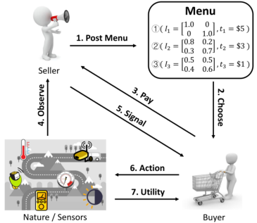

Fig. 1. Data trading process. 

1 _≤ i ≤ n,_ 1 _≤ j ≤|S|_ , where 0 _≤ pij ≤_ 1 and � _|jS_ =1 _|__pij_=1.Theinterpretationof_pij_istheprobability that the seller sends signal _sj ∈ S_ to the buyer when the true nature state is _ωi_ , i.e., _pij_ = Pr ( _sj | ωi_ ). 

Consider two special types of experiment here: fullinformation experiment _I_¯ and no-information experiment _<u>I</u>_ <u>.</u> In the full information case, we assume that _|S|_ = _n_ and _P_ is a diagonal matrix of size _n × n_ . In such case, the seller directly tells the buyer his entire knowledge about the nature state. Specifically, once the seller observes the nature state as _ωi_ , he will always send signal _si_ to the buyer. From the buyer’s perspective, upon receiving signal _si_ , she is fully confident that the true nature state is _ωi_ . In the no-information experiment _<u>I</u>_ <u>,</u> the seller uniformly selects a signal from _S_ and sends it to the buyer, regardless of the true nature state, i.e., _pij_ = 1 _/|S|_ for all 1 _≤ i ≤ n,_ 1 _≤ j ≤|S|_ . The buyer gains no information from this experiment, and thus the no-information experiment can be used to fully obfuscate the nature state. 

The buyer is uncertain about the true state of nature, and seeks to buy data (or data services) from the seller to supplement her knowledge. We assume the buyer has a prior estimation of the nature state before buying data. The buyer may have previously bought data from the same sensors, and this relatively out-of-date data can help her form a good estimation, due to data correlation in time dimension. We denote the prior distribution for the random variable _ω_ as _θ_ = ( _θ_ 1 _, θ_ 2 _, . . . , θn_ ) _∈_ ∆Ω,3 where 0 _≤ θi ≤_ 1 and � _ni_ =1_θi_=1.Theparameter_θi_denotestheprobabilitythat the nature state is _ωi_ , i.e., _θi_ = Pr( _ωi_ ). We also call the prior distribution _θ_ as the private _type_ of buyer. We assume that the type _θ_ is drawn from a finite set Θ with an independent and identical distribution _F_ ( _θ_ ) _∈_ ∆Θ. We further assume the cumulative distribution function _F_ ( _θ_ ) is public information. 

In many IoT applications, the buyer usually faces a decision problem, and has to choose an action _a_ from a finite set _A_ , based on her perception over the nature state. Let _uθ_ ( _ω, a_ ) denote the _utility_ of the buyer with type _θ_ when the nature state is _ω_ and action _a_ is taken. Without purchasing data from 

the seller, the buyer has to base her decision only on her prior estimation _θ_ , and the expected utility is 

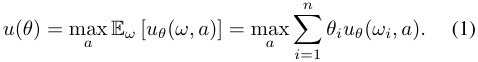

After receiving signal _sj_ from the seller, the buyer _θ_ updates her estimation of the nature state using Bayes’ rule: 

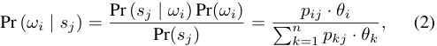

and her expected utility turns to 

_u_ ( _θ, sj_ ) = max E _ω_ [ _uθ_ ( _w, a_ ) _| sj_ ] _a_ 

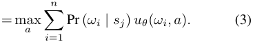

Given an experiment _I_ , from buyer _θ_ ’s point of view, the probability of receiving signal _sj_ is 

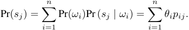

The buyer’s expected utility after buying experiment _I_ is 

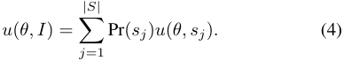

Therefore, combining the four equations above, buyer _θ_ ’s _utility increment_ for buying experiment _I_ is 

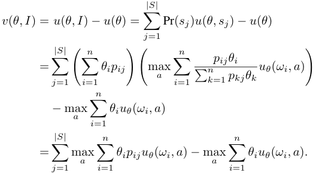

We assume buyer _θ_ is willing to buy experiment _I_ if and only if the price _tI_ is no larger than her utility increment. More specifically, we have the following **Individual Rationality** (I.R.) constraint: 

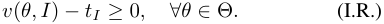

We use Figure 1 to summarize the whole data trading process. The timing of this process is as follows: First, the seller designs a menu _M_ = _{_ ( _I, tI_ ) _}_ and posts it to the public. Second, the buyer _θ_ chooses a pricing scheme ( _I, tI_ ) with the largest utility increment _v_ ( _θ, I_ ) from the menu, and pays the corresponding price _tI_ . Third, the true nature state _ω_ is realized and revealed to the seller. The seller sends a signal _sj_ to the buyer following the rule in the selected experiment _I_ . Finally, after receiving the signal _sj_ , the buyer chooses an action _a_ 

> 3∆Ω denotes the probability distributions over Ω. 

with the maximum expected utility according to Equation (3). The buyer’s utility _uθ_ ( _ω, a_ ) is then realized. 

We remark on four facts about our data market model. First, the seller does not sell raw data to the buyer, but instead extracts different signals from data. Second, we measure the valuation of data as buyer’s utility increment due to the action change after buying data, which is independent of the data volume. Third, the seller sets prices to different experiments rather than data content, and the buyer pays the seller before the nature state is realized. In this case, the prices in the menu never leak information about the actual data values. Finally, the seller prices the data before it is actually collected, which satisfies the real-time data requirement of IoT applications. We further assume the seller is committed to the designed pricing schemes. Once the buyer selects a pricing scheme, the seller will strictly follows the rule of the experiment and sends signals to the buyer according to the predefined probability matrix. Such seller commitment can be implemented in practice via a smart contract inside a blockchain [13]. 

In the full version [14] of this paper, we provide a simple and concrete example to demonstrate our data trading process. 

## III. DATA PRICING MECHANISM 

In this section, we present our data pricing mechanisms for the problem of revenue maximization. We begin with a special case where there exists only one type of buyer, and design a simple mechanism, namely _MSimple_ , that extracts full surplus from buyers. We then step into the general setting with multiple different buyer types. We present the _MGeneral_ mechanism to this setting, and prove there exists a polynomial time solution by formulating the problem of revenue maximization as a convex program. Finally, we consider a simple but practical case where buyers have bounded rationality [15], which additionally requires the seller’s menu to be constant size. We present the _MPractical_ mechanism, and prove the revenue loss with respective to the optimal revenue. 

## _A. A Warm-Up Case_ 

We first consider a simple case, where only one type of buyer _θ_ exists in the market, i.e., Θ = _{θ}_ and _F_ ( _θ_ ) = 1. This corresponds to the situation where buyers have no other source of data, and have a common prior estimation of nature. Since buyers are homogeneous, the only constraint in this problem is the I.R. property. In this case, the optimal menu contains only one pricing scheme ( _I, tI_ ). The revenue maximization problem of _MSimple_ can be formulated by 

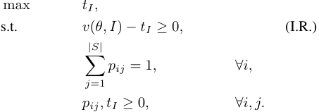

This is equivalent to finding an experiment that maximizes buyer’s utility increment _v_ ( _θ, I_ ). As we will prove in Theo- 

rem 1, the full-information experiment _I_¯ is always a utilitymaximizing experiment. Therefore, the optimal pricing scheme is simply a full-information experiment _I_¯ , along with a price that is equal to the utility increment of the buyer. 

**Theorem 1.** _For the single buyer type case, the optimal pricing scheme is a full-information experiment I_¯ _with price tI_ ¯ =�_n_ _i_ =1_θi_max_a uθ_(_ωi, a_)_−_max_a_ � _ni_ =1_θiuθ_(_ωi, a_)_._ 

_Proof._ For any experiment _I_ , define _aj_ as buyer’s op= timal action when she receives signal _sj_ , i.e., _aj_ arg max _a_ E _ω_ [ _uθ_ ( _ω, a_ ) _| sj_ ]. We then have 

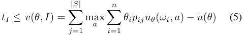

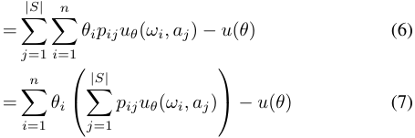

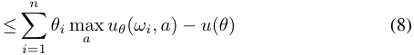

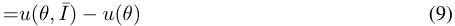

The first inequality comes from the I.R. constraint. The first equality is by the definition of utility increment. The equality (6) holds due to the definition of _aj_ . The equality (7) is derived from switching the order of summation. The inequality (8) is by setting the _pij_ with largest _uθ_ ( _ωi, aj_ ) value to be 1 and others to be 0. The equality (9) follows from the definition of _u_ ( _θ, I_¯ ) — the buyer is fully informed about the true nature state, and she can take exactly the optimal action for any nature state _ωi_ . 

From the preceding derivations, we can easily verify that the full-information experiment generates the largest utility increment among all possible experiments, and maximizes the revenue of the seller. Replacing _u_ ( _θ_ ) in equality (8) with its definition in Equation (1), we get the optimal price _tI_ ¯ for the experiment _I_¯ . Since there is only one type of buyer in this simple case, the seller knows the value of every _θi_ . Therefore, the optimal price can be exactly calculated by the seller. 

In this simple case, there is only one kind of buyer in the market, and the seller is clear about the type of every buyer he intersects with, and thus can extract full surplus from buyers. 

## _B. The General Case_ 

We further consider the general setting, in which different types of buyers coexist in the market. Considering more finegrained menu can extract higher revenue from the market, we seek to design a discriminatory pricing scheme ( _Iθ, tθ_ ) for each type _θ_ . To avoid the potential strategic behavior of buyers, we need to guarantee that each buyer will indeed choose the pricing scheme we design for her, and has no incentive to 

choose other pricing schemes. This leads to the following **Incentive Compatible** (I.C.) constraint: 

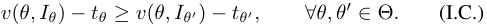

Without loss of generality, we assume whenever the buyer is indifferent between buying ( _Iθ, tθ_ ) and not buying, she always chooses to buy. The problem of revenue maximization in this general case can be formulated as follows: 

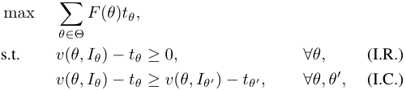

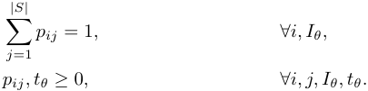

In such formulation, the feasible region is not convex, resulting in high computational complexity of directly solving this problem. To remove this non-convexity, we base our solution on the classical idea of designing posteriors [16], [17]. In the following, we will only sketch the main idea of our solution, and leave the complete proofs to the full version [14] of this paper. 

The previous formulation considers an experiment from the “row perspective”: In the experiment _Iθ_ , we aim to assign proper row probability _pi_ over different signals in _S_ to buyer _θ_ when the nature state is _ωi_ . From the “row perspective”, the experiment _Iθ_ can be expressed by the matrix _P_ and prior distribution _θ_ . Now we present a different perspective to express an experiment _Iθ_ . For easy illustration, we define two notations. We use vector _qj_ = ( _q_ 1 _j, q_ 2 _j, · · · , qnj_ )_T_ _∈_ ∆(Ω) to denote the posterior distribution Pr ( _ω | sj_ ) after receiving the signal _sj_ , where _qij_ is the posterior probability that the nature state is _ωi_ , i.e., _qij_ = Pr ( _ωi | sj_ ). We also denote matrix _Q_ = ( _q_ 1 _, q_ 2 _, · · · , q|S|_ ). Let _x__θ_ = _{x__θ_ _j_:_sj∈S}_. Here, _x__θ_ _j_denotestheprobabilityofreceivingsignal_sj_in the experiment _Iθ_ , i.e., _x__θ_ _j_=Pr(_sj_).Fromthis“column perspective”, the experiment can be expressed via matrix _Q_ and vector _x__θ_ . The following lemma states that we can express the experiment _Iθ_ equivalently from the “row perspective” and “column perspective” under certain conditions. 

**Lemma 1.** _It is equivalent to define an experiment Iθ from the row perspective with P_ = [ _pij_ ] _and from the column perspective with x__θ_ _, Q_ = [ _qij_ ] _, if and only if:_ 

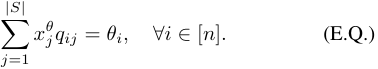

_Proof._ We leave the proof of Lemma 1 to the full version [14] of this paper due to space limitation. 

We propose the following lemma to show that assuming the posterior _qj_ is chosen from a pre-computed finite subset of ∆(Ω) will generate equivalent revenue as assuming it is chosen 

from an infinite continuous space. The idea of this lemma corresponds to the “interesting posteriors” defined in [17]. 

**Lemma 2.** _Given the buyer type space_ Θ _, restricting the candidate values of posterior distribution qj to a finite set Q__∗_ _⊂_ ∆(Ω) _that can be pre-computed does not reduce the optimal revenue._ 

_Proof._ We leave the proof of Lemma 2 to the full version [14] of this paper due to space limitation. 

Now we can rewrite the problem of revenue maximization from the column perspective as a linear program: 

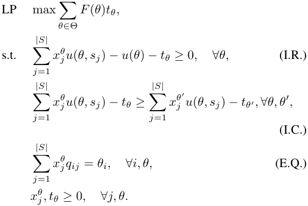

An immediate corollary of Lemma 2 is that LP contains polynomial number of constraints but exponential number of variables. In seeking a solution with polynomial time complexity, we take the dual of LP as follows: 

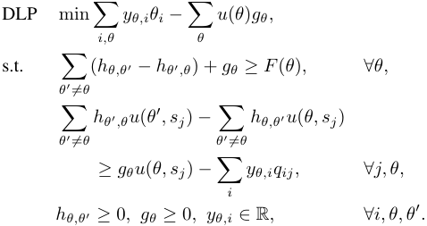

This dual linear program contains _O_ ( _|_ Θ _|_2 + _|_ Θ _|·|_ Ω _|_ ) variables and finitely many constraints. For a polynomial time solution, we need to find a separation oracle for the second family of constraints. Based on the solution in [17], since _u_ ( _θ, sj_ ) takes the maximum over _|A|_ linear functions, we can substitute each constraint in the second family with _|A|_ equivalent constraints. Checking if all the _|A|_ constraints are satisfied by all _qj_ is equivalent to solving the following problem: 

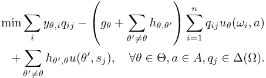

As this is a convex program that can be solved exactly in polynomial time with the standard technique from optimization theory, we can conclude the main result in the general case in the following theorem. 

**Theorem 2.** _MGeneral finds the revenue-maximizing menu in polynomial time of |_ Ω _| and |_ Θ _|, by solving the dual linear programming problem_ DLP _._ 

## _C. A Practical Case_ 

A potential problem with _MGeneral_ mechanism is that its menu size can be as large as the number of buyers, making it hard to be implemented in some practical context. For a large data marketplace with thousands of buyer types, each buyer has to look through all the pricing schemes to find the one that optimizes her utility. Although automated trading agents or bots are commonly utilized in modern online markets, performing Bayesian belief updates for each pricing scheme can still be computationally burdensome even for a computer agent. On the seller’s point of view, calculating the optimal menu requires solving a convex program that involves perhaps thousands of variables, which is also time-consuming in highfrequency online markets. 

In this part, we present our solution to a more practical scenario, where agents are computationally bounded. We prefer a menu with explicit and closed-form representation, instead of referring to solving a convex programming problem. We further require our menu to have a constant size, listing only a constant number of pricing schemes for human buyers to choose from, as the existing data marketplaces do [1], [18]. 

Our simple mechanism _MPractical_ satisfies the preceding requirements. _MPractical_ either offers a buyer the most accurate data with a fixed price, or sells nothing to the buyer. More specifically, this menu contains two pricing schemes: a fullinformation experiment _I_¯ with a fixed price _t_¯ for all buyers, and a no-information experiment _<u>I</u>_ with zero price. The noinformation experiment gives the buyer a chance to safely opt out when she cannot extract non-negative utility from the purchase, and thus the I.R. property is always guaranteed. Suppose there are in total _N_ buyers in the market. The price _p_ ¯ for the full-information experiment is simply the price that maximizes seller’s expected revenue: 

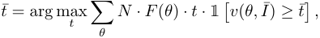

where the indicator function 1 � _v_ ( _θ, I_¯ ) _≥ t_¯ � = 1 [�_n_ _i_ =1_θi_max_a uθ_(_ωi, a_)_−u_(_θ_)_≥t_] denotes whether the buyer can extract non-negative utility. 

A natural question is, how much revenue will the seller lose if he employs _MPractical_ instead of the optimal _MGeneral_ ? In the following, we show that _MPractical_ can achieve Ω( log1 _|_ Θ _|_) revenue of _MGeneral_ even in the worst case. 

For easier illustration, we first introduce a few notations. Let _R_ denote the revenue of _MPractical_ , and _S_ denote the sum of all buyers utility increment towards the full-information experiment, i.e., _S_ =� _θ__N ·F_(_θ_)_·v_(_θ,_¯_I_), which is obviously 

the revenue upper bound of any pricing mechanism. We assume the number of buyers for each type is upper bounded by a constant _c_ , i.e., _N ≤ c |_ Θ _|_ . We normalize buyers’ utility increment _v_ ( _θ, I_¯ ) into the range [1 _, h_ ] by properly scaling the values of the utility function _uθ_ ( _ω, a_ ). Here, _h_ denotes the largest utility increment of the buyers, i.e., _h_ = max _θ v_ ( _θ, I_¯ ). We then have the following theorem: 

**Theorem 3.** _Assuming S ≥_ 2 _h, the approximation ratio of MPractical is R/S_ = Ω( log1 _|_ Θ _|_)_._ 

_Proof._ Divide the buyer utility increments into log _h_ bins by a power of two. For each utility increment _v_ ( _θ, I_¯ ) in bin _Bk_ (0 _≤ k <_ log _h_ ), we have 2_k_ _≤ v_ ( _θ, I_¯ ) _<_ 2_k_+1 . Since the utility increments sum up to _S_ and there are log _h_ bins, there exists a bin _Bk_ such that the sum of all utility increments in _Bk_ is no smaller than _S/_ log _h_ . If we set the price to be the lowest utility increment in _Bk_ , the generated revenue _Rk_ will be at least _S/_ (2 log _h_ ), since the lowest utility increment is at least half of any other utility increment in _Bk_ . We now have _R ≥Rk ≥S/_ (2 log _h_ ) since _R_ is the revenue generated by the optimal price _t_¯ , which clearly yields revenue no lower than _Rk_ . 

Define _v__∗_ to be the smallest utility increment such that all the utility increments below _v__∗_ sum up to at least _S/_ 2. We then have _v__∗_ _≥ h/N_ , otherwise the sum of utility increments below _v__∗_ is smaller than _Nv__∗_ _< h ≤S/_ 2, which contradicts our definition of _v__∗_ . We now ignore all the buyers with utility increment below _v__∗_ . Denote the optimal price for the remaining buyers as _t__∗_ and the corresponding revenue as _R__∗_ . According to the result from last paragraph, we now have 

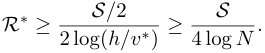

Since _Rk_ is the revenue extracted from a larger set of buyers, we have _Rk ≥R__∗_ . Combining all the results leads to 

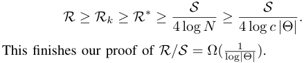

Theorem 3 relies on a simple and reasonable assumption that _S ≥_ 2 _h_ . This assumption requires the sum of all buyers’ utility increments to be at least twice of any single buyer, which easily holds in practice when the number of buyers is reasonably large. In the following theorem, we will show that the approximation ratio in Theorem 3 is tight in the worst case: this logarithmic lower bound is actually also the upper bound for any menu of constant size. 

**Theorem 4.** _There exist cases where no menu of constant size can achieve more than O_ ( log1 _|_ Θ _|_)_revenueofMGeneral,even_ _when the S ≥_ 2 _h assumption holds true._ 

_Proof._ We explicitly construct the following example. Assume there are _N_ buyers coming from _N_ different types. We number the buyers from 1 to _N_ and set the utility increment of buyer _i_ to be _vi_ =_<u>N</u>_ _i_(1_≤i ≤N_). Without loss of generality, we can assume the price for any experiment is chosen from a finite 

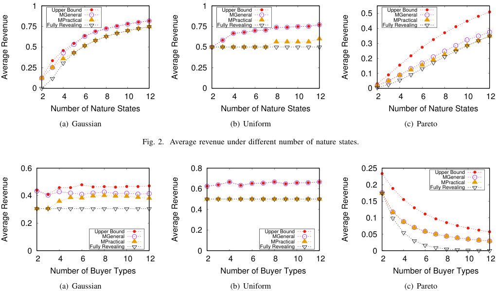

<!-- Start of picture text -->
 1  1 Upper BoundMGeneral Upper BoundMGeneral  0.5 Upper BoundMGeneral MPractical MPractical MPractical  0.75 Fully Revealing  0.75 Fully Revealing  0.4 Fully Revealing  0.3  0.5  0.5  0.2  0.25  0.25  0.1  0  0  0  2  4  6  8  10  12  2  4  6  8  10  12  2  4  6  8  10  12 Number of Nature States Number of Nature States Number of Nature States (a) Gaussian (b) Uniform (c) Pareto Fig. 2. Average revenue under different number of nature states.  0.6  0.8  0.25 Upper Bound MGeneral  0.6  0.2 Fully RevealingMPractical  0.4  0.15  0.4  0.1  0.2 Upper BoundMGeneral  0.2 Upper BoundMGeneral  0.05 MPractical MPractical  0 Fully Revealing  0 Fully Revealing  0  2  4  6  8  10  12  2  4  6  8  10  12  2  4  6  8  10  12 Number of Buyer Types Number of Buyer Types Number of Buyer Types (a) Gaussian (b) Uniform (c) Pareto Average Revenue Average Revenue Average Revenue Average Revenue Average Revenue Average Revenue <!-- End of picture text -->

Fig. 3. Average revenue under different number of buyer types. 

set _{N, N/_ 2 _, N/_ 3 _, . . . ,_ 1 _}_ . It is easy to see that when adding a pricing scheme of price _t_ = _N/i_ to the menu, at most _i_ more buyers will have the incentive to buy the data, leading to the additional revenue of no more than _N_ . Since the menu contains constant number of pricing schemes, the revenue of any constant size menu is upper bounded by _O_ ( _N_ ). 

Now we will show the optimal mechanism can indeed extract the full revenue of Ω( _N_ log _N_ ) in the previous setting. Let the size of nature state set be _|_ Ω _|_ = 2 _N_ . In this case, each buyer _i_ can be represented by a type vector _θi_ = ( _θi,_ 1 _, θi,_ 2 _, . . . , θi,_ 2 _N_ ). For buyer _i_ , we set _θi,j_ to be 0 for all _j_ , except for _θi,_ 2 _i−_ 1 = _θi,_ 2 _i_ =<u>1</u> 2.Inthissense,buyer _i_ only cares about the data concerning nature state _ω_ 2 _i−_ 1 and _ω_ 2 _i_ . In our example, all buyers share the same utility function _u_ ( _ω, a_ ) defined as: (1) _u_ ( _ωi, aj_ ) = 0 if _i̸_ = _j_ . (2) _u_ ( _ω_ 2 _i−_ 1 _, a_ 2 _i−_ 1) = _u_ ( _ω_ 2 _i, a_ 2 _i_ ) =<u>2</u>_<u>N</u>_ _i__, ∀_1_≤i ≤N_. 

We construct the optimal menu as follows. For each buyer, the pricing scheme we design for her gives her full information on the two nature states she cares about, and no information on the other states. Formally, for buyer _i_ , we set _p_ 2 _i−_ 1 _,_ 2 _i−_ 1 = _p_ 2 _i,_ 2 _i_ = 1, and all elements in the other rows of the experiment matrix are set to 21 _N_.Sincetheexperimentsdesignedfor the others bring no information increment to the buyer but requires a positive price, each buyer is only interested in her own pricing scheme, and hence the I.C. constraint is always satisfied. The readers can verify that the buyers’ utility increments are exactly _vi_ = _N/i_ , given the utility function and experiments we designed. Finally, we charge a price of 

_N/i_ from buyer _i_ (1 _≤ i ≤ N_ ), and by doing so we extract the full surplus of Ω( _N_ log _N_ ) from the market. 

We conclude that in our example, no constant size menu can extract more than _O_ ( log1 _|_ Θ _|_)oftheoptimalrevenue,whichis achieved by _MGeneral_ . Therefore, _MPractical_ is indeed one of the optimal mechanisms in the bounded computation case. 

## IV. EVALUATIONS 

In this section, we evaluate our pricing mechanisms _MGeneral_ and _MPractical_ on a real-world ambient sound dataset, and compare their performance with our benchmarks. The convex programming parts in our mechanisms are implemented using the Gurobi software [19]. 

## _A. Evaluation Setup_ 

We use the Ambient Sound Monitoring Network [20] dataset in our evaluation. The Dublin City Council collected this dataset with a network of sound monitors to measure the ambient sound quality at different sites of Dublin. This dataset contains sound pressure data of every 5 minute from 15 monitoring sites in Dublin on each day from 2012 to 2015. We use the sensory data from the Walkinstown monitoring site on June 1st, 2015 in our evaluation, and we assume the buyer priors are based on the sensory data of the same day in the previous three years, ranging from 44dB to 68dB. 

We discretize the interval [44 _,_ 68] into _n_ intervals as the sample space of the nature state. We consider three typical families of prior distributions, including Gaussian distribution, uniform distribution and Pareto distribution. Since we consider 

different types of buyers in the market, we assume buyers of the same distribution family differ from each other by the distribution parameters: Gaussian distributions with different mean values 44, 50, 56 and 62; uniform distribution over the sub-intervals of [44 _,_ 68] with different lengths 6, 12, 18 and 24; and Pareto distributions with different values 0 _._ 1, 0 _._ 5, 0 _._ 9 and 1 _._ 3 of _b_ for the generating formula _f_ ( _x_ ) = _x__b_ _<u>b</u>_+1. 

We compare the revenue of our mechanisms with two benchmarks, namely the Fully Revealing mechanism and revenue Upper Bound. In the Fully Revealing mechanism, the seller only offers the full-information experiment in his menu, but still guarantees the I.C. and I.R. properties. This mechanism is the optimal solution to a restricted version of _MGeneral_ mechanism, by additionally requiring all experiments to be full-information. The revenue Upper Bound is the sum of all buyers’ valuations towards the full-information experiment, without guaranteeing the I.C. property. As the Upper Bound extracts full surplus from all buyers, it is obviously the revenue upper bound of any pricing mechanism. 

## _B. Performance of Pricing Mechanisms_ 

We first vary the size of sample space _n_ from 2 to 12, and evaluate its influence on the four pricing mechanisms. In this set of evaluations, we fix the number of buyer types to be _|_ Θ _|_ = 4, and simplify the utility of all buyers to be 

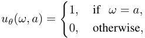

which means that there is only one “correct” action under each possible nature state, and these correct actions generate one unit utility to the buyer. Figure 2 shows the average revenue extracted from each buyer under three different prior distributions. We can observe that for all the cases, _MGeneral_ always generates higher revenue than _MPractical_ and Fully Revealing, and nearly approaches the revenue Upper Bound. For Gaussian distributions, as the size _n_ of sample space increases, buyer prior distributions are more dispersed over different possible nature states, indicating they are less certain about the true nature state. In this sense, buyers’ prior expected utilities _u_ ( _θ_ ) are generally low, and data from the seller can bring high valuation to them. _MGeneral_ makes use of buyers’ uncertainty and almost extracts full surplus when _n_ is relatively large. When _n_ = 12, _MGeneral_ achieves 99 _._ 91% revenue of Upper Bound. For uniform distributions, _MGeneral_ extracts full surplus from buyers as Upper Bound does, because uniform estimations indicate that buyers have no prior knowledge of the true nature state. When _n_ = 12, _MGeneral_ outperforms _MPractical_ and Fully Revealing by 28 _._ 50% and 54 _._ 21%, respectively. For Pareto distributions, the revenue for all mechanisms are lower compared with the other two distributions, because buyers have more confident prior estimations, and their prior expected utilities _u_ ( _θ_ ) are already high. In this case, it is hard to extract high revenue by providing data to the buyer, but _MGeneral_ still generates 73 _._ 56% revenue of the very optimistic Upper Bound when _n_ = 12. Under all three distributions, the revenue of our 

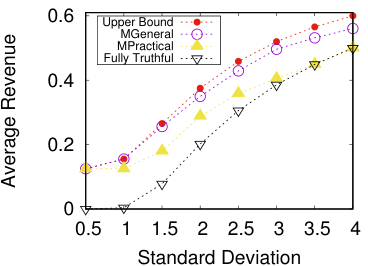

<!-- Start of picture text -->
 0.6 Upper Bound MGeneral MPractical Fully Truthful  0.4  0.2  0  0.5  1  1.5  2  2.5  3  3.5  4 Standard Deviation Average Revenue <!-- End of picture text -->

Fig. 4. Revenue under different values of standard deviation for Gaussian distributions. 

mechanisms increase with _n_ . Since _n_ denotes the discretization level of data, we can conclude that the seller can extract higher revenue by selling fine-grained data. 

We then evaluate the impacts of the number of buyer types on the four mechanisms. We report the evaluation results in Figure 3, when the number of types _|_ Θ _|_ varies from 2 to 12 and the number of possible nature states _n_ is fixed at 4. As _|_ Θ _|_ increases, more types of buyers with heterogeneous prior estimations appear in the market, and their strategic behaviors raise more challenges to our pricing mechanisms. For Gaussian and uniform distributions, the average revenue of our mechanisms do not decrease as _|_ Θ _|_ grows. This indicates that our mechanisms are robust against more types of strategic buyers under these two distributions. For Pareto distributions, however, the average revenue of our mechanisms decrease with _|_ Θ _|_ . This is because buyers under Pareto distributions are confident about their prior estimations and have higher prior expected utilities before buying data from the seller. As more confident types of buyers join the market, seller’s average revenue from each buyer certainly decreases. 

We finally test the influence of the standard deviation _σ_ in Gaussian distributions. We are interested in this parameter because it denotes how confident the buyers are about their prior estimations. We vary _σ_ from 0 _._ 5 to 4 _._ 0, while fixing both _n_ and _|_ Θ _|_ to be 4. As we can see in Figure 4, _MGeneral_ still outperforms other mechanisms, and achieves 93 _._ 40% revenue of Upper Bound when _σ_ = 4 _._ 0. The average revenue of all mechanisms increase with _σ_ , because when buyers are uncertain about the nature state, the data from the seller can bring high utility increments to them. Therefore, we can conclude that when buyers are not confident about their prior knowledge, the seller can take advantage of buyers’ uncertainty and extract higher revenue. 

## V. RELATED WORK 

In recent years, designing data pricing frameworks has attracted increasing interests in the database community. Balazinska _et al._ [21] first envisioned the emergence of cloudbased data markets, and outlined potential challenges and research opportunities. Following them, many query-based frameworks have been proposed to price ad-hoc query data. 

These frameworks allow the seller to manually assign prices to a few views, and automatically extrapolate the prices to other ad-hoc queries from the buyer. In [22], Koutris _et al._ first identified two key properties that a pricing function must satisfy, namely arbitrage-free and discount-free, and proposed a polynomial time algorithm that derives the price for common types of queries. Similar work include arbitrage-free pricing functions for arbitrary queries [11], and a scalable framework for pricing relational queries [23]. A set of accountable protocols named AccountTrade was proposed in [24] for big data trading among dishonest customers. These work assume that data has already been collected and structured before being priced, and their objective is not to maximize the revenue of the seller. 

Data marketplace has also been an active research topic in the community of Internet of Things. Perera _et al._ [7] surveyed smart city applications that can benefit from data markets. An IoT data transfer framework for cloud-based applications was proposed in [25]. The authors in [26] designed a decentralized infrastructure for IoT data trading based on blockchain technologies, but they did not elaborate on the pricing mechanisms. A two-sided market for crowdsensed data was proposed in [27], and secondary market models for mobile data were studied in [28]. In a recent paper, Zheng _et al._ [29] took advantage of the geographical locality of sensor data, and employed a versioning technique based on the accuracy of data. Our work differs from previous work by further revealing and utilizing the unique features of IoT data as a commodity. 

Information design is a rapidly growing research area in both computer science and economics literature. Different from providing incentives to participators in mechanism design problems, information design studies how to influence the belief of participators by providing payoff-relevant information to them through strategic interactions. A special yet influential case called Bayesian persuasion, concerning one information sender and one receiver, was studied in [30]. In a model similar to ours [31], Bergemann _et al._ investigated the problem where a buyer seeks supplemental information from the seller to facilitate her decision making. As they sought optimal solutions in the continuous space, they had to put strict restrictions on the model to maintain tractability. In another related work [17], Babaioff _et al._ considered the optimal mechanism for selling information sequentially. [32] and [33] provide excellent surveys of the information design literature. 

## VI. CONCLUSIONS 

In this paper, we have studied the problem of revenue maximization in IoT data markets. We have characterized the unique economic properties of IoT data, and proposed a market model accordingly from an information design perspective. We have presented our pricing mechanisms that achieve optimal revenue in different market settings. Evaluation results have shown that our mechanisms achieve good performance and approach the revenue upper bound. 

## REFERENCES 

- [2] “Xignite.” [Online]. Available: https://www.xignite.com/ 

- [3] “Here.” [Online]. Available: https://www.here.com/en 

- [4] “Iota.” [Online]. Available: https://www.iota.org/ 

- [5] “Ambient maps.” [Online]. Available: https://ambientmaps.co/ 

- [6] “Databroker dao.” [Online]. Available: https://databrokerdao.com/ 

- [7] C. Perera, A. Zaslavsky, P. Christen, and D. Georgakopoulos, “Sensing as a service model for smart cities supported by internet of things,” _Transactions on Emerging Telecommunications Technologies_ , vol. 25, no. 1, pp. 81–93, 2014. 

- [8] J. Gubbi, R. Buyya, S. Marusic, and M. Palaniswami, “Internet of things (iot): A vision, architectural elements, and future directions,” _Future generation computer systems_ , vol. 29, no. 7, pp. 1645–1660, 2013. 

- [9] Z. Liqiang, Y. Shouyi, L. Leibo, Z. Zhen, and W. Shaojun, “A crop monitoring system based on wireless sensor network,” _Procedia Environmental Sciences_ , vol. 11, pp. 558–565, 2011. 

- [10] P. Koutris, P. Upadhyaya, M. Balazinska, B. Howe, and D. Suciu, “Toward practical query pricing with querymarket,” in _SIGMOD_ , 2013. 

- [11] B.-R. Lin and D. Kifer, “On arbitrage-free pricing for general data queries,” in _VLDB_ , 2014. 

- [12] L. Toka, B. Lajtha, E. Hosszu, B. Formanek, D. G´ehberger, and J. Tapol-´ cai, “A resource-aware and time-critical iot framework,” in _INFOCOM_ , 2017. 

- [13] A. Kosba, A. Miller, E. Shi, Z. Wen, and C. Papamanthou, “Hawk: The blockchain model of cryptography and privacy-preserving smart contracts,” in _SP_ , 2016. 

- [14] W. Mao, Z. Zheng, and F. Wu, “Pricing for revenue maximization in iot data markets: An information design perspective,” 2019. [Online]. Available: https://drive.google.com/open? id=1ifmw8tIeZdXFXK0EwAHv5UGybNlDkc-W 

- [15] H. A. Simon, _Models of bounded rationality: Empirically grounded economic reason_ . MIT press, 1997, vol. 3. 

- [16] D. Bergemann, B. Brooks, and S. Morris, “The limits of price discrimination,” _American Economic Review_ , vol. 105, no. 3, pp. 921–57, 2015. 

- [17] M. Babaioff, R. Kleinberg, and R. Paes Leme, “Optimal mechanisms for selling information,” in _EC_ , 2012. 

- [18] “Dialogfeed.” [Online]. Available: https://www.dialogfeed.com/pricing/ 

- [19] “Gurobi.” [Online]. Available: http://www.gurobi.com/ 

- [20] “Ambient sound monitoring network.” [Online]. Available: https: //data.smartdublin.ie/dataset/ambient-sound-monitoring-network 

- [21] M. Balazinska, B. Howe, and D. Suciu, “Data markets in the cloud: An opportunity for the database community,” _VLDB_ , 2011. 

- [22] P. Koutris, P. Upadhyaya, M. Balazinska, B. Howe, and D. Suciu, “Query-based data pricing,” in _PODS_ , 2012. 

- [23] S. Deep and P. Koutris, “Qirana: A framework for scalable query pricing,” in _SIGMOD_ , 2017. 

- [24] T. Jung, X.-Y. Li, W. Huang, J. Qian, L. Chen, J. Han, J. Hou, and C. Su, “Accounttrade: Accountable protocols for big data trading against dishonest consumers,” in _INFOCOM_ , 2017. 

- [25] R. Montella, M. Ruggieri, and S. Kosta, “A fast, secure, reliable, and resilient data transfer framework for pervasive iot applications,” in _INFOCOM_ , 2018. 

- [26] P. Missier, S. Bajoudah, A. Capossele, A. Gaglione, and M. Nati, “Mind my value: a decentralized infrastructure for fair and trusted iot data trading,” in _IoT_ , 2017. 

- [27] Z. Zheng, Y. Peng, F. Wu, S. Tang, and G. Chen, “Trading data in the crowd: Profit-driven data acquisition for mobile crowdsensing,” _IEEE Journal on Selected Areas in Communications_ , vol. 35, no. 2, pp. 486– 501, 2017. 

- [28] L. Zheng, C. Joe-Wong, C. W. Tan, S. Ha, and M. Chiang, “Secondary markets for mobile data: Feasibility and benefits of traded data plans,” in _INFOCOM_ , 2015. 

- [29] Z. Zheng, Y. Peng, F. Wu, S. Tang, and G. Chen, “An online pricing mechanism for mobile crowdsensing data markets,” in _MobiHoc_ , 2017. 

- [30] E. Kamenica and M. Gentzkow, “Bayesian persuasion,” _American Economic Review_ , vol. 101, no. 6, pp. 2590–2615, 2011. 

- [31] D. Bergemann, A. Bonatti, and A. Smolin, “The design and price of information,” _American Economic Review_ , vol. 108, no. 1, pp. 1–48, 2018. 

- [32] D. Bergemann and S. Morris, “Information design: A unified perspective,” 2017. 

- [33] S. Dughmi, “Algorithmic information structure design: a survey,” _SIGecom Exchanges_ , vol. 15, no. 2, pp. 2–24, 2017. 

[1] “Gnip apis.” [Online]. Available: http://support.gnip.com/apis/ 

