# Online Data Valuation and Pricing for Machine Learning Tasks in Mobile Health 

Anran Xu, Zhenzhe Zheng`†` , Fan Wu, and Guihai Chen Shanghai Key Laboratory of Scalable Computing and Systems, Shanghai Jiao Tong University, China {xuanran, zhengzhenzhe}@sjtu.edu.cn, {fwu, gchen}@cs.sjtu.edu.cn 

Abstract—Mobile health (mHealth) applications, benefiting from mobile computing, have emerged rapidly in recent years, and generated a large volume of mHealth data. However, these valuable data are dispersed across isolated devices or organizations, which hinders discovering insights underlying the aggregated data. Considering the online characteristics of mHealth tasks, there is an urgent need for online data acquisition. In this paper, we present the first online data <u>Valuation And Pricing</u> mechanism, namely VAP, to incentive users to contribute mHealth data for machine learning (ML) tasks in mHealth systems. Under the framework of Bayesian ML, we propose a new metric based on the concept of entropy, to evaluate data valuation during model training in an online manner. In proportion to the data valuation, we then determine payments as compensations for users to contribute their data. We formulate this pricing problem as a contextual multi-armed bandit with the goal of profit maximization and propose a new algorithm based on the characteristics of pricing. We also extend VAP to general ML models. Finally, we have evaluated VAP on two real-world mHealth data sets. Evaluation results show that VAP outperforms the stateof-the-art valuation and pricing mechanisms in terms of computational complexity and extracted profit. 

Index Terms—Data Valuation, Mobile Health, Online Pricing 

## I. Introduction 

Mobile health (mHealth) technologies offer real-time monitoring for health status, facilitate rapid diagnosis of health conditions, and provide remote healthcare services [1]. The recent developments towards intelligent mHealth systems, such as Apple Health [2], Google Fit [3], Microsoft Health [4] are pieces of evidence of these trends [5]. Various machine learning (ML) models have been developed to extract information underlying mHealth data. However, the obstacle to the wide adoption of ML in mHealth applications comes from model uncertainty [6], which would provide unreliable prediction and is unacceptable in health applications [7]. One potential approach to eliminate this dilemma is to collect large mHealth data from users as training data, harnessing the wisdom of crowd [8]. 

This work was supported in part by National Key RD Program of China No. 2020YFB1707900, in part by China NSF grant No. 62025204, 62072303, 61972252, 61902248, and 61972254, in part by Alibaba Group through Alibaba Innovation Research Program, in part by Shanghai Science and Technology fund 20PJ1407900, and in part by Tencent Rhino Bird Key Research Project. The opinions, findings, conclusions, and recommendations expressed in this paper are those of the authors and do not necessarily reflect the views of the funding agencies or the government. 

> †Zhenzhe Zheng is the corresponding author. 

The valuable mHealth data are dispersed across isolated devices and have not been exploited efficiently in machine learning tasks. Users are reluctant to voluntarily share their personal health data due to the potential incurred costs and privacy concerns [9]. Therefore, it is highly necessary to design an incentive mechanism to stimulate users to contribute their mHealth data. For incentive mechanism design in mHealth, we need to take the online characteristics of the data acquisition into account. First, the sensing data collected by mHealth can be obtained remotely in a streaming manner, which is often used for real-time predictive modeling [10]. Second, within the changing mHealth contexts, traditional static mHealth models may fail to respond with a correct prediction result. For example, people may carry out the same activity in a different manner, or suffer from the same disease with various clinical symptoms [11]. Furthermore, population demographics, the prevalence of the disease, and the clinical practice may also evolve over time. This implies that predictions based on static data and models can become outdated and hence no longer accurate [12]. Last, the users’ participation in the data acquisition process is dynamic. For example, in disease detection, the symptoms appear at an unpredictable time. To address these dynamics, many variants of online learning and incremental learning models are proposed [11]–[14]. With these methods, the mHealth models could update over time as new data is collected, and adapt quickly to new contexts. 

There are two critical components in designing an incentive mechanism: data valuation and pricing. The data valuation scheme quantifies the contribution of data within the context of ML model training. Based on this data valuation metric, the pricing mechanism determines the compensation to users for their contributed data. We next summarize two major challenges for data valuation and pricing, arising from the online characteristics of the data acquisition process in mHealth. 

The first challenge is to evaluate the contribution of newly arrived data in ML model training. The traditional data valuation schemes [15]–[19], built upon the concept of Shapley value from cooperative game theory [20], are not suitable for such an online learning situation. In these methods, all the data are collected in advance for model training, and the data contribution is evaluated at the end of model training. In contrast, we need to measure the data valuation in an online manner, based on the currently collected data, 

978-1-6654-5822-1/22/$31.00 ©2022 IEEE 850 Authorized licensed use limited to: Shanghai Jiaotong University. Downloaded on December 16,2022 at 06:25:48 UTC from IEEE Xplore.  Restrictions apply. 

instead of the complete training data set. However, it is difficult to infer the data valuation at the intermediate model training without the global knowledge of the whole data set. Moreover, considering the privacy considerations in mHealth, compared to submitting complete data, it is more proper that users only upload part of the data to query the price. Therefore, the data valuation module should have the ability to estimate the data contribution based on incomplete data. 

The second challenge is on designing profit-maximizing data pricing mechanisms with incomplete information. Some auction-based mechanisms have been proposed for data pricing [15], [21], [22]. However, the bidding model in the auction is unnecessarily complicated to data pricing, as users may often be reluctant to provide the minimum willing payment about their data, or even do not know the exact value of this information. To this end, we turn to the posted pricing mechanism [23], where the service provider posts a public price, and the users only need to determine whether to accept the price and contribute the data. Nevertheless, the posted pricing mechanism introduces a heavy burden on the service provider. There is an information asymmetry over the minimum payment to data between the users and the service provider. Users’ arrival sequences are also unknown to the service provider. Without the complete information about the payment to data, it is hard for the service provider to set an appropriate price. A price that is too high or too low would cause a loss of profit. The optimization on profit maximization needs to take both the revenue extracted from data valuation and the expenditure for data acquisition into account, which inevitably doubles the difficulty in the design of data pricing mechanisms. 

In this paper, jointly considering the above challenges, we propose the first online data valuation and pricing mechanism for ML tasks in mHealth, namely VAP. We summarize our contributions as follows. 

• First, under the Bayesian perspective, we propose the first online metric of data valuation, which is related to the impact of data on the ML model training process, and is quantified by the entropy of the distributions over model parameters. This new metric enables us to evaluate the data valuation in an online manner and not need to collect the whole dataset. 

• Second, we propose an online data pricing mechanism based on the evaluated data valuation and the willing payments from users. We model the payment determination process as a contextual multi-armed bandit with the goal of profit maximization, and propose a new method for data pricing under this framework. We conduct an exploitation and exploration process to discover the optimal data prices by collecting the responses from users over different prices. 

• Finally, we evaluate the performance of VAP with realworld mHealth data sets. The evaluation results show that our VAP outperforms the state-of-the-art data valuation and pricing methods for online ML tasks in mHealth systems in terms of online calculation and extracted profit. 

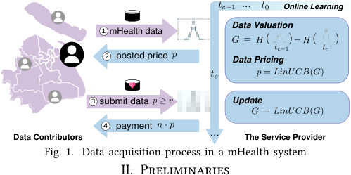

<!-- Start of picture text -->
Online Learning Data Valuation 1 mHealth data 2 posted price Data Pricing 3 submit data Update 4 payment Data Contributors The Service Provider Fig. 1. Data acquisition process in a mHealth system II. Preliminaries <!-- End of picture text -->

We consider the data acquisition process for the mHealth system in an adaptive way, as shown in Figure 1. There are two types of participants involved in a mHealth system: data contributors and a service provider. The service provider trains online ML models upon the collected data from data contributors to provide healthcare services. Due to the limited amount of data and the fading freshness of historical data, the ML models’ performance would decay over time. The service provider needs to acquire new mHealth data periodically to retrain the ML models. A specific data acquisition process is conducted as follows. At the time tc, first, a data contributor arrive at the time slot tc, and query the price of her data by submitting the training data **x** without the label y, where the feature **x** would help the service provider to evaluate the data valuation, and not releasing the label y would preserve the content of data before the data exchange. Second, the service provider evaluates the data based on its contribution to ML model training, calculated by the performance improvement between the current model and the expected model after the data is added. Based on the data valuation, the service provider posts the price determined by the data pricing mechanism to the data contributor as incentives. Third, if the data contributors are satisfied with the price, she would contribute the complete training data ( **x** , y). Otherwise, she has no incentives to do so. Having received the data from multiple data contributors, the service provider would update the ML model, data valuation metric, and data pricing mechanism. Finally, the service provider gives the corresponding payment to the data contributor. We need to design an appropriate data valuation metric and a data pricing mechanism to quantify the performance improvement for model training, and make a trade-off between the performance and data acquisition expenditure. 

We present a system model to describe the above data acquisition process. Each data contributor owns a set of private mHealth training data, each of which is a pair of a feature and the corresponding label, denoted by d = ( **x** , y). We use G **X** ( **x** ) to denote the contribution of a new data sample d = ( **x** , y) to the model training. We consider each data contributor has a reserve value v to her data set, which indicates the minimum willing price the data contributor would like to share her data. Similar to the previous work [21], all data contributors’ reserve values follow an independent and identical distribution with probability 

851 Authorized licensed use limited to: Shanghai Jiaotong University. Downloaded on December 16,2022 at 06:25:48 UTC from IEEE Xplore.  Restrictions apply. 

density function f (v) over the range [0, 1]. Different from the classical Bayesian mechanism design [24], the probability density function is unknown to the service provider and needs to be learned from the interaction with data contributors. When one data contributor arrives at the online platform, the service provider posts an unit price p for purchasing each piece of data. If the data contributor accepts the offered price (i.e. p ≥ v), she would upload her data and get the corresponding payment; otherwise (0 ≤ p < v), she would leave without contributing her data. The goal of the data pricing mechanism is to determine the posted price p at each time slot to maximize the total profit, which will be defined in Section IV later. 

## III. Data Valuation 

## A. A Simple Case: Bayesian Linear Regression 

To illustrate the idea of data valuation, we first consider a basic model in ML, linear regression [25] under Bayesian framework. In mHealth, linear regression models are widely used in heart rate monitoring [14], blood pressure monitoring [26], mental illness detection [27], and etc. More specifically, we use the ridge regression model as an example in this subsection and extend the concept of data valuation to more complex models such as Gaussian Process (GP) [28] and Bayesian Neural Networks (BNN) [29] later. 

Ridge regression can be explained under a Bayesian framework as a type of Bayesian Linear Regression, in which maximizing the parameter’s posterior probability by Bayesian formula is the same as minimizing the loss function in the traditional frequentist view. Without loss of generality, we assume the prior probability of the parameters in ridge regression satisfy Gaussian distribution, i.e. P ( **β** ) ∼N �0, ℓ2 I� with precision parameter (variance) ℓ2 . The training process of ridge regression is to use new data to obtain posterior parameter distribution. Thus, the Bayesian framework provides a new perspective to interpret the model training process: the change of posterior parameter distribution can represent the evolution of the model training process to some extent. To calculate this change, we first express the posterior probability of the model parameter **β** from the Bayesian theorem: 

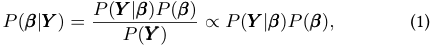

where **Y** is the corresponding label of the data set ( **X** , **Y** ), and P ( **Y** | **β** ) is the generation probability of **Y** under the parameter **β** , and follow the Gaussian distribution. As the product of two Gaussian distributions P ( **Y** | **β** )P ( **β** ) is still Gaussian, the posterior parameter distribution P ( **β** | **Y** ) follows a Gaussian distribution. We denote the corresponding mean as **β****¯** , and the variance as Σ. In this Gaussian distribution, the exponential power should be equal, so that 

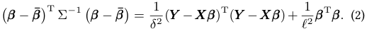

Deriving from Equation (2), we can get P ( **β** | **Y** ) follows a Gaussian distribution with the mean and the variance of 

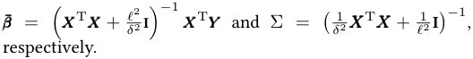

We regard the data’s contribution as how much information the data provides to the model training process. We use the metric of differential entropy [30] of parameter’s distribution, a concept from information theory, to measure the information contained underlying the corresponding model. When a new data sample is added to the training set, the parameter distribution is shrinking, implying the reduction of the model parameters’ uncertainty. We quantify this uncertainty reduction as the differential entropy of the prior parameter distribution and posterior parameter distribution, and use the extent of this reduction to measure the contribution of a data sample to the model training. The differential entropy of a Gaussian distribution is defined as: H( **β** ) = 21ln [(2πe)n[Σ]],whichisonlyrelatedtothe variance Σ. We denote the differential entropy of parameter distribution H( **β** | **Y** ) on the data set ( **X** , **Y** ) as H( **X** ), then the differential entropy of parameter distribution with the training data set ( **X** , **Y** ) can be calculated by: 

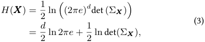

After adding new data sample ( **x** , y), the differential entropy is updated to 

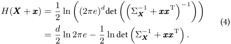

The posterior entropy reduction of the model is 

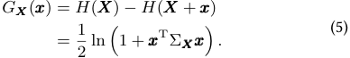

Definition 1. The posterior parameter distribution entropy reduction of the model by adding the data ( **x** , y) on data set ( **X** , **Y** ) is measured by G **X** ( **x** ) = 2<u>1</u>ln �1 + **x**T Σ **Xx** �. 

## B. Properties of Data Valuation Metric 

Compared with traditional data valuation methods in ML such as Shapley value [15]–[19], VAP-Valuation has the following characteristics: 

1) Submodular: For any data sets S, T s.t. S ⊆T we define the set U = T −S. We use **U** , **T** , **S** to denote the features of data in U , T , S: 

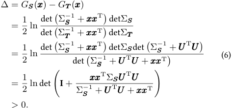

852 Authorized licensed use limited to: Shanghai Jiaotong University. Downloaded on December 16,2022 at 06:25:48 UTC from IEEE Xplore.  Restrictions apply. 

Thus, we can get G **S** ( **x** ) > G **T** ( **x** ), which means the data valuation function G **X** ( **x** ) we proposed in VAP is submodular. A more intuitive understanding is the diminishing marginal contribution of the data, which means that for the same data, the earlier the data contributor submits, the higher the contribution generates. 

2) Additivity: For a collection of data sets submitted by a data contributor within a certain period, the total contribution of all the data (i.e., the total entropy reduction of the model parameter distribution) is the sum of the individual contribution of each data set. It is unrelated to the internal order of the data sets. That is, the data valuation metric is a set function: Owning ( **X** , **Y** ), for any new data set S, using G(S) to denote the data valuation of data set S, calculated by the features **S** of data in S, it is a fixed value: 

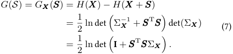

More specifically, G(S) =� si∈SG�i j− =11**s**j(**s**i)regardless the position of si in S, though the specific value of G� ji−=11**s**j(**s**i)changesunderdifferentorderofdatasets. 

3) Group Rationality: The valuation of the entire dataset I is completely distributed among all data contributors, i.e. G(I) =� i∈IG(i), which is easily derived by the additivity. 

4) Online Fairness: Two data which are identical in what they contribute to the model have the same valuation in an online manner. That is, for any data s and s′ are equivalent in the sense that G(S ∪{s}) = G(S ∪{s′ }), ∀S ⊆I\{s, s′ }, then GS (si) = GS (sj). Meanwhile, data with zero marginal contribution to the model has zero valuation, i.e., if G(S ∪ {s}) = G(S}, then GS ( **S** ) = 0, where **S** is the features of s. Actually, because the variance of parameter distribution is non-negative, if a data has zero valuation, it means the variance is zero, then Gaussian function becomes a Dirac delta function, in which **β** only has one possible value. 

5) Inferrability: According to the Definition 1, in VAPValuation, each data’s valuation can be calculated only depending on the data features **x** , without using the data label y, which can preserve the content of the data before data exchange. 

## IV. Data Pricing 

## A. Profit Maximization Mechanism 

In this section, we present a posted pricing mechanism to maximize the service provider’s profit in an online manner. According to Definition 1, G **X** ( **x** ) denote the contribution that one piece of data **X** brings to the performance improvement of model training, from which the service provider can extract the profit. The profit that the service provider obtains from one data contributor with a reserve value v is: 

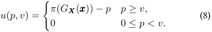

where p is the unit price of each data and π(G **X** ( **x** )) is the revenue extracted from data valuation. We use F (p) = �0pf(v)dvtodenotetheprobabilitythatadatacontributor accepts the data price p. Thus, given the distribution of the reserve value v and the price p, the expected profit extracted from n data contributors can be written as: 

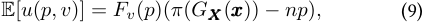

Specifically, by the additivity of data valuation metric in Section III-B2, we can get G(S + T ) = G(S) + G(T ). To make the pricing mechanism extend the additivity, i.e. π(G(S + T )) = π(G(S)) + π(G(T )), it is easy to prove by Cauchy’s equation [31] that π(·) should be the linear function. In this paper we set π(G **X** ( **x** )) = k · G **X** ( **x** ) − ϵ, where k can uniform the magnitude and ϵ can control the trade-off between total entropy reduction and the total budget, which we will show in the evaluation part. 

As we do not know the value distribution, we tackle the above pricing optimization problem by exploiting the exploration and exploitation technique from bandit literature [32]. At each time slot t ∈{1, 2, · · · , T }, a new data contributor with a value vt arrives. The service provider chooses a posted price from the set of candidate prices P ≜ �pi | pi = Ki, i = 1, · · ·, K � as the traditional setting in [33]. We regard each price pi ∈ P as an arm. The classical method UCB1 algorithm [34] estimates the unknown expected reward of each arm by making a linear combination of previously observed rewards of the arm. However, in our problem, the reward distribution behind each candidate price (arm) is not fixed, which is also determined by the data valuation provided by the data contributor. Thus, we cannot directly use UCB1 to solve our online pricing problem. We see the data valuation as a type of context associated with each arm. The pricing problem can be formulated as a contextual bandit problem [35]. To solve it, firstly, we rewrite the profit function as: 

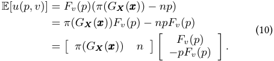

At time slot t, we define Πt = (π(Gt), nt)T as the features of the context, where Gt denotes the total contribution of the arriving data set and nt is the amount of data. Then the expected reward of arm pi can be expressed as: 

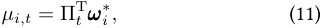

where **ω**∗ i≜(Fv (pi) , −piFv (pi))Trepresentstheunknown coefficient vector. To post the reasonable price, that is, to select the best arm of each round, the service provider needs to estimate the expected rewards in Equation (11) of arms accurately. As for now, the service provider can quickly get Πt based on the data valuation metric. Then we should learn **ω** i of each arm, which can be explained as learning the data contributors’ reserve value distribution implicitly. In this way, we regard features of the context as independent variables, 

853 

Authorized licensed use limited to: Shanghai Jiaotong University. Downloaded on December 16,2022 at 06:25:48 UTC from IEEE Xplore.  Restrictions apply. 

and the expected reward is the dependent variable. Therefore, we can treat the observed context-reward pairs as training samples and train a regression model for each arm. 

However, different to the traditional setting in the LinUCB [35] to solve the contextual MAB problem, in our problem, pricing here, the information from each choice of one arm (i.e. one possible posted price) not only affects the current arm but can also be used as training inputs for other arms. That is when one data contributor rejects the current price pi, which means 0 ≤ pi < v, she would also reject the price p when p < pi. Similarly, when one data contributor accepts the current price pi, which means pi ≥ v, she would also accept the price p when p > pi. Thus, in this paper, we define **M** i be a design matrix of dimension ji∗×2 at time slot t, whose rows correspond to ji∗= ji +jl +jstraining inputs, where ji is the data offered price pi, jl is the data offered p > pi and the data contributor rejects the price p, js is the data offered p < pi and the data contributor accepts the price p. And ci be the corresponding response vector (i.e., rewards corresponding to these contexts). With more training data, applying ridge regression to the new training data ( **M** i, **c** i), we can have a better estimate of the coefficients: 

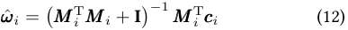

where I is the 2 × 2 identity matrix. Algorithm 1 gives a detailed description of the entire LinUCB algorithm for pricing, in which **A** i = **M**T i**M**i + Iand**b**i=**M**T i**c**i.Itcanbe shown that with probability at least 1 − γ: 

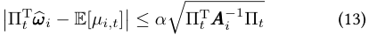

for any γ > 0, where α = 1 + �ln(2/γ)/2 is a constant. The inequality gives a reasonably tight UCB for the expected reward of arm pIt , from which a UCB type armselection strategy can be derived: at each time slot t, choose It = iargmax=1,··· ,K �ΠT t**ω**�i+ α ~~�~~ ΠT t**A**− i1Πt <u>�.</u> The criterion for arm selection can also be regarded as an additive tradeoff between the reward estimate and model uncertainty reduction. 

Moreover, as we mentioned, the system is an online learning algorithm so that the service provider can acquire data with different attitudes. A suitable π(·) can control the tradeoff between the data collection scale and the total budget. 

## B. Properties of Data Pricing Mechanism 

The data pricing mechanism we proposed in VAP has the following characteristics: 

1) Incentive Mechanism: Our pricing mechanism motivates data contributors to submit data as early as possible because the data valuation function G **X** ( **x** ) is submodular. Specifically, in VAP, earlier data contributors will have a more data contribution and get more profit, implying that we encourage data contributors to submit data as soon as possible in the online data collection process. 

2) Robust to Strategic Behaviors: To guarantee the property of symmetry, Shapley value leaves possibility for selfish data 

## Algorithm 1: VAP-Pricing 

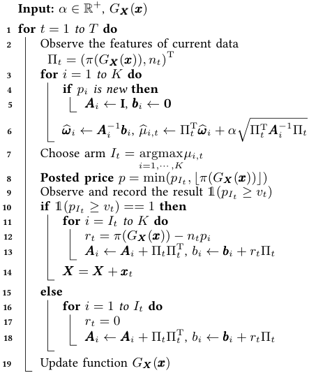

contributors to carry out strategic behaviors, such as copying data, and gain extra benefits. There are some solutions to solve this issue, such as discounting the value of the same data [15], but it will break the property of fairness in Shapley value. However, VAP can naturally discount similar data’s valuation, as the later data will not impact the model too much due to the submodularity of VAP-Valuation, guaranteeing the fairness to some extent. 

3) Arbitrage-Freeness: Due to the additivity of VAPValuation, regardless of the data order in a data set, the sum of the data valuation for a data xset is the same, resulting in the identical posted price. Suppose the data contributor divides a data set into several subsets, and submit it in several times. In this case, she would not get a higher payment than submit the data set as a whole. We denote E1 as the expected profit of the service provider if the data contributor chooses to divide the data set, and E2 as the expected profit under the whole data set: 

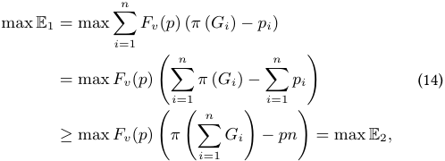

where Gi = G **X** ( **x** i). It is easy to prove that E1 ≥ E2, while�n i=1π (Gi)=π (�n i=1Gi),sothat�n i=1pi≤pn, which means data contributors can not get more payment by splitting the data set and submitting them separately (ignore the change of Fv(p) at each time slot). 

854 Authorized licensed use limited to: Shanghai Jiaotong University. Downloaded on December 16,2022 at 06:25:48 UTC from IEEE Xplore.  Restrictions apply. 

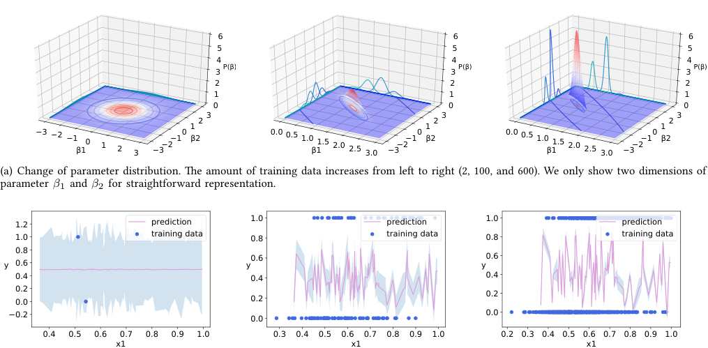

<!-- Start of picture text -->
6 6 6 5 5 5 4 4 4 3 P(β) 3 P(β) 3 P(β) 2 2 2 1 1 1 0 0 0 3 3 3 2 2 2 1 1 1 −3 −2 −1β10 1 2 3 −3−2−10 β2 0.0 0.5 1.0β11.5 2.0 2.5 3.0 −3−2−10 β2 0.0 0.5 1.0β11.5 2.0 2.5 3.0 −3−2−10 β2 (a) Change of parameter distribution. The amount of training data increases from left to right (2, 100, and 600). We only show two dimensions of parameter β1 and β2 for straightforward representation. 1.2 prediction 1.0 prediction 1.0 prediction 1.0 training data 0.8 training data 0.8 training data 0.8 0.6 0.6 y 0.6 y y 0.4 0.4 0.4 0.2 0.2 0.0 0.2 −0.2 0.0 0.0 0.4 0.5 0.6 0.7 0.8 0.9 1.0 0.3 0.4 0.5 0.6 0.7 0.8 0.9 1.0 0.2 0.3 0.4 0.5 0.6 0.7 0.8 0.9 1.0 x1 x1 x1 <!-- End of picture text -->

(b) Change of prediction uncertainty. The amount of training data increases from left to right (2, 100, and 600). x1 is one of the features of training data, and y is the corresponding label. The pink line is the prediction of the current model, and the blue shaded area is the corresponding prediction uncertainty. 

Fig. 2. Model Changes during data addition 

4) Data Privacy Preserving for mHealth: Model uncertainty and privacy are important in medical decisions. Under our data valuation and pricing framework, the data we allocate higher price can largely reduce the model uncertainty. Furthermore, using the function π(·), the service provider can control the trade-off between the scale of data collection and the total budget. Moreover, the label yi is not involved in the data valuation and pricing processes, reducing the risk of privacy leakage. Moreover, in the data collection process, the data contributors have the right to decide whether the data is used for model training under the VAP framework. 

## V. Extensions to General Models 

In this section, we extend VAP to more complicated ML models. In Bayesian linear regression, we can easily calculate the posterior parameter distribution. However, in other more complicated ML models, parameter spaces are often high dimensional, and computing their entropies is usually intractable. Furthermore, for non-parametric processes, the parameter space is infinite-dimensional, so the VAP-Valuation becomes poorly calculated. 

To solve this problem, we range the objective from computing uncertainty in parameter space to y space to avoid gridding parameter space (exponentially hard with dimensionality). In the prediction space, for a new set of features **x** ˜ to be predicted, the predictive distribution takes the form P (y| **x** ˜, **β** ) = N � **x** ˜| **β** T **x** ˜, σN2(˜**x**) �, where the variance σN2(˜**x**) of the predictive distribution is given by 

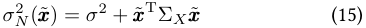

The first term represents the noise, whereas the second term can reflect the uncertainty associated with the parameter **β** . 

Figure 2 shows the comparison of parameter probability density distribution and prediction uncertainty. We can easily find that they have the same shrinking trend as adding more training data. The model’s grasp of the parameter is getting higher, implying the model uncertainty and prediction uncertainty reduction. Thus, the data valuation we obtained can be regarded as a measure of uncertainty. The difference is that Equation (15) calculates the predictive distribution variance in the prediction task, the aim of which is to get the uncertainty in the current test data to judge the credibility of a prediction. However, the Equation (5) calculates the posterior distribution entropy reduction of parameter **β** caused by new data from the training data set. The aim is to get the model uncertainty changes caused by current training data to measure each data’s contribution. 

Thus, we can calculate entropy in low dimensional output space using the idea of prediction uncertainty. For new data, d = ( **x** , y), we calculate its contribution by regarding **x** as the features of the prediction task to calculate its prediction uncertainty. Specifically, for a representative nonparametric model, we write GPR as **y** = f ( **x** ) + **ε** with the unknown function f follows a N (µ, k) and **ε** follows a N (0, δ2 I) [28]. Different from parameter **β** in range regression, there is no specific parameters in f . Thus, GPR is a non-parametric model. Consider the current purchased data set D = {di}n i=1containingndatawithdi=(**x**i, yi), [f ( **x** 1) , f ( **x** 2) , . . . , f ( **x** n)]T ∼N ( **µ** , K), where **µ** is the mean vector and **K** is the n × n covariance matrix, **K** ij = k ( **x** i, **x** j). To make a prediction of new data sample **x** by the current model, the predictive distribution is: 

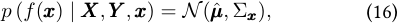

855 Authorized licensed use limited to: Shanghai Jiaotong University. Downloaded on December 16,2022 at 06:25:48 UTC from IEEE Xplore.  Restrictions apply. 

where the predictive distribution variance is: 

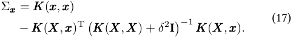

Then, similar to the Equation (5), the valuation function in GPR can be set as 

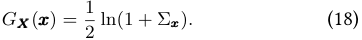

Moreover, for the complex parametric model, neural network, similar to the Bayesian linear regression, we can put a prior distribution over its weights, such as a Gaussian prior distribution: **W** ∼N (0, I). Such a model is referred to as a Bayesian neural network (BNN) [36]. For each new data x, we can obtain the corresponding predictive distribution uncertainty using the BNN uncertainty [6]. Firstly, we optimize the parameters of the simple distribution instead of optimizing the original neural network’s parameters in BNN, where the posterior p( **W** | **X** , **Y** ) is fitted with a simple distribution q **θ**∗(**W**), parameterized by**θ**. Then by the Dropout in BNN, which can be interpreted as a variational Bayesian approximation, epistemic uncertainty can be measured. For classification, the model prediction can be approximated using Monte Carlo integration as follows: 

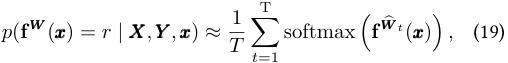

with T sampled masked model weights **W**� t ∼ q **θ**∗(**W**), where q **θ** ( **W** ) is the Dropout distribution [6]. Then the valuation function can be calculated by: 

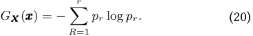

For regression, the predictions in this epistemic model done by approximating the predictive mean: 

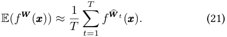

The prediction epistemic uncertainty is captured by the predictive variance, which can be approximated as: 

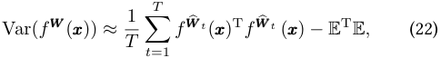

Similarly, the valuation function can be calculated by: 

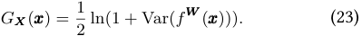

Thus, we can extend the VAP for various online ML models, as long as they can calculate prediction uncertainty, such as GPR and the model under the Bayesian framework. More intuitively, rather than collecting data for significantly reducing the parameter distribution’s differential entropy, we marginally seek the data for which the model is most uncertain about the predictions. If there is a higher degree of uncertainty about the prediction of arriving data, we do not have enough data whose features are similar to its features, so we have less confidence in it. So when we add this data to our training data set, it will significantly 

reduce the model uncertainty in this data region. Thus, such data will contribute more to the model, leading to more entropy reduction of parameter distribution, and the service provider would like to post a higher price for it. In addition to online learning models, VAP-Valuation can be used in some other domains to guide the data collection process. For example, in domains such as active learning [37] and Bayesian reinforcement learning [38], where the model should have the ability to identify the most valuable data for model training and add it to the training set. 

## VI. Evaluation Results 

In this section, we evaluate our VAP through extensive experiments on real-world human behavior indicators data, which can be involved in mHealth. 

## A. Evaluation Setup 

We present the evaluation results based on two real-world human behavior data sets: 1) ) Human Activity Recognition (HAR) database [39], a data set built from the recordings of 30 data contributors performing daily living activities while carrying a waist-mounted smartphone with embedded inertial sensors. 2) Pima Indians Diabetes (PID) [40], a data set to diagnostically predict whether a patient has diabetes, based on specific diagnostic measurements included in the data set. 

## B. Results of Data Valuation 

1) VAP on Different Models and Tasks: We evaluate the performance of VAP-Valuation. Figure 3 shows that VAPValuation is a proper model value evaluation metric leading to smaller model uncertainty and higher model accuracy. First, as for RC, in Figure 3(a) and Figure 3(d), the general trend in total entropy reduction and prediction accuracy boost is consistent, which means the goals of data collection and model optimization are consistent under VAP. Meanwhile, in Figure 3(b) and Figure 3(e), by observing that the model accuracy increases slowly with the decrease of VAPValuation, and that the turning points of them are close (for about 20 in Figure 3(a) and 500 in Figure 3(c), we can conclude that the VAP is able to judge the proper scale of the data collection. That is to say, after collecting such an amount of data, the valuation of the new data is relatively small, and the accuracy of the model is relatively stabilized. 

As for GPC and BNN, using the VAP-Valuation in Section V, we value the data on the outcome space. As the PID is a smaller data set, we adopt the GPC model to it. Meanwhile, HAR is a more extensive data set, which is more suitable for training with the BNN model. In Figure 3(c) and Figure 3(f), we can get a similar result with the RC model. By adding a new data sample, the model uncertainty is smaller, leading each data’s contribution to the model more negligible, and the model accuracy is increasing. Also, the turning points of them are close, for about 20 in Figure 3(c) and 1000 in Figure 3(f). Moreover, from all the results in these three models, we can notice that the contribution of each data point shows the 

856 Authorized licensed use limited to: Shanghai Jiaotong University. Downloaded on December 16,2022 at 06:25:48 UTC from IEEE Xplore.  Restrictions apply. 

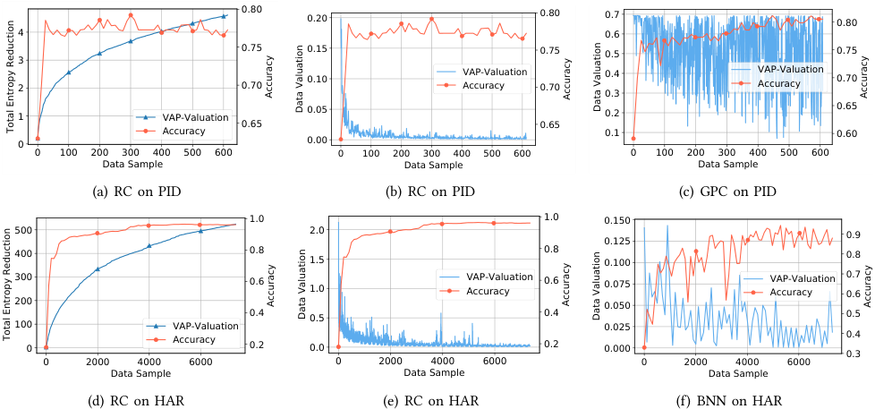

<!-- Start of picture text -->
0.80 0.20 0.80 0.7 0.80 4 0.6 0.75 0.15 0.75 0.5 0.75 3 2 0.70 0.10 VAP-ValuationAccuracy 0.70 0.40.3 VAPAccuracy-Valuation 0.70 1 VAP-Valuation 0.05 0.2 0.65 0.65 0.65 Accuracy 0.1 0.60 0 0.00 0 100 200 300 400 500 600 0 100 200 300 400 500 600 0 100 200 300 400 500 600 Data Sample Data Sample Data Sample (a) RC on PID (b) RC on PID (c) GPC on PID 1.0 1.0 0.150 500 2.0 0.9 0.125 400 0.8 1.5 0.8 0.100 0.8 300 0.6 1.0 VAP-Valuation Accuracy 0.6 0.075 VAPAccuracy-Valuation 0.70.6 200 0.050 0.4 0.5 0.4 0.5 100 VAP-Valuation 0.025 0.4 0 Accuracy 0.2 0.0 0.2 0.000 0.3 0 2000 4000 6000 0 2000 4000 6000 0 2000 4000 6000 Data Sample Data Sample Data Sample (d) RC on HAR (e) RC on HAR (f) BNN on HAR Accuracy Accuracy Accuracy Data Valuation Data Valuation Total Entropy Reduction Accuracy Accuracy Accuracy Data Valuation Data Valuation Total Entropy Reduction <!-- End of picture text -->

Fig. 3. VAP-Valuation on different models(Ridge classification (RC), Gaussian process classification (GPC)) and Tasks (HAR and PID Database) 

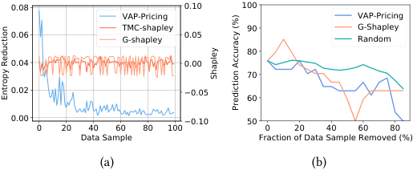

<!-- Start of picture text -->
0.08 0.10 100 VAP-Pricing VAP-Pricing TMC-shapley 90 G-Shapley 0.06 G-shapley 0.05 Random 80 0.04 0.00 70 0.02 −0.05 60 0.00 −0.10 50 0 20 40 60 80 100 0 20 40 60 80 Data Sample Fraction of Data Sample Removed (%) (a) (b) Shapley Entropy Reduction Prediction Accuracy (%) <!-- End of picture text -->

Fig. 4. Performance of different data valuation metrics. (a) Comparison of the valuation of the first 100 PID data; (b) The effect of removing highvaluation data points under different data valuation metrics. 

characteristic of diminishing marginal, which is consistent with the properties we described in Section III-B1. Valuation on the outcome space (Figure 3(c) and Figure 3(f)) will range larger than the valuation on the parameter space. We can also notice some prominent high points in VAP-Valuation. Such data points may be the data points of new distributions in the system that have not been acquired before. 

2) Performance of Different Data Valuation Metrics: We compare our method with other static data valuation metrics for machine learning, including TMC-Shapley [17], G- Shapley [17] and Random (one possible online metric) in Figure 4. Compared with other methods, VAP-Valuation is more suitable for online learning for the following reasons. First, as figure 4(a) shows, the VAP-Valuation shows many excellent characteristics for data pricing and collection. It has a significant downward trend as the gradual increase of data over time considers the arrival order, which can incentive an earlier data submission. Besides, we can see that VAP-Valuation is always strictly positive, which provides convenience for data pricing. Moreover, Shapley value and its variants are common practices in data valuation for the ML field, so here we emphasize why VAP outperforms Shapley in online learning tasks. Compared to the Shapley value, VAP- 

Valuation can perform online calculations without corresponding label and testing data according to the inferrability of VAP-Valuation we mentioned in III-B5. Simultaneously, the computational complexity will increase significantly with the larger scale of the data set in static Shapely value. Although there are some approximate calculation methods such as TMC-Shapley [17], it still requires a lot of test data and high computational cost, which is impossible and inappropriate to achieve in a real-world mHealth system. G- Shapley, an approximation of TMC-Shapley, can be adapted to online learning. The marginal contribution in G-Shapley is the change of the model’s performance. However, as shown in Figure 4(a), we can find the G-Shapley does not achieve a good approximation of TMC-Shapley, because the calculation result can be affected by various factors, the size of the test set, learning rate, haphazard, etc. Finally, We can see that VAP-Valuation consistently outperforms the other two mechanisms as illustrated in Figure 4(b), as it shows a better decrease over time than others as removing high-valuation data points. Thus, VAP-Valuation is more suitable for online learning tasks. 

## C. Results of Data Pricing 

First, we compare the performance of different data pricing mechanisms: VAP-Pricing, Random, Half Fix, Half Valuation, LinUCB [35] and UCB1 [34]. In Random pricing, the posted price p is uniformly distributed within [0, 1]. In Half Fix pricing, we set p = 0.5. And in Half Valuation pricing, we set p = min(0.5 · G **X** ( **x** ), 1). In Figure 5, we can see that VAP-Pricing is always better than any other policies under different settings of reserve values of data contributors. Besides, we evaluate the performance of different ϵ. In Figure 6, we can see that a bigger ϵ leads to the smaller budget and total entropy reduction, while leaving the total profit uninfluenced. Supposing that the service provider chooses a 

857 Authorized licensed use limited to: Shanghai Jiaotong University. Downloaded on December 16,2022 at 06:25:48 UTC from IEEE Xplore.  Restrictions apply. 

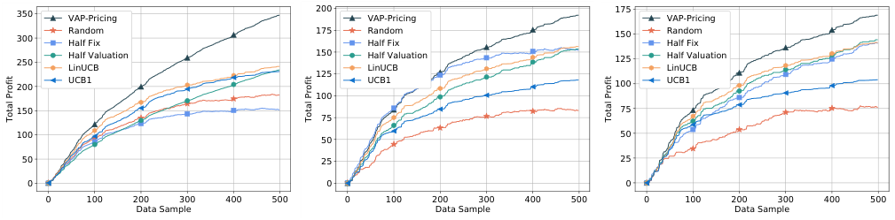

<!-- Start of picture text -->
350 VAP-Pricing 200 VAP-Pricing 175 VAP-Pricing 300 RandomHalf Fix 175 Random Half Fix 150 RandomHalf Fix 250 Half ValuationLinUCB 150 Half Valuation LinUCB 125 Half ValuationLinUCB 125 200 UCB1 UCB1 100 UCB1 100 150 75 75 100 50 50 50 25 25 0 0 0 0 100 200 300 400 500 0 100 200 300 400 500 0 100 200 300 400 500 Data Sample Data Sample Data Sample Total Profit Total Profit Total Profit <!-- End of picture text -->

Fig. 5. Performance of different data pricing mechanisms under different reserve values’ distribution, from left to right: A uniform distribution within [0, 1]; A constant distribution as f (v) = 0.5; An approximately normal distribution within [0, 1], where the mean is 0.5, and variance is 0.1. 

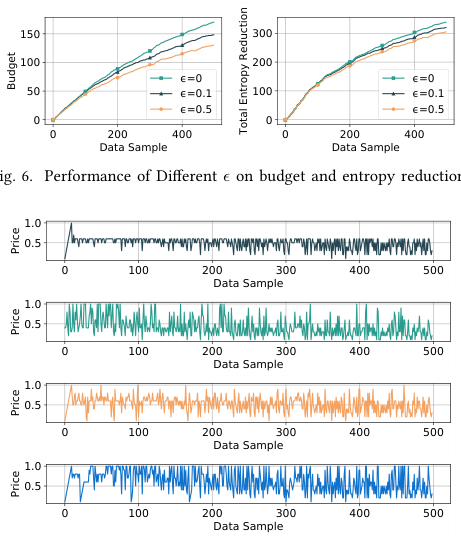

<!-- Start of picture text -->
150 300 100 200 ϵ=0 ϵ=0 50 ϵ=0.1 100 ϵ=0.1 ϵ=0.5 ϵ=0.5 0 0 0 200 400 0 200 400 Data Sample Data Sample Fig. 6. Performance of Different ϵ on budget and entropy reduction. 1.0 0.5 0 100 200 300 400 500 Data Sample 1.0 0.5 0 100 200 300 400 500 Data Sample 1.0 0.5 0 100 200 300 400 500 Data Sample 1.0 0.5 0 100 200 300 400 500 Data Sample Budget Total Entropy Reduction Price Price Price Price <!-- End of picture text -->

Fig. 6. Performance of Different ϵ on budget and entropy reduction. 

Fig. 7. Price Comparison of Different Pricing Mechanisms (From top to bottom are VAP-Pricing, Half Valuation, LinUCB and UCB1). 

higher ϵ, correspondingly, he tends to use the limited budget to collect a smaller data set, which can significantly reduce the uncertainty of model predictions like active learning. On the contrary, if the service provider chooses a smaller ϵ, he wants to use more budget to collect more data. 

Comparing the price of different pricing policies in Figure 7, we can see that the VAP-Pricing method can maintain the downward trend of valuation compared to Half Valuation, which is also fairer than other Random or Half Fix. Compared with other advanced bandit methods, i.e., UCB1 and LinUCB, VAP-pricing can better estimate the reserve value distribution of contributors, leading to a faster converge and a more reasonable price. It can monitor changes in data valuation, and adjust posted price promptly to maximize the profit. 

## VII. Related Work 

## A. Mobile Health 

The researchers develop multiple models by combining principled medical approaches with ML techniques in 

mHealth in a variety of domains, including diabetes [41], activity recognition [42], and blood pressure monitoring [26]. Recently, researchers are making recent progress in COVID19 [43]. Many online learning methods and incremental learning methods are proposed [11]–[14], in which the mHealth models would continuously update over time as more information is collected and made available. However, these works are currently considering designs of hardware devices and ML models’ improvements. Few of them consider the data acquisition mechanism, neither data valuation, and data pricing mechanism. 

## B. Data Valuation and Pricing for ML Tasks 

Lately, Shapley value has been widely used in the data valuation and pricing problem for ML tasks. Agarwal et al. [15] design a market mechanism to price training data and match buyers to sellers based on Shapley value. Jia et al. introduce several additional approximation methods for efficient computation of Shapley values for training data [16]; subsequently, they provided an algorithm for the exact computation of Shapley values for the specific case of nearest-neighbor classifiers [19]. Meanwhile, Ghorbani et al. developed a truncated Monte Carlo sampling scheme (TMCShapley), demonstrating empirical effectiveness across various ML tasks [17]; subsequently, they proposed distributional Shapley, where the value of a point is defined in the context of an underlying data distribution [18]. However, these data valuation methods are not suitable for online ML tasks. 

## VIII. Conclusion 

In this paper, we have presented VAP, the first online data valuation and pricing mechanism for ML tasks in mHealth. We value the data by measuring its contribution to the ML training process under Bayesian perspective and guiding the data acquisition process. Based on the data valuation, we have considered the problem of profit maximization, and proposed an online posted price data pricing mechanism under a contextual multi-armed bandit framework. Furthermore, we have also expanded VAP from Bayesian linear regression to more complicated models. The evaluation results show that VAP outperforms the existing data valuation and pricing mechanisms. 

858 Authorized licensed use limited to: Shanghai Jiaotong University. Downloaded on December 16,2022 at 06:25:48 UTC from IEEE Xplore.  Restrictions apply. 

## References 

- [1] S. Kumar, W. Nilsen, M. Pavel, and M. B. Srivastava, łMobile health: Revolutionizing healthcare through transdisciplinary research,” Computer, vol. 46, no. 1, pp. 28–35, 2013. 

- [2] łApple health,” https://www.apple.com/ios/health/. 

- [3] łGoogle fit,” https://www.google.com/fit/. [4] łMicrosoft health,” https://www.microsoft.com/en-us/industry/health/ microsoft-cloud-for-healthcare. 

- [5] R. S. Istepanian and T. Al-Anzi, łm-health 2.0: new perspectives on mobile health, machine learning and big data analytics,” Methods, vol. 151, pp. 34–40, 2018. 

- [6] Y. Gal, łUncertainty in deep learning,” University of Cambridge, vol. 1, no. 3, 2016. 

- [7] G. Litjens, T. Kooi, B. E. Bejnordi, A. A. A. Setio, F. Ciompi, M. Ghafoorian, J. A. van der Laak, B. van Ginneken, and C. I. S´anchez, łA survey on deep learning in medical image analysis,” Medical Image Analysis, vol. 42, pp. 60 – 88, 2017. 

- [8] D. C. Mohr, M. Zhang, and S. M. Schueller, łPersonal sensing: understanding mental health using ubiquitous sensors and machine learning,” Annual review of clinical psychology, vol. 13, pp. 23–47, 2017. 

- [9] G. Xing, łTackling the challenges of machine learning for mobile health systems,” in HealthDL, 2020. 

- [10] S. Kumar, W. J. Nilsen, A. Abernethy, A. Atienza, K. Patrick, M. Pavel, W. T. Riley, A. Shar, B. Spring, D. Spruijt-Metz et al., łMobile health technology evaluation: the mhealth evidence workshop,” American journal of preventive medicine, vol. 45, no. 2, pp. 228–236, 2013. 

- [11] C. Hu, Y. Chen, L. Hu, and X. Peng, łA novel random forests based class incremental learning method for activity recognition,” Pattern Recognition, vol. 78, pp. 277–290, 2018. 

- [12] D. A. Jenkins, M. Sperrin, G. P. Martin, and N. Peek, łDynamic models to predict health outcomes: current status and methodological challenges,” Diagnostic and prognostic research, vol. 2, no. 1, p. 23, 2018. 

- [13] K. Y. Ngiam and W. Khor, łBig data and machine learning algorithms for health-care delivery,” The Lancet Oncology, vol. 20, no. 5, pp. e262– e273, 2019. 

- [14] S. Srinivasan, K. R. Srivatsa, I. V. R. Kumar, R. Bhargavi, and V. Vaidehi, łA regression based adaptive incremental algorithm for health abnormality prediction,” in ICRTIT, 2013, pp. 690–695. 

- [15] A. Agarwal, M. Dahleh, and T. Sarkar, łA marketplace for data: An algorithmic solution,” in EC, 2019, pp. 701–726. 

- [16] R. Jia, D. Dao, B. Wang, F. A. Hubis, N. Hynes, N. M. G¨urel, B. Li, C. Zhang, D. Song, and C. J. Spanos, łTowards efficient data valuation based on the shapley value,” in AISTATS, 2019, pp. 1167–1176. 

   - [28] J. Q. Candela and C. E. Rasmussen, łA unifying view of sparse approximate gaussian process regression,” J. Mach. Learn. Res., vol. 6, pp. 1939–1959, 2005. 

   - [29] I. Kononenko, łBayesian neural networks,” Biological Cybernetics, vol. 61, no. 5, pp. 361–370, 1989. 

   - [30] T. M. Cover and J. A. Thomas, Elements of Information Theory. Wiley, 2001. 

   - [31] M. Kuczma, An introduction to the theory of functional equations and inequalities: Cauchy’s equation and Jensen’s inequality. Springer Science & Business Media, 2009. 

   - [32] S. Bubeck and N. Cesa-Bianchi, łRegret analysis of stochastic and nonstochastic multi-armed bandit problems,” Found. Trends Mach. Learn., vol. 5, no. 1, pp. 1–122, 2012. 

   - [33] L. Xu, C. Jiang, Y. Qian, Y. Zhao, J. Li, and Y. Ren, łDynamic privacy pricing: A multi-armed bandit approach with time-variant rewards,” IEEE Transactions on Information Forensics and Security, pp. 271–285, 2017. 

   - [34] P. Auer, N. Cesa-Bianchi, and P. Fischer, łFinite-time analysis of the multiarmed bandit problem,” Mach. Learn., vol. 47, no. 2-3, pp. 235–256, 2002. 

   - [35] L. Li, W. Chu, J. Langford, and R. E. Schapire, łA contextual-bandit approach to personalized news article recommendation,” in WWW, 2010, pp. 661–670. 

   - [36] J. S. Denker and Y. LeCun, łTransforming neural-net output levels to probability distributions,” in NIPS, 1990, pp. 853–859. 

   - [37] D. Golovin, A. Krause, and D. Ray, łNear-optimal bayesian active learning with noisy observations,” in NIPS, 2010, pp. 766–774. 

   - [38] G. Chalkiadakis and C. Boutilier, łBayesian reinforcement learning for coalition formation under uncertainty,” in AAMAS, 2004, pp. 1090–1097. 

   - [39] D. Anguita, A. Ghio, L. Oneto, X. Parra, and J. L. Reyes-Ortiz, łA public domain dataset for human activity recognition using smartphones.” in Esann, vol. 3, 2013, p. 3. 

   - [40] J. W. Smith, J. Everhart, W. Dickson, W. Knowler, and R. Johannes, łUsing the adap learning algorithm to forecast the onset of diabetes mellitus,” in Proc Annu Symp Comput Appl Med Care, 1988, p. 261. 

   - [41] D. Preuveneers and Y. Berbers, łMobile phones assisting with health self-care: a diabetes case study,” in HCI, G. H. ter Hofte, I. Mulder, and B. E. R. de Ruyter, Eds., 2008. 

   - [42] U. Fareed, łSmartphone sensor fusion based activity recognition system for elderly healthcare,” in MobileHealth@MobiHoc, 2015, pp. 29–34. 

   - [43] C. Brown, J. Chauhan, A. Grammenos, J. Han, A. Hasthanasombat, D. Spathis, T. Xia, P. Cicuta, and C. Mascolo, łExploring automatic diagnosis of COVID-19 from crowdsourced respiratory sound data,” in KDD, 2020, pp. 3474–3484. 

- [17] A. Ghorbani and J. Y. Zou, łData shapley: Equitable valuation of data for machine learning,” in ICML, 2019, pp. 2242–2251. 

- [18] A. Ghorbani, M. P. Kim, and J. Zou, łA distributional framework for data valuation,” in ICML, 2020, pp. 3535–3544. 

- [19] R. Jia, D. Dao, B. Wang, F. A. Hubis, N. M. G¨urel, B. Li, C. Zhang, C. J. Spanos, and D. Song, łEfficient task-specific data valuation for nearest neighbor algorithms,” Proc. VLDB Endow., vol. 12, no. 11, pp. 1610–1623, 2019. 

- [20] P. Dubey, łOn the uniqueness of the shapley value,” International Journal of Game Theory, vol. 4, no. 3, pp. 131–139, 1975. 

- [21] A. V. Goldberg, J. D. Hartline, and A. Wright, łCompetitive auctions and digital goods,” in SODA, 2001, pp. 735–744. 

- [22] S. Alaei, A. Malekian, and A. Srinivasan, łOn random sampling auctions for digital goods,” in EC, 2009, pp. 187–196. 

- [23] R. Kleinberg and T. Leighton, łThe value of knowing a demand curve: bounds on regret for online posted-price auctions,” in FOCS, 2003, pp. 594–605. 

- [24] J. D. Hartline and B. Lucier, łBayesian algorithmic mechanism design,” in STOC, L. J. Schulman, Ed. ACM, 2010, pp. 301–310. 

- [25] S. A. Baldwin and M. J. Larson, łAn introduction to using bayesian linear regression with clinical data,” Behaviour research and therapy, vol. 98, pp. 58–75, 2017. 

- [26] M. Kachuee, M. M. Kiani, H. Mohammadzade, and M. Shabany, łCuffless blood pressure estimation algorithms for continuous health-care monitoring,” IEEE Transactions on Biomedical Engineering, vol. 64, no. 4, pp. 859–869, 2017. 

- [27] W. Wang, S. Mirjafari, G. Harari, D. Ben-Zeev, R. Brian, T. Choudhury, M. Hauser, J. Kane, K. Masaba, S. Nepal et al., łSocial sensing: Assessing social functioning of patients living with schizophrenia using mobile phone sensing,” in CHI, 2020, pp. 1–15. 

859 Authorized licensed use limited to: Shanghai Jiaotong University. Downloaded on December 16,2022 at 06:25:48 UTC from IEEE Xplore.  Restrictions apply. 

