# Fault Tolerant Mechanism Design for Time Coverage in Crowdsensing System 

Yangsu Liu, Zhenzhe Zheng, Fan Wu, Xiaofeng Gao and Guihai Chen 

Shanghai Key Laboratory of Scalable Computing and Systems 

Department of Computer Science and Engineering 

Shanghai Jiao Tong University, China 

**_Abstract_ —Last decade has witnessed the explosion in the number of smart mobile phones and other smart devices equipped with powerful sensors. Therefore, various crowdsensing applications which recruit people to complete sensing tasks have sprung up. Designing incentive mechanism plays an indispensable role in crowdsensing network. However, most existing works about incentive mechanism base on the assumption that agents will complete the allocated sensing tasks without any problem. However, when we take the failures of agents into consideration, most existing incentive mechanisms become invalid.** 

**Considering a more practical scenario, we suppose that there is a crucial sensing task which needs to remain high enough probability of success completion for a certain period of time and each alternative agent has a certain probability to cover a certain period successfully. To ensure the fault tolerance of the crowdsensing system, we propose two novel incentive mechanisms, single slot coverage (SSC) mechanism and continuous coverage (CC) mechanism, for different problem models, respectively. In our mechanisms, agents’ probabilities of success, costs of completing task, start time and end time are all private information. Our objective is to minimize the total costs of selected agents, while ensuring the task is fully covered with a high enough probability over a certain period. Our work presents detailed proofs of the computational efficiency, truthfulness and individual rationality. Besides, we implement extensive simulation to evaluate proposed mechanisms, which validates the properties of our mechanisms.** 

## I. INTRODUCTION 

Following the explosive growth in the number of smart phones, various kind of embedded sensors on mobile phones are available for collecting information, such as GPS, accelerometers, digital compasses, microphones, and cameras. Furthermore, smart phones also integrate communication module, storage module and computation module. It indicates that ubiquitous smart phones are promising to play the role of sensors in classic wireless sensor network(WSN). Since the enormous potential of mobile phones, mobile crowdsensing, as a novel sensing paradigm, has attracted great attention [1]. Various applications have been developed in wide fields, such as transportation planning, environment monitoring, localization, healthcare and so on [2]–[9]. 

This work was supported in part by the State Key Development Program for Basic Research of China (973 project 2014CB340303), in part by China NSF grant 61672348, 61672353, 61422208, and 61472252, in part by Shanghai Science and Technology fund 15220721300, in part by the CCF-Tencent Open Research Fund and in part by the Scientific Research Foundation for the Returned Overseas Chinese Scholars. The opinions, findings, conclusions, and recommendations expressed in this paper are those of the authors and do not necessarily reflect the views of the funding agencies or the government. 

However, aforementioned applications, which recruit agents to complete sensing tasks, need sufficient number of participants. Participants consume some resources to complete the sensing tasks and bear the risk of disclosure of privacy. Few agents prefer to participate in sensing unless they are motivated enough. Therefore, incentive mechanism is essentially important in crowdsensing, which is is covered with a number of works in the survey [10]. Nevertheless, most existing incentive mechanisms are proposed on the basis of assumption that agents can complete allocated tasks without any problem. But in pracice, failures of sensing tasks are common. For example, we suppose that there is a task requiring people to monitor noise in a target area continually. Due to the attenuation of acoustical signal in propagation, the probability of monitoring noise correctly decreases with increasing distance [11]. In other sensing tasks, agents’ departure halfway, low-quality data and the interference of environment also lead to failure of the task. 

In this work, we consider a continuous sensing task that needs a guaranteed success probability for a period of time. Agents prefer to cover the task over a certain period of time and they maintain a certain probability of success (PoS) over the sensing process. We assume that the agents could estimate their own probability of successful sensing according to the proposed route, location, and network environment. Owing to the execution uncertainty of agents, the task needs to recruit sufficient number of agents to ensure the success rate of task satisfying the requirement of task, such that the crowdsensing system is fault tolerant. We aim at minimizing the total costs of participants while guaranteeing a threshold probability of success of the task all the time. Besides, the mechanism should persuade agents to report their private infomation truthfully, _i.e._ , the mechanism should be truthful and individually rational. Since agents are always rational and self-interested, they will try to misreport their type to gain more benefits. 

In our problem model, agents could misreport their information on multi-dimensions, such as start time, end time, PoS and cost. Thus, we need to design a multi-parameter mechanism. Unfortunately, the multi-parameter mechanism design problem has no general solution yet. Thus we resort to the cost verification. Furthermore, the traditional mechanism design based on VCG mechanism [12] is invalid. This is because the problem aiming at minimizing the total costs of 

978-1-5090-8468-7/17/$31.00 _⃝_ c 2017 IEEE 

participants and satisfying PoS requirement simultaneously is NP-hard, and thus is computational intractable. Even if VCG mechanism can be used in NP-hard promble [13], it is not applicable to the model. Because the pricing scheme in VCG mechanism ignores the interdependencies between the probability of success and agents’ valuations. 

Considering these challenges, we propose two different models: single slot coverage model and continuous coverage model, where agents can select a single slot and a continuous period to cover, respectively. Due to the cost verification, We suppose that agents cannot cheat on their costs, such that the multi-dimensional mechanism design problem reduces to single-dimensional mechanism design problem. We design two incentive mechanisms on the basis of reverse auction, which both adopt greedy approximation algorithms for the agent selection. The pricing scheme is draw on the execution contingent pricing scheme in [14], which pays the agents depending on whether they complete their tasks successfully. We prove that our mechanisms both have good economical properties, such as truthfulness, individual rationality. Computation efficiency and guaranteed approximation ratio of our mechanisms are also proved theoretically. 

We highlight the contribution of our work as follows: 

- We formulate the problem of designing incentive mechanisms for crowdsensing based on reverse aution considering the failures of agents. We propose a crucial task needed to be covered with a certain PoS for a period of time. The goal of the incentive mechanism is to minimize the total cost of agents and ensure task to be completed with higher PoS than requirement meanwhile. 

- We design SSC mechanism for the single slot coverage model. We propose a 2-approximation algorithm to for the winner selection algorithm with a greedy manner. 

- We design CC mechanism for the continuous coverage model. We propose a greedy algorithm to select the agent iteratively. The analysis shows that the approximation ration of the winner selection is guaranteed . 

- We extended the execution contingent pricing scheme to tackle the execution uncertainty of agents. We provide the detailed proof that the pricing scheme guarantees the truthfullness of our mechanisms. 

- Extensive evaluation has validated the properties of proposed mechanisms, which is based on a real data set of CitiBike data [15] in New York. 

The remainder of this paper is organized as follows. We discuss related work in Section II. Two problem models are formulated in Section III. We then design two different mechanisms for both models in Section III. We evluate our mechanisms and show the results in Section V and conclude this paper in Section VI. 

## II. RELATED WORK 

The problem of incentive mechanism designing with game theory method has received a lot of attention over last few years. Yang _et al._ [16] proposed two incentive mechanisms 

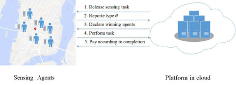

Fig. 1. A general crowdsensing system. 

based on user-centric and platform-centric model. Koutsopoulos _et al._ [17] designed a mechanism considering participation levels of agents. Luo _et al._ [18] studied the incentive mechanism utilizing all-pay auction scheme. Zhao _et al._ [19] proposed two online incentive mechanisms OMZ and OMG for the scenario where agents arrived one by one. Feng _et al._ [20] proposed the auction for location-aware sensing model. Zhang _et al._ [21] designed a incentive tree mechanism to reward users for both participation and solicitation. Indeed, none of these incentive mechanisms considers the possibility of task failure. There are a few works focusing on the quality of agents or data [22]–[24], which is similar to the PoS in this paper. However, in these papers the qualities of agents or data either obey a certain probability distribution or are estimated via learning methods, which are not private information of agents. It is main difference from our model. 

Zhang _et al._ [25] proposed a participant selection framework named CrowdRecruiter. It considered the probabilistic coverage constraint which is similar to our model. However, their work does not include incentive mechanism for agents. Porter _et al._ [14] investigated fault tolerant mechanism design firstly. They presented a novel VCG-like mechanism to get truthful and individually rational, which will fail for the computational intractability. Conitzer _et al._ [26] and Stein _et al._ [27] considered similar settings where execution time of agents is uncertain. Ramchurn _et al._ [28] proposed trust-based mechanisms where participants can play the role of requester and evaluate others’ trust (PoS). However, they did not set the uncertainty as a private information of agents as well. Zheng _et al._ [29] proposed the mechanism aiming to achieve high probability of tasks considering single task setting and multi-task setting. However, this work only tackles with task allocation problem, which is different from our continuous task coverage problem. And the assumption that agents can only bid integral probability of success is unreasonable. 

## III. PROBLEM MODEL 

As illustrated by Fig. 1, a general crowdsensing system consists of two components, including a platform residing in the cloud and a set of agents with mobile devices denoted by _A_ = _{a_ 1 _, a_ 2 _, .., an}_ . The crowdsensing process can be described as follows. First, the platform releases a task _T_ which need to be covered during a time period [ _S, E_ ] with a threshold probability at least _Thr_ , _e.g._ , noise monitoring on some areas from 8 am to 10 am with threshold probability 0.8. Then, there is a set _A_ of _n_ agents who are interested in the sensing task. Each agent _ai ∈ A_ reports her private 

type _θi_ = _{ci, pi, si, ei}_ to platform, where _ci_ denotes the cost of agent _ai_ incurred by participating in sensing task from start time _si_ to end time _ei_ and _pi_ dnotes the PoS of the agent maintain. We assume that the cost _ci_ is declared truthfully, because we can verify it via monitoring the battery consumption, recording steps or walking routes and other methods, which is known as ex-post verification and is widely utilized in mechanism design [30]. It is noteworthy that the cost of an agent will incur no matter the agent completes sensing tasks or not, for instance, agents consume battery power to monitor noise no matter the task is completed successfully or not. Besides, we dnote _pit_ as the probability of success of agent _ai_ to cover the time _t ∈_ [ _S, E_ ]. We suppose that the agent maintains the same PoS _pi_ during their covering periods, which indicates 

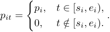

If the task is covered by multiple agents at time _t_ , the probability of covering task at time _t_ is 

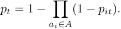

By collecting profile of agents’ types, the platform selects a subset _I ⊆ A_ of agents to complete the sensing task. After completing a sensing task, an agent will receive a reward _ri_ . We define the utility _ui_ of an agent _ai_ as her reward _ri_ minus the cost _ci_ , _i.e._ , 

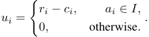

Due to the rational self-interest of agents, they would try to maximize their own utilities. On the contrary, the objective of platform is to maximize social welfare. The social welfare _U_ is defined as the value of a single sensing task _V_ minus the total cost of participants, which is presented as 

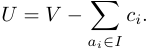

Since the value of a single task is pre-determined, the objective of the platform is to minimize total cost of selected agents, while ensuring the task are covered with a PoS at least _Thr_ , _i.e._ , we have 

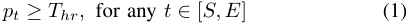

We define the _weight_ of an agent _ai_ as _wi_ = _−_ log(1 _− pi_ ), and let _W_ = _−_ log(1 _− Thr_ ) denote the _threshold weight_ . Similarly, we let _wit_ = _−_ log(1 _− pit_ ) denote the weight of an agent to cover the time _t_ . Thus, the inequation (1) can be expressed as 

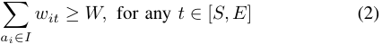

As a notation convention, we use _−i_ in subscript to denote all users except _i_ , e.g, we write types of all agents as _θ_ = ( _θi, θ−i_ ), and _θ−i_ denotes the types of all agents excluding agent _ai_ . We propose two different problem models. 

## _A. Single Slot Coverage Model_ 

In single slot coverage model, we divide the period [ _S, T_ ] into a sequence of unit slots _SL_ = _{sl_ 1 _, sl_ 2 _, ..., slk}_ . Agent _ai ∈ A_ selects a slot set _SLi ⊆ SL_ , duing which she would like to participate in the sensing task. Every participant promises to cover the whole slot, if she wins the auction. Furthermore, selecting non-adjacent slots by the same agent is permitted. The result of the auction in a slot does not influence auctions in the other slots. Thus, we can focus on the auction in a single slot _slm_ . The type of agent _ai_ reduces to _θi_ = _{ci, pi}_ . Since there is only one slot, we let _pi_ and _wi_ denote _pit_ and _wit_ in this model, respectively. Therefore, we can formulate the optimization problem of selecting winners as an integer linear programing problem ILP1 using inequation (2). Let _Im ⊆ A_ denote a set of agents who participate the auction in slot _slm_ , we have: 

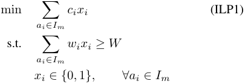

where _xi_ = 1, if agent _ai_ is selected, otherwise _xi_ = 0. 

## _B. Continuous Coverage Model_ 

In continuous coverage model, agent _ai_ bids type _θi_ = _{ci, pi, si, ei}_ . During period [ _S, E_ ], there are at most 2 _n_ different time points when agents start or stop sensing tasks. These discrete points between time point _S_ and _E_ are defined as _critical time points_ , and we denote the set of critical time points as 

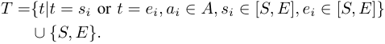

If a critical time point _t ∈_ [ _si, ei_ ), the point could be covered by the agent _ai_ . In other words, agent _ai_ is interested in covering critical time point _t_ . Then the optimization problem reduces to the integer programming problem ILP2 as follow: 

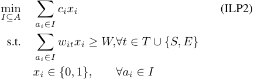

where _xi_ = 1, if agent _ai_ is selected, otherwise _xi_ = 0. 

If agent _ai_ is selected as a winner, she will cover the whole period [ _si, ei_ ), _i.e._ , she wins all auctions at critical time points she could cover. We could regard these critical time points as items of an auction, and agents bid for a specified bundle of items. They prefer to win the whole bundle, and give up the auction for any other bundle. Thus, we could regard the agents as single-minded agents who are only satisfied with only winning all the critical time points during her cover period [12]. 

## _C. Economic Properties_ 

Besides the optimization objective mentioned above, our goals include designing mechanisms to satisfy the following economical properties: 

- **Computational Efficiency** : A mechanism is computational efficient if it can compute allocation and rewards in polynomial time. 

- **Truthfulness (in expectation)** : A mechanism is truthful (in expectation) if agent cannot improve her (expected utility) by misreporting her type regardless of others’ bids. In other words, the (expected) utility of agent _ai_ by reporting true type _θ_ is larger than by reporting any other type _θ__′_ . _i.e._ , _ui_ ( _θi, θ−i_ ) _≥ ui_ ( _θi__′, θ−i_) 

- **Individual Rationality** :A mechanism is individually rational if agent _ai_ will get non-negative expected utility by reporting true type _θi_ , _i.e._ , _ui_ ( _θi, θ−i_ ) _≥_ 0 

## IV. MECHANISM DESIGN 

**Algorithm 1** SingleSlotAllocation( _A, W, c, w_ ) 

**Input:** A set _A_ of _n_ users, threshold weight _W_ , a profile of cost _c_ , a profile of weight _w_ 

**Output:** A set of selected agents _I_ 

- 1: Order users such that _c_ 1 _/w_ 1 _≤ c_ 2 _/w_ 2 _≤ . . . ≤ ci/wi_ ; 

- 2: _I ←∅_ ; _Icur ←∅_ ; 

- 3: _COpt ←∞_ ; _Ccur ←_ 0; 4: _Wcur ←_ 0; 5: **for** _i ←_ 1 to _n_ **do** 6: **if** _Wcur_ + _wi < W_ **then** 7: _Wcur ← wi_ + _Wcur_ ; _Ccur ← ci_ + _Ccur_ ; _Icur ← Icur ∪{ai}_ ; 

- 8: **else** 9: **if** _Ccur_ + _ci < COpt_ **then** 

- 10: _COpt ← Ccur_ + _ci_ ; _I ← Icur ∪{ai}_ ; 11: **end if** 12: **end if** 

13: **end for** 

14: **return** _I_ 

Traditional pricing schemes [16]–[19] dose not consider that the success probabiliies of agents also effect the optimization solution. 

To address above challenges, we design two mechanisms based on reverse auction, including winner selection algorithms and pricing schemes. 

## _A. Single Slot Coverage Mechanism_ 

**Winner Selection** : With the discussion in Section III-A, the winner selection problem can be expressed as a representive minimum knapsack problem [31] which is proved to be NPhard. There is no polynomial algorithm to find an optimal solution yet. Instead, we design an approximation algorithm to determine winners in a greedy manner, as Algorithm 1 shows. First, agents who would participate in the auction in slot _slm_ are essentially sorted in ascending according to their cost per weight ( _i.e._ , _c_ 1 _/w_ 1 _≤ c_ 2 _/w_ 2 _≤ . . . ≤ cn/wn_ ). From Line 5 to 13, we start to check agents iteratively in the given order. If the weight requirement is not satisfied after selecting the agent _ai_ as a winner, we add _ai_ to the set of candidates _Icur_ . If the weight requirement would be satisfied after adding agent _ai_ to the set _Icur_ , the agent set _Icur ∪{ai}_ will lead to a feasible solution of ILP1. Every new feasible solution in each iteration is compared to the best solution so far and the better one is stored. With the feasible solution existing, the Algorithm 1 returns a winner set _I_ satisfying the weight requirement. 

**Pricing Scheme** : The reward for a winning agent is based on critical value and ex-post execution. Since the cost is reported truthfully, the critical value of an agent is defined as the minimum PoS that agent should declare to win the auction [12]. We present the details in Algorithm 2. To get the critical value of agent _ai_ , we temporarily set aside the winner _ai_ and rerun the Algorithm 1 over the rest of agents to get a new winner set _I__′_ . If agent _ai_ declares _wi/ci_ greater than minimum _wj/cj_ in _I__′_ , the winner selection algorithm will select agent _ai_ as a winner because of the monotonicity of mechanism, of which we will provide a proof later. We can obtain the critical PoS by _p_ ˆ _i_ = 1 _−_ e _w_ˆ _i_ . After the winning agent tries to 

## **Algorithm 2** SingleSlotReward 

**Input:** A set _A_ of _n_ agents, a threshold weight _W_ , a profile of cost _c_ , a profile of weight _w_ , and a user _ai ∈ I_ win the auction 

**Output:** The reward _ri_ of the agent _ai_ 

1: _I__′_ _← SingleSlotAllocation_ ( _A−i, W, c−i, w−i_ ); 2: _w_ ˆ _i ←_ min _aj ∈I ′ ci wcjj_; 3: _p_ ˆ _i ←_ 1 _−_ e_−_ _w_ˆ _i_ ; 4: **if** agent complete the task **then** 5: _ri ← β_ (1 _− p_ ˆ _i_ ) + _ci_ ; 6: **else** 7: _ri ←−β_ ˆ _pi_ + _ci_ ; 

- 8: **end if** 

- 9: **return** _ri_ 

complete the sensing task, she will receive different rewards depending on whether she complete the task successfully. If an agent _ai_ complete task successfully, we would pay the agent _β_ (1 _− p_ ˆ _i_ ) + _ci_ , otherwise she would receive _−β_ ˆ _pi_ + _ci_ as a reward. The _β_ is a pre-determine coefficient here. 

We first prove that the SSC mechanism is monotone with PoS, which is indispensability for following proof. Monotonicity in PoS of mechanism implies that if user win auction with declaring PoS _pi_ , they will still win the auction by declaring higher PoS. 

**Lemma 1.** _The winner selection algorithm in SSC mechanism is monotone in PoS._ 

_Proof:_ By raising PoS, the agent _ai_ would be inserted in a more prior order in Algorithm 1. If the agent _ai_ is selected by _Icur_ (Line 6), she would be selected by _Icur_ in an earlier iteration by misreporting PoS. Otherwise the set _Icur ∪{ai}_ was chosen as the best solution at last(Line 9). Thus, she would be added to _Icur_ or to _I_ by reporting higher PoS. Therefore, the Algorithm 1 is monotone in PoS. 

**Lemma 2.** _The SSC mechanism is computationally efficient._ 

_Proof:_ In Algorithm 1, sorting _n_ agents takes _O_ ( _n_ log _n_ ) time and selecting winners form agents takes _O_ ( _n_ ) time. The pricing scheme runs the winner selecting algorithm once. Since there are at most _n_ winners, the time complexity of reward calculation is _O_ ( _n_2 log _n_ ). Hence, the running time of the mechanism is bounded by _O_ ( _n_2 log _n_ ), implying that the SSC mechanism is computationally efficient. 

## **Lemma 3.** _The SSC mechanism is individually rational._ 

_Proof:_ Denote _pi_ as the true PoS of an agent _ai_ . We consider the expected utility _u_ ¯ _i_ of the winner _ai_ . If the agent win the auction, her expected utility is _u_ ¯ _i_ = _β_ ( _p − p_ ˆ _i_ ) _._ Obviously _u_ ¯ _i_ is non-negative. And her utility is 0 when she loses the auction. To sum up, agent has a non-negative utility when she declares true type. 

## **Lemma 4.** _The SSC mechanism is truthful (in expectation)._ 

_Proof:_ If an agent _ai_ wins the auction by reporting _pi_ , it indicates that _pi ≥ p_ ˆ _i_ . With discussion above, the agent, who declares a higher PoS, still wins the auction and gets the same expected utility. If the agent reduces the PoS she bids, she may probably lose the auction and get a utility of 0. Therefore, winners cannot get better expected utility by misreporting PoS. 

If the agent _ai_ loses the auction by reporting _pi_ , it implies that _pi < p_ ˆ _i_ . The expected utility of the agent will be negative when the agent tries to win the auction by declaring higher PoS. The utility of a losing agent is not better than the utility by biding true type. Consequently, no matter whether the agent wins the auction or not, she has no incentive to misreport her PoS. 

**Lemma 5.** _The approximation ratio of SingleSlotAllocation algorithm is 2._ 

**Lemma 5.** _The approximation ratio of SingleSlotAllocation algorithm is 2._ Due to the space limit, the detailed proof can be found in our online technical report [32]. 

## _B. Continuous Coverage Mechanism_ 

Under the sing-minded setting, our mechanism CC is also based on the reverse auction, consisting of a winner selection algorithm and a pricing scheme for the continuous coverage model. **Winner Selection** : The winner selection problem can be reduced from the weighted set cover probelm in polynomial time, which is already known to be NP-hard [33]. To get a near-optimal solution, we resort to the property of submodularity in the auction, which is defined as follow: 

**Definition 1.** _(Monotone Submodular Function) Let V be a finite set. A function f :_ 2_V_ _→_ R _is submodular if and only if_ 

## _f_ ( _A ∪{v}_ ) _− f_ ( _A_ ) _≥ f_ ( _B ∪{v}_ ) _− f_ ( _B_ ) _,_ 

_for any A ⊆ B ⊆ V and v ∈ V \B, and f is monotonically increasing if and only if f_ ( _A_ ) _≤ f_ ( _B_ ) _, for any A ⊆ B._ 

**Algorithm 3** ContinousCoverageAllocation( _A, θ, W, S, E_ ) **Input:** A set _A_ of _n_ agents with type _θ_ = _{c, w, s, e}_ and a threshold weight _W_ , the staring time _S_ and stoping time _E_ of the sensing task. **Output:** A set of selected agents _I_ 1: _T ←{S, E}_ 2: **for** _i ←_ 1 to _n_ **do** 3: **if** _si ∈_ [ _S, E_ ] **then** 4: _T ← T ∪{si}_ ; 5: **end if** 6: **if** _ei ∈_ [ _S, E_ ] **then** 7: _T ← T ∪{ei}_ ; 8: **end if** 9: **end for** 10: sort _T_ in increasing order; 11: **for all** _i_ in _T_ **do** 12: _Wi ←_ 0; 13: **end for** 14: **while** _∃k_ : _Wk < W_ **do** 15: _ai ←_ arg max � _j∈T_min(_wij, W−Wj_)_/ci_; _ai∈A\I_ 16: _I ← I ∪{ai}_ ; 17: **for all** _j ∈ T_ **do** 18: _Wj ←_ min( _W, Wj_ + _wij_ ); 19: **end for** 20: **end while** 21: **return** _I_ ; 

**Algorithm 4** ContinuousCoverageReward **Input:** A set _A_ of _n_ agents with type _θ_ = _{c, p, s, e}_ , a threshold weight _W_ , a winning agent _ai ∈ I_ **Output:** A reward _ri_ for _ai_ 1: _I__′_ _← ContinousCoverageAllocation_ ( _A−i, θ−i, W, S, E_ ) 2: **for all** _aj ∈ I__′_ **do** 3: _w_ ˆ _i ← min{w_ ˆ _i, ci_ � _t∈T_min(_wit, W−Wk_)_/cj}_ 4: update all _Wk_ 5: **end for** 6: _p_ ˆ _i ←_ 1 _−_ e_−_ _w_ˆ _i_ 7: **if** agent complete the task **then** 8: _ri ← β_ (1 _− p_ ˆ _i_ ) + _ci_ ; 9: **else** 10: _ri ←−βp_ ˆ _i_ + _ci_ ; 11: **end if** 12: **return** _ri_ 

Considering the computational intractability, we design a algorithm in a greedy manner as illustrated in Algorithm 3. First, we generate a set of critical time points according to the reporting types of candidates(Line 1 to 9). Then we let _Wj_ denote the sum of weights caused by the agents who would cover the time point _j_ . Agents will be selected iteratively until all _Wj_ satisfy the threshold weight requirement. In each iteration, we select the agent with maximal ratio of total weights to cost ( _i.e._ ,� _j∈T_min(_wij, W−Wj_)_/ci_),asLine 15 to 16 shows. Then _Wj_ of each critical time point is updated(Line 17 to 19). 

**Pricing Scheme** : Similar to the single slot coverage model, the reward for an agent is based on the critical value and depends the execution of agent. The critical value is also defined as the minimum PoS to ensure a agent winning. To determine the reward of a winner _ai_ , Algorithm 4 sets the agent _ai_ aside and reruns _ContinousCoverageAllocation_ algorithm. However, _ai_ may be selected as a winner in different iterations in the winner selection algorithm. As a result, _ai_ may have diverse critical value in different iterations. Thus, we pick the minimal critical weight as the critical weight _w_ ˆ (Line 2 to Line 5). Then the critical value _p_ ˆ _i_ of the agent _ai_ can be obtained by the equation _p_ ˆ _i_ = 1 _−_ e_−_ _w_ˆ _i_ . If the agent complete the sensing task over her covering period successfully, we will reward her _β_ (1 _− p_ ˆ _i_ ) + _ci_ , otherwise she will get _−β_ ˆ _pi_ + _ci_ . The _β_ is a pre-determine coefficient here. 

Before discussing the properties of CC mechanism, we prove the monotonicity of the winner selection algorithm. 

**Lemma 6.** _The winner selection algorithm in CC mechanism is monotone in PoS._ 

_Proof:_ If an agent _ai_ with the type _θi_ = _{ci, pi, si, ei}_ is selected as a winner, _ai_ will still win by declaring a higher PoS. Because higher PoS helps _ai_ to be chosen in a earlier iteration or the same iteration accoring to Algorithm 4. 

**Lemma 7.** _The CC mechanism is individually rational._ 

_Proof:_ Denote _pi_ as the true PoS of an agent _ai_ . Since all agents are single-minded, agents will cover the whole set of critical time points successfully or unsuccessfully. The expected utility of the winning agent is _β_ ( _pi − p_ ˆ _i_ ), which is non-negative when the agent declares true type. When agent lose auction, she will get a utility 0. Ultimately, the CC mechanism is individually rational. 

**Lemma 8.** _The CC mechanism is truthful (in expectation)._ 

_Proof:_ If agent _ai_ wins the auction by declaring true type, she will still win with reporting higher PoS because of the monotonicity of the winner selection algorithm. However, due to the independence between the expected utility and declaring PoS, the agent gets the same expected utility when she wins the auction. If she reports lower PoS, she takes a risk of losing auction and getting a utility 0. In conclusion, misreporting of winning agents cannot lead to a better expected utility than declaring true type. 

If agent _ai_ loses the auction by biding truthful, she would get a negative expected utility by misreporting type to win the auction, which is not better than zero utility. 

Consequently, continuous coverage mechanism is truthful. 

## **Lemma 9.** _The CC mechanism is computationally efficient._ 

_Proof:_ The ContinousCoverageAllocation algorithm generates the at most 2 _n_ critical time points, and sorts them with time bound _O_ ( _n_ log _n_ ). The algorithm selects winners iteratively, which is executed at most 2 _n_ times. In each iteration, we traversal at most _n_ agents who are interested in no more 

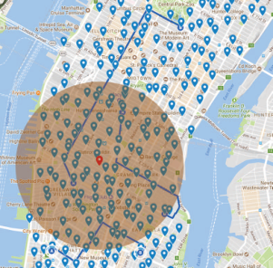

Fig. 2. Spatial distribution of the CitiBike data set. 

than 2 _n_ critical time points. Hence, the time complexity of Algorithm 3 is _O_ ( _n_3 ). Algorithm 4 runs the winner selection algorithm at most _n_ times, whose time complexity is _O_ ( _n_4 ). Therefore, the CC mechanism is computationally efficient. 

We define the total covering weights of agents set _I_ as a function: 

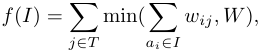

which can be proved to be monotonically non-decreasing submodular. We denote ∆ _i_ ( _S_ ) = _f_ ( _S∪{ai}_ ) _−f_ ( _S_ ). We work on the assumption that there are _k_ iterations in Algorithm 3 and let _I__i_ denote a set of agents after the _i_ -th iterations. Thus, _I__k_ denotes a set of selected agents produced by Algorithm 3 terminally. Renaming the agent winning in the _t_ -th iteration in Algorithm 3 as _at_ , the coverage contribution caused by agent _at_ is _ct/_� _j∈T_min(_wtj, W−Wj_),whichisdenotedas_µt_. We first present two lemma, the proof of which is given in our online technical report [32] due to the space limit. 

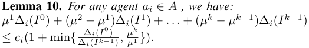

Due to the interest of space, we leave the detailed proof to our technical report [21] 

**Lemma 11.** _The approximation ratio of the ContinousCover-_ ∆ _i_ <u>(</u> _I_0 <u>)</u> _ageAllocation algorithm is_ 1 + ln min � _a_ max _i∈A_ ∆ _i_ ( _I__k−_1 )_,__<u>µ</u>_ _µ__k_1 � _._ 

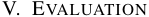

To evaluate the performance of our fault tolerant mechanisms closely, we implemented SSC mechanism and CC mechanism based on the trip data set of CitiBike [15] around Manhattan, New York. We present our evaluation results in this section. 

## _A. Experimental Setup_ 

We assume that all sharing bikes are embedded with some sensors to monitor noise, and sensors can be powered by a mini electric generator embedded on wheels. Sensors in a bicycle are regarded working during a ride and are expected to stop working when the agent returns the bike. To generate the 

