IEEE JOURNAL ON SELECTED AREAS IN COMMUNICATIONS, VOL. 35, NO. 2, FEBRUARY 2017 

486 

# Trading Data in the Crowd: Profit-Driven Data Acquisition for Mobile Crowdsensing 

Zhenzhe Zheng, _Student Member, IEEE_ , Yanqing Peng, Fan Wu, _Member, IEEE_ , Shaojie Tang, _Member, IEEE_ , and Guihai Chen, _Senior Member, IEEE_ 

**_Abstract_ —As a significant business paradigm, data trading has attracted increasing attention. However, the study of data acquisition in data markets is still in its infancy. Mobile crowdsensing has been recognized as an efficient and scalable way to acquire large-scale data. Designing a practical data acquisition scheme for crowd-sensed data markets has to consider three major challenges: crowd-sensed data trading format determination, profit maximization with polynomial computational complexity, and payment minimization in strategic environments. In this paper, we jointly consider these design challenges, and propose VENUS, which is the first profit-driVEN data acqUiSition framework for crowd-sensed data markets. Specifically, VENUS consists of two complementary mechanisms: VENUS-PRO for profit maximization and VENUS-PAY for payment minimization. Given the expected payment for each of the data acquisition points, VENUS-PRO greedily selects the most “cost-efficient” data acquisition points to achieve a sub-optimal profit. To determine the minimum payment for each data acquisition point, we further design VENUS-PAY, which is a data procurement auction in Bayesian setting. Our theoretical analysis shows that VENUSPAY can achieve both strategy-proofness and optimal expected payment. We evaluate VENUS on a public sensory data set, collected by Intel Research, Berkeley Laboratory. Our evaluation results show that VENUS-PRO approaches the optimal profit, and VENUS-PAY outperforms the canonical second-price reverse auction, in terms of total payment.** 

**_Index Terms_ —Data marketplace, mobile crowdsensing, auction theory.** 

## I. INTRODUCTION 

**T** HEsmart devices in people’s daily lives. The ubiquitous sen-past few years have witnessed the proliferation of sors embedded in pervasive smart devices incessantly generate 

Manuscript received April 30, 2016; revised September 30, 2016; accepted November 28, 2016. Date of publication January 26, 2017; date of current version March 31, 2017. This work was supported in part by the State Key Development Program for Basic Research of China (973 Project) under Grant 2014CB340303, in part by the China NSF under Grant 61672348, Grant 61672353, Grant 61422208, Grant 61472252, Grant 61272443, and Grant 61133006, in part by the Shanghai Science and Technology Fund under Grant 15220721300, in part by the CCF-Tencent Open Fund, and in part by the Scientific Research Foundation for the Returned Overseas Chinese Scholars. The work of Z. Zheng was supported by a Google Ph.D. Fellowship and a Microsoft Asia Ph.D. Fellowship. The work of S. Tang was supported by the China NSF under Grant 61473109. 

Z. Zheng, Y. Peng, F. Wu, and G. Chen are with the Shanghai Key Laboratory of Scalable Computing and Systems, Department of Computer Science and Engineering, Shanghai Jiao Tong University, Shanghai 200240, China (e-mail: zhengzhenzhe@sjtu.edu.cn; yanqing.sjtu@ gmail.com; fwu@cs.sjtu.edu.cn; gchen@cs.sjtu.edu.cn). S. Tang is with the Department of Information Systems, The University of Texas at Dallas, Richardson, TX 75080 USA (e-mail: tangshaojie@gmail.com). 

Color versions of one or more of the figures in this paper are available online at http://ieeexplore.ieee.org. Digital Object Identifier 10.1109/JSAC.2017.2659258 

tremendous volumes of sensed data by seamlessly monitoring a diverse range of human activities and environment phenomena. However, currently, most of operators exclusively analyze the collected data for their own application purposes, which introduces a serious barrier for the wide availability of crowd-sensed data, resulting in a number of isolated data islands. Recognizing the great benefit of data sharing [5], several open platforms, such as Terbine [50], Thingful [51] and Thingspeak [52], have emerged to enable crowd-sensed data to be exchanged on the web, aiming to unlock the potential economic values underlying the crowd-sensed data. 

However, due to lack of efficient data acquisition scheme, the amounts of crowd-sensed data in these platforms are very limited, which has significantly suppressed the increasing market demand for data. The success of data markets highly relies on the sufficient amounts of data for trading. On one hand, the data broker needs to aggregate various types of data from exogenous data sources to satisfy the diverse demand of data consumers. On the other hand, the data broker has to periodically supply fresh data into data markets, because the data become less accurate, and even useless, when the contextualized environments evolve over time. Mobile crowdsensing have been recognized as a highly efficient and scalable way to collect large-scale data [32], [58]. For example, Thingspeak [52] has recently launched a crowdsensing platform to collect crowd-sensed data. In mobile crowdsensing, the data providers consume their own physical resources, and spend manual effort in collecting data. Thus, the data broker should offer sufficient payments to incentivize data providers to contribute data. The frugal data broker always wants to procure enough data with a minimum payment, which can be formulated as the problem of _payment minimization_ . 

In data markets, the ultimate goal of the data broker is to maximize profit, which is defined as the difference between the revenue generated from selling data (possibly data-based services) and the expenditure on data acquisition. Although the data broker can obtain a large revenue by providing high quality data services, she has to disburse expensive expenditure to collect enough data, such that the data services maintain at a high quality level. Therefore, in order to maximize profit, the data broker should make a trade-off between revenue and data acquisition expenditure, which can be formulated as a _profit maximization_ problem. Although a number of data acquisition mechanisms with different optimization objectives have been developed in the literature [10], [11], [32], [58], few of them considered the monetary profit produced by trading 

0733-8716 © 2017 IEEE. Personal use is permitted, but republication/redistribution requires IEEE permission. See http://www.ieee.org/publications_standards/publications/rights/index.html for more information. 

ZHENG _et al._ : TRADING DATA IN THE CROWD: PROFIT-DRIVEN DATA ACQUISITION FOR MOBILE CROWDSENSING 

487 

the crowd-sensed data in the market, which deviates from the goal of the data broker. To fill this gap, we propose a profit-driven data acquisition mechanism. We summarize three major challenges in designing a practical profit-driven data acquisition mechanism for crowd-sensed data markets. 

The first design challenge is to determine the crowdsensed data trading format, considering both the characteristics of crowd-sensed data and diverse market demand for data. To evaluate the profit of data in the market, we have to identify the specific data trading format, which is still an open problem in both economics and computer science communities. The crowd-sensed data is normally uncertain and has complex correlation, making the crowd-sensed data quite different from the traditional information good [3], [35], and introducing additional difficulties in determining the data trading format. On one hand, the crowd-sensed data is incomplete, imprecise, and erroneous, making it improper to directly feed raw data into the data market. On the other hand, the crowd-sensed data may be correlated in multiple dimensions, and has rich sematic information behind such correlation [10], resulting in that separately selling pieces of data becomes meaningless. Furthermore, we should determine the data trading format aligned with the diverse market demand, meaning that data consumers, from different market segments, would request for the crowd-sensed data with different quality levels. Enabling data consumers to express their diverse market demands would incur a heavy burden of designing a concise and simple data trading format. Due to various types of uncertain factors, complex correlation and diverse market demand for data, it is nontrivial to determine an appropriate and flexible crowdsensed data trading format. 

Yet, another design challenge is the hardness of maximizing profit in a complicated data market environment. From the definition, the value of profit rests on the attained revenue from data trading and the distributed expenditure on data acquisition. Due to the special cost structure of data,1 the prices of data should be linked to data consumers’ valuations over the data, rather than the production cost. Thus, we can express the revenue with the data consumers’ valuation distributions. However, it is hard to analyze the property of the revenue (and then the profit), because the valuations always follow complicated distributions in practical market environments. Furthermore, even if we can figure out the maximum expected revenue, finding the minimum expenditure on data acquisition can be proven to NP-Hard, and is normally computationally intractable. Therefore, in order to approach the optimal profit of data trading, we have to overcome the complicated formats of valuation distributions and the high computational complexity in solving the problem of acquisition expenditure minimization. 

The last design challenge is to simultaneously guarantee both strategy-proofness and minimum payment in data procurement auctions. As competitive bidding leading to a lower disbursed payment, the data broker would conduct data procurement auctions to determine minimized payments for 

data providers. Since the data providers are rational and selfish, they always tend to misreport their private data collection costs, if doing so can increase their utilities. Such a selfish behavior inevitably hurts the other data providers’ utilities, and significantly increase the data broker’s data acquisition expenditure. Therefore, a strategy-proof data procurement mechanism is desirable in such strategic environment. However, it is extremely difficult in simultaneously achieving both strategyproofness and optimum in auction theory [2], [17], [44], [46]. In forward auctions with Bayesian valuation setting, one of the mature techniques to guarantee strategy-proofness and optimal revenue is to reserve the trading items in the instances that all the bids are below a selected reserve price [39]. This reserve price-based technique does not work in the context of data procurement auctions, because the data broker has to purchase one piece of data from data providers in all the instances. New pricing techniques have to be developed to derive new theoretical results in procurement auctions. The previous works have also proved some negative results about revenue maximization (payment minimization) in strategyproof auction design. In Bayesian valuation setting, Ronen and Saberi claimed that no deterministic polynomial time ascending auction can achieve an approximation ratio better than 3 _/_ 4 in terms of revenue maximization [46]. When the costs of data providers are completely private, no strategyproof auction mechanism can give any performance guarantee on the payment [2], [17]. 

In this paper, by jointly considering the above three design challenges, we conduct an in-depth study on the profitaware data acquisition design for crowd-sensed data markets. To probe in the benefit of model-based data trading format, we build a statistical model upon the raw data, to capture data uncertainty and complex correlation among data. We regard the resulting statistical model as an information commodity, and further partition the commodity into multiple versions with different quality levels, to satisfy the diverse market demand of data consumers. Secondly, we propose VENUS-PRO to decompose the problem of profit maximization into revenue maximization and data acquisition expenditure minimization. Given data consumers’ valuation distributions, VENUS-PRO adopts a post-pricing mechanism to determine the trading price for each version, and then calculates the maximum expected revenue for each version. Considering the high computational complexity for the optimum, VENUS-PRO obtains a sub-optimal data acquisition expenditure, assuming that the payments for data acquisition points are given in advance. Combing with the calculated revenue and data acquisition expenditure, VENUS-PRO achieves a constant approximation ratio in terms of profit maximization. Finally, to determine the minimum payment for each of data acquisition points, we propose a strategy-proof and optimal data procurement auction mechanism, namely VENUS-PAY, in Bayesian setting, wherein the data providers’ costs are drawn from publiclyknown probability distributions. 

We summarized our contributions in this paper as follows. 

• First, we present a system model, including a data trading model and a data purchasing model, for crowd-sensed data markets. For the data trading model, we build a joint 

1Data have a fixed production cost, and tend to induce negligible marginal costs for reproduction. 

IEEE JOURNAL ON SELECTED AREAS IN COMMUNICATIONS, VOL. 35, NO. 2, FEBRUARY 2017 

488 

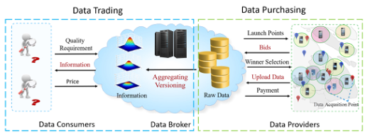

Fig. 1. Crowd-Sensed data market. 

probability distribution to capture data uncertainty and complex data correlation, and adopt a versioning technique to satisfy the diverse market demand. We also model the data purchasing process as a reverse auction in Bayesian environment. 

• Second, we design a profit-driven data acquisition mechanism, namely VENUS-PRO. Given the data consumers’ valuation distributions and expected payment of each of data acquisition points, we propose a post-pricing mechanism and a greedy data acquisition point selection algorithm to achieve a sub-optimal profit. 

• Third, we further consider the problem of payment minimization for data acquisition, and propose VENUS-PAY, which is a data procurement auction in Bayesian setting, achieving both strategy-proofness and optimal payment. 

• Finally, we evaluate the performance of VENUS-PRO and VENUS-PAY based on a real-world public sensed data set. Our evaluation results show that VENUS-PRO obtains a nearoptimal profit, while VENUS-PAY performs better than the classical second-price reverse auction. 

The rest of this paper is organized as follows. In Section II, we present a system model for the crowd-sensed data market. Given the expected payment for each data acquisition point, we design VENUS-PRO in Section III. In Section IV, we propose VENUS-PAY to determine the minimum payments of data acquisition points. We present our evaluation results in Section V, and review the related work in Section VI. Finally, we conclude the paper in Section VII. 

## II. PRELIMINARIES 

In this section, we describe data trading model and data purchasing model for profit-driven data acquisition in crowdsensed data markets. 

## _A. Data Trading Model_ 

As illustrated by Figure 1, in a crowd-sensed data market, the data broker wants to exchange the real-time information about the environment phenomena of a monitoring region for some profit, the data consumers would like to pay for this information to facilitate their data driven services, and the data providers want to earn payments for their contributed data. The data broker virtually deploys several _Data Acquisition Points_ to approximately represent the phenomena of the monitoring region. The data acquisition points can be regarded as some kind of Points of Interest (PoIs), on which the data broker wants to collect necessary sensed data to train the real-time information. According to the required quality of 

service (QoS) in specific crowd-sensed applications, the data broker can determine the quantity, density and physical locations of data acquisition points by exploiting some machine learning techniques, such as active learning [8]. Generally, if the data broker aims to extract accurate knowledge of the monitoring region, she would deploy fine-grained data acquisition points, but at the same time she has to disburse high payments for purchasing raw data from data providers. For example, indoor location service provider needs high precise and multi-dimensional sensed data, such as position, size, coordinates and orientation information of indoor landmark objectives, to reconstruct the map of indoor floor plan [15]. Due to the complex indoor environment, the service provider needs to deploy dense data acquisition points (at each store entrance) to collect sufficient sensed data, incurring a high data acquisition expenditure. In another scenario, the government can simply deploy sparse data acquisition points along the major roads or around shopping malls to roughly profile the noise level of metropolis [41], [42]. We denote the _L_ Data Acquisition Points by _Y_ = { _y_ 1 _, y_ 2 _,_ · · · _, yL_ }. We associate a discrete random variable _X y_ for each data acquisition point _y_ ∈ _Y_ , representing the possible measurements of the monitoring environment phenomena, and associate a set of discrete random variables _XY_ with a set of data acquisition points _Y_ ⊆ _Y_ . We note that the random variables may be correlated in multiple dimensions, _e.g._ , the temperatures of geographically proximate locations are likely to change synchronously [10]. We use the following major notations to define the data trading model. _1) Information Commodity:_ In the crowd-sensed data market, the information commodity is the joint distribution of random variables _XY_ over _T_ time slots. We do not restrict the joint distribution to any specific format, such that the joint distribution can capture different types of uncertainty and complex correlation among data. The _probability mass function p_� **x** _Y_ � assigns a probability for a possible valuation vector **x** _Y_ = _(x_ 1 _, x_ 2 _,_ · · · _, x L)_ to the random variables _XY_ . We can use historical data and expert knowledge to construct a rough prior probability mass function, and update it using the new observations from the data acquisition module. Suppose that we observe values **x** _O_ for the selected random variables _XO_ ⊆ _XY_ , we can use Bayes’ rule to condition our joint probability mass function _p(_ **x** _Y )_ on these observations: 

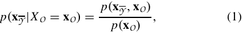

where _XY_=_XY_\_XO_isthesetofunobservedrandomvari- ables. The posterior distribution is more certain than the prior distribution. Here, we use _entropy_ to quantify the uncertainty of a distribution, considering its concise expression and nice properties, _e.g._ , monotonicity and submodularity.2 Specifically, the _conditional entropy_ of the unobserved normal random 

> 2We can also use some other alternative metrics, such as Kullback-Leibler divergence and Mutual Information [9], to quantify the uncertainty of the distributions. However, Kullback-Leibler divergence is too complex to be used in data trading, and mutual information does not satisfy neither monotonicity nor submodularity, which significantly increases the complexity of profit maximization. 

ZHENG _et al._ : TRADING DATA IN THE CROWD: PROFIT-DRIVEN DATA ACQUISITION FOR MOBILE CROWDSENSING 

489 

variables _XY_,afterobservingtheselectedrandomvariables _XO_ is: 

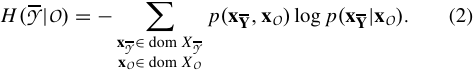

As time passes by, our belief about the observations of the random variables _XO_ will be “spread out”, increasing the uncertainty of the distribution. Thus, the data broker has to periodically collect new observations to maintain the entropy of the information commodity at a low level. 

_2) Version:_ In the crowd-sensed data market, data consumers may have diverse quality requirements over the information commodity, resulting in different valuations for the information commodity. To satisfy the diverse quality requirements of data consumers, the data broker would launch multiple versions for the information commodity, where a version is a posterior distribution with some selected observation random variables. We define the quality of the version _p(_ **x** _Y_|**x**_O)_asa function of its conditional entropy _H (Y_ | _O)_ : 

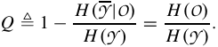

The second part of the equation holds given the property _H (Y_ | _O)_ = _H (Y )_ − _H (O)_ . From this definition, the quality of the version _p(_ **x** _Y_|**x**_O)_isdirectlyproportionaltothe_joint_ _entropy_ of the selected random variables _H (XO)_ , implying that the version will have a high quality if we choose the random variables with large joint entropy to observe. Generally, the data consumers with various quality requirements would have different willingness to pay. In order to extract revenue from these heterogeneous data consumers, the data broker leverages the technique of differential pricing [54] by selling the different versions of an information commodity at different prices. 

By conducting the standard market technique, such as survey, the data broker can determine the _K_ candidate versions and a quality vector **Q** = _(Q_ 1 _, Q_ 2 _,_ · · · _, Q K )_ , where _Qi < Qk_ , for all 1 ≤ _i < k_ ≤ _K_ .3 We define the quality gap between two successive versions _k_ and _k_ + 1 as: _�k_ ≜ _Qk_ +1 − _Qk_ , and denote the minimum value of all the _�_ ’s by _�min_ ≜ min _k_ { _�k_ }. In practice, the quality gap would be large enough to distinguish two successive versions, and we assume that _�min >_ max _i H (_ { _i_ } _)/H (Y )_ . We adopt the postpricing mechanism for data trading because of its convenience and popularity in practice. In the context of data trading, the post-pricing mechanism has several advantages compared with other trading formats, such as auction mechanisms. For example, the post-pricing mechanism can guarantee the robust economic properties, such as strategy-proofness, and handle the dynamical features of markets in a concise way. The data broker only has to determine a take-it-or-leave price, which is independent on the valuations and arrival sequence of data consumers. Specifically, the data broker assigns a _price pk_ for the _k_ th version, and denote the price menu for 

> 3The determination of the number of versions and the corresponding quality for each version is beyond the scope of this paper. Several previous works [4], [43], [53], [54] shed light on possible solutions for this problem. 

all the _K_ versions by **p** = _( p_ 1 _, p_ 2 _,_ · · · _, pK )_ . We discuss the determination of the optimal price for each version in Section III. 

_3) Data Consumers:_ There are _N_ single-minded data consumers in the data market. Each data consumer is interested in only one version of the information commodity, and has a valuation over this version.4 We assume that the version preference of the data consumers follows a distribution with a probability mass function _g(k)_ , meaning that the data consumers have a probability _g(k)_ to choose the _k_ th version as her interested version. Therefore, there are _Nk_ = _N_ × _g(k)_ data consumers, who are interested in the _k_ th version, in expectation. For the _k_ th version, we assume that the valuations of the _Nk_ data consumers are drawn from a distribution with _cumulative distribution function Vk(x)_ . We denote the vector of all valuation distributions by **V** = _(V_ 1 _(_ · _), V_ 2 _(_ · _),_ · · · _, VK (_ · _))_ . By learning the historical transactions, the data broker can obtain the knowledge of the distribution _g(k)_ and the vector **V** . This assumption is also called as Bayesian assumption in economic literature [29]. 

_4) Revenue:_ If the data consumer’s valuation is larger than the trading price of the kth version _pk_ , then she would purchase this version. In this case, the data broker would receive a revenue of _pk_ . The expected revenue of selling the _k_ th version to the _Nk_ data consumers is: 

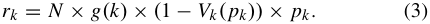

When the data broker creates the _k_ th version, despite of obtaining the revenue _rk_ , she can also extract revenue _ri_ from each of the version 1 ≤ _i < k_ lower than _k_ . This is because the data broker can degrade a high quality version to lower ones without inducing additional costs, _e.g._ , simply adding artificial noises or using less observations. Thus, the expected cumulative revenue of the _k_ th version should be _Rk_ =�_k_ _i_ =1_ri_. 

## _B. Data Purchasing Model_ 

Since the collected data becomes less accurate over time, the data broker has to periodically supply fresh data into the market. In the data trading model, the data broker would select different sets of data acquisition points to generate different versions of the information commodity. For each selected data acquisition point in one specific time slot, if the previous observation has been expired, meaning that it is not accurate enough to represent the environment phenomena, the data broker would purchase one new observation from a pool of active data providers. According to the “freshness” of the current observation and the accuracy requirement of each data acquisition point, the data broker determines the time slots to launch the data purchasing process for each data acquisition point. Thus, we can assume that the data collection procedures for different data acquisition points in different time slots are independent, so we focus on the data purchasing process for one data acquisition point in one specific time 

> 4We initialize the examination of data trading model with a simple purchasing behaviour model for data consumers, and leave more complex models to our future works. 

IEEE JOURNAL ON SELECTED AREAS IN COMMUNICATIONS, VOL. 35, NO. 2, FEBRUARY 2017 

490 

slot in the following discussion.5 We model the process of data purchasing as a single-item _data procurement auction_ , in which the data broker, also called as an auctioneer or a buyer, wants to buy one piece of data from _m y_ competitive data providers, also called as suppliers or sellers, for the data acquisition point _y_ ∈ _O_ in one specific time slot.6 The item being auctioned is the right to supply data, which can be considered as one kind of scarce resource. Auction mechanism is believed to be an effective way to allocate the scarce resource, because in procurement auction, the data broker can discover the true collection cost of data providers, and exploit the competition among the data providers to reduce the procurement payment. In a direct-revelation data procurement auction, the data providers simultaneously declare their bids to the data broker, who thereafter makes a decision on winner determination and payment to winner. We use some useful notations to define the data procurement auction model. 

_1) Data Provider:_ We denote the data providers by _My_ = {1 _,_ 2 _,_ · · · _, m y_ }. Each data provider _i_ ∈ _My_ has a data collection cost _ci_ , which is private information to her, and is known as _type_ in mechanism design. We consider a Bayesian setting, in which cost _ci_ is drawn from a publicly-known distribution _Fi (x)_ with a density function _fi (x)_ in the range [ _ci__,_ _ci_ ]. Let **F** = _(F_ 1 _(_ · _), F_ 2 _(_ · _),_ · · · _, Fm y (_ · _))_ denote the cost distributions of all data providers. We assume that the cost distributions are independent, but is not necessary to be identical. 

Each data provider _i_ ∈ _My_ declares a bid _bi_ to the data broker, meaning that she requests for a compensation of at least _bi_ to cover her cost. Since data providers are rational and selfish, they may not truthfully reveal their costs, _i.e._ , the bids may not necessarily be equal to the cost _ci_ . We denote the cost and bidding profile of all data providers by **c** = _(c_ 1 _, c_ 2 _,_ · · · _, cm y )_ and **b** = _(b_ 1 _, b_ 2 _,_ · · · _, bm y )_ , respectively. After collecting bidding profile, the auctioneer selects a winner, and determines payments for data providers. That is, a data procurement auction has two major components: 

• _Selection Rule_ : Choose a feasible selection rule **x** _(_ **b** _)_ = _(x_ 1 _(_ **b** _), x_ 2 _(_ **b** _),_ · · · _, xm y (_ **b** _))_ as a function of bidding profile **b** . _xi (_ **b** _)_ = 1 if data provider _i_ is the winner; otherwise _xi (_ **b** _)_ = 0. 

• _Payment Rule_ : Determine a payment vector **w** _(_ **b** _)_ = _(w_ 1 _(_ **b** _), w_ 2 _(_ **b** _),_ · · · _, wm y (_ **b** _))_ , where _wi (_ **b** _)_ is the payment for the data provider _i_ when the bidding profile is **b** . 

Data provider _i_ ∈ _My_ has a quasi-linear utility _ui (_ **b** _)_ on the bidding profile **b** , which is defined as the difference between payment and cost: _ui (_ **b** _)_ ≜ _wi (_ **b** _)_ − _ci_ × _xi (_ **b** _)._ 

_2) Expected Payment:_ The data broker determines _T_ time slots to collect data for the data acquisition point _y_ ∈ _Y_ , and 

> 5Considering the dependence among data purchasing processes in temporal dimensions would significantly increase the complexity of designing the data procurement auction. In dynamic data acquisition scenario, we should model the interdependent data processes as repeated procurement auctions or generalized online auctions, in which the data providers can participate in the data purchasing process in successive time slots. As the data providers can repeatedly interact with the data broker, there are more strategic behaviours for data providers to manipulate the auction to further increase their long-term utilities [1]. We will relax this assumption in our future work. 

> 6Our results can be extended to more flexible auction formats, _e.g._ , multiunit auctions or combinatorial auctions, adapting to the scenario, where one data acquisition point needs multiple observations to guarantee fault tolerance. 

the expected accumulated payment is: 

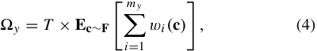

where **c** ∼ **F** means that the expectation is over the cost distributions. We use _�_ = { _�y_ | _y_ ∈ _Y_ } to denote the expected payments of all data acquisition points _Y_ . 

## _C. Problem Statement_ 

In data market, the data broker faces two closely relevant optimization problems: _Profit Maximization_ and _Payment Minimization_ . We formulate these two problems as follows. 

_1) Profit Maximization:_ Although the data broker can obtain large revenue by launching a version with high quality, at the same time, she has to disburse expensive expenditure to select more data acquisition points. Hence, the data broker prefers to select the “profitable” and “cheap” data acquisition points _O_ to observe, such that the obtained profit _�(O)_ is maximum. We define the profit as the difference between the obtained revenue and the disbursed expenditure: 

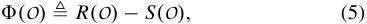

where _R(O)_ is the revenue generated by the selected data acquisition points _O_ , and _S(O)_ is the data acquisition expenditure for the data acquisition points _O_ , _i.e._ , _S(O)_ =� _y_ ∈ _O__�y_. We note that _R(O)_ is equal to the revenue _Rk_∗ of the version _k_∗ , which is the highest version that the selected points _O_ can reach, _i.e._ , _k_∗ ← arg max _k_ { _(H (O)/H (Y ))_ ≥ _Qk_ }. We can state the problem of profit maximization as: selecting a subset of data acquisition points _O_∗ , such that the obtained profit is maximized, _i.e._ , _O_∗ = arg max _O_ ⊆ _Y (R(O)_ − _S(O)) ._ In profit maximization, we assume that the expected payment _�y_ for each data acquisition point _y_ ∈ _Y_ is known in advance, and determine this expected payment in payment minimization module. Given the minimum payment for data acquisition points and the optimal revenue for each version, the profit maximization problem is actually a data acquisition point selection problem. _2) Payment Minimization:_ For each of data acquisition points, the frugal data broker always wants to purchase one piece of data with the lowest payment. In Bayesian environment, the data broker intends to design a data procurement auction that achieves the lowest expected payment _�y_ , where the expectation is with respect to the cost distributions **F** . 

The problems of profit maximization and payment minimization are closely related. On one hand, the output of payment minimization is the input of profit maximization. The minimum expected payment on each of data acquisition points, determined by the payment minimization procedure, directly affects the data acquisition point’s probability of being selected in the profit maximization subroutine. On the other hand, the result of profit maximization, _i.e._ , the selected data acquisition points, also has an impact on payment minimization. The solution to profit maximization is to make a trade-off between the revenue extracted from data trading and expenditure for data acquisition. The intuitive idea behind the solution is to select the data acquisition points with a lower payment and a 

ZHENG _et al._ : TRADING DATA IN THE CROWD: PROFIT-DRIVEN DATA ACQUISITION FOR MOBILE CROWDSENSING 

491 

high revenue contribution to final revenue. Under this selection rule, the data acquisition points with a large payment and a significantly high contribution would also have chances to be selected. In the long term, the data acquisition points with a large expected payment would attract more data providers, increasing the competition among bidders, and thus decreasing the payment in the end. 

## III. VENUS-PRO 

In this section, we propose a profit-driven data acquisition mechanism, namely VENUS-PRO, for profit maximization in the crowd-sensed data market. 

## _A. Detailed Design_ 

VENUS-PRO consists of two components: Revenue Determination and Acquisition Expenditure Calculation. 

_1) Revenue Determination:_ In contrast to physical goods, information commodity, regarded as one kind of digital goods, has a different cost structure, _i.e._ , a fixed cost of production, _e.g._ , a substantial data acquisition expenditure, but negligible marginal costs, _i.e._ , a lower cost of producing an additional copy. Under this special cost structure, the prices of the information commodity should be linked to the valuations of data consumers rather than the production costs. Thus, given the data consumers’ valuation distribution of the _k_ th version: _Vk(x)_ , the expected revenue of the _k_ th version with a trading price _p_ is: _(_ 1 − _Vk( p))_ × _p_ . Therefore, the data broker can set the optimal price _pk_ for the _k_ th version by 

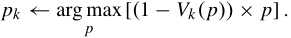

Under this optimal pricing strategy, the expected revenue for the _k_ th version is: 

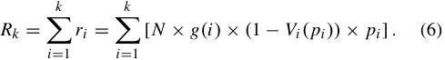

Given the optimal revenue for each version and the minimum payment for each of data acquisition points, the profit maximization problem is actually a data acquisition point selection problem: selecting a subset of data acquisition points _O_∗ , such that the obtained profit is maximized, _i.e._ , _O_∗ = arg max _O_ ⊆ _Y (R(O)_ − _S(O)) ._ Considering that the version preference distribution _g(i )_ and the valuation distributions _Vi ( p)_ can be quite complicated in the practical data market, the specific format of the revenue _R(O)_ (or _Rk_∗ ) (and then the profit _�(O)_ ) has unclear properties, making it difficult to directly solve the above profit maximization problem by adopting the classical optimization problem. In the following, we overcome this issue by transforming profit maximization problem to a solvable expenditure minimization problem, and designing an approximation algorithm for it. 

_2) Acquisition Expenditure Calculation:_ In the practical market, the commodity normally has a constant number of versions as a result of the trade-off between efficiency and complexity [47], [53]. It is obvious that the optimal number of the version for an information commodity is equal to the number of types of data consumers in the data market. Data consumers from different market segments have significantly 

different valuations for one data set, because they use the data set in diverse application scenarios. As the possible applications for one data set may be large, the data broker may not have a clear idea of the exact number of types of data consumers. For the market with no obvious market segments, some previous works [20], [48] in marking suggest that the optimal number of versions is three: a high-end version, a middle version, and a low-end version, which are also called as Goldilocks pricing in the literature. Furthermore, the maximum number of versions in practical data marketplaces is always small, _e.g._ , in Windows Azure Data Marketplace [56], the maximum number versions is no more than ten, and in Quandl [45], a financial and economic data trading platform, the data vendor offers most of data sets with four versions. Under this observation, our basic idea to solve the profit maximization is to enumerate the profit of each version and select the maximum one as the result. Specifically, in order to calculate the profit of the _k_ th version, by the definition of profit, we should know the possible highest revenue _Rk_ and its corresponding lowest data acquisition expenditure _S(O)_ . Although we can exactly calculate the highest revenue _Rk_ by Equation (6), it is nontrivial to figure out the minimum data acquisition expenditure _S(O)_ . We now formulate the problem of expenditure minimization for the _k_ th version as follows. 

**Problem:** _Expenditure Minimization for the kth version_ **Objective:** Minimize _S(O)_ **Subject to:** 

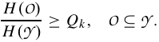

Here, the data broker attempts to select a set of acquisition points _O_ with the lowest acquisition expenditure, to satisfy the quality requirement of the _k_ th version. 

Unfortunately, the problem of expenditure minimization can be proven to NP-Hard by reducing from the general set covering problem [57]. Considering the computational intractability of the expenditure minimization problem, we present an alternative solution with a greedy acquisition points selection algorithm, to achieve a near-optimal expenditure in polynomial time. To this end, we take the advantage of the submodularity of entropy function _H (_ · _)_ . We first give the definition of submodular function. 

_Definition 1 (Submodular Function): Let X be a finite set. A function f_ : 2_X_ �→ R _is a submodular function if for any A_ ⊆ _B_ ⊆ _X and x_ ∈ _X_ \ _B:_ 

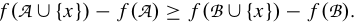

We show the entropy _H (_ · _)_ is submodular and non-decreasing. _Lemma 1: The entropy function H_ : 2_Y_ �→ R _is submodular, non-decreasing, and non-negative._ 

_Proof:_ To prove the submodularity, we first introduce an interesting property of entropy: the “information never hurts” principle [9]: _H (y_ | _O)_ ≤ _H (y)_ , for any _y_ ∈ _Y_ and _O_ ⊆ _Y_ , _i.e._ , in expectation, observing the random variables _XO_ cannot increase the uncertainty about the random variable _X y_ . Since the marginal entropy increase can be expressed as _H (y_ ∪ _O)_ − _H (O)_ = _H (y_ | _O)_ , the submodularity of the entropy 

IEEE JOURNAL ON SELECTED AREAS IN COMMUNICATIONS, VOL. 35, NO. 2, FEBRUARY 2017 

492 

**Algorithm 1** Greedy Data Acquisition Point Selection **Input** : A set of data acquisition points _Y_ , a set of expected payments _�_ , the quality _Qk_ of the _k_ th version. 

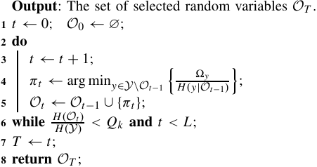

function is simply the consequence of the information never hurt principle: for any set _O_ ⊆ _O_′ ⊆ _Y_ , we have: 

**Algorithm 2** VENUS-PRO for Profit Maximization **Input** : A vector of valuation distributions **V** , a version preference distribution _g(k)_ , a set of random variables _Y_ , a set of expected payments _�_ , a quality vector **Q** . **Output** : A pair of profit and selected version _(�_∗ _, k_∗ _)_ . **1** _�_∗ ← 0; _k_∗ ← 0; **2 for** _k_ = 1 _to K_ **do** 

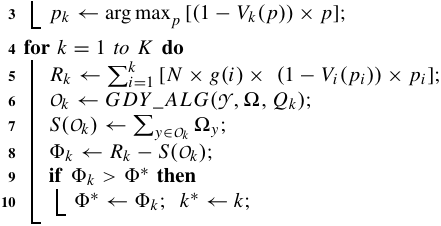

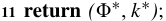

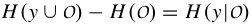

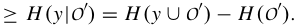

Contrary to the differential entropy, which can be negative, in the discrete case, the entropy is non-negative, _i.e._ , _H (y_ ∪ _O)_ − _H (y)_ = _H (y_ | _O)_ ≥ 0 for any set _O_ ⊆ _Y_ . Furthermore, _H (_ ∅ _)_ = 0. This demonstrates that the entropy function _H (_ · _)_ is non-negative and non-degreasing. □ 

By Lemma 1, the expenditure minimization is a submodular set covering problem. Greedy approach is a nature fit for submodular optimization [34], [57]. One nature greedy rule is to select the most “cost-efficient” acquisition point in each iteration, _i.e._ , the acquisition point with a lower expected payment and high marginal entropy. This simple and efficient heuristic rule has been widely adopted in the other variations of submodular set covering problems [14], [16], [55], [57]. Other greedy naive greedy rules, such as keep choosing the acquisition points with minimum expected payment, or keep choosing the acquisition points with the highest marginal entropy can experience arbitrary bad results in some extreme cases. We now describe the greedy data acquisition point selection algorithm for the problem of expenditure minimization in Algorithm 1. We use _Ot_ to denote the set of selected acquisition points until the _t_ th iterations, and initialize _O_ 0 to be ∅. In the _t_ th iteration, the data broker will select the data acquisition _y_ ∈ _Y_ \ _Ot_ −1 that has the smallest _�y/H (y_ | _Ot_ −1 _)_ , where _H (y_ | _Ot_ −1 _)_ = _H (y_ ∪ _Ot_ −1 _)_ − _H (Ot_ −1 _)_ represents the marginal entropy of the acquisition point _y_ , given the currently selected acquisition points _Ot_ −1.7 Let _πt_ denote the acquisition point selected in the _t_ th iteration. This selection process iterates until the normalized joint entropy of the selected acquisition points _H (Ot )/H (Y )_ is higher than the quality of the _k_ th version _Qk_ , or there are no more acquisition points to select (Lines 2 to 6). Algorithm 1 outputs the set of _T_ acquisition points _OT_ as the result. Since we have to check each unselected acquisition point in each iteration, and there 

> 7In large scale mobile crowdsensing systems, it is hard to compute the exact conditional entropy. We can adopt sampling approaches [33] to efficiently calculate such approximate conditional entropy within a tolerant error bound. 

are at most _L_ iterations, the time complexity of Algorithm 1 is _O(L_2 _)_ , where _L_ is the number of acquisition points. 

Combining revenue calculation with acqusition expenditure determination, we describe the detailed steps of VENUS-PRO in Algorithm 2. VENUS-PRO first calculates the optimal trading price for each version (Lines 2 to 3). Using this optimal trading price strategy, VENUS-PRO can figure out the maximum expected revenue _Rk_ for each version _k_ (Line 5). Although VENUS-PRO cannot obtain the minimum expenditure, it can get the approximate one by running Algorithm 1 (GDY_ALG for short) (Lines 6 to 7). Upon obtaining the expected revenue _Rk_ and the approximate expenditure _S(Ok)_ , = VENUS-PRO can calculate the approximate profit _�k Rk_ − _S(Ok)_ for each version _k_ . Among these _K_ candidate versions, VENUS-PRO chooses the one with the maximum approximate profit as the final result (Lines 9 to 10). Since VENUS-PRO calls GDY_ALG algorithm _K_ times, the computational complexity of VENUS-PRO is _O(K L_2 _)_ , where _K_ is the number of candidate versions. 

## _B. Analysis_ 

In this section, we analyze the approximation ratio of VENUS-PRO. We first present the performance guarantee of the greedy algorithm ( _i.e._ , Algorithm 1) for the problem of data acquisition expenditure minimization. 

_Theorem 1: We use O_∗ _to denote the optimal set of acquisition points for the problem of acquisition expenditure minimization. If Algorithm 1 is applied, we are guaranteed to obtain:_ 

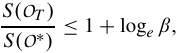

_H_′ _(Y )_ − _H_′ _(_ ∅ _) where β_ = min{ _β_ 1 _, β_ 2 _, β_ 3} _, and β_ 1 = _H_′ _(Y )_ − _H_′ _(OT_ −1 _)__,β_2= max _y_ ∈ _OT ,_ 1≤ _t_ ≤ _T_ � _HH_′′ _((yy_ || _OO_ 0 _t ))_:_H_′_(y_|_Ot) >_0 � _, β_ 3 =_θ_ _θT_′ 1′_. The func-_ _tion H_′ _(_ · _) is defined by H_′ _(O)_ ≜ min{ _H (O), H (Y )_ × _Qk_ } _, and �πt θt_′= _H_′ _(πt_ | _Ot_ −1 _)__._ 

ZHENG _et al._ : TRADING DATA IN THE CROWD: PROFIT-DRIVEN DATA ACQUISITION FOR MOBILE CROWDSENSING 

493 

_Proof:_ Designing greedy algorithms with good approximation factors for the problem of submodular set covering have been widely studied in submodular optimization literature [21], [22], [34], [57]. We can reduce the problem of acquisition expenditure minimization to a special submodular covering maximization: min _O_ ⊆ _Y_ � _S(O)_ : _H_ ′ _(O)_ = _H_ ′ _(Y )_ �, by introducing a new submodular and non-decreasing function _H_′ _(O)_ = min{ _H (O), H (Y )_ × _Qk_ }. It is easy to check that such special submodular covering formulation is equivalent to the original formulation described in Section III-A. Wolsey analyzed the approximation ratio of the greedy algorithm for this special submodular covering maximization problem in [57]. Thus, using the similar analysis technique, we can immediately obtain the approximation ratio of Algorithm 1 for the problem of acquisition expenditure minimization. □ Before presenting the approximation ratio of VENUS-PRO, we show a useful lemma. 

_Lemma 2: In the expenditure minimization for the version k, the optimal solution O_∗ _satisfies Qk_ ≤ _H (O_∗ _)/ H (Y ) < Qk_ +1 _._ 

_Proof:_ We first show that for any random variable _i_ ∈ _O_∗ , we have _H (O_ −∗ _i__)/H(Y )<Qk_,where_O_ −∗ _i_=_O_∗\{_i_}. If this inequality does not hold, _i.e._ , _H (O_ −∗ _i__)/H(Y )_≥_Qk_, we can get a better solution _O_ −∗ _i_for the problem of expenditure minimization. This is because _O_ −∗ _i_isafeasiblesolutionwhen _H (O_ −∗ _i__)/H(Y )_≥_Qk_, and the expenditure of random variables _O_ −∗ _i_iscertainlylessthanthatof_O_∗_i.e._,_S(O_ −∗ _i__)_≤_S(O_∗_)_. Therefore, _O_ −∗ _i_isbetterthantheoptimalsolution_O_∗,which makes a contradiction. 

We now prove _H (O_∗ _)/H (Y ) < Qk_ +1 by contradiction. Assume that _H (O_∗ _)/H (Y )_ ≥ _Qk_ +1. On one hand, combining with _H (O_ −∗ _i__)/H(Y ) <Qk_,wehave: 

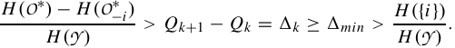

On the other hand, according to the submodularity of entropy function, we have: 

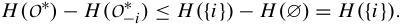

Here, we get a contradiction, and thus _H (O_∗ _)/H (Y ) < Qk_ +1. It is obvious that _Qk_ ≤ _H (O_∗ _)/H (Y )_ . Therefore, we can conclude that _Qk_ ≤ _H (O_∗ _)/H (Y ) < Qk_ +1. □ 

We now show that VENUS-PRO can achieve sub-optimal profit for each version. We use _�_∗ _k_and_�k_todenotethe optimal profit and the approximate profit of the version _k_ , respectively. It is obvious that _Rk_ ≥ _S(O_∗ _)_ , and we further assume that the revenue should be larger than the approximate expenditure, _i.e._ , _Rk_ ≥ _(_ 1 + log _e βk)S(O_∗ _)_ ≥ _S(OT )_ . Otherwise, the data broker may get negative approximate profit, and she would not sell the information commodity. 

_Lemma 3: For each version k, we have the following relation between the optimal profit and the approximate profit:_ 

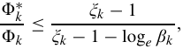

_where ξk denote the ratio between the revenue and the expenditure,_ i.e. _, ξk_ = _Rk/S(O_∗ _), and ξk_ ≥ 1 + log _e βk._ 

_Proof:_ By Lemma 2, the highest version that the optimal solution _O_∗ can achieve is exactly the version _k_ . By the definition of profit, we have: 

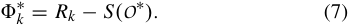

Furthermore, by Theorem 1, we have: 

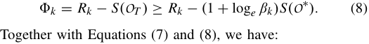

_�_∗ _k_ ≤ _Rk_ − _S(O_∗ _) ξk_ − 1 _._ □ _�k Rk_ − _(_ 1 + log _e βk)S(O_∗ _)_≤ _ξk_ − 1 − log _e βk_ 

Based on Lemma 3, We now present the approximation ratio of VENUS-PRO. 

_Theorem 2: For the profit maximization, the approximation ξk_ −1 _factor of VENUS-PRO is_ max _k ._ � _ξk_ −1−log _e βk_ � 

_Proof:_ We use _APX_ and _O PT_ to denote the profit obtained by VENUS-PRO and the optimal solution, respectively. VENUS-PRO selects the maximum approximate profit as the final result, _i.e._ , _APX_ = max _k_ { _�k_ }, and the optimal profit is the maximum profit of all versions, _i.e._ , _O PT_ = max _k_ { _�_∗ _k_}.UsingLemma3,weimmediatelyhave: 

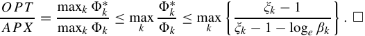

## IV. VENUS-PAY 

In VENUS-PRO, we assumed that the expected payment for each acquisition point is known. In this section, we determine this payment by designing an optimal and strategyproof data procurement auction, namely VENUS-PAY. We first briefly review related solution concepts used in this section from game theory. Secondly, we prove a useful theorem in the context of procurement auctions: _expected payment is equal to expected virtual social welfare_ , extending the main results of seminal Myerson’s work [39]. Thirdly, combining this theorem with the knowledge of cost distributions, we calculate the value of expected minimum payment before conducting the data procurement auction, and regard such obtained payments as the inputs of VENUS-PRO. Finally, we designed VENUS-PAY to realize this expected minimum payment. 

_A. Solution Concepts_ 

A strong solution concept from game theory is _dominant strategy_ . 

_Definition 2 (Dominant Strategy [13]): Strategy si is player i’s dominant strategy, if for any strategy si_′ ̸=_siand any_ _other players’ strategy profile_ **s** − _i : ui (si ,_ **s** − _i )_ ≥ _ui (si_′_,_**s**−_i)._ The concept of dominant strategy is the basis of _incentivecompatibility_ ( **IC** ), which means that there is no incentive for any player to lie about her private information, and thus revealing truthful information is the dominant strategy for every player. An accompanying concept is _individualrationality_ ( **IR** ), which means that every player participating in the game expects to gain no less utility than staying outside. As the utility of not participating in the game is normally zero, the individual-rationality requires that the utility of each player 

IEEE JOURNAL ON SELECTED AREAS IN COMMUNICATIONS, VOL. 35, NO. 2, FEBRUARY 2017 

494 

should be non-negative. We now can introduce the definition of _Strategy-Proof Mechanism_ . 

_Definition 3 (Strategy-Proof Mechanism [38]): A mechanism is strategy-proof when it satisfies both incentivecompatibility and individual-rationality._ 

According to Myerson’s theorem [39], a single-parameter procurement auction, in which bidders have single private information, _i.e._ , data collection cost in this paper, is strategyproof when its selection rule is monotone. 

_Theorem 3 (Myerson’s Theorem [39]): A single parameter procurement auction is strategy-proof if and only if:_ 

_Monotone Selection: A selection rule_ **x** _is monotone if for every bidder i and bids_ **b** − _i by the other bidders, the selection rule xi (bi_′_,_**b**−_i)toiisnon-increasinginitsbidb_ _i_′_._ In the seminal paper [39], Myerson proved that for strategyproof procurement auctions, the monotone selection rule implies a unique payment calculation rule: 

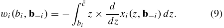

Here, we assume that _xi (z,_ **b** − _i )_ is differentiable.8 

According to Theorem 3, we can transform the design of a strategy-proof mechanism, guaranteeing the properties of incentive-compatibility ( **IC** ) and individual-rationality ( **IR** ) to the search for the monotone selection rule with good performance guarantee. 

Another standard solution concept from game theory is Nash Equilibrium (NE). A strategy profile **s**∗ is a Nash Equilibrium of a game, if for any player _i_ and any strategy _si_ ̸ = _si_∗, _ui (si ,_ **s**∗ − _i__)_≥_ui(s_ _i_′_,_**s**∗ − _i__)_.However,NEdoesnotprovidean ideal solution to the problem of data procurement. There are two reasons: (1) NE is not a very strong solution concept. Specifically, when in NE, the game player has incentives to keep her equilibrium strategy only under the assumption that all the other players are also keeping their equilibrium strategies. Without this assumption, NE no longer provides incentives for game player. (2) More importantly, NE usually has no guarantee on system performance, which means that the system performance is not optimized. When the system converge to one of NEs, the corresponding performance, such as social welfare or revenue, may be lower. In contrast to NE, the Dominant Strategy Equilibrium (DSE) or the strategyproofness ensures every player has incentive to use the equilibrium strategy, regardless of the other players’ strategies. We show that when the data procurement auction converge to DSE, the optimal expected payment is also achieved. Thus, the DSE-based auction mechanism is more desirable than the above NE-based mechanism in data acquisition process. 

## _B. Design Rationale_ 

The data procurement auction, in which the data broker wants to purchase one observation from a pool of competitive data providers with a minimum expected payment, can be considered as a reversed version of the Myerson auction [39]. 

> 8Actually, by standard advanced calculus, the same formula holds for an arbitrary monotone selection function, including piecewise constant function, for a suitable interpretation of the derivative and the corresponding integral. 

The main result in Myerson auction ( _i.e._ , maximizing expected revenue can be reduced to maximizing expected virtual social welfare) collapses in our context of data procurement auction. We theoretically prove a powerful theorem: _minimizing expected payment is equal to minimizing expected virtual social welfare_ . This theorem is the basis of designing the reverse auction with the goal of payment minimization. Before proving this theorem, we formally define _virtual cost_ in data procurement auctions. 

_Definition 4 (Virtual Cost): In a data procurement auction, the virtual cost of the data provider i_ ∈ _My with the cost ci drawn from Fi is defined as:_ 

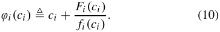

As the previous works [32], [39], we assume that the cost distribution _Fi (_ · _)_ is regular, _i.e._ , the virtual cost function _ϕi (ci )_ is a strictly increasing function, which is met by most of the distribution functions, such as uniform distributions, exponential distributions, and lognormal distributions. 

We prove our main result for data procurement auction. _Theorem 4: In a data procurement auction, the expected payment is equal to the expected virtual social welfare,_ i.e. _,_ 

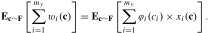

_Proof:_ We fix the costs of the other data providers as **c** − _i_ , and consider the expected payment of the provider _i_ : 

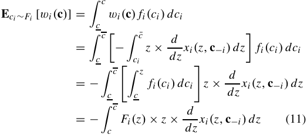

In the first equation, we exploit the independence of cost distributions, _i.e._ , the fixed value of **c** − _i_ has no impact on the distribution _Fi_ . The second equation comes from the Myerson’s payment formula (9). We reverse the integration order in the third equation. We adopt the method of integration by parts to make the integral a more interpretable form. 

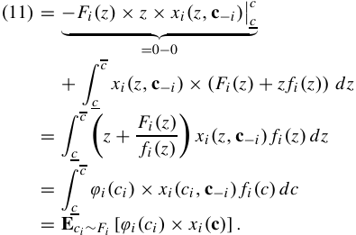

Finally, we have the equation for every bidder _i_ and a cost vector **c** − _i_ : **E** _ci_ ∼ _Fi_ [ _wi (_ **c** _)_ ] = **E** _ci_ ∼ _Fi_ [ _ϕi (ci )_ × _xi (_ **c** _)_ ] _._ 

495 

ZHENG _et al._ : TRADING DATA IN THE CROWD: PROFIT-DRIVEN DATA ACQUISITION FOR MOBILE CROWDSENSING 

We recall that **c** − _i_ is a vector of acquisition points, and we take the expectation, with respect to **c** − _i_ , of both sides of this equation to obtain: **Ec** ∼ **F** [ _wi (_ **c** _)_ ] = **Ec** ∼ **F** [ _ϕi (ci )_ × _xi (_ **c** _)_ ] _._ Applying linearity of expectations twice, we can get: 

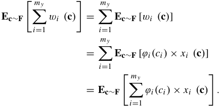

We refer to�_m_ _i_ =_y_ 1_ϕi(ci)_×_xi(_**c**_)_asthe_virtualsocialwelfare_ with a cost profile **c** . Thus, we have proved our claim. □ By Theorem 4, we will always choose the data provider with the lowest virtual cost as the winner. The minimum expected payment for the data acquisition point _y_ ∈ _Y_ can be expressed as: _�y_ = _T_ × **Ec** ∼ **F** [min _i ϕi (ci )_ ] _._ We can calculate this optimal payment with the knowledge of cost distributions **F** . For easy illustration, we introduce some notations. Let _ϕmin (_ **c** _)_ denote the minimum virtual cost for a given cost profile **c** , _i.e._ , _ϕmin (_ **c** _)_ ≜ min _i ϕi (ci )_ . We denote the cumulative distribution function of _ϕi (ci )_ by _Gi (z)_ , which can be derived from the cost distribution _Fi (x)_ , _i.e._ , _Gi (z)_ = _Fi (ϕi_−1 _(z))_ . Let _Gmin (z)_ denote the cumulative distribution function of _ϕmin (_ **c** _)_ : 

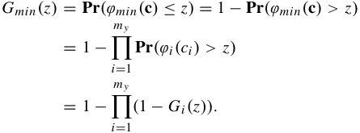

The payment _�y_ for each acquisition point _y_ ∈ _Y_ is: 

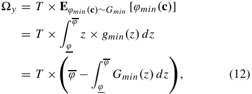

where _gmin(z)_ is the probability density function of the random variable _ϕmin(_ **c** _)_ , and the range [ _ϕ_ , _ϕ_ ] is the support of the random variable _ϕmin (_ **c** _)_ , _ϕ_ ≜ min _i ϕi (ci__)_and _ϕ_ ≜ max _i ϕi (ci )_ . We adopt the method of integration by parts in the last part of Equation (12). 

How should we design a selection rule **x** to realize this optimal payment? We have no control over the cost distributions **F** or the virtual cost functions _ϕi (ci )_ , so the natural approach is to design the selection rule **x** _(_ **c** _)_ , such that the achieved virtual social welfare is minimum for every possible input cost profile **c** . With this observation, we design an optimal procurement auction in next subsection. 

**Algorithm 3** VENUS-PAY for Payment Minimization 

**Input** : The number of data providers _m y_ , a bidding profile **b** , a vector of cost distributions **F** , a vector of corresponding probability density function **f** . 

**Output** : A pair of selection result and payment result _(_ **x** _(_ **b** _),_ **w** _(_ **b** _))_ . 

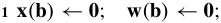

**2** // Winner Selection 

**3 for** _i_ = 1 _to m y_ **do** 

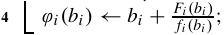

- **5** _i_∗ ← arg min _i ϕi (bi )_ ; 

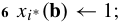

- **7** // Payment Calculation 

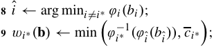

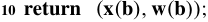

## _C. Detailed Design_ 

VENUS-PAY consists of two major components: Winner Selection and Payment Calculation. We depict the pseudo-code of VENUS-PAY in Algorithm 3. 

_1) Winner Selection:_ After collecting the bids **b** , the data broker calculates the virtual bid for each data provider by Equation (10) (Lines 3 to 4). Based on Theorem 4, minimizing the expected payment is equal to minimizing the expected virtual social welfare. Thus, in order to minimize the expected payment, the data broker chooses the data provider with the lowest virtual bid as the winner, _i.e._ , _xi_∗ _(_ **b** _)_ = 1 for _i_∗ = arg min _i_ { _ϕi (bi )_ } (Lines 5 to 6). We note that selecting the data provider with the lowest bid does not lead to an optimal data procurement auction. We break the tie following any bid-independent rule, _e.g._ , the lexicographic order of data provider’s ID. Due to the regularity of cost distributions, this winner selection rule is monotone. 

_Lemma 4: The selection rule in VENUS-PAY is monotone. Proof:_ To prove the monotonicity of the selection rule, we have to show that any winning data provider _i_∗ will still be selected as a winner when she decreases her cost, _ci_′∗≤_ci_∗.Sincethecostdistribution isregular,_i.e._, thevirtual cost function is a strictly increasing function, the virtual cost of _ci_′∗willnotbelargerthanthatof_ci_∗,_i.e._,_ϕi_∗_(c_ _i_′∗_)_≤ _ϕi_∗ _(ci_∗ _)_ . Therefore, the data provider _i_∗ will still be the winner, and the selection rule is monotone. □ 

_2) Payment Calculation:_ By Theorem 3, the monotone selection rule implies a unique payment calculation rule. We note that in the data procurement auction, the selection rule **x** is a piecewise constant monotone function, meaning that _xi (bi ,_ **b** − **i** _)_ slump from 1 to 0 at some threshold point. In this case, the payment calculated by Myerson’s formula (9) is equal to critical bid, which is defined as follows. 

_Definition 5 (Critical Bid): The critical bid cr (i ) for data provider i_ ∈ _My is a threshold such that if i bids lower than cr (i ), she wins; otherwise she loses._ 

The critical bid of the winner _i_∗ can be calculated by the following steps. If the data provider _i_∗ still wants to be the 

IEEE JOURNAL ON SELECTED AREAS IN COMMUNICATIONS, VOL. 35, NO. 2, FEBRUARY 2017 

496 

winner in the auction, her virtual cost _ϕi_∗ _(bi_∗ _)_ must be lower than the minimum virtual cost of the remaining data providers, _i.e._ , _ϕi_∗ _(bi_∗ _)_ ≤ min _i_ ̸= _i_∗ _ϕi (bi )_ ; otherwise she will lose the auction. Since the virtual cost function is a strictly increasing function, there must exist a largest bid that satisfies the above winning condition. Considering that this largest bid may be larger than _ci_∗ , we set the critical bid of the winner _i_∗ as: 

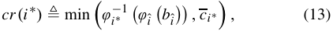

where _i_ˆ = arg min _i_ ̸= _i_ ∗ _ϕi (bi )_ . Finally, the payment of the winner _i_∗ is set as her critical bid _cr (i_∗ _)_ , and the payments of the losers are zero (Lines 8 to 9). 

By Lemma 4 and Theorem 3, we have following theorem. _Theorem 5: VENUS-PAY is a strategy-proof data procurement auction._ 

_Proof:_ We first show that data provider _i_ ∈ _My_ cannot obtain a higher utility by bidding untruthfully. We discuss the analysis in the following two cases. 

• The data provider _i_ wins the auction and gets an utility _ui_ ≥ 0 when bidding truthfully, _i.e._ , _bi_ = _ci_ . Suppose the data provider still wins the auction when she cheats the bid, _i.e._ , _bi_′ ̸=_ci_.Theutilityofthedataproviderremainsthesame, because the payment is unchanged. If the data provider loses the auction when she cheats the bid, her utility is zero, which is not better than the non-negative utility when bidding truthfully. 

• The data provider _i_ loses the auction when bidding truthfully, resulting in the utility to be zero. If she still loses when bidding untruthfully, her utility cannot be changed. We consider the scenario, in which she cheats the bid _b_′ _i_ ̸=_ci_ and wins the auction. We represent the virtual bids _ϕi (bi_′_)_ and _ϕi (bi )_ when the data consumer _i_ bids truthfully and untruthfully, respectively. According to the winner selection principle, we have _ϕi (bi_′_)_≤_ϕi(cr(i))_≤_ϕi(bi)_. As the virtual cost function _ϕi (_ · _)_ is strictly increasing with respective to the declared bid. We can get _bi_′≤_cr(i)_≤_bi_.Herutilitynow becomes non-positive: 

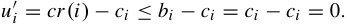

From the above analysis of two cases, we can see that the data provider _i_ cannot increases her utility by bidding any other value than _ci_ , and thus bidding truthfully is a dominant strategy for each data provider. Therefore, VENUS-PAY satisfies incentive compatibility. 

We next prove that VENUS-PAY satisfies the property of individual rationality. On one hand, data provider’s utility is zero if she loses in the auction. On the other hand, winning data provider gets utility: 

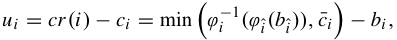

where _ϕi_ ˆ _(bi_ ˆ _)_ is the virtual bid of the critical bidder _i_ˆ , _i.e._ , _i_ ˆ = arg min _i_ ̸= _i_ ∗ _ϕi (bi )_ . On one hand, since the data provider _i_ is a winner and _ϕi (_ · _)_ is a strictly increasing function, we have _ϕi (bi )_ ≤ _ϕi_ ˆ _(bi_ ˆ _)_ and then _bi_ ≤ _ϕi_−1 _(ϕi_ ˆ _(bi_ ˆ _))_ . On the other hand, _c_ ¯ _i_ is the upper bound of the bid, _i.e._ , _bi_ ≤¯ _ci_ . Combining these two equalities, we have _bi_ ≤ min � _ϕi_−1 _(ϕi_ ˆ _(bi_ ˆ _)),_ ¯ _ci_ �, implying that the utility of the data provider is always non-negative in 

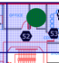

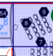

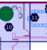

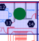

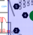

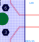

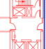

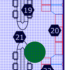

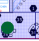

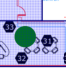

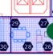

Fig. 2. Map of Intel Berkeley Lab deployment, with the placement of 54 sensors shown in dark hexagons. The green circles represent data acquisition points in the 12 regions. 

this scenario. Therefore, we can conclude that VENUS-PAY satisfies individual rationality. 

Since VENUS-PAY satisfies both incentive compatibility and individual rationality, according to Definition 3, VENUS-PAY is a strategy-proof mechanism. □ 

_Remark:_ We note that VENUS-PAY with i.i.d bidders and regular cost distributions **F** is simply the conventional secondprice auction. In this scenario, all the cost distributions **F** reduce to a common distribution _F_ , and thus the virtual cost functions _ϕi (ci )_ are the same for all bidders. The bidder with the lowest virtual cost is also the bidder with the lowest cost. Furthermore, according to the expression of critical bid (Equation (13)), the payment of the winner is exactly the second lowest bid. In the asymmetric case, the cost distributions are non-identical, but still independent and regular. VENUS-PAY does not generally resemble any auctions used in practice. In next section, we will show that VENUS-PAY outperforms the second price auction in the asymmetric case. 

## V. EVALUATION RESULTS 

In this section, we present the evaluation results of VENUS based on a real-world sensed data set. 

## _A. Sensed Data Set_ 

We first introduce the public data set collected by Intel Research, Berkeley Lab [19]. As shown in Figure 2, researchers deployed 54 Mica2Dot sensors in the lab to measure multiple environmental phenomena, _e.g._ , light, humidity, temperature and voltage readings. in a real time manner. We tailor the data set, and focus on the temperature measurements from all the 54 sensor nodes at 30 seconds intervals between February 28th, 2004 to April 5th, 2004. We discretize the collected data into 5 bins of 3 degrees Celsius each. We artificially partition the lab into 12 non-overlapped regions, and virtually deploy one data acquisition point in each of region, to represent the average of the readings measured by the sensors located in the corresponding region. We can use the collected samples to build a joint distribution over the 12 data acquisition points. For some selected random variables _XO_ , we can calculate its probability mass function _p(XO)_ by projecting the joint distribution _p(XY )_ over _XO_ . With Equations (1) and (2), we can calculate the conditional distribution and the corresponding conditional entropy for any selected random variables. 

ZHENG _et al._ : TRADING DATA IN THE CROWD: PROFIT-DRIVEN DATA ACQUISITION FOR MOBILE CROWDSENSING 

497 

## _B. Evaluation Setup_ 

We set the number of versions as _K_ = 8, and set the corresponding quality vector as **Q** = _(_ 0 _._ 25 _,_ 0 _._ 38 _,_ 0 _._ 53 _,_ 0 _._ 63 _,_ 0 _._ 70 _,_ 0 _._ 78 _,_ 0 _._ 89 _,_ 0 _._ 98 _)_ . We fix the number of data consumers as _N_ = 500 through the evaluation9 . In order to examine the performance of VENUS under different data consumers’ purchasing behavior models, we choose two typical version preference distributions and two common valuation distributions. Specifically, we adopt the _Poisson_ distributions with two different parameters (parameter _λ_ can be either 3 or 8) to be the version preference distributions. We set two types of valuation distributions as follows. 

▶ _Uniform Distribution:_ The data consumers’ valuations on the _k_ th version are uniformly distributed over a range [2 _k,_ 4 _k_ ]. 

▶ _Gaussian Distribution:_ The data consumers’ valuations over the _k_ th version are drawn from a Gaussian distribution with mean 3 _k_ and variance 3, and with a lower bound 0. 

Upon these distributions, we can obtain four different behavior models, and use “Poisson- _λ_ , Uniform (or Gaussian)” to denote the Poisson distribution with parameter _λ_ and the uniform (or Gaussian) valuation distribution. While the uniform distribution describes that data consumers have diverse valuations over the same set of data, the Gaussian distribution can capture the scenario that data consumers have similar valuations located in a centralized range. We note that the parameter setting of the valuation distributions guarantees that the valuation over the high version is always larger than that of the lower version. 

We evaluate the performance of VENUS-PAY for one randomly selected data acquisition point in a single time slot, _i.e._ , _T_ = 1. The number of data providers for this data acquisition point increases from 6 to 10 sequentially. We set the cost distribution of the data providers as exponential distributions. Specifically, the cost of data provider _i_ is drawn from the exponential distribution: 

where the support of the distribution is _(_ 0 _,_ ∞ _)_ . We further consider identical cost distributions and non-identical cost distributions scenarios in VENUS-PAY. In the identical case, we set the parameters _α_ to be 0 _._ 001 for all data providers, and in non-identical case, we set _αi_ = _e__i_ _/_ 105 for the data provider _i_ . All the results of performance are averaged over 1000 runs. 

_1) Performance of VENUS-PRO:_ We implement VENUSPRO, and compare its performance with the optimal algorithm and random algorithm. We obtain the optimal profit, denoted by “OPT”, using the brute-force search method for the problem of profit maximization. The “OPT” result is served as the reference of upper bound of profit. In “Random” algorithm, we first randomly select a version as the result, and then use a set of random data acquisition points to satisfy the quality 

> 9It is worth emphasizing that all parameters can be different from the ones used here. Considering that the evaluation results of using different parameters are identical, we only show the results for these parameters in this paper. 

Fig. 3. Revenue curves for the first three versions when the version preference distribution is Poisson distribution with parameter 3. 

requirement of the selected version. The existing works about data acquisition for mobile crowdsensing focused on other optimization objectives, such as cost minimization [32] and data quality [23], and ignored the revenue extracted from data trading in the market. Thus, we do not compare VENUS-PRO with the existing data acquisition mechanisms. 

With the knowledge of data consumers’ purchasing behavior models, we can plot the revenue curve _rk_ in Equation (3) with respective to price, for the first three versions. We set the version preference distribution as the Poisson distribution with parameter 3. We further examine the evaluation result of uniform valuation distribution and Gaussian valuation distribution in Figure 3(a) and Figure 3(b), respectively. We obtain the optimal expected revenue of each version by calculating the optimal price point of its corresponding revenue curve. After that, we can plot the optimal revenue for all of the versions in Figure 4(a). From Figure 4(a), we can see that the data broker obtains a large revenue by providing high version for the information commodity. This is because the high version can satisfy the data consumers with high quality requirements, extracting additional revenue from these data consumers. From Figure 4(a), we can also see that the revenue function with respective to version has different trends and properties, under different purchasing behavior models. This result demonstrates that the property of revenue function is indeed complex, and is hard to analyze in complicated data markets in terms of diverse purchasing behavior models, making directly solving the problem of profit maximization infeasible. 

In order to calculate the data acquisition expenditure, we have to know the minimum expected payment at each data acquisition point. In this set of experiments, we assume that data providers have the identical cost distributions, and the number of data providers at each data acquisition point is randomly chosen from [6] and [17]. With this information, we can calculate the minimum expected payment for each data acquisition point by Equation (12). For a fixed version, VENUS-PRO applies the greedy algorithm, _i.e._ , Algorithm 1, to calculate an approximate data acquisition expenditure, and the result is shown in Figure 4(b). From Figure 4(b), we can see that the expenditure becomes large when high version is provided in the data market. The reason is that we need to select more data acquisition points to assure the high quality requirement. We can also see that VENUS-PRO always outperforms the Random algorithm, and approaches to the optimum. 

Based on the obtained revenue ( _i.e._ , Figure 4(a)) and the acquisition expenditure ( _i.e._ , Figure 4(b)), we can plot the 

IEEE JOURNAL ON SELECTED AREAS IN COMMUNICATIONS, VOL. 35, NO. 2, FEBRUARY 2017 

498 

Fig. 4. Performance of VENUS-PRO, OPT, and Random. 

Fig. 5. Performance of VENUS-PAY, First-Price Auction, and Second-Price Auction. 

profits under different data consumers’ purchasing behavior models in Figure 4(c). The result shows that VENUS-PRO is very close to the optimum in all the four representative purchasing behavior models, demonstrating the efficiency of VENUS-PRO for the crowd-sensed data trading. We note that in the “Poisson-3, Uniform” model, the expected profit of the random algorithm is negative, so the data broker would not sell the information commodity. We omit the profit of the random algorithm in this case. 

_2) Performance of VENUS-PAY:_ We now present the evaluation results of VENUS-PAY. We implement VENUS-PAY, and compare its performance with two classical auctions: first-price auction and second-price auction. The non-truthful first-price auction always disburse less payment compared to VENUS-PAY, because VENUS-PAY overpays the winner to guarantee strategy-proofness. We compare the results of first-price auction and VENUS-PAY to illustrate the system performance degradation caused by the requirement of strategy-proofness. 

By varying the number of data providers, we collect a set of performance results, as illustrated in Figure 5. In Figure 5(a), VENUS-PAY has the same performance as the second-price auction in the identical cost distribution scenario. This coincides with our analysis that VENUS-PAY reduces to the second-price auction when the costs of data providers follow the same distribution. Figure 5(b) shows the evaluation results in the non-identical scenario. From Figure 5(b), we can see that VENUS-PAY outperforms the second-price auction, which does not take advantage of the knowledge of cost distributions. This result demonstrates that exploiting the information of cost distributions can reduce the expected payment to some extent. In both identical and non-identical cases, the result of VENUS-PAY is close to that of the first-price auction, denoting that VENUS-PAY sacrifices limited performance to 

satisfy the strategy-proofness. Although the first price auction always achieves the lowest disbursed payment, we can not apply it to the context of data procurement, because it has not any guarantee on economic properties. 

## VI. RELATED WORK 

In this section, we briefly review related work. 

## _A. Data Market Design_ 

In recent years, designing pricing mechanisms for online data markets attracts increasing interests, especially from database research community [3], [30], [31], [35]. These previous works mainly focused on designing computationally efficient and economic-robust data pricing mechanisms, achieving two important axioms, _i.e._ , arbitrage-free and discount-free [31]. Koutris _et al._ [30] showed that the prices of a large class of queries can be computed using an ILP solver. Later Lin and Kifer [35] designed an arbitrage-free pricing function for arbitrary query formats. However, these works did not consider the problem of data acquisition in data marketplaces. While there are a number of pricing mechanisms for different kinds of network services [27], [36], [37], [49], they cannot be directly applied into data marketplaces due to the unique characteristics of crowd-sensed data in terms of cost structure and uncertain feature. 

## _B. Mobile Crowdsensing_ 

Recently, mobile crowdsensing has emerged as a new paradigm to generate collective knowledge about phenomena at interested regions. Data acquisition is a critical component in mobile crowdsensing system, and various incentive mechanisms have been proposed to motivate mobile users to contribute data [7], [11], [18], [23], [25], [32], [58]. Yang _et al._ [58] applied Stackelberg game and reverse auction theory to design incentive mechanisms for two basic data acquisition models. Chen _et al._ [6] considered the network effect in user recruitment in crowdsoucing. Cheung _et al._ [7] designed an asynchronous and distributed algorithm to recruit mobile users for time sensitive tasks. Considering the locations of tasks and the movements of mobile users, He _et al._ [18] proposed two incentive mechanisms based on discountedreward TSP algorithm and bargaining theory. Inspired by opportunistic networks, Karaliopoulos _et al._ [25] examined a practical crowdsensing scenario, in which mobile users can play the roles of both data collectors and data transmitter. 

ZHENG _et al._ : TRADING DATA IN THE CROWD: PROFIT-DRIVEN DATA ACQUISITION FOR MOBILE CROWDSENSING 

499 

Karaliopoulos _et al._ [24] studied the payment distribution problem in light of learning the user profiles. Our data acquisition model for the problem of payment minimization is similar to Koutsopoulos [32], in which he designed an optimal reverse auction, achieving Bayesian Nash equilibrium. In this paper, we proposed an optimal data procurement auction with the guarantee of strategy-proofness, which is a stronger solution concept than Bayesian Nash equilibrium. Furthermore, we built a data trading model to capture the economic value of data in the market. Thus, our ultima goal is to extract maximum profit from data trading, which is different from the objective of minimizing the expected payment in [32]. 

## _C. Auction Mechanism Design_ 

Myerson [39] initially studied the optimal single-item forward auction, and proved that the prevalent reserve-price-based auctions can achieve maximum expected revenue. In contrast to the forward auction, few of works studied the procurement auction design. Procurement auctions, introduced to computer science already in [40], were at first studied to minimize social welfare [12], [40], which is different from our objective of payment minimization. Recently, researchers have studied the problem of payment optimization under different definitions of frugality ratio, which measures the amount by which an auction “overpays” [26], [28]. By extending Myerson’s seminal work, we designed the first strategy-proof and optimal procurement auction, and applied it into a new context of Internet economic system, _i.e._ , crwod-sensed data markets. 

## VII. CONCLUSION 

In this paper, by jointly considering the problems of profit maximization and payment minimization, we have proposed the first framework of profit-driven data acquisition, namely VENUS, in the crowd-sensed data marketplace. Given the expected payment for each data acquisition point, we have proposed VENUS-PRO to achieve a sub-optimal profit. In order to determine the minimum payment for each data acquisition point, we have designed VENUS-PAY, which is an optimal, strategy-proof data procurement auction in Bayesian setting. We have implemented VENUS, and evaluated its performance on a real-world data set. Our evaluation results have shown that VENUS-PRO approaches the optimal profit, and VENUS-PAY outperforms the canonical second-price auction in terms of payments. 

## ACKNOWLEDGMENT 

The authors would like to thank Wenxin Li for helpful discussions in the procurement auction design in Section III. The opinions, findings, conclusions, and recommendations expressed in this paper are those of the authors and do not necessarily reflect the views of the funding agencies or the government. 

## REFERENCES 

- [1] K. Amin, A. Rostamizadeh, and U. Syed, “Learning prices for repeated auctions with strategic buyers,” in _Proc. Adv. Neural Inf. Process. Syst. (NIPS)_ , South Lake Tahoe, CA, USA, Dec. 2013, pp. 1169–1177. 

- [2] A. Archer, C. Papadimitriou, K. Talwar, and É. Tardos, “An approximate truthful mechanism for combinatorial auctions with single parameter agents,” in _Proc. 14th Annu. ACM-SIAM Symp. Discrete Algorithms (SODA)_ , Baltimore, MD, USA, Jan. 2003, pp. 205–214. 

- [3] M. Balazinska, B. Howe, and D. Suciu, “Data markets in the cloud: An opportunity for the database community,” _Proc. VLDB Endowment_ , vol. 4, no. 12, pp. 1482–1485, 2011. 

- [4] H. K. Bhargava and V. Choudhary, “Research note—When is versioning optimal for information goods?” _Manage. Sci._ , vol. 54, no. 5, pp. 1029–1035, 2008. 

- [5] J.-M. Bohli, C. Sorge, and D. Westhoff, “Initial observations on economics, pricing, and penetration of the Internet of Things market,” _SIGCOMM Comput. Commun. Rev._ , vol. 39, no. 2, pp. 50–55, Apr. 2009. 

- [6] Y. Chen, B. Li, and Q. Zhang, “Incentivizing crowdsourcing systems with network effects,” in _Proc. 35th IEEE Int. Conf. Comput. Commun. (INFOCOM)_ , San Francisco, CA, USA, Apr. 2016, pp. 1–9. 

- [7] M. H. Cheung, R. Southwell, F. Hou, and J. Huang, “Distributed timesensitive task selection in mobile crowdsensing,” in _Proc. 16th ACM Symp. Mobile Ad Hoc Netw. Comput. (MobiHoc)_ , Hangzhou, China, Jun. 2015, pp. 157–166. 

- [8] D. Cohn, L. Atlas, and R. Ladner, “Improving generalization with active learning,” _Mach. Learn._ , vol. 15, no. 2, pp. 201–221, May 1994. 

- [9] T. M. Cover and J. A. Thomas, _Elements of Information Theory_ . Hoboken, NJ, USA: Wiley, 2012. 

- [10] A. Deshpande, C. Guestrin, S. R. Madden, J. M. Hellerstein, and W. Hong, “Model-driven data acquisition in sensor networks,” in _Proc. 13th Int. Conf. Very Large Data Bases (VLDB)_ , Toronto, ON, Canada, Aug. 2004, pp. 588–599. 

- [11] L. Duan, T. Kubo, K. Sugiyama, J. Huang, T. Hasegawa, and J. Walrand, “Incentive mechanisms for smartphone collaboration in data acquisition and distributed computing,” in _Proc. IEEE INFOCOM_ , Mar. 2012, pp. 1701–1709. 

- [12] J. Feigenbaum, C. Papadimitriou, R. Sami, and S. Shenker, “A BGPbased mechanism for lowest-cost routing,” _Distrib. Comput._ , vol. 18, no. 1, pp. 61–72, Jul. 2005. 

- [13] D. Fudenberg and J. Tirole, _Game Theory_ . Cambridge, MA, USA: MIT Press, 1991. 

- [14] T. Fujito, “Approximation algorithms for submodular set cover with applications,” _IEICE Trans. Inf. Syst._ , vol. 83, no. 3, pp. 480–487, Mar. 2000. 

- [15] R. Gao _et al._ , “Jigsaw: Indoor floor plan reconstruction via mobile crowdsensing,” in _Proc. 20th Int. Conf. Mobile Comput. Netw. (MobiCom)_ , Maui, HI, USA, Sep. 2014, pp. 249–260. 

- [16] L. Gargano and M. Hammar, “A note on submodular set cover on matroids,” _Discrete Math._ , vol. 309, no. 18, pp. 5739–5744, Sep. 2009. 

- [17] A. V. Goldberg and J. D. Hartline, “Collusion-resistant mechanisms for single-parameter agents,” in _Proc. 16th Annu. ACM-SIAM Symp. Discrete Algorithms (SODA)_ , Vancouver, BC, Canada, Jan. 2005, pp. 620–629. 

- [18] S. He, D.-H. Shin, J. Zhang, and J. Chen, “Toward optimal allocation of location dependent tasks in crowdsensing,” in _Proc. 33rd IEEE Int. Conf. Comput. Commun. (INFOCOM)_ , Toronto, ON, Canada, Apr. 2014, pp. 745–753. 

- [19] _Intel Research Berkeley Sensor Network Data_ . (2004). [Online]. Available: http://db.csail.mit.edu/labdata/labdata.html 

- [20] I. Simonson and A. Tversky, “Choice in context: Tradeoff contrast and extremeness aversion,” _J. Marketing Res._ , vol. 29, no. 3, pp. 281–295, 1992. 

- [21] R. K. Iyer and J. Bilmes, “Submodular optimization with submodular cover and submodular knapsack constraints,” in _Proc. Adv. Neural Inf. Process. Syst. (NIPS)_ , South Lake Tahoe, CA, USA, Dec. 2013, pp. 2436–2444. 

- [22] R. Iyer, S. Jegelka, and J. A. Bilmes, “Fast semidifferentialbased submodular function optimization,” in _Proc. 30th Int. Conf. Mach. Learn. (ICML)_ , Atlanta, GA, USA, Jun. 2013, pp. 855–863. 

- [23] H. Jin, L. Su, D. Chen, K. Nahrstedt, and J. Xu, “Quality of information aware incentive mechanisms for mobile crowd sensing systems,” in _Proc. 16th ACM Symp. Mobile Ad Hoc Netw. Comput. (MobiHoc)_ , Hangzhou, China, Jun. 2015, pp. 167–176. 

- [24] M. Karaliopoulos, I. Koutsopoulos, and M. Titsias, “First learn then earn: Optimizing mobile crowdsensing campaigns through data-driven user profiling,” in _Proc. 17th ACM Symp. Mobile Ad Hoc Netw. Comput. (MobiHoc)_ , Paderborn, Germany, Jul. 2016, pp. 271–280. 

500 

IEEE JOURNAL ON SELECTED AREAS IN COMMUNICATIONS, VOL. 35, NO. 2, FEBRUARY 2017 

- [25] M. Karaliopoulos, O. Telelis, and I. Koutsopoulos, “User recruitment for mobile crowdsensing over opportunistic networks,” in _Proc. 34th IEEE Int. Conf. Comput. Commun. (INFOCOM)_ , Hong Kong, Apr. 2015, pp. 2254–2262. 

- [26] A. R. Karlin and D. Kempe, “Beyond VCG: Frugality of truthful mechanisms,” in _Proc. 46th Annu. IEEE Symp. Found. Comput. Sci. (FOCS)_ , Oct. 2005, pp. 615–624. 

- [27] G. S. Kasbekar and S. Sarkar, “Spectrum pricing games with spatial reuse in cognitive radio networks,” _IEEE J. Sel. Areas Commun._ , vol. 30, no. 1, pp. 153–164, Jan. 2012. 

- [28] D. Kempe, M. Salek, and C. Moore, “Frugal and truthful auctions for vertex covers, flows and cuts,” in _Proc. 51th Annu. Symp. Foud. Comput. Sci. (FOCS)_ , Las Vegas, NV, USA, Oct. 2010, pp. 745–754. 

- [29] G. Koop, D. J. Poirier, and J. L. Tobias, _Bayesian Econometric Methods_ . Cambridge, U.K.: Cambridge Univ. Press, 2007. 

- [30] P. Koutris, P. Upadhyaya, M. Balazinska, B. Howe, and D. Suciu, “Toward practical query pricing with QueryMarket,” in _Proc. ACM SIGMOD Int. Conf. Manage. Data (SIGMOD)_ , New York, NY, USA, Jun. 2013, pp. 613–624. 

   - [53] V. Valancius, C. Lumezanu, N. Feamster, R. Johari, and V. V. Vazirani, “How many tiers?: Pricing in the Internet transit market,” in _Proc. ACM SIGCOMM Conf. Appl., Technol., Archit., Protocols Comput. Commun. (SIGCOMM)_ , Toronto, ON, Canada, Aug. 2011, pp. 194–205. 

   - [54] H. R. Varian, “Versioning information goods,” Univ. California, Berkeley, Berkeley, CA, USA, Tech. Rep., 1997. 

   - [55] P.-J. Wan, D.-Z. Du, P. Pardalos, and W. Wu, “Greedy approximations for minimum submodular cover with submodular cost,” _Comput. Optim. Appl._ , vol. 45, no. 2, pp. 463–474, Mar. 2010. 

   - [56] _Windows Azure Data Marketplace_ . [Online]. Avbailable: https:// datamarket:azure:com/browse/data. 

   - [57] L. A. Wolsey, “An analysis of the greedy algorithm for the submodular set covering problem,” _Combinatorica_ , vol. 2, no. 4, pp. 385–393, Dec. 1982. 

   - [58] D. Yang, G. Xue, X. Fang, and J. Tang, “Crowdsourcing to smartphones: Incentive mechanism design for mobile phone sensing,” in _Proc. 18th Int. Conf. Mobile Comput. Netw. (Mobicom)_ , Aug. 2012, pp. 173–184. 

- [31] P. Koutris, P. Upadhyaya, M. Balazinska, B. Howe, and D. Suciu, “Query-based data pricing,” _J. ACM_ , vol. 62, no. 5, Nov. 2015, Art. no. 43. 

- [32] I. Koutsopoulos, “Optimal incentive-driven design of participatory sensing systems,” in _Proc. IEEE INFOCOM_ , Apr. 2013, pp. 1402–1410. 

- [33] A. Krause and C. Guestrin, “Near-optimal nonmyopic value of information in graphical models,” in _Proc. 21st Conf. Uncertainty Artif. Intell. (UAI)_ , Edinburgh, Scotland, Jul. 2005, pp. 324–331. 

- [34] A. Krause and C. Guestrin, “A note on the budgeted maximization on submodular functions,” Dept. Comput. Sci., Carnegie Mellon Univ., Pittsburgh, PA, USA, Tech. Rep. CMU-CALD-05-103, 2005. 

- [35] B.-R. Lin and D. Kifer, “On arbitrage-free pricing for general data queries,” _Proc. VLDB Endowment_ , vol. 7, no. 9, pp. 757–768, May 2014. 

- [36] R. T. B. Ma, D. M. Chiu, J. C. S. Lui, V. Misra, and D. Rubenstein, “Internet economics: The use of shapley value for ISP settlement,” _IEEE/ACM Trans. Netw._ , vol. 18, no. 3, pp. 775–787, Jun. 2010. 

- [37] P. Marbach and R. Berry, “Downlink resource allocation and pricing for wireless networks,” in _Proc. 21st Annu. IEEE Conf. Comput. Commun. (INFOCOM)_ , New York, NY, USA, Jun. 2002, pp. 1470–1479. 

- [38] A. Mas-Colell, M. D. Whinston, and J. R. Green, _Microecon. Theory_ . London, U.K.: Oxford Univ. Press, 1995. 

- [39] R. B. Myerson, “Optimal auction design,” _Math. Oper. Res._ , vol. 6, no. 1, pp. 58–73, 1981. 

- [40] N. Nisan and A. Ronen, “Algorithmic mechanism design (extended abstract),” in _Proc. 31st Annu. Symp. Theory Comput. (STOC)_ , Atlanta, GA, USA, 1999, pp. 129–140. 

- [41] _NoiseMap: A Research Project at Technische Universität Darmstadt_ . [Online]. Available: https://www:tk:informatik:tu-darmstadt:de/de/ research/smarturban-networks/noisemap/ 

- [42] _NoiseTube: A Research Project at the Sony Computer Science Laboratory in Paris_ . (2008). [Online]. Available: http://www:noisetube:net/ 

- [43] A. Odlyzko, “Paris metro pricing for the Internet,” in _Proc. ACM Symp. Electron. Commerce (EC)_ , Denver, CO, USA, Oct. 1999, pp. 140–147. 

- [44] C. Papadimitriou, M. Schapira, and Y. Singer, “On the hardness of being truthful,” in _Proc. 49th Annu. Symp. Foud. Comput. Sci. (FOCS)_ , Philadelphia, PA, USA, Oct. 2008, pp. 250–259. 

- [45] _Quandl_ . (2011). [Online]. Available: https://www.quandl.com/ [46] A. Ronen and A. Saberi, “On the hardness of optimal auctions,” in _Proc. 43rd Annu. Symp. Foud. Comput. Sci. (FOCS)_ , Vancouver, BC, Canada, Oct. 2002, pp. 396–405. 

- [47] C. Shapiro and H. R. Varian, “Versioning: The smart way to sell information,” _Harvard Bus. Rev._ , vol. 107, no. 6, pp. 106–114, 1998. 

- [48] G. E. Smith and T. T. Nagle, “Frames of reference and buyers’ perception of price and value,” _California Manage. Rev._ , vol. 38, no. 1, pp. 98–116, 1995. 

- [49] J. Tadrous, A. Eryilmaz, and H. El Gamal, “Pricing for demand shaping and proactive download in smart data networks,” in _Proc. IEEE INFOCOM_ , Apr. 2013, pp. 3189–3194. 

- [50] _Terbin_ . (2013). [Online]. available: http://www.terbine.com [51] _Thingful_ . (2014). [Online]. Available: https://thingful.net/ 

- [52] _Thingspeak_ . (2010). [Online]. Available: https://thingspeak.com/ 

**Zhenzhe Zheng** (S’16) is currently pursuing the Ph.D. degree with the Department of Computer Science and Engineering, Shanghai Jiao Tong University, China. His research interests include algorithmic game theory, resource management in wireless networking, and data center. He is a student member of ACM and CCF. **Yanqing Peng** received the B.Eng. degree in computer science and engineering from Shanghai Jiao Tong University, in 2016. He is currently pursuing the Ph.D. degree with the School of Computing, University of Utah, USA. His research interests include wireless networking, data center networking, algorithmic game theory, and large-scale data management. **Fan Wu** (M’14) received the B.S. degree in computer science from Nanjing University, in 2004, and the Ph.D. degree in computer science and engineering from The State University of New York at Buffalo, in 2009. He is currently an Associate Professor with the Department of Computer Science and Engineering, Shanghai Jiao Tong University. He has visited the University of Illinois at Urbana–Champaign, as a Post-Doctoral Research Associate. He has published over 100 peer-reviewed papers in technical journals and conference proceedings. His research interests include wireless networking and mobile computing, algorithmic game theory and its applications, and privacy preservation. He is a recipient of the first-class prize for Natural Science Award of China Ministry of Education, the NSFC Excellent Young Scholars Program, the ACM China Rising Star Award, the CCF-Tencent Rhinoceros Bird Outstanding Award, the CCF-Intel Young Faculty Researcher Program Award, and the Pujiang Scholar. He has served as the Chair of CCF YOCSEF Shanghai, on the Editorial Board of _Elsevier Computer Communications_ , and as the member of the Technical Program Committees of over 60 academic conferences. 

501 

ZHENG _et al._ : TRADING DATA IN THE CROWD: PROFIT-DRIVEN DATA ACQUISITION FOR MOBILE CROWDSENSING 

**Shaojie Tang** (M’15) received the Ph.D. degree in computer science from the Illinois Institute of Technology, in 2012. He is currently an Assistant Professor with the Naveen Jindal School of Management, The University of Texas at Dallas. His research interest includes social networks, mobile commerce, game theory, e-business, and optimization. He received the Best Paper Awards in ACM MobiHoc 2014 and the IEEE MASS 2013. He also received the ACM SIGMobile Service Award in 2014. He served in various positions (as chairs and TPC members) at numerous conferences, including the ACM MobiHoc and the IEEE ICNP. He is an Editor of the _Elsevier Information Processing in the Agriculture_ and the _International Journal of Distributed Sensor Networks_ . 

**Guihai Chen** (SM’16) received the B.S. degree from Nanjing University, in 1984, the M.E. degree from Southeast University, in 1987, and the Ph.D. degree from The University of Hong Kong, in 1997. He has been invited as a Visiting Professor to many universities, including Kyushu Institute of Technology, Japan, in 1998, The University of Queensland, Australia, in 2000, and Wayne State University, USA, from 2001 to 2003. He is a Distinguished Professor with Shanghai Jiaotong University, China. He has published over 200 peer-reviewed papers, and over 120 of them are in well-archived international journals, such as the IEEE TRANSACTIONS ON PARALLEL AND DISTRIBUTED SYSTEMS, the _Journal of Parallel and Distributed Computing_ , _Wireless Network_ , _The Computer Journal_ , the _International Journal of Foundations of Computer Science_ , and _Performance Evaluation_ . His research interests include sensor network, peer-to-peer computing, high-performance computer architecture, and combinatorics. He is also in well-known conference proceedings, such as HPCA, MOBIHOC, INFOCOM, ICNP, ICPP, IPDPS, and ICDCS. 

