# Strategy-Proof Online Mechanisms for Weighted AoI Minimization in Edge Computing 

Hongtao Lv, _Student Member, IEEE,_ Zhenzhe Zheng, _Member, IEEE,_ Fan Wu, _Member, IEEE,_ and Guihai Chen, _Senior Member, IEEE_ 

**_Abstract_ —Real-time information processing is critical to the success of diverse applications from many areas. Age of Information (AoI), as a new metric, has received considerable attentions to evaluate the performance of real-time information processing systems. In recent years, edge computing is becoming an efficient paradigm to reduce the AoI and to provide the realtime services. Considering the substantial deployment cost and the resulting resource limitation in edge computing, a proper pricing mechanism is highly necessary to fully utilize edge resources and then minimize the overall AoI of the whole system. However, there are two challenges to design this mechanism: 1) the priorities (or values) of the real-time computing tasks, critical to the efficient resource allocation, are usually private information of users and may be manipulated by selfish users for their own interests; 2) due to the time-varying property of AoI, the values over the tasks discount with time, making the traditional pricing mechanisms infeasible. In this paper, we extend the classical Myerson Theorem to the online setting with time discounting tasks values, and accordingly propose online auction mechanisms, called PreDisc, including an allocation rule and a payment rule. We leverage dynamic programming to greedily allocate resources in each time slot, and charge the winning user with a new critical price, extended from the classical Myerson payment rule. A preemption factor is further employed to make a trade-off between the newly arrived tasks and ongoing tasks. We prove that PreDisc guarantees the economic property of strategy-proofness and achieves a constant competitive ratio. We conduct extensive simulations and the results demonstrate that PreDisc outperforms the traditional mechanisms, in terms of both weighted AoI and revenue of edge service providers. Compared with the optimal solution in offline VCG mechanism, PreDisc has much lower computation complexity with only a slight performance loss.** 

## I. INTRODUCTION 

In recent years, real-time information processing is prevailing in many areas, such as autonomous vehicles [1], online gaming [2], virtual reality (VR) [3] and multi-robot systems [4]. In order to evaluate the performance of real-time information processing systems, a new metric called age of information (AoI) was proposed in [5], and has received considerable attentions recently [6]–[10]. Different from traditional performance metrics like delay and throughput, the metric of AoI takes the freshness of decision-making information into account. For example, if the user sends tasks with a very low frequency, the system performs well on delay but poorly on AoI, because a lack of timely decision update makes the received decision out of date. Thus, AoI is widely adopted as a more reasonable metric in real-time computing applications. 

The traditional centralized cloud computing mode does not satisfy the stringent requirement of AoI in real-time information processing system, because end devices have 

to send data to remote cloud for processing with a high network delay. Edge computing [11], as a new computing paradigm, is quite attracted to further reduce the AoI in realtime applications. In edge computing, edge servers (also called cloudlets) are deployed near end devices, and such physical proximity can significantly reduce transmission delay and also AoI. For example, in autonomous vehicle systems with cloud computing mode, the transmission time between the vehicle and the remote cloud server is about 150ms, while with the assistance of edge servers, ultra-low latency (less than 1ms) can be achieved [12], [13]. Many real-time applications like online gaming and VR also have improvements in AoI and hence in system performance and user experience by using edge computing mode [2]. 

Although edge computing achieves attractive performance improvement in terms of reducing AoI, it also introduces additional cost for distributed deployment and maintenance [11], [14]. Due to this cost constraint, the computation resources of edge servers are usually limited, which may result in the degradation of overall service performance [15]. Therefore, on one hand, it is a promising idea to consider the paradigm of edge-cloud collaboration, combining the low latency of edge and the sufficient resources of remote cloud [12], [16]. On the other hand, a proper pricing mechanism is necessary to fully utilize the limited edge resources and to compensate the cost of edge service providers [17]. 

It is quite challenging to design a pricing mechanism for edge services in real-time information processing systems. The service provider would like to efficiently manage the limited edge resources by assigning large weights (or priorities) to urgent tasks. We measure the extent of task urgency by a concept of _value_ (please refer to Section II for a specific definition), which is related to private information of users, such as the driving speed and the surrounding environment in self-driving systems. As the values of tasks are the private information of users, they would manipulate this information, if doing so can increase the priorities of their tasks, resulting in the chaos of market and then the degradation of resource utilization. Therefore, the pricing mechanisms should be carefully designed to resist the strategic behaviors of users. In previous literature, a dynamic pricing rule [18] is studied to minimize the AoI for a crowdsourcing platform, encouraging users to sample the real-time information in different rates. However, the sampling rate can be easily detected, and hence there are no strategic behaviors in this case. 

Other than the difficulty in guaranteeing the strategy- 

proofness1 , the dynamic property and the time discounting values of tasks also bring obstacles to the design of pricing mechanisms. On one hand, since the tasks of users arrive at the edge in an online manner, the edge server needs to schedule them online, without the knowledge of future tasks. The classical Vickrey-Clarke-Groves (VCG) mechanism [19]– [21] could not be directly applied into this online setting, as it needs to calculate the optimal offline allocation and hence is normally computationally intractable. On the other hand, since the AoIs of real-time decisions increase with time, the values of tasks would discount if they are delayed for execution. The time changing value enables the users to have a large space to further manipulate the mechanisms, i.e., users can win the resource at different time slots by misreporting their values. The existing online mechanisms [22], [23], by which each winning task is charged a predefined payment without considering the time-discounting value, would be no longer strategy-proof, and thus is inapplicable for AoI minimization under strategic environments. 

To address these challenges, in this paper, we adopt a cloudedge collaborative framework to optimize the weighted AoI of real-time decision tasks. The edge servers are employed to conduct urgent tasks, and the remote cloud server is considered as a backup mode to make decisions for users when the edge services are not available. We further propose an online auction mechanism for weighted AoI minimization, where users arrive at the auction dynamically, submit their tasks and corresponding task values to the edge server, and wait for the timely results of decisions before a certain deadline. Based on the reported values, the edge service providers calculate the reductions of weighted AoI for tasks at each time slot, and schedule the tasks to execute, with the goal of minimizing the overall weighted AoIs of all tasks. The edge service provider also determines the prices for users to guarantee the property of strategy-proofness, and then the users pay for the edge service at the required price. 

The main contributions of this paper are summarized as follows. 

- We deeply investigate two critical aspects of AoI optimization in edge computing: the potential strategic behaviors of users and the time-varying property of AoI. Based on the appropriate models for these two aspects, we then formulate the problem of weighted AoI minimization as an online mechanism design with time discounting values. The challenges in designing online mechanisms due to the new property of time discounting values have also been fully discussed. 

- We extend the celebrated Myerson theorem [24] to the online setting with time discounting values, which provides a fundamental criterion for pricing mechanism design in AoI optimization problems within strategic environments. Such a result would also have independent interests in mechanism design literature. 

- We propose a <u>Preemption</u> factor-based pricing mechanism with time <u>Discounting</u> values (PreDisc) to allocate 

> 1In a strategy-proof mechanism, the users would truthfully reveal their private information, _i.e._ , the values of tasks in our context. Please refer to Section II for detailed definition. 

computing resources on the edge server. PreDisc assigns a high virtual value to ongoing tasks to avoid unnecessary preemptions of newly arrived tasks, making a desirable tradeoff between preemption and non-preemption. Our theoretical analysis shows that PreDisc guarantees both strategy-proofness and constant competitive ratio. 

- We evaluate the performance of our proposed mechanism with extensive experiments. The evaluation results demonstrate that PreDisc outperforms the existing FirstCome-First-Served (FCFS) and Last-Come-First-Served (LCFS) mechanisms, and approaches to the optimal solution of offline VCG mechanism. 

The paper is organized as follows. Section II introduces the model and the basic background knowledge. Section III characterizes the property of strategy-proofness. Section IV and Section V focus on the detailed design of PreDisc. In Section IV, we introduce the allocation and payment rules in PreDisc for tasks with unit edge execution time, and then give an analysis for the upper bound of competitive ratio compared with the offline optimal solution. Section V extends our mechanism to the general cases. In Section VI, we give the simulation results on weighted AoI and the revenue of edge service provider. Section VII reviews the related works. Finally, we conclude this paper in Section VIII. 

## II. PRELIMINARIES 

In this section, we introduce the model of online auction mechanism with time discounting task values in the context of edge computing, and briefly review the related solution concepts used in this paper from game theory. 

## _A. System Model_ 

We consider a cloud-edge collaborative computing framework including two components to facilitate users to make real-time decisions. A cloud server with adequate computing resources is normally far away from users, so the timeliness cannot be guaranteed if only use the cloud server for decision making. In contrast, a nearby edge server has a timely response for users, but can only support a certain amount of tasks simultaneously due to the limited edge resources. 

A user communicates with the cloud server periodically in a normal mode. For instance, as illustrated by the blue dashed line in Fig. 1, user 1 sends a task to the cloud server at each time interval ∆ _t_ , and receives a decision feedback after a time period _T_ c. The overall processing time from the cloud server (including the network delay and the computing time) is usually long, because the remote cloud is far away from the user. We assume that the overall cloud processing time _T_ c is identical for all users as the time differences among users are negligible compared with the large overall processing time. The _Age of Information (AoI)_ for a user at a certain time is defined as the difference between this time and the generating time of the latest received decision-making result. For example, in Fig. 1, at time _t_ 3, the AoI of user 1 is _T_ c, since the newly received decision is generated before a time period _T_ c. After time _t_ 3, the AoI increases over time, reaches the highest AoI _T_ c + ∆ _t_ at time _t_ 4, and then drops to _T_ c since 

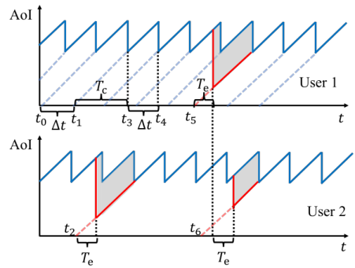

Fig. 1. The illustration of AoI for two users. 

the next decision is received. Thus, without the involvement of an edge server, the AoI fluctuates steadily at a relatively high level (see the blue solid line in Fig. 1). 

When a user encounters an emergency task ( _e.g._ , for a self-driving system, some urgent traffic situations need timely decisions), the user also sends the task to a nearby edge server, looking for a quick response. For example, in Fig. 1, at time _t_ 2, user 2 sends the task to both the cloud and the edge server, and receives a quick feedback from the edge server after time _T_ e (also from the cloud server after time _T_ c). The communication time between users and the edge server has an ultra-low latency, so it is reasonable to omit the communication time. We consider _T_ e as only the computing time on the edge server. Also due to the property of ultra-low latency, _T_ e is always smaller than _T_ c, and hence AoI can be reduced with the help of edge server, as shown by the red solid line in Fig. 1. Furthermore, as only emergency tasks are uploaded to the edge server, we assume the emergency tasks from the same user are non-overlapping with each other. For tasks with different computing complexity, we consider a transparent service mode, that is, the edge server completes them within an identical execution time via allocating different computing resources. Thus, the task _i_ from the user _j_ would demand _m_ i, j units of resources, which is a public information determined by the edge server. We assume the resource demand _m_ i, j to be discrete for simplicity in our model. Since computing resources at the edge are costly and limited, there may be conflicts among users in resource usage. For example, at time _t_ 5 in Fig. 1, user 1 sends a task to an edge server, and shortly after that, user 2 also sends a task to the same edge server at time _t_ 6. However, the edge server does not have enough computing resources to satisfy the demands for both users, and needs to schedule the tasks from these two users in an appropriate way. In addition, if _T_ e is larger than 1, a more emergency task may also preempt another ongoing task for a better utilization of edge resources2 . 

As the timeliness of decisions is critical for the success of real-time information processing applications, _e.g._ , it may 

influence the safety of self-driving cars or the user experience in interactive gaming, the objective of each user _j_ is to minimize the weighted average AoI over time, denoted as _A_ j. The weight captures the extent of emergency of tasks, and can also be interpreted as the amount of money the user is willing to pay to exchange for the decrease of AoI. For each urgent task _i_ , the value ( _i.e._ , weight) vi, j is reported by the user _j_ , and it may depend on many kinds of factors. For example, in an autonomous vehicle system, the urgency of a task depends on the driving speed, the vehicle performance, the surrounding environment, and so on. Since these factors are only accessible by the user, she is able to misreport the value vi, j for her own interest, e.g., declaring a large value to increase the priority of her task, and reduce the weighted AoI. Such a selfish behavior would degrade the system performance of the edge service, as a more urgent task may be preempted by a non-urgent task with a misreported high value. With such a consideration, we leverage an auction mechanism to incentivize the users to truthfully reveal their private information, and to efficiently allocate the limited edge resources to minimize the weighted average AoI of all users. 

## _B. Problem Formulation_ 

We consider the edge server with _W_ units of reusable homogeneous resources in a finite time horizon, which can be further divided into _T_ time slots with equal length: T = {1, 2, · · · , _T_ }. Suppose the set of tasks3 produced by user _j_ is _U_ j, task _i_ ∈ _U_ j arrives at time slot _a_ i, j, and then it should be completed before a deadline at departure time _d_ i, j = _a_ i, j + _T_ c, because the decision made by the edge server becomes useless when the decision from the cloud server is also received after _T_ c time slots. We denote Ti, j as the set of all time slots in [ _a_ i, j, _d_ i, j] for task _i_ of user _j_ , and denote the set of other time slots _t_ � ∪i ∈Uj Ti, j by� Tj. To calculate the weighted average AoI _A_ j of user _j_ , we denote the age at time _t_ as _A_ j( _t_ ), the age produced by the cloud server ( _i.e._ , the blue solid line in Fig. 1) as _C_ j( _t_ ), and the age produced by the edge server ( _i.e._ , the red solid line in Fig. 1) as _E_ j( _t_ ). If the AoI at time slot _t_ is not produced by the edge server, we set _E_ j( _t_ ) = +∞. With these definitions, we can have 

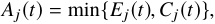

and we can then get the weighted average AoI, 

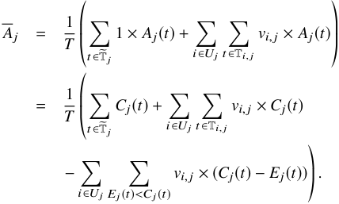

> 3As we focus on the emergency tasks on the edge, we do not distinguish “task" and “emergency task" in the following sections. 

> 2In such a case, we assume the preempted task needs to start over if it is selected next time. 

As the first two items in the brackets are constants and the tasks are non-overlapping, we only need to maximize the third item� E j (t)<C j (t)v i, j× (_C_ j(_t_) −_E_ j(_t_))foreachtask independently, which represents the reduction of the weighted AoI during the current task interval, _i.e._ , each of the shadow areas in Fig. 1. For easy presentation, we duplicate a user, also called as an agent, for each task, and use vi directly to denote vi, j. Suppose the edge server starts to execute the task _i_ at time _t_ i, j without an interruption in the following _T_ e time slots, we can then obtain 

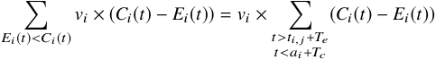

which is a function with respect to starting time _t_ i, j. Thus, we denote 

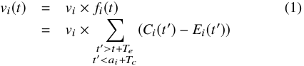

as the task value if it starts to execute at time slot _t_ , with _a_ i ≤ _t_ ≤ _a_ i + _T_ c − _T_ e. We do not restrict _C_ i( _t_′ ) and _E_ i( _t_′ ) to any specific (e.g., linear) format, but only require that each of these two functions has the identical format for all tasks. Since we have _E_ i( _t_ ) < _C_ i( _t_ ) during the considered time interval, we can get that _f_ i( _t_ ) is non-negative and non-increasing, meaning that the task value is discounting over time. Some possible function _f_ i( _t_ ) could be _f_ i( _t_ ) = η(t−ai) or _f_ i( _t_ ) = 1 − β( _t_ − _a_ i), where parameters η ∈(0, 1) and β ∈(0, 1) are shared by all agents. We note that all users are associated with the identical format of function _f_ i( _t_ ), but could have different parameter of the arrival time _a_ i, Without loss of generality, we normalize _f_ i( _a_ i) = 1. 

With the concept of task value, we can further formulate the problem of weighted AoI minimization as follows. There are _n_ agents N = {1, 2, · · · , _N_ } arriving at the system in a random order. Each agent _i_ ∈ N arrives at time _a_ i, and demands for _m_ i resources to execute her task before a departure time _d_ i. For simplicity of notations, we also denote _d_ i′=_a_i+_T_c−_T_e as the latest starting time for task _i_ to be able to be completed in time. Each agent _i_ has an intrinsic task value vi and a time-varying task value vi( _t_ ) once she is allocated _m_ i units of resources from the time _t_ for _T_ e consecutive time slots. We note vi = vi( _a_ i) as vi( _a_ i) = vi × _f_ i( _a_ i) and _f_ i( _a_ i) = 1. As discussed in the previous section, the agent _i_ ’s time-varying value function can be expressed as 

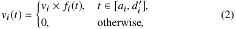

where _f_ i( _t_ ) is a time discounting function defined in (1). We note that the arrival time _a_ i is critical for the edge to make the correct decision. For example, if a self-driving car uploads a task with an incorrect timestamp, it may receive a false driving command, which endangers the safety. Thus, once an agent _i_ ∈ N enters the system, the information of arrival time _a_ i and the resource demand _m_ i are truthfully revealed. The agent submits a declared intrinsic value (bid) vˆi, which may not 

be necessarily equal to her true intrinsic value vi, to a trusted auctioneer (the edge server). We call the true value vi of agent _i_ as her _type_ as in mechanism design, and use vector **_v_ ˆ** = (vˆ1, ˆv2, · · · , ˆvN ) to denote the declared types ( _i.e._ , the bidding profile) of all agents. 

The procedure of online auction mechanism for edge resource allocation is described as follows. We denote Na as the set of active agents, who is able to complete its task if starting at the current time slot _t_ , _i.e._ , we have _i_ ∈ Na if _a_ i ≤ _t_ ≤ _d_ i′.Ateachtimeslot_t_∈T,theauctioneerfirst calculates the bid vˆi( _t_ ) for each active agent _i_ ∈ Na, by replacing her declared type vˆi with the true intrinsic value vi in (2). Given the bidding profile of the active agents Na at time _t_ : **_v_ ˆ** ( _t_ ) = (vˆ1( _t_ ), ˆv2( _t_ ), · · · , ˆv|Na |( _t_ )), the auctioneer then allocates the total _W_ units of resources, including the idle resources and those in use by existing tasks, to the active agents. We note that to further improve the utilization of resources, the newly arrived agents with high bids could interrupt some ongoing tasks with low bids. The agent _i_ is called a winning agent if she is allocated _m_ i units of resources for _T_ e continuous time slots without an interruption before the deadline _d_ i; otherwise she is called a losing agent. We use _x_ i( **_v_ ˆ** ) = 1 to denote that the agent _i_ is a winner when the declare value profile is **_v_ ˆ** ; otherwise _x_ i( **_v_ ˆ** ) = 0. Finally, according to the declared value profile **_v_ ˆ** of agents, the auctioneer determines the payment _p_ i( **_v_ ˆ** ) for each agent _i_ at her departure time _d_ i. The payments of the losing agents are set to zeros. We use vector **_x_** ( **_v_ ˆ** ) = ( _x_ 1( **_v_ ˆ** ), _x_ 2( **_v_ ˆ** ), · · · , _x_ N ( **_v_ ˆ** )) and **_p_** ( **_v_ ˆ** ) = ( _p_ 1( **_v_ ˆ** ), _p_ 2( **_v_ ˆ** ), · · · , _p_ N ( **_v_ ˆ** )) to represent the allocation rule and payment rule in an online auction, respectively. 

The _utility u_ i of each agent _i_ ∈ N is defined as the difference between her value on the allocated resources and the payment: 

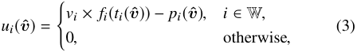

where W is the set of winning agents, and _t_ i( **_v_ ˆ** ) is the starting time of the winner _i_ ∈ W to execute her task when the declared type profile is **_v_ ˆ** . 

As we have shown at the beginning of this section, minimizing the weighted average AoI is equivalent to maximizing the sum of time-varying task values, which is defined as the _social welfare_ in the context of auction mechanism as follows. 

**Definition 1** (Social Welfare) **.** _The social welfare in an online auction mechanism with time discounting values is the sum of winners’ values at their corresponding winning time slots,_ i.e. _,_ 

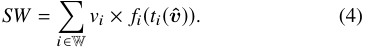

Other than social welfare, _revenue_ , which is defined as the total payment collected from agents, is also a widely used objective in mechanism design. As revenue only reflects the interest of the edge service provider rather than the whole system, we adopt social welfare as the optimization objective in this work, which is beneficial for the long term development of real-time edge service systems. We also evaluate the revenue of the proposed mechanisms in the evaluation results. 

In contrast to the optimization goal of the edge service 

provider, the agents are rational and selfish, and have incentives to maximize their own utilities by strategically reporting their private intrinsic values. To illustrate this strategic behavior in the setting of time discounting task values, we provide a simple example: Suppose agent 1 with v1 = 10 and agent 2 with v2 = 8 send tasks to the edge server at the same time. The edge can only serve one agent and the execution time is _T_ e = 1. We adopt a simple resource allocation rule as the more urgent tasks (tasks with higher values) first, and the payment rule as charging the winners a uniform price 1. Under these rules, the solution would be to execute task 1 at the first time slot and then task 2 at the following time slot. If the values of tasks do not discount over time, then agent 2 has no incentive to misreport her value, because the payment is independent on her bid and her utility is always 8 − 1 = 7. However, if the values of tasks shrink by half after each time slot, the strategic behaviors may occur. Suppose agent 2 reports her value truthfully, her utility would be 4 − 1 = 3, and the social welfare is 14. But if agent 2 misreports a value 11, she would be served before agent 1 and obtain a higher utility 8 − 1 = 7, while the social welfare drops to 13. We also observe from this example that the traditional payment rule to guarantee the strategy-proofness derived from the classical Myerson theorem [24], _i.e._ , the payment is independent on the resource allocation time, no longer holds in the setting of time discounting values. This is because the users can change the resource allocation times, resulting in different utilities in the setting of time-varying task values, by misreporting their values. Therefore, a new proper auction mechanism is necessary for this setting to resist such strategic behaviors and still achieve the optimal social welfare. 

## _C. Solution Concepts_ 

A strong solution concept from mechanism design is _dominant strategy_ , where _strategy_ is defined as the type reported by a user. 

**Definition 2** (Dominant Strategy [25]) **.** _A strategy_ vˆi _is agent i’s dominant strategy, if for any strategy_ vˆi′�vˆi_and any other_ _agents’ strategy profile_ **_v_ ˆ** −i _, we have_ 

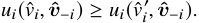

Intuitively, a dominant strategy of an agent is a strategy that maximizes her utility, regardless of what strategy profile the other agents choose. 

The concept of dominant strategy is the basis of _incentivecompatible_ mechanism, in which truthfully revealing private information is a dominant strategy for every agent. An accompanying concept is _individual-rationality_ , which means that every agent participating in the auction expects to gain no less utility than staying outside. We now can introduce the definition of a _strategy-proof mechanism_ . 

**Definition 3** (Strategy-Proofness [26]) **.** _A mechanism is strategy-proof when it satisfies both incentive-compatibility and individual-rationality._ 

The objective of this work is to design a strategy-proof online auction mechanism in the setting of time discounting task values. 

## III. CHARACTERIZING STRATEGY-PROOFNESS 

In this section, we present a characterization theorem for strategy-proof online auction mechanisms with time discounting values. This can be considered as a generalization of the well-known Myerson theorem [24]. Specifically, we claim that the necessary and sufficient condition for a payment rule that truthfully implement an allocation rule in the setting of time discounting values is that the function _F_ ( **_v_ ˆ** ) = _f_ ( _t_ ( **_v_ ˆ** )) × _x_ ( **_v_ ˆ** ) must satisfy a monotonicity criterion. We first give the definition of this monotone criterion. 

**Definition 4** (Monotonicity) **.** _The function F_ i( **_v_ ˆ** ) = _f_ i( _t_ i( **_v_ ˆ** )) × _x_ i( **_v_ ˆ** ) _is monotone, if for any two types of_ vˆi _and_ vˆi′_with_vˆi> vˆi′_andthereportedtypesoftheotheragents_**_v_ˆ**−i_,wehave_ _F_ i(vˆi, **ˆ** **_v_** −i) ≥ _F_ i(vˆi′,**ˆ****_v_**−i). 

We take a closer look at this monotone condition _F_ i(vˆi, **ˆ** **_v_** −i) ≥ _F_ i(vˆi′,**ˆ****_v_**−i),whichcouldberealizedintwo detailed cases. One is that the allocation result _x_ i(·) changes from _x_ i(vˆi′,**ˆ****_v_**−i)=0to_x_i(vˆi,**ˆ****_v_**−i)=1.Theothercaseisthat the allocation result _x_ i(·) remains the same, i.e., _x_ i(vˆi, **ˆ** **_v_** −i) = _x_ i(vˆi′,**ˆ****_v_**−i)=14and_f_i(_t_i(vˆi,**ˆ****_v_**−i))≥ _f_ i( _t_ i(vˆi′,**ˆ****_v_**−i)),which further implies _t_ i(vˆi, **ˆ** **_v_** −i) ≤ _t_ i(vˆi′,**ˆ****_v_**−i)undertheassumptionof non-increasing function _f_ i( _t_ ). The first case is consistent with the monotonicity of allocation rule in the classical Myerson Theorem, meaning that the bidder with a higher value is more likely to win the auction. The second case comes from the new feature of online mechanism, which further requires the agent with a higher value to be allocated at an earlier time slot. The intuition behind this monotone condition in online setting is that the winning user could be allocated resources at an earlier time slot if she increases her declared type. 

We now present our main result: the necessary and sufficient condition for the existence of strategy-proof online auction mechanisms with time discounting values. 

**Theorem 1.** _There exists a payment rule_ **_p_** ( **_v_ ˆ** ) _such that the online auction mechanism_ ( **_x_** ( **_v_ ˆ** ), **_p_** ( **_v_ ˆ** )) _in the setting of time discounting values is strategy-proof if and only if the function F_ i( **_v_ ˆ** ) = _f_ i( _t_ i( **_v_ ˆ** )) × _x_ i( **_v_ ˆ** ) _is monotone for each agent i_ ∈ N _._ 

We complete the proof by analyzing the following two lemmas. 

**Lemma 1.** _If the function F_ i( **_v_ ˆ** ) = _f_ i( _t_ i( **_v_ ˆ** ))× _x_ i( **_v_ ˆ** ) _is monotone for each agent, the online auction mechanism associated with a carefully designed payment rule_ **_p_** (v) _is strategy-proof._ 

_Proof._ We set the payment rule as 

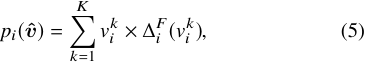

where the sequence vi1, v i2, · · · , v iK is a list of _K_ values, which are the breakpoints of function _F_ i( **_v_ ˆ** ) when the value increases 

> 4Another case of xi ( ˆvi, **ˆ** **_v_** −i ) = xi ( ˆvi′,**ˆ****_v_**−i)=0istrivialtoanalyze,and we omit it here. 

from 0 to the true value vi. In general, we assume vik1 ≤ vik2 for _k_ 1 ≤ _k_ 2, vi0= 0andv iK ≤ vi. The function ∆iF(v ik)represents the jump of _F_ i( **_v_ ˆ** ) at the breakpoint (vik,**ˆ****_v_**−i)5,_i.e._, 

values, of breakpoints compared with the true type vi, because the values of breakpoints are independent on the declared type of agent _i_ . 

We complete the analysis by distinguishing two cases: ▶ If vˆi < vi, we then have _K_� ≤ _K_ , and thus viK� ≤ viK. Since the function _F_ i( **_v_ ˆ** ) is monotone, we can get: 

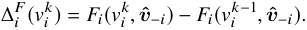

The intuition behind the payment rule in (5) is that, with the increase of vi, the agent is allocated at a “better" ( _i.e._ , earlier) time slot, so the auctioneer charges the agent for this incremental part. The breakpoint value vikin(5)meansthe critical price of being allocated at the better time slot, and ∆iF(v ik)measures“howbetterthenewtimeslotis",_i.e._,the (normalized) value difference between the two allocations for agent _i_ . 

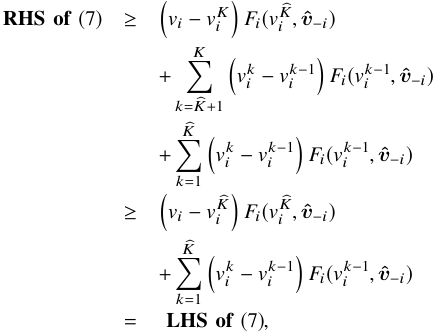

With the payment rule in (5), we can express the utility _u_ i( **_v_ ˆ** ) of agent _i_ ∈ N as: 

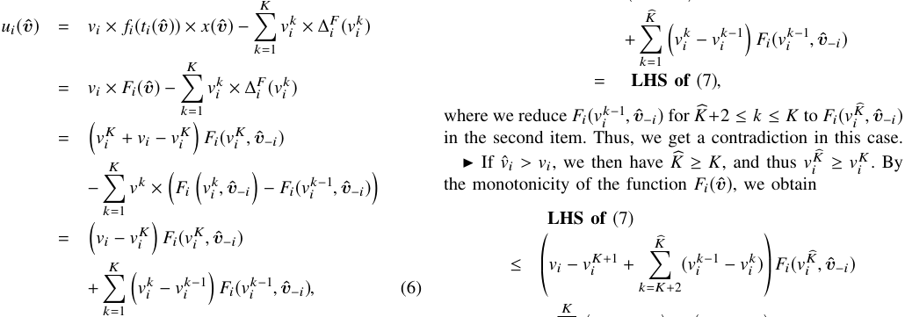

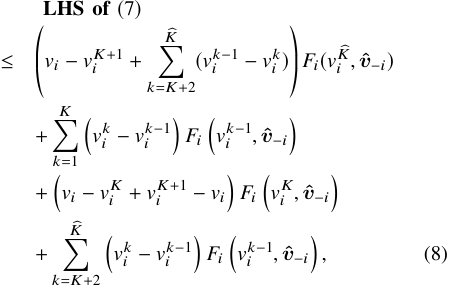

where the third equation is because _F_ i(vi, **ˆ** **_v_** −i) = _F_ i(viK,**ˆ****_v_**−i) as viK is the highest breakpoint for resource allocation for agent _i_ . According to the definition of the value sequence, we have viK ≤ vi and vik−1 ≤ vikforall1≤_k_≤_K_.Therefore,the utility _u_ i( **_v_ ˆ** ) of agent _i_ can not be negative, and the property of _Individual Rationality_ is satisfied. 

We now show that the monotone function _F_ i( **_v_ ˆ** ) in combination with the payment rule _p_ i( **_v_ ˆ** ) in (5) guarantees the property Furthermore, since we have vi ≤ viK+1 and vik≥v ik−1 , we can obtain of _Incentive Compatibility_ . We prove this by contradiction. If the auction mechanism is not incentive compatible, there exists (8) ≤ vi − viK _F_ i viK,**ˆ****_v_**−i � � � � an agent _i_ , a true type vi, and a non-truthful reported type vˆi K with vˆi � vi, such that _u_ ˆi(vˆi, **ˆ** **_v_** −i) > _u_ i(vi, **ˆ** **_v_** −i). That is, the utility of agent _i_ reporting vˆi is strictly greater than the utility + � �vik−v ik−1 � _F_ i �vik−1 , **ˆ** **_v_** −i� k=1 _u_ i(vi, **ˆ** **_v_** −i) that she can achieve from being truthful. By (6), we = **RHS of** (7). (9) have 

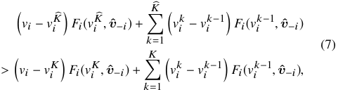

where _K_� is the corresponding maximum index of breakpoints for the misreported type vˆi. It is worth to note that the misreported type vˆi only impacts the numbers, rather than the 

> 5We omit the situation with ties for notation simplicity, _i.e._ , we consider Fi (vik,**ˆ****_v_**−i) =Fi(v ik+ ϵ,**ˆ****_v_**−i),forasmallpositiveconstantϵ. 

Thus, we also get a contradiction in this cases. We completed the proof of the “if” part. □ 

Conversely, we consider the “only if” part. 

**Lemma 2.** _If the online auction mechanism_ ( **_x_** ( **_v_ ˆ** ), **_p_** ( **_v_ ˆ** )) _is strategy-proof, then we have F_ i( **_v_ ˆ** ) = _f_ i( _t_ i( **_v_ ˆ** )) × _x_ i( **_v_ ˆ** ) _is monotone for each agent._ 

_Proof._ Consider an agent _i_ ∈ N and two type profiles **_v_** , **_v_ ˆ** with **_v_** −i = **_v_ ˆ** −i and vi > vˆi. We first consider a scenario where the true type of the agent _i_ is vi. The strategy-proof mechanism ensures that the utility of agent _i_ when reporting 

her type truthfully is not less than that when she misreports her type, _i.e._ , 

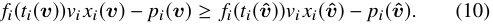

We then consider another scenario where the true type of the agent _i_ is vˆi and she may cheat by misreporting vi. Similarly, we have 

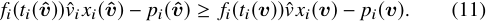

Combining (10) and (11), we can get 

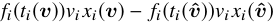

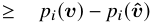

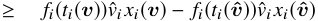

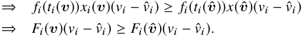

**Algorithm 1:** Resource Allocation Algorithm 

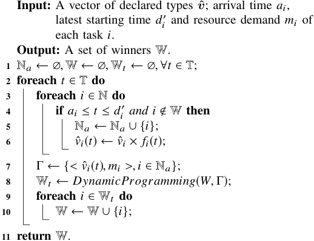

Since vi > vˆi, we have _F_ i( **_v_** ) ≥ _F_ i( **_v_ ˆ** ). Thus, we can conclude that _F_ i( **_v_** ) is monotone. □ 

## IV. PREDISC FOR CASES WITH UNIT EDGE EXECUTION TIME 

We now present the detailed design for our proposed mechanism PreDisc, and analyze its economic properties and competitive ratio. We first present the mechanism for the cases of unit edge execution time, _i.e._ , _T_ e = 1, in which we do not need to consider the knotty problem of preemption among tasks. We then extend the mechanism to general cases in the next section. 

## _A. Allocation Rule_ 

We present the procedure of resource allocation rule of PreDisc in Algorithm 1. At each time slot, the active tasks are collected in the set _N_ a, and their current values and resource demands are collected in the set Γ (Lines 3-7). The allocation problem at each time slot can be formulated as a 0-1 knapsack problem, where the capacity of the knapsack is the resource capacity _W_ and the profit and weight of each item correspond to the current value and the resource demand of the task, respectively. Our goal at each time slot is to select the most cost-efficient active tasks under the resource capacity constraint. Thus, we adopt dynamic programming technique to solve the resource allocation problem at each time slot _t_ to obtain the winner set _W_ t , and to update the ultimate winner set _W_ (Lines 8-10). 

We next show that such a simple allocation rule at each time slot without the knowledge of future tasks, can obtain a constant competitive ratio. 

**Theorem 2.** _The competitive ratio of the resource allocation rule in PreDisc is_ 2 _for the cases with unit edge execution time._ 

_Proof._ Let the set of winners in the offline optimal solution (OPT) be OPT, and the winning agents at time slot _t_ in OPT be OPTt . Similarly, we denote the corresponding sets of winning agents obtained from PreDisc as W and Wt , respectively. For a winning agent _i_ , we use _t_ i∗to present the time it is selected in 

OPT, and _t_ i the time it is selected in PreDisc. We distinguish the following two cases. 

▶ For agent _i_ ∈ OPTt , if agent _i_ ∈ Wt′ for _t_′ ≤ _t_ , _i.e._ , agent _i_ is also selected as a winner in PreDisc at or before the time slot _t_ , we denote these agents as a set OPT1 t.Sincethevalues of tasks are non-increasing, we can easily obtain 

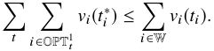

▶ For the other agents in OPTt , we know that these agents are not in Wt′ for any _t_′ ≤ _t_ , and denote them as OPT2 t. In PreDisc these agents may lose or be selected as a winner later. We have that the total value of these agents at the time slot _t_ should be less than that of agents selected by PreDisc; otherwise, the dynamic programming algorithm would output them as the result. Thus, we can get 

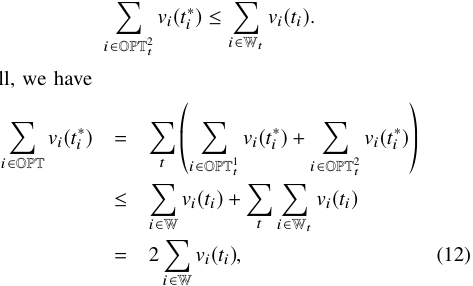

Overall, we have 

which concludes our proof. □ 

## _B. Payment Rule_ 

In classical online auction mechanisms [22], [23], to guarantee the strategy-proofness, the payment rule is to set a predefined price for each time slot. However, we have constructed a simple example in the previous section to demonstrate that with such a payment rule, the property of strategy-proofness 

no longer holds when the value discounts over time. To tackle this obstacle, we calculate the critical price for each single slot, and derive our payment rule based on the extended Myerson Theorem in Section III. 

We conduct the following steps to calculate the payment for each winner _i_ in the allocation rule. First, we run the resource allocation algorithm _i.e._ , Algorithm 1 again to compute a new solution without the agent _i_ . During this new allocation process, at each time slot, we can leverage the optimal substructure of dynamic programming, and obtain the minimum bid vˆimin ( _t_ ) as the difference between the solutions for total _W_ units of resources and for _W_ − _m_ i units of resources. The value vˆimin ( _t_ ) represents the minimum bid at time slot _t_ that the agent _i_ can win at this time slot. Then, according to the definition of time-varying value function (2), we can get the corresponding critical intrinsic value 

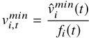

which the agent _i_ needs to declare to win at the time slot _t_ . With this critical value for agent _i_ at each time slot, we can greedily select a non-increasing subsequence of critical values over time, which are the breakpoint values as stated in Theorem 1. Intuitively, suppose one breakpoint is vimin ,t, it means that when the agent _i_ reports an intrinsic value no less than vimin ,t at arrives time _a_ i, she would be selected as a winner no later than the time slot _t_ . We give a procedure in Algorithm 2 to determine the breakpoints from the critical intrinsic values and the corresponding payment for the winning agent _i_ . Following the time slots from the arrival time _a_ i to the latest starting time _d_ i′,wesetthefirstbreakpointasthefirst critical intrinsic price less than the bid of agent. After that, we select the critical intrinsic price as a breakpoint only when it is less than the previously selected breakpoint (Lines 2-7). For example, suppose the declared type is 5, and the sequence of critical intrinsic prices is {6, 4, 2, 3}, we select 4 and then 2 as the breakpoints. We can verify that such a selected set of intrinsic values satisfies the definition of breakpoints. We then sort the selected breakpoints with a non-decreasing order, and calculate the payment using (5) in Theorem 1 (Lines 8-11). 

Fig. 2. A walkthrough example for the cases with unit edge execution time. 

Consider a walkthrough example in Fig. 2, where the total amount of resources _W_ is 5, and the value of each user _i_ ∈ N decreases linearly with time through a time-discounting function _f_ i( _t_ ) = 1 −<u>1</u> 3(_t_−_a_i).InFig.2,weusesolidlineto 

**Algorithm 2:** Payment Calculation Algorithm 

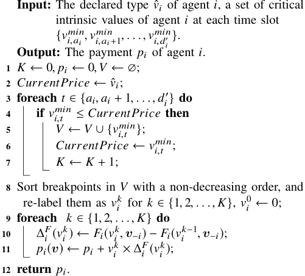

denote the present time interval of each agent. The resource demand and value are also shown beside each agent. In the allocation determination phase, at the first time slot, agents A and C are selected as winners because their total value 9 is larger than that of B. At the second time slot, the value of B becomes <u>103</u>,andDischosenduetoahigher value 6. At the third time slot, agents B with an updated value <u>53</u>andEwithanupdatedvalue2areactive,andE is selected as a winner. We denote the winners at each time slot as red in Fig. 2. In the payment calculation phase, for agent A, we remove her and re-run the resource allocation procedure, obtaining the critical intrinsic values for each time slot vmin A,1=4, vmin A,2=8, vmin A,3=5.Wecangreedilygetthe decreasing subsequence with only a breakpoint v1 A= 4.Using (5), we can calculate the payment for agent A as _p_ A = 4. Similarly, we have the breakpoint sequence for agent C as vC1=0,foragentDasv Dmin ,2=<u>10</u> 3, v Dmin ,3=3, v Dmin ,4=0,and for agent E as vE3= 2<u>5, v</u> E4=0.Finally,wecancalculatethe payment for agents: _p_ C = 0, _p_ D =<u>19</u> 9,_p_E= 6<u>5</u>. We now show the strategy-proofness of PreDisc based on Theorem 1. 

**Theorem 3.** _The online auction mechanism PreDisc with the above allocation and payment rules is strategy-proof for the cases with unit edge execution time._ 

_Proof._ Based on Theorem 1, we only need to prove the monotonicity of the resource allocation rule, _i.e._ , the winning agent would be executed at an earlier (or the same) time slot when she increases her bid. Since the dynamic programming algorithm outputs the optimal solution at each time slot, if a winning agent reports a higher value, she would either be selected at this time slot or an earlier one. Hence, the monotonicity of the allocation rule as defined in Definition 4 is satisfied and we can conclude the proof. □ 

## V. PREDISC FOR GENERAL CASES 

In this section, we extend PreDisc to the general cases, where the edge execution time _T_ e can be larger than 1, leading to the situation that tasks may be preempted by other tasks in the execution process. 

## _A. Virtual Bid Generation_ 

When a newly arrived agent has a task value higher than that of some ongoing agents, the auctioneer can choose to preempt the ongoing tasks to make up the task value difference, or to reject the new agents to guarantee the continuity of edge service. Once a task is preempted, it would wait until being selected next time to execute the task from the beginning, and hence the preemption may degrade the resource utilization if the newly arrived agents does not offer a substantially higher bid. With this consideration, the auctioneer raises the bids of ongoing agents, which is denoted by No, to give them higher priorities of being allocated resources continuously. At time slot _t_ , each ongoing agent _i_ ∈ No has been allocated _m_ i units of resources without an interruption from the time slot _t_ i( **_v_ ˆ** ). We denote the virtual bid of agent _i_ at time slot _t_ as _b_ i( _t_ ), which can be calculated as 

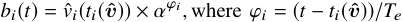

which denotes the percentage of task _i_ ’s completeness at time _t_ , and α ≥ 1 is the parameter that the auctioneer can adjust to control the preemption frequency: the setting of α = 1 represents the preemption model which interrupts the ongoing tasks once there is a newly arrived task with a higher bid. The auctioneer can give more protection to the ongoing tasks by increasing α. When α →∞, the auctioneer does not allow preemption, and the tasks can execute for continuous _T_ e time slots once they are allocated resources. For the active agents that have not been allocated resources, _i.e._ , agents in Na\No, the auctioneer updates their bids _i.e._ , _b_ i( _t_ ) = vˆi( _t_ ). The auctioneer can generate the virtual bid _b_ i( _t_ ) of the agent _i_ ∈ N at time slot _t_ ∈ T by distinguishing the following two cases. 

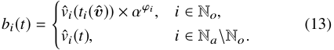

## _B. Allocation Rule_ 

The algorithm of resource allocation in the general cases is shown in Algorithm 3. For simplicity, we only present the algorithm for one time slot. Similar to the allocation rule in the simple case, the key idea is to use dynamic programming technique with the virtual bids of agents at each time slot. We first update the current values of tasks as the virtual bids to give the ongoing tasks higher priorities of being allocated (Lines 1-7). After that, we consider the problem of resource allocation as the knapsack problem, and adopt the dynamic programming technique to solve it (Lines 8-9). We update the allocation states for two kinds of agents. For newly winning agents, we update their winning time _t_ i( **_v_ ˆ** ) as _t_ (Lines 1011). For preempted agents, we set their winning time to _Null_ back (Lines 12-13), then they would wait for the next 

**Algorithm 3:** Resource Allocation Algorithm for General Cases <u>(for</u> One Time Slot) 

||**Input:** A time slot _t_ ∈T, a set of active agents Na, a set of ongoing agents No, a vector of reported types **ˆ****_v_**, a preemption factor α, resource demand _m_i for each task, and a set of temporary winners Wt−1 at time slot _t_−1.|
|---|---|
|**1 **|**Output:** A winner set W and a temporary winner set Wt for time slot _t_.  **foreach** _i_ ∈Na **do**|
|**2**|ˆvi(_t_) ←ˆvi × _f_i(_t_);|
|**3**|**if** _i_ ∈No **then**|
|**4**|ϕi ←(_t_−_t_i(**ˆ****_v_**))/_T_e;|
|**5**|_b_i(_t_) ←ˆvi(_t_i(**ˆ****_v_**)) ×αϕi;|
|**6**|**else if** _i_ ∈Na\No **then**|
|**7**|_b_i(_t_) ←ˆvi(_t_);|
|**8**|Γ←{< _b_i(_t_),_m_i >,_i_ ∈Na};|
|**9**  **10 **|Wt ←_D_y_namicPro_g_rammin_g(_W_,Γ);  **foreach** _i_ ∈Wt\Wt−1 **do**|
|**11**|_t_i(**ˆ****_v_**) ←_t_, No ←No∪{_i_};|
|**12 **|**foreach** _i_ ∈Wt−1\Wt **do**|
|**13**|_t_i(**ˆ****_v_**) ←_Null_, No ←No\{_i_};|
|**14 **|**foreach** _i_ ∈Na **do** |
|**15**|**if** _i_ ∈Wt _and t_−_t_i(**ˆ****_v_**)+1 ≥_T_e **then**|
|**16**|W←W∪{_i_}, Na ←Na\{_i_}, No ←No\{_i_};|
|**17**|**else if** _i_ �Wt _and t_ ≥_d_′ i **then**|
|**18**|Na ←Na\{_i_};|

**19 return** W _,_ Wt . 

allocation process. We add the agents, who have executed for _T_ e consecutive time slots before the departure time, into the ultimate winner set (Lines 15-16). We discard the agents whose tasks cannot be completed in the remaining time (Lines 17-18). 

**Theorem 4.** _The competitive ratio of our resource allocation rule in PreDisc is_ 1 + 1−αα− <u>T</u><u>1</u> e_forthegeneralcasescompared_ _with the offline optimal solution._ 

_Proof._ The proof process is similar to that of Theorem 2, and we re-use the notations in Theorem 2. We note that in general cases, an agent would be a winner in _T_ e consecutive time slots. Thus, we denote _i_ ∈ OPTt as that the task _i_ starts to execute from time slot _t_ for _T_ e consecutive time slots ( _i.e._ , _t_ i∗=_t_), and for _i_ ∈ W in PreDisc, the task _i_ starts to execute from time slot _t_ i for _T_ e consecutive time slots. But for task _i_ in the temporary winner set _i_ ∈ Wt , it only represents that task _i_ is selected at time slot _t_ , which might be preempted later. We distinguish the following two cases. 

▶ For agent _i_ ∈ OPTt , if _i_ ∈ W with _t_ i ≤ _t_ , _i.e._ , the agent _i_ is also selected as a winner in PreDisc starting at or before time slot _t_ , we denote them as a set OPT1 t,anddenotetheset of them of all time slots as OPT1 = ∪t ∈TOPT1 t. Since we have that the values of tasks are non-increasing, we can easily get 

factor α = (1 + T<u>1</u> e)Tewithsimplemathematicalcalculations, while the corresponding competitive ratio is ( _T_ e + 1)(1 + T<u>1</u> e)Te, which is a small constant related to _T_ e. 

## that 

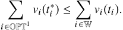

▶ For the other agents in OPTt , _i.e._ , _i_ � W or _i_ ∈ W with _t_ i > _t_ , we denote the set of them of all time slots as OPT2 t.TheymayloseinPreDiscorbeselectedasawinner later. Similarly, we denote all of them as OPT2 = ∪t ∈TOPT ∪t ∈TOPTt ∈TOPT ∈TOPTTOPTOPT2 t. We have that the total value of agents in OPT2 tattimeslot _t_ should be no more than the total virtual bid of agents selected by PreDisc at the same time slot; otherwise, the dynamic programing algorithm would output them as the result. Therefore, we can get 

## _C. Payment Rule_ 

> mayloseinPreDiscorbeselectedasawinner Similar to the payment rule for the simple case, it is we denote all of them as OPT2 = ∪t ∈TOPT ∪t ∈TOPTt ∈TOPT ∈TOPTTOPTOPT2 t. necessary to calculate the critical intrinsic price for _i_ to be the total value of agents in OPT2 tattimeslot a winner at different time slot. But the difference is that, no more than the total virtual bid of agents in the general cases with _T_ e ≥ 1, the critical intrinsic price PreDisc at the same time slot; otherwise, the should guarantee that agent _i_ can win in continuous _T_ e time programing algorithm would output them as the slots. Following the procedure in Section IV-B, we can get the Therefore, we can get minimum virtual bid _b_ imin ( _t_ ) of winning at a single time slot � vi( _t_ i∗) = � vi( _t_ ) ≤ � _b_ i( _t_ ), _t_ for agent _i_ . Correspondingly, we can calculate vˆimin ( _t_ ), the i ∈OPT2 t i ∈OPT2 t i ∈Wt minimumtime slots bidstartingat timefromslottime _t_ for _t_ ( _t_ agent∈[ _a_ i, _i d_ toi′]): win _T_ e continuous 

where the left equation is because _t_ i∗=_t_asstatedabove. Next, at time slot _t_ , we denote the sum of virtual bids of uncompleted ongoing agents as _S_ un( _t_ ). It can be observed that <u>1</u> the sum of virtual bids at time slot _t_ + 1 is at least _S_ un( _t_ )× α Te following the rule of virtual bid. This means, every selected agent _i_ in PreDisc would either be completed ultimately or, be preempted by agents whose total value is larger than the sum of virtual bids of preempted agents. We note that this observation holds even if the preemption happens in a chain. Thus, let the set of agents which are completed at time slot _t_′ in our algorithm be Ntc′,andrecallthatthelasttimeslotinT is _T_ , then we can get 

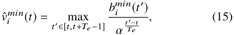

which is the highest minimum bid (mapping from the minimum virtual bids) for single time slots in the present interval. Then we have the corresponding critical intrinsic value for the agent _i_ at time _t_ : 

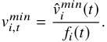

Next, we can call Algorithm 2 to calculate the payment of each winning agent. 

Finally, we can get the following theoretical guarantee on strategy-proofness. Since the proof is very similar to that in Theorem 3, we omit it here. 

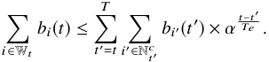

The key idea of this equation is that, once a winner is selected at time slot _t_ , it might be preempted, but finally the winner or its (chained) preemptor will be completed at a later time slot. So we map the subsequent completed tasks to time slot _t_ and sum over all of them as an upper bound of the left side. Thus we have that 

**Theorem 5.** _Our proposed mechanism PreDisc with the above allocation and payment rule is strategy-proof for the general cases._ 

## VI. EVALUATION RESULTS 

## _A. Experimental Settings_ 

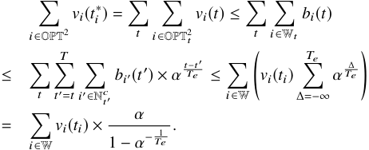

We implement our proposed mechanism in C++, and compare it with the existing mechanisms. In the experiments, we set the number of users _N_ as 100, the number of time slots _T_ as 100, the cloud execution time _T_ c as 10, the edge execution time _T_ e as 3, the resource capacity _W_ as 10 as default. In particular, we set the intrinsic values of tasks following a uniform distribution over (1, 10), while the numbers of required resources are set as integers following a uniform distribution over [1, 5]. The time discounting function _f_ i( _t_ ) is specified as a linear function _f_ i( _t_ ) = 1 − T<u>(t</u> c− −a T<u>i</u> e<u>)</u>.Eachuser generates a task at a time slot with probability (arrival rate) γ if she has no active task at the time. We set γ as 0.1 if not otherwise specified. We evaluate the changes of both weighted average AoI and revenue with different parameters under different mechanisms. We take the average of 500 runs to get the result. 

Overall, we obtain that 

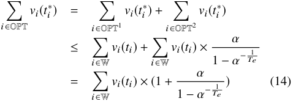

We compare our mechanism PreDisc with the following benchmark mechanisms: 

which concludes our proof. 

- **First-Come-First-Served (FCFS)** : In FCFS, at each time slot, the active tasks (including ongoing tasks) are sorted 

Base on the theorem, we can get the optimal preemption 

by their arrival time in an increasing order. If their arrival times are the same, the tasks with higher values are selected first. It is worth to note that FCFS is naturally non-preemptive, since tasks with later arrival times are always executed later. 

- **Last-Come-First-Served with Preemption (LCFS-p)** : In LCFS-p, at each time slot, the active tasks (including ongoing tasks) are sorted decreasingly by their arrival time. Similarly, if their arrival times are the same, the tasks with higher values are served first. Note that LCFSp does not protect ongoing tasks from preemption, and hence the tasks are very likely to be preempted by subsequent tasks. 

- **Last-Come-First-Served with Non-preemption (LCFS-np)** : LCFS-np is similar to LCFS-p, with the difference that ongoing tasks are protected from interruption, _i.e._ , once a task is selected to execute, it would be completed without preemption. 

- **Offline VCG (VCG-off)** : VCG is a well-known mechanism with optimal social welfare for problems with strategic input. We convert the problem of edge resource allocation into the offline version, and consider VCG mechanism as the ideally optimal baseline. We remark that this mechanism cannot be deployed in real life, as it needs the offline global information. 

We conduct experiments on PreDisc with 3 kinds of preemption factors: α = 1 (PreDisc-1), α = 100 (PreDisc-100) and optimal α ≈ 2.4 (PreDisc-opt), while PreDisc-opt is also named as PreDisc in some figures as the default setting. To calculate the revenue of FCFS, LCFS-p and LCFS-np, we adopt a simple payment rule which is widely used in practice, _i.e._ , _p_ i = ρ · vi( _t_ i) where 0 < ρ < 1 is a constant. We set ρ = 0.5 in our simulations, meaning that the edge service provider charges half of the values of completed tasks. We remark that such a payment rule is easy to deploy but not truthful, as users can easily cheat at their values to reduce their payments. 

## _B. Numerical Results_ 

The evaluation results on weighted average AoI with different parameters are shown in Fig. 3. We first compare different mechanisms with different arrival rate γ in Fig. 3(a). Overall, we can see that our mechanisms achieve significant reduction on the weighted AoI than the other mechanisms, and PreDiscopt obtains the smallest weighted AoI among them. There are two reasons behind the advantage of our mechanisms: First, our mechanisms realize an optimal resource allocation in each time slot, since a dynamic programming rather than a simple greedy algorithm is employed. Second, PreDisc-opt makes a good trade-off between preemption and non-preemption. In addition, FCFS and LCFS-p result in the worst performances, because FCFS tends to select stale tasks with earlier arrival times, while LCFS-p preempts tasks frequently once there are newly arrived tasks. In LCFS-np, fresh tasks with high values are selected and completed without preemption, hence a low AoI is achieved. When γ increases from 0.1 to 0.3, a large amount of tasks are uploaded to the edge, and hence many 

TABLE I 

PROGRAM EXECUTION TIME (ms) 

|FCFS|LCFS-p|LCFS-np|PreDisc-1|
|---|---|---|---|
|0.007|0.005|0.005|0.078|
|PreDisc-100|PreDisc-opt|VCG-off||
|0.080|0.073|137||

tasks with high values are not completed. Thus, the weighted AoIs of all mechanisms increase with the arrival rate. 

In Fig. 3(b), we compare the above mechanisms with the offline VCG mechanism, the ideally optimal benchmark. The computation complexity of VCG is extremely high, as it needs to enumerate every possible scheduling outcomes. Thus, we reduce the scale of the problem, setting _N_ = 20, _T_ = 10, _T_ c = 5, _T_ e = 3, _W_ = 5, and average the evaluation results over 100 runs. We can observe from Fig. 3(b) that the weighted AoI of our mechanisms are very close to that of the offline VCG mechanism, which demonstrates the effectiveness of PreDisc. A small difference from Fig. 3(a) is that, the AoIs of some mechanisms decrease with the arrival rate in Fig. 3(b). This is because the resources are relatively sufficient under the scalereduced setting, and thus the impact of incremental completed tasks is higher than that of incremental uncompleted tasks. We further evaluate the computation complexity ( _i.e._ , the program execution time) of FCFS, LCFS-p, LCFS-np, our mechanisms and VCG-off, and show the results in Table I. These results show that our proposed mechanism PreDisc can achieve an approximate optimal weighted average AoI with much lower computation complexity than the optimal solution. 

Fig. 3(c) shows the impact of resource capacity _W_ . With a large resource capacity, the edge server can efficiently schedule the tasks to reduce the weighted AoI, leading to the decrease of AoI from all mechanisms. When _W_ ≥ 60, nearly all tasks are completed in time in all mechanisms, and thus an identical low AoI is realized. When _W_ ≤ 40, the resource is limited and PreDisc has a much better resource utilization and then a lower weighted AoI than the other mechanisms. 

The impact of preemption factor α on weighted AoI is depicted in Fig. 3(d). We can see that when the preemption factor is close to the optimal α, which is approximately 2.4 under our default settings, the weight AoI indeed realizes a better performance. This performance result demonstrates the optimality of preemption parameter selection in our theoretical analysis of PreDisc. 

We report the evaluation results under different cloud execution time _T_ c and edge execution time _T_ e in Fig. 3(e) and Fig. 3(f), respectively. We remark that _T_ c is the largest AoI because every task can get a response from the cloud after _T_ c time slots. A large _T_ c enables a flexible scheduling for emergency tasks sent to edge, and thus reduces the weighted AoI for these tasks. However, the weighted AoI of the tasks sent to cloud, which is the majority of all tasks, has a significant increase, due to a large _T_ c. Thus, the overall AoI from tasks sent to edge and cloud increases with _T_ c. A large _T_ e implies that tasks would have to wait a longer time to complete. Therefore, the weighted AoI would be higher with the increase of _T_ e. We further investigate the average revenue of the edge in 

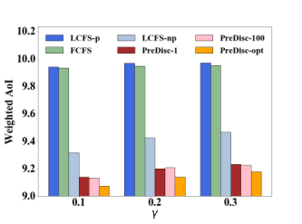

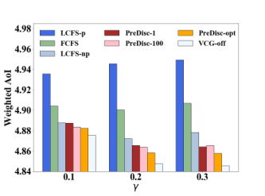

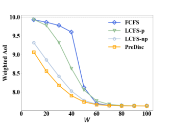

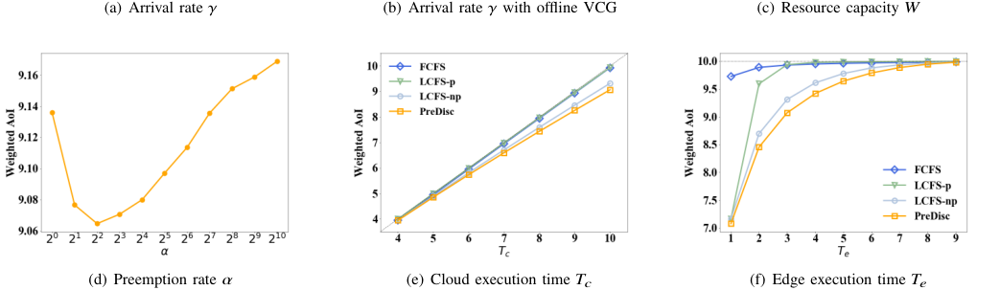

<!-- Start of picture text -->
(a) Arrival rate γ (b) Arrival rate γ with offline VCG (c) Resource capacity W (d) Preemption rate α (e) Cloud execution time Tc (f) Edge execution time Te <!-- End of picture text -->

Fig. 3. The weighted average AoI with different parameters. 

different mechanisms in Fig. 4. Fig. 4(a) shows the revenue performance of different mechanisms. We can observe that the revenues of our mechanism outperforms all other mechanisms due to the high utilization of edge resources. In addition, PreDisc-1 achieves the highest revenue in our mechanism, which will be explained later. With the increase of arrival rate γ, the revenues of our mechanisms increase, because more tasks result in a stiffer competition, and hence a higher critical price for winners. 

We show the comparison results on average revenue with offline VCG in Fig. 4(b) under the setting of reduced problem scale. Offline VCG achieves the highest revenue, but the gap between our mechanisms and VCG-off is small. Given the extremely large computation complexity and the need of global information of VCG-off mechanism, PreDisc is more practical in deployment with a slight revenue loss. When γ = 0.1 or 0.2, the revenue of LCFS-np is slightly higher than our mechanisms, this is because the resources are relatively sufficient under the scale-reduced setting, and thus the critical prices in our mechanisms is low to some extent. We also note that as the payment rule of LCFS-np is not strategy-proof, its present revenue may degrade in real life. 

Fig. 4(c) shows the impact of resource supply _W_ on revenue. Naturally, the revenues of FCFS, LCFS-p and LCFSnp increase with a higher _W_ , because the revenues of these mechanisms are proportional to the numbers of completed tasks, which obviously increase with the resource capacity. In contrast with these mechanisms, the revenue of PreDisc would first increase and then decrease into 0 with a large _W_ , because the number of completed tasks increases but the critical prices for resources decrease when the resource supply is more abundant. Thus, we remark that we can improve the 

revenue of PreDisc by increasing the competition on edge resources among users. 

In Fig. 4(d), we present the impact of preemption factor α on the revenue of PreDisc. We observe that with a higher α, the revenue decreases. This is because a low α leads to frequent preemption, resulting in a high critical price in each time slot. Therefore, we can conclude that both weighted AoI and revenue decrease with the preemption factor α, when it is lower than the optimal value, which also provides a direction in real life to trade off between AoI and revenue when choosing α in this range. 

We finally show the revenues of mechanisms with different values of _T_ c and _T_ e in Fig. 4(e) and Fig. 4(f), respectively. In Fig. 4(e), the revenue of PreDisc increases with _T_ c at first and then decreases when _T_ c is larger than a threshold. This is because PreDisc is able to schedule the tasks flexibly with a large _T_ c, leading to the number of completed tasks and then the revenue increases. However, if _T_ c continues to grow, large number of completed tasks implies low critical prices, so the revenues of PreDisc decreases slightly. The revenue of LCFS is always quite small, as the frequent preemption for ongoing tasks causes only a few of tasks to be completed. In LCFS-np, only newly arrived tasks are selected, so the revenue decreases instead because less tasks are produced with a large _T_ c. In FCFS mechanism, a larger _T_ c means that tasks with top priorities are more stale, so the revenue decreases with _T_ c substantially. Fig. 4(f) depicts the impact of edge execution time _T_ e. When _T_ e is larger, each task needs resources in more time slots, leading to less tasks to be completed and then lower revenue to obtain. When _T_ e = 1, preemption does not occur, hence LCFS-p and LCFS-np have the same performance. With a higher _T_ e, the tasks selected by FCFS become fresher, 

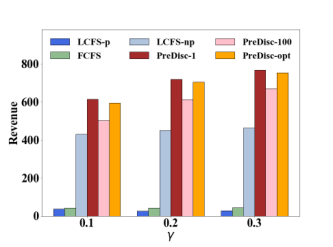

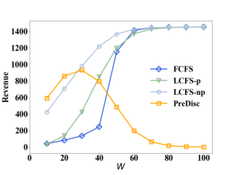

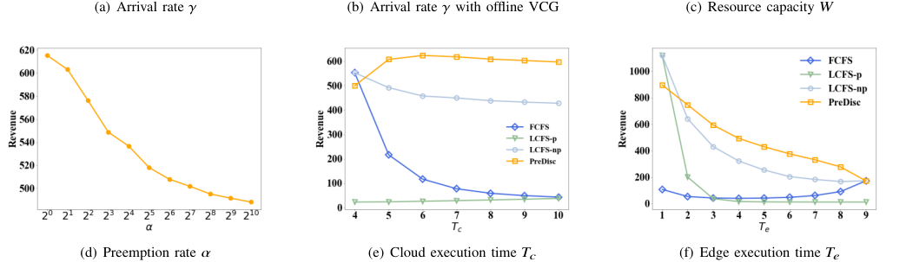

<!-- Start of picture text -->
(a) Arrival rate γ (b) Arrival rate γ with offline VCG (c) Resource capacity W (d) Preemption rate α (e) Cloud execution time Tc (f) Edge execution time Te <!-- End of picture text -->

Fig. 4. The average revenue of the edge with different parameters. 

leading to the increase of revenue when _T_ e ≥ 5. 

## VII. RELATED WORK 

The concept of age of information was first studied in [5], where an optimal updating rate is provided for remote monitor systems to optimize the timeliness. Following this work, much attention has been focused on this metric, typically with the queueing theory technique [5], [28], [29]. This metric was investigated in real-time computing problems in recent years [30]–[32], and different types of update policies and preemption strategies are proposed. However, these studies did not consider the strategic behaviors of user in a timely computing scenario. There are several works that considered the selfish agents in status update systems [33]–[35]. Hao _et al._ [33] investigated the competition of selfish crowdsourcing platforms to reduce their own AoI. They proposed a nonmonetary punishment mechnism in a repeated game to enforce their cooperation. The work of [34] introduced the concept of _fresh data market_ . They proposed a new pricing mechanism to maximize the profit of information source and minimize the cost of the destination. These works treat updates as homogeneous ones and only manipulate the update frequency. However, in a real-time edge computing problem, tasks are heterogeneous and users may misreport the information about their tasks. Therefore, the above studies are substantially different from our work. 

The topic of online auction was first introduced by Lavi and Nisan [36]. Based on the 2-competitive model of [37] for reusable resource allocation and the proof of competitive ratio, the work in [38] raised the concept of auction with preemption and its application in online spectrum auctions. However, the above classical works only considered constant values during 

the auction. The authors of [39] considered online auctions with discounting values. However, they imposed constraints on unit resource demand and unit edge execution time, and hence their proposed mechanism does not apply to our more general cases. 

From the perspective of edge computing, there are extensive studies that considered the high cost of edge deployment and the resource limitation at the edge server [11], [40], [41]. Some of these works proposed task scheduling algorithms to better utilize the resources [16], [42]–[44]. For example, the authors of [42] proposed an online scalable algorithm, called OnDisc, for the job dispatching and scheduling problem with a constant competitive ratio. In [16], the authors proposed to combine the edge server and the remote cloud server into a heterogeneous cloud. However, all of these studies did not take the pricing mechanism into account, and hence is not practical in the real-life deployment. An online incentive mechanism for the task offloading in mobile edge computing was proposed in [23] based on the primal-dual optimization framework, but they only considered a maximal tolerance delay for each task, rather than the time discounting values of tasks, _i.e._ , the AoI metric. Therefore, their proposed simple threshold-based pricing mechanism cannot be applied in our problem. 

## VIII. CONCLUSIONS 

We have proposed a strategy-proof online mechanism PreDisc for the cloud-edge collaborative computing system to reduce the weighted AoI. A preemption factor is employed to trade off the newly arrived tasks and ongoing tasks. We have proved that PreDisc guarantees both strategy-proofness and a constant competitive ratio compared with the offline optimal 

solution. Extensive simulations have been conducted and the results demonstrated the effectiveness of PreDisc. 

## REFERENCES 

- [1] W. Zhang, S. Li, L. Liu, Z. Jia, Y. Zhang, and D. Raychaudhuri, “Heteroedge: Orchestration of real-time vision applications on heterogeneous edge clouds,” in _Proceedings of the 38th IEEE Conference on Computer Communications (INFOCOM)_ . IEEE, 2019, pp. 1270–1278. 

- [2] R. D. Yates, M. Tavan, Y. Hu, and D. Raychaudhuri, “Timely cloud gaming,” in _Proceedings of the 36th IEEE International Conference on Computer Communication (INFOCOM)_ . IEEE, 2017, pp. 1–9. 

- [3] J. Du, Z. Zou, Y. Shi, and D. Zhao, “Zero latency: Real-time synchronization of bim data in virtual reality for collaborative decision-making,” _Automation in Construction_ , vol. 85, pp. 51–64, 2018. 

- [4] D. Morrison, P. Corke, and J. Leitner, “Learning robust, real-time, reactive robotic grasping,” _The International Journal of Robotics Research_ , vol. 39, no. 2-3, pp. 183–201, 2020. 

- [5] S. Kaul, R. Yates, and M. Gruteser, “Real-time status: How often should one update?” in _Proceedings of the 31st IEEE International Conference on Computer Communication (INFOCOM)_ . IEEE, 2012, pp. 2731– 2735. 

- [6] R. D. Yates, “Age of information in a network of preemptive servers,” in _Proceedings of the 37th IEEE Conference on Computer Communications Workshops (INFOCOM WKSHPS)_ . IEEE, 2018, pp. 118–123. 

- [7] J. Zhong, W. Zhang, R. D. Yates, A. Garnaev, and Y. Zhang, “Ageaware scheduling for asynchronous arriving jobs in edge applications,” in _Proceedings of the 38th IEEE Conference on Computer Communications Workshops (INFOCOM WKSHPS)_ . IEEE, 2019, pp. 674–679. 

- [8] J. Zhong, “Age of information for real-time network applications,” Ph.D. dissertation, Rutgers University-School of Graduate Studies, 2019. 

- [9] S. Gopal, S. K. Kaul, and R. Chaturvedi, “Coexistence of age and throughput optimizing networks: A game theoretic approach,” in _Proceedings of the 30th Annual International Symposium on Personal, Indoor and Mobile Radio Communications (PIMRC)_ . IEEE, 2019, pp. 1–6. 

- [10] A. Garnaev, W. Zhang, J. Zhong, and R. D. Yates, “Maintaining information freshness under jamming,” in _Proceedings of 38th IEEE Conference on Computer Communications Workshops (INFOCOM WKSHPS)_ . IEEE, 2019, pp. 90–95. 

- [11] M. Satyanarayanan, “The emergence of edge computing,” _Computer_ , vol. 50, no. 1, pp. 30–39, 2017. 

- [12] K. Sasaki, N. Suzuki, S. Makido, and A. Nakao, “Vehicle control system coordinated between cloud and mobile edge computing,” in _Proceedings of the 55th Annual Conference of the Society of Instrument and Control Engineers of Japan (SICE)_ . IEEE, 2016, pp. 1122–1127. 

- [13] N. Alliance, “5g white paper,” _Next generation mobile networks, white paper_ , vol. 1, 2015. 

- [14] X. Chen, L. Jiao, W. Li, and X. Fu, “Efficient multi-user computation offloading for mobile-edge cloud computing,” _IEEE/ACM Transactions on Networking_ , vol. 24, no. 5, pp. 2795–2808, 2015. 

- [15] P. Mach and Z. Becvar, “Mobile edge computing: A survey on architecture and computation offloading,” _IEEE Communications Surveys & Tutorials_ , vol. 19, no. 3, pp. 1628–1656, 2017. 

- [16] T. Zhao, S. Zhou, X. Guo, and Z. Niu, “Tasks scheduling and resource allocation in heterogeneous cloud for delay-bounded mobile edge computing,” in _Proceedings of 2017 IEEE international conference on communications (ICC)_ . IEEE, 2017, pp. 1–7. 

- [17] Y. Liu, C. Xu, Y. Zhan, Z. Liu, J. Guan, and H. Zhang, “Incentive mechanism for computation offloading using edge computing: A stackelberg game approach,” _Computer Networks_ , vol. 129, pp. 399–409, 2017. 

- [18] X. Wang and L. Duan, “Dynamic pricing for controlling age of information,” in _Proceedings of 2019 IEEE International Symposium on Information Theory (ISIT)_ . IEEE, 2019, pp. 962–966. 

- [19] W. Vickrey, “Counterspeculation, auctions, and competitive sealed tenders,” _The Journal of Finance_ , vol. 16, no. 1, pp. 8–37, 1961. 

   - [23] G. Li and J. Cai, “An online incentive mechanism for collaborative task offloading in mobile edge computing,” _IEEE Transactions on Wireless Communications_ , vol. 19, no. 1, pp. 624–636, 2019. 

   - [24] R. B. Myerson, “Optimal auction design,” _Mathematics of Operations Research_ , vol. 6, no. 1, pp. 58–73, 1981. 

   - [25] D. Fudenberg and J. Tirole, “Game theory,” 1991. 

   - [26] A. Mas-Colell, M. D. Whinston, J. R. Green _et al._ , _Microeconomic theory_ . Oxford university press New York, 1995, vol. 1. 

   - [27] H. Lv, Z. Zheng, F. Wu, and G. Chen, “Strategy-proof online mechanisms for weighted aoi minimization in edge computing (technical report),” _https://zhengzhenzhe220.github.io_ . 

   - [28] R. D. Yates, “The age of information in networks: Moments, distributions, and sampling,” _IEEE Transactions on Information Theory_ , https://ieeexplore.ieee.org/abstract/document/9103131, 2020. 

   - [29] A. M. Bedewy, Y. Sun, and N. B. Shroff, “Minimizing the age of information through queues,” _IEEE Transactions on Information Theory_ , vol. 65, no. 8, pp. 5215–5232, 2019. 

   - [30] A. Arafa, R. D. Yates, and H. V. Poor, “Timely cloud computing: Preemption and waiting,” in _Proceedings of the 57th Annual Allerton Conference on Communication, Control, and Computing (Allerton)_ . IEEE, 2019, pp. 528–535. 

   - [31] V. Kavitha, E. Altman, and I. Saha, “Controlling packet drops to improve freshness of information,” _arXiv preprint arXiv:1807.09325_ , 2018. 

   - [32] B. Wang, S. Feng, and J. Yang, “When to preempt? age of information minimization under link capacity constraint,” _Journal of Communications and Networks_ , vol. 21, no. 3, pp. 220–232, 2019. 

   - [33] S. Hao and L. Duan, “Regulating competition in age of information under network externalities,” _IEEE Journal on Selected Areas in Communications_ , vol. 38, no. 4, pp. 697–710, 2020. 

   - [34] M. Zhang, A. Arafa, J. Huang, and H. V. Poor, “How to price fresh data,” _arXiv preprint arXiv:1904.06899_ , 2019. 

   - [35] Y. Xiao and Y. Sun, “A dynamic jamming game for real-time status updates,” in _Proceedings of the 37th IEEE Conference on Computer Communications Workshops (INFOCOM WKSHPS)_ . IEEE, 2018, pp. 354–360. 

   - [36] R. Lavi and N. Nisan, “Online ascending auctions for gradually expiring goods,” in _Proceedings of the 16th ACM-SIAM Symposium on Discrete Algorithms (SODA)_ , 2005. 

   - [37] M. T. Hajiaghayi, “Online auctions with re-usable goods,” in _Proceedings of the 6th ACM Conference on Electronic Commerce_ , 2005, pp. 165–174. 

   - [38] L. Deek, X. Zhou, K. Almeroth, and H. Zheng, “To preempt or not: Tackling bid and time-based cheating in online spectrum auctions,” in _Proceedings of the 30th IEEE International Conference on Computer Communication (INFOCOM)_ . IEEE, 2011, pp. 2219–2227. 

   - [39] F. Wu, J. Liu, Z. Zheng, and G. Chen, “A strategy-proof online auction with time discounting values,” in _Proceedings of 28th AAAI Conference on Artificial Intelligence (AAAI)_ , 2014. 

   - [40] L. Peterson, T. Anderson, S. Katti, N. McKeown, G. Parulkar, J. Rexford, M. Satyanarayanan, O. Sunay, and A. Vahdat, “Democratizing the network edge,” _ACM SIGCOMM Computer Communication Review_ , vol. 49, no. 2, pp. 31–36, 2019. 

   - [41] Y. Li, K.-H. Kim, C. Vlachou, and J. Xie, “Bridging the data charging gap in the cellular edge,” in _Proceedings of the ACM Special Interest Group on Data Communication_ , 2019, pp. 15–28. 

   - [42] H. Tan, Z. Han, X.-Y. Li, and F. C. Lau, “Online job dispatching and scheduling in edge-clouds,” in _Proceedings of the 36th IEEE Conference on Computer Communications (INFOCOM)_ . IEEE, 2017, pp. 1–9. 

   - [43] S. Jošilo and G. Dán, “Computation offloading scheduling for periodic tasks in mobile edge computing,” _IEEE/ACM Transactions on Networking_ , vol. 28, no. 2, pp. 667–680, 2020. 

   - [44] H. A. Alameddine, S. Sharafeddine, S. Sebbah, S. Ayoubi, and C. Assi, “Dynamic task offloading and scheduling for low-latency iot services in multi-access edge computing,” _IEEE Journal on Selected Areas in Communications_ , vol. 37, no. 3, pp. 668–682, 2019. 

- [20] E. H. Clarke, “Multipart pricing of public goods,” _Public choice_ , pp. 17–33, 1971. 

- [21] T. Groves, “Incentives in teams,” _Econometrica: Journal of the Econometric Society_ , pp. 617–631, 1973. 

- [22] D. Zhao, X.-Y. Li, and H. Ma, “How to crowdsource tasks truthfully without sacrificing utility: Online incentive mechanisms with budget constraint,” in _Proceedings of the 33th IEEE Conference on Computer Communications (INFOCOM)_ . IEEE, 2014, pp. 1213–1221. 

