# **Unlocking the Value of Privacy: Trading Aggregate Statistics over Private Correlated Data**_*_ 

Chaoyue Niu, Zhenzhe Zheng, Fan Wu, Shaojie Tang_†_ , Xiaofeng Gao, and Guihai Chen Shanghai Key Laboratory of Scalable Computing and Systems, Shanghai Jiao Tong University, China _†_ Department of Information Systems, University of Texas at Dallas, USA _{_ rvince,zhengzhenzhe,wu-fan _}_ @sjtu.edu.cn;tangshaojie@gmail.com; _{_ gao-xf,gchen _}_ @cs.sjtu.edu.cn 

## **ABSTRACT** 

With the commoditization of personal privacy, pricing private data has become an intriguing problem. In this paper, we study noisy aggregate statistics trading from the perspective of a data broker in data markets. We thus propose ERATO, which enables aggrEgate statistics <u>pRicing</u> over privATe <u>cOrrelated</u> data. On one hand, ERATO guarantees arbitrage freeness against cunning data consumers. On the other hand, ERATO compensates data owners for their privacy losses using both bottom-up and top-down designs. We further apply ERATO to three practical aggregate statistics, namely weighted sum, probability distribution fitting, and degree distribution, and extensively evaluate their performances on MovieLens dataset, 2009 RECS dataset, and two SNAP large social network datasets, respectively. Our analysis and evaluation results reveal that ERATO well balances utility and privacy, achieves arbitrage freeness, and compensates data owners more fairly than differential privacy based approaches. 

## **CCS CONCEPTS** 

- **Security and privacy** → **Economics of security and** 

- **privacy** ; 

## **KEYWORDS** 

Data Trading; Data Privacy; Data Correlation 

## **1 INTRODUCTION** 

In today’s big data economy, a common practice for Internet giants, like Google, Facebook, and Twitter, is to provide free online services in exchange for private information [14]. Nevertheless, when data owners become more aware of the economic values of personal data and the potential consequences of privacy disclosure, they would have stronger motivations to 

> _*_ This work was supported in part by the State Key Development Program for Basic Research of China (973 project 2014CB340303), China NSF Grant 61672348, 61672353, and 61472252, Shanghai Science and Technology Fund 15220721300 and 17510740200, and the CCFTencent Open Research Fund (RAGR20170114). The opinions, findings, conclusions, and recommendations expressed in this paper are those of the authors and do not necessarily reflect the views of the funding agencies or the government. Fan Wu is the corresponding author. 

Permission to make digital or hard copies of all or part of this work for personal or classroom use is granted without fee provided that copies are not made or distributed for profit or commercial advantage and that copies bear this notice and the full citation on the first page. Copyrights for components of this work owned by others than ACM must be honored. Abstracting with credit is permitted. To copy otherwise, or republish, to post on servers or to redistribute to lists, requires prior specific permission and/or a fee. Request permissions from permissions@acm.org. 

_KDD 2018, August 19–23, 2018, London, United Kingdom_ © 2018 Association for Computing Machinery. ACM ISBN 978-1-4503-5552-0/18/08. . . $15.00 https://doi.org/10.1145/3219819.3220013 

receive monetary compensations in return [20]. In particular, a study by JPMorgan Chase found that each unique user is worth roughly $4 to Facebook and $24 to Google [2]. Furthermore, startup companies, including Datacoup, CitizenMe, and CoverUs, have already paid data owners for access to their private data. In a nutshell, data privacy has become a commodity to be bought and sold in practice. 

To facilitate private data circulation, many open information platforms have emerged to bridge the gap between data owners and data consumers. For example, according to an FTC’s survey on the nine typical data markets [5], Acxiom, which is the largest data broker, collects private information from about 700 million users worldwide, and then sells aggregate statistics to the top companies, such as Microsoft, Oracle, AT&T, etc. However, as further investigated by CBS News [26], such a multibillion-dollar industry has raised great attention together with serious doubt. One critical concern is that the data brokers make huge profits from private information, whereas they do not properly compensate data owners for their privacy losses. This criticism prompts the intermediate data brokers to devise a feasible privacy compensation mechanism for the data owners. In addition, the pricing strategy for the data consumers, which initially neither respects privacy nor provides economic guarantee [15], also requires new design. 

To design a pricing framework for practical data markets trading aggregate statistics over private data, there are three major challenges. The first and the thorniest challenge is to rigorously quantify privacy loss. Markets for sensitive personal data significantly differ from those for ordinary information goods in privacy compensation. To compensate each data owner properly, it is necessary to quantify her privacy loss during the usage of her data. In the context of aggregate statistics, differential privacy [7] has a natural utility-theoretic interpretation, which makes it a compelling measure to quantify individual privacy loss [10]. However, if the ubiquitous data correlations are further taken into account, there are two striking differences: On one hand, due to data correlations, data owners, who are not involved in an aggregate statistic, may still suffer privacy losses. For example, Alice’s susceptibility to a contiguous disease can still be leaked, if one of her family members is involved in the counting statistic [11]; On the other hand, data owners with different sets of correlated data owners, or even the same set but with different correlation coefficients, can have distinct privacy losses. For example, in degree distribution, the larger the number of degrees, the more social connections, and the higher risk of privacy leakage [29]. If differential privacy is adopted for quantification, the privacy losses are zeros for the first case, and are the same for the second case, which are both unreasonable in practice. 

Yet, another challenge comes from the rich and complex formulas of aggregate statistics. The data consumers in data markets are normally permitted to purchase multiple statistics. As a consequence, a critical concern is that they may circumvent the advertised price of a statistic through buying a bundle of cheaper ones. This economic practice is called arbitrage, while desirable pricings should be arbitrage free. Besides, the key issue in investigating arbitrage freeness is to determine whether a statistic can be derivable from others. Such a concept of the determinacy relation has been well studied in queries/views answering from the database community [6, 14]. Nevertheless, aggregate statistics tend to take different and even more complicated forms, _e.g._ , linear polynomial in weighted sum [28], quadratic polynomial in Gaussian distribution [18, 23], and nonlinear comparison in degree distribution [8]. Hence, it is highly nontrivial to design universal pricing functions for diverse aggregate statistics. 

Last but not least challenge is to avoid the arbitrage opportunities in varying degrees of perturbation. For the sake of privacy issues, _e.g._ , the recent Facebook [9] and Twitter [27] data scandals, it is necessary for the data broker to sell noisy answers of aggregate statistics. Besides, to allow different prices for the same statistic but with diverse accuracies, the data consumer can specify her customized noise level, _e.g._ , the variance of noise used in [4]. In particular, if more noise is added to the true answer, the price should be lower. However, this setting makes reasoning about arbitrage freeness even harder. For example, a hidden arbitrage attack is that a clever data consumer is interested in an aggregate statistic with low variance of noise, while she is reluctant to pay its full price. She may instead turn to buying the same statistic multiple times but with diverse high variances. She can reduce the variance by averaging the returned answers. Therefore, economically-robust data markets have to rule out such arbitrage opportunities. 

In this paper, by jointly considering above three challenges, we propose ERATO, which is an aggrEgate statistics <u>pRicing</u> framework over privATe <u>cOrrelated</u> data. ERATO consists of a service pricing mechanism and a privacy compensation mechanism. For service pricing, ERATO first models common aggregate statistics as a set of dot product operations, where the dot product is between a weight vector and a data vector. ERATO then ensures arbitrage freeness with respect to both the variance of noise and the weight vector. On one hand, ERATO determines how fast arbitrage-free pricing functions can decrease with the variance by combating the arbitrage attack as mentioned above. On the other hand, ERATO establishes the equivalency between basic arbitrage-free pricing functions and semi-norms of the weight vector. Besides, ERATO constructs new composite pricing functions by means of subadditive and nondecreasing functions. In particular, activation functions from neural networks are introduced to allow high but finite prices for unperturbed answers. For balanced privacy compensation, ERATO offers both bottom-up and top-down designs. In the bottom-up design, the sum of individual privacy compensation determines the price of a service. Such a design is actually an epitome of service pricing, and should guarantee micro arbitrage freeness. Regarding the top-down design, part of the payment from the data 

consumer serves as privacy compensation. Hence, it does not need to ensure micro arbitrage freeness any longer, and is applicable to any general aggregate statistic. Moreover, ERATO employs dependent differential privacy to quantify individual privacy loss over correlated data, and further tightens its upper bound by distinguishing negative or positive weights and correlations. At last, ERATO extends the conventional fairness to a general dependent fairness, which clarifies the counterintuitive problem that a data owner, who is not involved in the service, can still receive privacy compensation, if her correlated data owners are involved. 

We summarize our key contributions as follows. 

_∙_ To the best of our knowledge, ERATO is the first pricing framework for trading aggregate statistics over private correlated data from the perspective of a data broker. 

_∙_ ERATO features the properties of norms and activation functions to avoid arbitrage in pricings. Considering pervasive data correlations, ERATO quantifies privacy losses with dependent differential privacy, and compensates data owners in either a bottom-up or top-down manner. 

_∙_ We instructively instantiate ERATO with three different kinds of aggregate statistics. Besides, we extensively evaluate their performances on four practical datasets. Our analysis and evaluation results demonstrate that ERATO improves the utility of aggregate statistics, guarantees arbitrage freeness, and compensates data owners in a fairer way than the classical differential privacy based approaches. Specifically, when the privacy budget is 0.01 and the dimension of weight vector is 1000, ERATO improves 10 _._ 67% and 4 _._ 20% of accuracies than dependent differential privacy and differential privacy based approaches, respectively. Besides, when the pricing functions decrease quadratically with the variance of noise, there exist arbitrage opportunities with probability 53 _._ 91%. Moreover, compared with differential privacy based approaches, the number of data owners with no privacy compensation decreases by 17 _._ 7% for weighted sum; the data owners receive distinct privacy compensations rather than the same compensation for Gaussian distribution fitting and degree distribution. 

The remainder of this paper is organized as follows. In Section 2, we introduce system model and technical preliminaries. We show the arbitrage-free service pricing mechanism in Section 3, and present the bottom-up and top-down designs of privacy compensation in Section 4. The evaluation results are given in Section 5. We briefly review related work in Section 6, and conclude the paper in Section 7. 

## **2 PROBLEM FORMULATION** 

In this section, we present system model and technical preliminaries for data markets providing aggregate statistics. 

## **2.1 System Model** 

As shown in Figure 1, we consider a general system model for data markets. The model has a data acquisition layer and a data trading layer. There are three major kinds of entities, including data owners, a data broker, and data consumers. 

In the data acquisition layer, the data broker procures massive personal data, denoted by **d** = ( _𝑑_ 1 _, . . . , 𝑑𝑛_ ), from _𝑛_ distinct data owners. Typical examples of personal data 

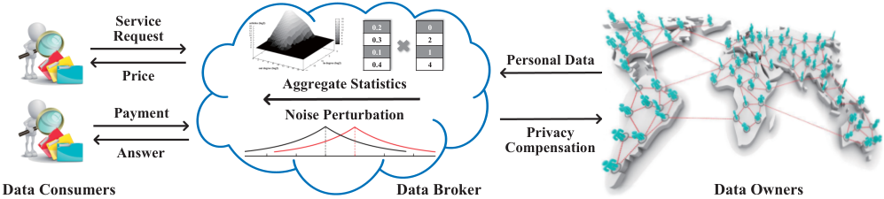

<!-- Start of picture text -->
Service  0.2 0 Request 0.3 2 0.10.4 14 Personal Data Price Aggregate Statistics Payment Noise Perturbation Privacy Answer Compensation Data Consumers Data Broker Data Owners <!-- End of picture text -->

**Figure 1: A General System Model for Aggregate Statistics based Data Markets.** 

include product ratings, electrical usages, social media data, location data, and health records. Due to social, behavioral, and genetic interactions in practice [3], there exist correlations among the collected data items. 

In the data trading layer, we consider that the data broker tends to trade aggregate statistics, _e.g._ , histogram count, weighted sum, mean, standard deviation, and probability distribution, rather than directly offering sensitive raw data to the data consumers [22]. Besides, each data consumer can request her customized service _𝑆_ = ( _𝑓, 𝑣_ ), where _𝑓_ is a concrete statistic, and _𝑣_ denotes a tolerable variance of noise added to the returned answer. 

Depending on the service _𝑆_ = ( _𝑓, 𝑣_ ), on one hand, the data broker charges the data consumer with the price _𝜋_ ( _𝑆_ ); on the other hand, the data broker compensates the data owner _𝑖_ with _𝜓𝑖_ ( _𝑆_ ) for her privacy leakage _𝜖𝑖_ . Specifically, if the variance of perturbing noise _𝑣_ is higher, the price _𝜋_ ( _𝑆_ ) should be lower, the privacy loss _𝜖𝑖_ is smaller, and thus the privacy compensation _𝜓𝑖_ ( _𝑆_ ) would be lower. Furthermore, a pricing framework is balanced if the utility of the data broker is no less than zero, _i.e._ , the price is sufficient to cover all the privacy compensations, namely _𝜋_ ( _𝑆_ ) _≥_∑︀_𝑛_ _𝑖_ =1_𝜓𝑖_(_𝑆_). 

## **2.2 Technical Preliminaries** 

In this section, we introduce the underlying mathematical operation of common aggregate statistics and the fundamental economic property of the pricing framework, namely dot product and arbitrage freeness, respectively. Besides, we briefly review dependent differential privacy. 

**Dot Product:** We first identify the elementary mathematical operation underlying common aggregate statistics. Without loss of generality, we consider three different practical aggregate statistics as follows. 

_Example 2.1._ A commercial company wants to capture the popularity of its product among customers. Besides, it assigns a weight _𝑤𝑖_ to each customer’s rating _𝑑𝑖_ . The final score takes the form of a weighted sum∑︀_𝑛_ _𝑖_ =1_𝑤𝑖𝑑𝑖_[28]. 

_Example 2.2._ A researcher would like to learn the Gaussian distribution over U.S. residential energy consumptions. The key parameters are mean and variance. It suffices to compute the sum∑︀_𝑛_ _𝑖_ =1_𝑑𝑖_andthesumofsquares∑︀_𝑛_ _𝑖_ =1_𝑑𝑖_ 2 [18, 23]. 

_Example 2.3._ A traffic analyst intends to count the drivers exceeding a certain speed limit _𝛿_ . She needs to compare _𝑑𝑖_ with _𝛿_ , and then do summation∑︀_𝑛_ _𝑖_ =11_{𝑑𝑖≤𝛿}_[21]. 

Given the above three application scenarios, we model the common aggregate statistics as a set of dot product operations. In particular, the dot product is conducted between a weight vector **w** and a data vector **x** , _i.e._ , **w**_𝑇_ **x** =∑︀_𝑛_ _𝑖_ =1_𝑤𝑖𝑥𝑖._ Here, _𝑥𝑖_ represents any general function of the original data _𝑑𝑖_ , _e.g._ , quadratic polynomial in Example 2.2 and nonlinear comparison in Example 2.3. Besides, the purpose of introducing an interfaced database **x** by preprocessing the original database **d** is to simplify and unify statistic models. Such a concept originates from practical computation over encrypted data using homomorphic encryption [18, 21, 23]. Moreover, the weight _𝑤𝑖_ , set by the data consumer, indicates her preference/importance over _𝑥𝑖_ . In the following context of a clear service type, for brevity, we use the weight vector **w** to specify the data consumer’s requested statistic _𝑓_ , _i.e._ , _𝑆_ = ( **w** _, 𝑣_ ). 

**Arbitrage Freeness:** We next introduce a desirable property of pricing functions, namely arbitrage freeness. Before investigating arbitrage freeness, we first establish the key concept of service determinacy. A similar concept has been studied in randomized query/view answering from the database community [14]. Under our data market model, the noisy answers can still be regarded as random variables. In particular, given a service request _𝑆_ = ( **w** _, 𝑣_ ) over the database **x** , the data broker answers using a randomized mechanism _ℳ_ , and returns the result _ℳ_ ( **x** ), where its expectation is **w**_𝑇_ **x** , and its variance is no more than _𝑣_ . We give the formal definition of service determinacy as follows. 

_Definition 2.4._ The determinacy relation is between a service _𝑆_ = ( **w** _, 𝑣_ ) and a multiset of services **Q** = _{𝑆_ 1 _, . . . , 𝑆𝑚}_ . We say that **Q** determines _𝑆_ , denoted as **Q** _↦→ 𝑆_ , if the following rules are satisfied: 

_∙ Summation:_ 

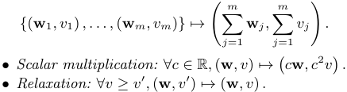

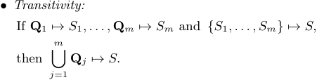

Based on the definition of service determinacy, we define arbitrage freeness in a formal way. 

_Definition 2.5 (Arbitrage Freeness)._ A pricing function _𝜋_ ( _·_ ) is arbitrage free, if _∀𝑚 ≥_ 1 _, {𝑆_ 1 _, . . . , 𝑆𝑚} ↦→ 𝑆_ implies: 

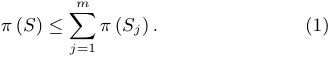

The intuition behind Definition 2.5 is that if there exists arbitrage in _𝜋_ ( _·_ ), _e.g._ , _𝜋_ ( _𝑆_ ) _>_∑︀_𝑚_ _𝑗_ =1_𝜋_(_𝑆𝑗_),thenthedata consumer would never pay the full price of the service _𝑆_ . Instead, she would turn to buying a cheaper set of the services _{𝑆_ 1 _, . . . , 𝑆𝑚}_ to answer _𝑆_ . 

**Dependent Differential Privacy:** We now introduce dependent differential privacy [16] from the privacy preservation perspective, _i.e._ , we focus on the randomized mechanism _ℳ_ itself. Yet, some of its disciplines will be used to mathematically quantify the privacy losses of data owners. 

Dependent differential privacy is essentially a variant of the celebrated differential privacy [7]. In particular, differential privacy imposes a bound on the maximum ratio between the probabilities of returning a certain aggregate result with and without any individual’s record, and thus limits the adversary’s ability to infer private information. As an enhanced version, dependent differential privacy further considers data correlations. We introduce its technical notations as follows. 

Given the statistic database **x** = ( _𝑥_ 1 _, . . . , 𝑥𝑛_ ), if any data item in **x** is dependent on at most _𝐿 −_ 1 other items, the dependent size of **x** is defined to be _𝐿_ . Besides, the probabilistic dependence relationship among the _𝐿_ data items is denoted as _𝑅_ . In particular, the existence of _𝑅_ could be due to a certain data generation process, or some other social, behavioral, and genetic relationships. For example, _𝑅_ in the Gowalla location dataset can be introduced from its relevant social network dataset [16]. Moreover, a pair of dependent neighboring databases is defined as follows. 

_Definition 2.6._ Two databases **x** ( _𝐿, 𝑅_ ) _,_ **x**_′_ ( _𝐿, 𝑅_ ) are dependent neighboring databases, if the modification of one data item in **x** ( _𝐿, 𝑅_ ) ( _e.g._ , _𝑥𝑖_ changes to _𝑥__′_ _𝑖_)causeschanges in at most _𝐿 −_ 1 other data items in **x**_′_ ( _𝐿, 𝑅_ ) due to the probabilistic dependence relationship _𝑅_ . 

For the sake of brevity, when the dependent/correlated context is clear, we omit the parameters _𝐿, 𝑅_ , and write **x** _,_ **x**_′_ instead. Based on dependent neighboring databases, the definition of dependent differential privacy is formalized as: 

_Definition 2.7 (𝜖-Dependent Differential Privacy)._ A randomized algorithm _ℳ_ provides _𝜖_ -dependent differential privacy, if for any pair of dependent neighboring databases **x** and **x**_′_ and any possible output _𝑂_ , we have: 

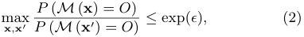

where _𝜖_ is the privacy budget. Smaller _𝜖_ provides better privacy and worse utility guarantees. 

To achieve _𝜖_ -dependent differential privacy, a matching dependent perturbation mechanism was proposed in [16]. The key idea is to carefully add Laplace noise by introducing fine-grained dependence coefficients between data items. In particular, _𝜌𝑖𝑗_ denotes the dependent relationship between _𝑥𝑖_ and _𝑥𝑗_ , which quantifies the dependence of _𝑥𝑗_ on the 

modification of _𝑥𝑖_ . With the help of _𝜌𝑖𝑗_ ’s, the dependent sensitivity of a numeric function _𝑓_ over the database **x** caused by the modification of _𝑥𝑖_ can be expressed as: 

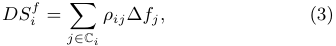

where C _𝑖_ denotes the index set of the _𝐿_ data items that are correlated with _𝑥𝑖_ . Besides, C _𝑖_ contains _𝑖_ itself, and the dependence coefficient _𝜌𝑖𝑖_ = 1. Furthermore, ∆ _𝑓𝑗_ denotes the sensitivity of _𝑓_ with respect to the modification of _𝑥𝑗_ itself, _i.e._ , ∆ _𝑓𝑗_ = max _𝑥𝑗_ 1 _,𝑥𝑗_ 2 _‖ 𝑓_ ( _. . . , 𝑥𝑗_ 1 _, . . ._ ) _− 𝑓_ ( _. . . , 𝑥𝑗_ 2 _, . . ._ ) _‖_ 1 _._ 

We finally give the formal definition of the dependent perturbation mechanism. We let _𝐿𝑎𝑝_ ( _𝜆_ ) denote one-dimensional Laplace distribution centered at 0 with scale _𝜆_ . 

Theorem 2.8 (Dependent Perturbation Mechanism). _The randomized mechanism ℳ_ 

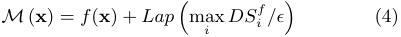

_guarantees 𝜖-dependent differential privacy._ 

## **3 SERVICE PRICING** 

In this section, we consider the first component of ERATO, namely the pricing mechanism for common aggregate statistics. It should be arbitrage free not only to the variance of perturbing noise _𝑣_ but also to the weight vector **w** . 

## **3.1 Incorporating Variance of Noise** 

We start with the first part of an arbitrage-free pricing function _𝜋_ ( **w** _, 𝑣_ ) involving the variance of noise _𝑣_ . 

Intuitively, _𝜋_ ( **w** _, 𝑣_ ) should monotonically decrease with the variance _𝑣_ , but the thorniest problem is how fast it can decrease with _𝑣_ . To figure out the boundary function, we formulate the arbitrage attack in Section 1 as follows. 

_Example 3.1._ A data consumer, who wants to obtain the service ( **w** _, 𝑣_ ) with a lower price, may turn to buying _𝑚_ other cheaper services of the same statistic but with higher variances, denoted as _{_ ( **w** _, 𝑣𝑗_ ) _|𝑗 ∈{_ 1 _, . . . , 𝑚}, 𝑣𝑗 > 𝑣}_ . Afterwards, the data consumer first applies summation and then scalar multiplication by 1 _/𝑚_ in Definition 2.4, _i.e._ , 

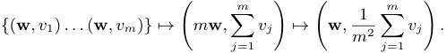

In other words, the data consumer computes the average of _𝑚_ answers, and gets an unbiased answer but with a lower variance. If the pricing function _𝜋_ ( _·_ ) is arbitrage free, then the following conditional statement must hold: 

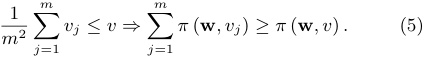

We give the following theorem to thwart the above attack: 

Theorem 3.2. _For any arbitrage-free pricing function 𝜋_ ( **w** _, 𝑣_ ) _, it cannot decrease faster than_ 1 _/𝑣._ 

Proof. Due to space limitations, we give a proof sketch here, and defer the detailed proof to our technical report [19]. We first prove 1 _/𝑣_ is the boundary function by using the inequality that the harmonic mean of a list of non-negative 

real numbers is no more than the arithmetic mean of the same list. We next show that if _𝜋_ ( **w** _, 𝑣_ ) decreases faster than 1 _/𝑣_ , we would derive an arbitrage, and finish our proof. □ 

In what follows, for the sake of simplicity, we fix the part of _𝜋_ ( **w** _, 𝑣_ ) related to the variance _𝑣_ at 1 _/𝑣_ by default, while investigate other functions, _e.g._ , 1 _/__~~√~~_ _<u>𝑣</u>_ <u>, in our evaluation part.</u> 

## **3.2 Incorporating Weight Vector** 

We continue to consider the other part of an arbitrage-free pricing function _𝜋_ ( **w** _, 𝑣_ ), namely the weight vector **w** . 

By carefully studying the rules of the service determinacy in Definition 2.4, we find a metric in linear algebra with analogous properties, called norm, more precisely semi-norm. In particular, a norm of a vector **w** can be viewed as a measure of its “length”. Formally speaking, a norm is any function _𝑔_ : R_𝑛_ _→_ R that satisfies the following properties: 

_∙ Subadditivity:_ 

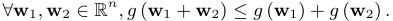

_∙ Homogeneity: ∀𝑐 ∈_ R _,_ **w** _∈_ R_𝑛_ _, 𝑔_ ( _𝑐_ **w** ) = _|𝑐|𝑔_ ( **w** ) _._ 

_∙ Non-negativity: ∀_ **w** _∈_ R_𝑛_ _, 𝑔_ ( **w** ) _≥_ 0 _._ 

_∙ Definiteness:_ **w** = **0** _⇔ 𝑔_ ( **w** ) = 0 _._ 

If we relax the last property to **w** = **0** _⇒ 𝑔_ ( **w** ) = 0, we call it semi-norm. Besides, the most commonly used norms in the machine learning algorithms are a family of _ℓ𝑝_ norms for some real number _𝑝 ≥_ 1. Furthermore, considering that the trivial example of zero-price function, _i.e._ , _∀𝜋_ ( **w** _, 𝑣_ ) = 0, is arbitrage free, we utilize semi-norms to devise our basic arbitrage-free pricing functions. 

Theorem 3.3 (Basic Arbitrage-free Pricing Functions). _Let 𝜋_ ( **w** _, 𝑣_ ) = _𝑔_ ( **w** )2 _/𝑣 be the pricing function for some positive function 𝑔_ ( **w** ) _that only depends on_ **w** _. Then, 𝜋_ ( **w** _, 𝑣_ ) _is arbitrage free iff 𝑔_ ( **w** ) _is a semi-norm._ 

We next consider how to construct more arbitrage-free pricing functions by combining those basic ones. We resort to a general class of nondecreasing and subadditive functions. We recall that a function Γ : R_𝜑_ _→_ R over _∀_ **y** _,_ **z** _∈_ R_𝜑_ is nondecreasing, if **y** _≤_ **z** _,_ Γ( **y** ) _≤_ Γ( **z** ). Besides, it is subadditive, if Γ( **y** + **z** ) _≤_ Γ( **y** ) + Γ( **z** ). 

Theorem 3.4 (Composite Arbitrage-free Pricing Functions). _Let_ Γ : R_𝜑_ _→_ R _be a nondecreasing and subadditive function. For any set of arbitrage-free pricing functions {𝜋_ 1( _𝑆_ ) _, . . . , 𝜋𝜑_ ( _𝑆_ ) _}, the composite pricing function 𝜋_ ( _𝑆_ ) = Γ( _𝜋_ 1( _𝑆_ ) _, . . . , 𝜋𝜑_ ( _𝑆_ )) _is also arbitrage free._ 

We give some typical examples of composite pricing functions: If _𝜋_ 1( _𝑆_ ) _, . . . , 𝜋𝜑_ ( _𝑆_ ) are arbitrage free, then 

- _Linear Combination: ∀𝑐_ 1 _, . . . , 𝑐𝜑 ≥_ 0 _,_∑︀_𝜑_ _𝑘_ =1_𝑐𝑘𝜋𝑘_(_𝑆_); 

- _∙ Geometric Mean:_ ~~√~~ <u>∏</u> _𝜑𝑘_ ︀ =1_𝜋𝑘_(_𝑆_); 

- _Cut-off:_ min( _𝜋_ 1( _𝑆_ ) _, 𝑐_ ) for _𝑐 ≥_ 0; 

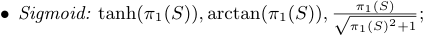

are arbitrage free as well. We note that the basic arbitragefree pricing functions and the first two composite ones set an infinite price for the unperturbed answer, _i.e._ , the variance _𝑣_ = 0. However, these functions may be unpractical in data markets, since the data broker tends to sell unperturbed 

aggregate statistics for high but finite prices. Nevertheless, we can turn to applying some bounding functions, _e.g._ , cut-off and sigmoid functions. In particular, sigmoid functions are commonly used as activation functions in neural networks. 

Due to space limitations, we put the proofs of Theorem 3.3 and Theorem 3.4 into our technical report [19]. 

## **4 PRIVACY COMPENSATION** 

In this section, we consider the other component of ERATO, _i.e._ , the privacy compensation mechanism for individual privacy loss. We propose both bottom-up and top-down designs. In the bottom-up design, the sum of privacy compensations determines the service price, while this relation is inverse in the top-down design. Besides, another major difference is that the bottom-up design allows each data owner to actively select a privacy compensation function for her privacy strategy, which is instead not required in the top-down design. 

## **4.1 Privacy Loss for General Function** 

When the data broker answers aggregate statistics with the randomized mechanism _ℳ_ , some private information of each data owner would be leaked. Based on the dependent differential privacy in Section 2.2, we formally define the individual privacy loss _𝜖𝑖_ for an arbitrary real-valued function _𝑓_ . 

We first consider a pair of dependent neighboring databases **x** and **x**(_𝑖_) , which initially differs in the data item _𝑥𝑖_ . In fact, **x** and **x**(_𝑖_) simulate the presence and absence of the data owner _𝑖_ . By comparing the output of the randomized mechanism _ℳ_ over **x** and **x**(_𝑖_) [10], we define individual privacy loss: 

_Definition 4.1 (Individual Privacy Loss)._ The privacy loss of the data owner _𝑖_ in the randomized mechanism _ℳ_ over the database **x** is defined as: 

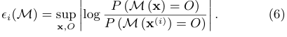

We further give an upper bound of the individual privacy loss _𝜖𝑖_ ( _ℳ_ ), when the randomized mechanism _ℳ_ is the dependent perturbation mechanism defined in Theorem 2.8. 

Theorem 4.2. _Let ℳ be dependent perturbation mechanism, 𝑓 be any numeric function, 𝐷𝑆𝑖__𝑓bethedependent_ _sensitivity of 𝑓 at 𝑥𝑖, and 𝑣 be the variance of Laplace noise. The privacy loss of the data owner 𝑖 is bounded above by:_ 

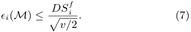

Due to the limitation of space, the proof of Theorem 4.2 is put into our technical report [19]. 

## **4.2 Bottom-up Design** 

In this section, we consider the bottom-up design of privacy compensation. The data broker first needs to satisfy each individual privacy compensation _𝜓𝑖_ ( _𝑆_ ), and then determine the price _𝜋_ ( _𝑆_ ) for the data consumer. 

First, the individual privacy compensation _𝜓𝑖_ ( _𝑆_ ) should hinge on the individual privacy loss _𝜖𝑖_ ( _ℳ_ ). Besides, the data broker can evaluate/approximate _𝜖𝑖_ ( _ℳ_ ) from the service _𝑆_ itself. However, the original _𝜖𝑖_ ( _ℳ_ ) in Definition 4.1 not only depends on the actual randomized mechanism _ℳ_ , but 

also needs to consider all the database instances and all the possible outputs, which can be infeasible to compute in practice [14]. Therefore, we turn to focusing on the specific dependent perturbation mechanism in Theorem 2.8, and utilize the upper bound of privacy loss in Theorem 4.2 to do compensation. We note that the bounded privacy loss in Theorem 4.2 is given as a function of the variance _𝑣_ and the dependent sensitivity _𝐷𝑆𝑖__𝑓_.Here,wecancompute_𝐷𝑆_ _𝑖__𝑓_in thethe contextinfimumofandaggregatesupremumstatistics.of theWedataletitem¯ _𝛽𝑖, 𝛽_¯ _𝑖𝑥∈𝑖_ ’sRdomain,denote respectively. Then, according to Equation (3), we can get: _𝐷𝑆𝑖__𝑓_= ∑︁ _𝜌𝑖𝑗 |𝑤𝑗|_ (︀ _𝛽_ ¯ _𝑗 −_ ¯ _𝛽𝑗_ )︀ _._ (8) _𝑗∈_ C _𝑖_ 

Suppose we ignore data correlations by setting _𝜌𝑖𝑗_ = 0 for all _𝑗 ∈_ C _𝑖∖𝑖_ . The dependent sensitivity in Equation (8) degenerates to the sensitivity defined in differential privacy [7]: 

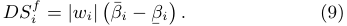

After quantifying the individual privacy loss in aggregate statistics, we now consider how to compensate each data owner properly. We first identify two desirable properties: 

_Definition 4.3 (Bottom-up Privacy Compensation)._ Let _𝜓𝑖_ ( _𝑆_ ) be a privacy compensation function over the service _𝑆_ = ( **w** _, 𝑣_ ) in the bottom-up design. _𝜓𝑖_ ( _𝑆_ ) should satisfy: 

- _Dependent Fairness: ∀𝑗 ∈_ C _𝑖, 𝑤𝑗_ = 0 _⇒ 𝜓𝑖_ ( _𝑆_ ) = 0. 

_∙ Micro Arbitrage Freeness: 𝜓𝑖_ ( _𝑆_ ) is arbitrage free. 

We give some comments on these two properties as follows. (1) Dependent fairness is an extension of fairness defined in the conventional query-based pricing [14] by further considering data correlations. The original fairness says that the data owner, whose data is not queried, should not expect reward. In contrast, our dependent fairness says that only if the data owner and her correlated data owners are not involved in the service, she will receive no privacy compensation. Although the case, where a data owner who is not involved but may still be compensated, seems counterintuitive, it makes sense from the perspective of privacy loss due to data correlations. (2) Micro arbitrage freeness is a necessity in the bottom-up design. The reason is that the service price at top hinges on the total privacy compensations at bottom. Therefore, the data consumer has strong motivations to circumvent the due privacy compensations and thus the payment by asking other alternative services. Besides, the definition of micro arbitrage freeness is identical to that of arbitrage freeness, but the former needs to be verified over the whole data owners. 

In a similar way to service pricing, we design basic bottomup privacy compensation functions directly from the privacy losses, which set infinite compensations for unperturbed answers. This kind of privacy compensation functions are suitable for the data owner, who values her privacy highly, and would never accept full disclosure of personal data. 

Theorem 4.4. _The privacy compensation functions_ 

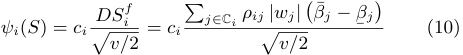

_for some constant 𝑐𝑖 >_ 0 _and for all 𝑖 ∈{_ 1 _, . . . , 𝑛}, are basic bottom-up privacy compensation functions._ 

Proof. First, we prove dependent fairness. We can check that _∀𝑗 ∈_ C _𝑖, 𝑤𝑗_ = 0 _⇒ 𝜓𝑖_ ( _𝑆_ ) = 0. Second, we prove micro arbitrage freeness. We view _𝜓𝑖_ ( _𝑆_ ) as a linear combination of _{|𝑤𝑗|/_ ~~√~~ _𝑣/_ 2 _|𝑗 ∈_ C _𝑖}_ , where the corresponding coefficients arebination), _{𝑐𝑖𝜌𝑖𝑗_ ( _𝛽_ to¯ _𝑗 −_ prove¯ _𝛽𝑗_ ) _|𝑗_ the _∈_ microC _𝑖}_ . ByarbitrageTheoremfreeness3.4 (Linearof _𝜓𝑖_ ( _𝑆_ Com-), it suffices to prove that _|𝑤𝑗|/_ ~~√~~ _𝑣/_ 2 is arbitrage free. By Theorem 3.4 (Geometric Mean), it further suffices to prove the arbitrage freeness of 2 _𝑤𝑗_ 2 _/𝑣_ . Now, by using the weighted _ℓ_ 2 norm and setting those weights, whose indexes are not _𝑗_ , to be zeros, it completes our proof. □ 

Analogous to Theorem 3.4, we can construct new bottomup privacy compensation functions from basic ones by applying any nondecreasing and subadditive function. In particular, to allow the data owner, who is less concerned about her privacy, to reveal her personal data at some high but finite price, we can make use of sigmoid functions. 

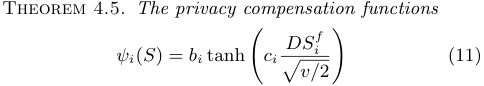

_for constants 𝑏𝑖, 𝑐𝑖 >_ 0 _and for all 𝑖 ∈{_ 1 _, . . . , 𝑛}, are bounded bottom-up privacy compensation functions._ 

Proof. First, we can check that _∀𝑗 ∈_ C _𝑖, 𝑤𝑗_ = 0 _⇒ 𝜓𝑖_ ( _𝑆_ ) = 0. Second, we have proved the arbitrage freeness of _𝑐𝑖𝐷𝑆𝑖__𝑓/_ ~~√~~ _𝑣/_ 2 above. Then, by Theorem 3.4 (Sigmoid and Linear Combination), _𝜓𝑖_ ( _𝑆_ ) is micro arbitrage free. □ At last, the data broker can determine the service price _𝜋_ ( _𝑆_ ). Take _𝜋_ ( _𝑆_ ) = _𝑐_∑︀_𝑛_ _𝑖_ =1_𝜓𝑖_(_𝑆_)_, 𝑐>_1forexample.Wenote that if every _𝜓𝑖_ ( _𝑆_ ) is micro arbitrage free, the pricing function _𝜋_ ( _𝑆_ ), which can be viewed as a linear combination of _𝜓𝑖_ ( _𝑆_ )’s, is factually arbitrage free. Of course, _𝜋_ ( _𝑆_ ) can be any other composite functions under Theorem 3.4. 

## **4.3 Top-down Design** 

In this section, we consider a different top-down privacy compensation design, where the data broker first determines the service price _𝜋_ ( _𝑆_ ) with the pricing mechanism in Section 3, and then spares some fraction of the payment for privacy compensation, _i.e._ ,∑︀_𝑛_ _𝑖_ =1_𝜓𝑖_(_𝑆_) =_𝑐𝜋_(_𝑆_)forsome0_< 𝑐<_1. If we regard _𝑐𝜋_ ( _𝑆_ ) as a budget _𝐵_ , we can convert the privacy compensation problem to a budget allocation problem, where each data owner _𝑖_ ’s share in _𝐵_ should be roughly proportional to her privacy loss _𝜖𝑖_ ( _ℳ_ ). 

Specific to the dot product operation in common aggregate statistics, we shall tighten the upper bound of the individual privacy loss _𝜖𝑖_ ( _ℳ_ ) by computing the dependent sensitivity more accurately. Our improvement is based on the observation1 that the definition and the mechanism of the dependent differential privacy proposed in [16] aim to be applicable for general functions and general positive/negative correlations, which implies that the general dependent sensitivity can be just a loose upper bound in the context of a specific function. Such a key observation enables us to tighten the dependent 

> 1Our observation has been discussed with the authors of [16]. The motivating examples and proofs can be found in our technical report [19]. 

sensitivity and thus the individual privacy loss by considering two extra factors: whether the weight is negative or positive, and whether the correlation is negative or positive. In detailed calculations, we keep the original forms of weights rather than using their absolute values as in the dependent differential privacy, namely Equation (8). Besides, we introduce _𝜎𝑖𝑗_ = _−_ 1 and _𝜎𝑖𝑗_ = 1 to represent the cases that _𝑥𝑖, 𝑥𝑗_ are negatively and positively correlated, respectively. We thus get: 

Lemma 4.6. _The tight dependent sensitivity of 𝑓_ = **w**_𝑇_ **x** _at 𝑥𝑖 over the database_ **x** _is given as:_ 

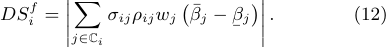

After obtaining the tight upper bound of individual privacy loss, we can utilize it to compute each data owner’s share in the total privacy compensations _𝐵_ . Before this, we note that in the top-down design, the privacy compensation function _𝜓𝑖_ ( _𝑆_ ) should still guarantee dependent fairness, but no longer needs to ensure micro arbitrage freeness. The reason is that the arbitrage-free service price _𝜋_ ( _𝑆_ ) has been paid by the data consumer, and she is not involved in the separate process of privacy compensation. Thus, it is infeasible for the data consumer, as an attacker, to gain arbitrage. 

Theorem 4.7. _The privacy compensation functions_ 

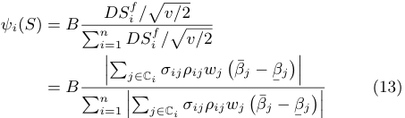

_for the total privacy compensations 𝐵 and for all 𝑖 ∈{_ 1 _, . . . , 𝑛}, are top-down privacy compensation functions._ 

Proof. We prove the dependent fairness by checking that _∀𝑗 ∈_ C _𝑖, 𝑤𝑗_ = 0 _⇒ 𝜓𝑖_ ( _𝑆_ ) = 0. □ 

In short, without the need of ensuring micro arbitrage freeness as in the bottom-up design, the top-down design is applicable to any general aggregate statistic. 

## **5 EVALUATION RESULTS** 

In this section, we present the evaluation results in terms of privacy and utility guarantees, arbitrage-free pricing functions, and fine-grained privacy compensations. 

**Datasets:** We use four real-world datasets, including MovieLens 1M Dataset [17], 2009 Residential Energy Consumption Survey (RECS) dataset [1], and two large-scale social network datasets from Stanford Network Analysis Platform (SNAP) [24], for three different aggregate statistics, namely weighted sum, probability distribution fitting, and degree distribution, respectively. First, the MovieLens dataset contains 1,000,209 ratings of approximately 3900 movies made by 6040 anonymous users. Besides, we extracted the displayed ratings from MovieLens, which function as target variables in supervised learning. Second, the RECS dataset, which was released by U.S. Energy Information Administration (EIA) in January 2013, provides diverse energy usages in 12,083 

U.S. homes. Third, the two SNAP datasets are named egoTwitter and ego-Gplus: ego-Twitter comprises 81,306 nodes and 1,768,149 edges from Twitter, while e-Gplus contains 107,614 nodes and 13,673,453 edges from Google+. 

**Profiles:** To compute the dependence coefficient _𝜌𝑖𝑗_ by means of the method in [16], we also need to acquire each data owner’s profile as auxiliary data. The above four datasets all provide this information: The MovieLens dataset comprises some attributes of users, _e.g._ , gender, age, and occupation; The RECS dataset contains several attributes of each household, such as heating degree days, cooling degree days, total number of rooms, etc; The two SNAP datasets include node features, _e.g._ , gender, institution, and job title. Just as [16], we set the similarity threshold between two profiles to be 0.8, and only consider positive correlation, _i.e._ , _𝜎𝑖𝑗_ = 1. In contrast, the weight _𝑤𝑗_ here can be either negative or positive, which helps to verify the effect of negative correlation, since _𝜎𝑖𝑗𝑤𝑗_ in Lemma 4.6 is in the product form. 

**Statistics:** For weighted sum, we apply linear regression to the ratings of different movies from distinct numbers of users, and learn different weight vectors with distinct dimensions. For Gaussian distribution fitting, we draw the univariate Gaussian distribution of a certain type of energy consumption, _e.g._ , space heating, air conditioning, or refrigerators. For degree distribution, we count both in and out degrees of every user in Twitter and Google+ networks. 

## **5.1 Privacy and Utility Guarantees** 

Before investigating economic properties, we first show how ERATO can improve the utility of aggregate statistics, by calculating the dependent sensitivity more accurately for the dependent perturbation mechanism in Theorem 2.8. Figure 2(a) depicts the accuracies of weighted sum under the Laplace perturbation mechanism [7] in the conventional differential privacy (DP), and the dependent perturbation mechanisms in the dependent differential privacy (DDP) and our ERATO. Here, we select the movie ratings from 1000 users for training, and thus derive 1000-dimensional weight vectors. Besides, we define the accuracy as 1 _−__<u>|𝑓</u>_<u>(</u>**x**<u>)</u>_−_ _<u>𝑓</u>_˜ <u>(</u> **x** <u>)</u> _<u>|</u> |𝑓_ ( **x** )+ _𝑓_˜ ( **x** ) _|_[16],where_𝑓_(**x**)and _𝑓_ ˜( **x** ) are true and perturbed results, respectively. 

One key observation from Figure 2(a) is that more accuracy is achieved as the privacy budget _𝜖_ increases, which conforms to Definition 2.7. The second key observation is derived by comparing three perturbation mechanisms at a fixed _𝜖_ . ERATO is more accurate than DDP or even DP. In particular, when _𝜖_ = 0 _._ 01, ERATO improves 10 _._ 67% and 4 _._ 20% of accuracies than DDP and DP, respectively. First, due to the triangle inequality, each individual dependent sensitivity _𝐷𝑆𝑖__𝑓_ in ERATO, namely Equation (12), is no greater than that in DDP, namely Equation (8), which implies the same relation for max _𝑖 𝐷𝑆𝑖__𝑓_.Thus,thetrueresultinERATOisperturbed with less noise than that in DDP. Second, DP is a special case of DDP or ERATO, where the _𝐿 −_ 1 correlated data items are ignored when evaluating _𝐷𝑆𝑖__𝑓_, namely Equation (9). Although _𝐷𝑆𝑖__𝑓_inDPisalwaysnogreaterthanthatinDDP, there exist negative weights here. Besides, the negative part can have more effect on some _𝐷𝑆𝑖__𝑓_’sthanthepositivepart (not including _𝑖_ itself). Hence, max _𝑖 𝐷𝑆𝑖__𝑓_inERATOcanbe 

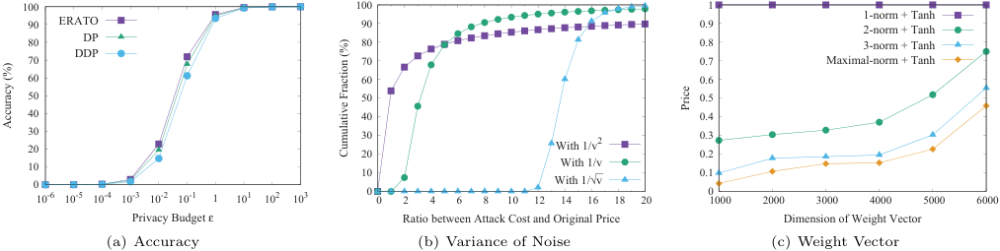

<!-- Start of picture text -->
 100  100  1  90 ERATO  90  0.9 1-norm + Tanh2-norm + Tanh  80 DP  80  0.8 3-norm + Tanh  70 DDP  70  0.7 Maximal-norm + Tanh  60  60  0.6  50  50  0.5  40  40  0.4  30 20  30 20 With 1/v 2  0.3 0.2  10 0  10 With 1/With 1/v√⎯v  0.1  0  0 10 -6 10 -5 10 -4 10 -3 10 -2 10 -1 1 10 1 10 2 10 3  0  2  4  6  8  10  12  14  16  18  20  1000  2000  3000  4000  5000  6000 Privacy Budget ε Ratio between Attack Cost and Original Price Dimension of Weight Vector (a) Accuracy (b) Variance of Noise (c) Weight Vector Price Accuracy (%) Cumulative Fraction (%) <!-- End of picture text -->

**Figure 2: Privacy vs. Utility and Arbitrage Freeness in Weighted Sum.** 

less than that in DP, which means higher accuracy. Third, when _𝜖_ is too small or too large, the perturbation or the true result completely dominates, and the differences among the accuracies of three perturbation mechanisms are tiny. In conclusion, ERATO can better balance privacy and utility in the aggregate statistics than DP and DDP. 

## **5.2 Arbitrage-free Pricing Functions** 

In this section, we carry on with the weighted sum application, and further explore arbitrage freeness. 

**Variance of Noise:** We first evaluate the variance of noise _𝑣_ in an arbitrage-free pricing function by simulating the attack in Example 3.1. After simulating 10000 samples, we plot the cumulative fraction of the ratio between the attack cost∑︀_𝑚_ _𝑗_ =1_𝜋_(**w**_, 𝑣𝑗_)andtheoriginalprice_𝜋_(**w**_, 𝑣_)in Figure 2(b), where _𝜋_ ( _·_ ) decreases with _𝑣_ from 1 _/𝑣_2 , to 1 _/𝑣_ , and to 1 _/__~~√~~_ _<u>𝑣</u>_ <u>.</u> Here, the cumulative fraction differs from the common cumulative distribution function in that it does not include the endpoint. For example, when the ratio takes 1, the cumulative fraction denotes the fraction of the samples, where the attack cost is strictly less than the original price. More specifically, the cumulative fraction at the ratio of 1 can generally embody the success ratio of finding arbitrage. 

By observing the cumulative fractions at the ratio of 1 in Figure 2(b), we can see that there exists arbitrage in 1 _/𝑣_2 , while the other two pricing functions are arbitrage free. Besides, the probability that the attacker can find arbitrage is 53 _._ 91%. This coincides with Theorem 3.2. We can also observe that an attempt of finding arbitrage in 1 _/__~~√~~_ _<u>𝑣</u>_ is expected to be more costly than that in 1 _/𝑣_ , which can be roughly captured by the areas above these two function curves. Therefore, the pricing function, which decreases slower with the variance _𝑣_ , _e.g._ , 1 _/__~~√~~_ _<u>𝑣</u>_ vs. 1 _/𝑣_ , can be more robust against arbitrage. 

**Weight Vector:** We continue to examine the other part of an arbitrage-free pricing function, namely weight vector. Figure 2(c) plots four composite pricing functions, when the dimension of weight vector _𝑛_ increases from 1000 to 6000 with a step of 1000. Specifically, the composite pricing functions are derived by first applying _ℓ_ 1 _, ℓ_ 2 _, ℓ_ 3 _, ℓ∞_ norms and then tanh. Besides, the variance _𝑣_ is set to be 0.1, which gives an error of 1 with 90% confidence by Chebyshev’s inequality. 

From Figure 2(c), we can see that the composite pricing function using _ℓ_ 1 norm remains almost unchanged at 1, while 

the other ones increase with the dimension _𝑛_ . The reason is that when _𝑛_ = 1000, the pricing function using _ℓ_ 1 norm has already approximated tanh’s upper bound 1. Besides, the absolute value of each weight is less than 1 here. Thus, as depicted in Figure 2(c), when _𝑛_ is fixed, the price becomes lower for the pricing function using _ℓ𝑝_ norm with a larger _𝑝_ . 

The above evaluation results demonstrate that arbitrage freeness is a strong economic property. If not guaranteed, _e.g._ , in the case of 1 _/𝑣_2 , it is effortless for the data consumer to game the data market. Besides, the data broker can develop her pricing strategy by carefully applying Theorem 3.4. 

## **5.3 Fine-grained Privacy Compensations** 

In this section, we show the privacy compensations in three different aggregate statistics. For clarity in presentation and comparison, we fix the total privacy compensations such that one data owner is rewarded with 10 units in average. Besides, we choose the same bounded privacy compensation function in Theorem 4.5 for each data owner in the bottom-up design. 

Before introducing the concrete evaluation results, we first analyze the major differences among three aggregate statistics: (1) From mathematical formula, there exist both positive and negative weights in weighted sum, while the weights in the other two statistics are all 1’s. Besides, the domain of each data item keeps the same in a certain statistic; (2) From privacy compensation, suppose that we employ the DP framework, which ignores data correlations and compensates the data owner roughly proportional to the absolute value of her weight. Each data owner would be compensated with the average 10 units in Gaussian distribution fitting and degree distribution. Therefore, we only compare DP and ERATO in weighted sum, and directly show ERATO-based evaluation results in the other two statistics. 

**Weighted Sum:** We start with weighted sum, where the dimension of weight vector is fixed at 1000, and the variance _𝑣_ is 0.1 as in Section 5.2. Figure 3 plots the bottom-up and top-down privacy compensations under DP and ERATO. Here, a pair of neighboring _𝑥_ -axis ticks in Figure 3 denote a half-closed interval, _e.g._ , the hist from “9” to “10” stands for the privacy compensations between 9 and 10 excluding 10. 

We first compare DP and ERATO in a certain design of privacy compensation. As depicted in Figure 3, compared with DP, more privacy compensations fall into the center 

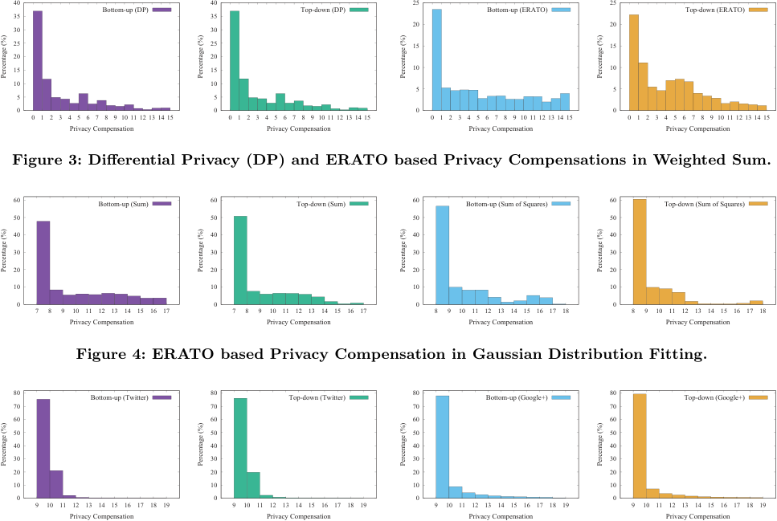

<!-- Start of picture text -->
 40  40  25  25  35 Bottom-up (DP)  35 Top-down (DP) Bottom-up (ERATO) Top-down (ERATO)  20  20  30  30  25  25  15  15  20  20  15  15  10  10  10  10  5  5  5  5  0  0  0  0 0 1 2 3 4 5 6 7 8 9 10 11 12 13 14 15 0 1 2 3 4 5 6 7 8 9 10 11 12 13 14 15 0 1 2 3 4 5 6 7 8 9 10 11 12 13 14 15 0 1 2 3 4 5 6 7 8 9 10 11 12 13 14 15 Privacy Compensation Privacy Compensation Privacy Compensation Privacy Compensation Figure 3: Differential Privacy (DP) and ERATO based Privacy Compensations in Weighted Sum.  60 Bottom-up (Sum)  60 Top-down (Sum)  60 Bottom-up (Sum of Squares)  60 Top-down (Sum of Squares)  50  50  50  50  40  40  40  40  30  30  30  30  20  20  20  20  10  10  10  10  0  0  0  0 7 8 9 10 11 12 13 14 15 16 17 7 8 9 10 11 12 13 14 15 16 17 8 9 10 11 12 13 14 15 16 17 18 8 9 10 11 12 13 14 15 16 17 18 Privacy Compensation Privacy Compensation Privacy Compensation Privacy Compensation Figure 4: ERATO based Privacy Compensation in Gaussian Distribution Fitting.  80 Bottom-up (Twitter)  80 Top-down (Twitter)  80 Bottom-up (Google+)  80 Top-down (Google+)  70  70  70  70  60  60  60  60  50  50  50  50  40  40  40  40  30  30  30  30  20  20  20  20  10  10  10  10  0  0  0  0 9 10 11 12 13 14 15 16 17 18 19 9 10 11 12 13 14 15 16 17 18 19 9 10 11 12 13 14 15 16 17 18 19 9 10 11 12 13 14 15 16 17 18 19 Privacy Compensation Privacy Compensation Privacy Compensation Privacy Compensation Percentage (%) Percentage (%) Percentage (%) Percentage (%) Percentage (%) Percentage (%) Percentage (%) Percentage (%) Percentage (%) Percentage (%) Percentage (%) Percentage (%) <!-- End of picture text -->

**Figure 5: ERATO based Privacy Compensation in Twitter and Google+ Degree Distributions.** 

region under ERATO. In particular, 325 data owners receive no privacy compensation in both bottom-up and top-down designs under DP, whereas this number decreases to 148 under ERATO. Such an outcome truly reflects the difference between the properties of fairness and dependent fairness. 

We next compare the bottom-up and top-down designs under a certain framework. From Figure 3, we can see that these two designs of privacy compensation appear identical under DP, but look a slightly different under ERATO. First, each data owner’s privacy losses measured by two DP-based designs are the same. Besides, when the total privacy compensations are fixed, each data owner’s shares are proportional to her privacy loss and her privacy loss’s tanh value in the topdown and bottom-up designs, respectively. Moreover, most of the privacy losses _𝜖𝑖_ ’s are within 0.1. We further note that 0 _≤ 𝜖𝑖 ≤_ 0 _._ 1 _,_ tanh( _𝜖𝑖_ ) _≈ 𝜖𝑖_ . Hence, the privacy compensations in two designs look almost the same under DP. In contrast, under ERATO, the privacy losses in the top-down design are computed more accurately than those in the bottom-up design, which implies distinct privacy compensations. 

**Gaussian Distribution:** We now show the privacy compensation of Gaussian distribution fitting under ERATO. We recall that Gaussian distribution can be answered by sum and sum of squares. We plot the major privacy compensations and their percentages in Figure 4, where the results are derived by averaging 10 kinds of energy consumptions in 

10000 U.S. homes. Besides, we set the variance of noise _𝑣_ to be 100 in the bottom-up design 

First, we can see from Figure 4 that different data owners may obtain distinct privacy compensations rather than the uniform 10 under DP. Second, by comparing privacy compensations in a specific design for two statistics, we can see that they are different from each other, because the dependence coefficients in the sum have changed in the sum of squares. Third, we compare the privacy compensations in two designs for a certain statistic, and find them consistent in general. This is because when both correlations and weights are positive, the privacy losses measured by two designs are the same. In addition, when the total privacy compensations are fixed, the difference between two designs is that the bottom-up design further applies tanh to the privacy losses. 

**Degree Distribution** : We finally investigate how privacy compensations are allocated in large-scale social networks. Figure 5 depicts the evaluation results of the degree distributions in Twitter and Google+. We set the variance _𝑣_ to be 10 in the bottom-up design. From Figure 5, we can see that most of privacy compensations fall in the central interval between 9 and 11 in both Twitter and Google+. This outcome stems from the fact that the degree distribution of Twitter/Google+ social network asymptotically follows a power law. In particular, 37 _._ 17% and 45 _._ 49% of Twitter and Google+ users have degrees no more than 5, respectively. 

Besides, the number of a data owner’s degrees has a positive correlation with her privacy loss [29]. Therefore, most of the data owners are compensated around the average 10 units. 

These evaluation results demonstrate that two ERATObased designs can indeed compensate the data owners for their privacy losses in a fairer and more fine-grained way. 

## **6 RELATED WORK** 

In this section, we briefly review related work. 

**Data Market Design:** In recent years, data market design has gained increasing attention, especially from the database community. The researchers in this field mainly focus on arbitrage freeness in query-based pricing [6]. Koutris _et al._ [13] showed that the prices of a large class of SQL queries can be computed using ILP solvers. Later, Lin and Kifer [15] designed arbitrage-free pricing functions for arbitrary query formats. Specific to private data, Ghosh and Roth [10] considered differential privacy as a commodity, and proposed to selling privacy at auction for single counting query. The follow-up work [14] further extends to multiple linear queries by introducing arbitrage freeness. 

However, none of above works took data correlations into account, and further considered trading aggregate statistics. 

**Privacy Preserving Aggregate Statistics:** An explosive demand of mining private data from multiple sources contributes to growing interest in privacy preserving aggregate statistics, where a data analyst can study patterns/statistics over a population while maintaining individual privacy. This line of works mainly fall into two categories. The first category is homomorphic encryption based, which regards the data analyst as an attacker [21, 23]. The second category is differential privacy based, which assumes that the data analyst can be trusted [7]. Under this security assumption, the data analyst adds appropriate noises to aggregate results before releasing them, which can resist external attackers, _e.g._ , data consumers in our model. However, as pointed by Kifer and Machanavajjhala [11], the perturbation can be inadequate in the case of data correlations. They thus proposed a generalized version of differential privacy, called Pufferfish [12]. Many follow-up research works have been going on around this particular issue. In addition to the dependent differential privacy [16], Song _et al._ [25] proposed a Wasserstein mechanism for any general Pufferfish instantiation, together with an efficient Markov Quilt mechanism for Bayesian networks. 

The original intention of these works is preserving privacy rather than pricing privacy, which is our major focus. 

## **7 CONCLUSION** 

In this paper, we have proposed the first pricing framework ERATO for the data markets providing common aggregate statistics over private correlated data. In ERATO, the data consumer has to faithfully request the desired service rather than gaming the system through buying a bundle of cheaper services. Besides, the data owners can be compensated for their dependent privacy losses in a more fine-grained way. Moreover, we have instantiated ERATO with three different kinds of aggregate statistics, and extensively evaluated their performances on four practical datasets. Evaluation and analysis results have demonstrated the feasibility of ERATO. 

## **REFERENCES** 

- [1] 2009 RECS Dataset. 2013. https://www.eia.gov/consumption/ residential/data/2009/index.php?view=microdata. 

- [2] Joshua Brustein. 2012. Start-Ups Seek to Help Users Put a Price on Their Personal Data. _The New York Times_ (Feb. 2012). 

- [3] Eunjoon Cho, Seth A. Myers, and Jure Leskovec. 2011. Friendship and mobility: user movement in location-based social networks. In _KDD_ . 1082–1090. 

- [4] Rachel Cummings, Katrina Ligett, Aaron Roth, Zhiwei Steven Wu, and Juba Ziani. 2015. Accuracy for Sale: Aggregating Data with a Variance Constraint. In _ITCS_ . 317–324. 

- [5] Data Brokers: A Call For Transparency and Accountability. 2014. https://www.ftc.gov/reports/data-brokers-call-transparency% 2Daccountability-report-federal-trade-commission-may-2014. 

- [6] Shaleen Deep and Paraschos Koutris. 2017. QIRANA: A Framework for Scalable Query Pricing. In _SIGMOD_ . 699–713. 

- [7] Cynthia Dwork and Aaron Roth. 2014. The Algorithmic Foundations of Differential Privacy. _Foundations and Trends in Theoretical Computer Science_ 9, 3-4 (2014), 211–407. 

- [8] Nicole Eikmeier and David F. Gleich. 2017. Revisiting Power-law Distributions in Spectra of Real World Networks. In _KDD_ . 

- [9] Facebook Is Not the Problem. Lax Privacy Rules Are. 2018. https://www.nytimes.com/2018/04/01/opinion/facebooklax-privacy-rules.html. 

- [10] Arpita Ghosh and Aaron Roth. 2011. Selling privacy at auction. In _EC_ . 199–208. 

- [11] Daniel Kifer and Ashwin Machanavajjhala. 2011. No free lunch in data privacy. In _SIGMOD_ . 193–204. 

- [12] Daniel Kifer and Ashwin Machanavajjhala. 2012. A rigorous and customizable framework for privacy. In _PODS_ . 77–88. 

- [13] Paraschos Koutris, Prasang Upadhyaya, Magdalena Balazinska, Bill Howe, and Dan Suciu. 2013. Toward practical query pricing with QueryMarket. In _SIGMOD_ . 613–624. 

- [14] Chao Li, Daniel Yang Li, Gerome Miklau, and Dan Suciu. 2017. A theory of pricing private data. _Communications of the ACM_ 60, 12 (2017), 79–86. 

- [15] Bing-Rong Lin and Daniel Kifer. 2014. On Arbitrage-free Pricing for General Data Queries. _PVLDB_ 7, 9 (2014), 757–768. 

- [16] Changchang Liu, Supriyo Chakraborty, and Prateek Mittal. 2016. Dependence Makes You Vulnberable: Differential Privacy Under Dependent Tuples. In _NDSS_ . 

- [17] MovieLens 1M Dataset. 2003. https://grouplens.org/datasets/ movielens/1m/. 

- [18] Chaoyue Niu, Zhenzhe Zheng, Fan Wu, Xiaofeng Gao, and Guihai Chen. 2018. Achieving Data Truthfulness and Privacy Preservation in Data Markets. _IEEE Transactions on Knowledge and Data Engineering_ (2018). https://doi.org/10.1109/TKDE.2018. 

   - 2822727 

- [19] Chaoyue Niu, Zhenzhe Zheng, Fan Wu, Shaojie Tang, Xiaofeng Gao, and Guihai Chen. 2018. Unlocking the Value of Privacy: Trading Aggregate Statistics over Private Correlated Data. https: //www.dropbox.com/s/gp86elkmraitcf9/. 

- [20] Personal Data: The Emergence of a New Asset Class. 2011. https://www.weforum.org/reports/ personal-data-emergence-new-asset-class. 

- [21] Raluca A. Popa, Andrew J. Blumberg, Hari Balakrishnan, and Frank H. Li. 2011. Privacy and accountability for location-based aggregate statistics. In _CCS_ . 653–666. 

- [22] Aaron Roth. 2017. Technical Perspective: Pricing Information (and Its Implications). _Communications of the ACM_ 60, 12 (2017), 78. 

- [23] Elaine Shi, T-H. Hubert Chan, Eleanor Rieffel, Richard Chow, and Dawn Song. 2011. Privacy-Preserving Aggregation of Time-Series Data. In _NDSS_ . 

- [24] SNAP Datasets: Stanford Large Network Dataset Collection. 2014. http://snap.stanford.edu/data. 

- [25] Shuang Song, Yizhen Wang, and Kamalika Chaudhuri. 2017. Pufferfish Privacy Mechanisms for Correlated Data. In _SIGMOD_ . 

- [26] The data brokers: Selling your personal information. 2014. https://www.cbsnews.com/news/ data-brokers-selling-personal-information-60-minutes/. 

- [27] Twitter Sold Data Access to Cambridge Analytica-Linked Researcher. 2018. https://www.bloomberg.com/news/articles/201804-29/twitter-sold-cambridge-analytica-researcher-public-dataaccess/. 

- [28] Ali Vanderveld, Addhyan Pandey, Angela Han, and Rajesh Parekh. 2016. An Engagement-Based Customer Lifetime Value System for E-commerce. In _KDD_ . 293–302. 

- [29] Bin Yang, Issei Sato, and Hiroshi Nakagawa. 2015. Bayesian Differential Privacy on Correlated Data. In _SIGMOD_ . 747–762. 

