KDD ’21, August 14–18, 2021, Virtual Event, Singapore 

ADS Track Paper 

# **Neural Auction: End-to-End Learning of Auction Mechanisms for E-Commerce Advertising** 

Xiangyu Liu1∗ , Chuan Yu1∗ , Zhilin Zhang1 , Zhenzhe Zheng2† , Yu Rong1 , Hongtao Lv2 , Da Huo2 , Yiqing Wang2 , Dagui Chen1 , Jian Xu1 , Fan Wu2 , Guihai Chen2 and Xiaoqiang Zhu1 

1Alibaba Group, China, 2Shanghai Jiao Tong University, China 

1{qilin.lxy,yuchuan.yc,zhangzhilin.pt,homer.ry,dagui.cdg,xiyu.xj,xiaoqiang.zxq}@alibaba-inc.com 

2{zhengzhenzhe,lvhongtao,sjtuhuoda,wangyiqing_2015}@sjtu.edu.cn, {fwu,gchen}@cs.sjtu.edu.cn 

## **ABSTRACT** 

In e-commerce advertising, it is crucial to jointly consider various performance metrics, _e.g._ , user experience, advertiser utility, and platform revenue. Traditional auction mechanisms, such as GSP and VCG auctions, can be suboptimal due to their fixed allocation rules to optimize a single performance metric ( _e.g._ , revenue or social welfare). Recently, data-driven auctions, learned directly from auction outcomes to optimize multiple performance metrics, have attracted increasing research interests. However, the procedure of auction mechanisms involves various discrete calculation operations, making it challenging to be compatible with continuous optimization pipelines in machine learning. In this paper, we design <u>Deep Neural Auctions (DNAs) to enable end-to-end auction learn-</u> ing by proposing a differentiable model to relax the discrete sorting operation, a key component in auctions. We optimize the performance metrics by developing deep models to efficiently extract contexts from auctions, providing rich features for auction design. We further integrate the game theoretical conditions within the model design, to guarantee the stability of the auctions. DNAs have been successfully deployed in the e-commerce advertising system at Taobao. Experimental evaluation results on both large-scale data set as well as online A/B test demonstrated that DNAs significantly outperformed other mechanisms widely adopted in industry. 

## **CCS CONCEPTS** 

• **Information systems** → **Computational advertising** ; • **Theory of computation** → **Algorithmic mechanism design** ; • **Computing methodologies** → **Neural networks** . 

## **KEYWORDS** 

Learning-based Mechanism Design; Neural Auction; E-commerce Advertising 

∗Equal contribution. †Corresponding author. 

Permission to make digital or hard copies of all or part of this work for personal or classroom use is granted without fee provided that copies are not made or distributed for profit or commercial advantage and that copies bear this notice and the full citation on the first page. Copyrights for components of this work owned by others than the author(s) must be honored. Abstracting with credit is permitted. To copy otherwise, or republish, to post on servers or to redistribute to lists, requires prior specific permission and/or a fee. Request permissions from permissions@acm.org. _KDD ’21, August 14–18, 2021, Virtual Event, Singapore_ 

© 2021 Copyright held by the owner/author(s). Publication rights licensed to ACM. ACM ISBN 978-1-4503-8332-5/21/08...$15.00 

https://doi.org/10.1145/3447548.3467103 

#### **ACM Reference Format:** 

Xiangyu Liu, Chuan Yu, Zhilin Zhang, Zhenzhe Zheng, Yu Rong, Hongtao Lv, Da Huo, Yiqing Wang, Dagui Chen, Jian Xu, Fan Wu, Guihai Chen and Xiaoqiang Zhu. 2021. Neural Auction: End-to-End Learning of Auction Mechanisms for E-Commerce Advertising. In _Proceedings of the 27th ACM SIGKDD Conference on Knowledge Discovery and Data Mining (KDD ’21), August 14–18, 2021, Virtual Event, Singapore._ ACM, New York, NY, USA, 11 pages. https://doi.org/10.1145/3447548.3467103 

## **1 INTRODUCTION** 

In online e-commerce, the advertising platform is an intermediary to help advertisers deliver their products to interested users [18]. Auction mechanisms, such as Vickrey-Clarke–Groves (VCG) auction [34], Myerson auction [28] and generalized second-price auction (GSP) [14], have been used to enable efficient ad allocation in various advertising scenarios. On designing auction mechanisms for e-commerce advertising, we need to jointly consider and optimize multiple performance metrics from three major stakeholders, _i.e._ , users, advertisers, and the ad platform. Users look for good shopping experiences, advertisers want to accomplish their ad marketing objectives, and the ad platform would like to extract large revenue while also provide satisfying services to both users and advertisers [2, 39]. Furthermore, the ad platform may balance and adjust the importance of these metrics to satisfy the business’s strategies for users and advertisers in different e-commerce scenarios. High-quality user experiences and advertising services would guarantee the long-term prosperity of e-commerce advertising. The traditional auction mechanisms are suboptimal for the e- commerce advertising with multiple performance metrics in dynamic environments. VCG auction and Myerson auction focus on optimizing either social welfare or revenue, and the procedures of the auctions are also too complex to explain for advertisers. Although GSP auction has nice interpretation and is easy to deploy in industry, the fixed allocation rule limits its capability to optimize multiple performance metrics in dynamic environments. To overcome these limitations, we turn our attention to data-driven auction mechanisms, inspired by the recent increase of interest on leveraging modern machine learning, and in particular deep learning, for auction design [12, 16, 29, 30]. The data-driven auction mechanisms enable us to exploit rich information, such as the context of auction environment and the performance feedback from auction outcomes, to guide the design of flexible allocation rules for optimizing multiple performance metrics, which significantly enlarge the design space of auction mechanisms. 

3354 

KDD ’21, August 14–18, 2021, Virtual Event, Singapore 

ADS Track Paper 

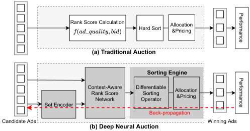

<!-- Start of picture text -->
Rank Score Calculation Allocation Hard Sor t &Pricing (a) Traditional Auction Sorting Engine Context-Aware Differentiable Rank Score Sorting Allocation Network Operator &Pricing Set Encoder Back-propagation Candidate Ads Winning Ads (b) Deep Neural Auction Performance Performance <!-- End of picture text -->

**Figure 1: The comparison between traditional auctions and Deep Neural Auction. The set encoder and the contextaware rank score network are applied to extract auction features, which improves representation space and flexibility of rank scores, compared with the fixed rank score in traditional auctions. Furthermore, the differentiable sorting engine makes the auctions, including allocation and pricing, continuous and differentiable w.r.t the inputs, thereby supporting the end-to-end back-propagation training.** 

However, it remains open to both academia and industry on how to make full use of the powerful deep learning on designing data-driven auction mechanisms for the industrial e-commerce advertising. We consider two critical challenges in this direction. The first one comes from the contradiction between auction mechanism and deep learning in design principle. The auction mechanisms, including allocation and pricing, usually involve various discrete optimization operations, _e.g._ , the top-k ads selection in GSP auction [33], while the deep learning follows an end-to-end pipeline for continuous optimization. This contradiction prevents the performance feedback underlying the auction outcomes from integrating into the back-propagation model training as in deep learning. When designing learning models for data-driven auctions, we also need to take the game theoretical properties, such as _Incentive Compatibility_ [34], into account, which further complicates the application of deep learning for auction design. Although some recent works have proposed deep neural network architectures for learning-based auction mechanisms [12, 16, 30], they focused on the theoretical auction setting, either the complex combinatorial auctions [12] or the simple single-bidder auctions [30], in lack of the insights from industrial deployment. Thus, it needs further efforts to integrate deep learning into the design and deployment of end-to-end auction mechanisms for practical industrial setting. 

The second challenge is data efficiency. The current learningbased approaches [20, 39] usually require a large number of samples to learn the optimal auction due to an ambiguity issue we observed in the data from auctions. It is a common case that an advertiser with the same feature profile can result in different outcomes in distinct auctions, _e.g._ , wins in one auction but loses in another, due to the change of the auction context, _e.g._ , the competition from the other advertisers. From the machine learning perspective, this may cause an ambiguity issue [23], introducing the one-to-many relation in samples, _i.e._ , the same feature (advertiser feature profile) but contradictory labels (winning or losing). Naive neural network 

models, which do not incorporate much inductive bias [3], may not fully handle the ambiguity phenomenon on data samples from auctions, resulting in inefficient learning for the end-to-end auction design. 

In this paper, we aim to develop a data-efficient end-to-end <u>Deep Neural Auction</u> mechanism, namely DNA, to optimize multiple performance metrics for e-commerce advertising. Considering the nice properties of easy interpretation and deployment in industry, we stick to the rank score-based allocation and second-price payment procedures inherited from GSP auction. As shown in Figure 1, DNA contains a set encoder, a family of context-aware rank score functions and a differentiable sorting engine, with which the process of auction design can be integrated into an end-to-end learning pipeline. Specifically, the set encoder and a carefully designed neural network extract and compress the rich features of auction, such as auction context, bid, advertiser’s profile, predicted auction outcomes, etc, into a context-aware rank score, tremendously increasing the representation space and flexibility of rank scores in GSP auction. We further propose a module to relax the sorting in auctions as a differentiable operation, which makes the whole process of GSP auction, including allocation and pricing, to be continuous and fully differentiable with respect to the inputs, and then supports the end-to-end back-propagation training. When designing the learning models for these three modules, we introduce several constraints over the network structures, such as the monotonicity of the neural network in terms of bid, to preserve the game theoretical properties of GSP auction for DNA. Our contributions in this paper can be summarized as follows: 

• We make an in-depth study on leveraging the power of deep learning to design data-driven auctions for industrial e-commerce advertising. The proposed end-to-end Deep Neural Auction mechanisms, namely DNA, enable us to optimize multiple performance metrics using the real feedback from historical auction outcomes. The newly designed rank scores also largely enhance the flexibility of ad allocation, making it possible to adjust the auction mechanisms for various performance metrics in dynamic environments. 

• We employ three deep learning models to facilitate the design of data efficient and end-to-end learning auction mechanisms with the guarantee of game theoretical property. A set encoder model and a monotone neural network model are proposed to encode various features of auction into the context-aware rank score. With the proposed differentiable sorting engine, we can formulate the design of data-driven auction as a continuous optimization problem, which can be integrated into an end-to-end learning pipeline. 

• We have deployed the DNA mechanism in the advertising system at _Taobao_ , one of the world’s leading e-commerce advertising platforms. Experimental results on both large-scale industrial data set as well as the online A/B test showed that DNA mechanism significantly outperformed other widely used industrial auction mechanisms on optimizing multiple performance metrics, such as Utility-based GSP [2] and Deep GSP [39]. 

## **2 PRELIMINARIES** 

## **2.1 Ad Auction Model** 

We describe a typical ad platform architecture in e-commerce advertising. Formally, _𝑁_ advertisers compete for _𝐾_ ≤ _𝑁_ ad slots, which 

3355 

KDD ’21, August 14–18, 2021, Virtual Event, Singapore 

ADS Track Paper 

are incurred by a PV (page view) request from the user. Each advertiser _𝑖_ submits bid _𝑏𝑖_ based on her private information, which could be the probability of the user’s behaviors ( _e.g._ , _𝑝𝐶𝑇𝑅_ , etc.) over the ad, obtained by learning-based prediction module [6, 40]. We use vector b = ( _𝑏𝑖,_ b− _𝑖_ ) to represent the bids of all advertisers, where b− _𝑖_ are the bids from all advertisers except _𝑖_ . We represent the ad auction mechanism by M⟨R _,_ P⟩, where R is the ad allocation scheme and P is the payment rule. The ad allocation scheme would jointly consider the bids and the quality ( _e.g._ , _𝑝𝐶𝑇𝑅_ and _𝑝𝐶𝑉𝑅_ ) of the ads in a principled manner. We use R _𝑖_ ( _𝑏𝑖,_ b− _𝑖_ ) = _𝑘_ to denote the advertiser _𝑖_ wins the _𝑘_ th ad slot, while R _𝑖_ ( _𝑏𝑖,_ b− _𝑖_ ) = 0 represents the advertiser loses the auction. The _𝐾_ winning ads would be displayed to the user. The auction mechanism module further calculates the payments for the winning ads with a rule P, which would be carefully designed to guarantee the economic properties and the revenue of the auction mechanism. 

## **2.2 Problem Formulation** 

Follow the work [39], we formulate the problem as _multiple performance metrics optimization in the competitive advertising environments_ . Given bid vector **b** from all the advertisers and _𝐿_ ad performance metric functions { _𝑓_ 1 (b; M) _, .., 𝑓𝐿_ (b; M)} (such as Revenue, CTR, CVR, etc), we aim to design an auction mechanism M⟨R _,_ P⟩, such that 

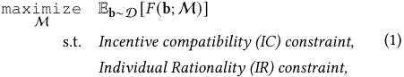

where D is the advertisers’ bid distribution based on which bidding vectors b are drawn. We define _𝐹_ (b; M) = _𝜆_ 1 × _𝑓_ 1 (b; M) + · · · + _𝜆𝐿_ × _𝑓𝐿_ (b; M), where the objective is to maximize a linear combination of the multiple performance metrics _𝑓𝑙_ ’s with preference parameters _𝜆𝑙_ ’s. The parameters _𝜆𝑙_ ’s are the inputs of our problem. The constraints of IC and IR guarantee that advertisers would truthfully report the bid, and would not be charged more than their maximum willing-to-pay for the allocation, which are important for the stability of the ad auction and would be discussed in details in Section 2.3. 

In this work, we stick to the design rationale of classical GSP auction mechanism [2, 26], where the allocation scheme is to rank advertisers according to their _rank scores_ with a non-increasing order. The pricing rule is to charge the winning advertisers with the minimum bid required to maintain the same ad slot. We study a learning-based GSP auction framework, leveraging the power of deep neural network to design a new rank score function and integrate it into the GSP. We use _𝑟_ ( _𝑏𝑖,_ x _𝑖_ ) to denote this new rank score function, where ( _𝑏𝑖,_ x _𝑖_ ) denotes all available information, including bid and other features related to the advertiser _𝑖_ ’s ad, in the auction. For ease of presentation, we also denote it as _𝑟𝑖_ ( _𝑏𝑖_ ) if there is no ambiguity. The training of this non-linear model is under the guideline of optimization objective in (1). With this new rank score, the allocation scheme and payment rule can be summarized as follows: 

• Allocation Scheme R: Advertisers are sorted in a non-increasing order of new rank score _𝑟𝑖_ ( _𝑏𝑖_ ). Without loss of generality, let 

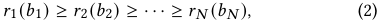

then the advertisers with top-K scores would win the corresponding ad slots, with ties broken randomly. 

• Payment Rule P: The payment for the winning advertiser _𝑖_ is calculated by the formula: 

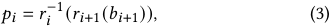

where _𝑟𝑖_ +1 ( _𝑏𝑖_ +1) is the rank score of the next highest advertiser, and _𝑟𝑖_−1 (·) is the inversion function of _𝑟𝑖_ (·). 

## **2.3 Economic Properties** 

In the auction mechanism design, one cannot just assume that an advertiser _𝑖_ would truthfully reveal her maximum willing-to-pay price _𝑚𝑖_ in the auction2 , since they have incentives to misreport these prices to manipulate their own interests [13]. This may seriously harm the stability of the advertising platform. Therefore, we need to guarantee the property of _incentive compatibility_ (IC), from mechanism design. This property removes the computational burden of bidding strategy optimization from advertisers, and also, leads to reliable and predictable inputs for the auction mechanisms. 

_Definition 2.1 (Incentive Compatibility [34])._ An auction mechanism is IC if it is in the best interest of each advertiser _𝑖_ to truthfully reveal her maximum willing-to-pay price, _i.e._ , _𝑏𝑖_ = _𝑚𝑖_ . 

In traditional auction theory, the celebrated IC auction mechanisms, such as VCG auction [34] and Myerson auction [28], typically build upon the assumption that advertisers are _utility maximizers_ , that is, the goal of each advertiser _𝑖_ is to optimize her quasi-linear utility, defined as the difference between her expected value _𝑣𝑖_ and the payment _𝑝𝑖_ , _i.e._ , _𝑢𝑖_ = _𝑣𝑖_ − _𝑝𝑖_ . However, we observe from the industrial e-commerce platform that this model could not fully capture the behavior pattern of advertisers. For example, in _Taobao_ advertising platform, there are two representative types of advertisers: Optimized Cost Per Click (OCPC) advertisers with upper bounds of bids, and Multi-variable Constrained Bidding (MCB) advertisers with constraints over budgets and the average costs, such as pay-per-click (PPC) and pay-per-acquisition (PPA). The goal of both types of advertisers is to optimize the overall realized value of advertising, such as the quantity of conversions and clicks, under certain constraints over the payments. For these types of advertisers, they would calculate and report a maximum willing-to-pay price for each PV request based on the current status of the ad campaign, with the help of auto-bidding services [36, 41]. This behavior pattern of advertisers could be well captured by the model of _value maximizer_ [35], which is defined as follows: 

_Definition 2.2 (Value maximizer [35])._ A value maximizer _𝑖_ optimizes value _𝑣𝑖_ while keeping payment _𝑝𝑖_ below her maximum willing-to-pay _𝑚𝑖_ ; when value is equal, a lower _𝑝𝑖_ is preferred. 

In the auctions with multiple ad slots, a value maximizer prefers to the outcome with a higher slot when the payment is below the maximum willing-to-pay price, and then a smaller payment is preferred under the situation with equal value. The strategic behavior pattern of value maximizers would be quite different from the traditional utility maximizers. It has been proved that an auction 

> 2 _𝑚𝑖_ is not necessarily equal to the value _𝑣𝑖_ of the PV request. For example, there may be budget constraints. 

3356 

KDD ’21, August 14–18, 2021, Virtual Event, Singapore 

ADS Track Paper 

mechanism is IC for value maximizers, as long as the following two conditions are satisfied [1, 35]: 

- **Monotonicity** : An advertiser would win the same or a higher 

- slot if she reports a higher bid; 

• **Critical price** : The payment for the winning advertiser is the minimum bid that she needs to report to maintain the same slot. 

We note that IR is also guaranteed under these two IC conditions. Obviously given the monotonicity constraint, the critical price is strictly lower than the bid, and hence is lower than the maximum willing-to-pay price, _i.e._ , _𝑝𝑖 < 𝑚𝑖_ . It could be easily verified that GSP satisfies these conditions and hence is IC and IR for value maximizers. In this work, we would design learning-based auction mechanisms, following the above conditions. 

## **3 DEEP NEURAL AUCTION** 

In this section, we present the details of Deep Neural Auction (DNA) mechanism for optimizing multiple performance metrics under the multi-slot setting for e-commerce advertising. 

## **3.1 Overall Architecture** 

As illustrated in Fig. 2a, DNA consists of three modules: a set encoder, a context-aware rank score function, and a differentiable sorting engine. The set encoder learns a set embedding from the features of candidate ads, which encodes the context of the auction. This set embedding is attached as a complementary feature for each ad. Next, each advertiser employs a shared MIN-MAX neural network to generate context-aware rank scores from advertiser’s features. This neural network is partially monotonic with respective to bids, which is critical to the guarantee of IC property. Another advantage of the designed neural network is a closed form expression for the inverse transform, which enables an easy payment calculation. Then, the differentiable sorting engine conducts a continuous relaxation of sorting operator in auctions, and outputs a row-stochastic permutation matrix. We can use this row-stochastic permutation matrix to express the expected revenue as well as other predicted performance metrics, from which training losses from real feedback underlying the auction outcome can be constructed. With these components, the whole DNA mechanism is fully differentiable with respect to its inputs, and can be integrated into the end-to-end learning pipeline as in deep learning. It is worth to note that both the set encoder and the context-aware rank score function are parameterized neural network models, while the differentiable sorting engine is a non-parameterized operator. We next introduce the details of these three modules. 

## **3.2 Auction Context Encoding** 

As the final auction outcome is jointly determined by all the candidate ads, we design a set encoder to automatically extract the feature of the auction context from all the candidate ads, instead of the individual ad. We attach this auction context feature as an augmented feature for each ad to overcome the ambiguity issue discussed in Section 1. 

The set encoder receives the whole set of ad features as input. As there is no inherent ordering among the advertisers in the set, the feature set is permutation-equivariant [37] to the auction outcome, _i.e._ , the auction outcome does not rely on the ordering of the features. Learning models that do not take this set structure 

into account (such as MLPs or RNNs) would cause the issue of discontinuities [38]. Inspired from the recent progress on learning on set [37, 38], we implement the set encoder by designing a new deep neural network, which uses DeepSet [37] network to aggregate individual ad features to form a representation for the auction context. The main idea is that, by setting equivariant layers and a final symmetric layer, the DeepSet can learn to aggregate all the features’ information in a permutation-equivariant manner. The generated embedding vector can be trained to predict some interested statistical value about the whole set. 

Concretely, as illustrated in Fig. 2b, the set encoder is composed of two groups of layers, _𝜙_ 1 and _𝜙_ 2. Given the features of candidate ads {x _𝑖_ } _𝑖__𝑁_ =1, each instance x_𝑖_is firstly mapped to a high-dimensional latent space through shared fully connected layers _𝜙_ 1, resulting in a set of intermediate hidden states h = { _ℎ𝑖_ } _𝑖__𝑁_ =1: 

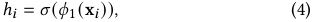

where _𝜎_ is an Exponential Linear Unit (ELU) activation function [7]. Then, this hidden states set is processed with symmetric aggregation pooling (such as average pooling) to build the final set embedding _ℎ𝑖_′for each ad_𝑖_with another fully connected layer_𝜙_2: 

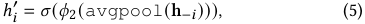

where h− _𝑖_ represent the hidden states from all advertisers except _𝑖_ . This set encoder is built by composing permutation-equivariant operations (shared nonlinear transformation) with symmetric aggregation operations (average pooling) at the end. Since the symmetric operations are commutative to the input items, the output is the same regardless of the order of the items. The set encoder learns to extract the context of auction on the whole set of candidate ads [15, 37], which is driven by the downstream training signals in an end-to-end manner. The output set embedding would be sent to the downstream rank score function as an augmented feature for each ad, which helps to infer each ad’s rank score in the current candidate ads set. It should be noted that the set encoder does not include the bids from all candidate ads, as shown in Fig. 2b. This design is specified mainly for the guarantee of IC property, keeping the affection of each ad’s rank score only through her bid, which will be elaborated in Section 3.3. 

## **3.3 Context-Aware Rank Score** 

We design a deep neural network to transform each advertiser’s augmented feature to a context-aware rank score. We use _𝑟_ ( _𝑏𝑖,_ x _𝑖_′) to denote this rank score, where x _𝑖_′represents the augmented features except bid, _i.e._ , x _𝑖_′=(x_𝑖,ℎ_ _𝑖_′). From Section 2.3, we need to satisfy two conditions to guarantee the IC property for value maximizers: monotone allocation and critical price. Thus, we aim to design a strictly monotone neural network with respect to bid, and supports efficient inverse transform given the next highest rank score. 

We incorporate the aforementioned constraints within the network architecture design, and restrict the search space to a family of partially monotone parameterized neural network. We model the rank score function as a two-layer feed-forward network with min and max operations over linear functions [9] as shown Fig. 2c. For _𝑄_ groups of _𝑍_ linear functions, we associate strictly positive weights _𝑒__𝑤𝑞𝑧_ with _𝑏𝑖_ and other unconstrained weights _𝑤𝑞𝑧_′ with x _𝑖_′,aswellasintercepts_𝛼𝑞𝑧_,where_𝑞_=1_, ...,𝑄,𝑧_=1_, ...,𝑍_.For 

3357 

KDD ’21, August 14–18, 2021, Virtual Event, Singapore 

ADS Track Paper 

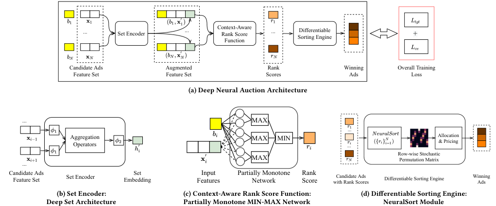

<!-- Start of picture text -->
... Set Encoder ... Context-AwareRank ScoreFunction ... Sorting EngineDifferentiable + Candidate Ads Augmented Rank Winning Overall Training Feature Set Feature Set Scores Ads Loss (a) Deep Neural Auction Architecture ... MAX Aggregation MAX MIN ... Allocation Operators ... & Pricing Row-wise Stochastic MAX Permutation Matrix ... Candidate AdsFeature Set Set Encoder EmbeddingSet FeaturesInput Partially MonotoneNetwork RankScore with Rank ScoresCandidate Ads Differentiable Sorting Engine WinningAds (b) Set Encoder: (c) Context-Aware Rank Score Function: (d) Differentiable Sorting Engine: Deep Set Architecture Partially Monotone MIN-MAX Network NeuralSort Module <!-- End of picture text -->

**Figure 2: (a) The overall Deep Neural Auction architecture. (b) The Deep Set based set encoder receives the whole set of ad features and outputs a set embedding. (c) Partially monotone MIN-MAX neural network based context-aware rank score function. The straight lines represent connections with non-negative weights, whereas the dashed lines represent unconstrained connections. (d) The differentiable sorting engine takes in the generated rank scores and outputs a row-stochastic permutation matrix of argsort as well as its corresponding allocation and payments, by using NeuralSort.** 

simplicity, we denote _𝑟_ ( _𝑏𝑖,_ x _𝑖_′)as_𝑟𝑖_, and assume_𝑟_1≥_𝑟_2≥_..._≥_𝑟𝑁_ without loss of generality. We can define: 

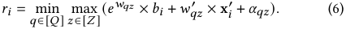

Since each of the above linear function in Eq. (6) is strictly nondecreasing on _𝑏𝑖_ , so is _𝑟𝑖_ . This partially monotone MIN-MAX neural network has been proved with the capability to approximate any function [9]. Another particular advantage of this representation is that the inverse transform can be directly obtained from the parameters for the forward transform in a closed form expression. For example, given the next highest rank score _𝑟𝑖_ +1, the payment for advertiser _𝑖_ can be formulated as follows: 

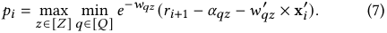

With the above designed MIN-MAX neural network, the two conditions for IC property can be satisfied, given the assumption that the bids affect the rank scores only through the input _𝑏𝑖_ in _𝑟_ ( _𝑏𝑖,_ x _𝑖_′). However in the industrial advertising environment, there are some engineered features in x _𝑖_ from domain knowledge that may have complex dependence relation with the bids. Therefore the bids may affect the rank scores and then the allocation in a complex way, which may violate this assumption. In a large-scale advertising platform, this effect of a change of one’s bid on the rank scores via this route would be quite small from our observations on the industrial data sets. To investigate the influence of this issue on IC property, we conduct comprehensive experiments in Section 4.2.3 to calculate the data-driven IC metric of DNA for value maximizers. We reserve the discussion about the strictly IC DNA mechanism design as an interesting open problem in our future work. 

## **3.4 Differentiable Sorting Engine** 

After calculating the rank scores of all ads, the mechanism determines the allocation and payment, following Eq. (2) and (3). However, treating allocation and payment outside the model learning ( _i.e._ , as an agnostic environment) is in some sense poorly suited for deep learning. That is the processes of allocation and payment (actually the sorting operation) are not natively differentiable, and the gradients must all be evaluated via finite difference or likelihood ratio methods (such as the policy search used in Deep GSP [39]), with some additional issues of convergence stability and data-efficiency. Also, in another line of related work, the model-based reinforcement learning (RL) has achieved some notable successes [27]. Some recent works used a general neural network to learn a differentiable dynamic model [24] and argued that the model-based approaches are often more superior and data-efficient than model-free RL methods for many tasks [10, 22]. These insights give us a motivation to model the whole process of allocation and payment inside the Deep Neural Auction framework. 

In various types of auction mechanisms, both the allocation and payment are built on a basic sorting operation. Sorting operation outputs two vectors, neither of which is differentiable. On the one hand, the vector of sorted values is piecewise linear. On the other hand, the sorting permutation (more specifically, the vector of ranks via argsort operator) also has no differentiable properties as it is integer-valued. 

To overcome this issue, we propose a differentiable sorting engine that caters to the top- _𝐾_ selection in the multi-slot auctions. We present a novel use of differentiable sorting operator, _i.e._ , NeuralSort [21], to derive a differentiable top- _𝐾_ permutation matrix, which 

3358 

KDD ’21, August 14–18, 2021, Virtual Event, Singapore 

ADS Track Paper 

can be used to generate the various expected outcomes of the auctions. Given a set of unsorted rank scores r = [ _𝑟_ 1 _,𝑟_ 2 _,_ · · · _,𝑟𝑁_ ]_𝑇_ , we are concerned with the argsort operator, where argsort(r) returns the permutation that sorts r in a decreasing order. Formally, we define the argsort operator as the mapping from _𝑁_ - dimensional real vectors r ∈ R_𝑁_ to the permutations over _𝑁_ elements, where the permutation matrix _𝑀𝑟_ ∈{0 _,_ 1}_𝑁_×_𝑁_ is expressed 

as 

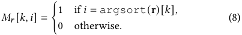

Here _𝑀𝑟_ [ _𝑘,𝑖_ ] indicates if _𝑟𝑖_ is the _𝑘_ th largest rank score in r. The results from [21] showed the identity: 

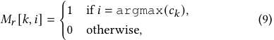

where _𝑐𝑘_ = ( _𝑁_ + 1 − 2 _𝑘_ )r − _𝐴𝑟_ 1, _𝐴𝑟_ denotes the absolute pairwise differences of elements in r such that _𝐴𝑟_ [ _𝑖, 𝑗_ ] = | _𝑟𝑖_ − _𝑟 𝑗_ |, and 1 denotes the column vector of all ones. Then, by relaxing the operator argmax in Eq. (9) by a row-wise softmax, we can arrive at the following continuous relaxation for the argsort operator _𝑀𝑟_ , which is called NeuralSort in [21]: 

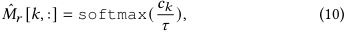

where _𝜏 >_ 0 is a temperature parameter that controls the degree of the approximation, and as _𝜏_ → 0, _𝑀_ˆ _𝑟_ → _𝑀𝑟_ . Intuitively, the _𝑘_ th row of _𝑀_ˆ _𝑟_ can be interpreted as the ‘choice’ probabilities on all elements in r, for getting the _𝑘_ th highest item. 

This row-stochastic permutation matrix _𝑀_ˆ _𝑟_ , can be used as a basic operator to construct task-specific sorting procedures according to the order of generated rank scores in a differentiable manner. For instance, if we let p = [ _𝑝_ 1 _, 𝑝_ 2 _,_ · · · _, 𝑝𝑁_ ]_𝑇_ denotes the payments calculated by Eq. (7) for _𝑁_ advertisers in a PV request, then the top- _𝐾_ payments, sorted by their corresponding rank scores, can be recovered by a simple matrix multiplication: 

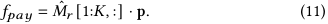

This row-stochastic permutation matrix _𝑀_ˆ _𝑟_ acts as a differentiable sorting engine that makes the discrete sorting procedure compatible with differentiability. 

of aggregated performance metrics for all ads from real feedback: 

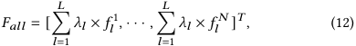

with _𝑓𝑙__𝑖_standingforthe_𝑙_thperformancemetricfor_𝑖_thadfrom a PV request. Therefore, we can formulate the learning problem as minimizing the sum of top- _𝐾_ expected negated performance metrics for each PV request: 

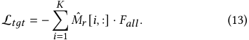

One exception is the calculation of revenue. Due to the change of allocation order, the payment for each ad is distinct from what has happened. Thus we use the generated payments, defined in Eq. (11) to replace the ones appeared in the training data. 

We set another auxiliary task to help train the DNA mechanism. With the benefit of hindsight from real feedback, we can access the optimal allocation to maximize the performance metrics in each PV request. Thus we set another multiclass prediction task, whose loss is the row-wise cross-entropy (CE) between the ground-truth and the predicted row-stochastic _𝑁_ × _𝑁_ permutation matrix: 

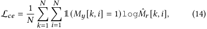

where _𝑀𝑦_ is the ground-truth permutation matrix, calculated by sorting their real feedback. We found that this auxiliary task was beneficial to yield a stable training process in our experiments. We use a hyper-parameter to balance the target loss L _𝑡𝑔𝑡_ and the cross-entropy term L _𝑐𝑒_ . 

However, the user feedback, especially with respect to the conversion behaviors, is scarce in industrial e-commerce advertising, _e.g._ , users typically decide to purchase a product after seeing dozens of ads. To alleviate this problem, we replace the sparse user behaviors (typically one-hot) in data with the dense values from the prediction model (such as _𝑝𝐶𝑇𝑅_ and _𝑝𝐶𝑉𝑅_ ), and debias these predicted values with real user behaviors by the _calibration_ techniques [4, 11]. We also eliminate the deviation of CTR between different slots by debiasing with the posterior inherent CTR of different slots. 

## **4 EXPERIMENTAL EVALUATIONS** 

## **3.5 End-to-End Model Training** 

_3.5.1 Data for Training._ All data sets we used were generated under GSP auction, which is IC for e-commerce value maximizing advertisers [35]. The data contains all advertisers’ bids, the estimated values ( _e.g._ , _𝑝𝐶𝑇𝑅_ , _𝑝𝐶𝑉𝑅_ ), ads information ( _e.g._ , category, price of product), user features ( _e.g._ , genders, age, income level) as well as the context information ( _e.g._ , the source of traffic). These information consists of the input features of the DNA architecture. The data also contains the real feedback information ( _e.g._ , click, conversion or transaction) from users. 

_3.5.2 Training Loss._ As the training data contains the user feedback for each ad exposure, we can directly use the row-stochastic permutation matrix _𝑀_ˆ _𝑟_ to compute the _𝐾_ -slots expected performance metrics via: _𝑀_ˆ _𝑟_ [1: _𝐾,_ :] · _𝐹𝑎𝑙𝑙_ , where _𝐹𝑎𝑙𝑙_ represents the vector 

## **4.1 Experiment Setup** 

_4.1.1 Evaluation Metrics._ We consider the following metrics in our offline and online experiments, which reflect the platform revenue, user experience, as well as advertisers’ utility in the e-commerce advertising. For all experiments in this paper, metrics are normalized to a same scale. 

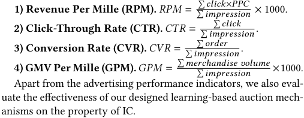

3359 

KDD ’21, August 14–18, 2021, Virtual Event, Singapore 

ADS Track Paper 

**5) IC Metric (𝚿).** We propose a new data-driven metric of IC, **𝚿** , to represent the ex-post regret of value maximizers, similar to the data-driven IC for utility maximizers [17]. The metric of **𝚿** consists of the regret on value **𝚿** _𝑣_ and the regret on payment **𝚿** _𝑝_ , which denotes, through bid perturbation, the maximum percentage of value increase under the payment constraint, and the maximum percentage of payment decrease with the identical allocation, respectively. Concretely, we formulate **𝚿** = ( **𝚿** _𝑣,_ **𝚿** _𝑝_ ) as3 : 

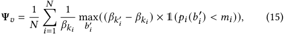

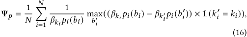

where we denote _𝑘𝑖_ and _𝑘𝑖_′as the allocated slot indexes of advertiser _𝑖_ when bidding truthfully and bidding a perturbed _𝑏𝑖_′, respectively. We use _𝛽𝑘_ as the click-through rate of slot _𝑘_ , and _𝑝𝑖_ ( _𝑏𝑖_ ) as the payment of advertiser _𝑖_ when bidding _𝑏𝑖_ . It should be noted that the value of a click _𝑣𝑖_ for advertiser _𝑖_ is reduced from the fraction in Eq. (15). Intuitively, **𝚿** measures to what extent a value-maximizing advertiser could get better off via manipulating her bid. A larger value of **𝚿** _𝑣_ indicates that an advertiser could obtain more extra value under the constraint of maximum willing-to-pay price. Similarly, a larger value of **𝚿** _𝑝_ indicates that an advertiser could be undercharged more while obtaining the same ad slot. For example, as GSP is IC for value maximizers, its values of both **𝚿** _𝑣_ and **𝚿** _𝑝_ are 0. 

_4.1.2 Baselines Methods._ We compare DNA with the widely used mechanisms in the industrial ad platform. 

**1) Generalized Second Price auction (GSP).** The rank score in the classical GSP is simply the bids multiplying _𝑝𝐶𝑇𝑅_ , namely effective Cost Per Milles (eCPM). The payment rule is the value of the minimum bid required to retain the same slot. The work [26] suggested incorporating a squashing exponent _𝜎_ into the rank score function, _i.e._ , _𝑏𝑖𝑑_ × _𝑝𝐶𝑇𝑅__𝜎_ could improve the performance, where _𝜎_ can be adjusted to weight the performance of revenue and CTR. We refer to this exponential form extension as GSP in the experiments. 

**2) Utility-based Generalized Second Price auction (uGSP).** uGSP extends the conventional GSP by taking the rank score as a linear combination of multiple performance metrics using estimated values: _𝑟𝑖_ ( _𝑏𝑖_ ) = _𝜆_ 1 × _𝑏𝑖_ × _𝑝𝐶𝑇𝑅𝑖_ + _𝑜𝑖_ , where _𝑜𝑖_ represents other utilities, such as CTR and CVR: _𝑜𝑖_ = _𝜆_ 2 × _𝑝𝐶𝑇𝑅𝑖_ + _𝜆_ 3 × _𝑝𝐶𝑉𝑅𝑖_ (where _𝜆𝑙_ ≥ 0). The payment of uGSP follows the principle from GSP: _𝑝𝑖_ =_𝜆_<u>1×</u>_𝑏𝑖_<u>+1×</u>_<u>𝑝𝐶𝑇𝑅𝑖</u>_<u>+1+</u>_𝑜𝑖_<u>+1−</u>_𝑜𝑖_ . uGSP is widely used in _𝜆_ 1× _𝑝𝐶𝑇𝑅𝑖_ industry to optimize multiple performance metrics [2]. 

**3) Deep GSP [39]** Deep GSP uses a deep neural network to map ad’s related features to a new rank score within the GSP auction. This new rank score function is optimized using model-free reinforcement learning to maximize the interested performance metrics. 

> 3Since our training data comes from a vanilla GSP mechanism, which is IC for value maximizers, we directly take the bid _𝑏𝑖_ as the maximum willing-to-pay price _𝑚𝑖_ of advertiser _𝑖_ . 

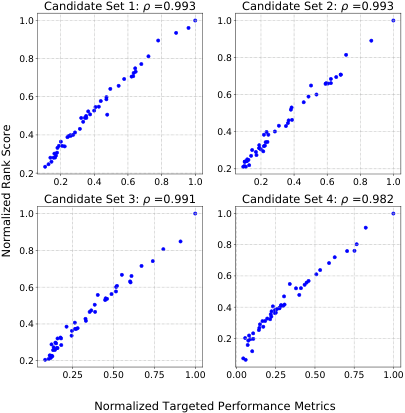

<!-- Start of picture text -->
Candidate Set 1:  ρ  =0.993 Candidate Set 2:  ρ  =0.993 1.0 1.0 0.8 0.8 0.6 0.6 0.4 0.4 0.2 0.2 0.2 0.4 0.6 0.8 1.0 0.2 0.4 0.6 0.8 1.0 Candidate Set 3:  ρ  =0.991 Candidate Set 4:  ρ  =0.982 1.0 1.0 0.8 0.8 0.6 0.6 0.4 0.4 0.2 0.2 0.25 0.50 0.75 1.00 0.00 0.25 0.50 0.75 1.00 Normalized Targeted Performance Metrics Normalized Rank Score <!-- End of picture text -->

**Figure 3: The positive correlations between learned rank scores and the targeted performance metrics. Each blue dot represents an ad in the candidate set.** 

## **4.2 Offline Experiments** 

_4.2.1 Datasets._ The data sets we used for experiments come from _Taobao_ , a leading e-commerce advertising system in China. We randomly select 5 million records logged data under GSP auctions from _July 4, 2020_ as training data, and 870k records logged data from _July 5, 2020_ as test data. Unless stated otherwise, all experiments are conducted under the setting of top-3 ads displayed ( _i.e._ , 3-slot auctions) in each PV request. Other details about the model configurations and training procedure are in Appendix A. 

_4.2.2 Performance in Offline Simulations._ We conduct experiments to compare the performance of DNA and other baseline mechanisms. In order to facilitate intuitive comparisons, we set only two performance metrics with the form _𝜆_ × _𝑅𝑃𝑀_ + (1 − _𝜆_ ) × _𝑋_ , where _𝑋_ is one of the metric selected from { _𝐶𝑇𝑅,𝐶𝑉𝑅,𝐺𝑃𝑀_ }. For uGSP, we set the rank score function with _𝜆_ × _𝑝𝐶𝑇𝑅_ × _𝑏𝑖𝑑_ + (1 − _𝜆_ ) × _𝑋_ . For GSP, we tune the variable _𝜎_ in the interval [0 _._ 5 _,_ 2 _._ 0]. For both Deep GSP and DNA, we directly set the objective by selecting the values of _𝜆_ uniformly from the interval [0 _,_ 1]. 

We show the relation between the learned rank scores and the targeted performance metrics, and illustrate some results in Fig. 3. We calculate the Pearson’s Correlation Coefficient ( _𝜌_ ), which is 0 _._ 989 on the test data set, together with the p-value less than 1e−7. This result indicates the strong positive correlation between the learned rank scores and the performance metrics, implying that the ads with higher targeted objectives also have higher rank scores. This would encourage advertisers to optimize their ads’ quality (such as CTR) to enhance their competitiveness in the auctions. 

As some performance metrics may be conflicting, we next plot the Pareto Front for different baselines in Fig. 4. We observe that all the learning-based methods (both Deep GSP and DNA) are above the curves of other baselines. The flexible learning-based rank score models have the ability to perform automatic feature extraction 

3360 

KDD ’21, August 14–18, 2021, Virtual Event, Singapore 

ADS Track Paper 

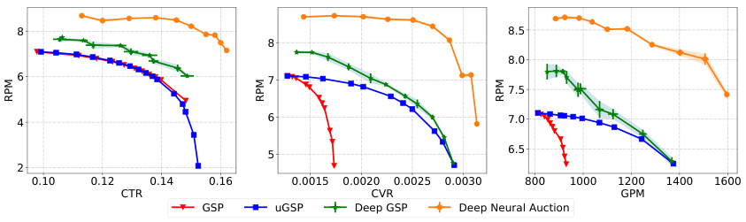

<!-- Start of picture text -->
8 8.5 8 8.0 6 7 7.5 4 6 7.0 5 6.5 2 0.10 0.12 0.14 0.16 0.0015 0.0020 0.0025 0.0030 800 1000 1200 1400 1600 CTR CVR GPM GSP uGSP Deep GSP Deep Neural Auction RPM RPM RPM <!-- End of picture text -->

**Figure 4: The performance of DNA and other baseline mechanisms in the offline experiments.** 

from raw data. Learning-based methods can alleviate the problem of inaccurate predicted values (such as _𝑝𝐶𝑇𝑅_ ) used in GSP and uGSP to some extend, and learn ad auctions directly from the real feedback. We also note that the performance of GSP is poor when considering CVR and GPM, as GSP does not model the effect of these indicators explicitly in its rank score formulation. 

DNA outperforms Deep GSP baseline by a clear margin. The rank score function of Deep GSP is only conditioned on each ad’s private information. While in DNA, it also contains a set embedding which models the context of auction from the candidate ads set explicitly, making it more competitive than the rank scores in the Deep GSP auctions. We analyze this set embedding in more details in Appendix B. The upgrade of training method also contributes to this superior performance improvement. Deep GSP treats the whole process of allocation as the environment and uses exploration based algorithms ( _i.e._ , policy search) to optimize the rank score functions. In comparison, DNA directly differentiates the sorting procedure in allocation, which is more data-efficient. 

_4.2.3 Evaluation on IC Property._ We present the IC property of DNA, _i.e._ , the regret metric **𝚿** , in Table 1. We compare with only the regret of truthful bidding in the Utility-based Generalized First Price (uGFP) auction, as the regret of other mechanisms (GSP and uGSP) are all 0. uGFP mechanism allocates the ad slots in the same way as uGSP while the payment of a winning advertiser is simply her bid. One can observe from Table 1 that **𝚿** _𝑣_ of both DNA and uGFP are 0, which indicates that advertisers could not win higher slots under the payment constraints. For **𝚿** _𝑝_ , DNA outperforms uGFP significantly under all experiment settings. For example of the first row (1.0×RPM), an advertiser could be undercharged at most 0 _._ 042% payment in DNA with the same allocation result, which is 13 _._ 312% in uGFP. 

## **4.3 Online Experiments** 

We present the online experiments by deploying the proposed DNA in _Taobao_ advertising system. As we only use the trained model to make inference in online system, we set the temperature parameter _𝜏_ = 0 in the differentiable sorting engine to output the winning ads as well as the corresponding payments to the online advertising platform. Other deployment details are described in Appendix C. 

To demonstrate the performance of DNA, we conduct online A/B tests with 1% of whole production traffic from Jan 25, 2021 to Feb 8, 2021 (about one billion auctions). We also consider RPM, CTR, CVR 

**Table 1: IC Metric (𝚿) experiments under four tasks with 1000 PV requests randomly selected from the test data. For each bidder, we randomly generate 100 perturbations (ranging from** 0 _._ 0 **to** 2 _._ 0 **times) to her value.** 

|||DNA||uGFP|
|---|---|---|---|---|
||**𝚿**_𝑣_|**𝚿**_𝑝_|**𝚿**_𝑣_|**𝚿**_𝑝_|
|1.0×RPM|0|**0.042%**|0|13_._312%|
|0.5×RPM+0.5×CTR|0|**0.059%**|0|21_._616%|
|0.5×RPM+0.5×CVR|0|**0.118%**|0|19_._280%|
|0.5×RPM+0.5×GPM|0|**0.028%**|0|16_._400%|

**Table 2: Online A/B test compared with uGSP on promoting different performance metrics, keeping the same RPM level.** 

|% Improved|DeepGSP|DNA|
|---|---|---|
|CTR|+6.43%|**+11.58%**|
|CVR|+6.38%|**+31.26%**|
|GPM|+2.77%|**+16.17%**|

**Table 3: Online A/B test (nearly two months) compared with GSP on promoting all performance metrics.** 

||RPM|CTR|CVR|GPM|
|---|---|---|---|---|
|% Improved|+5.68%|+18.93%|+14.68%|+14.53%|

and GPM metrics and conduct online experiments as in the offline experiments, _i.e._ , setting only two performance metrics at a time. In order to make fair and efficient comparisons between different baselines in production traffic, we set the _𝜆_ in uGSP with 0 _._ 8, and tune the _𝜆_ ’s of both Deep GSP and DNA until the observed RPM performance reaches the same level with the one in uGSP. Then we record the relative improvements of the other metrics of Deep GSP and DNA compared with uGSP, which is shown in table 2. From the results, we can find that the DNA mechanism achieves the highest promotion for CTR, CVR and GPM. To verify the performance stability of the DNA, we conduct a relatively long-term experiment (nearly two months) to compare with the GSP auction. Table 3 shows that all the performance metrics related to users, advertisers, and advertising platform are promoted. Considering the massive advertisers and users, the promotion of marketing performance verifies the effectiveness of our proposed DNA framework. 

3361 

KDD ’21, August 14–18, 2021, Virtual Event, Singapore 

ADS Track Paper 

## **5 RELATED WORK** 

A plethora of works have used learning-based techniques for revenuemaximizing mechanism design in theoretical auction settings. Conitzer and Sandholm [8] proposed the paradigm of automated mechanism design (AMD) and laid the groundwork for this direction. Since then, many works [20, 25] have adopted learning approaches for mechanism design problems. Recently, Dütting et al. [12] first leveraged deep neural networks for the automated design of optimal auctions. Several other works extended this study for various scenarios [16, 19, 29]. 

A particular stream of research have focused on the mechanism design in online advertising. The GSP and VCG auction have been widely adopted and investigated in various advertising system [14, 26]. Building on the success of deep reinforcement learning, Tang _et al._ [5, 31] proposed reinforcement mechanism design for the optimization of reserve prices in online advertising. A recently proposed learning-based ad auction mechanism, called Deep GSP [39], leveraged the deep learning technique to optimize multiple performance metrics in e-commerce advertising. 

## **6 CONCLUSION** 

In this paper, we have proposed a Deep Neural Auction mechanism, towards learning data efficient and end-to-end auction mechanisms for e-commerce advertising. We have deployed the DNA mechanism on one of the leading e-commerce advertising platforms, _Taobao_ . The offline experiments as well as the online A/B test showed that DNA mechanism significantly outperformed other existing auction mechanism baselines on optimizing multiple performance metrics. 

## **ACKNOWLEDGMENTS** 

This work was supported in part by Science and Technology Innovation 2030 –“New Generation Artificial Intelligence” Major Project No. 2018AAA0100905, in part by China NSF grant No. 62025204, 62072303, 61902248, and 61972254, and in part by Alibaba Group through Alibaba Innovation Research Program, and in part by Shanghai Science and Technology fund 20PJ1407900. The authors would like to thank Rui Du, Haiping Huang, Haiyang He and Guan Wang who did the really hard work for online system implement. The opinions, findings, conclusions, and recommendations expressed in this paper are those of the authors and do not necessarily reflect the views of the funding agencies or the government. 

## **REFERENCES** 

- [1] Gagan Aggarwal, S Muthukrishnan, Dávid Pál, and Martin Pál. 2009. General auction mechanism for search advertising. In _WWW_ . 241–250. 

- [2] Yoram Bachrach, Sofia Ceppi, Ian A Kash, Peter Key, and David Kurokawa. 2014. Optimising trade-offs among stakeholders in ad auctions. In _EC_ . 75–92. 

- [3] Peter W Battaglia, Jessica B Hamrick, Victor Bapst, Alvaro Sanchez-Gonzalez, Vinicius Zambaldi, Mateusz Malinowski, Andrea Tacchetti, David Raposo, Adam Santoro, Ryan Faulkner, et al. 2018. Relational inductive biases, deep learning, and graph networks. _arXiv preprint arXiv:1806.01261_ (2018). 

- [4] Alexey Borisov, Julia Kiseleva, Ilya Markov, and Maarten de Rijke. 2018. Calibration: A simple way to improve click models. In _CIKM_ . 1503–1506. 

- [5] Qingpeng Cai, Aris Filos-Ratsikas, Pingzhong Tang, and Yiwei Zhang. 2018. Reinforcement Mechanism Design for e-commerce. In _WWW_ . 1339–1348. 

- [6] Heng-Tze Cheng, Levent Koc, Jeremiah Harmsen, Tal Shaked, Tushar Chandra, Hrishi Aradhye, Glen Anderson, Greg Corrado, Wei Chai, Mustafa Ispir, et al. 2016. Wide & deep learning for recommender systems. In _Proceedings of the 1st workshop on deep learning for recommender systems_ . 7–10. 

- [7] Djork-Arné Clevert, Thomas Unterthiner, and Sepp Hochreiter. 2016. Fast and Accurate Deep Network Learning by Exponential Linear Units (ELUs). In _ICLR_ . 

- [8] Vincent Conitzer and Tuomas Sandholm. 2002. Complexity of mechanism design. In _UAI_ . 103–110. 

- [9] Hennie Daniels and Marina Velikova. 2010. Monotone and partially monotone neural networks. _IEEE Transactions on Neural Networks_ 21, 6 (2010), 906–917. 

- [10] Filipe de Avila Belbute-Peres, Kevin Smith, Kelsey Allen, Josh Tenenbaum, and J Zico Kolter. 2018. End-to-end differentiable physics for learning and control. _NeurIPS_ 31 (2018), 7178–7189. 

- [11] Chao Deng, Hao Wang, Qing Tan, Jian Xu, and Kun Gai. 2021. Calibrating User Response Predictions in Online Advertising. In _ECML PKDD 2020_ . 208–223. 

- [12] Paul Dütting, Zhe Feng, Harikrishna Narasimhan, David Parkes, and Sai Srivatsa Ravindranath. 2019. Optimal Auctions through Deep Learning. In _ICML_ . 1706– 1715. 

- [13] Benjamin Edelman and Michael Ostrovsky. 2007. Strategic bidder behavior in sponsored search auctions. _Decision support systems_ 43, 1 (2007), 192–198. 

- [14] Benjamin Edelman, Michael Ostrovsky, and Michael Schwarz. 2007. Internet advertising and the generalized second-price auction: Selling billions of dollars worth of keywords. _American economic review_ 97, 1 (2007), 242–259. 

- [15] Harrison Edwards and Amos J. Storkey. 2017. Towards a Neural Statistician. In _ICLR_ . 

- [16] Zhe Feng, Harikrishna Narasimhan, and David C Parkes. 2018. Deep learning for revenue-optimal auctions with budgets. In _AAMAS_ . 354–362. 

- [17] Zhe Feng, Okke Schrijvers, and Eric Sodomka. 2019. Online learning for measuring incentive compatibility in ad auctions. In _WWW_ . 2729–2735. 

- [18] Avi Goldfarb and Catherine Tucker. 2011. Online display advertising: Targeting and obtrusiveness. _Marketing Science_ 30, 3 (2011), 389–404. 

- [19] Noah Golowich, Harikrishna Narasimhan, and David C Parkes. 2018. Deep Learning for Multi-Facility Location Mechanism Design.. In _IJCAI_ . 261–267. 

- [20] Negin Golrezaei, Max Lin, Vahab Mirrokni, and Hamid Nazerzadeh. 2017. Boosted second price auctions: Revenue optimization for heterogeneous bidders. _Available at SSRN 3016465_ (2017). 

- [21] Aditya Grover, Eric Wang, Aaron Zweig, and Stefano Ermon. 2019. Stochastic Optimization of Sorting Networks via Continuous Relaxations. In _ICLR_ . 

- [22] David Ha and Jürgen Schmidhuber. 2018. World models. _arXiv preprint arXiv:1803.10122_ (2018). 

- [23] Eyke Hüllermeier and Jürgen Beringer. 2006. Learning from ambiguously labeled examples. _Intelligent Data Analysis_ 10, 5 (2006), 419–439. 

- [24] Thanard Kurutach, Ignasi Clavera, Yan Duan, Aviv Tamar, and Pieter Abbeel. 2018. Model-Ensemble Trust-Region Policy Optimization. In _ICLR_ . 

- [25] Sébastien Lahaie. 2011. A kernel-based iterative combinatorial auction. In _AAAI_ , Vol. 25. 

- [26] Sébastien Lahaie and David M Pennock. 2007. Revenue analysis of a family of ranking rules for keyword auctions. In _EC_ . 50–56. 

- [27] Thomas M Moerland, Joost Broekens, and Catholijn M Jonker. 2020. Model-based reinforcement learning: A survey. _arXiv preprint arXiv:2006.16712_ (2020). 

- [28] Roger B Myerson. 1981. Optimal auction design. _Mathematics of operations research_ 6, 1 (1981), 58–73. 

- [29] Jad Rahme, Samy Jelassi, and S. Matthew Weinberg. 2021. Auction Learning as a Two-Player Game. In _ICLR_ . 

- [30] Weiran Shen, Pingzhong Tang, and Song Zuo. 2019. Automated mechanism design via neural networks. In _AAMAS_ . 215–223. 

- [31] Pingzhong Tang. 2017. Reinforcement mechanism design.. In _IJCAI_ . 5146–5150. 

- [32] Laurens Van der Maaten and Geoffrey Hinton. 2008. Visualizing data using t-SNE. _Journal of machine learning research_ 9, 11 (2008). 

- [33] Hal R Varian. 2007. Position auctions. _international Journal of industrial Organization_ 25, 6 (2007), 1163–1178. 

- [34] William Vickrey. 1961. Counterspeculation, auctions, and competitive sealed tenders. _The Journal of finance_ 16, 1 (1961), 8–37. 

- [35] Christopher A Wilkens, Ruggiero Cavallo, and Rad Niazadeh. 2017. GSP: the cinderella of mechanism design. In _WWW_ . 25–32. 

- [36] Xun Yang, Yasong Li, Hao Wang, Di Wu, Qing Tan, Jian Xu, and Kun Gai. 2019. Bid optimization by multivariable control in display advertising. In _KDD_ . 1966–1974. 

- [37] Manzil Zaheer, Satwik Kottur, Siamak Ravanbakhsh, Barnabas Poczos, Russ R Salakhutdinov, and Alexander J Smola. 2017. Deep sets. In _NIPS_ . 3391–3401. 

- [38] Yan Zhang, Jonathon Hare, and Adam Prügel-Bennett. 2019. FSPool: Learning Set Representations with Featurewise Sort Pooling. In _ICLR_ . 

- [39] Zhilin Zhang, Xiangyu Liu, Zhenzhe Zheng, Chenrui Zhang, Miao Xu, Junwei Pan, Chuan Yu, Fan Wu, Jian Xu, and Kun Gai. 2021. Optimizing Multiple Performance Metrics with Deep GSP Auctions for E-commerce Advertising. In _WSDM_ . 993–1001. 

- [40] Guorui Zhou, Xiaoqiang Zhu, Chenru Song, Ying Fan, Han Zhu, Xiao Ma, Yanghui Yan, Junqi Jin, Han Li, and Kun Gai. 2018. Deep interest network for click-through rate prediction. In _KDD_ . 1059–1068. 

- [41] Han Zhu, Junqi Jin, Chang Tan, Fei Pan, Yifan Zeng, Han Li, and Kun Gai. 2017. Optimized cost per click in taobao display advertising. In _KDD_ . 2191–2200. 

3362 

KDD ’21, August 14–18, 2021, Virtual Event, Singapore 

ADS Track Paper 

## **A MODEL CONFIGURATIONS AND OFFLINE TRAINING PROCEDURE** 

In the set encoder module (Fig. 2b), _𝜙_ 1 consists of two fully connected layers with 128, 32 neurons respectively. _𝜙_ 2 is a single fully connected layer with 16 neurons, thus the final size of the set embeddings _ℎ𝑖_′is 16. The ELU non-linearity is applied to the output of every layer except the last one. In the context-aware rank score module (Fig. 2c), we use 5 groups of 20 linear functions in the partially monotone MIN-MAX neural network, _i.e._ , _𝑄_ = 5 _,𝑍_ = 20. 

We use the Adam optimizer with _𝛽_ 1 = 0 _._ 9 _, 𝛽_ 2 = 0 _._ 99 _,𝜖_ = 1 _𝑒_ −8. Each batch contains 128 PV requests in total. We also leverage some temperature annealing schedules for adjusting _𝜏_ in the differentiable sorting engine during the training process, such as polynomial decay and exponential decay. But we did not observe significant performance differences between these schedules. The offline training procedure of DNA is as follows: 

### **Algorithm 1** Offline Training Procedure of DNA 

- **Require:** Online log data with user behaviors, temperature annealing schedule in the differentiable sorting engine 

- 1: Data preprocessing: feature construction, ground-truth label generation 

- 2: Initialize the neural network parameters of the set encoder and the context-aware rank score function, initialize the temperature _𝜏_ in the differentiable sorting engine 

- 3: **while** not converged **do** 

- 4: Sample a random minibatch from training data 

- 5: Compute the target loss L _𝑡𝑔𝑡_ and the cross-entropy loss L _𝑐𝑒_ with Eq. (13)(14), given the generated rank scores and payments with Eq. (4)(5)(6)(7) 

- 6: Update the network parameters using stochastic gradient descent optimizer ( _i.e._ , Adam) 

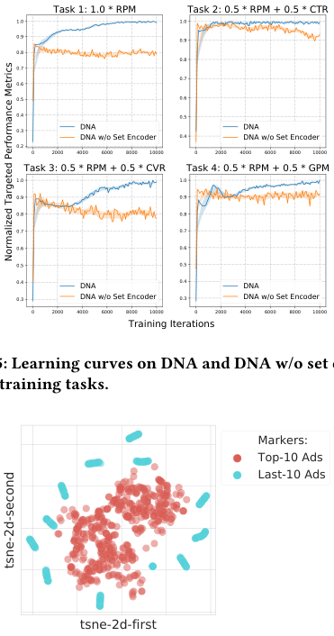

<!-- Start of picture text -->
Task 1: 1.0 * RPM Task 2: 0.5 * RPM + 0.5 * CTR 1.0 1.0 0.9 0.9 0.8 0.8 0.7 0.6 0.7 0.5 0.6 0.4 0.5 0.3 DNADNA w/o Set Encoder 0.4 DNA DNA w/o Set Encoder 0.2 0 2000 4000 6000 8000 10000 0 2000 4000 6000 8000 10000 Task 3: 0.5 * RPM + 0.5 * CVR Task 4: 0.5 * RPM + 0.5 * GPM 1.0 1.0 0.9 0.9 0.8 0.8 0.7 0.7 0.6 0.6 0.5 0.5 0.4 DNA 0.4 DNA 0.3 DNA w/o Set Encoder 0.3 DNA w/o Set Encoder 0 2000 4000 6000 8000 10000 0 2000 4000 6000 8000 10000 Training Iterations Figure 5: Learning curves on DNA and DNA w/o set encoder in four training tasks. Markers: Top-10 Ads Last-10 Ads tsne-2d-first Normalized Targeted Performance Metrics tsne-2d-second <!-- End of picture text -->

**Figure 5: Learning curves on DNA and DNA w/o set encoder in four training tasks.** 

**Figure 6: Distribution of the set embedding for sampled tok10 and end-10 ads in latent space using t-SNE.** 

- 7: Decrease _𝜏_ by one step 

- 8: **end while** 

## **C DEPLOYMENT IN E-COMMERCE ADVERTISING SYSTEM** 

## **B ANALYSIS OF THE SET EMBEDDINGS** 

We next provide empirical evidence suggesting the meaningfulness of set embedding _ℎ𝑖_′learnedbythesetencoder.Weconducted experiments on training DNA mechanism without the set encoder. The learning curves on four different tasks are plotted in Fig. 5. We find that the learning performance degrades when disabling the set encoder, indicating that the context-aware rank scores are beneficial to promote the performance. To qualitatively study the latent set embeddings from the set encoder, we randomly select some _top-10_ and _last-10_ ads from the test data set and generate their corresponding set embeddings _ℎ𝑖_′using the trained set encoder. The t-SNE [32] plots can be seen in Fig. 6, where each point represents an ad. It is interesting to find that the top-ranked ads are clustered together, and the “weak” ads are separated from the cluster. This indicates that the set embedding _ℎ𝑖_′may carry the “competitiveness” information from the other candidate ads, assisting the subsequent rank score module to learn rank scores towards optimizing the overall performance. 

The Deep Neural Auction mechanism is deployed under “Advertisement <u>Intelligent Decision-mAking</u> system” (AIDA) in Taobao display advertising system. The online inference procedure can be formulated as follows: 

**Algorithm 2** Online Auction Service of DNA 

- **Require:** Online auction data (all candidate ads in a PV request), the trained DNA 

- 1: Data preprocessing: feature construction 

- 2: Generate rank scores of DNA with Eq. (4)(5)(6)(7) 

- 3: Obtain the top- _𝐾_ winning ads and their corresponding payments with differentiable sorting engine by setting _𝜏_ = 0 

Fig. 7 shows the overall architectures of the training system pipeline, including online ad platform and offline trainer. Firstly, the online ad platform receives a page view (PV) request from a user. The relevant candidate ads are selected, together with the generated user response predictions ( _e.g._ , _𝑝𝐶𝑇𝑅_ , _𝑝𝐶𝑉𝑅_ ). Then, the auction 

3363 

KDD ’21, August 14–18, 2021, Virtual Event, Singapore 

ADS Track Paper 

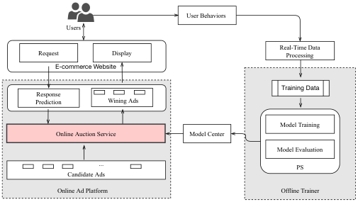

<!-- Start of picture text -->
User Behaviors Users Real-Time Data Request Display Processing E-commerce Website Training Data Response Prediction Wining Ads Model Training Online Auction Service Model Center Model Evaluation ... PS Candidate Ads Online Ad Platform Offline Trainer <!-- End of picture text -->

model checkpoint transmission can be completed in less than 20 minutes. 

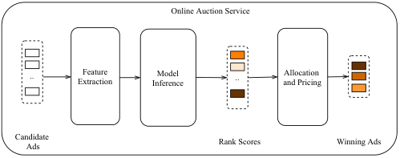

<!-- Start of picture text -->
Online Auction Service .. ExtractionFeature InferenceModel .. and PricingAllocation Candidate Ads Rank Scores Winning Ads <!-- End of picture text -->

**Figure 8: Online Auction Service.** 

**Figure 7: The Pipeline of Training System.** 

mechanism is conducted and the top- _𝐾_ winning ads will be selected and displayed to the user. Once the user finishes interacting with the ad, _e.g._ , click, or place an order, these behaviors are recorded as log data and sent to the real-time data processing module, where hundreds of thousands of log data are processed per second. After that, the training procedure is performed via parameter-server (PS) framework and the model evaluation will be periodically carried on to monitor the training process. When the convergence condition is satisfied, the model checkpoint will be pushed to the model center module. The model checkpoint can be delivered in several minutes from offline to online. We also design a model version management tool inside the model center, endowing the training system with rollback ability in response to training crash or service breakdown. The whole pipeline from real-time data processing to 

The online auction service, as illustrated in Fig. 8, consists of three main components: a feature extraction module, a model inference module, and an allocation & pricing module. Given the candidate ads set with the available information, the feature extraction module conducts feature engineering, which extracts useful information from the raw user and ads. The trained model checkpoint is then loaded and executed to generate rank scores for all ads in the model inference module. Finally, the allocation and payments are determined using the differentiable sorting engine in DNA (by setting _𝜏_ = 0). We mainly focus on response time (RT) for the online auction service. The online auction service processes tens of thousands of ad auctions per second, and the RT is 6ms average with dozens of 32-CPU-cores servers. In the last Double Eleven shopping festival of _Taobao_ , the online auction service accommodated a tremendous nearly 1 million ad auctions per second during the peak, keeping all services in working order. 

3364 

