# **A Personalized Automated Bidding Framework for Fairness-aware Online Advertising** 

Haoqi Zhang 

Zhenzhe Zheng∗ zhengzhenzhe@sjtu.edu.cn Shanghai Jiao Tong University Shanghai, China 

Lvyin Niu 

zhanghaoqi39@sjtu.edu.cn 

lvyin.nly@alibaba-inc.com 

Shanghai Jiao Tong University Shanghai, China 

Alibaba Group Beijing, China 

Zhilin Zhang 

Chuan Yu 

Fan Wu 

fwu@cs.sjtu.edu.cn Shanghai Jiao Tong University Shanghai, China 

Shan Gu 

Jian Xu 

zhangzhilin.pt@alibaba-inc.com gushan.gs@alibaba-inc.com 

yuchuan.yc@alibaba-inc.com xiyu.xj@alibaba-inc.com Alibaba Group Beijing, China 

Alibaba Group 

Beijing, China 

Bo Zheng 

Guihai Chen gchen@cs.sjtu.edu.cn Shanghai Jiao Tong University Shanghai, China 

bozheng@alibaba-inc.com Alibaba Group Beijing, China 

## **ABSTRACT** 

strategies. Experiments conducted on the real-world dataset and online A/B test on Alibaba display advertising platform demonstrate the effectiveness of PerBid in improving overall ad performance and guaranteeing fairness among heterogeneous advertisers. 

Powered by machine learning techniques, online advertising platforms have launched various automated bidding strategy services to facilitate intelligent decision-making for advertisers. However, advertisers experience heterogeneous advertising environments, and thus the unified bidding strategies widely used in both academia and industry suffer from severe unfairness issues, resulting in significant ad performance disparity among advertisers. In this work, to resolve the unfairness issue and improve the overall system performance, we propose a personalized automated bidding framework, namely PerBid, shifting the classical automated bidding strategy with a unified agent to multiple context-aware agents corresponding to different advertiser clusters. Specifically, we first design an ad campaign profiling network to model dynamic advertising environments. By clustering the advertisers with similar profiles and generating context-aware automated bidding agents for each cluster, we can match advertisers with personalized automated bidding 

## **CCS CONCEPTS** 

• **Applied computing** → **Electronic commerce** ; • **Information systems** → **Display advertising** . 

## **KEYWORDS** 

E-commerce Advertising; Personalized Automated Bidding; Fairnessaware Online Advertising 

### **ACM Reference Format:** 

Haoqi Zhang, Lvyin Niu, Zhenzhe Zheng, Zhilin Zhang, Shan Gu, Fan Wu, Chuan Yu, Jian Xu, Guihai Chen, and Bo Zheng. 2023. A Personalized Automated Bidding Framework for Fairness-aware Online Advertising. In _Proceedings of the 29th ACM SIGKDD Conference on Knowledge Discovery and Data Mining (KDD ’23), August 6–10, 2023, Long Beach, CA, USA._ ACM, New York, NY, USA, 10 pages. https://doi.org/10.1145/3580305.3599765 

#### ∗Z. Zheng is the corresponding author. 

This work was supported in part by National Key R&D Program of China No. 2020YFB1707900, in part by China NSF grant No. 62132018, U2268204, 62272307, 61902248, 61972254, 61972252, 62025204, 62072303, in part by Shanghai Science and Technology fund 20PJ1407900, in part by Alibaba Group through Alibaba Innovative Research Program. The opinions, findings, conclusions, and recommendations expressed in this paper are those of the authors and do not necessarily reflect the views of the funding agencies or the government. 

## **1 INTRODUCTION** 

With the rapid expansion of e-commerce, online advertising is becoming the major venue for many brands and stores for product promotion [15]. The ad delivery process in online advertising is much complicated for advertisers, including ad campaign configuration (such as targeted user group selection and budget assignment [18, 40]) and bidding in ad auctions for ad exposure opportunities [38, 42, 43]. To better serve advertisers, online advertising platforms have launched various advertising strategy services, providing learning-based algorithms to facilitate intelligent decisionmaking, and the most representative example is the automated bidding strategy powered by reinforcement learning (RL) [19, 23, 37]. Due to data sparsity and computation resource limitations, the automated bidding strategy is usually implemented in a unified manner, 

Permission to make digital or hard copies of all or part of this work for personal or classroom use is granted without fee provided that copies are not made or distributed for profit or commercial advantage and that copies bear this notice and the full citation on the first page. Copyrights for components of this work owned by others than the author(s) must be honored. Abstracting with credit is permitted. To copy otherwise, or republish, to post on servers or to redistribute to lists, requires prior specific permission and/or a fee. Request permissions from permissions@acm.org. _KDD ’23, August 6–10, 2023, Long Beach, CA, USA_ 

© 2023 Copyright held by the owner/author(s). Publication rights licensed to ACM. ACM ISBN 979-8-4007-0103-0/23/08...$15.00 https://doi.org/10.1145/3580305.3599765 

5544 

KDD ’23, August 6–10, 2023, Long Beach, CA, USA 

Haoqi Zhang et al. 

which is generated with the bid logs collected from all participating advertisers and then shared by all advertisers [19]. 

However, the unified bidding strategy paradigm is not optimal for each individual advertiser, and has caused severe unfairness phenomenon among advertisers. Our observations from a deployed automated bidding strategy service in Alibaba display advertising platform [1] reveal the underlying reasons for these two issues. On the one hand, heterogeneous advertisers can encounter different advertising environments at different times, _e.g._ , the user impression distribution and the winning price of ad auctions vary greatly. The ad performance of the unified bidding strategy under heterogeneous advertising environments could be utterly different, where the performance disparity can exceed 65%. This is because the unified bidding strategy fails to perceive the specific advertising environment faced by different advertisers. On the other hand, the dominant and minority advertisers would encounter different advertising states when applying the RL-based bidding strategy, resulting in unbalanced state exploration for the RL training. Thus, the unified bidding strategy experiences lower ad performance for those minority advertisers with states seldom explored. In this work, we investigate the personalized RL-based automated bidding strategy to perceive heterogeneous advertising environments and efficiently explore different advertising states, aiming to improve the ad performance and guarantee fairness for all advertisers. 

However, designing personalized automated bidding strategies for heterogeneous advertisers is challenging. First, the advertising environment evolves rapidly and is jointly determined by numerous factors, such as advertising time, target audience and other advertisers’ strategies. The frequent fluctuation of the environment also brings uncertainty to the ad performance, making it hard to represent the environment by simply observing local state transitions as in model-based RL [3, 25], requiring more informative features to capture the context of the environments. Second, even with an appropriate model for heterogeneous advertising environments, directly integrating it into the RL-based bidding strategy training process would greatly enlarge state space, which exacerbates data sparsity and unbalanced state exploration, making it challenging to train a context-aware automated bidding agent efficiently. 

To jointly address these challenges, we design a personalized automated bidding framework, namely PerBid, which generates a set of context-aware automated bidding strategies, instead of a unified bidding strategy, for heterogeneous advertising environments. The high-level intuition behind PerBid is that by matching heterogeneous advertisers with personalized automated bidding strategies based on the precise perception of the advertising environments, we can improve the performance of the minority advertisers and thus resolve the unfairness. In PerBid, we first design an ad campaign profiling network to perceive and represent the heterogeneous advertising environment, enabling to design context-aware automated bidding strategies with good generalization ability. Then, we group advertisers in similar advertising environments into clusters, and train automated bidding strategies for each advertiser cluster. Finally, given the ad campaign profiles and the candidate context-aware strategies, we match each individual advertiser with the most suitable automated bidding strategy and conduct local adaptation to further improve the performance. Through experiments conducted on the real-world industrial dataset and online 

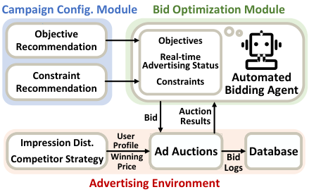

<!-- Start of picture text -->
Campaign Config. Module Bid Optimization Module ` Objective Objectives Recommendation Real-time Advertising Status Constraint  Constraints Automated Recommendation Bidding Agent Auction Bid Results User Impression Dist. Profile Ad Auctions DaDatabase Competitor Strategy Winning  Bid Price Logs Advertising Environment <!-- End of picture text -->

**Figure 1: An Advertising Strategy Service.** 

A/B test, we demonstrate the advantages of PerBid in optimizing average performance and guaranteeing fairness for all advertisers. Our contributions in this work can be summarized as follows: • We take an in-depth investigation on the performance of automated bidding services for advertisers, and reveal the connection between the ubiquitous unfairness issues and the unified strategy paradigm by analyzing the dataset collected from a deployed automated bidding service for millions of daily active advertisers. 

• We propose a personalized automated bidding framework, namely PerBid, for fairness-aware online advertising. We propose an ad campaign profiling network to represent heterogeneous advertising environments, which enables the design of context-aware automated bidding strategies. We prevent data sparsity and unbalanced state exploration by dynamically grouping advertisers with similar profiles into multiple clusters, and assigning each cluster with a context-aware automated bidding strategy. We finally match each advertiser with a personalized bidding strategy. 

• We conduct comprehensive experiments on a real-world industrial dataset and an online A/B test on an industrial production environment to validate the effectiveness of PerBid. The results of the online A/B test demonstrate that PerBid can improve the overall ad performance by 8 _._ 02% and the fairness metric (Generalized Gini Social Welfare Function) by 8 _._ 53%. 

## **2 PRELIMINARIES** 

In this section, we first introduce the general advertising strategy service deployed on Alibaba display advertising platform. Then, we specify the strategy service in the context of automated bidding. Finally, we discuss the widespread unfairness among advertisers due to the unified bidding strategy paradigm widely used in industry. 

## **2.1 Advertising Strategy Service** 

In online advertising, advertisers promote their products by deploying ad campaigns, which will attend a series of ad auctions to compete for ad exposure opportunities/user impressions1 . During this process, advertisers need to determine the ad campaigns’ parameters, _e.g._ , optimization objectives and constraints, and then design the bidding strategy to solve this constrained optimization problem. To help advertisers make right decisions, the advertising platform launches various advertising strategy services. As shown in Figure 1, the decision-making process can be divided into two 

> 1Without loss of generality, we assume each advertiser conducts one ad campaign, and use advertiser and ad campaign interchangeably. 

5545 

KDD ’23, August 6–10, 2023, Long Beach, CA, USA 

A Personalized Automated Bidding Framework for Fairness-aware Online Advertising 

components: _campaign configuration module_ and _bid optimization module_ . Before the advertising process, the _campaign configuration module_ recommends potential target audiences, and also helps advertisers formulate the optimization objective and multi-level constraints (such as total budget and Pay-Per-Click (PPC)). During the advertising process, _bid optimization module_ attempts to optimize the objective under the constraints. Specifically, an automated bidding agent, on behalf of the advertiser, competes with the other advertisers by offering bids for each ad auction. The agent timely adjusts its bids based on real-time feedback about the advertising performance. At the end of the advertising process, bid logs recording the information about each ad auction, including auction time, user impression profile, and winning price, will be stored. Due to data sparsity and computation resource limitations, the advertising platform trains a unified agent by optimizing the average performance with the bid logs mainly from dominant advertisers. 

## **2.2 Automated Bidding Strategy** 

We next describe the strategy services in the context of automated bidding, which is formulated as an online optimization problem: 

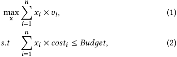

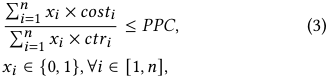

where _𝑛_ is the total number of ad auctions/user impressions, _𝑣𝑖_ is the value of each user impression _𝑖_ contributed to the objective (we take the example of user conversion in this work), _𝑐𝑜𝑠𝑡𝑖_ is the money that should be paid if winning the auction (also called as winning price), and _𝑐𝑡𝑟𝑖_ is the probability of the user to click the ad. The vector x = ( _𝑥_ 1 _,𝑥_ 2 _, ...,𝑥𝑛_ ) indicates whether the user impression is selected to display the ad ( _𝑥𝑖_ = 1 is to display ad to user impression _𝑖_ ; otherwise is not). _𝐵𝑢𝑑𝑔𝑒𝑡_ and _𝑃𝑃𝐶_ are the pre-set parameters for the constraints of budget and the expected pay-per-click, respectively. 

For automated bidding, the agent sets different bids for each user impression based on its contribution to optimizing the objective as well as keeping the constraints. The optimal bid for user impression _𝑖_ can be derived through the primal-dual method [38, 43] and has the following form: 

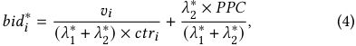

in which _𝜆_ 1∗and_𝜆_ 2∗are the optimal dual variables of budget and PPC constraints in (2) and (3), respectively, and the corresponding optimal selection result under Generalised Second Price (GSP) [15] auction with Cost-per-Click pricing rule [38] is 

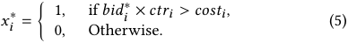

We further rescale the dual parameters as 

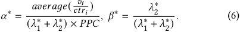

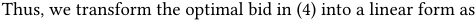

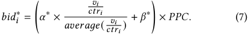

Since the optimal bidding parameters _𝛼_∗ and _𝛽_∗ can only be calculated by solving the offline linear programming, the controlbased automated bidding strategies, _e.g._ , feedback control [38, 42] and RL [19, 23, 37], are proposed to fine-tune these parameters in an online manner. In this work, we focus on the RL-based methods, and formulate the parameter adjustment process as a Markov Decision Process (MDP). Specifically, we introduce states _𝑠_ ∈S to describe the real-time advertising status and actions _𝑎_ ∈A to adjust the corresponding bidding parameters. The RL-based automated bidding agent will take action _𝑎𝑡_ at the state _𝑠𝑡_ based on its policy _𝜋_ , and then the state will transit to the next state _𝑠𝑡_ +1 ∈S and gain reward _𝑟𝑡_ ∈R according to the advertising environment dynamic T : ( _𝑠𝑡 ,𝑎𝑡_ ) →( _𝑠𝑡_ +1 _,𝑟𝑡_ ). The expected long-term value to the end by taking _𝑎𝑡_ at _𝑠𝑡_ is defined as _𝐺_ ( _𝑠𝑡 ,𝑎𝑡_ ). During RL agent training, the policy _𝜋_ will be improved to take the action that maximizes the expected long-term value, _i.e._ , _𝜋_ ( _𝑠_ ) = arg max _𝑎__𝐺_(_𝑠,𝑎_). 

We next describe the implementation of this RL-based automated bidding agent in the industrial online advertising system [19]. The state _𝑠_ , action _𝑎_ , and reward _𝑟_ are defined as follows: 

• State _𝑠𝑡_ describes the real-time advertising status at time period _𝑡_ , which includes 1) remaining time of the ad campaign; 2) remaining budget; 3) budget spending speed; 4) real-time cost-efficiency (PPC), 5) average cost-efficiency (PPC), and 6) current bidding parameters _𝛼𝑡_ and _𝛽𝑡_ . 

• Action _𝑎𝑡_ indicates the adjustment to the bidding parameters at the time period _𝑡_ , _i.e._ , { _𝛼𝑡 , 𝛽𝑡_ } = { _𝛼𝑡_ −1 _, 𝛽𝑡_ −1}+ _𝑎𝑡_ , which has two dimensions ( _𝑎𝑡__𝛼,𝑎_ _𝑡__𝛽_). After receiving_𝑠𝑡_, the agent uses its policy_𝜋_, implemented with a deep neural network, to generate _𝑎𝑡_ = _𝜋_ ( _𝑠𝑡_ ). 

• The reward _𝑟𝑡_ is the value contributed to the objective obtained within the time period _𝑡_ . We denote the accumulated reward achieved before the time period _𝑡_ as _𝑅𝑡_ , and _𝑅_ − _𝑡_ is the total future reward following the adjusted bidding parameters { _𝛼𝑡 , 𝛽𝑡_ }. To jointly consider objective optimization and keeping cost-efficiency constraint, the expected long-term value _𝐺_ is defined as _𝐺_ ( _𝑠𝑡 ,𝑎𝑡_ ) = _<u>𝑅𝑡</u>_ + _𝑅𝑅_<u>∗</u> − _<u>𝑡</u>_ − _𝑃_ , where _𝑅_∗ is the total reward using the offline optimal bidding parameters, and _𝑃_ is the penalty for violating the PPC constraint. _𝐺_ can be obtained directly through bid logs during offline training without recording _𝑟𝑡_ in each time. 

## **2.3 Fairness in Automated bidding** 

We investigate the unfairness phenomenon among advertisers through an industrial dataset with 250 million ad auctions collected from Alibaba display advertising platform. The detailed experiment setup and analysis can be found in Section 4.2. We present the main results here: using the currently deployed unified automated bidding strategy, the ad performance for different advertisers varies significantly, where the worst 10% advertisers can only achieve 76% of the ad performance compared with that of the best 10% 

5546 

KDD ’23, August 6–10, 2023, Long Beach, CA, USA 

Haoqi Zhang et al. 

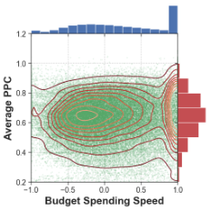

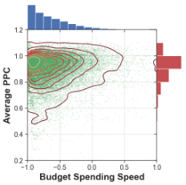

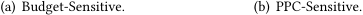

<!-- Start of picture text -->
(a) Budget-Sensitive. (b) PPC-Sensitive. <!-- End of picture text -->

**Figure 2: Distribution of states encountered by different types of ad campaigns. The normalized average PPC and budget spending speed are defined in (8).** 

advertisers on average. The advertisers with a larger proportion dominate the training process and achieve better ad performance, while the minority suffers from constraint violation and then worse performance, whose PPC constraint violation rate is 12 _._ 27% higher than the dominant advertisers, and the average ad performance degrades by 3 _._ 24%. 

Based on in-depth data analysis for the bid logs, we discover two major reasons for the above unfairness phenomenon: _the heterogeneity of advertising environment_ and _the unbalanced exploration of states_ . First, the user impression distribution (one of the representative features of the advertising environment) varies greatly in both quality and quantity for different ad campaigns, where the average _𝑐𝑡𝑟_ can vary by 15 times, and the difference in user impression volume can even exceed 28 times, making the automated bidding agent hard to figure out a once-for-all optimal policy. Second, there exist multiple types of ad campaigns with different proportions, and they can encounter different states. Simply using the data collected from all ad campaigns for training can lead to unbalanced state exploration for the unified RL-based bidding agent, which further exacerbates the unfairness issues since the agent can obtain better performance for the ad campaigns with fully explored states than the ones with states seldom observed. In Alibaba display advertising platform, there exist three common types of ad campaigns: budget-sensitive ad campaigns, PPC-sensitive ad campaigns, and the mixture of them, and their proportions are 59 _._ 61%, 20 _._ 20%, and 20 _._ 19%, respectively. As shown in Figure 2, the budget-sensitive ad campaigns encounter more states where the budget is limited (right end of the figure), and thus focus on pacing the budget spending speed, while the encountered states of PPC-sensitive campaigns focus on PPC controlling (top left of the figure). Such a difference in encountering states intensifies the unbalanced state exploration and training, leading to different ad performance: the average ad performance of the mixture type decreases by 4 _._ 82% compared with that of the budget-sensitive ad campaigns. 

In this work, we aim to provide each individual advertiser with personalized and high-quality automated bidding services without degrading the average performance of all advertisers. There exist two requirements behind the purpose: First, the ad performance gaps among different advertisers need to be narrowed. Second, fairness could not be guaranteed at the expense of efficiency. To achieve these two properties, in the next section, we introduce 

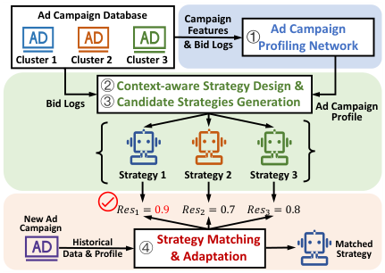

<!-- Start of picture text -->
Ad Campaign Database Campaign Features Ad Campaign ① & Bid Logs Profiling Network Cluster 1 Cluster 2 Cluster 3 ② Context-aware Strategy Design & Bid Logs ③ Candidate Strategies Generation Ad Campaign Profile Strategy 1 Strategy 2 Strategy 3 𝑅𝑒𝑠! = 0.9 𝑅𝑒𝑠" = 0.7 𝑅𝑒𝑠# = 0.8 New Ad Campaign Data & Profile Historical ④ Strategy Matching& Adaptation MatchedStrategy <!-- End of picture text -->

**Figure 3: Design Overview of PerBid.** 

PerBid, a personalized automated bidding framework for fairnessaware online advertising. 

## **3 PERSONALIZED AUTOMATED BIDDING FRAMEWORK** 

In this section, we first introduce the design overview of PerBid, and then describe the detailed implementation of the major components. 

## **3.1 Design Overview** 

In this work, we achieve personalized automated bidding by generating a set of candidate context-aware automated bidding strategies (RL agents) that can perceive heterogeneous advertising environments, and then matching each ad campaign with the most suitable automated bidding strategy to maximize the overall performance and prevent the unfairness issue. We show the detailed procedure of PerBid in Figure 3. We first propose an ad campaign profiling network to efficiently generate ad campaign profiles that can represent dynamic advertising environments, enabling to design the context-aware automated bidding strategy for a specific advertising environment. Since a unified strategy cannot have good performance for all the ad campaigns, we group ad campaigns with similar profiles and in similar advertising environments into multiple clusters, and generate a context-aware automated bidding strategy for each cluster to form the candidate automated bidding strategy set. For a new coming ad campaign, we extract the ad campaign profile from its historical bid logs, and match the ad campaign with the automated bidding strategy achieving the best performance on the historical data. We further conduct local adaptation for the matched strategy when necessary. 

## **3.2 Ad Campaign Profiling** 

To achieve personalized automated bidding, we propose an ad campaign profiling network to reveal the pattern of the dynamic advertising environment. As shown in Figure 4, the ad campaign profiling network considers both campaign-level static features and auction-level dynamic features to generate the ad campaign profile, which can be trained through an ad performance classification task. 

The campaign-level static features describe the advertising environment from a macro perspective, including constraint parameters _𝐵𝑢𝑑𝑔𝑒𝑡_ and _𝑃𝑃𝐶_ , and ID-type features, such as campaign ID, target audience, advertising time, and etc. These high-level static features 

5547 

KDD ’23, August 6–10, 2023, Long Beach, CA, USA 

A Personalized Automated Bidding Framework for Fairness-aware Online Advertising 

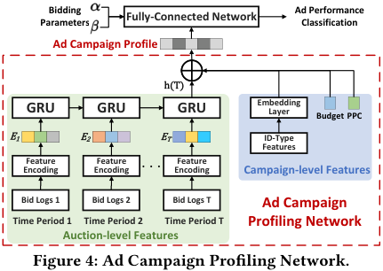

<!-- Start of picture text -->
ParametersBidding  Fully-Connected Network Ad Performance Classification Ad Campaign Profile h(T) GRU GRU GRU EmbeddingLayer Budget PPC E1 E2 ET ID-Type Features EncodingFeature  EncodingFeature  .. . EncodingFeature  Campaign-level Features Bid Logs 1 Bid Logs 2 Bid Logs T Ad Campaign Time Period 1 Time Period 2 Time Period T Profiling Network Auction-level Features Figure 4: Ad Campaign Profiling Network. <!-- End of picture text -->

can help perceive the advertising environment coarsely but quickly. We use data embedding [13] to transform the ID-type features into dense vectors. 

For the auction-level dynamic features, we first conduct feature encoding directly based on the bid logs to represent real-time advertising environments in each time period, and then use the recurrent neural network [39] to model the environment evolvement across multiple time periods. For the feature encoding process, we group the large-scale bid logs based on the time period they belong to. Within each time period, we focus on representing the distribution of user impressions’ cost-efficiency metrics, _i.e._ ,_<u>𝑐𝑜𝑠𝑡</u>_ _<u>𝑣𝑖</u>__<u>𝑖</u>_ and_<u>𝑐𝑜𝑠𝑡</u>_ _<u>𝑐𝑡𝑟𝑖</u>__<u>𝑖</u>_, since they directly decide the final auction results according to the rule in (5). Due to budget and PPC constraints, only the user impressions with high cost-efficiency might be selected, while the long-tail user impressions have not so much effect on the overall auction results. Therefore, we sort the user impressions based on their cost-efficiency metric and record the cost-efficiency metrics of the top 10%, 30%, and 50% user impressions along with the user impression volume and average winning price to form a vector _𝐸𝑡_ for each time period _𝑡_ . To represent the evolvement of the advertising environment, we use a GRU module [11] to capture the temporal relation across multiple time periods, whose input is the encoded features { _𝐸_ 1 _, ..., 𝐸𝑇_ }, and the output is the hidden state _ℎ_ ( _𝑇_ ). 

We concat campaign-level features and auction-level features to form the ad campaign profile. We train the parameters of the ad campaign profiling network through a classification task, which predicts the range of the obtained ad performance. The classification is implemented by a fully-connected neural network, whose inputs are the ad campaign profile and the bidding parameters _𝛼_ and _𝛽_ , and the output is the corresponding class of the obtained ad performance. Specifically, suppose _𝑁_ ad campaigns are divided into _𝐾_ classes based on their ad performance, and the one-hot label of ad campaign _𝑖_ is _𝑦𝑖_ = � _𝑦𝑖_1_, ...,𝑦_ _𝑖__𝐾_ �, the ad campaign profiling network can be optimized by minimizing the cross-entropy loss function: 

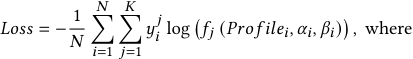

_𝑃𝑟𝑜𝑓𝑖𝑙𝑒𝑖_ = ( _ℎ_ ( _𝑇𝑖_ ) _, 𝐵𝑢𝑑𝑔𝑒𝑡𝑖, 𝑃𝑃𝐶𝑖,_ Embedding( _𝐼𝐷_  𝑓𝑒𝑎𝑡𝑢𝑟𝑒𝑠𝑖_ )) _._ 

Compared with only using the constraint parameters _𝐵𝑢𝑑𝑔𝑒𝑡_ and _𝑃𝑃𝐶_ , applying the extracted ad campaign profile can greatly improve the classification accuracy from 57.87% to 88.18%, demonstrating the effectiveness of the ad campaign profiling network in 

representing the dynamic advertising environments. We provide a feature encoding example and display more implementation details in supplementary material [2]. 

## **3.3 Context-aware Bidding Strategy** 

Based on the ad campaign profile, we further propose a contextaware automated bidding strategy for personalized bidding in heterogeneous advertising environments. The design principle is that we aim to enable the automated bidding strategies to perceive dynamic advertising environments and at the same time ensure the generalization ability. 

Following RL-based automated bidding agent in Section 2.2, we preserve the action _𝑎_ and expected long-term reward _𝐺_ , and redesign the state _𝑠_ . To achieve environment perception, we first introduce context features, which are the hidden state _ℎ_ ( _𝑡_ ) of the GRU module in the ad campaign profile, to extend the state space, aiming to reveal the pattern and evolvement of the dynamic advertising environment. This approach shares a similar idea with the model-based RL [25] and context-based meta-RL [16, 20, 31] that generates context variables based on state transitions for environment/task representation. Considering the number of ad campaigns is far larger than the tasks considered in the classical meta-RL, it requires a strong generalization ability in terms of features in the state, and simply enlarging the state space could further exacerbate unbalanced training and exploration of different states. Therefore, we do not directly encode the high-level sparse campaign-level features into the context feature but use them to revise the status features to enable them better represent real-time advertising status based on environment information, which can compress the state space and enhance the strategy’s generalization ability. 

Specifically, we define the state _𝑠𝑡_ at time period _𝑡_ as: 

_𝑠𝑡_ = { _𝑠𝑡𝑎𝑡𝑢𝑠𝑡 ,𝑐𝑜𝑛𝑡𝑒𝑥𝑡𝑡_ } _, 𝑐𝑜𝑛𝑡𝑒𝑥𝑡𝑡_ = _ℎ_ ( _𝑡_ ) _,_ 

_𝑠𝑡𝑎𝑡𝑢𝑠𝑡_ = { _𝑟𝑒𝑚𝑎𝑖𝑛_  𝑡𝑖𝑚𝑒𝑡 ,𝑟𝑒𝑚𝑎𝑖𝑛_  𝑏𝑢𝑑𝑔𝑒𝑡𝑡 ,𝑠𝑝𝑒𝑛𝑑_  𝑠𝑝𝑒𝑒𝑑𝑡 ,_ 

_𝑎𝑣𝑒𝑟𝑎𝑔𝑒_  𝑝𝑝𝑐𝑡 , 𝑝𝑝𝑐𝑡 , 𝛼𝑡 , 𝛽𝑡_ } _,_ 

where _𝑐𝑜𝑛𝑡𝑒𝑥𝑡𝑡_ is the context features representing the advertising environment and _𝑠𝑡𝑎𝑡𝑢𝑠𝑡_ is the status features describing real-time advertising status. The detailed definitions of the status features after revision using the campaign-level features and historical context information are summarized as follows 

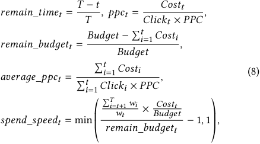

where _𝐶𝑜𝑠𝑡𝑡_ and _𝐶𝑙𝑖𝑐𝑘𝑡_ are the total cost spent and the clicks obtained during the time period _𝑡_ , respectively. The constraint parameters _𝐵𝑢𝑑𝑔𝑒𝑡_ , _𝑃𝑃𝐶_ , and the campaign duration _𝑇_ are leveraged to normalize _𝑟𝑒𝑚𝑎𝑖𝑛_  𝑡𝑖𝑚𝑒_ and _𝑟𝑒𝑚𝑎𝑖𝑛_  𝑏𝑢𝑑𝑔𝑒𝑡_ , and to map _𝑝𝑝𝑐_ and _𝑎𝑣𝑒𝑟𝑎𝑔𝑒_  𝑝𝑝𝑐_ to a relative value. We use the historical knowledge 

5548 

KDD ’23, August 6–10, 2023, Long Beach, CA, USA 

Haoqi Zhang et al. 

**Table 1: Definition of Notations in Algorithm 1.** 

|Notation|Definition|
|---|---|
|_𝑁_|Number of ad campaigns|
|_𝑀_|Number of ad campaign clusters|
|_𝑐𝑖_|Ad campaign_𝑖_and its bid logs|
|_𝑆𝑗_|Ad campaign cluster _𝑗_|
|_𝑎𝑔𝑒𝑛𝑡𝑗_|RL automated bidding agent of cluster _𝑗_|
|_𝜋𝑗_/_𝑄𝑗_|Policy/Value network of_𝑎𝑔𝑒𝑛𝑡𝑗_|
|_𝐵𝑗_|Replay buffer of cluster _𝑗_|
|_𝑂_|Recorded observation during exploration|
|_𝜖_|Random noise leveraged for exploration|
|_𝑅𝑒𝑠𝑖𝑗_|Normalized ad performance of_𝑐𝑖_using_𝑎𝑔𝑒𝑛𝑡𝑗_|
|_𝑡ℎ𝑟_|Campaign re-assignment threshold|

about user impression volume distribution in different time periods, _i.e._ , the weight vector w, to revise _𝑠𝑝𝑒𝑛𝑑_  𝑠𝑝𝑒𝑒𝑑_ , making it aware of the evolvement of user impression volume over time. The personalized weight vector w can be calculated based on the ad campaign’s historical bid logs or the historical data collected from other ad campaigns with a similar campaign-level profile. 

However, simply applying a unified context-aware strategy can hardly achieve good performance for all the advertising environments. In the next subsection, we will introduce how to generate a set of candidate context-aware automated bidding strategies to handle heterogeneous advertising environments. 

## **3.4 Candidate Strategies Generation** 

We divide the ad campaigns into multiple clusters, each of which contains campaigns in similar advertising environments and with similar profiles, and then train a context-aware automated bidding strategy (agent) for each cluster. The candidate strategies generation process can be summarized into three steps, including cluster initialization, bidding agent training, and ad campaign re-assignment. 

We show the detailed procedure for these three steps in Algorithm 1. The notations in the algorithm are defined in Table 1. For cluster initialization, we first initialize the RL-based automated bidding agents, and assign each ad campaign to a specific cluster according to a pre-defined cluster initialization rule (Lines 1 to 3). After cluster initialization, we conduct agent training for each cluster in a parallel way (Lines 5 to 15). For a given cluster, we randomly sample an ad campaign, and explore the possible advertising states of this campaign using the automated bidding agent associated with this cluster (Lines 7 to 12). We store the observations about the state, action, and long-term value acquisition in the replay buffer of the cluster (Line 13). Then, we sample historical observations of this cluster with importance sampling, and update the agent’s policy with actor-critic-based RL algorithms [19] (Lines 14 to 15). As agents have the same training/exploration opportunities on the ad campaigns in the corresponding cluster, we enable the agents covering fewer campaigns to spend more resources exploring the states seldom encountered and pay more attention to understanding those unusual advertising environments, resolving the unbalanced exploration of states. As the cluster initialization rule could be sub-optimal, we re-assign the ad campaign to the new cluster when necessary at the end of each training iteration (Lines 16 to 21). For each ad campaign _𝑐𝑖_ in the cluster _𝑗_ , we evaluate its ad performance under different automated bidding agents 

**Algorithm 1:** Candidate Strategies Generation. 

||**Input:**Ad CampaignsC= {_𝑐_1_, ...,𝑐𝑁_}; Automated Bidding AgentsA= {_𝑎𝑔𝑒𝑛𝑡_1_, ...,𝑎𝑔𝑒𝑛𝑡𝑀_}; Replay Buffers B= {_𝐵_1_, 𝐵_2_, ..., 𝐵𝑀_}; ClustersS= {_𝑆_1_, ...,𝑆𝑀_}; |
|---|---|
|**1**|Initialize_𝑎𝑔𝑒𝑛𝑡𝑗_with policy network_𝜋𝑗_and value network _𝑄𝑗_for each cluster_𝑆𝑗_; // Initialization step.|
|**2 **|**for**_Campaign 𝑐𝑖_∈C**do**|
|**3**|_𝑗_←_𝐼𝑛𝑖𝑡_𝐶𝑙𝑢𝑠𝑡𝑒𝑟_(_𝑐𝑖_);_𝑆𝑗_←_𝑆𝑗_∪_𝑐𝑖_;|
|**4 **|**while**_Not Converge_**do**|
|**5**|**for**_Cluster 𝑆𝑗_∈S**do**|
|**6**|**for**_𝑒𝑝_**from**1**to**_𝐸𝑝𝑖𝑠𝑜𝑑𝑒_**do** // Training Step.|
|**7**|Randomly select the campaign_𝑐𝑖_∈_𝑆𝑗_;|
|**8**|Initialize bidding parameters{_𝛼_1_, 𝛽_1};|
|**9**|**for**_𝑡_**from**2**to**_𝑇𝑖_**do**|
|**10**|Obtain state_𝑠𝑡_with parameters{_𝛼𝑡_−1_, 𝛽𝑡_−1};|
|**11**|Explore state_𝑠𝑡_by taking_𝑎𝑡_←_𝜋𝑗_(_𝑠𝑡_) +_𝜖_, {_𝛼𝑡, 𝛽𝑡_} ←{_𝛼𝑡_−1_, 𝛽𝑡_−1} +_𝑎𝑡_;|
|**12**|Observe long-term value_𝐺_(_𝑠𝑡,𝑎𝑡_);|
|**13**|Store observation_𝑂_(_𝑠𝑡,𝑎𝑡,𝐺_(_𝑠𝑡,𝑎𝑡_)) to_𝐵𝑗_;|
|**14**|Sample observationsOfrom_𝐵𝑗_;|
|**15**|Update_𝜋𝑗_and_𝑄𝑗_withO;|
|**16**|**for**_Campaign 𝑐𝑖_∈_𝑆𝑗_**do**// Re-assignment step.|
|**17**|**for**_𝑎𝑔𝑒𝑛𝑡𝑘_∈A**do**|
|**18**|_𝑅𝑒𝑠𝑖𝑘_←_𝐴𝑢𝑐𝑡𝑖𝑜𝑛_𝑆𝑖𝑚𝑢𝑙𝑎𝑡𝑖𝑜𝑛_(_𝑐𝑖,𝑎𝑔𝑒𝑛𝑡𝑘_);|
|**19**|_𝑘_∗=argmax_𝑘𝑅𝑒𝑠𝑖𝑘_;|
|**20**|**if**_𝑅𝑒𝑠𝑖𝑘_∗−_𝑅𝑒𝑠𝑖𝑗> 𝑡ℎ𝑟_**then**|
|**21**|_𝑆𝑘_∗←_𝑆𝑘_∗∪_𝑐𝑖_;_𝑆𝑗_←_𝑆𝑗_\_𝑐𝑖_;|

**22 Return** the set of candidate strategies A; 

through offline advertising simulations. We re-assign the ad campaigns with poor performance using the current agent to a new cluster with better performance. There are several advantages of this re-assignment process: It can better capture heterogeneous advertising environments based on real-time agent performance, accelerate the training convergence, and then improve the agents’ performance. 

## **3.5 Strategy Matching and Adaptation** 

With the candidate strategies, we can match each arriving ad campaign with the optimal automated bidding strategy, and further fine-tune the matched strategy by conducting local adaptation over its own historical data. 

We design a weighted average prediction algorithm [7] for the strategy matching process. For an ad campaign arriving at day _𝑑_ , we sample its historical data of the previous _𝐷_ days. For each day _𝑖_ , we conduct advertising simulation to obtain the performance of the _𝑀_ candidate strategies on the historical data, and obtain day _𝑖_ ’s normalized score vector Res_𝑖_ = ( _𝑅𝑒𝑠𝑖_ 1 _,_ · · · _, 𝑅𝑒𝑠𝑖𝑀_ ). Based on the score vectors from all _𝐷_ days, we calculate a weighted average score vector Res_𝑎𝑣𝑔_ = ( _𝑅𝑒𝑠_ 1_𝑎𝑣𝑔_ _,_ · · · _, 𝑅𝑒𝑠𝑀__𝑎𝑣𝑔_),representingtheaverage performance of each bidding strategy on the previous _𝐷_ days. We select the strategy with the highest score for the ad campaign. The adaptation process is similar to the training step in candidate 

5549 

KDD ’23, August 6–10, 2023, Long Beach, CA, USA 

A Personalized Automated Bidding Framework for Fairness-aware Online Advertising 

strategy generation in Algorithm 1, except that all the training data is the historical bid logs of the same ad campaign. It is worth to note that the adaptation process may also lead to over-fitting and cause performance degradation, and thus it is mainly applied to the ad campaigns with poor performance. For the cold-start ad campaigns without enough historical data, we select the strategy with the best average performance on all clusters. The algorithm details are provided in supplementary material [2]. 

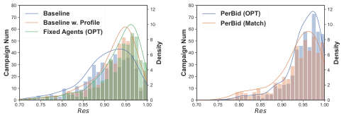

<!-- Start of picture text -->
8070 Baseline 12 8070 PerBid (OPT) 12 60 Baseline w. ProfileFixed Agents (OPT) 10 60 PerBid (Match) 10 50 8 50 8 40 6 40 6 30 30 4 4 20 20 10 2 10 2 0 0 0 0 0.70 0.75 0.80 0.85 0.90 0.95 1.00 0.70 0.75 0.80 0.85 0.90 0.95 1.00 Res Res Density Density Campaign Num Campaign Num <!-- End of picture text -->

**Figure 5: Ad performance distribution of test campaigns.** 

## **4 EXPERIMENT RESULTS** 

In this section, we first introduce the experiment setup and then demonstrate the unfairness issues among ad campaigns caused by the unified automated bidding strategy. After that, we evaluate the performance of PerBid in a real-world industry dataset. Finally, we introduce the results of the online A/B test. 

## **4.1 Experiment Setup** 

**Dataset.** We use the bid logs collected by Alibaba display advertising platform as the dataset, which consists of over 250 million bid logs from over 3500 ad campaigns. We aggregate and regard the bid logs of the same ad campaign on the same day as a data sample2 . We follow the training data generation process used by Alibaba display advertising platform to randomly select 3000 samples to be the training dataset, 663 samples to be the validation dataset, and 483 samples to be the test dataset. 

**Metric.** The performance of an ad campaign is defined as 

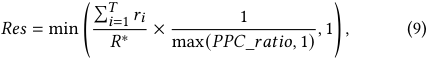

where _𝑃𝑃𝐶_  𝑟𝑎𝑡𝑖𝑜_ is the ratio of the achieved pay-per-click to the pre-set _𝑃𝑃𝐶_ constraint. The first term in the min operation is the normalized objective, and the second term is the penalty for PPC constraint violation. We denote the average performance of all ad campaigns as _𝑅𝑒𝑠_ , and use _𝑅𝑒𝑠_ 0 _._ 3 and _𝑅𝑒𝑠_ 0 _._ 1 to denote the average performance of the worst 30% and 10% ad campaigns, respectively. 

To measure fairness among advertisers from multiple perspectives, we use two types of metrics: _Generalized Gini Social Welfare Function_ ( _𝐺𝐺𝐹_ ) [36] and _Gini Coefficient (𝐺𝑖𝑛𝑖)_ [33]3 . For _𝐺𝐺𝐹_ , it is widely used when discussing the fairness issues in fairness-aware RL literature [34, 46] or online ranking [14]. We define _𝐺𝐺𝐹_ as 

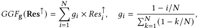

where Res↑ indicates the performance vector of all ad campaigns sorted in an increasing order. The metric _𝐺𝐺𝐹_ considers both the fairness issues and the overall performance by calculating a weighted average result, which assigns large weights _𝑔_ to the ad campaigns with worse ad performance. A large _𝐺𝐺𝐹_ indicates that the system can achieve good average performance and avoid unfairness, simultaneously. For _𝐺𝑖𝑛𝑖_ , it measures the statistical dispersion, and can be used to indicate the performance disparity among ad 

> 2For easy illustration, we use samples/ad campaigns interchangeably in the experiment. 

> 3The evaluation results of more fairness metrics, including _𝛼-Fairness_ [29], _Jain’s Fairness Index_ [21] and standard deviation are displayed in supplementary material [2]. 

**Table 2: Ad performance of different methods.** 

|Method|_𝑅𝑒𝑠_|_𝐺𝐺𝐹_|_𝐺𝑖𝑛𝑖_|_𝑅𝑒𝑠_0_._3|_𝑅𝑒𝑠_0_._1|
|---|---|---|---|---|---|
|_Baseline_|0.9033|0.8678|0.0392|0.8242|0.7517|
|_Baseline w. Profile_|0.9233|0.8943|0.0313|0.8565|0.7969|
|_Fixed Agents (OPT)_|0.9327|0.9049|0.0298|0.8678|0.8095|
|_PerBid (OPT)_|**0.9494**|**0.9270**|**0.0235**|**0.8982**|**0.8493**|
|_PerBid(Match)_|0.9337|0.9039|0.0318|0.8640|0.8026|

campaigns, which is defined as 

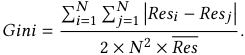

The larger the _𝐺𝑖𝑛𝑖_ is, the more severe the unfairness. 

**Experiment Settings.** In the experiments, the bidding parameters are initialized with _𝛼_ 1 = _𝛽_ 1 = 0 _._ 5, and the time period length is 15 minutes. To generate candidate context-aware bidding strategies, we set three ad campaign clusters with three candidate automated bidding agents, _i.e._ , _𝑀_ = 3. For cluster initialization rule in Algorithm 1, we initialize the clusters based on the campaigns’ pre-set _𝑃𝑃𝐶_ to guarantee the balance clustering. During training step in Algorithm 1, each training iteration includes 500 train episodes, and the ad campaign re-assignment threshold is _𝑡ℎ𝑟_ = 0 _._ 05. More results about using different _𝑀_ and _𝑡ℎ𝑟_ are discussed in supplementary material [2]. For strategy matching and adaptation, we use the historical data from the latest day, _i.e._ , _𝐷_ = 1, since most of the campaigns in the collected offline dataset last for two to three days. 

## **4.2 Unfairness Analysis** 

We reveal the unfairness issues within the currently deployed automated bidding service by showing the performance disparity of different ad campaigns. We regard the unified RL-based automated bidding agent [19] deployed on Alibaba display advertising platform as _Baseline_ . We show the ad performance distribution in Figure 5, from which we can observe a severe long-tail effect, where over 15% of the ad campaigns can only achieve a _𝑅𝑒𝑠_ less than 0.85. The numerical results in the first row in Table 2 show that compared with the _𝑅𝑒𝑠_ of 0.9033, the _𝑅𝑒𝑠_ 0 _._ 1 of _Baseline_ is merely 0.7517, which means the worst 10% campaigns lost 16.78% of the user conversions compared with the average performance using the same RL-based automated bidding agent, and the standard deviation of _𝑅𝑒𝑠_ even exceeds 0.0696. These results validate that the strong heterogeneity of the advertising environments can greatly affect ad performance. 

To explore the reasons behind this unfairness phenomenon, we analyze the performance of different types of ad campaigns, including budget-sensitive campaigns accounting for 59.61% ( _𝛽_∗ = 0), PPC-sensitive campaigns accounting for 20.20% ( _𝛽_∗ = 1), and the 

5550 

KDD ’23, August 6–10, 2023, Long Beach, CA, USA 

Haoqi Zhang et al. 

**Table 3: Average ad performance of three types of ad campaigns under different settings.** 

|Types of|Budget-sensitive|PPC-sensitive|Mixture|
|---|---|---|---|
|Ad Campaigns|(59.61%)|(20.20%)|(20.19%)|
|_Baseline_|0.9199|0.9025|0.8756|
|_Consistent_|0.9186|0.9443|0.8996|
|_Inconsistent_|0.5376|0.7813|0.8599|
|_PerBid(OPT)_|0.9570|0.9547|0.9300|
|_PerBid(Match)_|0.9349|0.9517|0.9107|

mixture of them ( _𝛽_∗ ∈(0 _,_ 1)). In Table 3, we present the average performance of different types of ad campaigns, where the performance is highly related to their proportion in the training dataset. The _Baseline_ can achieve _𝑅𝑒𝑠_ of 0.9199 for budget-sensitive ad campaigns, while can only have _𝑅𝑒𝑠_ of 0.8756 for the mixture type, demonstrating the unbalanced agent training and state exploration can lead to severe unfairness among different types of campaigns. 

To further validate the impact of the advertising environment on RL-based automated bidding agent training, we compare the performance of _Baseline_ with two other training settings: _Consistent_ and _Inconsistent_ , which is to train the agent with the samples from the same type or different types, respectively. The results in the second and the third row of Table 3 demonstrate that a consistent training environment can greatly improve ad performance, while it degrades significantly if the advertising environment is not consistent with the type of the ad campaign, decreasing from 0.9186 to 0.5376 for the budget-sensitive campaigns. 

To demonstrate that such an unfairness problem is non-trivial, we conduct two additional simple methods for _Baseline_ , trying to solve the problem by balancing the weight of different ad campaign types or eliminating the environment heterogeneity during training. By adjusting the training weight of different types of samples, we can resolve the unfairness to some extent by improving _𝑅𝑒𝑠_ 0 _._ 1 from 0.7517 to 0.7702, but it also degrades _𝑅𝑒𝑠_ from 0.9033 to 0.9024. Then, we further eliminate the impact of environment heterogeneity by providing each ad campaign with a unique bidding agent trained with its own historical data. This approach can achieve _𝑅𝑒𝑠_ of 0 _._ 9350 in the training dataset, while the _𝑅𝑒𝑠_ in the test dataset is only 0 _._ 8470, showing poor generalization ability towards dynamic environments. Therefore, instead of skewing training resources or eliminating the heterogeneity of environments, the key to solving the unfairness is balancing agent training and state exploration based on fully understanding the advertising environment. 

## **4.3 Performance Evaluation** 

We evaluate the performance of the personalized automated bidding framework (PerBid) by comparing 4 different methods, including _Baseline_ , _Baseline w. Profile_ , _Fixed Agents_ , and the proposed _PerBid_4 . _Baseline w. Profile_ improves _Baseline_ and generates a unified context-aware strategy by introducing context features and revising status features based on the campaign profile. _Fixed Agents_ improves _Baseline w. Profile_ by extending the single agent to a set of candidate agents, which groups the campaigns into three fixed clusters without campaign re-assignment. We consider its results 

> 4We display the performance of other baseline methods including _M-PID_ [38] and _DRLB_ [37] in supplementary material [2]. 

with optimal strategy matching ( _Fixed Agents (OPT)_ ), which refers to matching each ad campaign with the optimal candidate strategy that can achieve the best performance in the offline setting, to study the performance of the candidate strategies generation algorithm. We denote the proposed framework as _PerBid_ , which dynamically re-assigns ad campaigns during training. To observe the performance of the matching algorithm, we show both _PerBid (OPT)_ and _PerBid (Match)_ , where the former indicates the results with optimal strategy matching, and the latter represents the results achieved by the proposed matching algorithm. All of these methods are implemented without local strategy adaptation. 

The detailed experiment results are shown in Table 2. For _Baseline_ , the ignorance of the campaign heterogeneity and the unbalanced training leads to poor performance and severe unfairness. For _Baseline w. Profile_ , it improves _𝑅𝑒𝑠_ to 0.9233 and _𝐺𝐺𝐹_ to 0.8943, proving the effectiveness of the context-aware automated bidding strategy. For _Fixed Agents (OPT)_ , it outperforms _Baseline w. Profile_ and increases the _𝑅𝑒𝑠_ 0 _._ 1 by 0.0126, proving the application of multiple agents can better cover heterogeneous ad campaigns. _PerBid (OPT)_ outperforms all previous methods in both average performance and fairness, achieving 0.9494 in _𝑅𝑒𝑠_ , and 0.0235 in _𝐺𝑖𝑛𝑖_ , which verifies the dynamic campaign re-assignment can efficiently approach a proper ad campaign division to describe heterogeneous advertising environments5 . _PerBid (Match)_ further tells the quality of the matching algorithm. With limited historical information, its matching accuracy can exceed 74 _._ 53%, and it can achieve _𝐺𝐺𝐹_ of 0.9039, while there still exist some mismatched campaigns affecting the overall fairness, increasing _𝐺𝑖𝑛𝑖_ to 0.0318. From the ad performance distribution shown in Figure 5, we can observe that _PerBid_ can ease the long-tail effect and improve the overall performance compared with the other methods. Meanwhile, as shown in the last two rows in Table 3, _PerBid_ can also narrow the performance disparity among different types of ad campaigns, avoiding the influence of the unbalanced campaign proportion. These results prove that _PerBid_ can greatly improve ad performance, especially for those minority ad campaigns, and thus mitigate unfairness issues. 

We next verify the effectiveness of local adaptation for further personalization. Based on the agents generated by _PerBid_ , we select a subset of campaigns from the test dataset with _𝑅𝑒𝑠 <_ 0 _._ 85 and apply local adaptation. With merely 15 train episodes, their average _𝑅𝑒𝑠_ can be improved from 0.8283 to 0.8501. With a good initialization agent, the fine-tuning process can quickly strengthen the strategy’s precision toward the specific advertising environment. 

Another concern is the convergence speed, which directly affects the training cost. In Figure 6(a), we display the results of _𝑅𝑒𝑠_ on the validation dataset with different train episodes. Compared with using a single agent, _Fixed Agents_ and _PerBid_ achieve faster convergence in the early stage, verifying the ad campaign clustering based on prior knowledge can provide each agent with a stable training environment and make them quickly learn the basic environment pattern. With only 1500 train episodes, _PerBid (OPT)_ achieves _𝑅𝑒𝑠_ of 0.942, which outperforms the _Baseline w. Profile_ agent trained for 7500 episodes. Therefore, considering the total training cost of all candidate agents, our approach can still save computation 

> 5We show more observations about pattern differences in scale, performance, and campaign distribution for different campaign clusters in supplementary material [2]. 

5551 

KDD ’23, August 6–10, 2023, Long Beach, CA, USA 

A Personalized Automated Bidding Framework for Fairness-aware Online Advertising 

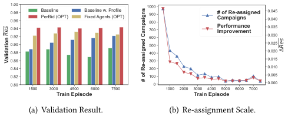

<!-- Start of picture text -->
1.000.980.960.940.92 BaselinePerBid (OPT) Baseline w. ProfileFixed Agents (OPT) 1000900800700600 # of Re-assignedCampaignsPerformanceImprovement 0.0450.0400.0350.030 0.90 500 0.025 0.88 400 0.020 0.86 300 0.015 0.84 200 0.010 0.82 100 0.005 0.80 0 0.000 1500 3000 4500 6000 7500 1000 2000 3000 4000 5000 6000 7000 Train Episode Train Episode (a) Validation Result. (b) Re-assignment Scale. Res Δ Res Validation # of Re-assigned Campaigns <!-- End of picture text -->

**Figure 6: Convergence analysis of different methods.** 

resources compared with single-agent approaches. In Figure 6(b), we show the evolvement of the campaign re-assignment scale from two aspects: the number of re-assigned campaigns and the average performance improvement after re-assignment at the end of each training iteration. At the beginning of training, over 30% of the ad campaigns are re-assigned, which greatly accelerates the convergence by improving the _𝑅𝑒𝑠_ by 0.046. As the training process continues, the re-assignment scale gradually converges, indicating that the automated bidding agents are becoming familiar with the specific advertising environment, and thus the clusters are settled. 

## **4.4 Online A/B Test** 

To further verify the effectiveness of PerBid, we have deployed it on Alibaba display advertising platform, comparing it with the baseline USCB [19] method. The online A/B test is conducted on 1% of the whole ad campaigns from July 27, 2022, to July 31, 2022, and the experiment settings are as follows: 1) We keep the strategy design of the two methods consistent by revising their status features with a fixed weight vector w, and omit the context features for a fair comparison. 2) We initialize three campaign clusters based on the value of offline _𝛽_∗ and generate three candidate automated bidding strategies. We further generate a default strategy trained with samples in all three clusters to serve the cold-start campaigns. 3) For the strategy matching process, we utilize the historical information of the last seven days to select the best candidate strategy. The results of the online A/B test show that PerBid can significantly improve the _𝑅𝑒𝑠_ by 8.02%, the _𝐺𝐺𝐹_ by 8.53%, and the _𝑅𝑒𝑠_ 0 _._ 3 by 10.85%, showing its effectiveness in optimizing overall performance and resolving unfairness. More detailed results and discussion are shown in supplementary material [2]. 

## **5 RELATED WORK** 

**Automated Bidding.** In online advertising, automated bidding has been widely studied [6, 27, 32, 43]. Zhang _et al._ [41] first proposed the linear form optimal bid with budget constraint, and the online bidding parameter adjustment can be achieved by either feedback control [42] or model-free RL [37]. Yang _et al._ extended the optimal bid to a multi-constraint scenario and adjust the parameters through multi-variable feedback control [38]. Recently, He _et al._ proposed USCB to solve constrained bidding with any constraints through RL [19]. Mou _et al._ combined online exploration and offline RL training to handle the inconsistency between online and offline ad systems [30]. Wang _et al._ leveraged Curriculum-Guided Bayesian RL in partially observable environments for ROI-constrained bidding [35]. Meanwhile, clustering techniques are widely used for 

designing automated bidding strategies. Lu _et al._ leveraged state clustering to aggregate sparse states when applying RL [26]. Jin _et al._ utilized advertiser and customer clustering to reduce the complexity of the multi-agent environment [23]. In sponsored search, ad/keyword clustering [10, 22] is used to avoid data sparsity. **Personalization in User-Side Services.** In recent years, personalization has become an important method to improve the quality of user-side services, including recommendation and click-through rate prediction [5, 17, 45], content generation [8, 9], and setting personalized promotions and discounts [4, 44]. To achieve personalization, these works tend to produce a task-specific user representation (profile), and then apply such representation to downstream tasks. In [17], Grbovic _et al._ utilized both users’ short-term click history and long-term conversion history along with users’ meta data to generate user-type embedding for personalized recommendation. Different from these works, the ad campaign profile we extract is mainly about the advertising environment. 

**Context-aware Reinforcement Learning.** To overcome the strong dynamicity of the environment and prevent redundant agent training, context-based meta-RL was proposed to provide the agent with a capacity to understand and adapt quickly to different tasks using prior experience on similar tasks. The context-based metaRL [16, 20, 28, 31] encodes the state transitions observed during task adaptation into a latent context variable to represent various tasks, and the action is taken not only based on the real-time observation but also on the context, which can further guide the policy when adapting to new tasks. Such context information was also leveraged in the scenario of model-based RL [3, 12, 24, 25]. In [25], Lee _et al._ proposed a context encoder for future-state prediction based on real-time state transition trajectories. Different from these works where the environment dynamic is settled for a specific task, the ad campaigns experience continuous advertising environment fluctuation, which brings uncertainty to ad auction results and then the state transitions. The uncertain state transitions recording only the development of the advertising status of a single ad campaign can hardly represent the whole environment. In this work, we use features collected from the advertising platform including campaign-level features and auction-level features to directly model the advertising environment. 

## **6 CONCLUSION** 

In this work, we reveal the unfairness issues in the automated bidding strategy service and analyze the main reasons behind it. To solve the unfairness among advertisers, we propose a personalized automated bidding framework. In this framework, we first propose an ad campaign profiling network to model the advertising environment, based on which we design context-aware automated bidding strategies. Then, we group ad campaigns into several clusters based on their profile and assign each cluster with a specific strategy. Finally, we propose a matching algorithm to match the heterogeneous campaigns with the most suitable strategies. We conduct comprehensive offline experiments on a real-world dataset and online A/B test to verify the effectiveness of the framework in improving average performance and solving unfairness issues. 

5552 

KDD ’23, August 6–10, 2023, Long Beach, CA, USA 

Haoqi Zhang et al. 

## **REFERENCES** 

- [1] 2023. Alibaba Display Advertising Platform. https://www.taobao.com/. 

- [2] 2023. Supplementary Material. https://drive.google.com/drive/folders/ 1BNxHELvfBfNmQQ45X7XyaNzdeuPhQT8d?usp=sharing. 

- [3] Anish Agarwal, Abdullah Alomar, Varkey Alumootil, Devavrat Shah, Dennis Shen, Zhi Xu, and Cindy Yang. 2021. PerSim: Data-Efficient Offline Reinforcement Learning with Heterogeneous Agents via Personalized Simulators. In _Advances in Neural Information Processing Systems_ , Vol. 34. Curran Associates, Inc., 18564– 18576. 

- [4] Javier Albert and Dmitri Goldenberg. 2022. E-Commerce Promotions Personalization via Online Multiple-Choice Knapsack with Uplift Modeling. In _Proceedings of the 31st ACM International Conference on Information & Knowledge Management_ . ACM, 2863–2872. 

- [5] Mikhail Bilenko and Matthew Richardson. 2011. Predictive Client-Side Profiles for Personalized Advertising. In _Proceedings of the 17th ACM SIGKDD International Conference on Knowledge Discovery and Data Mining_ . ACM, 413–421. 

- [6] Han Cai, Kan Ren, Weinan Zhang, Kleanthis Malialis, Jun Wang, Yong Yu, and Defeng Guo. 2017. Real-time bidding by reinforcement learning in display advertising. In _Proceedings of the Tenth ACM International Conference on Web Search and Data Mining_ . ACM, 661–670. 

- [7] Nicolo Cesa-Bianchi and Gabor Lugosi. 2006. _Prediction, Learning, and Games_ . Cambridge University Press, USA. 

- [8] Qibin Chen, Junyang Lin, Yichang Zhang, Hongxia Yang, Jingren Zhou, and Jie Tang. 2019. Towards Knowledge-Based Personalized Product Description Generation in E-Commerce. In _Proceedings of the 25th ACM SIGKDD International Conference on Knowledge Discovery & Data Mining_ . ACM, 3040–3050. 

- [9] Wen Chen, Pipei Huang, Jiaming Xu, Xin Guo, Cheng Guo, Fei Sun, Chao Li, Andreas Pfadler, Huan Zhao, and Binqiang Zhao. 2019. POG: Personalized Outfit Generation for Fashion Recommendation at Alibaba IFashion. In _Proceedings of the 25th ACM SIGKDD International Conference on Knowledge Discovery & Data Mining_ . ACM, 2662–2670. 

- [10] Ye Chen, Weiguo Liu, Jeonghee Yi, Anton Schwaighofer, and Tak W. Yan. 2013. Query Clustering Based on Bid Landscape for Sponsored Search Auction Optimization. In _Proceedings of the 19th ACM SIGKDD International Conference on Knowledge Discovery and Data Mining_ . ACM, 1150–1158. 

- [11] Kyunghyun Cho, B van Merrienboer, Caglar Gulcehre, F Bougares, H Schwenk, and Yoshua Bengio. 2014. Learning phrase representations using RNN encoderdecoder for statistical machine translation. In _Proceedings of the 2014 Conference on Empirical Methods in Natural Language Processing (EMNLP)_ . ACL, 1724–1734. 

- [12] Kurtland Chua, Roberto Calandra, Rowan McAllister, and Sergey Levine. 2018. Deep Reinforcement Learning in a Handful of Trials using Probabilistic Dynamics Models. In _Advances in Neural Information Processing Systems_ , Vol. 31. Curran Associates, Inc. 

- [13] Paul Covington, Jay Adams, and Emre Sargin. 2016. Deep neural networks for youtube recommendations. In _Proceedings of the 10th ACM Conference on Recommender Systems_ . ACM, 191–198. 

- [14] Virginie Do and Nicolas Usunier. 2022. Optimizing Generalized Gini Indices for Fairness in Rankings. In _Proceedings of the 45th International ACM SIGIR Conference on Research and Development in Information Retrieval_ . ACM, 737–747. 

- [15] Benjamin Edelman, Michael Ostrovsky, and Michael Schwarz. 2007. Internet advertising and the generalized second-price auction: Selling billions of dollars worth of keywords. _American economic review_ 97, 1 (2007), 242–259. 

- [16] Rasool Fakoor, Pratik Chaudhari, Stefano Soatto, and Alexander J. Smola. 2020. Meta-Q-Learning. In _International Conference on Learning Representations_ . 

- [17] Mihajlo Grbovic and Haibin Cheng. 2018. Real-Time Personalization Using Embeddings for Search Ranking at Airbnb. In _Proceedings of the 24th ACM SIGKDD International Conference on Knowledge Discovery & Data Mining_ . ACM, 311–320. 

- [18] Liyi Guo, Junqi Jin, Haoqi Zhang, Zhenzhe Zheng, Zhiye Yang, Zhizhuang Xing, Fei Pan, Lvyin Niu, Fan Wu, Haiyang Xu, et al. 2021. We Know What You Want: An Advertising Strategy Recommender System for Online Advertising. In _Proceedings of the 27th ACM SIGKDD Conference on Knowledge Discovery & Data Mining_ . ACM, 2919–2927. 

- [19] Yue He, Xiujun Chen, Di Wu, Junwei Pan, Qing Tan, Chuan Yu, Jian Xu, and Xiaoqiang Zhu. 2021. A Unified Solution to Constrained Bidding in Online Display Advertising. In _Proceedings of the 27th ACM SIGKDD Conference on Knowledge Discovery & Data Mining_ . ACM, 2993–3001. 

- [20] Jan Humplik, Alexandre Galashov, Leonard Hasenclever, Pedro A Ortega, Yee Whye Teh, and Nicolas Heess. 2019. Meta reinforcement learning as task inference. _CoRR_ abs/1905.06424 (2019). 

- [21] Raj Jain, Arjan Durresi, and Gojko Babic. 1999. Throughput fairness index: An explanation. In _ATM Forum contribution_ , Vol. 99. 

- [22] Cheng Jie, Da Xu, Zigeng Wang, Lu Wang, and Wei-Yuan Shen. 2021. Bidding via Clustering Ads Intentions: an Efficient Search Engine Marketing System for E-commerce. _ArXiv_ abs/2106.12700 (2021). 

- [23] Junqi Jin, Chengru Song, Han Li, Kun Gai, Jun Wang, and Weinan Zhang. 2018. Real-time bidding with multi-agent reinforcement learning in display advertising. In _Proceedings of the 27th ACM International Conference on Information and_ 

- _Knowledge Management_ . ACM, 2193–2201. 

- [24] Łukasz Kaiser, Mohammad Babaeizadeh, Piotr Miłos, Błażej Osiński, Roy H Campbell, Konrad Czechowski, Dumitru Erhan, Chelsea Finn, Piotr Kozakowski, Sergey Levine, et al. 2020. Model Based Reinforcement Learning for Atari. In _International Conference on Learning Representations_ . 

- [25] Kimin Lee, Younggyo Seo, Seunghyun Lee, Honglak Lee, and Jinwoo Shin. 2020. Context-aware dynamics model for generalization in model-based reinforcement learning. In _Proceedings of the 37th International Conference on Machine Learning_ . PMLR, 5757–5766. 

- [26] Junwei Lu, Chaoqi Yang, Xiaofeng Gao, Liubin Wang, Changcheng Li, and Guihai Chen. 2019. Reinforcement Learning with Sequential Information Clustering in Real-Time Bidding. In _Proceedings of the 28th ACM International Conference on Information and Knowledge Management_ . ACM, 1633–1641. 

- [27] Takanori Maehara, Atsuhiro Narita, Jun Baba, and Takayuki Kawabata. 2018. Optimal bidding strategy for brand advertising. In _Proceedings of the 27th International Joint Conference on Artificial Intelligence_ . AAAI Press, 424–432. 

- [28] Nikhil Mishra, Mostafa Rohaninejad, Xi Chen, and Pieter Abbeel. 2018. A Simple Neural Attentive Meta-Learner. In _International Conference on Learning Representations_ . 

- [29] Jeonghoon Mo and Jean Walrand. 2000. Fair end-to-end window-based congestion control. _IEEE/ACM Transactions on networking_ 8, 5 (2000), 556–567. 

- [30] Zhiyu Mou, Yusen Huo, Rongquan Bai, Mingzhou Xie, Chuan Yu, Jian Xu, and Bo Zheng. 2022. Sustainable Online Reinforcement Learning for Auto-bidding. In _Advances in Neural Information Processing Systems_ . 

- [31] Kate Rakelly, Aurick Zhou, Chelsea Finn, Sergey Levine, and Deirdre Quillen. 2019. Efficient off-policy meta-reinforcement learning via probabilistic context variables. In _Proceedings of the 36th International Conference on Machine Learning_ . PMLR, 5331–5340. 

- [32] Kan Ren, Weinan Zhang, Ke Chang, Yifei Rong, Yong Yu, and Jun Wang. 2017. Bidding machine: Learning to bid for directly optimizing profits in display advertising. _IEEE Transactions on Knowledge and Data Engineering_ 30, 4 (2017), 645–659. 

- [33] Amartya Sen, Master Amartya Sen, James Eric Foster, Sen Amartya, James E Foster, et al. 1997. _On economic inequality_ . Oxford university press. 

- [34] Umer Siddique, Paul Weng, and Matthieu Zimmer. 2020. Learning Fair Policies in Multi-Objective (Deep) Reinforcement Learning with Average and Discounted Rewards. In _Proceedings of the 37th International Conference on Machine Learning_ . PMLR, 8905–8915. 

- [35] Haozhe Wang, Chao Du, Panyan Fang, Shuo Yuan, Xuming He, Liang Wang, and Bo Zheng. 2022. ROI-Constrained Bidding via Curriculum-Guided Bayesian Reinforcement Learning. In _Proceedings of the 28th ACM SIGKDD Conference on Knowledge Discovery and Data Mining_ . ACM, 4021–4031. 

- [36] John A Weymark. 1981. Generalized Gini inequality indices. _Mathematical Social Sciences_ 1, 4 (1981), 409–430. 

- [37] Di Wu, Xiujun Chen, Xun Yang, Hao Wang, Qing Tan, Xiaoxun Zhang, Jian Xu, and Kun Gai. 2018. Budget constrained bidding by model-free reinforcement learning in display advertising. In _Proceedings of the 27th ACM International Conference on Information and Knowledge Management_ . ACM, 1443–1451. 

- [38] Xun Yang, Yasong Li, Hao Wang, Di Wu, Qing Tan, Jian Xu, and Kun Gai. 2019. Bid optimization by multivariable control in display advertising. In _Proceedings of the 25th ACM SIGKDD International Conference on Knowledge Discovery & Data Mining_ . ACM, 1966–1974. 

- [39] Yong Yu, Xiaosheng Si, Changhua Hu, and Jianxun Zhang. 2019. A review of recurrent neural networks: LSTM cells and network architectures. _Neural computation_ 31, 7 (2019), 1235–1270. 

- [40] Qianqian Zhang, Xinru Liao, Quan Liu, Jian Xu, and Bo Zheng. 2022. Leaving No One Behind: A Multi-Scenario Multi-Task Meta Learning Approach for Advertiser Modeling. In _Proceedings of the Fifteenth ACM International Conference on Web Search and Data Mining_ . ACM, 1368–1376. 

- [41] Weinan Zhang, Kan Ren, and Jun Wang. 2016. Optimal real-time bidding frameworks discussion. _CoRR_ abs/1602.01007 (2016). 

- [42] Weinan Zhang, Yifei Rong, Jun Wang, Tianchi Zhu, and Xiaofan Wang. 2016. Feedback control of real-time display advertising. In _Proceedings of the Ninth ACM International Conference on Web Search and Data Mining_ . ACM, 407–416. 

- [43] Weinan Zhang, Shuai Yuan, and Jun Wang. 2014. Optimal real-time bidding for display advertising. In _Proceedings of the 20th ACM SIGKDD International Conference on Knowledge Discovery and Data Mining_ . ACM, 1077–1086. 

- [44] Qi Zhao, Yi Zhang, Daniel Friedman, and Fangfang Tan. 2015. E-Commerce Recommendation with Personalized Promotion. In _Proceedings of the 9th ACM Conference on Recommender Systems_ . ACM, 219–226. 

- [45] Guorui Zhou, Xiaoqiang Zhu, Chenru Song, Ying Fan, Han Zhu, Xiao Ma, Yanghui Yan, Junqi Jin, Han Li, and Kun Gai. 2018. Deep interest network for click-through rate prediction. In _Proceedings of the 24th ACM SIGKDD International Conference on Knowledge Discovery & Data Mining_ . ACM, 1059–1068. 

- [46] Matthieu Zimmer, Claire Glanois, Umer Siddique, and Paul Weng. 2021. Learning fair policies in decentralized cooperative multi-agent reinforcement learning. In _Proceedings of the 38th International Conference on Machine Learning_ . PMLR, 12967–12978. 

5553 

