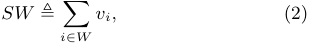
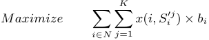
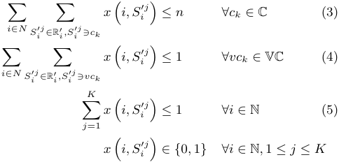
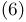
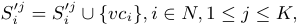
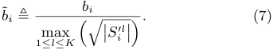
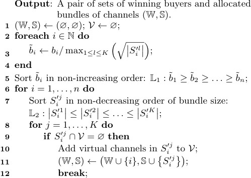
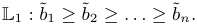
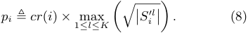

# **SMASHER: A Strategy-Proof Combinatorial Auction Mechanism for Heterogeneous Channel Redistribution** _∗_ 

Zhenzhe Zheng, Fan Wu_†_ , and Guihai Chen Shanghai Key Laboratory of Scalable Computing and Systems Department of Computer Science and Engineering 

Shanghai Jiao Tong University, China 

zhengzhenzhe@sjtu.edu.cn, {fwu,gchen}@cs.sjtu.edu.cn 

## **ABSTRACT** 

Auction is believed to be an effective way to solve or relieve the problem of radio spectrum shortage, by dynamically redistributing idle wireless channels of primary users to secondary users. However, to design a practical channel auction mechanism, we have to consider five challenges, including strategy-proofness, channel spatial reusability, channel heterogeneity, bid diversity, and social welfare maximization. Unfortunately, none of the existing works fully considered the five design challenges. In this paper, we present the first in-depth study on the problem of dynamic channel redistribution by jointly considering the five design challenges, and present SMASHER, which is a <u>Strategy-</u> proof coMbinatorial Auction mechaniSm for HEterogeneous channel Redistribution. Our analyses show that SMASHER achieves both strategy-proofness and approximately efficient social welfare. 

## **Categories and Subject Descriptors** 

C.2.1 [ **Computer-Communication Networks** ]: Network Architecture and Design – _Wireless Communication_ 

## **General Terms** 

Algorithm, Design, Economic 

## **Keywords** 

Channel Allocation; Combinatorial Auction 

> _†_ F. Wu is the corresponding author. 

_∗_ This work was supported in part by the State Key Development Program for Basic Research of China (Grant No. 2012CB316201), in part by China NSF grant 61272443, 61133006, 61073152, and in part by Shanghai Science and Technology fund 12PJ1404900 and 12ZR1414900. The opinions, findings, conclusions, and recommendations expressed in this paper are those of the authors and do not necessarily reflect the views of the funding agencies or the government. 

Permission to make digital or hard copies of all or part of this work for personal or classroom use is granted without fee provided that copies are not made or distributed for profit or commercial advantage and that copies bear this notice and the full citation on the first page. Copyrights for components of this work owned by others than ACM must be honored. Abstracting with credit is permitted. To copy otherwise, or republish, to post on servers or to redistribute to lists, requires prior specific permission and/or a fee. Request permissions from permissions@acm.org. _MobiHoc’13,_ July 29–August 1, 2013, Bangalore, India. Copyright 2013 ACM 978-1-4503-2193-8/13/07 ...$15.00. 

## **1. INTRODUCTION** 

The last two decades have witnessed a rapid development of wireless communication technology. Unfortunately, naturally limited radio spectrum is becoming a more and more serious bottleneck of the ongoing growth of wireless applications and services. Most of the countries have specific departments to regulate spectrum usage, _e.g._ , Federal Communications Commission (FCC) in the US and Radio Administration Bureau (RAB) in China. They statically allocate spectrum to wireless application service providers on a long term basis for large geographical regions. Such static management leads to low spectrum utilization in the spatial and temporal dimensions. Large chunks of radio spectrum are left idle most of the time at a lot of places, while new wireless applications are starving for the radio spectrum. Therefore, an open and market-based framework is highly needed to dynamically redistribute the radio spectrum, and thus improve the utilization of the radio spectrum. 

Auctions are the most well-known market-based mechanisms to redistribute resources [3]. Since 1994, FCC has conducted a series of auctions for the licenses of radio spectrum. While FCC auctions target at large wireless service providers, our focus is on small wireless applications, such as community wireless networks or home wireless networks. There exist many challenges in designing a practical channel auction mechanism. We list five major challenges: 

- _Strategy-Proofness_ : In strategy-proof auction mechanisms, simply submitting truthful channel demands ( _e.g._ , valuation of the channels) maximizes each participant’s utility. Since the participants are normally rational and selfish, they always tend to strategically manipulate the auction, if doing so can increase their utilities. Therefore, it discourages truthfully behaving participants from joining the auction, if strategyproofness is not guaranteed. 

- _Spatial Reusability_ : Spatial reusability differentiates the wireless channels from conventional goods. Two wireless users can use the same wireless channel simultaneously, if they are well-separated. 

- _Channel Heterogeneity_ : Channel heterogeneity comes from both _spatial heterogeneity_ and _frequency heterogeneity_ . On one hand, the availability and quality of a channel vary at different locations. On the other hand, channels with different central frequency may have different propagation and penetration characteristics. 

- _Bid Diversity_ : Wireless devices may be equipped with multiple radios, each of which can work on a distinguished channel at the same time. Consequently, a 

305 

wireless user may request multiple bundles of channels, according to her quality of service requirement. Buyers have higher opportunities to obtain channels by submitting diverse bids, which makes the channel redistribution more flexible. Therefore, it is necessary to allow users to express diverse demands for channels. 

- _Social Welfare_ : The objective of any auction is to maximize social welfare, which is the sum of the auction winners’ valuations of the allocated goods. 

A number of related works ( _e.g._ , [1,2,4–6,8–10]) exist in the literature. Unfortunately, none of these works fully consider the five design challenges. Some of strategy-proof channel auction mechanisms ( _e.g._ , VEARITAS [8], TRUST [9], SMALL [5]) consider channel spatial reusability, but only work when the trading channels are homogenous. Two recent works TAHES [2] and CRWDP [1] consider channels’ heterogeneity, but TAHES restricts each user to bid for a single channel while CRWDP ignores the spatial reusability of channels. 

In this paper, we conduct an in-depth study on the problem of dynamic channel redistribution by jointly considering the five design challenges, and present SMASHER, which is a Strategy-proof coMbinatorial Auction mechaniSm for <u>HEterogeneous</u> channel <u>Redistribution.</u> SMASHER is a novel combinatorial auction mechanism for indivisible heterogeneous channel redistribution, and achieves both strategyproofness and approximately efficient social welfare. We make the following contributions in this paper: 

- First, we present a general model of combinatorial auction for heterogeneous channel redistribution. The auction model is powerful enough to express channel spatial reusability and heterogeneity, as well as bid diversity. 

- Second, we introduce the concept of _virtual channel_ to capture the conflict of channel usage among different auction participants. By using virtual channels, we transform the problem of heterogeneous channel allocation to a classic multi-unit combinatorial auction. 

- Third, we propose SMASHER, which is a combinatorial auction mechanism for heterogeneous channel redistribution, achieving both strategy-proofness and approximately efficient social welfare. 

## **2. PRELIMINARIES AND PROBLEM FORMULATION** 

In this section, we present the auction model for the problem of heterogeneous channel allocation. 

## **2.1 Auction Model** 

We consider a static scenario, in which there is a primary spectrum user, called “seller”, who wants to lease out her temporarily unused wireless channels, and some secondary users ( _e.g._ , WiFi access points), called “buyers”, who want to lease channels to provide services to their customers at certain quality of service (QoS). We consider that the channels for leasing are _heterogeneous_ , and thus the buyers have their own preference over the channels due to spatial variance ( _e.g._ , background noise, temperature, and landform). Since wireless devices can be equipped with multiple radios, the buyers may request more than one channel according to their requirements of QoS. Considering the diversity of 

QoS demand and heterogeneity of the channels, we allow the buyers to submit multiple channel requests, among which one of the requests can be granted. We assume that the buyers have uniform valuation over any of their channel requests, because the buyers’ requirement of QoS can be satisfied if one of their requested bundles is allocated. Different from the allocation of traditional goods, wireless channels can be spatially reused, meaning that well-separated buyers can work on the same channel simultaneously, if they do not have interference between each other. 

We model the process of heterogeneous channel redistribution as a sealed-bid combinatorial auction, in which buyers simultaneously submit their demands for channels to a trustworthy auctioneer, such that no buyer can know other participants’ information. The auctioneer makes the decision on channel allocation and the charge to each winner. We denote the set of orthogonal and heterogeneous channels for leasing by C ≜ _{c_ 1 _, c_ 2 _, . . . , cm}_ , and the set of buyers by N ≜ _{_ 1 _,_ 2 _, . . . , n}_ . We list useful notations in our model of combinatorial channel auction as follows: 

_Channel Request Ri_ : Each buyer _i ∈_ N submits a vector of requested channel bundles _Ri_ ≜ � _Si_1_, S_ _i_2_, . . . , S_ _i__K_ � to the auctioneer. Any channel bundle _Si__j⊆_C_,_1_≤j≤K_cansatisfy her QoS. We assume that buyer’s request is strict, meaning that the buyer is only interested in winning a whole bundle _Si__j_inherrequestvector.Wecallabuyer,whosubmitsa request vector of _K_ channel bundles, and is interested in winning one of the bundles, as _K_ -minded buyer. If _K_ = 1, then the buyer is single-minded. Note that our auction model is a generalization of existing models with single-minded buyers ( _e.g._ , [1, 2]). We denote the channel request vector _⃗_ R of all the buyers as _⃗_ R ≜ ( _R_ 1 _, R_ 2 _, . . . , Rn_ ) _._ 

_Valuation vi_ : Each buyer _i ∈_ N has an uniform valuation _vi_ over any requested channel bundles in _Ri_ . Here, _vi_ is the private information of the buyer _i_ . This is also known as _type_ in mechanism design. We denote the valuation vector V of all the buyers as _⃗_ V ≜ ( _v_ 1 _, v_ 2 _, . . . , vn_ ) _._ 

_Bid bi_ : Each buyer _i ∈_ N submits a bid _bi_ to the auctioneer, meaning that if she wins any channel bundle _Si__j_,she would like to pay no more than _bi_ for it. Here, the bid _bi_ may not necessarily be equal to her valuation _vi_ . Let vector B represent the bids of all the buyers _⃗_ B ≜ ( _b_ 1 _, b_ 2 _, . . . , bn_ ) _._ 

_Clearing price pi_ : The auctioneer charges each winning buyer _i ∈_ N a clearing price _pi_ . The loser in the auction is free of any charge. We use vector _⃗_ P ≜ ( _p_ 1 _, p_ 2 _, . . . , pn_ ) to represent the clearing prices of all the buyers. 

_Utility ui_ : The utility of a buyer _i ∈_ N in the auction is defined as the difference between her valuation on the bundle of channels she wins and her clearing price _pi_ : _ui_ ≜ _vi − pi._ (1) 

We consider that the buyers are rational and selfish, thus their goals are to maximize their own utilities. In contrast to the buyers, the auctioneer’s objective is to maximize _social welfare_ . Here social welfare is defined as follows: 

Definition 1 (Social Welfare). _The social welfare in a channel auction is the sum of winning buyers’ valuations on their allocated bundles of channels,_ i.e. _,_ 

_where W is the set of winners._ 

306 

In this paper, we assume that buyers do not collude with each other and do not cheat about their channel bundles, while leaving these problems to our future works. 

## **3. MULTI-UNIT COMBINATORIAL CHANNEL AUCTION** 

Different from existing works on strategy-proof channel allocation, we introduce a novel concept of _virtual channel_ to represent the conflict of channel usage among the buyers. By introducing virtual channels, we transform the problem of heterogeneous channel allocation to a classic multi-unit combinatorial auction. 

## **3.1 Virtual Channel** 

We introduce _virtual channel_ to capture the interference among the buyers on different channels. Specifically, a virtual channel _vc__k_ _i,j_denotesthatthebuyer_i_andthebuyer _j_ may cause interference between each other on channel _ck_ , and thus they cannot work on channel _ck_ simultaneously. Since virtual channel _vc__k_ _i,j_representstheexclusiveusageof channel _ck_ between the buyer _i_ and _j_ , its quantity is set to 1. When virtual channel _vc__k_ _i,j_is added to the requested bun- dle(s) that contains channel _ck_ from the buyer _i_ and _j_ , at most one of the requests containing channel _ck_ from the two buyers can be granted. Consequently, the exclusive usage of channel _ck_ between the buyer _i_ and _j_ is guaranteed. We present the definition of virtual channel as follows. 

Definition 2 (Virtual Channel). _There is a virtual channel vc__k_ _i,j__,ifthebuyeriandbuyerjarewithinthein-_ _terference range of each other on channel ck._ 

In most of existing works on channel auction, a single conflict graph is used to represent the interference among buyers. However, in the case of heterogeneous channels, each channel may have a distinctive conflict graph. Let _Gk_ ≜ ( _Ok, Ek_ ) denote the conflict graph on channel _ck_ , where _Ok ⊆_ N is the set of buyers who can access channel _ck_ , and each edge ( _i, j_ ) _∈ Ek_ represents the interference between the buyer _i_ and _j_ on channel _ck_ . Since conflict graph is commonly assumed to be available in wireless networks, we construct the virtual channel from conflict graph. We create a virtual channel _vc__k_ _i,j_,ifthereis an edge between the buyer _i_ and _j_ in conflict graph _Gk_ , and append _vc__k_ _i,j_totherequestedbundle(s)containingchannel _ck_ from the buyer _i_ and _j_ , while remaining the corresponding bids unchanged. Let VC be the set of virtual channels and R_′_ be the vector of updated requests with virtual channels. 

## **3.2 Multi-Unit Combinatorial Auction** 

Given the virtual channel introduced in last section, we are ready to transform the problem of heterogenous channel allocation to a classic multi-unit combinatorial auction. 

The goods in the multi-unit combinatorial auction are the channels and virtual channels. The quantities of each channel _ck ∈_ C and virtual channel _vc__k_ _i,j__∈_VCare_n_and1, respectively. Let _x_ � _i, Si__′j_ � = 1 denote that the channel set _Si__′j_isgrantedtothebuyer_i_;otherwise,_x_ � _i, Si__′j_ � = 0. The process of winner determination can be modeled as a binary program. The objective is to maximize the social welfare. We use _bi_ , instead of _vi_ , because the strategy-proof mechanism shown in later sections will guarantee that bidding truthfully is the dominate strategy of each buyer _i ∈_ N. 

_Objective:_ 

_Subject to:_ 

If the optimal social welfare can be achieved by solving the above binary program, then the celebrated VCG mechanism can be applied to calculate the clearing price that can ensure the strategy-proofness of the auction mechanism. Unfortunately, the above winner determination problem can be proven to be NP-hard by reducing to the _exact cover_ problem. Considering the computational intractability of the winner determination problem, we integrate a greedy allocation algorithm with a novel pricing mechanism to provide a strategy-proof and approximately efficient combinatorial auction mechanism for heterogeneous channel redistribution in next section. 

## **4. HETEROGENEOUS CHANNEL REDISTRIBUTION** 

As shown in Section 3.2, finding the optimal auction decision is computationally intractable. In this section, we present SMASHER, which is a strategy-proof and approximately efficient combinatorial auction mechanism for heterogenous channel redistribution. 

## **4.1 Design of SMASHER** 

SMASHER consists of the following three major components: virtual channel generation, winner determination, and clearing price calculation. 

### _4.1.1 Virtual Channel Generation_ 

The process of virtual channel generation is the same as the method discussed in Section 3.1, except that we add one more virtual channel _vci_ with unit quantity to each requested bundle of buyer _i ∈ N_ . Virtual channel _vci_ is used to ensure that at most one of the requested bundles from the buyer _i_ can be granted. 

where _Si__′j_isupdatedbundlewithvirtualchannels. 

### _4.1.2 Winner Determination_ 

Before presenting the approximation algorithm for winner determination, we introduce _virtual bid_ . The uniform virtual bid˜ _bi_ over any of requested bundles from the buyer _i_ is defined as 

307 

**Algorithm 1** : Approximation Algorithm for Winner Determination 

- **Input** : Vector of updated channel requests _⃗_ R_′_ , vector of bids _⃗_ B. 

**13 end 14 end 15 end 16 return** (W _,_ S); 

SMASHER sorts all the buyers according to their virtual bids in non-increasing order: 

In case of a tie, SMASHER breaks the tie following a bidindependent rule, such as lexicographic order of buyers’ ID and channel number. 

Following the order in L1, SMASHER greedily grants the smallest channel bundle, in which no virtual channel has already been allocated, to each buyer. 

Algorithm 1 shows the pseudo-code of above winner determination process. In practice, the number of buyers _n_ is much larger than _K_ , thus the time complexity of Algorithm 1 is _O_ ( _n_ log _n_ ). 

### _4.1.3 Clearing Price Calculation_ 

The clearing price is calculated based on _critical virtual bid_ . 

Definition 3 (Critical Virtual Bid). _The critical virtual bid cr_ ( _i_ ) _∈_ L1 _of buyer i ∈_ N _is the minimum virtual bid that the buyer i must exceed to be allocated one of her channel bundles._ 

We note that according to the definition of critical virtual bid, no matter which request of the buyer _i_ is granted in the auction, the critical virtual bid _cr_ ( _i_ ) is always the same. 

The critical virtual bid of the buyer _i ∈_ N can be calculated by the following procedure. Given other buyers’ requests and bids R_′_ _−i__,⃗_B_−i_ , we greedily select virtual bid by � � rerunning Algorithm 1 until none of the buyer _i_ ’s requests can be satisfied. The threshold virtual bid _cr_ ( _i_ ) we select finally is regarded as the critical virtual bid of the buyer _i_ . We now show the method of calculating the clearing price of the buyer _i_ by distinguishing two cases: 

1. If the buyer _i_ loses the auction or _cr_ ( _i_ ) does not exist (denoted by _cr_ ( _i_ ) = 0), then her clearing price is 0. 

2. If the buyer _i_ is granted channel bundle _S_ˆ _i__′j_andthere exists a critical virtual bid _cr_ ( _i_ ), the clearing price _pi_ of the buyer _i_ is set to 

## **4.2 Analysis** 

We prove the strategy-proofness and analyze the approximation ratio of SMASHER in this section. 

Theorem 1. _SMASHER is a strategy-proof combinatorial auction mechanism for heterogeneous indivisible channel redistribution._ 

Theorem 2. _The approximation ratio of SMASHER is O_ ( _n__~~√~~_ _<u>m</u>_ <u>)</u> _, where n is the number of buyers, m is the number of channels._ 

We leave the detailed proofs in our technical report [7]. 

## **5. CONCLUSION** 

In this paper, we have made an in-depth study on channel redistribution problem by jointly considering the five design challenges. We have presented a strategy-proof combinatorial auction mechanism for dynamic heterogeneous channel redistribution, namely SMASHER. Our analyses show that SMASHER achieves strategy-proofness and approximately efficient social welfare. 

## **6. REFERENCES** 

- [1] M. Dong, G. Sun, X. Wang, and Q. Zhang. Combinatorial auction with time-frequency flexibility in cognitive radio networks. In _INFOCOM_ , 2012. 

- [2] X. Feng, Y. Chen, J. Zhang, Q. Zhang, and B. Li. TAHES: Truthful double auction for heterogeneous spectrums. In _INFOCOM_ , 2012. 

- [3] J. Huang, R. A. Berry, and M. L. Honig. Auction-based spectrum sharing. _Mobile Networks and Applications_ , 11(3):405–418, 2006. 

- [4] J. Jia, Q. Zhang, Q. Zhang, and M. Liu. Revenue generation for truthful spectrum auction in dynamic spectrum access. In _MobiHoc_ , 2009. 

- [5] F. Wu and N. Vaidya. SMALL: A strategy-proof mechanism for radio spectrum allocation. In _INFOCOM_ , 2011. 

- [6] P. Xu, S. Wang, and X.-Y. Li. SALSA: Strategyproof online spectrum admissions for wireless networks. _IEEE Transactions on Computers_ , 59(12):1691 –1702, 2010. 

- [7] Z. Zheng, F. Wu, and G. Chen. SMASHER: Strategy-proof combinatorial auction mechanisms for heterogeneous channel redistribution. Technical report, available at `http://www.cs.sjtu.edu.cn/ ~fwu/res/Paper/ZWC12TRSMASHER.pdf` , 2012. 

- [8] X. Zhou, S. Gandhi, S. Suri, and H. Zheng. eBay in the sky: Strategy-proof wireless spectrum auctions. In _MobiCom_ , 2008. 

- [9] X. Zhou and H. Zheng. TRUST: A general framework for truthful double spectrum auctions. In _INFOCOM_ , 2009. 

- [10] X. Zhou and H. Zheng. Breaking bidder collusion in large-scale spectrum auctions. In _MobiHoc_ , 2010. 

308 

