# **Unknown Combinatorial Auction Mechanisms for Heterogeneous Spectrum Redistribution** _∗_ 

Zhenzhe Zheng_†_ , Fan Wu_†_ , Shaojie Tang_§_ , and Guihai Chen_†_ _†_ Shanghai Key Laboratory of Scalable Computing and Systems, Shanghai Jiao Tong University, China _§_ Department of Information Systems, University of Texas at Dallas, USA {zhengzhenzhe,wu-fan}@sjtu.edu.cn, tangshaojie@gmail.com, gchen@cs.sjtu.edu.cn 

## **ABSTRACT** 

With the growing deployment of wireless communication technologies, radio spectrum is becoming a scarce resource. Auctions are believed to be among the most effective tools to solve or relieve the problem of radio spectrum shortage. However, designing a practical spectrum auction mechanism has to consider five major challenges: strategic behaviors of unknown users, channel heterogeneity, preference diversity, channel spatial reusability, and social welfare maximization. Unfortunately, none of existing work fully considered these five challenges. In this paper, we model the problem of heterogeneous spectrum allocation as a combinatorial auction, and propose AEGIS, which is the first framework of unknown combinatorial <u>Auction mEchanisms</u> for heteroGeneous spectrum redIStribution. AEGIS contains two mechanisms, namely AEGIS-SG and AEGIS-MP. AEGIS-SG is a direct revelation combinatorial spectrum auction mechanism for unknown single-minded users, achieving strategy-proofness and approximately efficient social welfare. We further design an iterative ascending combinatorial auction, namely AEGIS-MP, to adapt to the scenario with unknown multi-minded users. AEGIS-MP is implemented in a set of undominated strategies and has a good approximation ratio. We evaluate AEGIS on two practical datasets: Google Spectrum Database and GoogleWiFi. Evaluation results show that AEGIS achieve much better performance than the state-of-the-art mechanisms. 

### _†_ F. Wu is the corresponding author. 

_∗_ This work was supported in part by the State Key Development Program for Basic Research of China (973 project 2014CB340303 and 2012CB316201), in part by China NSF grant 61272443 and 61133006, in part by Shanghai Science and Technology fund 12PJ1404900 and 12ZR1414900, and in part by Program for Changjiang Scholars and Innovative Research Team in University (IRT1158, PCSIRT) China. The opinions, findings, conclusions, and recommendations expressed in this paper are those of the authors and do not necessarily reflect the views of the funding agencies or the government. 

Permission to make digital or hard copies of all or part of this work for personal or classroom use is granted without fee provided that copies are not made or distributed for profit or commercial advantage and that copies bear this notice and the full citation on the first page. Copyrights for components of this work owned by others than ACM must be honored. Abstracting with credit is permitted. To copy otherwise, or republish, to post on servers or to redistribute to lists, requires prior specific permission and/or a fee. Request permissions from permissions@acm.org. _MobiHoc’14,_ August 11–14, 2014, Philadelphia, PA, USA. Copyright 2014 ACM 978-1-4503-2620-9/14/08 ...$15.00. http://dx.doi.org/10.1145/2632951.2632964 . 

## **Categories and Subject Descriptors** 

C.2.1 [ **Computer-Communication Networks** ]: Network Architecture and Design – _Wireless Communication_ 

## **Keywords** 

Channel Allocation; Combinatorial Auction 

## **1. INTRODUCTION** 

The fast development of wireless networks and mobile communications is exhausting the limited radio spectrum resource. However, currently, almost all spectrum is statically allocated to large service providers on a long term basis for large geographical regions, which is reflected in the radio regulations published by the International Telecommunication Union (ITU) [11]. Such static spectrum management leads to low utilization in spatial and temporal dimensions. On one hand, many spectrum owners ( _i.e._ , primary users) are willing to lease out their idle spectrum and obtain proper profit. On the other hand, new wireless applications ( _i.e._ , secondary users), starving for spectrum, would like to pay for using the spectrum. Therefore, an open and market-based framework is highly needed to redistribute the idle spectrum, and thus improve the utilization of spectrum. Spectrum Bridge [25] is an emerging platform that provides services for buying, selling, and leasing idle spectrum. 

Due to the fairness and allocation efficiency, auctions are attractive market-based mechanisms to distribute resources. Examples include FCC spectrum license auctions in the Unite States [6], and auctions for UMTS [16] and LTE [18] in Europe. While these auctions target only at large wireless service providers, our focus is secondary spectrum markets of small wireless applications, such as community wireless networks and home wireless networks. 

Designing a feasible and practical spectrum auction has its own challenges. The first major challenge comes from the strategic behaviors of rational and selfish wireless users. In practical spectrum auctions, selfish users can not only misreport their valuations, but also their channel demands, to increase their utilities. We call them _unknown users_ when both the valuations and channel demands are private information. The model of unknown users does not fall into the family of conventional mechanism design with one-parameter domains [1], and has not been considered in any of the existing work for spectrum auctions. 

Another design challenge is to consider both the channel heterogeneity and preference diversity. The channel heterogeneity comes from both spatial heterogeneity and frequency heterogeneity. On one hand, the availability and quality of spectrum vary at different locations. On the other hand, spectrum resided in different frequency bands may have different propagation and penetration characteristics. Due to 

3 

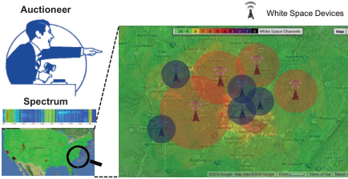

<!-- Start of picture text -->
Auctioneer ������������������� Spectrum <!-- End of picture text -->

**Figure 1: Heterogeneous TV White Space spectrum redistribution based on combinatorial auctions.** 

the heterogeneity of channels, users may have diverse preferences on different combinations of heterogeneous channels. For instance, a secondary user may be likely to have a valuation for some paired channels to provide LTE-based services, and have another different valuation for unpaired channels to support WiMax services. Therefore, it is necessary to allow users to express different valuations on multiple channel bundles. Considering the channel heterogeneity and preference diversity, it is natural to model the market of heterogeneous spectrum redistribution as a combinatorial auction. However, spectrum is different from traditional goods due to its spatial reusability, by which well-separated users can be allocated on the same spectrum band simultaneously. Thus, traditional combinatorial auction mechanisms cannot be directly applied to spectrum auctions. Figure 1 shows a combinatorial auction mechanism for TV white space spectrum redistribution. The TV white spaces has both spatially and frequency heterogeneity. White space devices at different locations can access to different available white spaces, and have distinct permissive maximum power, adjacent channel interference and noise floor. The frequency of TV broadband ranges from 54MHz to 806Mhz, leading to various frequency characteristics of different white spaces. 

The last but not least design challenge is the basic and common objective of auctions: maximizing social welfare, which is defined as the sum of winners’ valuations on allocated goods (Please refer to Section 3.2 for the definition). However, finding the optimal social welfare in combinatorial spectrum auctions is normally computationally intractable. 

In this paper, we conduct an in-depth study on the problem of dynamic spectrum redistribution, jointly considering the above challenges. We propose a family of unknown combinatorial Auction mEchanisms for heteroGeneous spectrum redIStribution (AEGIS). AEGIS contains two mechanisms, namely AEGIS-SG and AEGIS-MP. Specifically, AEGIS-SG is a direct revelation combinatorial auction for _unknown single minded_ users, achieving both strategy-proofness (Please refer to Section 3.3 for the definition) and a good approximation ratio. AEGIS-MP is a novel iterative ascending combinatorial auction for _unknown multiple minded_ users. AEGIS-MP achieves approximately efficient social welfare, and is implemented in undominated strategies, which is an important solution concept from game theory (Please refer to Section 3.3 for the definition). To the best of our knowledge, AEGIS is the first combinatorial auction framework considering spectrum redistribution among unknown users. We summarize our contributions in this paper as follows. _•_ First, we propose a general combinatorial auction model for the problem of heterogeneous spectrum redistribution, and use the concept of virtual channel to capture the conflict of channel usage among wireless users. This general 

model is powerful enough to express channel heterogeneity and spatial reusability, as well as preference diversity. 

_•_ Second, we begin with considering a simple but classical setting with unknown single minded users, and propose AEGIS-SG, which is a strategy-proof and approximately efficient combinatorial auction mechanism for heterogeneous channel redistribution. 

_•_ Third, we further extend this work by considering a more general case, in which users are _unknown multiple minded_ . We propose a novel iterative ascending combinatorial auction mechanism, namely AEGIS-MP, which is an algorithmic implementation in undominated strategies, and achieves approximately efficient social welfare. 

_•_ Last but not least, we evaluate the performance of AEGIS based on two practical datasets, Google Spectrum Database and GoogleWiFi, and compare AEGIS with the state-of-theart mechanisms. Our evaluation results show that AEGIS achieves superior performance in terms of social welfare, revenue, user satisfaction ratio, and channel utilization. The rest of this paper is organized as follows. In Section 2, we review related work. In Section 3, we present the model of combinatorial auction for heterogeneous spectrum redistribution. In Section 4, we propose AEGIS-SG for the case with unknown single minded users. We further consider the case with unknown multiple minded users, and propose AEGIS-MP in Section 5. The evaluation results are presented in Section 6. We conclude the paper in Section 7. 

## **2. RELATED WORK** 

In recent years, designing auction mechanisms for spectrum redistribution attracts increasing interests [5,7,29,31, 33]. Unfortunately, none of these mechanisms fully consider the above design challenges. Some of the spectrum auction mechanisms ( _e.g._ , VERITAS [31] and TRUST [33]) consider channel spatial reusability, but fail in heterogeneous channel scenarios. Recent work CRWDP [5], TAHES [7] and SMASHER [29] consider channel heterogeneity, but CRWDP ignores channel spatial reusability, while TAHES and SMASHER have simple valuation formats. Furthermore, these mechanisms only prevent users from misreporting their valuations to manipulate the auction, and always assume that the channel demands are publicly known to the auctioneer. However, in practice, users can further improve their utilities by cheating on their channel demands. In this work, we design heterogeneous spectrum auction mechanisms, considering both channel spatial reusability and diverse valuation formats. To some extent, our mechanisms are resistant to both valuations and channel demands cheating behaviors. 

There are some other related work on spectrum auctions mechanism design, _e.g._ , online spectrum auction [28], revenue generation [15] and spectrum auction with multiple auctioneers [8] Besides auction theory, some other powerful tools, _e.g._ , contract theory [24], queueing theory [13], and randomized algorithm [10], have been applied to different scopes in spectrum markets design. 

Another category of related work is combinatorial auction mechanism design. Dobzinski [4] and Papadimitriou _et al._ [23] proved that optimal social welfare and strategyproofness cannot be achieved simultaneously in general combinatorial auctions. Considering the intractability of combinatorial auctions, a number of strategy-proof auction mechanisms with well bounded approximation ratios are proposed [1, 3, 20]. There are still no positive results (computationally efficient, deterministic and strategy-proof mechanisms with good social welfare approximation) to combinatorial auctions with unknown multi-minded buyers. Our design is based on the iterative wrapper technique for unknown combinatorial auction mechanism [2]. However, none 

4 

of the above combinatorial auctions considered the spectrum spatial reusability. 

## **3. PRELIMINARIES AND PROBLEM FORMULATION** 

In this section, we first describe network and auction model for the problem of heterogeneous channel redistribution, and then review related solution concepts used in this paper from game theory. At last, we formulate the channel allocation problem as a classic weighted set packing problem. 

## **3.1 Network Model** 

We consider a static secondary spectrum market with a primary spectrum holder, called“seller”, and some secondary users ( _e.g._ , WiFi APs), called “buyers”. The primary spectrum holder wants to sell her temporary unused spectrum, and the secondary users would like to lease spectrum to provide wireless services for their customers at certain Quality of Service (QoS). We consider that the trading channels are heterogeneous, and thus buyers have diverse preferences over the different combinations of channels according to their QoS, hardware abilities and the interference conditions of accessible channels. Different from traditional goods, wireless channels can be spatially reused, meaning that conflict-free buyers can be allocated the same channel simultaneously. 

We denote the set of _m_ orthogonal and heterogeneous channels for leasing by C ≜ _{c_ 1 _, c_ 2 _, . . . , cm}_ , and the set of buyers by N ≜ _{_ 1 _,_ 2 _, . . . , n}_ . 

_Conflict Graph_ : In spectrum auctions, conflict graphs are usually used to represent the interference among buyers, and can be built by the auctioneer through some measurement methods, _e.g._ , measurement calibrated method [32]. Due to the heterogeneity of channels, each channel may have a distinct conflict graph. Let _Gk_ ≜ ( _Nk, Ek_ ) denote the conflict graph on channel _ck_ , where _Nk ⊆_ N is the set of buyers who can access channel _ck_ , and each edge ( _i, j_ ) _∈Ek_ represents the interference between buyers _i_ and _j_ on channel _ck_ . We also denote the maximum degree on graph _Gk_ by Δ _k_ , and the maximum among all Δ _k_ ’s by Δ _max_ , _i.e._ , Δ _max_ ≜ max _ck∈_ C _{_ Δ _k}_ . 

## **3.2 Auction Model** 

We model the process of heterogeneous channels redistribution as combinatorial auctions. We discuss two popular kinds of combinatorial auctions: _direct revelation_ combinatorial auction for the case with unknown single-minded buyers, and _iterative ascending_ combinatorial auction for the case with unknown multi-minded buyers. Specifically, in the direct revelation combinatorial auction, buyers simultaneously declare their bids and channel demands to a trustworthy auctioneer, and then the auctioneer makes the decision on channel allocation and the charge to each winner. In the iterative ascending combinatorial auction, buyers compete by gradually raising their bids, and the auctioneer maintains a provisional allocation in each iteration. The auction stops when all the remaining active buyers are declared as winners, and winners pay their lastly reported bids. We list some useful notations in our model as follows. 

_Interested Channel Bundle_ : Each buyer _i ∈_ N has various private preferences on _li_ channel bundles **S**ˆ _i_ ≜ _{S_ˆ _i_1_,S_ˆ _i_2_, . . . ,_ _S_ ˆ _i__li},_inwhich_S_ˆ _i__j⊆_Cand_li_canbearbitrarilylarge,even exponential. We call a buyer _i_ , who is interested in _li_ channel bundles as _li-minded_ buyer. We discuss single-minded case ( _li_ = 1 for all _i ∈_ N) in Section 4 and multi-minded case ( _li >_ 1 for some _i ∈_ N) in Section 5. We denote the interested bundles of all buyers by S ≜ _{_ **S**ˆ 1 _,_ **S**ˆ 2 _, · · · ,_ **S**ˆ _n}._ 

_Valuation_ : Each buyer _i ∈_ N has a private valuation _vi__j_ over each of her interested channel bundle _S_ˆ _i__j∈_**S**ˆ_i_.Forthe other channel bundles not in **S**ˆ _i_ , we adopt the **XOR** operation in combinatorial auctions [21], and formally describe the valuation function of buyer _i_ as 

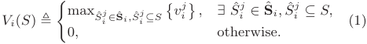

We assume that _Vi_ ( _·_ ) is _normalized_ ( _i.e._ , _Vi_ (∅) = 0) and _monotone_ ( _i.e._ , _Vi_ ( _S_ ) _≤ Vi_ ( _T_ ) for each _S ⊆ T ⊆_ C). Since the valuation function is derived from the expected quality of wireless service applications, we can assume that the range of the valuation function _Vi_ ( _·_ ) of buyer _i_ is [ _<u>v</u>_ _~~i~~__,_ _<u>vi</u>_ ] and _<u>vi</u>__≥ϵ_,where_ϵ_istheminimummonetaryunitinauc- tion systems. We denote the maximum value of all _<u>vi</u>_ by _~~v~~ max_ ≜ max _i∈_ N _~~v~~ i_ . We call the valuation function of buyer _i_ is _δi_ -close when _<u>vvii</u>__≤δi_. This parameter characterizes the diversity of valuation function from one buyer. Let _δmax_ ≜ max _i∈_ N _δi_ . We denote the valuation functions of all buyers by _⃗ V_ ≜ ( _V_ 1( _·_ ) _, V_ 2( _·_ ) _, · · · , Vn_ ( _·_ )). 

_Bid and Declared Channel Bundle_ : In the direct revelation combinatorial auction for unknown single-minded case, each buyer _i ∈_ N declares a bid _bi_ and one channel bundle **S** _i_ to the auctioneer, meaning that she is willing to pay at most _bi_ , if she is allocated a channel bundle containing **S** _i_ . The bid vector of all buyers is represented as _⃗ B_ ≜ ( _b_ 1 _, b_ 2 _, · · · , bn_ ), and the declared channel bundles of all buyers are denoted by _⃗ S_ ≜ ( **S** 1 _,_ **S** 2 _, · · · ,_ **S** _n_ ). In the iterative ascending combinatorial auction for unknown multi-minded case, active buyer _i_ submits a temporary bid _b__j_ _i_and a channel bundle**S**_j_ _i_ in the _j_ th iteration. The bids of non-active buyers are set to zeros, and their current bundles are the declared bundles when they drop out of the auction. We denote all bids by _B__j_ ≜ ( _b__j_ 1_, bj_ 2_, · · ·, b_ _n__j_)andthedeclaredbundlesofbuyersby _S__j_ ≜ ( **S**_j_ 1_,_**S**_j_ 2_, · · ·,_**S** _n__j_)inthe_j_thiteration. _Clearing Price and Utility_ : The auctioneer charges each winner _i_ a clearing price _pi_ , and let the losers free of any charge. We use vector _⃗ P_ ≜ ( _p_ 1 _, p_ 2 _, · · · , pn_ ) to represent the clearing prices of all buyers. Each buyer _i ∈_ N has a quasilinear utility defined as 

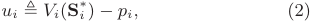

where **S**_∗_ _i_isthechannelbundleallocatedtobuyer_i_. 

In our model, we consider buyers are _unknown_ , _i.e._ , both the valuation functions and interested channel bundles are private information, and unknown to the auctioneer. In such environment, the selfish and rational buyers have more flexibilities to manipulate the results of the auction, and are eager to maximize their own utilities. In contrast to buyers, the overall objective of the auction mechanism is to maximize social welfare, which is defined as follows. 

**Definition 1** (Social Welfare) **.** _The social welfare in a spectrum auction is the sum of winning buyers’ valuations on their allocated bundles of channels, i.e.,_ 

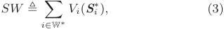

_where_ W_∗_ _is the set of winners, and_ **_S_**_∗_ _i__isthecorresponding_ _allocated channel bundle for winner i._ 

In this paper, we assume that buyers do not collude with each other, and leave relaxation of this assumption to our future work. 

5 

## **3.3 Economic Properties** 

We briefly review the solution concepts used in this paper from game theory. 

**Definition 2** (Dominant Strategy [22]) **.** _A strategy sti (weakly) dominates another strategy sti__′of player i, if for any other_ _players’ strategy profile st−i: ui_ ( _sti, st−i_ ) _≥ ui_ ( _st__′_ _i__, st−i_)_,_ _and this inequality is strict for at least one instance of st−i. A strategy sti is a dominant strategy for player i if it (weakly) dominates any other strategies of player i._ 

A strategy _sti_ is an _undominated strategy_ for player _i_ if it is not dominated by any other strategies of player _i_ . In direct revelation mechanisms, _incentive-compatibility_ means that truthfully revealing private information (both the valuations and channel demands in this paper) is a dominant strategy for each player. An accompanying concept is _individual-rationality_ , which means that players truthfully participating in the game gain non-negative utilities. The formal definition of _strategy-proof mechanism_ is as follows. 

**Definition 3** (Strategy-Proof Mechanism [19]) **.** _A direct revelation mechanism is strategy-proof when it satisfies both incentive-compatibility and individual-rationality._ 

Strategy-proofness is a strong solution concept in mechanism design. However, the requirement of having dominant strategies limits the existence of feasible allocation algorithms in combinatorial auctions for unknown multi-minded buyers [3, 17]. Therefore, we turn our attention to another well-known game theoretic concept: _implementation in undominated strategies_ . 

**Definition 4** (Implementation in Undominated Strategies [2,12]) **.** _A mechanism M is an implementation of c-approximation in undominated strategies if there exists a non-empty set of undominated strategies D with the following properties._ 

_• M achieves a c-approximation in polynomial time for any combination of undominated strategies from D._1 

_• M is individually rational for players taking undominated strategies from D._ 

_• M has fast undominance recognition property, meaning that a player can efficiently determine if a strategy belongs to D, and if not, compute an undominated strategy in D to dominate it._ 

The underlying goal of spectrum auctions is to achieve approximately optimal social welfare in the present of strategic behaviors of buyers. In unknown multi-minded case, we achieve this goal by relaxing the strict strategy-proofness constraint, and allowing the mechanism to leave several strategies in _D_ for the buyers to choose from. We compensate this uncertainly on the game-theoretic side by strengthening the algorithmic analysis, showing that the mechanism can achieve a good approximation for any combination of undominated strategies from _D_ . 

## **3.4 Problem Formulation** 

We borrow the novel concept of virtual channel [29] to represent the conflict of channel usage among buyers. By using virtual channels, we transform the _channel allocation problem_ to a classical _weighted set packing_ problem, and formulate it as a binary program. Specifically, a virtual channel _h__k_ _i,j_indicates that buyers_i_and_j_cause interference between each other on channel _ck_ , when channel _ck_ is allocated to _i_ 

> 1In this paper, a mechanism _M_ achieves _c_ -approximation means that the approximation ratio of _M_ is <u>1</u> _c_. The approximation ratio is defined as the ratio between the social welfare achieved by _M_ and the optimal social welfare. 

and _j_ simultaneously, _i.e._ , virtual channel _h__k_ _i,j_is correspond- ing to the edge ( _i, j_ ) _∈Ek_ on conflict graph _Gk_ . We now show the process of constructing virtual channels. We first create virtual channel _h__k_ _i,j_for each edge (_i, j_)_∈Ek_on conflict graph _Gk_ , and then append _h__k_ _i,j_tothechannelbundlescontaining channel _ck_ from the buyers _i_ and _j_ . We finally remove the original channels from all channel bundles. Hence, the updated channel bundles only contain virtual channels. From now on, the set S and vector _⃗ S_ ( _⃗S__j_ ) represent the updated interested channel bundles and updated declared channel bundles, respectively. We note that the valuations on updated channel bundles retain the same. Let _Hi_ be the set of virtual channels for the buyer _i_ . All virtual channels are denoted by H ≜ _{H_ 1 _, H_ 2 _, · · · , Hn}._ According to the rule of virtual channel construction, the maximum size of updated interested channel bundle is bounded by _κ_ = _m ×_ Δ _max_ . 

When virtual channel _h__k_ _i,j_isaddedintothechannelbun- dles containing channel _ck_ from the buyers _i_ and _j_ , at most one of the channel bundles from the buyers _i_ and _j_ can be allocated, ensuring the exclusive allocation of channel _ck_ for the buyers _i_ and _j_ . If the buyer _i_ obtains all virtual channels _h__k_ _i,j__,_(_i, j_)_∈Ek_on conflictgraph_Gk_,thenshe is granted channel _ck_ . We note that the buyer _i_ may not conflict with any other buyers on some channels. For these channels with no interference, we directly allocate them to the buyer _i_ . Consequently, the exclusive allocation of virtual channels implies the feasible channel allocation under conflict graph constraint. 

We now transform the channel allocation problem to the weighted _κ_ -set packing problem. The weighted _κ_ -set packing problem can be described as: given a family of weighted sets, each containing at most _κ_ elements drawn from a finite universe, find a maximum weight sub-collection of disjoint sets. In the channel allocation problem, the set of virtual channels H corresponds to the universe, collection of updated declared channel bundles _⃗ S_ ( _⃗S__j_ ) corresponds to the family of weighted sets, and _κ_ = _m ×_ Δ _max_ . In the direct revelation combinatorial auction for the single-minded case, the problem of channel allocation can be formulated as an integer programming. 

|**Problem:**  **Objective:**  **Subject to:**|_Hete_  Ma |_rogeneous Channel Allocation_ ximize � _i∈_N (_x_(_i,_**S**_i_)_× bi_)||
|---|---|---|---|
||�|� _x_(_i,_**S**_i_)_≤_1_,_ _∀hk ∈_H_,_|(4)|
||_i∈_N |**S**_i∋hk_ _x_(_i,_**S**_i_)_∈{_0_,_1_},_ _∀i ∈_N_._|(5)|

Here, the variable _x_ ( _i,_ **S** _i_ ) = 1 indicates that channel bundle **S** _i_ is allocated to buyer _i_ ; otherwise _x_ ( _i,_ **S** _i_ ) = 0. The first set of constraints represents the exclusive allocation of virtual channels, and the second set of constraints states the binary value of the auctioneer’s decision of allocation. In the _j_ th iteration of ascending combinatorial auction, we can formulate the channel allocation problem as a similar integer programming by replacing _bi_ and **S** _i_ with _b__j_ _i_and **S**_j_ _i_.Intheformulation,weusedeclaredinformation(_⃗B_,_⃗S_, _B__j_ and _⃗S__j_ ) instead of truly private information (S and _⃗ V_ ), because the strategy-proof mechanism in Section 4 will guarantee that bidding truthfully is a dominant strategy for each buyer, and the iterative auction mechanism implemented in undominated strategies in Section 5 will ensure that the declared information is close to the truthful information at the end of the auction. 

Solving the above integer programming is NP-hard, which makes the general and celebrated VCG mechanism [22] inapplicable. Considering the computational intractability of 

6 

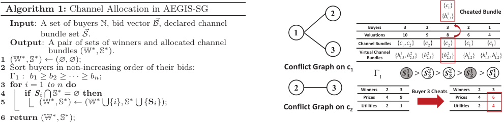

<!-- Start of picture text -->
Algorithm 1: Channel Allocation in AEGIS-SG 2 {{ hc 1,311}} Cheated�Bundle Input : A set of buyers N, bid vector ⃗ B , declared channel Buyers 3 2 3 2 1 bundle set ⃗ S . 1 Valuations 10 9 8 6 4 1 Output (W ∗ ,  S ∗ ):  ← Abundles(pair∅ ,  ∅of);(Wsets ∗ ,  Sof ∗ ).winners and allocated channel 3 Channel�BundlesVirtual Channel�Bundles� {{ hc 1,311,, ch 22,32}} {{ hc 2,322}} {{ hc 2,322}} {{ hc 1,112}} { h 1,31{ c ,1 h }1,21 } 2 Sort buyers in non-increasing order of their bids: Conflict�Graph�on�c1 Γ1 : b 1 ≥ b 2 ≥· · · ≥ bn ; � 1 3 for i  = 1 to n do 4 if S i � S ∗ = ∅ then 2 3 WinnersPrices 42 93 Buyer�3�Cheats WinnersPrices 42 63 5 (W ∗ ,  S ∗ )  ← (W ∗ � {i},  S ∗ � { S i} ); Conflict�Graph�on�c2 Utilities 2 1 Utilities 2 4 6 return (W ∗ ,  S ∗ ); <!-- End of picture text -->

the problem, we present alternative solutions with greedy allocation algorithms to achieve approximately efficient social welfare in following sections. 

**Figure 2: An illustrative example on why extending AEGIS-SG is not strategy-proof in multi-minded scenario. When buyer** 3 **changes her second interested bundle from** _{c_ 2 _}_ **to** _{c_ 1 _}_ **, she decreases her clearing price from** 9 **to** 6 **, and obtains higher utility.** 

## **4. AEGIS-SG** 

In this section, we begin with a simple but classical setting, in which buyers are unknown single-minded. As shown in section 3.4, finding the optimal auction decision is computationally intractable, even in this restricted case. Therefore, we design AEGIS-SG, which is a direct revelation combinatorial auction mechanism for heterogeneous channel redistribution among unknown single-minded buyers, achieving both strategy-proofness and approximate efficiency. 

## **4.1 Design Details** 

We first formally define the concept of _unknown singleminded buyers_ . 

**Definition 5** (Unknown Single-Minded Buyer) **.** _Buyer i is an unknown single-minded buyer iff she is only interested in one channel bundle_ **_S_**ˆ _i ⊆_ H _, and has a valuation vi for any bundle containing_ **_S_**ˆ _i. Both the valuation vi and channel demand_ **_S_**ˆ _i are private information._ 

AEGIS-SG consists of two major components: greedy channel allocation and clearing price calculation. The greedy channel allocation procedure is depicted in Algorithm 1. The algorithm contains two steps: 

▶ Step 1: We sort buyers according to their bids in nonincreasing order, and denote the sorted list by Γ1. We break the tie following any bid-independent rule, _e.g._ , lexicographic order of buyers’ IDs or channel numbers. 

▶ Step 2: Following the order in Γ1, we greedily grant channel bundles, which do not overlap with the previous allocated virtual channels. 

The clearing price calculation is based on critical bid. 

**Definition 6** (Critical Bid) **.** _The critical bid for buyer i ∈_ N _is the minimum bid that the buyer i should declare to win the auction._ 

The critical bid of winner _i ∈_ W_∗_ can be calculated by the following steps. Consider the winner _i_ in the sorted list Γ1, we find the first buyer following _i_ that has been denied but would have been granted a channel bundle when the buyer _i_ is removed from Γ1, and denote this buyer by _π_ ( _i_ ). We note that such a buyer necessarily conflicts with _i_ . We can formally represent _π_ ( _i_ ) as 

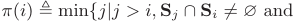

▶ If buyer _i_ is a loser or _π_ ( _i_ ) does not exist, she pays zero. ▶ If there exists a _π_ ( _i_ ), and _i_ is granted **S** _i_ , she pays _bπ_ ( _i_ ). 

## **4.2 Analysis** 

In this section, we prove that AEGIS-SG guarantees strategy-proofness in terms of valuations and channel demands, and analyze the approximation ratio of AEGIS-SG. Due to the space limitation, we leave the detailed proofs of these results to our technical report [30]. 

We first show the monotonicity of channel allocation algorithm, which is essential for a strategy-proof mechanism. 

**Lemma 1.** _AEGIS-SG’s channel allocation algorithm is monotonic, i.e., buyer i, who wins by declaring_ ( **_S_** _i, bi_ ) _, also wins if she declares_ ( **_S_** _i__′, b′_ _i_)_,suchthat,_**_S_** _i__′⊆_**_S_**_iandb′_ _i__≥bi._ We present the strategy-proofness and approximation ratio of AEGIS-SG. 

**Theorem 1.** _AEGIS-SG is a strategy-proof combinatorial spectrum auction for unknown single-minded buyers._ 

**Theorem 2.** _AEGIS-SG achieves O_ ( _κ_ ) _-approximation._ 

## **5. AEGIS-MP** 

In this section, we consider a more general scenario, in which buyers are unknown multi-minded. We first give an illustrative example to show that simply extending AEGISSG can no longer guarantee strategy-proofness. Furthermore, designing a deterministic, approximately efficient and strategy-proof combinatorial auction mechanism for unknown multi-minded buyers is still an open problem in algorithmic mechanism design, and some negative results are demonstrated [4, 23]. We turn to another well known game theoretic concept, implementation in undominated strategies, and design AEGIS-MP, which is an approximately efficient ascending combinatorial auction for heterogeneous channel redistribution among unknown multi-minded buyers. 

We first give the definition of _unknown multi-minded_ buyer. 

**Definition 7** (Unknown Multi-Minded Buyer) **.** _Buyer i is an unknown multi-minded buyer iff she is interested in multiple channel bundles_ **_S_**ˆ _i_ = _{S_ˆ _i_1_,S_ˆ _i_2_, · · ·,S_ˆ _i__li}, li>_1_,andhas_ _valuation function Vi_ ( _·_ ) _defined as Equation (1). The channel demands and valuation function are private information._ 

_∀k < j, k̸_ = _i, k_ is a winner _⇒_ **S** _k ∩_ **S** _j_ = ∅ _}._ 

The critical bid for the winner _i_ is _bπ_ ( _i_ ). We show the method of calculating the clearing price for buyer _i ∈_ N by distinguishing two cases. 

## **5.1 A Counter Example** 

In Figure 2, there are three buyers _{_ 1 _,_ 2 _,_ 3 _}_ , and two trading channels _{c_ 1 _, c_ 2 _}_ . Since buyers are multi-minded, they 

7 

may have different valuations on different bundles, _e.g._ , buyer 3 has valuation 10 and 8 over channel bundles _{c_ 1 _, c_ 2 _}_ and _{c_ 2 _}_ , respectively. Based on the conflict graphs and buyers’ interested channel bundles, we can construct virtual channel bundles for each buyer. In this example, we assume that buyers truthfully reveal their valuations, and investigate their manipulated strategies on channel demands. 

In AEGIS-SG, we sort buyers’ declared channel bundles according to the non-increasing order of their bids, and greedily grant channel bundles, ensuring the exclusive allocation of virtual channels. Buyers 2 and 3 are the winners, and obtain channel bundles **S**1 2=_{c_ 2_}_and**S**1 3=_{c_ 1_, c_ 2_}_, respec- tively. When bidding truthfully, according to the pricing scheme of AEGIS-SG, buyer 3 should pay 9, which is the bid of buyer 2 on bundle **S**2 2,andherutilityis10_−_9=1. However, buyer 3 can cheat by changing her second interested bundle **S**2 3to_{c_ 1_}_, and will still be allocated bundle**S** 31 but be charged with 6, increasing her utility to 4. Hence, by declaring untruthful channel demands, buyers can improve their utilities, which leads to the untruthfulness of AEGISSG in multi-minded scenario. 

## **5.2 Design Rational** 

AEGIS-MP is an ascending Japanese auction [14] on top of a greedy channel allocation algorithm. In traditional ascending Japanese auctions, the auctioneer collects temporary bids from active buyers, and maintains a provisional allocation in each iteration. Provisional losers can choose to increase their bids or permanently drop out of the auction. This process is iterated until all remaining active buyers are winners, and their prices are lastly reported bids. 

The most challenging part of designing combinatorial auctions for unknown multi-minded buyers is that both the valuations and channel demands are private and unknown to the auctioneer. We overcome this challenge by extending the ascending Japanese auctions to approach the true valuations and channel demands of buyers. Informally, in AEGIS-MP, we also maintain an “active bundle” for each buyer. This active bundle will keep approaching to one of the interested bundles of the buyer during the auction. Another challenge is the impact of manipulative behaviors of selfish buyers, which should be prevented to form a relatively stable market. Since the buyers are rational, they will not take dominated strategies if some undominated strategies can be quickly recognized. By exploiting this rationality of buyers, we carefully design the structure of auctions, such that, at each decision point, buyers can efficiently recognize the undominated strategies and take one of them, leading AEGIS-MP to be implemented in undominated strategies. 

## **5.3 Design Details** 

We now describe AEGIS-MP in detail. We suppose that GDY ~~A~~ LG is the approximately efficient greedy-based allocation algorithm, and when given as input vectors of active bundles and temporary bids, it outputs a provisional allocation that is approximate to the optimal solution. In AEGISMP, which is shown in Algorithm 2, the vector of bids _⃗ B_0 and active bundles _⃗ S_0 are initialized to _⃗ϵ_ and ( _H_ 1 _, H_ 2 _, · · · , Hn_ ), respectively (Line 2). At the beginning of the _j_ th iteration, the auctioneer knows four parts of information: the previous losers set L_j_ , the previous winners set W_j_ , the current active bundle vector _⃗ S__j_ and the temporary bid vector of buyers _⃗ B__j_ . These parameters are handed in as input to GDY ~~A~~ LG, who, in return, outputs a new set of provisional winners W_j_+1 and active bundles _⃗ S__j_+1 (Line 4). The provisional winners retain the same bids, while provisional losers are required to either increase their current bids by multiplying _e_ or permanently drop out of the auction (this is denoted 

**Algorithm 2:** AEGIS-MP: A General Japanese Wrapper Mechanism 

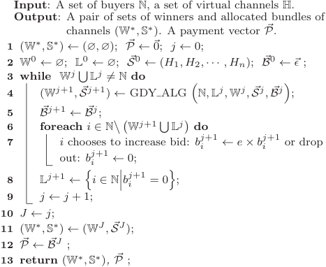

by setting _b__j_ _i_+1 = 0) (Lines 5 to 8). Here, parameter _e_ is Euler’s Number, and is the best choice over all constants for the optimal approximation ratio. This process is iterated until all remaining active buyers are declared as winners by GDY ~~A~~ LG. Let the total number of iterations be _J_ , and the set of winners is W_J_ . Each winner _i ∈_ W_J_ gets her finally active bundle **S**_J_ _i__∈⃗SJ_,andpaysherlastlyreportedbid _b__J_ _i__∈⃗BJ_.Theloserswillnotbeallocatedbundles,andare free of any charge (Line 11 to 12). 

We now depict the design of channel allocation algorithm GDY ~~A~~ LG in details. Algorithm 3 shows the pseudo-code of GD ~~Y A~~ LG procedure. Let N_j_ denote the active buyers in the _j_ th iteration. Function _Free_ ( _N ,⃗ S__j_ ) denotes the virtual channels not in� _i∈N_**S** _i__j_.Here,_N⊆_N is a subset of buyers, and _⃗ S__j_ is a vector of active bundles. GDY ~~A~~ LG constructs a greedy allocation, _Greedy__j_+1 , by extending the channel allocation algorithm in AEGIS-SG. Similarly, we sort the active buyers according to their current bids in non-increasing order, and break the tie following any bid-independent rule (Line 2). Following order Γ2, two steps are performed for the currently considered buyer _i_ . 

▶ **Shrinking Active Bundle:** If the buyer _i_ was previously a provisional loser, then she is given an option to “shrink” her active bundle. If the buyer _i_ chooses to shrink her bundle, the new bundle must satisfy that its valuation is not less than her current bid _b__j_ _i_, and it is a subset of the pre- viously reported bundle **S**_j_ _i_anddisjointsfromthebundles of buyers that are already in _Greedy__j_+1 (Line 4 to 5). ▶ **Updating Candidate Winner Sets:** Buyer _i_ is added to the allocation _Greedy__j_+1 (or W_j_ ) when her declared bundle **S**_j_ _i_+1 does not intersect the bundles of existing buyers in _Greedy__j_+1 (or W_j_ ). This operation ensures that the two allocations _Greedy__j_+1 and W_j_ are Pareto-efficient2 with respect to the new active bundles _⃗ S__j_+1 (Line 6 to 7). 

Once all the active buyers have been considered, GDY ~~A~~ LG outputs the allocation with the maximum value out of the two allocations _Greedy__j_+1 and W_j_ as the new set of pro- 

> 2Pareto-efficiency means that it is impossible to add losers into the winner set without removing at least one winner. 

8 

**Definition 9** (Set _D_ ) **.** _Let D be the set of all strategies that satisfy the following conditions, for every iteration j:_ 

|**Algorithm 3:** GDY ~~A~~LG(): Channel Allocation Algo- rithm|**Definition 9** (Set_D_)**.** _Let D be the set of all strategies that_ _satisfy the following conditions, for every iteration j:_ |
|---|---|
|**Input**: A set of buyers N. A previous losers set L_j_ and winners set W_j_. A vector of active bundles_⃗S__j_ and a vector of current bid_⃗B__j_ in iteration _j_. |▶_If buyer i does not drop out, her bid is always less than_ _her valuation on the active bundle, i.e., ϵ ≤b__j_ _i __≤Vi_(**_S_**_j_ _i_)_. As_ _Vi_(**_S_**_j_ _i_) _≥ϵ, her active bundle_ **_S_**_j_ _i __must contain some inter-_|
|**Output**: A provisional winners set W_j_+1 and a new active bundles_⃗S__j_+1 in iteration (_j_+ 1).|_ested bundles._ ▶_If buyer i drops out, then b__j_ _i __> Vi_(**_S_**_j_+1 _i_ )_/e._   _i_|
|**1** _Greedy__j_+1 _←_∅;_⃗S__j_+1 _←⃗S__j_; N_j_ =N � L_j_; _n__′_ = ��N_j_��;|▶_If buyer i is a “drop-out if silent” buyer (Definition 8),_ |
|**2** Sort _n__′_ active buyers in non-increasing order of _b__j_ _i_ : Γ2 :_b__j_ 1 _≥bj_ 2 _≥· · · ≥bj_ _n__′_; **3 foreach** _i_= 1 _to n__′_ **do**  |_then she will definitely declare some feasible bundle_**_S_**_j_+1 _i_ _that_ _satisfies the conditions at Line 5 of GDY_ _~~A~~LG, if such a_ _bundle exists._|
|**4** **if** _i ∈_N_\_ � L_j_ �W_j_� **then** **5** _i_ is allowed to update to any bundle that satisfies _Vi_(**S**_j_+1 _i_ )_≥b__j_ _i_ and **S**_j_+1 _i_ _⊆_ � **S**_j_ _i_ �_Free_ � _Greedy__j_+1_,⃗S__j_+1�� ;   |**Lemma 2.** _Strategy set D is a set of undominated strategies._ _Proof._ According to the definition of _D_, all strategies out- side_D_are dominated strategies, which cannot dominate any strategy in _D_. We just need to look at any two different strategies of buyer _i_ from the set _D_ (_i.e._, _sti, st__′_ _i __∈D, sti__̸_ = |
|**6** **if** **_S_**_j_+1 _i_ _⊆Free_ � _N,⃗S__j_+1� _, N ∈_ � _Greedy__j_+1_,_W_j_� **then** **7** _N ←N_ �_{i}_; |_̸_ _st__′_ _i_), and show that neither of them dominates the other. We consider the first point that they differ (_i.e._, the buyer _i_ has different active bundles). At this point, we can con-|
|**8** W_j_+1 _←_arg max_N ∈{Greedyj_+1_,_W_j}_ � _i∈N __bj_ _i_ ; **9 return** (W_j_+1_,⃗S__j_+1) ;|struct the strategies of the other buyers that will cause one strategy to win and the other to lose. Therefore, neither  _′_ |

**Lemma 2.** _Strategy set D is a set of undominated strategies. Proof._ According to the definition of _D_ , all strategies outside _D_ are dominated strategies, which cannot dominate any strategy in _D_ . We just need to look at any two different strategies of buyer _i_ from the set _D_ ( _i.e._ , _sti, st__′_ _i__∈D, sti_ _̸_= _st__′_ _i_),andshowthatneitherofthemdominatestheother. We consider the first point that they differ ( _i.e._ , the buyer _i_ has different active bundles). At this point, we can construct the strategies of the other buyers that will cause one strategy to win and the other to lose. Therefore, neither _sti_ nor _st__′_ _i_dominates the other,and then both strategies_sti_ and _st__′_ _i_areundominatedstrategies. 

**Lemma 3.** _AEGIS-MP is individually rational for buyers taking undominated strategies from D._ 

visional winners W_j_+1 . It also outputs the updated active bundles _⃗ S__j_+1 (Line 8 to 9). 

_Proof._ According to the fact that winners pay their lastly reported bids and the first condition of Definition 9, a winner cannot obtain a negative utility when she plays any undominated strategy in _D_ . Obviously, losers’ utilities are zeros. Therefore, our claim holds. 

We summarize four important properties of GDY ~~A~~ LG. These properties will be frequently used in next section. 

▶ ( **Pareto Efficiency** ) For any buyer _i ∈/_ W_j_+1 , **S**_j_ _i_+1 ⊈ _Free_ ((W_j_+1 _,⃗ S__j_+1 )). 

▶ ( **Improvement** )� _i∈_ W_j_+1_b_ _i__j≥_� _i∈_ W_jb_ _i__j_. ▶ ( **Shrinking Sets** ) For any buyer _i ∈_ N and any 0 _≤ j ≤ J −_ 1, **S**_j_ _i_+1 _⊆_ **S**_j_ _i_. ▶ ( **First Time Shrink** ) Let F_j_ ≜ _{ i_ �� _|_ **S** _ij__|_=_|Hi|, |_**S**_j_ _i_+1 _| < |Hi| }_ . For any _i_ 1 _, i_ 2 _∈_ F_j_ , it holds that **S**_j_ _i_ 1+1 � **S** _ji_ 2+1 = ∅. 

**Lemma 4.** _AEGIS-MP has fast undominance recognition property, i.e., buyers can efficiently determine if a strategy belongs to D, and if not, compute an undominated strategy in D to dominate it in polynomial time._ 

_Proof._ Clearly, any buyer _i_ can check if her strategy satisfies the conditions of undominated strategies in Definition 9 in polynomial time, and if not, modify her strategy to an undominated strategy that dominates the original one. 

## **5.4 Analysis** 

We now analyze the approximation ratio of AEGIS-MP. We first present some notations. Let OPT( _N ,⃗ S_ ) denote the value of the optimal outcome (in terms of valuation function _V_ ) for a set of buyers _N ⊆_ N when their channel bundles are _⃗ S_ . We call ( _N ,⃗ S_ ) a valid allocation, if **S** _i_ 1 � **S** _i_ 2 = ∅ for any _i_ 1 _, i_ 2 _∈N_ and **S** _ii_ , **S** _i_ 2 _∈⃗ S_ . Besides the four important properties in the previous section, we present another property, which can be derived from Definition 9. 

In this section, we prove that AEGIS-MP is an implementation in undominated strategies by the following steps. First, we characterize the set of undominated strategies _D_ . Second, we show that AEGIS-MP is individually rational for buyers taking any strategies from _D_ . Third, we demonstrate that AEGIS-MP has fast undominance recognition property. Finally, we analyze the approximation ratio of AEGIS-MP. 

We start with defining a type of buyers in AEGIS-MP. 

**Definition 8** (Drop-out if silent buyers) **.** _Active buyer i is a “drop-out if silent” buyer in the jth iteration if, when she is allowed to shrink her active bundle at Line 5 in GD_ _~~Y A~~ LG, all the following hold:_ 

▶ ( **Value Bound** ) For any _i ∈_ N, and any 0 _≤ j ≤ J_ , _b__j_ _i__≤Vi_(**S**_j_ _i_).Forbuyer_i_whodropsoutinthe_j_thiteration, _b__j_ _i__> Vi_(**S**_j_ _i_+1 ) _/e._ Before presenting the main theorem, we give some important lemmas. We first show that the number of iterations in AEGIS-MP is limited. 

▶ _(Not a previous winner) i ∈_ N _\_ (L_j_� W_j_ ) _._ 

▶ _(Drop out if keep silent) Si__j_+1 ⊈ _Free_ ( _Greedy__j_+1 _,⃗ S__j_+1 ) _, Si__j_+1 ⊈ _Free_ (W_j_ _,⃗ S__j_+1 ) _and e × bi__j> Vi_(**_S_**_j_ _i_)_._ 

**Lemma 5.** _AEGIS-MP stops in at most J_ = 2 ln( _~~v~~ max/ϵ_ )+ 

1 _steps._ 

A buyer can recognize that she is a “drop-out if silent” buyer at Line 5 of GDY ~~A~~ LG, and if there exists a feasible channel bundle, she will definitely shrink her active bundle. This is because she is guaranteed to drop out of the auction if she keeps silent, and if she shrinks her active bundle, she might win. In terminology of game theory, the strategy that keeping silent is dominated by the strategy of bundle shrinking. 

_Proof._ We look at a loser _i_ 1 who drops out in the last iteration (the ( _J −_ 1)th iteration). According to the **Pareto Efficiency** property, loser _i_ 1’s active bundle must intersect with that of a winner _i_ 2 _∈_ W_J_ , which implies that **S**_J_ _i_ 1 � **S** _Ji_ 2 _̸_= ∅. Additionally, by the **Shrinking Sets** property, it holds that **S**_j_ _i_ 1 � **S** _ji_ 2 _̸_=∅,forany0_≤j≤J−_1.Therefore,wecan claim that buyer _i_ 1 and _i_ 2 never win together. Each of them can be a loser, and multiply her bid at most ln ~~<u>(</u>~~ _~~v~~ max/ϵ_ ) consecutive times. We can get that _J −_ 1 _≤_ 2 ln( _~~v~~ max/ϵ_ ), and thus the lemma holds. 

We now characterize strategy set _D_ , and claim that every strategy in _D_ is an undominated strategy. 

9 

We have the following lemma for buyers in AEGIS-MP. 

**Lemma 6.** _For AEGIS-MP, it holds that_ OPT(L_J_ _,⃗ S__J_ ) _< etJ ×_ OPT(W_J_ _,⃗ S__J_ ) _, where t_ = (1 + _κ_ ) _._ 

Due to the limitation of space, we leave the detailed proof to our technical report [30]. 

OPT( _N_ 1 _,⃗ S__O_ ) + OPT( _N_ 2 _,⃗ S__O_ ) + OPT( _N_ 3 _,⃗ S__O_ ) _<_ ( _δmax_ + _eδmaxtJ_2 + _etJ_ )OPT(W_J_ _,⃗ S__J_ ) _._ 

From the above analysis, we now can get our main result for AEGIS-MP according to Definition 4. **Theorem 4.** _AEGIS-MP is an implementation of an O_ ( _δmaxtJ_2 ) _-approximation in undominated strategies._ 

We now present the approximation ratio of AEGIS-MP. 

**Theorem 3.** _AEGIS-MP achieves_ ( _δmax_ + _eδmaxtJ_2 + _etJ_ ) _- approximation._ 

_Proof._ Let O be the set of winners in the optimal allocation, and winners are allocated bundles from _⃗ S__O_ = ( **S** 1_O,_**S**_O_ 2_, · · ·,_ **S**_O_ _n_). We partition the winners into three categories, and bound the value of them separately. 

▷ We denote the winners that also stay in W_J_ by _N_ 1. In this case, winners might win other interested channel bundles in the optimal allocation, so we get 

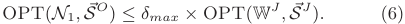

▷ We turn to another set of winners _N_ 2, which is the subset of losers in AEGIS-MP, _i.e._ , _N_ 2 _⊆_ L_J_ . Buyer _i_ belongs to _N_ 2 if and only if she is a winner in the optimal allocation O, and her allocated bundle **S** _i__O_is not included in**S**_J_ _i_,which is the bundle that the buyer _i_ declares in AEGIS-MP when she drops out. We have the following claim for winners _N_ 2. Claim 1: OPT( _N_ 2 _,⃗ S__O_ ) _< eδmaxtJ_2 _×_ OPT(W_J_ _,⃗ S__J_ ). _Proof._ Let F_j_ = _i ∈N_ 2 _i__|_=_|Hi|, |_**S**_j_ _i_+1 _| < |Hi|_ be the � ��� _|_ **S** _j_ � set of buyers from _N_ 2 that first shrink their bundles in the _j_ th iteration, and we have _N_ 2 =�_J_ _j_ =0_−_1F_j_.Accordingtothe first and third properties of undominated strategy in Definition 9, we can conclude that **S**_j_ _i_containssomeinterested channel bundles for all _i ∈_ N and 0 _≤ j ≤ J −_ 1. Therefore, for any _i ∈_ F_j_ , we have 

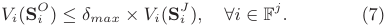

According to the **First Time Shrink** property, all bundles _⃗ S__j_+1 of buyers in F_j_ are disjoint. Additionally, by the **Shrinking Sets** property, we have _Si__J_ _⊆Si__j_+1 , implying bundles _⃗ S__J_ of buyers in F_j_ are also disjoint. Therefore, (F_j_ _,⃗ S__J_ ) is a valid allocation. Since F_j_ _⊆N_ 2 _⊆_ L_J_ , we get 

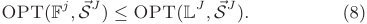

Combining with Inequalities (7)(8), we conclude that 

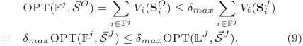

Using Inequality (9) and Lemma 6, we get 

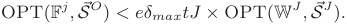

Finally, we conclude that 

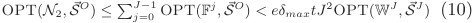

▷ We denote the winners in L_J_� _N_ 2 by _N_ 3. According to the definition of _N_ 2, the allocated bundles of winners in _N_ 3 are contained in bundles _⃗ S__J_ , together with Lemma 6, we get 

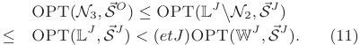

We now combine these three types of winners together (Inequalities (6)(10)(11)), and conclude that OPT(O _,⃗ S__O_ ) _≤_ 

## **6. EVALUATION RESULTS** 

In this section, we show our evaluation results. We implement AEGIS using network simulation, and compare its performance with CRWDP [5] and NSR-MP. CRWDP is an unknown single-minded combinatorial spectrum auction, and NSR-MP is a variant of AEGIS-MP. Neither CRWDP nor NSR-MP considers channel spatial reusability. 

## **6.1 Methodology** 

We use two complementary datasets, namely Google Spectrum Database [9] and GoogleWiFi [32], to evaluate the performance of our mechanisms. We take Google Spectrum Database as our first dataset. We first extract WiFi nodes in an area (Latitude range: [40_◦_ 25_′_ 18_′′_ _,_ 39_◦_ 38_′_ 29_′′_ ], Longitude range: [ _−_ 76_◦_ 34_′_ 40_′′_ _, −_ 74_◦_ 52_′_ 20_′′_ ]) from WiGLE.net [27], and we then query Google Spectrum Database the available TV white spaces and corresponding maximum permissible power for each WiFi node, which is considered as a portable device in the database. Portable devices can work on unused TV channel 21 through 51, except channel 37, 38, 39. To generate conflict graphs, we apply a simple Free Space propagation model [26] to predict the interference range between nodes, and consequently create the conflict graphs.3 We also evaluate our mechanisms in a practical conflict graph, built from exhaustive signal measurements, in the second data set. The second dataset, GoogleWiFi, records 78 APs in a 7 _km_2 residential area of the Google WiFi network in Mountain View, California. It was collected by a research group from UC Santa Barbara in April 2010 [32]. 

We build a set of auction configurations by sampling WiFi nodes in the first data set, and the number of WiFi nodes varies from 200 to 2000 with increment of 200. For the second data set, we assume the number of leasing channels can be one of three values: 6, 12 and 24. We consider the case of single-minded buyers and the case of multi-minded buyers, who can have up to 10 interested bundles ( _i.e._ , _li ≤_ 10). For each buyer _i_ , her _li_ interested channel bundles are randomly generated from her available channel set, and the valuations on bundles are uniformly distributed over (0 _,_ 1]. The maximum closeness parameter of valuation is set as 5, _i.e._ , _δmax_ = 5. The minimum monetary unit in the auction systems is set as _ϵ_ = 10_−_5 . In AEGIS-MP, since buyers may have multiple undominated strategies at their decision points, we assume that buyers randomly select one of them. All the results of performance are averaged over 200 runs. 

**Metrics:** We evaluate the following five metrics: 

▶ _Social Welfare:_ The sum of winning buyers’ valuations on their allocated bundles of channels. 

▶ _Revenue:_ The sum of payments received from buyers. 

▶ _Satisfaction Ratio:_ The fraction of winners over buyers. 

▶ _Channel Utilization:_ The number of radios worked on each channel. 

▶ _Channel Eccentricity:_ The ratio of allocated channels over actually used channels for one buyer. In AEGIS-MP, for each winner, the final allocated bundle may contain multiple interested bundles and uninterested channels, but the winner only use one interested bundle. Therefore, we use channel eccentricity to measure this channel over-allocation. 

> 3Other propagation models, _e.g._ , Egli and Longley-Rice [26], could be used to generate more accurate conflict graphs. 

10 

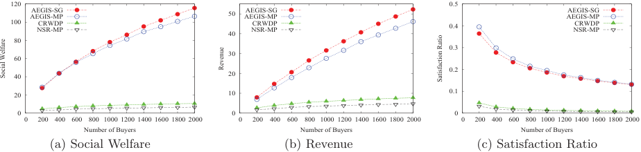

<!-- Start of picture text -->
 120  0.5 AEGIS-MPAEGIS-SG  50 AEGIS-MPAEGIS-SG AEGIS-MPAEGIS-SG  100 NSR-MPCRWDP  40 NSR-MPCRWDP  0.4 NSR-MPCRWDP  80  0.3  30  60  40  20  0.2  20  10  0.1  0  0  0  0  200  400  600  800  1000  1200  1400  1600  1800  2000  0  200  400  600  800  1000  1200  1400  1600  1800  2000  0  200  400  600  800  1000  1200  1400  1600  1800  2000 Number of Buyers Number of Buyers Number of Buyers (a) Social Welfare (b) Revenue (c) Satisfaction Ratio Revenue Social Welfare Satisfaction Ratio <!-- End of picture text -->

**Figure 3: Performance of AEGIS, CRWDP and NSR-MP on Google Spectrum Dataset.** 

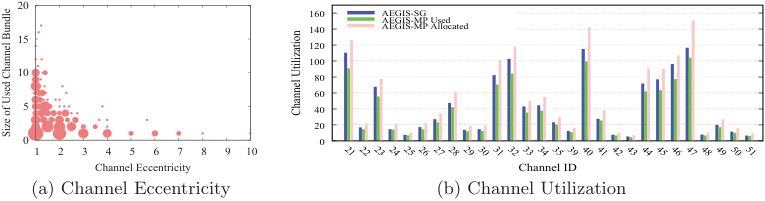

<!-- Start of picture text -->
 20  160 AEGIS-SGAEGIS-MP Used  140 AEGIS-MP Allocated  15  120  100  10  80  60  5  40  20  0  0  1  2  3  4  5  6  7  8  9  10 Channel Eccentricity Channel ID (a) Channel Eccentricity (b) Channel Utilization 21 22 23 24 25 26 27 28 29 30 31 32 33 34 35 39 40 41 42 43 44 45 46 47 48 49 50 51 Channel Utilization Size of Used Channel Bundle <!-- End of picture text -->

**Figure 4: Channel eccentricity and channel utilization of AEGIS.** 

## **6.2 Performance on Google Spectrum Dataset** 

By varying the number of buyers, we collect a set of performance data, as illustrated in Figure 3. We can see that AEGIS always outperforms the other two mechanisms, CRWDP and NSR-MP. This result demonstrates that exploiting channel spatial reusability can significantly improve the performance of spectrum auction systems. Figure 3 also shows that when the number of buyers increases, the social welfare and revenue increase, while the satisfaction ratio decreases. On one hand, AEGIS allocates channels more efficiently among more buyers, hence the social welfare and revenue increase. On the other hand, larger number of buyers leads to more intense competition on limited channels, thus decreases the satisfaction ratio. We also observe from Figure 3 that revenue is much lower than social welfare. Similar to previous work [31], we can institute reserve prices for channels to increase revenue, and make a trade-off between revenue and social welfare. How to determine an optimal reserve price is out of the scope of this paper. Intuitively, multi-minded auction mechanisms should perform better than single-minded ones because of the more feasible bundle choices for buyers. However, as shown in Figure 3, AEGIS-MP is slightly worse than AEGIS-SG in terms of social welfare and revenue. As we will discuss later, the channel eccentricity of winners in AEGIS-MP is the main reason for this degradation of system performance. 

We now present the evaluation results of channel eccentricity and channel utilization. The channel eccentricity for AEGIS-SG is always equal to 1, because the allocated bundle is exactly buyer’s interested bundle. Figure 4(a) shows the channel eccentricity of AEGIS-MP. We randomly select one instance from the 200 simulation instances when the number of buyers is fixed at 2000, and calculate the channel eccentricity for each winner. The placement of a circle in Figure 4(a) indicates one set of winners with the same channel eccentricity and the same size of used channel bundle. The size of a circle is logarithmic to the number of winners. Though some of winners’ channel eccentricities are 

equal to 1, there exist about 67% winners, whose channel eccentricities are larger than 1. On one hand, AEGIS-MP just stimulates buyers to take undominated strategies, such that buyers can still maintain multiple bundles or uninterested channels in their active bundles during the auction. On the other hand, buyers only use the most valuable channel subset among their allocated bundles. Therefore, the size of allocated bundle can be larger than that of actually used bundle in some cases, leading to channel over-allocation. 

The channel eccentricity affects the channel utilization of AEGIS-MP. By fixing the number of buyers at 2000 and running 200 simulation instances, we record the average channel utilization for each channel, and plot the results in Figure 4(b). We do not include CRWDP and NSR-MP in this analysis, because they do not consider channel spatial reusability. As shown in the figure, different TV channels have different channel utilization. The reason is that TV white spaces are spatially heterogeneous, _e.g._ , channel 47 can be accessed to almost all buyers, while channel 33 are only available to around 36% buyers. In AEGIS-MP, we distinguish between allocated channels and used channels. We can observe from Figure 4(b) that the allocated number is always larger than the used number for each channel. This is because some winners have channel eccentricity higher than 1. We can also see from Figure 4(b) that the channel utilization of AEGIS-MP is always lower than that of AEGIS-SG. The reason is that the winners with high channel eccentricity in AEGIS-MP disables some possible allocations of their interfering neighbors. From the above analysis, we can get that buyers’ manipulated strategies on channel demands indeed impact the performance of spectrum auction systems. 

## **6.3 Performance on GoogleWiFi Dataset** 

Figure 5 shows the system performance of AEGIS, CRWDP, and NSR-MP on GoogleWiFi dataset when there are 6, 12, 24 channels. Since channels are accessible to all buyers in this setting, we average the channel utilization on all channels on this dataset. Generally, the evaluation re- 

11 

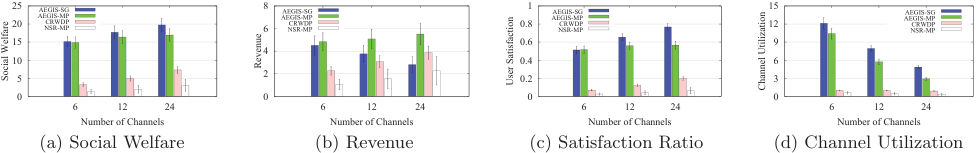

<!-- Start of picture text -->
 25 20 AEGIS-MPAEGIS-SGNSR-MPCRWDP  8 6 AEGIS-MPAEGIS-SGNSR-MPCRWDP  0.8 1 AEGIS-MPAEGIS-SGNSR-MPCRWDP  15 12 AEGIS-MPAEGIS-SGNSR-MPCRWDP  15  0.6  9  4  10  0.4  6  5  2  0.2  3  0  0  0  0 6 12 24 6 12 24 6 12 24 6 12 24 Number of Channels Number of Channels Number of Channels Number of Channels (a) Social Welfare (b) Revenue (c) Satisfaction Ratio (d) Channel Utilization Revenue Social Welfare User Satisfaction Channel Utilization <!-- End of picture text -->

**Figure 5: Performance of AEGIS, CRWDP and NSR-MP on GoogleWiFi Dataset.** 

sults are similar with those on Google Spectrum Dataset. Again, AEGIS achieves better performance than CRWDP and NSR-MP. Figure 5 also shows that when the number of channels increases, the social welfare and satisfaction ratio increase, and channel utilization decreases. The reason is that fixing the number of buyers, larger supply of channels results in more trades in the auction, and thus increases social welfare and satisfaction ratio. The channel utilization decreases because buyers can be allocated to more channels when the number of channels increases. For revenue, AEGIS-SG decreases with the number of channels, while AEGIS-MP, CRWDP and NSR-MP increase. The clearing price calculation in AEGIS-SG is based on critical bid. When larger number of channels are accessible in the auction, more buyers are allocated channels, reducing the critical bids for winners. Hence, the revenue of AEGIS-SG decreases. Though the clearing price of CRWDP is also calculated based on critical bid, there still exist considerable losers when the number of channels becomes large. Therefore, the critical bids for winners still stay high, so that the revenue continue to grow with the increase of channels. The clearing prices of AEGIS-MP and NSR-MP are the bids of winners at the end of the auctions. Larger supply of channels leads to more winners, and thus revenues in AEGIS-MP and NSR-MP become higher. 

## **7. CONCLUSION** 

Considering the five challenges for designing a practical spectrum auction mechanism, we have proposed AEGIS, which is the first framework of unknown combinatorial auction mechanisms for heterogeneous spectrum redistribution. For the case with unknown single-minded buyers, we have designed a direct revelation combinatorial auction mechanism, call AEGIS-SG. AEGIS-SG achieves strategy-proofness and approximately efficient social welfare. We have further considered the case with unknown multi-minded buyers, and designed an iterative ascending combinatorial auction, namely AEGIS-MP. AEGIS-MP is implemented in undominated strategies, and has a good approximation ratio. We have implemented AEGIS and evaluated its performance on two practical datasets. Compared with the existing work, AEGIS achieves superior performance, in terms of social welfare, revenue, satisfaction ratio, and channel utilization. 

## **8. REFERENCES** 

- [1] A. Archer and E. Tardos. Truthful mechanisms for one-parameter agents. In _FOCS_ , 2001. 

- [2] M. Babaioff, R. Lavi, and E. Pavlov. Single-value combinatorial auctions and algorithmic implementation in undominated strategies. _Journal of the ACM_ , 56(1):4:1–4:32, 2009. 

- [3] P. Briest, P. Krysta, and B. V¨ocking. Approximation techniques for utilitarian mechanism design. In _STOC_ , 2005. 

- [4] S. Dobzinski. An impossibility result for truthful combinatorial auctions with submodular valuations. In _STOC_ , 2011. 

- [5] M. Dong, G. Sun, X. Wang, and Q. Zhang. Combinatorial auction with time-frequency flexibility in cognitive radio networks. In _INFOCOM_ , 2012. 

- [6] Federal Communications Commission (FCC). 

   - http://www.fcc.gov/. 

- [7] X. Feng, Y. Chen, J. Zhang, Q. Zhang, and B. Li. TAHES: Truthful double auction for heterogeneous spectrums. In _INFOCOM_ , 2012. 

- [8] L. Gao, Y. Xu, and X. Wang. MAP: Multiauctioneer progressive auction for dynamic spectrum access. _IEEE Transactions on Mobile Computing_ , 10(8):1144–1161, 2011. 

- [9] Google Spectrum Database. 

   - https://www.google.com/get/spectrumdatabase/. 

- [10] M. Hoefer and T. Kesselheim. Secondary spectrum auctions for symmetric and submodular bidders. In _EC_ , 2012. 

- [11] Radio Regulations, International Telecommunication Union, Gen`eve, 2012. 

- [12] M. O. Jackson. Implementation in undominated strategies: A look at bounded mechanisms. _The Review of Economic Studies_ , 59(4):757–775, 1992. 

- [13] K. Jagannathan, I. Menache, G. Zussman, and E. Modiano. Non-cooperative spectrum access: The dedicated vs. free spectrum choice. In _MobiHoc_ , 2011. 

- [14] Japanese Auction. 

   - http://en.wikipedia.org/wiki/Japanese_auction. 

- [15] J. Jia, Q. Zhang, Q. Zhang, and M. Liu. Revenue generation for truthful spectrum auction in dynamic spectrum access. In _MobiHoc_ , 2009. 

- [16] P. Klemperer. How (not) to run auctions: The european 3g telecom auctions. _European Economic Review_ , 46(4-5):829–845, 2002. 

- [17] D. Lehmann, L. I. O´callaghan, and Y. Shoham. Truth revelation in approximately efficient combinatorial auctions. _Journal of the ACM_ , 49(5):577–602, 2002. 

- [18] LTE Spectrum and Network Strategies. http://www.adlittle.com/downloads/tx_adlreports/ADL_LTE_ Spectrum_Network_Strategies.pdf. 

- [19] A. Mas-Colell, M. D. Whinston, and J. R. Green. _Microeconomic Theory_ . Oxford Press, 1995. 

- [20] A. Mu’alem and N. Nisan. Truthful approximation mechanisms for restricted combinatorial auctions. _Games and Economic Behavior_ , 64(2):612 – 631, 2008. 

- [21] N. Nisan. Bidding and allocation in combinatorial auctions. In _EC_ , 2000. 

- [22] M. J. Osborne and A. Rubenstein. _A Course in Game Theory_ . MIT Press, 1994. 

- [23] C. Papadimitriou, M. Schapira, and Y. Singer. On the hardness of being truthful. In _FOCS_ , 2008. 

- [24] S.-P. Sheng and M. Liu. Profit incentive in a secondary spectrum market: A contract design approach. In _INFOCOM_ , 2013. 

- [25] Spectrum Bridge. http://www.spectrumbridge.com/Home.aspx. [26] D. Tse and P. Viswanath. _Fundamentals of Wireless Communication_ . Cambridge University Press, May 2005. 

- [27] WiGLE. https://wigle.net/. 

- [28] P. Xu, S. Wang, and X.-Y. Li. SALSA: Strategyproof online spectrum admissions for wireless networks. _IEEE Transactions on Computers_ , 59(12):1691 –1702, 2010. 

- [29] Z. Zheng, F. Wu, and G. Chen. SMASHER: A strategy-proof combinatorial auction mechanism for heterogeneous channel redistribution. In _MobiHoc_ , 2013. 

- [30] Z. Zheng, F. Wu, S. Tang, and G. Chen. Unknown combinatorial auction mechanisms for heterogeneous spectrum redistribution. Technical report, 2014. available at http://www.cs.sjtu.edu.cn/~fwu/res/Paper/ZWTC14TRAEGIS.pdf. 

- [31] X. Zhou, S. Gandhi, S. Suri, and H. Zheng. eBay in the sky: Strategy-proof wireless spectrum auctions. In _MobiCom_ , 2008. 

- [32] X. Zhou, Z. Zhang, G. Wang, X. Yu, B. Y. Zhao, and H. Zheng. Practical conflict graphs for dynamic spectrum distribution. In _SIGMETRICS_ , 2013. 

- [33] X. Zhou and H. Zheng. TRUST: A general framework for truthful double spectrum auctions. In _INFOCOM_ , 2009. 

12 

