# **An Online Pricing Mechanism for Mobile Crowdsensing Data Markets** 

Zhenzhe Zheng, Yanqing Peng, Fan Wu∗ , Shaojie Tang¶ , and Guihai Chen 

{zhengzhenzhe,wu-fan,gchen}@sjtu.edu.cn,yqpeng@foxmail.com,tangshaojie@gmail.com 

Shanghai Key Laboratory of Scalable Computing and Systems, Shanghai Jiao Tong University, China ¶Department of Information Systems, University of Texas at Dallas, USA 

## **ABSTRACT** 

Although data has become an important kind of commercial goods, there are few appropriate online platforms to facilitate the trading of mobile crowd-sensed data so far. In this paper, we present the first architecture of mobile crowd-sensed data market, and conduct an in-depth study of the design problem of online data pricing. To build a practical mobile crowd-sensed data market, we have to consider three major design challenges: data uncertainty, economicrobustness (arbitrage-freeness in particular), revenue maximization. By jointly considering the design challenges, we propose a novel online query-bAsed cRowd-sensEd daTa pricing mEchanism, namely ARETE, to determine the trading price of crowd-sensed data. Our theoretical analysis shows that ARETE guarantees both arbitragefreeness and a constant competitive ratio in terms of revenue maximization. We have evaluated ARETE on a real-world sensory data set collected by Intel Berkeley lab. Evaluation results show that ARETE outperforms the state-of-the-art pricing mechanisms, and achieves around 90% of the optimal revenue. 

## **CCS CONCEPTS** 

- **Networks** → **Network economics** ; • **Theory of computation** 

- → _Computational pricing and auctions_ ; 

## **KEYWORDS** 

Data Marketplace, Mobile Crowdsensing, Online Pricing 

## **1 INTRODUCTION** 

As a significant business reality, data trading has attracted increasing attentions and focuses. For example, Xignite [37] sells financial data, Gnip [17] vends data from social networks, and Factual [16] 

> ∗F. Wu is the corresponding author. 

This work was supported in part by the State Key Development Program for Basic Research of China (973 project 2014CB340303). The work of Z. Zheng was also supported by Google PhD Fellowship and Microsoft Asia PhD Fellowship. This work was also supported in part by China NSF grant 61672348, 61672353, 61422208, and 61472252, in part by Shanghai Science and Technology fund 15220721300, and in part by the Scientific Research Foundation for the Returned Overseas Chinese Scholars. The opinions, findings, and conclusions expressed in this paper are those of the authors and do not necessarily reflect the views of the funding agencies or the government. Permission to make digital or hard copies of all or part of this work for personal or classroom use is granted without fee provided that copies are not made or distributed for profit or commercial advantage and that copies bear this notice and the full citation on the first page. Copyrights for components of this work owned by others than ACM must be honored. Abstracting with credit is permitted. To copy otherwise, or republish, to post on servers or to redistribute to lists, requires prior specific permission and/or a fee. Request permissions from permissions@acm.org. _Mobihoc ’17, July 10-14, 2017, Chennai, India_ 

© 2017 Association for Computing Machinery. ACM ISBN 978-1-4503-4912-3/17/07...$15.00 

trades geographic data. Potential data consumers might be Nasdaq [28] for financial data, Instagram [22] for social data, and Here [20] for location trace data. To support these online data transactions, several marketplace services have emerged, _e.g._ , Azure Data Marketplace [3], Infochimps [21], and Dataexchange [13]. These marketplace services offer centralized platforms, where data vendors can upload and sell their data, and data consumers can discover and purchase the data needed. 

Although a few works have appeared to study the trading of structured and relational data [4, 24], mobile crowd-sensed data trading has not been fully explored in either industry or academia. Ranging from wireless sensor networks that monitor large wildlife environment [26] to vehicular networks for traffic monitoring and prediction [41], these deployments generate tremendous volumes of valuable but uncertain numeric sensing data. Due to lack of effective ways for data exchange, the mobile crowd-sensed data is currently used only by their operators for their own purposes. Such status has significantly suppressed market demand for mobile crowd-sensed data [8]. On one hand, data owners are willing to share their data for profits. On the other hand, data consumers, such as researchers, analysts, and application developers, would like to pay for data services built upon the acquired raw data. Therefore, it is highly needed to build an open data marketplace to enable mobile crowd-sensed data trading, and to boost data economy underlying the ubiquitous mobile data. Several open platforms, such as Thingspeak [33] and Thingful [32], have recently emerged for mobile data sharing on the Web, but none of them have deployed a practical data trading platform. 

To design a flexible and practical mobile crowd-sensed data market, we have to cope with three major challenges. The first major challenge comes from the uncertainty of mobile crowd-sensed data, which makes it difficult to define the trading format of crowd-sensed data. The mobile data is normally noisy and imprecise [9], making it improper to directly feed raw data into data market. Furthermore, we can discover rich semantic information behind the raw data by aggregating data from multiple dimensions and domains [25]. Therefore, instead of directly selling raw data, the data vendor should design a statistical model to describe the raw data, and then provide semantically rich data services in the data market [8]. Researchers have proposed several model-based methods to manage sensing data in the past decades [9, 14, 31]. However, due to the various formats of mobile sensing data and the complex correlation among data, it is not possible to select a universal and concise statistical model for all types of crowd-sensed data trading. 

The second challenge is on designing flexible data pricing mechanisms with economic robustness guarantee. The pricing strategy currently used to sell data is simplistic, _i.e._ , the data vendor sets 

https://doi.org/http://dx.doi.org/10.1145/3084041.3084044 

Zhenzhe Zheng, Yanqing Peng, Fan Wu∗ , Shaojie Tang¶ , and Guihai Chen 

Mobihoc ’17, July 10-14, 2017, Chennai, India 

fixed prices for the whole or parts of the data set [3, 12]. This inflexible approach not only forces the data vendor to anticipate possible data subsets that data consumers might be interested in, but also drives the data consumers to purchase a superset of the data in need. To this end, a fine-grained data trading format, particularly, query-based data pricing [4, 24], is more suitable for data trading. In the data market with query-based data pricing mechanisms, data consumers can purchase ad-hoc queries over the whole data set, and thus have the flexibility to buy the data they exactly need. While providing convenience for data trading, this flexible data pricing mechanism can expose obscure arbitrage problems, in which a cunning data consumer may infer the answer of an expensive query from a set of cheaper queries. Thus, the data pricing mechanism should satisfy the property of _arbitrage-free_ [24] to resist such manipulation behaviour. This introduces heavy burden on the design of data pricing mechanisms due to the complex arbitrage behaviour. 

The third challenge is on revenue maximization with incomplete information. Data can be considered as one kind of information goods, which have a substantial initial investment cost, but tend to induce negligible marginal cost for reproduction. Such a cost structure makes existing cost-based pricing mechanisms unsuitable for data trading. Thus, the value-based pricing mechanisms are more attractable for data trading. However, in online marketing system, the valuations and arrival sequences of data consumers are unknown to the data vendor. Thus, the data vendor has to determine the price of data with incomplete information. The optimization on revenue maximization needs to take both the new cost structure and the lack of information into account, which inevitably doubles the difficulty in the design of data pricing mechanisms. 

In this paper, we conduct an in-depth study on the problem of market design for mobile crowd-sensed data trading. First, we adopt a powerful statistical model, _i.e._ , Gaussian Process, to capture the uncertainty of numeric mobile data, and regard the resulting aggregated distributions as trading commodities in the data market. Based on this statistical model, we design a fine-grained query interface, including three basic types of query formats, such that data consumers can obtain needed information through issuing ad-hoc queries. Second, we propose a query-based data pricing mechanism, namely ARETE, to achieve arbitrage-freeness and a constant competitive ratio. Specifically, for each of data commodities, ARETE generates multiple _versions_ with different accuracy levels to extract revenue from data consumers in different market segments, and determines the trading prices of the versions by dynamically learning the valuations of data consumers. To the best of our knowledge, we are the first to analyze the market structure of mobile crowd-sensed data trading, and propose an online pricing mechanism to facilitate this new kind of data business. 

We summarize our contributions as follows. 

• First, we present a marketplace for mobile crowd-sensed data trading, in which the data vendor can offer data services upon acquired raw data to obtain revenue, and data consumers can purchase data services through issuing ad-hoc queries. We conduct a thorough analysis on the market structure of mobile crowd-sensed data trading, and examine the problems of revenue maximization. 

• Second, we begin with considering a basic setting, in which data consumers only ask single-data queries, and design ARETE, including a versioning mechanism and an online pricing mechanism. 

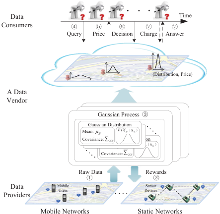

<!-- Start of picture text -->
Data Time Consumers � � � � � Query Price Decision Charge Answer (Distribution, Price) A Data Vendor Gaussian Process � Gaussian Distribution Mean: � F ( | x ) • • • • Covariance: � Gaussian Distribution Mean: � F ( | x ) • • • • Covariance: � Raw Data Rewards � � Data MobileUsers DevicesSensor Providers Mobile Networks Static Networ ks • • • • • • • <!-- End of picture text -->

**Figure 1: A Mobile Crowd-Sensed Data Market.** 

We further extend ARETE to adapt to other data query scenarios. We prove that ARETE achieves both arbitrage-freeness and a constant competitive ratio in terms of revenue maximization. 

• Finally, we evaluate the performance of ARETE with a realworld sensory data set. The evaluation results show that ARETE outperforms the state-of-the-art pricing mechanisms, and approaches the optimal fixed price revenue. 

The rest of this paper is organized as follows. In Section 2, we present system model and problem formulation. In Section 3, we propose a version-based online pricing mechanism, namely ARETE. We extend ARETE to support diverse query formats in Section 4. The evaluation results are presented in Section 5. In Section 6, we review related work. We conclude the paper in Section 7. 

## **2 PRELIMINARIES** 

In this section, we formally describe system model for mobile crowdsensed data trading, and the problem of revenue maximization. 

## **2.1 System Model** 

As illustrated by Figure 1, we consider a mobile crowd-sensed data marketplace with three major entities: a set of data providers, a data vendor, and a set of data consumers. In mobile crowd-sensing applications, the data vendor acquires raw data by employing data providers, such as sensor devices and mobile phone users, in a monitoring region, and wants to make profits from providing data services upon the collected data (Step x). The data vendor would provide some rewards to incentivize data providers to report data (Step y). Since the raw data is normally incomplete, imprecise, and erroneous, the data vendor needs to build statistical models to filter the raw data, and present a model-based query interface for data consumers (Step z). The data consumers arrive at the data market sequentially, and request for data services through issuing ad-hoc queries over the statistical models (Step {). The data vendor determines appropriate prices for data services in a principled way 

### An Online Pricing Mechanism for Mobile Crowdsensing Data Markets 

(Step |). Upon receiving declared prices, the data consumer makes a purchasing decision (Step }). If the data consumer accepts this price, she receives the answers of the queries, and pays for the price (Step ~). We introduce a set of major notations to define the crowd-sensed data market. 

**Data Providers:** In a monitoring region Θ, the data vendor employs a set of _m_ data providers to collect mobile data. Let A = { _a_ 1, _a_ 2, · · · , _am_ } denote the locations of the data providers, and vector **x** A = ( _x_ 1, _x_ 2, · · · , _xm_ ) denote the observations collected by the data providers. For convenience of discussion, we assume that each data provider only contributes one piece of data. 

**Statistical Model:** Due to the unreliability of sensing devices and the fragility of data communication links, the mobile data is normally incomplete, imprecise, and erroneous. In addition, the sensing data is collected at some selected locations, and cannot fully represent the continuous feature of the physical environment. Therefore, the data vendor needs to filter the noisy raw data, and to infer the data at the locations where no data providers are employed. In such cases, regression techniques can be used to handle the noise in raw data and to perform inference. Although linear regression can draw good inferences, it cannot quantify the uncertainty of these inferences, which is critical to the price determination of data in markets. We adopt a powerful regression technique _Gaussian Process_ [11, 36], which is a generalization of linear regression, and has been widely used as to model numerical sensing data [14, 15], to perform inferences, and to cope with the uncertainty quantification in the process of inferences.1 

We associate a random variable X _y_ with each location _y_ ∈ Θ, and a set of random variables X _Y_ with a set of locations _Y_ ⊆ Θ, representing the possible data at the corresponding locations. We can specify the Gaussian Process model with a mean function _μ_ , and a symmetric and positive-definite covariance function Σ. Let _μY_ and Σ _YY_ denote the mean vector and the covariance matrix for a set of random variables X _Y_ ⊆ XΘ, respectively. In Gaussian Process, the joint distribution over the corresponding set of random variables X _Y_ ⊆ XΘ is a multivariate Gaussian distribution, and the probability density function is: 

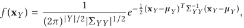

where **x** _Y_ is a vector of possible values of random variables X _Y_ , |Σ| is the determinant of matrix Σ, and Σ−1 is the inverse matrix of Σ. Under the Gaussian Process model, we can infer the data at any set of locations _Y_ ⊆ Θ (even there are no observations at these locations), condition on the observations **x** A. The resulting distribution _f_ X _Y_ | XA ( **x** _Y_ | **x** A) is a conditional multivariate Gaussian distribution, whose posterior mean vector _μ_ ¯ _Y_ and posterior covariance matrix Σ _YY_ can be expressed as: 

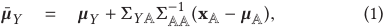

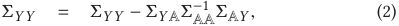

In data market, the data vendor obtains revenue by providing data services based on the collected raw data **x** A. The other information, such as the parameters of the statistical model, is public 

> 1It is not possible to propose a universal statistical model to describe all types of sensing data. In this work, we focus on numerical sensing data, such as temperature, humidity, light, voltage, and etc. 

Mobihoc ’17, July 10-14, 2017, Chennai, India 

knowledge. Thus, the posterior covariance matrix Σ _YY_ , which is independent on the actual observations **x** A, is publicly known. 

**Data Commodity:** In crowd-sensed data market, we define the data commodity for trading as the conditional Gaussian distributions _f_ X _Y_ | XA ( **x** _Y_ | **x** A).2 We call the distribution _f_ X _y_ | XA ( _xy_ | **x** A) of a single random variable X _y_ as a _basic_ data commodity. Considering that the possible locations of the monitoring region are infinite, the data vendor selects a finite set of random variables at several locations, sometimes called as Point of Interests (PoIs), to approximately describe the environmental phenomenon of the whole region Θ. We denote the set of these PoIs by Y = {1, 2, · · · , _l_ }. For notational convenience, we will use _Y_ ⊆ Y to index the data commodity _f_ X _Y_ | XA ( **x** _Y_ | **x** A) in the following discussion. 

The data vendor assigns a basic price _py_ to each basic data commodity _y_ ∈ Y. We denote all the basic prices by a vector _p_ = ( _p_ 1, _p_ 2, · · · , _pl_ ). We will discuss the determination of the basic prices in Section 3. As mentioned above, the covariance matrices are public knowledge, so the valuable information of a data commodity is its mean vector. Furthermore, by Equation (1), the mean of a data commodity _Y_ is actually the vector of the means of the basic data commodities in it. Based on this fact, we set the price of a data commodity _Y_ ⊆ Y as the sum of the basic prices of the basic data commodities in _Y_ , _i.e._ , _pY_ =� _y_ ∈ _Y__p_ _y_. 

**Data Consumers:** The _n_ data consumers, denoted by B = { _b_ 1, _b_ 2, · · · , _bn_ }, arrive at the marketplace in a certain sequence. Each data consumer _bi_ issues a query about a data commodity _Yi_ ⊆ Y, and has a private valuation _vi_ for the query. For the convenience of analysis, we normalize the valuations into the range [1, _δ_ ]. We denote the valuations of all the data consumers by **v** = ( _v_ 1, _v_ 2, · · · , _vn_ ). We consider the following types of query in this paper: 

• _Single-Data Query:_ A data consumer _bi_ is interested in the (inferential) data at a single location _yi_ ∈ Y, _i.e._ , the (posterior) mean _μ_ ¯ _yi_ of the basic data commodity _yi_ . 

• _Multi-Data Query:_ A data consumer _bi_ wants to know the (inferential) data of a certain region _Yi_ ⊆ Y, _i.e._ , the (posterior) mean vector _μ_ ¯ _Yi_ of the data commodity _Yi_ . We assume that the maximum dimension of all the queried data commodities is a constant _κ_ , _i.e._ , _κ_ = max _bi_ ∈B | _Yi_ |. 

• _Range Query:_ A data consumer _bi_ asks for the probability that the data at the region _Yi_ ⊆ Y belongs to a range [a _~~i~~_, ~~a~~ _i_ ]. 

**Confidence Level:** Each data consumer _bi_ ∈ B reports an error bound _ϵi_ and a confidence level _ηi_ , representing the acceptable accuracy of the queried data commodity. The confidence level of the data commodity _Yi_ with an error bound _ϵi_ is defined as: 

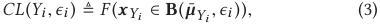

where **B** ( ¯ _μYi_ , _ϵi_ ) represents the Euclidean ball with a center at _μ_ ¯ _Yi_ and a radius _ϵi_ . We note that confidence level _CL_ ( _Yi_ , _ϵi_ ) is in direct <u>proportion</u> to the determinant of posterior covariance matrices |Σ _Yi Yi_ | [27]. We can obtain the approximation results using numerical integration procedures. The data commodity _Yi_ satisfies the required confidence level of the data consumer _bi_ if _CL_ ( _Yi_ , _ϵi_ ) ≥ _ηi_ . 

2The possible privacy leakage of data providers and the potential violation of data copyright can be some other reasons to trade data services rather than raw data in data market. 

Zhenzhe Zheng, Yanqing Peng, Fan Wu∗ , Shaojie Tang¶ , and Guihai Chen 

Mobihoc ’17, July 10-14, 2017, Chennai, India 

**Data Charging:** Considering that the data commodity with different confidence levels should have different prices, the data vendor offers a discount _di_ ∈ (0, 1] for each data consumer _bi_ ∈ B according to her required confidence level (Please refer to Section 3 for the determination of the discount factor.). Thus, the charge for the data consumer _bi_ ’s query about the data commodity _Yi_ is _ci_ = _pYi_ × _di_ . If data consumer _bi_ ’s valuation _vi_ is higher than _ci_ , she would purchase the query, and pay the charge; otherwise, she leaves and pays nothing. We use vector _c_ = ( _c_ 1, _c_ 2, · · · , _cn_ ) to denote the charges of all data consumers. 

## **2.2 Problem Formulation** 

In this paper, we consider one important problem in mobile crowdsensed data market: _Revenue Maximization_ . 

The goal of data vendor is to maximize obtained revenue, which is defined as the sum of the charges for data customers that purchase data commodities, _i.e._ , _C_ ≜� _bi_ ∈B: _vi_ > _ci__c_ _i_. In contrast, the selfish data consumers always tend to purchase their desired query results with lower charges. For example, the data consumers can indirectly infer the answer of an expensive query by buying a set of cheaper queries. The data pricing mechanism should be robust enough to resist such arbitrage behaviours. We define an arbitrage-free data pricing mechanism as follows. 

_Definition 2.1 (Arbitrage-free Data Pricing Mechanism)._ Wh-enever a query _q_ can be entirely answered by a query bundle { _q_ 1, _q_ 2, · · · , _qk_ }, an arbitrage-free data pricing mechanism must satisfy that _c_ ( _q_ ) ≤ � _ki_ =1_c_(_qk_), where_c_(_q_) denotes the charge for the query_q_. 

We now formally present the problem of revenue maximization in mobile crowd-sensed data market: The data vendor dynamically determines the charge **c** (by calculating the basic prices **p** and discount factor _di_ ) for data consumers B, without knowing the data consumers’ arrival sequence and private valuation vector **v** , such that the resulting data pricing mechanism achieves good competitive ratio and the property of arbitrage-freeness. 

## **3 ONLINE DATA PRICING** 

In this section, we propose ARETE, which is a version-based online posted-pricing mechanism for mobile crowd-sensed data market. ARETE consists of two components: a versioning mechanism and an online pricing mechanism. The versioning mechanism generates multiple versions for a data commodity to satisfy the diverse confidence levels of data consumers. The online pricing mechanism determines the basic price for each basic data commodity with the goal of revenue maximization. 

We begin with a simple but classical setting, in which data consumers only issue single-data queries. In this case, we can consider the price determination for each of basic data commodities independently, and discuss the design of ARETE for one selected basic data commodity. We further extend ARETE to adapt to the other types of query in Section 4. 

## **3.1 Versioning** 

In ARETE, we regard the conditional Gaussian distribution _f_ ( _xy_ | **x** A ) generated by the observations **x** A from some data providers A ⊆ A 

**Algorithm 1:** Versioning Mechanism 

||**Input**: The number of versions_T_; An accuracy vector**h**; A scale parameter_λ_.|
|---|---|
||**Output**: A vector of selected data providers A; A vector of discount factors**d**.|
|**1**|_t_ ←0; A ←∅; _A_←∅;|
|**2 **|**while**_t_ ≤_T_ **do**|
|**3**|_a_∗←arg min_ai_∈A\_A H_(X_y_|X_A_ ∪X_ai_);|
|**4**|_A_←_A_ �{_a_∗};|
|**5**|**if** _H_(X_y_|X_A_ ∪X_ai_) ≤_ht_ **then**|
|**6**|A_t_ ←_A_; A ←A_t_;_t_ ←_t_ +1;|
|**7**|_σy_|A_T_ ←_σy_ −Σ_y_A_T_Σ−1 A_T_A_T_ ΣA_T __y_;|
|**8 **|**for**_t_ =1_to T_ **do**|
|**9**|_σy_|A_t_ ←_σy_ −Σ_y_A_t_Σ−1 A_t_A_t_ ΣA_t y_;|
|**10**|_f_1(_x_) =_f_X_y_|XA_T_ (_xy_|**x**A_T_);|
|**11** **12**|_f_2(_x_) =_f_X_y_|XA_t_ (_xy_|**x**A_t_); �_D_(_f_1||_f_2) ←1 2 � � log _σ_ 2 _y_|A_t_ _σ_ 2 _y_|A_T_ + _σ_ 2 _y_|A_T_ _σ_ 2 _y_|A_t_ −1� � ;|
|**13**|_dt_ ←_e_−_λ_ � _D_(_f_1||_f_2);|
|**14 **|**return** A_,_**_d_**;|

as a version of the basic data commodity _y_ ∈ Y,3 and use conditional entropy to quantify the accuracy of the version. The conditional entropy of the Gaussian distribution _f_ X _y_ | XA ( _xy_ | **x** A) is: 

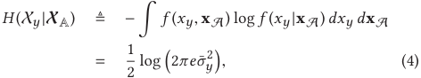

where _σ_ ¯ _y_2 is the posterior variance of the distribution _f_ ( _xy_ | **x** A ). The conditional entropy can be calculated in a closed form using Equation (2). 

By using the standard market research techniques, such as surveys, the data vendor can determine the number of versions _T_ and the corresponding accuracy vector **h** = ( _h_ 1, _h_ 2, · · · , _hT_ ), meaning that the conditional entropy of the _t_ th version should be less than _ht_ .4 In general, we assume that _ht_ 1 > _ht_ 2 , for 1 ≤ _t_ 1 < _t_ 2 ≤ _T_ . We use A _t_ ⊆ A to denote the data providers recruited to generate the _t_ th version. The data vendor always wants to employ less data providers to achieve the accuracy requirements of the versions, due to the high cost of recruiting large number of data providers. 

We present the principle of greedy versioning mechanism in Algorithm 1 step by step. The versioning algorithm greedily adds the most “informative” data provider following a sequence, until the current conditional entropy satisfies the accuracy requirement of certain version. Formally, our goal is to select the next data provider _ai_ that minimizes _H_ (X _y_ |X _A_ ∪X _ai_ ), where _A_ is the set of currently selected data providers. We break the tie following a random rule (Lines 3 to 4). If the new conditional entropy _H_ (X _y_ |X _A_ ) is less 

> 3For mobile crowd-sensed data, there are many possible versioning strategies, _e.g._ , aggregating different amounts of raw data to generate versions, which is adopted in this paper, or artificially adding the noises of different levels into a highly accurate data commodity. 

> 4Determining the number of versions and the accuracy vector is beyond the scope of this paper, and will be discussed in our future work. Several previous works [30, 34] shed light on possible solutions for this problem. 

Mobihoc ’17, July 10-14, 2017, Chennai, India 

An Online Pricing Mechanism for Mobile Crowdsensing Data Markets 

than the accuracy of the _t_ th version _ht_ , we generate this version by setting A _t_ as the current data provider set _A_ (Lines 5 to 6). 

The remaining issue is to determine discount factor for each version. We set the discount factor of a version proportional to its distance to the full version, _i.e._ , the distribution _f_ X _y_ |XA _T_ ( _xy_ | **x** A _T_ ), and fix the discount factor for the full version as 1. The concept of _relative entropy_ , or _Kullback-Leibler distance_ , is a measure of the distance between two distributions [10]. Specifically, the relative entropy between the full version _f_ 1 ( _x_ ) = _f_ X _y_ |XA _T_ ( _xy_ | **x** A _T_ ) and the _t_ th version _f_ 2 ( _x_ ) = _f_ X _y_ |XA _t_ ( _xy_ | **x** A _t_ ) is 

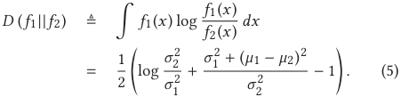

The relative entropy is nonnegative and is equal to zero if and only if _f_ 1 = _f_ 2. Intuitively, a version with a lower accuracy should be “farther” from the full version. However, the distance calculated by Equation (5) may not reflect such property, because the relative entropy depends on both the mean and variance. As shown in Equation (4), the accuracy of a version only rests on its variance. Inspired by this, we modify the relative entropy by ignoring the mean terms, and regard it as the distance between two versions 

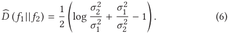

**Algorithm 2:** Online Pricing Mechanism 

||**Input**: Reals:_α_ ∈(0,1],_β_ > 0,_γ_ ∈(0,1]; The_i_th data consumer_bi_; A vector of discount factors**d**; The highest valuation_δ_; The number of candidate prices_K_; A vector of candidate prices ˆ_p_; A weight vector**w**_i_−1.|
|---|---|
|**1 **|**Output**: The charge_ci_ for data consumer_bi_.  **c**_i_ ←**0**;|
|**2**  **3**|Select the candidate price as ˆ_pk_ following the probability: ˆ_fi_(_k_) ←(1−_γ_)_fi_(_k_)+_γд_(_k_), where_fi_(_k_) = _wi_−1(_k_) ~~�~~_K_ _j_=1 _wi_−1(_j_) and _д_(_k_) = Δ (1+_β_)_K_−_k_+1 , Δ = 1− 1 1+_β_ 1− ~~�~~ 1 1+_β_ ~~�~~_K_ ;  Suppose the selected price is ˆ_pki_;|
|**4**|Choose the lowest version_ti_ that satisfies the required confidence|
|**5**|level_ηi_ of data consumer_bi_, and set her discount factor ˆ_di_ ←_dti_;  _ci_ ←ˆ_pki_ × ˆ_di_;|
|**6 ** **7**|  **if** _Data consumer bi accepts the charge ci_ **then** _ci_(_ki_) ←_ci_;|
|**8 **|**else** |
|**9** **10 **|_ci_(_ki_) ←0;  **foreach**_k_ =1_to K_ **do** |
|**11**|**if**_k_ =_ki_ **then**  Δ (_k_)    ˆ |
|**12**|ˆ_ci_(_k_)←_γ_   _ci_  ˆ; _wi_(_k_)←_wi_−1(_k_)×(1+_α_) _ci_ (_k_);|
|**13**| _δ_ _fi_(_k_)           **else** ˆ  |
|**14**|_ci_(_k_) ←0; _wi_(_k_) ←_wi_−1(_k_);|
|**15 **|    **return**_ci;_|

Considering that the discount factor should lie in the range [0, 1], we define the discount factor for the _t_ th version as: 

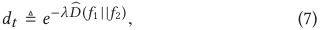

where _λ_ is a scale parameter. 

We give the detailed steps to calculate the discount factor for each version in Algorithm 1. We calculate the variance _σy_ |A _T_ of the full version _f_ ( _y_ |A _t_ ) in Line 7. For the _t_ th version, we calculate its variance _σy_ |A _t_ in Line 9, and the corresponding distance and discount factor according to Equation (6) and Equation (7), respectively (Lines 12 to 13). 

## **3.2 Online Pricing** 

We now describe the detailed principle of online pricing mechanism in Algorithm 2. For each arrived data consumer, we select the basic price from a vector of candidate discrete prices _p_ ˆ = ( _p_ ˆ1, _p_ ˆ2, · · · , _p_ ˆ _K_ ), where _p_ ˆ _k_ = (1 + _β_ )_k_−1 for any 1 ≤ _k_ ≤ _K_ and _β_ > 0. Since the upper bound of valuation is _δ_ , we have _K_ = ⌊log1+ _β δ_ ⌋ + 1. Let _ci_ ( _k_ ) be the revenue attained by setting price _p_ ˆ _k_ for the _i_ th data consumer _bi_ . We initially set _c_ 0 ( _k_ ) to be zero for any 1 ≤ _k_ ≤ _K_ . Given a parameter _α_ ∈ (0, 1], we define a weight _wi_ ( _k_ ) for the price _p_ ˆ _k_ in the _i_ th transaction as 

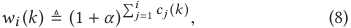

which is an exponential weight function, denoting the performances of the candidate prices in the previous transactions. The candidate price with a large weight should have a high probability to be chosen as a basic price in the following transactions. We denote the weight vector for all candidate prices in the _i_ th transaction by **w** _i_ = ( _wi_ (1), _wi_ (2), · · · , _wi_ ( _K_ )), and initially set **w** 0 to be **1** . 

For the _i_ th arrived data consumer _bi_ ∈ B, Algorithm 2 selects a candidate price _p_ ˆ _k_ following the distribution _f_ˆ _i_ ( _k_ ), which is a combination of an exploitation distribution and an exploration distribution (Line 2). On one hand, we try to exploit the currently expected best price to gain a high revenue, and define the exploitation distribution as 

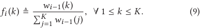

On the other hand, since some candidate prices may obtain a low revenue at first, but receive a high revenue later, we also apply an exploration distribution to find the ultimate optimal price in long terms. Thus, we further assign each candidate price _p_ ˆ _k_ an exploration probability distribution. A classical exploration distribution is uniform distribution, which assigns each of the candidate prices the same probability [7]. However, considering that different candidate prices can produce different amount of revenue, we adopt a geometric distribution as the exploitation distribution, _i.e._ , 

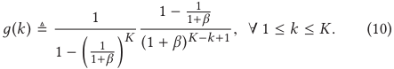

1− <u>1</u> To simplify notation, we set Δ = 1− 11+ _<u>β</u>_ ~~�~~ 1+ _β_ ~~�~~ _K_ . Since the _k_ th candidate price is _p_ ˆ _k_ = (1 + _β_ )_k_−1 , such exploration distribution ensures that _p_ ˆ _k_ / _д_ ( _k_ ) = _O_ �(1 + _β_ )_k_−1 (1 + _β_ )_K_−_k_+1� = _O_ ( _δ_ ), which is a useful property for the competitive ratio analysis. Let _p_ ˆ _ki_ denote 

Mobihoc ’17, July 10-14, 2017, Chennai, India 

Zhenzhe Zheng, Yanqing Peng, Fan Wu∗ , Shaojie Tang¶ , and Guihai Chen 

the selected price for data consumer _bi_ following the combined distribution _f_ˆ _i_ ( _k_ ) (Line 3). 

After calculating the confidence level of each version using Equation (3), we can select the lowest version _ti_ , that satisfies the required confidence level of the data consumer _bi_ .5 The discount factor _d_ˆ _i_ to data consumer _bi_ is the corresponding discount factor _dti_ for version _ti_ returned by Algorithm 1 (Line 4). The charge for data consumer _bi_ then is _ci_ = _p_ ˆ _ki_ × _d_ˆ _i_ (Line 5). 

According to the data consumer’s purchasing decision, we receive a revenue _ci_ ( _ki_ ) ∈{0, _ci_ } of the chosen price _p_ ˆ _ki_ . In the posted pricing setting, we cannot observe the revenue generated by the other candidate prices. So we set _ci_ ( _k_ ) = 0 for any _k_ � _ki_ (Lines 6 to 9). Based on this revenue vector **c** _i_ = ( _ci_ (1), _ci_ (2), · · · , _ci_ ( _K_ )), we generate a virtual revenue vector _c_ ˆ _i_ = ( _c_ ˆ _i_ (1), ˆ _ci_ (2), · · · , ˆ _ci_ ( _K_ )), and use it to update the weights of candidate prices. We calculate this virtual revenue vector by distinguishing the two cases: 

▷ For the chosen price _p_ ˆ _ki_ , we set the virtual revenue _c_ ˆ _i_ ( _ki_ ) to be_<u>γ</u>_Δ _ci_ <u>(</u> _k_ <u>)</u> _δ f_ ˆ _i_ ( _k_ ). 

▷ For the other prices _p_ ˆ _k_ , _k_ � _ki_ , we set _c_ ˆ _i_ ( _k_ ) to be zero. 

We update the weight vector **w** _i_ using Equation (8) with virtual revenue vector _c_ ˆ _i_ (Lines 10 to 14). We have the following two properties for this virtual revenue vector _c_ ˆ _i_ , which is heavily used in the analysis of competitive ratio in next section. 

▶ The expected virtual revenue (with respective to the selection distribution _f_ˆ _i_ ( _k_ )) for any candidate price _p_ ˆ _k_ is proportional to the actual revenue of the price _ci_ ( _k_ ), _i.e._ , 

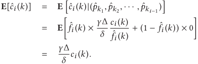

▶ The virtual revenue _c_ ˆ _i_ ( _k_ ) is in the range [0, 1]. 

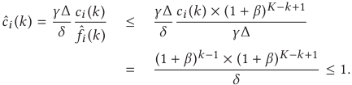

We remark that the data vendor can dynamically tune the parameters _α_ , _β_ , _γ_ in Algorithm 2 to adapt to different market settings. Specifically, the parameter _α_ represents the weights of candidate prices in exploitation process ( _i.e._ , a larger _α_ indicates that we heavily exploit the candidate prices with good performance in previous transactions.). The parameter _γ_ denotes the trade-off between the exploitation and exploration ( _i.e._ , a smaller _γ_ represents a higher degree of exploitation.). For example, the data vendor can set a large _α_ and a small _γ_ to actively exploit the collected valuation knowledge, when the data providers’ valuations follow a normal distribution. In contrast, when the data providers’ valuations come from a uniform distribution, the data vendor can set a low _α_ and a high _γ_ to achieve good performance. The parameter _β_ reflects the trade-off between revenue maximization and computational complexity, _i.e._ , a larger 

> 5Although the data vendor can choose high versions for data consumers to extract much revenue, this would incur market anarchy: data consumers would strategically report low confidence levels to seek less payments. The policy of selecting the lowest version enforces data consumers to truthfully report their required confidence levels. 

_β_ , implying more candidate prices to choose, can extract a larger revenue but incurs a higher computational overhead. We design experiments to evaluate the effects of these parameters in Section 5. 

## **3.3 Analysis** 

We analyze the competitive ratio of ARETE in this subsection. In ARETE, we only consider a vector of discrete candidate prices _p_ ˆ, while ignoring the other possible values in [1, _δ_ ]. We show that the attained revenue does not lose much under this restriction. We leave the detailed proof to our technical report [1]. 

Lemma 3.1. _ARETE loses only a_ (1 + _β_ ) _factor in rounding down the optimal price to one of the prices from p_ ˆ _._ 

We then show another useful lemma for the competitive ratio analysis. 

Lemma 3.2. _For any parameter α_ > 0 _, any sequence of virtual revenue vectors c_ ˆ1, ˆ _c_ 2, · · · , ˆ _cn , and the exploitation distribution vectors_ **_f_** _i_ = ( _fi_ (1), _fi_ (2), · · · , _fi_ ( _K_ )) _, we have:_ 

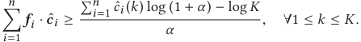

Proof. Let _Wi_ =� _k__K_ =1_wi_(_k_)forany1≤_i_≤_n_.Sincethe virtual revenue _c_ ˆ _i_ ( _k_ ) is in the range [0, 1], we can get the following equations. 

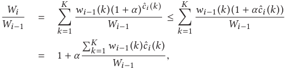

where for the inequality we used the fact that for _x_ ∈ [0, 1], (1 + _α_ )_x_ ≤ 1 + _αx_ . Thus, 

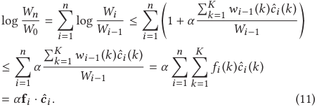

Since _Wn_ ≥ _wn_ ( _k_ ) = (1 + _α_ )� _ni_ =1_c_ˆ_i_(_k_) for any 1 ≤ _k_ ≤ _K_ , and _W_ 0 = _K_ , we have 

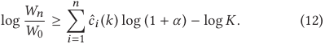

Combining Equations (11) and (12), we get 

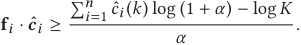

We have completed the proof. □ 

By Lemma 3.1, Lemma 3.2 and an appropriate choice of parameters _α_ , _β_ and _γ_ , we can obtain the following competitive ratio for ARETE. 

Theorem 3.3. _Given a real value ϵ, there exists a constant θ , such that for any valuation sequences_ **_v_** _with optimal revenue OPT_ ≥ _θδ_ log log _δ , ARETE is_ (1 + _ϵ_ ) _-competitive._ 

An Online Pricing Mechanism for Mobile Crowdsensing Data Markets 

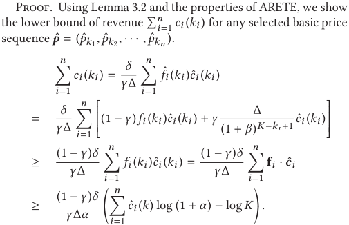

We next take the expectation of both sides of the above equation with respect to distribution _p_ ˆ. Having **E** [ _c_ ˆ _i_ ( _k_ )] =_<u>γ</u>_ _δ_Δ_ci_(_k_) for each _c_ ˆ _i_ ( _k_ ), we can get: 

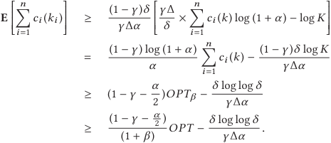

In the third equality, we select the optimal fixed price from _p_ ˆ, and thus max _k_ {�_n_ _i_ =1_ci_(_k_)}=_OPTβ_. The third equality follows from that log (1 + _α_ ) ≥ _α_ −_<u>α</u>_ <u>2</u>2for any_α_>0. By Lemma 3.1, the last inequality holds. By choosing appropriate parameters _α_ , _β_ and _γ_ , we prove the theorem. □ 

We have proven that ARETE achieves a constant competitive ratio when the optimal revenue is larger than _O_ ( _δ_ log log _δ_ ). The following theorem shows that any online pricing algorithm that achieves a constant ratio, must have an additive constant term Ω( _δ_ ). Designing an online pricing algorithm with a tight lower bound is our future work. 

Theorem 3.4. _There is no constant-competitive online pricing algorithm for all valuation sequences with OPT_ ≥ _o_ ( _δ_ ) _._ 

Due to the limitation of space, we leave the proof of Theorem 3.4 to our technical report [1]. 

## **4 ADAPTION TO OTHER QUERY TYPES** 

In this section, we extend ARETE to support multi-data query formats, and leave the extension to range query formats to our technical report [1], due to space limitation. 

We can formulate the pricing problem for multi-data query as an unlimited-supply combinatorial posted-price auction with singleminded data consumers. A single-minded data consumer is interested in only a single data commodity, and has no valuation for all the other data commodities. As we have discussed in Section 2.1, the price of a data commodity _Y_ ⊆ Y is the sum of the prices of the basic data commodity in it, _i.e._ , _pY_ =� _y_ ∈ _Y__p_ _y_. 

Mobihoc ’17, July 10-14, 2017, Chennai, India 

**Algorithm 3:** Pricing Mechanism for Multi-Data Query 

|**Input**: A set of random basic data commodityY1; A data consumer _bi_; A data commodity_Yi_; A discount factor vector**d**_Yi_; A weight vector**W**.|
|---|
|**Output**: The charge_ci_ for the data consumer_bi_. **1** _ci_ ←0;|
|**2 if** |_Yi_ �Y1| =1**then** **3** _y_ ←_Yi_ �Y1;|
|**4** _ci_ ←_OPMy_(_bi_,_dYi_,**W**_y_); **5 else** **6** Ignore the data consumer_bi_; **7 return**_ci_|

The extended ARETE also consists of two components: versioning mechanism and pricing mechanism. We show that the versioning mechanism in ARETE can be modified slightly to provide the version generation in the multi-data query scenario. Based on the pricing algorithm in original ARETE, we design an online randomized pricing mechanism for multi-data query, and analyze its competitive ratio. 

**Versioning Mechanism** In multi-data query scenario, we define the conditional entropy of a commodity _Y_ ⊆ Y as: 

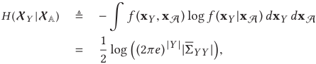

where |Σ| is the determinant of matrix Σ. We use this conditional entropy as a criterion to generate versions. In this case, the revised relative entropy between the full version _f_ 1 ( _x_ ) = _f_ X _Y_ | XA _T_ ( **x** _Y_ | **x** A _T_ ) and the _t_ th version _f_ 2 ( _x_ ) = _f_ X _Y_ |XA _t_ ( **x** _Y_ | **x** A _t_ ) is also extended to the multivariate Gaussian distribution scenario, and is defined as 

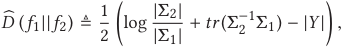

where _tr_ (Σ) is the trace of matrix Σ. We use this relative entropy to determine the discount factor for each version. Using the new conditional entropy _H_ (X _Y_ |XA) and relative entropy _D_� ( _f_ 1|| _f_ 2), we can extend the versioning mechanism in ARETE (Algorithm 1) to the multi-data query scenario. 

**Online Pricing Mechanism** Algorithm 3 presents the pseudocode of online pricing mechanism for multi-data query scenario. We reduce the online randomized pricing mechanism for multi-data query into multiple pricing mechanisms for single-data query in original ARETE, _i.e._ , Algorithm 2. We describe this reduction in the following procedure. 

**Step 1:** We first randomly partition the basic data commodities Y into two sets: Y1 and Y2, by placing each basic data commodity into Y1 with probability _<u>κ</u>_<u>1</u>, where_κ_is the maximum size of the required data commodities, _i.e._ , _κ_ = max _bi_ ∈B | _Yi_ |. 

**Step 2:** We ignore data consumers, who want zero or more than one basic data commodity in Y1, and only consider the data consumers who want exactly one data commodity in Y1. We denote this type of data consumers by B1 = � _bi_ ∈ B� ��| _Yi_ � Y1| = 1�. **Step 3:** We then set the prices of the basic data commodities in Y2 as zero, and effectively set the prices of the basic data commodities in Y1 with respect to the data consumers B1. Given a qualified data 

Mobihoc ’17, July 10-14, 2017, Chennai, India 

Zhenzhe Zheng, Yanqing Peng, Fan Wu∗ , Shaojie Tang¶ , and Guihai Chen 

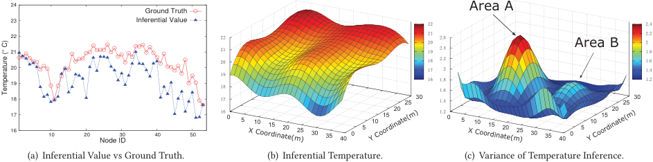

<!-- Start of picture text -->
 24 Ground Truth ������  23 Inferential Value �� ���  22 �� �� ��� ���  21 �� ���� ��� ������ ���� �� �� ��� ���  20 �� � ��� ��  19 �� �� ������ ���  18 �� �� �� ��� �� ��  17 16  10  20 Node ID 30  40  50 �� � � �� �� �� �� �� �� �� � � �� �� �� ��� � � �� �� �� �� �� �� �� � � �� �� �� (a) Inferential Value vs Ground Truth. (b) Inferential Temperature. (c) Variance of Temperature Inference. ��������������� ��������������� ��������������� ���������������  C)Temperature (° <!-- End of picture text -->

**Figure 2: Posterior mean and posterior variance of the temperature Gaussian Process estimated using all sensors.** 

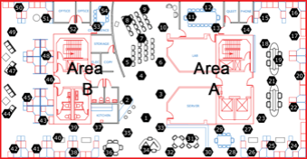

**Figure 3: Sensor network deployment with** 54 **nodes in one selected lab.** 

consumer _bi_ with _Yi_ ∩ Y = _y_ , a discount factor vector **d** _Yi_ , and a weight vector **W** _y_ , the Online Pricing Mechanism (abbreviated as _OPMy_ ) for single-data query can determine the price for the basic data commodity _y_ and the charge for the data consumer _bi_ (Line 3 to 4). The discount factor vector **d** _Yi_ for _Yi_ is calculated by versioning mechanism. All the other parameters for the algorithm _OPMy_ are the same for all the basic data commodities, and we omit them here. 

We show that the extended ARETE also achieves sub-optimal revenue. Due to the limitation of space, we reserve the detailed proof to our technical report [1]. 

Theorem 4.1. _Given a real value ϵ, there exists a constant θ such that for any valuation sequences with optimal revenue OPT_ ≥ _l_ × _θ_ × _δ_ × log log _δ , the extended ARETE is_ (1 + _ϵ_ ) _-competitive with respect to the optimal fixed price revenue._ 

Finally, we show that ARETE is arbitrage-free for different types of queries. 

Theorem 4.2. _ARETE is an arbitrage-free data pricing mechanism._ 

Proof. We say a query _q_ is “determined” by a query bundle { _q_ 1, _q_ 2, · · · , _qk_ } when the query _q_ can be answered by the query bundle. We prove that ARETE can resist arbitrage behaviours in both single-data query and multi-data query. 

▷ In the single-data query case, the query _q_ 1 with a low confidence level is determined by the query _q_ 2 with a high confidence level. According to our version selection rule in Algorithm 2, the version used to answer the query _q_ 1 is not higher than that used to answer _q_ 2. Since the lower version has a large discount factor, the discount offered to the query _q_ 1 is not less than that offers to _q_ 2. Therefore, the charge to _q_ 1 is always not less than the charge to _q_ 2. 

▷ In the multi-data query case, the multi-data query _q_ over the data commodity _Y_ is determined by the single-data query bundle { _q_ 1, _q_ 2, · · · , _q_ | _Y_ | }, where _qy_ is a single-data query over a basic data commodity _y_ in _Y_ . In extended ARETE, we set the price of the data commodity _Y_ as the sum of the basic prices of the basic commodities in _Y_ . Thus, no arbitrage behaviours exist in this query scenario. □ 

## **5 EVALUATION RESULTS** 

In this section, we evaluate ARETE on a public real-world sensory data set. 

**Sensory Data Set.** The data set we considered in our evaluations is the Intel sensed data set collected by Intel Berkeley lab between February 28th and April 5th, 2004. As shown in Figure 3, 54 Mica2Dot sensor nodes were deployed in the lab to collect multidimensional environment attributes, including temperature, humidity, light, voltage, and etc, in a real time manner. In our evaluations, we sample temperature measurements at 30 seconds intervals on 11 consecutive days (Starting Feb. 28th, 2004) in the lab with x- coordinate varying from 0m to 40.5m and y-coordinate varying from 0m to 31m. We set the upper right corner of the lab to be the origin with the coordinates (0, 0). We collect 11 data sets, randomly choose one of them as the data commodity, and use the remaining data sets to train the parameters of Gaussian Process model. 

For choosing Gaussian Process as the statistical model, we have to know the mean and kernel functions. In our evaluations, we use regression techniques to estimate the mean function. We assume that the kernel function is isotropic, which means that the covariance between two locations only depends on their corresponding distance. One canonical isotropic kernel function is Gaussian kernel −_d_<u>(</u>_a_<u>1,</u>_a_<u>2)2</u> function: K ( _a_ 1, _a_ 2) = _σ_2 exp � 2 _l_2 � , where _d_ ( _a_ 1, _a_ 2) is the distance between locations _a_ 1 and _a_ 2. Using the training data sets, we can learn the parameters _σ_ and _l_ by cross-validation. In order to verify the efficient description of the isotropic kernel function for our data sets, we compare the empirical data of each sensor node with the readings inferred via the data from the other 53 sensors. As Figure 2(a) shows, for most sensor nodes (around 85%), the error of the inferential readings are within 10% of the ground truth. We note that ARETE is independent of specific kernel functions. For more complicated environment, we can adopt some general anisotropic kernel functions [29]. After determining the mean and kernel functions, we can plot the posterior mean and posterior variance of the lab in Figure 2(b) and Figure 2(c), respectively, using Equation (1) 

An Online Pricing Mechanism for Mobile Crowdsensing Data Markets 

Mobihoc ’17, July 10-14, 2017, Chennai, India 

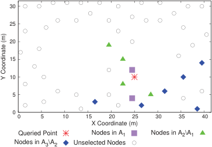

<!-- Start of picture text -->
 30  25  20  15  10  5  0  0  5  10  15  20  25  30  35  40 X Coordinate (m) Queried Point Nodes in A1 Nodes in A2\A1 Nodes in A3\A2 Unselected Nodes Y Coordinate (m) <!-- End of picture text -->

**Figure 4: Versioning results of the data commodity at location (25, 10).** 

and Equation (2). Figure 2(b) shows the areas near the windows (y-coordinates lie near 0.) have lower inferential temperature. From Figure 2(c), we observe that area _A_ and area _B_ , located in the center of the lab, have higher posterior variances, because in these areas with few sensor nodes deployed, we lack enough relative data to confidently infer their readings. 

**Evaluation Setup.** We introduce the setting of our evaluations. We regard the 54 sensor nodes as data providers in the context of data market. We create a finite mesh grid with mesh width 1m in the lab region, and obtain 1312 grid points, which are considered as basic data commodities. We emulate a large scale data market, in which the number of data consumers ranges from 105 to 106 with increment of 105 . We consider two classical valuation distributions: Uniform distribution and Normal distribution, and set the maximum valuation of data consumers as _δ_ = 256. We randomly generate an error bound _ϵi_ ∈ (0, 10] and an acceptable confidence level _ηi_ ∈ (0, 1] for each data consumer _bi_ ∈ B. All the evaluation results are averaged over 200 runs. 

## **5.1 Performance of ARETE** 

We implement ARETE, and compare its performance with three other pricing mechanisms: Optimal pricing mechanism (“OPT” for short), Random pricing mechanism (“Random” for short), and ARETE without versioning (“No Version” for short). In “OPT” mechanism, the valuations of all data consumers are known in advance, and thus we can calculate the off-line optimal revenue by setting a single fixed price. We note that the “OPT” is impractical as it requires the priori knowledge of data consumers’ valuations, but can be served as a bench mark in our evaluations. In “Random” mechanism, we randomly select a price in [1, _δ_ ] as the charge for each data consumer’s query. In order to investigate the impact of versioning mechanism on the data market’s performance, we also consider the ARETE without versioning, in which each data commodity only has the full version. Considering the computational overhead, we set _β_ to be 0.1, which can capture at least 90% of optimal revenue by Lemma 3.1. Since _α_ and _β_ jointly determine the trade-off between exploration and exploitation, we fix _α_ as 0.02, and adjust _γ_ to examine the role of exploration and exploitation in different valuation distribution scenarios. When the valuations are drawn from normal distribution, we set _γ_ = 0.1, and for uniform distribution, we set 

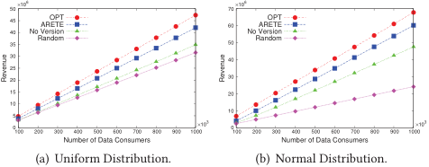

<!-- Start of picture text -->
 50 ×10 6  70 ×10 6  45 40 35 No VersionRandomARETEOPT  60 50 No VersionRandomARETEOPT  30  40  25  20  30  15  20  10  5  10  0 100  200  300  400  500  600  700  800  900  1000×10 3  0 100  200  300  400  500  600  700  800  900  1000×10 3 Number of Data Consumers Number of Data Consumers (a) Uniform Distribution. (b) Normal Distribution. Revenue Revenue <!-- End of picture text -->

**Figure 5: The revenue of ARETE under different valuation distributions.** 

_γ_ = 0.35. As we determine the price for data commodities independently, we only report the revenue of the selected data commodity at location (25, 10) in this set of evaluations. 

Figure 4 shows the versioning result of the data commodity at location (25, 10). The vector of conditional entropy for the three versions is **h** = (3.25, 2.75, 2.55). We recall that A _t_ denotes the set of data providers for the _t_ th version, and A _t_ +1\A _t_ denotes the data providers that only stay in A _t_ +1. In Equation (7), we set the scale parameter _λ_ as 2.77 to adjust the discount factors to appropriate values. Under this setting, we calculate the corresponding discount factors for the three versions as **d** = (0.36, 0.85, 1). From Figure 4, we observe that the data providers, neighboring the queried point, have a high probability to be selected into versioning results, because they are more informative to the queried point. At the same time, the versioning algorithm might ignore some data providers, although they are in the vicinity of the queried point, because their marginal entropy is relatively small given the currently selected data providers. 

Figure 5 shows the revenue of different pricing mechanisms, when the valuations follow two different distributions. Generally, in both normal distribution and uniform distribution, ARETE always outperforms the “Random” and “No Version” mechanisms, and approaches the results of “OPT”. The “Random” mechanism does not take any advantage of the collected valuation information, and achieves the worst performance. This performance degradation is especially severe in normal distribution scenario, because the “Random” mechanism does not adopt the exploitation process, which can significantly improve the performance when the valuations densely locate in a certain small range. In “No Version” pricing mechanism, data consumers with low required confidence levels cannot afford the high price of the full version, and the data vendor loses much revenue from these data consumers. We observe that ARETE mechanism gains around 90% revenue of the “OPT” in both uniform and normal distribution. This demonstrates that ARETE can adaptively learn the valuations of consumers, and set an appropriate price to obtain high revenue. From Figure 5, we can also see that the revenue increases linearly with respect to the number of data consumers. This is because data commodity is one kind of information goods and is unlimitedly supplied, and thus the data vendor can always gain revenue by selling more data commodities to more data consumers. 

## **6 RELATED WORK** 

We briefly review the related works in this section. 

Mobihoc ’17, July 10-14, 2017, Chennai, India 

Zhenzhe Zheng, Yanqing Peng, Fan Wu∗ , Shaojie Tang¶ , and Guihai Chen 

**Data Marketplace** In the seminal paper of data trading [4], Balazinska _et al._ visioned the implications of emerging data markets, and discussed the potential research opportunities in this direction. Later, Koutris _et al._ [24] poi-nted out the inflexibility of current data pricing approaches, and proposed a query-based data pricing framework, which requires two important properties: _arbitrage-free_ and _discount-free_ . Recently, Zheng _et al._ studied the problem of profit driven data acquisition in mobile crowd-sensed data market [39]. However, these previous works did not answer the fundamental question in data trading: how to determine the price for data? We tackle this open problem by designing a online pricing mechanism. 

**Mobile Crowdsensing:** The ubiquitous mobile devices with powerful sensors have boosted the rapid growth of diverse mobile sensing applications in numerous contexts. For example, Gu _et al._ presented crowdsensing-based indoor localization system [18]. Wang _et al._ designed CrowdAltas to automatically update maps based on people’s GPS traces [35]. The success of these applications highly depends on the supply of large amount of crowd-sensed data from crowds. Thus, researchers have proposed pricing mechanisms to incentivize workers to contribute their collected data [23, 38, 40]. However, currently, the operators collected and analyzed mobile crowd-sensed data for their own application purposes. To break this barrier, we proposed a data market to facilitate the exchange and trading of crowd-sensed data, enabling the potential usage of mobile data in new sensing applications. 

**Online Pricing Mechanism:** In this paper, we built a connection between data pricing design and online digital auction design [6, 7, 19]. By exploiting the machine learning techniques in multi-armed bandit problem [2], Blum _et al._ [7] proposed an online posted-price digital auction, achieving a constant competitive ratio with an additional loss term _O_ ( _δ_ log _δ_ log log _δ_ ). Later, Blum and Hartline [6] improved on the approximation results [7] by reducing the additive loss term to _O_ ( _δ_ log log _δ_ ). As for online auctions with multiple unlimited items and single-minded buyers, Balcan and Blum [5] proposed several approximation algorithms to achieve near-optimal revenue. In mobile crowd-sensed data markets, the trading data should be further partitioned into multiple versions to implement some levels of price discrimination, extracting revenue from different market segments. The major advantage of our work over the previous works is to model digital goods as divisible items, producing new challenges for online pricing mechanism design. 

## **7 CONCLUSION** 

In this work, we have proposed the first data market prototype to enable mobile crowd-sensed data trading on the Web. We have built a Gaussian Process model to capture the uncertainty of mobile data, and provided three basic query interfaces for data consumers to extract their needed information from the statistical model. We have considered the problem of revenue maximization, and proposed an online query-based data pricing mechanism, namely ARETE, containing two major components: a versioning mechanism and an online pricing mechanism. ARETE satisfies arbitrage-freeness, and achieves a constant competitive ratio. We have leveraged a realworld sensory data set to evaluate ARETE. The evaluation results show that ARETE outperforms the existing pricing mechanisms, and is almost as effective as the optimal fixed price mechanism. 

## **REFERENCES** 

- [1] An online pricing mechanism for mobile crowdsensing data market. Technical report, https://drive.google.com/open?id=0BzPQ3WpemY1Va0J4dEhBbS02ems, 2017. 

- [2] P. Auer, N. Cesa-Bianchi, Y. Freund, and R. E. Schapire. Gambling in a rigged casino: The adversarial multi-armed bandit problem. In _FOCS_ , 1995. 

- [3] Azure data marketplace. http://www.infochimps.com/. 

- [4] M. Balazinska, B. Howe, and D. Suciu. Data markets in the cloud: An opportunity for the database community. In _VLDB_ , 2011. 

- [5] M.-F. Balcan and A. Blum. Approximation algorithms and online mechanisms for item pricing. In _EC_ , 2006. 

- [6] A. Blum and J. D. Hartline. Near-optimal online auctions. In _SODA_ , 2005. 

- [7] A. Blum, V. Kumar, A. Rudra, and F. Wu. Online learning in online auctions. In _SODA_ , 2003. 

- [8] J.-M. Bohli, C. Sorge, and D. Westhoff. Initial observations on economics, pricing, and penetration of the internet of things market. _SIGCOMM Computer Communication Review_ , 39(2):50–55, 2009. 

- [9] R. Cheng, T. Emrich, H.-P. Kriegel, N. Mamoulis, M. Renz, G. Trajcevski, and A. Zufle. Managing uncertainty in spatial and spatio-temporal data. In _ICDE_ , 2014. 

- [10] T. M. Cover and J. A. Thomas. _Elements of information theory_ . John Wiley & Sons, 2012. 

- [11] N. Cressie. _Statistics for spatial data_ . John Wiley & Sons, 2015. 

- [12] Customlists. http://www.customlists.net/. 

- [13] Dataexchange. http://new.thedataexchange.com/. 

- [14] A. Deshpande, C. Guestrin, S. R. Madden, J. M. Hellerstein, and W. Hong. Modeldriven data acquisition in sensor networks. In _VLDB_ , 2004. 

- [15] W. Du, Z. Xing, M. Li, B. He, L. H. C. Chua, and H. Miao. Optimal sensor placement and measurement of wind for water quality studies in urban reservoirs. In _IPSN_ , 2014. 

- [16] Factual. https://www.factual.com/. 

- [17] Gnip. https://gnip.com/. 

- [18] F. Gu, J. Niu, and L. Duan. Waipo: A fusion-based collaborative indoor localization system on smartphones. _IEEE/ACM Transactions on Networking_ , 2017. DOI: 10.1109/TNET.2017.2680448. 

- [19] V. Guruswami, J. D. Hartline, A. R. Karlin, D. Kempe, C. Kenyon, and F. McSherry. On profit-maximizing envy-free pricing. In _SODA_ , 2005. 

- [20] Here. https://company.here.com/here/. 

- [21] Infochimps. http://www.infochimps.com/. 

- [22] Instagram. https://www.instagram.com/. 

- [23] M. Karaliopoulos, I. Koutsopoulos, and M. Titsias. First learn then earn: Optimizing mobile crowdsensing campaigns through data-driven user profiling. In _MobiHoc_ , 2016. 

- [24] P. Koutris, P. Upadhyaya, M. Balazinska, B. Howe, and D. Suciu. Toward practical query pricing with querymarket. In _SIGMOD_ , 2013. 

- [25] C. Meng, W. Jiang, Y. Li, J. Gao, L. Su, H. Ding, and Y. Cheng. Truth discovery on crowd sensing of correlated entities. In _SenSys_ , 2015. 

- [26] L. Mo, Y. He, Y. Liu, J. Zhao, S.-J. Tang, X.-Y. Li, and G. Dai. Canopy closure estimates with greenorbs: Sustainable sensing in the forest. In _SenSys_ , 2009. 

- [27] D. Monhor. A Chebyshev inequality for multivariate normal distribution. _Probability in the Engineering and Informational Sciences_ , 21(02):289–300, 2007. 

- [28] Nasdaq. http://www.nasdaq.com/. 

- [29] D. J. Nott and W. T. Dunsmuir. Estimation of nonstationary spatial covariance structure. _Biometrika_ , 89(4):819–829, 2002. 

- [30] A. Odlyzko. Paris metro pricing for the internet. In _EC_ , 1999. 

- [31] L. Sun, R. Cheng, D. W. Cheung, and J. Cheng. Mining uncertain data with probabilistic guarantees. In _KDD_ , 2010. 

- [32] Thingful. https://thingful.net/. 

- [33] Thingspeak. https://thingspeak.com/. 

- [34] V. Valancius, C. Lumezanu, N. Feamster, R. Johari, and V. V. Vazirani. How many tiers?: Pricing in the internet transit market. In _SIGCOMM_ , 2011. 

- [35] Y. Wang, X. Liu, H. Wei, G. Forman, C. Chen, and Y. Zhu. Crowdatlas: Selfupdating maps for cloud and personal use. In _MobiSys_ , 2013. 

- [36] C. K. Williams and C. E. Rasmussen. _Gaussian Processes for Regression_ . MIT, 1996. 

- [37] Xignite. http://www.xignite.com/. 

- [38] D. Yang, G. Xue, X. Fang, and J. Tang. Crowdsourcing to smartphones: incentive mechanism design for mobile phone sensing. In _MobiCom_ , 2012. 

- [39] Z. Zheng, Y. Peng, F. Wu, S. Tang, and G. Chen. Trading data in the crowd: Profit-driven data acquisition for mobile crowdsensing. _IEEE Journal on Selected Areas in Communications_ , 2017. DOI: 10.1109/JSAC.2017.2659258. 

- [40] Z. Zheng, Z. Yang, F. Wu, and G. Chen. Mechanism design for mobile crowdsensing with execution uncertainty. In _ICDCS_ , 2017. 

- [41] P. Zhou, Y. Zheng, and M. Li. How long to wait?: Predicting bus arrival time with mobile phone based participatory sensing. In _MobiSys_ , 2012. 

