# **On Designing Optimal Data Purchasing Strategies for Online Ad Auctions****∗** 

Zun Li, Zhenzhe Zheng, Fan Wu† , Guihai Chen Shanghai Key Laboratory of Scalable Computing and Systems Department of Computer Science and Engineering Shanghai Jiao Tong University, China 

{lizunks,zhengzhenzhe}@sjtu.edu.cn;{fwu,gchen}@cs.sjtu.edu.cn 

## **ABSTRACT** 

In online advertising, advertisers can purchase consumer relevant data from data marketplaces with a certain expenditure, and exploit the purchased data to guide the bidding process in ad auctions. One of the pressing problem faced by advertisers is to design the optimal data purchasing strategy (how much data to purchase to be competitive in bidding process) in online ad auctions. In this paper, we model the data purchasing strategy design as a convex optimization problem, jointly considering the expenditure paid during data purchasing and the benefits obtained from ad auctions. Using the techniques from Baysian game theory and convex analysis, we derive the optimal purchasing strategies for advertisers in different market scenarios. We also theoretically prove that the resulting strategy profile is the unique one that achieves Nash Equilibrium. Our analysis shows that the proposed data purchasing strategy can handle diverse ad auctions and valuation learning models. Our numerical results empirically reveal how the equilibrium state changes with variation of the strategic environment. 

## **CCS CONCEPTS** 

- **Theory of computation** → **Computational advertising the-** 

- **ory** ; _Algorithmic game theory_ ; _Solution concepts in game theory_ ; 

## **KEYWORDS** 

Ad Auctions; Targeting; Information Acquisition 

#### **ACM Reference Format:** 

Zun Li, Zhenzhe Zheng, Fan Wu† , Guihai Chen. 2018. On Designing Optimal Data Purchasing Strategies for Online Ad Auctions. In _Proc. of the 17th International Conference on Autonomous Agents and Multiagent Systems (AAMAS 2018), Stockholm, Sweden, July 10–15, 2018,_ IFAAMAS, 9 pages. 

## **1 INTRODUCTION** 

_Targeting_ is a technique to enable advertisers to deploy advertising campaigns on the consumers from certain market segments, such that the advertisers can spend their finite ad budgets on the most relevant consumer. It is difficult to conduct and evaluate a qualified advertising without enough consumer relevant data. Fortunately, with the advance of online tracking techniques, the advertisers now 

∗This work was supported in part by the State Key Development Program for Basic Research of China (973 project 2014CB340303), in part by China NSF grant 61672348, 61672353, 61422208, and 61472252, in part by Shanghai Science and Technology fund 15220721300, and in part by the Scientific Research Foundation for the Returned Overseas Chinese Scholars. The opinions, findings, conclusions, and recommendations expressed in this paper are those of the authors and do not necessarily reflect the views of the funding agencies or the government. 

can collect a large amount of relevant data, such as third-partycookies [6, 19, 26, 49], to build the profiles of consumers, and then conduct accurate targeted advertising. 

The consumer relevant data is currently traded over the Internet. The collection and distribution of consumer relevant data are conducted by Data Management Platforms, ranging from wellknown data analysis companies such as Acxiom1 and Bloomberg2 , to emerging companies such as Bluekai3 and eXelate4 . Data Management Platforms create online marketplaces, where these companies can upload consumers relevant data to make profits, and advertisers can purchase the desired datasets to enable targeted advertising. The marketing demand for such highly detailed, consumer-level data is mostly driven by advertising industries. 

In advertising ecosystem, major search engines are now leveraging auctions as main monetization channels [16, 21, 32, 42], including forms of sponsored search auctions [31, 39, 42, 43] and realtime bidding (RTB) [12, 14, 50]. In sponsored search, a selective set of ads related to the user query will be shown together with returned relevant webpages after in the search engine, while In RTB for display advertising, an ad impression with related information will be sent to advertisers through the ad exchange when the user visits the website. For both scenarios, auctions are held and bids are collected to determine the ad allocations and corresponding charges. However, the uncertainty of valuations over the ad slots, which may varies across advertisers, causes difficulties for launching successful ad campaigns. Without full information about the consumers, it is hard for advertisers to extract the precise valuations for the ad slots. Either underestimation or overestimation of valuations could lead to improper bidding strategies in ad auctions. 

Therefore, Data Management Platforms have become demanding places for advertisers to refine their valuations by purchasing consumer relevant data. By buying enough amount of data, the advertisers can extract valuable information about the demographic and psychographic characteristics of consumers via the data mining techniques [19, 49], and further tailor their ad campaigns to their preferred consumers. While advertisers can learn more precise valuations from buying a larger amount of data, they also have to pay more money for such purchasing, or exert more efforts or energy to extract such valuable information. Hence, one of the pressing problems faced by advertisers is to design an optimal data purchasing strategy by making a trade-off between the expenditure paid during data purchasing and the expected utility increase in the auction. 

There are several challenges in designing such a data purchasing strategy for online ad auctions. The first challenge comes from the various formats of ad auctions. The ultimate goal of an advertiser 

†F. Wu is the corresponding author. 

_Proc. of the 17th International Conference on Autonomous Agents and Multiagent Systems (AAMAS 2018), M. Dastani, G. Sukthankar, E. André, S. Koenig (eds.), July 10–15, 2018, Stockholm, Sweden_ . © 2018 International Foundation for Autonomous Agents and Multiagent Systems (www.ifaamas.org). All rights reserved. 

> 1Acxiom: http://www.acxiom.com/ 

> 2Bloomberg: http://www.bloomberg.com/ 

> 3Bluekai: http://www.bluekai.com/ 

> 4eXelate: http://exelate.com/ 

is to purchase an appropriate amount of data to maximize her expected utility in ad auctions. Thus, the data purchasing strategy design is highly related to the specific procedure of the auction. However, the variety of ad auctions in practice, such as Generalized Second Price (GSP), Generalized First Price (GFP) [21], and Vickrey-Clarke-Groves (VCG) mechanism [17, 29, 47], increases the difficulty in analyzing data purchasing strategies. 

The second challenge comes from the diverse valuation learning models of advertisers. The data purchasing strategy design is to solve the payoff maximization problem under the strategic environment. The payoff of an advertiser is defined as the difference between the utility obtained from ad auction and the expenditure paid to purchase consumer relevant data. In order to extract true valuations and then obtain high utilities in ad auctions, advertisers may adopt diverse valuation learning models [33, 34, 44] upon the purchased data. Without specifying the learning procedure of other advertisers, an advertiser may not be possible to infer her competitors’ data purchasing strategies, which significantly increases the difficulty of designing an optimal data purchasing strategy. 

In this paper, we develop a framework to solve the optimal data purchasing strategy design problem, by jointly considering the above challenges. We first model the various ad auctions as Bayesian games with the same ad allocation rule. Using Payoff Equivalence Principle [38], we demonstrate that the expected utilities of advertisers are independent on the specific formats of ad auctions, decoupling the data purchasing stage from the auction stage. We then propose a data purchasing model to capture the diverse valuation learning models of advertisers, and formulate the optimal data purchasing strategy design as a convex optimization problem. Using the techniques from game theory and convex analysis, we can explicitly derive the optimal data purchasing strategy for advertisers, and theoretically prove that such a strategy profile is a unique Nash Equilibrium. Our numerical results further illustrate how would advertisers behave under various strategic environments. We summarize our key contributions in this work as follows. 

• First, we propose a general framework consisting of an ad auction model and a data purchasing model. The framework is powerful enough to comprehend a variety of ad auction formats and different classes of learning agents, as well as to express the trade-offs advertisers have to consider when purchasing data. To the best of our knowledge, we are the first to study the data purchasing strategy design in an online ad auction setting. 

• Second, we begin with considering a simple but representative case, where two Gaussian Learning agents compete for two different ad slots. We rigorously prove the existence and uniqueness properties of the Nash Equilibrium, as well as verify several intuitions of the equilibrium structure under both homogeneous and heterogeneous settings. Through this basic case, we demonstrate the rationale of finding the optimal data purchasing strategy. 

• Third, we further extend this work by considering a more general scheme, where there can be a finite arbitrarily number of advertisers and slots. We show a general method to calculate the optimal strategy, and prove that the uniqueness and existence of the equilibrium are guaranteed given that the agents’ learning processes satisfy a particular structure. 

• Last but not least, we conduct a numerical study on two particular types of learning agents under our framework. We empirically reveal how much information will advertisers purchase under different strategic environments. 

The rest of this paper is organized as follows. Section 2 provides the notations and the basic framework used throughout this paper. 

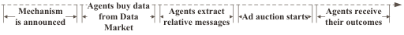

<!-- Start of picture text -->
Mechanism Agents buy datafrom Data  Agents extract Ad auction starts Agents receive is announced Market relative messages their outcomes <!-- End of picture text -->

### **Figure 1: The timing of the game.** 

In Section 3, we solve the optimal strategy design under a simple setting. In Section 4, we extend the model to a more general scheme and provide the corresponding theorems. Numerical results are provided in Section 5 to show how the different strategic environments affect the optimal strategies. Related works are reviewed in Section 6. We summarize our work in Section 7. 

## **2 PRELIMINARIES AND PROBLEM FORMULATION** 

In this section, we develop models and notations used throughout this paper. Since we focus on the data purchasing strategy design in context of online advertising, which is related to the formats of ad auctions, we first present the ad auction model and then the data purchasing model. 

As shown in Figure (1), we consider one round of ad auction which can be regarded as a two-stage game: it consists of a data purchasing (DP) stage and an ad auction stage. We will later specify that the first stage is a complete information game while the second is a Bayesian game. From now on we refer the advertisers as the agents in the model. First, the auctioneer announces the rules of ad auction. Next, agents purchase data from Data Market according to some strategies. After that, agents extract messages from purchased data, and refine their knowledge about their valuations over ad slots according to some learning model. Finally, all agents participate in the ad auction with their updated knowledge and receive the outcomes. 

## **2.1 Ad Auction Model** 

There are _N_ agents competing for _K_ ≤ _N_ ad slots. Denote _ωi_ as the valuation of agent _i_ ’s ad for a click. In practice, there may be different classes of agents each round [11], and the valuation of one slot to different agents with various experience and identities is not fixed [2]. We capture these uncertainties by modeling that in prior, valuations of agents within the same class are identically distributed, while valuations of agents of different classes are independent [35, 41, 46]. We let _η_ ( _i_ ) be the class of _i_ , which is interpreted as the finest prior information to distinguish between the agents. In our framework _η_ ( _i_ ) indicates: (1) the prior valuation distribution, and (2) the cost function (described in Section 2.2), of agent _i_ . The prior distribution for agents of class _η_ ( _i_ ) is denoted as _Fη_ ( _i_ ), _i.e._ , _ωi_ ∼ _Fη_ ( _i_ ). We assume the class information to be public prior knowledge, which is widely adopted by works regarding classical Bayesian game theory [28, 30]. Regarding her own valuation, we suppose _i_ just knows as much as anybody else before purchasing data, _i.e._ , _Fη_ ( _i_ ) . But after _i_ having purchased and learned from data (targeting), from her point of view the knowledge of _ωi_ is updated from _Fη_ ( _i_ ) to a new distribution, which is not observed by others. 

Every agent reports her bid _bi_ and therefore gets ranked by it. Then some agents win and obtain their positions from top to bottom according to their ranking, leaving those who lost unassigned. Each ad slot _j_ has a corresponding click-through-rate (CTR) _cj_ . We restrict _cj_ ≡ 0 for _j_ > _K_ and denote c = ( _c_ 1, _c_ 2 . . . _cN_ )_T_ as the CTR profile. In this paper, we assume _c_ 1 > _c_ 2 > . . . > _cK_ > 0. 

The auctioneer sorts the agents in descending order of their bids. The allocation rule can be represented as _x_ : R_N_ �→ _c__N_ . More specifically, given bid profile b = ( _b_ 1, _b_ 2 . . . _bN_ ), _xi_ (b) = _cj_ if and only if _bi_ is the _j_ -th highest bid in b (ties are broken randomly). Then agent _i_ ’s utility would be _ui_ = _ωi xi_ (b) − _pi_ (b), where _pi_ (b) is her charge according to some payment rule. 

The study of the equilibrium in ad auctions is of the central role in most works in this field. We formally define the bayesian view of equilibrium concept in our ad auction model as follows. _Definition 2.1 (Bayesian-Nash Equilibrium in Position Auction (BNEPA))._ A profile of ( _b_ 1∗,_b_ 2∗. . ._b_ _N_∗) forms a Bayesian-Nash Equi- librium in a position auction if ∀ _i_ , _b_′ , E[ _ui_ ( _bi_∗,_b_ −∗ _i_)]≥E[_ui_(_b_′,_b_ −∗ _i_)]. 

The guarantee of equilibriums is closely related to the allocation rule, payment rule, and the distribution of agents [28]. However, analyzing the existence of equilibrium of a particular form of position auction is not our main focus in this work. We will assume that the mechanism announced by the auctioneer will always guarantee agents to reach a _BNEPA_ , which is formally defined as follows. 

_Definition 2.2 (Standard Position Auction (SPA) )._ A position auction is called an Standard Position Auction, if there always exists a _BNEPA_ regardless of the strategies in DP stage. 

Examples of SPA include _laddered auction_ proposed by [3] for its truthful dominant strategy. Generally speaking any position auctions with VCG-like payment rule are SPA for the same reason. However, things become complicated when coming to payment rules of GFP and GSP. The authors of [13] proved there exists only one symmetric BNE in a class of ad auctions representing by GFP. And [28] provided with a necessary and sufficient condition for GSP to have BNE in a symmetric setting. Leveraging Payoff Equivalence Principle [38], the expected payoffs of agents at auction stage at a _BNEPA_ is independent on its auction format, which will help us simplify the computations. In the remaining of this paper, we will assume the existence of _BNEPA_ at the auction stage, and focus on designing optimal strategy for DP stage. 

## **2.2 Data Purchasing Model** 

At data purchasing stage agents _i_ may acquire a costly signal (data) _si_ to refine her knowledge of _ωi_ (targeting) , with _si_ ∈ [ _<u>s</u>_ <u>,</u> _~~s~~_ ]. Signals received by different buyers are independent. The advertiser can choose the quality of signal, _αi_ , she buys, with higher _αi_ indicating a more precise picture of _ωi_ but also costing more, and _αi_ ∈ [ _<u>α</u>_ <u>,</u> _~~α~~_ <u>]. Agents of the same class</u> _µ_ = _η_ ( _i_ ) as _i_ have the same cost function Φ _µ_ ( _α_ ), which is assumed to be public knowledge, satisfying Φ _µ_ ( _<u>α</u>_ ) = 0 and is non-decreasing in signal quality _α_ . We interpret Φ _µ_ as the cost to acquire a certain level of information for _i_ , including like the unit price of data, or _i_ ’s time or energy cost of data mining on such amount of data. So the cost for the same quality of data may vary across different classes of agents. The qualities of data agents choose to purchase will also be referred as their DP strategies. We will later define and show how to find the equilibrium ( _α_ 1∗,_α_ 2∗. . ._α_ _N_∗) in data purchasing stage. 

Advertiser _i_ who has data quality _αi_ will update her belief about _ωi_ according to Bayes Rule: her knowledge of _ωi_ updates from _Fη_ ( _i_ ) to _Fi_′, with mean_vi_updated to_v_ _i_′and_ωi_,_vi_,_v_ _i_′∈[_<u>ω</u>_ <u>,</u> _~~ω~~_ <u>]. We assume</u> agent _i_ will choose her bidding strategy _bi_ according to posterior mean _vi_′,_i.e._, she submits_bi_(_v_ _i_′) according to some function_bi_(·) at auction stage. More precisely, _vi_′(_si_,_αi_)≡E[_ωi_|_si_,_αi_]. Notice that the knowledge of _vi_′is uncertain before acquiring_si_, so we need to introduce _Hαi_ ( _v_ ) = _Pr_ { _vi_′(_si_,_αi_)≤_v_} as the prior cumulative 

distribution of _vi_′with index_v_and parameter_αi_, and let_hαi_be the corresponding density function. For the simplicity of notation, we may interchangeably denote _Hαi_ ( _x_ ) = _Hi_ in this paper. 

## **2.3 Problem Formulation** 

Our goal is to properly formulate the problem agents facing at DP stage, to define the notion of the optimal DP strategy, and to show how to calculate such strategy. To handle the first task in this subsection, we now have to trace agents’ decision-making process backward from auction stage to DP stage. 

Suppose agents choose a DP strategy _α_ = ( _α_ 1, _α_ 2 . . . _αN_ ) given a _BNEPA_ ( _b_ 1∗,_b_ 2∗. . ._b_ _N_∗)alreadyhavebeenreachedattheSPA. Then from agents _i_ ’s point of view, by Integral-form Envelope Theorem [38], her expected utility can now be written as [28] 

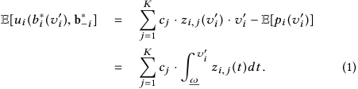

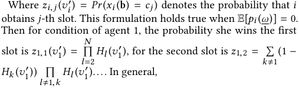

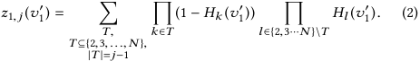

And similar derivations for other _zi_ , _j_ . To simplify notation we define a auxiliary function _Qi_ ( _t_ ) = � _K cj_ · _zi_ , _j_ ( _t_ ), then equation (1) _j_ =1 can be simplified as � _<u>ωvi</u>_ ′ _Qi_ ( _t_ ) _dt_ . 

With the above derivations, we can now consider _i_ ’s DP strategy. Since _vi_′is unknown prior to_si_, we should do expectation of_ui_in equation (1) with respect to _vi_′: 

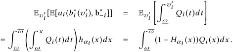

Considering the expenditure paid during DP and the outcome received during auction, the agents choose their DP strategies according to the following optimization problem: 

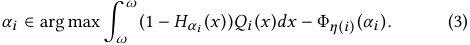

Denote the above payoff to be optimized as _πi_ ( _αi_ , _α_ − _i_ ). Comparing equation (1) and (3), we would find goals of two stages are totally different: for auction stage it is to choose some bidding strategy to maximize utility expectation (1), while for DP stage it is to choose some _α_ to maximize the deterministic payoff (3). So the auction stage should be considered as a Bayesian game while the DP stage is a complete information game. For DP stage, its equilibrium concept is defined as follows. 

_Definition 2.3 (Nash Equilibrium in Data Purchasing (NEDP ))._ A data purchasing strategy profile ( _α_ 1∗,_α_ 2∗. . ._α_ _N_∗)formsaNash Equilibrium if for any _i_ , _α_′ , we have _πi_ ( _αi_∗,_α_ −∗ _i_)≥_πi_(_α_′,_α_ −∗ _i_). 

Thus, our goal is to derive optimal data purchasing strategy _α_∗ under different scenarios. We start from solving a simple case. 

## **3 GAUSSIAN LEARNING WITH LINEAR COST** 

In this section, we focus on a simple scenario to demonstrate the basic rationale of finding the optimal DP strategy. In this simple case, there are 2 ad slots and 2 agents, _i.e._ , each agent is guaranteed to win a slot. We describe one representative scheme under the framework developed in Section 2. Specifically, in the auction stage, the payment rule would be VCG mechanism in position auction [21]. Thus, truthful report would be the dominant strategy towards equilibrium state. In consistence with previous economic learning models, in the DP stage Gaussian (GAS) Learning Model is adopted for advertisers, for it nicely quantify the “quality of signals" and is feasible to estimate empirically [15, 23]. We solve this model by proving properties such as the existence and uniqueness of the equilibrium as well as showing how to calculate the optimal DP strategy, for both homogeneous and heterogeneous settings. 

## **3.1 Setup** 

Since there are only two agents, for the simplicity of notations we will suppress the class indexes and let agents’ names represent their own belonging classes: _η_ (1) = 1, _η_ (2) = 2. Agents have Gaussian priors of their valuations: _Fi_ = N ( _vi_ , _β_<u>1</u> _i_), where_βi_> 0 measures the precision of the information _i_ at hand in prior. After purchasing data of quality _αi_ , agents _i_ receives some private information, works out some data mining, and then obtains _si_ = _ωi_ + _ϵi_ , _ϵi_ ∼N (0, _<u>α</u>_<u>1</u> _i_). Here only the summation _si_ is observed by _i_ , and the noise term _ϵi_ is independent on _ωi_ . So we can see that the higher quality _αi_ is acquired, the more precise the signal is. Agents follow a Gaussian Learning and update their beliefs about _ωi_ according to Bayes Rule: <u>1</u> _ωi_ | _si_ , _αi_ ∼N ( _vi_′, _αi_ + _βi_), where_v_ _i_′=_αi_ _α__si_ _i_+ +_<u>β</u>_ _β__<u>i</u>_ _i__vi_ . To form the optimization problem, we now have to compute the learning structure _H_ . According to the properties of Gaussian Distribution, it can be calculated that the distribution of _vi_′prior to _si_ is N ( _vi_ , _σi_2), where_σ_ _i_2= _βi_ ( _ααii_ + _βi_ ). Therefore, _Hαi_ ( _v_ ) = 1 exp −<u>(</u>_x_−_vi_<u>)2</u> _dx_ . (4) �−∞ _v_ ~~<u>�</u>~~ 2 _πσi_2  2 _σi_2  

We assume the cost is linear: Φ _i_ ( _αi_ ) = _ϕi_ ( _αi_ − _<u>α</u>_ ), _ϕi_ > 0. 

From now on we start to consider the problem from agents 1’s point of view. Corresponding to equation (1), the expected utility for 1 at auction stage when truthful report is 

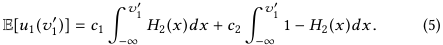

The following lemma shows that there always exists an equilibrium as long as their prior means are the same, which means equilibrium is reachable for agents with similar beliefs. 

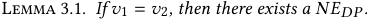

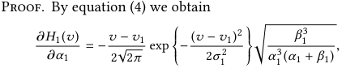

And notice that 

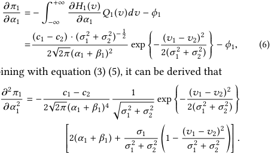

combining with equation (3) (5), it can be derived that 

And the same form for agents 2. So it can be observed that when _v_ 1 = _v_ 2, we have _πi_ being strictly concave in _αi_ . By Proposition 8.D.3 in [37], since the strategy space for every agents is [ _<u>α</u>_ <u>,</u> _~~α~~_ <u>],</u> which is a nonempty, convex and compact subset of Euclidean space, combining with that _πi_ is continuous in ( _α_ 1, _α_ 2) and concave in _αi_ , there exists a Nash equilibrium. □ 

## **3.2 Homogeneous Agents** 

In this subsection, we restrict agents to be homogeneous, meaning both of them belong to the same class. _i.e._ , _v_ 1 = _v_ 2 = _v_ , _β_ 1 = _β_ 2 = _β_ , _ϕ_ 1 = _ϕ_ 2 = _ϕ_ . We claim there is one and only one equilibrium in this setting, and we also show how to derive such purchasing strategy in the proof. 

Theorem 3.2. _For 2 homogeneous agents, 2 slots with GAS Learning and linear cost, there exists a symmetric and unique NEDP ._ 

Proof. By lemma 3.1, there must exist a _NEDP_ when _v_ 1 = _v_ 2 = <u>1</u>+_σ_2 <u>2</u><u>)−1</u> <u>2</u> _v_ . Denote _νi_ ( _α_ 1, _α_ 2) =<u>(</u>_c_1−_c_2)·(_σ_2 , then we check the _Karush-_ 2 ~~√~~ 2 _π_ ( _αi_ + _βi_ )2 _Kuhn-Tucker_ (KKT) first order condition for agents _i_ ’s problem, 

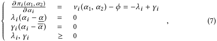

here _λi_ and _γi_ are the Lagrange multipliers for restrictions _αi_ ≥ _<u>α</u>_ and _αi_ ≤ _~~α~~_ respectively. 

Suppose there exists an asymmetric equilibrium ( _α_ 1∗,_α_ 2∗),_w.l.o.g._ assuming that _α_ 1∗<_α_ 2∗.Thisimplies_α_ 1∗< _~~α~~_ and _α_ 2∗>_<u>α</u>_ <u>.</u> Then <u>1</u>,_α_∗ <u>2</u><u>)</u> by (7), _γ_ 1 = 0 and _λ_ 2 = 0. So we have∂_π_1 ∂<u>(</u>_α_ _α_∗ 1 = − _λ_ 1 ≤ 0 and∂_π_2 ∂<u>(</u>_α_ _α_∗ <u>12</u>,_α_∗ <u>2</u><u>)</u> = _γ_ 2 ≥ 0. Then _ϕ_ = Φ1′(_α_ 1∗)≥_ν_1(_α_ 1∗,_α_ 2∗)> _ν_ 2 ( _α_ 1∗,_α_ 2∗)≥Φ 2′(_α_ 2∗)=_ϕ_. Which is a contradiction. So_α_ 1∗=_α_ 2∗. Now we prove the uniqueness of the equilibrium. First we show the interior equilibrium is unique. By (7), ∂<u>∂</u> _α__<u>πi</u>_ _i_= 0 for the interior equilibrium. Since we have proved the equilibrium must be symmetric, this shows that∂_πi_ ∂<u>(</u> _α__α_<u>,</u>_α_<u>)</u> = 0. _i.e._ , _νi_ ( _α_ , _α_ ) − _ϕ_ = 0. Since _σi_ is increasing in _αi_ and _νi_ ( _α_ , _α_ ) is decreasing in _α_ , therefore, it guarantees the uniqueness of interior equilibrium. Then let us look at the corner equilibrium. There is only two possible corner equilibriums ( _~~α~~_ ~~,~~ _~~α~~_ ) and ( _<u>α</u>_ <u>,</u> _<u>α</u>_ ). Suppose these two equilibriums exist simultaneously, by (7) we have ∂<u>∂</u> _α__<u>πi</u>_ _i_= −_λi_≤0 at ( _<u>α</u>_ <u>,</u> _<u>α</u>_ ) and ∂<u>∂</u> _α__<u>πi</u>_ _i_=_γi_≥0 at( _~~α~~_ ~~,~~ _~~α~~_ ). But this implies _ϕ_ ≥ _νi_ ( _~~α~~_ ~~,~~ _~~α~~_ ) > _νi_ ( _<u>α</u>_ <u>,</u> _<u>α</u>_ ) ≥ _ϕ_ . Since _<u>α</u>_ < _~~α~~_ <u>, this yields a contradiction. So the corner</u> equilibrium must be unique. 

Finally we show the interior equilibrium and corner equilibrium cannot exist concurrently. _W.l.o.g._ , suppose there is an interior equilibrium ( _α_∗ , _α_∗ ) and a corner equilibrium ( _<u>α</u>_ <u>,</u> _<u>α</u>_ ). Then we have <u>∂</u> _<u>πi</u>_ ∂ _αi_=0 at(_α_∗,_α_∗)and ∂<u>∂</u> _α__<u>πi</u>_ _i_=_γi_≥0 at(_<u>α</u>_ <u>,</u> _<u>α</u>_ ). But we again see that _ϕ_ = _νi_ ( _α_∗ , _α_∗ ) < _νi_ ( _<u>α</u>_ <u>,</u> _<u>α</u>_ ) = _ϕ_ , contradicting to _<u>α</u>_ < _α_∗ . So the corner equilibrium and the interior equilibrium cannot both exist. Therefore, we have completed the proof that the equilibrium must be symmetric and unique. □ 

Under homogeneous setting, we can observe that only prior precision _β_ and marginal cost _ϕ_ affect the interior equilibrium _α_∗ . Since the analytic form of _ν_ is provided, we can calculate the optimal DP strategy in equation _ν_ ( _α_ ) − _ϕ_ = 0, simply by resorting to classical root-finding algorithms, such as Newton’s method or Secant method. The relation between _α_∗ with _β_ , _ϕ_ are drawn in Figure 2. We can observe that for fixed _ϕ_ , _α_ first increases with _β_ then decreases, showing the trade-offs agents have to make between enhancing the precision of knowledge and paying for such acquisitions. Also agents will tend to purchase less data for higher marginal cost, confirming intuition. 

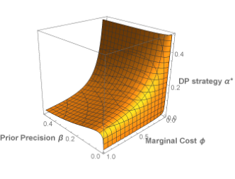

### **Figure 2: Homogeneous agents.** _c_ 1 = 1, _c_ 2 = 1/2 

Furthermore, if we view _ϕ_ as the unit price of cookies and let _Rev_ = 2 _ϕα_∗ be the revenue of the platform provider, we can determine the corresponding revenue-maximization price for Data Market by a simple first-order derivation. 

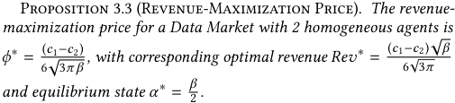

## **3.3 Heterogeneous Agents** 

In this subsection, we consider two directions of modeling heterogeneous agents. More concretely, we restrict that _v_ 1 = _v_ 2 = _v_ , and their classes differ only in that either _ϕ_ 1 � _ϕ_ 2, or _β_ 1 � _β_ 2. For these heterogeneous settings, it is intuitive that (1) agent with higher precision of prior knowledge will acquire less data when their cost functions are the same, or (2) agent who has a higher marginal cost of acquiring data (for example, poor data mining technology) will buy less even their prior beliefs are the same. We will first formally define these intuitions and verify them through a detailed and rigorous analysis. 

_Definition 3.4 (Intuitive Equilibrium)._ A profile of ( _α_ 1∗,_α_ 2∗) forms an intuitive equilibrium if _α_ 1∗≥_α_ 2∗under condition when_ϕ_1<_ϕ_2 and _β_ 1 = _β_ 2, or condition when _ϕ_ 1 = _ϕ_ 2 and _β_ 1 < _β_ 2, vice versa. 

Theorem 3.5. _For 2 heterogeneous agents, 2 slots with GAS Learning and linear cost, there exists a unique NEDP , and it must be intuitive._ 

Proof. First we prove that any equilibrium ( _α_ 1∗,_α_ 2∗)mustbe <u>1</u>+_σ_2 <u>2</u><u>)−</u> <u>2</u><u>1</u> intuitive. Denote _νi_ ( _α_ 1, _α_ 2, _β_ 1, _β_ 2) =<u>(</u>_c_1−_c_2)·(_σ_2 . 2 ~~√~~ 2 _π_ ( _αi_ + _βi_ )2 

Consider when _β_ 1 = _β_ 2 = _β_ but _ϕ_ 1 < _ϕ_ 2. Suppose _α_ 1∗<_α_ 2∗. Then it implies _α_ 1∗< _~~α~~_ and _α_ 2∗>_<u>α</u>_ <u>. Then</u> ∂<u>∂</u> _α__<u>π</u>_<u>1</u> 1= −_λ_1≤0 and ∂<u>∂</u> _α__<u>π</u>_<u>2</u> 2=_γ_2≥ 0, so again we have _ϕ_ 2 ≤ _ν_ 2 ( _α_ 1∗,_α_ 2∗,_β_,_β_)<_ν_1(_α_ 1∗,_α_ 2∗,_β_,_β_)≤_ϕ_1, a contradiction, so we must have _α_ 1∗≥_α_ 2∗when_ϕ_1<_ϕ_2. Then consider another case when _ϕ_ 1 = _ϕ_ 2 = _ϕ_ but _β_ 1 < _β_ 2. Similarly we can derive that _ϕ_ ≤ _ν_ 2 ( _α_ 1∗,_α_ 2∗,_β_1,_β_2)<_ν_1(_α_ 1∗,_α_ 2∗,_β_1,_β_2)≤ _ϕ_ . It is also a contradiction. So _α_ 1∗≤_α_ 2∗when_β_1>_β_2. Finally we prove the uniqueness of equilibrium. The uniqueness of corner equilibrium can be proved similar to Theorem 3.2. Consider an interior equilibrium ( _α_ 1∗,_α_ 2∗) which must satisfy 

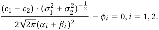

Comparing the forms of _i_ = 1, 2 we have 

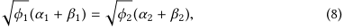

It serves as a constraint for an equilibrium ( _α_ 1∗,_α_ 2∗). Suppose there exists another interior equilibrium ( _α_ 1′,_α_′ 2),where_α_′ 1<_α_ 1∗.By equation (8) we have _α_ 2′<_α_ 2∗. Then_νi_(_α_′ 1,_α_′ 2,_β_1,_β_2)>_νi_(_α_ 1∗,_α_ 2∗,_β_1,_β_2)= _ϕi_ . Which implies ( _α_ 1′,_α_′ 2) is not an interior equilibrium. Then there is only one interior equilibrium. The interior equilibrium and corner equilibrium cannot exist concurrently for the same reason described in Theorem 3.2. So we now have completed the proof. □ 

The optimal DP strategy can also be calculated by applying rootfinding algorithms to equations _νi_ − _ϕi_ = 0. From Figure 3, we can observe that one’s optimal DP strategy would increase with her adversary’s prior precision and marginal cost. 

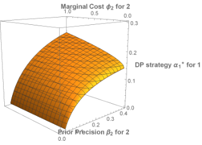

**Figure 3: Heterogeneous agents.** _c_ 1 = 1, _c_ 2 = 1/2, _β_ 1 = 0.2, _ϕ_ 1 = 0.4. 

## **4 GENERAL LEARNING MODEL WITH CONVEX COST** 

In this section, we consider a more general scheme for any _N_ ≥ 2, _K_ ≥ 1. Here we assume the prior valuation distributions to be homogeneous for all agents: _Fη_ ( _i_ ) = _F_ . We extend the linear cost model adopted in Section 3 to the space of all convex functions Φ _η_ ( _i_ ), which captures the fact that valuable information becomes rare and harder to find as more efforts are exerted or time is wasted. 

The difference between distinct classes of agents would be reflected by their cost functions Φ _η_ ( _i_ ). The learning structure _Hαi_ follows the same form for all agents. 

First we focus on a homogeneous setting where Φ _η_ ( _i_ ) = Φ. The following theorem shows that, as long as the learning process _H_ is strict log-convex with respect to _α_ , the existence, the symmetry as well as the uniqueness of equilibrium are assured. The intuition of building such learning structure is that with more data, the relative probability of information gain from DP would be larger. 

Theorem 4.1. _For an SPA A , if Hαi is strict log-convex with respect to αi , i.e.,_∂2 lo ∂ _α_<u>g</u>_H_ _i_2_αi_ > 0 _, then there exists a symmetric and unique NEDP for homogeneous agents._ 

We refer to Appendix A for the detailed proof of this theorem. From the proof, we can find the purchasing strategy can be obtained by calculating an equation _Wi_ ( _α_ ) = 0 via root-finding algorithms. 

We next consider a heterogeneous setting, where marginal cost function Φ _η_′ ( _i_ )mayvaryacrossdifferentagents.Weprovethat classes of higher marginal cost will always acquire less information at an _NEDP_ , as one direction of generalization for Theorem 3.5. 

_Definition 4.2 (General Intuitive Equilibrium)._ An _NEDP_ is generally intuitive if it satisfies that agents of the same class acquire the same quality of data: ∀ _i_ ( _µ_ = _η_ ( _i_ )) ⇒∃ _αµ_ ( _αi_∗=_αµ_). Moreover, class with larger marginal cost will acquire less data: ∀ _i_ , _д_ ( _µ_ = _η_ ( _i_ ))∧ ( _δ_ = _η_ ( _д_ )) ∧∀ _α_ �Φ′ _µ_ ( _α_ ) > Φ _δ_′(_α_) � ⇒ _αi_∗≤_αд_∗. 

Theorem 4.3. _For an SPA A , if Hαi is log-convex with respect to αi , i.e.,_∂2 lo ∂ _α_<u>g</u>_H_ _i_2_αi_ > 0 _, then if NEDP exists, it must be intuitive for heterogeneous agents._ 

The proof of Theorem 4.3 is provided in Appendix B. A representative learning model is the Truth-or-Noise learning, which we are going to formally define below. It is easy to verify its log-convexity. As indicated by the name, in this model the quality of signal is interpreted as the probability that an agent obtains the ground-truth of _ω_ , which is also consistence with existing works concerning targeting [9]. 

_Definition 4.4 (Truth-or-Noise Learning Model)._ In truth-or-noise learning model, priors are uniform distributions on [ _<u>ω</u>_ <u>,</u> _~~ω~~_ <u>]. In other</u> words, _F_ ( _x_ ) = _~~ω~~__x_− −_<u>ω</u>_ _<u>ω</u>_ , _x_ ∈ <u>[</u> _<u>ω</u>_ <u>,</u> _~~ω~~_ <u>].</u> _F_ ( _x_ ) = 0 when _x_ < _<u>ω</u>_ and _F_ ( _x_ ) = 1 when _x_ > _~~ω~~_ . The quality of signal _α_ ∈ (1/2, 1]. Having purchasing _α_ , one may obtain just her precise _ωi_ with probability _α_ , or a noise signal of sample mean _<u>ω</u>_ with probability 1 − _α_ . 

## **5 NUMERICAL RESULTS** 

In this section, we report our numerical results on how agents react to different strategic environments. We consider three types of CTRs: _ci_ = 2−(_i_−1) , _ci_ = _i_−1 , and _ci_ = (log2 ( _i_ + 1))−1 . We name them as EXP-CTR, HAM-CTR, and LOG-CTR, in decreasing order of discounting effects. CTRs that are less discounted may stand for a more popular online website. The agents in the evaluation are configured to be homogeneous. 

We will mainly investigate on GAS Learning and ToN Learning agents. We implement classical Newton’s algorithm to find the optimal strategies. Having examined different combinations of parameters, we found that normally GAS Learning agents may display certain properties within relatively small _N_ while ToN is more 

suitable for simulating environment where more agents are participating. We will next demonstrate our findings under representative combinations of parameters in the following evaluations. 

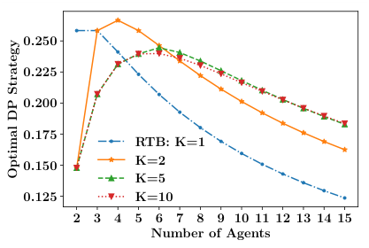

<!-- Start of picture text -->
0 . 250 0 . 225 0 . 200 0 . 175 RTB: K=1 0 . 150 K=2 K=5 0 . 125 K=10 2 3 4 5 6 7 8 9 10 11 12 13 14 15 Number of Agents OptimalStrategyDP <!-- End of picture text -->

**Figure 4: GAS Learning. Comparison on number of slots. Fixed EXP-CTR.** 

For GAS Learning, we vary the number of agents from 2 to 15 with step 1. We fix at a point _β_ = 0.2, _ϕ_ = 0.4. We first fix at EXPCTR in Figure 4. It shows that except for RTB case _K_ = 1 that the _α_∗ is decreasing with _N_ , generally for other cases the _α_∗ first increases with _N_ up to a maximal point and then decreases. This is due to the trade-off between the revenue brought by improving the valuations precision and the loss ensued by fiercer competition. Another tendency is that with more competitors coming in and less ad slots become available, the agents would tend to purchase less data. This is due to that agents are trying to avoid the risks of losing the auction as the environment becomes more competitive even after purchasing huge amount of data, which may bring only large wasted data expenditure to the agents. 

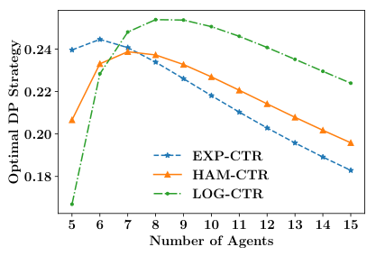

<!-- Start of picture text -->
0 . 24 0 . 22 0 . 20 EXP-CTR 0 . 18 HAM-CTR LOG-CTR 5 6 7 8 9 10 11 12 13 14 15 Number of Agents OptimalStrategyDP <!-- End of picture text -->

**Figure 5: GAS Learning. Comparison on CTRs.** _K_ = 5 

In Figure 5 we fix _K_ = 5. The curvatures show that for GAS Learning agents, the uphills of optimal strategies ascend steeper and the downhills descend more gently, in websites with less discounting effects. And in the long run as more competitors participate the auction, agents tend to purchase more data in LOG-CTR than in EXP-CTR. This illustrates the incentive effect that CTRs bring to the agents. It can be interpreted as that in a popular online environment, such as one with LOG-CTR, agents are more likely to receive more ad clicks that induces larger profits, than one with EXP-CTR. Thus agents behave as they want to take chances to obtain higher revenue in a popular website by purchasing enough amount of data. 

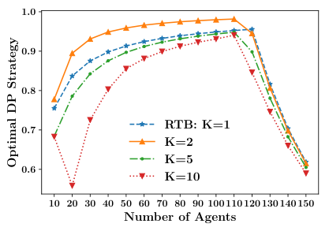

<!-- Start of picture text -->
1 . 0 0 . 9 0 . 8 0 . 7 RTB: K=1 K=2 K=5 0 . 6 K=10 10 20 30 40 50 60 70 80 90 100 110 120 130 140 150 Number of Agents OptimalStrategyDP <!-- End of picture text -->

**Figure 6: ToN Learning. Comparison on number of slots. Fixed EXP-CTR.** 

For ToN Learning, we set the number of agents from 10 to 150 with step 10. We let _ϕ_ = 2. First look at Figure 6. Pay attention to that unlike GAS Learning, for ToN learning, when _K_ is a even number it will encounter a sudden drop at point _N_ = _K_ + 2. And for the same _N_ the optimal _α_∗ may oscillate between adjacent even and odd _K_ . But generally, the overall tendency of optimal DP strategies with respect to _N_ still tends to decline when _K_ becomes much larger, which again confirms the trade-off agents have to make between profits made in auction and risk of wasted data purchasing. 

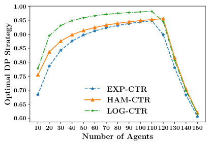

<!-- Start of picture text -->
1 . 00 0 . 95 0 . 90 0 . 85 0 . 80 0 . 75 0 . 70 EXP-CTR HAM-CTR 0 . 65 LOG-CTR 0 . 60 10 20 30 40 50 60 70 80 90 100 110 120 130 140 150 Number of Agents OptimalStrategyDP <!-- End of picture text -->

**Figure 7: ToN Learning. Comparison on CTRs.** _K_ = 5 

In Figure 7 we can observe that for ToN learning agents they would purchase most data in LOG-CTR while least in EXP-CTR, further illustrating the incentive effect in this scenario. But from the graphs we can also notice that the turning point tends to occur at a larger _N_ after where the optimal DP strategy decreases more rapidly as more agents are involved. So ToN learning agents normally may be suitable for modeling advertisers facing larger number of competitors. 

## **6 RELATED WORKS** 

In this section, we briefly review literatures about data usage in an auction context. 

Our work is closely related to previous ones which also considered the role of data in auctions. Specifically, [30] studied how would improved targeting affect the revenue when facing different number of advertisers. [9] researched the value of data for different advertisers with different valuations or budgets. [24] designed an optimal mechanism when considering data usage, which might bring additional revenue. [22] provides an optimal signaling scheme 

for revenue maximization for a second price auction. [4] designed an optimal mechanism for selling data by assuming an one-round protocol. [48] designed strategy-proof data auctions considering negative externalities. Recent works [5, 20, 40] highlight theoretical progress about targeting and signaling in ad auctions. 

How to choose proper strategy for obtaining costly signals is the main focus on topic of information acquisition [8, 18], whose framework naturally fits data usages in auctions. [44] designed an optimal mechanism considering acquisition process, which casted insight on our framework design. [34] considered the optimal acquisition strategy for one item in vickery auction, while ours extends to a wide classes of ad auction with any number of ad slots. Recent work [27] propose the optimal and efficient mechanisms with dynamic acquisition. 

The authors in [7] considered the interdependent relation between the valuations for acquisition, addressing the role of information externalities in an auction. This issue is particular important in ad auction since advertisers’ valuations toward ad slots may be interdependent to each other and satisfy common-value model. The roles of information asymmetries in common-value vickery auction was addressed in [1], where the complex condition of equilibriums was refined to as a new concept called TRE. [45] considered two asymmetrically informed bidders in a common-value auction with discrete signals and give the characterization of equilibrium. The authors in [10] derived when would the agents choose to observe the signal under certain interdependent structure. [25] proposes an approximation algorithm for winner determination under externalities. [36] researched the effect of information externalities in GSP mechanism, which were naturally raised when considering data usage. Nevertheless, since in our model the signaling process is modeled as a complete information game while advertisers’ valuation are assumed to be independent, we do not concern consider these issues and defer them for future works. 

## **7 CONCLUSION** 

In this paper, we have considered the data purchasing problem faced by advertisers before an ad auction. Having properly formulated the problem and the objective, we started with a simple scenario and have solved it through rigorous mathematical analysis. The intuitions have been extended to a more general scheme which embraces a wide class of learning agents. Our numerical results have revealed the relations between the optimal strategies with different configurations of the strategic environment. 

## **A PROOF OF THEOREM 4.1** 

Proof. First we prove the existence of equilibrium. The logconvex constraint of _Hαi_ is equivalent to: 

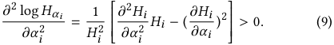

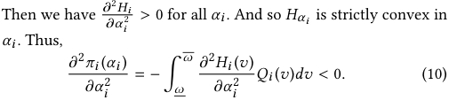

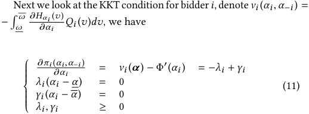

We first prove the equilibrium must be symmetric. Suppose _α_ 1∗<_α_ 2∗, which implies_α_ 1∗< _~~α~~_ and _α_ 2∗>_<u>α</u>_ . We have _γ_ 1 = 0 and _λ_ 2 = 0. Thus,∂_π_1<u>(</u>_α_∗ <u>1</u>,_α_∗ <u>2</u>,_α_−1,2) = − _λ_ 1 ≤ 0 and∂_π_2<u>(</u>_α_∗ <u>1</u>,_α_∗ <u>2</u>,_α_−1,2) = ∂ _α_ 1 ∂ _α_ 2 _γ_ 2 ≥ 0. Then we obtain Φ′ ( _α_ 1∗)≥_ν_1(_α_ 1∗,_α_ 2∗,_α_ −∗ 1,2)and Φ′(_α_ 2∗)≤ _ν_ 2 ( _α_ 1∗,_α_ 2∗,_α_ −∗ 1,2). But we will prove_ν_1(_α_ 1∗,_α_ 2∗,_α_ −∗ 1,2)>_ν_2(_α_ 1∗,_α_ 2∗,_α_ −∗ 1,2) which leads to Φ′ ( _α_ 2∗)< Φ′(_α_ 1∗). 

Look at quantity 

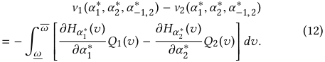

We want to transform the integrated part in (12) in a more explicit form. Recall the definition of _Qi_ in Section 2.3 we can observe that it is a summation whose terms include a series of product of form _H_ and 1 − _H_ . What we do is simply rearrange the production to "match" terms of 1, 2. For example, term 

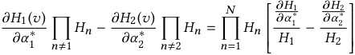

The similar procedures can be applied to every matched terms. So we will eventually turn equation (12) into a summation of terms of form 

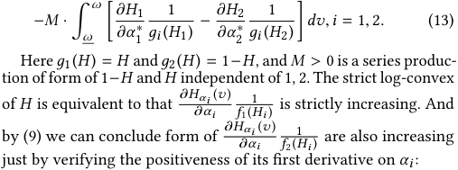

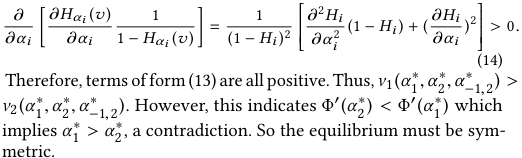

We now prove the equilibrium must be unique. First we show the interior equilibrium must be unique. For interior equilibrium _α_ = ( _α_∗ , _α_∗ . . . _α_∗ ), _νi_ ( _α_∗ )−Φ′ ( _α_∗ ) = 0. Denote _Wi_ ( _α_∗ ) = _νi_ ( _α_∗ )− Φ′ ( _α_∗ ). What we’ll prove is that _Wi_ ( _α_ ) is monotonically decreasing. 

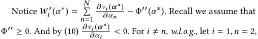

notice that 

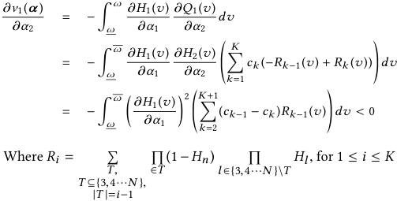

and _R_ 0 = 0. 

The idea of the above transformation can be concretely seen from the following example: 

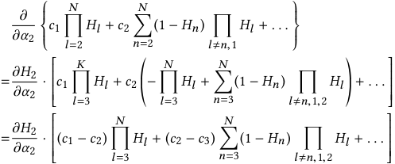

So we can see that the order of CTRs plays an important rule in our proof. Thus,∂_ν_ ∂_<u>i</u>_<u>(</u> _α__α_ _n_∗) < 0 for _i_ � _n_ . And so _Wi_′(_α_∗)<0. The monotonicity shows the uniqueness of symmetric equilibrium. 

We now move to the proof of the uniqueness of corner equilibrium. There are only two possible corner equilibriums: ( _<u>α</u>_ <u>,</u> _<u>α</u>_ . . . _<u>α</u>_ ) and ( _~~α~~_ ~~,~~ _~~α~~_ . . . _~~α~~_ ). By KKT condition (11), we have _νi_ ( _<u>α</u>_ <u>,</u> _<u>α</u>_ . . . _<u>α</u>_ ) ≤ Φ′ ( _<u>α</u>_ ) for equilibrium ( _<u>α</u>_ <u>,</u> _<u>α</u>_ . . . _<u>α</u>_ ) and _νi_ ( _~~α~~_ ~~,~~ _~~α~~_ . . . _~~α~~_ ) ≥ Φ′ ( _~~α~~_ ) for equilibrium ( _~~α~~_ ~~,~~ _~~α~~_ . . . _~~α~~_ ). By (9) we proved _νi_ ( _αi_ , _α_ − _i_ ) is strictly decreasing in _αi_ , we have _νi_ ( _~~α~~_ ~~,~~ _~~α~~_ . . . _~~α~~_ ) > _νi_ ( _<u>α</u>_ <u>,</u> _<u>α</u>_ . . . _<u>α</u>_ ), so two possible equilibriums cannot exist concurrently. 

Last we show there is only one possible equilibrium, either interior or corner. _W.l.o.g._ suppose ( _<u>α</u>_ <u>,</u> _<u>α</u>_ . . . _<u>α</u>_ ) and ( _α_ , _α_ . . . _α_ ) both exist. Then we have _ν_ ( _α_ , _α_ . . . _α_ ) = Φ<u>′</u> ( _α_ ) and _ν_ ( _<u>α</u>_ <u>,</u> _<u>α</u>_ . . . _<u>α</u>_ ) ≤ Φ′ ( _<u>α</u>_ ). But this implies Φ′ ( _α_ ) = _ν_ ( _α_ , _α_ . . . _α_ ) < _ν_ ( _<u>α</u>_ <u>,</u> _<u>α</u>_ . . . _<u>α</u>_ ) ≤ Φ′ ( _<u>α</u>_ ) which means _α_ < _<u>α</u>_ , a contradiction. 

We now have completed all the proof that the _NEDP_ must be symmetric and unique. □ 

## **B PROOF OF THEOREM 4.2** 

Proof. by Theorem 4.1, bidders of the same type must acquire the same quality of information. 

Next we consider bidders in different groups of type. Consider class _µ_ , _δ_ where Φ′ _µ_ ( _α_ ) > Φ _δ_′(_α_),andbidder_i_intype_µ_and_д_in type _δ_ . If they acquire the same quality of information _α_∗ , by equation (11) we have Φ′ _µ_ ( _α_∗ ) = _νi_ ( _α_∗ ) = _νд_ ( _α_∗ ) = Φ _δ_′(_α_∗) since their beliefs are identical in prior. But we have assumed Φ′ _µ_ ( _α_ ) > Φ _δ_′(_α_), so it is a contradiction. Therefore, the quality of information acquired by different type of bidders must be different. 

Suppose in this condition _αµ_∗ > _αδ_∗. Then by Theorem 4.1 we ob- tain that Φ′ _µ_ ( _αµ_∗ ) = _νi_ ( _α_∗ ) < _νд_ ( _α_∗ ) = Φ _δ_′(_α_ _δ_∗) which contradicts to our assumption. So the equilibrium must be intuitive. □ 

## **REFERENCES** 

- [1] Ittai Abraham, Susan Athey, Moshe Babaioff, and Michael Grubb. 2011. _Peaches, Lemons, and Cookies: Designing Auction Markets with Dispersed Information_ . Technical Report. https://www.microsoft.com/en-us/research/publication/ 

   - peaches-lemons-and-cookies-designing-auction-markets-with-dispersed-information/ 

- [2] Zoë. Abrams and M. Schwarz. 2007. Ad Auction Design and User Experience. In _Proceedings of The 3th Workshop on Internet and Network Economics (WINE)_ . 529–534. 

- [3] Gagan Aggarwal, Ashish Goel, and Rajeev Motwani. 2006. Truthful Auctions for Pricing Search Keywords. In _Proceedings of the 7th ACM Conference on Electronic Commerce (EC)_ . 1–7. 

- [4] Moshe Babaioff, Robert Kleinberg, and Renato Paes Leme. 2012. Optimal Mechanisms for Selling Information. In _Proceedings of the 13th ACM Conference on Electronic Commerce (EC)_ . 92–109. 

- [5] Ashwinkumar Badanidiyuru, Kshipra Bhawalkar, and Haifeng Xu. 2018. Targeting and Signaling in Ad Auctions. In _Proceedings of the Twenty-Ninth Annual ACM-SIAM Symposium on Discrete Algorithms (SODA)_ . 2545–2563. 

- [6] Dirk Bergemann and Alessandro Bonatti. 2015. Selling cookies. _American Economic Journal: Microeconomics_ 7, 3 (2015), 259–94. 

- [7] Dirk Bergemann, Xianwen Shi, and Juuso Välimäki. 2009. Information acquisition in interdependent value auctions. _The Journal of the European Economic Association_ 7, 1 (2009), 61–89. 

- [8] Dirk Bergemann and Juuso Välimäki. 2002. Information acquisition and efficient mechanism design. _Econometrica_ 70, 3 (2002), 130–144. 

- [9] Kshipra Bhawalkar, Patrick Hummel, and Sergei Vassilvitskii. 2016. Value of targeting. In _In the Proceedings of The 9th International Symposium on Algorithmic Game Theory (SAGT)_ . 194–205. 

- [10] Erik Brinkman, Michael P. Wellman, and Scott E. Page. 2014. Signal Structure and Strategic Information Acquisition: Deliberative Auctions with Interdependent Values. In _Proceedings of the 2014 International Conference on Autonomous Agents and Multi-agent Systems (AAMAS)_ . 229–236. 

- [11] Nicolò Cesa-Bianchi, Claudio Gentile, and Yishay Mansour. 2013. Regret Minimization for Reserve Prices in Second-price Auctions. In _Proceedings of the Twenty-fourth Annual ACM-SIAM Symposium on Discrete Algorithms (SODA)_ . 1190–1204. 

- [12] T. Chakraborty, E. Even-Dar, S. Guha, Y. Mansour, and S. Muthukrishnan. 2010. Selective Call Out and Real Time Bidding. In _Proceedings of The 6th Workshop on Internet and Network Economics (WINE)_ . 145–157. 

- [13] Shuchi Chawla and Jason D. Hartline. 2013. Auctions with Unique Equilibria. In _Proceedings of the Fourteenth ACM Conference on Electronic Commerce (EC)_ . 181–196. 

- [14] Ye Chen, Pavel Berkhin, Bo Anderson, and Nikhil R. Devanur. 2011. Real-time Bidding Algorithms for Performance-based Display Ad Allocation. In _Proceedings of the 17th ACM SIGKDD International Conference on Knowledge Discovery and Data Mining (KDD)_ . 1307–1315. 

- [15] Andrew T Ching, Tülin Erdem, and Michael P Keane. 2013. Learning models: An assessment of progress, challenges, and new developments. _Marketing Science_ 32, 6 (2013), 913–938. 

- [16] Hana Choi, Carl Mela, Santiago Balseiro, and Adam Leary. 2017. Online Display Advertising Markets: A Literature Review and Future Directions. (2017). 

- [17] E. Clarke. 1971. Multipart pricing of public goods. _Public choice_ 11, 1 (1971), 17–33. 

- [18] Olivier Compte and Philippe Jehiel. 2007. Auctions and information acquisition: sealed bid or dynamic formats? _The Rand Journal of Economics_ 38, 2 (2007), 355–372. 

- [19] Anirban Dasgupta, Maxim Gurevich, Liang Zhang, Belle Tseng, and Achint O. Thomas. 2012. Overcoming Browser Cookie Churn with Clustering. In _Proceedings of the Fifth ACM International Conference on Web Search and Data Mining (WSDM)_ . 83–92. 

- [20] Shaddin Dughmi and Haifeng Xu. 2016. Algorithmic Bayesian Persuasion. In _Proceedings of the Forty-eighth Annual ACM Symposium on Theory of Computing (STOC)_ . 412–425. 

   - [27] Negin Golrezaei and Hamid Nazerzadeh. 2016. Auctions with Dynamic Costly Information Acquisition. _Operation Research_ 65, 1 (2016), 130–144. 

   - [28] Renato D. Gomes and Kane S. Sweeney. 2009. Bayes-nash Equilibria of the Generalized Second Price Auction. In _Proceedings of the 10th ACM Conference on Electronic Commerce (EC)_ . 107–108. 

   - [29] T. Groves. 1973. Incentives in Teams. _Econometrica_ (1973), 617–631. 

   - [30] Patrick Hummel and R. Preston McAfee. 2016. When Does Improved Targeting Increase Revenue? _ACM Transactions on Economics and Computation_ 5, 1 (2016), 4. 

   - [31] B.J. Jansen and T. Mullen. 2008. Sponsored search: an overview of the concept, history, and technology. _International Journal of Electronic Business_ 6, 2 (2008), 114–131. 

   - [32] N. Korula, V. Mirrokni, and H. Nazerzadeh. 2016. Optimizing Display Advertising Markets: Challenges and Directions. _IEEE Internet Computing_ 20, 1 (2016), 28–35. 

   - [33] TR. Lewis and D. Sappington. 1994. Supplying information to facilitate price discrimination. _International Economic Review_ (1994), 309–327. 

   - [34] S. Li and G. Tian. 2008. Equilibria in Second Price Auctions with Information Acquisition. _MPRA paper_ (2008). 

   - [35] Brendan Lucier, Renato Paes Leme, and Eva Tardos. 2012. On Revenue in the Generalized Second Price Auction. In _Proceedings of the 21st International Conference on World Wide Web (WWW)_ . 361–370. 

   - [36] Weidong Ma, Tao Wu, Tao Qin, and Tie-Yan Liu. 2014. Generalized Second Price Auctions with Value Externalities. In _Proceedings of the 2014 International Conference on Autonomous Agents and Multi-agent Systems (AAMAS)_ . 1457–1458. 

   - [37] A. Mas-Colell, MD. Whinston, JR. Green, et al. 1995. _Microeconomic theory_ . Vol. 1. Oxford university press New York. 

   - [38] PR. Milgrom. 2004. _Putting auction theory to work_ . Cambridge University Press. 

   - [39] PR. Milgrom. 2010. Simplified mechanisms with an application to sponsoredsearch auctions. _Games and Economic Behavior_ 70, 1 (2010), 62–70. 

   - [40] Joseph (Seffi) Naor and David Wajc. 2015. Near-Optimum Online Ad Allocation for Targeted Advertising. In _Proceedings of the Sixteenth ACM Conference on Economics and Computation (EC)_ . 131–148. 

   - [41] Michael Ostrovsky and Michael Schwarz. 2011. Reserve Prices in Internet Advertising Auctions: A Field Experiment. In _Proceedings of the 12th ACM Conference on Electronic Commerce (EC)_ . 59–60. 

   - [42] Tao Qin, Wei Chen, and Tie-Yan Liu. 2015. Sponsored Search Auctions: Recent Advances and Future Directions. _ACM Transactions on Intelligent Systems and Technology_ 5, 4 (2015), 60. 

   - [43] J. Rong, T. Qin, B. An, and T. Liu. 2017. Revenue Maximization for Finitely Repeated Ad Auctions. In _Proceedings of The Thirty-First AAAI Conference on Artificial Intelligence (AAAI)_ . 663–669. 

   - [44] X. Shi. 2012. Optimal auctions with information acquisition. _Games and Economic Behavior_ 74, 2 (2012), 666–686. 

   - [45] Vasilis Syrgkanis, David Kempe, and Eva Tardos. 2015. Information Asymmetries in Common-Value Auctions with Discrete Signals. In _Proceedings of the Sixteenth ACM Conference on Economics and Computation (EC)_ . 303–303. 

   - [46] David R.M. Thompson and Kevin Leyton-Brown. 2013. Revenue Optimization in the Generalized Second-price Auction. In _Proceedings of the Fourteenth ACM Conference on Electronic Commerce (EC)_ . 837–852. 

   - [47] W. Vickery. 1961. Counterspeculation, auctions, and competitive sealed tenders. _The Journal of finance_ 16, 1 (1961), 8–37. 

   - [48] Xiang Wang, Zhenzhe Zheng, Fan Wu, Xiaoju Dong, Shaojie Tang, and Guihai Chen. 2016. Strategy-Proof Data Auctions with Negative Externalities (Extended Abstract). In _Proceedings of the 2016 International Conference on Autonomous Agents and Multiagent Systems (AAMAS)_ . 1269–1270. 

   - [49] Robert West, Ryen W. White, and Eric Horvitz. 2013. From Cookies to Cooks: Insights on Dietary Patterns via Analysis of Web Usage Logs. In _Proceedings of the 22Nd International Conference on World Wide Web (WWW)_ . 1399–1410. 

   - [50] Shuai Yuan, Jun Wang, and Xiaoxue Zhao. 2013. Real-time Bidding for Online Advertising: Measurement and Analysis. In _Proceedings of the Seventh International Workshop on Data Mining for Online Advertising (ADKDD)_ . 3. 

- [21] B. Edelman, M. Ostrovsky, and M. Schwarz. 2007. Internet advertising and the generalized second-price auction: Selling billions of dollars worth of keywords. _American Economic Review_ 97, 1 (2007), 242–259. 

- [22] Yuval Emek, Michal Feldman, Iftah Gamzu, Renato Paes Leme, and Moshe Tennenholtz. 2012. Signaling Schemes for Revenue Maximization. In _Proceedings of the 13th ACM Conference on Electronic Commerce (EC)_ . 514–531. 

- [23] Tülin Erdem and Michael P Keane. 1996. Decision-making under uncertainty: Capturing dynamic brand choice processes in turbulent consumer goods markets. _Marketing science_ 15, 1 (1996), 1–20. 

- [24] Hu Fu, P. Jordan, M. Mahdian, U. Nadav, I. Talgam-Cohen, and S. Vassilvitskii. 2012. Ad auctions with data. In _In the Proceedings of The 5th International Symposium on Algorithmic Game Theory (SAGT)_ . 168–179. 

- [25] Arpita Ghosh and Mohammad Mahdian. 2008. Externalities in Online Advertising. In _Proceedings of the 17th International Conference on World Wide Web (WWW)_ . 161–168. 

- [26] Arpita Ghosh, Mohammad Mahdian, Preston McAfee, and Sergei Vassilvitskii. 2012. To Match or Not to Match: Economics of Cookie Matching in Online Advertising. In _Proceedings of the 13th ACM Conference on Electronic Commerce (EC)_ . 741–753. 

