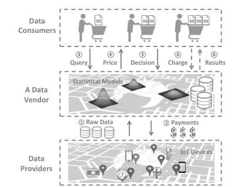

# **Challenges and Opportunities in IoT Data Markets** 

Zhenzhe Zheng, Weichao Mao, Fan Wu, and Guihai Chen Shanghai Key Laboratory of Scalable Computing and Systems Shanghai Jiao Tong University, China {zhengzhenzhe, maoweichao}@sjtu.edu.cn, {fwu, gchen}@cs.sjtu.edu.cn 

## **ABSTRACT** 

Tremendous amount of Internet of Things (IoT) data is seamlessly generated and collected by ubiquitous sensors to facilitate critical decision making in various scenarios. However, due to the lack of open and effective data sharing and trading platforms, most existing IoT data can only be analyzed and utilized by data owners themselves, which largely restricts the potential value of data. In this paper, we discuss the unique economic properties of IoT data that bring new challenges to its market design. We further point out several interesting research opportunities and open problems in this area for future study. 

## **CCS Concepts** 

_•_ **Applied computing** _→ Electronic commerce;_ 

## **Keywords** 

IoT Data, Market Design, Data Privacy 

## **1. INTRODUCTION** 

IoT data is becoming a commodity. The ubiquitous IoT devices generate tremendous volume of valuable IoT data, leading to the increasing market demand for IoT data resources. On the one hand, many data owners are willing to share their data to obtain certain economic rewards. On the other hand, data consumers such as researchers, data analysts, or application developers, are also willing to pay a certain fee in return for data resources. Therefore, it is highly needed to build an open and effective platform to enable IoT data sharing and trading over the Internet, and to release the economic value behind IoT data. 

To facilitate the online trading of various types of data, several initial data marketplaces have emerged. For example, Xignite [3] sells data from the financial industry, Gnip [1] trades data from social networks, and IOTA [2] aggregates and sells IoT data. Theoretical market models for different types of data have also been researched in academia. For example, query-based pricing for structured data was studied in [5], cookies data pricing for targeted advertising was investigated in [4], and a market model for crowdsensed data was proposed in [6]. In this paper, we focus on one specific type of data: IoT data. Figure 1 illustrates the overview of 

Permission to make digital or hard copies of all or part of this work for personal or classroom use is granted without fee provided that copies are not made or distributed for profit or commercial advantage and that copies bear this notice and the full citation on the first page. Copyrights for components of this work owned by others than the author(s) must be honored. Abstracting with credit is permitted. To copy otherwise, or republish, to post on servers or to redistribute to lists, requires prior specific permission and/or a fee. Request permissions from permissions@acm.org. 

_SocialSense’19, April 15, 2019, Montreal, QC, Canada_ 

_⃝_ c 2019 Copyright held by the owner/author(s). Publication rights licensed to ACM. ISBN 978-1-4503-6706-6/19/04...$15.00 

DOI: https://doi.org/10.1145/3313294.3313378 

<!-- Start of picture text -->
Data Consumers ③ ④ ⑤ ⑥ ⑥ Query Price Decision Charge Results Statistical Models A Data Vendor ① Raw Data ② Payments IoT Devices Data Providers <!-- End of picture text -->

**Figure 1: IoT Data Market Architecture.** 

IoT data trading process, which consists of three major entities, including data providers, the data vendor, and data consumers. The data vendor first employs a procurement mechanism to collect raw data from data providers and pay the collection cost ( 1 _⃝_ – 2 _⃝_ ). Statistical models are then built to unify various data sources and describe the semantic information behind data. The data vendor finally provides a model-based query interface to data consumers, and use a pricing scheme to decide the price for each buyer and then extract revenue from the market ( 3 _⃝_ – 6 _⃝_ ). 

## **2. ECONOMIC PROPERTIES OF IOT DATA** 

IoT data as a commodity is different from traditional goods. It has the following unique economic properties that bring several challenges to IoT data market design: 

**Unique Cost Structure** : IoT data has a fixed production (collection) cost, while its marginal cost is negligible. Once generated, data resources can be reproduced with little effort. A data vendor can easily create unlimited copies of the same set of data, and sell them to multiple buyers. Such a cost structure makes existing cost-based pricing schemes unsuitable for data pricing, and requires a new reward sharing mechanism between data vendors and data providers. 

**Heterogeneous Market Valuation** : In data markets, buyers’ valuations for IoT data are diversified. Different buyers might need different data sets or different subsets of the same data according to their applications, resulting in the valuations of data varying with the specific application scenarios. For example, GPS data is of high value in navigation but is of low value in financial credit services. The value of data is also related to its externality, e.g., the city traffic data has positive externality, as its value increases if more people are involved. It is non-trivial for data vendors to accurately evaluate the valuations of data, making it challenging to set optimal prices for the data commodity. 

**Uncertain Data Quality** : Due to the unreliability of sensors and the fragility of data transmission links, it is nec- 

1 

essary to consider data quality in IoT data markets. Data collected from low-quality sensors might contain inconsistencies and errors. Thus, we cannot directly feed raw IoT data into markets. We should aggregate data from multiple sources, conduct data cleansing, and design a statistical model to describe the semantic information behind IoT data. 

**Ambiguous Data Ownership** : Personal data is generated by an individual’s daily actions, and undoubtedly belongs to the individual. However, data is different from traditional physical commodities that are only owned by one specific person. Multiple parties can also be regarded as data owners as long as they have seen the data and are aware of the information contained in it. In this case, it is difficult to clearly define data ownership, which introduces the potential problems of data piracy and privacy leakage. 

**Pervasive Data Piracy** : IoT data can be considered as a set of binary symbols. The data vendor can easily generate random even fake numerical data values, instead of collecting real data from true data sources. It is hence difficult for buyers to verify whether data comes from the licensed data sources or from piracy even fake data sources. 

**Sensitive Data Privacy** : Although private data can be used to provide personalized services, it should not be traded directly due to the possible violence of privacy law. A number of studies have suggested that even insensitive data can still leak user privacy if it is collected in large quantities and dimensions. We should pay high attention to users’ privacy during the process of trading personal data. The data vendor should explicitly obtain users’ permission for using their data. In addition, data anonymization and correlation decoupling should be performed before trading sensitive data. 

## **3. RESEARCH OPPORTUNITIES** 

As a new research direction, IoT data market design offers many interesting research opportunities and open problems. 

## **3.1 Data Procurement** 

The data vendor needs to periodically provide fresh data to the market, which incurs the following research problems about data procurement strategies. 

First, IoT data contains complex correlations in time and space dimensions. How should we extract the spatio-temporal correlations of IoT data, and model them reasonably to guide data procurement? 

Second, the goal of data procurement is to collect highquality data at a lower cost. However, the quality of data crowdsourced from heterogeneous IoT devices is diversified, and it is difficult to evaluate the quality of the collected data without the knowledge of ground-truth. How do we combine incentive mechanisms with data quality measurement to motivate users to truly contribute high-quality data? 

Third, the process of data procurement is directly related to data selling and pricing. Given a limited budget for data procurement, the data vendor would like to collect data with high market demand and potential economic benefits. How do we design a market-oriented data procurement mechanism that can fulfill the economic goals of the data vendor? 

## **3.2 Data Pricing** 

In the IoT data market with asymmetric information, it is difficult for both the seller and the buyer to accurately estimate the market valuation of data. The following research problems are related to the pricing of IoT data. 

First, as the optimal price of data commodity depends on the buyers’ valuations, the data vendor always would like to extract such information. The data vendor can partially learn the valuation of buyers by releasing free data trials or conducting market segmentation techniques, e.g., dividing a data commodity into different versions. Thus, we need an efficient mechanism to determine (1) how much free data should be released, (2) the number of different data versions, and (3) the data content or quality of each version. Second, due to the time sensitivity of IoT data, the buyers’ valuations over data may decay over time. Furthermore, the valuations of buyers are unknown to the data vendor. A natural problem in IoT data market is how to design online learning algorithms and dynamic pricing mechanisms that adapt to changes in unknown valuation settings? 

Third, many existing pricing techniques ignore the potential strategic behaviors of buyers, such as arbitrage behaviors or untruthful bidding. The complex correlation among IoT data makes the market as a hotbed of arbitrage behaviors, e.g., a chary buyer can purchase cheap data to infer the information contained in an expensive data set. We need to analyze the possible strategic behaviors of buyers in IoT data markets, and design arbitrage-free data pricing mechanisms. 

## **3.3 Data Privacy** 

Considering the ambiguous ownership and sensitive privacy of IoT data, digital signature and privacy compensation mechanisms should be employed in IoT data markets, which raise the following open problems. 

First, digital signature algorithms need sequential verification, which incurs heavy computation. It also takes a lot of communication overhead to transmit digital signatures and maintain digital certificates. This step might become a computational bottleneck, and a light-weight digital signature algorithm is needed for large-scale IoT data markets. 

Second, most existing signature algorithms treat signer’s identity as a public parameter, while in data markets the data provider might want to protect her identity (and hence the signature). However, if the user identity is hidden, it becomes difficult to identify the illegal data providers in the data market. Thus, we need to handle the contradiction between identity privacy and data traceability. 

Third, we need to consider the diverse privacy sensitivities of data providers when we design privacy compensation mechanisms. For example, some data providers are less concerned about privacy and are willing to sell their complete sensitive data at a high price, while other providers might not accept disclosure of the complete sensitive data. How to quantify the privacy loss during data trading and then design a practical and feasible privacy compensation mechanism is another critical problem in IoT data markets. 

## **4. REFERENCES** 

- [1] Gnip apis. http://support.gnip.com/apis/. 

- [2] Iota. https://www.iota.org/. 

- [3] Xignite. https://www.xignite.com/. 

- [4] D. Bergemann and A. Bonatti. Selling cookies. _American Economic Journal: Microeconomics_ , 7(3):259–94, 2015. 

- [5] P. Koutris, P. Upadhyaya, M. Balazinska, B. Howe, and D. Suciu. Query-based data pricing. In _PODS_ , 2012. 

- [6] Z. Zheng, Y. Peng, F. Wu, S. Tang, and G. Chen. Trading data in the crowd: Profit-driven data acquisition for mobile crowdsensing. _IEEE Journal on Selected Areas in Communications_ , 35(2):486–501, 2017. 

2 

