IEEE TRANSACTIONS ON COMPUTERS, VOL. 64, NO. 7, JULY 2015 

2071 

# STAR: Strategy-Proof Double Auctions for Multi-Cloud, Multi-Tenant Bandwidth Reservation 

Zhenzhe Zheng, Student Member, IEEE, Yang Gui, Student Member, IEEE, Fan Wu, Member, IEEE, and Guihai Chen, Member, IEEE 

Abstract—Bandwidth reservation has been recognized as a value-added service to the cloud provider in recent years. We consider an open market of cloud bandwidth reservation, in which cloud providers offer bandwidth reservation services to cloud tenants, especially online streaming service providers, who have strict requirements on the amount of bandwidth to guarantee their quality of services. In this paper, we model the open market as a double-sided auction, and propose the first family of STrategy-proof double Auctions for multi-cloud, multi-tenant bandwidth Reservation (STAR). STAR contains two auction mechanisms. The first one, STAR-Grouping, divides the tenants into groups by a bid-independent way, and carefully matches the cloud providers with the tenant groups to form good trades. The second one, STAR-Padding, greedily matches the cloud providers with the tenants, and fills the partially reserved cloud provider(s) with a novel virtual padding tenant who can be a component of the auctioneer. Our analysis shows that both of the two auction mechanisms achieve strategy-proofness and ex-post budget balance. Our evaluation results show that they achieve good performance in terms of social welfare, cloud bandwidth utilization, and tenant satisfaction ratio. 

Index Terms—Data center, bandwidth reservation, double auction 

Ç 

## 1 INTRODUCTION 

CLOUDwhich Internet applications can rent computation, stor-computing presents a new business model, in age, and network resources by the means of virtual machines (VMs) from cloud providers, and pay for the usage of these resources. Attracted by much lighter burden of managing and maintaining fundamental service infrastructures, more and more Internet applications move their platforms to cloud providers, such as Netflix [1], a major online video streaming service provider in North America. Netflix moved its data storage system, streaming servers, encoding engine, and other major modules to Amazon web services (AWS) in 2010 [2]. 

However, many bandwidth-intensive application companies, especially online streaming service providers, are hesitating to move from their own infrastructures to the cloud providers, because major cloud providers normally do not provide bandwidth guarantee. Thus, the bandwidth-intensive applications may not be able to maintain their quality of services (QoS) after moving to the cloud providers. Due to this reason, researchers from both industry and academia have started to design new cloud service architectures capable of supporting the need of bandwidth reservation [3], [4], [5]. As a value-added service, bandwidth reservation for guaranteing various kinds of QoS requirements has been 

- The authors are with the Department of Computer Science and Engineering, Shanghai Key Laboratory of Scalable Computing and Systems, Shanghai Jiao Tong University, China. 

> E-mail: {zhengzhenzhe, yanggui}@sjtu.edu.cn, {fwu, gchen}@cs.sjtu.edu.cn. 

> Manuscript received 17 July 2013; revised 19 Mar. 2014; accepted 30 Apr. 2014. Date of publication 6 Aug. 2014; date of current version 10 June 2015. Recommended for acceptance by K. Li. 

For information on obtaining reprints of this article, please send e-mail to: reprints@ieee.org, and reference the Digital Object Identifier below. Digital Object Identifier no. 10.1109/TC.2014.2346204 

well recognized recently. For example, Niu et al. introduced a profit making broker to mix demands and negotiate the bandwidth prices with tenants in a free market [6], [7]. 

In this paper, we consider an open market of cloud bandwidth reservation, in which cloud providers (e.g., Windows Azure [8], Amazon EC2 [9], and Google AppEngine [10]) offer bandwidth reservation services to cloud tenants (e.g., Netflix, Hulu [11], and Youku [12]), who need certain amount of bandwidths to guarantee their QoS. Due to the fairness and allocation efficiency, auctions are attractive market-based mechanisms to distribute resource [13], and have been widely applied to solve the resource management in cloud computing [14], [15] and other research area [16], [17], [18]. We study the problem of cloud bandwidth reservation in a model of double auction, which enables multiple cloud providers and tenants to trade bandwidth dynamically. 

However, designing a practical double auction mechanism for cloud bandwidth reservation has three major challenges. One major challenge is strategy-proofness (please refer to Section 2.2 for the definition), which is inherited from traditional auction mechanisms. In a strategy-proof auction mechanism, simply reporting true valuation as a bid maximizes one’s utility. Thus, any participant cannot benefit from manipulating the auction. Another major challenge is the divisibility of the bandwidth, which distinguishes it from traditional goods. Matching the cloud providers and the tenants is a combinatorial problem, in which an optimal allocation usually cannot be calculated in polynomial time. Therefore, classic strategy-proof auction mechanisms cannot be directly applied. Yet another major challenge is the ex-post budget balance (please refer to Section 2.2 for the definition), which guarantees that the auctioneer can benefit or at least do not lose anything from setting up an auction. Ex-post budget 

0018-9340 � 2014 IEEE. Personal use is permitted, but republication/redistribution requires IEEE permission. See http://www.ieee.org/publications_standards/publications/rights/index.html for more information. 

IEEE TRANSACTIONS ON COMPUTERS, VOL. 64, NO. 7, JULY 2015 

2072 

balance ensures that incentives of a trusted third party can be stimulated to build up a double auction for the cloud bandwidth reservation. We note that although several multi-unit double auction mechanisms have been proposed in the literatures (e.g., [19], [20]) to solve similar allocation problems, none of them fully achieves both strategy-proofness and expost budget balance. 

In this paper, we propose STAR, which is a family of <u>STrategy-proof double Auctions for multi-cloud multi-tenant</u> bandwidth <u>Reservation.</u> STAR contains two auction mechanisms, including STAR-Grouping and STAR-Padding. Both of the two auction mechanisms achieve strategy-proofness and ex-post budget balance. STAR-Grouping is a groupingbased strategy-proof double auction for cloud bandwidth reservation, in which tenants are grouped by a bid-independent way, and a trade is a match between a cloud provider and a tenant group. While STAR-Grouping can only be applied to some limited cases, the second auction mechanism, namely STAR-Padding, can be applied to general scenarios. STARPadding pads partially filled cloud provider(s) with a novel padding tenant, who has unlimited bandwidth demand, to guarantee strategy-proofness. 

We make the following contributions in this paper. 

- To the best of our knowledge, STAR is the first family of strategy-proof double auction mechanisms for multi-cloud multi-tenant bandwidth reservation. 

- We model the problem of cloud bandwidth reservation as a double auction, and design practical auction mechanisms under this model. 

- We first consider the scenario, in which the tenants’ demands are indivisible and the cloud providers have the same bandwidth capacity, and propose STAR-Grouping, which is a grouping-based strategyproof double auction for cloud bandwidth reservation. Specifically, STAR-Grouping divides the tenants into a number of groups by a bid-independent way, and carefully matches the cloud providers with the tenant groups to form good trades. 

- We further consider a general scenario, in which the bandwidth capacities of the cloud providers can be different and the tenants’ demands are divisible, and propose a new double auction mechanism—STARPadding. STAR-Padding implements a virtual padding tenant with unlimited bandwidth demand to partially fill reserved cloud provider(s), and thus achieves strategy-proofness. 

- Our analysis results show that both STAR-Grouping and STAR-Padding achieve ex-post budget balance in all the cases. 

- Finally, we implement the two auction mechanisms and extensively evaluate their performance. Our evaluation results show that they both achieve good performance in terms of social welfare, cloud bandwidth utilization, and tenant satisfaction ratio. 

The rest of this paper is organized as follows. In Section 2, we present technical preliminaries. In Section 3, we propose STAR-Grouping. In Section 4, we further propose STAR-Padding. In Section 5, we report evaluation results. In Section 6, we review related work. In Section 7, we conclude this work and discuss possible future work directions. 

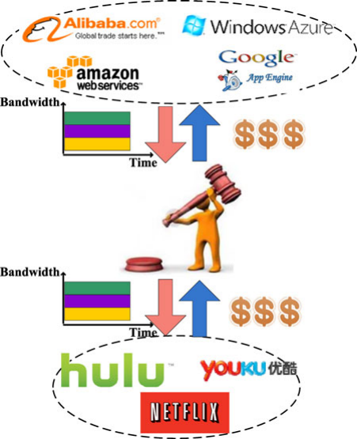

Fig. 1. An open market of bandwidth reservation between cloud providers and cloud tenants. 

## 2 TECHNICAL PRELIMINARIES 

In this section, we present our double auction model for the problem of multi-cloud multi-tenant bandwidth reservation, and review some important solution concepts used in this paper from classic mechanism design. 

### 2.1 Auction Model 

As shown in Fig. 1, we consider an open market of cloud bandwidth reservation, in which there are multiple cloud providers (e.g., Windows Azure, Amazon EC2, and Google AppEngine), who offer guaranteed bandwidth reservation to cloud tenants, especially online streaming service providers (e.g., Netflix, Hulu, and Youku). We introduce an auctioneer, who can determine the allocation of available bandwidth based on the supplies and demands of bandwidth. 

We model the market of cloud bandwidth reservation as a double auction, in which there are m cloud providers, n tenants, and a trustworthy auctioneer. The auctioneer holds bandwidth reservation auction periodically. In each round, the cloud providers and the tenants simultaneously submit their sealed prices and bids to the auctioneer, respectively, so that no participant knows the prices/bids of any others. The auctioneer makes the decision on bandwidth reservation and payments/charges for the participants. We now give a detailed discuss with the entities in the double auction. 

Cloud provider: We denote the set of cloud providers by M ¼ f1; 2; . . . ; mg. Each cloud provider k 2 M has an outgoing bandwidth capacity Bk, and a per unit bandwidth serving cost ck. Let B~ ¼ ðB1; B2; . . . ; BmÞ and ~c ¼ ðc1; c2; . . . ; cmÞ denote the profile of bandwidth capacities and per unit bandwidth costs, respectively. In the auction, each cloud 

ZHENG ET AL.: STAR: STRATEGY-PROOF DOUBLE AUCTIONS FOR MULTI-CLOUD, MULTI-TENANT BANDWIDTH RESERVATION 

2073 

provider k 2 M submits her minimum per unit bandwidth selling price sk and bandwidth capacity Bk to the auctioneer. We note that although the cloud provider k chooses a selling price sk based on her real per unit bandwidth cost ck, it is not necessary that sk is equal to ck, which is the private information of the cloud provider. Let ~s ¼ ðs1; s2; . . . ; smÞ denote the profile of selling prices. 

Tenant. There is a set of tenants, denoted by N ¼ f1; 2; . . . ; ng, who are online streaming service providers. We assume that each tenant i 2 N wants to reserve di units bandwidth to satisfy her requirement on QoS, and has a valuation vi on each unit of reserved bandwidth. This valuation, which can be derived from the revenue gained by a tenant for serving her subscribers, is the private information of the tenant. We denote the valuation profile of the tenants by ~v ¼ ðv1; v2; . . . ; vnÞ. Each tenant i 2 N submits her per unit bandwidth bid bi as well as her bandwidth demand di to the auctioneer. Similarly, bi is not necessarily equal to vi. Here, we assume that the tenants have strict requirements on the demands, meaning that the tenant i does not accept any bandwidth reservation less than di. Let~ b ¼ ðb1; b2; . . . ; bnÞ and d~ ¼ ðd1; d2; . . . ; dnÞ denote the profile of bids and bandwidth demands, respectively. 

Auctioneer. The auctioneer is a trustworthy authority, who determines the set of winning cloud providers WM � M and the set of winning tenants WN � N, bandwidth reservation outcome matrix A ¼ ðak iÞ i2N;k2M,paymentprofile ~p ¼ ðp1; p2; . . . ; pmÞ for the cloud providers, and charge profile ~q ¼ ðq1; q2; . . . ; qnÞ for the tenants. Here, ak idenotesthat the tenant i wins ak iunitsbandwidthfromthecloudpro- vider k. 

We define the utility of a cloud provider k 2 M be the difference between her payment and serving cost: 

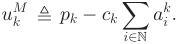

Similarly, the utility of a tenant i 2 N is the difference between her valuation on the reserved bandwidth and the charge: 

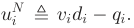

We consider that the participants, including both the cloud providers and the tenants, are rational and selfish, thus their objectives are to maximize their own utilities. In contrast, the objective of the auctioneer is to prevent market manipulation (i.e., guarantee strategy-proofness, which is defined in Section 2.2) and maximize the social welfare. Here, the social welfare is defined as follows. 

- Definition 1 (Social welfare). The social welfare in a double auction for cloud bandwidth reservation is the difference between the sum of winning tenants’ valuations and the sum of winning cloud providers’ serving costs on the bandwidth reserved. 

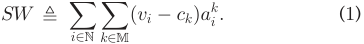

We consider different auction scenarios in following sections. In Section 3, we consider the case, in which all 

the cloud providers have the same bandwidth capacity, i.e., B1 ¼ B2 ¼ ���¼ Bm and the tenants’ bandwidth demands are indivisible, i.e., the reserved bandwidth only comes from one data center. In Section 4, we further extend to the general case, in which the bandwidth capacities of the cloud providers are different and the demands of the tenants are divisible, i.e., the reserved bandwidth can come from different data centers. 

In this paper, we assume that the cloud providers do not cheat their bandwidth capacities, and tenants do not lie about their bandwidth demands. This assumption restricts our mechanism falls into the family of conventional mechanism design with one-parameter domains [21], and make our problem tractable. We also assume that the participants, cloud providers and tenants as well as the auctioneer, do not collude with each other. We leave relaxation of these assumptions to our further work. 

2.2 Solution Concepts A strong solution concept from mechanism design is dominant strategy. 

- Definition 2 (Dominant strategy [22], [23]). Strategy xi is the player (cloud provider or tenant in this paper) i’s dominant strategy, if for any strategy (price or bid in this paper) x0 i6¼ xi and any other players’ strategy profile x�i, 

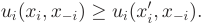

Intuitively, a dominant strategy of a player is the strategy that maximizes her utility no matter what strategy profile the other players choose. 

The concept of dominant strategy is the basis of incentivecompatibility, which means that there is no incentive for any player to lie about her private information, and thus revealing truthful information is the dominant strategy for every player. An accompanying concept is individual-rationality, which means that for every player, truthfully participating in the game/auction is expected to gain no less utility than staying outside. We now can introduce the definition of Strategy-Proof Mechanism. 

#### Definition 3 (Strategy-proof mechanism [24], [25]). A mechanism is strategy-proof if it satisfies both incentive-compatibility and individual-rationality. 

Another critical property required to design economicrobust double auctions is Ex-post Budget Balance. We define auction profit F as the difference between the total charges collected from the tenants and the total payments given to the cloud providers: 

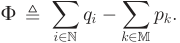

A double auction is ex-post budget balanced if the profit of the auctioneer is non-negative, i.e., F � 0. 

Our objective of this work is to design strategy-proof double auctions for cloud bandwidth reservation, while guaranteeing ex-post budget balance. Note that the Impossibility Theorem [26] shows that no double auctions can simultaneously achieve strategy profness, ex-post budget balance and maximum social welfare. Our designs first satisfy the 

IEEE TRANSACTIONS ON COMPUTERS, 

VOL. 64, NO. 7, JULY 2015 

2074 

economic properties while achieving the approximate maximum social welfare. This is also the general approach in double auctions design [20], [27]. 

### 2.3 McAfee Double Auction 

McAfee double auction [28] is one of the most commonly used double auctions. It achieves strategy-proofness and expost budget balance for single-unit double auctions, but cannot be directly applied to auctions with divisible or multi-unit goods, such as bandwidth. Our designs follow the methodology of McAfee double auction, and successfully achieves both strategy-proofness and ex-post budget balance for cloud bandwidth reservation double auction. 

We can summarize McAfee’s design as follows. 

- 1) It sorts the sellers (cloud providers) by their claimed prices in non-decreasing order: 

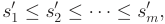

and sorts the buyers (tenants) by their bids in nonincreasing order: 

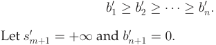

- 2) It finds the maximum number of k � minfm; ng, such that 

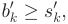

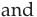

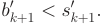

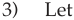

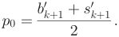

If p0 2 ½s0 k; b0 k�,thefirstkpairsofsellerandbuyer trade at price p0. Otherwise, only the first k � 1 pairs are valid trades, while the auctioneer pays each seller s0 k,chargeseachbuyerb0 k,andkeepsprofit ðk � 1Þðb0 k�s0 kÞ. 

Since McAfee double auction only matches a seller only to a single buyer, it cannot be directly applied to cloud bandwidth reservation double auctions, in which the bandwidth from a seller may satisfy the demands from multiple buyers. Therefore, we need to design new double auction mechanisms for cloud bandwidth reservation. 

## 3 GROUPING-BASED AUCTION 

In this section, we consider the case, in which the cloud providers have the same bandwidth capacity, i.e., B1 ¼ B2 ¼ ���¼ Bm ¼ b, and the bandwidth demands from the tenants are indivisible. Here, the demands are indivisible meaning that the tenants can only be allocated with the bandwidth from one data center. We present STAR-Grouping, which is a grouping-based strategy-proof double auction for cloud bandwidth reservation. STAR-Grouping follows the methodology of McAfee double auction. However, McAfee 

double auction only work with the scenarios of single-unit good, which is different from bandwidth. Unlike single-unit good, the bandwidth of a cloud provider can be allocated to multiple tenants, as long as the total demand of the tenants does not exceed the bandwidth capacity of the cloud provider. Therefore, major challenges in this problem are how to match each cloud provider with a group of tenants and how to design a pricing policy, such that both strategyproofness and ex-post budget balance can be achieved. The design rationale is intuitive. We first form super buyers by grouping the tenants together, and carefully select a group bid for each super buyer. After grouping, we can follow the design rationale of McAfee auction. We first present the details of STAR-Grouping and then analyze the properties of it, in this section. 

### 3.1 Design of STAR-Grouping 

STAR-Grouping is composed of three parts: tenant grouping, winner determination, and price calculation. 

### 3.1.1 Tenant Grouping 

In order to prevent the tenants from strategically submitting untruthful bids to manipulate the auction, STAR-Grouping forms tenant groups in a bid-independent way. The grouping only depends on the bandwidth demands of the tenants. Specifically, STAR-Grouping iteratively applies a knapsack algorithm (e.g., [29]) on the set of remaining tenants to find a group of tenants that maximizes the sum of the bandwidth demands within the limit of cloud provider’s bandwidth capacity b. The grouping process terminates when all the tenants are grouped. We denote the groups formed by 

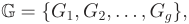

#### s.t., 

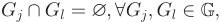

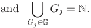

We now define each tenant group as a super buyer, and calculate the integrated bid Vl of each group Gl 2 G as: 

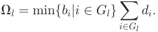

### 3.1.2 Winner Determination 

STAR-Grouping sorts the cloud providers by the claimed selling prices in non-decreasing order: 

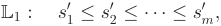

and sorts the super buyers (tenant groups) by their integrated bids in non-increasing order: 

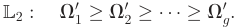

Let s0 mþ1¼ þ1 and V0 gþ1¼ 0. 

STAR-Grouping finds the largest index t � minfm; gg, such that 

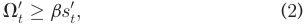

ZHENG ET AL.: STAR: STRATEGY-PROOF DOUBLE AUCTIONS FOR MULTI-CLOUD, MULTI-TENANT BANDWIDTH RESERVATION 

2075 

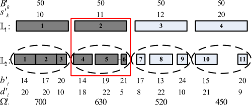

Fig. 2. An example for using STAR-Grouping. and 

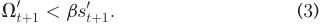

Then, STAR-Grouping calculates: 

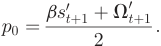

If p0 2 ½bs0 t; V t0�,thenthefirsttmatchedpairsofcloudpro- vider and tenant group are good trades, meaning that the first t cloud providers in the list L1 are winning cloud providers WM , and tenants in the first t groups in the list L2 are winning tenants WN : 

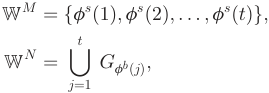

where the function fs ðtÞ and fb ðtÞ return the tth cloud provider and the tth tenant group in L1 and L2, respectively. Otherwise, the last match is sacrificed to guarantee strategyproofness, and the first t � 1 matches are good trades: 

and each winning tenant i 2 Gl � WN is charged: 

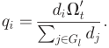

Algorithm 1. STAR-Grouping: Winner Determination and Price Calculation 

Input: Set of cloud providers M, bandwidth capacity b, set of tenants N, vector of bandwidth demands d~ , set of tenant groups G, profile of the cloud providers’ prices ~s, and profile of the tenants’ bids~ b. 

Output: Set of winning cloud providers WM , set of winning tenants WN , matrix of bandwidth reservation outcome A, profile of payments to cloud providers ~p, and profile of charges for tenants ~q. 

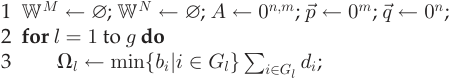

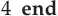

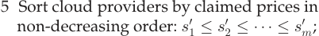

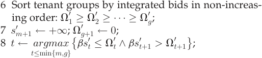

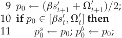

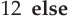

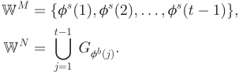

### 3.1.3 Price Calculation 

If a participant, no matter a cloud provider or a tenant, does not win in the auction, she is free of any payment or charge. STAR-Grouping calculates the payments and charges for auction winners by distinguishing two cases: 

� If p0 2 ½bs0 t; V t0�,theneachwinningcloudprovider k 2 WM receives payment pk ¼ p0; and each winning tenant group Gl � WN is charged by p0. Every tenant i 2 Gl is charged proportionally to her amount of bandwidth reserved, which is equal to her bandwidth demand in this case: 

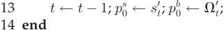

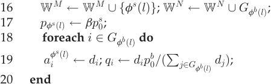

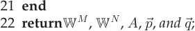

The pseudo-code of above winner determination and price calculation is shown by Algorithm 1. In Algorithm 1, sorting is the most time consuming part. Algorithm 1’s time complexity is Oðn log n þ m log mÞ. 

### 3.2 An Illustrative Example 

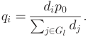

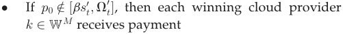

Fig. 2 shows a toy example for using STAR-Grouping. As shown in Fig. 2, there are 4 cloud providers each with bandwidth capacity b ¼ 50 units, and 11 tenants, which are divided into four tenant groups. The dashed eclipses represent the tenant groups. L1 and L2 indicate the sequence of the cloud providers and the tenant groups after sorting, respectively. The length of a rectangle indicates the amount of bandwidth capacity/demand from a cloud 

pk ¼ bs0 t; 

IEEE TRANSACTIONS ON COMPUTERS, VOL. 64, NO. 7, JULY 2015 

2076 

provider/tenant. The claimed selling prices and group bids are marked besides the cloud providers and the tenant groups, respectively. Since V20�s0 2bandV0 3< s0 3b, the maximum index that satisfies constraints (2) and (3) is t ¼ 2. The red box encloses the cloud provider and the tenant group with index t in their corresponding lists. Then, p0 can be calculated 

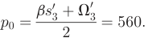

Since p0 2 ½bs0 2; V0 2�, the first two pairs of cloud provider and tenant group are valid trades, and thus the participants involved in the first two pairs are auction winners. Each of the winning cloud provider gets payment 560. Suppose the tenant 1 demands 20 units of bandwidth, and the total demand of the group, to which the tenant 1 belongs, is 50 units. Then, the charge for the tenant 1 is 

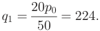

While in this example STAR-Grouping does not sacrifice any potential trades, there exist bid profiles where STARGrouping has to sacrifice the last good trade to guarantee strategy-proofness. 

### 3.3 Analysis 

In this section, we prove that STAR-Grouping achieves both strategy-proofness and ex-post budget balance. 

Before drawing the conclusion that STAR-Grouping is strategy-proof, we prove that STAR-Grouping satisfies individual rationality and incentive compatibility. 

#### Theorem 1. STAR-Grouping achieves individual rationality. 

- Proof. Since a participant, who does not win in the auction, is free of any payment or charge, she still cannot be better by leaving the auction. 

   - We then focus on the participants, who win in the auc- 

   - tion. We distinguish two cases: 

      - p0 2 ½bs0 t; V0 t�:Foreachwiningcloudprovider k 2 WM , her utility is non-negative, when revealing truthful cost: 

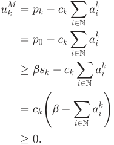

For each tenant i in winning tenant group Gl � WN , her utility is also non-negative, when bidding truthfully: 

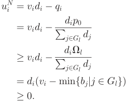

- p0 2 ½= bs0 t; V0 t�:Similarly,wecanprovethenon- negativity of the winning cloud providers’ and tenants’ utilities, by replacing p0 with s0 tand V t0in the previous proof, respectively. Due to limitations of space, we omit the proof here. 

So any winner in the auction gets non-negative utilities when behaving truthfully, and her utility would be 0, if she stays out of the auction. 

Therefore, STAR-Grouping achieves individual rationality. tu 

tu 

Before proving the incentive compatibility of STARGrouping, we show that the winner determination is monotonic and the pricing is bid-independent, without detailed proof, due to limitations of space. 

1) Monotonic winner determination. We present the following two lemmas to show that winner determination in STAR-Grouping is monotonic. Let~ b�i and ~s�k denote the bid profile of the tenants other than the tenants i and the price profile of the cloud providers other than the cloud provider k, respectively. 

- Lemma 1. If the cloud provider k wins in STAR-Grouping by claiming price sk, she also wins by claiming s0 k< sk,given any ~s�k and~ b. 

- Lemma 2. If the tenant i wins in STAR-Grouping by bidding bi, she also wins by bidding b0 i> bi, given any ~b�i and ~s. 

2) Bid-independent pricing: Since the pricing is independent of the winners’ bids or claimed prices, we have the following lemmas. 

- Lemma 3. If the cloud provider k wins in STAR-Grouping by claiming price either sk or s0 k,thenthepaymenttoheristhe same in the two cases, given any ~s�k and~ b. 

- Lemma 4. If the tenant i wins in STAR-Grouping by bidding either bi or b0 i,thenthechargetoheristhesameinthetwo cases, given any~ b�i and ~s. 

We now prove the incentive compatibility of STARGrouping using the above lemmas. 

#### Theorem 2. STAR-Grouping achieves incentive compatibility. 

Proof. First, we prove that STAR-Grouping is incentive compatible for the tenants, by distinguishing two case: 

- The tenant i 2 Gl wins in the auction and gets a non-negative utility uN i(by Theorem 1) when bid- ding truthfully, i.e., bi ¼ vi. Suppose the tenant i manipulates her bid and loses in the auction, her utility is definitely no more than uN i. We then con- sider the other case, in which she cheats the bid (i.e., b0 i6¼ vi), and still wins in the auction. 

ZHENG ET AL.: STAR: STRATEGY-PROOF DOUBLE AUCTIONS FOR MULTI-CLOUD, MULTI-TENANT BANDWIDTH RESERVATION 

2077 

According to Lemma 4, STAR-Grouping charges the tenant i with the same price, so her utility remains the same. 

- The tenant i 2 Gl loses in the auction and gets a zero utility when bidding truthfully, i.e., bi ¼ vi. If she still loses, when manipulating her bid, her utility cannot be changed. We consider the case, in which the tenant i wins in the auction by manipulating her bid b0 i> bi,andletpb 0bethe charge for the group Gl in this case. Let Vl and V0 l be the integrated bid of the group Gl, when the tenant i bids truthfully and not, respectively. Because the tenant i changes the auction result by increasing her bid, i must have the minimum bid in her group Gl when she bids truthfully, and then we have V0 l�pb 0�Vl.Wenowshowher utility still cannot be positive: 

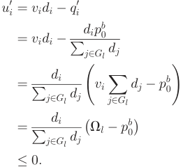

<!-- Start of picture text -->
u 0 i ¼ vidi � q i 0 ¼ vidi � dip b 0 P j2Gl dj di ¼ vi X dj � p0 b P j2Gl dj j2Gl ! di ¼ �Vl � p b 0� P j2Gl dj � 0: <!-- End of picture text -->

Second, we can prove STAR-Grouping is also incentive compatible for the cloud providers, similarly. Due to limitations of space, we do not repeat the proof here. 

Therefore, STAR-Grouping is incentive compatible for both the tenants and cloud providers. tu 

By integrating Theorem1 and Theorem2, we can draw the following theorem. 

#### Theorem 3. STAR-Grouping is a strategy proof double auction for cloud bandwidth reservation. 

We next prove that STAR-Grouping is ex-post budget balanced. 

#### Theorem 4. STAR-Grouping achieves ex-post budget balance. 

- Proof. We analyze the auction profit F by distinguishing two cases: 

   - p0 2 ½bs0 t; V0 t�. Since the total payment and the total charge are the same in this case, the auction profit is 0: 

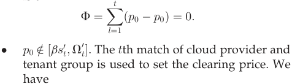

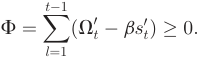

So, no matter in which case, we always have F � 0. This completes our proof. tu 

We observe that some winning cloud providers may not be fully filled due to the tenant grouping method. The auctioneer proposes a virtual padding tenant, which will be discussed in detail in the next section, to collect these unallocated marginal bandwidths. 

## 4 PADDING-BASED AUCTION 

In this section, we consider the problem of cloud bandwidth reservation in a general scenario, in which the bandwidth capacities of the cloud providers can be different and the demands of the tenants are divisible. Here, demands are divisible meaning that a tenant can obtain bandwidth from different data centers as long as the sum of bandwidth meets her demand. In this case, grouping the tenants statically can no longer fit various bandwidth capacities of the cloud providers. Therefore, we propose a new strategy-proof double auction, namely STAR-Padding in this section. 

When the cloud providers have various bandwidth capacities and the tenants have divisible demands, the major challenge for designing a strategy-proof double auction is the incentive compatibility for the partially filled cloud provider(s). A cloud provider may benefit by manipulating her claimed per unit bandwidth selling price to decrease her bandwidth allocated to tenants, and thus decrease her total serving cost. To address this problem, we propose a virtual padding tenant, who has unlimited bandwidth demand, to fully fill all the winning cloud providers’ unallocated bandwidth. By introducing the virtual padding tenant, we can handle the manipulated behaviors of cloud providers, and make our mechanism strategy-proofness. The padding tenant can be implemented by the auctioneer herself, and thus the padding bandwidth can be counted as additional profit gained from organizing the auction. The auctioneer may further sell the padding bandwidth to her subscribers, who do not have strict bandwidth requirements, out of the cloud bandwidth reservation auction. 

### 4.1 Design of STAR-Padding 

The STAR-Padding contains two components: winner selection and price calculation. 

### 4.1.1 Winner Selection 

Similar to STAR-Grouping, STAR-Padding first sorts the cloud providers by the claimed selling prices in nondecreasing order: 

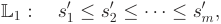

and then sorts the tenants, instead of the tenant groups, by their bids in non-increasing order: 

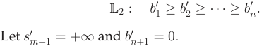

After sorting, STAR-Padding greedily reserves the bandwidth of the cloud providers for tenants using the water filling method. STAR-Padding “fills” the cloud providers one by one following the order specified in L1, with tenants by the order of L2. We note that the bandwidth demand of a tenant may be used to fill two or more consecutive cloud 

IEEE TRANSACTIONS ON COMPUTERS, VOL. 64, NO. 7, JULY 2015 

2078 

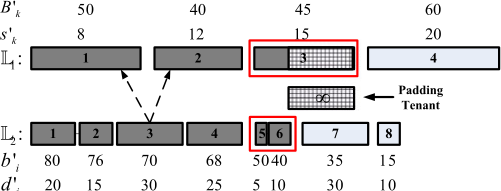

Fig. 3. An example for using STAR-Padding. 

providers, and the bandwidth capacity of a cloud provider may be filled with one or more tenants’ bandwidth demands. 

STAR-Padding finds the largest indexes t and f in L1 and L2, respectively, satisfying the following constraints: 

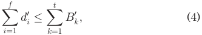

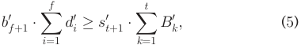

where B0 kisthebandwidthcapacityofthekthcloudpro- vider in list L1, and d0 iisthebandwidthdemandofthe ith tenant in list L2. Here, constraint (4) indicates that the first t cloud providers have sufficient bandwidths to satisfy the demands of the first f tenants. Constraint (5) guarantees the ex-post budge balance. Then, the winners in the auction are the first t cloud providers and the first f tenants. 

In STAR-Padding, the first t cloud providers’ bandwidths are all sold out. Noting from constraint (4), there may be left over bandwidth if 

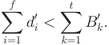

In this case, the auctioneer creates a padding tenant, and reserves bandwidth d on the tth cloud provider for the padding tenant: t f 

The bandwidth d reserved for the padding tenant is taken by the auctioneer. 

### 4.1.2 Price Calculation 

STAR-Padding pays each winning cloud provider k 2 WM by the ðt þ 1Þth selling price in list L1 multiplying her capacity: 

Each winning buyer i 2 WN is charged by the ðf þ 1Þth bid in the list L2 multiplying her demand: 

If a participant does not win in the auction, then she is free of any payment or charge. 

The pseudo-code of above winner determination and price calculation is shown by Algorithm 2. The runtime of Algorithm 2 is Oðn log n þ m log mÞ. 

Algorithm 2. STAR-Padding: Winner Determination and Price Calculation 

- Input: Set of cloud providers M, profile of bandwidth capacity B~ , set of tenants N, vector of bandwidth demands d~ , profile of cloud providers’ prices ~s, and profile of tenants’ bids~ b. 

- Output: Set of winning cloud providers WM , set of winning tenants WN , matrix of bandwidth reservation outcome A, profile of payments to cloud providers ~p, and profile of charges for tenants ~q 

- 1 WM ;; WN ;; A 0n;m ; ~p 0m ; ~q 0n ; 

- 2 Sort cloud providers by their selling prices in nondecreasing order: s10�s0 2�. . . �s0 m; 

- 3 Sort tenants by their bids in non-increasing order: b0 1�b0 2; �; ���; �b0 n; 

- 4 s0 mþ1þ1; b0 nþ10; 

- 5 Find the largest indexes f and t satisfying constraints (4) and (5); 

- 6 Let fs ðkÞ and fb ðiÞ return the kth cloud provider and the ith tenant in L1 and L2, respectively; 

- 7 k 1; i 1; 

- 8 while k � t and i � f do 

### 4.2 An illustrative Example 

Fig. 3 shows a toy example for applying STAR-Padding. There are four cloud providers and eight tenants, whose bandwidth capacities and demands are denoted by bars with different lengths, respectively. The claimed selling prices (bids) are marked besides the cloud providers (tenants). L1 and L2 indicate the sequence of the cloud providers and the tenants after sorting, respectively. STAR-Padding finds the largest index f ¼ 3 and t ¼ 6 according to constraints (4) and (5). So the first three cloud providers and the first 6 tenants are auction winners. Each winning cloud provider k gets payment s40�Bk,whereBkisherbandwidthcapacity, while each winning tenant i is charged b0 7�di,wherediis her bandwidth demand. Since the last winning cloud provider is not fully filled by the winning tenants’ demands, the auctioneer generates a virtual padding tenant to fully fill the third cloud provider’s bandwidth capacity. 

### 4.3 Analysis 

Since STAR-Padding pays each winning cloud provider with a higher price in list L1 and charges each winning tenant with a lower price in list L2, we have the following theorem. 

ZHENG ET AL.: STAR: STRATEGY-PROOF DOUBLE AUCTIONS FOR MULTI-CLOUD, MULTI-TENANT BANDWIDTH RESERVATION 

2079 

Fig. 4. Performance of STAR-Grouping, when the bandwidth capacity of each cloud provider is fixed at 3 units. 

#### Theorem 5. STAR-Padding achieves individual rationality. 

Similarly, we get that STAR-Padding has the properties of monotonic winner determination and bid-independent pricing. 

   - 1) Monotonic Winner Determination: 

- Lemma 5. If the cloud provider k wins in STAR-Padding by claiming price sk, she also wins by claiming s0 k< sk,given any ~s�k and~ b. 

- Lemma 6. If the tenant i wins in STAR-Padding by bidding bi, she also wins by bidding b0 i> bi, given any ~b�i and ~s. 2) Bid-Independent Pricing: 

- Lemma 7. If the cloud provider k wins in STAR-Padding by claiming price either sk or s0 k,thenthepaymenttoheristhe same for the two cases, given any ~s�k and~ b. 

- Lemma 8. If the tenant i wins in STAR-Padding by bidding either bi or b0 i,thenthechargetoheristhesameforthetwo cases, given any~ b�i and ~s. 

Using the way to prove Theorem 2, we can prove the following theorem. 

- Theorem 6. STAR-Padding achieves incentive compatibility. 

Due to limitations space, we omit the proof here. 

Since STAR-Padding satisfies both individual rationality and incentive-compatibility, we can draw the following conclusion. 

- Theorem 7. STAR-Padding is a strategy proof double auction for cloud bandwidth reservation. 

Finally, constraint (5) guarantees the ex-post budget balance. 

- Theorem 8. STAR-Padding achieves ex-post budget balance. 

## 5 EVALUATION RESULTS 

We implement STAR and conduct a series of simulations to evaluate its performance. In this section, we present our evaluation results. 

distributed over ck 2 ð0; 1�, while the tenant’s valuation on per unit bandwidth is randomly selected in the interval vi 2 ½0:8; 5�. Similarly, each tenant’s demand for bandwidth is also uniformly distributed over the normalized interval di 2 ð0; 1�. When we evaluate the performance of STAR-Padding, the reserved bandwidth amount of each cloud provider is randomly selected in the range of Bk 2 ð1; 5�. And we fixed the bandwidth capacity of each cloud provider at Bk ¼ 3 units (i.e., the mean of 1 and 5) when studying the performance of STAR-Grouping. We conduct another experiment, in which all the random values are generate by a normal distribution.1 All the results on performance are averaged over 1;000 runs. We evaluate the performance of STAR in terms of the following three metrics. 

- Cloud bandwidth utilization. Cloud bandwidth utilization is the proportion of the total bandwidth that is utilized/reserved in the auction. It also reflects the satisfaction ratio of cloud providers. Here, we use cloud bandwidth utilization and cloud provider satisfaction ratio interchangeably. 

- Tenant satisfaction ratio. Tenant satisfaction ratio is the ratio of bandwidth demands that can be satisfied in the auction. 

- Social welfare. As defined in Section 2.1, the social welfare is the difference between the sum of winning tenants’ valuations and the sum of winning providers’ costs on the reserved bandwidths. 

### 5.2 Performance on Bandwidth Reservation 

Fig. 4 shows the evaluation results of STAR-Grouping as a function of the number of tenants, when there are 10, 20 and 40 cloud providers and the bandwidth capacity of each cloud provider is fixed at 3 units. 

Fig. 4a illustrates the cloud bandwidth utilization of STAR-Grouping as a function of the number of tenants. We can see that STAR-Grouping bandwidth utilization almost linearly increases until the turning point is reached, and then stays in a stable saturation state. Furthermore, the bandwidth utilization ratio in saturation state is a constant less than 1, this is due to that STAR may sacrifice one 

### 5.1 Methodology 

We consider a set of cloud providers offer bandwidth reservation to numbers of tenants. The cloud provider’s cost of per unit bandwidth is normalized and uniformly 

1. The ranges of parameters can be different from the ones used here. However, the evaluation results of using different ranges are identical. Therefore, we only show the results of the above ranges in this paper. 

IEEE TRANSACTIONS ON COMPUTERS, VOL. 64, NO. 7, JULY 2015 

2080 

Fig. 5. Performance of STAR-Padding, when the bandwidth capacity of each cloud provider is uniformly distributed over (1, 5]. 

potential trade to guarantee strategy-proofness. The saturation bandwidth utilization ratio of STAR-Grouping increases with the growth of cloud providers, because larger amount of bandwidth leads to smaller sacrifice ratio against the number of tenants. Generally, the tenant satisfaction ratio is relatively stable when the number of tenants is small, and then decreases as the number of tenants increases. The reason is that more tenants in the auction leads to more intense competition, and thus the tenant satisfaction ratio decreases. We notice that the tenant satisfaction ratio is higher when there are larger cloud providers. This is because the higher supply of bandwidth leads to more trades in the auction and more tenants are allocated bandwidth. 

In Fig. 4c, we study the social welfare, the goal, achieved by STAR-Grouping. It is shown that the social welfare grows with the number of tenants, but the speed of growth slows down, and gradually enter a saturation state as we mentioned in Fig. 4a. Meanwhile, more cloud providers lead to higher social welfare, which fits our intuitions that more cloud providers can provide more bandwidth reservation. 

In Fig. 5, we show the performance of STAR-Padding as the number of tenants increases, when there are 10, 20 and 40 cloud providers and the bandwidth capacity of each cloud provider is uniformly distributed over ð1; 5�. 

Fig. 5a shows that STAR-Padding bandwidth utilization increases with the number of tenants, but the speed of growth is slowing, and gradually become saturated. The cloud provider leads to saturation state, because almost all bandwidth resource is reserved, when there are a large number of tenants. Similar to STAR-Grouping, more cloud providers lead to higher bandwidth utilization in the saturation state. Compared with STAR-Grouping, STAR-Padding achieves higher saturation bandwidth utilization ratio, since it sacrifices less bandwidth to guarantee strategy-proofness. 

Fig. 5b indicates that the bandwidth satisfaction ratio decrease as the scale of tenants grows. Again, the larger number of cloud providers leads to the higher tenant satisfaction ratio. This is because when the number of tenants is fixed, more cloud providers means higher supply of bandwidth, leading to more winning tenants. Therefore, the tenant satisfaction ratio increases. 

Fig. 5c shows the social welfare we can obtain when running STAR-Padding algorithm. Generally speaking, more tenants and more cloud providers lead to higher social welfare, as it was discussed in Fig. 4c. On one hand, we can 

allocate the fixed bandwidth more efficiently when there are more tenants in the auction. On the other hand, for fixed number of tenants, more bandwidth would be reserved when the number of cloud providers increases, and thus the social welfare becomes larger. 

Fig. 6 shows the evaluation results of STAR when all the random values are generate by a normal distribution. We can see that the evaluation results are similar to that before. We do not repeatedly describe the explain here. 

## 6 RELATED WORKS 

In this section, we first review related work on bandwidth reservation for cloud computing, and then review the pricing mechanism for network resource sharing. Finally, we review the work with auction mechanisms design. 

### 6.1 Bandwidth Reservation for Cloud Computing 

A number of work have been proposed to solve the problem of bandwidth reservation for cloud computing in these yeas. Here, we briefly enumerate some practical systems for bandwidth reservation in cloud computing. NetShare [30] is a hierarchical max-min bandwidth allocation. It relies on a centralized bandwidth allocator to divide link bandwidth among tenants. In [31], the authors started from three requirements for cloud network sharing: minguarantee, high utilization and payment proportionality, and then they propose three allocation policies to navigate these trandeoffs. Network virtualization technology has been widely used to provide the bandwidth sharing in cloud computing. SecondNet [4] is the first architectures to provide bandwidth guarantees for VMs through data center network virtualization. Oktopus [3] proposes two simplified virtual network abstractions: virtual clusters and virtual oversubscribed clusters, to explore the trade-off between bandwidth guarantees, costs and the provider revenue. Since SecondNet and Oktopus both offer the fixed bandwidth guarantees, Xie et al. [5] developed PROTEUS to capture the temporal dimension of bandwidth requirements. The proposed Time-Interleaved Virtual Clusters (TIVC) abstraction increases the overall datacenter utilization. Seawall [32] is a hypervisor-based framework that allows data center administrators to divide network and fairly share bandwidth among VM-pairs. Guo et al. considered the effects of larger numbers of short flows and massive bursty traffic in the datacenter, and designed a novel 

ZHENG ET AL.: STAR: STRATEGY-PROOF DOUBLE AUCTIONS FOR MULTI-CLOUD, MULTI-TENANT BANDWIDTH RESERVATION 

2081 

Fig. 6. Performance of STAR, when the bandwidth capacity of each cloud provider is normally distributed over (1, 5]. 

distributed bandwidth allocation algorithm based on the Logistic model [33]. 

Recently, some works considered the fairness of multiple resources (including CPU, memory and bandwidth) allocation in data center. Mesos [34] is a platform for multiple diverse cluster computing frameworks to share resources in a fine-gained manner. Fairness should be considered in designing resource allocation algorithms in a system containing multiple resource types. To address this problem, Ghodsi et al. proposed a novel game theoretic concept: dominant resource fairness (DRF), a generalization of maxmin fairness to multiple resource types [35]. Wang et al. generalized the notion of dominant resource fairness from a single server to multiple heterogeneous servers, and design a multi-resource allocation mechanism, called DRFH [36]. Guo et al. modeled the data center bandwidth allocation as a bargaining game and proposed Falloc, which is a new bandwidth allocation protocol for VM-based fairness across the data center [37]. 

### 6.2 Pricing Mechanism for Cloud Computing 

The traditional cloud pricing model is pay-as-you-go [38], and the practical reservation models often ignore the bandwidth resource. The traditional pricing and reservation models are not suitable for the needs of online streaming service providers. Cloud bandwidth reservation and charging has been identified as an important problem [6], [7], [14], [39]. Ballani et al. [40] proposed a pricing scheme, considering location independent tenant costs in datacenters. Wang et al. [41] propose a optimal capacity segmentation for cloud providers to maximize their revenue in hybrid cloud pricing. Zhao et al. [39] considered the problem of dynamic pricing for the cloud with geo-distributed data centers. To address the problem, they designed an efficient online algorithm, together with job scheduling and server provisioning in each datacenter, to maximize the profit of the cloud provider. Game theory has been considered an effective method of resource allocation for cloud services [42]. Niu et al. introduced a profit making broker to statistically mix demands and negotiate the bandwidth prices with tenants in a free market [6], [7]. However, their approaches inherit shortcomings of Nash equilibrium. One collusion-resistant cloud resource pricing scheme based on combinatorial auction is introduced in [14], and achieve a stronger solution concept: dominant equilibrium. In [43], a randomized combinatorial auction is designed for dynamic resource provisioning in cloud 

computing. Zhang et al. [15] designed a novel bidding language for users to express their heterogeneous demands. Besides, building on top of the bidding language, the authors propose COCA, an incentive compatible online cloud auction mechanism. Considering several types of available resources in cloud, Mashayekhy et al. [44] designed online mechanisms for VM provisioning and allocation. 

In contrast to these work, we propose a family of strategy-proof auction mechanisms for cloud bandwidth reservation in this paper. Our approaches achieve not only strategy-proofness, but also ex-post budget balance. 

### 6.3 Auction Mechanisms Design 

We study the problem of cloud bandwidth reservation in a model of double auction, which has been studied for decades. Conventional double auction mechanisms can be partitioned into single-unit [28], [45] and multi-unit auctions [19], [20]. Most of previous work follow the design rational of McAfee’s mechanism [28], sacrificing one effective trade to ensure strategy-proofness. Huang et al. [20] simply assume that the buyers’ demands are divisible and un-strict, i.e., the buyers can accept part of demands. None of these mechanisms can be applied directly into cloud bandwidth reservation market. 

Many strategy-proof mechanisms have been proposed to address different kinds of resource allocation problems, such as spectrum allocation in wireless network [16], [27], [46], [47], [48], [49], [50], [51], influence maximization in social network [18], incentive mechanism design in mobile crowdsensing [17], [52]. 

## 7 CONCLUSION AND FUTURE WORK 

In this paper, we have modeled the problem of cloud bandwidth reservation as a double-sided auction, and propose STAR, which is the first family of strategy-proof double auctions for multi-cloud, multi-tenant bandwidth reservation. STAR contains two auction mechanisms, namely STARGrouping and STAR-Padding. STAR-Grouping is applied in the scenario, in which the cloud providers have the same bandwidth capacity and the tenants’ demands are indivisible, while STAR-Padding can be used in the general scenario, in which the bandwidth capacities of the cloud providers can be different and the tenants’ demands are divisible. We have theoretically proven that both of the two auction mechanisms achieve strategy-proofness and ex-post 

IEEE TRANSACTIONS ON COMPUTERS, 

VOL. 64, NO. 7, JULY 2015 

2082 

budget balance. To the best of our knowledge, STAR is the first multi-unit double auction mechanism, achieving both strategy-proofenss and ex-post budget balance. We also extensively evaluated the performance of STAR. Our evaluation results have shown that STAR achieve good performance in terms of social welfare, cloud bandwidth utilization, and tenant satisfaction ratio. 

As for future work, one direction is to design double auction mechanisms that can prevent false-name bidding for cloud bandwidth reservation. Another direction is extending our work to online double auctions to adapt dynamic bandwidth demands/supplies changing from the tenants/ cloud providers. Extending STAR to address cheating on bandwidth demands and capacities is also an interesting research problem. 

## ACKNOWLEDGMENTS 

This work was supported in part by the State Key Development Program for Basic Research of China (973 project 2014CB340303 and 2012CB316201), in part by China National Science Foundation (NSF) grant 61422208, 61472252, 61272443 and 61133006, in part by Shanghai Science and Technology fund 12PJ1404900 and 12ZR1414900, and in part by Program for Changjiang Scholars and Innovative Research Team in University (IRT1158, PCSIRT) China. The opinions, findings, conclusions, and recommendations expressed in this paper are those of the authors and do not necessarily reflect the views of the funding agencies or the government. F. Wu is the corresponding author. 

## REFERENCES 

- [1] Netflix. (2014). [Online]. Available: www.netflix.com 

- [2] T. Lam, S. Radhakrishnan, A. Vahdat, and G. Varghese, “Four reasons we choose Amazon’s cloud as our computing platform,” The Netflix “Tech” Blog, 2010. 

- [3] H. Ballani, P. Costa, T. Karagiannis, and A. Rowstron, “Towards predictable datacenter networks,” in Proc. ACM SIGCOMM Conf. Appl., Technol., Archit., Protocols Comput. Commun., Toronto, ON, Canada, Aug. 2011, pp. 242–253. 

- [4] C. Guo, G. Lu, H. Wang, S. Yang, C. Kong, P. Sun, W. Wu, and Y. Zhang, “SecondNet: A data center network virtualization architecture with bandwidth guarantees,” presented at the 6th Int. Conf. Emerging Networking EXperiments and Technologies, Philadelphia, PA, USA, 2010. 

- [5] D. Xie, N. Ding, Y. C. Hu, and R. Kompella,“The only constant is change: Incorporating time-varying network reservations in data centers,” SIGCOMM Comput. Commun. Rev., vol. 42, no. 4, pp. 199–210, 2012. 

- [6] D. Niu, C. Feng, and B. Li, “A theory of cloud bandwidth pricing for video-on-demand providers,” in Proc. 31st Annu. IEEE Int. Conf. Comput. Commun., Orlando, FL, USA, Mar. 2012, pp. 711–719. 

- [7] D. Niu, C. Feng, and B. Li, “Pricing cloud bandwidth reservations under demand uncertainty,” in Proc. 12th Joint ACM SIGMETRICS / Perform. Conf., London, United Kingdom, Jun. 2012, pp. 151–162. 

- [8] Windows Azure [Online]. Available: www.windowsazure.com [9] Amazon EC2. (2014). [Online]. Available: http://aws.amazon. com/ec2/ 

- [10] GoogleAppEngine.(2014).[Online].Available:https://appengine. google.com/ 

- [11] Hulu. (2014). [Online]. Available: www.hulu.com 

- [12] Youku. (2014). [Online]. Available: www.youku.com 

- [13] V. Krishna, Auction Theory. San Francisco, CA, USA: Academic, 2009. 

- [14] Q. Wang, K. Ren, and X. Meng, “When cloud meets eBay: Towards effective pricing for cloud computing,” in Proc. 31st Annu. IEEE Int. Conf. Comput. Commun., Orlando, FL, USA, Mar. 2012, pp. 936–944. 

- [15] H. Zhang, B. Li, H. Jiang, F. Liu, A. Vasilakos, and J. Liu, “A framework for truthful online auctions in cloud computing with heterogeneous user demands,” in Proc. 32nd IEEE Int. Conf. Comput. Commun., Turin, Italy, Apr. 2013, pp. 1510–1518. 

- [16] X. Zhou, S. Gandhi, S. Suri, and H. Zheng, “eBay in the sky: Strategy-proof wireless spectrum auctions,” in Proc. 14th Int. Conf. Mobile Comput. Netw., San Francisco, CA, USA, Sep. 2008, pp. 2–13. 

- [17] D. Yang, G. Xue, X. Fang, and J. Tang, “Crowdsourcing to smartphones: Incentive mechanism design for mobile phone sensing,” in Proc. 18th Int. Conf. Mobile Comput. Netw., Istanbul, Turkey, Aug. 2012, pp. 173–184. 

- [18] Y. Singer, “How to win friends and influence people, truthfully: Influence maximization mechanisms for social networks,” in Proc. 5th ACM Int. Conf. Web Search Data Mining, Seattle, WA, USA, Feb. 2012, pp. 733–742. 

- [19] L. Chu,“Truthful bundle/multiunit double auctions,” Manage. Sci., vol. 55, no. 7, pp. 1184–1198, 2009. 

- [20] P. Huang, A. Scheller-Wolf, and K. Sycara,“Design of a multi– unit double auction e–market,” Comput. Intell., vol. 18, no. 4, pp. 596–617, 2002. 

- [21] A. Archer and E. Tardos, “Truthful mechanisms for one-parameter agents,” in Proc. 42nd Annu. Symp. Found. Comput. Sci., Las Vegas, NV, USA, Oct. 2001, pp. 482–491. 

- [22] M. J. Osborne and A. Rubenstein, A Course in Game Theory. Cambridge, MA, USA: MIT Press, 1994. 

- [23] D. Fudenberg and J. Tirole, Game Theory. Cambridge, MA, USA: MIT Press, 1991. 

- [24] A. Mas-Colell, M. D. Whinston, and J. R. Green, Microeconomic Theory. New York, NY, USA: Oxford, 1995. 

- [25] H. Varian, “Economic mechanism design for computerized agents,” in Proc. USENIX Workshop Electron. Commerce, 1995, p. 2. 

- [26] R. Myerson and M. Satterthwaite,“Efficient mechanisms for bilateral trading,” J. Econ. theory, vol. 29, no. 2, pp. 265–281, 1983. 

- [27] X. Zhou and H. Zheng, “TRUST: A general framework for truthful double spectrum auctions,” in Proc. 28th Annu. IEEE Conf. Comput. Commun., Rio de Janeiro, Brazil, Apr. 2009, pp. 999–1007. 

- [28] R. McAfee,“A dominant strategy double auction,” J. Econ. Theory, vol. 56, no. 2, pp. 434–450, 1992. 

- [29] H. Kellerer, U. Pferschy, and D. Pisinger, Knapsack Problems. New York, NY, USA: Springer Verlag, 2004. 

- [30] T. Lam, S. Radhakrishnan, A. Vahdat, and G. Varghese, “NetShare: Virtualizing data center networks across services,” Univ. California, San Diego, La Jolla, CA, USA, Tech. Rep. CS2010-0957, 2010. 

- [31] L. Popa, G. Kumar, M. Chowdhury, A. Krishnamurthy, S. Ratnasamy, and I. Stoica, “FairCloud: Sharing the network in cloud computing,” in Proc. ACM SIGCOMM Conf. Appl., Technol., Archit., Protocols Comput. Commun., Helsinki, Finland, Aug. 2012, pp. 187–198. 

- [32] A. Shieh, S. Kandula, A. Greenberg, C. Kim, and B. Saha, “Sharing the data center network,” in Proc. 8th USENIX Symp. Netw. Syst. Des. Implementation, Boston, MA, USA, Mar. 2011, p. 23. 

- [33] J. Guo, F. Liu, X. Huang, J. C. Lui, M. Hu, Q. Gao, and H. Jin, “On efficient bandwidth allocation for traffic variability in datacenters,” in Proc. 33nd IEEE Int. Conf. Comput. Commun., Toronto, ON, Canada, Apr. 2014, pp. 1572–1580. 

- [34] B. Hindman, A. Konwinski, M. Zaharia, A. Ghodsi, A. D. Joseph, R. Katz, S. Shenker, and I. Stoica, “Mesos: A platform for fine-grained resource sharing in the data center,” in Proc. 8th USENIX Symp. Netw. Syst. Des. Implementation, Boston, MA, USA, Mar. 2011, p. 22. 

- [35] A. Ghodsi, M. Zaharia, B. Hindman, A. Konwinski, S. Shenker, and I. Stoica, “Dominant resource fairness: Fair allocation of multiple resource types,” in Proc. 8th USENIX Symp. Netw. Syst. Des. Implementation, Boston, MA, USA, Mar. 2011, p. 24. 

- [36] W. Wang, B. Li, and B. Liang, “Dominant resource fairness in cloud computing systems with heterogeneous servers,” in Proc. 33nd IEEE Int. Conf. Comput. Commun., Toronto, ON, Canada, Apr. 2014, pp. 583–591. 

- [37] J. Guo, F. Liu, H. Tang, Y. Lian, H. Jin, and J. Lui, “Falloc: Fair network bandwidth allocation in iaas datacenters via a bargaining game approach,” in Proc. 21st Int. Conf. Netw. Protocols, Gottigen,€ Germany, Oct. 2013, pp. 1–10. 

- [38] M. Armbrust, A. Fox, R. Griffith, A. Joseph, R. Katz, A. Konwinski, G. Lee, D. Patterson, A. Rabkin, I. Stoica, and M. Zaharia,“ A view of cloud computing,” Commun. ACM, vol. 53, no. 4, pp. 50–58, 2010. 

ZHENG ET AL.: STAR: STRATEGY-PROOF DOUBLE AUCTIONS FOR MULTI-CLOUD, MULTI-TENANT BANDWIDTH RESERVATION 

2083 

- [39] J. Zhao, H. Li, C. Wu, Z. Li, Z. Zhang, and F. Lau, “Dynamic pricing and profit maximization for clouds with geo-distributed datacenters,” in Proc. 33nd IEEE Int. Conf. Comput. Commun., Toronto, ON, Canada, Apr. 2014, pp. 118–126. 

- [40] H. Ballani, P. Costa, T. Karagiannis, and A. Rowstron, “The price is right: Towards location-independent costs in datacenters,” in Proc. 10th ACM Workshop Hot Topics Netw., Cambridge, MA, USA, 2011. 

- [41] W. Wang, B. Li, and B. Liang, “Towards optimal capacity segmentation with hybrid cloud pricing,” in Proc. 33rd Int. Conf. Distributed Comput. Syst., Philadelphia, PA, USA, Jul. 2012, pp. 425–434. 

- [42] G. Wei, A. V. Vasilakos, Y. Zheng, and N. Xiong,“A gametheoretic method of fair resource allocation for cloud computing services,” J. Supercomput., vol. 54, no. 2, pp. 252–269, 2010. 

- [43] L. Zhang, Z. Li, and C. Wu, “Dynamic resource provisioning in cloud computing: A randomized auction approach,” in Proc. 33nd IEEE Int. Conf. Comput. Commun., Toronto, ON, Canada, Apr. 2014, pp. 433–441. 

- [44] L. Mashayekhy, M. Nejad, D. Grosu, and A. Vasilakos, “Incentivecompatible online mechanisms for resource provisioning and allocation in clouds,” presented at the 7th Int. Conf. Cloud Computing, Alaska, USA, Jun. 2014. 

- [45] L. Chu and Z. Shen, “Truthful double auction mechanisms,” Operations Res., vol. 56, no. 1, pp. 102–120, 2008. 

- [46] F. Wu and N. Vaidya, “SMALL: A strategy-proof mechanism for radio spectrum allocation,” in Proc. 30th Annu. IEEE Conf. Comput. Commun., Shanghai, China, Apr. 2011, pp. 81–85. 

- [47] M. Dong, G. Sun, X. Wang, and Q. Zhang, “Combinatorial auction with time-frequency flexibility in cognitive radio networks,” in Proc. 31st Annu. IEEE Int. Conf. Comput. Commun., Orlando, FL, USA, Mar. 2012, pp. 2282–2290. 

- [48] W. Wang, B. Li, and B. Liang, “District: Embracing local markets in truthful spectrum double auctions,” in Proc. 8th Annu. IEEE Commun. Soc. Conf. Sen., Mesh Ad Hoc Commun. Netw., Salt Lake City, UT, USA, Jun. 2011, pp. 521–529. 

- [49] H. Xu, J. Jin, and B. Li, “A secondary market for spectrum,” in Proc. 29th Annu. IEEE Conf. Comput. Commun., San Diego, CA, USA, Apr. 2010, pp. 1–5. 

- [50] X. Wang, Z. Li, P. Xu, Y. Xu, X. Gao, and H.-H. Chen, “Spectrum sharing in cognitive radio network: An auction-based approach,” IEEE Trans. Syst., Man, Cybern. B, Cybern., vol. 40, no. 3, pp. 587– 596, Jun. 2010. 

- [51] L. Gao, Y. Xu, and X. Wang, “Map: Multiauctioneer progressive auction for dynamic spectrum access,” IEEE Trans. Mobile Comput., vol. 10, no. 8, pp. 1144–1161, Aug. 2011. 

- [52] Z. Feng, Y. Zhu, Q. Zhang, and L. Ni, “TRAC: Truthful auction for location-aware collaborative sensing in mobile crowdsourcing,” in Proc. 33nd IEEE Int. Conf. Comput. Commun., Toronto, ON, Canada, Apr. 2014, pp. 1231–1239. 

Zhenzhe Zheng is a graduate student with the Department of Computer Science and Engineering, Shanghai Jiao Tong University, P.R. China. His research interests include algorithmic game theory, resource management in wireless networking, and data center. He is a student member of the ACM, CCF, and IEEE. 

Yang Gui is a graduate student with the Department of Computer Science and Engineering, Shanghai Jiao Tong University, P.R. China. His research interests lie in mobile social network and resource management in wireless networking. He is a student member of the ACM, CCF, and IEEE. 

Fan Wu received the BS degree in computer science from Nanjing University in 2004, and the PhD degree in computer science and engineering from the State University of New York at Buffalo in 2009. He is an associate professor in the Department of Computer Science and Engineering at Shanghai Jiao Tong University, P.R. China. He has visited the University of Illinois at UrbanaChampaign (UIUC) as a postdoc research associate. His research interests include wireless networking, cloud computing, and algorithmic mechanism design. He received Excellent Young Scholar award of Shanghai Jiao Tong University in 2011, and Pujiang Scholar award in 2012. He is a member of the ACM, CCF, and IEEE. For more information, please visit http://www.cs.sjtu.edu.cn/~fwu/. 

Guihai Chen received the BS degree from Nanjing University in 1984, the ME degree from Southeast University in 1987, and the PhD degree from the University of Hong Kong in 1997. He is a distinguished professor with Shanghai Jiaotong University, China. He had been invited as a visiting professor by many universities including Kyushu Institute of Technology, Japan, in 1998, University of Queensland, Australia, in 2000, and Wayne State University, during September 2001 to August 2003. He has a wide 

range of research interests with focus on sensor network, peer-to-peer computing, high-performance computer architecture and combinatorics. He has published more than 200 peer-reviewed papers, and more than 120 of them are in well-archived international journals such as IEEE Transactions on Parallel and Distributed Systems, Journal of Parallel and Distributed Computing, Wireless Network, The Computer Journal, International Journal of Foundations of Computer Science, and Performance Evaluation, and also in well-known conference proceedings such as HPCA, MOBIHOC, INFOCOM, ICNP, ICPP, IPDPS, and ICDCS. He is a member of the IEEE. 

" For more information on this or any other computing topic, please visit our Digital Library at www.computer.org/publications/dlib. 

