IEEE TRANSACTIONS ON KNOWLEDGE AND DATA ENGINEERING, VOL. 31, NO. 1, JANUARY 2019 

105 

# Achieving Data Truthfulness and Privacy Preservation in Data Markets 

Chaoyue Niu , Student Member, IEEE, Zhenzhe Zheng, Student Member, IEEE, Fan Wu , Member, IEEE, Xiaofeng Gao , Member, IEEE, and Guihai Chen, Senior Member, IEEE 

Abstract—As a significant business paradigm, many online information platforms have emerged to satisfy society’s needs for person-specific data, where a service provider collects raw data from data contributors, and then offers value-added data services to data consumers. However, in the data trading layer, the data consumers face a pressing problem, i.e., how to verify whether the service provider has truthfully collected and processed data? Furthermore, the data contributors are usually unwilling to reveal their sensitive personal data and real identities to the data consumers. In this paper, we propose TPDM, which efficiently integrates Truthfulness and Privacy preservation in Data Markets. TPDM is structured internally in an Encrypt-then-Sign fashion, using partially homomorphic encryption and identity-based signature. It simultaneously facilitates batch verification, data processing, and outcome verification, while maintaining identity preservation and data confidentiality. We also instantiate TPDM with a profile matching service and a data distribution service, and extensively evaluate their performances on Yahoo! Music ratings dataset and 2009 RECS dataset, respectively. Our analysis and evaluation results reveal that TPDM achieves several desirable properties, while incurring low computation and communication overheads when supporting large-scale data markets. 

Index Terms—Data markets, data truthfulness, privacy preservation 

Ç 

## 1 INTRODUCTION 

Iappetite for sharing personal data. Realizing the potentialN the era of big data, society has developed an insatiable of personal data’s economic value in decision making and user experience enhancement, several open information platforms have emerged to enable person-specific data to be exchanged on the Internet [1], [2], [3], [4], [5]. For example, Gnip, which is Twitter’s enterprise API platform, collects social media data from Twitter users, mines deep insights into customized audiences, and provides data analysis solutions to more than 95 percent of the Fortune 500 [2]. 

However, there exists a critical security problem in these market-based platforms, i.e., it is difficult to guarantee the truthfulness in terms of data collection and data processing, especially when privacies of the data contributors are needed to be preserved. Let’s examine the role of a pollster in the presidential election as follows. As a reliable source of intelligence, the Gallup Poll [6] uses impeccable data to assist presidential candidates in identifying and monitoring economic and behavioral indicators. In this scenario, simultaneously ensuring truthfulness and preserving privacy require the Gallup Poll to convince the presidential candidates that those indicators are derived from live interviews without leaking any interviewer’s real identity (e.g., social security number) or the content of her interview. If raw data 

- The authors are with the Shanghai Key Laboratory of Scalable Computing and Systems, Department of Computer Science and Engineering, Shanghai Jiao Tong University, Shanghai 200000, China. E-mail: {rvincency, zhengzhenzhe220}@gmail.com, {fwu, gao-xf, gchen}@cs.sjtu.edu.cn. 

Manuscript received 11 Aug. 2017; revised 6 Jan. 2018; accepted 19 Mar. 2018. Date of publication 3 Apr. 2018; date of current version 5 Dec. 2018. (Corresponding author: Fan Wu.) Recommended for acceptance by J. Chen. 

For information on obtaining reprints of this article, please send e-mail to: reprints@ieee.org, and reference the Digital Object Identifier below. Digital Object Identifier no. 10.1109/TKDE.2018.2822727 

sets for drawing these indicators are mixed with even a small number of bogus or synthetic samples, it will exert bad influence on the final election result. 

Ensuring truthfulness and protecting the privacies of data contributors are both important to the long term healthy development of data markets. On one hand, the ultimate goal of the service provider in a data market is to maximize her profit. Therefore, in order to minimize the expenditure for data acquisition, an opportunistic way for the service provider is to mingle some bogus or synthetic data into the raw data sets. Yet, to reduce operation cost, a strategic service provider may provide data services based on a subset of the whole raw data set, or even return a fake result without processing the data from designated data sources. However, if such speculative and illegal behaviors cannot be identified and prohibited, it will cause heavy losses to the data consumers, and thus destabilize the data market. On the other hand, while unleashing the power of personal data, it is the bottom line of every business to respect the privacies of data contributors. The debacle, which follows AOL’s public release of “anonymized” search records of its customers, highlights the potential risk to individuals in sharing personal data with private companies [7]. Besides, according to the survey report of 2016 TRUSTe/NCSA Consumer Privacy Infographic - US Edition [8], 89 percent say they avoid companies that do not protect their privacies. Therefore, the content of raw data should not be disclosed to data consumers to guarantee data confidentiality, even if the real identities of the data contributors are hidden. 

To integrate truthfulness and privacy preservation in a practical data market, there are four major challenges. The first and the thorniest design challenge is that verifying the truthfulness of data collection and preserving the privacy seem to be contradictory objectives. Ensuring the truthfulness of data collection allows the data consumers to verify 

1041-4347 � 2018 IEEE. Personal use is permitted, but republication/redistribution requires IEEE permission. See ht_tp://www.ieee.org/publications_standards/publications/rights/index.html for more information. 

IEEE TRANSACTIONS ON KNOWLEDGE AND DATA ENGINEERING, 

VOL. 31, NO. 1, JANUARY 2019 

106 

the validities of data contributors’ identities and the content of raw data, whereas privacy preservation tends to prevent them from learning these confidential contents. Specifically, the property of non-repudiation in classical digital signature schemes implies that the signature is unforgeable, and any third party is able to verify the authenticity of a data submitter using her public key and the corresponding digital certificate, i.e., the truthfulness of data collection in our model. However, the verification in digital signature schemes requires the knowledge of raw data, and can easily leak a data contributor’s real identity [9]. Regarding a message authentication code (MAC), the data contributors and the data consumers need to agree on a shared secret key, which is unpractical in data markets. 

Yet, another challenge comes from data processing, which makes verifying the truthfulness of data collection even harder. Nowadays, more and more data markets provide data services rather than directly offering raw data. The following three reasons account for such a trend: 1) For the data contributors, they have several privacy concerns [8]. Nevertheless, the service-based trading mode, which has hidden the sensitive raw data, alleviates their concerns; 2) For the service provider, semantically rich and insightful data services can bring in more profits [10]; 3) For the data consumers, data copyright infringement [11] and datasets resale [12] are serious. However, such a data trading mode differs from most of conventional data sharing scenarios, e.g., data publishing [13]. Besides, the result of data processing may no longer be semantically consistent with the raw data [14], which makes the data consumer hard to believe the truthfulness of data collection. In addition, the digital signatures on raw data become invalid for the data processing result, which discourages the data consumer from doing verification as mentioned above. Moreover, although data provenance [15] helps to determine the derivation history of a data processing result, it cannot guarantee the truthfulness of data collection. 

The third challenge lies in how to guarantee the truthfulness of data processing, under the information asymmetry between the data consumer and the service provider due to data confidentiality. In particular, to ensure data confidentiality against the data consumer, the service provider can employ a conventional symmetric/asymmetric cryptosystem, and can let the data contributors encrypt their raw data. Unfortunately, a hidden problem arisen is that the data consumer fails to verify the correctness and completeness of a returned data service. Even worse, some greedy service providers may exploit this vulnerability to reduce operation cost during the execution of data processing, e.g., they might return an incomplete data service without processing the whole raw data set, or even return an outright fake result without processing the data from designated data sources. 

Last but not least, the fourth design challenge is the efficiency requirement of data markets, especially for data acquisition, i.e., the service provider should be able to collect data from a large number of data contributors with low latency. Due to the timeliness of some kinds of person-specific data, the service provider has to periodically collect fresh raw data to meet the diverse demands of high-quality data services. For example, 25 billion data collection activities take place on Gnip every day [2]. Meanwhile, the service provider needs to verify data authentication and data integrity. One basic approach is to let each data contributor sign her raw data. However, classical digital signature schemes, which verify the received signatures one after another, may fail to satisfy 

the stringent time requirement of data markets. Furthermore, the maintenance of digital certificates under the traditional Public Key Infrastructure (PKI) also incurs significant communication overhead. Under such circumstances, verifying a large number of signatures sequentially certainly becomes the processing bottleneck at the service provider. 

In this paper, by jointly considering above four challenges, we propose TPDM, which achieves both <u>Truthful-</u> ness and <u>Privacy</u> preservation in <u>Data Markets.</u> TPDM first exploits partially homomorphic encryption to construct a ciphertext space, which enables the service provider to launch data services and the data consumers to verify the correctness and completeness of data processing results, while maintaining data confidentiality. In contrast to classical digital signature schemes, which are operated over plaintexts, our new identity-based signature scheme is conducted in the ciphertext space. Furthermore, each data contributor’s signature is derived from her real identity, and is unforgeable against the service provider or other external attackers. This appealing property can convince data consumers that the service provider has truthfully collected data. To reduce the latency caused by verifying a bulk of signatures, we propose a two-layer batch verification scheme, which is built on the bilinearity of admissible pairing. At last, TPDM realizes identity preservation and revocability by carefully adopting ElGamal encryption and introducing a semi-honest registration center. 

We summarize our key contributions as follows: 

- To the best of our knowledge, TPDM is the first secure mechanism for data markets achieving both data truthfulness and privacy preservation. 

- TPDM is structured internally in a way of Encryptthen-Sign using partially homomorphic encryption and identity-based signature. It enforces the service provider to truthfully collect and to process real data. Besides, TPDM incorporates a two-layer batch verification scheme with an efficient outcome verification scheme, which can drastically reduce computation overhead. 

- We instructively instantiate TPDM with two kinds of practical data services, namely profile matching and data distribution. Besides, we implement these two concrete data markets, and extensively evaluate their performances on Yahoo! Music ratings dataset and 2009 RECS dataset. Our analysis and evaluation results reveal that TPDM achieves good effectiveness and efficiency in large-scale data markets. Specifically, for the profile matching service, when supporting as many as 1 million data contributors in one session of data acquisition, the computation and communication overheads at the service provider are 0.930s and 0.235 KB per matching with 10 evaluating attributes in each profile. Furthermore, the outcome verification phase in TPDM avoids the most time-consuming homomorphic multiplications, and its overhead per data contributor is only 1.17 percent of the original similarity evaluation cost. 

The remainder of this paper is organized as follows. In Section 2, we introduce system model and adversary model. We show the detailed design of TPDM in Section 3, and analyze its security in Section 4. In Section 5, we elaborate on the applications to profile matching and data distribution. The evaluation results are presented in Section 6. We briefly 

NIU ET AL.: ACHIEVING DATA TRUTHFULNESS AND PRIVACY PRESERVATION IN DATA MARKETS 

107 

review related work in Section 7. We conclude the paper, and point out our future work in Section 8. 

## 2 PRELIMINARIES 

In this section, we first describe a general system model for data markets. We then introduce the adversary model, and present corresponding security requirements on the design. 

### 2.1 System Model 

As shown in Fig. 1, we consider a two-layer system model for data markets. The model has a data acquisition layer and a data trading layer. There are four major kinds of entities, including data contributors, a service provider, data consumers, and a registration center. 

In the data acquisition layer, the service provider procures massive raw data from the data contributors, such as social network users, mobile smart devices, smart meters, and so on. In order to incentivize more data contributors to actively submit high-quality data, the service provider needs to reward those valid ones to compensate their data collection costs. For the sake of security, each registered data contributor is equipped with a tamper-proof device. The tamper-proof device can be implemented in the form of either specific hardware [16] or software [17]. It prevents any adversary from extracting the information stored in the device, including cryptographic keys, codes, and data. 

We consider that the service provider is cloud based, and has abundant computing resources, network bandwidths, and storage space. Besides, she tends to offer semantically rich and value-added data services to data consumers rather than directly revealing sensitive raw data, e.g., social network analyses, data distributions, personalized recommendations, and aggregate statistics. 

The registration center maintains an online database of registrations, and assigns each registered data contributor an identity and a password to activate the tamper-proof device. Besides, she maintains an official website, called certificated bulletin board [18], on which the legitimate system participants can publish essential information, e.g., whitelists, blacklists, resubmit-lists, and reward-lists of data contributors. Yet, another duty of the registration center is to set up the parameters for a signature scheme and a cryptosystem. To avoid being a single point of failure or bottleneck, redundant registration centers, which have identical functionalities and databases, can be installed. 

### 2.2 Adversary Model 

In this section, we focus on attacks in practical data markets, and define corresponding security requirements. 

First, we consider that a malicious data contributor or an external attacker may impersonate other legitimate data contributors to submit possibly bogus raw data. Besides, some malicious attackers may deliberately modify raw data during submission. Hence, the service provider needs to confirm that raw data are indeed sent unaltered by registered data contributors, i.e., to guarantee data authentication and data integrity in the data acquisition layer. 

Second, the service provider in the data market might be greedy, and attempts to maximize her profit by launching the following two types of attacks: 

- Partial data collection: To cut down the expenditure on data acquisition, the service provider may insert bogus data into the raw data set. 

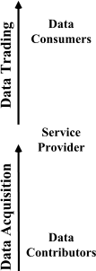

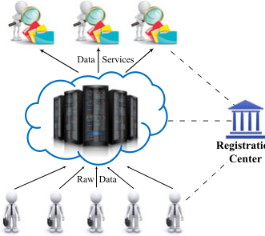

Fig. 1. A two-layer system model for data markets. 

- No/Partial data processing: To reduce the operation cost, the service provider may try to return a fake result without processing the data from designated sources, or to provide data services based on a subset of the whole raw data set. 

On one hand, to counter partial data collection attack, each data consumer should be enabled to verify whether raw data are really provided by registered data contributors, i.e., truthfulness of data collection in the data trading layer. On the other hand, the data consumer should have the capability to verify the correctness and completeness of a returned data service in order to combat no/partial data processing attack. We here use the term truthfulness of data processing in the data trading layer to represent the integrated requirement of correctness and completeness of data processing results. 

Third, we assume that some honest-but-curious data contributors, the service provider, the data consumers, and external attackers, e.g., eavesdroppers, may glean sensitive information from raw data, and recognize real identities of data contributors for illegal purposes, e.g., an attacker can infer a data contributor’s home location from her GPS records. Hence, raw data of a data contributor should be kept secret from these system participants, i.e., data confidentiality. Besides, an outside observer cannot reveal a data contributor’s real identity by analysing data sets sent by her, i.e., identity preservation. 

Fourth, a minority of data contributors may try to behave illegally, e.g., launching attacks as mentioned above, if there is no punishment. To prevent this threat, the registration center should have the ability to retrieve a data contributor’s real identity, and revoke it from further usage, when her signature is in dispute, i.e., traceability and revocability. 

Last but not least, the semi-honest registration center may misbehave by trying to link a data contributor’s real identity with her raw data. Besides, if there is no detection or verification in the cryptosystem, she may deliberately corrupt the decrypted results. However, to guarantee full side information protection, the requirement on the registration center is that she cannot leak decrypted samples to irrelevant system participants. Moreover, she is required to perform an acknowledged number of decryptions in a specific data service [19], which should be publicly posted on the certificated bulletin board. 

## 3 DESIGN OF TPDM 

In this section, we propose TPDM, which integrates data truthfulness and privacy preservation in data markets. 

IEEE TRANSACTIONS ON KNOWLEDGE AND DATA ENGINEERING, 

VOL. 31, NO. 1, JANUARY 2019 

108 

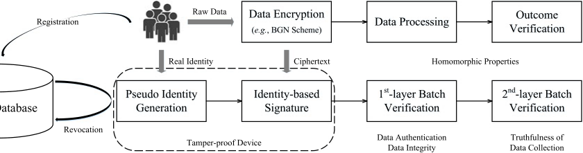

Fig. 2. System architecture of TPDM. 

### 3.1 Design Rationales 

Using the terminology from the signcryption scheme [20], TPDM is structured internally in a way of Encrypt-thenSign, using partially homomorphic encryption and identitybased signature. It enforces the service provider to truthfully collect and process real data. The essence of TPDM is to first synchronize data processing and signature verification into the same ciphertext space, and then to tightly integrate data processing with outcome verification via the homomorphic properties. With the help of the architectural overview in Fig. 2, we illustrate the design rationales as follows. 

Space Construction. The thorniest problem is how to enable the data consumer to verify the validnesses of signatures, while maintaining data confidentiality. If the signature scheme is applied to the plaintext space, the data consumer needs to know the content of raw data for verification. However, if we employ a conventional public key encryption scheme to construct the ciphertext space, the service provider has to decrypt and then process the data. Even worse, such a construction is vulnerable to the no/partial data processing attack, because the data consumer, only knowing the ciphertexts, fails to verify the correctness and completeness of the data service. Thus, the greedy service provider may reduce operation cost, by returning a fake result or manipulating the inputs of data processing. Therefore, we turn to the partially homomorphic cryptosystem for encryption, whose properties facilitate both data processing and outcome verification on the ciphertexts. 

Batch Verification. After constructing the ciphertext space, we can let each data contributor digitally sign her encrypted raw data. Given the ciphertext and signature, the service provider is able to verify data authentication and data integrity. Besides, we can treat the data consumer as a third party to verify the truthfulness of data collection. However, an immediate question arisen is that the sequential verification schema may fail to meet the stringent time requirement of large-scale data markets. In addition, the maintenance of digital certificates also incurs significant communication overhead. To tackle these two problems, we propose an identity-based signature scheme, which supports two-layer batch verifications, while incurring small computation and communication overheads. 

Breach Detection. Yet, another problem in existing identity-based signature schemes is that the real identities are viewed as public parameters, and are not well-protected. On the other hand, if all the real identities are hidden, none of the misbehaved data contributors can be identified. To meet these two seemly contradictory requirements, we employ ElGamal encryption to generate pseudo identities for each registered data contributor, and introduce a new third party, called registration center. Specifically, the registration 

center, who owns the private key, is the only authorized party to retrieve the real identities, and to revoke those malicious accounts from further usage. 

### 3.2 Design Details 

Following the guidelines given above, we now introduce TPDM in detail. TPDM consists of 5 phases: initialization, signing key generation, data submission, data processing and verifications, and tracing and revocation. 

Phase I: Initialization. We assume that the registration center sets up the system parameters at the beginning of data trading as follows: 

- The registration center chooses three multiplicative cyclic groups G1, G2, and GT with the same prime order q. Besides, g1 is a generator of G1, and g2 is a generator of G2. Moreover, these three cyclic groups compose an admissible pairing ^e : G1 � G2 ! GT [21]. 

- The registration center randomly picks s1; s2 2 Z� qas her two master keys, and then computes 

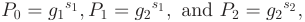

as public keys. The master keys s1; s2 are preloaded into each registered data contributor’s tamper-proof device. 

- The registration center sets up parameters for a partially homomorphic cryptosystem: a private key SK, a public key PK, an encryption scheme Eð�Þ, and a decryption scheme Dð�Þ. 

- To activate the tamper-proof device, each registered data contributor oi is assigned with a “real” identity RIDi 2 G1 and a password PW i. Here, RIDi uniquely identifies oi, while PW i is required in the access control process. 

- The system parameters 

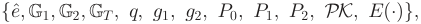

are published on the certificated bulletin board. 

Phase II: Signing Key Generation. To achieve anonymous authentication in data markets, the tamper-proof device is utilized to generate a pair of pseudo identity PIDi and secret key SKi for each registered data contributor oi: 

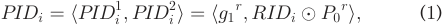

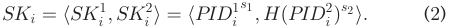

Here, r is a per-session random nonce, � represents the Exclusive-OR (XOR) operation, and H(�) is a MapToPoint hash function [21], i.e., Hð�Þ : f0; 1g� ! G1. Besides, PIDi is 

NIU ET AL.: ACHIEVING DATA TRUTHFULNESS AND PRIVACY PRESERVATION IN DATA MARKETS 

109 

an ElGamal encryption [22] of the real identity RIDi over the elliptic curves, while SKi is generated accordingly by exploiting identity-based encryption (IBE) [21]. 

Phase III: Data Submission. For secure submission of raw data, we need to consider several requirements, including confidentiality, authentication, and integrity. To provide data confidentiality, we employ partially homomorphic encryption. Besides, to guarantee data authentication and data integrity, the encrypted raw data should be signed before submission, and be verified after reception. 

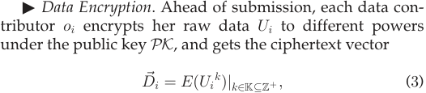

where K is a set of positive integers, and is determined by the requirements of data services, e.g., the location-based aggregate statistics [19] may require K ¼ f1g, whereas in the fine-grained profile matching [23], K ¼ f1; 2g. 

" Encrypted Data Signing. After encryption, each data contributor oi computes the signature si on the ciphertext vector D~ i using her secret key: 

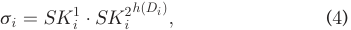

where “�” denotes the group operation in G1, hð�Þ is a oneway hash function, e.g., SHA-1 [24], and Di is derived by concatenating all the elements of D~ i together. 

Eventually, oi submits her tuple hPIDi; D~ i; sii to the service provider. On one hand, once receiving the tuple, the service provider is required to post the pseudo identity PIDi on the certificated bulletin board for fear of receiverrepudiation. On the other hand, to prevent a registered data contributor from using the same pair of pseudo identity and secret key for multiple times in different sessions of data acquisition, one intuitive way is to encapsulate the signing phase into the tamper-proof device. Yet, another feasible way is to let the service provider store those used pseudo identities for duplication check later. 

Phase IV: Data Processing and Verifications. In this phase, we consider two-layer batch verifications, i.e., verifications conducted by both the service provider and the data consumer. Between the two-layer batch verifications, we introduce data processing and signatures aggregation done by the service provider. At last, we present outcome verification conducted by the data consumer. 

" First-layer Batch Verification. We assume that the service provider receives a bundle of data tuples from n distinct data contributors, denoted as fhPIDi; D~ i; siiji 2 ½1; n�g. To prevent a malicious data contributor from impersonating other legitimate ones to submit possibly bogus data, the service provider needs to verify the validnesses of signatures by checking whether 

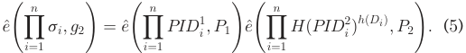

Compared with single signature verification, this batch verification scheme can dramatically reduce the verification latency, especially when verifying a large number of signatures. Since the three pairing operations in Equation (5) dominate the overall computation cost, the batch verification time is almost a constant if the time overhead of n 

MapToPoint hashings and n exponentiations is small enough to be emitted. However, in a practical data market, when the number of data contributors is too large, the expensive pairing operations cannot dominate the verification time. We will elaborate on this point in Section 6.1. 

" Data Processing and Signatures Aggregation. Instead of directly trading raw data for revenue, more and more service providers tend to trade value-added data services, e.g., social network analysis, personalized recommendation, location-based service, and data distribution. 

To facilitate generating a precise and customized strategy in targeted data services, e.g., profile matching and personalized recommendation, the data consumer also needs to provide her own ciphertext vector D~ 0 and a threshold d. Moreover, D~ 0 is derived from the data consumer’s information V as follows: 

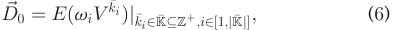

where k� i; vi are parameters determined by a concrete data service. For example, the profile-matching service in Section 5.1 requires k� i 2 f1; 2g and vi 2 f�2; 1g. 

Now, the service provider can process the collected data as required by the data consumer. We model such a data processing in the plaintext space as 

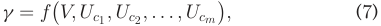

for generality. Accordingly, f can be equivalently evaluated in the ciphertext space using 

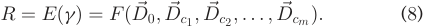

The equivalent transformation from f to F is based on the properties of the partially homomorphic cryptosystem, e.g., homomorphic addition � and homomorphic multiplication �, which are arithmetic operations on the ciphertexts that are equivalent to the usual addition and multiplication on the plaintexts, respectively. Hence, only polynomial functions can be computed in a straightforward way. Nevertheless, most non-polynomial functions, e.g., sigmoid and rectified linear activation functions in machine learning, can be well approximated/handled by polynomials [25]. Besides, the function f is determined by the data processing method, and the choice of a specific partially homomorphic cryptosystem should support the basic operation(s) in f. For example, the primitive of aggregate statistics [19] is addition, hence, the Paillier scheme [26] can be the first choice; while the distance calculation [27] requires one more multiplication, thus, the BGN scheme [18] may be preferred. Furthermore, in Equation (8), D~ 0 is the data consumer’s ciphertext vector, and D~ ci indicates that the data contributor oci is one of the m valid data contributors. More precisely, m is the size of whitelist on the certificated bulletin board, and its default value is n. However, if either of the two-layer batch verifications fails, m will be updated in the tracing and revocation phase. We below use C to denote the indexes of m valid data contributors, i.e., C ¼ fc1; c2; . . . ; cmg. 

Now, the service provider sends R to the registration center for decryption. We note that the registration center can only perform decryptions for acknowledged times, which should be publicly announced on the certificated bulletin board. For example, in the aggregate statistics over a valid dataset of size m, the registration center just needs to do one decryption, and cannot do more than required. The 

IEEE TRANSACTIONS ON KNOWLEDGE AND DATA ENGINEERING, 

VOL. 31, NO. 1, JANUARY 2019 

110 

reason is that the service provider can still obtain the correct aggregate result by decrypting all m encrypted raw data. 

Upon getting the plaintext g, the service provider can compare it with d, and obtain the comparison result #. For brevity, the concrete-value result g and the comparison result # are collectively called outcome. We note that the outcome may be in different formats, e.g., average speeds in location-based aggregate statistics [19], shopping suggestions in private recommendation [28], and friending strategies in social networking [23]. We assume that the outcome involves f candidate data contributors, and the subscripts of their pseudo identities are denoted as I ¼ �I1; I2; . . . ; If�: 

After data processing, to further reduce communication overhead, the service provider can aggregate f candidate signatures into one signature. In our scheme, the aggregate signature s ¼Q i2Isi:Then,theserviceprovidersendsthe final tuple to the data consumer, including the data service outcome, the aggregate signature s, the index set I, and f candidate ciphertexts fD~ iji 2 Ig. 

" Second-layer Batch Verification. Similar to the first-layer batch verification, the data consumer can verify the legitimacy of f candidate data sources by checking whether 

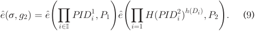

Here, the pseudo identities on the right hand side of the above equation can be fetched from the certificated bulletin board according to the index set I. 

" Outcome Verification. The homomorphic properties also enable the data consumer to verify the truthfulness of data processing. Under the condition that the data consumer knows her plaintext V , all the cross terms involving D~ 0 in Equation (8) can be evaluated through multiplication by a constant V . Hence, part of the most time-consuming homomorphic multiplications � in the original data processing are no longer needed in outcome verification. Besides, if for correctness, the data consumer just needs to evaluate on the f candidate ciphertexts. Of course, she reserves the right to require the service provider to send her the other ðm � fÞ valid ones, on which the completeness can be verified. 

In fact, if f or m � f is too large, the data consumer can take the strategy of random sampling for verification, where the m valid pseudo identities on the certificated bulletin board can be used for the sampling indexes. Random sampling is a tradeoff between security and efficiency, and we shall illustrate its feasibility in Sections 5 and 6.1. 

Phase V: Tracing and Revocation. The two-layer batch verifications only hold when all the signatures are valid, and fail even when there is a single invalid signature. In practice, a signature batch may contain invalid one(s) caused by accidental data corruption or possibly malicious activities launched by an external attacker. Traditional batch verifier would reject the entire batch, even if there is a single invalid signature, and thus waste the other valid data items. Therefore, tracing and/or recollecting invalid data items and their corresponding signatures are important in practice. If the second-layer batch verification fails, the data consumer can require the service provider to find out the invalid signature (s). Similarly, if the first-layer batch verification fails, the service provider has to find out the invalid one(s) by herself. 

To extract invalid signatures, as shown in Algorithm 1, we propose ‘-DEPTH-TRACING algorithm. We consider that the 

batch contains n signatures. In addition, the whitelist, the blacklist, and the resubmit-list of pseudo identities are global variables, and are initialized as empty sets. If a batch verification fails, the service provider first finds out the mid-point as mid ¼ b1þ2n~~c~~(Line 9). Then, she performs batch verification on the first half (head to mid) (Line 10) and the second half (mid þ 1 to tail) (Line 11), respectively. If either of these two halves causes a failure, the service provider repeats the same process on it. Otherwise, she adds the pseudo identities from the valid half to the whitelist (Line 4- 5). The recursive process terminates, if validnesses of all the signatures has been identified or a pre-defined limit of search depth is reached (Line 2). A special case is the single signature verification, in which the service provider can determine its validness (Line 6-7). After this algorithm, the service provider can form the resubmit-list of pseudo identities by excluding those in the other two lists. 

### Algorithm 1. ‘-DEPTH-TRACING 

- Initialization: S ¼ fs1; . . . ; sng, head ¼ 1, tail ¼ n, limit ¼ ‘, whitelist ¼ ? ; blacklist ¼ ? ; resubmitlist ¼ ? 

- 1: Function ‘-depth-TracingS; head; tail; limit 2: if jwhitelistj þ jblacklistj ¼ n or limit ¼ 0 then 3: return 4: else if CHECK-VALIDS; head; tail = true then 5: ADD-TO-WHITELIST head; tail 6: else if head ¼ tail then "Single signature verification 7: ADD-TO-BLACKLIST head; tail 8: else "Batch signatures verification from shead to stail 9: mid ¼ bhead2þtailc 

- 10: ‘- DEPTH-TRACINGS; head; mid; limit � 1 11: ‘-DEPTH-TRACINGS; mid þ 1; tail; limit � 1 

According to the blacklist on the certificated bulletin board, the registration center can reveal the real identities of those invalid data contributors. Given the data contributor oi’s pseudo identity PIDi, the registration center can use her master key s1 to perform revealing by computing 

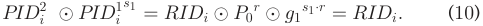

Upon getting a misbehaved data contributor’s real identity, the registration center can revoke it from further usage if necessary, e.g., deleting her account from the online registration database. Thus, the revoked data contributor can no longer activate the tamper-proof device, which indicates that she does not have the right to submit data any more. 

## 4 SECURITY ANALYSIS 

In this section, we analyze the security of TPDM. 

### 4.1 Data Authentication and Data Integrity 

Data authentication and data integrity are regarded as two basic security requirements in the data acquisition layer. The signature in TPDM si ¼ SK1 i�SK2 i hðDiÞ is actually a one-time identity-based signature. We now prove that if the Computational Diffie-Hellman (CDH) problem in the bilinear group G1 is hard [21], an attacker cannot successfully forge a valid signature on behalf of any registered data contributor except with a negligible probability. 

First, we consider Game 1 between a challenger and an attacker as follows: 

NIU ET AL.: ACHIEVING DATA TRUTHFULNESS AND PRIVACY PRESERVATION IN DATA MARKETS 

111 

- Setup: The challenger starts by giving the attacker the system parameters g1 and P0. The challenger also offers a pseudo identity PIDi ¼ hPID1 i; PID2 iitotheattacker, which simulates the condition that the pseudo identities are posted on the certificated bulletin board in TPDM. 

- Query: We assume that the attacker does not know how to compute the MapToPoint hash function Hð�Þ and the one-way hash function hð�Þ. However, she can ask the challenger for the value HðPID2 iÞandtheone-way hashes hð�Þ for up to n different messages. 

- Challenge: The challenger asks the attacker to pick two random messages Mi1 and Mi2 , and to generate two corresponding signatures si1 and si2 on behalf of the data contributor oi. 

- Guess: The attacker sends hMi1 ; si1 i and hMi2 ; si2 i to the challenger. We denote the attacker’s advantage in winning Game 1 to be 

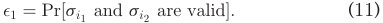

We further claim that our signature scheme is adaptively secure against existential forgery, if �1 is negligible. We prove our claim using Game 2 by contradiction. 

Second, we assume that there exists a probabilistic polynomial-time algorithm A such that it has the same non-negligible advantage �1 as the attacker in Game 1. Then, we will construct Game 2, in which an attacker B can make use of A to break the CDH assumption with non-negligible probability. In particular, B is given ðg1; g1a ; g1b ; g1c ; dÞ for unknown ða; b; cÞ and known d, and is asked to compute g12ab � g1cd . We note that computing g12ab � g1cd is as hard as computing g1ab , which is the original CDH problem. We present the details of Game 2 as follows: 

- Setup: B makes up the parameters g1 and P0 ¼ g1a , where a plays the role of the master key s1 in TPDM. Besides, B also provides A with a pseudo identity PIDi ¼ hPID1 i; PID2 ii ¼ hg1b; RIDi �g1abi.Here,bfunctionsastheran- dom nonce r in TPDM. 

- Query: A then asks B for the value HðPID2 iÞs2, and B replies with g1c . We note that HðPID2 iÞ is the only MapToPoint hash operation to forge the data contributor oi’s valid signatures. Besides, A picks n random messages, and requests B for their one-way hash values hð�Þ. B answers these queries using a random oracle: B maintains a table to store all the answers. Upon receiving a message, if the message has been queried before, B answers with the stored value; otherwise, she answers with a random value, which is stored into the table for later usage. Except for the x-th and y-th queries (i.e., messages Mx and My), B answers with the values d1 and d2, respectively, where d1 þ d2 ¼ d. 

Challenge: When the query phase is over, B asks A to choose two random messages Mi1 and Mi2 , and to sign them on behalf of the data contributor oi. 

Guess: A returns two signatures si1 and si2 on the messages Mi1 and Mi2 to B. We note that Mi1 and Mi2 must be within the n queried messages; otherwise, A does not know hðMi1 Þ and hðMi2 Þ. Furthermore, if Mi1 ¼ Mx and Mi2 ¼ My or Mi1 ¼ My and Mi2 ¼ Mx, B then computes si1 � si2 , which is equivalent to: 

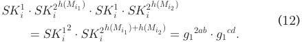

After obtaining si1 � si2 , B solves the given CDH instance successfully. We note that A’s advantage in breaking TPDM is �1, and the probability that A picks Mx and My is nðn2�1Þ.Thus,theprobabilityof B’s success is: 

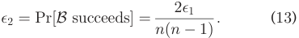

Since �1 is non-negligible, B can solve the CDH problem with the non-negligible probability �2, which contradicts with the assumption that the CDH problem is hard. This completes our proof. Therefore, our signature scheme is adaptively secure under random oracle model. 

Last but not least, the first-layer batch verification scheme in TPDM is correct if and only if Equation (5) holds. The correctness of this equation follows from the bilinear property of admissible pairing. Due to the limitation of space, the detailed proof is put into our technical report [29]. 

In conclusion, our novel identity-based signature scheme is provably secure, and the properties of data authentication and data integrity are achieved. 

### 4.2 Truthfulness of Data Collection 

To guarantee the truthfulness of data collection, we need to combat the partial data collection attack defined in the Section 2.2. We note that it is just a special case of Game 1 in Section 4.1, where the service provider is the attacker. Hence, it is infeasible for the service provider to forge valid signatures on behalf of any registered data contributor. Such an appealing property prevents the service provider from injecting spurious data undetectably, and enforces her to truthfully collect real data. In addition, similar to data authentication and data integrity, the data consumer can verify the truthfulness of data collection by performing the second-layer batch verification with Equation (9). Proof of correctness is similar to that of Equation (5), where we can just replace the aggregate signature s withQ i2Isi. 

### 4.3 Truthfulness of Data Processing 

We now analyze the truthfulness of data processing from two aspects, i.e., correctness and completeness. 

Correctness. TPDM ensures the truthfulness of data collection, which is the premise of a correct data service. Then, given a truthfully collected dataset, the data consumer can evaluate over the f candidate data sources, which is consistent with the original data processing under the homomorphic properties. 

Completeness. In fact, our design provides the property of completeness by guaranteeing the correctness of n, m, and f, which are the numbers of total, valid, and candidate data contributors, respectively: 

First, the service provider cannot deliberately omit a data contributor’s real data. The reason is that if the data contributor has submitted her encrypted raw data, without finding her pseudo identity on the certificated bulletin board, she would obtain no reward for data contribution. Therefore, she has incentives to report data missing to the registration center, which in turn ensures the correctness of n. 

Second, we consider that the service provider compromises the number of valid data contributors m in two ways: one is to put a valid data contributor’s pseudo identity into the blacklist; the other is to put an invalid pseudo identity into the whitelist. We discuss these two cases separately: 1) 

IEEE TRANSACTIONS ON KNOWLEDGE AND DATA ENGINEERING, VOL. 31, NO. 1, JANUARY 2019 

112 

In the first case, the valid data contributor would not only receive no reward, but may also be revoked from the online registration database. Hence, she has strong incentives to resort to the registration center for arbitration. Besides, we claim that the service provider wins the arbitration except with negligible probability. We give the detailed proof via Game 3 between a challenger and an attacker: 

- Setup: The challenger first gives the attacker m valid data tuples, denoted as fhPIDi; D~ i; siiji 2 Cg. This simulates the data submissions from m valid data contributors. 

- Challenge: The challenger asks the attacker to pick a random data contributor oi within the m valid ones, and to generate a distinct signature s� ion the data vector D~ i. 

- Guess: The attacker returns s� ito the challenger. The attacker wins Game 3, if s� i6¼ si, s� ipasses the challenger’s veri- fication, and si fails in the verification. 

Next, we demonstrate that the attacker’s winning probability in Game 3, denoted as 

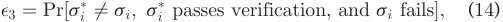

is negligible. On one hand, the verification scheme in TPDM is publicly verifiable, which indicates that the challenger can verify the legitimacy of s� iand si through checking whether 

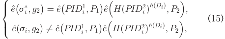

hold at the same time. We note that the above two equations conform to the formula of single signature verification, i.e., n ¼ 1 in Equation (5). However, the second one contradicts with our assumption that oi is a valid data contributor. On the other hand, s� ipasses the challenger’s verification, while s� iisnotequaltosi,whichimpliesthats� iisavalidsigna- ture forged by the attacker. As shown in Game 1, the probability of successfully forging a valid signature �1 is negligible, and thus the attacker’s winning probability in Game 3 �3 is negligible as well. This completes our proof; 2). The second case is essentially the tracing and revocation phase in Section 3.2, where a batch of signatures contains invalid ones. Therefore, this case cannot pass two-layer batch verifications in TPDM. Moreover, the greedy service provider has no incentives to reward those invalid data contributors, which could in turn destabilize the data market. Joint considering above two cases, our scheme TPDM can guarantee the correctness of m. 

Third, as stated in outcome verification, the data consumer reserves the right to verify over all m valid data items, and the service provider cannot just process a subset without being found. Thus, the correctness of f is assured. 

In conclusion, TPDM can guarantee the truthfulness of data processing in the data trading layer. 

### 4.4 Data Confidentiality 

Considering the potential economic value and the sensitive information contained in raw data, data confidentiality is a necessity in the data market. Since partially homomorphic encryption provides semantic security [18], [22], [26], by definition, except the registration center, any probabilistic polynomial-time adversary cannot reveal the contents of raw data. Moreover, although the registration center holds the private key, she cannot learn the sensitive raw data as 

well, since neither the service provider nor the data consumer directly forwards the original ciphertexts of the data contributors for decryption. Therefore, data confidentiality is achieved against all these system participants. 

### 4.5 Identity Preservation 

To protect a data contributor’s unique identifier in the data market, her real identity is converted into a random pseudo identity. We note that the two parts of a pseudo identity are actually two items of an ElGamal-type ciphertext, which is semantically secure under the chosen plaintext attacks [22]. Furthermore, the linkability between a data contributor’s signatures does not exist, because the pseudo identities for different signing instances are indistinguishable. Hence, identity preservation can be ensured. 

### 4.6 Semi-Honest Registration Center 

Registration center in TPDM performs two main tasks: one is to maintain the online database of legal registrations; the other is to set up the partially homomorphic cryptosystem. 

First, as we have clarified in Section 4.4, TPDM guarantees data confidentiality against the registration center. Thus, although she maintains the database of real identities, she cannot link them with corresponding raw data. Second, partially homomorphic encryption schemes (e.g., [18], [22], [26]) normally provide a proof of decryption, which indicates that the registration center cannot corrupt the decrypted results undetectably. Hence, she virtually has no effect on data processing and outcome verification. At last, we will further show the feasibility of distributing registration centers in our evaluation part. 

## 5 TWO PRACTICAL DATA MARKETS 

In this section, from a practical standpoint, we consider two practical data markets, which provide fine-grained profile matching and multivariate data distribution, respectively. The major difference between these two data markets is whether the data consumer has inputs. 

### 5.1 Fine-Grained Profile Matching 

We first elaborate on a classic data service in social networking, i.e., fine-grained profile matching. Unlike the directly interactive scenario in [23], our centralized data market breaks the limit of neighborhood finding. In particular, a data consumer’s friending strategy can be derived from a large scale of data contributions. For convenience, we shall not differentiate “profile” from “raw data” in the profilematching scenario considered here. 

During the initial phase of profile matching, the service provider, e.g., Twitter or OkCupid, defines a public attribute vector consisting of b attributes A ¼ ðA1; A2; . . . ; AbÞ, where Ai corresponds to a personal interest such as movie, sports, cooking, and so on. Then, to create a fine-grained personal profile, a data contributor oi, e.g., a Twitter or OkCupid user, selects an integer uij 2 ½0; u� to indicate her Ulevel of interest in~i ¼ ðui1; ui2; . . . ; u AibÞj:2Subsequently, A, and thus forms her profile vectoroi submits U~ i to the service provider for matching process. 

To facilitate profile matching, the data consumer also needs to provide her profile vector V~ ¼ ðv1; v2; . . . ; vbÞ and an acceptable similarity threshold d, where d is a non-negative integer. Without loss of generality, we assume that the service provider employs euclidean distance fð�Þ to measure 

NIU ET AL.: ACHIEVING DATA TRUTHFULNESS AND PRIVACY PRESERVATION IN DATA MARKETS 

113 

the similarity between the data contributor oi and the data f **f** i f **f** i f **f** i f **f** i f **f** i f **f** i f **f** i f **f** i f **f** i f **f** i f **f** i f **f** i f **f** i f **f** i f **f** i f **f** iffi consumer, where fðU~ i; V~ Þ ¼ qPbj¼1ðuij �vjÞ2 . We note that if fðU~ i; V~ Þ < d; then the data contributor oi is a matching target to the data consumer. In what follows, to simplify construction, we covert the matching metric fðU~ i; V~ Þ < d to its squared formPb j¼1ðuij �vjÞ2<d2: 

### 5.1.1 Recap of Adversary Model 

Before introducing our detailed construction, we first give a brief review of the adversary model and corresponding security requirements in the context of profile matching. 

As shown in Fig. 3, Alice and Bob are registered data contributors, and Charlie is a data consumer. Here, the partial data collection attack means that to reduce data acquisition cost, the service provider may insert unregistered/fake David’s profile. Besides, the partial data processing attack indicates that to reduce operation cost, the service provider may just evaluate the similarity between Charlie and Alice, while generating a random result for Bob. Moreover, the no data processing attack implies that the service provider just returns two random matching results without processing both Alice and Bob. 

Our joint security requirements of privacy preservation and data truthfulness mainly include two aspects: 1) Without leaking the real identities and the profiles of Alice and Bob, the service provider needs to prove the legitimacies of Alice and Bob to Charlie; 2) Without revealing Alice’s and Bob’s profiles, Charlie can verify the correctness and completeness of returned matching results. 

### 5.1.2 BGN-Based Construction 

Given the profile-matching scenario considered here, we utilize a partially homomorphic encryption scheme based on bilinear maps, called Boneh-Goh-Nissim (BGN) cryptosystem [18]. This is because we only require the oblivious evaluation of quadratic polynomials, i.e.,Pb j¼1ðuij �vjÞ2. In particular, the BGN scheme supports any number of homomorphic additions after a single homomorphic multiplication. Now, we briefly introduce how to adapt TPDM to this practical data market. Due to the limitation of space, here we focus on the major phases, including data submission, data processing, and outcome verification. 

Data Submission. When a data contributor oi intends to submit her profile U~ i, she employs the BGN scheme to do encryption, and gets the ciphertext vector: 

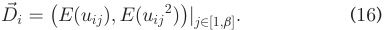

Afterwards, the data contributor oi computes the signature si on D~ i using her secret key SKi: 

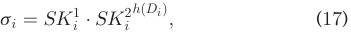

where Di is derived by concatenating all the elements of D~ i. Data Processing. To facilitate generating a personalized friending strategy, the data consumer also needs to provide her encrypted profile vector D~ 0 and a threshold d, where 

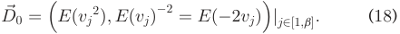

Now, the service provider can directly do matching on the encrypted profiles. For brevity in expression, we assume that oi is one of the m valid data contributors, i.e., i 2 C. 

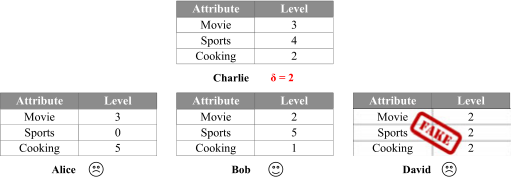

Fig. 3. An illustration of fine-grained profile matching. 

Besides, to obliviously evaluate the similarity fðU~ i; V~ Þ, the service provider first preprocesses D~ i and D~ 0 by adding Eð1Þ to the first and the last places of two vectors, respectively,~ and gets new vectors C~ i ¼ ðCij1; C ij2; C ij3Þj j2½1;b�and C0 ¼ ðC01 j; C 02 j; C 03 jÞj j2½1;b�, where 

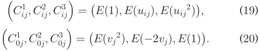

After preprocessing, the service provider can compute the “dot product” of Equation (19) and Equation (20), by first applying homomorphic multiplication � and then homomorphic addition �, and gets Rij, where 

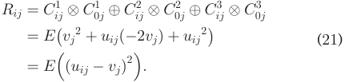

Next, the service provider applies � to Rij with 8j 2 ½1; b�, and gets Ri ¼ EðPb j¼1ðuij �vjÞ2Þ ¼ Eðfð U~ i; V~ Þ2 Þ. 

Now, the service provider can send Ri to the registration center for decryption. We note that for each data contributor, the registration center just needs to do one decryption, i.e., supposing the size of whitelist on the certificated bulletin board is m, she can only perform m decryptions in total. The registration center cannot do more decryptions than required, since the service provider may still obtain a correct and complete matching strategy by revealing the profiles of all the valid data contributors and the data consumer. However, this case requires at least ðm þ 1Þb decryptions. Furthermore, to speed up BGN decryption in outcome verification, the registration center should retain the decrypted plaintexts in storage for a preset validity period. When getting fðU~ i; V~ Þ2 , the service provider can compare it with d2 , and thus determines whether the data contributor oi matches the data consumer. We assume that f data contributors are matched, and the subscripts of their pseudo identities are denoted as I ¼ fI1; I2; . . . ; Ifg. 

After data processing, the service provider aggregates the signatures of f matched data contributors into one signature. Then, she sends the aggregate signature, the indexes of matched data contributors, and their encrypted profile vectors to the data consumer, on which the second-layer batch verification can be performed with Equation (9). Besides, to prevent the service provider from changing/ revaluating ðm � fÞ valid but unmatched data contributors in the completeness verification later, their similarities, i.e., ffðU~ i; V~ Þ2 ji 2 C; i =2 Ig; should also be forwarded. We note that the pseudo identities of f matched data contributors can be viewed as the friending strategy, i.e., outcome in the general model, since the data consumer can resort to the 

IEEE TRANSACTIONS ON KNOWLEDGE AND DATA ENGINEERING, VOL. 31, NO. 1, JANUARY 2019 

114 

registration center, as a relay, for handshaking with those matched data contributors. 

Outcome Verification. During the validity period preset by the registration center, the data consumer can verify the truthfulness of data processing via homomorphic properties. For correctness, the data consumer just needs to evaluate over the f matched profiles. Of course, for completeness, the data consumer reserves the right to do verification on the other ðm � fÞ unmatched ones. We note that the data consumer, knowing her profile vector V~ , can compute Equation (21) through 

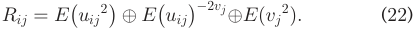

Thus, the most time-consuming homomorphic multiplications � can be avoided in outcome verification. Moreover, we note that the registration center does not need to do decryption as in data processing, since she can just search a smaller-size table of plaintexts in the storage. If there is no matched one, the outcome verification fails, and the service provider will be questioned by the data consumer. 

To further reduce verification cost, the data consumer can take the stratified sampling strategy in practice. We assume that the greedy service provider cheats by not evaluating each data contributor in the original data processing with a probability p. Then, the probability of successfully detecting an attempt for returning an incorrect/incomplete result, �, increases exponentially with the number of checks c, i.e., � ¼ 1 �ð1 � pÞc . For example, when p ¼ 20% and c ¼ 10, the success rate � is already 90 percent. 

### 5.2 Multivariate Data Distribution 

We further consider an advanced aggregate statistic, where the service provider wants to capture the underlying distribution over the collected dataset, and to offer such a distribution as a data service to the data consumer [30], [31]. For example, an analyst, as the data consumer, may want to learn the distribution of residential energy consumptions. 

Due to central limit theorem, we assume that the multivariate Gaussian distribution can closely approximate the raw data, which is a widely used assumption in statistical learning algorithms [32]. For convenience, we continue to use the notations in profile matching, i.e., the attribute vector A now represents a vector of b random variables. In particular, A �N ð **m** ; **S** Þ, where **m** is a b-dimensional mean vector, and **S** is a b � b covariance matrix. Besides, the covariance matrix can be evaluated by: 

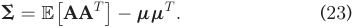

Here, E½�� denotes taking expectation. We below focus on the key designs different from profile matching. 

For data submission, the cipertext vector of the data contributor oi is changed into: 

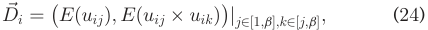

where the first element is to facilitate computing the mean vector **m** , while the second element is to help the service provider in evaluating the matrix E½AAT � more efficiently. 

For data processing, the service provider first employs homomorphic additions to obliviously evaluate the mean vector **m** , where the ciphertext of its j-th element multiplying the number of valid data contributors m is: 

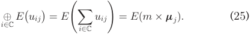

Additionally, to compute the covariance matrix, it suffices for the service provider to derive E½AAT �. Here, the service provider can avoid the time-consuming homomorphic multiplications. For example, the j-th row, k-th column entry of E½AAT �, denoted as E½AAT �jk, can be computed through: 

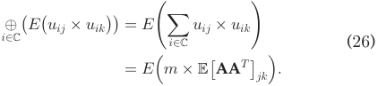

However, supposing that the data contributor oi excluded fEðuij � uikÞjj 2 ½1; b�; k 2 ½j; b�g from her ciphertext vector, <u>bðbþ1Þ</u> the service provider would need to perform 2 timeconsuming homomorphic multiplications for oi, because Eðuij � uikÞ in Equation (26) now needs to be derived using EðuijÞ � EðuikÞ instead. 

For outcome verification, the data consumer can take the stratified random sampling strategy from two aspects: 1) She can randomly check parts of the mean vector **m** and the matrix AAT ; 2) She can reevaluate a random subset of m valid data items, and compare the new distribution with the returned distribution. If the difference is within a threshold, the data consumer would accept; otherwise, she rejects. 

## 6 EVALUATION RESULTS 

In this section, we show the evaluation results of TPDM in terms of computation overhead and communication overhead. We also demonstrate the feasibility of the registration center and the ‘-DEPTH-TRACING algorithm. We finally discuss the practicality of TPDM in current data markets. 

Datasets. We use two real-world datasets, called R1Yahoo! Music User Ratings of Musical Artists Version 1.0 [33] and 2009 Residential Energy Consumption Survey (RECS) dataset [34], for the profile matching service and the data distribution service, respectively. First, the Yahoo! dataset represents a snapshot of Yahoo! Music community’s preference for various musical artists. It contains 11,557,943 ratings of 98,211 artists given by 1,948,882 anonymous users, and was gathered over the course of one month prior to March 2004. To evaluate the performance of profile matching, we choose b common artists as the evaluating attributes, append each user’s corresponding ratings ranging from 0 to 10, and thus form her fine-grained profile. Second, the RECS dataset, which was released by U.S. Energy Information Administration (EIA) in January 2013, provides detailed information about diverse energy usages in U.S. homes. The dataset was collected from 12,083 randomly selected households between July 2009 and December 2012. In this evaluation, we view b types of energy consumptions, e.g., electricity, natural gas, space heating, and water heating, as b random variables, and intend to the distribution. 

Evaluation Settings. We implemented TPDM using the latest Pairing-Based Cryptography (PBC) library [35]. The elliptic curves utilized in our identity-based signature scheme include a supersingular curve with a base field size of 512 bits and an embedding degree of 2 (abbreviated as SS512), and a MNT curve with a base field size of 159 bits and an embedding degree of 6 (abbreviated as MNT159). In addition, the group order q is 160-bit long, and all hashings are implemented in SHA1, considering its digest size closely 

NIU ET AL.: ACHIEVING DATA TRUTHFULNESS AND PRIVACY PRESERVATION IN DATA MARKETS 

115 

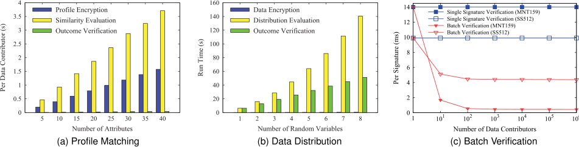

Fig. 4. Computation overhead of TPDM. 

matches the order of G1. The BGN cryptosystem is realized overhead of the last phase increases linearly with b. The reausing Type A1 pairing, in which the group order is a prodson is that the data encryption phase consists of <u>bðb2þ3Þ</u> uct of two 512-bit primes. The running environment is a BGN encryptions for each data contributor, and the distristandard 64-bit Ubuntu 14.04 Linux operation system on bution evaluation phase mainly comprises mbð2bþ3Þ homoa desktop with Intel(R) Core(TM) i5 3:10 GHz. morphic additions. In contrast, the outcome verification phase mainly requires 2 mb homomorphic additions. Fur6.1 Computation Overhead thermore, when b ¼ 8, these three phases consume 0.402s, We show the computation overheads of four important 140.395s, and 51.200s, respectively. 

We show the computation overheads of four important components in TPDM, namely profile matching, data distribution, identity-based signature, and batch verification. 

Jointly summarizing above evaluation results, TPDM performs well in both kinds of data markets. Thus, the generality of TPDM can be validated. 

Profile Matching. In Fig. 4a, we plot the computation overheads of profile encryption, similarity evaluation, and outcome verification per data contributor, when the number of attributes b increases from 5 to 40 with a step of 5. From Fig. 4a, we can see that the computation overheads of these three phases increase linearly with b. This is because the profile encryption requires 2b BGN encryptions, the similarity evaluation consists of 3b homomorphic multiplications and additions, and the outcome verification is composed of 3b homomorphic additions and b exponentiations, which are both proportional to b. In addition, the outcome verification is light-weight, whose overhead is only 1.17 percent of the original similarity evaluation cost. Moreover, when b ¼ 10, one decryption overhead at the registration center is 1.648ms in the original data processing, while in outcome verification, it is in tens of microseconds. 

Identity-Based Signature. We now investigate the computation overhead of the identity-based signature scheme, including preparation and operation phases. In this set of simulations, we set the number of data contributors to be 10000. Table 1 lists the average time overhead per data contributor. From Table 1, we can see that the time cost of the preparation phase dominates the total overhead in both SS512 and MNT159. This outcome stems from that the pseudo identity generation employs ElGamal encryption, and the secret key generation is composed of one MapToPoint hash operation and two exponentiations. In contrast, the operation phase mainly consists of one exponentiation. 

The above results demonstrate that the signature scheme in TPDM is efficient enough, and can be applied to the data contributors with mobile devices. 

We now show the feasibility of outcome verification by comparing with the original data processing. We analyze the matching ratio based on Yahoo! Music ratings dataset. Given b ¼ 10, when a data consumer sets her threshold d ¼ 12, she is matched with 4.49 percent in average of the 10000 data contributors, who are selected randomly from the dataset. The relatively small matching ratio means that even if all matched data contributors are verified for correctness, it only incurs an overhead of 4.859s at the data consumer, which is roughly 0.05 percent of the data processing workload at the service provider. Next, we simulate the partial data processing attack by randomly corrupting 20 percent of unmatched data contributors, i.e., replacing their similarities with random values. Then, the data consumer can detect such type attack using 26 random checks in average for completeness, which incurs an additional overhead of 0.281s. 

Batch Verification. To examine the efficiency of batch verification, we vary the number of data contributors from 1 to 1 million by exponential growth. The performance of the corresponding single signature verification is provided as a baseline. Fig. 4c depicts the evaluation results using SS512 and MNT159, where verification time per signature (VTPS) is computed by dividing the total verification time by the number of data contributors. In particular, such a performance measure in an average sense can be found in [36], [37]. From Fig. 4c, we can see that when the scale of data acquisition or data trading is small, e.g., when the number of data contributors is 10, TPDM saves 48.22 and 87.94 percent of VTPS in SS512 and MNT159, respectively. When the scale becomes larger, TPDM’s advantage over the baseline is more remarkable. This is owing to the fact that TPDM 

Data Distribution. Fig. 4b plots the computation overhead of the data distribution service, where the number of random variables b increases from 1 to 8, and the number of valid data contributors m is fixed at 10000. Besides, for outcome verification, the data consumer checks all the elements in the mean vector, while only checks the diagonal elements in the covariance matrix. From Fig. 4b, we can see that the computation overheads of the first two phases roughly increase quadratically with b, whereas the computation 

TABLE 1 

Computation Overhead of Identity-Based Signature Scheme 

||Prepa|ration|Operation|
|---|---|---|---|
|Setting|Pseudo Identity Generation|Secret Key Generation|Signing|
|SS512|4.698ms (39.40%)|6.023ms (50.53%)|1.201ms (10.07%)|
|MNT159|1.958ms (57.33%)|1.028ms (30.10%)|0.429ms (12.57%)|

IEEE TRANSACTIONS ON KNOWLEDGE AND DATA ENGINEERING, 

VOL. 31, NO. 1, JANUARY 2019 

116 

amortizes the overhead of 3 time-consuming pairing operations among all the data contributors. 

We now compare the bath verification efficiency of two settings. Although the baseline of MNT159 increases 41.44 percent verification time than that of SS512, MNT159’s implementation is more efficient when the number of data contributors is larger than 10, e.g., when supporting as many as 1 million data contributors, MNT159 reduces 89.93 percent verification latency than SS512. We explain the reason by analyzing the asymptotic value of VTPS: 

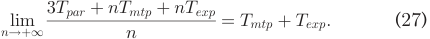

Here, we let Tpar, Tmtp, and Texp denote the time overheads of a pairing operation, a MapToPoint hashing, and an exponentiation, respectively. From Equation (27), we can draw that if the time overheads of additional operations, e.g., Tmtp and Texp, are approaching or even greater than that of pairing operation (e.g., in SS512), their effect cannot be elided. Besides, the expensive additional operations will cancel parts of the advantage gained by batch verification. Even so, the batch verification scheme can still sharply reduce per-signature verification cost. 

These evaluation results reveal that TPDM can indeed help to reduce the computation overheads of the service provider and the data consumer by introducing two-layer batch verifications, especially in large-scale data markets. 

### 6.2 Communication Overhead 

In this section, we show the communication overheads of profile matching and data distribution separately. 

Fig. 5 plots the communication overhead of profile matching, where the identity-based signature scheme is implemented in MNT159, the number of attributes b is fixed at 10, and the threshold d takes 12. Here, the communication overheads merely count in the amount of sending content. Besides, we only consider the correctness verification. In fact, when the number of valid data contributors m is 104 , if we check 26 unmatched ones for completeness, it incurs additional communication overheads of 80.03 KB at the service provider, and 3.35 KB at the data consumer. Moreover, our statistics on the dataset show a linear correlation between the numbers of matched data contributors f and valid ones m, where the matching ratio is 4.24 percent in average. 

The first observation from Fig. 5 is that the communication overheads of the service provider and the data consumer grow linearly with the number of valid data contributors, while the communication overhead of each data contributor remains unchanged. The reason is that each data contributor just needs to do one profile submission, and thus its cost is independent of m. However, the service provider primarily needs to send m encrypted similarities for decryption, and to forward the indexes and ciphertexts of f matched data contributors for verifications. Regarding the data consumer, her communication overhead mainly comes from one data submission and the delivery of f encrypted similarities for decryption. These imply that the communication overheads of the service provider and the data consumer are linear with m. Here, we note that x, y axes in Fig. 5 are log-scaled, and thus the communication overhead of the data consumer, containing a constant of one data submission overhead, seems non-linear. In particular, when m � 100, one data submission overhead dominates 

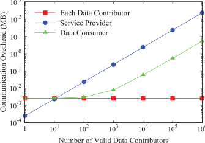

Fig. 5. Communication overhead of profile matching. 

the total communication overhead, and this interval looks like a horizontal line; while m � 1000, the communication overhead of delivering f encrypted similarities dominates, and it appears linear. 

The second key observation is that when m ¼ 10, all the three participants spend almost the same network bandwidth. The cause lies in that the small matching ratio implies a small number of matched data contributors involved in correctness verification, e.g., the mean of f is only about 0:4 < 1 at m ¼ 10, and the communication overheads at each data contributor, the service provider, and the data consumer are 2.60 KB, 2.37 KB, and 2.59 KB, respectively. 

We further plot the communication overhead of data distribution in Fig. 6, where the number of random variables b is set to be 8. From Fig. 6, we can see that the communication overhead of the service provider increases linearly with the number of valid data contributors m. This is because the service provider mainly needs to send 2 bm BGN-type ciphertexts for verifications, which is linear with m. By comparison, besides the data contributor, the data consumer’s bandwidth overhead stays the same, since she needs to deliver 2b BGN-type ciphertexts for decryption, which is independent of m. 

At last, we note that the transmission of BGN-type ciphertexts dominates the total communication overheads in both data services, while the overhead incurred by sending the pseudo identities and the aggregate signature is comparatively low. Hence, we do not plot the cases for SS512, which are similar to Figs. 5 and 6. In particular, compared with MNT159, SS512 adds 132 bytes and 176 bytes at each data contributor in profile matching and data distribution, respectively. Moreover, SS512 adds 44 bytes at the service provider in both data services, but incurs no extra bandwidth at the data consumer. 

### 6.3 Feasibility of Registration Center 

In this section, we consider the feasibility of the registration center from the perspectives of computation, communication, and storage overheads. We implement the identitybased signature scheme with MNT159. In addition, for the profile matching service, the number of attributes is fixed at 10, and the number of valid data contributors m is set to be 10000. Accordingly, the number of matched ones f is 449 at d ¼ 12. For the data distribution service, we fix the number of random variables b at 8, and set the number of valid data contributors to be 10000. 

First, the primary responsibility of the registration center is to initialize the system parameters for the identity-based signature scheme and the BGN cryptosystem. Besides, she is required to perform totally ðm þ fÞ and <u>ðbþ27Þb</u> decryptions in the profile matching and the data distribution services, respectively. The total computation overheads are 16.692s 

NIU ET AL.: ACHIEVING DATA TRUTHFULNESS AND PRIVACY PRESERVATION IN DATA MARKETS 

117 

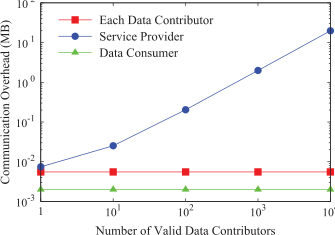

Fig. 6. Communication overhead of data distribution. 

and 3.065s in two data services, respectively, which are only 0.18 and 2.11 percent of the service provider’s workloads. Furthermore, the one-time setup overhead can be amortized over several data services. Second, the main communication overheads of the registration center in two data services are incurred by returning decrypted results, which occupies the network bandwidth of 15.31 KB and 0.23 KB, respectively. Third, the storage overhead of the registration center mostly comes from maintaining the online database of registrations and the real-time certificated bulletin board, and caching the intermediate plaintexts. These two parts take up roughly 600.59 KB and 586.11 KB storage space in profile matching and data distribution, respectively. 

In conclusion, our design of registration center has a light load, and can be implemented in a distributed manner, where each registration center can be responsible for one or a few data services. 

### 6.4 Feasibility of Tracing Algorithm 

To evaluate the feasibility of ‘-DEPTH-TRACING algorithm when the batch verification fails, we generate a collection of 1024 valid signatures, and then randomly corrupt an a-fraction of the batch by replacing them with random elements from the cyclic group G1. We repeat this evaluation with various values of a ranging from 0 to 20 percent, and compare the verification latency per signature in batch verification with that in single signature verification. Here, the batch verification time includes the time cost spent in identifying invalid signatures. Fig. 7 presents the evaluation results using the efficient MNT159. 

As shown in Fig. 7, batch verification is preferable to single signature verification when the ratio of invalid signatures is up to 16 percent. The worst case of batch verification happens when the invalid signatures are distributed uniformly. In case the invalid signatures are clustered together, the performance of batch verification should be better. Furthermore, as shown in the initialization phase of Algorithm 1, the service provider can preset a practical tracing depth, and let those unidentified data contributors do resubmissions. 

overhead at the service provider is 0.930s per matching with 10 evaluating attributes in each profile. Besides, for the data distribution service, when supporting 10000 data contributors and 8 random variables, the computation overhead at the service provider is 144.944s in total. Furthermore, the most time-consuming part of the service provider in TPDM is the computation on encrypted data due to data confidentiality. Specific to its feasibility in practical applications, we below list the computation overheads of two state-of-art literatures from machine learning and security communities: 1) In [25], Gilad-Bachrach et al. proposed CryptoNets, which applies neural networks to encrypted data with high throughput and accuracy. Besides, they tested CryptoNets on the benchmark MNIST dataset. Their evaluation results show that CryptoNets achieve 99 percent accuracy, and a single predication takes 250s on a single PC. 2) In [38], Bost et al. considered some common machine learning classifiers over encrypted data, including linear classifier, naive Bayes, and decision trees. Moreover, they used several datasets from the UCI repository for evaluation. According to their evaluation results, their decision tree classifier consumes 9.8s per time over the ECG dataset on a single PC. 

Last but not least, our implementation using the latest PBC library is single-threaded on single core. If we deploy TPDM on the cloud-based servers with abundant resources, and further employ some parallel and distributed operations, such as Single Instruction Multiple Data (SIMD) utilized in [25], [38], the performance should be significantly improved. In particular, after parallel computation, CryptoNets can process 4,096 predications simultaneously, and can reach a throughput of 58,982 predications per hour. 

## 7 RELATED WORK 

In this section, we briefly review related work. 

### 7.1 Data Market Design 

In recent years, data market design has gained increasing interest, especially from the database community. The seminal paper [10] by Balazinska et al. discusses the implications of the emerging digital data markets, and lists the research opportunities in this direction. Li et al. [39] proposed a theory of pricing private data based on differential privacy. Upadhyaya et al. [11] developed a middleware system, called DataLawyer, to formally specify data use policies, and to automatically enforce these pre-defined terms during data usage. Jung et al. [12] focused on the datasets resale issue at the dishonest data consumers. 

However, the original intention of above works is pricing data or monitoring data usage rather than integrating data truthfulness with privacy preservation in data markets, which is the consideration of our paper. 

### 7.2 Practical Computation on Encrypted Data 

### 6.5 Practicality of TPDM 

We finally discuss the practical feasibility of TPDM in current data markets. 

First, to the best of our knowledge, the current applications in real-world data markets, e.g., Microsoft Azure Marketplace [1], Gnip [2], DataSift [3], Datacoup [4], and Citizenme [5], have not provided the security guarantees studied in the TPDM framework. 

Second, for the profile matching service, when supporting as many as 1 million data contributors, the computation 

To get a tradeoff between functionality and performance, partially homomorphic encryption (PHE) schemes were exploited to enable practical computation on encrypted data. Unlike those prohibitively slow fully homomorphic encryption (FHE) schemes [40], [41] that support arbitrary operations, PHE schemes focus on specific function(s), and achieve better performance in practice. A celebrated example is the Paillier cryptosystem [26], which preserves the group homomorphism of addition and allows multiplication by a constant. Thus, it can be utilized in data aggregation [19] and 

IEEE TRANSACTIONS ON KNOWLEDGE AND DATA ENGINEERING, 

VOL. 31, NO. 1, JANUARY 2019 

118 

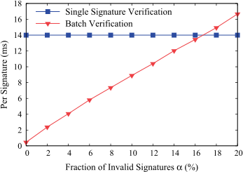

Fig. 7. Feasibility of tracing algorithm. 

interactive personalized recommendation [23], [28]. Yet, another one is ElGamal encryption [22], which supports homomorphic multiplication, and it is widely employed in voting [42]. Moreover, the BGN scheme [18] facilitates one extra multiplication followed by multiple additions, which in turn allows the oblivious evaluation of quadratic multivariate polynomials, e.g., shortest distance query [27] and optimal meeting location decision [43]. Lastly, several stripped-down homomorphic encryption schemes were employed to facilitate practical machine learning algorithms on encrypted data, such as linear means classifier [44], naive Bayes [38], neural networks [25], and so on. 

These schemes enable the service provider and the data consumer to efficiently perform data processing and outcome verification over encrypted data, respectively. Besides, we note that the outcome verification in data markets differs from the verifiable computation in outsourcing scenarios, since before data processing, the data consumer, as a client, does not hold a local copy of the collected dataset. Furthermore, interested readers can refer to our technical report [29] for more related work. 

## 8 CONCLUSION AND FUTURE WORK 

In this paper, we have proposed the first efficient secure scheme TPDM for data markets, which simultaneously guarantees data truthfulness and privacy preservation. In TPDM, the data contributors have to truthfully submit their own data, but cannot impersonate others. Besides, the service provider is enforced to truthfully collect and process data. Furthermore, both the personally identifiable information and the sensitive raw data of data contributors are well protected. In addition, we have instantiated TPDM with two different data services, and extensively evaluated their performances on two real-world datasets. Evaluation results have demonstrated the scalability of TPDM in the context of large user base, especially from computation and communication overheads. At last, we have shown the feasibility of introducing the semi-honest registration center with detailed theoretical analysis and substantial evaluations. 

As for further work in data markets, it would be interesting to consider diverse data services with more complex mathematic formulas, e.g., Machine Learning as a Service (MLaaS) [25], [45], [46]. Under a specific data service, it is well-motivated to uncover some novel security problems, such as privacy preservation and verifiability. 

## ACKNOWLEDGMENTS 

This work was supported in part by the State Key Development Program for Basic Research of China (973 project 

2014CB340303), in part by China NSF grant 61672348, 61672353, 61422208, and 61472252, in part by Shanghai Science and Technology fund (15220721300, 17510740200), in part by the Scientific Research Foundation for the Returned Overseas Chinese Scholars, and in part by the CCF Tencent Open Research Fund (RAGR20170114). The opinions, findings, conclusions, and recommendations expressed in this paper are those of the authors and do not necessarily reflect the views of the funding agencies or the government. 

## REFERENCES 

- [1] Microsoft Azure Marketplace, (2017). [Online]. Available: https:// datamarket.azure.com/home/ 

- [2] Gnip, (2017). [Online]. Available: https://gnip.com/ 

- [3] DataSift, (2017). [Online]. Available: http://datasift.com/ 

- [4] Datacoup, (2017). [Online]. Available: https://datacoup.com/ 

- [5] Citizenme, (2017). [Online]. Available: https://www.citizenme.com/ 

- [6] Gallup Poll, (2017). [Online]. Available: http://www.gallup.com/ 

- [7] M. Barbaro, T. Zeller, and S. Hansell, A Face is Exposed for AOL Searcher no. 4417749, New York, NY, USA: New York Times, Aug. 2006. 

- [8] 2016 TRUSTe/NCSA Consumer Privacy Infographic - US Edition, (2017). [Online]. Available: https://www.truste.com/resources/ privacy-research/ncsa-consumer-privacy-index-us/ 

- [9] K. Ren, W. Lou, K. Kim, and R. Deng, “A novel privacy preserving authentication and access control scheme for pervasive computing environments,” IEEE Trans. Veh. Technol., vol. 55, no. 4, pp. 1373–1384, Jul. 2006. 

- [10] M. Balazinska, B. Howe, and D. Suciu, “Data markets in the cloud: An opportunity for the database community,” Proc. VLDB Endowment, vol. 4, no. 12, pp. 1482–1485, 2011. 

- [11] P. Upadhyaya, M. Balazinska, and D. Suciu, “Automatic enforcement of data use policies with datalawyer,” in Proc. ACM SIGMOD Int. Conf. Manage. Data, 2015, pp. 213–225. 

- [12] T. Jung, X.-Y. Li, W. Huang, J. Qian, L. Chen, J. Han, J. Hou, and C. Su, “AccountTrade: Accountable protocols for big data trading against dishonest consumers,” in Proc. IEEE Conf. Comput. Commun., 2017, pp. 1–9. 

- [13] G. Ghinita, P. Kalnis, and Y. Tao, “Anonymous publication of sensitive transactional data,” IEEE Trans. Knowl. Data Eng., vol. 23, no. 2, pp. 161–174, Feb. 2011. 

- [14] B. C. M. Fung, K. Wang, R. Chen, and P. S. Yu, “Privacy-preserving data publishing: A survey of recent developments,” ACM Comput. Surveys, vol. 42, no. 4, pp. 1–53, Jun. 2010. 

- [15] R. Ikeda, A. D. Sarma, and J. Widom, “Logical provenance in dataoriented workflows?” in Proc. IEEE 29th Int. Conf. Data Eng., 2013, pp. 877–888. 

- [16] M. Raya and J. Hubaux, “Securing vehicular ad hoc networks,” J. Comput. Security, vol. 15, no. 1, pp. 39–68, 2007. 

- [17] T. W. Chim, S. Yiu, L. C. K. Hui, and V. O. K. Li, “SPECS: Secure and privacy enhancing communications schemes for VANETs,” Ad Hoc Netw., vol. 9, no. 2, pp. 189–203, 2011. 

- [18] D. Boneh, E. Goh, and K. Nissim, “Evaluating 2-DNF formulas on ciphertexts,” in Proc. 2nd Int. Conf. Theory Cryptography, 2005, pp. 325–341. 

- [19] R. A. Popa, A. J. Blumberg, H. Balakrishnan, and F. H. Li, “Privacy and accountability for location-based aggregate statistics,” in Proc. 18th ACM Conf. Comput. Commun. Security, 2011, pp. 653–666. 

- [20] J. H. An, Y. Dodis, and T. Rabin, “On the security of joint signature and encryption,” in Proc. Int. Conf. Theory Appl. Cryptographic Techn. Advances Cryptology, 2002, pp. 83–107. 

- [21] D. Boneh and M. Franklin, “Identity-based encryption from the weil pairing,” in Proc. Annu. Int. Cryptology Conf., 2001, pp. 213– 229. 

- [22] T. ElGamal, “A public key cryptosystem and a signature scheme based on discrete logarithms,” IEEE Trans. Inf. Theory, vol. 31, no. 4, pp. 469–472, Jul. 1985. 

- [23] R. Zhang, Y. Zhang, J. Sun, and G. Yan, “Fine-grained private matching for proximity-based mobile social networking,” in Proc. IEEE INFOCOM, 2012, pp. 1969–1977. 

- [24] D. Eastlake and P. Jones, US Secure Hash Algorithm 1 (SHA1), Cambridge, MA, USA: RFC Editor, 2001. 

NIU ET AL.: ACHIEVING DATA TRUTHFULNESS AND PRIVACY PRESERVATION IN DATA MARKETS 

119 

- [25] R. Gilad-Bachrach, N. Dowlin, K. Laine, K. Lauter, M. Naehrig, and J. Wernsing, “CryptoNets: Applying neural networks to encrypted data with high throughput and accuracy,” in Proc. 33rd Int. Conf. Int. Conf. Mach. Learn., 2016, pp. 201–210. 

- [26] P. Paillier, “Public-key cryptosystems based on composite degree residuosity classes,” in Proc. 17th Int. Conf. Theory Appl. Cryptographic Techn., 1999, pp. 223–238. 

- [27] X. Meng, S. Kamara, K. Nissim, and G. Kollios, “GRECS: Graph encryption for approximate shortest distance queries,” in Proc. 22nd ACM SIGSAC Conf. Comput. Commun. Security, 2015, pp. 504–517. 

- [28] Z. Erkin, T. Veugen, T. Toft, and R. L. Lagendijk, “Generating private recommendations efficiently using homomorphic encryption and data packing,” IEEE Trans. Inf. Forensics Security, vol. 7, no. 3, pp. 1053–1066, Jun. 2012. 

- [29] C. Niu, Z. Zheng, F. Wu, X. Gao, and G. Chen, “Achieving data truthfulness and privacy preservation in data markets,”, 2018. [Online]. Available: https://www.dropbox.com/s/ egklvbnkrg0m6vi/Technical_Report_for_TPDM.pdf?dl=0 

- [30] Z. Zheng, Y. Peng, F. Wu, S. Tang, and G. Chen, “Trading data in the crowd: Profit-driven data acquisition for mobile crowdsensing,” IEEE J. Sel. Areas Commun., vol. 35, no. 2, pp. 486–501, Feb. 2017. 

- [31] Z. Zheng, Y. Peng, F. Wu, S. Tang, and G. Chen, “An online pricing mechanism for mobile crowdsensing data markets,” in Proc. 18th ACM Int. Symp. Mobile Ad Hoc Netw. Comput., 2017, Art. no. 26. 

- [32] C. M. Bishop, Pattern Recognition and Machine Learning. Berlin, Germany: Springer, 2006. 

- [33] Yahoo! Webscope datasets, (2017). [Online]. Available: http:// webscope.sandbox.yahoo.com/ 

- [34] 2009 RECS Dataset, (2017). [Online]. Available: https://www.eia.gov/ consumption/residential/data/2009/index.php?view=microdata. 

- [35] PBC Library, (2017). [Online]. Available: https://crypto.stanford. edu/pbc/ 

- [36] J. Camenisch, S. Hohenberger, and M. Ø. Pedersen, “Batch verification of short signatures,” J. Cryptology, vol. 25, no. 4, pp. 723– 747, 2012. 

- [37] C. Wang, Q. Wang, K. Ren, and W. Lou, “Privacy-preserving public auditing for data storage security in cloud computing,” in Proc. IEEE INFOCOM, 2010, pp. 1–9. 

- [38] R. Bost, R. A. Popa, S. Tu, and S. Goldwasser, “Machine learning classification over encrypted data,” in Proc. Netw. Distrib. Syst. Security Symp., 2015, pp. 1–14. 

- [39] C. Li, D. Y. Li, G. Miklau, and D. Suciu, “A theory of pricing private data,” Commun. ACM, vol. 60, no. 12, pp. 79–86, 2017. 

- [40] C. Gentry, “Fully homomorphic encryption using ideal lattices,” in Proc. 41st Annu. ACM Symp. Theory Comput., 2009, pp. 169–178. 

- [41] Z. Brakerski and V. Vaikuntanathan, “Efficient fully homomorphic encryption from (standard) LWE,” SIAM J. Comput., vol. 43, no. 2, pp. 831–871, 2014. 

- [42] V. Cortier, D. Galindo, S. Glondu, and M. Izabach�ene, “Election verifiability for helios under weaker trust assumptions,” in Proc. 19th Eur. Symp. Res. Comput. Security, 2014, pp. 327–344. 

- [43] I. Bilogrevic, M. Jadliwala, V. Joneja, K. Kalkan, J. P. Hubaux, and I. Aad, “Privacy-preserving optimal meeting location determination on mobile devices,” IEEE Trans. Inf. Forensics Security, vol. 9, no. 7, pp. 1141–1156, Jul. 2014. 

- [44] T. Graepel, K. E. Lauter, and M. Naehrig, “ML confidential: Machine learning on encrypted data,” in Proc. Int. Conf. Inf. Security Cryptology, 2012, pp. 1–21. 

- [45] F. Tram�er, F. Zhang, A. Juels, M. K. Reiter, and T. Ristenpart, “Stealing machine learning models via prediction apis,” in Proc. USENIX Security Symp., 2016, pp. 601–618. 

- [46] Google Predication API, (2017). [Online]. Available: https:// cloud.google.com/prediction/ 

Chaoyue Niu is working toward the PhD degree in the Department of Computer Science and Engineering, Shanghai Jiao Tong University, P. R. China. His research interests include verifiable computation and privacy preservation in data management. He is a student member of the ACM and IEEE. 

Zhenzhe Zheng is working toward the PhD degree in the Department of Computer Science and Engineering, Shanghai Jiao Tong University, P. R. China. His research interests include algorithmic game theory, resource management in wireless networking and data center. He is a student member of the ACM, IEEE, and CCF. 

Fan Wu received the BS in computer science from Nanjing University, in 2004, and the PhD degree in computer science and engineering from the State University of New York at Buffalo, in 2009. He is a professor with the Department of Computer Science and Engineering, Shanghai Jiao Tong University. He has visited the University of Illinois at Urbana-Champaign (UIUC) as a post doc research associate. His research interests include wireless networking and mobile computing, algorithmic game theory and its applications, and privacy preservation. He has published more than 100 peer-reviewed papers in technical journals and conference proceedings. He is a recipient of the first class prize for the Natural Science Award of China Ministry of Education, NSFC Excellent Young Scholars Program, ACM China Rising Star Award, CCF-Tencent “Rhinoceros bird” Outstanding Award, CCF-Intel Young Faculty Researcher Program Award, and Pujiang Scholar. He has served as the chair of CCF YOCSEF Shanghai, on the editorial board of Elsevier Computer Communications, and as the member of technical program committees of more than 60 academic conferences. For more information, please visit http://www. cs.sjtu.edu.cn/fwu/. He is a member of the IEEE. 

Xiaofeng Gao received the BS degree in information and computational science from Nankai University, China, in 2004, the MS degree in operations research and control theory from Tsinghua University, China, in 2006, and the PhD degree in computer science from The University of Texas at Dallas, in 2010. She is currently an associate professor with the Department of Computer Science and Engineering, Shanghai Jiao Tong University, China. Her research interests include wireless communications, data engineering, and combinatorial optimizations. She has published more than 80 peer-reviewed papers and six book chapters in the related area, and she has served as the PCs and peer reviewers for a number of international conferences and journals. She is a member of the IEEE. 

Guihai Chen received the BS degree from Nanjing University, in 1984, the ME degree from Southeast University, in 1987, and the PhD degree from the University of Hong Kong, in 1997. He is a distinguished professor of Shanghai Jiaotong University, China. He had been invited as a visiting professor by many universities including the Kyushu Institute of Technology, Japan, in 1998, University of Queensland, Australia in 2000, and Wayne State University during September 2001 to August 2003. He has a wide range of research interests include sensor network, peer-to-peer computing, high-performance computer architecture, and combinatorics. He has published more than 200 peer-reviewed papers, and more than 120 of them are in well-archived international journals such as the IEEE Transactions on Parallel and Distributed Systems, the Journal of Parallel and Distributed Computing, Wireless Network, the Computer Journal, the International Journal of Foundations of Computer Science, and Performance Evaluation, and also in well-known conference proceedings such as HPCA, MOBIHOC, INFOCOM, ICNP, ICPP, IPDPS, and ICDCS. He is a senior member of the IEEE. 

" For more information on this or any other computing topic, please visit our Digital Library at www.computer.org/publications/dlib. 

