This article has been accepted for publication in a future issue of this journal, but has not been fully edited. Content may change prior to final publication. Citation information: DOI 10.1109/TKDE.2019.2934100, IEEE Transactions on Knowledge and Data Engineering 

IEEE TRANSACTIONS ON KNOWLEDGE AND DATA ENGINEERING, VOL. XX, NO. XX, XXXX 2019 

1 

# ERATO: Trading Noisy Aggregate Statistics over Private Correlated Data 

Chaoyue Niu, _Student Member, IEEE,_ Zhenzhe Zheng, _Student Member, IEEE,_ Fan Wu, _Member, IEEE,_ Shaojie Tang, _Member, IEEE,_ Xiaofeng Gao, _Member, IEEE,_ and Guihai Chen, _Senior Member, IEEE_ 

**Abstract** —With the commoditization of personal privacy, pricing private data has become an intriguing problem. In this paper, we study noisy aggregate statistics trading from the perspective of a data broker in data markets. We thus propose ERATO, which enables aggrEgate statistics pRicing over privATe cOrrelated data. On one hand, ERATO guarantees arbitrage freeness against cunning data consumers. On the other hand, ERATO compensates data owners for their privacy losses using both bottom-up and top-down designs. We further apply ERATO to three practical aggregate statistics, namely weighted sum, probability distribution fitting, and degree distribution, and extensively evaluate their performances on MovieLens dataset, 2009 RECS dataset, and two SNAP large social network datasets, respectively. Our analysis and evaluation results reveal that ERATO well balances utility and privacy, achieves arbitrage freeness, and compensates data owners more fairly than differential privacy based approaches. 

**Index Terms** —Data trading, data privacy, data correlation 

! 

## **1 INTRODUCTION** 

I ternetN today’sgiants,big likedataGoogle,economy,Facebook,a commonandpracticeTwitter,forisIn-to provide free online services in exchange for private information [1]. Nevertheless, when data owners become more aware of the economic values of personal data and the potential consequences of privacy disclosure, they would have stronger motivations to receive monetary compensations in return [2]. In particular, a study by JPMorgan Chase found that each unique user is worth roughly $4 to Facebook and $24 to Google [3]. Furthermore, several startup companies, including Datacoup [4], CitizenMe [5], and CoverUS [6], have already paid data owners for access to their private data. In a nutshell, data privacy has become a commodity to be bought and sold in practice. 

To facilitate private data circulation, many open information platforms have emerged to bridge the gap between data owners and data consumers. For example, according to an FTC’s survey on the nine typical data markets [7], Acxiom, which is the largest data broker, collects personal data from about 700 million users worldwide, and then sells aggregate statistics to top companies, such as Microsoft, Oracle, AT&T, etc. However, as further investigated by CBS News [8], such a multibillion-dollar industry has raised great attention together with serious doubt. One critical concern is that the data brokers make huge profits from private information, whereas they do not properly compensate data owners for their privacy losses. This criticism prompts the intermediate data brokers to devise a feasible privacy compensation mechanism for the data owners. In addition, the pricing strategy for the data consumers, which initially neither respects privacy nor provides economic guarantee [9], also requires new design. 

To design a pricing framework for practical data markets trading aggregate statistics over private data, there are three 

- _C. Niu, Z. Zheng, F. Wu, X. Gao, and G. Chen are with the Shanghai Key Laboratory of Scalable Computing and Systems, Department of Computer Science and Engineering, Shanghai Jiao Tong University, Shanghai 200240, China. E-mail: {rvince, zhengzhenzhe}@sjtu.edu.cn; {fwu, gaoxf, gchen}@cs.sjtu.edu.cn._ 

- _S. Tang is with the Department of Information Systems, University of Texas at Dallas, Richardson, TX 75080. E-mail: tangshaojie@gmail.com._ 

- _F. Wu is the corresponding author._ 

major challenges. The first and the thorniest challenge is to rigorously quantify privacy loss. Markets for sensitive personal data significantly differ from those for ordinary information goods in privacy compensation. To compensate each data owner properly, it is necessary to quantify her privacy loss during the usage of her data. In the context of aggregate statistics, differential privacy [10], [11] has a natural utility-theoretic interpretation, which makes it a compelling measure to quantify individual privacy loss [12]. However, if the ubiquitous data correlations are further taken into account, there are two striking differences: (1) Due to data correlations, data owners, who are not involved in an aggregate statistic, may still suffer privacy losses. For example, if Alice is not but one of her friends is involved in the counting statistic about how many people have infected a contagious disease, Alice’s status can still be leaked to an attacker who knows her social network [13], [14]. (2) Data owners with different sets of correlated data owners, or even the same set but with different correlation coefficients, can have distinct privacy losses. For example, in degree distribution, if Bob’s degree is larger than Charlie’s, which implies that Bob has more social connections, Bob thus can suffer a higher risk of privacy leakage [15]. If differential privacy is adopted for privacy loss quantification in two cases, the privacy loss of Alice is zero, and the privacy losses of Bob and Charlie are the same, which are both unreasonable in practice. 

Yet, another challenge comes from the rich and complex formulas of common aggregate statistics. The data consumers in data markets are normally permitted to purchase multiple statistics. As a consequence, a critical concern is that they may circumvent the advertised price of a statistic through buying a bundle of cheaper ones. This economic practice is called arbitrage, while desirable pricings should be arbitrage free. Besides, the key issue in investigating arbitrage freeness is to determine whether a certain statistic can be derived from others. Such a concept of the determinacy relation has been well studied in queries/views answering from the database community [1], [16], [17]. Nevertheless, aggregate statistics tend to take different and even more complicated forms, such as linear polynomial in weighted sum [18], quadratic polynomial in Gaussian 

1041-4347 (c) 2019 IEEE. Personal use is permitted, but republication/redistribution requires IEEE permission. See http://www.ieee.org/publications_standards/publications/rights/index.html for more information. 

This article has been accepted for publication in a future issue of this journal, but has not been fully edited. Content may change prior to final publication. Citation information: DOI 10.1109/TKDE.2019.2934100, IEEE Transactions on Knowledge and Data Engineering 

IEEE TRANSACTIONS ON KNOWLEDGE AND DATA ENGINEERING, VOL. XX, NO. XX, XXXX 2019 

2 

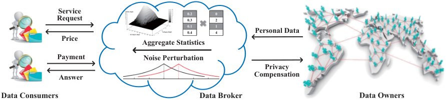

<!-- Start of picture text -->
Service  0.2 0 Request 0.3 2 0.10.4 14 Personal Data Price Aggregate Statistics Payment Noise Perturbation Privacy Answer Compensation Data Consumers Data Broker Data Owners <!-- End of picture text -->

Fig. 1. A general system model for aggregate statistics based data markets. 

distribution [19], [20], and nonlinear comparison in degree distribution [21]. Hence, it is highly nontrivial to design universal pricing functions for diverse aggregate statistics. 

Last but not least challenge is to avoid the arbitrage opportunities in varying degrees of perturbation. For the sake of privacy issues, _e.g._ , the successive Facebook data scandals [22], [23], it is necessary for the data broker to sell noisy answers of aggregate statistics. Besides, to allow different prices for the same statistic but with diverse accuracies, the data consumer can specify her customized noise level, _e.g._ , the variance of noise used in [24]. In particular, if more noise is added to the true answer, the price should be lower. However, this setting makes reasoning about arbitrage freeness even harder. For example, a hidden arbitrage attack is that a clever data consumer is interested in an aggregate statistic with low variance of noise, while she is reluctant to pay its full price. She may instead turn to buying the same statistic multiple times but with diverse high variances. She can reduce the variance by averaging the returned answers. Therefore, economically-robust data markets have to rule out such arbitrage opportunities. 

In this paper, by jointly considering above three challenges, we propose ERATO, which is an aggrEgate statistics <u>pRicing</u> framework over privATe cOrrelated data. ERATO consists of a service pricing mechanism (Section 3) and a privacy compensation mechanism (Section 4). For service pricing, ERATO first models common aggregate statistics as a set of dot product operations, where the dot product is between a weight vector and a data vector. ERATO then ensures arbitrage freeness with respect to both the variance of noise and the weight vector. On one hand, by combating the arbitrage attack as mentioned above, ERATO finds that arbitrage-free pricing functions cannot decrease faster than linearly with the variance of noise. On the other hand, ERATO establishes the equivalency between basic arbitragefree pricing functions and semi-norms of the weight vector. Besides, ERATO constructs new composite pricing functions by means of subadditive and nondecreasing functions. In particular, activation functions from neural networks are introduced to allow high but finite prices for unperturbed answers. For balanced privacy compensation, ERATO offers both bottom-up and top-down designs. In the bottom-up design, the broker first needs to compensate each data owner for her privacy loss at bottom, and then to determine the price of a service request at top, by scaling up the total privacy compensation. Conversely, in the top-down design, the broker first determines the service price charged from the data consumer, and then spares some fraction of the payment for privacy compensation. Moreover, ERATO borrows key principles from dependent differential privacy to quantify individual privacy loss over correlated data, and further tightens its upper bound by distinguishing negative or positive weights and correlations. At last, ERATO extends 

the conventional fairness to a general dependent fairness, which clarifies the counterintuitive problem that a data owner, who is not involved in the service, can still receive privacy compensation, if at least one of her correlated data owners is involved. 

We summarize our key contributions as follows. 

_•_ To the best of our knowledge, ERATO is the first pricing framework for trading aggregate statistics over private correlated data from the perspective of a data broker. 

_•_ ERATO features the properties of norms and activation functions to avoid arbitrage in pricings. Considering pervasive data correlations, ERATO quantifies privacy losses with dependent differential privacy, and compensates data owners in either a bottom-up or top-down manner. 

_•_ We instructively instantiate ERATO with three different kinds of aggregate statistics. Besides, we extensively evaluate their performances on four practical datasets (Section 5). Our analysis and evaluation results demonstrate that ERATO improves the utility of aggregate statistics, guarantees arbitrage freeness, and compensates data owners in a fairer way than the classical differential privacy based approaches. Specifically, when the privacy budget is 0.01 and the dimension of weight vector is 1000, ERATO improves 10 _._ 67% and 4 _._ 20% of accuracies than dependent differential privacy and differential privacy based approaches, respectively. Besides, when the pricing functions decrease quadratically with the variance of noise, there exist arbitrage opportunities with probability 53 _._ 91%. Moreover, compared with differential privacy based approaches, the number of data owners with no privacy compensation decreases by 17 _._ 7% for weighted sum; the data owners receive distinct privacy compensations rather than the same compensation for Gaussian distribution fitting and degree distribution. 

## **2 PROBLEM FORMULATION** 

In this section, we present system model and technical preliminaries for data markets providing aggregate statistics. For clarity, we list the frequently used notations in Table 1. 

### **2.1 System Model** 

As shown in Fig. 1, we consider a general system model for data markets. The model has a data acquisition layer and a data trading layer. There are three major kinds of entities, including data owners, a data broker, and data consumers. 

In the data acquisition layer, the data broker procures massive personal data, denoted by **d** = ( _d_ 1 _, . . . , dn_ ), from _n_ distinct data owners. Typical examples of personal data include product ratings, electrical usages, social media data, location data, and health records. Due to social, behavioral, and genetic interactions in practice [25], there exist correlations among the collected data items. 

1041-4347 (c) 2019 IEEE. Personal use is permitted, but republication/redistribution requires IEEE permission. See http://www.ieee.org/publications_standards/publications/rights/index.html for more information. 

This article has been accepted for publication in a future issue of this journal, but has not been fully edited. Content may change prior to final publication. Citation information: DOI 10.1109/TKDE.2019.2934100, IEEE Transactions on Knowledge and Data Engineering 

IEEE TRANSACTIONS ON KNOWLEDGE AND DATA ENGINEERING, VOL. XX, NO. XX, XXXX 2019 

3 

TABLE 1 

FREQUENTLY USED NOTATIONS. 

|Notation|Remark|
|---|---|
|**d**=_{d_1_, . . . , dn}_ _S_ = (_f, v_)|Original database contributed by_n_data owners Data consumer’s service request, including a con- crete statistic and a tolerable variance of noise |
|_ϵi_ |Data owner_i_’s privacy loss due to_S_|
|_ψi_(_S_) _π_(_S_)|Data owner_i_’s privacy compensation in_S_ Price of_S_ |
|**x**|A data vector by preprocessing**d** |
|**w** _M_|A weight vector over**x**to specify_f_ A randomized mechanism |
|_�→_|Service determinacy relation |
|_L_|Dependent size of**x**|
|_R_ _ϵ_|Probabilistic dependence relationship over**x** A privacy budget|
|C_i_ |Index set of_xi_’s correlated data items i|
|_ρij ∈_[0_,_1] |Dependence coefficient of_xj_ on_xi_|
|_DS__f_ _i_ |Dependent sensitivity of_f_ at_xi_ |
|∆_fj_|Sensitivity of_f_ at_xj_|
|_Lap_(_λ_)| Laplace distribution centered at 0 with scale_λ_ |
|_g_ Γ |A semi-norm,_e.g._,_ℓp_ norm A non-decreasing and subadditive function|
|**x**_,_**x**(_i_) ¯|A pair of dependent neighboring databases, ini- tially differing in_xi_|
|¯ _βi,_ _βi_ _ξi_ |Infimum and supremum of_xi_’s domain A contract function between data broker and data owner_i_with respect to privacy compensation |
|_B_ _σij_ =_−_1or1|Total privacy compensation _xi, xj_ are negatively or positively correlated|

In the data trading layer, we consider that the data broker tends to trade aggregate statistics, _e.g._ , histogram count, weighted sum, mean, standard deviation, and probability distribution fitting, rather than directly offering sensitive raw data to the data consumers. Besides, each data consumer can request her customized service _S_ = ( _f, v_ ), where _f_ is a concrete statistic, and _v_ denotes a tolerable variance of noise added to the true answer. We note that the selfdefined variance of noise allows the data consumer to adjust the statistic’s accuracy with a certain confidence based on Chebyshev’s inequality. Formally, we let _O_¯ denote the true answer, and let _O_ denote the returned answer, then we have _P_ ( _|O − O_¯ _| ≤ t__√_ _<u>v</u>_ <u>)</u> _≥_ 1 _− t_<u>12</u>,_i.e._, the returned answer has at least 1 _− t_<u>12</u>probabilitytobenomorethan_t√_ _<u>v</u>_ away from the true answer. 

Depending on the service _S_ = ( _f, v_ ), on one hand, the data broker charges the data consumer with the price _π_ ( _S_ ); on the other hand, the data broker compensates the data owner _i_ with _ψi_ ( _S_ ) for her privacy leakage _ϵi_ . Specifically, if the variance of perturbing noise _v_ is higher, the returned answer is less accurate, the price _π_ ( _S_ ) should be lower, the privacy loss _ϵi_ is smaller, and thus the privacy compensation _ψi_ ( _S_ ) would be lower. Furthermore, a pricing framework is balanced if the utility of the data broker is no less than zero, _i.e._ , the price is sufficient to cover all the privacy compensations, namely _π_ ( _S_ ) _≥_�_n_ _i_ =1_ψi_(_S_). 

### **2.2 Technical Preliminaries** 

In this section, we introduce the underlying mathematical operation of common aggregate statistics and the fundamental economic property of the pricing framework, namely dot product and arbitrage freeness, respectively. Besides, we briefly review dependent differential privacy. 

**Dot Product:** We first identify the elementary mathematical operation underlying common aggregate statistics. Without loss of generality, we consider the following three practical aggregate statistics in detail. 

**Example 1.** _A commercial company wants to capture the popularity of its product among customers. Besides, it assigns a weight wi to each customer’s rating di. The final score takes the form of a weighted sum_�_n_ _i_ =1_widi[18]._ 

**Example 2.** _A researcher would like to learn the Gaussian distribution over U.S. residential energy consumptions. The key parameters are mean and variance. It suffices to compute the sum_ � _ni_ =1_diand the sum of squares_� _i__n_ =1_di_ 2 _[19], [20]._ 

**Example 3.** _A traffic analyst intends to count the drivers exceeding a certain speed limit δ. She needs to compare di with δ, and then do summation_�_n_ _i_ =11_{di≤δ} [26]._ 

Given the above three application scenarios, we model common aggregate statistics as a set of dot product operations. In particular, the dot product operation is conducted between a weight vector **w** and a data vector **x** , namely **w**_T_ **x** =�_n_ _i_ =1_wixi._Here,_xi_representsanygeneralfunc- tion of the original data _di_ , _e.g._ , quadratic polynomial in Example 2 and nonlinear comparison in Example 3. Besides, the weight _wi_ , set by the data consumer, indicates her preference/importance over _xi_ . Moreover, the purpose of introducing an interfaced database **x** by preprocessing the original database **d** is to simplify and unify statistic models. This concept originates from practical aggregate statistics over encrypted data, where homomorphic encryption can be applied over a general function of the original data, mainly to reduce time-consuming homomorphic multiplications [19], [20], [26]. Furthermore, the preprocessing from **d** to **x** can be viewed as a sort of feature mapping in learning theory [27]. In addition to manual engineering utilized by the above three examples, the feature mapping can also be realized by kernel tricks, deep learning, and so on. In the following context of a clear service type, for brevity, we use the weight vector **w** to specify the data consumer’s requested statistic _f_ , _i.e._ , _S_ = ( **w** _, v_ ). 

**Arbitrage Freeness:** We next introduce a fundamental and desirable property of pricing functions, namely arbitrage freeness. Before investigating arbitrage freeness, we first establish the key concept of service determinacy. A similar concept has been studied in randomized query/view answering from the database community [1]. Under our data market model, the noisy answers can still be regarded as random variables. In particular, given a service request _S_ = ( **w** _, v_ ) over the database **x** , the data broker answers using a randomized mechanism _M_ , and returns the result _M_ ( **x** ), where its expectation is **w**_T_ **x** , and its variance is no more than _v_ . We give the formal definition of service determinacy as follows. 

**Definition 1.** _The service determinacy relation is between a service S_ = ( **w** _, v_ ) _and a multiset of services_ **Q** = _{S_ 1 _, . . . , Sm}. We say that_ **Q** _determines S, denoted as_ **Q** _�→ S, if the following rules are satisfied:_ 

- _Summation:_ 

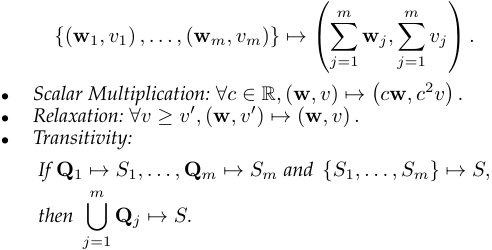

1041-4347 (c) 2019 IEEE. Personal use is permitted, but republication/redistribution requires IEEE permission. See http://www.ieee.org/publications_standards/publications/rights/index.html for more information. 

This article has been accepted for publication in a future issue of this journal, but has not been fully edited. Content may change prior to final publication. Citation information: DOI 10.1109/TKDE.2019.2934100, IEEE Transactions on Knowledge and Data Engineering 

IEEE TRANSACTIONS ON KNOWLEDGE AND DATA ENGINEERING, VOL. XX, NO. XX, XXXX 2019 

4 

We now explain the key intuitions behind Definition 1. (1) The rules of summation and scalar multiplication inherit basic mathematical operations over random variables. For example, a data consumer requests two services _S_ 1 = ( **w** 1 _, v_ 1) _, S_ 2 = ( **w** 2 _, v_ 2), and obtains noisy answers _O_ 1 _, O_ 2. Here, _O_ 1 (resp., _O_ 2) can be viewed as a random variable with mean **w** 1_T_ **x** (resp., **w** 2_T_ **x** ) and variance _v_ 1 (resp., _v_ 2). Besides, if the data consumer adds _O_ 1 to _O_ 2, she can obtain another random variable _O_ 3 with mean ( **w** 1 + **w** 2)_T_ **x** and variance _v_ 1 + _v_ 2, which is in fact the answer of another service _S_ 3 = ( **w** 1 + **w** 2 _, v_ 1 + _v_ 2). Moreover, if the data consumer multiplies _O_ 1 by 1 _/_ 2, she can obtain a random variable _O_ 4 with mean **w** 1_T_ **x** _/_ 2 and variance _v_ 1 _/_ 4, which is the answer of the service _S_ 4 = ( **w1** _/_ 2 _, v_ 1 _/_ 4). Therefore, _S_ 1 _, S_ 2 can determine _S_ 3, and _S_ 1 can determine _S_ 4. Here, “determine” is kind of “derive”. (2) We clarify the relaxation rule from expected accuracy. When answering the same statistic, if less noise is added to the true answer, the returned answer will be more accurate in expectation. Here, “determine” is kind of “more accurate than”. (3) Transitivity is an important rule of both partial order relations and equivalence relations [28], and has been widely used in defining the determinacy relation among database queries [29], [30]. 

Based on the service determinacy relation, we define arbitrage freeness in a formal way. 

**Definition 2** (Arbitrage Freeness) **.** _A pricing function π_ ( _·_ ) _is arbitrage free, if ∀m ≥_ 1 _, {S_ 1 _, . . . , Sm} �→ S implies:_ 

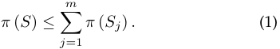

The intuition behind the above definition is that if there exists arbitrage in the pricing function _π_ ( _·_ ), _e.g._ , _π_ ( _S_ ) _>_ � _mj_ =1_π_(_Sj_),thenthedataconsumerwouldneverpaythe full price of the service _S_ . Instead, she would turn to buying a cheaper set of services _{S_ 1 _, . . . , Sm}_ to answer _S_ . 

**Dependent Differential Privacy:** We now introduce dependent differential privacy [31] from the privacy preservation perspective, _i.e._ , we focus on the randomized mechanism _M_ itself. Yet, some of its disciplines will be used to mathematically quantify the privacy losses of data owners. 

Dependent differential privacy is essentially a variant of the celebrated differential privacy [10]. In particular, differential privacy imposes a bound on the maximum ratio between the probabilities of returning a certain aggregate result with and without any individual’s record, and thus limits the adversary’s ability to infer private information. As an enhanced version, dependent differential privacy further considers data correlations. We introduce its technical notations as follows. 

Given the statistical database **x** = ( _x_ 1 _, . . . , xn_ ), if any data item in **x** is dependent on at most _L −_ 1 other items, the dependent size of **x** is defined to be _L_ . Besides, the probabilistic dependence relationship over the whole database **x** is denoted as _R_ . For example, to capture social, temporal, and spatial correlations, _R_ can be some probabilistic graphical models, such as Bayesian networks and Markov chains. In addition, the existence of _R_ may be due to a certain data generation process, or some other social, behavioral, and genetic relationships. For example, as illustrated in [31], _R_ in the Gowalla location dataset was introduced from its relevant social network dataset [25]. Moreover, a pair of dependent neighboring databases is defined as follows. 

**Definition 3** (Dependent Neighboring Databases) **.** _Two databases_ **x** ( _L, R_ ) _,_ **x**_′_ ( _L, R_ ) _are dependent neighboring databas-_ 

_es, if the modification of one data item in_ **x** ( _L, R_ ) _(e.g., xi changes to x__′_ _i__) causes changes in at most L−_1_other data items in_**x**_′_(_L, R_) _due to the probabilistic dependence relationship R._ 

For the sake of brevity, when the dependent/correlated context is clear, we omit the parameters _L, R_ , and write **x** _,_ **x**_′_ instead. Based on dependent neighboring databases, the definition of dependent differential privacy is formalized as: 

**Definition 4** ( _ϵ_ -Dependent Differential Privacy) **.** _A randomized algorithm M provides ϵ-dependent differential privacy, if for any pair of dependent neighboring databases_ **x** _and_ **x**_′_ _and any possible output O, we have:_ 

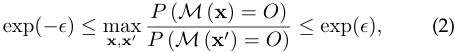

_where ϵ is the privacy budget. Smaller ϵ provides better privacy and worse utility guarantees._ 

To achieve _ϵ_ -dependent differential privacy, a matching dependent perturbation mechanism was proposed in [31]. The key idea is to carefully add Laplace noise by introducing fine-grained dependence coefficients between data items. In particular, _ρij_ denotes the dependence relationship between _xi_ and _xj_ , which quantifies the dependence of _xj_ on the modification of _xi_ . With the help of _ρij_ ’s, the dependent sensitivity of a numeric function _f_ over the database **x** caused by the modification of _xi_ can be expressed as: 

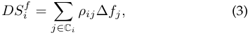

where C _i_ denotes the index set of the data items that are correlated with _xi_ . Besides, C _i_ contains _i_ itself, and the dependence coefficient _ρii_ = 1. Moreover, ∆ _fj_ denotes the sensitivity of _f_ with respect to the modification of _xj_ itself, _i.e._ , ∆ _fj_ = max _xj_ 1 _,xj_ 2 _∥ f_ ( _. . . , xj_ 1 _, . . ._ ) _− f_ ( _. . . , xj_ 2 _, . . ._ ) _∥_ 1. Furthermore, when focusing on the individual data item _xi_ , the dependent size _L_ and the probabilistic dependence relationship _R_ , which outline the dependent structure of the whole database **x** as mentioned earlier, are now reflected in two concrete parameters C _i_ and _ρij_ . Specifically, the cardinality of C _i_ is no more than _L_ , while _ρij_ measures the dependence relationship between two data items, and can be computed from _R_ . We finally present the dependent perturbation mechanism as follows. 

**Theorem 1** (Dependent Perturbation Mechanism) **.** _The randomized mechanism_ 

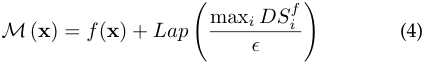

_guarantees ϵ-dependent differential privacy._ 

## **3 SERVICE PRICING** 

In this section, we consider the first component of ERATO, namely the pricing mechanism for common aggregate statistics. It should be arbitrage free not only to the statistic **w** itself but also to the variance of perturbing noise _v_ . 

### **3.1 Design Rationale** 

Given service determinacy and arbitrage freeness in Definition 1 and Definition 2, respectively, we first list some intuitive properties that any arbitrage-free pricing function _π_ ( **w** _, v_ ) should satisfy: (1) The service with zero weight vector is free: _π_ ( **0** _, v_ ) = 0; (2) The service with higher 

1041-4347 (c) 2019 IEEE. Personal use is permitted, but republication/redistribution requires IEEE permission. See http://www.ieee.org/publications_standards/publications/rights/index.html for more information. 

This article has been accepted for publication in a future issue of this journal, but has not been fully edited. Content may change prior to final publication. Citation information: DOI 10.1109/TKDE.2019.2934100, IEEE Transactions on Knowledge and Data Engineering 

5 

IEEE TRANSACTIONS ON KNOWLEDGE AND DATA ENGINEERING, VOL. XX, NO. XX, XXXX 2019 

variance is cheaper: _∀v ≥ v__′_ _, π_ ( **w** _, v_ ) _≤ π_ ( **w** _, v__′_ ); (3) The service with zero variance is the most expensive: _∀v >_ 0 _, π_ ( **w** _,_ 0) _> π_ ( **w** _, v_ ); (4) The service with infinite noise is free: if _π_ ( _·_ ) is continuous at **w** = **0** , then _π_ ( **w** _,_ + _∞_ ) = 0. 

_Proof._ For (1), by the summation rule of Definition 1, when _m_ = 0, _∅�→_ ( **0** _,_ 0), and further by the relaxation rule, ( **0** _,_ 0) _�→_ ( **0** _, v_ ). Thus, by Definition 2, 0 _≤ π_ ( **0** _, v_ ) _≤ π_ ( **0** _,_ 0) _≤_ 0, which implies _π_ ( **0** _, v_ ) = 0. For (2), first by the relaxation rule, ( **w** _, v__′_ ) _�→_ ( **w** _, v_ ), and then by Definition 2, _π_ ( **w** _, v_ ) _≤ π_ ( **w** _, v__′_ ). For (3), it directly follows from (2). For (4), by the scalar multiplication rule, (1 _/c ·_ **w** _,_ 1) _�→_ ( **w** _, c_2 ), then if _c_ is towards positive infinity, we have: _π_ ( **w** _,_ + _∞_ ) = lim _c→_ + _∞ π_ ( **w** _, c_2 ) _≤_ lim _c→_ + _∞ π_ (1 _/c ·_ **w** _,_ 1) = _π_ ( **0** _,_ 1) = 0 _._ Here, the first inequality follows from Definition 2, and the last equality follows from (1). 

We next discuss the existence of arbitrage-free pricing functions. First, we give a trivial example of zero-price function, _i.e._ , _∀π_ ( **w** _, v_ ) = 0. This function is arbitrage free. Second, we give a nontrivial example of widely used constant-price function, _i.e._ , _∀π_ ( **w** _, v_ ) = _c_ for some _c >_ 0. There exists arbitrage in this function. A simple counter example is _π_ ( **0** _, v_ ) = 0. Third, the general construction of non-trivial arbitrage-free pricing functions has been proven to be a hard problem [1]. Therefore, we turn to exploring sufficient conditions for arbitrage-free pricing functions. 

We further divide an arbitrage-free pricing function into two parts, namely the variance of noise _v_ and the weight vector **w** , and conquer each part step by step. On one hand, from the above properties (2) and (4), we know that any nontrivial, continuous, and arbitrage-free pricing function should monotonically decrease with _v_ , but the thorniest problem is how fast it can decrease with _v_ . We determine the boundary function 1 _/v_ by thwarting the arbitrage attack as illustrated in Section 1. On the other hand, we associate service determinacy with norms of the weight vector **w** , _e.g._ , _ℓp_ norms. Besides, we establish the equivalency between arbitrage-free pricing functions and semi-norms. Moreover, we synthesize new pricing functions by applying subadditive and non-decreasing functions. In particular, to allow a high but finite price for the unperturbed answer, we utilize activation functions from neural networks. 

### **3.2 Detailed Design** 

Following the guidelines given above, we now introduce the detailed design of arbitrage-free pricing functions. 

### _3.2.1 Incorporating Variance of Noise_ 

We start with the first part of an arbitrage-free pricing function _π_ ( **w** _, v_ ) involving the variance of noise _v_ . We formulate the arbitrage attack in a formal way to figure out how _π_ ( **w** _, v_ ) can decrease with _v_ : 

**Example 4.** _A data consumer, who wants to obtain the service_ ( **w** _, v_ ) _but with a lower price, may turn to buying m other cheaper services of the same statistic but with higher variances, denoted as {_ ( **w** _, vj_ ) _|j ∈{_ 1 _, . . . , m}, vj > v}. The data consumer first applies summation and then scalar multiplication by_ 1 _/m in Definition 1, i.e., {_ ( **w** _, v_ 1) _, . . . ,_ ( **w** _, vm_ ) _} �→_ ( _m_ **w** _,_�_m_ _j_ =1_vj_)_�→_ ( **w** _, m_ <u>1</u>2 � _mj_ =1_vj_)_.Inotherwords,thedataconsumercomputes_ _the average of m answers, and gets an unbiased answer but with a lower variance. If the pricing function π_ ( _·_ ) _is arbitrage free, then the following conditional statement must hold:_ 

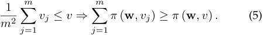

We give Theorem 2 to thwart the above attack. 

**Theorem 2.** _For any arbitrage-free pricing function π_ ( **w** _, v_ ) _that depends on two independent parts_ **w** _and v, it cannot decrease faster than_ 1 _/v._ 

_Proof._ We first prove 1 _/v_ is the boundary function, _i.e._ , _π_ ( **w** _, v_ ) = _g_ ( **w** ) _/v_ is arbitrage free for some positive function _g_ ( **w** ) that depends only on **w** . We utilize the antecedent in Equation (5) to show the correctness of its consequent: 

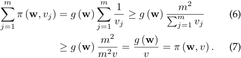

Here, the inequality in Equation (6) follows from that the harmonic mean of a list of non-negative real numbers is less than or equal to the arithmetic mean of the same list, namely 

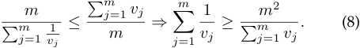

Besides, the inequality in Equation (7) follows from the antecedent in Equation (5). Furthermore, when these two inequalities simultaneously take the equal signs, we can obtain boundary variances _{vj_ = _mv|j ∈{_ 1 _, . . . , m}}_ , which implies that requesting the service with the same variance multiple times is the most possible way to obtain an arbitrage. 

We next show that if _π_ ( **w** _, v_ ) decreases faster than 1 _/v_ , we would derive an arbitrage. We consider a sequence of variances _{vj|j ∈{_ 1 _, . . . ,_ + _∞}}_ , such that lim _j→_ + _∞ vj_ = + _∞_ and lim _j→_ + _∞ vjπ_ ( **w** _, vj_ ) = 0. Thus, we can find _j_ 0 _>_ 1 such that _vj_ 0 _π_ ( **w** _, vj_ 0) _< π_ ( **w** _,_ 1) _/_ 2. Now, we can answer the service ( **w** _,_ 1), through requesting _⌈vj_ 0 _⌉_ times the same service ( **w** _, vj_ 0) and averaging their answers. However, for these _⌈vj_ 0 _⌉_ services, we pay 

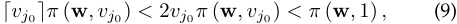

which yields an arbitrage, and completes the proof. 

In what follows, for simplicity, we fix the part of _π_ ( **w** _, v_ ) related to the variance _v_ at 1 _/v_ by default, while investigate other functions, _e.g._ , 1 _/__√_ _<u>v</u>_ , in our evaluation part. 

### _3.2.2 Incorporating Weight Vector_ 

We continue to consider the other part of an arbitrage-free pricing function _π_ ( **w** _, v_ ), namely the weight vector **w** . 

By carefully studying the rules of the service determinacy in Definition 1, we find a metric in linear algebra with analogous properties, called norm, more precisely seminorm. In particular, a norm of a vector **w** can be viewed as a measure of its “length”. Formally speaking, a norm is any function _g_ : R_n_ _→_ R that satisfies the following properties: 

- _Subadditivity:_ 

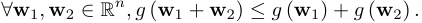

- _Homogeneity: ∀c ∈_ R _,_ **w** _∈_ R_n_ _, g_ ( _c_ **w** ) = _|c|g_ ( **w** ) _._ 

- _Non-negativity: ∀_ **w** _∈_ R_n_ _, g_ ( **w** ) _≥_ 0 _._ 

- _Definiteness:_ **w** = **0** _⇔ g_ ( **w** ) = 0 _._ 

If the last property relaxes to **w** = **0** _⇒ g_ ( **w** ) = 0, we call it semi-norm. Besides, the most commonly used norms in the machine learning and data mining algorithms are a family of _ℓp_ norms for some real number _p ≥_ 1. Furthermore, 

1041-4347 (c) 2019 IEEE. Personal use is permitted, but republication/redistribution requires IEEE permission. See http://www.ieee.org/publications_standards/publications/rights/index.html for more information. 

This article has been accepted for publication in a future issue of this journal, but has not been fully edited. Content may change prior to final publication. Citation information: DOI 10.1109/TKDE.2019.2934100, IEEE 

Transactions on Knowledge and Data Engineering 

6 

IEEE TRANSACTIONS ON KNOWLEDGE AND DATA ENGINEERING, VOL. XX, NO. XX, XXXX 2019 

considering that the trivial example of zero-price function is arbitrage free, we utilize semi-norms to devise our basic arbitrage-free pricing functions: 

**Theorem 3** (Basic Arbitrage-free Pricing Functions) **.** _Let π_ ( **w** _, v_ ) = _g_ ( **w** )2 _/v be the pricing function for some positive function g_ ( **w** ) _that only depends on_ **w** _. Then, π_ ( **w** _, v_ ) _is arbitrage free iff g_ ( **w** ) _is a semi-norm._ 

_Proof._ Due to space limitations, we put the proof into our technical report [32]. 

We next consider how to construct more arbitrage-free pricing functions by combining basic/existing ones. We resort to a general class of nondecreasing and subadditive functions. We recall that a function Γ : R_φ_ _→_ R over _∀_ **y** _,_ **z** _∈_ R_φ_ is nondecreasing, if **y** _≤_ **z** _,_ Γ( **y** ) _≤_ Γ( **z** ). Besides, it is subadditive, if Γ( **y** + **z** ) _≤_ Γ( **y** ) + Γ( **z** ). 

**Theorem 4** (Composite Arbitrage-free Pricing Functions) **.** _Let_ Γ : R_φ_ _→_ R _be a nondecreasing and subadditive function. For any set of arbitrage-free pricing functions {π_ 1( _S_ ) _, . . . , πφ_ ( _S_ ) _}, the composite pricing function π_ ( _S_ ) = Γ( _π_ 1( _S_ ) _, . . . , πφ_ ( _S_ )) _is also arbitrage free._ 

_Proof._ We consider the general form of service determinacy, _i.e._ , _{S_ 1 _, . . . , Sm} �→ S_ . Since _π_ 1 _, . . . , πφ_ are arbitrage free, we have: 

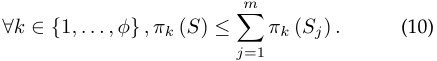

Besides, due to the nondecreasing and subadditive properties of the function Γ, we further have: 

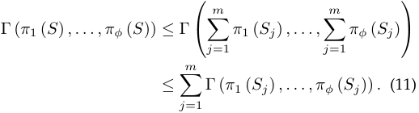

This completes the proof. 

We give some typical examples of composite arbitragefree pricing functions as follows. If _π_ 1( _S_ ) _, . . . , πφ_ ( _S_ ) are arbitrage free, then 

- _Linear Combination: ∀c_ 1 _<u>, . . . , cφ</u> ≥_ 0 _,_�_φ_ _k_ =1_ckπk_(_S_); 

- _• Geometric Mean:_ ~~�~~ <u>�</u> _φk_ =1_πk_(_S_); _• Maximum:_ max( _π_ 1( _S_ ) _, . . . , πφ_ ( _S_ )); 

- _• Power: π_ 1( _S_ )_c_ for 0 _< c ≤_ 1; _• Logarithmic:_ log( _π_ 1( _S_ ) + 1); _• Cut-off:_ min( _π_ 1( _S_ ) _, c_ ) for _c ≥_ 0; 

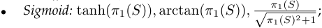

are arbitrage free as well. We note that the basic arbitragefree pricing functions and the first five composite arbitragefree pricing functions set an infinite price for the unperturbed answer, _i.e._ , the variance of noise _v_ = 0. However, these functions may be impractical in data markets, since the data broker tends to sell unperturbed aggregate statistics for high but finite prices. Nevertheless, we can turn to applying some bounding functions for composition, _e.g._ , cut-off and sigmoid functions. In particular, sigmoid functions are commonly used as activation functions in neural networks [27]. At last, we give a sufficient condition to check whether a function Γ is nondecreasing and subadditive. 

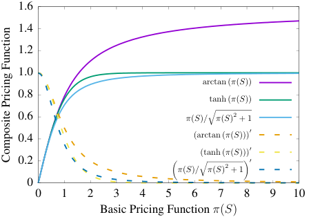

<!-- Start of picture text -->
1.6 1.4 1.2 1.0 arctan ( π ( S )) 0.8 tanh ( π ( S )) 0.6 π ( S ) / � π ( S ) 2 + 1 0.4 (arctan ( π ( S ))) ′ (tanh ( π ( S ))) ′ 0.2 � π ( S ) / � π ( S ) 2 + 1� ′ 0 0 1 2 3 4 5 6 7 8 9 10 Basic Pricing Function  π ( S ) Composite Pricing Function <!-- End of picture text -->

Fig. 2. Three typical sigmoid functions and their first derivatives. 

**Lemma 1.** _Let_ Γ : R_φ_ _→_ R _be a continuous and twicedifferentiable function such that_ Γ( **0** ) = 0 _. Then, if each element of_ Γ _’s gradient (i.e., partial derivative) is no less than zero,_ Γ _is nondecreasing; if each element of_ Γ _’s Hessian matrix (i.e., second partial derivative) is no greater than zero,_ Γ _is subadditive._ 

To provide an intuitive view of Lemma 1, we plot three typical sigmoid functions and their first derivatives in Fig.2. From Fig. 2, we can see that these functions are increasing and bounded above, while their first derivatives are decreasing. Therefore, according to Theorem 4, they are composite arbitrage-free pricing functions. 

## **4 PRIVACY COMPENSATION** 

In this section, we consider the other component of ERATO, _i.e._ , the privacy compensation mechanism for individual privacy loss. We propose both bottom-up and top-down designs. In the bottom-up design, the sum of privacy compensations determines the service price, while this relation is inverse in the top-down design. Besides, another major difference is that the bottom-up design allows each data owner to actively select a privacy compensation function according to her privacy strategy, which is instead not required in the top-down design. 

### **4.1 Privacy Loss for General Function** 

When the data broker answers aggregate statistics with a randomized mechanism _M_ , some private information of each data owner would be leaked. Based on the disciplines of dependent differential privacy, we formally define the individual privacy loss _ϵi_ for an arbitrary real-valued function _f_ , and further give its upper bound related to the dependent sensitivity _DSi__f_and the variance of noise_v_. 

We first consider a pair of dependent neighboring databases **x** and **x**(_i_) , which initially differs in the data item _xi_ . In fact, **x** and **x**(_i_) can simulate the presence and absence of the data owner _i_ . By comparing the output of the randomized mechanism _M_ over **x** and **x**(_i_) , we define individual privacy loss as follows. 

**Definition 5** (Individual Privacy Loss) **.** _The privacy loss of the data owner i in the randomized mechanism M over the database_ **x** _is defined as:_ 

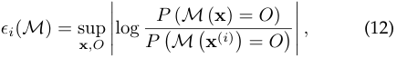

1041-4347 (c) 2019 IEEE. Personal use is permitted, but republication/redistribution requires IEEE permission. See http://www.ieee.org/publications_standards/publications/rights/index.html for more information. 

This article has been accepted for publication in a future issue of this journal, but has not been fully edited. Content may change prior to final publication. Citation information: DOI 10.1109/TKDE.2019.2934100, IEEE Transactions on Knowledge and Data Engineering 

7 

IEEE TRANSACTIONS ON KNOWLEDGE AND DATA ENGINEERING, VOL. XX, NO. XX, XXXX 2019 

_where_ **x** _ranges over all possible database instances, and O ranges over all possible outputs._ 

We discuss the relationship between the individual privacy loss _ϵi_ ( _M_ ) and the privacy budget _ϵ_ in Definition 4. (1) The privacy budget _ϵ_ , normally preset by the data broker over the randomized mechanism _M_ , applies to all the data owners. In other words, each data owner is promised to suffer privacy loss no more than _ϵ_ , _i.e._ , _ϵ_ = max _i ϵi_ ( _M_ ). By comparison, in the context of privacy compensation, we turn this around. Now, the randomized mechanism _M_ , given the variance of perturbing noise _v_ from the data consumer, has already breached privacy, and Definition 5 quantifies the privacy loss for each data owner. (2) From _ϵ_ = max _i ϵi_ ( _M_ ), we can see that if the randomized mechanism _M_ is _ϵ_ - dependent differentially private for a tiny _ϵ_ , then the individual privacy loss _ϵi_ ( _M_ ) would be very small as well. 

We further give an upper bound of the individual privacy loss _ϵi_ ( _M_ ), when the randomized mechanism _M_ is known to be the dependent perturbation mechanism defined in Theorem 1. In particular, this upper bound depends on the variance of Laplace noise _v_ and the dependent sensitivity of _f_ at _xi_ . 

**Theorem 5.** _Let M be dependent perturbation mechanism, f be any numeric function, DSi__fbethedependentsensitivityoffat_ _xi, and v be the variance of Laplace noise. The privacy loss of the data owner i is bounded above by:_ 

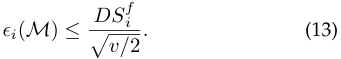

_Proof._ In the dependent perturbation mechanism, the noise _η_ is drawn from the Laplace distribution _Lap_ ( _λ_ ). Here, the scaling factor _λ_ can be computed from the variance _v_ , namely _λ_ = � _v/_ 2. We then derive that: 

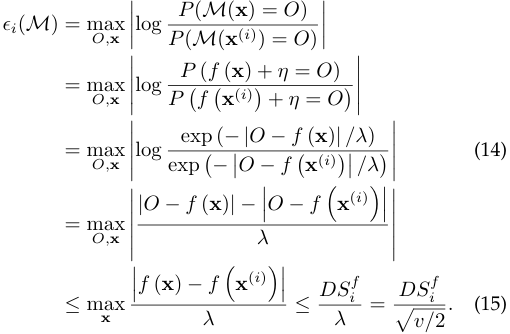

Here, Equation (14) follows from the probability density function of _Lap_ ( _λ_ ). Besides, in Equation (15), the first inequality follows from the triangle inequality, and the second inequality follows from the definition of the dependent sensitivity of _f_ at _xi_ [31]. 

### **4.2 Bottom-up Design** 

In this section, we consider the bottom-up design of privacy compensation. The data broker first needs to satisfy each individual privacy compensation _ψi_ ( _S_ ), and then determine the price _π_ ( _S_ ) for the data consumer. For example, to guarantee the property of balance, the relationship between the service price and the sum of individual privacy compensation can be _π_ ( _S_ ) = _c_�_n_ _i_ =1_ψi_(_S_) for some_c >_1. 

First, the individual privacy compensation _ψi_ ( _S_ ) should hinge on the individual privacy loss _ϵi_ ( _M_ ). Besides, the data broker needs to evaluate/approximate _ϵi_ ( _M_ ) from the service _S_ itself, including the weight vector **w** and the variance of noise _v_ . However, the original _ϵi_ ( _M_ ) in Definition 5 not only depends on the actual randomized mechanism _M_ , but also needs to consider all the database instances and all the possible outputs, which can be infeasible to compute in practice [1], [33]. Therefore, we turn to focusing on the specific dependent perturbation mechanism in Theorem 1, and utilize the upper bound of privacy loss in Theorem 5 to do compensation. We note that the bounded privacy loss in Theorem 5 is given as a function of the variance _v_ and the dependent sensitivity _DSi__f_.Here,wecancompute_DS_ _i__f_in thethe contextinfimumofandaggregatesupremumstatistics.of theWedatalet item¯ _βi, β_¯ _ix∈i_ ’sRdomain,denote respectively. Then, according to Equation (3), we can get: 

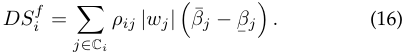

Suppose we ignore data correlations by setting _ρij_ = 0 for all _j ∈_ C _i\i_ . The dependent sensitivity in Equation (16) will degenerate to the sensitivity defined in the classical differential privacy [10]: 

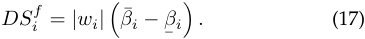

After quantifying the individual privacy loss in aggregate statistics, we now consider how to compensate each data owner in an appropriate manner. We first identify two desirable properties in the bottom-up design: 

**Definition 6** (Bottom-up Privacy Compensation) **.** _Let ψi_ ( _S_ ) _be a privacy compensation function over the service S_ = ( **w** _, v_ ) _in the bottom-up design. ψi_ ( _S_ ) _should satisfy:_ 

- _Dependent Fairness: ∀j ∈_ C _i, wj_ = 0 _⇒ ψi_ ( _S_ ) = 0 _._ 

- _Micro Arbitrage Freeness: ψi_ ( _S_ ) _is arbitrage free._ 

We give some comments on these two properties as follows. (1) Dependent fairness is an extension of fairness defined in the conventional query-based pricing [33] by further incorporating data correlations. The original fairness says that the data owner whose data is not queried should not expect reward. In contrast, our dependent fairness says that only if the data owner and her correlated data owners are not involved in the service, she will receive no privacy compensation. Although the case, where a data owner who is not involved in the service but may still be compensated, seems counterintuitive, it makes sense from the perspective of privacy loss due to data correlations. (2) Micro arbitrage freeness is a necessity in the bottom-up design. The reason is that the service price at top hinges on the total privacy compensations at bottom. Therefore, the data consumer may have strong motivations to circumvent the due privacy compensations, and thus the payment, by asking other alternative services. Besides, the definition of micro arbitrage freeness is identical to that of arbitrage freeness, but the former needs to be verified over the whole data owners. 

In a similar way to service pricing, we design basic bottom-up privacy compensation functions directly from the privacy losses, which set infinite compensations for unperturbed answers. This kind of functions are suitable for the data owner, who values her privacy highly, and would never accept full disclosure of personal data.1 

1. By querying two consecutive unperturbed aggregate statistics with and without a data owner’s data item, the data consumer can have full knowledge of the data owner’s data item. 

1041-4347 (c) 2019 IEEE. Personal use is permitted, but republication/redistribution requires IEEE permission. See http://www.ieee.org/publications_standards/publications/rights/index.html for more information. 

Transactions on Knowledge and Data Engineering 

8 

This article has been accepted for publication in a future issue of this journal, but has not been fully edited. Content may change prior to final publication. Citation information: DOI 10.1109/TKDE.2019.2934100, IEEE 

IEEE TRANSACTIONS ON KNOWLEDGE AND DATA ENGINEERING, VOL. XX, NO. XX, XXXX 2019 

**Theorem 6.** _The privacy compensation functions_ 

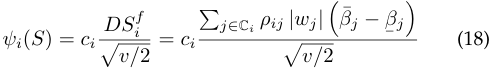

_for some constant ci >_ 0 _and for all i ∈{_ 1 _, . . . , n}, are basic bottom-up privacy compensation functions._ 

_Proof._ First, we prove dependent fairness. We can check that _∀j ∈_ C _i, wj_ = 0 _⇒ ψi_ ( _S_ ) = 0. Second, we prove micro arbitrage freeness. We view _ψi_ ( _S_ ) as a linear combination of _{|wj|/_ ~~�~~ _v/_ 2 _|j ∈_ C _i}_ , where the corresponding coefficients arebination), _{ciρij_ (to _β_¯ _j_ prove _−_ ¯ _βj_ ) _|j_ the _∈_ microC _i}_ . ByarbitrageTheoremfreeness4 (Linearof _ψ_ Com- _i_ ( _S_ ), it suffices to prove that _|wj|/_ � _v/_ 2 is arbitrage free. By Theorem 4 (Geometric Mean), it further suffices to prove the arbitrage freeness of 2 _wj_2 _/v_ . Now, by using the weighted _ℓ_ 2 norm and setting those weights, whose indexes are not _j_ , to be zeros, it completes the proof. 

Analogous to Theorem 4, we can construct new bottomup privacy compensation functions from basic ones by applying any nondecreasing and subadditive function. In particular, to allow the data owner, who is less concerned about her privacy, to reveal her personal data at some high but finite price, we can make use of sigmoid functions. 

**Theorem 7.** _The privacy compensation functions_ 

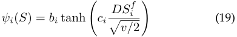

_for constants bi, ci >_ 0 _and for all i ∈{_ 1 _, . . . , n}, are bounded bottom-up privacy compensation functions._ 

_Proof._ First, we can check that _∀j ∈_ C _i, wj_ = 0 _⇒ ψi_ ( _S_ ) = 0. Second, in Theorem 6, we have proved the arbitrage freeness of _ciDSi__f/_ � _v/_ 2. Then, by Theorem 4 (Sigmoid and Linear Combination), _ψi_ ( _S_ ) is micro arbitrage free. 

Considering the diversity of individuals’ privacy strategies, we demonstrate how the data broker can select customized privacy compensation functions for different kinds of data owners. We introduce a nondecreasing contract function _ξi_ ( _ϵi_ ) between the data broker and each data owner _i_ , _i.e._ , in the event of privacy loss _ϵi_ , _i_ should be compensated with at least _ξi_ ( _ϵi_ ). In fact, the contract function _ξi_ ( _·_ ) depends on _i_ ’s valuation over private information. For example, if _i_ values her privacy highly, and would never accept full disclosure of her personal data, then she may choose a linear contract function _ξi_ ( _ϵi_ ) = _ciϵi_ for some _ci >_ 0. In contrast, another data owner _j_ is less concerned about her privacy, and is willing to sell her private data at some high price. Then, she may select the bounded sigmoid contract function _ξj_ ( _ϵj_ ) = _bj_ tanh( _cjϵj_ ) for some _bj, cj >_ 0. Additionally, the data broker would define the corresponding bottom-up privacy compensation functions _ψi_ ( _S_ ) and _ψj_ ( _S_ ) using Equation (18) and Equation (19) for the data owners _i_ and _j_ , respectively. In particular, the privacy compensation functions are satisfying for both _i_ and _j_ , since _ξi_ ( _ϵi_ ) _≤ ψi_ ( _S_ ) and _ξj_ ( _ϵj_ ) _≤ ψj_ ( _S_ ) due to Theorem 5 and the fact that the tanh function is nondecreasing. 

At last, the data broker can determine the service price _π_ ( _S_ ). Take _π_ ( _S_ ) = _c_�_n_ _i_ =1_ψi_(_S_)_, c>_0forexample.We note that if every privacy compensation function _ψi_ ( _S_ ) is micro arbitrage free, then the pricing function _π_ ( _S_ ), which can be viewed as a linear combination of _ψi_ ( _S_ )’s, is factually 

arbitrage free. Of course, _π_ ( _S_ ) can be any other composite functions under Theorem 4. 

### **4.3 Top-down Design** 

In this section, we consider a different top-down privacy compensation design, where the data broker first determines the service price _π_ ( _S_ ) using the pricing mechanism in Section 3, and then spares some fraction of the payment for privacy compensation, _i.e._ ,�_n_ _i_ =1_ψi_(_S_)=_cπ_(_S_)forsome 0 _< c <_ 1. If we regard _cπ_ ( _S_ ) as a budget _B_ , we can convert the privacy compensation problem to a budget allocation problem, where each data owner _i_ ’s share in _B_ should be roughly proportional to her privacy loss _ϵi_ ( _M_ ). 

Specific to the dot product operation in common aggregate statistics, we shall tighten the upper bound of the individual privacy loss _ϵi_ ( _M_ ), by computing the dependent sensitivity _DSi__f_moreaccurately.Wefirstgiveourmotivat- ing examples as follows. 

**Example 5.** _A database_ **x** _consists of two entries x_ 1 _, x_ 2 _, such that x_ 2 = 0 _._ 5 _x_ 1 _and x_ 1 _∈_ [0 _,_ 1] _. Here, the dependence coefficient ρ_ 12 = 1 _, since x_ 2 _is completely dependent on x_ 1 _. We then consider two statistics f_ = _x_ 1 + _x_ 2 _and g_ = _x_ 1 _− x_ 2 _, which differ in the sign of x_ 2 _’s weight. By Equation (16), we compute the dependent sensitivities of f and g at x_ 1 _:_ 

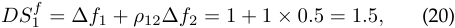

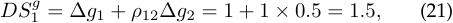

_respectively. We can see that the dependent sensitivities of f and g at x_ 1 _are the same. However, g is essentially g__∗_ = 0 _._ 5 _x_ 1 _, and its dependent sensitivity at x_ 1 _should be:_ 

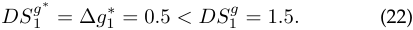

**Example 6.** _We continue to consider the database_ **x** _, but now x_ 1 _and x_ 2 _are negatively correlated rather than positively correlated, i.e., x_ 2 = _−_ 0 _._ 5 _x_ 1 _. According to the definition of nonnegative dependence coefficients in [31], ρ_ 12 = 1 _remains unchanged. Thus, the dependent sensitivities of f and g at x_ 1 _are still_ 1 _._ 5 _. However, f is essentially f__∗_ = 0 _._ 5 _x_ 1 _, and thus its sensitivity at x_ 1 _is 0.5, which is less than DS_ 1_f._ 

Given the two examples above, we can observe that the definition and the mechanism of the dependent differential privacy proposed in [31] aim to be applicable for general functions and general positive/negative correlations, which implies that the general dependent sensitivity can be just a loose upper bound in the context of a specific function. Such a key observation enables us to tighten the dependent sensitivity and thus the individual privacy loss by considering two extra factors: whether the weight is negative or positive, and whether the correlation is negative or positive. In our following calculation, we will maintain the original forms of weights rather than utilizing their absolute values as in the dependent differential privacy, namely Equation (16). Additionally, we introduce _σij_ = _−_ 1 and _σij_ = 1 to represent the cases that _xi, xj_ are negatively and positively correlated, respectively. We thus get: 

**Lemma 2.** _The tight dependent sensitivity of f_ = **w**_T_ **x** _at xi over the database_ **x** _is given as:_ 

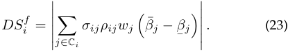

1041-4347 (c) 2019 IEEE. Personal use is permitted, but republication/redistribution requires IEEE permission. See http://www.ieee.org/publications_standards/publications/rights/index.html for more information. 

This article has been accepted for publication in a future issue of this journal, but has not been fully edited. Content may change prior to final publication. Citation information: DOI 10.1109/TKDE.2019.2934100, IEEE Transactions on Knowledge and Data Engineering 

9 

IEEE TRANSACTIONS ON KNOWLEDGE AND DATA ENGINEERING, VOL. XX, NO. XX, XXXX 2019 

_Proof._ Due to the linearity of the dot product operation, the dependent sensitivity of _f_ at _xi_ can occur in two cases: dependentCase 1 (modification _xi_ : ¯ _βi → β_¯ of _i_ ): _f_ Weoverfirst _xj_ considercaused theby theexpectedmodification of _xi_ , denoted as _DSij__f_.Therearetwoadditional cases: If _xj_ is positively correlated with _xi_ , _DSij__f_willoccur inreverse direction,the direction from _i.e._ , ¯ _βj_ to _β_¯ _j_ , otherwise it will occur in the 

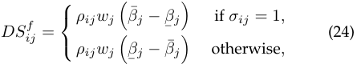

or equivalently, 

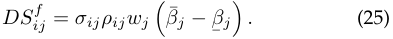

By summing all the dependent modifications and then taking absolute value, we can obtain the dependent sensitive at _xi_ : 

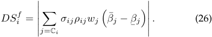

Case 2 ( _xi_ : _β_¯ _i →_ ¯ _βi_ ): Similar to Case 1, we can derive: 

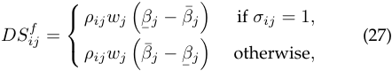

or equivalently, 

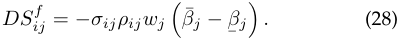

Besides, the final form of _DSi__f_is the same as that in Case 1. This completes the proof. 

After obtaining the tight upper bound of individual privacy loss, we can utilize it to compute each data owner’s share in the total privacy compensations _B_ . Before this, we note that in the top-down design, the privacy compensation function _ψi_ ( _S_ ) should still guarantee dependent fairness, but no longer needs to ensure micro arbitrage freeness. The reason is that the data consumer has paid the arbitrage-free service price _π_ ( _S_ ), and she is not involved in the separate process of privacy compensation. Thus, it is infeasible for the data consumer, as an attacker, to gain arbitrage. 

**Theorem 8.** _The privacy compensation functions_ 

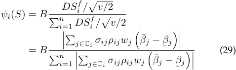

_for the total privacy compensations B and for all i ∈{_ 1 _, . . . , n} are top-down privacy compensation functions._ 

_Proof._ We prove the dependent fairness by checking that _∀j ∈_ C _i, wj_ = 0 _⇒ ψi_ ( _S_ ) = 0. 

In conclusion, the top-down design divides an integrated pricing framework into two independent parts: service pricing and privacy compensation. Different from the bottomup design, on one hand, the data broker here just needs to ensure the arbitrage freeness of service pricing rather 

than the micro arbitrage freeness of privacy compensation; on the other hand, the top-down design is essentially the budget allocation problem according to individual privacy loss at the data broker. Hence, the top-down design can execute without the online participation of data owners, and is applicable to any general aggregate statistic. 

## **5 EVALUATION RESULTS** 

In this section, we present the evaluation results in terms of privacy and utility guarantees, arbitrage-free pricing functions, and fine-grained privacy compensations. 

**Datasets:** We use four real-world datasets, _i.e._ , MovieLens 1M dataset [34], 2009 Residential Energy Consumption Survey (RECS) dataset [35], and two large-scale social network datasets from Stanford Network Analysis Platform (SNAP) [36], for three aggregate statistics, namely weighted sum, probability distribution fitting, and degree distribution, respectively. First, the MovieLens dataset contains 1,000,209 ratings of approximately 3900 movies made by 6040 anonymous users. Besides, we extracted the displayed ratings from MovieLens, which function as target variables in supervised learning. Second, the RECS dataset, which was released by U.S. Energy Information Administration (EIA) in January 2013, provides diverse energy usages in 12,083 U.S. homes. Third, two SNAP datasets are named ego-Twitter and ego-Gplus: ego-Twitter comprises 81,306 nodes and 1,768,149 edges from Twitter, while e-Gplus contains 107,614 nodes and 13,673,453 edges from Google+. 

**Profiles:** To compute the dependence coefficient _ρij_ by means of the method developed in [31], we also need to acquire each data owner’s profile as auxiliary data. The above four datasets all provide this kind of information: The MovieLens dataset comprises some attributes of users, _e.g._ , gender, age, and occupation; The RECS dataset contains several attributes of each household, such as heating degree days, cooling degree days, total number of rooms, etc; The two SNAP datasets include node features, _e.g._ , gender, institution, and job title. Just as [31], we set the similarity threshold between the profiles of two data owners to be 0.8, and only consider positive correlation, _i.e._ , _σij_ = 1. In contrast, the weight _wj_ can be either negative or positive in our evaluations, which helps to verify the effect of negative correlation, since _σijwj_ in Lemma 2 is in the product form. 

**Statistics:** For weighted sum, we apply linear regression to the ratings of different movies from distinct numbers of users, and can learn different weight vectors with distinct dimensions. For Gaussian distribution fitting, we draw the univariate Gaussian distribution of a certain type of energy consumption, _e.g._ , space heating, air conditioning, or refrigerators. For degree distribution, we count both in and out degrees of every user in Twitter and Google+ networks. 

### **5.1 Privacy and Utility Guarantees** 

Before investigating economic properties, we first show how ERATO can improve the utility of aggregate statistics, by calculating the dependent sensitivity more accurately for the dependent perturbation mechanism in Theorem 1. Fig. 3a depicts the accuracies of weighted sum under the Laplace perturbation mechanism [10] in the conventional differential privacy (DP), and the dependent perturbation mechanisms in the dependent differential privacy (DDP) and our ERATO, where the privacy budget _ϵ_ varies from 10_−_6 to 103 by exponential growth. Here, we select the movie ratings from 1000 users for training, and thus derive 

1041-4347 (c) 2019 IEEE. Personal use is permitted, but republication/redistribution requires IEEE permission. See http://www.ieee.org/publications_standards/publications/rights/index.html for more information. 

This article has been accepted for publication in a future issue of this journal, but has not been fully edited. Content may change prior to final publication. Citation information: DOI 10.1109/TKDE.2019.2934100, IEEE Transactions on Knowledge and Data Engineering 

IEEE TRANSACTIONS ON KNOWLEDGE AND DATA ENGINEERING, VOL. XX, NO. XX, XXXX 2019 

10 

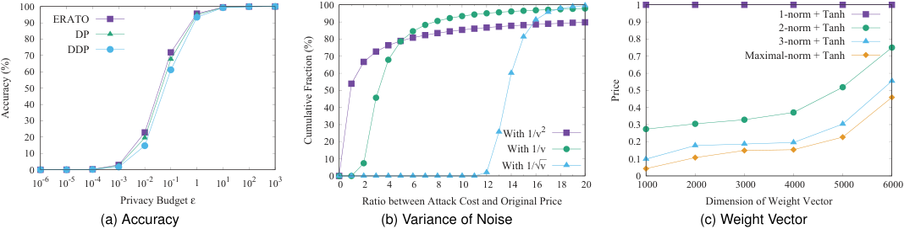

<!-- Start of picture text -->
 100  100  1  90 ERATO  90  0.9 1-norm + Tanh2-norm + Tanh  80 DP  80  0.8 3-norm + Tanh  70 DDP  70  0.7 Maximal-norm + Tanh  60  60  0.6  50  50  0.5  40  40  0.4  30 20  30 20 With 1/v 2  0.3 0.2  10 With 1/v  0  10 With 1/√⎯v  0.1  0  0 10 -6 10 -5 10 -4 10 -3 10 -2 10 -1 1 10 1 10 2 10 3  0  2  4  6  8  10  12  14  16  18  20  1000  2000  3000  4000  5000  6000 Privacy Budget ε Ratio between Attack Cost and Original Price Dimension of Weight Vector (a) Accuracy (b) Variance of Noise (c) Weight Vector Price Accuracy (%) Cumulative Fraction (%) <!-- End of picture text -->

Fig. 3. Privacy vs. utility and arbitrage freeness in weighted sum. 

1000-dimensional weight vectors. Besides, we define the accuracy as 1 _−__<u>|</u>_ _|_¯ _OO_<u>¯</u> _−_ + _OO||_[31],where_O_¯and_O_arethetrue and perturbed results, respectively. 

One key observation from Fig. 3a is that more accuracy is achieved as the privacy budget _ϵ_ increases, especially when _ϵ_ changes from 0.01 to 0.1. We explain the reason through the formula between the variance of Laplace noise _v_ and the privacy budget _ϵ_ : 

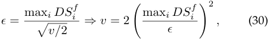

which follows from Theorem 1. Here, the function sensitivity max _i DSi__f_inthenumeratorremainsunchangedfor a certain perturbation mechanism. When _ϵ_ becomes larger, less noise is added, which implies a more accurate statistic. Besides, max _i DSi__f_’sforallthreeperturbationmechanisms are in the magnitude of 0.1. Hence, the accuracy is significantly improved at _ϵ_ = 0 _._ 1. Furthermore, when _ϵ_ is too small or too large, the perturbation or the true result completely dominates, and the differences among the accuracies of three perturbation mechanisms are tiny. 

The second key observation is derived by comparing the accuracies of three perturbation mechanisms at a fixed privacy budget _ϵ_ , _i.e._ , the denominator in Equation (30) keeps the same. ERATO is more accurate than DDP or even DP. In particular, when _ϵ_ = 0 _._ 01, ERATO improves 10 _._ 67% and 4 _._ 20% of accuracies than DDP and DP, respectively. On one hand, due to the triangle inequality, each individual dependent sensitivity _DSi__f_inERATO,namelyEquation(23), is no greater than that in DDP, namely Equation (16), which implies the same relation for max _i DSi__f_.Thus,thetrue result in ERATO is perturbed with less noise than that in DDP. On the other hand, DP can be regarded as a special case of DDP or ERATO, where the correlated data items are ignored when evaluating _DSi__f_,namelyEquation(17). Although _DSi__f_in DP is always no greater than that in DDP, there exist negative weights here. Besides, the negative part can have more effect on some _DSi__f_’sthanthepositivepart (not including _i_ itself). Under such circumstance, the final function sensitivity max _i DSi__f_inERATOcanbelessthan that in DP, which means higher accuracy. 

In conclusion, ERATO can better balance privacy and utility in the aggregate statistics than DP and DDP. 

### **5.2 Arbitrage-free Pricing Functions** 

In this section, we carry on with the weighted sum application, and further explore arbitrage freeness. 

**Variance of Noise:** We first evaluate the variance of noise _v_ in an arbitrage-free pricing function by simulating the attack illustrated in Example 4. We recall that the data consumer, as an attacker, wants to obtain the service ( **w** _, v_ ) by averaging _m_ the same statistic but with diverse higher variances, namely _{_ ( **w** _, vj_ ) _|j ∈{_ 1 _, . . . , m}, vj > v}_ . We simulate such an arbitrage attack by randomly generating _vj_ ’s with the fixed sum _m_2 _v_ from the open interval _v_ to ( _m_2 _−m_ +1) _v_ . Besides, we set _v_ to be 1 and _m_ to be 100. After simulating 10000 samples, we plot the cumulative fraction of the ratio between the attack cost�_m_ _j_ =1_π_(**w**_, vj_)andthe original price _π_ ( **w** _, v_ ) in Fig. 3b, where the pricing function _π_ ( _·_ ) decreases with the variance _v_ from 1 _/v_2 , to 1 _/v_ , and to 1 _/__√_ _<u>v</u>_ . We note that the cumulative fraction here differs from the common cumulative distribution function in that it does not include the endpoint. For example, when the ratio takes 1, the cumulative fraction denotes the fraction of the samples, where the attack cost is strictly less than the original price, _i.e._ ,�_m_ _j_ =1_π_(**w**_, vj_)_<π_(**w**_, v_).Morespecifically,the cumulative fraction at the ratio of 1 can generally embody the success ratio of finding arbitrage. 

By observing the cumulative fractions at the ratio of 1 in Fig. 3b, we can see that there exists arbitrage in 1 _/v_2 , while the other two pricing functions are arbitrage free, since in 1 _/v_2 , the cumulative fraction at the ratio of 1 is greater than 0. In particular, the probability that the attacker can find arbitrage in 1 _/v_2 is 53 _._ 91%. This coincides with our theoretical analysis that arbitrage-free pricing functions cannot decrease faster than 1 _/v_ , namely Theorem 2. From Fig. 3b, we can also observe that an attempt of finding arbitrage in 1 _/__√_ _<u>v</u>_ is expected to be more costly than that in 1 _/v_ , which can be roughly captured by the areas above these two function curves. For instance, to launch an arbitrage attack in 1 _/__√_ _<u>v</u>_ , the attacker is most likely to spend 13 to 14 times the original price with probability 34 _._ 40%. In contrast, the most possible case in 1 _/v_ is to pay 2 to 3 times the original price with probability 38 _._ 27%. Therefore, in the sense of defending against arbitrage, the pricing function, which decreases slower with the variance _v_ , _e.g._ , 1 _/__√_ _<u>v</u>_ vs. 1 _/v_ , can be more robust. Nevertheless, those legal data consumers may need to pay higher prices when their variances are greater than 1. 

**Weight Vector:** We continue to examine the other part of an arbitrage-free pricing function, namely weight vector. We choose the movie ratings from different numbers of users, and obtain diverse dimensions of weight vectors. Fig. 3c plots four composite pricing functions, when the dimension _n_ increases from 1000 to 6000 with a step of 1000. In particular, the composite pricing functions are derived by 

1041-4347 (c) 2019 IEEE. Personal use is permitted, but republication/redistribution requires IEEE permission. See http://www.ieee.org/publications_standards/publications/rights/index.html for more information. 

11 

This article has been accepted for publication in a future issue of this journal, but has not been fully edited. Content may change prior to final publication. Citation information: DOI 10.1109/TKDE.2019.2934100, IEEE Transactions on Knowledge and Data Engineering 

IEEE TRANSACTIONS ON KNOWLEDGE AND DATA ENGINEERING, VOL. XX, NO. XX, XXXX 2019 

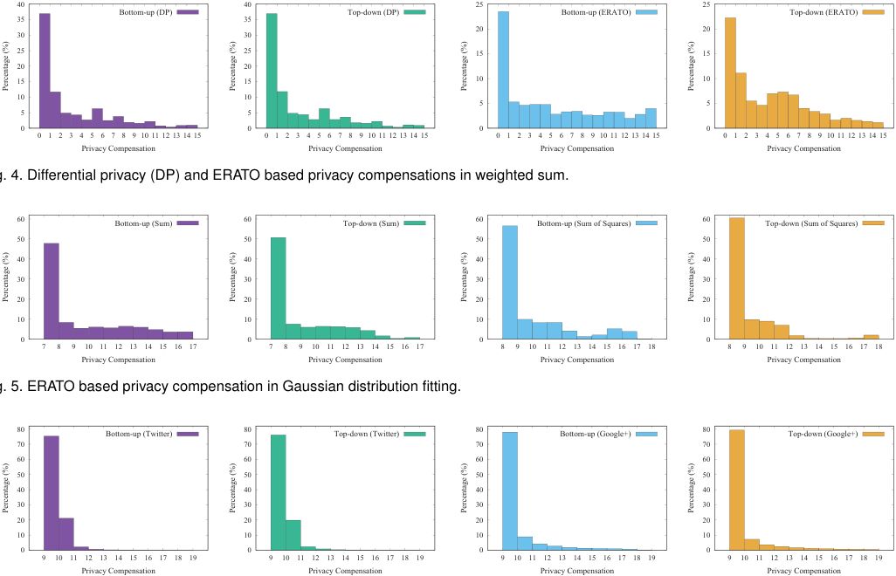

<!-- Start of picture text -->
 40  40  25  25 Bottom-up (DP) Top-down (DP) Bottom-up (ERATO) Top-down (ERATO)  35  35  20  20  30  30  25  25  15  15  20  20  15  15  10  10  10  10  5  5  5  5  0  0  0  0 0 1 2 3 4 5 6 7 8 9 10 11 12 13 14 15 0 1 2 3 4 5 6 7 8 9 10 11 12 13 14 15 0 1 2 3 4 5 6 7 8 9 10 11 12 13 14 15 0 1 2 3 4 5 6 7 8 9 10 11 12 13 14 15 Privacy Compensation Privacy Compensation Privacy Compensation Privacy Compensation Fig. 4. Differential privacy (DP) and ERATO based privacy compensations in weighted sum.  60 Bottom-up (Sum)  60 Top-down (Sum)  60 Bottom-up (Sum of Squares)  60 Top-down (Sum of Squares)  50  50  50  50  40  40  40  40  30  30  30  30  20  20  20  20  10  10  10  10  0  0  0  0 7 8 9 10 11 12 13 14 15 16 17 7 8 9 10 11 12 13 14 15 16 17 8 9 10 11 12 13 14 15 16 17 18 8 9 10 11 12 13 14 15 16 17 18 Privacy Compensation Privacy Compensation Privacy Compensation Privacy Compensation Fig. 5. ERATO based privacy compensation in Gaussian distribution fitting.  80 Bottom-up (Twitter)  80 Top-down (Twitter)  80 Bottom-up (Google+)  80 Top-down (Google+)  70  70  70  70  60  60  60  60  50  50  50  50  40  40  40  40  30  30  30  30  20  20  20  20  10  10  10  10  0  0  0  0 9 10 11 12 13 14 15 16 17 18 19 9 10 11 12 13 14 15 16 17 18 19 9 10 11 12 13 14 15 16 17 18 19 9 10 11 12 13 14 15 16 17 18 19 Privacy Compensation Privacy Compensation Privacy Compensation Privacy Compensation Percentage (%) Percentage (%) Percentage (%) Percentage (%) Percentage (%) Percentage (%) Percentage (%) Percentage (%) Percentage (%) Percentage (%) Percentage (%) Percentage (%) <!-- End of picture text -->

Fig. 4. Differential privacy (DP) and ERATO based privacy compensations in weighted sum. 

Fig. 5. ERATO based privacy compensation in Gaussian distribution fitting. 

Fig. 6. ERATO based privacy compensation in Twitter and Google+ degree distributions. 

first applying _ℓ_ 1 _, ℓ_ 2 _, ℓ_ 3 _, ℓ∞_ norms and then tanh. Besides, the variance of noise _v_ is set to be 0.1, which gives an error of 1 with 90% confidence by Chebyshev’s inequality. 

From Fig. 3c, we can see that the composite pricing function using _ℓ_ 1 norm remains almost unchanged at 1, while the other ones increase with the dimension of weight vector _n_ . The reason lies in the characteristics of the bounded tanh function. When _n_ = 1000, the pricing function using _ℓ_ 1 norm has already approximated tanh’s upper bound 1, and is insensitive to later changes. Besides, the absolute value of each weight is less than 1 here. Thus, as depicted in Fig. 3c, when _n_ is fixed, the price becomes lower for the pricing function using _ℓp_ norm with a larger _p_ . 

These evaluation results demonstrate that arbitrage freeness is a strong economic property. If not guaranteed, _e.g._ , in the case of 1 _/v_2 , it is effortless for the data consumer to game the data market. Besides, the data broker can develop her customized pricing strategy by carefully applying Theorem 3 and Theorem 4. 

### **5.3 Fine-grained Privacy Compensations** 

In this section, we show the privacy compensations in three different aggregate statistics, including weighted sum, Gaussian distribution fitting, and degree distribution. For clarity in presentation and comparison, we fix the total privacy compensations such that one data owner is rewarded with 10 units in average, _i.e._ , _B_ = 10 _n_ . Besides, we choose the same bounded privacy compensation function in Theorem 7 for each data owner in the bottom-up design. 

Before introducing the concrete evaluation results, we first analyze the major differences among three aggregate statistics: (1) From mathematical formula, there exist both 

positive and negative weights in weighted sum, while the weights in the other two statistics are all constant 1’s. Besides, the domain of each data item keeps the same in a certain statistic; (2) From privacy compensation, suppose that we employ the DP framework, which ignores data correlations and compensates the data owner roughly proportional to the absolute value of her weight. Each data owner would be compensated with the average 10 units in Gaussian distribution fitting and degree distribution. Therefore, we only compare DP with ERATO in weighted sum, and directly show ERATO-based evaluation results in the other two statistics. 

**Weighted Sum:** We start with weighted sum, where the dimension of weight vector is fixed at 1000, and the variance of noise _v_ is set to be 0.1 as in Section 5.2. Fig. 4 plots the bottom-up and top-down privacy compensations under DP and ERATO. We note that any pair of neighboring _x_ - axis ticks in Fig. 4 denotes a half-closed interval, _e.g._ , the hist from “9” to “10” stands for the privacy compensations between 9 and 10 excluding 10. 

We first compare DP with ERATO in a certain design of privacy compensation. As depicted in Fig. 4, compared with DP, more privacy compensations fall into the center region under ERATO. In particular, 325 data owners receive no privacy compensation in both bottom-up and top-down designs under DP, whereas this number decreases to 148 under ERATO. Such an outcome truly reflects the difference between the properties of fairness and dependent fairness. 

We next compare the bottom-up and top-down designs under a certain framework. From Fig. 4, we can see that these two designs of privacy compensation appear identical for DP, but look a slightly different for ERATO. 

1041-4347 (c) 2019 IEEE. Personal use is permitted, but republication/redistribution requires IEEE permission. See http://www.ieee.org/publications_standards/publications/rights/index.html for more information. 

This article has been accepted for publication in a future issue of this journal, but has not been fully edited. Content may change prior to final publication. Citation information: DOI 10.1109/TKDE.2019.2934100, IEEE Transactions on Knowledge and Data Engineering 

IEEE TRANSACTIONS ON KNOWLEDGE AND DATA ENGINEERING, VOL. XX, NO. XX, XXXX 2019 

12 

First, DP does not consider data correlations by setting _∀j ∈_ C _i\i, ρij_ = 0. Thus, a specific data owner _i_ ’s privacy losses measured by two designs are the same. Besides, when the total privacy compensations are fixed, each data owner’s share is proportional to her privacy loss in the top-down design, while is proportional to the tanh value of her privacy loss in the bottom-up design. Moreover, most of the privacy losses _ϵi_ ’s under DP are within 0.1. We further note that tanh has the following property: 0 _≤ ϵi ≤_ 0 _._ 1 _,_ tanh ( _ϵi_ ) _≈ ϵi._ Hence, the privacy compensations in two designs look almost the same under DP. In contrast, under ERATO, the dependent sensitivity in the top-down design utilizes a more accurate calculation than that in the bottom-up design, by considering whether the weight is negative or positive. This implies distinct privacy losses and thus distinct privacy compensations under ERATO. 

**Gaussian Distribution:** We show the privacy compensations of Gaussian distribution fitting under ERATO. We recall that the Gaussian distribution can be answered by sum and sum of squares. Here, we set the number of data owners to be 10000. Besides, in the bottom-up design, we set the variance of noise _v_ to be 100, which gives an error of 50 with 96% confidence by Chebyshev’s inequality. Moreover, we scale the values inside the tanh function into the range 0 to 5 to better show the differences among privacy compensations in the bottom-up design. We plot the major privacy compensations and their corresponding percentages in Fig. 5, where the results are derived by averaging 10 kinds of energy consumptions. 

First, we can see from Fig. 5 that different data owners may obtain distinct privacy compensations rather than the uniform 10 units under DP, although their weights and data domains are the same. The reason is that each data owner has a distinct set of correlated data owners or even the same set but with different strength of correlations, which implies a distinct privacy loss. Second, by comparing privacy compensations in a specific design for two statistics, we can see that they are different from each other, because the dependence coefficient between the same pair of correlated data items in the sum changes in the sum of squares. Third, we compare the privacy compensations in two designs for a certain statistic, and find them consistent in general. This is because when both correlations and weights are positive, the privacy losses measured by two designs are the same. In addition, when the total privacy compensations are fixed, the difference between two designs is that the bottom-up design further applies tanh to the privacy losses. Hence, two designs of privacy compensation are consistent in general. 

**Degree Distribution** : We now investigate how privacy compensations are allocated in large-scale social networks. Fig. 6 depicts the evaluation results of the degree distributions in Twitter and Google+. We set the variance of noise _v_ to be 10 in the bottom-up design. From Fig. 6, we can see that most of privacy compensations fall in the central interval between 9 units and 11 units in both Twitter and Google+. This outcome stems from the fact that the degree distribution of Twitter/Google+ social network asymptotically follows a power law. In particular, 37 _._ 17% and 45 _._ 49% of Twitter and Google+ users have degrees no more than 5, respectively. Besides, the number of a data owner’s degrees has a positive correlation with her privacy loss [15]. Therefore, most of the data owners are compensated around the average 10 units. 

We finally give some comments on the ERATO and DP based privacy compensations holistically. First, under DP, the data owners with zero weights receive no compensation in weighted sum. Besides, each data owner is compensated 

with the indiscriminate 10 units in the other two aggregate statistics. However, such a DP-based allocation scheme is unfair/unreasonable in terms of privacy loss: For weighted sum, a zero-weight data owner can still suffer privacy loss, if her correlated data owners are involved in the service; For the other two statistics, different data owners may have distinct sets of correlated data owners, or even the same set but with different correlation coefficients, which indicates that privacy losses can be different from each other. Specifically, for degree distribution, a higher degree the data owner has, the more social connections she keeps, and the richer private information can be leaked. In short, DP-based privacy compensation is actually another kind of unfairness. In contrast, our ERATO, which discriminates a data owner’s privacy compensation with regard to her dependent privacy loss, and introduces the novel property of dependent fairness, has proven to be fairer in practice. 

The above evaluation and analysis results demonstrate that two designs of privacy compensation in ERATO can indeed compensate the data owners for their privacy losses in a fairer and more fine-grained way. 

## **6 RELATED WORK** 

In this section, we briefly review related work. 

### **6.1 Data Market Design** 

In recent years, data market design has gained increasing attention, especially from the database community. The researchers in this field mainly focus on query-based pricing [29], [30]. Koutris _et al._ [37] showed that the prices of a large class of SQL queries can be computed using ILP solvers. Lin and Kifer [9] designed arbitrage-free pricing functions for arbitrary query formats. Deep and Koutris [16] characterized the structure of arbitrage-free pricing functions in both answer-dependent and instance-independent settings. Based on this work, they also implemented a scalable pricing framework for more relational queries [17]. Specific to private data, Ghosh and Roth [12] considered differential privacy as a commodity, and proposed to selling privacy at auction for single counting query. The follow-up works by Li _et al._ [1], [33], [38] further extend to multiple linear queries by introducing arbitrage freeness. Different from these data trading works, Wang _et al._ [39] focused on the data collection process, where the data broker is untrusted, and each data owner tends to report a noisy version of her private data. They thus established a gametheoretic model to measure the value of privacy. 

However, none of above works has taken data correlations into account, and further considered service pricing and privacy compensation in practical aggregate statistics. 

### **6.2 Privacy Preserving Aggregate Statistics** 

An explosive demand of mining private data from a variety of sources contributes to growing interest in privacy preserving aggregate statistics, where untrusted data analysts can study patterns or statistics over a population while maintaining individual privacy. Shi _et al._ [19] considered the sum statistic for time-series data, _e.g._ , electrical usage and medical telemetry data. Their design is based on distributed differential privacy and additively homomorphic encryption. Popa _et al._ [26] developed a practical system, called PrivStats, to support common aggregate statistics 

1041-4347 (c) 2019 IEEE. Personal use is permitted, but republication/redistribution requires IEEE permission. See http://www.ieee.org/publications_standards/publications/rights/index.html for more information. 

This article has been accepted for publication in a future issue of this journal, but has not been fully edited. Content may change prior to final publication. Citation information: DOI 10.1109/TKDE.2019.2934100, IEEE Transactions on Knowledge and Data Engineering 

IEEE TRANSACTIONS ON KNOWLEDGE AND DATA ENGINEERING, VOL. XX, NO. XX, XXXX 2019 

13 

over location data. PrivStats guarantees privacy and accountability by exploiting additively homomorphic encryption and zero-knowledge proof of knowledge. In particular, to facilitate efficient oblivious evaluation, PrivStats requires the data owner to upload a general function value of her raw data _di_ . Such a practice inspires us to introduce an interfaced database **x** in the data market setting, and to further model common aggregate statistics as a set of dot product operations. In contrast to the above works, Corrigan-Gibbs and Boneh [40] introduced multiple data analysts to collaboratively compute aggregate statistics in a private, robust, and scalable fashion. Their system mainly integrates secret-shared non-interactive proofs (SNIPs) with affine-aggregatable encodings (AFEs). 

Unfortunately, the original intention of these works is preserving privacy against untrusted data analysts rather than pricing noisy aggregate statistics for data consumers, and quantifying and compensating privacy losses for data owners, which are instead the major focuses of our work. 

### **6.3 Differential Privacy over Correlated Data** 

The classical differential privacy framework, proposed by Dwork _et al._ [10], [11], adopts a different security assumption that the data analyst can be trusted. Under this assumption, the data analyst adds appropriate noises to aggregate results before releasing them, which can protect an individual’s private information. However, as pointed by Kifer and Machanavajjhala [13], when there exist correlations among the data items, the perturbation in differential privacy can be inadequate. They thus proposed a generalized version of differential privacy, called Pufferfish privacy [41]. Many follow-up research works have been going on around this particular issue. In addition to the dependent differential privacy [31] utilized in this work, Yang _et al._ [15] focused on the correlation structure modeled by Gaussian Markov random fields. Xiao _et al._ [42] considered how to protect a user’s consecutive locations, and employed Markov chains to model temporal correlations. Cao _et al._ [43] quantified the risk of differential privacy under the continuous aggregate release over multiple users’ locations. Song _et al._ [14] proposed a Wasserstein mechanism for any general Pufferfish instantiation, together with a computationally efficient Markov quilt mechanism for Bayesian networks. 

However, the above works still aim at privacy preservation but now against external attackers, _e.g._ , data consumers in data markets. Yet, some of their principles can be borrowed to quantify fine-grained privacy losses for a wider range of aggregate statistics. 

## **7 CONCLUSION AND FUTURE WORK** 

In this paper, we have proposed the first pricing framework ERATO for data markets, which provide common aggregate statistics over private correlated data. In ERATO, the data consumer has to faithfully request the desired service rather than gaming the system through buying a bundle of cheaper services. Besides, the data owners can be compensated for their dependent privacy losses in a more fine-grained way. Furthermore, we have instantiated ERATO with three different kinds of aggregate statistics, and extensively evaluated their performances on four practical datasets. Evaluation results have demonstrated the feasibility of ERATO from the improvement of statistic utility, the arbitrage freeness of service pricing, and the fairness of privacy compensation. 

As for future work, one interesting direction is to investigate how to trade more kinds of personal data in practice, 

_e.g._ , health records, physical activities, and driving trajectories. Specific to a concrete kind of data, we should first determine an appropriate trading format, and further rule out arbitrage opportunities when pricing different trading settings. For example, in the case of trading time-series data, the data consumer may be allowed to designate a pair of starting and ending points together with a sampling period. In addition to the trading format, we also need to consider the underlying data characteristics, especially when quantifying privacy loss, _e.g._ , social, temporal, and spatial correlations among the multiple data owners’ driving trajectories. Yet, another potential research direction is to balance pros and cons brought by relaxing the arbitrage freeness requirement. Here, pros are for the data broker, and cons are from cunning data consumers. In essence, arbitrage freeness implies the computational infeasibility of arbitrage attack, and requires the pricing functions to preserve strict mathematical properties. Suppose the data broker relaxes arbitrage freeness, _e.g._ , by abandoning some rules in the determinacy relation. She can choose a wider range of pricing functions, and support more aggregate statistics. However, the arbitrage attack now becomes computationally feasible. If attack cost is no more than revenue, the data consumers are well-motivated to launch arbitrage attacks. 

## **ACKNOWLEDGMENTS** 

This work was supported in part by the National Key R&D Program of China 2018YFB1004703, in part by China NSF grant 61672348, 61672353, and 61872238, in part by the Open Project Program of the State Key Laboratory of Mathematical Engineering and Advanced Computing 2018A09, in part by the State Key Laboratory of Air Traffic Management System and Technology SKLATM20180X, in part by the Shanghai Science and Technology Fund 17510740200, in part by the Huawei Innovation Research Program HO2018085286, in part by Alibaba Group through Alibaba Innovation Research Program, and in part by the Tencent Social Ads Rhino-Bird Focused Research Program. The opinions, findings, conclusions, and recommendations expressed in this paper are those of the authors and do not necessarily reflect the views of the funding agencies or the government. 

## **REFERENCES** 

- [1] C. Li, D. Y. Li, G. Miklau, and D. Suciu, “A theory of pricing private data,” _Communications of the ACM_ , vol. 60, no. 12, pp. 79– 86, 2017. 

- [2] “Personal data: The emergence of a new asset class,” https://www _._ weforum _._ org/reports/personal-data-emergencenew-asset-class, 2011. 

- [3] J. Brustein, “Start-ups seek to help users put a price on their personal data,” _The New York Times_ , Feb. 2012. 

- [4] “Datacoup,” https://datacoup _._ com/, 2012. 

- [5] “CitizenMe,” https://www _._ citizenme _._ com/, 2013. 

- [6] “CoverUS,” https://www _._ coverus _._ io/, 2018. 

- [7] Federal Trade Commission (FTC), “Data brokers: A call for transparency and accountability,” https://www _._ ftc _._ gov/reports/ data-brokers-call-transparency-accountability-report-federaltrade-commission-may-2014, 2014. 

- [8] “The data brokers: Selling your personal information,” https://www _._ cbsnews _._ com/news/data-brokers-sellingpersonal-information-60-minutes/, 2014. 

- [9] B. Lin and D. Kifer, “On arbitrage-free pricing for general data queries,” _PVLDB_ , vol. 7, no. 9, pp. 757–768, 2014. 

- [10] C. Dwork and A. Roth, “The algorithmic foundations of differential privacy,” _Foundations and Trends in Theoretical Computer Science_ , vol. 9, no. 3-4, pp. 211–407, 2014. 

- [11] C. Dwork, F. McSherry, K. Nissim, and A. D. Smith, “Calibrating noise to sensitivity in private data analysis,” in _Proc. of TCC_ , 2006, pp. 265–284. 

1041-4347 (c) 2019 IEEE. Personal use is permitted, but republication/redistribution requires IEEE permission. See http://www.ieee.org/publications_standards/publications/rights/index.html for more information. 

14 

This article has been accepted for publication in a future issue of this journal, but has not been fully edited. Content may change prior to final publication. Citation information: DOI 10.1109/TKDE.2019.2934100, IEEE Transactions on Knowledge and Data Engineering 

IEEE TRANSACTIONS ON KNOWLEDGE AND DATA ENGINEERING, VOL. XX, NO. XX, XXXX 2019 

- [12] A. Ghosh and A. Roth, “Selling privacy at auction,” in _Proc. of EC_ , 2011, pp. 199–208. 

- [13] D. Kifer and A. Machanavajjhala, “No free lunch in data privacy,” in _Proc. of SIGMOD_ , 2011, pp. 193–204. 

- [14] S. Song, Y. Wang, and K. Chaudhuri, “Pufferfish privacy mechanisms for correlated data,” in _Proc. of SIGMOD_ , 2017, pp. 1291– 1306. 

- [15] B. Yang, I. Sato, and H. Nakagawa, “Bayesian differential privacy on correlated data,” in _Proc. of SIGMOD_ , 2015, pp. 747–762. 

- [16] S. Deep and P. Koutris, “The design of arbitrage-free data pricing schemes,” in _Proc. of ICDT_ , 2017, pp. 12:1–12:18. 

**Chaoyue Niu** is working toward the PhD degree in the Department of Computer Science and Engineering, Shanghai Jiao Tong University, P. R. China. His research interests include privacy preservation and verifiable computation in data management. He is a student member of the ACM and IEEE. 

- [17] ——, “QIRANA: A framework for scalable query pricing,” in _Proc. of SIGMOD_ , 2017, pp. 699–713. 

- [18] A. Vanderveld, A. Pandey, A. Han, and R. Parekh, “An engagement-based customer lifetime value system for e- commerce,” in _Proc. of KDD_ , 2016, pp. 293–302. 

- [19] E. Shi, T. H. Chan, E. Rieffel, R. Chow, and D. Song, “Privacypreserving aggregation of time-series data,” in _Proc. of NDSS_ , 2011. 

- [20] C. Niu, Z. Zheng, F. Wu, X. Gao, and G. Chen, “Achieving data truthfulness and privacy preservation in data markets,” _IEEE Transactions on Knowledge and Data Engineering_ , vol. 31, no. 1, pp. 105–119, 2019. 

- [21] N. Eikmeier and D. F. Gleich, “Revisiting power-law distributions in spectra of real world networks,” in _Proc. of KDD_ , 2017, pp. 817– 826. 

- [22] The New York Times, “Facebook is not the problem. lax privacy rules are.” https://www _._ nytimes _._ com/2018/04/01/opinion/ facebook-lax-privacy-rules _._ html, 2018. 

- [23] ——, “Facebook Hack Included Search History and Location Data of Millions,” https://www _._ nytimes _._ com/2018/10/12/ technology/facebook-hack-investigation _._ html, 2018. 

- [24] R. Cummings, K. Ligett, A. Roth, Z. S. Wu, and J. Ziani, “Accuracy for sale: Aggregating data with a variance constraint,” in _Proc. of ITCS_ , 2015, pp. 317–324. 

- [25] E. Cho, S. A. Myers, and J. Leskovec, “Friendship and mobility: user movement in location-based social networks,” in _Proc. of KDD_ , 2011, pp. 1082–1090. 

- [26] R. A. Popa, A. J. Blumberg, H. Balakrishnan, and F. H. Li, “Privacy and accountability for location-based aggregate statistics,” in _Proc. of CCS_ , 2011, pp. 653–666. 

- [27] I. Goodfellow, Y. Bengio, and A. Courville, _Deep Learning_ . MIT Press, 2016, http://www _._ deeplearningbook _._ org. 

- [28] K. H. Rosen, _Discrete mathematics and its applications_ , 7th ed. McGraw-Hill, 2011. 

- [29] P. Koutris, P. Upadhyaya, M. Balazinska, B. Howe, and D. Suciu, “Query-based data pricing,” in _Proc. of PODS_ , 2012, pp. 167–178. 

- [30] ——, “Query-based data pricing,” _Journal of the ACM_ , vol. 62, no. 5, pp. 43:1–43:44, 2015. 

- [31] C. Liu, S. Chakraborty, and P. Mittal, “Dependence makes you vulnerable: Differential privacy under dependent tuples,” in _Proc. of NDSS_ , 2016. 

- [32] “Technical Report for ERATO,” https://www _._ dropbox _._ com/s/ zokshkynh2e8wf8/, Jan. 2019. 

- [33] C. Li, D. Y. Li, G. Miklau, and D. Suciu, “A theory of pricing private data,” in _Proc. of ICDT_ , 2013, pp. 33–44. 

- [34] “MovieLens 1M Dataset,” https://grouplens _._ org/datasets/ movielens/1m/, 2003. 

- [35] “2009 RECS Dataset,” https://www _._ eia _._ gov/consumption/ residential/data/2009/index _._ php?view=microdata, 2013. 

- [36] “SNAP Datasets: Stanford Large Network Dataset Collection,” http://snap _._ stanford _._ edu/data, 2014. 

**Zhenzhe Zheng** is now a Post Doc in the University of Illinois at Urbana-Champaign (UIUC). He received the PhD degree in Computer Science from Shanghai Jiao Tong University, in 2018. His research interests include algorithmic game theory, resource management in wireless networking and data center. He is a student member of the ACM, IEEE, and CCF. 

**Fan Wu** is a professor with the Department of Computer Science and Engineering, Shanghai Jiao Tong University. He received the BS degree in Computer Science from Nanjing University, in 2004, and the PhD degree in Computer Science and Engineering from the State University of New York at Buffalo, in 2009. He has visited the University of Illinois at Urbana-Champaign (UIUC) as a Post Doc Research Associate. His research interests include wireless networking and mobile computing, algorithmic game theory and its applications, and privacy preservation. He has published more than 100 peer-reviewed papers in technical journals and conference proceedings. He is a recipient of the first class prize for Natural Science Award of China Ministry of Education, NSFC Excellent Young Scholars Program, ACM China Rising Star Award, CCF-Tencent “Rhinoceros bird” Outstanding Award, CCF-Intel Young Faculty Researcher Program Award, and Pujiang Scholar. He has served as the chair of CCF Y- OCSEF Shanghai, on the editorial board of Elsevier Computer Communications, and as the member of technical program committees of more than 60 academic conferences. For more information, please visit http://www.cs.sjtu.edu.cn/~fwu/. 

- [37] P. Koutris, P. Upadhyaya, M. Balazinska, B. Howe, and D. Suciu, “Toward practical query pricing with querymarket,” in _Proc. of SIGMOD_ , 2013, pp. 613–624. 

- [38] C. Li, D. Y. Li, G. Miklau, and D. Suciu, “A theory of pricing private data,” _ACM Transactions on Database Systems_ , vol. 39, no. 4, pp. 34:1–34:28, 2014. 

- [39] W. Wang, L. Ying, and J. Zhang, “The value of privacy: Strategic data subjects, incentive mechanisms and fundamental limits,” in _Proc. of SIGMETRICS_ , 2016, pp. 249–260. 

- [40] H. Corrigan-Gibbs and D. Boneh, “Prio: Private, robust, and scalable computation of aggregate statistics,” in _Proc. of NSDI_ , 2017, pp. 259–282. 

- [41] D. Kifer and A. Machanavajjhala, “A rigorous and customizable framework for privacy,” in _Proc. of PODS_ , 2012, pp. 77–88. 

- [42] Y. Xiao and L. Xiong, “Protecting locations with differential privacy under temporal correlations,” in _Proc. of CCS_ , 2015, pp. 1298– 1309. 

- [43] Y. Cao, M. Yoshikawa, Y. Xiao, and L. Xiong, “Quantifying differential privacy under temporal correlations,” in _Proc. of ICDE_ , 2017, pp. 821–832. 

**Shaojie Tang** is currently an assistant professor of Naveen Jindal School of Management at University of Texas at Dallas. He received the PhD degree in computer science from Illinois Institute of Technology, in 2012. His research interests include social networks, mobile commerce, game theory, e-business, and optimization. He received the Best Paper Awards in ACM MobiHoc 2014 and IEEE MASS 2013. He also received the ACM SIGMobile service award in 2014. Dr. Tang served in various positions (as chairs and TPC members) at numerous conferences, including ACM MobiHoc and IEEE ICNP. He is an editor for International Journal of Distributed Sensor Networks. 

1041-4347 (c) 2019 IEEE. Personal use is permitted, but republication/redistribution requires IEEE permission. See http://www.ieee.org/publications_standards/publications/rights/index.html for more information. 

This article has been accepted for publication in a future issue of this journal, but has not been fully edited. Content may change prior to final publication. Citation information: DOI 10.1109/TKDE.2019.2934100, IEEE Transactions on Knowledge and Data Engineering 

15 

IEEE TRANSACTIONS ON KNOWLEDGE AND DATA ENGINEERING, VOL. XX, NO. XX, XXXX 2019 

**Xiaofeng Gao** received the B.S. degree in information and computational science from Nankai University, China, in 2004; the M.S. degree in operations research and control theory from Tsinghua University, China, in 2006; and the Ph.D. degree in computer science from The University of Texas at Dallas, USA, in 2010. She is currently a professor with the Department of Computer Science and Engineering, Shanghai Jiao Tong University, China. Her research interests include distributed system, wireless communications, data engineering, and combinatorial optimizations. She has published more than 160 peer-reviewed papers in the related area, including well-archived international journals such as IEEE TC, TKDE, TMC, TPDS, JSAC, and also in well-known conference proceedings such as WWW, SIGKDD, INFOCOM, ICDCS, etc. She has served on the editorial board of Discrete Mathematics, Algorithms and Applications, and as the PCs and peer reviewers for a number of international conferences and journals. 

**Guihai Chen** earned the BS degree from Nanjing University, in 1984, the ME degree from Southeast University, in 1987, and the PhD degree from the University of Hong Kong, in 1997. He is a distinguished professor of Shanghai Jiaotong University, China. He had been invited as a visiting professor by many universities including Kyushu Institute of Technology, Japan, in 1998, University of Queensland, Australia, in 2000, and Wayne State University, USA during September 2001 to August 2003. He has a wide range of research interests with focus on sensor network, peer-to-peer computing, high-performance computer architecture and combinatorics. He has published more than 200 peer-reviewed papers, and more than 120 of them are in well-archived international journals such as IEEE Transactions on Parallel and Distributed Systems, Journal of Parallel and Distributed Computing, Wireless Network, The Computer Journal, International Journal of Foundations of Computer Science, and Performance Evaluation, and also in well-known conference proceedings such as HPCA, MOBIHOC, INFOCOM, ICNP, ICPP, IPDPS, and ICDCS. 

1041-4347 (c) 2019 IEEE. Personal use is permitted, but republication/redistribution requires IEEE permission. See http://www.ieee.org/publications_standards/publications/rights/index.html for more information. 

