IEEE TRANSACTIONS ON KNOWLEDGE AND DATA ENGINEERING, VOL. 34, NO. 4, APRIL 2022 

1928 

# Online Pricing With Reserve Price Constraint for Personal Data Markets 

Chaoyue Niu , Student Member, IEEE, Zhenzhe Zheng , Member, IEEE, Fan Wu , Member, IEEE, Shaojie Tang , Member, IEEE, and Guihai Chen, Senior Member, IEEE 

Abstract—The society’s insatiable appetites for personal data are driving the emergence of data markets, allowing data consumers to launch customized queries over the datasets collected by a data broker from data owners. In this paper, we study how the data broker can maximize its cumulative revenue by posting reasonable prices for sequential queries. We thus propose a contextual dynamic pricing mechanism with the reserve price constraint, which features the properties of ellipsoid for efficient online optimization and can support linear and non-linear market value models with uncertainty. In particular, under low uncertainty, the proposed pricing mechanism attains a worst-case cumulative regret logarithmic in the number of queries. We further extend our approach to support other similar application scenarios, including hospitality service and online advertising, and extensively evaluate all three use cases over MovieLens 20M dataset, Airbnb listings in U.S. major cities, and Avazu mobile ad click dataset, respectively. The analysis and evaluation results reveal that: (1) our pricing mechanism incurs low practical regret, while the latency and memory overhead incurred is low enough for online applications; and (2) the existence of reserve price can mitigate the cold-start problem in a posted price mechanism, thereby reducing the cumulative regret. 

Index Terms—Personal data market, revenue maximization, contextual dynamic pricing, reserve price, ellipsoid 

Ç 

## 1 INTRODUCTION 

NOWADAYSlected to seamlessly monitor human behaviors, such as, tremendous volumes of diverse data are colproduct ratings, electrical usages, social media data, web cookies, health records, and driving trajectories. However, for the sake of security, privacy, or business competition, most of data owners are reluctant to share their data, resulting in a large number of data islands. Because of data isolation, potential data consumers (e.g., commercial companies, financial institutions, medical practitioners, and researchers) cannot benefit from private data. To facilitate personal data circulation, more and more data brokers have emerged to build bridges between the data owners and the data consumers. Typical data brokers in industry include Factual [2], DataSift [3], Datacoup [4], CitizenMe [5], and CoverUS [6]. On the one hand, a data broker needs to adequately compensate the data owners for the breach of their privacy caused by using their data to answer any data consumer’s query, thereby incentivizing active data sharing. On the other hand, the data broker should properly charge the online data consumers for their sequential queries over the collected datasets, because both underpricing and overpricing may result 

- C. Niu, Z. Zheng, F. Wu, and G. Chen are with the Shanghai Key Laboratory of Scalable Computing and Systems, Department of Computer Science and Engineering, Shanghai Jiao Tong University, Shanghai 200240, China. E-mail: {rvince, zhengzhenzhe}@sjtu.edu.cn, {fwu, gchen}@cs.sjtu.edu.cn. 

- S. Tang is with the Naveen Jindal School of Management, University of Texas at Dallas, Richardson, TX 75080 USA. E-mail: shaojie.tang@utdallas.edu. 

Manuscript received 14 Dec. 2019; revised 16 May 2020; accepted 20 May 2020. Date of publication 5 June 2020; date of current version 7 Mar. 2022. (Corresponding author: Fan Wu.) 

Recommended for acceptance by B. Glavic. Digital Object Identifier no. 10.1109/TKDE.2020.3000262 

in loss of revenue for the data broker. The data circulation ecosystem is conventionally called “data market” in the literature [7]. 

In this paper, we study how to trade personal data for revenue maximization from the data broker’s standpoint in online data markets. We summarize three major design challenges as follows. The first and the thorniest challenge is that the objective function for optimization is quite complicated. The principal goal of a data broker in data markets is to maximize its cumulative revenue, which is defined as the difference between the prices of queries charged from the data consumers and the privacy compensations allocated to the data owners. Let’s examine one round of data trading. Given a query, the privacy leakages together with the total privacy compensation, regarded as the reserve price of the query, are virtually fixed. Thus, for revenue maximization, an ideal way for the data broker is to post a price, taking the larger value of the query’s reserve price and market value. However, the reality is that the data broker does not know the exact market value and can only estimate it from the context of the current query and the historical transaction records. Of course, a loose estimation will lead to different levels of regret: (1) if the reserve price is higher than the market value, implying that the posted price must be higher than the market value, the query definitely cannot be sold, no matter whether the data broker knows the market value or not. Thus, the regret is zero; and (2) if the reserve price is no more than the market value, a slight underestimation of the market value incurs a low regret, whereas a slight overestimation causes the query not to be sold, generating a high regret. Therefore, the initial goal of revenue maximization can be equivalently converted to minimizing the cumulative regret, particularly, the difference between the data broker’s cumulative revenues with and 

> 1041-4347 © 2020 IEEE. Personal use is permitted, but republication/redistribution requires IEEE permission. 

See ht_tps://www.ieee.org/publications/rights/index.html for more information. 

Authorized licensed use limited to: ON Semiconductor Inc. Downloaded on December 20,2022 at 02:32:26 UTC from IEEE Xplore.  Restrictions apply. 

NIU ET AL.: ONLINE PRICING WITH RESERVE PRICE CONSTRAINT FOR PERSONAL DATA MARKETS 

1929 

without the knowledge of the market values. Considering even the single-round regret function is piecewise and highly asymmetric, it is nontrivial to perform optimization for multiple rounds. 

Another challenge lies in how to model the market values of the customized queries from the data consumers. For regret minimization in pricing online queries, the pivotal step for the data broker is to gain a good knowledge of their market values. However, markets for personal data significantly differ from conventional markets in that each data consumer as a buyer rather than the data broker as a seller can determine the product, namely, a query. In general, each query involves a concrete data analysis method and a tolerable level of noise added to the true answer, which are both customized by a data consumer [8], [9]. Hence, the queries from different data consumers are highly differentiated and are uncontrollable by the data broker. This striking property further implies that most of the dynamic pricing mechanisms, which target identical products or a manageable number of distinct products, cannot apply here. In addition, existing work on data market design either considered a single query [10] or investigated the determinacy relation among multiple queries [9], [11], [12], [13], [14], [15], [16], [17], but ignored whether the data consumers accept or reject the marked prices. Thus, these work omitted modeling the market values of queries and is parallel to this work. 

The ultimate challenge comes from the novel online pricing with reserve price setting. For the estimation of a query’s market value, the data broker can exploit only the current and historical queries. Thus, the pricing of sequential queries can be viewed as an online learning process. Besides the usual tension between exploitation and exploration, our pricing problem has three atypical aspects: (1) the feedback after trading one query is very limited. The data broker can observe only whether the posted price for the query is higher than its market value or not, but cannot obtain the exact market value, which makes standard online learning algorithms [18] inapplicable; (2) the reserve price essentially imposes a lower bound on the posted price beyond the market value estimation, while the ordering between the reserve price and the market value is unknown. In addition, the impact of such a lower bound on the whole learning process has not been studied as of yet; and (3) the online mode requires our design of the posted price mechanism to be quite efficient. In other words, the data broker needs to choose each posted price and further update its knowledge about the market value model with low latency. We outline the key contributions in this work1 as follows. 

- To the best of our knowledge, we are the first to study trading personal data for revenue maximization from the perspective of a data broker in online data markets. In addition, we formulate it into a contextual dynamic pricing problem with the reserve price constraint. 

- The proposed pricing mechanism features the properties of ellipsoid to exploit and explore the market 

> 1. An early version of this work with the same title appeared as a 4-page poster paper in IEEE ICDE 2020 [1]. This journal version has added the principles, details, and analysis of our design, the evaluation results, the related work, as well as substantial illustrations and revisions. 

   - values of sequential queries effectively and efficiently. It supports both linear and non-linear market value models and tolerates some uncertainty. The worst-case cumulative regret under low uncertainty is Oðmaxðn2 log ðT=nÞ; n3 log ðT=nÞ=T ÞÞ, where n is the dimension of feature vector and T is the total number of rounds. The time and space complexities are both Oðn2 Þ. Further, our market framework can also support trading other similar products, which share customization, existence of reserve price, and timeliness with online queries. 

- We evaluate three use cases over three real-world datasets. The major results are: (1) for the pricing of noisy linear query under the linear model, when n ¼ 100 and the number of rounds t is 105 , the regret ratio of our pricing mechanism with reserve price (resp., with reserve price and uncertainty) is 7.77 percent (resp., 9.87 percent), reducing 57.19 percent (resp., 45.64 percent) of the regret ratio than a riskaverse baseline, where the reserve price is posted in each round; (2) for the pricing of accommodation rental under the log-linear model, when n ¼ 55, t ¼ 74; 111, and the ratio between the natural logarithms of the reserve price and market value is set to 0.6, the regret ratio of our pricing mechanism is 3.83 percent, reducing 77.46 percent of the regret ratio compared with the baseline; (3) for the pricing of impression under the logistic model, when n ¼ 1024 and t ¼ 105 , the regret ratios of our pure pricing mechanism are 8.04 and 0.89 percent in the sparse and dense cases, respectively; and (4) the latency of three applications per round is each in the magnitude of millisecond (ms for short), while the memory overhead is each less than 160 MB. 

- We instructively demonstrate that the reserve price can mitigate the cold-start problem in a posted price mechanism, thereby reducing the cumulative regret. Specifically, (1) for the pricing of noisy linear query, when n ¼ 20 and t ¼ 104 , our pricing mechanism with reserve price (resp., with reserve price and uncertainty) reduces 13.16 percent (resp., 10.92 percent) of the cumulative regret than without reserve price; and (2) for the pricing of accommodation rental, as the reserve price approaches the market value, its impact on mitigating cold start is more evident. 

## 2 TECHNICAL OVERVIEW 

In this section, we introduce system model, problem formulation, and design principles. 

### 2.1 System Model 

As shown in Fig. 1, we consider a general system model for online personal data markets. There are three kinds of entities: data owners, a data broker, and data consumers. 

The data broker first collects massive personal data from the data owners. Then, the data consumers come to the data market in an online fashion. In round t 2 ½T �, a data consumer arrives and makes a customized query Qt over the collected dataset. Specifically, the query Qt comprises a concrete data analysis method and a tolerable level of noise 

Authorized licensed use limited to: ON Semiconductor Inc. Downloaded on December 20,2022 at 02:32:26 UTC from IEEE Xplore.  Restrictions apply. 

IEEE TRANSACTIONS ON KNOWLEDGE AND DATA ENGINEERING, VOL. 34, NO. 4, APRIL 2022 

1930 

Fig. 1. A general system model of online personal data markets. The smile indicates that the posted price is accepted and a deal is made. 

added to the true answer [8], [9]. Here, the noise perturbation not only can allow the data consumer to control the accuracy of a returned answer but also can preserve the privacy of the data owners. 

Depending on Qt and the underlying dataset, the data broker quantifies the privacy leakage of each data owner and needs to compensate it if a deal occurs. The data broker then offers a price pt to the data consumer. If pt is no more than the market value vt of Qt, this posted price will be accepted. The data broker charges the data consumer pt, returns the noisy answer, and compensates the data owners as planned. Otherwise, this deal is aborted, and the data consumer goes away. To guarantee non-negative utility for the data broker no matter whether a deal occurs in round t or not, the posted price pt should be no less than the total privacy compensation qt. qt functions as the reserve price and can be pre-computed when given Qt. 

We next give the online trading of noisy linear queries for example. A static market framework for trading the same products with marked prices was studied in [9]. 

Example 1. A data broker, called Bob, maintains a vector ð2; 1; 4; 3Þ, where each value is contributed by a data owner (e.g., denoting a student’s rating for some course). Each data owner also signs a digital contract with Bob with respect to different levels of privacy leakage and corresponding compensations. In round 1, a data consumer, called Alice, launches a query Q1, including “How many data owners have values higher than 3?” and “The variance of tolerable noise is no more than 0.1.”. The level of noise guarantees an error of 1 with 90 percent confidence for the counting answer by Chebyshev’s inequality. Given Q1, Bob quantifies the privacy leakage of each data owner (e.g., using differential privacy-based method in [9]) and computes its privacy compensation under the contract. For example, the privacy compensations of 4 data owners are ð0:3; 0:25; 0:2; 0:25Þ. Bob obtains the total privacy compensation q1 ¼ 1 and posts a price p1 to Alice. Here, p1 must be higher than the reserve price q1 (e.g., p1 ¼ 1:2). If Alice accepts (resp., rejects) p1, Bob will know that the posted price is no more than (resp., higher than) the market value of Q1, namely, p1 � v1 (resp., p1 > v1). In round t, another data consumer launches another query Qt, comprising a different type of statistic analysis (e.g., “What is the mean?”) and a different tolerable variance of noise (e.g., 0.01). The holistic trading process is the same as that of round 1. 

### 2.2 Problem Formulation 

We now formulate the regret minimization problem for pricing sequential queries in online personal data markets. 

We first model the market values of customized and highly differentiated queries. We use an elementary assumption from contextual pricing in computational economics [19], [20], [21] and hedonic pricing in marketing [22], [23], which states that the market value of a product is a deterministic function of its features. Here, the product is a query, and the function can be linear or non-linear. To make the pricing model more robust, we allow for some uncertainty in the market value of each query. In particular, for a query Qt, we let xt 2 Rn denote its n-dimensional feature vector, let f : Rn 7! R denote the mapping from the feature vector xt to the deterministic part in its market value, and let dt 2 R denote the random variable in its market value, which is independent of xt. In a nutshell, vt ¼ fðxtÞ þ dt. 

We next identify the features of a query for measuring its market value. One naı¨ve way is to directly encode the contents of the whole query, including the data analysis method and the noise level. However, the query alone, especially the abstract data analysis method, is hard to embody its economic value. Let’s examine the same type of simple queries in Example 1 for easy illustration: it is nontrivial to directly compare the economic values of the counting and mean statistics, let alone incorporating different levels of accuracy. Thus, we turn to leveraging the underlying valuations of the data owners about the query, namely, the privacy compensations, as the feature vector. We explain the rationality and feasibility of this feature representation: (1) the market value of a query depending on the privacy compensations inherits the core principle of cost-plus pricing [24], [25] and has been widely used in personal data pricing under the static market framework [9], [16], [17]. In particular, cost-plus pricing states that the market value of a product is determined by adding a specific amount of markup to its cost. Here, the cost is the total privacy compensation, the determinacy is reflected in the feature representation, and the markup is realized by setting the reserve price constraint; (2) the privacy compensations are observable by the data broker and can help it to discriminate the economic values of distinct queries. For example, the privacy compensations are higher, which implies that the privacy leakages of the data owners are larger, the knowledge discovered by the data consumer is richer, and thus the market value of the query to the data consumer should be higher; and (3) considering the scale of individual data owners can be large in practice, the dimension of the feature vector call be high as well. We can apply some celebrated dimension reduction techniques (e.g., Principal Components Analysis (PCA) [26]). We can also apply aggregation/clustering to the privacy compensations and regard the aggregate results as the feature vector, where the dimension n controls the granularity of aggregation. One 

Authorized licensed use limited to: ON Semiconductor Inc. Downloaded on December 20,2022 at 02:32:26 UTC from IEEE Xplore.  Restrictions apply. 

NIU ET AL.: ONLINE PRICING WITH RESERVE PRICE CONSTRAINT FOR PERSONAL DATA MARKETS 

1931 

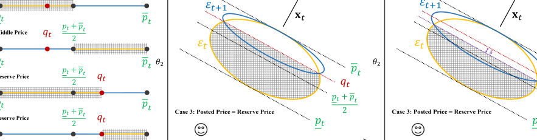

Fig. 2. Illustrations of (effective) exploratory posted prices under the linear market value model. 

extreme case is n ¼ 1, where the only feature is the total privacy compensation; the other extreme case is n equal to the number of data owners, where every feature corresponds to a data owner’s individual privacy compensation. Intuitively, we can interpret the aggregation technique as the introduction of n “master” data owners. Each master data owner represents and manages a group of “child” data owners for unified privacy compensation. We still examine Example 1 and set n ¼ 2. We assume that one master data owner manages the first two data owners, while the other master data owner manages the last two data owners. Then, the feature vector of Q1 is x1 ¼ ð0:55; 0:45Þ. 

We finally define the cumulative regret of the data broker due to its limited knowledge of market values. We consider a game between the data broker and an adversary. During this game, the adversary chooses the sequence of queries Q1; Q2; . . . ; QT , selects the mapping f, but cannot control the uncertainty dt in each round t, namely, the adversary can determine the part fðxtÞ in the market value vt. In contrast, the data broker only can passively receive each query Qt and then post a price pt. If the posted price is no more than the market value (i.e., pt � vt), a deal occurs, and the data broker earns a revenue of pt. Otherwise, the deal is aborted, and the data broker gains no revenue. We define the regret rt in round t as the difference between the adversary’s revenue and the data broker’s revenue for trading the query Qt. The detailed formula of rt is 

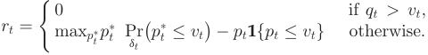

In the first branch (as qt > vt), if the reserve price and thus the posted price are higher than the market value, there is no regret. This is because under such a circumstance, no matter whether the adversary knows the market value in advance or the data broker does not, there is definitely no deal and zero revenue. Let’s consider Q1 in Example 1: if the reserve price q1 ¼ 1 is higher than the market value v1 ¼ 0:8, then the posted price p1 > q1 ¼ 1 must be higher than v1 ¼ 0:8, implying that Alice certainly rejects p1. In the second branch (as qt � vt), p� tistheadversary’soptimal posted price to maximize its expected revenue in round t, where the expectation is taken over dt. When dt is omitted, the adversary will just post the market value if the reserve price is no more than the market value (i.e., qt � p� t¼ vt), 

and rt will change to 

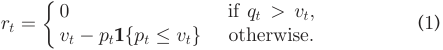

At last, considering the sequential queries can be chosen adversarially (e.g., by other competitive data brokers or malicious data consumers), our design goal is to minimize the total worst-case regret accumulated over T rounds. 

### 2.3 Design Principles 

We overview our pricing framework and illustrate its key principles. We first consider the deterministic linear market value model, where f is a linear function, parameterized by a weight vector u� 2 Rn . In other words, the market value of the query Qt is vt ¼ xtT u� . We then consider extensions to the uncertain setting and non-linear models. 

We start with a special case of the linear model, where each feature vector xt is one-dimensional (i.e., n ¼ 1). For example, the single feature can be the total privacy compensation or the reserve price qt, and the weight u� denotes some fixed but unknown revenue-to-cost ratio. We note that to minimize the regret in pricing the query Qt, the data broker needs to have a good estimation of its market value vt, which can be equivalently converted to gaining a good knowledge of the observable feature xt’s market value, namely u� . We let Kt denote the data broker’s knowledge set of u� in round t. In addition, the initial knowledge set K1 can be an interval ½‘; u� for some ‘;u 2 R. Moreover, after round t, if the posted price pt is rejected (resp., accepted), the data broker will update its knowledge set Kt to Ktþ1 ¼ Kt Tfu 2 Rjpt � xtT ug (resp., Ktþ1 ¼ Kt Tfu 2 Rjpt � xtT ug). Now, the key problem for the data broker is how to set the posted price pt. In fact, the knowledge set Kt can impose a lower bound <u>p</u> ~~t~~ ¼ minu2Kt xtT u and an upper bound p�t ¼ maxu2Kt xtT u on estimating the market value vt and thus on the posted price pt, while the reserve price qt imposes the other lower bound on the posted price pt. If the posted price pt is maxðqt; <u>p</u> ~~t~~ Þ, the data broker can sell the query Qt with the highest probability. However, in the worst case, where qt � <u>p</u> ~~t~~ , this deal will not refine the knowledge set (i.e., Ktþ1 ¼ Kt) and thus cannot benefit the following rounds. We call such a price maxðqt; <u>p</u> ~~t~~ Þ a conservative price. On the other hand, as shown in Fig. 2a, inspired by bisection, we define the larger value of the reserve price and the middle <u>p</u> ~~<u>t</u>~~ þp�t price (i.e., maxðqt; 2~~Þ~~)asanexploratoryprice.Intheworst 

Authorized licensed use limited to: ON Semiconductor Inc. Downloaded on December 20,2022 at 02:32:26 UTC from IEEE Xplore.  Restrictions apply. 

IEEE TRANSACTIONS ON KNOWLEDGE AND DATA ENGINEERING, VOL. 34, NO. 4, APRIL 2022 

1932 

case, the feedback from posting this price can narrow down the knowledge set Kt by most and thus can benefit the following rounds most. Of course, compared with the conservative price, the exploratory price would suffer a higher risk of no sale or losing the current revenue. We note that both the conservative price and the exploratory price have adequately exploited the experience from the previous rounds (i.e., the latest knowledge set Kt), and the difference is that these two types of posted prices give distinct biases to the immediate rewards (exploitation) and the future rewards (exploration). Accompanied with the key problem of setting posted prices, another problem is when the data broker should choose which price. Our strategy is to measure the size of the knowledge set Kt (e.g., the width of interval in the one-dimensional case). If it exceeds some threshold, the data broker chooses the exploratory price to further improve its knowledge set; otherwise, its knowledge set is near optimal, and the data broker chooses the conservative price. In our real design, we use p�t � <u>p</u> ~~t~~ to capture the size of Kt and let �> 0 denote the threshold. 

We next take Example 1 as a running instance of our onedimensional design. We set the revenue-to-cost ratio u� ¼ 1:4, set Bob’s initial knowledge set K1 ¼ ½1; 2�, and set � ¼ 0:07. In round 1, given the feature of Q1 (i.e., x1 ¼ q1 ¼ 1), Bob computes the lower bound and the upper bound on estimating the market value, namely, <u>p</u> ~~t~~ ¼ 1 � 1 ¼ 1 and p�t ¼ 1 � 2 ¼ 2. Thus, the conservative price is maxð1; 1Þ ¼ 1, and the exploratory price is maxð1; <u>1þ2 2</u>Þ ¼ 1:5. Consideringp�t � <u>p</u> ~~t~~ ¼ 1 > �, Bob posts the exploratory price pt ¼ 1:5, which is higher than the market value v1 ¼ 1 � 1:4 ¼ 1:4 and is rejected by Alice. Bob has a regret of r1 ¼ 1:4, but narrows its knowledge set K1 to K2 ¼ ½1; 1:5Þ, significantly benefiting the following T � 1 rounds. Assume that Bob posted the conservative price 1, which is lower than v1 and would be accepted by Alice. Bob would have a lower regret of 1:4 � 1 ¼ 0:4, but cannot refine its knowledge set to benefit the following rounds. 

We further consider the general linear model with multiple features (i.e., n � 2). The holistic process is the same. The difference lies in the concrete form of the knowledge set Kt. In the one-dimensional case, Kt is an interval, while the minimum and maximum possible market values (i.e., <u>pt</u> and p�t) can be efficiently computed from Kt. However, when extended to the multi-dimensional case, we assume that the initial knowledge set is K1 ¼ fu 2 Rn j‘i � ui � ui; ‘i; ui 2 Rg. After each round, the knowledge set is updated by adding a linear inequality. Thus, the knowledge set Kt can be viewed as a set of linear inequalities, the cardinality of which is nondecreasing with the number of rounds t. To post a price in round t, it suffices to solve two linear programs under Kt, which is quite time-consuming and can be computationally infeasible in online mode. Therefore, we turn to borrowing some key principles from the celebrated ellipsoid method for solving online linear programs, which was first proposed by Khachiyan in 1979 [27]. The key idea is to replace the raw knowledge set Kt, viewed as a polytope in geometry, with the ellipsoid Et of the minimum volume that contains Kt. Et is called the Lowner-John ellipsoid of the convex body€ Kt. By leveraging the property that every ellipsoid is an image of the unit ball under a bijective affine transformation [28], the data broker can efficiently determine the posted price and further update its knowledge set in each round, requiring 

only a few matrix-vector and vector-vector multiplications. Fig. 2b gives an illustration of the exploratory posted price in the two-dimensional case. 

### Algorithm 1. An Online Pricing Mechanism for Personal Data Markets 

Input: A1 ¼ R2 In�n, c1 ¼ 0n�1, an uncertainty parameter f **f** i f **f** i f **f** i f **f** i f **f** i f **f** i ffi d ¼ p2log Cslog T , a threshold �. Output: The posted price pt in each round t 2 ½T �. 1 for t ¼ 1; 2; . . . ; T do 

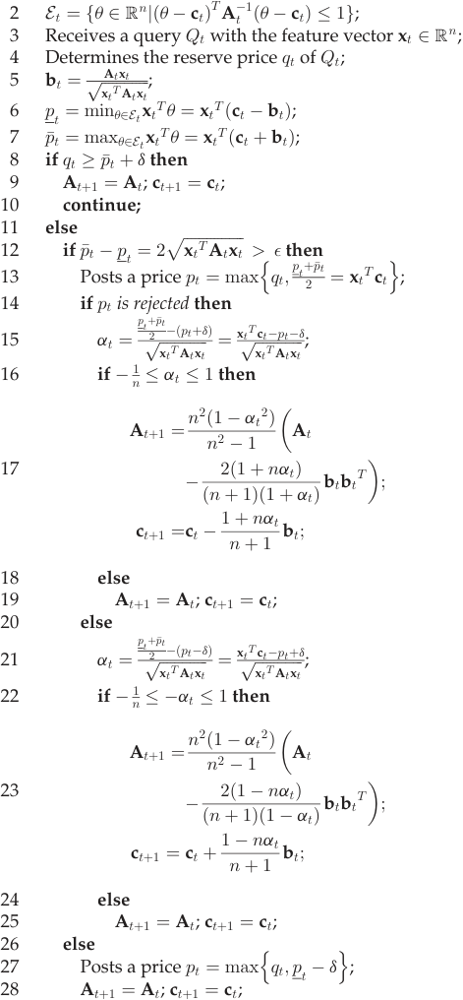

We finally consider the uncertain setting and non-linear models. First, for tractability, we make a common assumption on the randomness dt in the market value vt, where the distribution of dt belongs to subGaussian. We thus bound the absolute value of any dt in all T rounds by d with probability near 1. We regard d as a “buffer” in posting the price and updating the knowledge set, which can circumvent the 

Authorized licensed use limited to: ON Semiconductor Inc. Downloaded on December 20,2022 at 02:32:26 UTC from IEEE Xplore.  Restrictions apply. 

NIU ET AL.: ONLINE PRICING WITH RESERVE PRICE CONSTRAINT FOR PERSONAL DATA MARKETS 

1933 

randomness dt in each round. Second, we mainly investigate four classic non-linear models in market value estimation, whose pattern is first applying an inner feature mapping to the feature vector, then performing dot product with the weight vector, and finally applying an outer non-decreasing and continuous function. By still focusing on the discovery of the weight vector rather than the inner and outer non-linear functions, we can extend our pricing mechanism to support this class of non-linear market value models. 

## 3 FUNDAMENTAL DESIGN UNDER LINEAR MARKET VALUE MODEL 

In this section, we propose an ellipsoid-based pricing mechanism under the deterministic linear model and then extend it to tolerate uncertainty. We also analyze the time and space complexities as well as the worst-case cumulative regret. 

### 3.1 Ellipsoid-Based Pricing Mechanism 

As an appetizer, we first briefly review the definition of an ellipsoid and some of its key properties. 

Definition 1. E � Rn is an ellipsoid, if there exists a vector c 2 Rn and a positive definite matrix A 2 Rn�n such that 

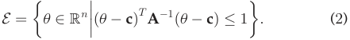

Intuitively, c represents the center of the ellipsoid E, while A portrays its shape. In particular, there are some useful connections between the geometric properties of E and the algebraic properties of A. We let giðAÞ > 0 denote the ith largest eigenvalue of A. Then, the ith widest axis (resp., its width) of the ellipsoidf **f** i f **f** i f **f** i f **f** i f **f** i f **f** E corresponds to the ith eigenvector (resp., 2pgiðAÞ). In addition, the volume of the ellipsoid E, denoted as V ðEÞ, depends only on the eigenvalues of A f **f** i f **f** i f **f** i f **f** i f **f** i f **f** i f **f** i f **f** i f **f** i f **f** i f **f** i f **f** and the dimension n. Specifically, V ðEÞ ¼ VnqQi2½n�g iðAÞ ; where Vn is the volume of the unit ball in Rn and is a constant that hinges only on n. 

We now present the ellipsoid-based posted price mechanism with the reserve price constraint for online personal data markets in Algorithm 1 (omitting the uncertainty parameter d here, also called “the version with reserve price” in our evaluation part). We recall that the initial knowledge set of the data broker about the weight vector u� is K1 ¼ fu 2 Rn j‘i � ui � ui; ‘i; ui 2 Rg. Wef **f** i f **f** i f **f** i f **f** i fchoose **f** i f **f** i f **f** i f **f** i f **f** i f **f** i f **f** i f **f** i f **f** i fa **f** i f **f** i f **f** i fball **f** i f **f** i f **f** i **f** centered at the origin with radius R ¼ qPi2½n�maxð‘i 2; ui2Þ to enclose K1. This ball can serve as the initial ellipsoid E1, where A1 ¼ R2 In�n and c1 ¼ 0n�1 (Input). In what follows, we focus on a concrete round t. 

The data broker receives a query Qt with the feature vector xt from a data consumer. Without loss of generality, we assume that 8t 2 ½T �; kxtk � S for some S � 1. Then, the data broker virtually computes the total privacy compensation allocated to the data owners as the reserve price qt, which imposes a strict lower bound on the posted price pt. Based on the knowledge set Et, the data broker can elicit that the market value of the query Qt falls into a certain interval, namely, vt ¼ xtT u� 2 ½p ~~t~~ ; �pt� (Lines 5–7). If the reserve price is no less than the maximum possible market value, implying that the posted price should be no less than the market value, namely, 

pt � qt � p�t � vt, the query Qt cannot be sold (Lines 8–10); otherwise, the data broker judges whether the difference between the maximum and minimum possible market values (i.e., p�t � <u>p</u> ~~t~~ ) exceeds a threshold �. If yes, the data broker posts the exploratory price (Lines 12–13); otherwise, it posts the conservative price (Lines 26–27). In fact, the posted price places a cut on the ellipsoid Et and splits it into two parts, where the cutting hyperplane is fu 2 Rn jpt ¼ xtT ug. In addition, the data broker can compute a parameter at to locate the position of the cut (Line 15 or 21). Formally, at is interpreted as the signed distance from the center ct to the cutting hyperplane, measured in the space Rn endowed with the ellipsoidal norm k �kAt�1 . For example, if the posted price is the middle price (i.e., <u>ptþp�t</u> pt ¼ 2 ¼ xtT ct), the center ct is on the cutting hyperplane, and at ¼ 0. Moreover, according to the feedback from the data consumer, the data broker can decide to retain which side of the ellipsoid Et and update to its Lowner-John€ ellipsoid Etþ1 by computing the new shape Atþ1 and center ctþ1 (Lines 14– 25). In particular, Grotschel€ et al. [28] have offered the formulas of Atþ1 and ctþ1, when the remaining part of Et is contained in the halfspace like fu 2 Rn jpt � xtT ug. This corresponds to the rejection branch (Lines 14–19). By the symmetry of ellipsoid, we can obtain the formulas in the acceptance branch (Lines 20–25). Furthermore, if the remaining part after a cut is exactly half of the ellipsoid Et, we call the cut a central cut; if the remaining part is less than half, we call it a deep cut; and if the remaining part is more than half, we call it a shallow cut. Last, it is worth noting that the data broker is prohibited from refining the ellipsoid with the conservative price (Line 28). The reason is that �pt � <u>pt essentially probes the ellipsoid’s width along the</u> direction given by the feature vector xt (Please see Fig. 2b for an intuition.), which is very small (� �) when posting the conservative price. Suppose the data broker is allowed to cut along this direction. By adversarially setting the reserve prices, the width of ellipsoid along this direction can shrink successively, while the widths along the other directions can expand exponentially, which can result in OðT Þ worst-case cumulative regret. Details about the adversarial example and its regret analysis are reserved in our technical report [29]. 

We finally discuss a special case by executing the above pricing mechanism without the reserve price constraint (omitting both d and qt in Algorithm 1, also called “the pure version” in our evaluation part). First, the exploratory <u>p</u> ~~<u>t</u>~~ þp�t posted price takes the middle price 2 and poses a central cut over the ellipsoid Et. Second, the conservative posted price takes the minimum possible market value <u>pt, which is</u> definitely no more than the real market value vt and must be accepted by the data consumer. In addition, the conservative posted price does not refine Et and incurs a shallow cut. In a nutshell, there is no deep cut in this special case. 

### 3.2 Incorporating Uncertainty 

We extend our online pricing mechanism under the deterministic linear model to the uncertain setting. We make an assumption on the random variable dt in the market value model. We assume that the distribution of dt is s-subGaussian, i.e., there exists a constant C 2 R such that 

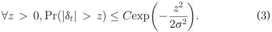

Authorized licensed use limited to: ON Semiconductor Inc. Downloaded on December 20,2022 at 02:32:26 UTC from IEEE Xplore.  Restrictions apply. 

IEEE TRANSACTIONS ON KNOWLEDGE AND DATA ENGINEERING, VOL. 34, NO. 4, APRIL 2022 

1934 

This is a common assumption widely used in modeling uncertainty [30], [31]. In particular, many celebrated probability distributions, including normal distribution, uniform distribution, Rademacher distribution, and bounded random variables are subGaussian. For example, normal distribution is s-subGaussian for its standard deviation s and for f **f** i f **f** i f **f** i f **f** i f **f** i f **f** i ffi C ¼ 2 [30]. By assigning a value d ¼ p2log Cslog T to the variable z in Equation (3), we obtain 

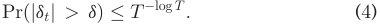

We further apply Boole’s inequality to the above inequality for all t 2 ½T � and derive 

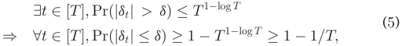

where the last inequality holds for T � 8. 

From Equation (5), we can draw that in each round t, the randomness dt in the market value vt is bounded by d in absolute value with probability at least 1 � 1=T . Therefore, when posting the price and updating the knowledge set, we let the data broker introduce a “buffer” of size d to circumvent the randomness dt. Specifically, if the data broker posts the price pt and observes a rejection, it can no longer infer that pt � xtT u� . Instead, it should infer that pt � vt ¼ xtT u� � dt � xtT u� � d. In a similar way, if the data broker observes an acceptance, it will infer that pt � vt ¼ xtT u� þ dt � xtT u� þ d rather than pt � xtT u� . Intuitively, in the case of rejection (resp., acceptance), the data broker imagines that it had posted pt þ d (resp., pt � d). We call pt þ d (resp., pt � d) the effective posted price in the case of rejection (resp., acceptance). 

We now present the robust pricing mechanism in Algorithm 1 (called “the version with reserve price and uncertainty” in our evaluation part). For conciseness, we illustrate the differences after introducing uncertainty. First, in Lines 8–10, the condition for a certain no deal changes into qt � p�t þ d. Only under this condition, the posted price must be no less than the market value, since pt � qt � p�t þ d � vt ¼ xtT u� þ dt. Second, in Lines 15 and 21, we use the effective exploratory prices to compute the positions of the cutting hyperplanes. In particular, due to the uncertainty in the market value, if the data broker posts the same price, the feedback from the data consumer can result in a smaller refinement of the knowledge set. We provide Fig. 2c for a visual comparison with Fig. 2b. Third, in Line 27, the conservative posted price, involving <u>p</u> ~~t~~ , decreases by d to keep its high acceptance ratio. 

We finally investigate Algorithm 1 without the reserve price constraint, denoted as Algorithm 1* (also called “the version with uncertainty” in our evaluation part). First, the <u>p</u> ~~<u>t</u>~~ þp�t exploratory posted price is the middle price 2~~.~~The effective <u>p</u> ~~<u>t</u>~~ þp�t exploratory price used in refining the ellipsoid is 2 þ d <u>ptþp�t</u> (resp., 2 � d) in the case of rejection (resp., acceptance), andf **f** i f **f** i f **f** i f **f** i f **f** i f **f** i f **f** i ffiffi the corresponding position parameter at is �d=pxtT Atxt f **f** i f **f** i f **f** i f **f** i f **f** i f **f** i f **f** i f **f** (resp., d=pxtT Atxt). As d > 0, the effective exploratory prices will refine the ellipsoid less than half. Second, the conservative posted price is <u>p</u> ~~t~~ � d and can be either rejected or accepted. Here, the rejection case happens when the market value is outside the interval <u>½pt �</u> d; �pt þ d� and has probability no more than 1=T by Equation (5). In addition, the conservative price keeps the ellipsoid unchanged. Jointly considering 

two types of posted prices, we can find that Algorithm 1* only has shallow cuts. 

3.3 Performance Analysis We analyze the time and space complexities, and the worstcase cumulative regret of Algorithm 1. 

### 3.3.1 Time and Space Complexities 

Considering the data broker needs to run the posted price mechanism online, Algorithm 1 should be quite efficient. We analyze single-round time and space complexities. First, the computation overhead of the data broker in round t mainly comes from two parts: (1) determining the posted price pt, which roughly consumes 2 matrix-vector and 3 vector-vector multiplications; and (2) updating the shape and the center of the ellipsoid, which roughly consumes 1 vector-vector multiplication in the worst case. Thus, the time complexity is Oðn2 Þ. Second, the memory overhead of the data broker is mainly caused by maintaining the knowledge set Et, or alternatively, the shape and the center of the ellipsoid, which requires 1 n � n matrix and 1 n � 1 vector, respectively. Hence, the space complexity is Oðn2 Þ. 

### 3.3.2 Worst-Case Cumulative Regret 

We analyze the worst-case cumulative regret of Algorithm 1, which is Oðmaxðn2 log ðT=nÞ; n3 log ðT=nÞ=T ÞÞ under the low uncertain setting d ¼ Oðn=T Þ, namely, Theorem 1. We first prove that the existence of reserve price cannot increase the regret of a posted price mechanism in single round (Lemma 1). Thus, we can use Algorithm 1 without the reserve price constraint, namely, Algorithm 1*, as a springboard. In particular, to get an upper bound on the cumulative regret of Algorithm 1, we need to derive an upper bound on the number of rounds where the exploratory prices are posted, denoted as Te. We derive this upper bound in a roundabout way: we first obtain the upper bound in Algorithm 1* (Lemma 5) and further prove that it still holds in Algorithm 1 by reduction and analyzing the impact of reserve price (Lemma 6). We elicit Lemma 5 in a squeezing manner, particularly, through constructing an upper bound and a lower bound on the final volume of the ellipsoid. For the upper bound, we adopt a core technique in proving the convergence of the traditional ellipsoid method: the ratio between the volumes of an ellipsoid and the Lowner-John€ ellipsoid after a cut has an upper bound (Lemma 2) [28]. Regarding the lower bound, we resort to the formula for computing an ellipsoid’s volume by multiplying all the eigenvalues of its shape matrix. Thus, we can find a lower bound on the volume, by constructing a lower bound on the smallest eigenvalue (Lemmas 3 and 4). We present the detailed lemmas and theorem as follows, while reserving the proofs of Lemmas 3, 4, and 5 in our technical report [29]. 

Lemma 1. The existence of reserve price cannot increase the regret of a posted price mechanism in single round. 

- Proof. For round t, we still let vt denote the market value and let qt denote the reserve price. We introduce p0 tas the pure posted price and still let pt denote the posted price with the reserve price constraint, where pt ¼ maxðqt; p0 tÞ. We can express the regret of the posted price mechanism 

Authorized licensed use limited to: ON Semiconductor Inc. Downloaded on December 20,2022 at 02:32:26 UTC from IEEE Xplore.  Restrictions apply. 

NIU ET AL.: ONLINE PRICING WITH RESERVE PRICE CONSTRAINT FOR PERSONAL DATA MARKETS 

1935 

without reserve price in round t as 

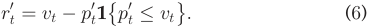

After introducing the reserve price constraint, the regret changes to rt given in Equation (1). We now prove rt � r0 t in two complementary cases: qt > vt and qt � vt. Case 1 (qt > vt): We can derive that rt ¼ 0 � r0 t. Case 2 (qt � vt): We can derive that 

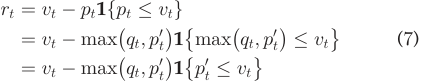

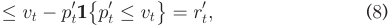

where Equation (7) follows from that under the antecedent qt � vt, the conditional statement fmaxðqt; p0 tÞ �vt, qt � vt and p0 t�vtg can be simplified to p0 t�vt. Addition- ally, the inequality in Equation (8) follows from the maximum function and takes equal sign when qt � p0 t. 

Jointly considering two cases, we complete the proof.tu 

Lemma 2. Let Etþ1 denote the Lowner-John€ ellipsoid obtained after a cut over the ellipsoid Et with the position parameter at. If at 2 ½�1=n; 0�, then VVð ðEEtþtÞ1Þ�exp �� <u>ð1þ5nnatÞ</u>2 <u>�:</u> 

- Lemma 3. In Algorithm 1* (� � 4nd), there exists t 2 R such that gnðAtÞ � t�2 ; xtT Atxt > �2 =4 ) gnðAtþ1Þ � gnðAtÞ. In addition, t ¼ 400n12 S4is a feasible solution. 

Lemma 4. For any round t in Algorithm 1* (� � 4nd) where the n2 <u>ð1�atÞ</u>2 exploratory price is posted, gnðAtþ1Þ � ðnþ1Þ2gn ðAt Þ. 

We interpret the intuitions behind Lemmas 3 and 4. Lemma 3 says that if the smallest eigenvalue is below some threshold (i.e., t�2 ), it can no longer decrease. Lemma 4 says that in each round, the smallest eigenvalue cannot decrease n2 <u>ð1�atÞ</u>2 sharply, to its at most. Therefore, the smallest eigenðnþ1Þ2 n2 <u>ð1�atÞ</u>2 value is bounded below by t�2 ðnþ1Þ2~~.~~Intermsofgeome- try, these two lemmas follow from that the difference �pt � <u>pt</u> monitors the width of the ellipsoid along the direction given by the feature vector xt, and if it is below the threshold �, the data broker will post the conservative price rather than the exploratory price to avoid shortening the width along this direction. Hence, the smallest eigenvalue, having a correspondence with the width of the ellipsoid’s narrowest axis, cannot become too small. 

By combining all above three lemmas, we can derive an upper bound on Te in Algorithm 1*. 

- Lemma 5. Algorithm 1* (� � 4nd) chooses the exploratory prices in at most 20n2 log ð20RS2 ðn þ 1Þ=�Þ rounds. 

We restate Lemma 5 for Algorithm 1, by analyzing the impact of the reserve price constraint on Te. 

- Lemma 6. Algorithm 1 (� � 4nd) chooses the exploratory prices in at most 20n2 log ð20RS2 ðn þ 1Þ=�Þ rounds. 

- Proof. For conciseness, we here focus only on the rejection branch of Algorithm 1. The analysis of the acceptance branch can be derived by the symmetry of ellipsoid. We 

recall that if the reserve price qt is introduced in round t, <u>p</u> ~~<u>t</u>~~ þp�t the exploratory posted price is pt ¼ maxðqt; 2~~Þ~~,the effective exploratory price is pt þ d in the rejection case, and its position parameterf **f** i f **f** i f **f** i f **f** i f **f** i f **f** i f **f** i ffiffi can be computed via at ¼ <u>ptþp�t</u> ~~ð~~ 2 �ðpt þ dÞÞ=pxtT Atxt (Algorithm 1, Line 15). We now prove Lemma 6 in two complementary cases: <u>ptþp�t</u> Case 1 ~~ð~~ 2 � qtÞ: The posted price is the middle price <u>ptþp�t</u> (i.e., pt ¼ 2). Algorithm 1 degenerates to Algorithm 1*, and Lemma 6 holds from Lemma 5. 

<u>p</u> ~~<u>t</u>~~ þp�t Case 2 ðqt > 2Þ:Thepostedpriceisthereserve price (i.e., pt ¼ qt). Given the reserve price is rejected, we can draw that the reserve price is higher than the market value (i.e., pt ¼ qt > vt), which further implies rt ¼ 0 from Equation (1). Suppose the data broker does not use the reserve price to refine the ellipsoid in this round. The analysis of Algorithm 1 can be reduced to analyzing Algorithm 1* with the total number of rounds T � 1 plus one dummy round inserted in the tth round. Considering Lemma 5 does not rely on the total number of rounds, Te � 20n2 log ð20RS2 ðn þ 1Þ=�Þ still holds in Algorithm 1. However, in Algorithm 1 (Lines 14–19), the data broker needs to cut the ellipsoid using the effective exploratory price (i.e., qt þ d here). We thus need to analyze the impact of such a cut on Te. Following the guidelines in proving Lemma 5, to prove Lemma 6, it suffices to prove that this cut cannot increase the upper bound on the final volume of the ellipsoid, and meanwhile, cannot decrease the lower bound. First, the effective exploratory price imposes a cut over the ellipsoid and thus cannot increase the final volume together with the upper bound on the final volume. Second, the lower bound on the smallest eigenvalue of the final ellipsoid’s shape matrix n2 <u>ð1�atÞ</u>2 (i.e., t�2 ðnþ1Þ2~~)~~takes itsminimumatat¼ 0.Thiscorre- sponds to the lower bound on the ellipsoid’s final volume used in proving Lemma 5. Additionally, a negative at can increase the lower bound. Thus, the effective exploratory price qt þ d here, holding a negative at ¼ f **f** i f **f** i f **f** i f **f** i f **f** i f **f** i f **f** i f **f** f **f** i f **f** i f **f** i f **f** i f **f** i f **f** i f **f** i ffiffi <u>p</u> ~~<u>t</u>~~ þp�t ð 2 �ðqt þ dÞÞ=pxtT Atxt < �d=pxtT Atxt < 0, cannot decrease the lower bound on the final volume. By summarizing two cases, we complete the proof. tu We finally obtain Theorem 1 as follows. 

- Theorem 1. If d ¼ Oðn=T Þ, then the worst-case cumulative regret of Algorithm 1 is Oðmaxðn2 log ðT=nÞ; n3 log ðT=nÞ=T ÞÞ. 

- Proof. First, as we illustrated below Equation (5): in each round t, the absolute value of the random variable dt has probability at most 1=T outside d. Thus, the cumulative regret incurred by removing the weight vector u� from the knowledge set is at most maxxt;u� xtT u� T=T ¼ RS. 

   - Second, we analyze the cumulative regret due to the 

   - posted prices. In round t, the regret incurred by posting the exploratory (resp., conservative) price can be bounded above by �pt þ d (resp., ðp�t þ dÞ �ðpt � dÞ), which can be further bounded above by RS þ d (resp., � þ 2d). Thus, the cumulative regret is no more than TeðRSþ dÞ þ ðT � TeÞð� þ 2dÞ. When d ¼ Oðn=T Þ, Te takes its upper bound 20n2 log ð20RS2 ðn þ 1Þ=�Þ from Lemma 6, and � is set to maxðn2 =T; 4ndÞ ¼ Oðn2 =T Þ, the worst-case 

Authorized licensed use limited to: ON Semiconductor Inc. Downloaded on December 20,2022 at 02:32:26 UTC from IEEE Xplore.  Restrictions apply. 

IEEE TRANSACTIONS ON KNOWLEDGE AND DATA ENGINEERING, VOL. 34, NO. 4, APRIL 2022 

1936 

cumulative regret incurred by the posted prices is Oðmaxðn2 log ðT=nÞ; n3 log ðT=nÞ=T ÞÞ. 

By adding two parts, the worst-case cumulative regret of Algorithm 1 is Oðmaxðn2 log ðT=nÞ; n3 log ðT=nÞ=T ÞÞ. tu 

## 4 EXTENSIONS 

In this section, we extend the proposed pricing mechanism under the fundamental linear model to support some common non-linear models. We also discuss how to support several other similar application scenarios. 

### 4.1 Supporting Non-Linear Market Value Models 

We mainly investigate four kinds of non-linear models commonly used in measuring market values. The first two are the log-log and log-linear models in hedonic pricing from real estate and property studies [22], [23], which can be formalized as log vt ¼P i2½n�log ðxt;iÞu i�andlog vt¼ xtTu�,respectively. Here, xt;i and u� idenote the ith elements of the feature vector xt and the weight vector u� , respectively. The other two models are the logistic model [32], [33] and the kernelized model [34] in online advertising, which can be formalized as vt ¼ 1=ð1 þ expðxtT u� ÞÞ and vt ¼Pt k� ¼1 1Kðxt; xkÞu k�,respec- tively. Here, Kð�; �Þ is a Mercer kernel operator. 

We can further observe that the above four non-linear models can be unified to a general class of non-linear models vt ¼ gðfðxtÞT u� Þ. Here, g : R 7! R is a non-decreasing and continuous function. For example, in the two hedonic pricing models, g is the natural exponential function; in the logistic model, g is the logistic sigmoid function; and in the kernelized model, g is the identity function. Additionally, f : Rn 7! Rm represents a feature mapping of the original feature vector xt and intends to capture non-linear correlations/dependencies among the different features of xt and the different feature vectors within t rounds. For example, in the log-log model, f denotes applying the natural logarithm function to each element of xt; in the kernelized model, m ¼ t � 1, and f stands for the kernel function K; and in the other two models, f denotes the identity map. Furthermore, we note that both g and f are public knowledge, and only the weight vector u� is unknown. Therefore, by regarding the domain of u� as the knowledge set to be refined, our proposed pricing mechanism under the linear model can still apply to the above class of non-linear models. Specifically, fðxtÞ now functions as the new feature vector, and the threshold � is used to control p�t � <u>pt,</u> which denotes the difference between the maximum and minimum possible values of fðxtÞT u, where u belongs to the data broker’s knowledge set. In addition, the data broker will post the price gðptÞ rather than the original pt. Due to the limitation of space, the worst-case regret analysis of the adapted Algorithm 1 under the above class of non-linear models is put into our technical report [29]. 

### 4.2 Supporting Other Application Scenarios 

We first summarize the characteristics of the pricing problem in online personal data markets. We then point out some other similar application scenarios in practice and further illustrate how to support them with our proposed pricing mechanism under different market value models. 

In personal data markets, the data broker is the seller, and each data consumer is a buyer. The sequential queries, as the products to be sold, have three atypical characteristics: (1) Customization: The queries, requested by different data consumers, are highly differentiated; (2) Existence of reserve price: The total privacy compensation, allocated to the underlying data owners, serves as the reserve price of a query; and (3) Timeliness: If no deal occurs in a round, the query will vanish, generating regret for the data broker. 

Several other products in practice share one or more characteristics listed above, which implies that our proposed pricing mechanism for personal data markets can be extended to support these scenarios. One example is the hospitality service on booking platforms (e.g., Airbnb, Wimdu, and Workaway). A tourist can raise some requirements on his/her desirable accommodation, such as location, the numbers of bedrooms and bathrooms, amenities, reviews, historical occupancy rate, and so on. Meanwhile, the host of the house can set a minimum/reserve price for the accommodation. If the house is not rented out at a certain date, it may cause regret for both the host and the booking platform. We note that the host, the booking platform, and the tourist play similar roles to the data owner, the data broker, and the data consumer in data markets, respectively. In addition, the market value of the accommodation can be well interpreted by the linear or log-linear model [23]. Another example is the online advertising on web publishers. We consider a novel scenario, where the impressions are traded through posting prices rather than the ad auctions already adopted by Internet giants (e.g., Google, Microsoft, Facebook, and Alibaba). In particular, an advertiser can customize its/his/her need of an impression (e.g., position and target audience). If the impression is not sold within a given time frame, it will generate regret for the web publisher. We note that the web visitors who generate impressions, the web publisher, and the advertiser play similar roles to the data owners, the data broker, and the data consumer in data markets, respectively. In addition, the market value of an impression is normally measured by its click-through rate (CTR), which can be effectively captured by the logistic [32], [33] or kernelized model [34]. 

In conclusion, our proposed pricing mechanism is not just limited to online personal data markets and can also support other similar application scenarios. 

## 5 EVALUATION RESULTS 

In this section, we present the evaluation results of our pricing mechanism from practical regret and overhead. 

We use three real-world datasets, including MovieLens 20M dataset [35], Airbnb listings in U.S. major cities [36], and Avazu mobile ad click dataset [37], to evaluate our pricing mechanism over noisy linear queries, accommodation rentals, and impressions under the linear, log-linear, and logistic market value models, respectively. First, the MovieLens dataset contains 20,000,263 ratings of 27,278 movies made by 138,493 users. Second, the Airbnb dataset provides 74,111 booking records in 6 U.S. cities (e.g., New York and Los Angeles). Each record contains a 

Authorized licensed use limited to: ON Semiconductor Inc. Downloaded on December 20,2022 at 02:32:26 UTC from IEEE Xplore.  Restrictions apply. 

NIU ET AL.: ONLINE PRICING WITH RESERVE PRICE CONSTRAINT FOR PERSONAL DATA MARKETS 

1937 

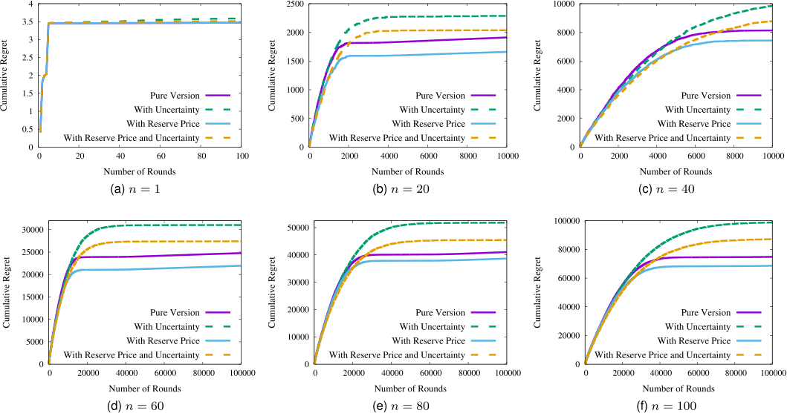

Fig. 3. Cumulative regrets with varying dimensions of feature vector in pricing of noisy linear query. 

user id, the logarithmic lodging price, house type, location, amenities, host response rate, cancellation policy, and so on. Third, the Avazu dataset comprises 10 days of click-through data, in total 404,289,670 ad displaying samples. Each sample covers information of an ad and the corresponding mobile user (e.g., the ad id, click or nonclick reaction, position, device id, device ip, and internet access type). 

### 5.1 Pricing of Noisy Linear Query 

We first introduce our setup details for trading noisy linear queries, the workflow of which has been briefly introduced in Example 1. On the one hand, we regard the MovieLens users, who contributed the ratings, as the data owners in data markets. We adopt the differential privacy-based privacy leakage quantification mechanism and the tanh-based privacy compensation functions from [9] for each data owner. On the other hand, we simulate the noisy linear queries from online data consumers. To validate the adaptability of our pricing mechanism, the parameters of each linear query are randomly drawn either from a multivariate normal distribution with zero mean vector and identity covariance matrix or from a uniform distribution within the interval ½�1; 1�. Meanwhile, the variance of Laplace noise added to the true answer is randomly selected from f10k jk 2 Z; jkj � 4g. For each noisy linear query Qt, we compute the privacy compensations of all data owners and then generate an n-dimensional feature vector with the aggregation technique: we first sort the privacy compensations, then evenly divide them into n partitions, and finally sum the privacy compensations falling into a certain partition, thereby obtaining a feature. For the sake of normalization, we scale 

each feature vector such that its L2 norm is 1 (i.e., 8t 2 ½T �; kxtk ¼ 1 and S ¼ 1). Additionally, we set the reserve price of a query to be the total privacy compensation (i.e., qt ¼P i2½n�xt;ihere).Innature,theL2normof the weight vector for deriving qt is pfn **f** i ffi. Moreover, we draw the weight vector u� for modeling the market values of queries in a similar way to sample the query’s parameters. The differencef **f** i f **f** i **f** is that we furtherf **f** i f **f** i **f** scale u� such that its L2 norm is p2n (i.e., ku� k ¼ p2n). This guarantees that the market value of each query vt ¼ xtT u� is no less than its reserve price qt with a high probability. Furthermore, we set the data broker’s initial knowledge set of u� to E1 ¼ fu 2 Rn jkuk � 2pfn **f** i ffig, geometrically, the ball centered at the origin with radius R ¼ 2pfn **f** i ffi. 

In Fig. 3, we plot the cumulative regrets of four versions of our pricing mechanism under the linear model, including the pure version (omitting the reserve price qt and the uncertainty parameter d in Algorithm 1), the version with uncertainty (Algorithm 1*), the version with reserve price (omitting d in Algorithm 1), and the version with reserve price and uncertainty (Algorithm 1). Here, the dimension of feature vector n first takes 1 and then increases from 20 to 100 with a step of 20. In addition, d is fixed at 0.01, which is in the pre-analyzed order of Oðn=T Þ for n ¼ 1, but is much larger than Oðn=T Þ for n 6¼ 1. Moreover, in each round t, the randomness dt in the market value vt is drawn from the normal distribution with mean 0 and standard deviation f **f** i f **f** i f **f** i f **f** i f **f** i f **f** s ¼ d=ðp2log 2log T Þ. Furthermore, the threshold � is set to n2 =T . As a complement to Fig. 3, Table 1 lists some precise statistic information about the version with reserve price, where the market value column can work as a baseline for relatively measuring the levels of uncertainty (particularly, in the magnitude of 0.1 percent of the market value) and regret. 

Authorized licensed use limited to: ON Semiconductor Inc. Downloaded on December 20,2022 at 02:32:26 UTC from IEEE Xplore.  Restrictions apply. 

IEEE TRANSACTIONS ON KNOWLEDGE AND DATA ENGINEERING, VOL. 34, NO. 4, APRIL 2022 

1938 

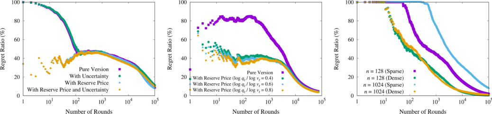

Fig. 4. Regret ratios in pricings of noisy linear query, accommodation rental, and impression. 

We first observe Fig. 3 holistically. We can see that under a specific version, the cumulative regret after a certain number of rounds increases with the dimension n. The reason is that as n grows, the data broker needs to post exploratory prices in more rounds to obtain a good knowledge of the weight vector u� , thus accumulating more regret. This conforms to our theoretic regret analysis. 

We then observe the one-dimensional case in Fig. 3a and the multi-dimensional cases from Figs. 3b, 3c, 3d, 3e, and 3f more carefully. We start with the one-dimensional case. From Fig. 3a, we can see that the introduction of the reserve price constraint has no effect on the pure version of our pricing mechanism. When n ¼ 1, the reserve price and the mar-f **f** ket value of each query are constants 1 and p2, respectively. In addition, the data broker’s initial knowledge of the market value is the interval ½0; 2�. Thus, in the first round, no matter the data broker considers or ignores the reserve price 1, it posts the exploratory price 1, which is lessf **f** than the market value p2 and is accepted by the data consumer. After this round, the interval is refined to ½1; 2�, which indicates that the reserve price 1 can no longer affect the posted prices. From Fig. 3a, we can also see that the introduction of low uncertainty will slightly increase the cumulative regrets in the pure version and the version with reserve price. 

We next focus on the multi-dimensional cases. Once again, we examine how the reserve price constraint can affect our posted price mechanism. We can find that the incorporation of reserve price can dramatically reduce the cumulative regret. In particular, when n ¼ 20 and the number of rounds t is 104 , the version with reserve price (resp., the version with reserve price and uncertainty) reduces 13.16 percent (resp., 10.92 percent) of the cumulative regret than the pure version (resp., the version with 

TABLE 1 

Statistics Over Pricing of Noisy Linear Query Per Pound Under the Version With Reserve Price 

|n|T|Market Value|Reserve Price|Posted Price|Regret|
|---|---|---|---|---|---|
|1|102|1.414|1|1.409 (0.045)|0.035 (0.202)|
|20|104|�3.874 (1.278)|3.388 (0.776)|3.685 (1.631)|0.166 (0.824)|
|40|104|5.246 (1.616)|4.739 (1.188)|5.254 (1.614)|0.743 (1.933)|
|60|105|7.098 (1.910)|5.733 (1.491)|7.089 (1.912)|0.220 (1.257)|
|80|105|7.266 (2.046)|6.531 (1.761)|7.243 (2.091)|0.387 (1.690)|
|100|105|8.824 (2.235)|7.221 (1.985)|8.820 (2.242)|0.686 (2.461)|

*The entry is stored in the format: mean (standard deviation). 

uncertainty). We further examine the impact of uncertainty. We can see that the existence of uncertainty accumulates more regret, especially when t is large. This is because in the case of a large t, the data broker already has a good knowledge of the weight vector u� and posts the conservative price with a high probability. In addition, we recall that to circumvent uncertainty, the conservative price, involving the minimum possible market value <u>p</u> ~~t~~ , decreases by d to keep its acceptance ratio, which can generate a higher regret. 

We finally provide an intuition of the regret level of our pricing mechanism. We introduce a metric, called regret ratio, defined as the ratio between the cumulative regret and the cumulative market value, namely,Pt k¼1rk= Pt k¼1vk at the end of t rounds. For example, in Table 1, we can divide the mean values in the regret column by those in the market value column and obtain the regret ratios of the version with reserve price for different n’s at the end of T rounds. Coupled with Fig. 3f, which depicts the cumulative regrets of four versions for n ¼ 100 at the end of different rounds, Fig. 4a further plots the regret ratios. 

One key observation from Fig. 4a is that when the number of rounds t is small, the regret ratio of the version with reserve price (resp., the version with reserve price and uncertainty) is much lower than that of the pure version (resp., the version with uncertainty). This reflects a critical functionality of reserve price: it can mitigate the cold-start problem in a posted price mechanism. More specifically, in the beginning, the data broker holds a broad knowledge set of the weight vector u� , and thus the estimation of a query’s market value is coarse, which implies a high regret ratio. However, with the help of reserve price, the data broker can improve the market value estimation, through imposing an additional lower bound and refining the knowledge set more quickly. The mitigation of cold start can be a factor underlying our aforementioned observation that the reserve price constraint reduces the cumulative regret. 

The second key observation from Fig. 4a is that as t grows, the difference between the regret ratios of the versions with and without reserve price shrinks. In addition, when t is very large, the regret ratios of all four versions are very low. In particular, at the end of T ¼ 105 rounds, the regret ratios of the pure version, the version with uncertainty, the version with reserve price, and the version with reserve price and uncertainty are 8.48, 11.19, 7.77, and 9.87 percent, respectively. The reason is that after enough 

Authorized licensed use limited to: ON Semiconductor Inc. Downloaded on December 20,2022 at 02:32:26 UTC from IEEE Xplore.  Restrictions apply. 

NIU ET AL.: ONLINE PRICING WITH RESERVE PRICE CONSTRAINT FOR PERSONAL DATA MARKETS 

1939 

rounds, the data broker will have a good estimation of any query’s market value, and the effect of reserve price on the posted price diminishes. An extreme example happens in the one-dimensional case presented above, where after the first round, the reserve price has already been excluded from the estimated interval. At last, we provide a riskaverse baseline, which consistently posts the reserve price in each round, for the versions involving the reserve price constraint. The regret ratio of such a baseline is 18.16 percent. Compared with this baseline, our pricing mechanism can further reduce 57.19 percent (resp., 45.64 percent) of the regret ratio in the version with reserve price (resp., the version with reserve price and uncertainty). 

These results demonstrate that our pricing mechanism under the fundamental linear model can indeed reduce the practical regret of the data broker in online data markets. 

### 5.2 Pricing of Accommodation Rental 

We first describe how to preprocess the Airbnb dataset and then present the setup details for pricing accommodation rentals under the log-linear model. First, to obtain the feature vector of each booking record, we process the categorical features with the pandas library in Python, which can handle the missing values and return an integer array of codes for all categories. In addition, we add some interaction features to enhance model capacity. The final dimension of each feature vector n is 55. Second, to obtain the weight vector u� in modeling the market values of accommodations, we regard the logarithmic lodging prices as target variables in supervised learning and then apply linear regression to learn the coefficients of different features, which play the role of u� here. Specifically, the mean squared error (MSE) over the test set, which occupies 20 percent of the Airbnb dataset, is 0.226. Third, to investigate how different settings of reserve price can affect the posted price mechanism, we vary the ratio between the natural logarithms of reserve price and market value (i.e., log qt=log vt). Fourth, when computing the regret ratios, we use the real rather than the logarithmic posted prices and market values. Fig. 4b depicts the regret ratios of the pure version of our pricing mechanism under the log-linear model, as well as the version with reserve price where log qt=log vt ranges from 0.4, to 0.6, and to 0.8. 

From Fig. 4b, we can see that when the reserve price is set to be closer to the market value, the regret ratio decreases, especially when the number of rounds t is small. In other words, as the reserve price approaches the market value, its impact on mitigating the cold-start problem in a posted price mechanism is more evident. We can also see from Fig. 4b that at the end of T ¼ 74; 111 rounds, the regret ratios are very low. In particular, the regret ratios of the pure version and the version with reserve price where log qt=log vt ¼ 0:4; 0:6; and 0.8, are 4.57, 4.01, 3.83, and 3.79 percent, respectively. We still consider the risk-averse baseline, where the reserve price is posted in each round, for comparison. The regret ratios of this baseline are 23.40, 17.00, and 9.33 percent in the version with reserve price where log qt=log vt = 0.4, 0.6, and 0.8, respectively. Compared with this baseline, our pricing mechanism can further 

reduce 82.88, 77.46, and 59.39 percent of the regret ratios when log qt=log vt = 0.4, 0.6, and 0.8, respectively. 

The above fine-grained evaluation results provide a deeper understanding of the reserve price’s role in reducing the practical regret of a posted price mechanism. In addition, our proposed pricing mechanism significantly outperforms the baseline which merely exploits the reserve price. 

### 5.3 Pricing of Impression in Advertising 

We first introduce data preprocessing and setup for pricing impressions under the logistic model. First, to handle the categorical data fields in ad displaying samples, we use one-hot encoding with the hashing trick, where the dimension of the feature vector n serves as the modulus after hashing. Second, we regard the click/non-click states as target variables, further apply Follow The Proximally Regularized Leader (FTRL-Proximal)-based logistic regression (which has been deployed at Google’s advertising platform [33]), thereby obtaining the weight vector u� for capturing CTRs. In particular, FTRL-Proximal is an online learning algorithm with per-coordinate learning rates and L1; L2 regularizations, and it can preserve excellent performance and sparsity. When testing over the samples in the last two days, the logistic loss is 0.420 (resp., 0.406) for n ¼ 128 (resp., n ¼ 1024). Additionally, the learnt weight vector u� is quite sparse. Specifically, the number of nonzero elements in u� is 21 (resp., 23) for n ¼ 128 (resp., n ¼ 1024). In what follows, we investigate two different cases to validate the feasibility of our pricing mechanism over both sparse and dense feature vectors. In the sparse case, all the features are kept no matter whether their corresponding weights are zero or not. In the dense case, the features are omitted if their corresponding weights are zero. 

In Fig. 4c, we plot the regret ratios of the pure version of our pricing mechanism in both sparse and dense cases for n ¼ 128 and n ¼ 1024. We can observe from Fig. 4c that the regret ratio in the sparse case decreases more slowly than that in the dense case, especially when the number of rounds t is smaller than 103 . This outcome stems from that the starting rounds are mainly dedicated to eliminating those zero elements in the weight vector, which implies a larger regret ratio in the beginning. This reason can also account for the phenomenon that in the sparse case, the regret ratio for n ¼ 1024 decreases more slowly than that for n ¼ 128. Even so, after 105 rounds, the regret ratios are 2.02 and 0.41 percent (resp., 8.04 and 0.89 percent) for n ¼ 128 (resp., n ¼ 1024) in the sparse and dense cases, respectively. 

These evaluation results reveal that our pricing mechanism performs well over both sparse and dense feature vectors. By further combining with the pricing of accommodation rental, we can conclude that our pricing mechanism has a good extensibility to non-linear market value models. 

### 5.4 Details on Implementation and Overhead 

We implemented our pricing mechanism in Python 2.7.15. The running environment is a Broadwell-E workstation with 64-bit Ubuntu 16.04.5 OS. In particular, the processor is Intel(R) Core(TM) i7-6900K with 8 cores, the base 

Authorized licensed use limited to: ON Semiconductor Inc. Downloaded on December 20,2022 at 02:32:26 UTC from IEEE Xplore.  Restrictions apply. 

IEEE TRANSACTIONS ON KNOWLEDGE AND DATA ENGINEERING, VOL. 34, NO. 4, APRIL 2022 

1940 

frequency is 3.20 GHz, the memory size is 64 GB, and the cache size is 20 MB. Our source code is online available from [38]. 

We report the computation and memory overhead of three use cases: (1) for the pricing of noisy linear query under the version with reserve price, when n ¼ 100, the latency of the data broker in determining the posted price and updating its knowledge set is 0.115 ms per query. In addition, the memory overhead is 151 MB; (2) for the pricing of accommodation rental under the version with reserve price where log qt=log vt ¼ 0:6, the latency is 0.019 ms per booking request, and the memory overhead is 105 MB; and (3) for the pricing of impression, when n ¼ 1024, the latency is 3.509 ms (resp., 0.024 ms) per ad displaying sample in the sparse (resp., dense) case. Additionally, the memory overhead is 106 MB (resp., 75 MB) in the sparse (resp., dense) case. 

In a nutshell, our pricing mechanism has a light load under both linear and non-linear models. It can be employed to dynamically price the products with customization, existence of reserve price, and timeliness properties. 

## 6 RELATED WORK 

In this section, we briefly review related work. 

### 6.1 Data Market Design 

An explosive demand for sharing data contributes to growing interest in data market design. We here focus only on the design of pricing mechanisms. We direct interested readers to the comprehensive surveys [39], [40], [41] and the vision papers [7], [42] for more perspectives. For example, Fernandez et al. [42] provided a vision for the design and implementation of data markets mainly from data sharing, discovery, and integration. 

First regards general (insensitive) data trading. The researchers from the database community (e.g., Koutris et al. [11], [12], [13], [14], Lin and Kifer [15]) mainly focused on arbitrage freeness in pricing queries over the relational databases. The existence of arbitrage means that the data consumer can buy a query with a lower price than the marked price through combining a bundle of other cheaper queries. Thus, the data broker needs to rule out arbitrage opportunities to preserve its revenue. Stahl et al. surveyed several empirical pricing strategies in practical data markets [43]. Their later work [44], [45], [46] introduced data quality as a criterion of pricing and allowed the data consumers to suggest their own prices. Chawla et al. [47] considered the static revenue maximization problem with the prior knowledge of the data consumers’ queries and valuations, while leaving the online setting as an open problem. They mainly adopted two static pricing strategies, called uniform bundle pricing and item pricing. Agarwal et al. [48] proposed a combinatorial auction mechanism to trade data for machine learning tasks. 

Specific to personal data trading, the researchers routinely adopted the cost-plus pricing strategy, where the data broker first compensates each data owner for its privacy leakage and then scales up the total privacy compensation to determine the price of query for the data consumer. Different researchers investigated distinct types of queries from the data consumers. Ghosh and Roth [10] considered single counting query. The follow- 

up work by Li et al. [9] further extended to multiple noisy linear queries. We considered the queries of noisy aggregate statistics over private correlated data [16], [17]. Hynes et al. [49] investigated model training requests. Chen et al. [50] studied how to price a trained model with different levels of noise perturbation, by an analogy to the queries over personal data. They also considered how to statically optimize the data broker’s revenue under the assumption that the error demands and corresponding valuations of the data consumers are known. 

Our work advances previous data trading work in that: (1) we model the unknown valuations and demands of the data consumers, namely, the market values of customized and highly differentiated queries, which were assumed as priors in previous work; (2) we consider a posted price setting and incorporate the response of either an acceptance or a rejection from each data consumer in sequence, whereas the previous work normally used a marked price setting and ignored the responses; and (3) we optimize the data broker’s cumulative revenue in an online and dynamic manner, whereas previous work optimized in a static way. 

### 6.2 Contextual Dynamic Pricing 

The dynamic pricing problem has been extensively studied in diverse contexts. The pioneering work by Kleinberg and Leighton [51] considered markets for identical products and designed several optimal posted pricing strategies. However, the products in practical markets (e.g., online commerce and advertising) tend to differ from each other. This further motivated the emergence of contextual pricing, where the seller intends to sell a sequence of highly differentiated products, posts a price for each product, and then observes whether the buyer accepts or not. More specifically, each product is represented by a feature vector for differentiation, while its market value is typically assumed to linear in the feature vector. The researchers thus turned to online learning the weight vector from feedbacks and further converted this task to a multi-dimensional binary search problem. Amin et al. [34] first proposed a stochastic gradient descent (SGD)-based solution, which can attain OðT2=3 Þ strategic regret by ignoring logarithmic terms. However, their solution requires an independent and identically distributed (i.i.d.) assumption on the feature vectors. Cohen et al. [19] abandoned this strict requirement. They approximated the polytopeshaped knowledge set with ellipsoid and provided Oðn2 log T Þ worst-case cumulative regret, which is essentially the pure version of our pricing mechanism. Lobel et al. [20] further reduced regret to Oðnlog T Þ by projecting and cylindrifying the polytope. Leme et al. [21] borrowed a key concept from geometric probability, called the intrinsic volumes of a convex body, and achieved a regret guarantee of Oðn4 log log ðnT ÞÞ. The key principle behind this line of work is to identify the centroid of the knowledge set or its projection/transformation, such that each exploratory posted price can roughly impose a central cut in terms of different measures (e.g., volume, surface area, and width). In addition, although the most recent two work optimized the regret, they are too computationally complex to be deployed in practical online markets. 

Authorized licensed use limited to: ON Semiconductor Inc. Downloaded on December 20,2022 at 02:32:26 UTC from IEEE Xplore.  Restrictions apply. 

NIU ET AL.: ONLINE PRICING WITH RESERVE PRICE CONSTRAINT FOR PERSONAL DATA MARKETS 

1941 

It is still worth noting that the contextual dynamic pricing mechanisms significantly differ from the classical cutting-plane or localization algorithms in the field of convex optimization (e.g., the original ellipsoid method [27] and the analytic center cutting-plane method [52]). In particular, the purpose of a cutting-plane method is to find a point in a convex set for optimizing a preset objective function. In contrast, the goal of a contextual dynamic pricing mechanism is to minimize the cumulative regret during the process of locating a preset point (i.e., the weight vector here). Furthermore, under contextual dynamic pricing, the direction of each cut is fixed by the feature vector of a product requested by a buyer, while the seller can choose only the position of the cut through posting a certain price. This setting distinguishes contextual dynamic pricing from a majority of ellipsoidbased designs [53], [54], [55], which allow the seller to control the direction of each cut. In fact, the contextual dynamic pricing problem can also be modeled into contextual multi-armed bandit (MAB), where the arms/ actions to be exploited and explored are the domain of the weight vector. However, given the domain of the weight vector is continuous, we need to apply the discretization technique, which makes the number of bandits extremely large. In addition to inefficiency, since the payoff/regret function is piecewise and highly asymmetric, this sort of solutions can be oracle-based (e.g., [56], [57], [58], [59], [60], [61]) and inevitably incurs polynomial rather than logarithmic cumulative regret in the total number of rounds T [20]. 

Our work advances contextual dynamic pricing in that: (1) we, for the first time, incorporate the reserve price constraint; (2) due to the existence of reserve price, we support an arbitrary position of the cut over the ellipsoid-shaped knowledge set, whereas previous designs normally adopted central cuts; and (3) we analyze and verify the impact of reserve price on a posted price mechanism, particularly, mitigating the cold-start problem and thus reducing the cumulative regret. 

## 7 CONCLUSION 

In this paper, we have proposed the first contextual dynamic pricing mechanism with the reserve price constraint, for the data broker to maximize its cumulative revenue in online personal data markets. Our posted price mechanism features the properties of ellipsoid to perform online optimization effectively and efficiently and can support both linear and non-linear market value models, while allowing some uncertainty. We further have illustrated how to support two other similar application scenarios and extensively evaluated all three use cases over three practical datasets. Empirical results have demonstrated the feasibility and extensibility of our pricing mechanism as well as the functionality of the reserve price constraint. 

## ACKNOWLEDGMENTS 

This work was supported in part by Science and Technology Innovation 2030 “New Generation Artificial Intelligence” Major Project No. 2018AAA0100905, in part by China NSF grant No. 61972252, 61972254, 61672348, and 61672353, in 

part by Joint Scientific Research Foundation of the State Education Ministry No. 6141A02033702, in part by the Open Project Program of the State Key Laboratory of Mathematical Engineering and Advanced Computing No. 2018A09, and in part by Alibaba Group through Alibaba Innovation Research Program (AIR). The opinions, findings, conclusions, and recommendations expressed in this paper are those of the authors and do not necessarily reflect the views of the funding agencies or the government. 

## REFERENCES 

- [1] C. Niu, Z. Zheng, F. Wu, S. Tang, and G. Chen, “Online pricing with reserve price constraint for personal data markets,” in Proc. IEEE 36th Int. Conf. Data Eng., 2020, pp. 1978–1981. 

- [2] Factual, 2008. [Online]. Available: https://www.factual.com/ [3] DataSift, 2010. [Online]. Available: https://datasift.com/ [4] Datacoup, 2012. [Online]. Available: https://datacoup.com/ [5] CitizenMe, 2013. [Online]. Available: https://www.citizenme.com/ [6] CoverUs, 2018. [Online]. Available: https://coverus.health/ [7] M. Balazinska, B. Howe, and D. Suciu, “Data markets in the cloud: An opportunity for the database community,” Proc. VLDB Endowment, vol. 4, no. 12, pp. 1482–1485, 2011. 

- [8] A. Roth, “Technical perspective: Pricing information (and its implications),” Commun. ACM, vol. 60, no. 12, 2017, Art. no. 78. 

- [9] C. Li, D. Y. Li, G. Miklau, and D. Suciu, “A theory of pricing private data,” Commun. ACM, vol. 60, no. 12, pp. 79–86, 2017. 

- [10] A. Ghosh and A. Roth, “Selling privacy at auction,” in Proc. ACM Conf. Electron. Commerce, 2011, pp. 199–208. 

- [11] P. Koutris, P. Upadhyaya, M. Balazinska, B. Howe, and D. Suciu, “Query-based data pricing,” in Proc. 31st ACM SIGMOD-SIGACTSIGAI Symp. Princ. Database Syst., 2012, pp. 167–178. 

- [12] P. Koutris, P. Upadhyaya, M. Balazinska, B. Howe, and D. Suciu, “Toward practical query pricing with QueryMarket,” in Proc. ACM SIGMOD Int. Conf. Manage. Data, 2013, pp. 613–624. 

- [13] S. Deep and P. Koutris, “QIRANA: A framework for scalable query pricing,” in Proc. ACM SIGMOD Int. Conf. Manage. Data, 2017, pp. 699–713. 

- [14] S. Deep and P. Koutris, “The design of arbitrage-free data pricing schemes,” in Proc. Int. Conf. Database Theory, 2017, pp. 12:1–12:18. 

- [15] B. Lin and D. Kifer, “On arbitrage-free pricing for general data queries,” Proc. VLDB Endowment, vol. 7, no. 9, pp. 757–768, 2014. 

- [16] C. Niu, Z. Zheng, F. Wu, S. Tang, X. Gao, and G. Chen, “Unlocking the value of privacy: Trading aggregate statistics over private correlated data,” in Proc. ACM SIGKDD Int. Conf. Knowl. Discov. Data Mining, 2018, pp. 2031–2040. 

- [17] C. Niu, Z. Zheng, S. Tang, X. Gao, and F. Wu, “Making big money from small sensors: Trading time-series data under pufferfish privacy,” in Proc. IEEE INFOCOM, 2019, pp. 568–576. 

- [18] S. Shalev-Shwartz , “Online learning and online convex optimization,” Found. Trends Mach. Learn., vol. 4, no. 2, pp. 107–194, 2012. 

- [19] M. C. Cohen, I. Lobel, and R. P. Leme, “Feature-based dynamic pricing,” in Proc. ACM Conf. Electron. Commerce, 2016, Art. no. 817. 

- [20] I. Lobel, R. P. Leme, and A. Vladu, “Multidimensional binary search for contextual decision-making,” in Proc. ACM Conf. Electron. Commerce, 2017, Art. no. 585. 

- [21] R. P. Leme and J. Schneider, “Contextual search via intrinsic volumes,” in Proc. IEEE Annu. Symp. Found. Comput. Sci., 2018, pp. 268–282. 

- [22] S. Malpezzi, “Hedonic pricing models: A selective and applied review,” in Housing Economics and Public Policy. Hoboken, NJ, USA: Wiley, 2002, pp. 67–89. 

- [23] P. Ye et al., “Customized regression model for Airbnb dynamic pricing,” in Proc. ACM SIGKDD Int. Conf. Knowl. Discov. Data Mining, 2018, pp. 932–940. 

- [24] K. B. Monroe, Pricing: Making Profitable Decisions, 3rd ed. New York, NY, USA/Homewood, IL, USA: McGraw-Hill/Irwin, 2003. 

- [25] T. T. Nagle and G. Muller,€ The Strategy and Tactics of Pricing: A Guide to Growing More Profitably, 6th ed. Evanston, IL, USA: Routledge, 2018. 

- [26] C. M. Bishop, Pattern Recognition and Machine Learning. Berlin, Germany: Springer, 2006. 

- [27] L. G. Khachiyan, “A polynomial algorithm in linear programming,” Doklady Akademii Nauk SSSR, vol. 244, pp. 1093–1096, 1979. 

Authorized licensed use limited to: ON Semiconductor Inc. Downloaded on December 20,2022 at 02:32:26 UTC from IEEE Xplore.  Restrictions apply. 

IEEE TRANSACTIONS ON KNOWLEDGE AND DATA ENGINEERING, VOL. 34, NO. 4, APRIL 2022 

1942 

- [28] M. Grotschel, L. Lov€ �asz, and A. Schrijver, Geometric Algorithms and Combinatorial Optimization, vol. 2, 2nd ed. Berlin, Germany: Springer-Verlag, 1993. 

- [29] C. Niu, Z. Zheng, F. Wu, S. Tang, and G. Chen, “Online pricing with reserve price constraint for personal data markets,” CoRR, vol. abs/1911.12598, 2019. [Online]. Available: http://arxiv.org/ abs/1911.12598 

- [30] R. H. Keshavan, A. Montanari, and S. Oh, “Matrix completion from noisy entries,” in Proc. Int. Conf. Neural Inf. Process. Syst., 2009, pp. 952–960. 

- [31] S. Rahman et al., “I’ve seen enough”: Incrementally improving visualizations to support rapid decision making,” Proc. VLDB Endowment, vol. 10, no. 11, pp. 1262–1273, 2017. 

- [32] D. Chakrabarti, D. Agarwal, and V. Josifovski, “Contextual advertising by combining relevance with click feedback,” in Proc. Int. Conf. World Wide Web, 2008, pp. 417–426. 

- [33] H. B. McMahan et al., “Ad click prediction: A view from the trenches,” in Proc. ACM SIGKDD Int. Conf. Knowl. Discov. Data Mining, 2013, pp. 1222–1230. 

- [34] K. Amin, A. Rostamizadeh, and U. Syed, “Repeated contextual auctions with strategic buyers,” in Proc. Int. Conf. Neural Inf. Process. Syst., 2014, pp. 622–630. 

- [35] GroupLens, “MovieLens 20M Dataset,” 2016. [Online]. Available: https://grouplens.org/datasets/movielens/20m/ 

- [36] Airbnb, “Airbnb listings in major us cities,” 2018. [Online]. Available: https://www.kaggle.com/rudymizrahi/airbnb-listings-inmajor-us-cities-deloitte-ml/ 

- [37] Avazu, “Avazu mobile ad click dataset,” 2014. [Online]. Available: https://www.kaggle.com/c/avazu-ctr-prediction/data/ 

- [38] Source code for online personal data markets, 2019. [Online]. Available: https://github.com/NiuChaoyue/Personal-Data-Pricing 

- [39] F. Schomm, F. Stahl, and G. Vossen, “Marketplaces for data: An initial survey,” SIGMOD Rec., vol. 42, no. 1, pp. 15–26, 2013. 

- [40] F. Stahl, F. Schomm, G. Vossen, and L. Vomfell, “A classification framework for data marketplaces,” Vietnam J. Comput. Sci., vol. 3, no. 3, pp. 137–143, 2016. 

- [41] F. Stahl, F. Schomm, L. Vomfell, and G. Vossen, “Marketplaces for digital data: Quo vadis?” Comput. Inf. Sci., vol. 10, no. 4, pp. 22–37, 2017. 

- [42] R. C. Fernandez, P. Subramaniam, and M. J. Franklin, “Data market platforms: Trading data assets to solve data problems [vision paper],” CoRR, vol. abs/2002.01047, 2020. [Online]. Available: https://arxiv.org/abs/2002.01047 

- [43] A. Muschalle, F. Stahl, A. Loser,€ and G. Vossen, “Pricing approaches for data markets,” in Proc. Int. Workshop Bus. Intell. Real-Time Enterprise, 2012, pp. 129–144. 

- [44] F. Stahl and G. Vossen, “Data quality scores for pricing on data marketplaces,” in Proc. Asian Conf. Intell. Inf. Database Syst., 2016, pp. 215–224. 

- [45] F. Stahl and G. Vossen, “Fair knapsack pricing for data marketplaces,” in Proc. East Eur. Conf. Advances Databases Inf. Syst., 2016, pp. 46–59. 

- [46] F. Stahl and G. Vossen, “Name your own price on data marketplaces,” Informatica Lithuanian Acad. Sci., vol. 28, no. 1, pp. 155–180, 2017. 

- [47] S. Chawla, S. Deep, P. Koutris, and Y. Teng, “Revenue maximization for query pricing,” Proc. VLDB Endowment, vol. 13, no. 1, pp. 1–14, 2019. 

- [48] A. Agarwal, M. Dahleh, and T. Sarkar, “A marketplace for data: An algorithmic solution,” in Proc. ACM Conf. Electron. Commerce, 2019, pp. 701–726. 

- [49] N. Hynes, D. Dao, D. Yan, R. Cheng, and D. Song, “A demonstration of sterling: A privacy-preserving data marketplace,” Proc. VLDB Endowment, vol. 11, no. 12, pp. 2086–2089, 2018. 

- [50] L. Chen, P. Koutris, and A. Kumar, “Towards model-based pricing for machine learning in a data marketplace,” in Proc. Int. Conf. Manage. Data, 2019, pp. 1535–1552. 

- [51] R. D. Kleinberg and F. T. Leighton, “The value of knowing a demand curve: Bounds on regret for online posted-price auctions,” in Proc. IEEE Annu. Symp. Found. Comput. Sci., 2003, pp. 594–605. 

- [52] J. L. Goffin and J. P. Vial, “On the computation of weighted analytic centers and dual ellipsoids with the projective algorithm,” Math. Program., vol. 60, no. 1–3, pp. 81–92, 1993. 

- [53] O. Toubia, D. I. Simester, J. R. Hauser, and E. Dahan, “Fast polyhedral adaptive conjoint estimation,” Marketing Sci., vol. 22, no. 3, pp. 273–303, 2003. 

- [54] O. Toubia, J. R. Hauser, and D. I. Simester, “Polyhedral methods for adaptive choice-based conjoint analysis,” J. Marketing Res., vol. 41, no. 1, pp. 116–131, 2004. 

- [55] A. Roth, J. Ullman, and Z. S. Wu, “Watch and learn: Optimizing from revealed preferences feedback,” in Proc. Annu. ACM Symp. Theory Comput., 2016, pp. 949–962. 

- [56] P. Auer, N. Cesa-Bianchi, Y. Freund, and R. E. Schapire, “The nonstochastic multiarmed bandit problem,” SIAM J. Comput., vol. 32, no. 1, pp. 48–77, 2002. 

- [57] A. Agarwal, D. J. Hsu, S. Kale, J. Langford, L. Li, and R. E. Schapire, “Taming the monster: A fast and simple algorithm for contextual bandits,” in Proc. Int. Conf. Mach. Learn., 2014, pp. 1638–1646. 

- [58] V. Syrgkanis, A. Krishnamurthy, and R. E. Schapire, “Efficient algorithms for adversarial contextual learning,” in Proc. Int. Conf. Mach. Learn., 2016, pp. 2159–2168. 

- [59] V. Syrgkanis, H. Luo, A. Krishnamurthy, and R. E. Schapire, “Improved regret bounds for oracle-based adversarial contextual bandits,” in Proc. Int. Conf. Neural Inf. Process. Syst., 2016, pp. 3135–3143. 

- [60] M. Dud�ık, N. Haghtalab, H. Luo, R. E. Schapire, V. Syrgkanis, and J. W. Vaughan, “Oracle-efficient online learning and auction design,” in Prof. IEEE Annu. Symp. Found. Comput. Sci., 2017, pp. 528–539. 

- [61] D. J. Foster and A. Krishnamurthy, “Contextual bandits with surrogate losses: Margin bounds and efficient algorithms,” in Proc. Int. Conf. Neural Inf. Process. Syst., 2018, pp. 2626–2637. 

Chaoyue Niu (Student Member, IEEE) is currently working toward the PhD degree in the Department of Computer Science and Engineering, Shanghai Jiao Tong University, Shanghai, P. R. China. His research interests include personal data sharing/trading, federated learning, security, and privacy. He is a student member of the ACM. 

Zhenzhe Zheng (Member, IEEE) received the PhD degree from the Shanghai Jiao Tong University, Shanghai, P. R. China, in 2018. He is an assistant professor with the Department of Computer Science and Engineering, Shanghai Jiao Tong University, P. R. China. He visited the University of Illinois at Urbana-Champaign (UIUC) as a postdoc advised by professor R. Srikant, from 2018 to 2019. His research interests include algorithmic game theory, resource management in wireless networking, and data center. He is a member of the ACM and CCF. 

Fan Wu (Member, IEEE) received the BS degree in computer science from Nanjing University, Nanjing, China, in 2004, and the PhD degree in computer science and engineering from the State University of New York at Buffalo, Buffalo, New York, in 2009. He is a professor with the Department of Computer Science and Engineering, Shanghai Jiao Tong University. He has visited the University of Illinois at Urbana-Champaign (UIUC) as a postdoc research associate. His research interests include wireless networking 

and mobile computing, data management, algorithmic network economics, and privacy preservation. He has published more than 150 peerreviewed papers in technical journals and conference proceedings. He is a recipient of the first class prize for Natural Science Award of China Ministry of Education, NSFC Excellent Young Scholars Program, ACM China Rising Star Award, CCF-Tencent “Rhinoceros bird” Outstanding Award, and CCF-Intel Young Faculty Researcher Program Award. He has served as an associate editor of the IEEE Transactions on Mobile Computing and the ACM Transactions on Sensor Networks, an area editor of the Elsevier Computer Networks, and as the member of technical program committees of more than 90 academic conferences. For more information, please visit http://www.cs.sjtu.edu.cn/�fwu/. 

Authorized licensed use limited to: ON Semiconductor Inc. Downloaded on December 20,2022 at 02:32:26 UTC from IEEE Xplore.  Restrictions apply. 

NIU ET AL.: ONLINE PRICING WITH RESERVE PRICE CONSTRAINT FOR PERSONAL DATA MARKETS 

1943 

Shaojie Tang (Member, IEEE) received the PhD degree in computer science from the Illinois Institute of Technology, Chicago, Illinois, in 2012. He is currently an assistant professor with the Naveen Jindal School of Management, University of Texas at Dallas. His research interests include social networks, mobile commerce, game theory, e-business, and optimization. He received the Best Paper Awards in ACM MobiHoc 2014 and IEEE MASS 2013. He also received the ACM SIGMobile service award in 2014. He served in various positions (as chairs and TPC members) at numerous conferences, including ACM MobiHoc and IEEE ICNP. He is an editor of the International Journal of Distributed Sensor Networks. 

Guihai Chen (Senior Member, IEEE) received the BS degree from Nanjing University, Nanjing, China, in 1984, the ME degree from Southeast University, Nanjing, China, in 1987, and the PhD degree from the University of Hong Kong, Hong Kong, in 1997. He is a distinguished professor of Shanghai Jiaotong University, China. He had been invited as a visiting professor by many universities including Kyushu Institute of Technology, Japan, in 1998, University of Queensland, Australia, in 2000, and Wayne State University, during September 2001 to August 2003. He has a wide range of research interests with focus on sensor network, peer-to-peer computing, high-performance computer architecture, and combinatorics. He has published more than 200 peer-reviewed papers, and more than 120 of them are in well-archived international journals such as the IEEE Transactions on Parallel and Distributed Systems, the Journal of Parallel and Distributed Computing, the Wireless Network, the Computer Journal, the International Journal of Foundations of Computer Science, and the Performance Evaluation, and also in well-known conference proceedings such as HPCA, MOBIHOC, INFOCOM, ICNP, ICPP, IPDPS, and ICDCS. 

> " For more information on this or any other computing topic, please visit our Digital Library at www.computer.org/csdl. 

Authorized licensed use limited to: ON Semiconductor Inc. Downloaded on December 20,2022 at 02:32:26 UTC from IEEE Xplore.  Restrictions apply. 

