IEEE TRANSACTIONS ON MOBILE COMPUTING, VOL. 14, NO. 6, JUNE 2015 

1123 

# A Strategy-Proof Combinatorial Heterogeneous Channel Auction Framework in Noncooperative Wireless Networks 

Zhenzhe Zheng, Student Member, IEEE, Fan Wu, Member, IEEE, and Guihai Chen, Member, IEEE 

Abstract—Auction is believed to be an effective way to solve or relieve the problem of radio spectrum shortage, by dynamically redistributing idle wireless channels of primary users to secondary users. However, to design a practical channel auction mechanism, we have to consider five challenges, including strategy-proofness, channel spatial reusability, channel heterogeneity, bid diversity, and social welfare maximization. Unfortunately, none of the existing works fully considered the five design challenges. In this paper, we present the first in-depth study on the problem of dynamic channel redistribution jointly considering the five design challenges, and present SMASHER, which is a family of Strategy-proof coMbinatorial Auction mechaniSms for HEterogeneous channel Redistribution. SMASHER contains two strategy-proof auction mechanisms, namely SMASHER-AP and SMASHER-GR. SMASHER-AP is a strategyproof, approximately efficient combinatorial auction mechanism for indivisible channel redistribution. We further consider the case, in which channels can be shared by the users in a paradigm of time-division multiplexing and propose SMASHER-GR, which is a strategy-proof channel allocation and scheduling mechanism. We have extensively evaluated our designs. The evaluation results show that our designs achieve much better performance than existing works. 

Index Terms—Wireless network, channel allocation, combinatorial auction 

Ç 

## 1 INTRODUCTION 

TmentHE lastoftwowirelessdecadescommunicationhave witnessedtechnology.a rapid develop-Unfortunately, naturally limited radio spectrum is becoming a more and more serious bottleneck of the ongoing growth of wireless applications and services. Most of the countries have specific departments to regulate spectrum usage, e.g., Federal Communications Commission (FCC) [1] in the US and Radio Administration Bureau (RAB) in China [2]. They statically allocate spectrum to wireless application service providers on a long term basis for large geographical regions. Such static management leads to low spectrum utilization in the spatial and temporal dimensions. Large chunks of radio spectrum are left idle most of the time at a lot of places, while new wireless applications are starving for the radio spectrum. Therefore, an open and marketbased framework is highly needed to dynamically redistribute the radio spectrum, and thus improve the utilization of the radio spectrum [3]. 

Auctions are the most well-known market-based mechanisms to redistribute resources [4], [5]. Since 1994, FCC has conducted a series of auctions for the licenses of radio spectrum. While FCC auctions target only at large wireless service providers, our focus is on small wireless applications, 

- The authors are with the Department of Computer Science and Engineering, Shanghai Key Laboratory of Scalable Computing and Systems, Shanghai Jiao Tong University, Shanghai, China. E-mail: zhengzhenzhe@sjtu.edu.cn; {fwu, gchen}@cs.sjtu.edu.cn. 

Manuscript received 2 May 2014; revised 21 June 2014; accepted 9 July 2014. Date of publication 28 July 2014; date of current version 1 May 2015. For information on obtaining reprints of this article, please send e-mail to: reprints@ieee.org, and reference the Digital Object Identifier below. Digital Object Identifier no. 10.1109/TMC.2014.2343624 

such as community wireless networks or home wireless networks. 

There exist many challenges in designing a practical channel auction mechanism [11], [12]. We list five major challenges: 

- Strategy-Proofness. In strategy-proof auction mechanisms (please refer to Section 2.1 for the definition), simply submitting truthful channel demands (e.g., valuation of the channels) maximizes each participant’s utility. Since the participants are normally rational and selfish, they always tend to strategically manipulate the auction, if doing so can increase their utilities. Such selfish behavior inevitably hurts the other participants’ utilities. Therefore, it discourages truthfully behaving participants from joining the auction, if strategy-proofness is not guaranteed. 

- Spatial Reusability. Spatial reusability differentiates the wireless channels from conventional goods. Two wireless users can use the same wireless channel simultaneously, if they are well-separated (i.e., out of the interference range of each other). Exploiting spatial reusability can highly improve spectrum utilization. 

- Channel Heterogeneity. The nature of wireless channels makes the goods in the channel auction heterogeneous. The channel heterogeneity comes from both spatial heterogeneity and frequency heterogeneity. On one hand, the availability and quality of a channel vary at different locations. On the other hand, channels with different central frequency may have different propagation and penetration characteristics. 

1536-1233 � 2014 IEEE. Personal use is permitted, but republication/redistribution requires IEEE permission. See http://www.ieee.org/publications_standards/publications/rights/index.html for more information. 

IEEE TRANSACTIONS ON MOBILE COMPUTING, VOL. 14, NO. 6, JUNE 2015 

1124 

TABLE 1 

Comparison with Existing Channel Auction Mechanisms 

|ExistingWorks|Strategy-Proofness|Spatial Reusability|Channel Heterogeneity|Bid Diversity|Social Welfare|
|---|---|---|---|---|---|
|VERITAS [6]|@|**@**|‘|**@**|No Guarantee|
|TRUST [7]|**@**|**@**|‘|‘|No Guarantee|
|SMALL [8]|**@**|**@**|‘|**@**|No Guarantee|
|TAHES [9]|**@**|**@**|**@**|‘|No Guarantee|
|CRWDP [10]|**@**|‘|**@**|‘|Approximately Efficient|
|SMASHER-AP|**@**|**@**|**@**|**@**|i Approximately Efficient|
|SMASHER-GR|**@**|**@**|**@**|**@**|i No Guarantee|

- Bid Diversity. Wireless devices may be equipped with multiple radios, each of which can work on a different channel at the same time. Consequently, a wireless user may request multiple channels, according to her quality of service (QoS) requirement. Buyers have higher opportunities to obtain channels by submitting multiple channel bundles, which makes the channel redistribution more flexible. Therefore, it is necessary to allow users to express diverse demands for channels. 

- Social Welfare. The basic and common objective of auctions is to maximize social welfare, which is the sum of the auction winners’ valuations of the allocated goods (please refer to Section 2.1 for the definition). 

A number of related works (e.g., [6], [7], [8], [9], [10]) exist in the literature. Unfortunately, none of these works fully consider the five design challenges (as shown in Table 1). Some of strategy-proof channel auction mechanisms (e.g., VERITAS [6], TRUST [7], SMALL [8]) consider channel spatial reusability, but only work when the trading channels are homogenous. Two recent works TAHES [9] and CRWDP [10] consider the heterogeneity of channels, but TAHES restricts each buyer to bid for a single channel while CRWDP ignores the spatial reusability of channels. 

In this paper, we conduct an in-depth study on the problem of dynamic channel redistribution jointly considering the five design challenges, and present SMASHER, which is a family of <u>Strategy-proof</u> coMbinatorial <u>Auction</u> mechaniSms for <u>HEterogeneous</u> channel <u>Redistribution.</u> SMASHER contains two distinct auction mechanisms, namely SMASHER-AP and SMASHER-GR. Specifically, SMASHER-AP is a novel combinatorial auction mechanism for indivisible heterogeneous channel redistribution, and achieves both strategy-proofness and approximately efficient social welfare. SMASHER-GR jointly considers channel allocation and scheduling when channels can be shared in a paradigm of time-division multiplexing. We use Table 1 to show the comparison of our designs with closely related works. 

We make the following contributions in this paper: 

- First, we present a general model of combinatorial auction for heterogeneous channel redistribution. The auction model is powerful enough to express channel spatial reusability and heterogeneity, as well as bid diversity. 

- Second, we introduce the concept of virtual channel to capture the conflicts of channel usage among different auction participants. By using virtual channels, 

   - we transform the problem of heterogeneous channel allocation to a classic combinatorial auction. 

- Third, we propose SMASHER-AP, which is a combinatorial auction mechanism for heterogeneous channel redistribution, achieving both strategy-proofness and approximately efficient social welfare. 

- Fourth, we further consider the case, in which channels can be shared in a paradigm of time-division multiplexing, and propose SMASHER-GR, which is a strategy-proof combinatorial auction mechanism for channel allocation and scheduling. 

- Finally, we evaluate the performance of our designs. Our simulation results show that our designs achieve much better performance than closely related works, in terms of social welfare, buyer satisfaction ratio, and channel utilization. 

The rest of this paper is organized as follows. In Section 2, we present the model of combinatorial auction for heterogeneous channel redistribution. In Section 3, we introduce the concept of virtual channel and convert the problem of heterogeneous channel allocation to a classic combinatorial auction. In Section 4, we present the design of SMASHERAP. In Section 5, we propose SMASHER-GR. In Section 6, we report evaluation results. In Section 7, we review related works. In Section 8, we conclude the paper and discuss future works. 

## 2 PRELIMINARIES AND PROBLEM FORMULATION 

In this section, we present the auction model for the problem of heterogeneous channel allocation, and review some important solution concepts. 

### 2.1 Auction Model 

We consider a static scenario, in which there is a primary spectrum user, called “seller”, who wants to lease out her temporarily unused wireless channels, and some secondary users (e.g., WiFi access points), called “buyers”, who want to lease channels to provide services to their customers at certain quality of service. We consider that the channels for leasing are heterogeneous, and thus the buyers have their own preference over the channels due to spatial variance (e.g., background noise, temperature, and landform). Since wireless devices can be equipped with multiple radios, the buyers may request more than one channel according to their requirements of QoS. Considering the diversity of QoS demand and the heterogeneity of channels, we allow the buyers to submit multiple channel requests, among which 

ZHENG ET AL.: A STRATEGY-PROOF COMBINATORIAL HETEROGENEOUS CHANNEL AUCTION FRAMEWORK IN NONCOOPERATIVE WIRELESS... 

1125 

one of the requests can be granted.1 We assume that buyer have uniform valuation over any of her channel requests, because the buyer’s requirement of QoS can be satisfied if one of her requested bundles is allocated. Different from the allocation of traditional goods, wireless channels can be spatially reused, meaning that well-separated buyers can work on the same channel simultaneously, if they do not have interference between each other. 

We model the process of heterogeneous channel redistribution as a sealed-bid combinatorial auction, in which buyers simultaneously submit their demands for channels to a trustworthy auctioneer, such that no buyer can know other participants’ information. The auctioneer makes the decision on channel allocation and the charge to each winner. We denote the set of orthogonal and heterogeneous channels for leasing by C , fc1; c2; . . . ; cmg, and the set of buyers by N , f1; 2; . . . ; ng. We list useful notations in our model of combinatorial channel auction as follows: 

Channel Request Ri: Each buyer i 2 N submits a vector of requested channel bundles 

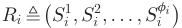

to the auctioneer. Any channel bundle Sil�C; 1 �l �f ican satisfy her QoS. We assume that the request is strict, meaning that the buyer is only interested in winning a whole bundle Silinherrequestvector.Althoughthebuyerican submit a request vector Ri with more than one channel bundle, only one channel bundle can be granted by the auctioneer. We call buyer i, who submits a request vector of fi channel bundles, and is interested in winning one of the bundles, as fi-minded buyer. If fi ¼ 1, then the buyer i is single-minded. Note that our auction model is a generalization of existing models with single-minded buyers (e.g., [9], [10]). The maximum number of submitted channel bundles among all buyers is denoted by F , maxi2Nfi. We denote the channel request vector R~ of all the buyers as 

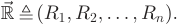

Valuation vi: Each buyer i 2 N has a uniform valuation vi over any requested channel bundles in Ri. Here, vi is the private information of the buyer i. This is also known as type in mechanism design. The buyer valuation has two properties: Free Disposal and Normalization. Free disposal means that for any two subsets of channels S and T , if S � T , then viðSÞ � viðT Þ; while normalization means that við?Þ ¼ 0. We denote the valuation vector V~ of all the buyers as 

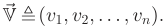

Bid bi: Each buyer i 2 N submits a bid bi to the auctioneer, meaning that if she wins any channel bundle Sil, she would like to pay no more than bi for it. Here, the bid bi may not 

1. We discuss this model in Section 4 and extend to the scenario, in which each buyer can be allocated multiple bundles to reach her QoS in Section 5. 

necessarily be equal to her valuation vi. Let vector~ B represent the bids of all the buyers 

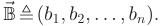

Clearing price pi: The auctioneer charges each winning buyer i 2 N a clearing price pi. The loser in the auction is free of any charge. We use vector 

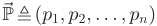

to represent the clearing prices of all the buyers. 

Utility ui: The utility of a buyer i 2 N is defined as the difference between her valuation on the bundle of winning channels and her clearing price pi 

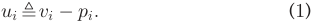

We consider that the buyers are rational and selfish, thus their goals are to maximize their own utilities. In contrast to the buyers, the auctioneer’s objective is to maximize social welfare. Here social welfare is defined as follows. 

Definition 1 (Social Welfare). The social welfare in a channel auction is the sum of winning buyers’ valuations on their allocated bundles of channels. 

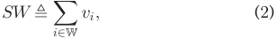

where W is the set of winners. 

In this paper, we assume that buyers do not collude with each other and do not cheat about their channel bundles,2 while leaving these problems to our future works. 

### 2.2 Solution Concepts 

We briefly review the solution concepts used in this paper. A strong solution concept from game theory is dominant strategy. 

Definition 2 (Dominant Strategy [20], [21]). Strategy si is player i’s dominant strategy, if for any strategy s0 i6¼ siand any other player’s strategy profile s�i: 

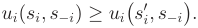

Intuitively, a dominant strategy of a player is a strategy that maximizes her utility, regardless of what strategy profile the other players choose. 

The concept of dominant strategy is the basis of incentivecompatibility, which means that there is no incentive for any player to lie about her private information, and thus revealing truthful information is the dominant strategy for every 

2. When both valuations and channel bundles are private information, buyers will have more power to manipulate the auction market, i.e., they can further improve their utilities by cheating on channel bundles, and our auction model falls into the general combinatorial auctions with multi-parameter domain, which is still an open problem in algorithmic mechanism design [13]. Papers [14], [15] have characterized the truthfulness for mechanisms in multiple parameter domain, and some negative results are demonstrated [16], [17], [18], [19]. 

IEEE TRANSACTIONS ON MOBILE COMPUTING, 

VOL. 14, NO. 6, JUNE 2015 

1126 

player. An accompanying concept is individual-rationality, which means that every player participating in the game expects to gain no less utility than staying outside. We now can introduce the definition of Strategy-Proof Mechanism. 

- Definition 3 (Strategy-Proof Mechanism [22], [23]). A mechanism is strategy-proof when it satisfies both incentive-compatibility and individual-rationality. 

The objective of this work is to design strategy-proof combinatorial auction mechanisms for heterogeneous channel redistribution. 

## 3 COMBINATORIAL CHANNEL AUCTION 

Different from existing works on strategy-proof channel allocation, we introduce a novel concept of virtual channel to represent the conflicts of channel usage among the buyers. By introducing virtual channels, we transform the problem of heterogeneous channel allocation to a classic combinatorial auction, which is computationally intractable. Therefore, we propose strategy-proof and approximately efficient combinatorial auction mechanisms for heterogeneous channel redistribution in the following sections. 

### 3.1 Virtual Channel 

We introduce virtual channel to capture the interference among the buyers on different channels. Specifically, a virtual channel vck i;jdenotesthatthebuyeriandthebuyerj may cause interference between each other on channel ck, and thus they cannot work on channel ck simultaneously. Since virtual channel vck i;jrepresents the exclusive usage of channel ck between the buyer i and j, its quantity is set to 1. When virtual channel vck i;jisaddedtotherequested bundle(s) that contains channel ck from the buyer i and j, at most one of the requests containing channel ck from the two buyers can be granted. Consequently, the exclusive usage of channel ck between the buyer i and j is guaranteed. The heterogeneous channel redistribution problem can be converted to the problem of exclusive virtual channels allocation. We present the definition of virtual channel as follows. 

Definition 4 (Virtual Channel). There is a virtual channel vck i;j,ifthebuyeriandbuyerjarewithintheinterference range of each other on channel ck. 

In most of existing works on channel auction, a single conflict graph is used to represent the interference among buyers [6], [7]. However, in case of heterogeneous channels, each channel may have a distinctive conflict graph. Let Gk , ðOk; EkÞ denote the conflict graph on channel ck, where Ok � N is the set of buyers who can access channel ck, and each edge ði; jÞ 2 Ek represents the interference between the buyer i and j on channel ck. Let G , fGkjck 2 Cg denote the set of conflict graphs. We also denote the maximum degree of all the conflict graphs as d. These conflict graphs can be built by the auctioneer through some measurement methods, e.g., measurement calibrated method [24]. We note that the conflict graphs used in this paper belong to binary interference model, such as the protocol model. The problem of channel redistribution under physical 

interference model is totally different, and please refer to papers [25], [26] for more discussion. 

Since the conflict graph is commonly assumed to be available in wireless networks, we construct the virtual channel from the conflict graph. The process of converting the edges in the conflict graphs to virtual channels with unit quantity is shown by Algorithm 1. We create a virtual channel vck i;j (Line 4), if there is an edge between the buyer i and j in conflict graph Gk, and append vck i;jtotherequestedbundle(s) containing channel ck from the buyer i and j, while remaining the corresponding bid(s) unchanged (Lines 6-11). After adding virtual channels into the channel bundles, we remove the original channels from all updated channel bundles (Line 14). Let VC be the set of virtual channels (Line 5). Let Si0lbe the lth updated channel bundle of buyer i. Since the maximum degree of conflict graphs is d and there are at most m trading channels, we have jSi0lj �d �m;8i 2 N; 1 �l �f i. 

### Algorithm 1. Virtual Channel Generation 

Input: A set of conflict graph G, a vector of channel requests R~ . 

Output: A set of virtual channels VC, a vector of updated requests R~0 . 

1. VC ? ; R~0 R~ ; 

2. foreach Gk ¼ ðOk; EkÞ 2 G do 

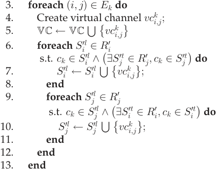

14. Remove the original channels C from updated channel bundles R~0 ; 

15. returnVC and R~0 ; 

We use a simple example in Fig. 1 to explain the concept of virtual channel. In Fig. 1, there are two channels and four buyers. The two conflict graphs show the interference among buyers on two heterogeneous channels c1 and c2. The upper right table shows the buyers’ channel demands. Both single-minded and multi-minded buyers exist in this example. Here, the buyer 2 is a single-minded buyer, and only bids a bundle of channels ðfc1; c2gÞ for 15; the buyer 3 is a multi-minded buyer, and submits three requests, i.e., ðfc1g; fc2g; fc1; c2gÞ, and a uniform valuation 13. After running Algorithm 1, the updated request vectors with virtual channels are shown in the lower right table. Let’s see buyer 2’s updated request as an example. Since both buyer 1 and buyer 2 bid for channel c1 and they interfere with each other on this channel, we add a virtual channel vc1 1;2withunit quantity to buyer 2’s requested bundle. 

ZHENG ET AL.: A STRATEGY-PROOF COMBINATORIAL HETEROGENEOUS CHANNEL AUCTION FRAMEWORK IN NONCOOPERATIVE WIRELESS... 

1127 

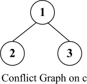

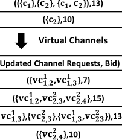

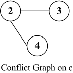

Fig. 1. An example showing the generation of virtual channels. 

### 3.2 Problem Formulation 

Given the virtual channel introduced in the last section, we are ready to transform the problem of heterogenous channel allocation to a classic combinatorial auction. The outcome of the auction is the set of winning buyers and their assigned channel bundles. 

The goods in the combinatorial channel auction are the virtual channels. The quantity of each virtual channel vck i;j2 VCis1.Giventhevectorofrequestswithvirtual channels R~0 and the bid vector~ B, the auctioneer determines the winners and which channel bundles to grant. Let x�i; Si0l � ¼ 1 denote that the channel set Si0lisgrantedtothe buyer i; otherwise, x�i; Si0l � ¼ 0. The process of winner determination can be modeled as a binary program. The objective is to maximize the social welfare. We use bi, instead of vi, because the strategy-proof mechanisms shown in later sections will guarantee that bidding truthfully is the dominant strategy of each buyer i 2 N. Objective: 

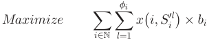

Subject to: 

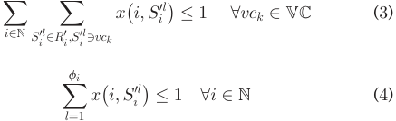

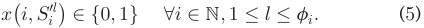

Here constraint (3) indicates the quantity limitation of virtual channel. As the original channels have been removed from the updated channel bundles, we do not have quantity constraints on the original channels. Constraint (4) indicates that each buyer can win at most one bundle of channels out of her submitted requests. Constraint (5) indicates the binary value of the auctioneer’s decision of allocation. 

If the optimal social welfare can be achieved by solving the above binary program, then the celebrated VCG mechanism (named after Vickrey [27], Clark [28], and Groves [29]) 

can be applied to calculate clearing prices that can ensure the strategy-proofness of the auction mechanism. Unfortunately, the above winner determination problem can be proven to NP-hard by reducing from the exact cover problem [30] in polynomial time. Considering the computational intractability of the winner determination problem, we present an alternative solution with greedy channel allocation to achieve approximately efficient social welfare in next section. Furthermore, we integrate the greedy allocation algorithm with a novel pricing mechanism to provide a strategyproof and approximately efficient combinatorial auction mechanism for heterogeneous channel redistribution. 

## 4 EXCLUSIVE CHANNEL REDISTRIBUTION 

We consider the case of indivisible channels, which can only be allocated exclusively to non-interfering buyers, in this section. As shown in Section 3.2, finding the optimal auction decision is computationally intractable. Furthermore, existing works [17], [18] show that it is impossible to design a strategy-proof approximation combinatorial auction mechanism in the general case, even if the goods are not spatially reusable. We assume that buyers have uniform valuation on their multiple channel requests, and present SMASHERAP, which is a strategy-proof and approximately efficient combinatorial auction mechanism for heterogeneous channel redistribution. 

### 4.1 Design of SMASHER-AP 

SMASHER-AP consists of the following three major components: virtual channel generation, winner determination, and clearing price calculation. We briefly describe the design rationale of SMASHER-AP. We first generate virtual channels to capture the interference of channel usage among buyers, and transform the problem of channel redistribution into the exclusive virtual channel allocation. After that, we propose a greedy channel allocation algorithm to determine winning buyers, which leads to a good approximation ratio. Finally, a clearing price calculation scheme based on critical virtual bid is designed to guarantee the economic properties of SMASHER-AP. 

### 4.1.1 Virtual Channel Generation 

The process of virtual channel generation is the same as that of Algorithm 1 shown in Section 3.1, except that we add one more virtual channel vci with unit quantity to each requested bundle of buyer i 2 N. Virtual channel vci is used to ensure that at most one of the requested bundles from the buyer i can be granted. 

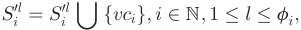

where Si0lisupdatedbundlewithvirtualchannels.Theset of virtual channels is also updated 

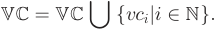

### 4.1.2 Winner Determination 

Before presenting the approximation algorithm for winner determination, we introduce virtual bid. The uniform virtual 

IEEE TRANSACTIONS ON MOBILE COMPUTING, 

VOL. 14, NO. 6, JUNE 2015 

1128 

bid b~ i over any of requested bundles from the buyer i is defined as 

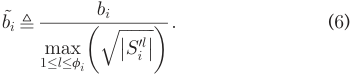

SMASHER-AP sorts all the buyers according to their virtual bids in non-increasing order: 

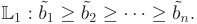

In case of a tie, SMASHER-AP breaks the tie following a bidindependent rule, such as lexicographic order of buyers’ IDs or channel number. Following the order in L1, SMASHERAP greedily grants the smallest channel bundle, in which no virtual channel has already been allocated, to each buyer.3 

Algorithm 2 shows the pseudo-code of above winner determination process. In practice, the number of buyers n is much larger than F, thus the time complexity of Algorithm 2 is Oðn log nÞ. 

### Algorithm 2. Approximation Algorithm for Winner Determination 

Input: Vector of updated channel requests R~0 , vector of bids~ B. 

Output: A pair of sets of winning buyers and allocated bundles of channels ðW; SÞ. 

1. ðW; SÞ ð? ; ? Þ; V ? ; 

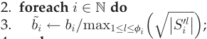

4. end 

5. Sort b~ i in non-increasing order: L1 : b~ 1 � b~ 2 ����� b~ n; 

6. for i ¼ 1 to n do 

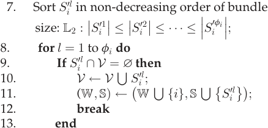

14. end 15. end 16. returnðW; SÞ; 

### 4.1.3 Clearing Price Calculation 

The clearing price is calculated based on critical virtual bid. 

- Definition 5 (Critical Virtual Bid). The critical virtual bid crðiÞ 2 L1 of buyer i 2 N is the minimum virtual bid that the buyer i must exceed to be allocated one of her channel bundles, 

> 3. Actually, we allocate the original channel bundle Siltothewin- ning buyer i, when she is granted the updated channel bundle Si0lin Algorithm 2. 

i.e., if the virtual bid of the buyer i is higher than crðiÞ, she wins the auction; otherwise, she loses. 

We note that according to the definition of critical virtual bid, no matter which channel bundles of buyer i is granted in the auction, the critical virtual bid crðiÞ is always the same. 

The critical virtual bid of buyer i 2 N can be calculated by the following procedure. Given other buyers’ requests and bids �R~0 �i;~B�i �, we greedily select virtual bids by rerunning Algorithm 2 until none of buyer i’s requests can be satisfied. The threshold virtual bid crðiÞ we select finally is regarded as the critical virtual bid of the buyer i. We now show the method of calculating the clearing price of the buyer i by distinguishing two cases: 

- 1) If the buyer i loses in the auction or crðiÞ does not exist (denoted by crðiÞ ¼ 0), then her clearing price is 0. 

- 2) If the buyer i is granted channel bundle S0 iland there exists a critical virtual bid crðiÞ, the clearing price pi of buyer i is set to 

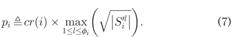

### 4.2 Analysis 

We prove the strategy-proofness and analyze the approximation ratio of SMASHER-AP in this section. 

### 4.2.1 Strategy-Proofness 

- Theorem 1. SMASHER-AP is a strategy-proof combinatorial auction mechanism for heterogeneous indivisible channel redistribution. 

Proof. We first show that buyer i 2 N cannot obtain higher utility by bidding untruthfully. 

We discuss the problem in the following two cases: 

- The buyer i wins bundle S^ i0land gets utility ui�0 when bidding truthfully, i.e., bi ¼ vi. Let S^ i0t6¼S^ i0l be the bundle won by the buyer i, when she cheats the bid, i.e., b0 i6¼ vi. The utility of the buyer i remains the same: 

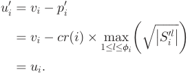

If the buyer i loses the auction when she cheats the bid, her utility is 0, which is not better than that gained when bidding truthfully. 

- The buyer i loses in the auction when bidding truthfully. Then, her utility ui ¼ 0. If she still loses when bidding untruthfully, her utility cannot be changed. We consider the case, in which she cheats the bid b0 i6¼ viandwinsabundleS^ i0t6¼ ?. We denote virtual bid b~ i and b~0 ifor channel bundle S^i0twhenthebuyeribidstruthfullyanduntruth- fully, respectively. Then, we have b~0 i�crðiÞ �b~i, 

ZHENG ET AL.: A STRATEGY-PROOF COMBINATORIAL HETEROGENEOUS CHANNEL AUCTION FRAMEWORK IN NONCOOPERATIVE WIRELESS... 

1129 

because otherwise, she still cannot win any bundle. Her utility now becomes non-positive: 

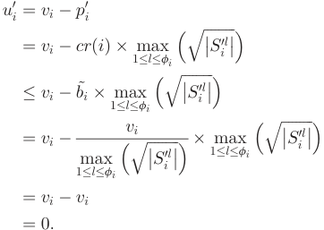

From the above analysis of two cases, we can see that the buyer i cannot increase her utility by bidding any other value than vi, and thus bidding truthfully is a dominant strategy for each buyer. Therefore, SMASHER-AP satisfies incentive compatibility. 

We now prove that SMASHER-AP also satisfies individual rationality. On one hand, buyer i’s utility is zero if she loses in the auction. On the other hand, winning buyer i gets utility: 

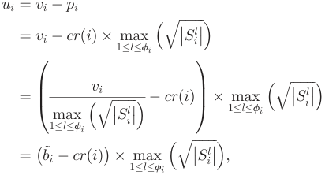

where b~ i is the virtual bid of buyer i, Since the buyer i is a winner, we have b~ i � crðiÞ, and thus ui � 0. Buyer utility is always non-negative, which is not worse than staying outside the auction (i.e., the utility is 0). Therefore, SMASHER-AP satisfies individual rationality. 

Since SMASHER-AP satisfies both incentive compatibility and individual rationality, according to Definition 3, SMASHER-AP is a strategy-proof mechanism. Our claim holds. Since our mechanism belongs to singleparameter mechanism, we can also obtain the property of strategy-proofness by using Myerson’s well known characterization [31]. tu 

### 4.2.2 Approximation Ratio 

We now present the approximation ratio of SMASHER-AP. 

- Theorem 2. The approximation ratio of SMASHER-AP is OðdmÞ, where d is the maximum degree of conflict graphs and m is the number of channels. 

- Proof. Let ðWOPT ; SOPT Þ be the optimal channel allocation, and ðWAPP ; SAPP Þ be the allocation achieved by SMASHER-AP. The social welfare of the optimal solution and SMASHER-AP is Pi2WOPTvi and Pi2WAPPvi, respectively. 

For each buyer i 2 WAPP , we define 

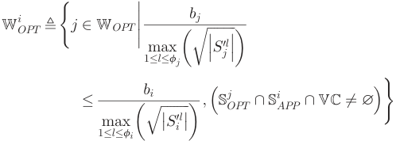

to represent the buyers in WOPT , whose bundles in SOPT cannot be granted in SMASHER-AP because of the existence of i. 

Since every j 2 Wi OPTappears after i in the ordered list L1, we have 

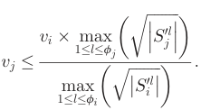

Summing over all j 2 Wi OPT, we can get 

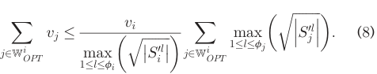

Using the Cauchy-Schwarz inequality, we can bound 

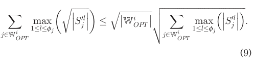

By integrating inequations (8) and (9), we get 

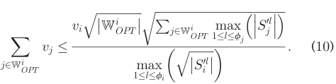

Since ðWOPT ; SOPT Þ is the optimal channel allocation, the channel bundles allocated to any pair of buyers i; j 2 WOPT cannot overlap on any virtual channel: Si OPT\ Sj OPT\ VC ¼ ?. Every bundle allocated to j 2 Wi OPTin the optimal allocation intersects with S APPiat least one virtual channel. Consequently, there are at most max ���Si0l ��� buyers in Wi OPT 1�l�fi 

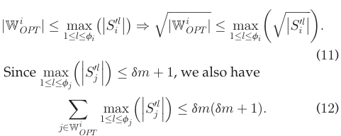

IEEE TRANSACTIONS ON MOBILE COMPUTING, 

VOL. 14, NO. 6, JUNE 2015 

1130 

By integrating inequations (10), (11) and (12), we get 

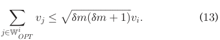

Since WOPT ¼S i2WAPPW OPTi, we finally get 

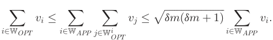

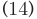

Therefore, the approximation ratio of SMASHER-AP is OðdmÞ. tu 

## 5 CHANNEL REDISTRIBUTION WITH TIME SCHEDULING 

In this section, we consider the scenario, in which the clocks of buyers are synchronized [32] and the radios on buyers’ devices can switch among different channels within very short time [33]. Therefore, a channel can be shared by wireless devices in a paradigm of time-division multiplexing, which is similar to the time-frequency model in [10]. We extend SMASHER-AP to the channel redistribution with time flexibility, and design SMASHER-GR, which is a strategy-proof combinatorial auction mechanism for heterogeneous channel redistribution, jointly considering spatial and temporal channel reusability. 

SMASHER-GR divides the time into a series of slots with a fixed length of duration t. A time slot of a channel can be scheduled to multiple buyers using time-division multiplexing, by which each buyer uses a certain fraction of the slot. In other words, the channel is considered as a kind of divisible goods. During a time slot, buyer i 2 N has a requested data throughput Qi, which can be derived from her subscribers’ QoS. We use vector Q~ to denote the data throughput of all the buyers 

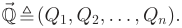

Due to the heterogeneity of channels, different channel bundles may provide different data rates to different buyers. The channel requests from the buyer i can now be expressed as 

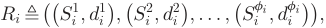

where dl idenotes the data rate achieved by the buyer i if she operates on the channel bundle Sil.Inthismodel,amulti- minded buyer can work on multiple channel bundles sequentially to reach her data throughput requirement Qi in each time slot. Here, we assume that buyers do not cheat on data throughput and data rate, and we will relax these assumptions in our future works.4 

> 4. Similarly, if we relax this assumption, the auction model will fall into the general combinatorial auction with multiple parameter domain, and the deterministic strategy-proof combinatorial auction mechanisms are still unknown for multiple parameters scenarios. 

Let binary variable xi ¼ 1 denote that buyer i can obtain throughput Qi by working on required channel bundles in time duration t; otherwise, xi ¼ 0. We use hl iandtl ito denote the starting time and lasting time of channel bundle Silfrombuyeri,respectively.Buyericangetthroughput dl i�tl iifsheoperatesonbundleS ilfortl itime.Wejointly consider allocation and scheduling algorithm to determine which channel bundles to grant, and when and how long winning buyers can access allocated channel bundles. Let R0 ibetheupdatedchannelrequestswithvirtualchannels for buyer i. We denote the updated request vector R~0 of all the buyers as 

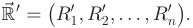

We formalize the process of channel allocation and scheduling as the following mixed-integer nonlinear program (MINLP). Objective: 

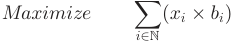

Subject to: 

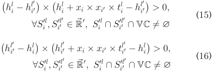

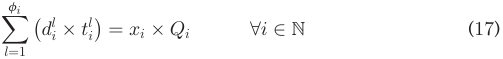

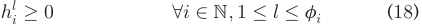

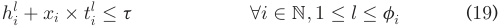

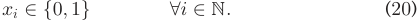

Same as before, the objective is to maximize the social welfare. Constraints (15) and (16) indicate that any two winning channel bundles containing the same virtual channel should be carefully scheduled to avoid interference in the time dimension. Specifically, we use intervals ½hl i; hl iþ tl i� and ½hl i00; hl i00þ tl i00�to denote the working time duration of two allocated channel bundles SilandS il00,respectively.Con- straints (15) and (16) guarantee that these two intervals are non-overlapping. Constraint (17) indicates that the sum of throughput obtained from multiple channel bundles should be equal to the requested throughput of each winning buyer. Constraints (18) and (19) guarantee that the starting time should be larger than 0, and the ending time should be less than t. Constraint (20) shows the binary value of xi. 

The above allocation and scheduling problem is NP-hard [34], and thus is computational intractable. So we follow the design rationale of SMASHER-AP, and design SMASHERGR, including greedy channel allocation, scheduling and pricing calculation, to adapt to channel redistribution with time flexibility. 

ZHENG ET AL.: A STRATEGY-PROOF COMBINATORIAL HETEROGENEOUS CHANNEL AUCTION FRAMEWORK IN NONCOOPERATIVE WIRELESS... 

1131 

### 5.1 Design of SMASHER-GR 

The design rationale of SMASHER-GR is briefly described as follows. SMASHER-GR first generates virtual channels according to the conflict graphs to represent the spatial interference of heterogeneous channels. Then it greedily selects the available and non-overlapping time intervals for winning buyers, considering the channel interference in the time dimension. Finally, SMASHER-GR applies a pricing mechanism to guarantee economic properties. 

SMASHER-GR consists of three parts: virtual channel generation, winner determination and clearing price calculation. 

### 5.1.1 Virtual Channel Generation 

SMASHER-GR generates the virtual channels by running Algorithm 1, described in Section 3.1. Different from SMASHER-AP, SMASHER-GR does not generate virtual channel vci for each buyer i 2 N, because buyer i may be allocated multiple channel bundles to achieve her throughput during a time slot. 

### 5.1.2 Winner Determination 

The winner determination algorithm consists of two parts, i.e., channel allocation and channel bundle scheduling. Before presenting the algorithm, we redefine the virtual bid, considering the different data rates of channel bundles. The virtual bid of the buyer i is 

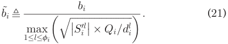

Intuitively, a channel bundle with larger size (jSi0lj) and lon- ger occupation time (Qi=dl i),haslowerprioritytobe granted, because it may lead to more spatial and temporal conflicts with other requests. 

SMASHER-GR sorts all the buyers by their virtual bids in non-increasing order: 

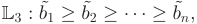

intervals in current space F . Function SchedulingðSi0l; FÞ returns triple tuple ðSchedulable; Hði; lÞ; Tði; lÞÞ, in which the binary variable Schedulable indicates whether there exist non-overlapping time intervals in F for bundle Si0l. If the variable Schedulable is true, Scheduling also returns the starting time Hði; lÞ and lasting time Tði; lÞ for bundle Si0l.5FunctionSchedulingfinally“packs”thetimeinterval ½Hði; lÞ; Hði; lÞ þ Tði; lÞ� into space F . The process of scheduling can be done linearly, then the complexity of Algorithm 3 is Oðn log nÞ. 

Algorithm 3. Greedy Algorithm for Winner Determination and Scheduling. 

- Input: Vector of updated channel requests R~0 , vector of data throughput Q~ , vector of bids~ B, <virtual channel; time> space F . 

- Output: Sets of winning buyers W, allocated bundle of channels S, scheduling matrix ðH; TÞ. 

1. W ? ; S ? ; ðH; TÞ ð0n;F ; 0n;F Þ; 

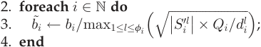

5. Sort b~ i in non-increasing order: L3 : b~ 1 � b~ 2 ����� b~ n; 

6. for i ¼ 1 to n do 

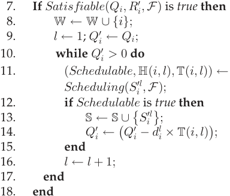

19. end 

20. returnW; S; ðH; TÞ; 

and breaks the tie by using a bid-independent rule. 

We use F to denote the <virtual channel; time> dimensional space, which records the available working time intervals of virtual channels. Following the order in list L3, SMASHER-GR first checks whether the buyer i can fulfill her claimed throughput Qi by being allocated the remaining time of virtual channels in F . If the buyer i is a winner, SMASHER-GR then greedily selects the available and non-overlapping time intervals for channel bundle Si0l,and“packs”theseintervalsintospaceF. SMASHER-GR iteratively allocates time intervals to each bundle Si0lofbuyeriuntilachievingherrequesteddata throughput Qi. 

Algorithm 3 shows the pseudo-code of greedy algorithm for winner determination, including channel allocation and scheduling. The function SatisfiableðQi; R0 i; FÞ checks whether the buyer i can satisfy her data throughput Qi by being allocated the non-overlapping time 

### 5.1.3 Clearing Price Calculation 

The pricing mechanism is also based on critical virtual bid. 

- Definition 6 (Critical Virtual Bid). The critical virtual bid crðiÞ 2 L3 of winning buyer i 2 W is the minimum virtual bid that buyer i must exceed in order to fulfil her requested data throughput, i.e., if the virtual bid of the buyer i is higher than crðiÞ, her requested data throughput would be satisfied; otherwise, she would lose the auction. 

The critical virtual bid crðiÞ of buyer i can be obtained by the following steps. Given the other buyers’ channel 

5. Similar to Algorithm 2, the updated channel bundle Si0lis schedu- lable means that the corresponding original channel bundle Silisalso schedulable in Algorithm 3. 

IEEE TRANSACTIONS ON MOBILE COMPUTING, VOL. 14, NO. 6, JUNE 2015 

1132 

demands �R~0 �i; ~Q�i;~B�i �, we greedily select the virtual bid from L3 by running Algorithm 3 until buyer i’s requested data throughput cannot be fulfilled. The last virtual bid we selected is considered as the critical virtual bid of buyer i. Now we can calculate the clearing price of buyer i by distinguishing the following two cases: 

- If the buyer i loses in the auction or there exist no critical virtual bids for her, then her clearing price is 0. 

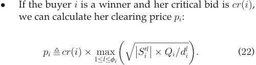

### 5.2 Analysis 

By combining the channel allocation, scheduling and pricing mechanisms together, SMASHER-GR achieves the following property. 

Theorem 3. SMASHER-GR is a joint allocation and scheduling strategy-proof combinatorial auction mechanism for heterogeneous channel redistribution with time flexibility. 

- Proof. We first prove that buyer i 2 N cannot increase her utility by bidding untruthfully, i.e., reporting true valuation is a dominant strategy for the buyer i. We distinguish two cases: 

   - Buyer i achieves her throughput Qi and gets her utility ui � 0 when bidding truthfully, i.e., bi ¼ vi. She gains channel bundle set Si � S and scheduling matrix ðHi; TiÞ �ðH; TÞ. Buyer i wins another channel bundle set S0 i6¼ Si; S0i�S and scheduling matrix ðH0 i; T0 iÞ �ðH; TÞ when she reports another bid b0 i6¼ vi. Her utility is not changed: 

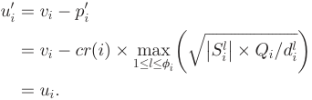

If buyer i loses in the auction when she cheats the bid, her utility is 0, which is no more than when buyer i bids truthfully. 

- We consider the other case, in which the buyer i cannot fulfill her throughput Qi when bidding truthfully. Then her utility ui ¼ 0. The only way to improve her utility is to cheat the bid b0 i6¼ vi and become a winner. We denote the buyer i’s winning channel bundle set S0 i � S and the corresponding scheduling matrix ðH0 i; T0 iÞ �ðH; TÞ when she cheats on bid. Let b~ i and b~0 idenotethe virtual bid of buyer i when she bids truthfully and untruthfully, respectively. Then, we have b~0 i�crðiÞ �b~i,becauseotherwise,shestillcannot fulfil her throughput. Her utility now becomes non-positive 

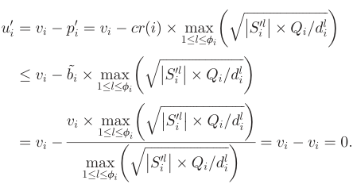

Therefore, bidding the true valuation is a dominant strategy for each buyer. We can conclude that SMASHER-GR satisfies incentive compatibility. We now prove that SMASHER-GR also satisfies individual rationality. On one hand, the buyers losing in the auction get zero utility. On the other hand, the winning buyer i’s utility 

where b~ i is the virtual bid of buyer i. From the definition of critical virtual bid, we have b~ i � crðiÞ for winning buyer i. Then, winning buyer i gets non-negative utility. Buyer utility is always non-negative, which is not worse than staying outside the auction (i.e., utility is equal to zero). Therefore, we can conclude that SMASHER-GR satisfies individual rationality. 

Since SMASHER-GR satisfies both incentive compatibility and individual rationality, SMASHER-GR is a strategy-proof mechanism, and then our claim holds. Similar to SMASHER-AP, the property of strategy-proofness can also be analyzed by applying Myerson’s well known characterization [31]. tu 

We note that the performance of SMASHER-GR can be arbitrarily bad in some special cases. But the evaluation results show that SMASHER-GR performs quite well in most of cases. 

## 6 EVALUATION RESULTS 

In this section, we show our evaluation results. 

### 6.1 Methodology 

We implement SMASHER-AP and compare its performance with TAHES [9] and CRWDP [10]. We also show the performance of SMASHER-GR. Buyers are randomly distributed in a terrain area of 2000 � 2000 meters. The number of buyers varies from 20 to 400 with increment of 20. The number of leasing channels can be one of the three values: 6, 12 

ZHENG ET AL.: A STRATEGY-PROOF COMBINATORIAL HETEROGENEOUS CHANNEL AUCTION FRAMEWORK IN NONCOOPERATIVE WIRELESS... 

1133 

Fig. 2. Performance of SMASHER-AP, TAHES, CRWDP and IP-OPT, when there are 12 channels. 

and 24. The heterogeneous channels have different interference ranges, spanning from 250 meters to 450 meters. We allow buyers to be equipped with different number of radios in our auctions, but limit the maximum size of requested channel bundle to 3. We assume that the buyers’ valuations are randomly distributed over ð0; 1�. We consider the case of single-minded buyers (i.e., F ¼ 1), and the case of multi-minded buyers who can submit up to three channel bundles (i.e., F ¼ 3). In SMASHER-GR, we normalize the length of time slot to 1. We assume the throughput of buyers and data rate of channel bundle are uniformly distributed in the interval ð0; 1�. All the results of performance are averaged over 200 runs.6 

Metrics. We evaluate three metrics: 

- Social Welfare: Social welfare is the sum of winning buyers’ valuations on their allocated bundles of channels. 

- Satisfactory Ratio: Satisfactory ratio is the percentage of buyers who obtain one of their demanded channel bundles in SMASHER-AP or achieve their throughput in SMASHER-GR. 

- Channel Utilization: Channel utilization is the average number of radios allocated to each channel. 

### 6.2 Performance of SMASHER-AP 

We compare the performance of SMASHER-AP with two strategy-proof heterogeneous channel auction mechanisms, TAHES and CRWDP. We evaluate the outcome of SMASHER-AP when the buyers are single-minded (F ¼ 1) and multi-minded (F ¼ 3). We also show the optimal results with tolerance 10�4 , denoted by IP-OPT, computed by solving the binary integer program in Section 3.2, as references of upper bound. 

Fig. 2 shows the evaluation results when there are 12 channels and different number of buyers. We can see that SMASHER-AP always outperforms the other two auction mechanisms, and its performance approaches the optimum, especially when F ¼ 1. When the number of nodes is smaller than 60, TAHES cannot form sufficient buyer groups with a large number of bids, and thus does not perform well in this case. When the number of buyer is larger than 60, CRWDP’s performance is not good because CRWDP does not consider channel spatial reusability 

> 6. All parameters can be different from the ones used here. However, the evaluation results of using different parameters are identical. Therefore, we only show the results for these parameters in this paper. 

(i.e., the channel utilization of CRWDP is equal to 1 in all cases). Fig. 2 also shows that when the buyer number increases, the social welfare and channel utilization increase, but the satisfaction ratio decreases. On one hand, the larger number of buyers leads to more intense competition on limited channels, thus decreasing the satisfaction ratio. On the other hand, SMASHER-AP can allocate channels more efficiently among more buyers, hence the social welfare and channel utilization increase. 

Fig. 3 shows the evaluation results when there are 200 buyers and the number of channels is 6, 12, 24. Again, SMASHER-AP always achieves better performance than TAHES and CRWDP, whenever F ¼ 1 or F ¼ 3. Fig. 3 also shows that when the number of channels increases, the social welfare and satisfaction ratio increase and the channel utilization decreases. The reason is that larger supply of leasing channels leads to more trades in the auction, thus the social welfare and satisfaction ratio increase when there exists a fixed number of buyers. The channel utilization decreases because buyers’ radios can be allocated to more channels when the number of channels increases. 

From Figs. 2 and 3, we can see that SMASHER-AP sacrifices limited system performance to achieve economic robustness. Although IP-OPT achieves near optimal social welfare, we cannot apply it to channel redistribution problem, because IP-OPT has not any guarantee on economic properties. We observe that SMASHER-AP with multi-minded buyers (i.e., F ¼ 3) always performs better than SMASHERAP with single-minded buyers (i.e., F ¼ 1), on all the three metrics. This is because multi-minded buyers have higher chance to obtain channel bundles than single-minded buyers. This leads to more trades in the auction. Therefore, allowing buyers to submit multiple spectrum requests indeed improves the auction performance. 

### 6.3 Performance of SMASHER-GR 

Solving the mixed integer nonlinear program, shown in Section 5, is computational intractable even in small scale network scenarios. CRWDP only allocates time-frequency blocks, without considering the channel scheduling problem while TAHES does not take time multiplexing of channels into account, regarding channels as indivisible goods. Therefore, we only show the performance results of SMASHER-GR in Fig. 4. 

Similarly, when the buyer number increases, the social welfare and channel utilization increase and the satisfaction ratio decreases. We can also observe that when the number of leasing channels increases from 12 to 24, the social 

IEEE TRANSACTIONS ON MOBILE COMPUTING, VOL. 14, NO. 6, JUNE 2015 

1134 

Fig. 3. Performance of SMASHER-AP, TAHES, CRWDP and IP-OPT, when there are 200 buyers. 

welfare and satisfaction ratio increase while the channel utilization decreases. The reasons of the relation between system performance and the number of buyers or the number of channels is similar to those analyzed in SMASHER-AP. Fig. 4 also shows that SMASHER-GR with multi-minded buyers (i.e., F ¼ 3) always outperforms SMASHER-GR with single-minded buyers (i.e., F ¼ 1), on all the three metrics. This result verifies that diverse spectrum requests lead to higher auction performance. We can draw a conclusion that bid diversity is an effective strategy to improve the performance of channel redistribution system. 

Compared with SMASHER-AP, SMASHER-GR performs better on all the three metrics. This is because channels can be shared among buyers in a paradigm of time-division multiplexing in SMASHER-GR. SMASHER-GR is an effective auction mechanism to channel redistribution, considering both spatial and temporal channel reusability. 

## 7 RELATED WORKS 

In this section, we briefly review related works on channel auction and auction mechanism design. 

### 7.1 Channel Allocation with Selfish Participants 

A number of works model the problem of channel allocation by game theory. Felegyhazi et al. [35] studied Nash Equilibria in a static multi-radio multi-channel allocation game. Later, Wu et al. [36] designed an incentive scheme for the multi-radio multi-channel allocation game, making the system converge to a much stronger equilibrium state. Gao and Wang studied the multi-radio channel allocation problem in multi-hop wireless networks, and proposed the min-max coalition-proof Nash Equilibrium channel allocation scheme in the cooperative game [37]. Yang et al. considered the channel allocation in multi-radio multi-channel wireless networks with multiple collision domains [38]. Chen and Huang proposed distributed spectrum sharing schemes to 

coverage Nash equilibrium in spectrum access game [39], [40]. In cognitive radio networks, Kasbekar and Sarkar analyzed spectrum pricing game and computed Nash Equilibrium in different scenarios [41], [42], [43]. Byun et al., computed a market equilibrium, which is defined in context of extended Fisher model, for spectrum sharing in cognitive radio networks [44]. The paper [45] proposed a Quality of Experience driven channel allocation scheme for secondary users in cognitive radio networks. Resource allocation among selfish participants has been studied in different network scenarios, such as wireless mesh networks [46], OFDMA femtocell networks [47], and LTE networks [48]. 

The most closely related works are VERITAS [6], TRUST [7], and SMALL [8], all of which are auction-based strategyproof channel allocation mechanisms. VERITAS and SMALL are single-sided auctions both supporting multiple channel requests. In contrast, TRUST elegantly extends double auction to consider both channel sellers and buyers’ incentives. Recently, TAHES [9] was proposed to solve the problem of heterogeneous channel allocation. Besides, there are some other related works on channel auction, such as online channel auctions [49], [50], [51], collusion-resistant channel auction [52], revenue generation for spectrum auction [53], and approximate algorithms for different models of interference and different formats of valuations [25], [26]. 

### 7.2 Mechanism Design 

A large number of works on combinatorial auctions have been proposed during the last decades. Dobzinski [17], Buchfuhrer et al. [54], and Papadimitriou et al. [16] proved that getting optimal social welfare and ensuring strategy-proofness cannot be achieved simultaneously in general combinatorial auctions. Lehmann et al. [18] even asserted that there is no payment scheme to make greedy allocation algorithm strategy-proof in general combinatorial auctions with multimined buyers. Considering the intractability of combinatorial 

Fig. 4. Performance of SMASHER-GR in different network scenarios. 

ZHENG ET AL.: A STRATEGY-PROOF COMBINATORIAL HETEROGENEOUS CHANNEL AUCTION FRAMEWORK IN NONCOOPERATIVE WIRELESS... 

1135 

auction, a number of strategy-proof auction mechanisms with well bounded approximation ratios were proposed [55], [56],[57],[58]. In [10], the author modeled the time-frequency allocation problem as a combinatorial auction with singleminded buyers, and proposed a greedy allocation algorithm to achieve approximately efficient social welfare in a single collision domain. However, none of the above combinatorial auction considers the spectrum spatial reusability. 

Auction mechanisms have been proposed to address different kinds of resource allocation problems, such as resource management in cloud computing [59], [60], sensing tasks distribution in mobile crowdsensing [61], [62], and cooperation dynamics on collaborative social networks [63]. 

Scheduling theory has received a growing interest since its origins, and there are various types of scheduling problems [64]. Recently, some works have studied the scheduling problems in the mechanism design context. Nisan and Ronen [65] were the first to consider makespan-minimization on unrelated machines. Later, Archer and Tardos [66] considered the related-machine problem and gave a 3-approximation truthful-in-expectation mechanism. However, the objective of these works is to minimize the makespan, while our objective is to maximize social welfare and the scheduling model we considered is more complicated. 

## 8 CONCLUSION AND FUTURE WORKS 

In this paper, we have made an in-depth study on channel redistribution problem by jointly considering the five design challenges. We have presented two closely related strategyproof combinatorial auction mechanisms for dynamic heterogeneous channel redistribution, namely SMASHER-AP and SMASHER-GR. SMASHER-AP is a combinatorial auction mechanism for indivisible channel redistribution, achieving strategy-proofness and approximately efficient social welfare. SMASHER-GR is a strategy-proof combinatorial auction for joint channel allocation and scheduling for the scenarios, in which channels can be shared in a time-multiplexing way. We have also evaluated the performance of our designs. The simulation results have shown that our designs achieve good performance, in terms of social welfare, buyer satisfaction ratio, and channel utilization. 

As for future works, we are interested in designing combinatorial channel auction mechanisms that can prevent collusion among multiple buyers. Designing a strategy-proof combinatorial channel auction mechanism to prevent buyers from cheating on channel bundle is also an interesting problem. Finally, there are additional economic properties that could be considered, such as fairness and false-name bidding resistent, in combinatorial auction mechanism design. 

## ACKNOWLEDGMENTS 

This work was supported in part by the State Key Development Program for Basic Research of China (973 project 2014CB340303 and 2012CB316201), in part by China NSF grant 61422208, 61472252, 61272443 and 61133006, in part by Shanghai Science and Technology fund 12PJ1404900 and 12ZR1414900, and in part by Program for Changjiang Scholars and Innovative Research Team in University (IRT1158, 

PCSIRT) China. Fan Wu is the corresponding author. The opinions, findings, conclusions, and recommendations expressed in this paper are those of the authors and do not necessarily reflect the views of the funding agencies or the government. 

## REFERENCES 

- [1] Federal Communications Commission (FCC). (2014). [Online]. Available: http://www.fcc.gov/ 

- [2] Radio Administration Bureau (RAB). (2014). [Online]. Available: http://wgj.miit.gov.cn/ 

- [3] R. Berry , M. Honig, and R. Vohra, “Spectrum markets: Motivation, challenges, and implications,” IEEE Commun. Mag., vol. 48, no. 11, pp. 146–155, Nov. 2010. 

- [4] J. Huang, R. A. Berry, and M. L. Honig, “Auction-based spectrum sharing,” Mobile Netw. Appl., vol. 11, no. 3, pp. 405–418, 2006. 

- [5] I. Koutsopoulos and G. Iosifidis, “Auction mechanisms for network resource allocation,” in Proc. 8th Int. Symp. Model. Optim. Mobile, Ad-Hoc Wireless Netw., Avignon, France, May 2010, pp. 554–563. 

- [6] X. Zhou, S. Gandhi, S. Suri, and H. Zheng, “eBay in the sky: Strategy-proof wireless spectrum auctions,” in Proc. 14th Int. Conf. Mobile Comput. Netw., San Francisco, CA, USA, Sep. 2008, pp. 2–13. 

- [7] X. Zhou and H. Zheng, “TRUST: A general framework for truthful double spectrum auctions,” in Proc. 28th Annu. IEEE Conf. Comput. Commun., Rio de Janeiro, Brazil, Apr. 2009, pp. 999–1007. 

- [8] F. Wu and N. Vaidya, “SMALL: A strategy-proof mechanism for radio spectrum allocation,” in Proc. 30th Annu. IEEE Conf. Comput. Commun., Shanghai, China, Apr. 2011. pp. 81–85. 

- [9] X. Feng, Y. Chen, J. Zhang, Q. Zhang, and B. Li, “TAHES: Truthful double auction for heterogeneous spectrums,” in Proc. 31st Annu. IEEE Int. Conf. Comput. Commun., Orlando, FL, USA, Mar. 2012. pp. 3076–3080. 

- [10] M. Dong, G. Sun, X. Wang, and Q. Zhang, “Combinatorial auction with time-frequency flexibility in cognitive radio networks,” in Proc. 31st Annu. IEEE Int. Conf. Comput. Commun., Orlando, FL, USA, Mar. 2012, pp. 2282–2290. 

- [11] G. Iosifidis and I. Koutsopoulos, “Challenges in auction theory driven spectrum management,” IEEE Commun. Mag., vol. 49, no. 8, pp. 128–135, Aug. 2011. 

- [12] R. Berry, “Network market design part II: spectrum markets,” IEEE Commun. Mag., vol. 50, no. 11, pp. 84–90, Nov. 2012. 

- [13] P. Briest, P. Krysta, and B. Vocking,€ “Approximation techniques for utilitarian mechanism design,” in Proc. 37th Annu. Symp. Theory Comput., Baltimore, MD, USA, May 2005, pp. 39–48. 

- [14] A. Archer and R. Kleinberg, “Truthful germs are contagious: A local to global characterization of truthfulness,” in Proc. 9th ACM Symp. Electron. Commerce, Chicago, IL, USA, Jul. 2008, pp. 21–30. 

- [15] J.-C. Rochet, “A necessary and sufficient condition for rationalizability in a quasi-linear context,” J. Math. Econ., vol. 16, no. 2, pp. 191–200, 1987. 

- [16] C. Papadimitriou, M. Schapira, and Y. Singer, “On the hardness of being truthful,” in Proc. 49th Annu. Symp. Found. Comput. Sci., Philadelphia, PA, USA, Oct. 2008, pp. 250–259. 

- [17] S. Dobzinski, “An impossibility result for truthful combinatorial auctions with submodular valuations,” in Proc. 43rd Annu. Symp. Theory Comput., San Jose, CA, USA, 2011, pp. 139–148. 

- [18] D. Lehmann, L. I. O�callaghan, and Y. Shoham, “Truth revelation in approximately efficient combinatorial auctions,” J. ACM, vol. 49, no. 5, pp. 577–602, Sep. 2002. 

- [19] R. Lavi and C. Swamy, “Truthful and near-optimal mechanism design via linear programming,” in Proc. 46th Annu. Symp. Found. Comput. Sci., Pittsburgh, PA, USA, Oct. 2005, pp. 595–604. 

- [20] M. Osborne and A. Rubinstein, A Course in Game Theory. Cambridge, MA, USA: MIT press, 1994. 

- [21] D. Fudenberg and J. Tirole, Game Theory. Cambridge, MA, USA: MIT Press, 1991. 

- [22] A. Mas-Colell, M. D. Whinston, and J. R. Green, Microeconomic Theory. New York, NY, USA: Oxford Press, 1995. 

- [23] H. Varian, “Economic mechanism design for computerized agents,” in Proc. 1st Conf. USENIX Workshop Electron. Commerce, 1995, p. 2. 

- [24] X. Zhou, Z. Zhang, G. Wang, X. Yu, B. Y. Zhao, and H. Zheng, “Practical conflict graphs for dynamic spectrum distribution,” in Proc. Joint Int. Conf. Meas. Model. Comput. Syst., Pittsburgh, PA, USA, Jun. 2013. pp. 5–16. 

IEEE TRANSACTIONS ON MOBILE COMPUTING, 

VOL. 14, NO. 6, JUNE 2015 

1136 

- [25] M. Hoefer, T. Kesselheim, and B. Vocking, “Approximation algo-€ rithms for secondary spectrum auctions,” in Proc. 23rd Annu. ACM Symp. Parallelism Algorithms Archit., San Jose, CA, USA, Jun. 2011, pp. 177–186. 

- [26] M. Hoefer and T. Kesselheim, “Secondary spectrum auctions for symmetric and submodular bidders,” in Proc. 13th ACM Symp. Electron. Commerce, Valencia, Spain, Jun. 2012, pp. 657–671. 

- [27] W. Vickrey, “Counterspeculation, auctions, and competitive sealed tenders,” The J. Finance, vol. 16, no. 1, pp. 8–37, 1961. 

- [28] E. H. Clarke, “Multipart pricing of public goods,” Public Choice, vol. 11, no. 1, pp. 17–33, 1971. 

- [29] T. Groves, “Incentives in teams,” Econometrica: J. Econometric Soc., vol. 41, no. 4, pp. 617–631, 1973. 

- [30] M. R. Garey and D. S. Johnson, Computers and Intractability; A Guide to the Theory of NP-Completeness. San Francisco, CA, USA: Freeman, 1990. 

- [31] R. B. Myerson, “Optimal auction design,” Math. Oper. Res., vol. 6, no. 1, pp. 58–73, 1981. 

- [32] B. Sundararaman, U. Buy, and A. D. Kshemkalyani, “Clock synchronization for wireless sensor networks: A survey,” Elsevier Ad Hoc Netw., vol. 3, no. 3, pp. 281–323, 2005. 

- [33] J. So and N. H. Vaidya, “Multi-channel MAC for ad hoc networks: Handling multi-channel hidden terminals using a single transceiver,” in Proc. 5th ACM Symp. Mobile Ad Hoc Netw. Comput., Tokyo, Japan, May 2004, pp. 222–233. 

- [34] J. Lee and S. Leyffer, Mixed Integer Nonlinear Programming. New York, NY, USA: Springer, 2011. 

- [35] M. F�elegyh�azi, M. Cagalj, S.� S. Bidokhti, and J.-P. Hubaux, “Noncooperative multi-radio channel allocation in wireless networks,” in Proc. 26th Annu. IEEE Conf. Comput. Commun., Anchorage, Alaska, USA, May 2007, pp. 1442–1450. 

- [36] F. Wu, S. Zhong, and C. Qiao, “Globally optimal channel assignment for non-cooperative wireless networks,” in Proc. 27th Annu. IEEE Conf. Comput. Commun., Phoenix, AZ, USA, Apr. 2008, pp. 2216–2224. 

- [37] L. Gao and X. Wang, “A game approach for multi-channel allocation in multi-hop wireless networks,” in Proc. 9th ACM Symp. Mobile Ad Hoc Netw. Comput., Hong Kong, China, Sep. 2008. pp. 303–312. 

- [38] D. Yang, X. Fang, and G. Xue, “Channel allocation in noncooperative multi-radio multi-channel wireless networks,” in Proc. 31st Annu. IEEE Int. Conf. Comput. Commun., Orlando, FL, USA, Mar. 2012, pp. 882–890. 

- [39] X. Chen and J. Huang, “Game theoretic analysis of distributed spectrum sharing with database,” in Proc. 33rd Int. Conf. Distrib. Comput. Syst., Philadelphia, PA, USA, Jul. 2012, pp. 255–264. 

- [40] X. Chen and J. Huang, “Spatial spectrum access game: Nash equilibria and distributed learning,” in Proc. 13th ACM Symp. Mobile Ad Hoc Netw. Comput., Hilton Head, SC, USA, Jun. 2012, pp. 205–214. 

- [41] G. Kasbekar and S. Sarkar, “Spectrum pricing games with random valuations of secondary users,” IEEE J. Sel. Areas Commun., vol. 30, no. 11, pp. 2262–2273, Dec. 2012. 

- [42] G. Kasbekar and S. Sarkar, “Spectrum pricing games with spatial reuse in cognitive radio networks,” IEEE J. Sel. Areas Commun., vol. 30, no. 1, pp. 153–164, Jan. 2012. 

- [43] G. S. Kasbekar and S. Sarkar, “Spectrum pricing games with bandwidth uncertainty and spatial reuse in cognitive radio networks,” in Proc. 11th ACM Symp. Mobile Ad Hoc Netw. Comput., Chicago, IL, USA, Sep. 2010, pp. 251–260. 

- [44] S.-S. Byun, I. Balashingham, A. Vasilakos, and H.-N. Lee, “Computation of an equilibrium in spectrum markets for cognitive radio networks,” IEEE Trans. Comput., vol. 63, no. 2, pp. 304– 316, Feb. 2014. 

- [45] T. Jiang, H. Wang, and A. Vasilakos, “QoE-driven channel allocation schemes for multimedia transmission of priority-based secondary users over cognitive radio networks,” IEEE J. Sel. Areas Commun., vol. 30, no. 7, pp. 1215–1224, Aug. 2012. 

   - [48] D. Lopez-Perez, X. Chu, A. Vasilakos, and H. Claussen, “On distributed and coordinated resource allocation for interference mitigation in self-organizing LTE networks,” IEEE/ACM Trans. Netw., vol. 21, no. 4, pp. 1145–1158, Aug. 2013. 

   - [49] L. Deek, X. Zhou, K. Almeroth, and H. Zheng, “To preempt or not: Tackling bid and time-based cheating in online spectrum auctions,” in Proc. 30th Annu. IEEE Conf. Comput. Commun., Shanghai, China, Apr. 2011, pp. 2219–2227. 

   - [50] Y. Chen, P. Lin, and Q. Zhang, “LOTUS: Location-aware online truthful double auction for dynamic spectrum access,” in Proc. 8th IEEE Int. Symp. New Front. Dynamic Spectr. Access Netw., McLean, VA, USA, Apr 2014, pp. 510–518. 

   - [51] P. Xu, S. Wang, and X.-Y. Li, “SALSA: Strategyproof online spectrum admissions for wireless networks,” IEEE Trans. Comput., vol. 59, no. 12, pp. 1691–1702, Dec. 2010. 

   - [52] X. Zhou and H. Zheng, “Breaking bidder collusion in large-scale spectrum auctions,” in Proc. 11th ACM Symp. Mobile Ad Hoc Netw. Comput., Chicago, IL, USA, Sep. 2010, pp. 121–130. 

   - [53] J. Jia, Q. Zhang, Q. Zhang, and M. Liu, “Revenue generation for truthful spectrum auction in dynamic spectrum access,” in Proc. 10th ACM Symp. Mobile Ad Hoc Netw. Comput., New Orleans, LA, USA, Sep. 2009, pp. 3–12. 

   - [54] D. Buchfuhrer, S. Dughmi, H. Fu, R. Kleinberg, E. Mossel, C. Papadimitriou, M. Schapira, Y. Singer, and C. Umans, “Inapproximability for VCG-based combinatorial auctions,” in Proc. 21st Annu. ACM-SIAM Symp. Discrete Algorithms, Austin, Texas, USA, Jan. 2010, pp. 518–536. 

   - [55] Y. Bartal, R. Gonen, and N. Nisan, “Incentive compatible multi unit combinatorial auctions,” in Proc. 9th Conf. Theor. Aspects Ration. Knowl., Bloomington, IN, USA, Jun. 2003, pp. 72–87. 

   - [56] A. Mu’alem and N. Nisan, “Truthful approximation mechanisms for restricted combinatorial auctions,” Games Econ. Behav., vol. 64, no. 2, pp. 612–631, 2008. 

   - [57] B. Vocking,€ “A universally-truthful approximation scheme for multi-unit auctions,” in Proc. 23rd Annu. ACM-SIAM Symp. Discrete Algorithms, Kyoto, Japan, Jan. 2012, pp. 846–855. 

   - [58] E. Zurel and N. Nisan, “An efficient approximate allocation algorithm for combinatorial auctions,” in Proc. 3rd ACM Symp. Electron. Commerce, Tampa, FL, USA, Oct. 2001, pp. 125–136. 

   - [59] H. Zhang, B. Li, H. Jiang, F. Liu, A. Vasilakos, and J. Liu, “A framework for truthful online auctions in cloud computing with heterogeneous user demands,” in Proc. 32nd IEEE Int. Conf. Comput. Commun., Turin, Italy, Apr. 2013, pp. 1510–1518. 

   - [60] W. Shi, L. Zhang, C. Wu, Z. Li, and F. C. Lau, “An online auction framework for dynamic resource provisioning in cloud computing,” in Proc. Joint Int. Conf. Meas. Model. Comput. Syst., Austin, Texas, USA, Jun. 2014, pp. 71–83. 

   - [61] Z. Feng, Y. Zhu, Q. Zhang, and L. Ni, “TRAC: Truthful auction for location-aware collaborative sensing in mobile crowdsourcing,” in Proc. 33rd IEEE Int. Conf. Comput. Commun., Toronto, ON, Canada, Apr. 2014, pp. 1231–1239. 

   - [62] D. Yang, G. Xue, X. Fang, and J. Tang, “Crowdsourcing to smartphones: Incentive mechanism design for mobile phone sensing,” in Proc. 18th Int. Conf. Mobile Comput. Netw., Istanbul, Turkey, Aug. 2012, pp. 173–184. 

   - [63] G. Wei, P. Zhu, A. Vasilakos, Y. Mao, J. Luo, and Y. Ling, “Cooperation dynamics on collaborative social networks of heterogeneous population,” IEEE J. Sel. Areas Commun., vol. 31, no. 6, pp. 1135–1146, Jun. 2013. 

   - [64] P. Brucker, Scheduling Algorithms. New York, NY, USA: Springer, 2007. 

   - [65] N. Nisan and A. Ronen, “Algorithmic mechanism design,” Games Econ. Behav., vol. 35, pp. 166–196, 2001. 

   - [66] A. Archer and E. Tardos, “Truthful mechanisms for one-parameter agents,” in Proc. 42nd Annu. Symp. Found. Comput. Sci., Las Vegas, NV, USA, Oct. 2001, pp. 482–491. 

- [46] P. Duarte, Z. Fadlullah, A. Vasilakos, and N. Kato, “On the partially overlapped channel assignment on wireless mesh network backbone: A game theoretic approach,” IEEE J. Sel. Areas Commun., vol. 30, no. 1, pp. 119–127, Jan. 2012. 

- [47] D. Lopez-Perez, X. Chu, A. Vasilakos, and H. Claussen, “Power minimization based resource allocation for interference mitigation in OFDMA Femtocell networks,” IEEE J. Sel. Areas Commun., vol. 32, no. 2, pp. 333–344, Feb. 2014. 

ZHENG ET AL.: A STRATEGY-PROOF COMBINATORIAL HETEROGENEOUS CHANNEL AUCTION FRAMEWORK IN NONCOOPERATIVE WIRELESS... 

1137 

Zhenzhe Zheng is currently working toward the master’s degree from the Department of Computer Science and Engineering at Shanghai Jiao Tong University, P. R. China. His research interests lie in algorithmic game theory, wireless networking, and mobile computing. He is a student member of the ACM, CCF, and IEEE. 

Fan Wu received the BS degree in computer science from Nanjing University in 2004, and the PhD degree in computer science and engineering from the State University of New York at Buffalo in 2009. He is an associate professor in the Department of Computer Science and Engineering at Shanghai Jiao Tong University, P. R. China. He has visited the University of Illinois at Urbana-Champaign (UIUC) as a post doc research associate. His current research interests include wireless networking, algorith- 

mic mechanism design, and privacy preservation. He received the Excellent Young Scholar Award of Shanghai Jiao Tong University in 2011, and Pujiang Scholar Award in 2012. He is a member of the ACM, CCF, and IEEE. For more information, please visit http://www. cs.sjtu.edu.cn/~fwu/. 

Guihai Chen received the BS degree from Nanjing University in 1984, ME degree from Southeast University in 1987, and the PhD degree from the University of Hong Kong in 1997. He is a distinguished professor of Shanghai Jiaotong University, China. He had been invited as a visiting professor by many universities including Kyushu Institute of Technology, Japan in 1998, University of Queensland, Australia in 2000, and Wayne State University during September 2001 to August 2003. He has a wide 

range of research interests with focus on sensor networks, peer-to-peer computing, high-performance computer architecture, and combinatorics. He has published more than 200 peer-reviewed papers, and more than 120 of them are in well-archived international journals such as IEEE Transactions on Parallel and Distributed Systems, Journal of Parallel and Distributed Computing, Wireless Networks, The Computer Journal, International Journal of Foundations of Computer Science, and Performance Evaluation, and also in well-known conference proceedings such as HPCA, MOBIHOC, INFOCOM, ICNP, ICPP, IPDPS, and ICDCS. He is a member of the IEEE. 

" For more information on this or any other computing topic, please visit our Digital Library at www.computer.org/publications/dlib. 

