IEEE TRANSACTIONS ON MOBILE COMPUTING, VOL. 16, NO. 9, SEPTEMBER 2017 

2392 

# A Budget Feasible Incentive Mechanism for Weighted Coverage Maximization in Mobile Crowdsensing 

Zhenzhe Zheng, Student Member, IEEE, Fan Wu, Member, IEEE, Xiaofeng Gao, Member, IEEE, Hongzi Zhu, Member, IEEE Computer Society, Shaojie Tang, Member, IEEE, and Guihai Chen, Senior Member, IEEE 

Abstract—Mobile crowdsensing is a novel paradigm to collect sensing data and extract useful information about regions of interest. It widely employs incentive mechanisms to recruit a number of mobile users to fulfill coverage requirement in the interested regions. In practice, sensing service providers face a pressing optimization problem: How to maximize the valuation of the covered interested regions under a limited budget? However, the relation between two important factors, i.e., Coverage Maximization and Budget Feasibility, has not been fully studied in existing incentive mechanisms for mobile crowdsensing. Furthermore, the existing approaches on coverage maximization in sensor networks can work, when mobile users are rational and selfish. In this paper, we present the first in-depth study on the coverage problem for incentive-compatible mobile crowdsensing, and propose BEACON, which is a Budget fEAsible and strategy-proof incentive mechanism for weighted COverage maximizatioN in mobile crowdsensing. BEACON employs a novel monotonic and computationally tractable approximation algorithm for sensing task allocation, and adopts a newly designed proportional share rule based compensation determination scheme to guarantee strategy-proofness and budget feasibility. Our theoretical analysis shows that BEACON can achieve strategy-proofness, budget feasibility, and a constant-factor approximation. We deploy a noise map crowdsensing system to capture the noise level in a selected campus, and evaluate the system performance of BEACON on the collected sensory data. Our evaluation results demonstrate the efficacy of BEACON. 

Index Terms—Mobile crowdsensing, mechanism design, weighted coverage maximization 

Ç 

## 1 INTRODUCTION 

I Nexperienced a rapid and explosive growth in people’s dailyrecent years, the number of mobile smart devices has lives. According to the International Data Corporation (IDC)’ s report, the smartphone market is expected to grow to 1,873 million shipment units worldwide at the end of 2018 [47]. It is widely believed that mobile devices will surpass other forms of computing and communication in a short time [52]. 

Nowadays, most of the smart devices are equipped with a rich set of cheap and powerful sensors, e.g., accelerometer, digital compass, GPS, microphone, and camera. These sensors can monitor mobile users’ surrounding environment, and infer human activities and contexts. By exploiting the capabilities of these embedded sensors on mobile devices, people have developed numerous mobile sensing applications in a wide range of domains, such as environment monitoring [38], transportation [57], social networking [32], etc. The paradigm of mobile crowdsensing has also revolutionized wireless sensor networks, since 

- Z. Zheng, F. Wu, X. Gao, H. Zhu, and G. Chen are with the Department of Computer Science and Engineering, Shanghai Key Laboratory of Scalable Computing and Systems, Shanghai Jiao Tong University, Minhang Qu 200240, China. E-mail: zhengzhenzhe@sjtu.edu.cn, {fwu, gao-xf, hongzi, gchen}@cs.sjtu.edu.cn. 

- S. Tang is with the Department of Information Systems, University of Texas at Dallas, Richardson, TX 75080. E-mail: tangshaojie@gmail.com. 

Manuscript received 6 Jan. 2016; revised 7 Sept. 2016; accepted 18 Oct. 2016. Date of publication 24 Nov. 2016; date of current version 2 Aug. 2017. For information on obtaining reprints of this article, please send e-mail to: reprints@ieee.org, and reference the Digital Object Identifier below. Digital Object Identifier no. 10.1109/TMC.2016.2632721 

it collects and disseminates sensing data by pervasive smart devices, and eliminates the need for deploying specific sensor networks. 

Although there have emerged a good number of attractive mobile crowdsensing applications, most of them are based on voluntary participation. Performing sensing tasks may consume a significant amount of battery power and may cause some other related costs, e.g., the charges from wireless carriers for sensing data transmission, potential privacy threats when sharing location based data. Mobile users may be unwilling to participate in the sensing activities unless they are properly compensated. Therefore, incentive mechanisms are highly needed to motivate enough number of mobile users to contribute their sensory data, and thus to guarantee the high quality of the sensing service. 

We model the process of sensing task allocation as a coverage problem. Coverage problem is a fundamental issue in wireless sensor networks [21], which reflects how well an area is monitored. Most of the existing work on sensor coverage problems focus on sensor deployment pattern design [42] and sensor selection algorithms under different coverage models, e.g., coverage with disparate ranges [49], coverage in three-dimensional spaces [3], and k-coverage [6]. However, in mobile crowdsensing, smart devices often belong to different individuals who have their own interests. Mobile users may not be willing to behave cooperatively if it does not satisfy their best interests. The existing coverage approaches in sensor networks do not work when mobile users are rational and selfish. Consequently, it is highly needed to design an incentive mechanism for 

1536-1233 � 2016 IEEE. Personal use is permitted, but republication/redistribution requires IEEE permission. See http://www.ieee.org/publications_standards/publications/rights/index.html for more information. 

ZHENG ET AL.: A BUDGET FEASIBLE INCENTIVE MECHANISM FOR WEIGHTED COVERAGE MAXIMIZATION IN MOBILE CROWDSENSING 

2393 

coverage maximization in crowdsensing, considering the strategic behaviors of mobile users. 

An important factor of incentive mechanisms design for mobile crowdsensing is budget feasibility. It is not practical to always assume that the service provider has an unlimited budget to cover compensations for mobile users. In reality, a service provider is interested in maximizing coverage (thus maximizing the quality of service) with a limited budget. 

There exist many challenges in designing a budget feasible incentive mechanism for coverage maximization in crowdsensing. We list the three major challenges as follows. 

- I Strategy-Proofness: In mobile crowdsensing, mobile users are rational and selfish, and tend to manipulate cthe outcome of the mechanism if doing so can increase their utilities/payoffs. Truthful users’ benefits can be hurt if strategy-proofness (Please refer to Section 2.2 for details) is not guaranteed. Designing a strategy-proof incentive mechanism, in which truthfully revealing the private information (i.e., sensing cost) maximizes the utility of each mobile user, is not an easy job in practice [40]. The essential challenge to ensure the property of strategy-proofness is to design a monotone allocation algorithm [33]. However, the traditional greedy-based allocation algorithms for coverage maximization [27], [34] fail to satisfy the monotone property. New design technique to guarantee the monotone property and then the strategy-proofness should be further developed. 

- I Budget Feasibility: It is reasonable to assume that the service provider has a budget constraint on recruiting mobile users. The requirement on budget feasibility leads to a new difficulty in incentive mechanism design, i.e., the budget constraint is applied to compensation instead of sensing cost, which is different from the coverage problem in the algorithm design literature. The classical payment rule in mechanism design is based on the critical payment, which is the threshold bid that the winning user has to declare to maintain the winning position. However, the critical compensation in the budget feasible mechanism is complicated and hard to bound, because the user has different threshold bids in different winning positions. Therefore, the compensation determination scheme has to be designed in line with the budget constraint. Unfortunately, classic mechanisms (e.g., VCG mechanisms [11], [17], [48]) do not work in the budget-limited scenario. 

- I Valuation Maximization: The objective of the service provider is to maximize her valuation on the collected sensory data. In mobile crowdsensing, the valuation of the service provider can be formulated as the valuation over the covered regions. Maximizing valuation under a given budget can be proved to be NP-hard, and thus finding the optimal solution is normally computationally intractable. Although the traditional greedy algorithms [27], [34] have guarantee for good approximation ratio, they violate the requirements of strategy-proofness and budget feasibility. Several attempts from the perspective of mechanism design have been conducted to derive budget feasible mechanism with good approximation ratio [4], [8], [44], but they either are difficult to deploy in practical mobile crowdsensing, or have high computational complexity. 

In this paper, we conduct an in-depth study on the problem of weighted coverage maximization with selfish mobile users, and propose a novel <u>Budget fEAsible incentive mech-</u> anism for weighted <u>COverage</u> maximizatioN in mobile crowdsensing, namely BEACON, to overcome the above three mentioned challenges. BEACON employs a novel monotonic and computationally efficient task allocation algorithm to achieve strategy-proofness, and adopts a newly designed proportional share rule based compensation determination scheme to guarantee budget feasibility. Different from the previous works [4], [8], [44] that rely on the randomization technique to derive good approximation ratio, BEACON takes advantage of the linear program rounding technique [2], [5] to design a deterministic mechanism, achieving a constant approximation ratio. 

We summarize the contributions of this paper as follows. 

- I First, considering the strategic behaviours of mobile users, we model the weighted coverage maximization under different coverage requirements in mobile crowdsensing as budget-limited reverse auctions. 

- I Second, we consider budget feasibility in designing incentive mechanisms for mobile crowdsensing, and propose a deterministic mechanism for weighted coverage maximization in mobile crowdsensing, namely BEACON. We theoretically prove that BEACON achieves strategy-proofness, budget feasibility, a constant-factor approximation, and polynomial time complexity. 

- I Finally, we deploy a crowdsensing system to construct the noise map of one selected campus, and evaluate the performance of BEACON based on the collected data. Our evaluation results validate that BEACON achieves much better performance than the state-ofthe-art mechanisms in terms of service provider’s valuation, winner ratio, and coverage ratio. 

The rest of this paper is organized as follows. In Section 2, we present the model of budget-limited reverse auction for coverage problems in mobile crowdsensing. In Section 3, we formulate this problem from the perspectives of algorithm design and mechanism design. The detailed design of BEACON is discussed in Section 4. In Section 5, we theoretically analyse BEACON. We extend BEACON to adapt to different coverage models in Section 6. In Section 7, the evaluation results are reported. In Section 8, we review related work. We conclude the paper in Section 9. 

## 2 PRELIMINARIES 

In this section, we first present the system and auction model for mobile crowdsensing, and then review the solution concepts used in this paper from algorithmic game theory. 

### 2.1 System Model and Auction Model 

We use Fig. 1 to illustrate a mobile crowdsensing system. The mobile crowdsensing system consists of three major components: Service Provider, Data Contributors, and Service Subscribers. The service provider continuously receives diverse location-based sensing queries from service subscribers. After integrating these sensing queries, the service provider launches specific-purpose sensing tasks in the interested regions. Mobile users, who choose to participate in mobile crowdsensing, submit their preferred sensing task sets and the sensing cost, to the service provider. The service provider makes the decision on sensing task allocation and compensation calculation. The winning mobile users perform the 

IEEE TRANSACTIONS ON MOBILE COMPUTING, VOL. 16, NO. 9, SEPTEMBER 2017 

2394 

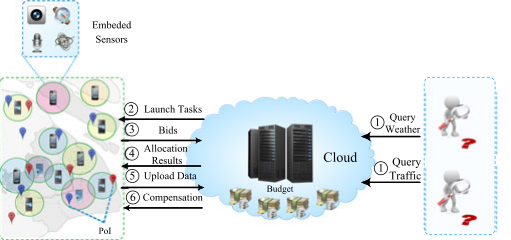

Fig. 1. A mobile crowdsensing system. 

assigned sensing task(s), and then upload the sensing data through wireless communication infrastructures. The key factor to the success of mobile crowdsensing is whether the service provider can recruit enough number of data contributors to support the expected quality of the sensing based service. 

In this paper, we focus on incentive mechanism design for mobile crowdsensing, and model the data contributors recruitment as a budget-limited reverse auction. In the reverse auction, mobile users submit bids, and the service provider allocates the sensing tasks, and pays compensations to the winning users. We explain the two important parties in the budget-limited reverse auction. 

Service Provider. The service provider launches sensing tasks in the monitoring regions, and intends to maximize the coverage of the regions under a budget B. For the problem of weighted coverage maximization, we first consider a point coverage scenario, in which the service provider sets a number of Points of Interests (PoIs), denoted by a set H ¼ fh1; h2; . . . ; hHg, for sensing tasks. The service provider has a valuation vi for a PoI hi 2 H if hi is covered. We also consider other two coverage models: area coverage and multiple coverage, in Section 6. 

Data Contributor. We denote the set of data contributors as M ¼ fm1; m2; . . . ; mM g. From now on, we use data contributor and mobile user interchangeably. Each data contributor is capable of sensing a convex region around herself, called Sensing Region. The semantics of sensing regions is application specific. To simplify the illustration, we model the sensing region of mobile user mi as a circular disk around herself. A PoI is said to be covered by mi if the euclidean Distance between the PoI and the location of mi is less than the radius of the circular disk. 

In the budget-limited auction, the mobile user mi submits her chosen bundle of sensing tasks Si � H, and declared sensing cost ci to the service provider. Considering that different sensing task bundle Si leads to different battery consumptions and manual efforts, the sensing cost ci is dependent on the specific choice of sensing task bundle. Thus, we use a pair bi ¼ ðSi; ciÞ to denote the bid of mobile user mi, and denote the bidding profile of all the mobile users as **b** ¼ ðb1; b2; . . . ; bM Þ. Mobile user mi also has a participatory sensing cost c^i, which is private information to her, and is known as type in mechanism design. Since mobile users are rational and selfish, they may misreport their sensing costs to obtain higher compensations. Thus the declared cost ci is not necessarily equal to the truthful cost ^ci. The compensation to the mobile user mi is denoted by pi, and the compensation profile of mobile users is represented by **p** ¼ ðp1; p2; . . . ; pM Þ. 

For mobile user mi, her utility ui is defined as the difference between compensation pi and sensing cost ^ci: ui , pi � c^i: The valuation of service provider is defined as follows. 

Definition 1. The valuation of service provider in mobile crowdsensing is defined as the valuation over all the PoIs covered by winning mobile users 

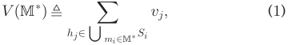

where M� is the set of winning mobile users. 

### 2.2 Solution Concepts 

We review the solution concepts used in this paper. A strong solution concept from game theory is dominant strategy. 

Definition 2 (Dominant Strategy [39]). Strategy si is player i’s dominant strategy, if for any strategy s0 i6¼ siand any other players’ strategy profile s�i 

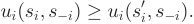

The concept of dominant strategy is the basis of incentivecompatibility (IC), which means that revealing truthful information is the dominant strategy for every player. An accompanying concept is individual-rationality (IR), meaning that every player participating in the game expects to gain no less utility than staying outside. The budget constraint denotes that the total compensation must be bounded in a given budget. We formally introduce the definition of Strategy-Proof and Budget Feasible Mechanism. 

Definition 3 (Strategy-Proof and Budget Feasible Mechanism [31], [44]). A mechanism is strategy-proof and budget feasible when it satisfies incentive-compatibility, individual-rationality, and budget constraint. 

## 3 PROBLEM FORMULATION 

In this section, we first briefly describe the problem of weighted coverage maximization from two different perspectives: algorithm design in the computer science field and mechanism design in the economic field. Then, we propose the formal definition of weighted coverage maximization for mobile crowdsensing. 

### 3.1 Algorithm Design Perspective 

From the perspective of algorithm design, the sensing task allocation can be modeled as the classical problem of weighted coverage maximization [27]. The domain of elements is the set of PoIs H. Let xi ¼ 1 denote that mobile user mi is selected to cover the PoIs in Si � H; otherwise, xi ¼ 0. The objective is to maximize the valuation on the covered points under the constraint that the total cost must be less than a given consumption C. We show the integer program for weighted coverage maximization problem from the perspective of algorithm design. 

Problem: Weighted Coverage Maximization: IP ðC; MÞ 

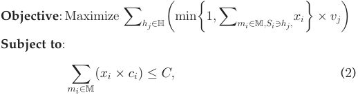

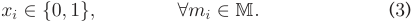

ZHENG ET AL.: A BUDGET FEASIBLE INCENTIVE MECHANISM FOR WEIGHTED COVERAGE MAXIMIZATION IN MOBILE CROWDSENSING 

2395 

In the formulation, we use bidding cost ci, instead of private sensing cost c^i, because in classical algorithm design, we do not consider the strategic behaviors of mobile users. The weighted coverage maximization problem can be proven to be NP-Hard by reducing from the set cover problem [27]. We take advantage of the submodularity of the valuation function to design approximation algorithms. The submodular function is defined as follows. 

- Definition 4 (Submodular Function). Let N be a finite set. A function f : 2N 7! R is a submodular function if fðA [ fxgÞ � fðAÞ � fðB [ fxgÞ � fðBÞ; for any A �B �N and x 2 N nB. 

We show that the service provider’s valuation function is submodular and non-decreasing. 

- Lemma 1. The valuation function of service provider is submodular and non-decreasing. 

- Proof. By Definition 4, we just need to show that the service provider’s valuation function satisfies V ðM1 [ fmigÞ � V ðM1Þ � V ðM2 [ fmigÞ � V ðM2Þ for any mobile user set M1 � M2 � M and mi 2 MnM2. From Definition 1, we have 

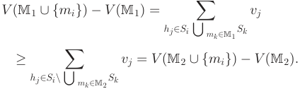

Apparently, for any two sets of mobile users M1 � M2, we have V ðM1Þ � V ðM2Þ. Therefore, the valuation function V ð�Þ is submodular and non-decreasing. tu 

- Definition 5. Given PoI set H, mobile users M, and the bidding profile **b** , the service provider needs a strategy-proof incentive mechanism to recruit data contributors M� � M, such that the service provider’s valuation V ðM� Þ is maximized, subject to the constraint that the total compensations do not exceed a budget B. 

## 4 DESIGN OF BEACON 

In this section, we present a strategy-proof and budget feasible incentive mechanism for weighted coverage maximization in mobile crowdsensing, namely BEACON. BEACON consists of two major components, Sensing Task Allocation and Compensation Determination. Considering the computational intractability of the weighted coverage maximization, we first propose an approximation allocation algorithm, which adopts LP relaxation technique. Next, we present our compensation determination scheme to guarantee strategyproofness and budget feasibility. 

### 4.1 Sensing Task Allocation 

According to Myerson’s theorem [33], the necessary condition of strategy-proof mechanisms is the monotonicity of allocation algorithm. In the problem of coverage maximization, a monotone greedy approach is a nature fit. We first describe a classical but non-monotone greedy allocation algorithm, namely GDY-MAX. We then design the task allocation algorithm by modifying the GDY-MAX algorithm, to satisfy the property of monotonicity. 

Intuitively, a good greedy allocation rule is to select the mobile users that cover a set of high valuable PoIs, while making the total compensations not exceed the budget B. Given the selected mobile users M, we define the marginal contribution of mobile user mi 2 MnM as 

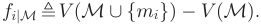

### 3.2 Mechanism Design Perspective 

The essential difference of coverage problems in mobile crowdsensing and in traditional wireless sensor networks is that mobile users do not follow the designed algorithm principle, but rather their own selfish interests. Game theory is a powerful tool to capture such strategic behaviors. Based on Myerson’s theorem [33], a single parameter mechanism, in which players have single private information, is strategyproof when its allocation algorithm is monotone and payment scheme is based on critical payment. 

### Theorem 1 (Myerson’s theorem [33]). A single parameter mechanism is strategy-proof iff: 

- Monotone allocation: Given mobile users’ bid profile **b** , if mobile user mi wins by bidding bi ¼ ðSi; ciÞ, then she will also win by bidding b0 i¼ ðSi; c0 iÞ,where c0 i�ci. 

- Critical Compensation: The monotone allocation implies that there exists a critical compensation pi for each mobile user mi 2 M such that if her bidding cost is lower than pi, she wins; otherwise, she loses. 

In mechanism design, extra compensations should be paid to guarantee the strategy-proofness of mechanisms. Therefore, from the perspective of mechanism design, the budget constraint is applied to compensation instead of cost, i.e., the constraint (2) should be modified toP mi2Mðxi �p iÞ � B. We now formally define the problem of weighted coverage maximization in mobile crowdsensing. 

In the phase of greedy winner selection, mobile users are fijMi�1 sorted according to marginal contribution per cost ci ~~,~~ where Mi�1 denotes the set of i � 1 mobile users that have been previously selected, and M0 ¼ ? . In the sorted list, the ith mobile user is mi� 2 MnMi�1 that has the currently maximal marginal contribution per cost, i.e., 

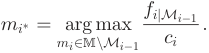

If there are multiple candidate mobile users, we select one of them randomly. The greedy rule and Lemma 1 imply that 

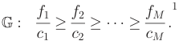

Following the order in G, we greedily add mobile users into winner set until currently considered mobile user mi violates budget feasible allocation condition, which is defined as 

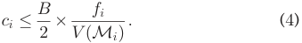

This allocation condition guarantees that the total compensations will be bounded in the budget B, which will be discussed in Section 5.1 in details. 

1. To simplify the notations, in list G, we write fi instead of fijMi�1 . 

IEEE TRANSACTIONS ON MOBILE COMPUTING, VOL. 16, NO. 9, SEPTEMBER 2017 

2396 

By applying the above greedy allocation rule, we obtain a feasible candidate solution, denoted by Mk, in which k users are selected as winners. If we simply return such greedy solution Mk as the result, the approximation ratio of such greedy heuristic allocation algorithm is unbounded. Consider, for example, there are two PoIs h1 and h2 with the valuation v1 ¼ 1 and v2 ¼ p, respectively, and the budget is set as 2ðp þ 1Þ. The mobile user m1 is interested in the sensing task S1 ¼ h1 and has a sensing cost c1 ¼ 1, and the other mobile user m2 has an interested sensing task S2 ¼ h2 and a sensing cost c2 ¼ ðp þ 1Þ. The optimal solution selects the mobile user m2 and achieves the valuation p, while the solution picked by the greedy allocation rule involves the mobile user m1 and reaches the valuation 1. The approximation ratio for this instance is 1=p, which is unbounded. 

Next, we introduce a MAX operation, which is widely used to design well bounded algorithms in submodular maximization [27], [34], to achieve a constant approximation ratio. We consider another feasible candidate solution. Let m� denote the mobile user who covers the most valuable PoIs set, i.e. m� , arg maxmi2M V ðmiÞ: Obviously, the set containing the single most capable mobile user fm� g is also a feasible solution. The idea behind the MAX operation is to take the maximum between these two candidate solutions. We name this greedy allocation algorithm GDY-MAX, and have the following result. 

- Lemma 2. We use OPTIPðB; MÞ to denote the value of optimal solution for weighted coverage maximization problem in mobile crowdsensing. Algorithm GDY-MAX has a constant-factor approximation: <u>e5�e1</u>~~,~~i.e., OPTIPðB; MÞ � e5�e1�max fV ðMkÞ; V ðm�Þ g. 

Proof. Mobile users are sorted as describes in G, and let l be the maximum index that satisfiesPl i¼1ci�B.Forthe convenience of analysis, considering an adding virtual mobile user mþ , whose sensing task bundle does not intersect with the task bundles of all the mobile users M, declares cost cþ ¼ B �Pl i¼1ciandproducesvaluation V ðmþ Þ ¼ B�<u>P</u> clþl <u>i1¼1</u>ci ðV ðMlþ1Þ � V ðMlÞÞ. The idea of setting the sensing cost is to satisfy the budget feasibility constraint. We set the detailed format of valuation V ðmþ Þ so that the marginal contribution per cost of virtual mobile user mþ is identical to that of mobile user mlþ1 in G, i.e., V <u>ðcm</u><u>þþ</u> <u>Þ</u> ¼ <u>ðV ðMlþc1lþÞ�1V ðMlÞÞ</u> ~~.~~ Apparently, the optimal solution over mobile users Mþ ¼ M [ fmþ g is the upper bound of the optimal solution over mobile users M, and the first l mobile users selected in both M and Mþ are the same due to the greedy allocation rule. Therefore, we can analyze the approximation ratio of algorithm GDY-MAX over the set of mobile users Mþ . For the sake of analysis, we denote virtual mobile user mþ as mlþ1 in G. 

According to [27], we can get V ðMlþ1Þ �ð1 � <u>1e</u>~~Þ~~ OPTIPðB; Mþ Þ. We now use V ðMlþ1Þ as the benchmark. Since mobile users are sorted according to their marginal contribution per cost in non-increasing order, for every i 2 ½k þ 1; . . . ; l þ 1�, we have <u>fcii</u>� <u>fckkþþ11</u>.Addingthese inequalities together we get 

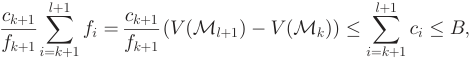

which implies that 

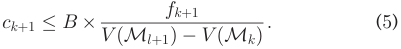

According to the definition of index k, we also have 

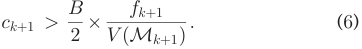

Inequalities (5) and (6) imply that V ðMlþ1Þ � V ðMkÞ < 2V ðMkþ1Þ: Thus, we get 

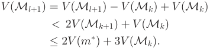

Finally, we get 

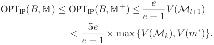

Although the algorithm GDY-MAX has a good approximation ratio, the MAX operation breaks the monotone property of the algorithm. We can easily construct an example, in which GDY � MAXðci; c�iÞ ¼ Mk, but GDY � MAXðc0 i; c�iÞ ¼ fm�g, when c0 i<ciforsomemobileusermi2 Mk,toshowthe non-monotonicity of this maximum operation. Here, GDY � MAXðci; c�iÞ denotes the set of the selected mobile users after running the greedy allocation algorithm GDYMAX with the sensing cost vector c ¼ ðci; c�iÞ, and the vector c�i denotes the sensing cost of all the mobile users except from that of mi. 

Chen et al. in [8] addressed this problem by adopting randomized technique from algorithm design, which have been shown to be impractical in large scale mobile crowdsensing systems in Section 7. Inspired by [5], [29], we turn to the linear rounding technique to guarantee the monotone of the allocation algorithm. Specifically, we can compare V ðm� Þ with the optimal solution of an integer relaxation program, which is “close” to V ðMkÞ, and makes the MAX operation monotone. As shown in Section 3, the weighted coverage maximization problem can be formulated as an integer program, and we rewrite the relaxation version as 

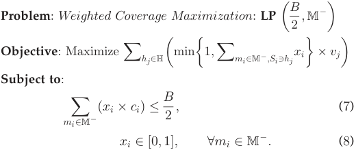

In LPðB2; M�Þ, we relax the variable xi to the real numbers in range of ½0; 1�. We note that, in constraint (7), the bound of total cost is set to B=2. This is because the total cost of winners in set Mk is bounded by B=2.2 We do not consider the 

2. According to the GDY-MAX algorithm, we have the relation that <u>f1 f2 fk</u> 2V <u>ðMkÞ B P1�i�k</u>fi ¼ <u>B</u> c1� c2����� ck� B . Thus,P 1�i�kci� 2� V ðMkÞ 2~~.~~ 

ZHENG ET AL.: A BUDGET FEASIBLE INCENTIVE MECHANISM FOR WEIGHTED COVERAGE MAXIMIZATION IN MOBILE CROWDSENSING 

2397 

mobile user m� in the linear program in order to avoid her manipulation on the result. We also exclude the mobile users with cost larger than B=2, denoted by MB=2, because none of them can be involved into Mk. We denote the remaining buyers as M� , Mn�fm� gS MB=2�. The optimal solution of LPðB=2; M� Þ can be obtained in polynomial time, and denoted by OPTLPðB2; M�Þ. 

Algorithm 1. Sensing Task Allocation 

Input: A mobile user set M, A PoI set H, a budget B, and a biding profile **b** . Output: A set of winning mobile users M� . 

- 1 Mk ? ; 

- 2 m� arg maxmi2M V ðmiÞ; mi� arg maxmi2M <u>fcii</u>; 3 while MnMk 6¼ ? and ci� � <u>B2</u>� V ðMkf[fi� mi� gÞdo 4 Mk Mk S fmi� g; 5 mi� arg maxmi2MnMk <u>fcii</u>~~;~~ 6 M� Mn�fm� gS MB=2�; 7 OPTLPðB2; M�ÞOptimalsolutionfortheintegerrelaxa- tion program LP ~~(~~ <u>B2</u>; M�); 

- 8 if OPTLPðB2; M�Þ � ðe6�e12 Þ2�V ðm�Þ then 9 M� Mk; 

- 10 else 

- 11 M� fm� g; 12 return M� ; 

We now formally present the detailed steps of sensing task allocation in Algorithm 1. In Lines 3-5, we obtain the first candidate solution Mk by greedily selecting mobile users from the sorted list G. Different from GDY-MAX, we compare V ðm� Þ with the optimal solution of the linear program LPðB=2; M� Þ, rather than V ðMkÞ in Line 8. Let u denote the constant ðe6�e12 Þ2. If the optimal value OPTLP~~ð~~ <u>B2</u>; M�Þ is greater than u � V ðm� Þ, then we select Mk as the final winning mobile user set; otherwise, we select fm� g. The constant factor u reflects the “closeness” between OPTLPðB2; M�Þandu0ðMkÞ.Thesettingoftheconstantfac- tor here guarantees a good approximation ratio of Algorithm 1, which will be discussed in Section 5.2. The most time consumption part of Algorithm 1 is the calculation of candidate solution Mk, which needs O�M2� time. Thus, the time complexity of Algorithm 1 is O�M2� . We have the following lemma for Algorithm 1. 

### Lemma 3. Sensing task allocation algorithm is monotone. 

- Proof. To prove the monotonicity of the algorithm, we have to show that any winning mobile user mi 2 M� will still be selected as a winner when she decreases her cost, c0 i�ci. We distinguish the following two cases: 

   - " If M� ¼ fm� g, then it implies that OPTLP ~~ð~~ <u>B2</u>; M�Þ � u � V ðm� Þ. Since the cost of mobile user m� does not affect the value of OPTLPðB2; M�Þand V ðm� Þ, m� will still be selected as a winner if she changes declared cost. 

   - " If M� ¼ Mk, we have OPTLPðB2; M�Þ>u �V ðm�Þ. We assume that mobile user mi 2 Mk decreases her cost from ci to c0 iwhile the bidding costs of the other users c�i stay the same. On the one hand, the value of OPTLP ~~ð~~ <u>B2</u>; M�Þincreaseswhenmi decreases her cost, so the allocation condition at 

Line 8 in Algorithm 1 still holds. On the other hand, in the list G, the mobile user mi is moved forward since c0 i<ci.Weassumethatthenew position index is j � i. According to the submodularity and non-decreasing property of the function V ð�Þ, the marginal contribution of mobile user mi at index i is less than that at index j, i.e., fijMi�1 � fijMj�1 , and we also have V ðMi�1 [ figÞ � V ðMj�1 [ figÞ. We can get that 

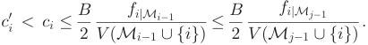

Therefore, the budget feasible allocation condition is also satisfied. Thus, the mobile user mi is still the winner. 

We can conclude that the mobile user mi 2 M� still stays in the winner set when she decreases her cost. Therefore, the task allocation algorithm is monotone. tu 

### 4.2 Compensation Determination 

The basic idea behind compensation determination scheme can be described as follows. If M� ¼ fm� g, we directly set p� as B. Suppose we want to determine the compensation for mobile user mi 2 M� . Similar to the list G, we consider a newly sorted list G�i without mobile user mi. We assume that mobile user mj stays at the jth position in G�i. We calculate the maximum cost p0 iðjÞthatmobileuser mi should declare to win the auction instead of mobile user mj at the jth position in G�i. Since variable p0 iðjÞmay take different values as a function of index j, we take the maximum of these values, and set it as the critical compensation for mi. Winning mobile users achieve their maximum utilities under this compensation determination rule, and thus they have no reason to manipulate the auction. 

For easy illustration, we first introduce a few notations. 

- " M0 jdenotes the first j selected mobile users in G�i. " fj0(orf j0 jM0 j�1)denotesthemarginalcontributionof the mobile user mj in G�i. 

- " k0 is the smallest index that satisfies ck0þ1 � <u>B2</u>� fk00 <u>þ1</u> 

- V ðM<u>0</u> k0 þ1Þin list G�i. 

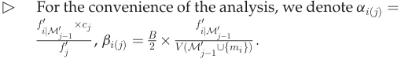

In the phase of compensation determination, for losers, we set their compensations to zeros. To calculate the compensation pi for a winner mi 2 M� , we first sort the mobile users in Mnfmig according to the marginal contribution per cost similarly as before 

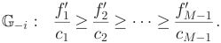

Then the critical compensation pi can be determined in the following stages. In the jth stage ð1 � j �ðk0 þ 1ÞÞ, we calculate the competing cost c0 iðjÞthatthemobileusermi should bid so that at the jth position in G�i, mi will be selected as a winner, instead of mj. This competing declared cost c0 iðjÞshould satisfy the following two conditions. 

IEEE TRANSACTIONS ON MOBILE COMPUTING, 

VOL. 16, NO. 9, SEPTEMBER 2017 

2398 

### Algorithm 2. Compensation Determination 

Input: A mobile user set M, a PoI set H, a budget B, a biding profile **b** , and a set of winning mobile users M� . Output: A compensation profile of mobile users **p** . 

- 1 **p 0** ; 

- 2 if M� ¼ fm� g then 3 p� B; 4 return **p** ; 

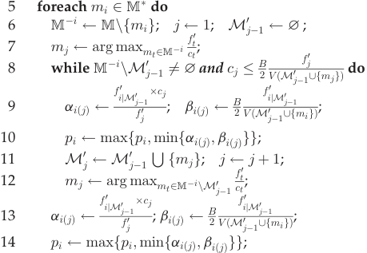

- 15 return **p** ; 

   - I First, at the position j in G�i, mobile user mi’s marginal contribution per cost should be larger than that of mj, i.e., 

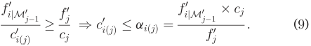

- I Second, c0 iðjÞshould satisfy the budget feasible alloca- tion condition at the jth position in G�i, i.e., 

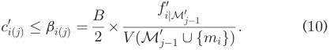

From the two conditions, we can get c0 iðjÞ�p0 iðjÞ¼ minfaiðjÞ; biðjÞg: In Inequality (9), fi0 jM0 j�1 monotonically increases while cj=fj0decreaseswiththeindexj,henceaiðjÞ (and then p0 iðjÞ)variesatdifferentpositionsinG�i.Wetake the maximum of p0 iðjÞat different positions, and regard it as the critical compensation for the mobile user mi, i.e., 

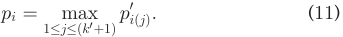

We describe the detailed steps of the compensation determination in Algorithm 2. The time complexity of it is O�M3� . 

Most of the budget feasible mechanisms [8], [45], [46], [56] rely on the compensation determination scheme to guarantee the property of strategy-proofness. The main idea behind the proof is similar. For the completeness of the work, we present the proof here. 

- Lemma 4. The compensation profile **p** is the critical compensations for mobile users. 

- Proof. We show that pi is the critical compensation for the mobile user mi 2 M� . Let r 2 ½0; k0 þ 1� indicate the index of the maximum p0 iðjÞin G�ii.e.,pi¼ p0 iðrÞ. We distinguish the following two cases. 

- " If the cost that mi declares is lower than pi, i.e., ci � pi ¼ p0 iðrÞ,thenshewillbeselectedasawin- ner at the rth position in G, because ci � aiðrÞ and ci � biðrÞ 

- " Otherwise, we can claim that mi will be rejected in the allocation process when she declares a higher cost than pi. We consider the following two different scenarios. 

   - We consider the first scenario, in which aiðrÞ � biðrÞ, implying p0 iðrÞ¼ aiðrÞ.Themobile user mi will be placed behind the rth position in G�i, when she declares a higher cost: ci > aiðrÞ. In sorted list G�i, for each j 2 ½r þ 1; k0 þ 1�, if aiðrÞ is not less than aiðjÞ, then mi will not be allocated at this position since ci > aiðrÞ � aiðjÞ. Otherwise, if aiðrÞ < aiðjÞ at the jth position, we can obtain the following equalities according to the maximality of index r 

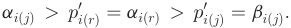

Therefore, declaring a higher cost leads to that ci > aiðrÞ > biðjÞ, which violates the budget feasible allocated condition (i.e., Inequality (10)) at the jth position. Therefore, mi can not win the auction in this scenario. 

� We consider the second scenario, in which aiðrÞ > biðrÞ, implying p0 iðrÞ¼ biðrÞ. Similarly, in sorted list G�i, for each j 2 ½0; k0 þ 1�, if biðrÞ is larger than biðjÞ at the jth position, obviously, mi will not be allocated since ci > biðrÞ > biðjÞ. Otherwise, if biðrÞ is smaller than biðjÞ at some jth position, then the below inequalities can be obtained 

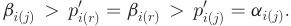

We can get c > biðrÞ > aiðjÞ, and thus mi can also not be allocated at the jth position. Until now, we have proved that pi is indeed a threshold compensation for mi. Then our claim holds. tu 

## 5 ANALYSIS OF BEACON 

In this section, we give theoretical analyses of BEACON. We first prove that BEACON is strategy-proof and budget feasible, and then analyse the approximation ratio of it. 

### 5.1 Economic Properties 

Before proving strategy-proofness of BEACON, we present the following two lemmas. 

- Lemma 5. BEACON satisfies Incentive-Compatibility. 

- Proof. By Lemmas 3, 4 and Theorem 1, we conclude that reporting truthful sensing cost is a dominant strategy for each mobile user, and thus BEACON satisfies IC. tu 

- Lemma 6. BEACON satisfies Individual-Rationality. 

- Proof. The losers have not caused any cost, which must be no larger than their compensations (zeros). We now show that the claim also holds for winner mi 2 M� . It is enough to show that ci � p0 iðjÞfor certain index j in G�i, since piis the maximum over all possible p0 iðjÞ.Weconsidermobile 

ZHENG ET AL.: A BUDGET FEASIBLE INCENTIVE MECHANISM FOR WEIGHTED COVERAGE MAXIMIZATION IN MOBILE CROWDSENSING 

2399 

user mj, who takes the place of mi in G�i. The allocation result before mi in G is the same with the allocation result before mj in G�i, i.e., Mi�1 ¼ M0 j�1.Sincemiisallocated in G, it implies that mi satisfies the budget feasible allocation condition, and we have 

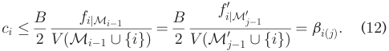

In G, mobile user mi is placed before mj and we have 

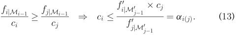

From the inequalities of (12) and (13) and Lemma 6, we can get that ^ci ¼ ci � minfaiðjÞ; biðjÞg � p0 iðjÞ�pi. tu We have the following theorem for BEACON. 

Theorem 2. BEACON is a strategy-proof mechanism. 

Proof. According to Lemmas 6 and 5, BEACON satisfies both IR and IC. Therefore, BEACON is a strategy-proof mechanism for mobile crowdsensing by Definition 3. tu 

Before proving the budget feasibility for BEACON, we first prove a useful lemma. 

Lemma 7. For mobile user set M1 � M2 � M and mobile user fijM1 mi� ¼ arg maxmi2M2nM1 ci, we have 

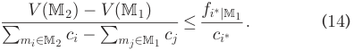

Proof. We prove this lemma by contradiction. Assume that the lemma does not hold, and for each mt 2 M2nM1, we get 

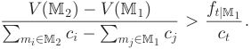

Adding these inequalities together, we have 

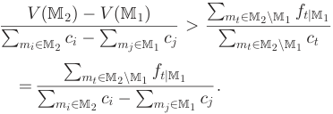

This implies that V ðM2Þ � V ðM1Þ >P mt2M2nM1ftjM 1, which contradicts the submodularity of the V ð�Þ function. tu 

We can show that the critical compensations for winners can be well bounded. 

Lemma 8. For winning mobile user mi 2 M� , her critical compensation pi is upper bounded by V ðfMi~~�~~ Þ�B. 

- Proof. It is easy to show that the claim holds when M� ¼ fm� g. We consider the case, in which M� ¼ Mk. For contradiction, we assume that pi > V ðfMi~~�~~ Þ�B for mi2 Mk. Let r denote the index of maximum p0 ijinG�ithat r ¼ arg maxj2½0;k0þ1� p0 iðjÞ.Accordingtoourcompensation scheme, compensation pi satisfies the following two inequalities: 

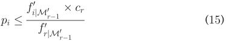

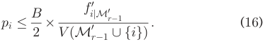

According to the individual rationality property of BEACON in Lemma 5, we get ci � pi. Since the mobile user mi does not win in the first ði � 1Þ positions in the list G, we have p0 iðjÞ<cifor 0 �j �ði �1Þ. These two inequal- ities implies that p0 iðjÞ<p0 iðrÞfor0 �j �ði �1Þ.There- fore, r must be at least i, and we have Mi�1 �M0 r�1. We can assume that M0 r�1[ figzM0 r�1[ Mk.Since otherwise M0 r�1[ fig ¼ M0 r�1[ Mk, applying Inequality (16) and Mi�1 �M0 r�1, we have 

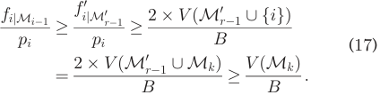

Inequalities (17) implies pi � V ðfMi~~�~~ ÞB,andweobtaina contradiction. Let M1 ¼ M0 r�1[ figandM2¼ M0 r�1[ Mk.Since M1 � M2, we assume that mobile user mr� satisfies f0 tjM1 mr� ¼ arg maxmt2M2nM1 ct~~.~~InG�i,mobileusermrhas the maximum marginal contribution per cost at position f0 f0 r, and thus rc� rjM� <u>1</u> � rcjMr <u>1</u>.Now,wecangetthefollowing inequalities by using inequality (15) and Lemma 7. 

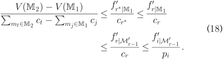

We also know that pi > V ðfMi~~�~~ Þ�B. Hence, we get 

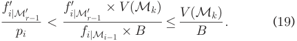

In the list G, we have 

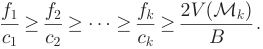

Thus, 

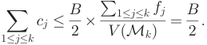

We also have 

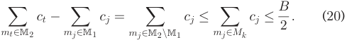

IEEE TRANSACTIONS ON MOBILE COMPUTING, 

VOL. 16, 

NO. 9, SEPTEMBER 2017 

2400 

Combining these inequalities (18), (19), and (20), we get 

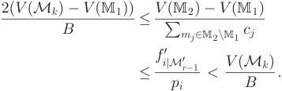

Thus, V ðMkÞ < 2 � V ðM1Þ ¼ 2 � V ðM0 r�1[ figÞ.Together with inequality (16), we get 

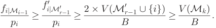

Hence, we get a contradiction pi � V ðfMi~~�~~ Þ�B.Therefore, the critical compensation pi is upper bounded by V ðfMi~~�~~ Þ�B. tu 

Based on Lemma 8, we have the following theorem. 

Theorem 3. BEACON is a budget feasible mechanism. 

Proof. By Lemma 8, pi � V ðfMi~~�~~ ÞB, for mi2 M�. Adding these <u>Pmi2M</u>�fi inequalities, we getP mi2M�pi� V ðM~~�~~ Þ B ¼ B: Therefore, BEACON is budget feasible. tu 

### 5.2 Approximation Ratio 

Before giving the approximation ratio of BEACON, we first consider another non-linear program for weighted coverage maximization. By using this non-linear program and pipage rounding technique [2], we analyze the “closeness” between OPTLP�B2; M� � and OPTIP�B2; M� �, which is basis for the proof of approximation ratio. 

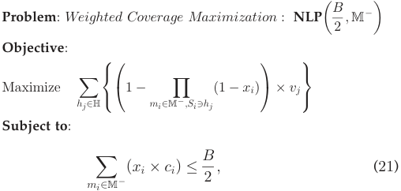

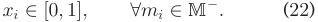

We reformulate the objective function as a nonlinear function, and the set of constraints, denoted by Q, is identical with that in LP ~~ð~~ <u>B2</u>; M�Þ. The relationship between NLP ~~ð~~ <u>B2</u>; M�Þ and LP~~ð~~ <u>B2</u>; M�Þ is given in the following lemma. 

Lemma 9. For any **x** satisfies constraints Q, we have NLPð **x** Þ � �1 � <u>1e�</u> LPð **x** Þ. 

Proof. It suffices to show that 1 �Q mi2M� ;Si3hjð1 �xiÞ � ð1 � <u>1e</u>Þmin n1; P mi2M� ;Si3hjxi o for all hj 2 H. We indicate k as the maximum number of sensing task bundles a PoI can appear in. Applying the AM-GM inequalities, we have 

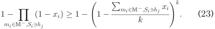

- " When<u>P</u> mi2M� ;Si3hjxi�1,theRHSisatleast 1 �ð1 � k1~~Þ~~k,whichislargerthan1 � <u>1e</u>,thenour claim holds. 

- " We consider the other case, in which Pmi2M� ;Si3hjxi<1. Set function gðtÞ ¼ 1 � �1 � kt�k. It is easy to check that gðtÞ is monotone increasing and concave in ½0; 1�, so gðtÞ �ð1 � tÞgð0Þ þ <u>1</u> 

- tgð1Þ ¼ th1 � �1 � k�ki. Thus, combining with Inequality (23), we get 

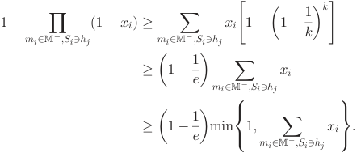

Finally, the lemma holds. tu 

Let OPTLP�B2; M� � and OPTIP�B2; M� � denote the value of the optimal outcome of program LP ~~ð~~ <u>B2</u>; M�Þ and IP~~ð~~ <u>B2</u>; M�Þ, respectively. We can get the following lemma by using the pipage rounding technique [2], which is a general method of designing constant-factor approximation algorithm for optimization problems with budget-type constraints. Lemma 10. Given the optimal fractional solution **x**� of the linear program LP ~~ð~~ <u>B2</u>; M�Þ, we can obtain an integer solution**x**intfor NLP ~~ð~~ <u>B2</u>; M�Þ, such that OPTLP�B2; M� � ¼ LPð **x**� Þ � ðe2�e1Þ <u>2e B</u> NLPð **x**int Þ � ðe�1ÞOPTIP � 2; M� �. 

Proof. By applying Lemma 9, we get 

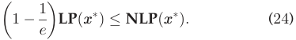

Using the pipage rounding technique, we start from the fractional solution **x**� to obtain an integer solution **x**int , such that <u>12</u>NLPð**x**�Þ �NLPð**x**intÞ. We briefly describe the steps. 

- 1) Set **x**0� ¼ **x**� , and repeat the following steps until **x**0� is a f0; 1g-vector or has at most one fractional variable. 

   - a) For any two fractional variables, denoted by x� k and x� j, in**x**0�, we construct vector**E**x and "1; "2. 

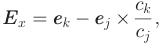

where **e** k ( **e** j) is the vector with 1 at the kth (jth) position and 0 otherwise 

- cj cj 

- "1 ¼ min 1 � x� k; x� j ; "2 ¼ min x� k; ð1 �x� jÞ : � ck� � ck� 

- b) If NLPð **x**0� þ "1 **E** xÞ � NLPð **x**0� � "2 **E** xÞ, **x**0� ¼ ð **x**0� þ "1 **E** xÞ, otherwise, **x**0� ¼ ð **x**0� � "2 **E** xÞ. 

- 2) If **x**0� is already a f0; 1g-vector, we set **x**int ¼ **x**0� . Otherwise, we round up the single fractional variable, denoted by x� i,to1.Weconsiderfx� ig as a candidate feasible solution, and the remainder integer variables in **x**0� , denoted by **x**0� �i,is 

ZHENG ET AL.: A BUDGET FEASIBLE INCENTIVE MECHANISM FOR WEIGHTED COVERAGE MAXIMIZATION IN MOBILE CROWDSENSING 

2401 

another candidate feasible solution. We take the maximum between these two candidate solutions as the integer solution **x**int , i.e., **x**int ¼ arg max�NLP� **x**0� �i�; NLP�x� i ��. The correctness of the above procedure follows from the factor that **x**0� þ "1 **E** x and **x**0� � "2 **E** x are feasible vectors in Q with at least one less fractional variable. Furthermore, the objective function NLPð **x**0� þ " **E** xÞ is convex w.r.t. ". Since NLPð **x**0� Þ � "1"þ2"2NLP ð**x**0�þ "1**E**x Þ þ "1"þ1"2NLP ð**x**0��"2**E**x Þ; we know that 

NLPð **x**0� Þ � maxfNLPð **x**0� þ "1 **E** xÞ; NLPð **x**0� � "2 **E** xÞg: Therefore, in the above procedure, the value of NLPð **x**0� Þ never goes down. After Step 1Þ, **x**0� has at most one fractional variables. In Step 2Þ, we take the maximum between the two candidate solutions as the integer solution **x**int , which guarantees that 

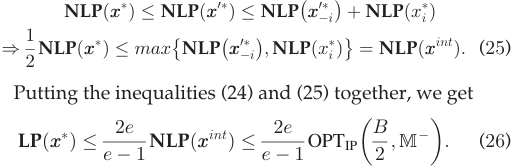

Until now, we have completed the proof. tu 

We now present the approximation ratio of BEACON. 

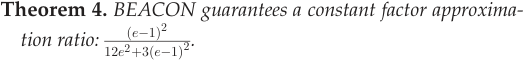

Proof. Recall that in Algorithm 1, we first compute the optimal fractional solution over M� with a budget B=2. Applying Lemma 10, we have OPTLP�B2; M� � � e2�e1 OPTIP�B2; M� �: Using the similar method in the analysis of Lemma 2, we can prove that OPTIP�B2; M� � � e3�e1 maxfV ðMkÞ; V ðm� Þg: Thus, we get 

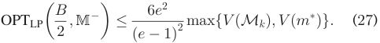

<u>B 6e</u>2 We distinguish two cases. If OPTLP� 2; M� � � ðe�1Þ2 V ðm� Þ, the above inequality implies that V ðMkÞ > V ðm� Þ, and applying Lemma 2, we get OPTIPðB; MÞ � e5�e1V ðMkÞ.Thedesiredapproximationratioisachieved. <u>B 6e</u>2 Otherwise, if OPTLP� 2; M� � < ðe�1Þ2V ðm�Þ, we have 

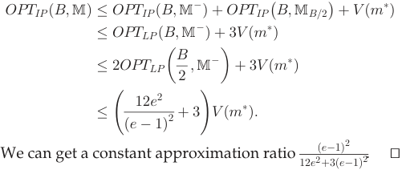

## 6 EXTENSIONS TO DIFFERENT COVERAGE MODELS 

In this section, we extend BEACON to adapt to Area Coverage and Multiple Coverage. 

Fig. 2. Zones and valid zones in area coverage. 

### 6.1 Area Coverage 

Area coverage is required in many sensing applications, such as air pollution monitoring or electromagnetic field radiation monitoring. In area coverage, the service provider would like to maximize the coverage of the interested regions under a budget constraint. We can transform the area coverage to the point coverage by regarding Valid Zones as PoIs. 

Definition 6 (Valid Zone). Given the set of sensing regions (i.e., the sensing circular disks of mobile users) and the interested geographic regions, a zone is a region, in which any two points are covered by the same set of sensing regions. A zone is valid if it intersects with the interested regions. 

In Fig. 2, zones are denoted as Z1 to Z11, among which Z1 to Z7 are valid zones. The service provider virtually puts a “PoI” in each valid zone, and assigns the valuation on the “PoI” with the size of the intersection area of valid zone and interested regions. A valid zone is covered if and only if the associated “PoI” is covered. We transform the area coverage to the point coverage, and thus BEACON can be applied in area coverage scenario. 

### 6.2 Multiple Coverage 

Since mobile devices are diverse in terms of the capabilities of embedded sensors, residual battery level, and other factors, the sensory data may have different qualities. Therefore, in some mobile sensing applications, the service provider need to cover each PoI multiple times to guarantee the requested quality of service or to achieve high fault tolerance. 

We can simply model the service provider’s valuation on a PoI hi 2 H as vi ¼ qi � v^i, in which v^i is the valuation of single coverage on hi, and qi is the minimum between actual coverage times and the required coverage times on hi.3 It is easy to verify that the valuation function V ð�Þ of the service provider in multiple coverage also satisfies the submodular property. Therefore, BEACON are also suitable here. 

## 7 NUMERICAL RESULTS 

In this section, we show the numerical results from our evaluations based on the sensory data collected from a practical mobile crowdsensing system. 

A Noise Map Crowdsensing System. Noise pollution is a serious problem in many cities. Although authorities in some big cities have deployed professional measurement 

> 3. This valuation format is derived from the place-centric crowdesnig applicaitons discussed in [9], such as research prototypes [10], [50] and commercial systems [14], [16]. We can adopt other valuation formats in different mobile crowdsensing applications. The requirement is that the valuation functions should satisfy the submodularity. 

IEEE TRANSACTIONS ON MOBILE COMPUTING, VOL. 16, NO. 9, SEPTEMBER 2017 

2402 

Fig. 3. The noise map of a selected campus from 11 a.m. to 1 p.m.. 

devices to monitor the noise level in the cities, the noise maps they create are usually not fine-grained enough to reflect the noise variations in spatial and temporal dimensions. Furthermore, this method is expensive both in hardware as well as manpower. Mobile crowdsensing is a novel approach to solve this dilemma, and some noise map crowdsensing systems have been developed, e.g., NoiseTube [36] and Noisemap [35]. We deploy a noise map crowdsensing system in a selected campus (around 3 km2 ). We modify the source code of NoiseTube, which has been published on Google Code under the GNU LGPL v2.1 [37], and launch it on Google Nexus 7 tablet. We virtually deploy noise measurement PoIs on the main roads in the campus, and set the distance between two PoIs as 10 m. There are total 792 PoIs deployed in the campus. We recruit 15 volunteers to collect sensory data by walking around the campus from 11 a.m. to 1 p.m. every day in one week. Their sensing ranges are set as 5 m. Each piece of collected sensory data contains noise level in dB(A), timestamp, and GPS location. By averaging the collected noise levels on each PoI, we create the noise map of the campus, shown in Fig. 3. 

We implement BEACON, and evaluate its performance based on the collected data set. We partition the data set into three subsets by regions, and summarize the datasets’ information in Table 1. Here, # SD is the abbreviation of the number of sensory data, and k denote the number of sensory data that cover one PoI. In the mobile crowdsensing system for noise map construction, we can recruit several mobile users to cover one PoI multiple times, providing fault tolerance guarantee and then the high data quality. Therefore, we adopt the multiple coverage model, and set the required coverage time for each PoI as 3. We now describe the detailed setting for parameters of the simulation. The valuation of covering the PoI hi for qi times is vi ¼ minfqi; 3g � v^i, where v^i is the valuation of single coverage and is randomly selected from the range ½1; 10�. We regard one piece of sensory data in the datasets as one data contributor4 . We build a set of experiment configurations by sampling different numbers of data contributors from the datasets. The number of data contributors varies from 200 to 2,000 with increment of 

> 4. Since the scale of crowdsensing system we deployed is relatively small, we use this method to simulate a large scale crowdsensing system. This assumption does not affect the insights we derived from the evaluation results. 

TABLE 1 

Summary of Three Data Sets 

|Data Sets|#SD|#PoIs|#PoIs (k�3)|#PoIs (k < 3)|
|---|---|---|---|---|
|Data Set 1|4,744|792|417|375|
|Data Set 2|2,669|505|271|234|
|Data Set 3|2,708|358|181|177|

200. For the data contributor mi, her interested sensing task bundle is the set of PoIs within her sensing region, and her sensing cost ci is uniformly distributed over ½1; 10�. We assume that budget spans from 1,500 to 15,000 with increment of 1,500. All the results of performance are average over 400 instances. We adopt the Gurobi optimizer [18], a commercial optimization solver, to obtain the optimal solution of the linear programming LP ðB2; M�ÞinAlgorithm1. We also implement greedy algorithm (denoted as GDY) in paper [27], a near-optimal uniform price (denoted as Uniform) described in technical report [1], and the randomized mechanism (denoted as Random) from paper [8] as benchmarks.5 Algorithm GDY is not strategy-proof and assumes the full knowledge of the data contributors’ private costs. Metrics. We evaluate three metrics: 

- I Service Provider’s Valuation: The valuation over the covered PoIs. 

- I Winner Ratio: The percentage of winning data contributors over the all data contributors. 

- I Coverage Ratio: The percentage of covered PoIs. We call a PoI is covered, when it is covered by at least one winning data contributors. 

### 7.1 Impacts on Service Provider’s Valuation 

We present the simulation results on service provider’s valuation in this section. As the evaluation results of the three data sets are similar, so we just show the results over Data Set 1 here. Fig. 4a shows the service provider’s valuation on the data set 1 when the number of data contributors is fixed at 1,000 and the budget varies from 1,500 to 15,000. From the figure, we can observe that when the budget increases, the valuation of service provider increases simultaneously in algorithms BEACON and Random. The reason is that when the budget becomes larger, more data contributors can be recruited, leading to higher PoI coverage. When the budget increases more than 3,000, the greedy algorithm GDY can cover almost all PoIs and obtain a stable and near optimal performance. Algorithm GDY works well in practice, but it does not have any guarantee on preventing strategic behaviours of data contributors. By contrast, BEACON has good system performance: it approaches the result of GDY when the budget becomes larger, and BEACON also achieves strategy-proofness. The uniform price mechanism is comparable with BEACON when the budget is small. Note that in the uniform price mechanism, in some instances the service provider’s valuation decreases while the budget increases. This is because we estimate a threshold price according to the distribution of sensing cost, and the valuation maximizing group we select may not be the optimal one when the budget is large. Despite its theoretically good guarantees, the 

> 5. We do not implement the deterministic mechanism in [8], because it needs to solve the optimal solution to a submodular maximization problem, and thus is computationally inefficient in practical mobile crowdsensing system. 

ZHENG ET AL.: A BUDGET FEASIBLE INCENTIVE MECHANISM FOR WEIGHTED COVERAGE MAXIMIZATION IN MOBILE CROWDSENSING 

2403 

Fig. 4. Impacts on service provider’s valuation and winner ratio on data set 1. 

randomized mechanism Random performs poorly in practice, even worse than the uniform price mechanism. This is due to the fact that in order to guarantee bounded approximation in worst cases, Random has some probability to choose the data contributor with maximum valuation. In practical mobile crowdsensing system, the valuation produced by one data contributor is relatively smaller than that produced by the greedy procedure, so it largely degrades the system performance when just choosing one data contributor. BEACON avoids this degradation by using the linear programming technique during data contributors selection. 

Fig. 4b shows the valuation of service provider when the budget is fixed at 12,000 and the number of data contributors varies from 200 to 2,000. We can see that service provider’s valuation grows with the increase of data contributors in all the four algorithms. This is because the service provider can use the fixed budget more effectively among more data contributors, i.e., the service provider can select data contributors with lower costs to cover PoIs under a certain budget. Again, BEACON approaches the performance of GDY, and outperforms Uniform and Random. 

### 7.2 Impacts on Winner Ratio 

We now show the winner ratio of GDY, BEACON, Uniform and Random. By fixing the budget at 12,000 and varying the number of data contributors from 200 to 2,000, we calculate the winner ratio, and plot the results in Fig. 4c. We can see that the winner ratio of algorithm GDY, BEACON and Random decreases with the increment of data contributors. This is because larger number of data contributors leads to more intense competition on limited PoIs, and thus the winner ratio decreases. The winner ratio of the uniform price mechanism maintains around 0.5 when the number of data contributors is less than 1,400, and decreases when the number of data contributors becomes larger. According to the principle of uniform price mechanism, the percentage of data contributors in one group still stays the same in different number of total data contributors. Mechanism Uniform can select almost all the data contributors in one group as the winners 

Fig. 5. Coverage ratio of BEACON. 

when the number of total data contributors are small. Therefore, the winner ratio of mechanism Uniform maintains at a stabilized level in small scale of mobile crowdsensing. 

Remark. The evaluation results in Fig. 4 demonstrate that BEACON not only has good theoretical properties, but also works well in practical mobile crowdsensing systems. BEACON always outperforms the uniform price mechanism in all set of simulations. This indicates that different pricing is necessary, and the uniform price mechanisms, which are used in current crowdsourcing platforms is not efficient in mobile crowdsensing systems. Although the mechanism Random has good approximation ratio in theory, it performs poorly in practice, even worse than the performance achieved by the uniform price mechanism. 

### 7.3 Impacts on Coverage Ratio 

As the results of algorithms GDY, Uniform and Random are similar to those in Fig. 4, we just show the coverage ratio of BEACON over three different data sets in Fig. 5. The number of data contributors is set as 200 and 2,000, and the budget is set as 1,500 and 30,000.6 From Fig. 5, we can observe that, in each data set, the coverage ratio grows when the budget or the number of data contributors increases. On one hand, the service provider can use the fixed budget more effectively when there are more data contributors. On the other hand, the service provider can recruit more data contributors to cover more PoIs when the budget becomes large. We can also see that the coverage ratio of data set 3 is better than that of the other two data sets. This is because the number of PoIs in data set 3 is the smallest, and when the same number of PoIs are covered, data set 3 has highest coverage ratio. BEACON achieves the best coverage ratio (around 86.5 percent), when the budget is 30,000 and the number of data contributors is 2,000 in data set 3. BEACON does not achieve full coverage when the budget is large, because some PoIs are not covered by any buyer from the selected 2,000 buyers. 

## 8 RELATED WORK 

In this section, we briefly review related work. 

### 8.1 Coverage in Wireless Sensor Networks 

There is a lot of work on designing algorithms for coverage problems in sensor networks. We refer to [21] for a comprehensive survey. Some work focus on designing optimal deployment patten to adapt different coverage scenarios. For instance, Sheng et al. [42] designed approximate deployment patterns for bounded areas. Bai et al. [6] considered the optimally of multi-coverage deployment patterns. Recently, Willson et al. [51] improved the approximation ratio for 

6. In this set of simulations, we set the budget as 30,000, because we want to investigate the coverage ratio of BEACON under a relatively large budget. 

IEEE TRANSACTIONS ON MOBILE COMPUTING, 

VOL. 16, NO. 9, SEPTEMBER 2017 

2404 

Fig. 6. The approximation ratios of current budget feasible mechanisms for the problem of weighted coverage maximization. The approximation ratio of Anari et al. [4] is obtained under the assumption of large scale crowdsourcing markets. 

maximizing lifetime of k-coverage. There is also some work considering different coverage models. For example, Wan et al. [49] designed approximation algorithms for coverage with disparate ranges. Alam et al. [3] studied on the coverage problems in three-dimensional space. 

However, none of the existing work considers the coverage problem with selfish and rational sensor nodes. 

### 8.2 Mobile Crowdsensing 

Recently, incentive mechanisms for mobile crowdsensing have been widely studied in the literature [13], [15], [22], [24], [28], [30], [54]. In paper [22], [30], the authors designed dynamic price scheme for participatory sensing without considering the strategic behaviors of mobile users. Papers [23], [41] takes the quality of collected data into account when designing the incentive mechanisms for mobile crowdsensing. Kawajiri [26] designed incentive mechanisms to steer mobile users to collect data at certain locations, and then improve the overall quality of sensing services. Karaliopoulos et al. discussed the influence of mobility on the user recruitment in mobile crowdsensing [24]. Xiong et al. [53] and Zhang et al. [55] coupled the energy efficiency with the probabilistic coverage constraint during recruiting workers for mobile crowdsensing. Some incentive mechanisms have been designed for task allocation in crowdsourcing markets [25], [46]. These mechanisms cannot be directly applied in mobile crowdsensing, because the location property of sensing tasks should be taken into account. 

The most closely related works about considering coverage problem in mobile crowdsensing are MSening auction [54], Optimal auction [28], Posted-Pricing [19], TRAC [13], MCS [20], OMZ(G) [56], and Lyapunov-based VCG auction [15]. MSensing auction [54] maximizes service provider’s profit, but does not consider the location-aware coverage requirement. Optimal auction [28] and Posted-Pricing [19] minimize the expected compensation under certain quality constraint for the sensing service, which is the dual problem to the budget feasible coverage problem considered in our paper. TRAC minimizes the total cost of winning mobile users under the constraint that all PoIs have to be covered, without any bound for the expenditure of recruiting mobile users. MCS is a truthful scheduling mechanism for mobile crowdsensing. MCS investigates the coverage problem in the time dimension, and proposes polynomial-time mechanisms in both offline and online scenarios. OMZ(G) are online budget feasible incentive mechanisms for coverage maximization, but their approximation ratio analysis is based on some distribution of valuation and cost, and then is weak. Gao et al. studied the problem of mobile user selection in a general time-dependent and location-aware participatory sensing system, providing the long-term user participation incentive [15]. They considered the different information scenario, and proposed a Lyapunov-based VCG auction for the 

online sensor selection. The problem formulation in their paper is to maximize the social welfare under the participatory constraint. However, in this paper, we considered another fundamental problem, aiming to maximize the valuation of the service provider with a budget constraint. 

### 8.3 Budget Feasible Mechanism Design 

Budget feasible incentive mechanism design is a newly emerging branch in mechanism design, and is initially studied by Singer [44]. In Fig. 6, we present the approximation ratios of the current budget feasible mechanisms in the literature for the problem of weighted coverage maximization. Singer designed a two-approximation mechanism for the case of symmetric submodular function, and a randomized mechanism for the general submodular function with a loose approximation ratio 1=112 � 0:00892 [44]. Chen et al. [8] improved the theoretical results of Singer’s work. For the case of submodular function, Chen et al. designed a randomized budget feasible mechanism with an approximation ratio of 1=7:91 � 0:126 in polynomial time and a deterministic one with an approximation ratio of 1=8:34 � 0:120 in exponential time. Chen et al. also demonstrated that no mechanism can f **f** achieve an approximation ratio better than 1=ð1 þ p2Þ � 0:414 and 1=2 ¼ 0:5 for deterministic and randomized mechanisms, respectively. Dobzinski et al. considered the procurement auction with a general complement-free objective function in the budget feasibility model [12]. They proposed a randomized universally truthful mechanism, achieving an approximation ratio O ~~ð~~ log <u>1</u>2 ðnÞÞ.Later,Beietal.improvedthe 

approximation ratio to a sub-logarithmic one O ~~ð~~ lologg lo ng nÞ for the complement-free objective function, and a constant approximation ratio for the XOS objective function [7]. Bei et al. also designed a constant approximation mechanism for all subadditive functions in Bayeisan environment. Anari et al. investigated the budget-feasible mechanism design for large crowdsourcing markets, in which the cost (utility) of individual worker is small compared to the budget (valuation) of the service provider [4]. For the case of submodular valuation function, they designed deterministic mechanisms that achieve the approximation ratios of 1=2 and 1=3 with exponential and polynomial time complexity, respectively, under the assumption of large scale markets. Budget feasible incentive mechanisms have also been applied into social network [45] and crowdsourcing markets [46]. Singer considered the unweighted coverage model for the influence maximization in social network [45], while we investigated various weighted coverage models, such as area coverage and multiple coverage,in mobile crowdsensing. 

The works [8] and [44] adopted the randomization technique in algorithm design to tackle the issue of the nonmonotonicity of the MAX operation in GDY-MAX algorithm, and then to guarantee the strategy-proofness. However, the randomized mechanisms do not perform well, and even are impractical for large scale markets. On one hand, at each running time, the randomized mechanism might return different outcomes for the same inputs, which causes unfairness among mobile users. For some instances, the mobile users with a large coverage range and a low sensing cost might be dropped out with a certain probability, in 

ZHENG ET AL.: A BUDGET FEASIBLE INCENTIVE MECHANISM FOR WEIGHTED COVERAGE MAXIMIZATION IN MOBILE CROWDSENSING 

2405 

order to guarantee the overall expected performance. It is difficult for the service provider to explain such design rationale behind the randomized mechanism for the losing mobile users, resulting in that the randomized mechanism is difficult to deploy in practice. On the other hand, in the large scale mobile crowdsensing systems, the service provider always offers a high budget, which is significantly larger than the sensing cost of the individual mobile user.7 This implies that the mobile user with the largest valuation would seldom be the optimal solution in such scenario. However, in order to satisfy the performance guarantee in the worst cases, the randomized mechanisms [8], [44] have a substantial probability (e.g., 0.4 in [8]) to return the most capable mobile user with the highest coverage valuation as the result, leading to the average performance degradation. Based on these reasons, we can safely conclude that the randomized budget feasible mechanisms are not suitable for practical mobile crowdsensing markets. Although the deterministic budget feasible mechanism in paper [8] achieves the approximation ratio of 1=8:34 � 0:120, it requires an exponential running time to compute the optimal solution for a submodular maximization problem. Therefore, we turn to design a deterministic, computationally efficient and budget feasible mechanism for mobile crowdsensing markets. 

In this paper, we rely on the linear programming rounding technique (refer to as pipage rounding in [2]) and the characterization of compensations in [44] to develop a deterministic, computationally efficient, strategy-proof, and budget feasible mechanism for the problem of weighted coverage maximization in mobile crowdsensing. BEACON can efficiently compute the optimal solution to the linear programming in the allocation algorithm, bypassing the hardness of solving the submodular optimization problem in [8]. Although BEACON has a weaker approximation ratio (1=33 � 0:03) than that (1=8:34 � 0:120) of the deterministic mechanism in [8], BEACON has polynomial time complexity, which is more desirable for practical markets. We also emphasize that BEACON is a deterministic mechanism, overcoming the issues caused by the randomized mechanisms. The approximation ratio of BEACON is independent on the scale of mobile crowdsensing markets. With the assumption of large scale markets, the allocation algorithm of BEACON is identical to that in [4]. Thus, we can couple with the payment rule and the analysis technique in [4] to derive a better approximation ratio. 

Pipage rounding is a generalized method of designing constant-factor approximation algorithm for optimization problems with budget-type constraints [2], and has been applied to solve the optimization problems in different network scenarios, such as optimal selection of monitoring nodes in multi-channel multi-radio WMNs [43]. 

## 9 CONCLUSION 

In this paper, we have made an in-depth study on the problem of weighted coverage maximization for mobile crowdsensing. We have proposed a budget feasible and strategyproof incentive mechanism for mobile crowdsensing, namely BEACON. Our theoretical analysis has showed that BEACON achieves budge feasibility, strategy-proofness, 

7. We note that the large scale markets we discuss here is consistent with the definition in paper [4]. 

and a constant approximation ratio. We have evaluated the performance of BEACON based on the collected sensory data from a practical crowdsensing system. The evaluation results have shown that BEACON has good performance, in terms of the service provider’s valuation, winner ratio, and coverage ratio. 

## ACKNOWLEDGMENTS 

This work was supported in part by the State Key Development Program for Basic Research of China (973 project 2014CB340303), in part by China NSF grant 61672348, 61672353, 61422208, 61472252, 61272443 and 61133006, in part by Shanghai Science and Technology fund 15220721300, in part by CCF-Tencent Open Fund, and in part by the Scientific Research Foundation for the Returned Overseas Chinese Scholars. Z. Zheng was supported by a Google PhD Fellowship and Microsoft Asia PhD Fellowship. The opinions, findings, conclusions, and recommendations expressed in this paper are those of the authors and do not necessarily reflect the views of the funding agencies or the government. Fan Wu is the corresponding author. 

## REFERENCES 

- [1] Z. Zheng, F. Wu, X. Gao, H. Zhu, S. Tang, and G. Chen, “A budget feasible incentive mechanism for weighted coverage,” Shanghai Jiao Tong University, Shanghai, China, Technical report, 2016. [Online]. Available: http://www.cs.sjtu.edu.cn/~fwu/res/ Paper/CrowdsensingTR.pdf, Rep. ZFGZTC2016, Nov. 2016. 

- [2] A. A. Ageev and M. I. Sviridenko, “Pipage rounding: A new method of constructing algorithms with proven performance guarantee,” J. Combinatorial Optimization, vol. 8, no. 3, pp. 307–328, 2004. 

- [3] S. M. N. Alam and Z. J. Haas, “Coverage and connectivity in three-dimensional networks,” presented at the 12th Int. Conf. Mobile Comput. Netw., Los Angeles, CA, USA, Sep. 2006. 

- [4] N. Anari, G. Goel, and A. Nikzad, “Mechanism design for crowdsourcing: An optimal 1–1/e competitive budget-feasible mechanism for large markets,” presented at the IEEE 55th Annu. Symp. Found. Comput. Sci., Philadelphia, PA, USA, Oct. 2014. 

- [5] Y. Azar and I. Gamzu, “Truthful unification framework for packing integer programs with choices,” presented at the 35th Int. Colloquium Automata Languages Program., Part I, Reykjavik, Iceland, Jul. 2008. 

- [6] X. Bai, Z. Yun, D. Xuan, B. Chen, and W. Zhao, “Optimal multiplecoverage of sensor networks,” presented at the 30th Annu. IEEE Conf. Comput. Commun., Shanghai, China, Apr. 2011. 

- [7] X. Bei, N. Chen, N. Gravin, and P. Lu, “Budget feasible mechanism design: From prior-free to Bayesian,” presented at the 44th Annu. ACM Symp. Theory Comput., New York, NY, USA, 2012. 

- [8] N. Chen, N. Gravin, and P. Lu, “On the approximability of budget feasible mechanisms,” presented at the 22nd Annu. ACM-SIAM Symp. Discrete Algorithms, San Francisco, CA, USA, Jan. 2011. 

- [9] Y. Chon, N. D. Lane, Y. Kim, F. Zhao, and H. Cha, “Understanding the coverage and scalability of place-centric crowdsensing,” presented at the ACM Int. Joint Conf. Pervasive Ubiquitous Comput., Zurich, Switzerland, Sep. 2013. 

- [10] Y. Chon, N. D. Lane, F. Li, H. Cha, and F. Zhao, “Automatically characterizing places with opportunistic crowdsensing using smartphones,” presented at the ACM Int. Joint Conf. Pervasive Ubiquitous Comput., Pittsburgh, PA, USA, Sep. 2012. 

- [11] E. H. Clarke, “Multipart pricing of public goods,” Public Choice, vol. 11, pp. 17–33, 1971. 

- [12] S. Dobzinski, C. H. Papadimitriou, and Y. Singer, “Mechanisms for complement-free procurement,” in Proc. 12th ACM Conf. Electron. Commerce, 2011, pp. 273–282. 

- [13] Z. Feng, Y. Zhu, Q. Zhang, L. M. Ni, and A. V. Vasilakos, “TRAC: Truthful auction for location-aware collaborative sensing in mobile crowdsourcing,” presented at the 33rd IEEE Int. Conf. Comput. Commun., Toronto, Canada, Apr. 2014. 

- [14] FieldAgent. (2009). [Online]. Available: http://www.fieldagent. net/ 

IEEE TRANSACTIONS ON MOBILE COMPUTING, 

VOL. 16, NO. 9, SEPTEMBER 2017 

2406 

- [15] L. Gao, F. Hou, and J. Huang, “Providing long-term participation incentive in participatory sensing,” presented at the 34th IEEE Int. Conf. Comput. Commun., Hong Kong, China, Apr. 2015. 

- [16] Gigwalk. (2010). [Online]. Available: http://gigwalk.com/ 

- [17] T. Groves, “Incentives in teams,” Econometrica: J. Econometric Soc., vo. 41, pp. 617–631, 1973. 

- [18] Gurobi optimizer. (2008). [Online]. Available: http://www. gurobi.com/ 

- [19] K. Han, H. Huang, and J. Luo, “Posted pricing for robust crowdsensing,” presented at the 17th ACM Int. Symp. Mobile Ad Hoc Netw. Comput., Paderborn, Germany, Jul. 2016. 

- [20] K. Han, C. Zhang, J. Luo, M. Hu, and B. Veeravalli, “Truthful scheduling mechanisms for powering mobile crowdsensing,” IEEE Trans. Comput., vol. 65, no. 1, pp. 294–307, Jan. 2016. 

- [21] C.-F. Huang and Y.-C. Tseng, “The coverage problem in a wireless sensor network,” in Proc. 2nd ACM Int. Conf. Wireless Sensor Netw. Appl., Sep. 2003, pp. 115–121. 

- [22] L. Jaimes, I. Vergara-Laurens, and M. Labrador, “A location-based incentive mechanism for participatory sensing systems with budget constraints,” presented at the IEEE Int. Conf. Pervasive Comput. Commun., Lugano, Switzerland, Mar. 2012. 

- [23] H. Jin, L. Su, D. Chen, K. Nahrstedt, and J. Xu, “Quality of information aware incentive mechanisms for mobile crowd sensing systems,” presented at the 16th ACM Symp. Mobile Ad Hoc Netw. Comput., Hangzhou, China, Jun. 2015. 

- [24] M. Karaliopoulos, O. Telelis, and I. Koutsopoulos, “User recruitment for mobile crowdsensing over opportunistic networks,” presented at the 34th IEEE Int. Conf. Comput. Commun., Hong Kong, China, Apr. 2015. 

- [25] D. Karger, S. Oh, and D. Shah, “Budget-optimal crowdsourcing using low-rank matrix approximations,” presented at the 49th Annu. Allerton Conf. Commun. Control Comput., Monticello, IL, USA, Sep. 2011. 

- [26] R. Kawajiri, M. Shimosaka, and H. Kashima, “Steered crowdsensing: Incentive design towards quality-oriented place-centric crowdsensing,” presented at the 2014 ACM Int. Joint Conf. Pervasive Ubiquitous Comput., Seattle, WA, USA, Sep. 2014. 

- [27] S. Khuller, A. Moss, and J. Naor, “The budgeted maximum coverage problem,” Inf. Process. Lett., vol. 70, no. 1, pp. 39–45, 1999. 

- [28] I. Koutsopoulos, “Optimal incentive-driven design of participatory sensing systems,” presented at the 32nd IEEE Int. Conf. Comput. Commun., Turin, Italy, Apr. 2013. 

- [29] R. Lavi and C. Swamy, “Truthful and near-optimal mechanism design via linear programming,” presented at the 46th Annu. Symp. Found. Comput. Sci., Pittsburgh, PA, USA, Oct. 2005. 

- [30] J. Lee and B. Hoh, “Sell your experiences: A market mechanism based incentive for participatory sensing,” presented at the IEEE Int. Conf. Pervasive Comput. Commu., Mannheim, Germany, Mar. 2010. 

- [31] A. Mas-Colell, M. D. Whinston, and J. R. Green, Microeconomic Theory. Oxford, U.K.: Oxford Press, 1995. 

- [32] E. Miluzzo, et al., “Sensing meets mobile social networks: The design, implementation and evaluation of the CenceMe application,” presented at the 6th ACM Conf. Embedded Netw. Sensor Syst., Raleigh, NC, USA, Nov. 2008. 

- [33] R. B. Myerson, “Optimal auction design,” Math. Operations Res., vol. 6, no. 1, pp. 58–73, 1981. 

- [34] G. L. Nemhauser, L. A. Wolsey, and M. L. Fisher, “An analysis of approximations for maximizing submodular set functions—I,” Math. Program., vol. 14, no. 1, pp. 265–294, 1978. 

- [35] NoiseMap: A research project at Technische Universit€at Darmstadt. (2011). [Online]. Available: https://www.tk.informatik.tudarmstadt.de/de/research/smart-urban-networks/noisemap/ 

- [36] NoiseTube: A research project at the Sony Computer Science Laboratory in Paris. (2008). [Online]. Available: http://www. noisetube.net/ 

- [37] The source code of NoiseTube. [Online]. Available: http://code. google.com/p/noisetube/ 

- [38] OpenSense Project. (2008). [Online]. Available: http://opensense. epfl.ch/wiki/index.php/Main_Page 

- [39] M. J. Osborne and A. Rubenstein, A Course in Game Theory. Cambridge, MA, USA: MIT Press, 1994. 

- [40] C. Papadimitriou, M. Schapira, and Y. Singer, “On the hardness of being truthful,” presented at the 49th Annu. Symp. Found. Comput. Sci., Philadelphia, PA, USA, Oct. 2008. 

- [41] D. Peng, F. Wu, and G. Chen, “Pay as how well you do: A quality based incentive mechanism for crowdsensing,” presented at the 16th ACM Symp. Mobile Ad Hoc Netw. Comput., Hangzhou, China, Jun. 2015. 

- [42] X. Sheng, J. Tang, and W. Zhang, “On wireless network coverage in bounded areas,” presented at the 32nd IEEE Int. Conf. Comput. Commun., Turin, Italy, Apr. 2013. 

- [43] D.-H. Shin and S. Bagchi, “Optimal monitoring in multi-channel multi-radio wireless mesh networks,” presented at the 10th ACM Symp. Mobile Ad Hoc Netw. Comput., New Orleans, LA, USA, Sep. 2009. 

- [44] Y. Singer, “Budget feasible mechanisms,” presented at the 51th Annu. Symp. Found. Comput. Sci., Las Vegas, NV, USA, Oct. 2010. 

- [45] Y. Singer, “How to win friends and influence people, truthfully: Influence maximization mechanisms for social networks,” presented at the 5th ACM Int. Conf. Web Search Data Mining, Seattle, WA, USA, Feb. 2012. 

- [46] Y. Singer and M. Mittal, “Pricing mechanisms for crowdsourcing markets,” presented at the 22nd Int. World Wide Web Conf., Rio de Janeiro, Brazil, May 2013. 

- [47] The smartphone market is expected to grow to 1873 million shipment units worldwide at the end of 2018, according to IDC. (2016). [Online]. Available: http://www.statista.com/statistics/ 12865/forecast-for-sales-of-smartphones-worldwide/ 

- [48] W. Vickrey, “Counterspeculation, auctions, and competitive sealed tenders,” J. Finance, vol. 16, no. 1, pp. 8–37, 1961. 

- [49] P.-J. Wan, X. Xu, and Z. Wang, “Wireless coverage with disparate ranges,” presented at the 12nd ACM Symp. Mobile Ad Hoc Netw. Comput., Paris, France, May 2011. 

- [50] J. Weppner and P. Lukowicz, “Bluetooth based collaborative crowd density estimation with mobile phones,” presented at the IEEE Int. Conf. Pervasive Comput. Commun., San Diego, CA, USA, Mar. 2013. 

- [51] J. Willson, Z. Zhang, W. Wu, and D.-Z. Du, “Fault-tolerant coverage with maximum lifetime in wireless sensor networks,” presented at the 34th IEEE Int. Conf. Comput. Commun., Hong Kong, China, Apr. 2015. 

- [52] Worldwide smart connected device market share by product category 2012–2017. (2013). [Online]. Available: http://www.icharts. net/chartchannel/worldwide-smart-connected-device-marketshare-product-category-2012–2017_m3zxzsnbc 

- [53] H. Xiong, D. Zhang, L. Wang, and H. Chaouchi, “EMC3 : Energyefficient data transfer in mobile crowdsensing under full coverage constraint,” IEEE Trans. Mobile Comput., vol. 14, no. 7, pp. 1355– 1368, Jul. 2015. 

- [54] D. Yang, G. Xue, X. Fang, and J. Tang, “Crowdsourcing to smartphones: Incentive mechanism design for mobile phone sensing,” presented at the 18th Int. Conf. Mobile Comput. Netw., Istanbul, Turkey, Aug. 2012. 

- [55] D. Zhang, H. Xiong, L. Wang, and G. Chen, “CrowdRecruiter: Selecting participants for piggyback crowdsensing under probabilistic coverage constraint,” presented at the ACM Int. Joint Conf. Pervasive Ubiquitous Comput., Seattle, WA, USA, Sep. 2014. 

- [56] D. Zhao, X.-Y. Li, and H. Ma, “How to crowdsource tasks truthfully without sacrificing utility: Online incentive mechanisms with budget constraint,” presented at the 33rd IEEE Int. Conf. Comput. Commun., Toronto, Canada, Apr. 2014. 

- [57] P. Zhou, Y. Zheng, and M. Li, “How long to wait?: Predicting bus arrival time with mobile phone based participatory sensing,” presented at the 10th Int. Conf. Mobile Syst. Appl. Services, Ambleside, U.K., Jun. 2012. 

Zhenzhe Zheng is working toward the PhD degree in the Department of Computer Science and Engineering, Shanghai Jiao Tong University, P. R. China. His research interests include algorithmic game theory, resource management in wireless networking, and data center. He is a student member of the ACM, the CCF, and the IEEE. 

ZHENG ET AL.: A BUDGET FEASIBLE INCENTIVE MECHANISM FOR WEIGHTED COVERAGE MAXIMIZATION IN MOBILE CROWDSENSING 

2407 

Fan Wu received the BS degree in computer science from Nanjing University, in 2004 and the PhD degree in computer science and engineering from State University of New York at Buffalo, in 2009. He is an associate professor in the Department of Computer Science and Engineering, Shanghai Jiao Tong University. He has visited the University of Illinois at Urbana-Champaign (UIUC) as a post doc research associate. His research interests include wireless networking and mobile computing, algorithmic game theory and its applications, and privacy preservation. He has published more than 100 peer-reviewed papers in technical journals and conference proceedings. He received the first class prize for Natural Science Award of China Ministry of Education, NSFC Excellent Young Scholars Program, ACM China Rising Star Award, CCF-Tencent “Rhinoceros bird” Outstanding Award, CCF-Intel Young Faculty Researcher Program Award, and Pujiang Scholar. He has served as the chair of CCF YOCSEF Shanghai, on the editorial board of Elsevier’s Computer Communications, and as the member of technical program committees of more than 60 academic conferences. He is a member of the IEEE. For more information, please visit http://www.cs.sjtu.edu.cn/fwu/̃ 

Xiaofeng Gao received the BS degree in information and computational science from Nankai University, China, in 2004, the MS degree in operations research and control theory from Tsinghua University, China, in 2006, and the PhD degree in computer science from the University of Texas at Dallas, in 2010. She is currently an associate professor in the Department of Computer Science and Engineering, Shanghai Jiao Tong University, China. Her research interests 

include wireless communications, data engineering, and combinatorial optimizations. She has published more than 100 peer-reviewed papers and seven book chapters in the related area, including well-archived international journals such as the IEEE Transactions on Computers, the IEEE Transactions on Knowledge and Data Engineering, the IEEE Transactions on Parallel and Distributed Systems, Theoretical Computer Science, and also in well-known conference proceedings such as INFOCOM, SIGKDD, and ICDCS. She has served on the editorial board of the Discrete Mathematics, Algorithms and Applications, and as a PC and peer reviewer for a number of International conferences and journals. She is a member of the IEEE. 

Shaojie Tang received the PhD degree in computer science from the Illinois Institute of Technology, in 2012. He is currently an assistant professor in the Naveen Jindal School of Management, University of Texas at Dallas. His research interests include social networks, mobile commerce, game theory, e-business, and optimization. He received the Best Paper Awards in ACM MobiHoc 2014 and IEEE MASS 2013. He also received the ACM SIGMobile Service Award in 2014. Dr. Tang served in various positions (as chairs and TPC members) at numerous conferences, including ACM MobiHoc and IEEE ICNP. He is an editor of Elsevier’s Information Processing in the Agriculture and International Journal of Distributed Sensor Networks. He is a member of the IEEE. 

Guihai Chen received the BS degree from Nanjing University, in 1984, the ME degree from Southeast University, in 1987, and the PhD degree from the University of Hong Kong, in 1997. He is a distinguished professor with Shanghai Jiaotong University, China. He had been invited as a visiting professor by many universities including the Kyushu Institute of Technology, Japan, in 1998, University of Queensland, Australia, in 2000, and Wayne State University, during September 2001 to August 2003. He has a 

wide range of research interests with focus on sensor network, peer-topeer computing, high-performance computer architecture, and combinatorics. He has published more than 200 peer-reviewed papers, and more than 120 of them are in well-archived International journals such as the IEEE Transactions on Parallel and Distributed Systems, the Journal of Parallel and Distributed Computing, the Wireless Network, the Computer Journal, the International Journal of Foundations of Computer Science, and the Performance Evaluation, and also in well-known conference proceedings such as HPCA, MOBIHOC, INFOCOM, ICNP, ICPP, IPDPS, and ICDCS. He is a senior member of the IEEE. 

" For more information on this or any other computing topic, please visit our Digital Library at www.computer.org/publications/dlib. 

Hongzi Zhu received the BS and MS degrees from Jilin University, in 2001 and 2004, respectively, and the PhD degree in computer science from Shanghai Jiao Tong University, in 2009. He was a post-doctoral fellow in the Department of Computer Science and Engineering, Hong Kong University of Science and Technology and the Department of Electrical and Computer Engineering, University of Waterloo, in 2009 and 2010, respectively. He is now an associate professor in the Department of Computer Science and Engineering, Shanghai Jiao Tong University. His research interests include vehicular networks and mobile computing. He is a member of the IEEE Computer Society and the Communication Society. 

