IEEE TRANSACTIONS ON MOBILE COMPUTING, VOL. 19, NO. 4, APRIL 2020 

769 

# ARETE: On Designing Joint Online Pricing and Reward Sharing Mechanisms for Mobile Data Markets 

Zhenzhe Zheng , Student Member, IEEE, Yanqing Peng, Fan Wu , Member, IEEE, Shaojie Tang, Member, IEEE, and Guihai Chen, Senior Member, IEEE 

Abstract—Although data has become an important kind of commercial goods, there are few appropriate online platforms to facilitate the trading of mobile crowd-sensed data so far. In this paper, we present the first architecture of mobile crowd-sensed data market, and conduct an in-depth study of the design problem of online data pricing and reward sharing. To build a practical mobile crowd-sensed data market, we have to consider four major design challenges: data uncertainty, economic-robustness (arbitrage-freeness in particular), profit maximization, and fair reward sharing. By jointly considering the design challenges, we propose an online query-bAsed cRowd-sensEd daTa pricing mEchanism, namely ARETE-PR, to determine the trading price of crowd-sensed data. Our theoretical analysis shows that ARETE-PR guarantees both arbitrage-freeness and a constant competitive ratio in terms of profit maximization. Based on some fairness criterions, we further design a reward sharing scheme, namely ARETE-SH, which is closely coupled with ARETE-PR, to incentivize data providers to contribute data. We have evaluated ARETE on a real-world sensory data set collected by Intel Berkeley lab. Evaluation results show that ARETE-PR outperforms the state-of-the-art pricing mechanisms, and achieves around 90 percent of the optimal revenue. ARETE-SH distributes the reward among data providers in a fair way. 

Index Terms—Data marketplace, online pricing, profit maximization, shapley value 

Ç 

## 1 INTRODUCTION 

AattractedS a significantincreasingbusinessattentionsreality,and focuses.data tradingFor exam-has ple, Xignite [60] sells financial data, Gnip [28] vends data from social networks, and Factual [27] trades geographic data. Potential data consumers might be Nasdaq [45] for financial data, Instagram [36] for social data, and Here [33] for location trace data. To support these online data transactions, several marketplace services have emerged, e.g., Azure Data Marketplace [4], Infochimps [35], and Dataexchange [22]. These marketplace services offer centralized platforms, where data vendors can upload and sell their data, and data consumers can discover and purchase the data needed. 

Although a few works have appeared to study the trading of structured and relational data [6], [40], mobile crowdsensed data trading has not been fully explored in either industry or academia. Ranging from wireless sensor networks that monitor large wildlife environment [44] to vehicular networks for traffic monitoring and prediction [65], 

- Z. Zheng, Y. Peng, F. Wu, and G. Chen are with the Department of Computer Science and Engineering, Shanghai Key Laboratory of Scalable Computing and Systems, Shanghai Jiao Tong University, Shanghai 200240, China. E-mail: zhengzhenzhe@sjtu.edu.cn, yqpeng@foxmail.com, {fwu, gchen}@cs.sjtu.edu.cn. 

- S. Tang is with the Department of Information Systems, University of Texas at Dallas, Richardson, TX 75080. E-mail: tangshaojie@gmail.com. 

Manuscript received 22 Nov. 2017; revised 14 Dec. 2018; accepted 1 Feb. 2019. Date of publication 19 Feb. 2019; date of current version 4 Mar. 2020. (Corresponding author: Fan Wu.) Digital Object Identifier no. 10.1109/TMC.2019.2900243 

these deployments generate tremendous volumes of valuable but uncertain numeric sensed data. Due to lack of effective ways for data exchange, the mobile crowd-sensed data is currently used only by their operators for their own purposes. Such status has significantly suppressed market demand for mobile crowd-sensed data [11]. On one hand, data owners are willing to share their data for profits. On the other hand, data consumers, such as researchers, analysts, and application developers, would like to pay for data services built upon the acquired data. Therefore, it is highly needed to build an open data marketplace to enable mobile crowd-sensed data trading, and to boost data economy underlying the ubiquitous mobile data. Several open platforms, such as Thingspeak [55] and Thingful [54], have recently emerged for mobile data sharing on the Web, but none of them have deployed a practical data trading platform. 

To design a flexible and practical mobile crowd-sensed data market, we have to cope with four major challenges. The first major challenge comes from the uncertainty of mobile crowd-sensed data, which makes it difficult to define the trading format of crowd-sensed data. The mobile data is normally noisy and imprecise [15], making it improper to directly feed raw data into data market. Furthermore, we can discover rich semantic information behind the raw data by aggregating data from multiple dimensions and domains [43]. Therefore, instead of directly selling raw data, the data vendor should design a statistical model to describe the raw data, and then provide semantically rich data services [11]. Researchers have proposed several model-based methods to 

1536-1233 � 2019 IEEE. Personal use is permitted, but republication/redistribution requires IEEE permission. See ht_tps://www.ieee.org/publications/rights/index.html for more information. 

Authorized licensed use limited to: Shanghai Jiaotong University. Downloaded on February 15,2022 at 08:24:33 UTC from IEEE Xplore.  Restrictions apply. 

IEEE TRANSACTIONS ON MOBILE COMPUTING, VOL. 19, NO. 4, APRIL 2020 

770 

manage sensed data in the past decades [15], [24], [52]. However, due to the various formats of mobile sensed data and the complex correlation among data, it is difficult to select a universal and concise statistical model for all types of crowdsensed data trading. 

The second challenge is on designing flexible data pricing mechanisms with economic robustness guarantee. The pricing strategy currently used to sell data is simplistic, i.e., the data vendor sets fixed prices for the whole or parts of the data set [4], [19]. This inflexible approach not only forces the data vendor to anticipate possible data subsets that data consumers might be interested in, but also drives the data consumers to purchase a superset of the data in need. To this end, a fine-grained data trading format, particularly, query-based data pricing [6], [40], is more suitable for data trading. In the data market with query-based data pricing mechanisms, data consumers can purchase ad-hoc queries over the whole data set, and thus have the flexibility to buy the data they exactly need. While providing convenience for data trading, this flexible data pricing mechanism can expose obscure arbitrage problems, in which a cunning data consumer may infer the answer of an expensive query from a set of cheaper queries. Thus, the data pricing mechanism should satisfy the property of arbitrage-freeness [40] to resist such manipulation behaviour. This introduces heavy burden on the design of data pricing mechanisms due to the complex arbitrage behaviour. 

The third challenge is on profit maximization with incomplete information. The profit of a data vendor is the difference between data trading revenue and data acquisition cost. The problem of profit maximization can be decomposed into revenue maximization and data acquisition minimization. Data can be considered as one kind of information goods, which have a substantial initial investment cost, but tend to induce negligible marginal cost for reproduction. To minimize the data acquisition cost, which can be considered as the initial investment cost, we need to solve a submodular covering problem, which is a NP hard problem in general [38], [59]. For the revenue maximization, such a cost structure makes existing cost-based pricing mechanisms unsuitable, and the value-based pricing mechanisms are more attractable for data trading. However, in online data markets, data consumers may have diverse valuations even for the same data commodity. The data vendor may not know the valuation (and the valuation distribution) and the arrival sequences of data consumers. Thus, the data vendor has to determine the price of data with incomplete information. The optimization on profit maximization needs to take both the new cost structure and the lack of information into account, which inevitably doubles the difficulty in the design of data pricing mechanisms. 

The last but not least challenge is on designing efficient reward sharing scheme aligned with fairness criterions. In data markets, the data vendor would provide some rewards for data providers to compensate their sensing costs, and to incentivize them to contribute large amount of high quality data [61]. In mobile crowdsensing system, the platform only compensates data providers for their incurred sensing cost, and hoards the revenue extracted from later data usage. In data markets, this is unfair to data providers, as the data commodities are generated based on the raw data 

contributed by data providers. We augment the basic reward with a bonus reward, which is a portion of revenue from data trading. Considering that the data providers may submit data with heterogeneous quality, the bonus reward sharing scheme design should be aligned with fairness criterions. However, the traditional reward sharing scheme that simultaneously satisfies the basic fairness axioms: efficiency, symmetry, dummy, and additivity (Please refer to Section 5.3 for definitions.), normally incurs high time and space complexity [50]. 

In this paper, we conduct an in-depth study on the problem of market design for mobile crowd-sensed data trading. First, we adopt a powerful statistical model, i.e., Gaussian Process, to capture the uncertainty of numeric mobile sense data, and regard the resulting aggregated distributions as trading commodities in the data market. Based on this statistical model, we design a fine-grained query interface, containing three basic types of query formats, such that data consumers can obtain needed information through issuing ad-hoc queries. Second, we propose a query-based data pricing mechanism, namely ARETE-PR, to achieve arbitrage-freeness and a constant competitive ratio. Specifically, for each of data commodities, ARETE-PR generates multiple versions with different accuracy levels to extract revenue from data consumers in different market segments, and determines the trading prices of the data commodities by dynamically learning the valuations of data consumers. Third, we further design a reward sharing scheme, ARETESH, to efficiently calculate the Shapley value [50] for each data provider with the guideline of the four fairness axioms. To the best of our knowledge, we are the first to analyze the market structure of mobile crowd-sensed data trading, and propose an online pricing mechanism to facilitate this new kind of data business. 

We summarize our contributions as follows. 

- First, we present a marketplace for mobile crowdsensed data trading, in which the data vendor can offer data services upon acquired raw data to obtain profit, and data consumers can purchase data services through issuing ad-hoc queries. We conduct a thorough analysis on the market structure of mobile crowd-sensed data trading, and examine the problems of profit maximization. 

- Second, we begin with considering a basic setting, in which data consumers only ask single-data queries, and design ARETE-PR, including a versioning mechanism and an online pricing mechanism. We further extend ARETE-PR to adapt to other data query scenarios. We prove that ARETE-PR achieves both arbitrage-freeness and a constant competitive ratio in terms of profit maximization. 

- Third, we formulate the problem of reward sharing as a coalitional game, and represent such reward sharing game by a Marginal-Contribution-Networks scheme [34]. With this concise representation scheme, we propose ARETE-SH to compute the Shapley value of the game in polynomial time, achieving the four fairness axioms. 

- Finally, we evaluate the performance of ARETE with a real-world sensory data set. The evaluation results 

Authorized licensed use limited to: Shanghai Jiaotong University. Downloaded on February 15,2022 at 08:24:33 UTC from IEEE Xplore.  Restrictions apply. 

ZHENG ET AL.: ARETE: ON DESIGNING JOINT ONLINE PRICING AND REWARD SHARING MECHANISMS FOR MOBILE DATA MARKETS 

771 

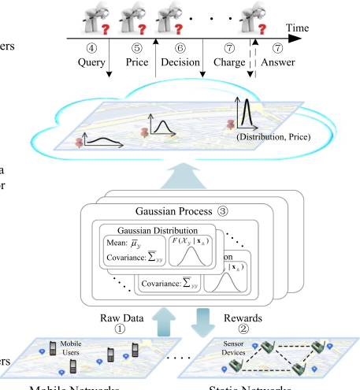

Fig. 1. A mobile crowd-sensed data market. 

show that ARETE outperforms the state-of-the-art pricing mechanisms, and approaches the optimal fixed price revenue. The evaluation results also demonstrate that ARETE-SH can fairly distribute the rewards among data providers, and has a profound impact on the revenue of data trading in a long term. 

The rest of this paper is organized as follows. In Section 2, we present system model and problem formulation. In Section 3, we propose a version-based online pricing mechanism, namely ARETE-PR. We extend ARETE-PR to support diverse query formats in Section 4. In Section 5, we formulate the problem of reward sharing as a coalitional game, and compute the Shapley value of the game. The evaluation results are presented in Section 6. In Section 7, we review related work. We conclude the paper in Section 8. 

## 2 PRELIMINARIES 

In this section, we describe system model for mobile crowdsensed data trading, and formally state the problems of profit maximization and reward sharing. 

### 2.1 System Model 

As illustrated by Fig. 1, we consider a mobile crowd-sensed data marketplace with three major entities: a set of data providers, a data vendor, and a set of data consumers. In mobile crowd-sensing applications, the data vendor acquires raw data by employing data providers, such as sensor devices and mobile phone users, in a monitoring region, and wants to make profits from providing data services upon the collected data (Step �1 ). The data vendor would provide some rewards to incentivize data providers to report data (Step �2 ). Since the raw data is normally incomplete, imprecise, and erroneous, the data vendor needs to build statistical models to filter the raw data, and present a model-based query interface for data consumers (Step �3 ). The data consumers arrive at the data market 

sequentially, and request for data services through issuing ad-hoc queries over the statistical models (Step �4 ). The data vendor determines appropriate prices for data services in a principled way (Step �5 ). Upon receiving declared prices, the data consumer makes a purchasing decision (Step �6 ). If the data consumer accepts this price, she receives the answers of the queries, and pays for the price (Step �7 ). We introduce a set of major notations to define the crowdsensed data market. 

Data Providers. In a monitoring region Q, the data vendor employs a set of m data providers to collect mobile data. Let A ¼ fa1; a2; . . . ; amg denote the locations of the data providers, and vector xA ¼ ðx1; x2; . . . ; xmÞ denote the real-time observations collected by data providers. We assume these observations are from authentic data sources, and data providers would not maliciously generate fake data from some distribution of data. As data providers consume their physical resources to collect data, the data vendor would like to distribute some monetary rewards to compensate their efforts, and incentivize them to contribute high quality data, which is similar to the incentive design in mobile crowdsensing systems [32], [61]. Data is one kind of digital goods, and can be repeatedly sold to a large number of data consumers, producing high revenue of data trading. As data commodities are generated based on the raw data contributed by data providers, data providers also have rights to share a portion of data trading revenue. Thus, in crowdsensed data markets, the reward for data providers comes from two components: basic reward and bonus reward. The data provider ai 2 A would receive a basic reward f� , a fixed amount of money, if her observation xi is used to generate data commodities. Based on the market value of data commodities, each data provider ai 2 A could also obtain a bonus reward fi, a portion of revenue from data trading. We assume the data vendor would share t percentage of total revenue with data providers after negotiating with data providers.1 

Statistical Model. Due to the unreliability of sensing devices and the fragility of data communication links, the mobile data is normally incomplete, imprecise, and erroneous. Furthermore, the sensed data is collected at some selected locations, and cannot fully represent the continuous feature of the physical environment. In addition, the sensed data may be correlated in multiple dimensions, e.g., the temperatures of geographically proximate locations are likely to change synchronously. Such correlation information can be leveraged to provide rich semantic data services. Therefore, the data vendor needs to deploy a statistical model to filter the noise and erroneousness of raw data, infer the data at the locations where no data providers are employed, and describe the correlation of sensed data in multiple dimensions. In such cases, regression techniques can be used to handle the noise in raw data and to perform inference.2 Although linear regression can draw good 

> 1. The determination for the parameter t is beyond the scope of this paper, and such process can be modeled as a bargaining game [46] between the data vendor and data providers. 

> 2. We can also use classical data clearing schemes [16], [48] to detect and correct the corrupt and inaccuracy raw data, which would reduce the noise of input data to the statistical model and improve the accuracy of inference. 

Authorized licensed use limited to: Shanghai Jiaotong University. Downloaded on February 15,2022 at 08:24:33 UTC from IEEE Xplore.  Restrictions apply. 

IEEE TRANSACTIONS ON MOBILE COMPUTING, VOL. 19, NO. 4, APRIL 2020 

772 

inferences, it cannot quantify the uncertainty of these inferences, which is critical to the price determination of data in markets. We use a powerful regression technique Gaussian Process [18], [58], which is a generalization of linear regression, and has been widely used as to model numerical sensor data [24], [26], to perform inferences, and to cope with the uncertainty quantification in the process of inferences. Choosing Gaussian process as the statistical model for numerical crowd-sensed data also provides several advantages for data trading. For example, we can regard conditional Gaussian distributions as data commodities, and generate different versions of the data commodity by selecting different set of locations to observe. We can also define the accuracy of data commodities as the posterior variance of conditional distribution. We will show the details of these parts in the following discussion. 

We associate a random variable X y with each location y 2 Q, and a set of random variables **X** Y with a set of locations Y � Q, representing the possible data at the corresponding locations. We can specify the Gaussian Process model with a mean function **m** , and a symmetric and positive-definite covariance function **S** . Let **m** Y and **S** YY denote the mean vector and the covariance matrix for a set of random variables **X** Y � **X** Q, respectively. In Gaussian Process, the joint distribution over the corresponding set of random variables **X** Y � **X** Q is a multivariate Gaussian distribution, and the probability density function is: 

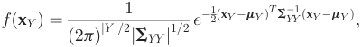

where xY is a vector of possible values of random variables **X** Y , j **S** j is the determinant of matrix **S** , and **S**�1 is the inverse matrix of **S** . Under Gaussian Process model, we can infer the data at any location y � Q (even there is no sensor deployed at this location) based on the observations xA. The resulting distribution fX yj **X** A ðxyjxAÞ is a conditional univariate Gaussian distribution, whose posterior mean m� y and posterior variance �s2 ycan be expressed as: 

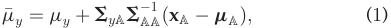

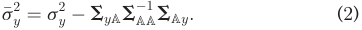

In data market, the data vendor obtains revenue by providing data services based on the collected raw data xA. The other information, such as the parameters of the statistical model, is common knowledge. Thus, the posterior variance s�2 y,whichisindependentontheactualobservationsxA,is publicly known. 

Data Commodity. In crowd-sensed data market, we define data commodity for trading as conditional Gaussian distributions f **X** Y j **X** A ðxY jxAÞ, which can be considered as a type of data service. In addition to the noise and erroneousness of raw data, the possible privacy leakage [62] and the potential violation of data copyright [13] are other two concerns to directly trade raw data in data markets. We call the distribution fX yj **X** A ðxyjxAÞ of a single random variable X y as a basic data commodity. Considering that the possible locations of the monitoring region are infinite, the data vendor would select a finite set of random variables at several locations, 

known as Point of Interests (PoIs), to approximately describe the environmental phenomenon of the whole region Q. We denote the set of these PoIs by Y ¼ f1; 2; . . . ; lg. For notational convenience, we will use Y � Y to index the data commodity f **X** Y j **X** A ðxY jxAÞ in the following discussion. 

The data vendor assigns a price py to each basic data commodity y 2 Y. We denote all the basic prices by a vector **p** ¼ ðp1; p2; . . . ; plÞ. We will discuss the determination of the basic prices in Section 3. As mentioned above, the variance information is public knowledge, so the valuable information of a data commodity is its mean vector. Furthermore, the mean of a data commodity f **X** Y j **X** A ðxY jxAÞ is actually the vector of the means of the contained basic data commodities fX yj **X** A ðxyjxAÞ, y 2 Y . Based on this fact, we set the price of a data commodity Y � Y as the sum of the basic prices of the basic data commodities in Y , i.e., pY ¼P y2Ypy. 

Data Consumers. The n data consumers, denoted by B ¼ fb1; b2; . . . ; bng, arrive at the marketplace in a certain sequence. Each data consumer bi issues a query about a data commodity Yi � Y, and has a private valuation vi for the query. For the convenience of analysis, we normalize the valuations into the range ½1; d�. We denote the valuations of all the data consumers by v ¼ ðv1; v2; . . . ; vnÞ. We consider the following types of query in this paper: 

- Single-Data Query: A data consumer bi is interested in the (inferential) data at a single location yi 2 Y, i.e., the (posterior) mean m� yi of the basic data commodity yi. 

- Multi-Data Query: A data consumer bi wants to know the (inferential) data of a certain region Yi � Y, i.e., the (posterior) mean vector **m�** Yi of the data commodity Yi. We assume that the maximum dimension of all the queried data commodities is a constant k, i.e., k ¼ maxbi2BjYij. 

- Range Query: A data consumer bi asks for the probability that the data at the region Yi � Y belongs to a range <u>½ai; ai�.</u> 

Data Accuracy. We define the accuracy of data commodity Y 2 Y as the average posterior variance of the contained <u>Py2Y</u>s�2y basic data commodities, i.e., jY j , which has been widely used to measure the performance of statistical inference over sensed data [30], [41]. Such criterion is easy to explain to data consumers, and can be verified by evaluating Eq. (2) with the public knowledge of the covariance function of Gaussian model and the locations of data providers.3 Furthermore, with this accuracy criterion, the data vendor can measure the accuracy of data providers’ data by evaluating their location information, resisting their manipulation on data accuracy. This is very important to the reward sharing process, as the reward is related to data provider’s contribution to the accuracy improvement during data commodity generation. Due to diverse applications for the purchased data, data consumers may have different accuracy requirements for data commodities. Each data consumer bi 2 B submits an accuracy threshold �i for her queried data 

3. We can introduce privacy-preserving and verifiable mechanisms [14] to evaluate the location information, and still protect the privacy of data providers. 

Authorized licensed use limited to: Shanghai Jiaotong University. Downloaded on February 15,2022 at 08:24:33 UTC from IEEE Xplore.  Restrictions apply. 

ZHENG ET AL.: ARETE: ON DESIGNING JOINT ONLINE PRICING AND REWARD SHARING MECHANISMS FOR MOBILE DATA MARKETS 

773 

TABLE 1 Frequently Used Notations 

|Notation|Remark|
|---|---|
|A; xi �f; �fi|Set of data providers and data observation. Basic reward and bonus reward for data provideri.|
|Xy; **X**Y  |Random variable(s) with location(s)yorY. |
|my; **m**Y; s2 y; **S**YY |Mean or mean vector and variance or covariance matrix of random variable(s)Xy or **X**Y.|
|�my; �s2 y |Posterior mean and posterior variance of random variableXy.|
|f**X**Yj**X**AðxYjxAÞ, Y|Conditional Gaussian distributions. Set of PoIs.|
|**p**; py|Vector of basic prices, basic price.|
|B; bi|Set of data consumers, data consumer.|
|v; vi|Vector of data consumers’ valuations, valuation.|
|d|Upper bound of valuation.|
|k|Maximum dimension of data commodities.|
|�i; di; ci|Data accuracy requirement, discount factor, charge.|
|C; C|Profit, revenue.|
|t|The portion of revenue for sharing.|
|Ai|Set of data providers to generate theith version.|
|VðAÞ|Variance reduction.|
| DjðAÞ|Marginal variance reduction for data providerj.|
|a;b;g|Parameters of online mechanism.|

commodity Yi. The data commodity Yi satisfies the accuracy requirement of data consumer bi if the average posterior <u>Py2Yi</u>s�2y variance is less than the threshold �i, i.e., � �i: jYij 

Data Charging. Considering that the data commodity with different accuracy requirements should have different prices, the data vendor offers a discount di 2 ð0; 1� for the data consumer bi 2 B with low accuracy requirement (Please refer to Section 3 for the determination of the discount factor.). Thus, the charge for the data consumer bi’s query about the data commodity Yi is ci ¼ pYi � di. If data consumer bi’s valuation vi is higher than ci, she would purchase the query, and pay the charge; otherwise, she leaves and pays nothing. We use vector **c** ¼ ðc1; c2; . . . ; cnÞto denote the charges of all data consumers. 

We list the frequently used notations in Table 1. 

### 2.2 Problem Formulation 

In this paper, we consider two closely related problems in the mobile crowd-sensed data market: Profit Maximization and Reward Sharing. 

Profit Maximization. The goal of data vendor is to maximize the profit from data trading, which is defined as the difference between the revenue and the data acquisition cost. The total revenue from data trading is the sum of the charges for data customers that purchase data commodities, i.e., C , Pbi2B:vi > cici:Thedataacquisitioncostisthetotal rewards distributed to incentivize data providers, i.e., t � C þ f� � M, where M is the number of observed data. Thus, the profit of the data vendor is C , ð1 � tÞ � C� f� � M. As in previous papers [10], we will use competitive analysis to investigate the performance of online pricing 

mechanism. We here give the formal definition of ð1 þ �Þ-competitive online data pricing mechanism. 

- Definition 1 (ð1 þ �Þ-Competitive Data Pricing Mechanism). A data pricing mechanism is ð1 þ �Þ-competitive if the ratio between the profit of the optimal offline mechanism and the profit of the online mechanism is ð1 þ �Þ. 

The optimal offline mechanism selects a single fixed price for each (basic) data commodity with the posterior knowledge of the valuations of all data consumers. The optimal revenue for each data commodity is given by C� ¼ p� � np� , where p� is the optimal price, and np is the number of data consumers with values larger than p. This optimal offline counterpart is widely used in performance analysis of online learning algorithms [10], [12]. 

In contrast to the goal of the data vendor, the selfish data consumers always tend to purchase their desired query results with lower charges. For example, the data consumers can indirectly infer the answer of an expensive query by buying a set of cheaper queries. The data pricing mechanism should be robust enough to resist such arbitrage behaviours. We define an arbitrage-free data pricing mechanism as follows. 

Definition 2 (Arbitrage-free Data Pricing Mechanism). Whenever a query q can be entirely answered by a query bundle fq1; q2; . . . ; qkg, an arbitrage-free data pricing mechanism must satisfy that cðqÞ �Pk i¼1cðqkÞ;wherecðqÞdenotesthecharge for the query q. 

We now formally present the problem of profit maximization in mobile crowd-sensed data markets: the data vendor dynamically selects data providers to generate qualified data commodities, and determines the charge c (by calculating the basic prices p and discount factor d) for data consumers B, such that the resulting data pricing mechanism achieves a good approximation ratio in terms of profit maximization and the property of arbitragefreeness. 

Reward Sharing. In data markets, the data commodities are generated by aggregating the collected raw data from data providers. As data can be copied with a negligible marginal cost, the data can extract high revenue from the market by repeatedly selling to a large number of data consumers. Thus, in addition to the basic reward, the data vendor should also share a portion of revenue with data providers to further incentivize them to contribute high quality data. To determine the basic reward, the data vendor uses the criterion of the number of data providers, as she wants to minimize the total basic reward. Considering that the data providers might submit data with heterogeneous qualities and then have different contribution levels to generate data commodities and the revenue of data trading, we should use the criterion of contribution levels for reward sharing, guaranteeing the fair axioms. In data markets, another important and critical issue for the data vendor is the incentive design for data providers: how to generate the qualified data commodities with the minimum basic reward, and fairly distribute the total bonus reward t � C among the data providers A, given their heterogeneous contribution levels? 

Authorized licensed use limited to: Shanghai Jiaotong University. Downloaded on February 15,2022 at 08:24:33 UTC from IEEE Xplore.  Restrictions apply. 

IEEE TRANSACTIONS ON MOBILE COMPUTING, VOL. 19, NO. 4, APRIL 2020 

774 

## 3 ONLINE DATA PRICING 

In this section, we propose ARETE-PR, which is a versionbased online posted-pricing mechanism for mobile crowdsensed data market. ARETE-PR consists of two components: a versioning mechanism and an online pricing mechanism. The versioning mechanism efficiently selects a set of data providers to generate a qualified version of data commodity for data consumer, minimizing the data acquisition cost. The online pricing mechanism dynamically determines the price for each basic data commodity with the goal of revenue maximization. The versioning mechanism and pricing mechanism jointly maximize the profit of data trading. 

We begin with a simple but classical setting, in which data consumers only issue single-data queries. In this case, we can consider the price determination for each of basic data commodities independently, and discuss the design of ARETE-PR for one selected basic data commodity. We further extend ARETE-PR to adapt to the other types of query in Section 4. 

### 3.1 Design Rationale 

Under the cost structure of information (a fixed cost of production but negligible marginal costs of duplication), the price of data should be linked to the valuations of data consumers rather than data production costs. Furthermore, data consumers have diverse accuracy requirements over data commodities. Considering the new cost structure of data and the diverse accuracy requirements of data consumers, we propose a valuation-based data pricing mechanism coupled with a versioning technique for mobile crowd-sensed data trading. Specifically, we partition a data commodity into multiple versions with different accuracies and prices, and provide the qualified version and an appropriate price for each arrived data consumer. The challenging problem here is how to efficiently select data providers to generate the qualified version with a minimum data acquisition cost. We also need to determine the discount factor for each version. Observing that the accuracy, i.e., the variance reduction is a submodular function with respective to the set of selected data providers, we can formulate the process of versioning as a problem of submodular covering, and propose a greedy selection algorithm with performance guarantee. Furthermore, we set the price of each version as the basic price of the full version multiplying a discounting factor, which is proportional to the “distance” of the corresponding version to the full version. We modify the concept of relative entropy, a nature metric of distribution difference, to measure this distance. 

Yet, another critical problem of designing online data pricing mechanism is the determination of basic prices. The most challenging part is that both valuations and arrival sequence of data consumers are unknown to the data vendor. The data vendor needs an online mechanism to dynamically learn the valuation information of data consumers, and sets a near-optimal basic price to maximize the revenue. We determine the basic prices by making a trade-off between “exploitation” and “exploration” to data consumers’ valuations. On one hand, if the data vendor exclusively chooses the candidate price that she believes is the best (exploitation), she may fail to discover one of the other 

candidate prices that actually has a higher revenue in the long term. On the other hand, if she spends too much time trying out all the candidate prices to learn the valuations of data consumers (exploration), she may fail to choose the price that is good enough to obtain a high total revenue in time. Therefore, for each of the arrived data consumers, we select a price following a mixed distribution, which is a combination of an exploitation distribution and an exploration distribution. Based on the response of the data consumer to the chosen price, we update the mixed distribution in a principle way, to guide the selection of candidate prices in the following transactions. 

### 3.2 Versioning 

In ARETE-PR, we regard the conditional Gaussian distribution fðxyjxAi Þ generated by the observations xAi from the selected data providers Ai � A as a version of the basic data commodity y 2 Y,4 which satisfies the accuracy requirement of the arrived data consumer bi if �s2 y��i. Here, we use Ai to denote the data providers recruited to generate the version for data consumer bi. Using the posterior covariance in Eq. (2), we can further express this constraint as 

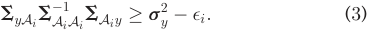

We call the left hand side of the above inequality as variance reduction V ðAiÞ due to observing data from the selected data providers Ai, i.e., V ðAiÞ , **S** yAi **S**� A1 iAi**S**A iy.Weassumethe original variance **s**2 yis a constant variance. As the data ven- dor has to pay a fixed basic reward for each selected data provider, she always wants to recruit less data providers to achieve the accuracy requirements of data consumers, minimizing the total basic reward. We now can formulate the problem of basic reward minimization for the version generation as follows 

Problem: Basic Reward Minimization Objective: Minimize f� �jAij Subject to: 

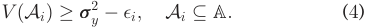

It can be shown that the variance reduction function V ðAÞ is a monotonic submodular function with respective to the set of selected data providers A [20], [41]. In addition, the objective function is modular. Thus, the problem of basic reward minimization is a submodular covering problem and is NP-hard [38], [59]. Greedy algorithm has been recognized as an efficient approximation approach for submodular optimization [41], [59]. We present a greedy algorithm for the selection of data providers, and analyze the approximation ratio for such greedy algorithm. 

We now present the principle of greedy versioning mechanism in Algorithm 1 step by step. The versioning algorithm greedily adds the most “informative” data provider following a sequence, until the current posterior 

> 4. For mobile crowd-sensed data, there are many possible versioning strategies, e.g., aggregating different amounts of raw data to generate versions, which is adopted in this paper, or artificially adding the noises of different levels into an accurate data commodity. 

Authorized licensed use limited to: Shanghai Jiaotong University. Downloaded on February 15,2022 at 08:24:33 UTC from IEEE Xplore.  Restrictions apply. 

ZHENG ET AL.: ARETE: ON DESIGNING JOINT ONLINE PRICING AND REWARD SHARING MECHANISMS FOR MOBILE DATA MARKETS 

775 

variance satisfies the accuracy requirement of the data consumer. Formally, our goal is to select the next data provider aj that maximizes the marginal variance reduction DjðAÞ , V ðA [ fajgÞ � V ðAÞ. where A is the set of currently selected data providers. We break the tie following a random rule (Lines 2 to 6). If the new posterior variance s�2 yis less than the accuracy threshold �i, we set Ai as the current data provider set A (Line 7). From the result in [59], we have the following performance guarantee for the greedy versioning algorithm. 

Algorithm 1. Versioning Mechanism 

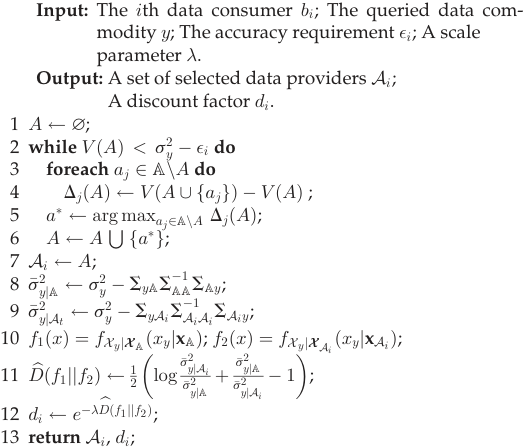

- Theorem 1. For the problem of basic reward minimization, the greedy versioning algorithm can achieve the approximation ratio of 1 þ lnðDmax=DminÞ, where Dmax and Dmin are the maximum marginal variance reduction and minimum marginal variance reduction of only selecting one single data provider, respectively, i.e., Dmax , maxai2ADið? Þ and Dmin , minai2ADið? Þ. 

The remaining issue is to determine discount factor for the generated version. We set the discount factor of a version proportional to its distance to the full version, i.e., the distribution fX yj **X** A ðxyjxAÞ, and normalize the discount factor for the full version as 1. The concept of relative entropy, or Kullback-Leibler distance, is a measure of the distance between two distributions [17]. Specifically, the relative entropy between the full version f1ðxÞ ¼ fX yj **X** A ðxyjxAÞ and the generated version f2ðxÞ ¼ fX yj **X** Ai ðxyjxAi Þ is 

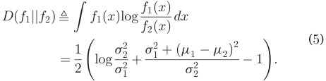

The relative entropy is nonnegative and is equal to zero if and only if f1 ¼ f2. Intuitively, a version with a lower accuracy should be “farther” from the full version. However, the distance calculated by Eq. (3) may not reflect such property, because the relative entropy depends on both the mean and variance. The accuracy of a data commodity only rests on 

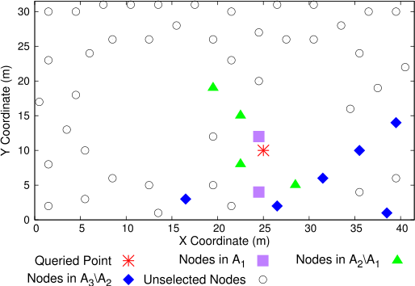

Fig. 2. Versioning results of the data commodity at location (25, 10). 

its variance. Inspired by this, we modify the relative entropy by ignoring the mean terms, and regard it as the distance between two versions 

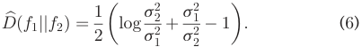

Considering that discount factor should lie in the range [0, 1], we define the discount factor for the version as: 

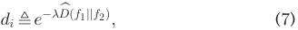

where � is a scale parameter. 

We give the detailed steps to calculate the discount factor for each version in Algorithm 1. We calculate the variance s�2 yjAofthefullversionfðyjAiÞinLine8.Forthegenerated version, we calculate its variance �s2 yjAiin Line 9, and the cor- responding distance and discount factor according to Eqs. (6) and (7), respectively (Lines 11 to 12). 

We use a simple example to illustrate the ideas of the versioning mechanism in Fig. 2. Suppose there are three data consumers issuing data queries at the location (25,10). Their accuracy requirements are �1 ¼ 38:94, �2 ¼ 14:32 and �3 ¼ 9:60, respectively. We show the set of data providers selected by the versioning mechanism in Fig. 2. From this result, we observe that the data providers, neighboring the queried point, have a high probability to be selected, because they are more informative to the queried point. At the same time, the versioning algorithm might ignore some data providers, although they are in the vicinity of the queried point, because their marginal entropy is relatively small given the currently selected data providers. We set the scale parameter � in Eq. (7) as 2.77 to adjust the discount factors to appropriate values. Under this setting, we calculate the corresponding discount factors for the three versions as d ¼ ð0:36; 0:85; 1Þ. 

### 3.3 Online Pricing 

We now describe the detailed principle of online pricing mechanism in Algorithm 2. For each arrived data consumer, we select the basic price from a vector of candidate discrete prices **p^** ¼ ðp^1; ^p2; . . . ; ^pKÞ, where p^k ¼ ð1 þ bÞk�1 for any 1 � k � K and b > 0. Since the upper bound of valuation is d, we have K ¼ blog 1þbdc þ 1. Let ciðkÞ be the revenue 

Authorized licensed use limited to: Shanghai Jiaotong University. Downloaded on February 15,2022 at 08:24:33 UTC from IEEE Xplore.  Restrictions apply. 

IEEE TRANSACTIONS ON MOBILE COMPUTING, VOL. 19, NO. 4, APRIL 2020 

776 

attained by setting price p^k for the ith data consumer bi. We initially set c0ðkÞ to be zero for any 1 � k � K. Given a parameter a 2 ð0; 1�, we define a weight wiðkÞ for the price p^k in the ith transaction as 

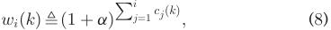

which is an exponential weight function, denoting the performances of the candidate prices in the previous transactions. The candidate price with a large weight should have a high probability to be chosen as a basic price in the following transactions. We denote the weight vector for all candidate prices in the ith transaction by wi ¼ ðwið1Þ; wið2Þ; . . . ; wiðKÞÞ, and initially set w0 to be 1. 

Algorithm 2. Online Pricing Mechanism 

- Input: Reals: a 2 ð0; 1�; b > 0; g 2 ð0; 1�; The ith data consumer bi; A vector of discount factors d; The highest valuation d; The number of candidate prices K; A vector of candidate prices **p^** ; A weight vector wi�1. 

- Output: The charge ci for data consumer bi. 

- 1 ci 0; 

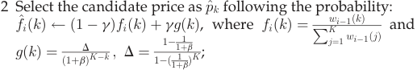

- 3 Suppose the selected price is ^pki ; 

- 4 Choose the lowest version that satisfies the accuracy requirement hi of data consumer bi, and set her discount factor d^ i dti ; 

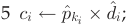

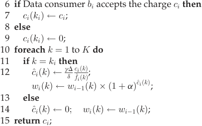

For the ith arrived data consumer bi 2 B, Algorithm 2 selects a candidate price p^k following the distribution f^ iðkÞ, which is a combination of an exploitation distribution and an exploration distribution (Line 2). On one hand, we try to exploit the currently expected best price to gain a high revenue, and define the exploitation distribution as 

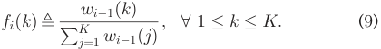

On the other hand, since some candidate prices may obtain a low revenue at first, but receive a high revenue later, we also apply an exploration distribution to find the ultimate optimal price in long terms. Thus, we further assign each candidate price p^k an exploration probability distribution. A classical exploration distribution is uniform distribution, which assigns each of the candidate prices the same probability [10]. However, considering that different candidate prices can produce different amount of revenue, we 

adopt a geometric distribution as the exploitation distribution, i.e., 

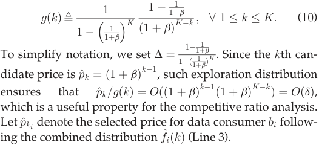

We efficiently select the smallest set of data providers to generate the lowest version that satisfies the required accuracy requirement of the data consumer bi.5 The discount factor d^ i to data consumer bi is the corresponding discount factor dti for version ti returned by Algorithm 1 (Line 4). The charge for data consumer bi then is ci ¼ p^ki � d^ i (Line 5). 

According to the data consumer’s purchasing decision, we receive a revenue ciðkiÞ 2 f0; cig of the chosen price p^ki . In the posted pricing setting, we cannot observe the revenue generated by the other candidate prices. So we set ciðkÞ ¼ 0 for any k 6¼ ki (Lines 6 to 9). Based on this revenue vector ci ¼ ðcið1Þ; cið2Þ; . . . ; ciðKÞÞ, we generate a virtual revenue vector **c^** i ¼ ðc^ið1Þ; ^cið2Þ; . . . ; ^ciðKÞÞ, and use it to update the weights of candidate prices. We calculate this virtual revenue vector by distinguishing the two cases: 

- " For the chosen price p^ki , we set the virtual revenue c^iðkiÞ to be <u>gdD</u> fc^iiððkkÞÞ~~.~~ 

> " For the other prices ^pk; k 6¼ ki, we set ^ciðkÞ to be zero. 

We update the weight vector wi using Eq. (8) with virtual revenue vector **c^** i (Lines 10 to 14). We have the following two properties for this virtual revenue vector **c^** i, which is heavily used in the analysis of competitive ratio in next section. 

- " The expected virtual revenue (with respective to the selection distribution f^ iðkÞ) for any candidate price p^k is proportional to the actual revenue of the price ciðkÞ, i.e., 

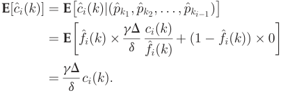

" The virtual revenue ^ciðkÞ is in the range [0,1]. 

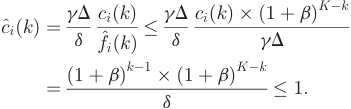

5. Although the data vendor can choose high versions for data consumers to extract much revenue, this would incur market anarchy: data consumers would strategically report low accuracy requirement to seek less payments. The policy of selecting the lowest version enforces data consumers to truthfully report their required data accuracy requirement. 

ZHENG ET AL.: ARETE: ON DESIGNING JOINT ONLINE PRICING AND REWARD SHARING MECHANISMS FOR MOBILE DATA MARKETS 

777 

We remark that the data vendor can dynamically tune the parameters a; b; g in Algorithm 2 to adapt to different market settings. Specifically, the parameter a represents the weights of candidate prices in exploitation process (i.e., a larger a indicates that we heavily exploit the candidate prices with good performance in previous transactions.). The parameter g denotes the trade-off between the exploitation and exploration (i.e., a smaller g represents a higher degree of exploitation.). For example, the data vendor can set a large a and a small g to actively exploit the collected valuation knowledge, when the data providers’ valuations follow a normal distribution. In contrast, when the data providers’ valuations come from a uniform distribution, the data vendor can set a low a and a high g to achieve good performance. The parameter b reflects the trade-off between revenue maximization and computational complexity, i.e., a larger b, implying more candidate prices to choose, can extract a larger revenue but incurs a higher computational overhead. We design experiments to evaluate the effects of these parameters in Section 6. 

We finally illustrate this online pricing algorithm by an example. For simplicity, suppose we only provide the full version of the data commodity, and the parameters are a ¼ 1, b ¼ 1 and g ¼ 2=3. We set the upper bound of valuation d to be 2. According to these parameters, we will only have K ¼ 2 candidate prices with values 0 and 1 respectively. Recall that both prices have weight 1 initially. Therefore, they both have probability 1=2 in the first exploration distribution f1. Furthermore, we can calculate by Eq. (10) that the first exploitation distribution is g1ð1Þ ¼ 1=3 and g1ð2Þ ¼ 2=3. With g ¼ 2=3, our final distribution f^ i will be <u>23</u>fi þ <u>13</u>gi,whichisf^ið1Þ ¼ 4=9andf^ið2Þ ¼ 5=9.Nowsup- pose for the first consumer, we sampled k1 ¼ 1 from this distribution. In this case, the charge for the consumer will be p1 ¼ 20 ¼ 1. Assume that the consumer accepts the charge. In this case, the revenues for these two prices are c1ð1Þ ¼ 1 and c1ð2Þ ¼ 0. For p1, we will update w2ð1Þ ¼ 20:4 ¼ 1:3; but for p2, w2ð2Þ will still remain to be 1. As a result, the exploration distribution f2 will be biased towards 1 in the second round, i.e., we will prefer choosing p1 for the second consumer. 

### 3.4 Analysis 

We analyze the competitive ratio of ARETE-PR in this subsection. We use C� and C^ to denote the optimal profit and approximate profit achieved by ARETE-PR, respectively. Similarly, C� and Cb denote the optimal revenue and approximate revenue, respectively. We have the similar meaning for notations M� and Mb . According to Theorem 1, we have the following performance guarantee for the greedy versioning algorithm 

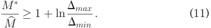

We now analyze the competitive ratio of the online pricing mechanism. In the online pricing mechanism, we only consider a vector of discrete candidate prices **p^** , while ignoring the other possible values in ½1; d�. We show that the attained revenue does not lose much under this restriction. 

- Lemma 1. The online pricing mechanism loses a ð1 þ bÞ factor in rounding down the optimal price to one of the prices from **p^** . 

- Proof. Let np denote the number of consumers whose valuations are greater than p, i.e., np ¼ jfbi 2 Bjvi � pgj. The revenue of the optimal fixed price p� is C� ¼ p� � np� . For the optimal price p� , there exists some index k 2 ½1; K� such that ð1 þ bÞk�1 � p� �ð1 þ bÞk : Let Cb�represent the revenue of the optimal fixed price mechanism, where the candidate prices are restricted in the the discrete price vector **p^** . We can have: 

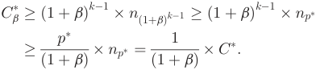

The second inequality comes from the fact that decreasing the fixed price from p� to ð1 þ bÞk�1 does not reduce the number of sales to data consumers. tu 

We then show another useful lemma for the competitive ratio analysis. 

- Lemma 2. For any parameter a > 0, any sequence of virtual revenue vectors **c^** 1; **c^** 2; . . . ; **c^** n, and the exploitation distribution vectors fi ¼ ðfið1Þ; fið2Þ; . . . ; fiðKÞÞ, we have: 

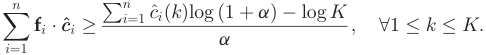

Proof. Let Wi ¼PK k¼1wiðkÞ for any 1 �i �n. Since the vir- tual revenue c^iðkÞ is in the range [0,1], we can get the following equations. 

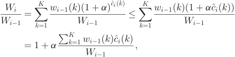

where for the inequality we used the fact that for x 2 ½0; 1�, ð1 þ aÞx � 1 þ ax. Thus, 

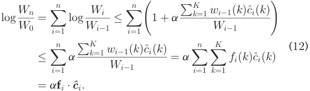

Pn Since Wn � wnðkÞ ¼ ð1 þ aÞ i¼1c^iðkÞ for any 1 � k � K, and W0 ¼ K, we have 

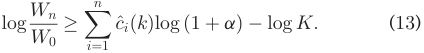

Combining Eqs. (12) and (13), we get 

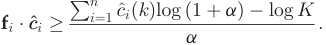

We have completed the proof. tu 

Authorized licensed use limited to: Shanghai Jiaotong University. Downloaded on February 15,2022 at 08:24:33 UTC from IEEE Xplore.  Restrictions apply. 

IEEE TRANSACTIONS ON MOBILE COMPUTING, VOL. 19, NO. 4, APRIL 2020 

778 

By Lemma 1, Lemma 2 and an appropriate choice of parameters a, b and g, we can obtain the following competitive ratio for the online pricing mechanism. 

- Theorem 2. Given a real value �, there exists a constant u, such that for any valuation sequences v with optimal revenue C� � ud log log d, the online pricing mechanism is ð1 þ �Þ-competitive. 

- Proof. Using Lemma 2 and the properties of the online pricing mechanism, we show the lower bound of revenue Pni¼1ciðkiÞforanyselectedbasicpricesequence**p^**¼ ðp^k1 ; ^pk2 ; . . . ; ^pkn Þ. 

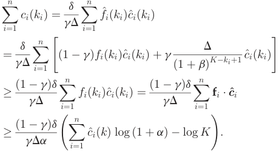

We next take the expectation of both sides of the above equation with respect to distribution **p^** . Having E½c^iðkÞ�¼ <u>gdD</u>ciðkÞ for each ^ciðkÞ, we can get: 

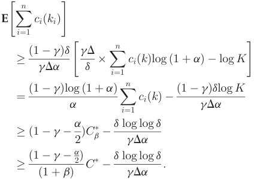

In the third equality, we select the optimal fixed price from **p^** , and thus maxkfPn i¼1ciðkÞg ¼ C b�.Thethird equality follows from that log ð1 þ aÞ � a � <u>a2</u>2forany a > 0. By Lemma 1, the last inequality holds. By choosing appropriate parameters a, b and g, we prove the theorem. tu 

We have proven that the online pricing mechanism achieves a constant competitive ratio when the optimal revenue is larger than Oðd log log dÞ. The following theorem shows that any online pricing algorithm that achieves a constant ratio, must have an additive constant term VðdÞ. Designing an online pricing algorithm with a tight lower bound is our future work. 

- Theorem 3. There is no constant-competitive online pricing algorithm for all valuation sequences with C� � oðdÞ. 

- Proof. We can state the theorem in another way: suppose APX is an online algorithm with a constant competitive ratio c, i.e., for all valuation sequence v, APXðvÞ � 

C� ðvÞ=c � fðdÞ. Then, we must have fðdÞ ¼ VðdÞ. This statement directly implies the claim we make in the theorem, and we now prove that fðdÞ � d=ðhh1Þ, where h ¼ 2c and h1 ¼ 2hh�1 . 

We assume that the valuation sequence contains only one valuation. Let Pr½a; b� denote the probability that mechanism APX sets the sales price in the range ½a; b�. We prove the result by distinguishing two cases. 

- Suppose it is the case that Pr½1; d=h1�� 1=h. Then, if the valuation is d=h1, the online algorithm’s expected revenue is at most APXðvÞ ¼ d=ðh1hÞ while the optimal result is C� ðvÞ ¼ d=h1. Therefore, we have: fðdÞ � C� ðvÞ=c � APXðvÞ � d=ðh1cÞ� d=ðh1hÞ ¼ d=ðh1hÞ. 

- In the case that Pr½1; d=h1� > 1=h, we define the series Lt as follows, L0 ¼ 0 and Ltþ1 ¼ d=h1 þ Lt. We can get Ltþ1 ¼ d=h1 þ dh=h1 þ ���þ dht =h1. By definition of h and h1, we have Lk � d. Combining that Pr½0; d=h1� > 1=h, there must exist some interval ðLt; Ltþ1��½1; d� such that PrðLt; Ltþ1�� 1=h. Suppose the valuation is Ltþ1. In this case, the online algorithm’s expected revenue is at most APXðvÞ ¼ Lt þ Ltþ1=h, while the optimal result is C� ðvÞ ¼ Ltþ1. Therefore, we have fðdÞ � C� ðvÞ � APXðvÞ � Ltþ1=c �ðLt þ Ltþ1=hÞ ¼ Ltþ1=h� Lt. Plugging in the definition of Ltþ1, we can get that fðdÞ � d=ðhh1Þ. 

From the above analysis of two cases, we can conclude that fðdÞ � d=ðhh1Þ, and thus our claim holds. tu 

From the above analysis, we have the following performance guarantee for the online pricing mechanism under the condition that C� � ud log log d: 

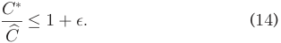

We now can prove the competitive ratio of ARETE-PR in terms of profit maximization. 

- Theorem 4. For the problem of profit maximization in crowdsensed data markets, ARETE-PR can achieve the competitive ratio of ð1 þ �Þ. 

- Proof. We can assume that the performance loss from revenue maximization is less than the performance loss from basic reward minimization, i.e., ð1 þ �Þ � 1 þ ln <u>DDmaxmin</u>,as�. We also assume that both optimal profit and approximate profit are non-negative, i.e., ð1 � tÞ � C� � f� � M� � 0 and ð1 � tÞ � Cb � f� � Mb � 0. From Eqs. (11) and (14), we then have 

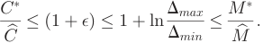

Furthermore, we can verify that for any positive numbers a, b, c and d with a � c � 0 and b � d � 0, if a=b � c=d, then we have ða � cÞ=ðb � dÞ � a=b. Based on these observations, the approximation ratio of ARETE-PR satisfies the following relation: 

Authorized licensed use limited to: Shanghai Jiaotong University. Downloaded on February 15,2022 at 08:24:33 UTC from IEEE Xplore.  Restrictions apply. 

ZHENG ET AL.: ARETE: ON DESIGNING JOINT ONLINE PRICING AND REWARD SHARING MECHANISMS FOR MOBILE DATA MARKETS 

779 

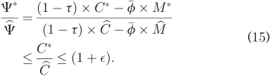

Therefore, our theorem holds. tu 

## 4 ADAPTION TO OTHER QUERY TYPES 

In this section, we extend ARETE-PR to support multi-data query and range query scenarios. 

### 4.1 Multi-Data Query 

We can formulate the pricing problem for multi-data query as an unlimited-supply combinatorial posted-price auction with single-minded data consumers. A single-minded data consumer is interested in only a single data commodity, and has no valuation for all the other data commodities.6 As we have discussed in Section 2.1, the price of a data commodity Y � Y is the sum of the prices of the basic data commodity in it, i.e., pY ¼P y2Ypy. 

The extended ARETE-PR also consists of two components: versioning mechanism and pricing mechanism. We show that the versioning mechanism in ARETE-PR can be modified slightly to provide the version generation in the multi-data query scenario. Based on the pricing algorithm in original ARETE-PR, we design an online randomized pricing mechanism for multi-data query, and analyze its competitive ratio. 

Versioning Mechanism. In multi-data query scenario, the accuracy of a data commodity Y � Y is its average posterior <u>Py2Y</u>s�2y variance jY j after observing data from the selected data providers Ai. The data commodity satisfies the accuracy <u>Py2Y</u>s�2y requirement of the data consumer bi 2 B when jY j � �i, which can be further expressed as 

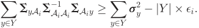

The sum of submodular functions is also a submodular function. Similarly, we can formulate the process of data provider selection as a submodular covering problem, and the greedy versioning mechanism in ARETE-PR can be applied to the scenario of multi-data query . To determine the discount factors of different versions in multi-data query scenario, we extend relative entropy between the full version f1ðxÞ ¼ f **X** Y j **X** AT ðxY jxAT Þ and the tth version f2ðxÞ ¼ f **X** Y j **X** At ðxY jxAt Þ to multivariate Gaussian distribution scenario, and define the revised relative entropy as 

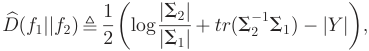

> 6. In contrast, a multi-minded data consumer requests for multiple data commodities, and has different private valuations for different commodities. The multi-minded data consumers have powerful strategic behaviors to manipulate the online pricing mechanisms. The related works about the multi-arm bandit problem in strategic setting [2], [5] shed light on designing online pricing mechanism to resist the complex strategic behaviors of multi-minded data consumers. We reserve the detailed discussion to our future work. 

where trðSÞ is the trace of matrix S. We use this relative entropy to determine the discount factor for each version. Using the new concepts of accuracy and relative entropy Dbðf1jjf2Þ, we can extend the versioning mechanism in ARETE-PR to multi-data query scenario, achieving the same performance guarantee. 

Theorem 5. For the problem of basic reward minimization in multi-data query scenario, the greedy versioning mechanism still achieves the approximation ratio of 1 þ ln <u>DDmaxmin</u>. 

Dmaxminmin. 

Algorithm 3. Pricing Mechanism for Multi-Data Query Input: A set of random basic data commodity Y1; A data consumer bi; A data commodity Yi; A discount factor vector dYi ; A weight vector W. Output: The charge ci for the data consumer bi. 1 ci 0; 2 if jYi T Y1j ¼ 1 then 3 y Yi T Y1; 4 ci OPMyðbi; dYi ; WyÞ; 5 else 6 Ignore the data consumer bi; 7 return ci 

Online Pricing Mechanism. Algorithm 3 presents the pseudo-code of online pricing mechanism for multi-data query. We reduce the online randomized pricing mechanism for multi-data query into multiple pricing mechanisms for single-data query in original ARETE-PR, i.e., Algorithm 2. We describe this reduction in the following procedure. 

Step 1: We first randomly partition the basic data commodities Y into two sets: Y1 and Y2, by placing each basic data commodity into Y1 with probability <u>1k</u>~~,~~wherekisthe maximum size of the required data commodities, i.e., k ¼ maxbi2BjYij. 

Step 2: We ignore data consumers, who want zero or more than one basic data commodity in Y1, and only consider the data consumers who want exactly one data commodity in Y1. We denote this type of data consumers by B1 ¼ �bi 2 B��jYi T Y1j ¼ 1�. 

Step 3: We then set the prices of the basic data commodities in Y2 as zero, and effectively set the prices of the basic data commodities in Y1 with respect to the data consumers B1. Given a qualified data consumer bi with Yi \ Y ¼ y, a discount factor vector dYi , and a weight vector Wy, the Online Pricing Mechanism (abbreviated as OPMy) for single-data query can determine the price for the basic data commodity y and the charge for the data consumer bi (Line 3 to 4). The discount factor vector dYi for Yi is calculated by versioning mechanism. All the other parameters for the algorithm OPMy are the same for all the basic data commodities, and we omit them here. 

We show that this extended online pricing mechanism also achieves sub-optimal revenue. 

Theorem 6. Given a real value �, there exists a constant u such that for any valuation sequences with optimal revenue C� � l � u � d � log log d, the extended online pricing mechanism is ð1 þ �Þ-competitive. 

Proof. We use **p**� ¼ ðp� y1; p� y2; . . . ; p� ylÞtodenotetheoptimal basic price vector for the basic data commodity Y in 

Authorized licensed use limited to: Shanghai Jiaotong University. Downloaded on February 15,2022 at 08:24:33 UTC from IEEE Xplore.  Restrictions apply. 

IEEE TRANSACTIONS ON MOBILE COMPUTING, VOL. 19, NO. 4, APRIL 2020 

780 

multi-data query scenario, and C� to denote the optimal revenue achieved by **p**� . Let Ci;j�denote the revenue made by selling data commodity yi to data consumer bj with price p� yi, and thus Ci;j�2 f0; p� yi�djg and C� ¼Pl i¼1 Pnj¼1C i;j�. Define a indicator variable Xi;j¼ 1 if the data commodity yi 2 Y1 and bj 2 B1; otherwise Xi;j ¼ 0. We have 

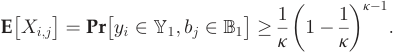

We first show the relation between C� and the quantity EhP yi2Y1 Pbj2B1C i;j� i. 

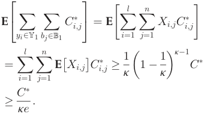

We next analyze the expected revenue achieved by Algorithm 3. We can view Algorithm 3 as performing jY1j separate online pricing algorithms for single-data query. Let Ci�denotetheoptimalrevenueusingafixed basic price for yi 2 Y1 We note that the revenue Ci�isat leastP bj2B1C i;j�,becausesettingpricesofthebasicdata commodities in Y2 to be zero can increase the number of sales to data consumers in B1. By Theorem 2, the expected revenue of the online pricing mechanism OPMyi for a single data commodity yi 2 Y1 will be at least ð1 þ "ÞCi��O ðu �d �log log d Þ. Therefore, given a randomized set of basic data commodities Y1, the revenue achieved by Algorithm 3 is at least: 

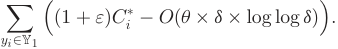

Taking the expectation of the above equation with respect to the randomized generation of set Y1, we can get: 

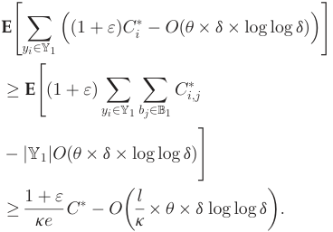

Similarly, by selecting appropriate parameters a, b and g and assuming that k is a constant, we can get the results. tu 

Using the similar analytical technique in Theorem 4, we can have the following result for the extended ARETE-PR mechanism. 

- Theorem 7. For the problem of profit maximization in multidata query scenario, the extended ARETE-PR mechanism still achieves the competitive ratio of 1 þ �. 

### 4.2 Range Query 

In the case of range query, a data consumer wants to know the probability that a data commodity belongs to a specific range. For example, data consumers may be interested in whether monitoring environmental parameters, such as temperature, concentration of carbon dioxide, exceed some thresholds. The above mechanisms for single-data query and multi-data query can be easily extended to support range query. The versioning mechanisms remain the same, while in the pricing mechanisms, i.e., Algorithms 2 and 3, we multiply the final price by another discount factor dr ¼ 2j1Y j. This is because data consumers can know the pos- terior mean **m�** Y of the data commodity Y by performing 2jY j range queries. More specifically, data consumers can learn the mean of each basic data commodity y 2 Y by asking two range queries: F ðX y 2 ½�1; a1�Þ and F ðX y 2 ½�1; a2�Þ. This can be done by looking up the standardized normal distribution table. As the mean of data commodity Y is the vector of the mean of the basic data commodity in Y , data consumers only need to ask 2jY j similar queries to learn the mean of the data commodity Y . We can show that this modified online pricing mechanism for range query still achieves a constant approximation ratio. The proofs are similar as that in Theorem 4 and Theorem 7. In the interest of space, we omit the proof. 

Finally, we show that ARETE-PR is arbitrage-free for different types of queries. 

- Theorem 8. ARETE-PR is an arbitrage-free data pricing mechanism. 

- Proof. We say a query q is “determined” by a query bundle fq1; q2; . . . ; qkg when the query q can be answered by the query bundle. We prove that ARETE-PR can resist arbitrage behaviours in both single-data query and multidata query. 

   - " In the single-data query case, the query q1 with a low data accuracy is determined by the query q2 with a high data accuracy. According to our versioning rule in Algorithm 2, the version used to answer the query q1 is not higher than that used to answer q2. Since the version with a lower accuracy has a large discount factor, the discount offered to the query q1 is not less than that offers to q2. Therefore, the charge to q1 is always not less than the charge to q2. 

   - " In the multi-data query case, the multi-data query q over the data commodity Y is determined by the single-data query bundle fq1; q2; . . . ; qjY jg, where qy is a single-data query over a basic data commodity y in Y . In extended ARETE-PR, we set the price of the data commodity Y as the sum of the basic prices of the basic commodities in Y . Thus, no arbitrage behaviours exist in this query scenario. 

   - " In the range query case, the data query q over a data commodity Y is determined by the 2 �jY j 

Authorized licensed use limited to: Shanghai Jiaotong University. Downloaded on February 15,2022 at 08:24:33 UTC from IEEE Xplore.  Restrictions apply. 

ZHENG ET AL.: ARETE: ON DESIGNING JOINT ONLINE PRICING AND REWARD SHARING MECHANISMS FOR MOBILE DATA MARKETS 

781 

different range queries over Y . In ARETE-PR, we set the charge of each range query as the charge of q multiplying a discount factor 2�j1Y j~~.~~Therefore, the charge to q is equal to the sum of the charges to the range queries. In this case, ARETE-PR also satisfies the property of arbitrage-free. tu 

## 5 REWARD SHARING 

In this section, we design a reward sharing scheme, namely ARETE-SH, to fairly distribute the total bonus rewards among data providers. We start from formulating the problem of reward sharing as a coalitional game based on the versioning mechanism in ARETE-PR, which significantly reduces the space complexity of the classical representation form of the game. We then use a concise scheme, marginal contribution networks [34] to capture the substitutability among coalitions, further reducing the complexity of game representation. Finally, we design a computationally efficient algorithm to exactly calculate the Shapley value [50] of the reward sharing game, achieving four basic fairness axioms. 

Since the total bonus rewards for data providers are simply the sum of rewards they obtain from different data commodities, we examine the reward sharing design for a specific data commodity in the following discussion. 

### 5.1 Cooperative Game for Reward Sharing 

Considering that data providers collaborate to generate data commodities, we model the interaction among data providers with the tool of cooperative game theory. In data markets, data providers could be connected with each other via certain kinds of networks, and are able to form small group and deviate from the ground coalition if the reward is not distributed in a fair way. For example, in recently emerging blockchain-based IoT data markets [21], [23], [37], [51], data providers are connected via a distributed network. As all the data trading information, including the reward received by each data provider, are published on the blockchain, data providers could be aware of the unfairness if the rewards are not well divided. The success of data market heavily relies on recruiting enough data providers to contribute high quality data. Considering the large volume of users and the quick speed of information spreading in social network, the data vendor could launch data acquisition campaign over social network. Data providers in social network can form a team to achieve competitive advantage and complete complex data acquisition tasks efficiently [42], [49]. Therefore, it is nature to adopt cooperative game theory to describe the behaviors of these groups in social network. 

We model the problem of reward sharing in a data market as a coalitional game with m data providers A ¼ fa1; a2; . . . ; amg and a reward vector r ¼ ðr1; r2; . . . ; rnÞ, R , Pni¼1ri, where riis the exclusive bonus reward for the set of data providers, who could provide the qualified version of data commodity for the data consumer bi 2 B. The reward ri is a certain percentage of the revenue ci generated by ARETE-PR from data trading, i.e., ri , t � ci, where the specific value of t can be determined by the negotiation between the data vendor and data providers in a bargaining game [46]. We call any nonempty subset of data providers 

A � A a coalition. In general, there are exponential number of coalitions that can generate the qualified versions, which satisfies the accuracy requirement of the data consumer bi. This will take space exponential in the number of data providers to describe the reward sharing game. We reduce the space complexity by using the versioning algorithm (Algorithm 1) to define the qualified coalitions for reward sharing. We call the coalitions that are selected by the versioning algorithm as basic coalitions. As the versioning mechanism randomly picks one data provider when multiple candidate data providers have the same marginal variance reduction, there may exist multiple eligible basic coalitions that have the same cardinality and satisfy the accuracy requirements of data consumers. We denote these ei “equivalent” basic coalitions for the ith version by a collection A^ i ¼ �A1 i; A2 i; . . . ; A iei �, where jAj ij ¼ jAk ij and V ðAj iÞ �s2 y��i; V ðA ikÞ �s2 y��i,forany1 �j; k �ei.We represent the basic coalitions for all versions by vector **A** ¼ ðA^ 1; A^ 2; . . . ; A^ nÞ. The data consumers are reordered such that �1 > �2 > ��� > �n. According to the greedy selection rule of the versioning algorithm, we can observe that for any basic coalition Ai1 2 A^ i1 of version i1 and a lower version i2, 1 � i2 < i1, there always exists a basic coalition Ai2 2 A^ i2 for version i2 such that Ai2 �Ai1 . We say a coalition A can generate the ith version and is eligible for sharing the reward ri, only if the coalition A contains one of the basic coalition Aj ifromA^i. 

By these notations, we can formally define the coalitional game for reward sharing. 

Definition 3. The reward sharing game can be represented by the pair (A, W ), where 

- " A is the set of data providers and 

- " W : 2A 7! R is a worth function that maps each coalition of data providers A � A to a real-valued reward, i.e., W ðAÞ ¼Pi i� ¼1ri;wherei�isthehighestver- sion that the coalition A can generate, i.e., i� ¼ arg max1�j�nA �Aij. 

We assume that the reward of a coalition can be freely distributed among its members, which is known as the transferable utility assumption. The space complexity is still exponential in the number of data providers if we directly express the above reward sharing game. Observing that basic coalitions in collection A^ i are substitutable, we can use a compact representation scheme, marginal contribution networks [34], to capture this feature and efficiently describe the reward sharing game in next subsection. 

### 5.2 Marginal Contribution Networks 

The basic idea behind marginal contribution networks (MCNets) is to represent coalitional games using a set of rules, which have the following syntactic form: Pattern ! Reward: The Pattern is a conjunction of data providers, including two types of literals: positive literals and negative literals. We use the negative literals to represent the absence of certain data providers, which are useful for expressing substitutability. Formally, we express the Pattern with mp positive literals and mn negative literals as 

fa1 ^ a2 ^ ���^ amp ^ :a�1 ^ :a�2 ^ ���^ :a�mn g: 

Authorized licensed use limited to: Shanghai Jiaotong University. Downloaded on February 15,2022 at 08:24:33 UTC from IEEE Xplore.  Restrictions apply. 

IEEE TRANSACTIONS ON MOBILE COMPUTING, VOL. 19, NO. 4, APRIL 2020 

782 

We say that a rule applies to a coalition A, if A meets the requirement of the Pattern, i.e., faigmi¼p12 A and fa�ig im ¼n 12 A=. The reward of a coalition is defined to be the sum over the reward of all the rules that apply to the coalition. 

We now use MC-Nets to represent the reward sharing game in Definition 3, and show the corresponding pseudocode in Algorithm 4 (Lines 2 to 9). As the reward ri will be counted only once for the reward of the coalition that contains multiple basic coalitions from A^ i, we need to capture the substitutability among the basic coalitions in A^ i. The coalitional game for sharing the reward ri of the tth version can be represented as the following rules: 

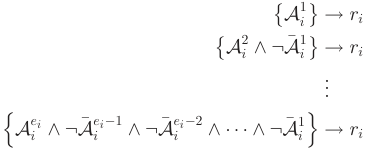

In the jth rule, the positive literals are Aj i,andthenegative literals are data providers inSj k� ¼1 1A� ik,whereA�k j¼ A ik �Aj i (Lines 4 to 6). The entire game for reward sharing can then be built up from the set of rules for all versions (Lines 7 to 9). This expressive representation scheme fully describes the reward sharing game from Definition 3, and reduces the space requirement to Oðne� Þ, where n is the number of versions (also the number of data consumers) and e� is the maximum equivalent basic coalitions for one version, i.e., e� ¼ max1�i�nei. 

### 5.3 Computing the Shapley Value 

We first briefly introduce the concept of Shapley value, which is a powerful result for cooperative game proven by Shapley in 1953 [50]. We use fi to denote the Shapley value for data provider i 2 A. The Shapley value is the unique way to distribute the grand reward among data providers that satisfies four fairness axioms: 

Efficiency (EFF): The sum of the share of all data providers is the grand reward, i.e.,P i2Af i¼ WðAÞ ¼ R: 

Symmetry (SYM): If data providers i and j are interchangeable, i.e., W ðA [ figÞ ¼ W ðA [ fjgÞ; 8A � Anfi; jg, then their Shapley values are equal, i.e., fi ¼ fj. 

Dummy (DUM): If data provider i is a dummy data provider, i.e., her marginal contributions to all coalition A are the same, then fi ¼ W ðfigÞ. 

Additivity (ADD): For any two coalitional games V and W defined over the same set of data providers A, fiðV þ W Þ ¼ fiðV Þ þ fiðW Þ for all i 2 A, where the game V þ W is defined as ðV þ W ÞðAÞ ¼ V ðAÞ þ W ðAÞ for all A � A. 

The Shapley value to data provider i is the average marginal contribution of i over all possible permutations of the data providers, and can be calculated by: 

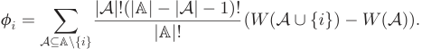

Given the MC-Nets of the reward sharing game, we can design ARETE-SH, a simple and efficient algorithm to compute the Shapley value of the game. Specifically, we first 

compute the Shapley value of data providers in each rule by considering each rule as a separate game. The final Shapley value of each data provider is the sum of the Shapley values she obtains in all rules. The following lemma from [34] demonstrates that this “divide and conquer” scheme correctly computes the Shapley value of data providers in the reward sharing coalition game. 

Lemma 3. The Shapley value of a data provider in reward sharing game is equal to the sum of the Shapley value over each rule in MC-Nets. 

### Algorithm 4. Reward Sharing Mechanism 

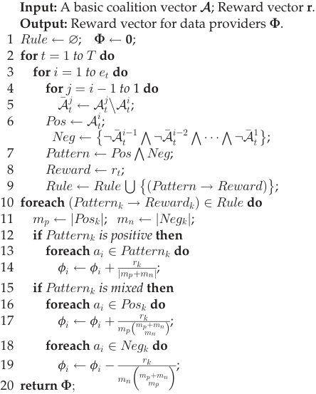

We now compute the Shapley value of data providers in each rule, and show the corresponding pseudo-code in Algorithm 4 (Lines 10 to 19). We separate the analysis into two scenarios: one for rules with only positive literals, and the other for rules with both positive and negative literals. 

In the rules with only positive literals, the positive literals in the rule are indistinguishable from each other. By the Efficiency axiom and Symmetry axiom, the Shapley value of each positive literals in the rule is r=mp, where r is the reward of the rule, and mp is the number of positive literals in the rule (Lines 12 to 14). 

For the rules that have mixed literals, we further consider the positive literals (Lines 16 to 17) and negative literals (Lines 18 to 19), separately. A positive literal ai has non-zero marginal contribution only in the permutation that ai appears after the rest of the positive literals but before any of the negative literals. Therefore, the Shapley value for the positive literal ai in the rule with mp positive literals and mn negative literals is 

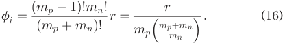

Authorized licensed use limited to: Shanghai Jiaotong University. Downloaded on February 15,2022 at 08:24:33 UTC from IEEE Xplore.  Restrictions apply. 

ZHENG ET AL.: ARETE: ON DESIGNING JOINT ONLINE PRICING AND REWARD SHARING MECHANISMS FOR MOBILE DATA MARKETS 

783 

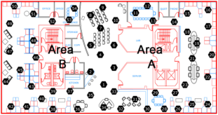

Fig. 3. Sensor network deployment with 54 nodes in one selected lab. 

The negative literal aj has a non-zero marginal contribution, if all positive literals come before the literal aj, and aj is the first among the negative literals. Thus, we have 

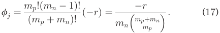

According to Symmetry axiom, all positive literals have the same value fi, and negative literals have the value of fj. 

We can compute the Shapley value of a data provider in a given rule within constant time. There are at most n � e� rules in the game, and thus the time complexity of Algorithm 4 is Oðmne� Þ. 

## 6 EVALUATION RESULTS 

In this section, we evaluate ARETE on a public real-world sensory data set. 

Sensory Data Set. The data set we considered in our evaluations is the Intel sensed data set collected by Intel Berkeley lab between February 28th and April 5th, 2004. As shown in Fig. 3, 54 Mica2Dot sensor nodes were deployed in the lab to collect multi-dimensional environment attributes, including temperature, humidity, light, voltage, and etc, in a real time manner. In our evaluations, we sample temperature measurements at 30 seconds intervals on 11 consecutive days (Starting Feb. 28th, 2004) in the lab with x-coordinate varying from 0m to 40.5m and y-coordinate varying from 0m to 31m. We set the upper right corner of the lab to be the origin with the coordinates (0, 0). We collect 11 data sets, randomly choose one of them as the data commodity, and use the remaining data sets to train the parameters of Gaussian Process model. 

For choosing Gaussian Process as the statistical model, we have to know the mean and kernel functions. In our evaluations, we use regression techniques to estimate the mean function. We assume that the kernel function is isotropic, which means that the covariance between two locations 

only depends on their corresponding distance. One canonical isotropic kernel function is Gaussian kernel function: dða1;a2Þ2 Kða1; a2Þ ¼ s2 exp�� 2l2 �; where dða1; a2Þ is the distance between locations a1 and a2. Using the training data sets, we can learn the parameters s and l by cross-validation. In order to verify the efficient description of the isotropic kernel function for our data sets, we compare the empirical data of each sensor node with the readings inferred via the data from the other 53 sensors. As Fig. 4a shows, for most sensor nodes (around 85 percent), the error of the inferential readings are within 10 percent of the ground truth. We note that ARETE is independent of specific kernel functions. For more complicated environment, we can adopt some general anisotropic kernel functions [47]. After determining the mean and kernel functions, we can plot the posterior mean and posterior variance of the lab in Figs. 4b and 4c, respectively, using Eqs. (1) and (2). Fig. 4b shows the areas near the windows (y-coordinates lie near 0.) have lower inferential temperature. From Fig. 4c, we observe that area A and area B, located in the center of the lab, have higher posterior variances, because in these areas with few sensor nodes deployed, we lack enough relative data to confidently infer their readings. 

Evaluation Setup. We introduce the setting of our evaluations. We regard the 54 sensor nodes as data providers in the context of data market. We create a finite mesh grid with mesh width 1m in the lab region, and obtain 1312 grid points, which are considered as basic data commodities. We emulate a large scale data market, in which the number of data consumers ranges from 105 to 106 with increment of 105 . We consider two classical valuation distributions: Uniform distribution and Normal distribution, and set the maximum valuation of data consumers as d ¼ 256. We randomly generate an accuracy requirement hi 2 ð0; 1� for each data consumer bi. All the evaluation results are averaged over 200 runs. 

### 6.1 Performance of ARETE-PR 

We implement ARETE-PR, and compare its performance with three other pricing mechanisms: Optimal pricing mechanism (“OPT” for short), Random pricing mechanism (“Random” for short), and ARETE-PR without versioning (“No Version” for short). In “OPT” mechanism, the valuation information and arrival sequence of all data consumers are known in advance, and the data vendor can calculate the off-line optimal revenue by setting a single fixed price. We note that the “OPT” is impractical as it requires the 

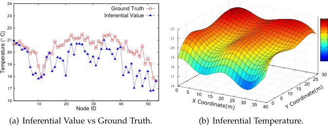

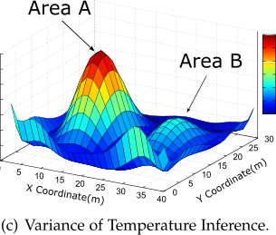

Fig. 4. Posterior mean and posterior variance of the temperature Gaussian Process estimated using all sensors. 

Authorized licensed use limited to: Shanghai Jiaotong University. Downloaded on February 15,2022 at 08:24:33 UTC from IEEE Xplore.  Restrictions apply. 

IEEE TRANSACTIONS ON MOBILE COMPUTING, VOL. 19, NO. 4, APRIL 2020 

784 

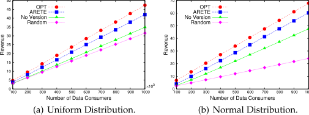

Fig. 5. The revenue of ARETE under different valuation distributions. 

priori knowledge of data consumers’ valuations, but can be served as a bench mark in our evaluations. In “Random” mechanism, we randomly select a price in ½1; d� as the charge for each data consumer’s query. In order to investigate the impact of versioning mechanism on the data market’s performance, we also consider the ARETE-PR without versioning, in which each data commodity only has the full version. Considering the computational overhead, we set b to be 0.1, which can capture at least 90 percent of optimal revenue by Lemma 1. Since a and b jointly determine the trade-off between exploration and exploitation, we fix a as 0.02, and adjust g to examine the role of exploration and exploitation in different valuation distribution scenarios. When the valuations are drawn from normal distribution, we set g ¼ 0:1, and for uniform distribution, we set g ¼ 0:35. As we determine the price for data commodities independently, we only report the revenue of the data commodity at location ð25; 10Þ in this set of evaluations. 

Fig. 5 shows the revenue of different pricing mechanisms, when the valuations follow two different distributions. Generally, in both normal distribution and uniform distribution, ARETE-PR always outperforms the “Random” and “No Version” mechanisms, and approaches the results of “OPT”. The “Random” mechanism does not take any advantage of the collected valuation information, and achieves the worst performance. This performance degradation is especially severe in normal distribution scenario, because the “Random” mechanism does not adopt the exploitation process, which can significantly improve the performance when the valuations densely locate in a certain small range. In “No Version” pricing mechanism, data consumers with low accuracy requirements cannot afford the high price of the full version, and the data vendor loses much revenue from these data consumers. We observe that ARETE-PR mechanism gains around 90 percent revenue of the “OPT” in both uniform and normal distribution. This 

demonstrates that ARETE-PR can adaptively learn the valuations of consumers, and set an appropriate price to obtain high revenue. From Fig. 5, we can also see that the revenue increases linearly with respect to the number of data consumers. This is because data commodity is one kind of information goods and is unlimitedly supplied, and thus the data vendor can always gain revenue by selling more data commodities to more data consumers. 

### 6.2 Performance of ARETE-SH 

We now report the evaluation results of ARETE-SH. For each data commodity, we fix the number of corresponding data consumers as 105 , and choose normal distribution as their valuation distributions. We first focus on sharing the reward from selling a single data commodity at a fixed location ð25; 10Þ. In practice, it is complicated to design each version for each data consumer. Thus, the data vendor could predefine several standard versions, and selects the lowest qualified version to the data consumer. As shown in Fig. 2, we apply the versioning mechanism of ARETE to generate three basic coalition A1, A2 and A3. We assume that the reward for sharing is 80 percent of the revenue generated by the online pricing mechanism of ARETE. Thus, we can calculate the rewards for the three basic coalitions ðA1; A2; A3Þ as ðr1; r2; r3Þ ¼ ð0:517 � 106 ; 1:222 � 106 ; 1:438 � 106 Þ. 

We randomly select three data providers with ID 8 from A1, ID 7 from A2nA1, and ID 11 from A3nA2. We plot their corresponding rewards in Fig. 6a, where the separation of the bars represents the source of the reward. Fig. 6a shows that the data providers from the same Ai obtain the same reward from ri, e.g., data provider 8 and data provider 7, belonging to A2, obtain the same reward from r2. This is because according to the principle of ARETE-SH, we equally share the reward ri among the data providers in Ai. From Fig. 6a, we can also see that the data providers from Ai obtain higher reward than the data providers from Aiþ1nAi, e.g., data provider 8 receives more rewards than data provider 7. The reason is that we have A1 �A2 �A3 from the versioning result, meaning that the data providers in Ai can obtain rewards from rj, j � i. Compared with data providers in Aiþ1nAi, data providers in Ai can get extra rewards from ri. Thus, we can conclude that ARETE-SH equally distributes the reward ri among data providers in Ai, and the data providers with high variance reduction can receive more rewards, which demonstrates the fairness of ARETE-SH. 

We now investigate the effect of data market demand on the reward sharing. We query on the data commodities in the 

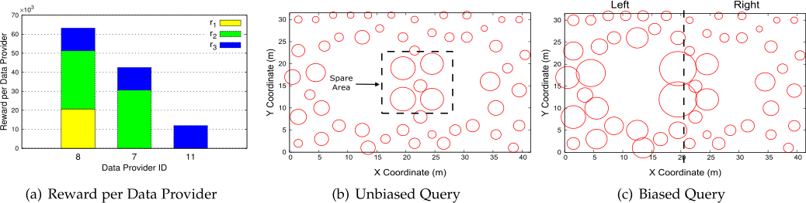

Fig. 6. Performance of ARETE-SH. 

Authorized licensed use limited to: Shanghai Jiaotong University. Downloaded on February 15,2022 at 08:24:33 UTC from IEEE Xplore.  Restrictions apply. 

ZHENG ET AL.: ARETE: ON DESIGNING JOINT ONLINE PRICING AND REWARD SHARING MECHANISMS FOR MOBILE DATA MARKETS 

785 

whole area, and calculate the accumulated reward of each data provider. We first consider the unbiased demand setting, in which each data commodity is queried by the same number of data consumers. We further consider the biased demand scenario, in which data commodities located in the left side (x-coordinate lies in the range ½0; 20�) receives more queries than those located in the right side. In Figs. 6b and 6c, the radius of each circle represents the cumulative reward of data provider at the corresponding location. As Fig. 6b shows, in the unbiased case, the data providers in the sparse area can attain higher rewards than those in the dense area. The reason is that ARETE-SH only shares the reward with the sets of data providers selected by the versioning mechanism in ARETEPR. According to the selection criterion in greedy versioning mechanism, the data providers in the sparse area have high chances to be selected to generate the data commodities around them, as they provide more informative information to the generation of data commodities. From Fig. 6c, we can see that the data providers in the dense area can also obtain high reward if their located area (left side) has popular queries. This is because the data vendor can obtain large revenue from the data commodities with high market demands, and the total bonus reward in ARETE-SH is proportional to the revenue extracted from data trading. 

The evaluation results of ARETE-SH have a profound impact on the revenue of data trading in a long term: with the discriminative reward provided by ARETE-SH, the data acquisition scheme could automatically guide data providers to collect the data that is profitable in data markets. This positive impact of ARETE-SH on revenue is due to two critical design ideas in ARETE-SH: one is the criterion to select the qualified coalitions of data providers for reward sharing, and the other one is the proportion relation of reward to the revenue. The result in Fig. 6b implies that the reward distributed by ARETE-SH would incentivize data providers to collect data for the areas with few data providers employed. This will improve the accuracies of data commodities in the sparse areas and attract the data consumers with high accuracy requirements, leading to high revenue for the data market. Without ARETE-SH scheme, the data commodities in these sparse areas cannot obtain revenue as they do not satisfy the accuracy requirements of these data consumers. Fig. 6c indicates that ARETE-SH would steer data providers to collect data for the areas with high market demands, which would maintain the data commodities in these areas at a high accuracy level, and continuously extract revenue from the market. 

## 7 RELATED WORK 

We briefly review the related works in this section. 

Data Marketplace. In the seminal paper of data trading [6], Balazinska et al. visioned the implications of emerging data markets, and discussed the potential research opportunities in this direction. Later, Koutris et al. [40] pointed out the inflexibility of current data pricing approaches, and proposed a query-based data pricing framework, which requires two important properties: arbitrage-free and discount-free. Recently, Zheng et al. studied the problem of profit driven data acquisition in mobile crowd-sensed data market [63]. However, these previous works did not answer 

the fundamental question in data trading: how to determine the price for data services? We tackle this open problem by designing a online pricing mechanism. 

Mobile Crowdsensing. The ubiquitous mobile devices with powerful sensors have boosted the rapid growth of diverse mobile sensing applications in numerous contexts. For example, Gu et al. presented crowdsensing-based indoor localization system [29]. Wang et al. designed CrowdAltas to automatically update maps based on people’s GPS traces [56]. The success of these applications highly depends on the supply of large amount of crowd-sensed data from crowds. Thus, researchers have proposed pricing mechanisms to incentivize workers to contribute their collected data [32], [39], [61], [64]. Kai et al. extended the traditional single-minded setting to multi-minded user model, in which users have different private costs for different tasks, and only perform a subset of the tasks [32]. The authors then designed an online pricing mechanism to incentive multi-minded users under the adversarial scenario. Mobile crowdsensing is a variance of crowdsourcing in mobile environment, the problem of incentive design has also been widely investigated for different types of crowdsourcing services. For example, Wen and Lin designed an optimal fee schedule to coordinate the incentive conflict between a crowdsourcing website and contest sponsors [57]. Their results imply that the widespread linear fee schedule is not optimal. Alelyani et al. adopted the machine learning techniques, such as topic modeling and NLP techniques, for price estimation, and proposed Context-Centric Pricing approach to support software crowdsourcing pricing [1]. 

The incentive design in mobile crowdsensing system is different from that in data markets. Data providers in data markets also incur sensing costs during data acquisition process, and the data vendor compensates these costs with a basic rewards, which is similar in mobile crwodsensing. The difference part is that the data vendor has to share a portion of revenue from data trading with data providers. In data markets, we augment the basic reward with a bound reward to offer incentive for data providers, and design an efficient algorithm to calculate the Shapley value, achieving the four fairness axioms. Currently, the operators collected and analyzed crowd-sensed data for their own application purposes. To break this barrier, we proposed a data market to facilitate the exchange and trading of crowd-sensed data, enabling the potential usage of mobile data in new sensing applications. 

Online Pricing Mechanism. In this paper, we built a connection between data pricing design and online digital auction design [9], [10], [31]. By exploiting the machine learning techniques in multi-armed bandit problem [3], Blum et al. [10] proposed an online posted-price digital auction, achieving a constant competitive ratio with an additional loss term Oðd log d log log dÞ. Later, Blum and Hartline [9] improved on the approximation results [10] by reducing the additive loss term to Oðd log log dÞ. As for online auctions with multiple unlimited items and single-minded buyers, Balcan and Blum [7] proposed several approximation algorithms to achieve near-optimal revenue. Balcan et al. [8] showed that single posted-price mechanisms can achieve sub-optimal revenue for the unlimited supply setting with multi-minded buyers. Without considering the strategic behaviours of buyers, the digital auction design can be reduced to algorithmic pricing problem, and several approximation pricing algorithms have 

Authorized licensed use limited to: Shanghai Jiaotong University. Downloaded on February 15,2022 at 08:24:33 UTC from IEEE Xplore.  Restrictions apply. 

IEEE TRANSACTIONS ON MOBILE COMPUTING, VOL. 19, NO. 4, APRIL 2020 

786 

been proposed in different scenarios [25], [53]. In mobile data markets, the trading data should be further partitioned into multiple versions to implement some levels of price discrimination, extracting revenue from different market segments. The major advantage of our work over the previous works is to model digital goods as divisible items, producing new challenges for online pricing mechanism design. 

## 8 CONCLUSION 

In this work, we have proposed the first data market prototype to enable mobile crowd-sensed data trading on the Web. We have built a Gaussian Process model to capture the uncertainty of mobile data, and provided three basic query interfaces for data consumers to extract their needed information from the statistical model. We have considered the problem of profit maximization, and proposed an online query-based data pricing mechanism, namely ARETE-PR, containing two major components: a versioning mechanism and an online pricing mechanism. ARETE-PR satisfies arbitrage-freeness, and achieves a constant competitive ratio. We have further designed a reward sharing scheme, namely ARETE-SH, to calculate the Shapley value for data providers. We have leveraged a real-world sensory data set to evaluate ARETE. The evaluation results show that ARETE outperforms the existing pricing mechanisms, and is almost as effective as the optimal fixed price mechanism. ARETESH can distribute the rewards in a fair manner. 

## ACKNOWLEDGMENTS 

This work was supported in part by the National Key R&D Program of China 2018YFB1004703, in part by China NSF grant 61672348 and 61672353, in part by the Open Project Program of the State Key Laboratory of Mathematical Engineering and Advanced Computing 2018A09, and in part by the Alibaba Group through the Alibaba Innovation Research Program, and in part by the Initiative Postdocs Supporting Program. The opinions, findings, conclusions, and recommendations expressed in this paper are those of the authors and do not necessarily reflect the views of the funding agencies or the government. 

## REFERENCES 

- [1] T. Alelyani, K. Mao, and Y. Yang, “Context-centric pricing: Early pricing models for software crowdsourcing tasks,” in Proc. 13th Int. Conf. Predictive Models Data Analytics Softw. Eng., 2017, pp. 63–72. 

- [2] K. Amin, A. Rostamizadeh, and U. Syed, “Learning prices for repeated auctions with strategic buyers,” in Proc. 26th Int. Conf. Neural Inf. Process. Syst., 2013, pp. 1169–1177. 

- [3] P. Auer, N. Cesa-Bianchi , Y. Freund, and R. E. Schapire, “Gambling in a rigged casino: The adversarial multi-armed bandit problem,” in Proc. 36th Annu. Symp. Found. Comput. Sci., 1995, Art. no. 322. 

- [4] Azure data marketplace. 2017. [Online]. Available: http://www. infochimps.com/ 

- [5] M. Babaioff, Y. Sharma, and A. Slivkins, “Characterizing truthful multi-armed bandit mechanisms: Extended abstract,” in Proc. 10th ACM Conf. Electron. Commerce, 2009, pp. 79–88. 

- [6] M. Balazinska, B. Howe, and D. Suciu, “Data markets in the cloud: An opportunity for the database community,” in Proc. VLDB Conf., 2011, pp. 1482–1485. 

- [7] M.-F. Balcan and A. Blum, “Approximation algorithms and online mechanisms for item pricing,” in Proc. 7th ACM Conf. Electron. Commerce, 2006, pp. 29–35. 

- [8] M.-F. Balcan, A. Blum, and Y. Mansour, “Item pricing for revenue maximization,” in Proc. 9th ACM Conf. Electron. Commerce, 2008, pp. 50–59. 

- [9] A. Blum and J. D. Hartline, “Near-optimal online auctions,” in Proc. 16th Annu. ACM-SIAM Symp. Discrete Algorithms, 2005, pp. 1156–1163. 

- [10] A. Blum, V. Kumar, A. Rudra, and F. Wu, “Online learning in online auctions,” in Proc. 14th Annu. ACM-SIAM Symp. Discrete Algorithms, 2003, pp. 202–204. 

- [11] J.-M. Bohli, C. Sorge, and D. Westhoff, “Initial observations on economics, pricing, and penetration of the internet of things market,” SIGCOMM Comput. Commun. Rev., vol. 39, no. 2, pp. 50–55, 2009. 

- [12] N. Cesa-Bianchi and G. Lugosi, Prediction, Learning, and Games. Cambridge, U.K.: Cambridge Univ. Press, 2006. 

- [13] R. K. Chellappa and S. Shivendu, “Managing piracy: Pricing and sampling strategies for digital experience goods in vertically segmented markets,” Inf. Syst. Res., vol. 16, no. 4, pp. 400–417, 2005. 

- [14] Q. Chen, H. Hu, and J. Xu, “Authenticating top-k queries in location-based services with confidentiality,” J. Proc. VLDB Endowment, vol. 7, no. 1, pp. 49–60, 2013. 

- [15] R. Cheng, T. Emrich, H.-P. Kriegel, N. Mamoulis, M. Renz, G. Trajcevski, and A. Zufle, “Managing uncertainty in spatial and spatio-temporal data,” in Proc. IEEE 30th Int. Conf. Data Eng., 2014, pp. 1302–1305. 

- [16] X. Chu, I. F. Ilyas, S. Krishnan, and J. Wang, “Data cleaning: Overview and emerging challenges,” in Proc. Int. Conf. Manage. Data, 2016, pp. 2201–2206. 

- [17] T. M. Cover and J. A. Thomas, Elements of Information Theory. Hoboken, NJ, USA: Wiley, 2012. 

- [18] N. Cressie, Statistics for Spatial Data, Hoboken, NJ, USA: Wiley, 2015. 

- [19] Accudata. 2018. [Online]. http://www.accudata.com/ 

- [20] A. Das and D. Kempe, “Algorithms for subset selection in linear regression,” in Proc. 40th Annu. ACM Symp. Theory Comput., 2008, pp. 45–54. 

- [21] Databroker dao. 2019. [Online]. Available: https://databrokerdao. com/ 

- [22] Dataexchange. 2018. [Online]. Available: http://new. thedataexchange.com/ 

- [23] Datum, 2017, [Online]. Available: https://datum.org/ 

- [24] A. Deshpande, C. Guestrin, S. R. Madden, J. M. Hellerstein, and W. Hong, “Model-driven data acquisition in sensor networks,” in Proc. 30th Int. Conf. Very Large Data Bases, 2004, pp. 588–599. 

- [25] D. E. Difallah, M. Catasta, G. Demartini, and P. Cudr�e-Mauroux, “Scaling-up the crowd: Micro-task pricing schemes for worker retention and latency improvement,” in Proc. 2nd AAAI Conf. Human Comput. Crowdsourcing, 2014, pp. 50–58. 

- [26] W. Du, Z. Xing, M. Li, B. He, L. H. C. Chua, and H. Miao, “Optimal sensor placement and measurement of wind for water quality studies in urban reservoirs,” in Proc. 13th Int. Symp. Inf. Process. Sensor Netw., 2014, pp. 167–178. 

- [27] Factual. 2008. [Online]. Available: https://www.factual.com/ 

- [28] Gnip. 2018. [Online]. Available: https://gnip.com/ 

- [29] F. Gu, J. Niu, and L. Duan, “WAIPO: A fusion-based collaborative indoor localization system on smartphones,” IEEE/ACM Trans. Netw., vol. 25, no. 4, pp. 2267–2280, Aug. 2017. 

- [30] A. Guillory and J. A. Bilmes, “Online submodular set cover, ranking, and repeated active learning,” in Proc. 24th Int. Conf. Neural Inf. Process. Syst., 2011, pp. 1107–1115. 

- [31] V. Guruswami, J. D. Hartline, A. R. Karlin, D. Kempe, C. Kenyon, and F. McSherry, “On profit-maximizing envy-free pricing,” in Proc. 16th Annu. ACM-SIAM Symp. Discrete Algorithms, 2005, pp. 1164–1173. 

- [32] K. Han, Y. He, H. Tan, S. Tang, H. Huang, and J. Luo, “Online pricing for mobile crowdsourcing with multi-mindeds users,” in Proc. 18th ACM Int. Symp. Mobile Ad Hoc Netw. Comput., 2017, Art. no. 18. 

- [33] Here. 2017. [Online]. Available: https://company.here.com/here/ [34] S. Ieong and Y. Shoham, “Marginal contribution nets: A compact representation scheme for coalitional games,” in Proc. 6th ACM Conf. Electron. Commerce, 2005, pp. 193–202. 

- [35] Infochimps. 2009. [Online]. Available: http://www.infochimps. com/ 

- [36] Instagram. 2019. [Online]. Available: https://www.instagram. com/ 

- [37] Internet of Things Data Marketplace by IOTA. 2019. [Online]. Available: https://data.iota.org/ 

- [38] R. K. Iyer and J. A. Bilmes, “Submodular optimization with submodular cover and submodular knapsack constraints,” in Proc. 26th Int. Conf. Neural Inf. Process. Syst., 2013, pp. 2436–2444. 

- [39] M. Karaliopoulos, I. Koutsopoulos, and M. Titsias, “First learn then earn: Optimizing mobile crowdsensing campaigns through data-driven user profiling,” in Proc. 17th ACM Int. Symp. Mobile Ad Hoc Netw. Comput., 2016, pp. 271–280. 

Authorized licensed use limited to: Shanghai Jiaotong University. Downloaded on February 15,2022 at 08:24:33 UTC from IEEE Xplore.  Restrictions apply. 

ZHENG ET AL.: ARETE: ON DESIGNING JOINT ONLINE PRICING AND REWARD SHARING MECHANISMS FOR MOBILE DATA MARKETS 

787 

- [40] P. Koutris, P. Upadhyaya, M. Balazinska, B. Howe, and D. Suciu, “Toward practical query pricing with querymarket,” in Proc. ACM SIGMOD Int. Conf. Manage. Data, 2013, pp. 613–624. 

- [41] A. Krause, H. B. McMahan, C. Guestrin, and A. Gupta, “Robust submodular observation selection,” J. Mach. Learn. Res., vol. 9, pp. 2761–2801, 2008. 

- [42] T. Lappas, K. Liu, and E. Terzi, “Finding a team of experts in social networks,” in Proc. 15th ACM SIGKDD Int. Conf. Knowl. Discovery Data Mining, 2009, pp. 467–476. 

- [43] C. Meng, W. Jiang, Y. Li, J. Gao, L. Su, H. Ding, and Y. Cheng, “Truth discovery on crowd sensing of correlated entities,” in Proc. 13th ACM Conf. Embedded Netw. Sensor Syst., 2015, pp. 169–182. 

- [44] L. Mo, Y. He, Y. Liu, J. Zhao, S.-J. Tang, X.-Y. Li, and G. Dai, “Canopy closure estimates with greenorbs: Sustainable sensing in the forest,” in Proc. 7th ACM Conf. Embedded Netw. Sensor Syst., 2009, pp. 99–112. 

- [45] Nasdaq. 2019. [Online]. Available: http://www.nasdaq.com/ 

- [46] J. F. Nash, “The bargaining problem,” Econometrica, vol. 18, no. 2, pp. 155–162, 1950. 

- [47] D. J. Nott and W. T. Dunsmuir, “Estimation of nonstationary spatial covariance structure,” Biometrika, vol. 89, no. 4, pp. 819–829, 2002. 

- [48] E. Rahm and H. H. Do, “Data cleaning: Problems and current approaches,” IEEE Data Eng. Bull., vol. 23, no. 4, pp. 3–13, Dec. 2000. 

- [49] M. Rokicki, S. Zerr, and S. Siersdorfer, “Groupsourcing: Team competition designs for crowdsourcing,” in Proc. 24th Int. Conf. World Wide Web, 2015, pp. 906–915. 

- [50] L. Shapley, “A value for n-person games,” in Contributions to the Theory of Games, vol. II, A.W. Tucker, Ed. Princeton, NJ, USA: Princeton Univ. Press, 1953. 

- [51] Streamr. 2018. [Online]. Available: https://www.streamr.com/ 

- [52] L. Sun, R. Cheng, D. W. Cheung, and J. Cheng, “Mining uncertain data with probabilistic guarantees,” in Proc. 16th ACM SIGKDD Int. Conf. Knowl. Discovery Data Mining, 2010, pp. 273–282. 

- [53] V. Syrgkanis and J. Gehrke, Pricing queries (approximately) optimally, 2015. [Online]. Available: http://arxiv.org/abs/1508.05347 

Yanqing Peng received the BEng degree in computer science and engineering from Shanghai Jiao Tong University, in 2016. He is working toward the PhD degree from the School of Computing, University of Utah. His research interests include wireless networking, datacenter networking, algorithmic game theory, and large-scale data management. 

Fan Wu received the BS degree in computer science from Nanjing University, in 2004, and the PhD degree in computer science and engineering from the State University of New York at Buffalo, in 2009. He is a professor with the Department of Computer Science and Engineering, Shanghai Jiao Tong University. He has visited the University of Illinois at Urbana-Champaign (UIUC) as a post doc research associate. His research interests include wireless networking and mobile computing, algorithmic game theory and its applications, and privacy preservation. He has published more than 100 peer-reviewed papers in technical journals and conference proceedings. He is a recipient of the first class prize for the Natural Science Award of China Ministry of Education, NSFC Excellent Young Scholars Program, ACM China Rising Star Award, CCF-Tencent “Rhinoceros bird” Outstanding Award, CCF-Intel Young Faculty Researcher Program Award, and Pujiang Scholar. He has served as the chair of CCF YOCSEF Shanghai, on the editorial board of Elsevier Computer Communications, and as a member of technical program committees of more than 60 academic conferences. For more information, please visit http://www. cs.sjtu.edu.cn/fwu/. He is a member of the IEEE. 

- [54] Thingful. 2016. [Online]. Available: https://thingful.net/ 

- [55] Thingspeak. 2019. [Online]. Available: https://thingspeak.com/ 

- [56] Y. Wang, X. Liu, H. Wei, G. Forman, C. Chen, and Y. Zhu, “Crowdatlas: Self-updating maps for cloud and personal use,” in Proc. 11th Annu. Int. Conf. Mobile Syst. Appl. Services, 2013, pp. 469–470. 

- [57] Z. Wen and L. Lin, “Pricing crowdsourcing services,” in Proc. Int. Conf. Logistics Informat. Service Sci., 2015, pp. 1–6. 

- [58] C. K. Williams and C. E. Rasmussen, Gaussian Processes for Regression, Cambridge, MA, USA: MIT Press, 1996. 

- [59] L. A. Wolsey, “An analysis of the greedy algorithm for the submodular set covering problem,” Combinatorica, vol. 2, no. 4, pp. 385–393, 1982. 

- [60] Xignite. 2016. [Online]. Available: http://www.xignite.com/ 

- [61] D. Yang, G. Xue, X. Fang, and J. Tang, “Crowdsourcing to smartphones: incentive mechanism design for mobile phone sensing,” in Pro. 18th Annu. Int. Conf. Mobile Comput. Netw., 2012, pp. 173–184. 

- [62] L. Zhang, Y. Li, X. Xiao, X. Li, J. Wang, A. Zhou, and Q. Li, “Crowdbuy: Privacy-friendly image dataset purchasing via crowdsourcing,” in Proc. IEEE Conf. Comput. Commun., 2018, pp. 2735–2743. 

- [63] Z. Zheng, Y. Peng, F. Wu, S. Tang, and G. Chen, “Trading data in the crowd: Profit-driven data acquisition for mobile crowdsensing,” IEEE J. Sel. Areas Commun., vol. 35, no. 2, pp. 486–501, Feb. 2017. 

- [64] Z. Zheng, Z. Yang, F. Wu, and G. Chen, “Mechanism design for mobile crowdsensing with execution uncertainty,” in Proc. IEEE 37th Int. Conf. Distrib. Comput. Syst., 2017, pp. 955–965. 

- [65] P. Zhou, Y. Zheng, and M. Li, “How long to wait?: Predicting bus arrival time with mobile phone based participatory sensing,” in Proc. 10th Int. Conf. Mobile Syst. Appl. Services, 2012, pp. 379–392. 

- Zhenzhe Zheng received the BE degree in software engineering from Xidian University, in 2012, and the MS and PhD degrees in computer science and engineering from Shanghai Jiao Tong University, in 2015 and 2018, respectively. He is now visiting the University of Illinois at UrbanaChampaign (UIUC) as a post doc researcher. His research interests include wireless networking and mobile computing, game theory, and algorithm design. He is a student member of the ACM, IEEE, and CCF. 

Shaojie Tang received the PhD degree in computer science from the Illinois Institute of Technology, in 2012. He is currently an assistant professor of the Naveen Jindal School of Management at the University of Texas at Dallas. His research interests include social networks, mobile commerce, game theory, e-business, and optimization. He received the Best Paper Awards in ACM MobiHoc 2014 and IEEE MASS 2013. He also received the ACM SIGMobile service award in 2014. He served in various positions (as chairs and TPC members) at numerous conferences, including ACM MobiHoc and IEEE ICNP. He is an editor for the International Journal of Distributed Sensor Networks. He is a member of the IEEE. 

Guihai Chen received the BS degree from Nanjing University, in 1984, the ME degree from Southeast University, in 1987, and the PhD degree from the University of Hong Kong, in 1997. He is a distinguished professor of Shanghai Jiaotong University, China. He was invited as a visiting professor by many universities including Kyushu Institute of Technology, Japan, in 1998, University of Queensland, Australia, in 2000, and Wayne State University, USA during September 2001 to August 2003. He has a wide range of 

research interests with a focus on sensor network, peer-to-peer computing, high-performance computer architecture, and combinatorics. He has published more than 200 peer-reviewed papers, and more than 120 of them are in well-archived international journals such as the IEEE Transactions on Parallel and Distributed Systems, the Journal of Parallel and Distributed Computing, Wireless Network, The Computer Journal, the International Journal of Foundations of Computer Science, and Performance Evaluation, and also in well-known conference proceedings such as HPCA, MOBIHOC, INFOCOM, ICNP, ICPP, IPDPS, and ICDCS. 

- " For more information on this or any other computing topic, please visit our Digital Library at www.computer.org/csdl. 

Authorized licensed use limited to: Shanghai Jiaotong University. Downloaded on February 15,2022 at 08:24:33 UTC from IEEE Xplore.  Restrictions apply. 

