IEEE TRANSACTIONS ON MOBILE COMPUTING, VOL. 20, NO. 10, OCTOBER 2021 

2961 

# Fine-Grained User Profiling for Personalized Task Matching in Mobile Crowdsensing 

Fan Wu , Member, IEEE, Shuo Yang , Student Member, IEEE, Zhenzhe Zheng , Member, IEEE, Shaojie Tang, Member, IEEE, and Guihai Chen, Senior Member, IEEE 

Abstract—In mobile crowdsensing, finding the best match between tasks and users is crucial to ensure both the quality and effectiveness of a crowdsensing system. Existing works usually assume a centralized task assignment by the crowdsensing platform, without addressing the need of fine-grained personalized task matching. In this paper, we argue that it is essential to match tasks to users based on a careful characterization of both the users’ preference and reliability. To that end, we propose a personalized task recommender system for mobile crowdsensing, which recommends tasks to users based on a recommendation score that jointly takes each user’s preference and reliability into consideration. We first present a hybrid preference metric to characterize users’ preference by exploiting their implicit feedback. Then, to profile users’ reliability levels, we formalize the problem as a semi-supervised learning model, and propose an efficient block coordinate descent algorithm to solve the problem. For some tasks that lack users’ historical information, we further propose a matrix factorization method to infer the users’ reliability levels on those tasks. We conduct extensive experiments to evaluate the performance of our system, and the evaluation results demonstrate that our system can achieve superior performance to the benchmarks in both user profiling and personalized task recommendation. 

Index Terms—Mobile crowdsensing, task matching, user profiling, truth discovery, recommender system 

Ç 

## 1 INTRODUCTION 

DUEless technology, mobile crowdsensing [1], [2], [3] has risento the rapid development of smart devices and wireas an emerging sensing paradigm. It can employ a large number of smart devices to extract and share their local information using the embedded sensors on them. A typical mobile crowdsensing system usually consists of three major components: crowdsensing platform, service requesters, and mobile device users (data contributors). The platform is responsible for handling information requests from the service requesters and publishing sensing tasks to the users through the interaction of their smartphone applications. 

A critical problem in crowdsensing is to find the best match between users and tasks [4]. Most of the existing works adopt a platform-centric model [5], [6], [7], [8], [9], [10], which allows the platform to make centralized decisions on which users are selected to perform which sensing tasks. These works usually focus on the incentive problem, where a typical procedure goes like this: each user submits a bid reflecting her willingness or cost in participating in a task, and then the platform determines the set of selected users and their payments, so as to optimize certain utility metric (e.g., coverage, revenue, service quality) and satisfy some game-theoretic properties. The 

- F. Wu, S. Yang, Z. Zheng, and G. Chen are with the Shanghai Key Laboratory of Scalable Computing and Systems, Department of Computer Science and Engineering, Shanghai Jiao Tong University, China. E-mail: {fwu, gchen}@cs.sjtu.edu.cn, {wnmmxy, zhengzhenzhe}@sjtu.edu.cn. 

- S. Tang is with the Department of Information Systems, University of Texas at Dallas, Richardson, TX 75080 USA. E-mail: tangshaojie@gmail.com. 

Manuscript received 28 Jan. 2019; revised 24 Feb. 2020; accepted 21 Apr. 2020. Date of publication 11 May 2020; date of current version 31 Aug. 2021. (Corresponding author: Fan Wu.) 

Digital Object Identifier no. 10.1109/TMC.2020.2993963 

underlying assumption behind this type of model is that the users are fully rational and are capable of determining their optimal strategies. However, as pointed out in [11], this assumption, as well as the setting that each user’s preference can be abstracted as a single bidding parameter, could be an oversimplification of the complicated user behaviors. 

Another type of task matching systems, referred as usercentric model, gives the users more freedom to choose their interested tasks. It has been widely adopted in many commercial crowdsensing systems, such as Waze [12], Field Agent [13], and Gigwalk [14]. In these systems, the available tasks are shown to the users via their smartphone applications. The users can manually browse through the task corpus (often with simple built-in filters, such as proximity filter and payment filter), and choose their interested tasks to participate in. However, since the number of the tasks is often really large, it is inefficient for the users to browse page by page searching for suitable tasks. Without an efficient personalized task matching solution, the users may end up selecting tasks that they are not familiar with or not interested in, which may result in a decrement of the quality of their collected sensing data. 

Considering the limitations of existing task matching works, we propose to design a personalized task recommender system for mobile crowdsensing, so as to facilitate the match of the users with suitable tasks. Note that in traditional recommender systems, such as movie recommendation, items are recommended based only on customers’ preferences [15]. Whereas, in mobile crowdsensing, besides the metric of the users’ preferences, we also need to take the users’ reliability/ data quality into consideration. That is because the users may have heterogeneous sensing behaviors towards different 

1536-1233 © 2020 IEEE. Personal use is permitted, but republication/redistribution requires IEEE permission. See ht_tps://www.ieee.org/publications/rights/index.html for more information. 

Authorized licensed use limited to: Shanghai Jiaotong University. Downloaded on March 16,2022 at 17:04:03 UTC from IEEE Xplore.  Restrictions apply. 

IEEE TRANSACTIONS ON MOBILE COMPUTING, VOL. 20, NO. 10, OCTOBER 2021 

2962 

tasks, which could influence the quality of their collected data [16]. Achieving preference- and quality-aware task recommendation can have a positive impact on both attracting the user’s further participation and improving the crowdsensing system’s effectiveness. However, such a personalized task recommender system is missing in the current crowdsensing literature. Jin et al. [10] and Wang et al. [17] studied the qualityaware incentive mechanism design without addressing the need of personalized task recommendation. Karaliopoulos et al. [11] proposed to assign the tasks to the users based on the profile of each user’s probability of accepting a task, but did not consider the users’ reliability information. 

Central to the personalized task recommender system is a careful characterization on each user’s preference and reliability towards different tasks. However, it is not a trivial task, due to the unique nature of the crowdsensing scenarios. One of the challenges is finding a good way to model the users’ preference over different tasks. In some traditional recommendation scenarios, customers’ preference can be readily obtained from their previous ratings [15]. However, the users in mobile crowdsensing do not typically provide explicit ratings on their preference, s.t., we have to infer the users’ preference from their implicit feedback, including their task browsing history and task selection record. 

The most challenging part is estimating the users’ reliability levels. In particular, we have to learn the users’ reliability information for different tasks based on their submitted sensing data, if any, so as to build each user a profile characterizing the trustworthiness of the users’ data for performing the tasks. Although truth discovery algorithms [18] can be adopted to jointly estimate the users’ data quality and the underlying truths, they cannot fully address the need of user reliability profiling in the context of task recommendation. Note that truth discovery algorithms usually generate a single reliability parameter for each user representing the overall trustworthiness level of the user. However, to conduct personalized task recommendation, the heterogeneity of a user’s reliability in different tasks has to be exploited, and thus a more finegrained reliability profiling of the users should be considered. A possible alternative is to independently generate each user a reliability parameter for each task by applying truth discovery algorithms to the data of each sensing task. Unfortunately, this approach may suffer from scalability issue, and what’s worse, a user’s reliability for a task cannot be estimated by truth discovery algorithms, if the user did not contribute data to that task. This could often be a problem in real crowdsensing scenarios, especially when the users’ data are sparse, i.e., each user only contributes data to only a small number of the tasks. Besides, without the prior knowledge of truth and reliability measures, typical truth discovery algorithms are likely to fail, when the majority of data are inaccurate [19]. 

In this work, we jointly consider the problems of user profiling and personalized task matching in mobile crowdsensing, and propose a personalized task recommender system framework, which recommends tasks to the users based on both the users’ preference and reliability. We propose approaches to measure the users’ preference and reliability, respectively. First, in profiling the users’ preferences, we present a hybrid preference metric that integrates the feedback against both the users’ historical performance and the preference of their peers. Then, to tackle the more challenging part 

of profiling the users’ reliability, we model the problem as a semi-unsupervised learning problem, and propose an efficient block coordinate descent algorithm to jointly estimate the users’ reliability and the unknown ground truths. We surpass existing truth discovery methods by (1) considering grouping tasks into several categories, (2) taking the information of failed tasks into consideration, and (3) using a small number of available truth data to facilitate the estimation accuracy. Note that a user’s reliability for certain task category cannot be estimated if the user did not provide data for those tasks. To address this problem, we further propose a matrix factorization method to estimate the missing entries. We conduct a real-world experiment and also a crowdsensing simulation to evaluate the performance of our methods. The evaluation results show that our proposed methods can achieve superior performance over existing works and our benchmarks. 

The main contributions of this work are listed as follows. 

- First, we design a personalized task recommender system framework that matches tasks to the users based on both the users’ preference and reliability of the tasks. We propose a method to profile each user’s preference over the tasks by exploiting the user’s implicit feedback. 

- Second, we model the problem of user reliability profiling as a semi-supervised learning model, and propose an efficient algorithm to estimate the users’ reliability and the unknown ground truths simultaneously. We also propose a matrix factorization method to estimate each user reliability for tasks she did not contribute data to. 

- Third, we conduct a real-world crowdsensing experiment and a simulation to evaluate the performance of our methods. Both the experiment and simulation results show that our proposed methods can achieve significant performance improvements to our benchmarks. 

The rest of the paper is organized as follows. We first present the system overview in Section 2, and then introduce the problem formulations in Section 3. In Section 4, we propose our reliability profiling algorithms. We evaluate our proposed methods and present the evaluation results in Section 5. In Section 7, we review the related works. Finally, we conclude this paper in Section 6. 

## 2 SYSTEM OVERVIEW 

In this section, we present an overview of our proposed personalized task recommender system. 

### 2.1 Personalized Task Recommendation 

Suppose there are N users and M sensing tasks in the system. The set of users and tasks are denoted by N and S, respectively. We consider a user-centric model, where the users can browse the tasks in their smartphone applications and choose to participate in their interested tasks. If a user i wants to participate in a task j, she can click on some button to inform the platform her participation. After that, the user will use her smartphone to collect and then submit sensing data to the platform. Let xi;j denote the data submitted by 

Authorized licensed use limited to: Shanghai Jiaotong University. Downloaded on March 16,2022 at 17:04:03 UTC from IEEE Xplore.  Restrictions apply. 

WU ET AL.: FINE-GRAINED USER PROFILING FOR PERSONALIZED TASK MATCHING IN MOBILE CROWDSENSING 

2963 

the user i to the task j. The ground truth of the task j is denoted by x� j, which is usually unavailable to the platform. We tend to build a personalized task recommender system, where the tasks are recommended to the users based on a joint consideration of the users’ preference and reliability. Specifically, for each task j, suppose each user i’s preference and reliability regarding the task is denoted by pi;j and qi;j, respectively. We note that there are some other facts that could also affect the task recommendation results in practice. For example, to avoid the scenario that few tasks are recommended to a lot of users, we could involve the completion ratio crj of the task j when consider recommending the task j. The completion ratio could be the weighted average of recruitment ratio and coverage ratio, where the recruitment ratio is the percentage of already recruited users, and the coverage ratio is the ratio of covered regions and the required covered regions in both spatial and temporal dimensions. 

We propose a recommendation score Scoreði; jÞ that takes the user i’s preference and reliability for the task j and the completion ratio of task j into account, i.e., Scoreði; jÞ ¼ fðpi;j; qi;j; crjÞ, where the function fðÞ outputs the recommendation metric based on the three input parameters. Instances of the function fðÞ can be specified by the platform according to its need. Simple instances may include a linear combination (i.e., Scoreði;jÞ ¼ g1 pi;j þ g2qi;j þ ð1 � g1 � g2Þcrj) or a product (i.e., Scoreði;jÞ ¼ pi;j � qi;j � crj) of the three parameters. One may also treat the personalized recommendation as a constrained optimization problem, where one parameter is applied into the optimization term while the other as the constraint. For example, for each user i 2 N, we want to recommend such task j0 2 S that maximizes the user’s preference and also satisfies the constraint that the user’s reliability for the task should be above a certain threshold and the completion ratio should also not to be small. More formally: 

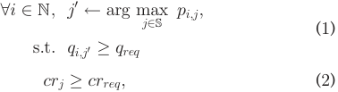

where qreq is the minimum required reliability for a user to perform a task. Central to the system model is the users’ preference and reliability measures. To that end, we need to carefully examine the historical data of the crowdsensing system, in order to acquire profiles of the users’ preference and reliability. 

### 2.2 User Preference Profiling 

To characterize users’ preference on tasks, users’ feedback information is needed. We distinguish two types of feedbacks in mobile crowdsensing systems, namely explicit feedback and implicit feedback. The explicit feedback represents the information signals that can directly indicate users’ preference over sensing tasks, while the implicit feedback is the data that need further process and mining to infer users’ preference. In mobile crowdsensing, due to additional efforts in providing the time-consuming explicit feedback, e.g., ratings, reviewers, like or dislike, such explicit feedback is usually unavailable or incomplete. Thus, we have to further leverage implicit feedback for user preference profiling. The mobile crowdsensing 

platform can obtain users’ browsing history on the application, including which tasks the user has browsed, selected, and successfully completed. Compared with traditional recommendation systems, the mobile crowdsensing systems have much rich implicit feedbacks, such as locations of users and the current status of smart devices, which imply users preference over tasks. For example, users would not like to be assigned the tasks with far travel distance and the tasks with heavy computational resources when their smart devices are almost out of power. We note that the feedback data may contain sensitive personal information, such as location and healthy data. We can leverage some privacy-preserving techniques, such as k-anonymity [20] and differential privacy [21], to aggregate and anonymize the users’ feedback information. We can also integrate federate learning [22] into recommendation systems, training local models by personal information and only transmitting the obtained user preference information to the crowdsensing platform. Both explicit and implicit feedback can be used to infer users’ preference on tasks, from two different perspectives, i.e., either against the user’s historical performance (content-based methods) or the preferences of similar users (collaborative methods) [15]. 

### 2.2.1 Content-Based Method 

Each task has many attributes, including time, location, travel distance, payment, category, and so on. Along with the users’ task selection choices (selected or not), this information can be regarded as training data. By applying classification methods, such as logistic regression or Bayesian classifier, we can build a classifier for each user to infer her probability of selecting each task [11]. We let PiðjÞ denote the probability of the user i selecting the task j. 

### 2.2.2 Collaborative Method 

Let U denote the users’ task preference matrix, where the entry ui;j indicates the user i’s preference over the task j. We assign the value of each ui;j by mapping the user’s task browsing history to a task preference value, i.e., 

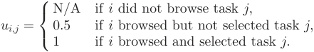

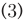

Then, we can apply state-of-the-art collaborative filtering methods to predict these missing entries [23]. 

Both of the above two methods have their limitations. On one hand, the content-based method may suffer from an overspecialization problem, i.e., it will only recommend a user tasks that are similar to those she has already selected. On the other hand, the collaborative methods may not perform well when the preference matrix is sparse. To alleviate the limitations of these two methods, we propose a hybrid recommendation approach. To do so, we define each user i’s preference for each task j as a linear combination of the content-based characteristic and the collaborative-based characteristic, i.e., 

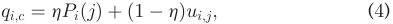

Authorized licensed use limited to: Shanghai Jiaotong University. Downloaded on March 16,2022 at 17:04:03 UTC from IEEE Xplore.  Restrictions apply. 

IEEE TRANSACTIONS ON MOBILE COMPUTING, VOL. 20, NO. 10, OCTOBER 2021 

2964 

Many previous works on recommender system have investigated the problem of exploiting customers’ implicit feedback in different application contexts. The intuitions of them can be further incorporated to improve our modelling of the users’ preferences. Possible extensions may include further considering the users’ preference over each category [24], [25], incorporating the implicit negative feedback [26], multidimensionality of recommendations [15], and Bayesian personalized ranking [27]. In the rest of the paper, we tend to put our most efforts on user reliability profiling, which is the most challenging part of the system. 

### 2.3 User Reliability Profiling 

A user’s reliability in performing a sensing task is measured by the quality of her contributed data. Intuitively, if a user’s contributed data are accurate, i.e., close to the ground truths, the user would have a higher reliability level, and vice versa. Note that in mobile crowdsensing scenarios, the ground truths are usually unavailable, thus we cannot directly measure the users’ reliability level by comparing their data with the ground truths. 

To address this problem, one possible approach is to adopt truth discovery algorithms, which are proposed to resolve conflicts in data provided by heterogeneous data sources. Existing truth discovery algorithms, e.g. [28], [29], [30], [31], [32], [33], usually follow a similar unsupervised procedure: first initializing the ground truth estimation using a simple majority voting or averaging scheme, and then iteratively updating reliability and ground truth based on the current estimation of the other. Although truth discovery algorithms have been performed well on many web mining tasks, they cannot be directly applied due to the following unique requirements of our reliability profiling contexts. 

Multi-Dimensional Reliability. Existing truth discovery algorithms usually output a single reliability parameter for each user characterizing the overall trustworthiness of the user. Whereas, with the objective of personalized task recommendation, the tasks are actually heterogeneous, s.t., we need to estimate the users’ various reliability levels for different tasks. Besides, we notice that in mobile crowdsensing, there are a large number of tasks, where different tasks may require different data collection behaviors, thus a user’s reliability may vary towards different tasks. For example, a user who often puts her smartphone in the bag may fail to provide accurate data in measuring the surrounding noise, while can still have high reliability level in monitoring traffic congestions [33]. There are two major paradigms in mobile crowdsensing, namely opportunistic sensing and participatory sensing. In opportunistic sensing, the smart devices automatically collect sensing data at some pre-defined Points of Interest, and in participatory sensing, mobile users involve in the process of data acquisition. In these two behavior paradigms, users’ reliability could be quite different. Thus, a more fine-grained reliability profiling method is needed to character the users’ multi-dimensional reliability. 

Scalability. One natural idea to address the multi-dimensional reliability problem is to apply existing truth discovery algorithms to each task independently and generate each user i a reliability measure qi;j for each task j. However, due to the large number of tasks, calculating a 

reliability parameter per user per task is not scalable. Besides, estimating each user’s reliability based only on her data to a single task may be susceptible to noise, and thus cannot accurately reflect the user’s reliability level. Therefore, our reliability profiling method should not only provide a fine-grained reliability estimation, but also be scalable under a large number of tasks. 

Robustness. Most truth discovery algorithms start with a uniform initialization of truth values or reliability values. As a result, their performance relies on the assumption that the most users’ are reliable. However, when this assumption fails, the iterative computation of truth estimation and reliability estimation may move towards incorrect directions, leading to poor estimation accuracy. This problem, referred as “initialization problem” could often occurs in mobile crowdsensing scenarios, due to the uncertainty of each individual human contributor. Thus, it is crucial to design a reliability estimation algorithm that is robust to such scenarios. 

Complete Reliability Characterization. Note that the users’ reliability values are estimated based on the relative accuracy of the their data. In consequence, a user’s reliability for certain dimension cannot be estimated if the user did not provide data to that dimension. This may not be a problem in many truth discovery scenarios where their main goal is to infer the unknown ground truths. However, in the context of personalized task recommendation, we have to obtain a complete characterization of the users’ reliability levels. Thus, we need to propose a method to predict each user’s reliability for those dimensions that the user did not provide data to. 

Different Data Types. Different sensing tasks may have different data types. For example, a traffic congestion task may require categorical data (e.g., no congestion, medium congestion, or high congestion), while a noise monitoring task may require continuous numerical data (i.e., the noise levels of the users’ surrounding environment). Thus, the reliability profiling algorithm needs to be carefully designed to handle both categorical and continuous data types. 

Our proposed user reliability profiling methods are carefully designed to address the above requirements. Specifically, for the multi-dimensional reliability and the scalability issues, we classify tasks into a number of categories and estimate the users’ reliability for each category independently. As for the robustness issue, we propose a semi-supervised learning framework that exploits few available truth knowledge to improve the estimation accuracy. We also propose a matrix factorization method to predict the missing entries in reliability estimation. The issue of different data types is taken care of by considering different loss functions. In the subsequent sections, we present the problem formulation and algorithm design of our user reliability profiling problem respectively. 

## 3 PROBLEM FORMULATION 

In this section, we formalize the user reliability profiling problem. We first present the problem model, and then propose a preliminary version and two enhancements of our problem. One enhancement is to incorporate the information of failed tasks, and the other is to integrate a small portion of truth data to improve the estimation accuracy. 

Authorized licensed use limited to: Shanghai Jiaotong University. Downloaded on March 16,2022 at 17:04:03 UTC from IEEE Xplore.  Restrictions apply. 

WU ET AL.: FINE-GRAINED USER PROFILING FOR PERSONALIZED TASK MATCHING IN MOBILE CROWDSENSING 

2965 

### 3.1 Problem Model 

To model the users’ multi-dimensional reliability, we tend to take the similarities among the tasks into consideration by classifying the tasks into different categories, where the tasks within each category focus on a similar sensing target. For example, some category only focuses on noise monitoring tasks, and an other focuses on traffic congestion monitoring. The classification of the tasks is common in current crowdsensing applications, e.g., Waze [12]. It can be done by the platform’s direct designation in the task publication phase, or by applying text classification techniques [34] to automatically analyze the descriptions of the tasks. Specifically, we categorize the M tasks into C categories (C � M). For each category c 2 f1; . . . ; Cg, the set of the tasks belong to the category is denoted by Sc (Sc � S). For simplicity, we assume that each task j 2 S only belongs to one category, thus the sets S1; . . . ; SC are mutually disjoint. More general situations will be discussed in Section 6. For each task category c, let qi;c denote each user i’s reliability of the task category. The user reliability profiling problem is to infer the users’ reliability for each category. More formally: 

Definition 1 (User Reliability Profiling Problem). Given a set of users N, a set of crowdsensing tasks S, and the users’ contributed data fxi;jji 2 N; j 2 Sg, the user reliability profiling problem aims to estimate the unknown ground truths fx� jjj 2 Sg, and the users’ reliability matrix Q 2 RN�C, where C is the dimension of each user i’s reliability. 

### 3.2 Preliminary Problem Formulation 

We assume that the tasks in different categories are independent, s.t., we can estimate the users’ reliability for each category separately. Let Nc denote the set of users who contributed data to tasks in category c. To estimate the users’ reliability, for each category c, we aim to solve the following optimization problem. 

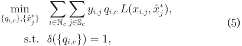

where yi;j indicates if the user i has contributed data to the task j, x^� jis our estimation for the task j’s ground truth, and dðÞ is a regularization function. Following the convention of truth discovery literature [29], we adopt the exponential regularization function, i.e., dðfqi;cgÞ ¼P i2Ncexpð�qi;cÞ. The loss function LðÞ measures the distance between a user’s data and the estimated truth. For continuous data, LðÞ can be defined as the squared distance, i.e., Lðx; ^x� Þ ¼ ðx � x^� Þ2 , while for categorial data, LðÞ can be defined as the 0=1 distance, i.e., Lðx; ^x� Þ ¼ 0 if x ¼ x^� , and 1 otherwise. An intuitive interpretation of the problem formulation is that the ground truth should be close to the data contributed by reliable users, and the users whose data are close to the ground truth should have high reliability levels. 

### 3.3 Incorporating Information of Failed Tasks 

We observe that in practice, the users may select certain tasks, but did not successfully complete them (e.g., decide to terminate the sensing procedure half way, or fail to report the collected data before deadline). The phenomenon, referred as 

failed tasks, is likely to reflect the users’ unreliability in performing certain tasks. We note that users’ reliability/data quality highly depends on personal efforts spent in data collection campaign and hardware quality. Thus, we further consider two types of failures, namely intentional failure and inherent failure, to distinguish different failure causes. Due to the concern of high data acquisition costs, mobile users may not spend their best efforts in executing tasks, resulting in the intentional failure. For example, mobile users would transmit the collected data at a low communication speed, to save transmission fee. In contrast, the cause of inherent failure comes from the fact that the hardware quality of mobile users, e.g., the speeds of communication or the accuracy of sensors, are inherently low. The mobile users could also fail to accomplish the tasks due to the low quality of hardware. In this scenario, the mobile users, experiencing inherent failures, may still be reliable in some sense, but is less reliable compared with the users who have high quality hardware and spend much effort in data acquisition. We consider these two types of failures during the evaluation of users’ reliability, taking hardware quality and invested personal efforts into account. We note that we could detect these two types of failure by verifying hardware quality, e.g., evaluating the performance of data transmission from the historical networking log data. In this part, we improve the above problem formulation by taking the task failures into account. 

We first introduce some notations. Among the set of tasks in each category c, we let Si;c denote the set of tasks the user i selected, Di;c the set of successfully accomplished tasks and Dþ i;cthe set of tasks with inherent failure. We introduce a met- ric di;c to evaluate the overall contributions of data from the tasks Di;c and Dþ i;conuseri’sreliabilityevaluation,i.e., di;c ¼ jDi;cj þ t �jDþ i;cj.Werequire0<t<1toreflectthe fact that the tasks with inherent failure have positive contribution, but less contribution compared with the successfully accomplished tasks, to users’ reliability. For each category c, we calculate each user i’s task completion ratio ri;c, which is defined as the overall contribution metric di;c normalized by di;c the total number of tasks the user i has selected, i.e., ri;c ¼ jSi;cj~~.~~ We revise the original formulation by multiplying a penalty term to qi;c. The revised problem is presented as follows. 

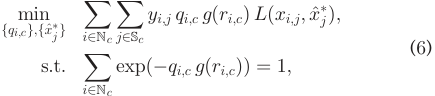

where gðxÞ ¼ 1 � logðxÞ is a function mapping each user’s completion ratio to a penalty. We can see that the users who have either intentional failure tasks or inherent failure tasks, will receive a completion ratio less than 1, and thus their reliability outputs should be less than the ones estimated by the previous method shown in Equation (5). An extreme case is that some user i may select multiple tasks but intentionally fail all the tasks, i.e., Si;c > 0 and di;c ¼ 0). In this case, the system cannot generate a reliability estimation for the user. We discuss this problem in Section 4.2. 

### 3.4 Incorporating Available Ground Truths 

The above formulation extends the basic truth discovery problem, which is built upon an underlying assumption 

Authorized licensed use limited to: Shanghai Jiaotong University. Downloaded on March 16,2022 at 17:04:03 UTC from IEEE Xplore.  Restrictions apply. 

IEEE TRANSACTIONS ON MOBILE COMPUTING, VOL. 20, NO. 10, OCTOBER 2021 

2966 

that the majority of data are reliable. Unfortunately, it may suffer from the initialization problem, i.e., when most of the data are unreliable, the above estimation procedure may have bad performance [19]. To tackle this issue, we propose a semi-supervised learning framework, which incorporates a small number of ground truths to improve the estimation accuracy. To this end, the platform may intentionally add a few tasks with known ground truths into the task corpus to collect additional information on the users’ reliability, whereas the users have no idea which tasks are inserted by the platform. The platform may also sample a few tasks, and employ some trusted workers to obtain their ground truths. Several heuristic methods can be applied to choose the sampled set of tasks. For example, we may choose the sampled tasks randomly, choose the tasks whose data have the largest variations, or choose the tasks which have the most data contributors. 

We let S denote the set of tasks with unknown ground truths, and O denote the set of tasks that are intentionally inserted by the platform with known truth information. For each category c of tasks, we let Sc and Oc denote the set of the tasks without and with prior ground truths respectively. 

Having the ground truths of some tasks in hand, we propose to leverage those information to further enhance our estimation accuracy. To distinguish the notations, we let x^� j denote the estimation of the ground truth (j 2 S), and x� o denote the known truth (o 2 O). Then, for each category c, the modified learning optimization problem is given by 

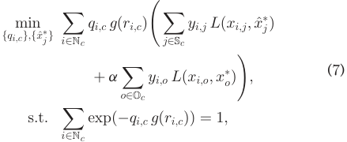

where a is a hyper parameter controlling the relative weight of the second loss terms. We can see that the second loss term Po2Ocyi;o Lðxi;o; x o�Þ is constant for each user i in each task cat- egory c. We let �i;c denote the termP o2Ocyi;o Lðxi;o; x o�Þ,and the problem presentation can be simplified as follows. 

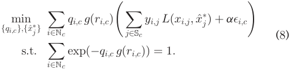

We summarize the frequently used notations in Table 1. 

## 4 USER RELIABILITY PROFILING ALGORITHM 

In this section, we first propose an algorithm to solve the user reliability profiling problem formulated above. Then, we further propose a matrix factorization method to estimate each user’s reliability for the task categories that lack the user’s historical performance. 

### 4.1 Estimating Users’ Reliability 

In the problem formulated in Equation (8), two sets of variables need to be estimated, i.e., the users’ reliability levels 

TABLE 1 

Frequently Used Notations 

|Notation|Description|
|---|---|
|i; N;N|User, number of users, and the set of users|
|j; M;S |Task, number of tasks, and the set of tasks |
|Scoreði; jÞ|Recommendation score for useriand taskj|
|c; C|Task category, and number of categories |
|pi;j|Useri’s preference for taskj |
|qi;c|Useri’s reliability in task categoryc |
|Sc|The set of tasks in categoryc|
|Nc|The set of users contributed data toSc |
|xi;j|Useri’s data for taskj |
|x� j|Ground truth of taskj|
|^x� j|Estimation of the taskj’s ground truth|
|yi;j| If usericontributed data to taskj|
|Si;c|The set of tasks useriselected inSc|
|Di;c|The set of tasks userifinished inSc|
|ri;c|Useri’s task completion ration inSc|
|O| The set of tasks with known ground truths|
|Oc| The set of tasks belong toOand inSc|
|No c|The set of users contributed data toOc|

and unknown ground truths. We propose an efficient block coordinate descent algorithm to solve it. The idea of the algorithm is to fix one set of variables to solve the other, and repeat this process until convergence. Since the estimation process for each user and category pair can be done independently, parallel computing can be adopted to speed up the entire calculation process. For each task category c, we perform the following three steps: parameter initialization, truth update, and reliability estimation. 

### 4.1.1 Parameter Initialization 

In the parameter initialization phase, we assign initial values to one set of the variables to give the learning algorithm a starting point. Existing truth discovery algorithms either initialize the unknown ground truths using a simple majority voting or averaging scheme, or uniformly initialize the reliability parameters. As pointed out in [19], [33], random or uniform initialization may result in poor estimation performance, which is especially true when most data are unreliable. 

To mitigate this problem, we propose to enhance the initialization of the users’ reliability parameters fqi;cg by incorporating the prior knowledge of available ground truths. The idea is to leverage the known truth knowledge to give related users good initial estimations of their reliability. Specifically, for each category c, let No cdenotethe set of users who contributed data to tasks in Oc. For the users in No c,weinitializetheirreliabilitybysolvingthefol- lowing problem. 

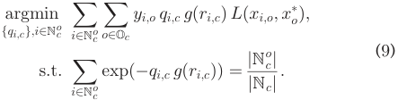

The above problem is convex, thus we can apply the method of Lagrangian multipliers to solve it. 

As for the remaining users in Nc n No c,sincetheydidnot contribute data to tasks whose ground truths are known, no prior knowledge can be applied. Thus, their reliability parameters are uniformly initialized such that 

Authorized licensed use limited to: Shanghai Jiaotong University. Downloaded on March 16,2022 at 17:04:03 UTC from IEEE Xplore.  Restrictions apply. 

WU ET AL.: FINE-GRAINED USER PROFILING FOR PERSONALIZED TASK MATCHING IN MOBILE CROWDSENSING 

2967 

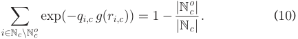

fqi;cg by solving the following optimization function. Intuitively, the users whose data are close to the ground truth will have high reliability estimations, and vice versa. 

Solving Equation 9 and Equation 10, we have the initialization of the users’ reliability parameters as follows: 

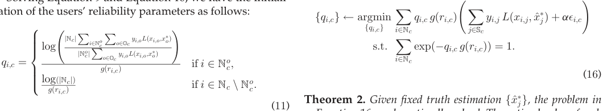

Theorem 2. Given fixed truth estimation fx^� jg,theproblemin Equation 16 can be optimally solved. The optimal value of each qi;c; i 2 Nc is given by 

### 4.1.2 Truth Update 

After obtaining an initial estimation of the users’ reliability, we can update the estimation of truths by treating the estimated reliability parameters fqi;cg as fixed values. Then, the truth of each task j 2 Sc can be updated using the following rule. 

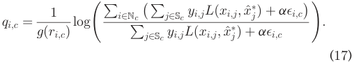

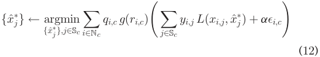

Proof. The problem is convex, since the objective term is linear and the constraint set is convex. Therefore, we can apply the method of Lagrangian multipliers to solve the problem. The Lagrangian of Equation 16 is given as: 

Theorem 1. Given the users’ reliability parameters, the optimization problem in Equation 12 can be optimally solved. For continuous data type, the optimal solution is given by 

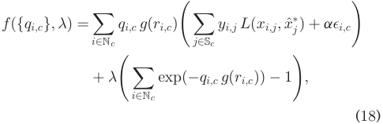

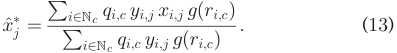

As for categorial data type, the solution is 

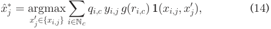

where � is a Lagrange multiplier. Taking the partial derivative of Equation 18 with respect to qi;c, we have 

where **1** ðx; yÞ ¼ 1 if x ¼ y, and 0 otherwise. 

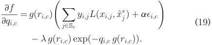

Proof. For each task j, we first consider the case of continuous data, where Lðxi;j; ^x� jÞ ¼ ðxi;j �x^� jÞ2.Then,theobjec- tive function can be formalized as follows 

Letting Equation 19 to zero, we get 

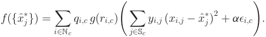

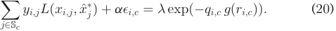

We take the partial derivative of the function with respect to x^� jand set it to zero, i.e., 

Summing both sides over i, we get 

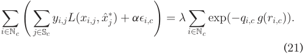

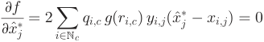

Solving the above equation, we get Equation (13). 

SinceP i2Ncexpð�qi;c gðri;cÞÞ ¼ 1, we have 

For some task j, if its data xi;j is of categorical type, the loss function is 

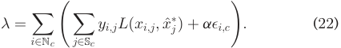

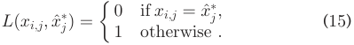

Taking Equation (22) into Equation 20, we obtain a closed form solution of reliability qi;c shown in Equation (17). tu The pseudo-code of the algorithm is presented in Algorithm 1. We first initialize the users’ reliability parameters, and then keep iterating the steps of truth update and reliability estimation until the change of the users’ reliability is below a certain threshold. Due to the convexity of our 

Taking the loss function into Equation (12), we can get the optimal solution to x^� jshown in Equation (14). tu 

### 4.1.3 Reliability Estimation 

After updating the estimation of the ground truth, we now fix the values of fx^� jg, and calculate the users’ data qualities 

Authorized licensed use limited to: Shanghai Jiaotong University. Downloaded on March 16,2022 at 17:04:03 UTC from IEEE Xplore.  Restrictions apply. 

IEEE TRANSACTIONS ON MOBILE COMPUTING, VOL. 20, NO. 10, OCTOBER 2021 

2968 

problem and the ability to achieve the optimal solution for each step (Theorems 1 and 2), our algorithm is guaranteed to converge to some local optimum, according to the proposition of the block coordinate descent [35]. The total time complexity of reliability profiling is OðmðjNcj þ jScjÞÞ, where m is the number of iterations. We can also set a large constant iteration number (e.g., m ¼ 10; 000), s.t., the algorithm is likely to converge. Further improvements can be made to find a 2-approximation of the global optimum within nearly linear time [36]. 

### Algorithm 1. User Reliability Estimation (Category c) 

input: Tasks Sc and Oc, users Nc, and data fxi;jg output: Reliability fqi;cg, and truth estimation fx^� jg // Parameter Initialization: 

1: if i 2 Nc then 

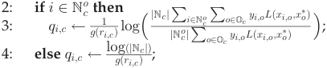

- 5: else qi;c N/A; 

- 6: while not converged do // Truth Update 

- 7: foreach task j 2 Sc do 

- 8: if the task j is of continuous data type then 

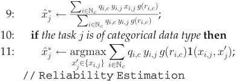

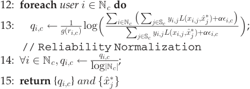

over c. In this part, we propose a matrix factorization method to address this problem. 

We use Q to denote the users’ reliability matrix, where each entry qi;c is the user i’s reliability for task category c. We map both users and task categories to a joint latent factor space of dimensionality k. Specifically, we assume that each user i is associated with a vector **w** i 2 Rk , and each category is associated with **u** c 2 Rk . The vector **w** i ¼ ½wi;1; wi;2; . . . ; wi;k�T can be interpreted as the user i’s capabilities in k different dimensions, and the vector **u** c ¼ ½uc;1; uc;2; . . . ; uc;k�T can be seen as the weight of each capability needed by the category c. Then, each user i’s reliability for each category c can be calculated as qi;c ¼ **w** iT**u**c. 

To estimate the missing entries in matrix Q, we tend to calculate each user i’s latent vector **w** i and each category’s latent vector **u** c. Let W and Q denote the sets of users’ and categories’ latent vectors, respectively. Then, the objective function can be formalized as follows. 

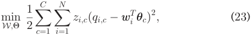

where zi;c indicates if user i has contributed data to category c (1 means yes, and 0 otherwise). To prevent over-fitting, we add regularization terms in Equation 23. 

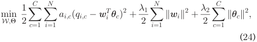

where k **w** ik2 ¼Pk t¼1w2 i;tand k**u**ck2¼ P tk ¼1u2 c;t. �1and �2are parameters controlling the weights of regularization terms. 

### Algorithm 2. Unknown Reliability Estimation 

input: Users reliability matrix Q output: Unknown reliability parameters fqi;cjzi;c ¼ 0g 

1: Initialize f **w** ig and f **u** cg to small random values; 

2: while not converged do 

### 4.1.4 Reliability Normalization 

Until now, we have obtained the estimations of the users’ reliability levels and unknown ground truths. However, there is a problem in our model, i.e., each user i’s reliability estimations for different categories are in different scales. From the regularization termP i2Ncexpð�qi;cgðri;cÞÞ ¼ 1,we can see that the average value for qi;cgðri;cÞ is logjNcj, which is proportional to the number of data contributors for category c. This means that a user is likely to receive a higher reliability score when she is among a large number of data contributors, which is not reasonable. In order to guarantee each user’s reliability estimations for different tasks are in the same scale, we normalize each user i’s reliability estimation qi;c into qi;c <u>logjNcj</u>~~.~~ 

### 4.2 Estimating Missing Entries: A Latent Factor Model 

From the above subsection, we have obtained each user’s reliability information over the task categories that she has contributed data to. However, we observe that if a user i did not contribute data to some category c (i.e., i =2 Nc), then Algorithm 1 is not able to estimate the user i’s reliability 

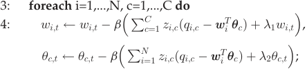

5: foreach qi;c ¼ N/A do 6: qi;c **w** iT�**u**c 

7: return fqi;cjzi;c ¼ 0g 

We propose to use a simple gradient descent method to solve the above problem. The pseudo-code is presented in Algorithm 2. We first initialize fwi;tg and fuc;tg to small random values. After that, we apply gradient descent algorithm, i.e., for every i and t, we update fwi;tg and fuc;tg using the following rules 

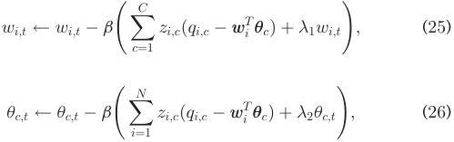

Authorized licensed use limited to: Shanghai Jiaotong University. Downloaded on March 16,2022 at 17:04:03 UTC from IEEE Xplore.  Restrictions apply. 

WU ET AL.: FINE-GRAINED USER PROFILING FOR PERSONALIZED TASK MATCHING IN MOBILE CROWDSENSING 

2969 

TABLE 2 Sensing Task Overview 

|Category|Monitored target|# of tasks|Data type|
|---|---|---|---|
|C1|noise|8|continuous|
|C2|air pollution|9|categorical|
|C3|traffic congestion|11|categorical|
|C4 |human flow|20|categorical|
|C5|temperature |20|continuous |
|C6 |weather|9|categorical|
|C7|price|12|continuous |
|C8 |question |17|categorical |
|C9|accident|17|categorical|

where b is the learning rate. Finally, we can predict a user i’s reliability for a task category c even if the user i did not provide any data to c, i.e., for i =2 Nc, qi;c **w**T i**u**c. 

## 5 EVALUATION 

In this section, we implement and evaluate the performance of our proposed methods. We first conduct a small-scale real-world crowdsensing experiment, and then simulate a crowdsensing scenario to further examine the performance of our methods. 

### 5.1 Experiment Setup 

We recruit 10 users (8 males and 2 females) to participate in our experiment. In the experiment, we manually create 123 sensing tasks for 9 different categories. An overview of the tasks is presented in Table 2. The tasks within the same category focus on the same sensing target (such as noise, traffic, or weather), but with different attributes, including time, locations, and payments. Each task category has a data type requirement. For instance, noise monitoring requires continuous data type, while weather monitoring requires categorical data type. The entire task corpus is shown to the users through the browsers on the users’ smartphones. Each user can browse through these tasks, and choose their interested tasks to work on. The ground truth of each task is monitored by the authors themselves, and unavailable to the users. We collect the users’ sensing data, as well as their operation records, including each user’s task browsing history, task selection history, and task completion history. 

According to our collected data, each user contributes data to about 60 perent of the tasks in average. The parameter a used in our semi-supervised learning model is set to 1. And for each task category, we use the ground truths of 10 perent of the tasks. The parameters k, �1 and �2 used in our matrix factorization method are set to 3, 5 and 5, respectively. 

### 5.2 Experiment Results on User Reliability Profiling 

In the experiment, we evaluate the performance of our proposed user profiling algorithm. To differentiate the notations, we use “URP-BA” to denote the basic version shown in Section 3.2, and “URP-E1” and “URP-E2” to denote the first enhancement and the second enhancement, respectively. We compare our algorithms with two benchmarks. One is a heuristic method that treats each user’s data equally, i.e., simple average (“Avg.”) for continuous data and majority voting (“Voting”) for categorical data. The 

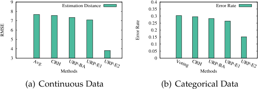

Fig. 1. Performance comparison on estimation accuracay. 

other benchmark is a general truth discovery framework, called “CRH” [29], which uses a single parameter to model each user’s reliability level. We adopt the following two metrics to measure the performance of the algorithms. 

- RMSE: For continuous data, we use Root Mean Square Error (RMSE) to measure the distance between the estimation result and the groundf **f** i f **f** i f **f** i f **f** i f **f** i ftruth. **f** i f **f** i f **f** i f **f** i f **f** i f **f** i f **f** i fMathemati- **f** i f **f** i f **f** i f **f** i f **f** i f **f** i f **f** i f **f** i **f** cally, the RMSE is defined as qPj2Sðx j��x^� jÞ2=jMj . 

- Error Rate: For categorical data, we use Error Rate to quantify the performance of an algorithm. The Error Rate of an algorithm is defined as the percentage of the tasks to which the algorithm’s estimations are different from the ground truth, i.e., 1 � <u>Pj2SM</u>**1**ðx <u>j</u>�;x^� <u>j</u>Þ ~~.~~ 

Fig. 1 presents the performance comparison between our algorithms and the benchmarks. We can see that for either data type, the truth discovery-based algorithms can achieve higher estimation accuracy than the simple average or majority voting, indicating the effectiveness of truth discovery algorithms. However, the performance of Avg./Voting, CRH, URP-BA, and URP-E1 tends to be similar. The main reason is that under the crowdsensing scenarios, these usually exist many tasks to which the majority of the users’ data are inaccurate, thus the traditional unsupervised learning models may have trouble identifying the users’ true reliability levels. In this case, as we can see that URP-E2 has superior performance to the other four algorithms, incorporating even a small number of ground truths can greatly improve the estimation accuracy. 

### 5.3 Experiment Results on Personalized Task Matching 

Besides profiling the users’ reliability, we also profile each user’s preference towards each task using the methods proposed in Section 2.2. In Figs. 2a and 2b, we present the reliability profiles and preference profiles of two representative users respectively, where the user’s preference towards a 

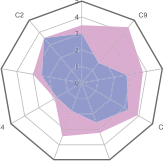

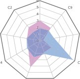

Fig. 2. User profiling. 

Authorized licensed use limited to: Shanghai Jiaotong University. Downloaded on March 16,2022 at 17:04:03 UTC from IEEE Xplore.  Restrictions apply. 

IEEE TRANSACTIONS ON MOBILE COMPUTING, VOL. 20, NO. 10, OCTOBER 2021 

2970 

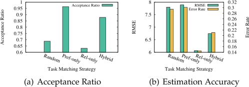

Fig. 3. Comparison on different task matching strategies. 

task category is calculated as the user’s average preference score of the tasks in the category. We normalize the users’ preferences to [0,5] for better graphical presentation. 

To evaluate the performance of our personalized task recommender system, we provide each user a list of 20 recommended tasks, and ask each user to choose their interested tasks. Recall that our personalized task recommender system recommends tasks to the users based on both the users’ reliability and preference. Specifically, for each user and task pair ði; jÞ, we calculate a recommendation score Scoreði; jÞ ¼ gpi;j þ ð1 � gÞqi;j. Suppose task j belongs to category c, then we set pi;j to pi;c. We use g ¼ 0:4 and h ¼ 0:5 in our experiment. The choices of the hyperparmeters are done by grid search. Researchers are encouraged to do finetuning with their own data. Our system recommends each user 20 tasks with the highest recommendation scores. Three benchmarks are adopted, including random recommendation, preference-only recommendation, and reliability-only recommendation. Random task recommendation strategy provides each user a list of 20 randomly chosen tasks, while the preference- or reliability-only recommendation strategies provide each user 20 tasks with highest preference or reliability scores, respectively. 

The performance of task matching strategies is measured on two different perspectives, i.e., task acceptance ratio and estimation accuracy. The task acceptance ratio is defined as the percentage of the recommended tasks that the users have selected, and the estimation accuracy is measured using RMSE or Error Rate depending on the data types of the tasks. The performance comparison of different task matching strategies is presented in Fig. 3. We can see that the preference-only strategy has the highest task acceptance ratio, while the reliability-only strategy outputs the most accurate estimation results. That is because these two strategies match tasks to the users with the tendency of facilitating the match of one certain perspective. Comparing with other task matching strategies, we can see that our proposed hybrid recommendation strategy can achieve a good balance between the acceptance ratio and the estimation accuracy. 

### 5.4 Evaluations on A Simulated Scenario 

In this subsection, we examine the performance of our user profiling algorithms through a comprehensive crowdsensing experiment. We first briefly introduce the simulator CrowdSensim [37] used in this experiment, and present our experiment settings. We then report our evaluation results in both medium-scale and large-scale settings. As the inaccurate data from unreliable users would have a significant effect on the ground truth estimation when the number of users is not so large, we evaluate the performance of our 

algorithms within a medium-scale setting. We also conduct the experiments in a large-scale setting to demonstrate the scalability of our algorithms and the superiority of our algorithms in broad crowdsensing scenarios. 

CrowdSensim is a discrete-event simulator for the performance evaluation of various crowdsensing algorithms in large urban areas. In CrowdSensim, the participants move along the streets of a selected city, following certain mobility distributions, and collect different kinds of sensory data by the available sensors in an opportunistic manner. The simulator can support various types of crowdsensing-related analysis [38], [39], [40], such as energy-efficient data collection, reward distribution, user profiling, ground truth discovery, task allocation, etc. The latest version of this simulator: CrowSensim 2.0 [41] can further support the chronological order of sensing events, high-precision and fine-grained models for urban environments and parallel execution of algorithms. 

We have implemented our three algorithms “URP-BA”, “URP-E1” and “URP-E2”, and compare them with two baselines “Average” and “CRH” in the CrowdSensim 2.0 simulator. We consider two types of simulation settings: a mediumscale setting, in which the number of users varies from 10 to 100 with an increment of 10; a large-scale setting, in which the number of users is fixed at either 5000 or 10000. We also conduct the experiments when the number of tasks varies from 1000 to 10000 with an increment of 1000. We divide the tasks into 20 categories, and randomly distribute the tasks on a certain region. Each task is associated with a coordinate vector < latitude;longitude;altitude > , and the required sensory data to collect. Each participant has a mobility model, including an initial location, the length of walking time and the average speed. The mobility model can be generated from practical human mobility traces, such as ParticipAct dataset [42] and pedestrian walking traces [43], or some predefined mobility patterns. In our experiment, the participants start walking from a randomly chosen location with an average speed uniformly distributed between [1,1.5] m/s, and the period of walking time follows an uniform distribution over ½10; 60� minutes. During the walking, participants collect and contribute data when a user-task contact happens. By definition, a user and a task are in contact when the distance between them is below a radius R ¼ 1m. The data collection process is as follows: for each participant i, if she contributes data to the task j of category c, then her data xi;j is generated based on a Gaussian distribution with the mean x^� jand vari- <u>2 2</u> ance qi;c~~,~~i.e., xi;j�N ðx^ j�; qi;cÞ. The ground truthx^ j�of each task j is randomly distributed within [30,100]. In URP-E2, we randomly choose 1 perent of tasks, and incorporate their ground truths in the user reliability profiling process. 

To model the reliability of users, we classify the users into three groups: reliable users, normal users, and unreliable users, where the users’ reliability distributions in these three groups are N ð0:75; 0:1Þ, N ð0:5; 0:1Þ, and N ð0:25; 0:1Þ, respectively. To evaluate the impact of user’s reliability on system performance, we consider three different settings. In the first setting, the users are classified into the three groups randomly. In the second setting, each user has 60 perent probability of being classified into reliable users, 30 perent normal users, and 10 perent unreliable users, while in the third setting, each user has 10 perent being reliable, 

Authorized licensed use limited to: Shanghai Jiaotong University. Downloaded on March 16,2022 at 17:04:03 UTC from IEEE Xplore.  Restrictions apply. 

WU ET AL.: FINE-GRAINED USER PROFILING FOR PERSONALIZED TASK MATCHING IN MOBILE CROWDSENSING 

2971 

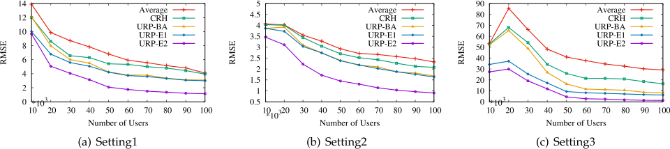

Fig. 4. Comparisons on estimation accuracy with varying number of users. 

30 perent being normal, and 60 perent being unreliable. We assume that for each user, if her reliability for certain task is below 0.2, then the user will have 50 perent probability of failing the task. 

We next present our evaluation results on a small-scale simulation. Fig. 4 presents the estimation accuracy of different algorithms with a varying number of the users, from 10 to 100 with the increment of 10. We fix the number of tasks as 1000. We can see that the simple average has the worst estimation accuracy, while URP-E2 achieves the lowest RMSE in all the three settings. In Fig. 4c, we observe that the RMSE first grows as the number of users increases, and then decrease when the number of users is getting larger. This is because that when the number of users is small, slightly increasing the number of users, especially unreliable users, may bring extra errors to the estimation results. As the number of users increases, the platform can access to more information, and thus can reduce the estimation errors. 

We also examine the effect of the number of incorporated ground truths on the estimation accuracy. The results are shown in Fig. 5. We can see that having more ground truth data can improve our estimation results. Besides, comparing the different settings, we can see that Setting 2 achieves the best estimation accuracy, since most users in Setting 2 are reliable. 

We now show the evaluation results in a large-scale setting, i.e., a large number of tasks or users. Fig. 6 shows the estimation accuracy of different algorithms with varying number of task, from 1000 to 10000 with the increment of 1000. It can be seen that our proposed user profiling algorithm achieves the lowest RMSE, indicating the effectiveness of our algorithm. Besides, we can observe that the RMSE decreases as the number of tasks increases. This is because that more tasks usually means having more data, s.t., the platform can identify the users’ reliability levels more accurately. A similar phenomenon was also observed in [28]. We also evaluate our algorithms and baselines when the number of users is 5000 and 10000, respectively, the number of tasks is fixed as 1000, and 

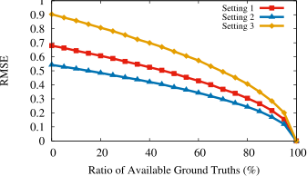

Fig. 5. The effect of available truth on estimation accuracy. 

users’ reliability follows the Setting1. The evaluation results from Fig. 7 are consistent with those in the medium-scale setting. The RMSE of all algorithms decreases when the number of users increases, and again the RMSE of ”URP-E2“ is the smallest among all algorithms. In the large-scale setting, more (reliable) data due to the increase of tasks or users can still significantly increase the accuracy of ground truth estimation. 

## 6 DISCUSSION 

In this section, we discuss several practical issues and potential extensions of our proposed personalized task recommendation methods. 

Objectives of Mobile Crowdsensing Application. There are diverse objectives of mobile crowdsensing in practice. In this paper, we focus on user reliability profiling and ground truth discovery to improve task-user matching efficiency in mobile crowdsensing. Considering the tasks in mobile crowdsensing usually span over a certain area and continue through multiple time slots, other objective could be the guarantee of Quality of Service (QoS), which is defined as the coverage requirements of data acquisition in both spatial and temporal dimensions. For such diverse objectives, we may have different definitions of task accomplishment and various sufficient amount of data for user reliability evaluation. For personalized task recommendation, we need to estimate the user preference and reliability within a certain accuracy. The accuracy of preference and reliability estimation highly depend on the appropriate user profiling and ground truth discovery, which is related to the number of users assigned to each task. We can use the history data of the tasks with available ground truth to estimate the required number of users for each task. To complete tasks in this context, the platform needs to recruit enough number of users for each task. For the objective of QoS guarantee, the platform needs to acquire data from different locations and time slots, achieving the coverage requirements of the tasks, under which we call a task is accomplished. With different definitions of task accomplishment, the amount of data needed to evaluate the reliability of users also varies. 

New User Problem. For a user that is new to our system, we may have very little information (browsing history and data contribution) on the user. In this case, it is difficult to get an accurate preference or reliability profile of the user. Fortunately, this new user problem has been widely studied in traditional recommender system literature, e.g., [44], [45], where their ideas can also be applied in our problem scenario. For example, we can recommend the most informative tasks to the new user, so as to gain knowledge of the 

Authorized licensed use limited to: Shanghai Jiaotong University. Downloaded on March 16,2022 at 17:04:03 UTC from IEEE Xplore.  Restrictions apply. 

IEEE TRANSACTIONS ON MOBILE COMPUTING, VOL. 20, NO. 10, OCTOBER 2021 

2972 

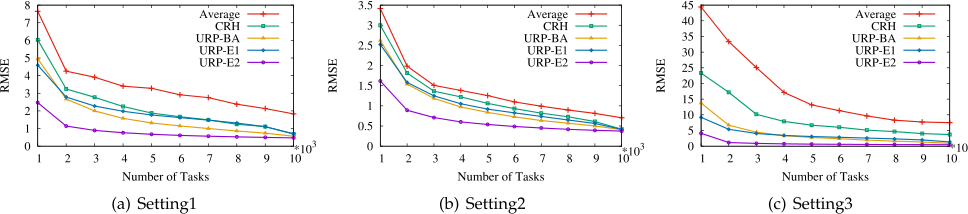

Fig. 6. Comparisons on estimation accuracy with varying number of tasks. 

user’s preference and reliability. Heuristics may include random recommendation, recommending most popular tasks, and recommending tasks among different categories. 

Content-Based Reliability Prediction. In this work, we propose a matrix factorization method to predict the missing entries in each user’s reliability estimation. This method is able to capture inherent subtle characteristics of the users’ reliability without the need of extracting features of the users and the tasks. However, one drawback of the approach is that we may not be able to interpret what factors influence the users’ reliability. In situations where interpretability matters, using content-based methods such as building a classification model to predict the users’ reliability can be a good alternative. 

General Reliability Profiling Problem. In our reliability profiling model, we assume that each task only belongs to one category and tasks in different categories are independent. Sometimes, these assumptions may not hold. In these cases, a general reliability profiling problem can be considered, i.e., given the users’ contributed data, we aim to estimate the unknown ground truths fx� jjj 2 Sg,eachuser’sreliabil- ity vector **q** i 2 RC , and each task’s weight vector **v** j 2 RC , where C is a hyperparameter determining the dimension of the vectors. 

Having estimated **q** i and **v** j, each user i’s reliability for each task j can be calculated as qi;j ¼ **q**T i�**v**j. We can see that the model we proposed in Section 3.1 is a simplified version of the general reliability profiling problem, where we specify C to be the number of task categories, and each entry qi;c of the task vector is 1 if task j belongs to category c, and zero otherwise. Note that in the general reliability profiling problem, we now have three sets of unknown variables that need to be estimated, which is more difficult. We tend to leave this problem to our future work. 

Context-based User Profiling. We observe that a user’s preference and reliability can be dependent on the contextual situation of the user. For example, a user’s preference may be dependent on time (e.g., time of a day, or season of the 

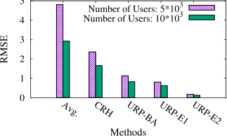

Fig. 7. Results on large scale simulation. 

year) [46]. Also, as pointed out in [47], a user’s reliability could also be influenced by her activity (e.g., sitting, walking, or running) and her surrounding environment (e.g., home, office, shopping mall). Thus, we think the problem of profiling the users’ preference and reliability in a contextaware situation could also be an interesting future work. 

Other Task Matching Models. Though this work focuses on the user-centric model, the estimated preference and reliability parameters of the users can be readily integrated into platform-centric model, allowing the platform to make centralized decisions based on them, such as selecting most reliable users to perform a sensing task [48], determining the payments of the users based on their reliability levels [33], [49], [50], or integrating the preference or reliability information into the design of incentive mechanisms [10]. 

Reputation System. Note that this work focuses on estimating the users’ reliability, which may only characterize the users’ performance within a short time period. A long-term quality characterization of each user is also needed sometimes for determining monetary incentives [10]. To that end, Wu et al.[51] proposed an endorsement-based reputation calculation and prediction method based on users’ short-term quality ratings. Yang et al.[33] proposed a Shapley value-based reputation system. Our work serves as an underlying building block that provides accurate user performance estimations for the upper-level reputation systems. 

## 7 RELATED WORK 

Crowdsensing Applications. The concept of mobile crowdsensing has attracted broad attention from both industry and academia, and has been applied in various application domains, including but not limited to environment monitoring [52], [53], [54], indoor localization [55], [56], indoor floorplan construction [57], [58], [59], traffic and navigation [60], [61], and image sensing [62]. Several crowdsensing testbeds and simulators have been proposed to assess the performance of mobile crowdsensing systems, such as [63], [64]. 

Platform-Centric Crowdsensing. Many researchers have studied the user selection problem in mobile crowdsensing. They usually modelled the problem from a game-theoretical perspective like [5]. For example, Zhao et al.[6] considered the problem of budget feasible mechanism design for crowdsensing, and proposed mechanisms for both offline and online scenarios. Karaliopoulos et al.[8] addressed the user recruitment problem for opportunistic network scenario, and proposed two efficient algorithms to maximize the overall location coverage. Zhang et al.[9] proposed a double auction mechanism for proximity-based mobile 

Authorized licensed use limited to: Shanghai Jiaotong University. Downloaded on March 16,2022 at 17:04:03 UTC from IEEE Xplore.  Restrictions apply. 

WU ET AL.: FINE-GRAINED USER PROFILING FOR PERSONALIZED TASK MATCHING IN MOBILE CROWDSENSING 

2973 

crowdsensing. In these works, the platform’s main concern was to determine the set of selected users and their corresponding payments so as to maximize a certain optimization metric. They only considered the heterogeneity of the users and assumed that the tasks are of no differences. Some researches have also studied the task assignment problem in mobile crowdsensing. For example, He et al. [65] studied the optimal task allocation problem for locationdependent crowdsensing. Zhao et al. [7] considered the task allocation problem in crowdsensing with the objective of optimizing the energy efficiency of smartphones. Cheung et al. [66] considered the distributed task selection problem for time-sensitive and location-dependent tasks. However, these works were all based on a platform-centric model. Besides, none of these work took the issue of data quality into consideration. 

User-Centric Crowdsensing. Few researches have studied the user-centric model in crowdsensing. Karaliopoulos et al. [11] adopted logistic regression techniques to estimate a user’s probability of accepting a task, and tend to match tasks to users based on the information. However, they did not consider the users’ data quality or reliability in performing the sensing tasks. Although Jin et al. [10] and Han et al. [50] considered the problem of quality-aware task matching, they were based on the platform-centric model, and were unable to recommend personalized tasks for the users. In contrast, our work considers a user-centric task matching model by taking both the users’ preference and data quality into consideration. A preliminary version of this work appears at INFOCOM 2018 [67], while this work has substantial revision over the previous one including additional technical materials and discussions. 

Truth Discovery. The problem of truth discovery has been widely studied to handle the situation where data collected from multiple sources tend to be conflicting and the ground truths are unknown [18]. Wang et al. [68] considered the problem of truth detection in social sensing based on EM algorithm. Wang et al. [69] proposed a truth discovery algorithm to handle streaming data. Ouyang et al.[31] proposed a truth discovery method to detect spatial events based on a graphical model. Su et al. [30] designed a generalized decision aggregation framework for distributed sensing scenarios. Wang et al. [70] studied the truth discovery problem in cyber-physical systems. Wang et al. [71] further exploited the problem of truth discovery for interdependent phenomena in social sensing. Meng et al. [32] exploited the spatial correlations to improve the estimation accuracy. CRH [29] is a general truth discovery framework that can handle both continuous and categorical data. Li et al. [28] considered truth discovery problem for long-tail data, and proposed a confidence-aware approach. Peng et al. [49] proposed an EM algorithm to quantity the users’ data qualities in mobile crowdsensing. However, all of these works are based on unsupervised learning models, and thus may suffer from the initialization problem when most data are inaccurate [19]. Pouryazdan et al. [72] introduced a new metric collaborative reputation scores to quantify crowd-sensed data trustworthiness. Luo et al. [73] addressed the truth estimation problem from a different perspective. They adopted a group of validating users to assess the data provided by contributing users, and then generated an accurate posterior estimation of the ground truth based on 

the validation result. Yin and Tan et al. [74] proposed a semisupervised learning model to identify true facts from false ones. However, their work tended to focus on the truth estimation part, but did not output the reliability levels of the data sources, thus cannot address the need of user reliability profiling. 

Recommender System. Recommender system has been a hot topic in recent decades. Generally, recommendation techniques can be classified into the following three categories: content-based recommendation, collaborative filtering-based recommendation, and hybrid recommendation [15]. Besides various recommendation techniques, many practical issues in recommender systems have also been widely studied, including exploiting implicit feedback [27], [75], addressing negative feedback [26], [76], context-aware recommendation [46], group recommendation [77], and so on. Nevertheless, these works only focused on the users’ preferences, without considering the users’ reliability. In contrast, in mobile crowdsensing, the users’ reliability plays an important role in the effectiveness of the system, and thus should be taken into account in recommending tasks. To that end, we extend the traditional recommender systems by taking the users’ reliability into the consideration and proposing to recommend tasks based on both the users’ preference and reliability. 

## 8 CONCLUSION 

In this paper, we have studied the problem of personalized task matching in mobile crowdsensing. We have proposed a personalized task recommender framework that can recommend tasks to users based on a fine-grained characterization on both the users’ preference and reliability. We have proposed methods to measure each user’s preferences and reliability of different tasks, respectively. In particular, the proposed user reliability profiling algorithm originates from truth discovery problem, but surpasses existing truth discovery algorithms in three ways, i.e., by proposing a fine-grained multi-dimensional reliability profiling model, by exploiting the information of failed tasks, and also by incorporating a small number of ground truths to improve the estimation accuracy. Further more, we proposed a matrix factorization method to address a critical limitation of the existing truth discovery algorithms in estimating the users’ reliability for the uninvolved tasks. Both a real-world experiment and a crowdsensing simulation have been conducted to evaluate our proposed methods. The evaluation results have demonstrated the good performance of our methods. As for our future work, we are interested in considering the user profiling problem in streaming data scenarios. 

## ACKNOWLEDGMENTS 

This work was supported in part by the National Key R&D Program of China No. 2019YFB2102200, in part by China NSF Grant No. 61972252, 61972254, 61672348, and 61672353, in part by Joint Scientific Research Foundation of the State Education Ministry No. 6141A02033702, in part by the Open Project Program of the State Key Laboratory of Mathematical Engineering and Advanced Computing No. 2018A09, and in part by Alibaba Group through Alibaba Innovation Research Program. The opinions, findings, conclusions, and recommendations 

Authorized licensed use limited to: Shanghai Jiaotong University. Downloaded on March 16,2022 at 17:04:03 UTC from IEEE Xplore.  Restrictions apply. 

IEEE TRANSACTIONS ON MOBILE COMPUTING, VOL. 20, NO. 10, OCTOBER 2021 

2974 

expressed in this paper are those of the authors and do not necessarily reflect the views of the funding agencies or the government. 

## REFERENCES 

- [1] R. K. Ganti, F. Ye, and H. Lei, “Mobile crowdsensing: current state and future challenges,” IEEE Commun. Magazine, vol. 49, no. 11, pp. 32–39, Nov. 2011. 

- [2] A. Capponi, C. Fiandrino, B. Kantarci, L. Foschini, D. Kliazovich, and P. Bouvry, “A survey on mobile crowdsensing systems: Challenges, solutions and opportunities,” IEEE Commun. Surveys Tuts., vol. 21, no. 3, pp. 2419–2465, Third Quarter 2019. 

- [3] Y. Liu, L. Kong, and G. Chen, “Data-oriented mobile crowdsensing: A comprehensive survey,” IEEE Commun. Surveys Tuts., vol. 21, no. 3, pp. 2849–2885, Third Quarter 2019. 

- [4] Y.-Y. Chen, P. Lv, D.-K. Guo, T.-Q. Zhou, and M. Xu, “A survey on task and participant matching in mobile crowd sensing,” J. Comput. Sci. Technol., vol. 33, no. 4, pp. 768–791, 2018. 

- [5] D. Yang, G. Xue, X. Fang, and J. Tang, “Crowdsourcing to smartphones: Incentive mechanism design for mobile phone sensing,” in Proc. 18th Annu. Int. Conf. Mobile Comput. Netw., 2012, pp. 173–184. 

- [6] D. Zhao, X.-Y. Li, and H. Ma, “How to crowdsource tasks truthfully without sacrificing utility: Online incentive mechanisms with budget constraint,” in Proc. IEEE Int. Conf. Comput. Commun., 2014, pp. 1213–1221. 

- [7] Q. Zhao, Y. Zhu, H. Zhu, J. Cao, G. Xue, and B. Li, “Fair energyefficient sensing task allocation in participatory sensing with smartphones,” in Proc. IEEE Int. Conf. Comput. Commun., 2014, pp. 1366–1374. 

- [8] M. Karaliopoulos, O. Telelis, and I. Koutsopoulos, “User recruitment for mobile crowdsensing over opportunistic networks,” in Proc. IEEE Int. Conf. Comput. Commun., 2015, pp. 2254–2262. 

- [9] H. Zhang, B. Liu, H. Susanto, G. Xue, and T. Sun, “Incentive mechanism for proximity-based mobile crowd service systems,” in Proc. IEEE Int. Conf. Comput. Commun., 2016, pp. 1–9. 

- [10] H. Jin, L. Su, D. Chen, K. Nahrstedt, and J. Xu, “Quality of information aware incentive mechanisms for mobile crowd sensing systems,” in Proc. 16th ACM Int. Symp. Mobile Ad Hoc Netw. Comput., 2015, pp. 167–176. 

- [11] M. Karaliopoulos, I. Koutsopoulos, and M. Titsias, “First learn then earn: Optimizing mobile crowdsensing campaigns through data-driven user profiling,” in Proc. 17th ACM Int. Symp. Mobile Ad Hoc Netw. Comput., 2016, pp. 271–280. 

- [12] Waze. Accessed: Jun. 2020. [Online]. Available: https://www.waze. com/ 

- [13] Field agent. Accessed: Jun. 2020. [Online]. Available: http://www. fieldagent.net/ 

- [14] Gigwalk. Accessed: Jun. 2020. [Online]. Available: http://www. gigwalk.com/ 

- [15] G. Adomavicius and A. Tuzhilin, “Toward the next generation of recommender systems: A survey of the state-of-the-art and possible extensions,” IEEE Trans. Knowl. Data Eng., vol. 17, no. 6, pp. 734–749, Jun. 2005. 

- [16] K. L. Huang, S. S. Kanhere, and W. Hu, “Are you contributing trustworthy data?: The case for a reputation system in participatory sensing,” in Proc. 13th ACM Int. Conf. Model. Anal. Simul. Wireless Mobile Syst., 2010, pp. 14–22. 

- [17] J. Wang, J. Tang, D. Yang, E. Wang, and G. Xue, “Quality-aware and fine-grained incentive mechanisms for mobile crowdsensing,” in Proc. IEEE 36th Int. Conf. Distrib. Comput. Syst, 2016, pp. 354–363. 

- [18] X. Yin, J. Han, and S. Y. Philip, “Truth discovery with multiple conflicting information providers on the web,” IEEE Trans. Knowl. Data Eng., vol. 20, no. 6, pp. 796–808, Jun. 2008. 

- [19] Y. Li et al., “A survey on truth discovery,” ACM Sigkdd Explorations Newslett., vol. 17, no. 2, pp. 1–16, 2016. 

- [20] K. LeFevre, D. J. DeWitt, and R. Ramakrishnan, “Mondrian multidimensional k-anonymity,” in Proc. 22nd Int. Conf. Data Eng., 2006, pp. 25–25. 

- [21] C. Dwork, Differential Privacy. Boston, MA, USA: Springer, 2011, pp. 338–340. 

- [22] J. Kone�cny`, H. B. McMahan, F. X. Yu, P. Richt�arik, A. T. Suresh, and D. Bacon, “Federated learning: Strategies for improving communication efficiency,” 2016, arXiv:1610.05492. 

- [23] Y. Koren, R. Bell, and C. Volinsky, “Matrix factorization techniques for recommender systems,” Computer, vol. 42, no. 8, pp. 30–37, 2009. 

- [24] M.-C. Yuen, I. King, and K.-S. Leung, “Taskrec: A task recommendation framework in crowdsourcing systems,” Neural Process. Lett., vol. 41, no. 2, pp. 223–238, 2015. 

- [25] J. Bao, Y. Zheng, and M. F. Mokbel, “Location-based and preference-aware recommendation using sparse geo-social networking data,” in Proc. 20th Int. Conf. Advances Geographic Inf. Syst., 2012, pp. 199–208. 

- [26] S. Carroll and M. Swain, “Explicit and implicit negative feedback,” Studies 2nd Lang. Acquisition, vol. 15, no. 3, pp. 357–386, 1993. 

- [27] S. Rendle, C. Freudenthaler, Z. Gantner, and L. Schmidt-Thieme, “BPR: Bayesian personalized ranking from implicit feedback,” in Proc. 25th Conf. Uncertainty Artif. Intell., 2009, pp. 452–461. 

- [28] Q. Li et al., “A confidence-aware approach for truth discovery on long-tail data,” Proc. VLDB Endowment, vol. 8, no. 4, pp. 425–436, 2014. 

- [29] Q. Li, Y. Li, J. Gao, B. Zhao, W. Fan, and J. Han, “Resolving conflicts in heterogeneous data by truth discovery and source reliability estimation,” in Proc. ACM SIGMOD Int. Conf. Manage. Data, 2014, pp. 1187–1198. 

- [30] L. Su et al., “Generalized decision aggregation in distributed sensing systems,” in Proc. IEEE Real-Time Syst. Symp., 2014, pp. 1–10. 

- [31] R. W. Ouyang, M. Srivastava, A. Toniolo, and T. J. Norman, “Truth discovery in crowdsourced detection of spatial events,” in Proc. 23rd ACM Int. Conf. Conf. Inf. Knowl. Manag., 2014, pp. 1047–1060. 

- [32] C. Meng et al., “Truth discovery on crowd sensing of correlated entities,” in Proc. 13th ACM Conf. Embedded Netw. Sensor Syst., 2015, pp. 169–182. 

- [33] S. Yang, F. Wu, S. Tang, X. Gao, B. Yang, and G. Chen, “On designing data quality-aware truth estimation and surplus sharing method for mobile crowdsensing,” IEEE J. Sel. Areas Commun., vol. 35, no. 4, pp. 832–847, Apr. 2017. 

- [34] G. Forman, “An extensive empirical study of feature selection metrics for text classification,” J. Mach. Learn. Res., vol. 3, no. Mar, pp. 1289–1305, 2003. 

- [35] D. P. Bertsekas, Nonlinear Programming. Belmont, MA, USA: Athena scientific Belmont, 1999. 

- [36] H. Ding, J. Gao, and J. Xu, “Finding global optimum for truth discovery: Entropy based geometric variance,” in Proc. Symp. Comput. Geometry, 2016, pp. 34:1–34:16. 

- [37] C. Fiandrino et al., “Crowdsensim: A simulation platform for mobile crowdsensing in realistic urban environments,” IEEE Access, vol. 5, pp. 3490–3503, 2017. 

- [38] M. Tomasoni, A. Capponi, C. Fiandrino, D. Kliazovich, F. Granelli, and P. Bouvry, “Why energy matters? profiling energy consumption of mobile crowdsensing dataA collection frameworks,”^ Pervasive Mobile Comput., vol. 51, pp. 193–208, 2018. 

- [39] A. Capponi, C. Fiandrino, D. Kliazovich, P. Bouvry, and S. Giordano, “A cost-effective distributed framework for data collection in cloudbased mobile crowd sensing architectures,” IEEE Trans. Sustain. Comput., vol. 2, no. 1, pp. 3–16, First Quarter 2017. 

- [40] M. A. Rodriguez-Hernandez, A. Gomez-Sacristan, and D. Gomez-Cuadrado, “Simulcity: Planning communications in smart cities,” IEEE Access, vol. 7, pp. 46 870–46 884, 2019. 

- [41] F. Montori, E. Cortesi, L. Bedogni, A. Capponi, C. Fiandrino, and L. Bononi, “Crowdsensim 2.0: A stateful simulation platform for mobile crowdsensing in smart cities,” in Proc. 22nd Int. ACM Conf. Model. Anal. Simul. Wireless Mobile Syst., 2019, Art. no. 289296. 

- [42] S. Chessa, M. Girolami, L. Foschini, R. Ianniello, A. Corradi, and P. Bellavista, “Mobile crowd sensing management with the participact living lab,” Pervasive Mobile Comput., vol. 38, pp. 200–214, 2017. 

- [43] S. T. Kouyoumdjieva, L. R. Helgason, and G. Karlsson, “CRAWDAD dataset kth/walkers (v. 2014–05-05),” May 2014. [Online]. Available: https://crawdad.org/kth/walkers/20140505 

- [44] A. M. Rashid et al., “Getting to know you: Learning new user preferences in recommender systems,” in Proc. 7th Int. Conf. Intell. User Interfaces, 2002, pp. 127–134. 

- [45] K. Yu, A. Schwaighofer, V. Tresp, X. Xu, and H.-P. Kriegel, “Probabilistic memory-based collaborative filtering,” IEEE Trans. Knowl. Data Eng., vol. 16, no. 1, pp. 56–69, Jan. 2004. 

- [46] G. Adomavicius and A. Tuzhilin, “Context-aware recommender systems,” in Recommender Systems Handbook. Berlin, Germany: Springer, 2011, pp. 217–253. 

- [47] S. Liu, Z. Zheng, F. Wu, S. Tang, and G. Chen, “Context-aware data quality estimation in mobile crowdsensing,” in Proc. IEEE Int. Conf. Comput. Commun., 2017, pp. 1–9. 

- [48] Z. He, J. Cao, and X. Liu, “High quality participant recruitment in vehicle-based crowdsourcing using predictable mobility,” in Proc. IEEE Int. Conf. Comput. Commun., 2015, pp. 2542–2550. 

Authorized licensed use limited to: Shanghai Jiaotong University. Downloaded on March 16,2022 at 17:04:03 UTC from IEEE Xplore.  Restrictions apply. 

WU ET AL.: FINE-GRAINED USER PROFILING FOR PERSONALIZED TASK MATCHING IN MOBILE CROWDSENSING 

2975 

- [49] D. Peng, F. Wu, and G. Chen, “Pay as how well you do: A quality based incentive mechanism for crowdsensing,” in Proc. 16th ACM Int. Symp. Mobile Ad Hoc Netw. Comput., 2015, pp. 177–186. 

- [50] K. Han, H. Huang, and J. Luo, “Posted pricing for robust crowdsensing,” in Proc. 17th ACM Int. Symp. Mobile Ad Hoc Netw. Comput., 2016, pp. 261–270. 

- [51] C. Wu, T. Luo, F. Wu, and G. Chen, “Endortrust: An endorsementbased reputation system for trustworthy and heterogeneous crowdsourcing,” in Proc. IEEE Global Commun. Conf., 2015, pp. 1–6. 

- [52] M. Mun et al., “Peir, the personal environmental impact report, as a platform for participatory sensing systems research,” in Proc. 7th Int. Conf. Mobile Syst. Appl. Services, 2009, pp. 55–68. 

- [53] H. Lu, W. Pan, N. D. Lane, T. Choudhury, and A. T. Campbell, “Soundsense: Scalable sound sensing for people-centric applications on mobile phones,” in Proc. 7th Int. Conf. Mobile Syst. Appl. Services, 2009, pp. 165–178. 

- [54] Y. Gao et al., “Mosaic: A low-cost mobile sensing system for urban air quality monitoring,” in Proc. IEEE Int. Conf. Comput. Commun., 2016, pp. 1–9. 

- [55] M. Azizyan, I. Constandache, and R. Roy Choudhury , “Surroundsense: Mobile phone localization via ambience fingerprinting,” in Proc. 15th Annu. Int. Conf. Mobile Comput. Netw, 2009, pp. 261–272. 

- [56] A. Rai, K. K. Chintalapudi, V. N. Padmanabhan, and R. Sen, “Zee: Zero-effort crowdsourcing for indoor localization,” in Proc. 18th Annu. Int. Conf. Mobile Comput. Netw., 2012, pp. 293–304. 

- [57] M. Alzantot and M. Youssef, “Crowdinside: Automatic construction of indoor floorplans,” in Proc. 20th Int. Conf. Advances Geographic Inf. Syst., 2012, pp. 99–108. 

- [58] R. Gao et al., “Jigsaw: Indoor floor plan reconstruction via mobile crowdsensing,” in Proc. 20th Annu. Int. Conf. Mobile Comput. Netw, 2014, pp. 249–260. 

- [59] Q. Xu and R. Zheng, “When data acquisition meets data analytics: A distributed active learning framework for optimal budgeted mobile crowdsensing,” in Proc. IEEE Conf. Comput. Commun., 2017, pp. 1–9. 

- [60] P. Zhou, Y. Zheng, and M. Li, “How long to wait?: predicting bus arrival time with mobile phone based participatory sensing,” in Proc. 10th Int. Conf. Mobile Syst. Appl. Services, 2012, pp. 379–392. 

- [61] Y. Shu, K. G. Shin, T. He, and J. Chen, “Last-mile navigation using smartphones,” in Proc. 21st Annu. Int. Conf. Mobile Comput. Netw., 2015, pp. 512–524. 

- [62] Y. Wang, W. Hu, Y. Wu, and G. Cao, “Smartphoto: A resource-aware crowdsourcing approach for image sensing with smartphones,” in Proc. 15th ACM Int. Symp. Mobile Ad Hoc Netw. Comput., 2014, pp. 113–122. 

- [63] G. Cardone, A. Cirri, A. Corradi, and L. Foschini, “The participact mobile crowd sensing living lab: The testbed for smart cities,” IEEE Commun. Magazine, vol. 52, no. 10, pp. 78–85, Oct. 2014. 

- [64] C. Fiandrino et al., “Crowdsensim: A simulation platform for mobile crowdsensing in realistic urban environments,” IEEE Access, vol. 5, pp. 3490–3503, 2017. 

- [65] S. He, D.-H. Shin, J. Zhang, and J. Chen, “Toward optimal allocation of location dependent tasks in crowdsensing,” in Proc. IEEE Int. Conf. Comput. Commun., 2014, pp. 745–753. 

- [66] M. H. Cheung, R. Southwell, F. Hou, and J. Huang, “Distributed time-sensitive task selection in mobile crowdsensing,” in Proc. 16th ACM Int. Symp. Mobile Ad Hoc Netw. Comput., 2015, pp. 157–166. 

- [67] S. Yang, K. Han, Z. Zheng, S. Tang, and F. Wu, “Towards personalized task matching in mobile crowdsensing via fine-grained user profiling,” in Proc. IEEE Int. Conf. Comput. Commun., 2018, pp. 2411–2419. 

- [68] D. Wang, L. Kaplan, H. Le, and T. Abdelzaher, “On truth discovery in social sensing: A maximum likelihood estimation approach,” in Proc. 11th Int. Conf. Inf. Process. Sensor Netw., 2012, pp. 233–244. 

- [69] D. Wang, T. Abdelzaher, L. Kaplan, and C. C. Aggarwal, “Recursive fact-finding: A streaming approach to truth estimation in crowdsourcing applications,” in Proc. IEEE 33rd Int. Conf. Distrib. Comput. Syst., 2013, pp. 530–539. 

- [70] S. Wang, D. Wang, L. Su, L. Kaplan, and T. F. Abdelzaher, “Towards cyber-physical systems in social spaces: The data reliability challenge,” in Proc. IEEE Real-Time Syst. Symp., 2014, pp. 74–85. 

- [71] S. Wang et al., “Scalable social sensing of interdependent phenomena,” in Proc. 14th Int. Conf. Inf. Process. Sensor Netw., 2015, pp. 202–213. 

- [72] M. Pouryazdan, B. Kantarci, T. Soyata, L. Foschini, and H. Song, “Quantifying user reputation scores, data trustworthiness, and user incentives in mobile crowd-sensing,” IEEE Access, vol. 5, pp. 1382–1397, 2017. 

- [73] T. Luo, J. Huang, S. S. Kanhere, J. Zhang, and S. K. Das, “Improving IoT data quality in mobile crowd sensing: A cross validation approach,” IEEE Internet Things J., vol. 6, no. 3, pp. 5651–5664, Jun. 2019. 

- [74] X. Yin and W. Tan, “Semi-supervised truth discovery,” in Proc. 20th Int. Conf. World Wide Web, 2011, pp. 217–226. 

- [75] D. W. Oard et al., “Implicit feedback for recommender systems,” in Proc. 5th DELOS Workshop Filtering Collaborative Filtering, 1998, pp. 31–36. 

- [76] D. H. Lee and P. Brusilovsky, “Reinforcing recommendation using implicit negative feedback,” in Proc. Int. Conf. User Model. Adaptation Personalization, 2009, pp. 422–427. 

- [77] J. Masthoff, “Group recommender systems: Combining individual models,” in Recommender Systems Handbook. Berlin, Germany: Springer, 2011, pp. 677–702. 

Fan Wu (Member, IEEE) received the BS degree in computer science from Nanjing University, in 2004, and the PhD degree in computer science and engineering from the State University of New York at Buffalo, in 2009. He is currently a professor with the Department of Computer Science and Engineering, Shanghai Jiao Tong University. He has visited the University of Illinois at Urbana-Champaign (UIUC) as a post doc research associate. His research interests include wireless networking and mobile computing, data management, algorithmic network economics, and privacy preservation. He has published more than 150 peer-reviewed papers in technical journals and conference proceedings. He is a recipient of the first class prize for Natural Science Award of China Ministry of Education, NSFC Excellent Young Scholars Program, ACM China Rising Star Award, CCF-Tencent “Rhinoceros bird” Outstanding Award, and CCF-Intel Young Faculty Researcher Program Award. He has served as an associate editor of the IEEE Transactions on Mobile Computing and the ACM Transactions on Sensor Networks, an area editor of Elsevier Computer Networks, and as the member of technical program committees of more than 90 academic conferences. For more information, please visit http://www.cs.sjtu.edu.cn/�fwu/. 

Shuo Yang (Student Member, IEEE) received the BS degree in computer science from Shanghai Jiao Tong University, in 2014, and the PhD degree in computer science and technology from Shanghai Jiao Tong University, in 2019. He is currently a senior researcher at Tencent Inc. His research interests include online advertising, machine learning, wireless networking, mobile computing, and algorithmic game theory. He has published 15 peer-reviewed papers in well-archived international journals such as the IEEE Journal on Selected Areas in Communications and the IEEE Transactions on Mobile Computing, and also in well-known conference proceedings such as AAAI, INFOCOM, IWQoS, SECON, etc. He is a recipient of 2017 Google PhD Fellowship. 

Zhenzhe Zheng (Member, IEEE) received the BE degree in software engineering from Xidian University, in 2012, and the MS and the PhD degrees in computer science and engineering from Shanghai Jiao Tong University, in 2015 and 2018, respectively. He is currently an assistant professor with the Department of Computer Science and Engineering, Shanghai Jiao Tong University. He has visited the University of Illinois at UrbanaChampaign (UIUC) as a post doc research associate from 2018 to 2019. His research interests include wireless networking and mobile computing, game theory and algorithm design. He is a member of the ACM and CCF. 

Authorized licensed use limited to: Shanghai Jiaotong University. Downloaded on March 16,2022 at 17:04:03 UTC from IEEE Xplore.  Restrictions apply. 

IEEE TRANSACTIONS ON MOBILE COMPUTING, VOL. 20, NO. 10, OCTOBER 2021 

2976 

Shaojie Tang (Member, IEEE) received the PhD degree in computer science from the Illinois Institute of Technology, in 2012. He is currently an assistant professor of Naveen Jindal School of Management, University of Texas at Dallas. His research interest includes social networks, mobile commerce, game theory, e-business and optimization. He received the best paper awards in ACM MobiHoc 2014 and IEEE MASS 2013. He also received the ACM SIGMobile service award in 2014. He served in various positions (as chairs and TPC members) at numerous conferences, including ACM MobiHoc and IEEE ICNP. He is an editor for Elsevier Information Processing in the Agriculture and International Journal of Distributed Sensor Networks. 

Guihai Chen (Senior Member, IEEE) received the BS degree from Nanjing University, in 1984, the ME degree from Southeast University, in 1987, and the PhD degree from the University of Hong Kong, in 1997. He is currently a distinguished professor of Shanghai Jiao Tong University, China. He had been invited as a visiting professor by many universities including Kyushu Institute of Technology, Japan in 1998, University of Queensland, Australia in 2000, and Wayne State University, Detroit, MI, during September 2001 to August 2003. He has a wide range of research interests with focus on sensor networks, peer-to-peer computing, high-performance computer architecture and combinatorics. He has published more than 250 peer-reviewed papers, and more than 170 of them are in wellarchived international journals such as the IEEE Transactions on Parallel and Distributed Systems, the Journal of Parallel and Distributed Computing, the Wireless Networks, The Computer Journal, the International Journal of Foundations of Computer Science, and Performance Evaluation, and also in well-known conference proceedings such as HPCA, MOBIHOC, INFOCOM, ICNP, ICPP, IPDPS, and ICDCS. 

> " For more information on this or any other computing topic, please visit our Digital Library at www.computer.org/csdl. 

Authorized licensed use limited to: Shanghai Jiaotong University. Downloaded on March 16,2022 at 17:04:03 UTC from IEEE Xplore.  Restrictions apply. 

