IEEE TRANSACTIONS ON MOBILE COMPUTING, VOL. 21, NO. 6, JUNE 2022 

2088 

# On Designing Strategy-Proof Budget Feasible Online Mechanisms for Mobile Crowdsensing With Time-Discounting Values 

Zhenzhe Zheng , Member, IEEE, Shuo Yang , Jiapeng Xie, Fan Wu , Member, IEEE, Xiaofeng Gao , Member, IEEE, and Guihai Chen, Senior Member, IEEE 

Abstract—Mobile crowdsensing has become increasingly popular due to its ability to collect a massive amount of data with the help of many individual smartphone users. A crowdsensing platform can utilize the collected data to extract effective information and provide diverse services. Designing an incentive mechanism to compensate the participants for their resources consumption is critical in attracting more participation. Offline incentive mechanism design has been widely studied in various crowdsensing applications, whereas the online scenario, is much more challenging due to the unavailability of future information when the platform makes user selection decisions. In this paper, we investigate the problem of online crowdsensing by considering a critical property that the values of users’ contributions decrease as time goes by. The time-discounting property is common in inter-temporal choice scenarios but has not been carefully addressed from the perspective of mechanism design. To handle this problem, we propose a new method to select users based on a time-dependent threshold, and present a strategy-proof framework where participants prefer to submit their true types, instead of manipulating the market by misreporting their private information. We consider two cases, one is that the total value is the summation of each participant’s contributing value, the other is more general that the total value function is submodular. We call these two mechanisms TDM and TDMS, respectively. We prove that our two mechanisms can achieve computational efficiency, budget feasibility, strategy-proofness, and a constant competitive ratio, in the context of time-discounting values. By comparing our mechanisms with the state-of-the-art methods, we show that our design achieves better performance in terms of the total value. 

Index Terms—Mobile crowdsensing, incentive mechanism, budget feasible mechanism, time-discounting 

Ç 

## 1 INTRODUCTION 

Mthat utilizes mobile devices to collect, analyze, and shareOBILE crowdsensing is a new kind of sensing paradigm local information [1], [2], [3]. It consists of a service provider, service requesters, and mobile users. The service provider (usually the crowdsensing platform), resided in the cloud, recruits participants from mobile users to upload their sensing data, and then provides services to requesters based on the collected information. A wide variety of mobile crowdsensing applications has emerged in recent years, such as NoiseTube [4] and Ear-phone [5] for noise monitoring, SignalGuru [6] and CrowdAtlas [7] for traffic monitoring, and CrowdPark [8], Parknet [9] for finding on-street parking spots. 

However, the success of crowdsensing applications highly depends on the massive data contributed by mobile users to ensure the service quality [10], [11], [12]. Since participating in data acquisition campaigns would require mobile users to consume resources on smartphones, mobile users are usually 

> � Zhenzhe Zheng, Jiapeng Xie, Fan Wu, Xiaofeng Gao, and Guihai Chen are with the Shanghai Key Laboratory of Scalable Computing and Systems, Department of Computer Science and Engineering, Shanghai Jiao Tong University, Shanghai 200240, China. E-mail: {zhengzhenzhe, xjpsjtu} @sjtu.edu.cn, {fwu, gao-xf, gchen}@cs.sjtu.edu.cn. 

> � Shuo Yang is with Tencent Inc., Shanghai 200240, China. E-mail: wnmmxy@sjtu.edu.cn. 

Manuscript received 11 June 2019; revised 10 Oct. 2020; accepted 12 Oct. 2020. Date of publication 28 Oct. 2020; date of current version 5 May 2022. (Corresponding author: Fan Wu.) Digital Object Identifier no. 10.1109/TMC.2020.3034499 

reluctant to share their sensing capabilities (e.g., [13], [14], [15]). Thus, it is necessary to design an incentive mechanism to compensate the participants. According to different scenarios from practical crowdsensing applications, two settings are discussed in the literature, i.e., offline setting and online setting. In offline setting [16], [17], mobile users are present simultaneously, while the online scenarios are more common in practice: mobile users arrive and leave in an online manner. Designing an incentive mechanism in online scenarios is much more challenging, due to the lack of future information. That is the incentive mechanism may lead to a sub-optimal solution when considering participants myopically. Besides, it also brings challenges in the guarantee of strategy-proofness, since not just manipulating on the sensing cost, mobile users may further misreport their arrival or departure times in order to gain higher benefits.1 For example, after loginning in the crowdsensing system, mobile users may not immediately participate in the crowdsensing campaign, but could wait for a higher price. Here, intuitively, strategy-proofness means that no one can improve her utility by cheating on her private information including arrival time, departure time and sensing cost. 

1. Throughout this paper, arrival time is the starting time slot that mobile users could be allocated tasks. Similarly, departure time is the time slot after which the participants would not be able to receive the tasks. Both arrival time and departure time are private information of the participants. The arrival time/departure time is different from the login/logout time, which can be recorded by the digital technologies, and is regarded as the public information. 

1536-1233 � 2020 IEEE. Personal use is permitted, but republication/redistribution requires IEEE permission. See ht_tps://www.ieee.org/publications/rights/index.html for more information. 

Authorized licensed use limited to: ON Semiconductor Inc. Downloaded on December 20,2022 at 02:26:54 UTC from IEEE Xplore.  Restrictions apply. 

ZHENG ET AL.: ON DESIGNING STRATEGY-PROOF BUDGET FEASIBLE ONLINE MECHANISMS FOR MOBILE CROWDSENSING WITH... 

2089 

Most existing works on online mechanism design only consider flat values, i.e., the value over each participant’s contributed data is fixed during her presence. However, in many time sensitive crowdsensing applications (e.g., real-time traffic or noise monitoring [18], [19], [20], [21]), the service provider usually has time-discounting values, i.e., the value of each mobile user’s contribution decreases as time goes by. The property of time-discounting value introduces new challenges for mechanism design in mobile crowdsensing. From the perspective of performance guarantee, without having the knowledge of value information, it has been proved that no online algorithm can achieve a competitive ratio better than Vðlog n=log log nÞ for discounted secretary problem [22], which is related to online mechanism design. The time-discounting property also brings challenges in the guarantee of strategy-proofness. In traditional incentive mechanisms designed for mobile crowdsensing, the payment to a selected participant is based on her contribution. However, in the context of time-discounting values, the contribution would be time-dependent and would be affected by many factors, such as arrival time, departure time and sensing cost. The mobile users can manipulate on this private information to change the time slot being selected, and obtain higher payments. This new feature makes the traditional techniques to guarantee strategy-proofness unsuitable. In the time-discounting value setting, we cannot reduce the multi-dimensional online mechanism design to the single dimensional online mechanism design, similar to that in [23], and thus the traditional bidindependent approach, derived from Myerson Theorem [24], cannot be applied. Taking the budget constraint into account brings another challenge in designing a strategy-proof online mechanism. The existing approaches to guarantee the strategy-proofness in budget feasible online mechanism is to partition the time period into multiple stages, distribute the total budget in each stage proportionally to the number of users, and use the information learned from the previous stages to guide the task allocation in the current stage [25], [26]. When the value discounts over time, it can be shown that participants can cheat on their private types to obtain extra benefits under this framework. 

In this paper, we focus on the online scenario where a service provider intends to dynamically select mobile users to perform sensing tasks, and provide them with some compensations under a budget constraint. The objective is to maximize the total values of the selected mobile users, taking the time-discounting values into account, while at the same time achieving the properties of budget feasibility and strategy-proofness. To address the above mentioned challenges, we propose a budget feasible online incentive mechanism with time-discounting values. To explain our design intuitively, we first consider the linear value function model, where the total value over a set of selected participants is the summation of each individual user’s value. We introduce the concept of efficiency as the ratio of a mobile user’s value over the sensing cost. To overcome the lack of information in online setting, we adopt the framework of multi-stage sequential user selection, where we can use an estimated efficiency threshold from the previous stages to guide the user selection and payment calculation in the subsequent stages. The intuition of the threshold estimation is to multiply an increasing stage-dependent factor to the average efficiency of the sampling users selected following some greedy rule. The stage-dependent factor is used to prevent the users from misreporting their private information in the time-discounting value setting. Within each considered 

stage, we select the users with efficiencies higher than the threshold under the budget constraint, and then calculate their payments based on their current values and the threshold. We show that our mechanism can achieve computational efficiency and budget feasibility. We can also establish the property of strategy-proofness in terms of arrival/departure time and cost, and a constant competitive ratio compared with the optimal solution in the offline setting with full information. We next extend our result to the general case, where the total value is a submodular function of the selected users. We show that the proposed mechanism still achieves the desired properties. The numerical results show that our proposed mechanisms have superior performance to the benchmark mechanisms. 

The main contributions of this paper is listed as follows: 

- We consider the problem of online incentive mechanism design in mobile crowdsensing, where participants arrive and departure over time. We propose a time-discounting value model to measure the value of the collected data in time-sensitive applications. We also introduce a budget constraint to restrict the total payment the platform can expense to collect data. 

- To address the new challenges in designing budget feasible online mechanism introduced by the timediscounting value, we propose a new algorithm to determine a time-dependent threshold to facilitate the user selection and payment calculation. 

- We investigate two types of value functions: linear additive function and submodular function. For these value functions, we design budget feasible online mechanisms, and prove the properties of strategy-proofness in terms of arrival time, departure time and sensing cost, and constant competitive ratio with respective to the offline optimal solution. 

The rest of the paper is organized as follows. We briefly review related work in Section 2. In Section 3, We introduce the model of the budget feasible online mechanism problem with time-discounting values, and recall some important solution concepts. In Section 4, we present our design of a strategy-proof online mechanism where the value function is the summation of each participant’s value. In Section 5, we consider the case with the submodular value function. In Section 6, we implement and evaluate our mechanisms. Finally, we conclude this paper in Section 7. 

## 2 RELATED WORKS 

The problem of designing incentive mechanism for mobile crowdsensing has been extensively studied in recent years. Yang et al. [16] considered the offline problem setting based on stackelberg game, and proposed incentive mechanisms from two different perspectives respectively: a user-centric model and a platform-centric model. Koutsopoulos [17] designed an incentive mechanism based on a reverse auction. In his design, when the cost of a participant is received, the mechanism calculates the participant’s effort level and payment vector to achieve the strategy-proofness, and minimizes the total payment with guaranteed service quality. Later, Zhao et al. [27] designed two online mechanisms, namely OMZ and OMG, that satisfied truthfulness and achieved constant competitiveness. Kumrai et al. [28] proposed a new mechanism for participatory sensing based on the evolutionary algorithm that can maximize both the 

Authorized licensed use limited to: ON Semiconductor Inc. Downloaded on December 20,2022 at 02:26:54 UTC from IEEE Xplore.  Restrictions apply. 

IEEE TRANSACTIONS ON MOBILE COMPUTING, VOL. 21, NO. 6, JUNE 2022 

2090 

number of active participants and the sensing coverage. Singer presented a pricing mechanism for crowdsourcing [29]. It uses a sample set to calculate the threshold, which is the lowest single price a certain amount of workers may accept, within the budget constraint. Peng et al. designed a quality based incentive mechanism by extending the well-known Expectation Maximization algorithm [11]. The new perspective is to apply the metrics from Information Theory to measure the contribution of sensing data. Lee et al. [30] designed a dynamic pricing mechanism based on reverse auction, and focused on minimizing and stabilizing the cost while preventing participants from dropping out of sensing tasks. However, none of these works consider the property of time-discounting value. 

The budget feasible mechanism has been widely studied to address the problem of mechanism design with a limited overall budget [31], [32]. Singer [31] first designed a budget feasible mechanism for scenarios where the value function is submodular. Chen et al. [32] further proposed a truthful budget feasible mechanism with a competitive ratio of 1=9, which is better than previous result of 233.83 in [31]. However, this line of work failed to consider the property of time-discounting. Budget constraints may not only apply to the mechanism designer, but could also come from other parties in market. The papers [33], [34] also considered the budget constraint on the bidders, motivated from ad auctions. Chan and Chen investigate the budget feasible mechanism for the intermediate dealer, who purchases items from the seller market and sell them to the buyer market [35]. 

Furthermore, there are some related works on online mechanism design [23], [36]. Friedman and Parkes are the first to consider the problem of mechanism design in the online setting, where agents arrive and depart over time [23]. Parkes and Singh further define and solve a Markov Decision Process (MDP) formulation of the online mechanism design [36]. Online mechanism has been used to solve online resource allocation in various applications, e.g., task scheduling in mobile crowdsensing [26], resource allocation in cloud computing [37], [38], and uncertain resource allocation in renewable energy markets [39]. 

There are only few previous work considering the property of time-discounting values [22], [40], [41], [42]. Olariu et al. investigated the time-discounting value over the collected data, and considered the data aggregation problem in a networked setting [40]. Frazier et al. studied time-discounting rewards in the problem of selfish bandit [41]. Babaioff et al. [22] considered two extensions of the secretary problem, i.e., discounted secretary and weighted secretary. In discounted secretary setting, the reward derived from selecting an item is its original value multiplied by a time-discounting factor. Wu et al. [42] designed a strategyproof online mechanism with time-discounting values, and achieved a 2-competitive ratio. Unfortunately, this work only considered the single-item forward auction, and also cannot be easily applied to scenarios with budget constraint. 

In contrast to previous works, we jointly consider time discounting values and budget limitation, and propose a budget-feasible online mechanism with the property of strategy-proofness and constant competitive ratio. 

## 3 PRELIMINARIES 

In this section, we present the model of our budget feasible online crowdsensing problem with time-discounting 

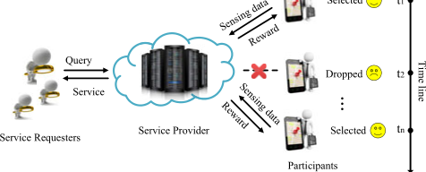

Fig. 1. A mobile crowdsensing system. 

values, and review some related solution concepts used in this paper from game theory. 

### 3.1 System Model 

A representative process in mobile crowdsensing is shown in Fig. 1. We assume that there is a service provider, some service requesters and a set of mobile users N ¼ f1; 2; . . . ; ng: The provider has a limited budget B to reward the selected mobile users for collecting data, with the goal of providing qualified services to the requesters. For example, the service provider collects local traffic information from users, performs data analysis process, and builds a traffic heat map, which would be used to provide real-time road congestion information to drivers. 

In this paper, we focus on two value models, one is the case where the value function is linear additive: the valuation of the selected participants is the summation of each user’s contributing valuation, and the other case is more general, where the value function is a submodular function. The submodular function captures the decrease of the user’s marginal contribution when the set of the selected users is large. In the practical mobile crowdsensing campaign, one user’s collected data to the service provider may have some “overlaps” to the existing collected data from other users, resulting in a small marginal contribution. Although the linear valuation function is a special case of the submodular function, we can illustrate the basic ideas and the intuitions behind designing budget feasible mechanism in the context of time-discounting values in a clear way. Thus, we discuss these two value models in this work separately. 

In linear valuation model, the private information (also called type in mechanism design [43]) of each participant i is ui ¼ ðai;di;ciÞ, where ai and di represent her arrival and departure time to the crowdsensing campaign, respectively, and ci represents her cost in performing the sensing task. Here, the cost can also be considered as a reserve price, which is the minimum payment that a participant would like to receive for executing the crowdsensing task. In other words, the server provider should compensate each mobile user not less than the reserve price, to incentivize her to participate in. We also use vi to denote the mobile user i’s value or contribution to the service provider. In different crowdsensing applications, we can have different interpretations for the values of the collected data. For example, similar to sensor networks [46], we can use the coverage area of the collected data to quantify the value. We can also quantify, the value of collected data from a certain location as the accuracy increase of the statistical distribution over the entire monitoring region [47]. We note that ai, di and ci are user i’s private information and are unknown to the service provider, while vi is the public information as it can be 

Authorized licensed use limited to: ON Semiconductor Inc. Downloaded on December 20,2022 at 02:26:54 UTC from IEEE Xplore.  Restrictions apply. 

ZHENG ET AL.: ON DESIGNING STRATEGY-PROOF BUDGET FEASIBLE ONLINE MECHANISMS FOR MOBILE CROWDSENSING WITH... 

2091 

evaluated in advance by the service provider [11], [12], e.g., the coverage area and accuracy increase can be calculated once knowing the location information, which can be obtained before users doing the tasks. Without loss of generality, we can assume each participant has a bounded value-cost ratio, i.e., L � vbii�U; 8i 2 N,withappropriateparametersofLandU. As the value is public information and the platform may have some knowledge of the sensing cost, the platform can estimate the parameters L and U, accurately. 

Upon participant i’s arrival, she would submit her bid ^ui ¼ ða^i; ^di; biÞ to the service provider. We note that since the participants are rational and selfish, they may cheat on their arrival times, departure times, or reserve prices for the purpose of earning more payment or improving the probability of being selected, implying that participant i’s bid may not be her true type. It is also not so practical for a participant to declare her arrival before she indeed arrives at the platform, or still being active after she have already departed. Reporting earlier arrival or later departure can be prevented by a heart-beat scheme [23], [36]. Furthermore, without restriction on the arrival and departure time, it is impossible to achieve a bounded performance guarantee for online mechanisms, which has been demonstrated by Lavi and Nissan [48]. Thus, we focus on the scenario where each participant can only report an arrival time later than her true arrival time or a departure time earlier than her true departure time, i.e., a^i � ai; d^ i � di. This assumption has also been widely adopted by several previous work in the literature [48], [49], [50]. It is possible that participant i can also misreport her reserve price bi 6¼ ci to manipulate the participant selection process. 

The user recruitment process in mobile crowdsensing is divided into T slots of equal lengths, i.e., T ¼ f1; 2; . .. ;T g. Upon a participant i’s arrival, the service provider would examine her bid and determine whether to select the participant or not immediately. In dynamic arrival setting, the service provider only knows the information of those already arrived mobile users and has no prior knowledge of the bids of the subsequent arrival participants. In mobile crowdsensing, especially time sensitive applications, the server provider would like to collect data as early as possible, in order to make realtime decisions. However, the server provider may not always achieve this, because that the qualified mobile users are only available at certain time slots, leading to the delay of the collected data. The service provider would then have less values over the delayed data collected at later times. We use a timediscounting value model to capture the value decrease of delayed data over time. Specifically, when a participant i is selected at a time t to collect data, her contributed value to the platform equals vi multiplying a time discounting factor, which is set as b�t in this work, i.e., viðtÞ ¼ vi � b�t : To simplify the discussion, we can assume that users can provide the data once they are selected. Under this assumption, the time t in the above value model is the time slot we select the user and also the user collects data to make contribution. We note that the participants would achieve the maximum value of contribution if they can provide the data at time t ¼ 0. 

If user i wins the auction, she will receive a payment pi, having a utility of ui ¼ pi � ci; otherwise, she will get zero utility, i.e., 

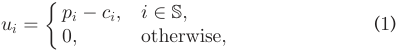

We denote the set of selected participants as S. In contrast to the participants who always want to maximize their own utilities, the provider expects to maximize the total obtained value V ¼P i2SviðtiÞ,asystem-levelutility,underabudgetcon- straintP i2Spi�B, where ti is the time slot when participant i is selected. 

Similarly, in the general case where the total value function is a submodular function, each participant i has a type ui ¼ ðai; di; ciÞ, and reports a bid^ u ¼ ða^i; d^ i; ^ciÞ. The total value over a selected participant set S is denoted as fðSÞ. In the general case, our objective is to select a set S to maximize the function fðSÞ, under the budget constraint. 

### 3.2 Solution Concepts 

We review several important solution concepts used in this paper from algorithmic game theory [43]. 

- Definition 1 (Dominant Strategy). A participant i’s strategy si is called her dominant strategy, if for any strategy s0 i6¼ si and any other player’s strategy profile s�i, we have uiðsi; s�iÞ � uiðs0 i; s�iÞ. 

- Definition 2 (Incentive-Compatibility). An online mechanism is incentive compatible if and only if it is the dominant strategy for every participant i 2 N to report her true type. 

- Definition 3 (Individual-Rationality). A mechanism is individual rational if and only if ui � 0 for all participant i 2 N. 

- Definition 4 (Strategy-Proof Direct Revelation Mechanism). A direct revelation mechanism is strategy-proof, when it satisfies both incentive-compatibility and individual-rationality. 

Our objective is to design a strategy-proof and budget feasible online mechanism with time-discounting values. We summarize the frequently used notations in Table 1. 

## 4 MECHANISM WITH LINEAR VALUE FUNCTION 

We first consider the simple case where the total value function is a linear function. In this section, we propose an online mechanism, which is named as TDM, satisfying the following properties: 

- Computational Efficiency: The computational complexity of the online mechanism is in polynomial time. 

- Strategy-Proofness: Since the property of individualrationality can be easily achieved, we only need to guarantee the property of incentive-compatibility, i.e., each participant has no incentive to misreport her type at any circumstance. 

- Competitive Ratio: We define the competitive ratio as the ratio between the expected total value gained in our mechanism and the expected optimal value where the server provider has the full information of all participants [27]. We will prove our mechanism can achieve a constant competitive ratio. 

### 4.1 Threshold Calculation 

The major step of an online mechanism is to determine whether to select a participant in a dynamic manner. Once a new user arrives, the service provider compares her efficiency (the ratio of contributed value to the sensing cost) with a threshold, which is calculated at the beginning of each stage. The stage is a period of sequential time slots, and we would 

Authorized licensed use limited to: ON Semiconductor Inc. Downloaded on December 20,2022 at 02:26:54 UTC from IEEE Xplore.  Restrictions apply. 

IEEE TRANSACTIONS ON MOBILE COMPUTING, VOL. 21, NO. 6, JUNE 2022 

2092 

TABLE 1 

Frequently Used Notations 

|Symbol|Description|
|---|---|
|N |The set of participants |
|B |The total budget |
|ui|Type of participanti |
|ai |arrival time of participanti |
|di|departure time of participanti |
|vi|value of participanti |
|ci ^|cost of participanti |
|ui |bid of participanti |
|T |the set of time slots |
|b|time-discounting factor |
|pi|payment of participanti |
|S|selected participant set|
|V|The total value|
|L; U|lower bound and upper bound of efficiency|
|r|efficiency threshold|
|V|The total value|
|�|a system parameter|
|Ti|time stage|
|f|submodular value function|

### Algorithm 1. TDM: GetThreshold 

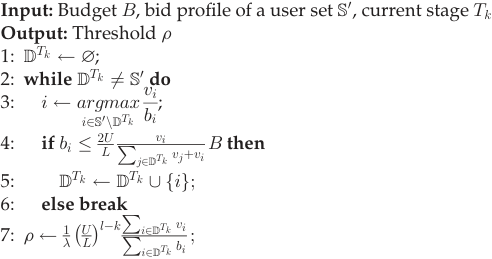

and then for any two participants x and y, if 

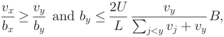

we also have 

show how to define a stage and the detailed user selection process within each stage in next subsection. In this subsection, we present the algorithm to calculate the threshold for a specific stage. Since our objective is to maximize the total value under a limited budget, a natural idea for the threshold calculation is to give high priorities to those participants with large efficiencies for a good utilization of the budget. 

We present the procedure to calculate the threshold in Algorithm 1, which will be carried out at the beginning of each stage. For the input of the algorithm, B is the capped budget for the threshold calculation process, S0 is the set of sampling users, and Tk is the beginning time slot of this stage. Our algorithm sorts participants in a non-decreasing order of value-cost efficiency, and selects the participants into DTk under the budget constraint bi � <u>2LU</u> ~~P~~ j2DvT <u>i</u>kvjþviB, 

which is an extension of the budget constraint in classical proportional share mechanism [31]. The budget constraint used here is highly related to competitive ratio analysis in next subsection. For example, the following Lemma 1 derives a nice property of the participation selection due to this budget constraint. In Theorem 1, we also show that with this budget constraint, we can derive a meaningful lower bound of the total bids of the selected participants. For the output of the algorithm, we take the average efficiency of participants in DTk multiplied by a stage related factor as the threshold, i.e., r ¼ �1 ��UL l�kP ~~P~~ <u>ii22DD</u>TTkkvbii, where �is a system parameter and l is the total number of stages. We note that such a threshold calculation procedure is different from the one in [26]. With this new procedure, we can easily capture the relation between two thresholds from different stages, using the assumption on bounded value-cost efficiency. 

The following results would help us to evaluate the stopping condition of participant selection in Algorithm 1. 

Lemma 1. Suppose the budget to calculate the threshold is B, participants are sorted in a sequence by a non-decreasing order of value-cost efficiency, i.e., 

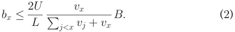

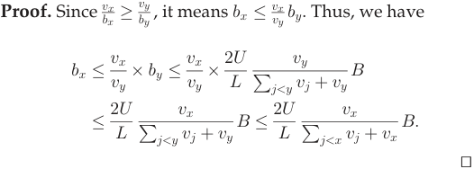

From this lemma, we can see that in Algorithm 1, if the budget constraint in Line 4 is not satisfied for some participant i, we do not need to consider another participant j whosecan infer thatefficiency bj >is2LUsmaller ~~P~~ l < jvjvlþ thanvjB. i, since from vbii> vbjj,we 

Khuller et al.[44] proposed a modified greedy algorithm, which has a similar procedure of our algorithm. The modified greedy algorithm also sorts the participants in a nondecreasing order of value-cost efficiency: vb11� vb22����� <u>vbnn</u>, but greedily selects the participants only when the total bids is less than the budget,P i2Dbi�B. We use rto denote the index that satisfiesP i�rbr�BbutP i�rþ1br>B.Forour algorithm, we also use2U m to represent the largest index that satisfies bm � <u>L</u>~~v~~m ~~P~~ j < mvjþvmB. This modified greedy algorithm has a good approximation ratio in non-strategic settings. The intuition behind our competitive ratio analysis is to make a connection between the total value of our algorithm and that of this algorithm, which is shown in the following theorem. 

Theorem 1. For the value of selected participants of our algorithm and that of the greedy output in Algorithm 2, we have 

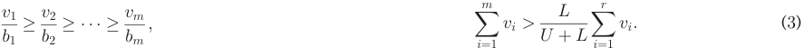

Authorized licensed use limited to: ON Semiconductor Inc. Downloaded on December 20,2022 at 02:26:54 UTC from IEEE Xplore.  Restrictions apply. 

ZHENG ET AL.: ON DESIGNING STRATEGY-PROOF BUDGET FEASIBLE ONLINE MECHANISMS FOR MOBILE CROWDSENSING WITH... 

2093 

Proof. We first prove the following inequality holds 

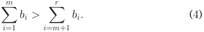

We only need to consider the case of m < r. According to Lemma 1, for i 2 f1; 2; . . . ; m � 1g, participant i would <u>2U</u> also satisfy bi � <u>L</u>vi ~~P~~ j < ivjþviB,andfori 2 fm þ 1; m þ 2; . . . ; rg, participant i would not have this property. For the purpose of contraction, we assume thatPm i¼1bi� <u>2U</u> Pri¼mþ1bi.Sincebi> <u>L</u>vi ~~P~~ j < ivjþviBfori>m,wecan have the following inequality: 

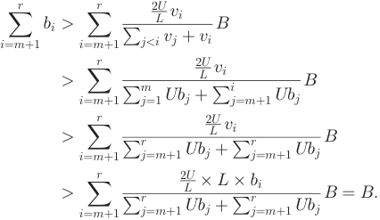

We have derived a contradiction, and (4) holds. With this result, we can have 

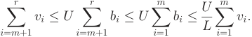

With the above inequality, we further have 

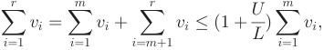

We rearrange the terms to get the resultPm i¼1vi> UþLL Pri¼1vi. tu 

### 4.2 Participant Selection and Payment Determination 

We now use the above threshold calculation method to guide participant selection. We first compute the 2i -quantile over the time period ½1; T �, given the distribution of the departure time of participants [29]. We denote Tk as the time slot before which participants depart with the probability 2�k . Then, we get a set of l quantiles fTl; Tl�1; . . .; T1g with l ¼ bLogðT Þc, and have Tk � Tk�1. We also denote the beginning time slot 1 and the ending time slot T as Tlþ1 and T0, respectively. Based on this set, we divide the entire time period into several stages, where the stage ½Tk; Tk�1Þ begins at time slot Tk and ends at time slot Tk�1. With this time stage construction, we can partition users into several stages using their departure times. The motivation of doing this is that we can overcome the lack of users’ information in designing online mechanisms. Specifically, for each stage ½Tk; Tk�1Þ, we can calculate the threshold using the information from the departure participants in the previous stages by Algorithm 1, to guide the participant selection in this stage. We increase the number of departure participants in the stage in an exponential way, which would guarantee 

the system performance of our algorithm. We would discuss this in detail in next subsection. 

### Algorithm 2. Modified Greedy Algorithm 

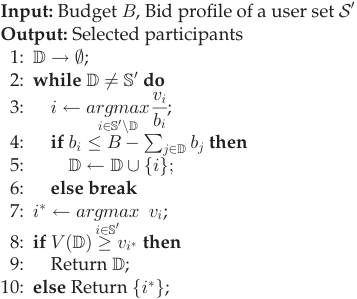

We now present our procedure in Algorithm 3 to elaborate the processes of participant selection and payment calculation. The threshold r is an estimate of the value-cost efficiency. For the first stage, we do not have enough sampling data to have an accurate estimate, and select a random number " to initialize the threshold r to avoid starvation. The budget for each stage is proportional to the number of users in the corresponding stage, and we initialize the budget B0 for the first stage to 21lB. 

The algorithm iterates from time slot t ¼ 1 to t ¼ T . At each time slot t, it adds all newly arrived participants to the set A, which represents the active participants who have arrived and not been selected until the current time slot t Line 5. If participant i has a large enough value-cost efficiency at time slot t, i.e., vibðitÞ�r, and satisfies the budget con- viðtÞ straint r�B0 �P j2Spj, she would win the auction and be compensated with a payment corresponding to her valuecost efficiency at that time, i.e., pi ¼ virðtÞ.Otherwise,she would be ignored and wait to be selected at next time slot until her departure time (Lines 6-9). During the entire period, we assume that each participant would only receive one task, and would be considered as a new user when she re-enters the system after wining the auction.2 Thus, we remove the winners from the set of candidates A in Line 10. For the purpose of truthfulness, we remove all departure participants, who lose the auction, from A, and add them to the sampling set S0 , making the calculation of the threshold is independent on the bids of winning users (Line 11). At the beginning of next stage Tk, the threshold and the remaining budget will be updated (Lines 12-14). 

### 4.3 Analysis 

In this subsection, we analyze our proposed mechanism. 

### Theorem 2. Mechanism TDM is computationally efficient. 

- Proof. In each time slot t, for each participant who arrives at this time, it takes up to OðnÞ steps to decide whether to select her. So the total computational cost in each time slot is bounded by Oðn2 Þ. Furthermore, it costs at most OðnlognÞ to calculate the threshold for each stage, which 

> 2. Designing incentive mechanisms to resist the potential strategic behaviors from the users across multiple participations in the auction is beyond the scope of this paper. 

Authorized licensed use limited to: ON Semiconductor Inc. Downloaded on December 20,2022 at 02:26:54 UTC from IEEE Xplore.  Restrictions apply. 

IEEE TRANSACTIONS ON MOBILE COMPUTING, VOL. 21, NO. 6, JUNE 2022 

2094 

### Algorithm 3. TDM: Participant Selection & Payment Calculation 

Input: Budget B, fT1; . . .; Tlg Output: Selected set of participants S and payment 1: t 1; r "; ; k l; 2: B0 21lB; S?; S0?; A?; 3: for t ¼ 1 to T do 4: if some participant i arrives then 5: A A [ fig; 6: foreach participant i in A do 7: if vibðitÞ�r and virðtÞ�B0 �P j2Spj then 8: pi virðtÞ; 9: S S [ fig; 10: A AnS; 11: Remove all participants that depart in t from A and add them to S0 as the sampling users; 12: if t ¼ Tk then 13: r GetThresholdðB0 ; Tk; S0 Þ; 14: k k � 1; B0 2B0 ; 

is lower than the computational cost used to determine the participant selection process. Thus, the computational complexity of this mechanism is OðTn2 Þ. tu 

### Theorem 3. Mechanism TDM is budget feasible. 

- Proof. Since the total payment of each stage ½Tk; Tk�1Þ never exhausts the corresponding allocated budget B0 ¼ 2k <u>1</u>�1B, i.e.,P j2Spj�B0,wecanseethatinthelaststage½T1; T0Þ we haveP j2Spj�B, and thus the total payment will not exceed the total budget. tu 

- Theorem 4. The mechanism is strategy-proof in terms of arrival and departure times. 

- Proof. A mechanism is strategy-proof in arrival/depature time information, i.e., participants cannot obtain higher utilities by misreporting their arrival or departure times. We recall that each participant has a type ðai; di; ciÞ and a bid ða^i; d^ i; biÞ, a^i � ai; d^ i � di. We fix the bids of all but participant i. If she proposes her true type, we further consider two cases: 

Case 1: Participant i can win the auction at time t which belongs to stage ½Tk; Tk�1�. Suppose the new reported arrival time has a^i < t. Since participant i cannot win the auction until t, she would still be selected at time t, and obtain the same value and payment. Suppose a^i > t, we assume she would win the auction at time t^ which belongs to the stage ½Tk0 ; Tk0�1�. Since a^i > t, we would have t^ � t þ 1. Let rk and rk0 be the threshold of the stages ½Tk; Tk�1� and ½Tk0 ; Tk0�1�, respectively. The payments calculated in the cases of truthfully reporting and viðtÞ viðt^ <u>Þ</u> misreporting are pk ¼ rk and pk0 ¼ rk0,respectively, and we have 

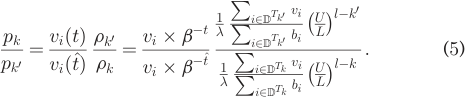

When the participant is selected in the same stage k0 ¼ k, we have ra ¼ rb. As the value discounts over time, we get viðt^ Þ < viðtÞ, leading to a smaller payment. We next investigate the payments for the case of k0 < k. Since each participant has a bounded efficiency, i.e., L � vbii� U, we then have 

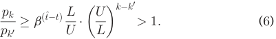

This indicates that the participant would also get a lower payment in this case, and she would have no incentive to cheat on her arrival time. 

Suppose the reported arrival time satisfies d^ i � t. The participant i would not be selected as a winner in this case, resulting in a zero utility, which would not be larger than that of truthfully reporting the departure time. For the other case of d^ i > t, the selection result and payment calculation remain the same, and the participant obtains the same utility. Therefore, the participants also have no incentive to misreport the departure time. 

Case 2: Participant i can not win this auction. She would not satisfy the selection result at any time slot within her present time, and has no incentive to misreport a later arrival or an earlier departure time since she would still not win the auction. tu 

### Theorem 5. The mechanism is cost-truthful. 

- Proof. A mechanism is cost-truthful if participants cannot obtain higher utilities by simply misreporting their reserve prices [27]. Different from previous works on the truthfulness problem which claim that an online auction is costtruthful only if it is bid-independent, the case in our mechanism is more complicated because of the time discounting property. We consider the following two cases. 

Case 1: Participant i can win the auction at time slot t^ in the stage ½Tk0 ; Tk0�1�. We next show it is impossible for the participant i to declare a smaller bid bi and wins the auction earlier, say at time t, in stage ½Tk; Tk�1�. If some participant wins at time slot t^ when bidding truthfully, she would not win the auction before that time. We notice that in time slot t^ , vicðit^ <u>Þ</u>�rk0, and we further have vicðitÞ�rk viðtÞ viðt^ <u>Þ</u> at time slot t as rk� rk0�ci, which can be derived from the analysis in Theorem 4 (i.e., Equations (5) and (6). But she was not allocated at the time slot t, the only reason is that her payment vriðktÞexceedstheremainingbudget.So this participant would not win the auction at time slot t by declaring a smaller bid bi. Obviously, declaring a larger bid would not help her gain more utility. 

Case 2: Participant i loses this auction. This means at viðtÞ viðtÞ viðtÞ any time slot t, ci < r, or ci�rbut r�B0 � Pj2Spj. The second condition means at that time, the pay- ment calculated in our algorithm would exhaust the remaining budget. No matter how the participant changes her bid, this block always exists. If she declares a larger bid, the inequations still hold. If she declares a smaller bid, wins the auction at time slot t, and receives a payment virðtÞ.Since vicðitÞ < r, this payment would be less than her true cost ci, resulting in a negative utility. A rational participant has no incentive to misreport in this case. tu 

Authorized licensed use limited to: ON Semiconductor Inc. Downloaded on December 20,2022 at 02:26:54 UTC from IEEE Xplore.  Restrictions apply. 

ZHENG ET AL.: ON DESIGNING STRATEGY-PROOF BUDGET FEASIBLE ONLINE MECHANISMS FOR MOBILE CROWDSENSING WITH... 

2095 

- Theorem 6. The mechanism is time-truthful and cost-truthful. 

- Proof. We prove that participants cannot obtain higher utilities by simultaneously misreporting their arrival or departure time and their reserve prices. We consider the case that a participant may misreport her present time and cost at the same time. It should be noted that the payment has not a direct relationship with the bid bi. If this participant can win the auction at t, and she can be selected after time t by misreporting her present time. As we show in Theorem 4, the payment decreases in this case. When the participant is selected at a time before t, it is equivalent to the case in Theorem 5. If the participant can not win the auction at any time, she has no incentive to misreport her bid bi within the present time ½ai; di�. tu 

The above theorem demonstrate the truthfulness of our mechanism in terms of arrival time, departure time and bid. To quantify the performance of the mechanism, we compare the total value of our algorithm with the optimal solution. In our analysis, we omit the effect of time-discounting property because it only changes the constant coefficient. 

- Theorem 7. The mechanism TDM has a constant competitive ratio in a large-scale crowdsensing scenario. This competitive ratio approaches to ��UL �1�l32ðUUþLÞð1 � <u>1e</u>Þ. 

- Proof. A large-scale crowdsensing scenario means that there are a large number of participants and a single participant cannot affect the market significantly [45]. Our analysis is based on the observation from a large-scale crowdsensing system that the bid of each participant is negligible compared with the total budget, i.e., we can assume that a bid satisfies bi � �B with a small parameter �. 

The high level idea behind the proof is to analyze the correlation among three sets of selected participants, that is outputs by the optimal algorithm, (modified) greedy algorithm in Algorithm 2 and our algorithm, respectively. It is widely known that the modified greedy algorithm has a constant approximation ratio with respective to the optimal solution in the worst cases [44]. We further prove the our mechanism also has a constant competitive ratio to the greedy algorithm. Combining with these two steps, we can obtain the performance guarantee of our mechanism. 

We first show the greedy algorithm has a constant competitive ratio to the optimal solution, under the large-scale crowdsensing assumption. Let SOPT be the optimal set when the provider has full information of the participants. S1 be the set of participants in SOPT who depart before time slot T1, and S2 be the set of participants in SOPT who departure in the last stage ½T1; T0�. When participants depart uniformly (this assumption would only affect the constant coefficient), it is easy to show the expected value of the set S1 is E½V ðS1 Þ�¼ <u>12</u>E½V ðSOPTÞ� because users are uniformly distributed within the set S1 and S2 . Therefore, the competitive ratio of modified greedy algorithm over the set S1 with the budget B0 ¼ 1=2B is a constant <u>18</u>ð1 � <u>1e</u>Þ,withrespectivetotheoptimalsolution SOPT . We recall that the approximation ratio of the modified greedy algorithm for an instance of a user set S and a budget B is <u>12</u>ð1 � <u>1e</u>Þ[44].Inthelaststepofmodified greedy algorithm, we choose the participant with the highest value or those selected by the greedy rule, to 

guarantee the performance in the worst case. Under the assumption of a large-scale crowdsensing system, the output would have a high probability to be the latter. Thus, the expected greedy output approaches to the expected output of the modified greedy algorithm when n is large enough, and also has a constant competitive ratio <u>18</u>ð1 � <u>1e</u>Þ with respective to the optimal solution. 

We next compare the value of the participants selected by our mechanism with the value of those selected by the greedy rule over the set of sampling participants before the last stage. If this ratio is a constant, the competitive ratio of our mechanism would also be a constant. We recall that notation S is the selected participants of our mechanism, S0 is the sampling participants to determine the threshold r in the last stage. We use set f1; 2; . . . ; mg and set f1; 2; . . . ; rg to denote the participants selected by GetThreshold in Algorithm 1 and those selected by the greedy rule in Algorithm 2 over the set S0 , respectively. 

We first analyze the relation between the value of S and the value of f1; 2; . . . ; mg 

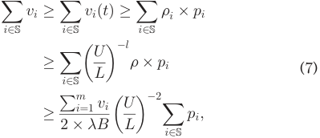

where ri is the threshold when participant i is selected. We next present a lower bound of the total payments under the assumption of large-scale crowdsensing system. We consider the participants who fail to be selected in the last stage. By appropriately choosing the parameter � and the large-scale assumption, we can assume that there exists one participant i that loses the auction due to the budget constraint, i.e., viðrtiÞ þP jpj>B.3Wecan select the parameter � to have a small threshold r such thatU l�1this assumption holds, e.g., by choosing � to be <u>ðL</u> ~~<u>Þ</u>~~ <u>1 U</u> � � dwithd>1,wecanhaversmallerthan d.In the following discussion, we choose d ¼ 2 and thus 2 <u>U</u> ��L l�1� �. For this participant i 

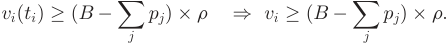

Since vi � Ubi � U�B, we have ðB �P jpjÞr �U�B, i.e., 

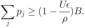

If we can choose an appropriate parameter � or � is small enough, such that 1 � <u>U�r</u>>0,thetotalpaymentwould be at least a constant fraction of the total budget B. To guarantee such an assumption, the requirement for � is 

3. Our result also holds when we relax this assumption to that with a high probability such a participant exists. 

Authorized licensed use limited to: ON Semiconductor Inc. Downloaded on December 20,2022 at 02:26:54 UTC from IEEE Xplore.  Restrictions apply. 

IEEE TRANSACTIONS ON MOBILE COMPUTING, VOL. 21, NO. 6, JUNE 2022 

2096 

### 5.1 System Model 

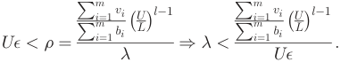

We note that <u>Pmi¼1</u>vi ~~Pm~~ i¼1bi�U,sowecanrelaxourrestricted <u>U</u> l�1 condition to �< ~~<u>ð</u>~~ <u>LÞ�</u> : 

Rearrange the terms in (7) and use the lower bound of the total payments, we can get 

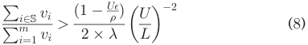

From the result in Theorem 1, we can obtain the relation between the value of f1; 2; . . . ; mg and that of f1; 2; . . . ; rg 

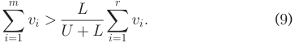

With (8) and (9), we can derive the expected competitive ratio of our algorithm 

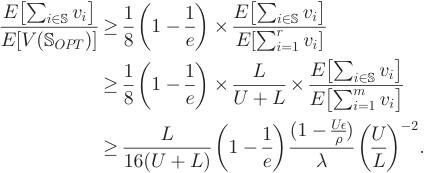

We note that although r is a variable, it is a constant because of the bounded value-cost efficiency. So we can take the lower bound to be the competitive ratio. The detailed calculation is omitted here. When � approach to 1, the competitive ratio is 

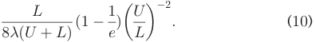

The restricted condition on the parameter � is 

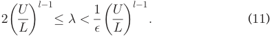

When � is sufficiently small, we can always find such a parameter � equals 2��UL l�1. Then the expected competitive ratio is 

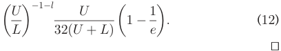

## 5 MECHANISM WITH SUBMODULAR VALUE FUNCTION 

In this section, we propose an online mechanism, namely TDMS, for the general submodular value model. 

The model for this general case is similar to the model we have presented in Section 3. We assume each user can complete multiple tasks, and the bid of each participant contains the set of sub-tasks she can finish. The bid of of participant i is now ui ¼ ðai; di; pi; ciÞ, where we use the notation pi to represent the sub-task set of participant i. 

### 5.2 Design 

In last section, we propose an incentive mechanism for online crowdsensing with time-discounting values, where the total obtained value for the service provider is a linear summeration of value contributed by each participant, i.e., V ¼P i2SviðtiÞ:Howeverinmanyscenarios[27],thevalue from a set of participants S to the platform is a monotone submodular function fðSÞ, which is defined as 

Definition 5 (Monotone Submodular Function). A function f : 2½n� ! R is submodular if and only if 

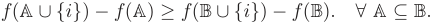

In existing works about submodular optimization in the realm of incentive mechanism design for mobile crowdsensing [25], [27], [31], the marginal value contributed by a participant is related to the order she is selected, and the total value is only determined by the set of already selected participants. However, in this paper, considering the timediscounting property, both the marginal value and total value depend on the time slots at which the participants are selected. That is when a participant i is selected at time ti, her marginal contribution given a subset S is 

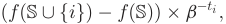

where we still use f to denote the value function without considering the time-discounting value effect. Assume the selected participants follow the order fi1; i2; . . . ; ing and their selected time slots are ti1 ; ti2 ; . . . ; tin , respectively. We use f~ to substitute f when considering time-discounting value effect. When selecting the first participant i1, her contribution value is f~ ðfi1gÞ ¼ fðfi1gÞ � b�ti1 . Similarly, the value contributed by the second selected participant is fðfi1; i2gÞ � fðfi1gÞ � b�ti2 with the time discounting effect b�ti2 . Thus, the total value obtained from these two participants is f~ ðfi1; i2gÞ ¼ fti1 ðfi1gÞ � b�ti1 þ ½fðfi1; i2gÞ � fðfi1gÞ�� b�ti2 . Following the same principle, the total value contributed by all these n participants is 

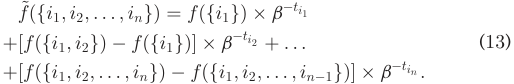

- Theorem 8. The new total value function f~ with time-discounting value is monotone submodular. 

- Proof. We can prove this according to the definition of submodular function. 

Let A and B are two arbitrary subsets and A � B. Then, 

Authorized licensed use limited to: ON Semiconductor Inc. Downloaded on December 20,2022 at 02:26:54 UTC from IEEE Xplore.  Restrictions apply. 

ZHENG ET AL.: ON DESIGNING STRATEGY-PROOF BUDGET FEASIBLE ONLINE MECHANISMS FOR MOBILE CROWDSENSING WITH... 

2097 

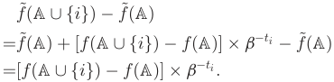

Similarly, 

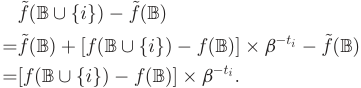

Since f is a submodular function, then we have fðA [ figÞ � fðAÞ � fðB [ figÞ � fðBÞ. tu 

Under the property of time-discounting value, we denote participant i’s marginal contribution given a subset A as f~ti iðAÞ ¼ ½fðA [ figÞ �fðAÞ��b�ti.Nextwemodifythepro- cedure in Algorithm 1 to calculate the threshold when the value function is submodular, and show the procedure in Algorithm 4. Recall that we assume L � <u>vb</u>�U before, here we make a rea- <u>f</u>i <u>ð? Þ</u> sonable assumption that L � bi � U. Then we also can <u>f</u>i <u>ðAÞ</u> obtain that L � bi � U for all set A. Line 3 in Algorithm 4 is to calculate the efficiency, which is the ratio of the marginal value and her cost. As we have discussed before, we always add the participant with the highest efficiency into the set. 

### Algorithm 4. TDMC: GetThreshold 

Input: Budget B, bid profile of a user set S0 , current stage Tk Output: Threshold r 

- 1: DTk ? ; 

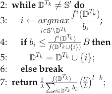

Next we propose the participant selection process in Algorithm 5. We should pay more attention to the guarantee of strategy-proofness. Since the value function now is submodular, the marginal value is related to a given subset. If the order of selection is changed, the marginal value would change as well. This is a new kind of opportunity for the participants to cheat on their bids. Singer has ever studied a budget feasible mechanism [31], where the value function is submodular. However it is used in offline scenario, we would give an extension to the online setting. 

### 5.3 Analysis 

- Theorem 9. The mechanism with submodular value function is computationally efficient and budget feasible. 

- Proof. The proof is similar to the proofs of Theorem 2 and Theorem 4, and we omit it here. tu 

- Theorem 10. The mechanism with submodular value function is time-truthful. 

- Proof. We prove that a participant can not obtain higher utility by misreporting her arrival or departure time. 

### Algorithm 5. TDMC: Participant Selection & Payment Calculation 

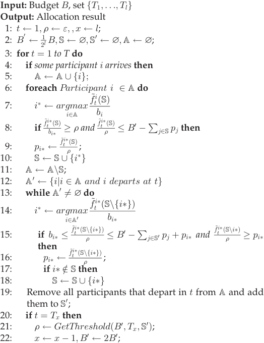

Denote her true arrival and departure time is ai; di and the misreporting time is a^i and d^ i. Fix the bids of all participants but i, we consider two cases. 

Case 1: If she can win the auction at time t when she proposes her true type. If a^i � t, she won’t get more payment because she cannot win the auction until t. If ^ai > t, assume she will win the auction at t^ . Assume t and t^ belongs to stage ½Ta;Ta�1� and ½Tb;Tb�1� respectively and the corresponding threshold is ra ¼ GetThrsholdðBa;Ta; S0 aÞ and rb ¼ GetThresholdðBb;Tb; S0 bÞ. Assume the set D in Algorithm 4 isU Da and Db , so ra ¼ �1 ~~P~~ <u>fið2DD</u>aa <u>Þ</u>bi ��UL l�a and rb ¼ �1 ~~P~~ <u>fið2DD</u>bb <u>Þ</u>bi ��L l�b. Hence 

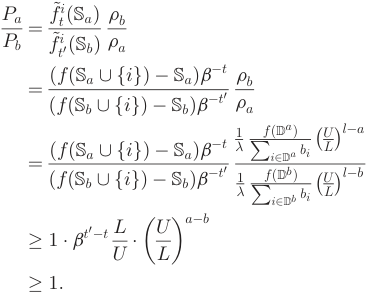

The inequality fðSa [ figÞ � SaÞ � fðSb [ figÞ � SbÞ is due to the submodularity of function f. This indicates that the 

Authorized licensed use limited to: ON Semiconductor Inc. Downloaded on December 20,2022 at 02:26:54 UTC from IEEE Xplore.  Restrictions apply. 

IEEE TRANSACTIONS ON MOBILE COMPUTING, VOL. 21, NO. 6, JUNE 2022 

2098 

participant can’t obtaining higher utility by misreporting her arrival time. The analysis on departure time similar. 

Case 2: In this case, this participant can not win the auction any time. She will not win the auction by misreporting her time because in her present period, her low efficiency always makes her lose the auction. tu 

- Theorem 11. The mechanism with submodular value function is cost-truthful 

- Proof. Here we prove that a participant can’t misreport her cost for more utility. It suffices to show bidding her true cost is a dominant strategy. As we have proved before, we consider two cases. 

Case 1: Participant i can win the auction before she departs if she bids truthfully. Assume she is selected at time ta in stage ½Ta; Ta�1�. If she misreports her cost and fails, her utility will be zero. Otherwise, assume she misreports her cost and wins the auction at time tb in stage ½Tb; Tb�1�. With the analysis in the proof of Theorem 5, she can not get higher payment calculated in line 9 in Algorithm 5. We next prove she can not get higher payment calculated in line 15 in Algorithm 5. From the analysis in the proof of Theorem 10, her payment will not be updated because she can’t get a higher payment. So we have proved she can’t obtain more utility in this case. 

Case 2: Participant i can be selected when she departs and she misreports a cost bi. If she still can not win the auction until she departs, she will get a payment equals f~tiðSnfigÞ r , which is the same as she bids truthfully because this payment has nothing to do with the bid. Otherwise, we assume she can win the auction at some time t by misreporting lower cost (Apparently, higher cost doesn’t “help”). The participant’s failure is due to two reasons: low efficiency or budget constraint. If it is because of the budget, she will still fails. If it is because the low effif~tiðSÞ f~tiðSÞ ciency, i.e., ci � r, we can derive ci � r.Ifshewins the auction and get a payment, this payment will be less than her cost. So we have proved this case. 

Case 3: Participant i can not win the auction all the time. It she can not win the auction by misreporting her cost, she will get the same payment 0. Otherwise, she can win the auction. With the analysis in case 2, she can not win the auction before she departs for the reason of individual-rationality. So she can only be selected at the time she departs and f~tiðSnfigÞ she will get a payment r calculated in line 15. When she bids her true type, she will fails in line 14. It is because of the budget constraint or the efficiency. If she proposes a lower cost for higher efficiency, she will get a negative utility. If she fails for the reason of the budget, she will fails again, because the budget has nothing to do with the bid. It is noted that she can’t be compared earlier for a payment by misreporting a higher efficiency because she ever failed in the previous comparing rounds. tu 

- Theorem 12. The mechanism has a constant competitive ratio in the large-scale crowdsensing system. 

- Proof. In the case where the value is not time-discounting, Zhao et al. has proposed a different algorithm to calculate the threshold in Algorithm 6 [27]: 

They also proved that the competitive ratio is a constant times <u>2da</u>ifdsatisfiesthat <u>12</u>�ð 1�d2a�1Þ v1� <u>1d</u>¼ <u>2da</u>, where a 2 ð0; <u>12</u>~~�~~andvisasufficientlylargeconstant which reflects the relationship between a bid and total budget. It approaches to <u>14</u>as v ! 1 and d ! 4. 

Our proof is based on their result. We first prove that our calculated threshold used in the last stage is larger than that calculated in Algorithm 6. In line 7 in the Algo- <u>1 fðD</u>Tk <u>Þ U</u> rithm 4, the threshold is defined as � <u>�L�l�k¼ 1 fðD</u>Tk <u>Þ B U 1 fðD</u>Tk <u>Þ U</u> ~~P~~ i2DTkbi � B ��L l�k� � B <u>�L�. With the same analysis,</u> ~~P~~ i2DTkbi the competitive ratio appraoches to <u>14</u>asv ! 1and � ! <u>U</u> tu 4L. 

### Algorithm 6. Threshold Calculation [27] 

Input: Stage budget B0 , sample set S0 Output: Threshold r 1: J ! ;; i ! argmaxj2S0 VjðJÞnbj; viðJÞB0 2: whilebi � V ðJ[fjgÞdo 

- 3: J ! J [ fig; 4: i ! argmaxj2S0nJVjðJÞnbj; 

5: r ! V ðJÞnB0 ; 

6: return rnd; 

## 6 NUMERICAL RESULTS 

### 6.1 Methodology 

We implement our budget feasible online mechanism with time-discounting values in the linear value model, namely TDM, and compare its performance with several benchmarks: the optimal offline mechanism (OPT), a random online mechanism (Random), and two online budget feasible mechanisms (OMG and Singer’s) in the context of crowdsourcing from the literature [27], [29]. The optimal result is computed by solving an offline binary integer program. The procedures of OMG mechanism [27] and Singer’s mechanism [29] are similar to ours, and the essential difference is threshold calculation scheme, which does not adjust for time-discounting value in either OMG or Singer’s mechanism. In [27], the threshold calculated for each stage is simply the average value-cost efficiency of the selected sampling users, while in [29], the threshold is the largest value-cost efficiency from selected sampling users under the budget constraint. We would evaluate these mechanisms in the following three metrics: 

   - Total Value is the total contribution of all the selected participants. In TDM mechanism, the total value is the summation of each participant’s value. In TDMS mechanism, the total value is the submodular function over the set of selected participants. We would measure the total value with the variation of some parameters, e.g., the total budget, the number of participants and some system parameters. 

   - Selected Ratio is the percentage of participants who is selected by the mechanism. This metric can capture the fairness of the mechanisms to some extent. 

   - Budget Utilization is the percentage of the used budget to recruit participants. 

- For evaluation setup, the auction period T is 50, and are 

- further divided into 5 stages. The arrival time and departure time of users are uniformly distributed in ½1; T �. In a large- 

ZHENG ET AL.: ON DESIGNING STRATEGY-PROOF BUDGET FEASIBLE ONLINE MECHANISMS FOR MOBILE CROWDSENSING WITH... 

2099 

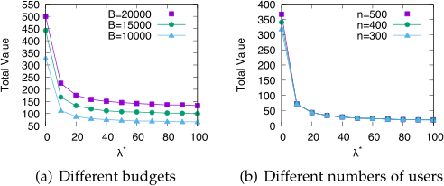

Fig. 2. Impact of � ð� ¼ �min þ 100��ð�max ��minÞÞ. 

scale crowdsensing system, we make a reasonable assumption that the cost of each participant is tiny compared to the total budget, and is less than a ratio multiplying the budget, which is set to 0.0015 in our experiment. The lower bound and upper bound of efficiency are set as 0.1 and 2.0, respectively. The initial threshold r is set to a small value, i.e., 0.1, to avoid starvation. We also evaluate the effects of these system parameters, including the upper bound of efficiency U, the initial threshold r and the parameter �, on the system performance. The time discounting function in our evaluation is set to viðtÞ ¼ vi � 0:9t . The value and cost of each participant are randomly selected within the feasible range, i.e., the valuecost efficiency is in the range ½1; 2�, and the cost is less than 0:0015 � B. All the results are averaged over 200 rounds. 

### 6.2 The Effects of System Parameters 

We first investigate the effects of system parameters including the threshold parameter �, the initialization of r and the upper bound of efficiency U, on the total value, under different experiment settings with various budgets and number of participants. We show the results in Figs. 2, 3 and 4, respectively. These three sets of experiments follow the same setup, where we first fix the number of users as 300, and report the results under different budgets, and then fix the budget as 1000, and show the results with different number of users. First, according to inequality (11), the parameter � has an upper bound �max ¼ <u>1�</u> ��UL l�1 and a lower bound �min ¼ 2�UL�l�1, but it is not clear how to choose � to maximize the total value in practice, even though we can always guarantee a constant competitive ratio in this range. We divide the interval ½�min; �maxÞ into 100 pieces, and calculate the total value under different parameter �. The results in Fig. 4 show that with � getting closer to �min, the total value is getting higher. We note that when � gets small, the threshold r gets large. The premise of this trend is the sufficient number of participants. Considering that there are few participants competing in this auction, if the threshold r is too large, some participants would be selected later, leading to the decrease of total value due to the time- discounting effect. When there are plentiful participants, the participants with small efficiency would lose and never be selected. In addition, we also see the competitive ratio in Equation (10) has a negative correlation with �, which is further confirmed by this evaluation result. 

We next consider the evaluation results about the effect of initial threshold r on the total value. From the results in Fig. 3, we find that the total value increases with the initial threshold r at first, and then remains stable after the initial threshold larger than a certain value, which would depends on the specific experiment setups. The reason for this trend is that a small initial threshold r would select too many 

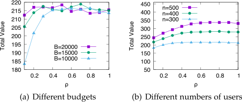

Fig. 3. Impact of initial threshold r. 

participants with low value-cost efficiency at the beginning, leading to performance degradation in overall stages. In contrast, for a large initial threshold, TDM mechanism would be conservative at first, but would quickly update the threshold in the following stages based on observed information. The evaluation results demonstrate that TDM mechanism is robust to the variance of initial threshold. 

We now show the evaluation results of the upper bound of efficiency U in Fig. 4. We find that the total value decreases with U in almost all experiment settings. Online mechanisms rely on one underlying assumption that users are similar in some metrics, such as the value-cost efficiency in our context, which is critical to leverage the observed information from the previous users to guide the selection for the following users. In the situation with a large U, users are quite different in terms of the value-cost efficiency, and thus the estimated efficiency threshold r from the sampling users is not so informative for the following users. In such a dynamic situation, we find that the learned efficiency threshold fluctuates over the stages. In contrast, when U is not too large, over the collected information from enough sampling users, TDM mechanism can estimate an accurate and stable efficiency threshold for a good guideline of online selection. One potential solution for the large variance in value-cost efficiency would be to group users using historical information, and estimate a separated efficiency threshold for each group of users. Designing comprehensive solutions for this problem is reserved to the future work. The evaluation result here is also consistent with the theoretical result from Theorem 7, where the competitive ratio has a negative relation with the value of U. 

### 6.3 Total Value 

We next evaluate the total value of the mechanisms under different budgets and numbers of participants, respectively. 

In Fig. 5a, we fix the number of participants n as 200, and change the budget B from 0 to 20000 with an increment of 2000. We observe that as the budget increases, the total values of all five mechanisms become large before the saturation is achieved. We note that when the budget is small, the value of 

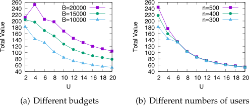

Fig. 4. Impact of the upper bound of efficiency U. 

Authorized licensed use limited to: ON Semiconductor Inc. Downloaded on December 20,2022 at 02:26:54 UTC from IEEE Xplore.  Restrictions apply. 

IEEE TRANSACTIONS ON MOBILE COMPUTING, VOL. 21, NO. 6, JUNE 2022 

2100 

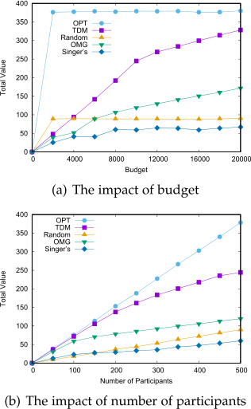

Fig. 5. Impact of varying budget and number of participants on Total Value. 

TDM is less than the value obtained by the random mechanism. This is because several participants would lose the auction due to the harsh budget constraint and the requirement of strategy-proofness in TDM. However, even with the requirement of strategy-proofness, TDM mechanism still achieves superior performance to the random mechanism, and approaches to the optimal mechanism, when the budget becomes large. TDM mechanism outperforms OMG and Singer’s mechanisms in all experiment settings, which demonstrates that the threshold calculated in TDM is tailored for the situation of time discounting values. The thresholds calculated in OMG and Singer’s mechanisms would exclude the participants with small time discounting values from being selected. In TDM, we introduce one stage dependent parameter ~~ð~~ <u>UL</u>~~Þ~~l�k for threshold calculation to capture time-discounting effect on values. The evaluation results demonstrate that this operation can dramatically increase system performance. 

In Fig. 5b, we vary the number of participants n from 0 to 600, and fix the budget to 15000. We observe that the total values of all mechanisms increase with the number of participants. This is due to the fact that with more participants, the probability of the appearance of participants with high efficiencies becomes higher, and thus we can utilize the limited budget in a more efficient way. Again, TDM mechanism also outperforms Random, OMG and Singer’s mechanisms, and approaches to the optimal solution. The close gap between TDM and the optimal solution shows that we just sacrifices small system performance to guarantee strategy-proofness. We also note that the revised Singer’s mechanism even has worse performance than the random mechanism. The problem considered in [29] is not so fully consistent with the problem in our work. They did not considered the values of tasks, and only maximize the number of completed tasks. The participants in [29] are able to complete multiple number of tasks, while we only consider that each participant can only complete one task. We revised the Singer’s mechanism to adapt into our setting, but still reserve the two key components from the original mechanism: one is the 

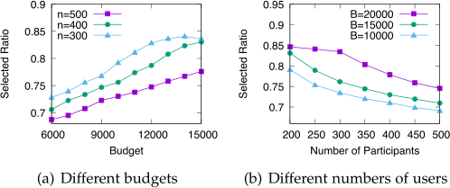

Fig. 6. Impact of varying budget and number of participants on Selected Ratio. 

threshold calculation scheme; and the other is to select a single participant with the largest value-cost efficiency at a relatively high probability, which is 2/3 in [29]. As demonstrated in [29], the latter component is critical to the performance guarantee (constant competitive ratio) in the worst case, which, however, is only a small fraction of instances under our experiment setting. It is this operation that leads to a large performance degradation in the average sense. 

### 6.4 Selected Ratio 

In Figs. 6a and 6b, we intend to investigate the selected ratio with various numbers of participants and budget, respectively. We first vary the budget from 6,000 to 15,000, and then vary the number of participants from 200 to 500. As shown in Fig. 6a, the selected ratio increases when the budget gets large. We also find that the selected ratio is always less than 0.9, even when the budget is large enough. This is because the decision about user selection in online environments, especially in the initial stage, may not be optimal due to the lack of information for accurate threshold estimation. In Fig. 6b, we can also see that with a fixed budget, the selected ratio decreases with the number of participants. When the number of participants increases, TDM mechanism would prefer to the participants with a high value-cost efficiency, and ignores the originally selected users, under the budget constraint. The decrease of selected ratio in this scenario shows that the mechanism would break the fairness to some extent in an extensive competition environment. 

### 6.5 Budget Utilization 

We also investigate the budget utilization of our TDM mechanism. With similar experiment setup, the number of participants varies from 200 to 500 and the budget changes from 6000 to 15000. In Fig. 7a, it is shown that for a fixed number of participants, the budget utilization decreases with the budget, and in Fig. 7b with a fixed budget, the budget utilization increases with the number of participants. These evaluation results also show that the decrease of marginal effect of budget utilization is evident. This suggests that for a mobile crowdsensing application with a fixed number of registered participants, adding more budget may not bring large enough benefit, which is consistent with the result found in Fig. 5. 

## 7 CONCLUSION 

In this paper, we have proposed two strategy-proof and budget feasible online incentive mechanisms, namely TDM and TDMS, for mobile crowdsensing that consider the property of time-discounting values. The designed mechanisms calculate a time-dependent threshold to guide the online 

Authorized licensed use limited to: ON Semiconductor Inc. Downloaded on December 20,2022 at 02:26:54 UTC from IEEE Xplore.  Restrictions apply. 

ZHENG ET AL.: ON DESIGNING STRATEGY-PROOF BUDGET FEASIBLE ONLINE MECHANISMS FOR MOBILE CROWDSENSING WITH... 

2101 

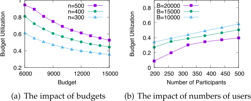

Fig. 7. Impact of varying budget and number of participants on Budget Utilization. 

participants selection, and incentivize each selected participant with a carefully designed payment to guarantee strategy-proofness. We consider two cases with the linear value function and the submodular value function. Our mechanisms for these two cases both satisfy the budget feasibility and achieve constant competitive ratios. The simulation results have shown that our mechanisms achieve superior performance in terms of the total obtained value. 

## ACKNOWLEDGMENTS 

This work was supported in part by the National Key R&D Program of China No. 2019YFB2102200, in part by Tencent Rhino Bird Key Research Project, in part by CCF-Tencent Open Fund, in part by China NSF grant No. 61902248, 61972252, 61972254, 61672348, and 61672353, in part by Joint Scientific Research Foundation of the State Education Ministry No. 6141A02033702, in part by the Open Project Program of the State Key Laboratory of Mathematical Engineering and Advanced Computing No. 2018A09. The opinions, findings, conclusions, and recommendations expressed in this paper are those of the authors and do not necessarily reflect the views of the funding agencies or the government. 

## REFERENCES 

- [1] R. K. Ganti, F. Ye, and H. Lei, “Mobile crowdsensing: Current state and future challenges,” IEEE Commun. Mag., vol. 49, no. 11, pp. 32–39, Nov. 2011. 

- [2] N. D. Lane, E. Miluzzo, H. Lu, D. Peebles, T. Choudhury, and A. T. Campbell, “A survey of mobile phone sensing,” IEEE Commun. Mag., vol. 48, no. 9, pp. 140–150, Sep. 2010. 

- [3] R. K. Ganti, F. Ye, and H. Lei, “Mobile crowdsensing: Current state and future challenges,” IEEE Commun. Mag., vol. 49, no. 11, pp. 32–39, Nov. 2011. 

- [4] N. Maisonneuve, M. Stevens, M. E. Niessen, and L. Steels, “NoiseTube: Measuring and mapping noise pollution with mobile phones,” in Proc. Inf. Technol. Environ. Eng., 2009, pp. 215–228. 

- [5] R. K. Rana, C. T. Chou, S. S. Kanhere, N. Bulusu, and W. Hu, “Earphone: An end-to-end participatory urban noise mapping system,” in Proc. 9th ACM/IEEE Int. Conf. Inf. Process. Sensor Netw., 2010, pp. 105–116. 

- [6] E. Koukoumidis, L.-S. Peh, and M. R. Martonosi, “SignalGuru: Leveraging mobile phones for collaborative traffic signal schedule advisory,” in Proc. 9th Int. Conf. Mobile Syst. Appl. Serv., 2011, pp. 127–140. 

- [7] Y. Wang, X. Liu, H. Wei, G. Forman, C. Chen, and Y. Zhu, “CrowdAtlas: Self-updating maps for cloud and personal use,” in Proc. 11th Annu. Int. Conf. Mobile Syst. Appl. Serv., 2013, pp. 469–470. 

- [8] T. Yan, B. Hoh, D. Ganesan, K. Tracton, T. Iwuchukwu, and J.-S. Lee, “Crowdpark: A crowdsourcing-based parking reservation system for mobile phones,” University of Massachusetts at Amherst, Amherst, MA, Tech. Rep. UM-CS-2011-001, 2011. 

- [9] S. Mathur et al., “ParkNet: Drive-by sensing of road-side parking statistics,” in Proc. 8th Int. Conf. Mobile Syst. Appl. Serv., 2010, pp. 123–136. 

- [10] L. Wang et al., “CCS-TA: Quality-guaranteed online task allocation in compressive crowdsensing,” in Proc. ACM Int. Joint Conf. Pervasive Ubiquitous Comput., 2015, pp. 683–694. 

- [11] D. Peng, F. Wu, and G. Chen, “Pay as how well you do: A quality based incentive mechanism for crowdsensing,” in Proc. 16th ACM Int. Symp. Mobile Ad Hoc Netw. Comput., 2015, pp. 177–186. 

- [12] H. Jin, L. Su, D. Chen, K. Nahrstedt, and J. Xu, “Quality of information aware incentive mechanisms for mobile crowd sensing systems,” in Proc. 16th ACM Int. Symp. Mobile Ad Hoc Network. Comput., 2015, pp. 167–176. 

- [13] R. Kawajiri, M. Shimosaka, and H. Kashima, “Steered crowdsensing: Incentive design towards quality-oriented place-centric crowdsensing,” in Proc. ACM Int. Joint Conf. Pervasive Ubiquitous Comput., 2014, pp. 691–701. 

- [14] Y. Fan, H. Sun, and X. Liu, “Poster: TRIM: A truthful incentive mechanism for dynamic and heterogeneous tasks in mobile crowdsensing,” in Proc. 21st Annu. Int. Conf. Mobile Comput. Netw., 2015, pp. 272–274. 

- [15] M. Karaliopoulos, I. Koutsopoulos, and M. Titsias, “First learn then earn: Optimizing mobile crowdsensing campaigns through data-driven user profiling,” in Proc. 17th ACM Int. Symp. Mobile Ad Hoc Netw. Comput., 2016, pp. 271–280. 

- [16] D. Yang, G. Xue, X. Fang, and J. Tang, “Crowdsourcing to smartphones: Incentive mechanism design for mobile phone sensing,” in Proc. 18th Annu. Int. Conf. Mobile Comput. Netw., 2012, pp. 173–184. 

- [17] I. Koutsopoulos, “Optimal incentive-driven design of participatory sensing systems,” in Proc. IEEE Int. Conf. Comput. Commun., 2013, pp. 1402–1410. 

- [18] Y. Chon, S. Kim, S. Lee, D. Kim, Y. Kim, and H. Cha, “Sensing WiFi packets in the air: Practicality and implications in urban mobility monitoring,” in Proc. ACM Int. Joint Conf. Pervasive Ubiquitous Comput., 2014, pp. 189–200. 

- [19] S. Ji, Y. Zheng, and T. Li, “Urban sensing based on human mobility,” in Proc. ACM Int. Joint Conf. Pervasive Ubiquitous Comput., 2016, pp. 1040–1051. 

- [20] M. Zappatore, A. Longo, M. A. Bochicchio, D. Zappatore, A. A. Morrone, and G. De Mitri, “A crowdsensing approach for mobile learning in acoustics and noise monitoring,” in Proc. 31st Annu. ACM Symp. Appl. Comput., 2016, pp. 219–224. 

- [21] J. Cherian, J. Luo, H. Guo, S.-S. Ho, and R. Wisbrun, “Poster: Parkgauge: Gauging the congestion level of parking garages with crowdsensed parking characteristics,” in Proc. 13th ACM Conf. Embedded Netw. Sensor Syst., 2015, pp. 395–396. 

- [22] M. Babaioff, M. Dinitz, A. Gupta, N. Immorlica, and K. Talwar, “Secretary problems: Weights and discounts,” in Proc. 20th Annu. ACM-SIAM Symp. Discrete Algorithms, 2009, pp. 1245–1254. 

- [23] E. J. Friedman and D. C. Parkes, “Pricing WiFi at starbucks: Issues in online mechanism design,” in Proc. 4th ACM Conf. Electron. Commerce, 2003, pp. 240–241. 

- [24] R. B. Myerson, “Optimal auction design,” Math. Operations Res., vol. 6, no. 1, pp. 58–73, 1981. 

- [25] A. Badanidiyuru, R. Kleinberg, and Y. Singer, “Learning on a budget: Posted price mechanisms for online procurement,” in Proc. 13th ACM Conf. Electron. Commerce, 2012, pp. 128–145. 

- [26] D. Zhao, X.-Y. Li, and H. Ma, “Budget-feasible online incentive mechanisms for crowdsourcing tasks truthfully,” IEEE/ACM Trans. Netw., vol. 24, no. 2, pp. 647–661, Apr. 2016. 

- [27] D. Zhao, X.-Y. Li, and H. Ma, “How to crowdsource tasks truthfully without sacrificing utility: Online incentive mechanisms with budget constraint,” in Proc. IEEE Int. Conf. Comput. Commun., 2014, pp. 1213–1221. 

- [28] T. Kumrai, K. Ota, M. Dong, and P. Champrasert, “An incentivebased evolutionary algorithm for participatory sensing,” in Proc. IEEE Global Commun. Conf., 2014, pp. 5021–5025. 

- [29] Y. Singer and M. Mittal, “Pricing mechanisms for crowdsourcing markets,” in Proc. 22nd Int. Conf. World Wide Web, 2013, pp. 1157– 1166. 

- [30] J.-S. Lee and B. Hoh, “Dynamic pricing incentive for participatory sensing,” Pervasive Mobile Comput., vol. 6, no. 6, pp. 693–708, 2010. 

- [31] Y. Singer, “Budget feasible mechanisms,” in Proc. 51st Annu. IEEE Symp. Found. Comput. Sci., 2010, pp. 765–774. 

- [32] N. Chen, N. Gravin, and P. Lu, “On the approximability of budget feasible mechanisms,” in Proc. 22nd Annu. ACM-SIAM Symp. Discrete Algorithms, 2011, pp. 685–699. 

- [33] G. Goel, V. Mirrokni, and R. P. Leme, “Polyhedral clinching auctions and the adwords polytope,” J. ACM, vol. 62, no. 3, pp. 18:1–18:27, 2015. 

Authorized licensed use limited to: ON Semiconductor Inc. Downloaded on December 20,2022 at 02:26:54 UTC from IEEE Xplore.  Restrictions apply. 

IEEE TRANSACTIONS ON MOBILE COMPUTING, VOL. 21, NO. 6, JUNE 2022 

2102 

- [34] G. Goel, V. Mirrokni, and R. Paes Leme, “Clinching auctions beyond hard budget constraints,” in Proc. 15th ACM Conf. Econ. Comput., 2014, pp. 167–184. 

- [35] H. Chan and J. Chen, “Budget feasible mechanisms for dealers,” in Proc. Int. Conf. Auton. Agents Multiagent Syst., 2016, pp. 113–122. 

- [36] D. C. Parkes and S. P. Singh, “An MDP-based approach to online mechanism design,” in Proc. 16th Int. Conf. Neural Inf. Process. Syst., 2004, pp. 791–798. 

- [37] W. Shi, L. Zhang, C. Wu, Z. Li, and F. C. Lau, “An online auction framework for dynamic resource provisioning in cloud computing,” in Proc. ACM Int. Conf. Meas. Model. Comput. Syst., 2014, pp. 71–83. 

- [38] X. Zhang, Z. Huang, C. Wu, Z. Li, and F. C. Lau, “Online auctions in IaaS clouds: Welfare and profit maximization with server costs,” SIGMETRICS Perform. Eval. Rev., vol. 43, no. 1, pp. 3–15, Jun. 2015. 

- [39] T. Kesselheim, R. Kleinberg, and E. Tardos, “Smooth online mechanisms: A game-theoretic problem in renewable energy markets,” in Proc. 16th ACM Conf. Econ. Comput., 2015, pp. 203–220. 

- [40] S. Olariu, S. Mohrehkesh, X. Wang, and M. C. Weigle, “On aggregating information in actor networks,” SIGMOBILE Mobile Comput. Commun. Rev., vol. 18, no. 1, pp. 85–96, 2014. 

- [41] P. Frazier, D. Kempe, J. Kleinberg, and R. Kleinberg, “Incentivizing exploration,” in Proc. 15th ACM Conf. Econ. Comput., 2014, pp. 5–22. 

- [42] F. Wu, J. Liu, Z. Zheng, and G. Chen, “A strategy-proof online auction with time discounting values,” in Proc. 29th AAAI Conf. Artif. Intell., 2014, pp. 812–818. 

- [43] N. Nisan, T. Roughgarden, E. Tardos, and V. V. Vazirani, Algorithmic Game Theory. Cambridge, U.K.: Cambridge Univ. Press, 2007. 

- [44] S. Khuller, A. Moss, and J. S. Naor, “The budgeted maximum coverage problem,” Inf. Process. Lett., vol. 70, no. 1, pp. 39–45, 1999. 

- [45] N. Anari, G. Goel, and A. Nikzad, “Mechanism design for crowdsourcing: An optimal 1–1/e competitive budget-feasible mechanism for large markets,” in Proc. IEEE 55th Annu. Symp. Found. Comput. Sci., 2014, pp. 266–275. 

- [46] C.-F. Huang and Y.-C. Tseng, “The coverage problem in a wireless sensor network,” Mobile Netw. Appl., vol. 10, no. 4, pp. 519–528, 2005. 

- [47] A. Krause, A. Singh, and C. Guestrin, “Near-optimal sensor placements in gaussian processes: Theory, efficient algorithms and empirical studies,” J. Mach. Learn. Res., vol. 9, pp. 235–284, Feb. 2008. 

- [48] M. T. Hajiaghayi, “Online auctions with re-usable goods,” in Proc. 6th ACM Conf. Electron. Commerce, 2005, pp. 165–174. 

- [49] R. Porter, “Mechanism design for online real-time scheduling,” in Proc. 5th ACM Conf. Electron. Commerce, 2004, pp. 61–70. 

- [50] M. T. Hajiaghayi, R. Kleinberg, and D. C. Parkes, “Adaptive limited-supply online auctions,” in Proc. 5th ACM Conf. Electron. Commerce, 2004, pp. 71–80. 

Zhenzhe Zheng (Member, IEEE) received the BE degree in software engineering from Xidian University, China, in 2012, and the MS and PhD degrees in computer science from Shanghai Jiao Tong University, China, in 2015 and 2018, respectively. He is an assistant professor with the Department of Computer Science and Engineering, Shanghai Jiao Tong University, China. He has visited the University of Illinois at Urbana-Champaign (UIUC), Champaign, Illinois as a post doc research associate from 2018 to 2019. His research interests include game theory and mechanism design, networking and mobile computing, and online marketplaces. He is a recipient of the China Computer Federation (CCF) Excellent Doctoral Dissertation Award 2018, Google PhD Fellowship 2015 and Microsoft Research Asia PhD Fellowship 2015. He has served as the member of technical program committees of several academic conferences, such as MobiHoc, AAAI, MSN, IoTDI and etc. He is a member of the ACM, and CCF. For more information, please visit https://zhengzhenzhe220.github.io/ 

Shuo Yang received the BS and PhD degrees in computer science from Shanghai Jiao Tong University, China, in 2014 and 2019, respectively. He is currently a senior applied researcher at Tencent Inc, China. His research interests include mobile computing, data quality analysis, machine learning, and wireless networks. 

Jiapeng Xie received the BS degree from Nanjing University, China, in 2015, and the MS degree in computer science from Shanghai Jiao Tong University, China, in 2018. His research interests lie in game theory and mechanism design in wireless networks. 

Fan Wu (Member, IEEE) received the BS degree in computer science from Nanjing University, China, in 2004, and the PhD degree in computer science and engineering from the State University of New York at Buffalo, Buffalo, New York, in 2009. He is a professor with the Department of Computer Science and Engineering, Shanghai Jiao Tong University, China. He has visited the University of Illinois at Urbana-Champaign (UIUC), Champaign, Illinois as a postdoc research associate. His research interests include wireless networking and mobile computing, algorithmic game theory and its applications, and privacy preservation. He has published more than 170 peer-reviewed papers in technical journals and conference proceedings. He is a recipient of the first class prize for Natural Science Award of China Ministry of Education, NSFC Excellent Young Scholars Program, ACM China Rising Star Award, CCF-Tencent “Rhinoceros bird” Outstanding Award, CCF-Intel Young Faculty Researcher Program Award, Pujiang Scholar, and Tang Scholar. He has served as the chair of CCF YOCSEF Shanghai, on the editorial board of Elsevier Computer Communications, and as the member of technical program committees of more than 60 academic conferences. For more information, please visit http://www.cs.sjtu.edu.cn/�fwu/. 

Xiaofeng Gao (Member, IEEE) received the BS degree in information and computational science from Nankai University, China, in 2004, the MS degree in operations research and control theory from Tsinghua University, China, in 2006, and the PhD degree in computer science from the University of Texas at Dallas, Richardson, Texas, in 2010. She is a professor with the Department of Computer Science and Engineering, Shanghai Jiao Tong University, China. Her research interests include data engineering, wireless communications, and combinatorial optimizations. 

Guihai Chen (Senior Member, IEEE) received the BS degree from Nanjing University, China, in 1984, the ME degree from Southeast University, China, in 1987, and the PhD degree from the University of Hong Kong, Hong Kong, in 1997. He is a distinguished professor of Shanghai Jiao Tong University, China. He had been invited as a visiting professor by many universities including the Kyushu Institute of Technology, Japan, in 1998, the University of Queensland, Australia, in 2000, and Wayne State University, Detroit, Michigan during September 2001 to August 2003. He has a wide range of research interests with focus on sensor networks, peer-to-peer computing, high-performance computer architecture and combinatorics. He has published more than 200 peer-reviewed papers, and more than 120 of them are in well-archived international journals such as the IEEE Transactions on Parallel and Distributed Systems, Journal of Parallel and Distributed Computing, the Wireless Networks, Computer Journal, International Journal of Foundations of Computer Science, and Performance Evaluation, and also in well-known conference proceedings such as HPCA, MOBIHOC, INFOCOM, ICNP, ICPP, IPDPS, and ICDCS. 

> " For more information on this or any other computing topic, please visit our Digital Library at www.computer.org/csdl. 

Authorized licensed use limited to: ON Semiconductor Inc. Downloaded on December 20,2022 at 02:26:54 UTC from IEEE Xplore.  Restrictions apply. 

