This article has been accepted for publication in a future issue of this journal, but has not been fully edited. Content may change prior to final publication. Citation information: DOI 10.1109/TMC.2021.3113387, IEEE Transactions on Mobile Computing 

IEEE TRANSACTION ON MOBILE COMPUTING, VOL. XXX, NO. XXX 

1 

# Capitalize Your Data: Optimal Selling Mechanisms for IoT Data Exchange 

Qinya Li, Zun Li_‡_ , Zhenzhe Zheng, _Member, IEEE_ , Fan Wu, _Member, IEEE,_ Shaojie Tang_†_ , _Member, IEEE_ , Zhao Zhang_§_ , _Member, IEEE_ , and Guihai Chen, _Senior Member, IEEE_ 

**Abstract** —More and more IoT data is being traded online in cloud-based data marketplaces due to the fast-growing market demand. Within the current data selling mechanisms, data consumers have difficulties in making purchasing decisions due to uncertain IoT data quality and inflexible pricing interface. To resolve these issues, potential solutions could be to launch data demonstrations and release free sampling data to reduce the uncertainty about data quality, and to charge based on the volume of data actually used to enable flexible pricing. However, there is still no clear understanding of economic benefits of these mechanisms. In this paper, we design the optimal data selling mechanisms for IoT data exchange, and derive the following two results. First, whether to deploy a data demonstration and how much free sampling data to release depend on the extent of data consumers’ inaccuracy perceptions for data quality, which varies over a wide range in IoT applications. We found that the data vendor has no incentive to conduct these strategies if data consumers extremely overestimate data quality. Second, although flexible data pricing mechanisms provide convenience for real-time and streaming IoT data exchange, it brings less economic benefits to the data vendor compared with the fixed pricing scheme, which sells the whole data set with a fixed price. We evaluate the optimal selling mechanisms on a real-world Taxi GPS data set, and evaluation results verify the insights derived from our theoretical analysis. 

**Index Terms** —Data exchange, data quality, data pricing, optimal selling mechanism. 

! 

## **1 INTRODUCTION** 

N diverseOWADAYSfields,, datasuchis becomingas financean[1],important[2], advertisingresource[3],in [4], transportation [5] and etc. With the increasing market demand for data, a number of data vendors have emerged to collect, categorize and trade data on the Internet. For example, Quandl [1] releases financial and economic data for business decision, Factual [3] provides location data for mobile advertising, and Uber [5] publishes traffic data for urban planning. In order to facilitate data sharing and trading over the Internet, several data marketplaces, such as In fochimps [6], Dataexchange [7] and IOTA Data Marketplace [8], have provided centralized platforms for data vendors to sell data and data consumers to purchase the data needed. 

The most common method to sell data is via RESTful APIs [1], [9], [10], [11], [12]. Data consumers submit parametrized queries as requests for data. For example, if one wants to purchase data from Yelp [12], she specifies the keywords of interest, such as the name of a restaurant, in the API call, and then Yelp would return the matched events up to a defined API call limit. Typically, the data consumers will be charged based on the total number of API calls. 

- _Q. Li, Z. Zheng, F. Wu, G. Chen were with Shanghai Key Laboratory of Scalable Computing and Systems, Department of Computer Science and Engineering, Shanghai Jiao Tong University, China. E-mail: {qinyali, zhengzhenzhe}@sjtu.edu.cn, {fwu, gchen}@cs.sjtu.edu.cn_ 

- _‡Z. Li was with Department of Computer Science and Engineering, University of Michigan, USA. E-mail: lizun@umich.edu_ 

- _†S. Tang was with Department of Information Systems, University of Texas at Dallas, USA. E-mail: tangshaojie@gmail.com_ 

- _§Z. Zhao was with College of Mathematics Physics and Information Engineering, Zhejiang Normal University, China. E-mail: zhaozhang@zjnu.cn_ 

- _Z. Zheng is the corresponding author._ 

IoT data commonly is heterogenous, diverse, and with mass data volume. The data quality is uncertain. The current data selling mechanisms impose two problems for IoT data trading: one is uncertain data quality and the other is inflexible pricing interface. In IoT data markets [8], [13], the valuations over data and the decisions for purchasing data highly depend on the data quality, which is diverse and uncertain in most IoT applications. However, data consumers cannot obtain this information before purchasing data, forcing them to make improper purchasing decisions. To resolve this dilemma, some data vendors have deployed data demonstration and released free sampling data, to reveal signals about data quality. The data demonstration provides rough information, _e.g._ , categories, formats, geographic coverage, and etc; while the free sampling data, chosen from the actual data set, have more precise description over the data. The current data selling mechanism is inflexible in the sense that data consumers have to buy the whole data set (or a large number of API calls) even they only need a subset of data, which becomes more severe for real-time and streaming IoT data trading. To tackle this problem, recent work [14], [15], [16] introduced query-based data pricing, in which data consumers issue ad-hoc data queries and are charged based on the data used to answer the queries. 

However, data vendors have concerned about these new data selling mechanisms, and hesitate to adopt them in practice. The data vendor does not clearly know market response to data demonstration and free sampling strategies, _e.g._ , whether these mechanisms can increase market demand or revenue? Thus, the data vendor has no idea when to deploy a data demonstration and how many free samples to release. Another unclear question for the data vendor is whether deploying flexible data pricing, such as 

1536-1233 (c) 2021 IEEE. Personal use is permitted, but republication/redistribution requires IEEE permission. See http://www.ieee.org/publications_standards/publications/rights/index.html for more information. Authorized licensed use limited to: Shanghai Jiaotong University. Downloaded on December 31,2021 at 05:58:04 UTC from IEEE Xplore.  Restrictions apply. 

This article has been accepted for publication in a future issue of this journal, but has not been fully edited. Content may change prior to final publication. Citation information: DOI 10.1109/TMC.2021.3113387, IEEE 

Transactions on Mobile Computing 

IEEE TRANSACTION ON MOBILE COMPUTING, VOL. XXX, NO. XXX 

2 

query-based pricing, can bring economic benefits, especially revenue increase? The goal of this paper is to answer these questions via rigorous mathematical analysis. 

In this paper, we address the above mentioned issues, and design the optimal data selling mechanisms for IoT data exchange. 

In order to characterize the market responses to data demonstration and free sampling strategies in an uncertain data quality environment, we first have to model data consumers’ perceptions over IoT data quality. Considering that data is one kind of experience goods, data consumers can receive signals about the underlying data quality via watching a data demonstration or receiving free sampling data. With these signals, data consumers can calculate the posterior data quality through Bayesian learning, and then make data purchasing decisions based on this updated perception. Depending on the purchasing conditions, the data vendor can derive a specific demand function (and then an economic objective function), on which we can measure the market response to data demonstration and free sampling strategies. To choose between flexible and fixed data pricing schemes, we explicitly calculate the economic benefits of these two pricing schemes under a discounting valuation model, which captures the decreasing marginal valuations over data sets in practice [17]. We compare these two benefits to evaluate the economic incentive for data vendor to adopt flexible data pricing for IoT data trading. 

We summarize the contributions of this paper as follows. 

- 1) We propose a market model for IoT data selling in an uncertain data quality environment. The data consumers’ perception over data quality is modeled as a Gaussian distribution, which has been widely used to describe the quality of IoT data. The data vendor can deploy data demo strategy, free strategy, sampling strategy and pure paid strategy to maximize her economic objective, which is a trade-off between revenue and social benefit. We then formulate the problem of designing optimal data selling mechanisms for IoT data exchange. 

- 2) We present a Bayesian learning scheme for data consumers to update their perceptions over data quality, which determine data purchasing decisions. Based on the purchasing conditions of data consumers, we can explicitly express the data demand, and then a specific economic objective function. 

- 3) We start with considering a benchmark case, in which data consumers exactly know the underlying data quality, to shed light on the design rationale of optimal data selling mechanisms. We further investigate the optimal selling mechanisms for the case of uncertain data quality, which is more pervasive in IoT applications. Our results show that when data consumers underestimate data quality too much, the optimal selling mechanism needs to release free samples to enhance data consumers’ perception over data quality, attracting them to purchase data. In contrast, the data vendor has no incentive to offer free samples when the extent of overestimation to data quality exceeds a certain threshold. 

- 4) We extend previous results to the flexible pricing with a discounting valuation model, in which data consumers have decreasing marginal valuations over data sets. We 

further show that the fixed pricing has higher economic benefits than the flexible pricing. Thus, the data vendor has less economic incentive to deploy flexible pricing, which explains the widespread adoption of fixed data pricing in practice. 

- 5) We evaluate the optimal data selling mechanisms on a taxi GPS trace data set. The evaluation results verify our theoretical analysis. Based on evaluation results, we derive two conflict behaviors between the data vendor and data consumers, which demonstrate that market regulations are needed to eliminate these conflicts, facilitating the trading of IoT data. 

The rest of this paper is organized as follows. In Section 2, we present our market model for IoT data selling. In Section 3, we determine a specific data demand through a Bayesian learning scheme. We also derive the optimal data selling mechanisms for the cases of certain data quality and uncertain data quality, respectively, in Section 4. We compare the economic benefits of flexible data pricing scheme and fixed data pricing scheme in Section 5. We evaluate the designed data selling mechanisms based on real-world data sets in Section 6. The related work is briefly reviewed in Section 7. We draw our conclusion in Section 8. 

## **2 PRELIMINARIES** 

In this section, we describe a market model for IoT data trading, and formulate the problem of designing optimal data selling mechanisms from the perspective of a data vendor. 

### **2.1 Market Model** 

**Data Vendor:** The data vendor launches an IoT data set for trading, which contains _N_ data packages and is associated with an underlying data quality _Q__∗_ . One possible interpretation for the data quality _Q__∗_ could be the average accuracy of data packages. For example, the data set could be the GPS traces of cars from one city in a month. The GPS traces in each day, considered as one data package, may have various accuracies due to the noise during data acquisition and data processing. Since data consumers can not know the exact data quality before purchasing data, the data vendor could deploy a data demonstration, or offer free sampling data, to revise the data consumers’ perceptions over data quality, For the non-sampling data, the data vendor charges a premium data access price _p_ to extract revenue. In IoT data markets, data vendor determines three decision variables: data demo deployment indicator _τ ∈{_ 0 _,_ 1 _}_ , size of free sampling data _n ∈_ [0 _, N_ ], and a selling price _p ≥_ 0 for the remaining _N − n_ non-sampling data package(s). Given a tuple of specific decision variables ( _τ__∗_ _, n__∗_ _, p__∗_ ), the data vendor can adopt the following four different data selling mechanisms. 

**Definition 1** (Data Selling Mechanisms) **.** _By the specific values of_ ( _τ__∗_ _, n__∗_ _, p__∗_ ) _, the data vendor can deploy_ 

- _(i)_ **_data demo strategy_** _if τ__∗_ = 1 _,_ 

- _(ii)_ **_free strategy_** _if n__∗_ = _N, p__∗_ = 0 _,_ 

- _(iii)_ **_sampling strategy_** _if n__∗_ _∈_ (0 _, N_ ) _, p__∗_ _>_ 0 _,_ 

- _(iv) or pure_ **_paid strategy_** _if n__∗_ = 0 _, p__∗_ _>_ 0 _._ 

1536-1233 (c) 2021 IEEE. Personal use is permitted, but republication/redistribution requires IEEE permission. See http://www.ieee.org/publications_standards/publications/rights/index.html for more information. Authorized licensed use limited to: Shanghai Jiaotong University. Downloaded on December 31,2021 at 05:58:04 UTC from IEEE Xplore.  Restrictions apply. 

This article has been accepted for publication in a future issue of this journal, but has not been fully edited. Content may change prior to final publication. Citation information: DOI 10.1109/TMC.2021.3113387, IEEE 

Transactions on Mobile Computing 

IEEE TRANSACTION ON MOBILE COMPUTING, VOL. XXX, NO. XXX 

3 

**Data Consumer:** Data consumers are uncertain about the underlying data quality _Q__∗_ , and initially perceive that _Q__∗_ follows a Gaussian distribution with a mean _Q_� and a variance _σ_ ˆ2 , _i.e._ , _Q__∗_ _∼N_ ( _Q,_� ˆ _σ_2 ). Gaussian distribution has been widely used to model the value of IoT data, such as temperature, noise level and wind level [18], [19], [20], [21]. Data consumers can learn such a common prior belief from numerous exogenous sources, such as reviews, ratings, and “word of mouth”. Before purchasing data, data consumers receive signals about data quality from data demo and free sampling data. Let _Q_ 0_E_denotethesignalfromwatchinga data demo. We further assume 

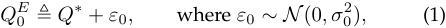

meaning that the signal _Q_ 0_E_ provides noisy information about _Q__∗_ . We refer variance _σ_ 02as_demo variance_. Similarly, sampling data also does not fully reveal _Q__∗_ , due to the inherent quality variability from data acquisition and data processing. Specifically, for the _i_ th piece of sampling data, the data consumers experience data quality _Qi__E_, which is also a noisy signal of _Q__∗_ : 

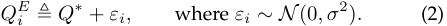

Here, _σ_2 captures the inherent data quality variability, and we refer it as _experience variance_ . It is worth noting that the experience variance _σ_2 is smaller than the demo variance _σ_ 02, which is further less than the prior variance _σ_ ˆ2 , _i.e._ , _σ_2 _≤ σ_ 02_≤σ_ˆ2.Forconvenienceofdiscussion,weassumethese three types of variances satisfy the following relation: 

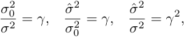

where _γ >_ 1 is referred to as a variance parameter. 

After receiving signals from both data demonstration and _n_ free sampling data, data consumers can update their perceptions of data quality in a Bayesian fashion, and get posterior data quality _Q_ ( _τ, n_ ), which will be discussed in Section 3 

**Valuation and Utility:** Data consumers normally have large valuations over the data set with high data quality, but they may differ in the way to evaluate data quality. Data consumers integrate the purchased data into various IoT applications [22], [23], and thus could have different valuations for the data set even with the same quality. To capture such heterogeneity, we introduce a parameter _θ_ for diverse preference over data quality, which is uniformly distributed in the interval [0 _,_ 1].1 In the fixed data pricing, each data consumer either purchases the whole data set, or stays with the _n_ free data samples.2 We normalize the valuation of free sampling data to be zero, and express a data consumer’s valuation when purchasing the whole data set as: 

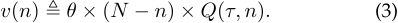

The valuation over the purchased data packages consists of two components: _private valuation θ ×_ ( _N − n_ ) and _common_ 

1. We can also use other kind of distribution for _θ_ to derive the same results. 

2. We will relax this assumption, and consider the flexible data pricing, in which data consumers can purchase any number of data, in Section 5. 

Table 1: Key notations 

|Notation|Definition|
|---|---|
|_τ_|The indicator of data demonstration de- ployment|
|_N_|Size of data packages in an IoT data set|
|_n_|Size of free sampling data|
|_p_|Selling price|
|_Q__∗_ �|The underlying data quality|
|_N_( _Q,_ˆ_σ_2)|Gaussian distribution of_Q__∗_|
|_Q_(_τ, n_) |The posterior data quality|
|_Q__E_ 0 |The signal from deploying data demonstra- tion|
|_σ_2 0 |The demo variance|
|_Q__E_ _i_|The data quality data consumers experi- enced from the_i_th piece of sampling data|
|_σ_2|The experience variance that captures the inherent data quality variability|
|_γ_|Variance parameter|
|_D_|Data demand|
|_v_|The valuation of data consumer|
|_u_|The utility of data consumer|
|_π_(_τ, n, p_)|The economic benefit of the data pricing mechanism|
|_w_(_n_)|The social benefit of_n_free sampling data|
|_K_ _δ_|The maximum volume of non-sampling data packages that data consumers can buy The discounting factor|

_valuation Q_ ( _τ, n_ ). The parameter _θ_ is the type of a data consumer, denoting her private valuation for each piece of non-sampling data. The posterior data quality _Q_ ( _τ, n_ ) can be regarded as a “common” valuation for all data consumers, which is derived from the identical data quality learning model. This linear valuation model is the simplest model for IoT data markets, and has been adopted in other markets [24]. 

The utility of a data consumer is defined as the difference between the valuation over the purchased data and the price _p_ charged by the data vendor: 

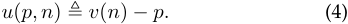

The price _p_ is zero if consumers stay with free sampling data. 

**Data Demand:** Data demand represents the percentage of data consumers buying data set in the market, and is determined by the decision variables _τ_ , _n_ , and _p_ . We denote the data demand by _D_ ( _τ, n, p,_ E[ _Q_ ( _τ, n_ )]). We note that the posterior data quality _Q_ ( _τ, n_ ) is the private information of consumers, and the data vendor only has an expectation over such information. A feasible data demand satisfies several basic properties. First, the data demand decreases with price, _i.e._ , _∂D/∂p <_ 0. Second, we require _∂D/∂Q >_ 0, meaning that data demand depends positively on the expected posterior data quality. Third, the number of free sampling data _n_ has direct and indirect effect on data demand. We derive data demand with respective to _<u>∂D</u> ∂Q n_ : _∂n_+_<u>∂D</u>_ _∂Q ∂n_,wheretheterm_∂D/∂n_andtheterm 

1536-1233 (c) 2021 IEEE. Personal use is permitted, but republication/redistribution requires IEEE permission. See http://www.ieee.org/publications_standards/publications/rights/index.html for more information. Authorized licensed use limited to: Shanghai Jiaotong University. Downloaded on December 31,2021 at 05:58:04 UTC from IEEE Xplore.  Restrictions apply. 

This article has been accepted for publication in a future issue of this journal, but has not been fully edited. Content may change prior to final publication. Citation information: DOI 10.1109/TMC.2021.3113387, IEEE Transactions on Mobile Computing 

4 

#### IEEE TRANSACTION ON MOBILE COMPUTING, VOL. XXX, NO. XXX 

( _∂D/∂Q_ ) _×_ ( _∂Q/∂n_ ) captures direct and indirect effects, respectively. If _∂D/∂n <_ 0, then we have_<u>∂D</u>_ _∂n_+_<u>∂D</u>_ _∂Q ∂∂nQ__<_0. It means the data demand decreases with the sample size _n_ . If _∂D/∂n >_ 0 and _∂D/∂n_ is sufficiently large, then the indirect effect will be stronger than the direct effect so that _<u>∂D∂n</u>_+_<u>∂D</u>_ _∂Q ∂∂nQ__>_0,andthedatademandincreaseswiththe sample size _n_ . 

**Revenue and Social Benefit:** The data vendor adopts different data selling mechanisms from Definition 1 by making a trade-off between revenue and social benefit. Here, we define the revenue as the selling price of non-sampling data multiplies the data demand, _i.e._ , _p × D_ ( _τ, n, p,_ E[ _Q_ ( _τ, n_ )]) _._ The data vendor should also take social benefit of free sampling data into account during data trading. Releasing free sampling data can attract more data consumers, helping to discover the potential applications behind data set. In addition, the released high quality data can also improve the reputation or brand cognition of the data vendor, bringing new revenue in the future. This can be analogous to some kind of “advertising” for the data set. We quantify such advantage of launching free sampling data as the concept of social benefit, and use a general concave function _w_ ( _n_ ) to represent the social benefit of _n_ free sampling data. The data vendor integrates revenue and social benefit into her optimization objective. 

### **2.2 Problem Formulation** 

In IoT data markets, the data vendor jointly optimizes the revenue and social benefit from data trading. The data vendor can extract revenue from selling non-sampling data, and obtain social benefit from releasing free sampling data. The data vendor determines three decision variables: _τ_ , _n_ , and _p_ , to maximize the weighted average of revenue and social benefit. We can formulate the design of optimal data selling mechanism in IoT data markets as: 

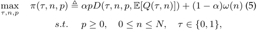

where _α_ is a weight parameter, measuring the proportion of revenue in the objective function. We call _π_ ( _τ, n, p_ ) as the economic benefit of the data pricing mechanism. It is worth to note that the problem of revenue maximization ( _i.e._ , _α_ = 1) and the problem of social benefit maximization ( _i.e._ , _α_ = 0) are nested within such formulation. 

## **3 DATA DEMAND DETERMINATION** 

To determine the data demand, we start with describing a Bayesian learning scheme for data consumers to update their perceptions over data quality after receiving signals from data demonstration and free sampling data. As discussed in Section 2.1, data consumers initially have a common prior Gaussian distribution _N_ ( _Q,_� ˆ _σ_2 ) for _Q__∗_ . The posterior perception, _i.e._ , the posterior Gaussian distribution _N_ ( _Q_ ( _τ, n_ ) _, σ_2 ( _τ, n_ )), after receiving the data demo signal 

_Q__E_ 0in(1)and_n_samplingdatasignals_{Q_ _i__E,_1_≤i≤n}_ in (2), can be given by the standard Bayesian analysis: 

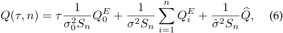

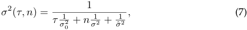

where _Sn_ = 1 _/σ_2 ( _τ, n_ ). Equation (6) describes that the posterior data quality _Q_ ( _τ, n_ ) is a weighted average of the prior data quality and the received signals. We note that _Q_ ( _τ, n_ ) is a random variable across data consumers, because data consumers may receive different signals from data demonstration and free sampling data. This learning model is simple but appealing, as it captures the heterogeneity across data consumers in perceived data quality, even they start with the identical prior distribution. Equation (7) describes how data consumer’s uncertainty over data quality declines after she has received a set of accumulated signals, implying that the greater extent of updating, _e.g._ , deploying data demo or increasing the size of free sampling data, the more accurate the posterior data quality. In the limit, the perceived quality _Q_ ( _τ, n_ ) converges to the underlying data quality _Q__∗_ . 

We next derive a specific demand function based on the purchasing behaviors of data consumers with the above Bayesian learning scheme. A data consumer will buy the data set if the utility in (4) from purchasing the whole data set is non-negative, _i.e._ , _θ ×_ ( _N − n_ ) _× Q_ ( _τ, n_ ) _− p ≥_ 0 _._ (8) 

We recall that data demand is defined as the fraction of consumers that purchase the data set, _i.e._ , the consumers with _θ_ that satisfies (8). Combining with the assumption that _θ_ is uniformly distributed in [0 _,_ 1], we can express the data demand as a function of the three decision variables, _τ_ , _n_ , and _p_ 

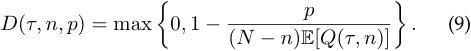

It is worth noting that the data vendor uses the expected posterior data quality E[ _Q_ ( _τ, n_ )] rather than the posterior data quality _Q_ ( _τ, n_ ). This is because the posterior data quality is private information of data consumers, and is unknown to the data vendor. We now calculate such expected posterior data quality. We assume that the data vendor knows the common prior quality distribution _Q_� and ˆ _σ_2 , data quality _Q__∗_ , demo variability _σ_ 02andexperiencevariability _σ_2 . This information can be learned by conducing standard market research, such as survey. According to equations (1) and (2), we have E � _Q_ 0 _E_ � = _Q∗_ and E � _QiE_ � = _Q∗_ for all 1 _≤ i ≤ n_ . Together with (6), we can derive 

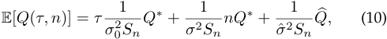

We substitute this expected data quality into (9), and obtain the data demand function. We note that this demand function satisfies the basic properties in Section 2.1. 

1536-1233 (c) 2021 IEEE. Personal use is permitted, but republication/redistribution requires IEEE permission. See http://www.ieee.org/publications_standards/publications/rights/index.html for more information. Authorized licensed use limited to: Shanghai Jiaotong University. Downloaded on December 31,2021 at 05:58:04 UTC from IEEE Xplore.  Restrictions apply. 

This article has been accepted for publication in a future issue of this journal, but has not been fully edited. Content may change prior to final publication. Citation information: DOI 10.1109/TMC.2021.3113387, IEEE Transactions on Mobile Computing 

5 

IEEE TRANSACTION ON MOBILE COMPUTING, VOL. XXX, NO. XXX 

## **4 OPTIMAL DATA SELLING MECHANISMS** 

In this section, we design the optimal data selling mechanisms for two cases. We first analyze the benchmark case, in which consumers exactly know the underlying data quality _Q__∗_ . In this case, the data demonstration and sampling mechanisms do not affect consumers’ perceptions over data quality. For convenience of discussion, we allow the size of free sampling _n_ to be any real number in (0 _, N_ ], which is justified when _N_ is large. We specify the concave function _w_ ( _n_ ) of social benefit as _β_ log( _n_ + 1), where _β_ is a weighted parameter. 

**Certain Data Quality** : When data consumers know the data quality _Q__∗_ , the data demand in (9) is 

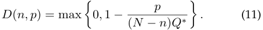

In this case, data demonstration does not affect the value of objective, and thus the data vendor only has to determine the free sampling size _n_ and the selling price _p_ to maximize 

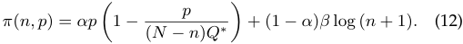

According to the first-order condition, the optimal selling price _p__∗_ ( _n_ ) for a given sampling size _n_ is: 

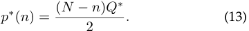

We substitute the above optimal price into the objective function in (12), and obtain 

_π_ ( _n_ ) = _α ×__<u>Q∗</u>_ 4_×_(_N −n_) + (1_−α_)_× β ×_log (_n_+ 1)_._(14) 

The corresponding derivative of _π_ ( _n_ ) is 

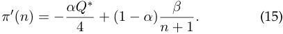

The optimal sampling size _n__∗_ satisfies the first-order condition: 

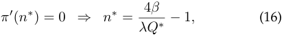

where _λ_ ≜ _α/_ (1 _− α_ ) is the ratio of weight parameters for revenue and social benefit. Substituting the optimal _n__∗_ into (13), we can express the optimal price with _λ_ and _Q__∗_ : 

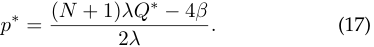

We can observe that the parameters _λ_ and _Q__∗_ have opposite effects on the optimal price in (17) and the optimal sampling size in (16). Specifically, the optimal price _p__∗_ increases in _λ_ and _Q__∗_ , while the optimal sampling size _n__∗_ decreases in _λ_ and _Q__∗_ . Furthermore, _p__∗_ increases in the size of data set _N_ , while _n__∗_ is independent on _N_ . 

The following theorem characterizes the optimal data selling mechanism in the setting with certain data quality _Q__∗_ . 

**Theorem 1.** _When data consumers know IoT data quality Q__∗_ _, there are two cut-off values for the weight ratio λ,_ i.e. _,_ 

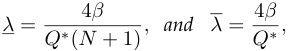

### _such that_ 

▷ _if λ ≤_ _<u>λ,</u> the data vendor would deploy free strategy,_ i.e. _, n__∗_ = _N and p__∗_ = 0 _._ 

▷ _if_ _<u>λ</u> < λ < λ, the data vendor would deploy sampling_ 4 _<u>β</u> strategy,_ i.e. _, n__∗_ = _λQ__∗−_1_, p∗_=<u>(</u>_N_<u>+1)</u> 2_λ_ _λ__<u>Q∗−</u>_4_<u>β</u>_ _._ ▷ _if λ ≥ λ, the data vendor would launch paid strategy,_ i.e. _, n__∗_ = 0 _, p__∗_ =_N_ 2_<u>Q∗</u>_ _._ 

_Proof._ The data vendor determines the optimal free sampling size _n__∗_ to maximize _π_ ( _n_ ) in (14). There are three possible solutions for this optimization problem, _i.e._ , an interior solution given in (16), two corner solutions _n__∗_ = _N_ and _n__∗_ = 0, which correspond to the three data selling strategies, respectively. The derivative function _π__′_ ( _n_ ) in (15) decreases with _n_ . Thus, for a corner solution involving _n__∗_ = _N_ , the Karush-Kuhn-Tucker conditions require that 

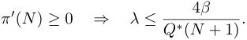

At the other extreme, when _n__∗_ = 0, the Karush-KuhnTucker conditions imply that 

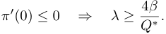

It is easy to check that in the condition _Q__∗_ (4 _Nβ_ +1)_<λ<_ _Q_ 4 _<u>β</u>__∗_,theoptimizationproblemhasonlyoneuniqueinterior solution _n__∗_ = _λQ_ 4 _<u>β</u>__∗−_1_._ Substituting _n__∗_ into (13), we can derive the corresponding optimal selling prices in these three cases. 

**Uncertain Data Quality** : When data consumers are uncertain about the data quality _Q__∗_ , we have derived the expected data demand in (9). Then, the data vendor determines _τ_ , _n_ , and _p_ to maximize 

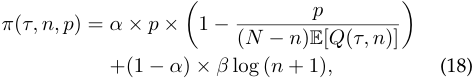

where E[ _Q_ ( _τ, n_ )] is the expected posterior data quality in (10). The data vendor can decide whether to deploy a data demo by simply comparing the values of solutions when _τ_ is 1 and 0, respectively. In the following discussion, we set _τ_ = 0, and focus on the determination of _n_ and _p_ . 

Similar to the benchmark case, we can obtain the optimal price function with respective to the sampling size _n_ 

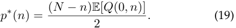

The expected posterior data quality in (10) becomes 

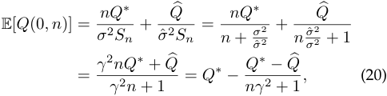

where _Sn_ = 1 _/σ_2 (0 _, n_ ) = _n/σ_2 + 1 _/σ_2 . Substituting _p__∗_ ( _n_ ) and E[ _Q_ (0 _, n_ )] back into the objective function in (18), we can rewrite it as 

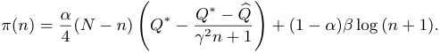

1536-1233 (c) 2021 IEEE. Personal use is permitted, but republication/redistribution requires IEEE permission. See http://www.ieee.org/publications_standards/publications/rights/index.html for more information. Authorized licensed use limited to: Shanghai Jiaotong University. Downloaded on December 31,2021 at 05:58:04 UTC from IEEE Xplore.  Restrictions apply. 

6 

This article has been accepted for publication in a future issue of this journal, but has not been fully edited. Content may change prior to final publication. Citation information: DOI 10.1109/TMC.2021.3113387, IEEE Transactions on Mobile Computing 

IEEE TRANSACTION ON MOBILE COMPUTING, VOL. XXX, NO. XXX 

The derivative of _π_ ( _n_ ) is 

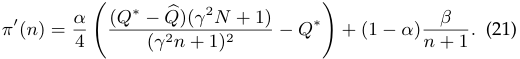

We observe that objective function _π_ ( _n_ ) has different properties when _Q_� and _Q__∗_ have different relations. Specifically, if data consumers underestimate data quality, _i.e._ , _Q_� _< Q__∗_ , _π__′_ ( _n_ ) is monotonically decreasing, and thus _π_ ( _n_ ) is strictly concave. When data consumers overestimate data quality, _i.e._ , _Q_� _≥ Q__∗_ , the property of _π_ ( _n_ ) is a bit complicated: the revenue term decreases with _n_ and is convex, while the social benefit term decreases with _n_ but is concave. We characterize the optimal _n__∗_ and _p__∗_ when consumers underestimate and overestimate data quality in Theorem 2 and Theorem 3, respectively. When _τ_ = 1, we can get the similar conclusions. To avoid repetition, we do not describe again. 

**Theorem 2.** _In the case that data consumers underestimate IoT data quality,_ i.e. _, Q_� _≤ Q__∗_ _, there are two thresholds_ 

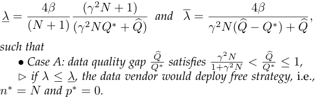

_such that_ 

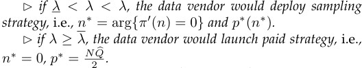

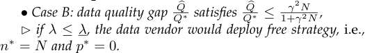

- _if λ >_ _<u>λ,</u> the data vendor would deploy sampling strategy,_ 

- i.e. _, n__∗_ = arg _{π__′_ ( _n_ ) = 0 _} and p__∗_ ( _n__∗_ ) _._ 

_Proof._ In the case of underestimate data quality, _i.e._ , _Q_� _≤ Q__∗_ , the objective function _π_ ( _n_ ) is strictly concave, because _π__′_ ( _n_ ) is a decreasing function. For such concave maximization problem, the optimal solution may stay at the interior point _n__∗_ = arg _{π__′_ ( _n_ ) = 0 _}_ , or the two extreme points: _n__∗_ = _N_ and _n__∗_ = 0. These three solutions correspond to the three data selling strategies. We derive the conditions of these three solutions by distinguishing the following two cases. 

_<u>γ</u>_2 _N •_ Case A: when 1+ _γ_2 _N__Q∗<_ _Q_ � _≤ Q__∗_ , the analysis is similar to that in Theorem 1. Considering that _π__′_ ( _n_ ) is decreasing with respective to _n_ , if the optimal solution is the corner solution _n__∗_ = _N_ , the Karush-Kuhn-Tucker (KKT) conditions imply that 

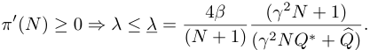

When the optimal solution stays at the other extreme point, _n__∗_ = 0, the KKT conditions require that 

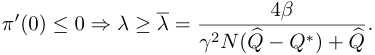

We note that this derivation holds when the denominator of _<u>γ</u>_2 _N λ_ is positive, _i.e._ , 1+ _γ_2 _N__Q∗<Q_�. 

If _<u>λ</u> < λ < λ_ , the concave maximization problem has one unique interior solution _n__∗_ = arg _{π__′_ ( _n_ ) = 0 _}_ . _•_ Case B: when _Q_� _≤_ 1+ _<u>γ</u>_2 _γN_2 _N__Q∗_, we have 

_π__′_ (0) =_α_ 4((_Q∗−Q_�)_×_(_γ_2_N_+ 1)_−Q∗_) +_β_(1_−α_)_≥_0_,_ meaning that the optimal solution would not be at point _n__∗_ = 0. Similarly, we can obtain the conditions for _n__∗_ = _N_ and _n__∗_ = arg _{π__′_ ( _n_ ) = 0 _}_ are _λ ≤_ _<u>λ</u>_ and _λ > λ_ <u>, respectively.</u> 

The above result is consistent with the insight from Theorem 1, and Theorem 2 reduces to Theorem 1 if data consumers have correct estimations over the data quality, _i.e._ , _Q_� = _Q__∗_ . 

In contrast to the underestimate case, it is complicated to characterize the conditions for the data vendor’s optimal sampling and pricing decisions analytically in the overestimate case. Nevertheless, we have the following result. 

**Theorem 3.** _In the scenario data consumers overestimate IoT data quality,_ i.e. _, Q_ � _> Q__∗_ _, the objective function π_ ( _n_ ) _is neither concave nor convex. The optimal sampling size is n__∗_ = arg max _{π_ (0) _, π_ ( _n__∗_ 1)_, π_(_n∗_ 2)_, π_(_n∗_ 3)_, π_(_N_)_}, where n_ 1_∗, n∗_ 2_, and_ _n__∗_ 3_are three interior solutions obtained by solving π′_(_n_) = 0_. The_ _corresponding optimal selling price is p__∗_ ( _n__∗_ ) _given by (19)._ 

The proof for this theorem is straightforward. From standard optimization theory [25], for a differentiable function, a global maximum either must be a local extrema (stationary point) or must lie on the boundary of the domain. We will use specific parameters derived from a real-world data set to show how to determine the optimal mechanism for this case in Section 6. 

## **5 EXTENSIONS TO DISCOUNTING SETTING** 

In previous section, data consumers have inflexible purchasing options: either staying with free data samples or buying the whole data set. In this section, we consider a flexible data selling scenario, in which consumers are allowed to buy any data subset. We derive the optimal mechanisms under various settings. We further show the result that the data vendor has no economic incentive to adopt the flexible pricing scheme. 

We extend the market model by introducing a discounting valuation function [17]. This function is motivated by the observation that data consumers always have decreasing marginal valuations over the data set in practice, which are also known as the law of marginal utility in economics. Specifically, the valuation for buying _k ∈_ [0 _, K_ ] nonsampling data packages is defined as 

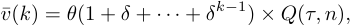

where _K_ is the maximum volume of non-sampling data packages that data consumers can buy and _δ_ is the discounting factor. In this extended discounting model, the private valuation of _k_ non-sampling data packages is _θ ×_<u>1</u> 1_−_ _−__<u>δ</u>_ _δ__k_, rather than _θ × k_ in (3). The common valuation remains to be the posterior data quality, _i.e._ , _Q_ ( _τ, n_ ). Given a unit price _p_ 0, the utility of purchasing _k_ data packages becomes 

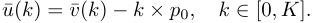

1536-1233 (c) 2021 IEEE. Personal use is permitted, but republication/redistribution requires IEEE permission. See http://www.ieee.org/publications_standards/publications/rights/index.html for more information. Authorized licensed use limited to: Shanghai Jiaotong University. Downloaded on December 31,2021 at 05:58:04 UTC from IEEE Xplore.  Restrictions apply. 

This article has been accepted for publication in a future issue of this journal, but has not been fully edited. Content may change prior to final publication. Citation information: DOI 10.1109/TMC.2021.3113387, IEEE Transactions on Mobile Computing 

IEEE TRANSACTION ON MOBILE COMPUTING, VOL. XXX, NO. XXX 

7 

related to _δ_ . We use the following theorem to characterize the optimal data selling mechanism in this scenario. 

We now derive the market demand of exactly buying _k_ data packages. The data consumer chooses to buy _k_ data packages if and only if _k_ = arg max ¯ _u_ ( _k__′_ ), which is equivalent to _u_ ¯( _k_ ) _≥ u_ ¯( _k −_ 1) and _u_ ¯( _k_ ) _≥ u_ ¯( _k_ + 1) in the discrete domain. Thus, the marginal type _θk_ can be obtained by setting _u_ ¯( _k_ ) = _u_ ¯( _k −_ 1). By simple calculation, we can get 

**Theorem 4.** _In the case that data consumers underestimate the data quality,_ i.e. _, Q_ � _≤ Q__∗_ _, the optimal data selling mechanism is n__∗_ = _N − K__∗_ ( _δ_ ) _and p__∗_ 0(_n∗, K∗_(_δ_))_._ _In the case that data consumers overestimate the data quality,_ i.e. _, Q_ � _> Q__∗_ _, the optimal data selling mechanism is n__∗_ = arg max _{π_ (0) _, π_ ( _n__∗_ _a_)_, π_(_n∗_ _b_)_, π_(_N−K∗_(_δ_))_}and_ _p__∗_ 0(_n∗, K∗_(_δ_))_,wheren_ _a__∗andn∗_ _b__aretwointeriorsolutions_ _obtained by solving π__′_ ( _n_ ) = 0 _._ 

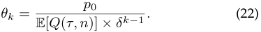

Then, the market demand for buying _k_ data packages is 

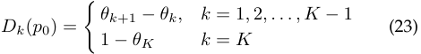

The proof is straightforward, and similar to that in Theorem 2. Due to the limitation of space, we omit the proof here. 

We note that the demand could not be negative, and then we have an additional constraint: _θK ≤_ 1. 

▶ Case B: _K__∗_ ( _δ_ ) _> N − n_ . We then have _K_ = _N − n_ and _n ∈_ [max _{_ 0 _, N − K__∗_ ( _δ_ ) _}, N_ ]. The objective function becomes 

With the demand _Dk_ ( _p_ 0) for each possible _k_ , we can determine the optimal unit price _p__∗_ 0.Indiscountingvaluation setting, the objective function in (5) becomes 

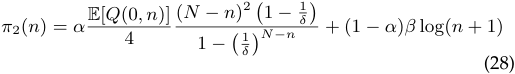

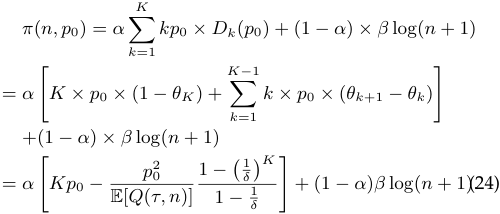

To maximize _π_ 2( _n_ ), it is not possible to obtain a closed form solution. We chose specific values for the parameters, and derive the optimal _n__∗_ and _p__∗_ in Section 6. 

We now consider whether data vendor has economic incentive to deploy the above flexible pricing scheme. We first derive the objective of the fixed pricing scheme, in which data consumers have to choose between buying the whole data set or staying at free samples, in the discounting setting. Similar to (22), we can get the marginal type 

We derive _π_ ( _n, p_ 0) with respect to _p_ 0, and set it to be zero. We then get the optimal price function with a certain _n_ 

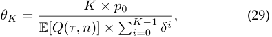

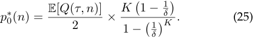

and the market demand for buying the whole data set is 

Plugging this optimal price back to (24), we get 

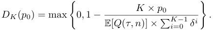

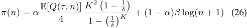

We substitute the demand into the objective function in (5) 

We note that the constraint _θK ≤_ 1 determine the value of _K_ and affect the feasible range of _n_ . Substituting (25) into (22) with _k_ = _K_ , we can get 

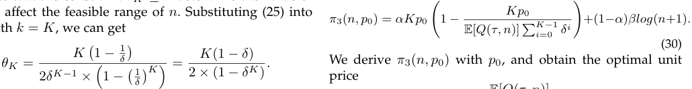

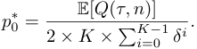

We can check that _θK_ increases with _K_ , and thus for a given _δ_ , there exists a _K__∗_ ( _δ_ ) such that _θK∗_ ( _δ_ ) _≤_ 1 and _θK∗_ ( _δ_ )+1 _>_ 1. Considering that _K_ = min _{K__∗_ ( _δ_ ) _, N − n}_ , we further distinguish two cases: 

Substituting _p__∗_ 0into(29),wegetthatthemarginaltypeis _θK_ = 1 _/_ 2, and thus the demand is _DK_ ( _p__∗_ 0)=1_/_2.Putting _p__∗_ 0back to_π_3(_n, p_0) in (30), we get 

▶ Case A: _K__∗_ ( _δ_ ) _≤ N −n_ . We then have _K_ = _K__∗_ ( _δ_ ) and _n ∈_ [0 _, N − K__∗_ ( _δ_ )]. The objective function in (26) becomes 

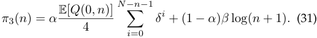

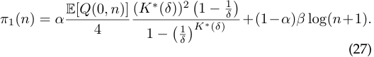

Here, we use the fact _π_ 3( _n_ ) increases with _K_ and _K ≤ N − n_ . 

The derivative of this objective function is 

We compare _π_ 3( _n_ ) of the fixed pricing scheme with the objective _π_ 1( _n_ ) and _π_ 2( _n_ ) of the flexible pricing scheme. For _π_ 1( _n_ ) in (27), we have the following relation 

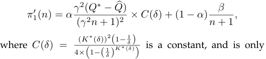

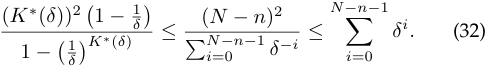

1536-1233 (c) 2021 IEEE. Personal use is permitted, but republication/redistribution requires IEEE permission. See http://www.ieee.org/publications_standards/publications/rights/index.html for more information. Authorized licensed use limited to: Shanghai Jiaotong University. Downloaded on December 31,2021 at 05:58:04 UTC from IEEE Xplore.  Restrictions apply. 

This article has been accepted for publication in a future issue of this journal, but has not been fully edited. Content may change prior to final publication. Citation information: DOI 10.1109/TMC.2021.3113387, IEEE 

Transactions on Mobile Computing 

IEEE TRANSACTION ON MOBILE COMPUTING, VOL. XXX, NO. XXX 

8 

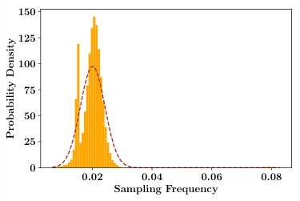

<!-- Start of picture text -->
150 125 100 75 50 25 0 0 . 02 0 . 04 0 . 06 0 . 08 Sampling Frequency ProbabilityDensity <!-- End of picture text -->

Figure 1: The probability density function of sampling frequency of taxi GPS data set. 

The first inequality follows from the monotonicity of function _G_ ( _K_ ) = _K_ (1 _− δ_ ) _/_ (1 _− δ__K_ ), and the second inequality follows from the Cauchy-Schwarz inequality. By this result, we can derive that _π_ 1( _n_ ) _≤ π_ 3( _n_ ) for any given _n_ . For _π_ 2( _n_ ) in (28), we can use the second inequality in (32) to get the similar result that _π_ 2( _n_ ) _≤ π_ 3( _n_ ) for any _n_ . From the above analysis, we have max _{π_ 1( _n_ 1_∗_)_, π_2(_n∗_ 2)_}≤π_3(_n∗_ 3),where _n__∗_ 1,_n∗_ 2and_n∗_ 3aretheoptimalsamplingsizesinthecor- responding scenarios, respectively. Thus, we can conclude that the economic objective of the flexible pricing scheme is less than that of the inflexible pricing scheme. Our result demonstrates that bundling mechanism [26] could be more profitable in IoT data markets. We characterize this result in the following theorem. 

**Theorem 5.** _In discounting valuation setting, the fixed data pricing scheme has more economic benefit, compared with the flexible data pricing scheme. Thus, the data vendor has no economic incentive to launch the flexible data pricing scheme._ 

## **6 EVALUATION RESULTS** 

In this section, we report the evaluation results of the designed optimal data selling mechanisms on a real-world GPS trace dataset collected from Shanghai taxis in 2007 [27]. 

**Taxi GPS Dataset** : The data set consists of _N_ = 28 data packages, where each represents one day of data collected in February 2007. Each data package involves around 2000 files, each of which is collected by one taxi on the corresponding day. Each file further contains around 2000 messages, which records the information of date, time, taxi ID, GPS location and whether there are passengers in taxi. 

We adopt _sampling frequency_ , the number of messages recorded every second, as data quality in our evaluation. Due to the unreliable wireless communication, there is high data loss during IoT data acquisition, and thus the metric of sampling frequency is critical for data consumers. For the above data set, we can calculate the sampling frequency of each file. The data quality of each data package is defined as the average sampling frequency of files within this data package. The data quality of the whole data set, _i.e._ , _Q__∗_ , is the average data quality of all data packages. We assume the data quality of files are independent identical random variables. According to Central Limit Theorem, the data quality of the whole data set follows a normal distribution. We illustrate the probability density function of the sampling frequency of our data set in Figure 1. We can calculate 

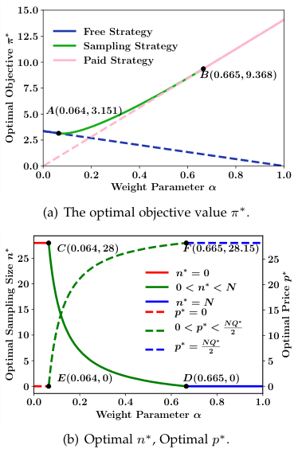

<!-- Start of picture text -->
15 . 0 12 . 5 Free Strategy Sampling Strategy 10 . 0 Paid Strategy B (0 . 665 ,  9 . 368) 7 . 5 5 . 0 A (0 . 064 ,  3 . 151) 2 . 5 0 . 0 0 . 0 0 . 2 0 . 4 0 . 6 0 . 8 1 . 0 Weight Parameter α (a) The optimal objective value  π ∗ . C (0 . 064 ,  28) F  (0 . 665 ,  28 . 15) 25 25 n ∗ = 0 20 0 < n ∗ < N 20 n ∗ = N 15 p ∗ = 0 15 10 0 < p ∗ < N 2 Q∗ 10 p ∗ = N 2 Q∗ 5 5 E (0 . 064 ,  0) D (0 . 665 ,  0) 0 0 0 . 0 0 . 2 0 . 4 0 . 6 0 . 8 1 . 0 Weight Parameter α (b) Optimal  n ∗ , Optimal  p ∗ . OptimalObjective ∗π OptimalPrice ∗p OptimalSamplingSize ∗n <!-- End of picture text -->

Figure 2: Optimal data selling strategy ( _π__∗_ , _n__∗_ , _p__∗_ ) in certain data quality case. 

the data quality _Q__∗_ as 0 _._ 02011 message per second, with a variance 2 _._ 6075 _×_ 10_−_5 . For convenience of discussion, we normalize the mean to _Q__∗_ = 2 _._ 011 and the variance to _σ_ 02= 2_._6075_×_10_−_4. 

In the following discussion, we investigate the optimal data selling mechanisms under certain data quality and uncertain data quality settings, respectively. Since it is straightforward to check whether launching data demonstration is optimal, we omit the evaluation results of data demo strategy. 

### **6.1 Certain Data Quality** 

In Figure 2(a), given different weight parameters _α_ , the blue, green, red lines correspond to the optimal _π__∗_ for free, sampling, paid strategies, respectively. We use solid lines to denote the optimal data selling strategy. The evaluation results confirm our analysis in Theorem 1. With _N_ = 28, _Q__∗_ = 2 _._ 011 and _β_ = 1, the two cut-off values for the weight ratio _λ_ are _<u>λ</u>_ = 0 _._ 0686 and _λ_ = 1 _._ 989, and the corresponding weight parameters are _<u>α</u>_ = 0 _._ 0642 and _<u>α</u>_ = 0 _._ 665, respectively. We can observe from Figure 2(a) that if _α_ is less than _<u>α</u>_ <u>,</u> _i.e._ , _λ ≤_ _<u>λ</u>_ <u>, free strategy is the optimal</u> strategy; for an intermediate level of _α_ , _i.e._ , _<u>α</u> < α <_ _<u>α</u>_ <u>,</u> the sampling strategy that jointly considers revenue and social benefit is optimal. If _α_ is greater than _<u>α</u>_ <u>,</u> the paid strategy becomes optimal. We also denote the two turning points, _i.e._ , the tangent points of sampling line with free line and paid line, as points A and B in Figure 2(a). Figure 2(b) shows the optimal sampling size _n__∗_ and price _p__∗_ with different weight parameters _α_ . The reason for this trend is that the data vendor prefers to generate revenue and cares less about social benefit when _α_ becomes large. 

1536-1233 (c) 2021 IEEE. Personal use is permitted, but republication/redistribution requires IEEE permission. See http://www.ieee.org/publications_standards/publications/rights/index.html for more information. Authorized licensed use limited to: Shanghai Jiaotong University. Downloaded on December 31,2021 at 05:58:04 UTC from IEEE Xplore.  Restrictions apply. 

This article has been accepted for publication in a future issue of this journal, but has not been fully edited. Content may change prior to final publication. Citation information: DOI 10.1109/TMC.2021.3113387, IEEE Transactions on Mobile Computing 

IEEE TRANSACTION ON MOBILE COMPUTING, VOL. XXX, NO. XXX 

9 

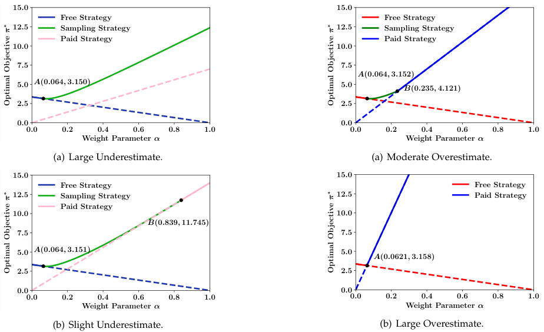

<!-- Start of picture text -->
15 . 0 15 . 0 Free Strategy Free Strategy 12 . 5 Sampling Strategy 12 . 5 Sampling Strategy Paid Strategy Paid Strategy 10 . 0 10 . 0 7 . 5 7 . 5 A (0 . 064 ,  3 . 152) 5 . 0 A (0 . 064 ,  3 . 150) 5 . 0 B (0 . 235 ,  4 . 121) 2 . 5 2 . 5 0 . 0 0 . 0 0 . 0 0 . 2 0 . 4 0 . 6 0 . 8 1 . 0 0 . 0 0 . 2 0 . 4 0 . 6 0 . 8 1 . 0 Weight Parameter α Weight Parameter α (a) Large Underestimate. (a) Moderate Overestimate. 15 . 0 15 . 0 Free Strategy Free Strategy 12 . 5 Sampling Strategy 12 . 5 Paid Strategy Paid Strategy 10 . 0 10 . 0 B (0 . 839 ,  11 . 745) 7 . 5 7 . 5 5 . 0 A (0 . 064 ,  3 . 151) 5 . 0 A (0 . 0621 ,  3 . 158) 2 . 5 2 . 5 0 . 0 0 . 0 0 . 0 0 . 2 0 . 4 0 . 6 0 . 8 1 . 0 0 . 0 0 . 2 0 . 4 0 . 6 0 . 8 1 . 0 Weight Parameter α Weight Parameter α (b) Slight Underestimate. (b) Large Overestimate. OptimalObjective ∗π OptimalObjective ∗π OptimalObjective ∗π OptimalObjective ∗π <!-- End of picture text -->

Figure 3: Optimal _π__∗_ in underestimate data quality case. 

Figure 4: Optimal _π__∗_ in overestimate data quality case. 

### **6.2 Uncertain Data Quality** 

We first consider the case that data consumers underestimate data quality, _i.e._ , _Q_� _≤ Q__∗_ . We set _γ_ = 2 and _β_ = 1 in this set of evaluation. The threshold of data quality gap _<u>γ</u>_2 _N_ cases:timate1+ _γ_2 _N_ 0largeis _._ 9910_._991 underestimate _<_. _QQ_We �_∗_.Forrecallthethat _Q_case _<u>Q</u>_ �_∗≤_inof0Theorem_._large991andunderestimate,2slightthereunderes-aretwowe set _Q_� to be 1, and plot _π__∗_ in Figure 3(a). From the figure, we can find that the paid strategy would no longer be optimal when consumers underestimate data quality too much. In this case, data vendor has to offer free samples to enhance consumers’ perceptions over data quality, attracting them to purchase data set. 

For the case of slight underestimation, we set _Q_� to be 2, and plot the optimal _π__∗_ in Figure 3(b). We observe that all the three different mechanisms could have chance to be the optimal mechanism, which is similar to that in certain data quality case. One interesting observation is that the paid strategy, which does not provide any free sample, could still be the optimal strategy in some scenarios (when _α_ locates in <u>[</u> _<u>α,</u>_ 1]). This implies that the data vendor may not release free samples to revise the perceptions of data consumers if the extent of underestimate is not too large. 

We then evaluate the optimal data selling strategy when data consumers overestimate data quality, and report _π__∗_ for the cases of moderate overestimate _Q_� = 2 _._ 5 and large overestimate _Q_� = 7 _._ 173 in Figure 4(a) and Figure 4(b), respectively. From Theorem 3, the optimal _n__∗_ should be chosen from five candidates. In our evaluation setting, there is only one particular valid candidate among _n_ 1_∗, n∗_ 2_, n∗_ 3, and the other two are either not real number or fall out of [0 _, N_ ]. As shown in Figure 4(a), the interval of _α_ , in which sampling 

strategy is optimal, _i.e._ , <u>[</u> _<u>a, a</u>_ ], becomes small if the extent of overestimate increases, and reduces to empty if _Q_� exceeds the threshold 7 _._ 173. When data consumers overestimate data quality, the data vendor has less incentive to offer free sampling to revise their perceptions, and would like to charge more data packages to extract revenue. Figure 4(b) shows that when the data vendor cares much about social benefit, she would adopt free strategy; otherwise, she would just deploy the paid strategy towards those optimistic consumers to extract high revenue. Sampling strategy would no longer be optimal in this case. Based on these discussions, we can derive the first conflict between data consumers and the data vendor: _the data vendor would not like to release free samples to revise data consumers’ mistaken perceptions over data quality in the extreme overestimate case._ 

### **Discounting Valuation** 

### **6.3** 

Following the principle in Section 5, we derive the optimal data selling mechanism and the optimal objective _π__∗_ under two different discounting factors _δ_ = 0 _._ 98 and _δ_ = 0 _._ 9. For a fixed _δ_ , we can observe the similar results for certain data quality case and uncertain data quality case. Here, we only report the evaluation results of the overestimate data quality case with two different discounting factors in Figure 5(a). From Figure 5(a), we can find that the sampling strategy could be optimal in more scenarios when _δ_ is smaller. This is because the data vendor would extract less revenue from charging non-sampling data if consumers have larger discount, _e.g._ , _δ_ = 0 _._ 9, and she would like to release more free samples to obtain social benefit in this case. Figure 5(a) also shows that the objective value _π__∗_ in the case of _δ_ = 0 _._ 98 is significantly larger than that in the case of _δ_ = 0 _._ 9, which 

1536-1233 (c) 2021 IEEE. Personal use is permitted, but republication/redistribution requires IEEE permission. See http://www.ieee.org/publications_standards/publications/rights/index.html for more information. Authorized licensed use limited to: Shanghai Jiaotong University. Downloaded on December 31,2021 at 05:58:04 UTC from IEEE Xplore.  Restrictions apply. 

This article has been accepted for publication in a future issue of this journal, but has not been fully edited. Content may change prior to final publication. Citation information: DOI 10.1109/TMC.2021.3113387, IEEE 

Transactions on Mobile Computing 

IEEE TRANSACTION ON MOBILE COMPUTING, VOL. XXX, NO. XXX 

10 

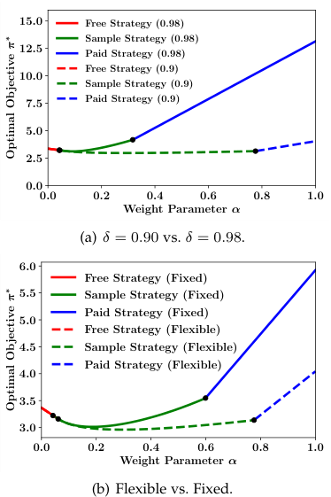

<!-- Start of picture text -->
15 . 0 Free Strategy (0.98) Sample Strategy (0.98) 12 . 5 Paid Strategy (0.98) Free Strategy (0.9) 10 . 0 Sample Strategy (0.9) 7 . 5 Paid Strategy (0.9) 5 . 0 2 . 5 0 . 0 0 . 0 0 . 2 0 . 4 0 . 6 0 . 8 1 . 0 Weight Parameter α (a) δ = 0 . 90 vs.  δ = 0 . 98. 6 . 0 Free Strategy (Fixed) 5 . 5 Sample Strategy (Fixed) 5 . 0 Paid Strategy (Fixed) Free Strategy (Flexible) 4 . 5 Sample Strategy (Flexible) Paid Strategy (Flexible) 4 . 0 3 . 5 3 . 0 0 . 0 0 . 2 0 . 4 0 . 6 0 . 8 1 . 0 Weight Parameter α (b) Flexible vs. Fixed. OptimalObjective ∗π OptimalObjective ∗π <!-- End of picture text -->

Figure 5: Optimal _π__∗_ in overestimate data quality case with discounting valuation. 

demonstrates that the discounting factor has a high impact on the revenue. 

In Figure 5(b), we describe the optimal objective values _π__∗_ of the flexible pricing and the fixed pricing when _δ_ is 0 _._ 9. From Figure 5(b), we can see that the fixed pricing outperforms the flexible pricing in all cases. which is consistent with the results in Theorem 5. We can derive the second conflict between data consumers and the data vendor: _although data consumers can benefit from the flexible pricing scheme, the data vendor has no economic incentive to deploy such scheme._ To facilitate the sustainable and healthy trading of IoT data, it is necessary to deploy market regulations to eliminate these two conflicts. 

## **7 RELATED WORK** 

In this section, we briefly review the related work about data markets and pricing mechanisms for information good. 

**Data Market** : Different types of data, _e.g._ , personal data, IoT data and image data, have been collected and monetized by online service providers [28], [29], [30], [31], [32]. The seminal paper of data marketplaces outlines key challenges and potential research opportunities in this direction [33]. Koutris _et al._ [14], [15] designed a query-based data pricing framework to replace the current inflexible data pricing. Jung _et al._ [34] proposed a set of countable protocols for big data trading among dishonest consumers. In paper [35], Li _et al._ adopted information entropy to price data. Mehta _et al._ designed pricing policies for the data set with rowcolumn format [36]. Agarwal _et al._ proposed matching mechanism to efficiently buy and sell training data for machine learning tasks [37]. Theses approaches determine the price of data based on information and determinacy. 

However, the focus of our work is the widespread data APIs pricing [16], which determines price only based on the number of API calls. Our results in Theorem 5 shows that the flexible pricing, such as the query-based pricing, achieves less economic benefit, compared with the fixed price mechanism. 

There are other issues related to data sharing and trading, such as privacy preserving [38], [39], [40], data quality management [41], revenue sharing [42], [43], and data usage policies [44]. 

**Information Pricing** : Pricing information or digital goods have been widely studied in economics [17], [45], [46]. The book [47] distilled the pricing rules for information services. There are two effective mechanisms for pricing information services in the literature. One is bundling, which sells a large number of information goods for a fixed price. Geng _et al._ provided guidelines to bundling design in the case that consumers have decreasing valuations [17]. This discounting valuation model is similar to that considered in this work. Our results demonstrate that bundling is also a profitable selling mechanism in the uncertain data quality environment. The other strategy is versioning, which provides multiple versions for one product to satisfy the diverse demands of data consumers. As observed in [45], manufactures may intentionally damage their goods to enable price discrimination, leading to Pareto improvement. Bhargava and Choudhary derived the optimal versioning condition [46]. We observe that in practical data markets, the data vendor also launches different versions for data commodity, such as different numbers of available API calls. In our further work, we would investigate the effect of versioning on designing data selling mechanism. 

Information pricing is also a well-explored subject IoT network and wireless network [48], [49], [50], [51], [52]. Niyato _et al._ [48] studied the economics of IoT and presented the information economics approaches. Finally, they proposed an economic model based on game theory to study the price competition of IoT sensing services. Alsheikh _et al._ [49] studied data pricing in IoT data markets from a machine learning perspective. They presented IoT market models and optimal pricing schemes of selling IoT services for standalone sales or bundled sales. In standalone sales, they maximized the profit of service providers by optimizing the size of bought data and service subscription fees, while in bundled sales, they aimed to maximize the total profit of cooperative service providers. Wu _et al._ [53] captured the unique economic characteristics of IoT data and presented a novel data model from the information design perspective. They also proposed data pricing mechanisms to maximize their revenue. Niyato _et al._ [54] designed a smart data pricing approach to achieve flexible and efficient data management in IoT. Moreover, they proposed a pricing mechanism to determine the data price for IoT service providers. In addition, some surveys summarized the research status of data pricing and pricing models in IoT [55], [56]. 

For the rising of data marketplace, survey [57] discusses a lot related issues. [14], [58] work out the QueryMarket system intending to address the inflexibility problem, while [59] purpose an arbitrage-free pricing scheme to deal with the simplicity issues. More details of query-based pricing with API can be seen in [15], [60]. Data market is 

1536-1233 (c) 2021 IEEE. Personal use is permitted, but republication/redistribution requires IEEE permission. See http://www.ieee.org/publications_standards/publications/rights/index.html for more information. Authorized licensed use limited to: Shanghai Jiaotong University. Downloaded on December 31,2021 at 05:58:04 UTC from IEEE Xplore.  Restrictions apply. 

This article has been accepted for publication in a future issue of this journal, but has not been fully edited. Content may change prior to final publication. Citation information: DOI 10.1109/TMC.2021.3113387, IEEE Transactions on Mobile Computing 

11 

#### IEEE TRANSACTION ON MOBILE COMPUTING, VOL. XXX, NO. XXX 

tightly related to cloud computing [33] as well as privacy issues [30], [61], [62]. We also investigate several works [63], [64] where data market appearing in mobile devices which is also another interesting topic regarding data marketing. 

## **8 CONCLUSION** 

In this paper, we have considered the optimal data selling mechanisms for IoT data exchange. By modeling IoT data quality as a Gaussian random variable and adopting Bayesian learning scheme to update perceptions over data quality, we can obtain a specific data demand function, and then derive the optimal data selling mechanisms for the scenarios when data consumers underestimate, correctly estimate and overestimate the data quality. Our theoretical analyses and evaluation results show that the data vendor would not release free sampling data for optimistic data consumers to revise their incorrect perceptions. Furthermore, the data vendor has no economic incentive to adopt flexible pricing schemes, which explains the current widely adopted fixed pricing schemes in data markets. 

## **ACKNOWLEDGMENT** 

This work was supported in part by National Key RD Program of China No. 2020YFB1707900, in part by China NSF grant No. 62025204, 62072303, 61972252, 61902248, and 61972254, in part by Alibaba Group through Alibaba Innovation Research Program, in part by Shanghai Science and Technology fund 20PJ1407900, and in part by Tencent Rhino Bird Key Research Project. The opinions, findings, conclusions, and recommendations expressed in this paper are those of the authors and do not necessarily reflect the views of the funding agencies or the government. 

## **REFERENCES** 

- [1] “Quandl,” https://www _._ quandl _._ com/. 

- [2] “Xignite,” http://www _._ xignite _._ com/. 

- [3] “Factual,” http://www _._ factual _._ com/. 

- [4] “Aggdata,” https://www _._ aggdata _._ com/. 

- [5] “Uber,” https://www _._ uber _._ com/. 

- [6] “Infochimps.” http://www _._ infochimps _._ com/. 

- [7] “Big data exchange.” http://www _._ bigdataexchange _._ com/. [8] “Internet of Things Data Marketplace by IOTA,” https:// data _._ iota _._ org/. 

- [9] “Windows azure marketplace.” https://datamarket _._ azure _._ com/. [10] “Datasift: Pylon facebook api.” http://datasift _._ com/products/ pylon-for-facebook-topic-data/. 

- [11] “Gnip.” https://gnip _._ com/products/realtime/firehose/. [12] “Yelp.” https://www _._ yelp _._ com/developers/display requirements/. 

- [13] “Databroker dao,” https://databrokerdao _._ com/. 

- [14] P. Koutris, P. Upadhyaya, M. Balazinska, B. Howe, and D. Suciu, “Toward practical query pricing with querymarket,” in _SIGMOD_ , 2013. 

- [15] ——, “Query-based data pricing,” _Journal of the ACM_ , vol. 62, no. 5, pp. 43:1–43:44, 2015. 

- [16] P. Upadhyaya, M. Balazinska, and D. Suciu, “Price-optimal querying with data apis,” _Proceedings of the VLDB Endowment_ , pp. 1695– 1706, 2016. 

- [17] X. Geng, M. B. Stinchcombe, and A. B. Whinston, “Bundling information goods of decreasing value,” _Management Science_ , vol. 51, no. 4, pp. 662–667, 2005. 

- [18] A. Deshpande, C. Guestrin, S. R. Madden, J. M. Hellerstein, and W. Hong, “Model-driven data acquisition in sensor networks,” in _VLDB_ , 2004. 

- [19] Z. Zheng, Y. Peng, F. Wu, S. Tang, and G. Chen, “An online pricing mechanism for mobile crowdsensing data markets,” in _Mobihoc_ , 2017. 

- [20] A. Krause, A. Singh, and C. Guestrin, “Near-optimal sensor placements in gaussian processes: Theory, efficient algorithms and empirical studies,” _Journal of Machine Learning Research_ , vol. 9, pp. 235–284, 2008. 

- [21] W. Du, Z. Xing, M. Li, B. He, L. H. C. Chua, and H. Miao, “Optimal sensor placement and measurement of wind for water quality studies in urban reservoirs,” in _IPSN_ , 2014. 

- [22] S. Wang, T. He, D. Zhang, Y. Liu, and S. H. Son, “Towards efficient sharing: A usage balancing mechanism for bike sharing systems,” in _WWW_ , 2019. 

- [23] G. Ranjan, H. Zang, Z.-L. Zhang, and J. Bolot, “Are call detail records biased for sampling human mobility?” _SIGMOBILE Mob. Comput. Commun. Rev._ , vol. 16, no. 3, pp. 33–44, Dec. 2012. 

- [24] A. Smolin, “Disclosure and pricing of attributes,” https:// ssrn _._ com/abstract=3047028, Tech. Rep., 2017. 

- [25] S. Boyd and L. Vandenberghe, _Convex optimization_ . Cambridge university press, 2004. 

- [26] Y. Bakos and E. Brynjolfsson, “Bundling information goods: Pricing, profits, and efficiency,” _Management Science_ , vol. 45, no. 12, pp. 1613–1630, 1999. 

- [27] “Suvnet data set collected by shanghai jiao tong university,” http: //wirelesslab _._ sjtu _._ edu _._ cn/taxi <u>trace data</u> _._ html. 

- [28] W. Mao, Z. Zheng, and F. Wu, “Pricing for revenue maximization in iot data markets: An information design perspective,” in _INFOCOM_ , 2019. 

- [29] J. Staiano, N. Oliver, B. Lepri, R. de Oliveira, M. Caraviello, and N. Sebe, “Money walks: A human-centric study on the economics of personal mobile data,” in _UbiComp_ , 2014. 

- [30] J. P. Carrascal, C. Riederer, V. Erramilli, M. Cherubini, and R. de Oliveira, “Your browsing behavior for a big mac: Economics of personal information online,” in _WWW_ , 2013. 

- [31] J.-M. Bohli, C. Sorge, and D. Westhoff, “Initial observations on economics, pricing, and penetration of the internet of things market,” _ACM SIGCOMM Computer Communication Review_ , vol. 39, no. 2, pp. 50–55, 2009. 

- [32] L. Zhang, Y. Li, X. Xiao, X.-Y. Li, J. Wang, A. Zhou, and Q. Li, “Crowdbuy: Privacy-friendly image dataset purchasing via crowdsourcing,” in _INFOCOM_ , 2018. 

- [33] M. Balazinska, B. Howe, and D. Suciu, “Data markets in the cloud: An opportunity for the database community,” _Proceedings of the VLDB Endowment_ , vol. 4, no. 12, pp. 1482–1485, 2011. 

- [34] T. Jung, X. Y. Li, W. Huang, J. Qian, L. Chen, J. Han, J. Hou, and C. Su, “Accounttrade: Accountable protocols for big data trading against dishonest consumers,” in _INFOCOM_ , 2017. 

- [35] X. Li, J. Yao, X. Liu, and H. Guan, “A first look at information entropy-based data pricing,” in _ICDCS_ , 2017. 

- [36] S. Mehta, M. Dawande, G. Janakiraman, and V. Mookerjee, “How to sell a dataset? pricing policies for data monetization,” in _EC_ , 2019. 

- [37] A. Agarwal, M. Dahleh, and T. Sarkar, “A marketplace for data: An algorithmic solution,” in _EC_ , 2019. 

- [38] F. Li, Z. Sun, A. Li, B. Niu, H. Li, and G. Cao, “Hideme: Privacypreserving photo sharing on social networks,” in _INFOCOM_ , 2019. 

- [39] M. Wu, D. Ye, J. Ding, Y. Guo, R. Yu, and M. Pan, “Incentivizing differentially private federated learning: A multi-dimensional contract approach,” _IEEE Internet of Things Journal_ , 2021. 

- [40] D. Ye, R. Yu, M. Pan, and Z. Han, “Federated learning in vehicular edge computing: A selective model aggregation approach,” _IEEE Access_ , vol. 8, pp. 23 920–23 935, 2020. 

- [41] T. Luo, J. Huang, S. S. Kanhere, J. Zhang, and S. K. Das, “Improving iot data quality in mobile crowd sensing: A cross validation approach,” _IEEE Internet of Things Journal_ , vol. 6, no. 3, pp. 5651– 5664, 2019. 

- [42] A. Ghorbani and J. Zou, “Data shapley: Equitable valuation of data for machine learning,” in _ICML_ , 2019. 

- [43] R. Jia, D. Dao, B. Wang, F. A. Hubis, N. Hynes, N. M. G¨urel, B. Li, C. Zhang, D. Song, and C. J. Spanos, “Towards efficient data valuation based on the shapley value,” in _AISTATS_ , 2019. 

- [44] P. Upadhyaya, M. Balazinska, and D. Suciu, “Automatic enforcement of data use policies with datalawyer,” ser. SIGMOD, 2015. 

- [45] R. J. Deneckere and R. Preston McAfee, “Damaged goods,” _Journal of Economics & Management Strategy_ , vol. 5, no. 2, pp. 149–174, 1996. 

1536-1233 (c) 2021 IEEE. Personal use is permitted, but republication/redistribution requires IEEE permission. See http://www.ieee.org/publications_standards/publications/rights/index.html for more information. Authorized licensed use limited to: Shanghai Jiaotong University. Downloaded on December 31,2021 at 05:58:04 UTC from IEEE Xplore.  Restrictions apply. 

This article has been accepted for publication in a future issue of this journal, but has not been fully edited. Content may change prior to final publication. Citation information: DOI 10.1109/TMC.2021.3113387, IEEE Transactions on Mobile Computing 

12 

IEEE TRANSACTION ON MOBILE COMPUTING, VOL. XXX, NO. XXX 

- [46] H. K. Bhargava and V. Choudhary, “Research note—when is versioning optimal for information goods?” _Management Science_ , vol. 54, no. 5, pp. 1029–1035, 2008. 

- [47] C. Shapiro and H. R. Varian, _Information rules: a strategic guide to the network economy_ . Harvard Business Press, 1998. 

- [48] D. Niyato, X. Lu, P. Wang, D. I. Kim, and Z. Han, “Economics of internet of things: An information market approach,” _IEEE Wireless Communications_ , vol. 23, no. 4, pp. 136–145, 2016. 

- [49] M. A. Alsheikh, D. T. Hoang, D. Niyato, D. Leong, P. Wang, and Z. Han, “Optimal pricing of internet of things: A machine learning approach,” _IEEE Journal on Selected Areas in Communications_ , vol. 38, no. 4, pp. 669–684, 2020. 

**Zun Li** is pursuing a PhD degree in computer science at University of Michigan, Ann Arbor. His research focuses on the interfaces between AI, economics and complex systems. He had been working as a software engineer intern at Google. He received a B.S. degree in computer science from Shanghai Jiaotong University. 

- [50] D. Niyato, M. A. Alsheikh, P. Wang, D. I. Kim, and Z. Han, “Market model and optimal pricing scheme of big data and internet of things (iot),” in _2016 IEEE International Conference on Communications (ICC)_ . IEEE, 2016, pp. 1–6. 

- [51] V. Haghighatdoost, S. Khorsandi, and H. Ahmadi, “Fair pricing in heterogeneous internet of things wireless access networks using crowdsourcing,” _IEEE Internet of Things Journal_ , 2020. 

- [52] A. Ghosh and S. Sarkar, “Pricing for profit in internet of things,” _IEEE Transactions on Network Science and Engineering_ , vol. 6, no. 2, pp. 130–144, 2018. 

- [53] W. Mao, Z. Zheng, and F. Wu, “Pricing for revenue maximization in iot data markets: An information design perspective,” in _IEEE INFOCOM 2019-IEEE Conference on Computer Communications_ . IEEE, 2019, pp. 1837–1845. 

- [54] D. Niyato, D. T. Hoang, N. C. Luong, P. Wang, D. I. Kim, and Z. Han, “Smart data pricing models for the internet of things: a bundling strategy approach,” _IEEE Network_ , vol. 30, no. 2, pp. 18– 25, 2016. 

- [55] S. Sen, C. Joe-Wong, S. Ha, and M. Chiang, “A survey of smart data pricing: Past proposals, current plans, and future trends,” _Acm computing surveys (csur)_ , vol. 46, no. 2, pp. 1–37, 2013. 

- [56] N. C. Luong, D. T. Hoang, P. Wang, D. Niyato, D. I. Kim, and Z. Han, “Data collection and wireless communication in internet of things (iot) using economic analysis and pricing models: A survey,” _IEEE Communications Surveys & Tutorials_ , vol. 18, no. 4, pp. 2546–2590, 2016. 

- [57] F. Schomm, F. Stahl, and G. Vossen, “Marketplaces for data: an initial survey,” _ACM SIGMOD Record_ , vol. 42, no. 1, pp. 15–26, 2013. 

- [58] P. Koutris, P. Upadhyaya, M. Balazinska, B. Howe, and D. Suciu, “Querymarket demonstration: Pricing for online data markets,” ser. VLDB, 2012. 

**Zhenzhe Zheng** is an assistant professor in the Department of Computer Science and Engineering, Shanghai Jiao Tong University. He received the B.E. in Software Engineering from Xidian University, in 2012, and the M.S. degree and the Ph.D. degree in Computer Science and Engineering from Shanghai Jiao Tong University, in 2015 and 2018, respectively. He has visited the University of Illinois at Urbana-Champaign (UIUC) as a Post Doc Research Associate from 2018 to 2019. His research interests include game theory and mechanism design, networking and mobile computing, and online marketplaces. He is a recipient of the China Computer Federation (CCF) Excellent Doctoral Dissertation Award 2018, Google Ph.D. Fellowship 2015 and Microsoft Research Asia Ph.D. Fellowship 2015. He has served as the member of technical program committees of several academic conferences, such as MobiHoc, AAAI, MSN, IoTDI and etc. He is a member of the ACM, IEEE, and CCF. For more information, please visit https://zhengzhenzhe220.github.io/ 

- [59] B.-R. Lin and D. Kifer, “On arbitrage-free pricing for general data queries,” _Proceedings of the VLDB Endowment_ , vol. 7, no. 9, pp. 757– 768, 2014. 

- [60] P. Upadhyaya, M. Balazinska, and D. Suciu, “Price-optimal querying with data apis,” _Proceedings of the VLDB Endowment_ , vol. 9, no. 14, pp. 1695–1706, 2016. 

- [61] C. Riederer, V. Erramilli, A. Chaintreau, B. Krishnamurthy, and P. Rodriguez, “For sale : Your data: By : You,” ser. HotNets, 2011. 

- [62] M. Mun, S. Hao, N. Mishra, K. Shilton, J. Burke, D. Estrin, M. Hansen, and R. Govindan, “Personal data vaults: A locus of control for personal data streams,” ser. Co-NEXT, 2010. 

- [63] S. Ha, S. Sen, C. Joe-Wong, Y. Im, and M. Chiang, “Tube: Timedependent pricing for mobile data,” pp. 247–258, 2012. 

- [64] J. Staiano, N. Oliver, B. Lepri, R. de Oliveira, M. Caraviello, and N. Sebe, “Money walks: A human-centric study on the economics of personal mobile data,” in _UbiComp_ , 2014. 

**Qinya Li** received her B.S. degree in Computer Science and Engineering from Northeastern University, P.R.China in 2015, and the Ph.D. degree in Computer Science and Engineering from Shanghai Jiao Tong University in 2020. Her research interests include mobile computing, mobile crowdsourcing, and algorithmic game theory and its applications. 

**Fan Wu** is a professor in the Department of Computer Science and Engineering, Shanghai Jiao Tong University. He received his B.S. in Computer Science from Nanjing University in 2004, and Ph.D. in Computer Science and Engineering from the State University of New York at Buffalo in 2009. He has visited the University of Illinois at Urbana-Champaign (UIUC) as a Post Doc Research Associate. His research interests include wireless networking and mobile computing, data management, algorithmic network economics, and privacy preservation. He has published more than 200 peer-reviewed papers in technical journals and conference proceedings. He is a recipient of the first class prize for Natural Science Award of China Ministry of Education, China National Fund for Distinguished Young Scientists, ACM China Rising Star Award, CCFTencent “Rhinoceros bird” Outstanding Award, and CCF-Intel Young Faculty Researcher Program Award. He has served as an associate editor of IEEE Transactions on Mobile Computing and ACM Transactions on Sensor Networks, an area editor of Elsevier Computer Networks, and as the member of technical program committees of more than 100 academic conferences. For more information, please visit http://www.cs.sjtu.edu.cn/�fwu/. 

1536-1233 (c) 2021 IEEE. Personal use is permitted, but republication/redistribution requires IEEE permission. See http://www.ieee.org/publications_standards/publications/rights/index.html for more information. Authorized licensed use limited to: Shanghai Jiaotong University. Downloaded on December 31,2021 at 05:58:04 UTC from IEEE Xplore.  Restrictions apply. 

Transactions on Mobile Computing 

IEEE TRANSACTION ON MOBILE COMPUTING, VOL. XXX, NO. XXX 

13 

This article has been accepted for publication in a future issue of this journal, but has not been fully edited. Content may change prior to final publication. Citation information: DOI 10.1109/TMC.2021.3113387, IEEE 

**Shaojie Tang** is currently an Associate Professor of Naveen Jindal School of Management at University of Texas at Dallas. He received his PhD in computer science from Illinois Institute of Technology in 2012. His research interest includes social networks, mobile commerce, game theory, e-business and optimization. He received the Best Paper Awards in ACM MobiHoc 2014 and IEEE MASS 2013. He also received the ACM SIGMobile service award in 2014. Tang served in various positions (as chairs and TPC members) at numerous conferences, including ACM MobiHoc, IEEE INFOCOM and IEEE ICNP. He is an editor for INFORMS Journal on Computing. 

**Zhao Zhang** received her PhD from Xinjiang University in 2003. She worked in Xinjiang University from 1999 to 2014, and now is a professor in the Department of Computer Science, Zhejiang Normal University. Her main interest is in combinatorial optimization, especially approximation algorithms for NP-hard problems which have their background in networks. 

**Guihai Chen** earned his B.S. degree from Nanjing University in 1984, M.E. degree from Southeast University in 1987, and Ph.D. degree from the University of Hong Kong in 1997. He is a distinguished professor of Shanghai Jiao Tong University, China. He had been invited as a visiting professor by many universities including Kyushu Institute of Technology, Japan in 1998, University of Queensland, Australia in 2000, and Wayne State University, USA during September 2001 to August 2003. He has a wide range of research interests with focus on sensor networks, peer-to-peer computing, high-performance computer architecture and combinatorics. He has published more than 200 peer-reviewed papers, and more than 120 of them are in well-archived international journals such as IEEE Transactions on Parallel and Distributed Systems, Journal of Parallel and Distributed Computing, Wireless Networks, The Computer Journal, International Journal of Foundations of Computer Science, and Performance Evaluation, and also in well-known conference proceedings such as HPCA, MOBIHOC, INFOCOM, ICNP, ICPP, IPDPS and ICDCS. 

1536-1233 (c) 2021 IEEE. Personal use is permitted, but republication/redistribution requires IEEE permission. See http://www.ieee.org/publications_standards/publications/rights/index.html for more information. Authorized licensed use limited to: Shanghai Jiaotong University. Downloaded on December 31,2021 at 05:58:04 UTC from IEEE Xplore.  Restrictions apply. 

