IEEE/ACM TRANSACTIONS ON NETWORKING, VOL. 24, NO. 3, JUNE 2016 

1919 

# AEGIS: An Unknown Combinatorial Auction Mechanism Framework for Heterogeneous Spectrum Redistribution in Noncooperative Wireless Networks 

Zhenzhe Zheng, Fan Wu _, Member, IEEE_ , Shaojie Tang _, Member, IEEE_ , and Guihai Chen _, Member, IEEE_ 

**_Abstract—_ With the growing deployment of wireless communication technologies, radio spectrum is becoming a scarce resource. Auctions are believed to be among the most effective tools to solve or relieve the problem of radio spectrum shortage. However, designing a practical spectrum auction mechanism has to consider five major challenges: strategic behaviors of unknown users, channel heterogeneity, preference diversity, channel spatial reusability, and social welfare maximization. Unfortunately, none of the existing work fully considered these five challenges. In this paper, we model the problem of heterogeneous spectrum allocation as a combinatorial auction, and propose AEGIS, which is the first framework of unknown combinatorial Auction mEchanisms for heteroGeneous spectrum redIStribution. AEGIS contains two mechanisms, namely AEGIS-SG and AEGIS-MP. AEGIS-SG is a direct revelation combinatorial spectrum auction mechanism for unknown single-minded users, achieving strategy-proofness and approximately efficient social welfare. We further design an iterative ascending combinatorial auction, namely AEGIS-MP, to adapt to the scenario with unknown multi-minded users. AEGIS-MP is implemented in a set of undominated strategies and has a good approximation ratio. We evaluate AEGIS on two practical datasets: Google Spectrum Database and GoogleWiFi. Evaluation results show that AEGIS achieves much better performance than the state-of-the-art mechanisms.** 

**_Index Terms—_ Channel allocation, mechanism design, wireless network.** 

## I. INTRODUCTION 

**T** HE FAST development of wireless networks and mobilecommunications is exhausting the limited radio spectrum resource. However, currently, almost all spectrum is statically 

Manuscript received September 23, 2014; revised April 06, 2015; accepted May 13, 2015; approved by IEEE/ACM TRANSACTIONS ON NETWORKING Editor U. Ayesta. Date of publication June 11, 2015; date of current version June 14, 2016. This work was supported in part by the State Key Development Program for Basic Research of China (973 project 2014CB340303); the China NSF under Grants 61422208, 61472252, 61272443, and 61133006; the CCF-Intel Young Faculty Researcher Program and CCF-Tencent Open Fund; the Scientific Research Foundation for the Returned Overseas Chinese Scholars; and Jiangsu Future Network ResearchProject No. BY2013095-1-10. The opinions, findings, conclusions, and recommendations expressed in this paper are those of the authors and do not necessarily reflect the views of the funding agencies or the government. _(Corresponding author: Fan Wu.)_ 

Z. Zheng, F. Wu, and G. Chen are with the Department of Computer Science and Engineering, Shanghai Key Laboratory of Scalable Computing and Systems, Shanghai Jiao Tong University, Shanghai 200240, China (e-mail: zhengzhenzhe@sjtu.edu.cn; fwu@cs.sjtu.edu.cn; gchen@cs.sjtu.edu.cn). 

S. Tang is with the Department of Information Systems, University of Texas at Dallas, Richardson, TX 75080 USA (e-mail: tangshaojie@gmail.com). Color versions of one or more of the figures in this paper are available online at http://ieeexplore.ieee.org. 

Digital Object Identifier 10.1109/TNET.2015.2437200 

allocated to large service providers on a long-term basis for large geographical regions, which is reflected in the radio regulations published by the International Telecommunication Union (ITU) [1]. Such static spectrum management leads to low utilization in spatial and temporal dimensions. On one hand, many spectrum owners (i.e., primary users) are willing to lease out their idle spectrum and obtain proper profit. On the other hand, new wireless applications (i.e., secondary users), starving for spectrum, would like to pay for using the spectrum. Therefore, an open and market-based framework is highly needed to redistribute the idle spectrum, and thus improve the utilization of spectrum. Spectrum Bridge [2] is an emerging platform that provides services for buying, selling, and leasing idle spectrum. 

Due to the fairness and allocation efficiency, auctions are attractive market-based mechanisms to distribute resources. Examples include FCC spectrum license auctions in the US [3] and auctions for UMTS [4] and LTE [5] in Europe. While these auctions target only at large wireless service providers, our focus is secondary spectrum markets of small wireless applications, such as community wireless networks and home wireless networks. 

Designing a feasible and practical spectrum auction has its own challenges. The first major challenge comes from the strategic behaviors of rational and selfish wireless users. In practical spectrum auctions, selfish users can not only misreport their valuations, but also their channel demands, to increase their utilities. We call them _unknown users_ when both the valuations and channel demands are private information [6], [7]. The model of unknown users does not fall into the family of conventional auction mechanisms with one-parameter domains [8] and has not been considered in the existing work for spectrum auctions. 

Another design challenge is to consider both the channel heterogeneity and preference diversity. The channel heterogeneity comes from both spatial heterogeneity and frequency heterogeneity. On one hand, the availability and quality of spectrum vary at different locations. On the other hand, spectrum resided in different frequency bands may have different propagation and penetration characteristics. Due to the heterogeneity of channels, users may have diverse preferences on different combinations of heterogeneous channels. For instance, a secondary user may be likely to have a valuation for some paired channels to provide LTE-based services, and have another different valuation for unpaired channels to support WiMAX services. 

1063-6692 © 2015 IEEE. Personal use is permitted, but republication/redistribution requires IEEE permission. See http://www.ieee.org/publications_standards/publications/rights/index.html for more information. 

IEEE/ACM TRANSACTIONS ON NETWORKING, VOL. 24, NO. 3, JUNE 2016 

1920 

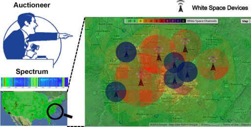

Fig. 1. Heterogeneous TV White Space spectrum redistribution based on combinatorial auctions. 

Therefore, it is necessary to allow users to express different valuations on multiple channel bundles. Considering the channel heterogeneity and preference diversity, it is natural to model the market of heterogeneous spectrum redistribution as a combinatorial auction. However, spectrum is different from traditional goods due to its spatial reusability, by which well-separated users can be allocated on the same spectrum band simultaneously. Thus, traditional combinatorial auction mechanisms cannot be directly applied to spectrum auctions. Fig. 1 shows a combinatorial auction mechanism for TV white space spectrum redistribution. The TV white spaces have both spatially and frequency heterogeneity. White space devices at different locations can access to different available white spaces and have distinct permissive maximum power, adjacent channel interference and noise floor. The frequency of TV broadband ranges from 54 to 806 MHz, leading to various frequency characteristics of different white spaces. 

The last but not least design challenge is the basic and common objective of auctions: maximizing social welfare, which is defined as the sum of winners' valuations on allocated goods (please refer to Section III-B for the definition). However, finding the optimal social welfare in combinatorial spectrum auctions is normally computationally intractable. 

In this paper, we conduct an in-depth study on the problem of dynamic spectrum redistribution, jointly considering the above challenges. We propose a family of unknown combinatorial Auction mEchanisms for heteroGeneous spectrum redIStribution (AEGIS). AEGIS contains two mechanisms, namely AEGIS-SG and AEGIS-MP. Specifically, AEGIS-SG is a direct revelation combinatorial auction for _unknown single-minded_ users, achieving both strategy-proofness (please refer to Section III-C for the definition) and a good approximation ratio. AEGIS-MP is a novel iterative ascending combinatorial auction for _unknown multiple-minded_ users. AEGIS-MP achieves approximately efficient social welfare and is implemented in undominated strategies, which is an important solution concept from game theory (please refer to Section III-C for the definition). To the best of our knowledge, AEGIS is the first combinatorial spectrum auction framework for unknown users. 

We summarize our contributions as follows. 

- First, we propose a general combinatorial auction model for the problem of heterogeneous spectrum redistribution, 

and use the concept of virtual channel to capture the conflict of channel usage among wireless users. This general model is powerful enough to express channel heterogeneity and spatial reusability, as well as preference diversity. 

- Second, we begin with considering a simple but classical setting with unknown single-minded users and propose AEGIS-SG. 

- Third, we further extend this work by designing AEGIS-MP for a more general case, in which users are _unknown multiple-minded_ . 

- Fourth, we theoretically prove that AEGIS obtains approximately efficient social welfare and has good economic properties. 

- Last but not least, we evaluate the performance of AEGIS based on two practical datasets, Google Spectrum Database and GoogleWiFi, and compare AEGIS to the state-of-the-art mechanisms. Our evaluation results show that AEGIS achieves superior performance in terms of social welfare, revenue, user satisfaction ratio, and channel utilization. 

The rest of this paper is organized as follows. In Section II, we review related work. In Section III, we present the auction model for heterogeneous spectrum redistribution. In Section IV, we propose AEGIS-SG for the case with unknown single-minded users. We further consider the case with unknown multiple-minded users, and propose AEGIS-MP in Section V. The evaluation results are presented in Section VI. We conclude the paper in Section VII. 

## II. RELATED WORK 

In recent years, designing auction mechanisms for spectrum redistribution has attracted increasing interests [9]–[13]. Unfortunately, none of these mechanisms fully considers the above design challenges. Some of the spectrum auction mechanisms (e.g., VERITAS [9] and TRUST [10]) consider channel spatial reusability, but fail in heterogeneous channel scenarios. Recent work CRWDP [12], TAHES [11], and SMASHER [13] consider channel heterogeneity, but CRWDP ignores channel spatial reusability, while TAHES and SMASHER have simple valuation formats. Furthermore, these mechanisms only prevent users from misreporting their valuations to manipulate the auction and always assume that the channel demands are publicly known to the auctioneer. However, in practice, users can further improve their utilities by cheating on their channel demands. In this work, we design heterogeneous spectrum auction mechanisms, considering both channel spatial reusability and diverse valuation formats. To some extent, our mechanisms are resistant to both valuations and channel demands cheating behaviors. 

There are some other related works on spectrum auctions mechanism design, e.g., online spectrum auction [14], revenue generation [15], and spectrum auction with multiple auctioneers [16]. Besides auction theory, some other powerful tools, e.g., contract theory [17], queueing theory [18], and randomized algorithm [19], have been applied to different scopes in spectrum markets design. 

Another category of related work is combinatorial auction mechanism design. Dobzinski [20] and 

ZHENG _et al._ : AEGIS: UNKNOWN COMBINATORIAL AUCTION MECHANISM FRAMEWORK FOR HETEROGENEOUS SPECTRUM REDISTRIBUTION 

1921 

Papadimitriou _et al._ [21] proved that optimal social welfare and strategy-proofness cannot be achieved simultaneously in general combinatorial auctions. Considering the intractability of combinatorial auctions, a number of strategy-proof auction mechanisms with well-bounded approximation ratios are proposed [8], [22], [23]. There are still no positive results (computationally efficient, deterministic, and strategy-proof mechanisms with good social welfare approximation) to combinatorial auctions with unknown multi-minded buyers. Our design is based on the iterative wrapper technique for unknown combinatorial auction mechanism [6]. However, none of the above combinatorial auctions considered the spectrum spatial reusability. 

## III. PRELIMINARIES AND PROBLEM FORMULATION 

In this section, we first describe network and auction model for the problem of heterogeneous channel redistribution, and then review related solution concepts used in this paper from game theory. At last, we formulate the channel allocation problem as a classic weighted set packing problem. 

## _A. Network Model_ 

We consider a static secondary spectrum market with a primary spectrum holder, called “seller,” and some secondary users (e.g., WiFi APs), called “buyers.” The primary spectrum holder wants to sell her temporary unused spectrum, and the secondary users would like to lease spectrum to provide wireless services for their customers at certain quality of service (QoS). We consider that the trading channels are heterogeneous, and thus buyers have diverse preferences over the different combinations of channels according to their QoS, hardware abilities, and the interference conditions of accessible channels. Different from traditional goods, wireless channels can be spatially reused, meaning that conflict-free buyers can be allocated the same channel simultaneously. 

We denote the set of orthogonal and heterogeneous channels for leasing by , and the set of buyers by . 

_Con fl ict Graph:_ In spectrum auctions, conflict graphs are usually used to represent the interference among buyers and can be built by the auctioneer through some measurement methods, e.g., measurement calibrated method [24]. Due to the heterogeneity of channels, each channel may have a distinct conflict graph. Let denote the conflict graph on channel , where is the set of buyers who can access channel , and each edge represents the interference between buyers and on channel . We also denote the maximum degree on graph by , and the maximum among all 's by , i.e., . 

## _B. Auction Model_ 

We model the process of heterogeneous channels redistribution as combinatorial auctions. We discuss two popular kinds of combinatorial auctions: _direct revelation_ combinatorial auction for the case with unknown single-minded buyers, and _iterative ascending_ combinatorial auction for the case with unknown multi-minded buyers. Specifically, in the direct revelation combinatorial auction, buyers simultaneously declare their 

bids and channel demands to a trustworthy auctioneer, and then the auctioneer makes the decision on channel allocation and the charge to each winner. In the iterative ascending combinatorial auction, buyers compete by gradually raising their bids, and the auctioneer maintains a provisional allocation in each iteration. The auction stops when all the remaining active buyers are declared as winners, and winners pay their lastly reported bids. We list some useful notations in our model as follows. 

_Interested Channel Bundle:_ Each buyer has various private preferences on channel bundles in which and can be arbitrarily large, even exponential. We call a buyer , who is interested in channel bundles as - _minded_ buyer. We discuss single-minded case ( for all ) in Section IV and multi-minded case ( for some ) in Section V. We denote the interested bundles of all buyers by . _Valuation:_ Each buyer has a private valuation over each of her interested channel bundle .1 For the other channel bundles not in , we adopt the **XOR** operation in combinatorial auctions [25], and formally describe the valuation function of buyer as otherwise (1) 

We assume that is _normalized_ (i.e., ) and _monotone_ (i.e., for each ). Since the valuation function is derived from the expected quality of wireless service applications, we can assume that the range of the valuation function of buyer is and , where is the minimum monetary unit in auction systems. We denote the maximum value of all by . We call the valuation function of buyer is -close when . This parameter characterizes the diversity of valuation function from one buyer. Let .2 We denote the valuation functions of all buyers by . 

_Bid and Declared Channel Bundle:_ In the direct revelation combinatorial auction for unknown single-minded case, each buyer declares a bid and one channel bundle to the auctioneer, meaning that she is willing to pay at most , if she is allocated a channel bundle containing . The bid vector of all buyers is represented as , and the declared channel bundles of all buyers are denoted by 

. In the iterative ascending combinatorial auction for unknown multi-minded case, active buyer submits a temporary bid and a channel bundle in the th iteration. The bids of nonactive buyers are set to zeros, and their current bundles are the declared bundles when they drop out of the auction. We denote all bids by and the de- 

> 1When the size of is large, i.e., exponential, buyers may need exponential storage to represent the general valuation function, and buyers can succinctly express some specific valuation functions with the help of convenient bidding languages [25]. 

> 2We note that the auctioneer does not need to know any information about the parameters of the valuation functions, including the range , the maximum valuation , and the closeness parameter . The design of AEGIS auction mechanisms is independent on the knowledge of these parameters. 

IEEE/ACM TRANSACTIONS ON NETWORKING, VOL. 24, NO. 3, JUNE 2016 

1922 

clared bundles of buyers by in the th iteration. 

_Clearing Price and Utility:_ The auctioneer charges each winner a clearing price , and lets the losers free of any charge. We use vector to represent the clearing prices of all buyers. Each buyer has a quasi-linear utility defined as 

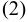

where is the channel bundle allocated to buyer . In our model, we consider buyers are _unknown_ , i.e., both the valuation functions and interested channel bundles are private information, and unknown to the auctioneer. In such environment, the selfish and rational buyers have more flexibilities to manipulate the results of the auction and are eager to maximize their own utilities. In contrast to buyers, the overall objective of the auction mechanism is to maximize social welfare, which is defined as follows. 

_De fi nition 1 (Social Welfare):_ The social welfare in a spectrum auction is the sum of winning buyers' valuations on their allocated bundles of channels, i.e., 

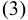

where is the set of winners, and is the corresponding allocated channel bundle for winner . 

In this paper, we assume that buyers do not collude with each other, and leave relaxation of this assumption to our future work. 

## _C. Economic Properties_ 

We briefly review the solution concepts used in this paper from game theory. 

_De fi nition 2 (Dominant Strategy [26]:_ A strategy (weakly) dominates another strategy of player , if for any other players' strategy profile : and this inequality is strict for at least one instance of . 

A strategy is a dominant strategy for player if it (weakly) dominates any other strategies of player . 

A strategy is an _undominated strategy_ for player if it is not dominated by any other strategies of . 

In direct revelation mechanisms, _incentive-compatibility_ means that truthfully revealing private information, both valuations and channel demands in this paper, is a dominant strategy for each player. An accompanying concept is _individual-rationality_ , which means that players truthfully participating in the game gain nonnegative utilities. The formal definition of _strategy-proof mechanism_ is as follows. 

_De fi nition 3 (Strategy-Proof Mechanism [27]):_ A direct revelation mechanism is strategy-proof when it satisfies both incentive-compatibility and individual-rationality. 

Strategy-proofness is a strong solution concept in mechanism design. However, the requirement of having dominant strategies limits the existence of feasible allocation algorithms in combinatorial auctions for unknown multi-minded buyers [23], [28]. We turn our attention to another well-known game-theoretic concept: _implementation in undominated strategies_ . 

_De fi nition 4 (Implementation in Undominated Strategies [6], [29]):_ A mechanism is an implementation of -approximation in undominated strategies if there exists a nonempty set of undominated strategies with the following properties. 

- achieves a -approximation in polynomial time for any 

- combination of undominated strategies from .3 

- is individually rational for players taking undominated 

- strategies from . 

- has fast undominance recognition property, meaning 

- that a player can efficiently determine if a strategy belongs to , and if not, compute an undominated strategy in to dominate it. 

The underlying goal of spectrum auctions is to achieve approximately optimal social welfare in the presence of strategic behaviors of buyers. In unknown multi-minded case, we achieve this goal by relaxing the strict strategy-proofness constraint and allowing the mechanism to leave several strategies in for the buyers to choose from. We compensate this uncertainly on the game-theoretic side by strengthening the algorithmic analysis, showing that the mechanism can achieve a good approximation for any combination of undominated strategies from . 

## _D. Problem Formulation_ 

We borrow the novel concept of virtual channel [13] to represent the conflict of channel usage among buyers. By using virtual channels, we transform the _channel allocation problem_ to a classical _weighted set packing_ problem and formulate it as a binary program. Specifically, a virtual channel indicates that buyers and cause interference between each other on channel , when channel is allocated to and simultaneously, i.e., virtual channel is corresponding to the edge on conflict graph . We now show the process of constructing virtual channels. We first create virtual channel for each edge on conflict graph , and then append to the channel bundles containing channel from the buyers and . We finally remove the original channels from all channel bundles. Hence, the updated channel bundles only contain virtual channels. From now on, the set and vector represent the updated interested channel bundles and updated declared channel bundles, respectively. We note that the valuations on updated channel bundles retain the same. Let be the set of virtual channels for the buyer . All virtual channels are denoted by . According to the rule of virtual channel construction, the maximum size of updated interested channel bundle is bounded by . 

When virtual channel is added into the channel bundles containing channel from the buyers and , at most one of the channel bundles from the buyers and can be allocated, ensuring the exclusive allocation of channel for the buyers and . If the buyer obtains all virtual channels on conflict graph , then she is granted channel . We note that the buyer may not conflict with any other buyers on some channels. For these channels with no interference, we directly 

> 3In this paper, a mechanism achieves -approximation means that the approximation ratio of is . The approximation ratio is defined as the ratio between the social welfare achieved by and the optimal social welfare. 

ZHENG _et al._ : AEGIS: UNKNOWN COMBINATORIAL AUCTION MECHANISM FRAMEWORK FOR HETEROGENEOUS SPECTRUM REDISTRIBUTION 

1923 

allocate them to the buyer . Consequently, the exclusive allocation of virtual channels implies the feasible channel allocation under conflict graph constraint. 

We now transform the channel allocation problem to the weighted -set packing problem. The weighted -set packing problem can be described as follows: Given a family of weighted sets, each containing at most elements drawn from a finite universe, find a maximum weight subcollection of disjoint sets. In the channel allocation problem, the set of virtual channels corresponds to the universe, collection of updated declared channel bundles corresponds to the family of weighted sets, and . In the direct revelation combinatorial auction for the single-minded case, the problem of channel allocation can be formulated as an integer programming. 

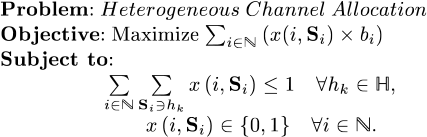

|(4) (5)|
|---|

Here, the variable indicates that channel bundle is allocated to buyer ; otherwise . The first set of constraints represents the exclusive allocation of virtual channels, and the second set of constraints states the binary value of the auctioneer's decision of allocation. In the th iteration of ascending combinatorial auction, we can formulate the channel allocation problem as a similar integer programming by replacing and with and . In the formulation, we use declared information ( , and ) instead of truly private information ( and ) because the strategy-proof mechanism in Section IV will guarantee that bidding truthfully is a dominant strategy for each buyer, and the iterative ascending auction mechanism in Section V will ensure that the declared information is close to the truthful information at the end of the auction. 

Solving the above integer programming is NP-hard, which makes the general and celebrated VCG mechanism (named after Vickrey [30], Clark [31], and Groves [32]) inapplicable. Considering the computational intractability of the problem, we present alternative solutions with greedy allocation algorithms to achieve approximately efficient social welfare in following sections. 

We list the frequently used notations in Table I. 

## IV. AEGIS-SG 

In this section, we begin with a simple but classical setting, in which buyers are unknown single-minded. As shown in Section III-D, finding the optimal auction decision is computationally intractable, even in this restricted case. Therefore, we design AEGIS-SG, which is a direct revelation combinatorial auction mechanism for heterogeneous channel redistribution among unknown single-minded buyers, achieving both strategy-proofness and approximate efficiency. 

## _A. Design Details_ 

We first formally define the concept of _unknown singleminded buyers_ . 

TABLE I 

FREQUENTLY USED NOTATIONS 

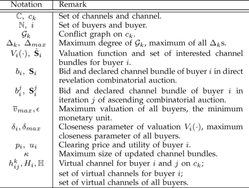

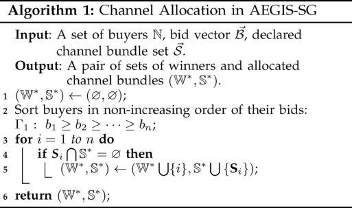

_De fi nition 5 (Unknown Single-Minded Buyer):_ Buyer is an unknown single-minded buyer iff she is only interested in one channel bundle and has a valuation for any bundle containing . Both the valuation and channel demand are private information.4 

AEGIS-SG contains two major components: greedy channel allocation and clearing price calculation. The greedy channel allocation procedure is depicted in Algorithm 1. The algorithm contains two steps. 

- Step 1: We sort buyers according to their bids in nonin- 

- creasing order, and denote the sorted list by . We break the tie following any bid-independent rule, e.g., lexicographic order of buyer's ID or channel ID. 

- Step 2: Following the order in , we greedily grant 

- channel bundles, which do not overlap with the previous allocated virtual channels. 

The clearing price calculation is based on critical bid. _De fi nition 6 (Critical Bid):_ The critical bid for buyer is the minimum bid that the buyer should declare to win the auction. 

The critical bid of winner can be calculated by the following steps. Consider the winner in the sorted list , we 

> 4The terminology “unknown” denotes that the channel demands and valuations of single-minded buyers are unknown to the auctioneer before the auction begins. Due to the property of strategy-proofness, buyers will truthfully reveal their private information in the auction, and thus the auctioneer can learn this private information after AEGIS-SG is carried out. 

IEEE/ACM TRANSACTIONS ON NETWORKING, VOL. 24, NO. 3, JUNE 2016 

1924 

find the first buyer following that has been denied but would have been granted a channel bundle when the buyer is removed from , and denote this buyer by . We note that such a buyer necessarily conflicts with . We can formally represent as 

and 

is a winner 

The critical bid for the winner is . We show the method of calculating the clearing price for buyer by distinguishing two cases. 

If buyer is a loser or does not exist, she pays zero. If there exists a , and buyer is granted , then she pays . 

## _B. Analysis_ 

In this section, we prove that AEGIS-SG guarantees strategy-proofness in terms of valuations and channel demands, and analyze the approximation ratio of AEGIS-SG. 

We first show the monotonicity of channel allocation algorithm, which is essential for a strategy-proof mechanism. 

_Lemma 1:_ AEGIS-SG's channel allocation algorithm is monotonic, i.e., buyer , who wins by declaring , also wins if she declares , such that, and . _Proof:_ We assume that the buyer declares in sorted list and declares in , respectively. We use the same bid-independent rule to break the tie, and thus and differ only in that the buyer may have been moved forwards by the change from to . The allocation result is exactly the same on and before the position of in . If wins in , no winner before in conflicts with her. Therefore, no winner before in conflicts with her either, and in is also allocated. We present the strategy-proofness and approximation ratio of AEGIS-SG. 

_Theorem 1:_ AEGIS-SG is a strategy-proof combinatorial spectrum auction for unknown single-minded buyers. 

_Proof:_ We first show that AEGIS-SG satisfies _individualrationally_ , i.e., truthful buyers obtain nonnegative utilities. On one hand, losers' utilities are zeros. On the other hand, winner gets utility: . Since winner bids truthfully, her declared bid and declared bundle are equal to her valuation and interested bundle , respectively. As wins the auction, we also have . Hence, she gets nonnegative utility. 

We now prove that AEGIS-SG also satisfies _incentive-compatibility_ . Suppose the true type of buyer is , we prove that buyer cannot increase her utility through misreporting. By the property of individual-rationally, we just need to consider the case that buyer gets a positive utility when declaring and . We complete the analysis by proving the following two claims. 

Declaring would not be worse off than declaring . Let and denote the payments (critical bids) when declaring and , respectively. Since the valuations on and are the same, we just need to prove that . By contradiction, we assume that , and there exists a bid 

that satisfies . According to the payment rule and Definition 6, for , the buyer loses the auction when she declares , and for , she wins the auction when declaring . By and Lemma 1, losing with the auction implies that also loses, and then we get a contradiction. We can conclude that , and declaring is not worse off than declaring . 

Declaring is not worse off than declaring . If buyer is denied when declaring , her utility is zero, which could not be better than that of declaring . If both bids win, buyer has the same valuation and pays the same payment, which results in same utility. If wins and loses, it must be the case that . Buyer gets zero utility when bidding truthfully, while it achieves nonpositive utility when lying. Consequently, declaring is not worse off than declaring in all scenarios. 

These two claims imply that truthfully revealing is the dominant strategy for each buyer . Hence, AEGIS-SG satisfies incentive-compatibility. 

Since AEGIS-SG achieves both individual-rationally and incentive-compatibility, we conclude that AEGIS-SG is a strategy-proof combinatorial auction mechanism by Definition 3. 

_Theorem 2:_ AEGIS-SG achieves -approximation. _Proof:_ Let be the optimal channel allocation, and be the allocation achieved by AEGIS-SG. For each buyer , we define 

to represent the buyers in that cannot be selected by AEGIS-SG because of the existence of buyer in . Theorem 1 guarantees that bidding truthfully is a dominate strategy for each buyer, so we use true type of buyers here. Since is a valid allocation, the bundles that allocated to any pair of buyers cannot overlap on any virtual channel. Every bundle granted to in the optimal allocation intersects with at least one virtual channel. Additionally, the size of updated channel bundles is bounded by . Consequently, there are at most buyers in , combining with the definition of , we have 

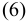

Since , we finally get 

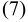

Therefore, AEGIS-SG achieves -approximation. 

## V. AEGIS-MP 

In this section, we consider a more general scenario, in which buyers are unknown multi-minded. We first give an illustrative example to show that simply extending AEGIS-SG can no longer guarantee strategy-proofness. Furthermore, designing a deterministic, approximately efficient, and strategy-proof 

ZHENG _et al._ : AEGIS: UNKNOWN COMBINATORIAL AUCTION MECHANISM FRAMEWORK FOR HETEROGENEOUS SPECTRUM REDISTRIBUTION 

1925 

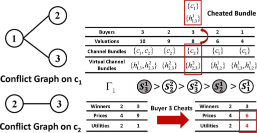

Fig. 2. Illustrative example on why extending AEGIS-SG is not strategy-proof in multi-minded scenario. When buyer 3 changes her second interested bundle from to , she decreases her clearing price from 9 to 6 and obtains higher utility. 

combinatorial auction mechanism for unknown multi-minded buyers is still an open problem in algorithmic mechanism design, and some negative results are demonstrated [20], [21]. We turn to another well-known game-theoretic concept, implementation in undominated strategies, and design AEGIS-MP, which is an approximately efficient ascending combinatorial auction for heterogeneous channel redistribution among unknown multi-minded buyers. 

We first give the definition of _unknown multi-minded_ buyer. _De fi nition 7 (Unknown Multi-Minded Buyer):_ Buyer is an unknown multi-minded buyer iff she is interested in multiple channel bundles , and has valuation function defined as (1). The channel demands and valuation function are private information.5 

## _A. Counterexample_ 

In Fig. 2, there are three buyers and two trading channels . The two conflict graphs capture the interference among buyers on two heterogeneous channels. While buyers 2 and 3 conflict on the usage of channel , they have no interference on channel , and thus they can use channel simultaneously. Since buyers are multi-minded, they may have different valuations on different bundles, e.g., buyer 3 has valuation 10 and 8 over channel bundles and , respectively. Based on the conflict graphs and buyers' interested channel bundles, we can construct virtual channel bundles for each buyer. In this example, we assume that buyers truthfully reveal their valuations, and investigate their manipulated strategies on channel demands. 

In AEGIS-SG, we sort buyers' declared channel bundles according to the nonincreasing order of their bids and greedily grant channel bundles, ensuring the exclusive allocation of virtual channels. Buyers 2 and 3 are the winners and obtain channel bundles and , respectively. When bidding truthfully, according to the pricing scheme of AEGIS-SG, buyer 3 should pay 9, which is the bid of buyer 2 on bundle , and her utility is . However, buyer 3 can cheat by 

> 5Different from the unknown single-minded scenario, the private information, in unknown multi-minded setting, remains to be unknown to the auctioneer at the end of the auction. 

changing her second interested bundle to , and will still be allocated bundle but be charged with 6, increasing her utility to 4. Hence, by declaring untruthful channel demands, buyers can improve their utilities, which leads to the untruthfulness of AEGIS-SG in multi-minded scenario. 

## _B. Design Rationale_ 

AEGIS-MP is an ascending Japanese auction [33]–[35] on top of a greedy channel allocation algorithm. In traditional ascending Japanese auctions, the auctioneer collects temporary bids from active buyers and maintains a provisional allocation in each iteration. Provisional losers can choose to increase their bids or permanently drop out of the auction. This process is iterated until all remaining active buyers are winners, and their prices are lastly reported bids. 

The most challenging part of designing combinatorial auctions for unknown multi-minded buyers is that both the valuations and channel demands are private and unknown to the auctioneer. We overcome this challenge by extending the ascending Japanese auctions to approach the true valuations and channel demands of buyers. Informally, in AEGIS-MP, we also maintain an “active bundle” for each buyer. This active bundle will keep approaching to one of the interested bundles of the buyer during the auction. Another challenge is the impact of manipulative behaviors of selfish buyers, which should be prevented to form a relatively stable market. Since the buyers are rational, they will not take dominated strategies if some undominated strategies can be quickly recognized. By exploiting this rationality of buyers, we carefully design the structure of auctions such that, at each decision point, buyers can efficiently recognize the undominated strategies and take one of them, leading AEGIS-MP to be implemented in undominated strategies. 

## _C. Design Details_ 

We now describe AEGIS-MP in detail. We suppose that GDY_ALG is the approximately efficient greedy-based allocation algorithm, and when given as input vectors of active bundles and temporary bids, it outputs a provisional allocation that is approximate to the optimal solution. In AEGIS-MP, which is shown in Algorithm 2, the vector of bids and active bundles are initialized to and , respectively (Line 2). At the beginning of the th iteration, the auctioneer knows four parts of information: the previous losers set , the previous winners set , the current active bundle vector , and the temporary bid vector of buyers . These parameters are handed in as input to GDY_ALG, who, in return, outputs a new set of provisional winners and active bundles (Line 4). The provisional winners retain the same bids, while provisional losers are required to either increase their current bids by multiplying or permanently drop out of the auction (this is denoted by setting ) (Lines 5–8). Here, parameter is Euler's Number and is the best choice over all constants for the optimal approximation ratio. This process is iterated until all remaining active buyers are declared as winners by GDY_ALG. Let the total number of iterations be , and the set of winners is . Each winner gets her finally active bundle and pays her 

IEEE/ACM TRANSACTIONS ON NETWORKING, VOL. 24, NO. 3, JUNE 2016 

1926 

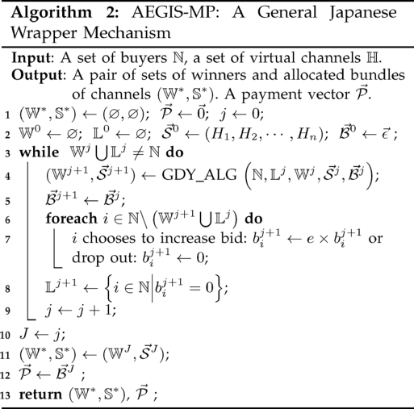

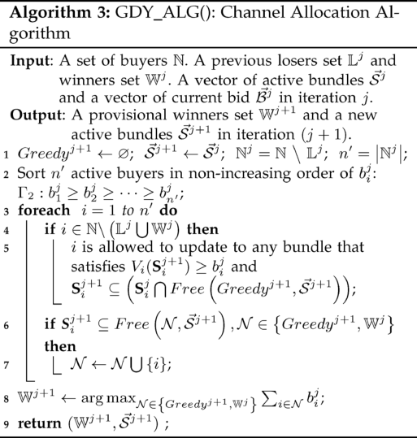

_Shrinking Active Bundle:_ If the buyer was previously a provisional loser, then she is given an option to “shrink” her active bundle. If the buyer chooses to shrink her bundle, the new bundle must satisfy that its valuation is not less than her current bid , and it is a subset of the previously reported bundle and disjoints from the bundles of buyers that are already in (Lines 4 and 5). 

_Updating Candidate Winner Sets:_ Buyer is added to the allocation (or ) when her declared bundle does not intersect the bundles of existing buyers in (or ). This operation ensures that the two allocations and are Pareto-efficient6 with respect to the new active bundles (Lines 6 and 7). 

Once all the active buyers have been considered, GDY_ALG outputs the allocation with the maximum value out of the two allocations and as the new set of provisional winners . It also outputs the updated active bundles (Lines 8 and 9). 

We summarize four important properties of GDY_ALG. These properties will be frequently used in the next section. 

( _Pareto Ef_ _<u>fi</u> ciency_ ) For any buyer 

( _Improvement_ ) 

- . 

- ( _Shrinking Sets_ ) For any buyer and any 

- ( _First Time Shrink_ ) Let . For any , it holds that . 

## _D. Analysis_ 

In this section, we prove that AEGIS-MP is an implementation in undominated strategies by the following steps. First, we characterize the set of undominated strategies . Second, we show that AEGIS-MP is individually rational for buyers taking any strategies from . Third, we demonstrate that AEGIS-MP has fast undominance recognition property. Finally, we analyze the approximation ratio of AEGIS-MP. 

We first define a type of buyers in AEGIS-MP. 

_De fi nition 8 (Drop-Out If Silent Buyers):_ Active buyer is a “drop-out if silent” buyer in the th iteration if, when she is allowed to shrink her active bundle at Line 5 in GDY_ALG, all the following hold. 

(Not a previous winner) 

lastly reported bid . The losers will not be allocated bundles and are free of any charge (Lines 11 and 12). 

We now depict the design of channel allocation algorithm GDY_ALG in details. Algorithm 3 shows the pseudo-code of GDY_ALG procedure. Let denote the active buyers in the th iteration. Function denotes the virtual channels not in . Here, is a subset of buyers, and 

is a vector of active bundles. GDY_ALG constructs a greedy allocation, , by extending the channel allocation algorithm in AEGIS-SG. Similarly, we sort the active buyers according to their current bids in nonincreasing order, and break the tie following any bid-independent rule (Line 2). Following order , two steps are performed for the currently considered buyer . 

(Drop out if keep silent) and 

A buyer can recognize that she is a “drop-out if silent” buyer at Line 5 of GDY_ALG, and if there exists a feasible channel bundle, she will definitely shrink her active bundle. This is because she has to drop out of the auction if she keeps silent, and if she shrinks her active bundle, she might win. In terminology of game theory, the strategy that keeping silent is dominated by the strategy of bundle shrinking. 

We now characterize strategy set and claim that every strategy in is an undominated strategy. 

6Pareto-efficiency means that it is impossible to add losers into the winner set without removing at least one winner. 

ZHENG _et al._ : AEGIS: UNKNOWN COMBINATORIAL AUCTION MECHANISM FRAMEWORK FOR HETEROGENEOUS SPECTRUM REDISTRIBUTION 

1927 

_De fi nition 9 (Set ):_ Let be the set of all strategies that satisfy the following conditions, for every iteration . If buyer does not drop out, her bid is always less than her valuation on the active bundle, i.e., . As , her active bundle must contain some interested bundles. 

If buyer drops out, then . 

If buyer is a “drop-out if silent” buyer (Definition 8), then she will definitely declare some feasible bundle that satisfies the conditions at Line 5 of GDY_ALG, if such a bundle exists. 

_Lemma 2:_ Strategy set is a set of undominated strategies. _Proof:_ According to the definition of , all strategies outside are dominated strategies, which cannot dominate any strategy in . We just need to look at any two different strategies of buyer from the set (i.e., ), and show that neither of them dominates the other. We consider the first point that they differ (i.e., the buyer has different active bundles). At this point, we can construct the strategies of the other buyers that will cause one strategy to win and the other to lose. Therefore, neither nor dominates the other, and then both strategies and are undominated strategies. 

_Lemma 3:_ AEGIS-MP is individually rational for buyers taking undominated strategies from . 

_Proof:_ According to the fact that winners pay their lastly reported bids and the first condition of Definition 9, a winner cannot obtain a negative utility when she plays any undominated strategy in . Obviously, losers' utilities are zeros. Therefore, our claim holds. 

_Lemma 4:_ AEGIS-MP has fast undominance recognition property, i.e., buyers can efficiently determine if a strategy belongs to , and if not, compute an undominated strategy in to dominate it in polynomial time. 

_Proof:_ Clearly, any buyer can check if her strategy satisfies the conditions of undominated strategies in Definition 9 in polynomial time, and if not, modify her strategy to an undominated strategy that dominates the original one. 

We now analyze the approximation ratio of AEGIS-MP. We first present some notations. Let denote the value of the optimal outcome (in terms of valuation function <u>)</u> for a set of buyers when their channel bundles are . We call a valid allocation, if for any and . Besides the four important properties in Section V-C, we present another property, which can be derived from Definition 9. 

( _Value Bound_ ) For any , and any . For buyer who drops out in the th iteration, . 

Before presenting the main theorem, we give some important lemmas. We first show that the number of iterations in AEGIS-MP is limited. 

_Lemma 5:_ AEGIS-MP stops in at most steps. 

_Proof:_ We look at a loser who drops out in the last iteration (the th iteration). According to the _Pareto Ef fi ciency_ property, loser 's active bundle must intersect with that of a winner , which implies that . Additionally, by the _Shrinking Sets_ property, it holds that , 

for any . Therefore, we can claim that buyer and never win together. Each of them can be a loser and multiply her bid at most consecutive times. We can get that , and thus the lemma holds. 

We have the following lemma for AEGIS-MP. _Lemma 6:_ For AEGIS-MP, it holds that 

, where . _Proof:_ We consider , where represents the buyers that drop out in the th iteration. We have . Therefore, to prove the correctness of our claim, it is sufficient to show (8) 

We can obtain this inequality by proving the following two claims. _Claim 1:_ 

_Proof:_ We note that for a drop-out buyer . We consider the optimal allocation for the buyers in and distinguish the winners into two types. 

Let denote the set of winners that belong to either or , but are not in . We have the following inequalities for : 

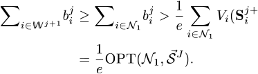

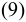

The first inequality comes from the _Improvement_ property, the second inequality is due to the _Value Bound_ property, and the last equality comes from the fact that is a valid allocation. 

We consider the other case, in which the winners do not belong to or , and denote the set of winners in this type by . Similar to Theorem 2, we can prove that GDY_ALG achieves - _local approximation_ , meaning that the greedy allocation in the th iteration in GDY_ALG (the buyers in ) has total value at least of . Together with the _Improvement_ property, we have 

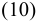

Since , we get 

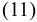

According to the _Value Bound_ property, we can get 

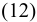

Combining with Inequalities (10)–(12), we have 

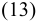

For any , by Inequalities (9) and (13), we have 

_Claim 2:_ . 

IEEE/ACM TRANSACTIONS ON NETWORKING, VOL. 24, NO. 3, JUNE 2016 

1928 

_Proof:_ By the _Improvement_ property, we can get . According to the _Value Bound_ property, we have for all . Furthermore, is a valid allocation. Combining with the above two inequalities, we can get . 

Applying the two claims, we obtain Inequality (8). Therefore, we conclude that 

We present the approximation ratio of AEGIS-MP. _Theorem 3:_ AEGIS-MP achieves 

-approximation. 

_Proof:_ Let be the set of winners in the optimal allocation, and winners are allocated bundles from . We partition the winners into three categories, and then bound the value of them separately. 

We denote the winners that also stay in by . In this case, winners might win other interested channel bundles in the optimal allocation, so we get 

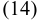

We turn to another set of winners , which is the subset of losers in AEGIS-MP, i.e., . Buyer belongs to if and only if she is a winner in the optimal allocation , and her allocated bundle is not included in , which is the bundle that the buyer declares in AEGIS-MP when she drops out. We have the following claim for winners . _Claim 3:_ . 

_Proof:_ Let be the set of buyers from that first shrink their bundles in the th iteration, and we have . According to the first and third properties of undominated strategy in Definition 9, we can conclude that contains some interested channel bundles for all and . Therefore, for , we have 

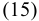

According to the _First Time Shrink_ property, all bundles of buyers in are disjoint. Additionally, by the _Shrinking Sets_ property, we have , implying bundles of buyers in are also disjoint. Therefore, is a valid allocation. Since , we get 

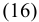

Together with Inequalities (15) and (16), we conclude that 

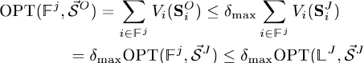

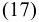

Using Inequality (17) and Lemma 6, we get 

Finally, we conclude that 

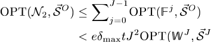

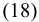

We denote the winners in by . According to the definition of , the allocated bundles of winners in are contained in bundles , together with Lemma 6, we get 

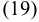

We now combine these three types of winners together [Inequalities (14), (18), and (19)] and conclude that . From the above analysis, we now can get our main result for AEGIS-MP according to Definition 4. 

_Theorem 4:_ AEGIS-MP is an implementation of an -approximation in undominated strategies. Our unknown multi-minded model is a generalization of unknown single-value model , in which buyers have single valuation for any one of their interested channel bundles [36]. The approximate result of AEGIS-MP is degenerated to single-value model when . We have the following theorem for unknown single-value model. _Theorem 5:_ AEGIS-MP implements an -approximation in undominated strategies for unknown single-value model. 

## VI. EVALUATION RESULTS 

In this section, we show our evaluation results. We implement AEGIS using network simulation and compare its performance to CRWDP [12], NSR-MP, and VERITAS-EX [9]. CRWDP is an unknown single-minded combinatorial spectrum auction, and NSR-MP is a variant of AEGIS-MP. Neither CRWDP nor NSR-MP considers channel spatial reusability. VERITAS-EX is a simple extension of VERITAS to the unknown multi-minded scenario.7 In VERITAS-EX, each unknown multi-minded buyer is allowed to submit a super channel bundle , the number of demanded channels , and the declared bid . Here, is the union set of all her interested channel bundles, and is the minimum size of the interested bundles. In order to avoid negative utility, the declared bid is set to the minimum valuation over the interested bundles. The auctioneer can allocate any channel set with size to the buyer . In VERITAS-EX, a buyer is said to be a winner if and only if she has positive valuation on her allocated channel bundle. We also show the optimal results with tolerance , computed by solving the binary program of AEGIS-MP in Section III-D. We denote this optimal result as OPT-MP and use it as the references of upper bound. 

## _A. Methodology_ 

We use two complementary datasets, namely Google Spectrum Database [37] and GoogleWiFi [24], to evaluate the performance of our mechanisms. We take Google Spectrum Database as our first dataset. As shown in Fig. 3, we first extract WiFi nodes in an area (Latitude range: , Longitude range: ) from WiGLE.net [38], and we 

> 7In unknown single-minded scenario, extended VERITAS is essentially the same as AEGIS-SG. 

ZHENG _et al._ : AEGIS: UNKNOWN COMBINATORIAL AUCTION MECHANISM FRAMEWORK FOR HETEROGENEOUS SPECTRUM REDISTRIBUTION 

1929 

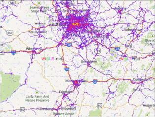

Fig. 3. Wireless WiFi networks map constructed by WiGLE.net from 2001 to 2013. Latitude range: , Longitude range: . 

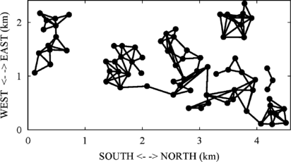

Fig. 4. Conflict graph of GoogleWiFi dataset. 

then query Google Spectrum Database the available TV white spaces and corresponding maximum permissible power for each WiFi node, which is considered as a portable device in the database. Portable devices can work on unused TV channels 21–51, except channel 37–39. To generate conflict graphs, we apply a simple Free Space propagation model [39] to predict the interference range between nodes, and consequently create the conflict graphs.8 We also evaluate our mechanisms in a practical conflict graph, built from exhaustive signal measurements, in the second data set. The second dataset, GoogleWiFi, records 78 APs in a 7-km residential area of the Google WiFi network in Mountain View, CA, USA. It was collected by a research group from the University of California (UC) Santa Barbara in April 2010 [24]. Fig. 4 shows the practical conflict graph in GoogleWiFi dataset. 

We build a set of auction configurations by sampling WiFi nodes in the first data set, and the number of WiFi nodes varies from 200 to 2000 with increment of 200. For the second data set, we assume the number of leasing channels can be one of three values: 6, 12, and 24. We consider the case of single-minded buyers and the case of multi-minded buyers, who can have up to 10 interested bundles (i.e., ). For each buyer , her interested channel bundles are randomly generated from her available channel set, and the valuations on bundles are uniformly distributed over . The maximum closeness parameter of valuation is set as 5, i.e., . The minimum monetary unit in the auction systems is set as . In AEGIS-MP, since buyers may have multiple undominated strategies at their 

> 8Other propagation models, e.g., Egli and Longley-Rice [39], could be used to generate more accurate conflict graphs. 

decision points, we assume that buyers randomly select one of them. All the results of performance are averaged over 200 runs. 

_Metrics:_ We evaluate the following five metrics: 

_Social Welfare:_ the sum of winning buyers' valuations on their allocated bundles of channels; 

_Revenue:_ the sum of payments received from buyers9 ; 

_Satisfaction Ratio:_ the fraction of winners over buyers; 

_Channel Utilization:_ the number of radios working on each channel; 

_Channel Eccentricity:_ the ratio of allocated channels over actually used channels for one buyer. In AEGIS-MP, for each winner, the final allocated bundle may contain multiple interested bundles and uninterested channels, but the winner only uses one interested bundle. Therefore, we use channel eccentricity to measure this channel overallocation. 

_Jain's Fairness Index:_ Under the scenario of combinatorial spectrum auction, the Jain's fairness index [40] for channel is defined as 

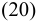

where is the total number of buyers who are allocated channel , and is the payment that buyer is charged for being allocated channel . Suppose buyer pays for allocated channel bundle , and for each can be calculated by , where is the size of bundle . We use the Jain's fairness index to evaluate the fairness of AEGIS in terms of payment for certain channel. 

## _B. Performance on Google Spectrum Dataset_ 

By varying the number of buyers, we collect a set of performance data, as illustrated in Fig. 5. In this dataset, the scale of spectrum auctions is large, so we just calculated the results of OPT-MP when the number of buyers is small. From Fig. 5, we can see that AEGIS always outperforms the other two mechanisms without considering the spectrum reusability, CRWDP and NSR-MP. This result demonstrates that exploiting channel spatial reusability can significantly improve the performance of spectrum auction systems. In Fig. 5, AEGIS also outperforms VERITAS-EX on the three metrics. This is because VERITAS-EX does not apply any effective method to prevent the strategic behavior of unknown multi-minded buyers. Fig. 5 shows that when the number of buyers increases, the social welfare and revenue increase, while the satisfaction ratio decreases. On one hand, AEGIS allocates channels more efficiently among more buyers, hence the social welfare and revenue increase. On the other hand, larger number of buyers leads to more intense competition on limited channels, thus decreasing the satisfaction ratio. We also observe from Fig. 5 that revenue is much lower than social welfare. Similar to previous work [9], we can institute reserve prices for channels to increase revenue and make a tradeoff between revenue and social welfare. How to determine an optimal reserve price is out of 

> 9Determining the optimal revenue for spectrum auctions is out of the score of this paper, so we do not calculate the revenue metrics of OPT-MP in the evaluation results. 

IEEE/ACM TRANSACTIONS ON NETWORKING, VOL. 24, NO. 3, JUNE 2016 

1930 

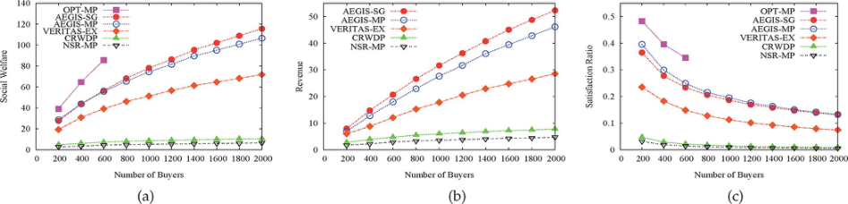

Fig. 5. Performance of OPT-MP, AEGIS, CRWDP, NSR-MP, and VERITAS-EX on Google Spectrum dataset. (a) Social welfare. (b) Revenue. (c) Satisfaction ratio. 

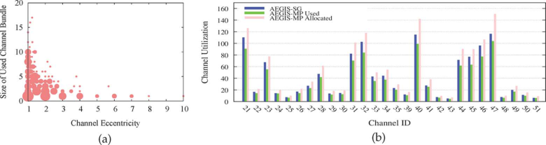

Fig. 6. (a) Channel eccentricity and (b) channel utilization of AEGIS. 

the scope of this paper. Intuitively, multi-minded auction mechanisms should perform better than single-minded ones because of the more feasible bundle choices for buyers. However, as shown in Fig. 5, AEGIS-MP is slightly worse than AEGIS-SG in terms of social welfare and revenue. Furthermore, in small scale of auction settings, the performance of AEGIS has a noteworthy degradation compared to the performance of OPT-MP. As we will discuss later, the channel eccentricity of winners in AEGIS-MP is the main reason for this degradation of system performance. 

We now present the evaluation results of channel eccentricity and channel utilization. The channel eccentricity for AEGIS-SG is always equal to 1 because the allocated bundle is exactly the buyer's interested bundle. This means that there is no channel over-allocation in AEGIS-SG, and the allocated channel resource is fully exploited. Fig. 6(a) shows the channel eccentricity of AEGIS-MP. We randomly select one instance from the 200 simulation instances when the number of buyers is fixed at 2000, and calculate the channel eccentricity for each winner. The placement of a circle in Fig. 6(a) indicates one set of winners with the same channel eccentricity and the same size of used channel bundle. The size of a circle is logarithmic to the number of winners. Though some of winners' channel eccentricities are equal to 1, there exist about 67% winners, whose channel eccentricities are larger than 1. On one hand, AEGIS-MP just stimulates buyers to take undominated strategies, such that buyers can still maintain multiple bundles or uninterested channels in their active bundles during the auction. On the other hand, buyers only use the most valuable channel subset among their allocated bundles. Therefore, the size of allocated bundle can be larger than that of actually used bundle in some cases, leading to channel overallocation. 

The channel eccentricity affects the channel utilization of AEGIS-MP. By fixing the number of buyers at 2000 and running 

200 simulation instances, we record the average channel utilization for each channel and plot the results in Fig. 6(b). We do not include CRWDP and NSR-MP in this analysis because they do not consider channel spatial reusability. As shown in the figure, different TV channels have different channel utilization. The reason is that TV white spaces are spatially heterogeneous, e.g., channel 47 can be accessed to almost all buyers, while channel 33 is only available to around 36% buyers. In AEGIS-MP, we distinguish between allocated channels and used channels. We can observe from Fig. 6(b) that the allocated number is always larger than the used number for each channel. This is because some winners have channel eccentricity higher than 1. We can also see from Fig. 6(b) that the channel utilization of AEGIS-MP is always lower than that of AEGIS-SG. The reason is that the winners with high channel eccentricity in AEGIS-MP disable some possible allocations of their interfering neighbors. From the above analysis, we can get that buyers' manipulated strategies on channel demands indeed impact the performance of spectrum auction systems. 

At last, we present the evaluation results of the fairness of AEGIS in terms of payments in Fig. 7. We fix the number of buyers to be 1000 and obtain the results by running 200 simulation instances. Fig. 7(a) shows the CDF of price per channel for each winner in 200 experiments, and we can conclude that under the payment schemes of AEGIS, the winners have to pay different prices for each purchased channel. Specifically, in AEGIS-SG, around 50% winners pay zero for their allocated channels, and about 10% buyers are charged with the payment higher than 0.2 for each purchased channel. The payment differentiation also exists in AEGIS-MP. We also measure the Jain's fairness index for each trading channel by calculating (20), and show the results in Fig. 7(b). We can see from Fig. 7(b) that the Jain's fairness indexes for most channels are below 0.3, which indicates that the payment mechanisms in AEGIS, to 

ZHENG _et al._ : AEGIS: UNKNOWN COMBINATORIAL AUCTION MECHANISM FRAMEWORK FOR HETEROGENEOUS SPECTRUM REDISTRIBUTION 

1931 

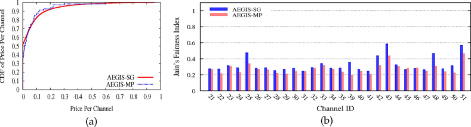

Fig. 7. Payment fairness of AEGIS. (a) CDF of price per channel, (b) Jain's Fairness Index for each channel. 

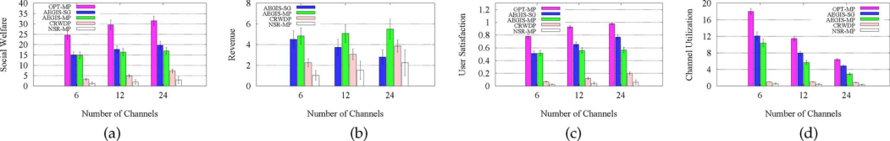

Fig. 8. Performance of OPT-MP, AEGIS, CRWDP, and NSR-MP on GoogleWiFi Dataset. (a) Social welfare. (b) Revenue. (c) Satisfaction ratio. (d) Channel utilization. 

some extent, are unfair. By incorporating the existing work, such as the envy-free solution concept [41], [42], we can design fairer payment schemes for AEGIS in our future work. 

## _C. Performance on GoogleWiFi Dataset_ 

Fig. 8 shows the system performance of AEGIS, CRWDP, NSR-MP, and OPT-MP on GoogleWiFi dataset when there are 6, 12, and 24 channels. Since channels are accessible to all buyers in this setting, we average the channel utilization on all channels on this dataset. Since the auction scale in this setting is relatively small, we can calculate the results of OPT-MP in all cases. Generally, the evaluation results are similar with those on Google Spectrum Dataset. Again, AEGIS achieves better performance than CRWDP and NSR-MP. Fig. 8 also shows that when the number of channels increases, the social welfare and satisfaction ratio increase, and channel utilization decreases. The reason is that fixing the number of buyers, larger supply of channels results in more trades in the auction, and thus increases social welfare and satisfaction ratio. The channel utilization decreases because buyers can be allocated to more channels when the number of channels increases. For revenue, AEGIS-SG decreases with the number of channels, while AEGIS-MP, CRWDP, and NSR-MP increase. The clearing price calculation in AEGIS-SG is based on critical bid. When a larger number of channels is accessible in the auction, more buyers are allocated channels, reducing the critical bids for winners. Hence, the revenue of AEGIS-SG decreases. Though the clearing price of CRWDP is also calculated based on critical bid, there still exist considerable losers when the number of channels becomes large. Therefore, the critical bids for winners still stay high, so that the revenue continues to grow with the increase of channels. The clearing prices of AEGIS-MP and NSR-MP are the bids of winners at the end of the auctions. Larger supply of channels leads to more winners, and thus revenues in AEGIS-MP and NSR-MP become higher. Again, because of buyers' manipulated strategies on channel demands, the performance of AEGIS degrades compared to the performance of OPT-MP. 

## VII. CONCLUSION 

Considering the five challenges for designing a practical spectrum auction mechanism, we have proposed AEGIS, which is the first framework of unknown combinatorial auction mechanisms for heterogeneous spectrum redistribution. For the case with unknown single-minded buyers, we have designed a direct revelation combinatorial auction mechanism, call AEGIS-SG. AEGIS-SG achieves strategy-proofness and approximately efficient social welfare. We have further considered the case with unknown multi-minded buyers and designed an iterative ascending combinatorial auction, namely AEGIS-MP. AEGIS-MP is implemented in undominated strategies and has a good approximation ratio. We have implemented AEGIS, and evaluated its performance on two datasets. Compared to the existing work, AEGIS achieves superior performance in terms of social welfare, revenue, satisfaction ratio, and channel utilization. 

## REFERENCES 

- [1] International Telecommunication Union, Geneva, Switzerland, “Radio regulations,” 2012. 

- [2] “Spectrum Bridge,” [Online]. Available: http://www.spectrumbridge. com/Home.aspx 

- [3] Federal Communications Commission (FCC), “Federal Communications Commission,” [Online]. Available: http://www.fcc.gov/ 

- [4] P. Klemperer, “How (not) to run auctions: The European 3G telecom auctions,” _Eur. Econ. Rev._ , vol. 46, no. 4–5, pp. 829–845, 2002. 

- [5] Arthur D. Little, “LTE spectrum and network strategies,” 2012 [Online]. Available: http://www.adlittle.com/downloads/tx_adlreports/ ADL_LTE_Spectrum_Network_Strategies.pdf 

- [6] M. Babaioff, R. Lavi, and E. Pavlov, “Single-value combinatorial auctions and algorithmic implementation in undominated strategies,” _J. ACM_ , vol. 56, no. 1, pp. 4:1–4:32, 2009. 

- [7] M. Babaioff, R. Lavi, and E. Pavlov, “Mechanism design for singlevalue domains,” in _Proc. AAAI_ , 2005, pp. 241–247. 

- [8] A. Archer and E. Tardos, “Truthful mechanisms for one-parameter agents,” in _Proc. IEEE FOCS_ , 2001, pp. 482–491. 

- [9] X. Zhou, S. Gandhi, S. Suri, and H. Zheng, “eBay in the sky: Strategyproof wireless spectrum auctions,” in _Proc. MobiCom_ , 2008, pp. 2–13. 

- [10] X. Zhou and H. Zheng, “TRUST: A general framework for truthful double spectrum auctions,” in _Proc. IEEE INFOCOM_ , 2009, pp. 999–1007. 

IEEE/ACM TRANSACTIONS ON NETWORKING, VOL. 24, NO. 3, JUNE 2016 

1932 

- [11] X. Feng, Y. Chen, J. Zhang, Q. Zhang, and B. Li, “TAHES: Truthful double auction for heterogeneous spectrums,” in _Proc. IEEE INFOCOM_ , 2012, pp. 3076–3080. 

- [12] M. Dong, G. Sun, X. Wang, and Q. Zhang, “Combinatorial auction with time-frequency flexibility in cognitive radio networks,” in _Proc. IEEE INFOCOM_ , 2012, pp. 2282–2290. 

- [13] Z. Zheng, F. Wu, and G. Chen, “SMASHER: A strategy-proof combinatorial auction mechanism for heterogeneous channel redistribution,” in _Proc. MobiHoc_ , 2013, pp. 305–308. 

- [14] P. Xu, S. Wang, and X.-Y. Li, “SALSA: Strategyproof online spectrum admissions for wireless networks,” _IEEE Trans. Comput._ , vol. 59, no. 12, pp. 1691–1702, Dec. 2010. 

- [15] J. Jia, Q. Zhang, Q. Zhang, and M. Liu, “Revenue generation for truthful spectrum auction in dynamic spectrum access,” in _Proc. MobiHoc_ , 2009, pp. 3–12. 

- [16] L. Gao, Y. Xu, and X. Wang, “MAP: Multiauctioneer progressive auction for dynamic spectrum access,” _IEEE Trans. Mobile Comput._ , vol. 10, no. 8, pp. 1144–1161, Aug. 2011. 

- [17] S.-P. Sheng and M. Liu, “Profit incentive in a secondary spectrum market: A contract design approach,” in _Proc. IEEE INFOCOM_ , 2013, pp. 836–844. 

- [18] K. Jagannathan, I. Menache, G. Zussman, and E. Modiano, “Non-cooperative spectrum access: The dedicated vs. free spectrum choice,” in _Proc. MobiHoc_ , 2011, Art. no. 10. 

- [19] M. Hoefer and T. Kesselheim, “Secondary spectrum auctions for symmetric and submodular bidders,” in _Proc. EC_ , 2012, pp. 657–671. 

- [20] S. Dobzinski, “An impossibility result for truthful combinatorial auctions with submodular valuations,” in _Proc. STOC_ , 2011, pp. 139–148. 

- [21] C. Papadimitriou, M. Schapira, and Y. Singer, “On the hardness of being truthful,” in _Proc. IEEE FOCS_ , 2008, pp. 250–259. 

- [22] A. Mu'alem and N. Nisan, “Truthful approximation mechanisms for restricted combinatorial auctions,” _Games Econ. Behav._ , vol. 64, no. 2, pp. 612–631, 2008. 

- [23] P. Briest, P. Krysta, and B. Vöcking, “Approximation techniques for utilitarian mechanism design,” in _Proc. STOC_ , 2005, pp. 39–48. 

- [24] X. Zhou _et al._ , “Practical conflict graphs for dynamic spectrum distribution,” in _Proc. SIGMETRICS_ , 2013, pp. 5–16. 

- [25] N. Nisan, “Bidding and allocation in combinatorial auctions,” in _Proc. EC_ , 2000, pp. 1–12. 

- [26] M. J. Osborne and A. Rubenstein _, A Course in Game Theory_ . Cambridge, MA, USA: MIT Press, 1994. 

- [27] A. Mas-Colell, M. D. Whinston, and J. R. Green _, Microeconomic Theory_ . Oxford, U.K.: Oxford Press, 1995. 

- [28] D. Lehmann, L. I. Oćallaghan, and Y. Shoham, “Truth revelation in approximately efficient combinatorial auctions,” _J. ACM_ , vol. 49, no. 5, pp. 577–602, 2002. 

- [29] M. O. Jackson, “Implementation in undominated strategies: A look at bounded mechanisms,” _Rev. Econ. Studies_ , vol. 59, no. 4, pp. 757–775, 1992. 

- [30] W. Vickrey, “Counterspeculation, auctions, and competitive sealed tenders,” _J. Finance_ , vol. 16, no. 1, pp. 8–37, 1961. 

- [31] E. H. Clarke, “Multipart pricing of public goods,” _Public Choice_ , vol. 11, no. 1, pp. 17–33, 1971. 

- [32] T. Groves, “Incentives in teams,” _Econometrica_ , vol. 41, no. 4, pp. 617–631, 1973. 

- [33] S. Bikhchandani and J. G. Riley, “Equilibria in open common value auctions,” _J. Econ. Theory_ , vol. 53, no. 1, pp. 101–130, 1991. 

- [34] Y. Fujishima, D. McAdams, and Y. Shoham, “Speeding up ascending-bid auctions,” in _Proc. IJCAI_ , 1999, pp. 554–559. 

- [35] G. L. Albano, F. Germano, and S. Lovo, “Ascending auctions for multiple objects: The case for the Japanese design,” _Econ. Theory_ , vol. 28, no. 2, pp. 331–355, 2006. 

- [36] M. Babaioff, R. Lavi, and E. Pavlov, “Single-value combinatorial auctions and implementation in undominated strategies,” in _Proc. SODA_ , 2006, pp. 1054–1063. 

- [37] “Google Spectrum Database,” [Online]. Available: https://www. google.com/get/spectrumdatabase/ 

- [38] “WiGLE,” [Online]. Available: https://wigle.net/ 

- [39] D. Tse and P. Viswanath _, Fundamentals of Wireless Communication_ . Cambridge, U.K.: Cambridge Univ. Press, May 2005. 

- [40] R. K. Jain, D.-M. W. Chiù, and W. R. Hawe, “A quantitative measure of fairness and discrimination for resource allocation in shared computer systems,” Eastern Research Laboratory, Digital Equipment Corporation, 1984. 

- [41] A. V. Goldberg and J. D. Hartline, “Envy-free auctions for digital goods,” in _Proc. EC_ , 2003, pp. 29–35. 

- [42] V. Guruswami _et al._ , “On profit-maximizing envy-free pricing,” in _Proc. SODA_ , 2005, pp. 1164–1173. 

**Zhenzhe Zheng** is a graduate student with the Department of Computer Science and Engineering, Shanghai Jiao Tong University, Shanghai, China. His research interests include algorithmic game theory and resource management in wireless networking and data centers. 

**Fan Wu** (M’10) received the B.S. degree in computer science from Nanjing University, Nanjing, China, in 2004, and the Ph.D. degree in computer science and engineering from the State University of New York at Buffalo, Buffalo, NY, USA, in 2009. 

He is an Associate Professor with the Department of Computer Science and Engineering, Shanghai Jiao Tong University, Shanghai, China. He has visited the University of Illinois at Urbana-Champaign (UIUC), Urbana, IL, USA, as a Post-Doctoral Research Associate. He has published more than 90 peer-reviewed papers in leading technical journals and conference proceedings. His research interests include wireless networking and mobile computing, algorithmic game theory and its applications, and privacy preservation. 

Dr. Wu has served as the Chair of CCF YOCSEF Shanghai, on the Editorial Board of _Computer Communications_ , and as the member of technical program committees of more than 40 academic conferences. He is a recipient of the China National Natural Science Fund for Outstanding Young Scientists, CCF-Intel Young Faculty Researcher Program Award, and CCF-Tencent “Rhinoceros bird” Open Fund, and is a Pujiang Scholar. 

**Shaojie Tang** (S’09–A’12–M’14) received the Ph.D. degree in computer science from the Illinois Institute of Technology, Chicago, IL, USA, in 2012. 

He is currently an Assistant Professor with the Naveen Jindal School of Management, University of Texas at Dallas, Richardson, TX, USA. His research interest includes social networks, mobile commerce, game theory, e-business, and optimization. 

Dr. Tang served in various positions (as chair and TPC member) at numerous conferences, including ACM MobiHoc and IEEE ICNP. He is an Editor for _Information Processing in Agriculture_ and the _International Journal of Distributed Sensor Networks_ . He received the Best Paper awards in ACM MobiHoc 2014 and IEEE MASS 2013. He also received the ACM SIGMobile Service Award in 2014. 

**Guihai Chen** (M’05) received the B.S. degree in computer science from Nanjing University, Nanjing, China, in 1984, the M.E. degree in computer engineering from Southeast University, Nanjing, China, in 1987, and the Ph.D. degree in computer science from the University of Hong Kong, Hong Kong, in 1997. 

He is a Distinguished Professor with Shanghai Jiaotong University, Shanghai, China. He had been invited as a Visiting Professor by many universities including Kyushu Institute of Technology, Kitakyushu, Japan, in 1998; University of Queensland, Brisbane, Australia, in 2000; and Wayne State University, Detroit, MI, USA, during 2001 to 2003. He has published more than 200 peer-reviewed papers, and more than 120 of them are in well-archived international journals such as the IEEE TRANSACTIONS ON PARALLEL AND DISTRIBUTED SYSTEMS, _Journal of Parallel and Distributed Computing_ , _Wireless Networks_ , _The Computer Journal_ , _International Journal of Foundations of Computer Science_ , and _Performance Evaluation_ , and also in well-known conference proceedings such as HPCA, MOBIHOC, INFOCOM, ICNP, ICPP, IPDPS, and ICDCS. He has a wide range of research interests with focus on sensor network, peer-to-peer computing, high-performance computer architecture, and combinatorics. 

