# **Optimal Search Segmentation Mechanisms for Online Platform Markets** 

Zhenzhe Zheng1(B) and R. Srikant2 

> 1 Coordinated Science Lab, University of Illinois at Urbana-Champaign, 

Champaign, USA 

zhenzhe@illinois.edu 

> 2 Coordinated Science Lab, Department of Electrical and Computer Engineering, University of Illinois at Urbana-Champaign, Champaign, USA 

rsrikant@illinois.edu 

**Abstract.** Online platforms, such as Airbnb, hotels.com, Amazon, Uber and Lyft, can control and optimize many aspects of product search to improve the efficiency of marketplaces. Here we focus on a common model, called the discriminatory control model, where the platform chooses to display a subset of sellers who sell products at prices determined by the market and a buyer is interested in buying a single product from one of the sellers. Under the commonly-used model for single product selection by a buyer, called the multinomial logit model, and the Bertrand game model for competition among sellers, we show the following result: to maximize social welfare, the optimal strategy for the platform is to display all products; however, to maximize revenue, the optimal strategy is to only display a subset of the products whose qualities are above a certain threshold. This threshold depends on the quality of all products, and can be computed in linear time in the number of products. 

**Keywords:** Online platform markets _·_ Bertrand competition game _·_ Search segmentation 

## **1 Introduction** 

In recent years, we have witnessed the rise of many successful online platform markets, which have reshaped the economic landscape of modern world. The online platforms facilitate the exchange of goods and services between buyers and sellers. For example, buyers can purchase goods from sellers on Amazon, eBay and Etsy, arrange accommodation from hosts on Airbnb and Expedia, order transportation services from drivers on Uber and Lyft, and find qualified workers on online labor markets, such as Upwork and Taskrabbit. The total 

Research supported by NSF grants NeTS 1718203, CPS ECCS 1739189, CMMI 1562276, ECCS 16-09370, China Postdoctoral Science Foundation NO. 2018M642018. 

> _⃝_ c Springer Nature Switzerland AG 2019 I. Caragiannis et al. (Eds.): WINE 2019, LNCS 11920, pp. 301–315, 2019. https://doi.org/10.1007/978-3-030-35389-6_22 

302 Z. Zheng and R. Srikant 

market value of online platforms has exceeded 4.3 trillion dollars worldwide, and is growing quickly [10]. 

Compared with traditional markets, the modern online marketplaces have greater controls over price determination, search and discovery, information revelation, recommendation, etc. For example, Uber and Lyft adopt the _full control model_ , in which the ride-sharing platforms use online matching algorithms to determine matches between drivers and riders as well as the fee for the route. Amazon and Airbnb use the _discriminatory control model_ , where the platforms only control the list of products to display for each buyer’s search, and the potential matches and transaction prices are determined by the preference of buyers and the competition among sellers. The platform can also use other types of control, such as commissions/subscriptions fees [7], to influence the outcomes of markets. The rich control options for online platforms have led to an increasing discussion about the design of online marketplaces with different optimization objectives [4,5,14]. 

In this paper, we investigate social welfare and revenue optimization under the discriminatory control model for online marketplaces. In the discriminatory control model, the platform has only control over _search segmentation mechanisms - which products to display for each buyer’s search_ , and the transaction prices are endogenously determined by the competition among sellers. Unlike traditional firms, most online platforms do not manufacture goods or provide services, and thus they also do not dictate the specific transaction prices. Instead, buyers and sellers jointly determine the prices at which the goods or services will be traded. For example, sellers set prices for their goods on Amazon, hosts decide on the price for their properties on Airbnb, and freelancers negotiate employers with hourly fee on Upwork. These prices depend on the demand and supply for comparable goods and services in the market, and choosing different products to display for buyers impacts the transaction prices and then the social welfare and revenue. Motivated by this, we study the role of search segmentation mechanisms in social welfare and revenue optimization in the discriminatory control model with endogenous prices. 

To calculate the social welfare and revenue, we first need to specify demand and supply in online marketplaces. Much of prior work simply represent the demand/supply curves with non-increasing/non-decreasing distributions [5,7]. Instead, we consider a demand and supply function derived from a basic market setting in which each seller has one unit of product to offer, and each buyer demands at most one unit of product chosen from the products displayed to her1 . Given the quality and prices of products, the demand for each product is equivalent to the proportion of potential buyers that purchase such a product. Thus, the demand function is closely related to the purchase behaviors of buyers who face multiple substitutable products. We adopt the standard multinomial logit (MNL) model [16] to describe buyers’ choice behaviors, and then derive the demand as a softmax function. With such a specific demand function, 

> 1 Throughout the article, we use product to refer good/service, and use the terms of product and seller interchangeably. 

Optimal Search Segmentation Mechanisms for Online Platform Markets 

303 

we can model the competition among sellers via a Bertrand price competition game, which is a useful model for investigating oligopolistic competition in real markets [23]. For instance, the Bertrand game can model the situation where the hosts on Airbnb compete for potential guests by setting prices for their properties. The basic questions for the Bertrand competition game are existence, uniqueness, closed-form expression and learning algorithm of the equilibrium. The results in [2,11] have shown that there exists a unique (pure) Nash equilibrium in the Bertrand game with a MNL model. Furthermore, the Nash equilibrium coincides with the solution of a system of first-order-condition equations. We can then characterize the Nash equilibrium in a “closed” form, and express the equilibrium social welfare/revenue by employing a variant of Lambert W function [8]. We also derive myopic learning strategies, _i.e._ , best response dynamics, for sellers to reach the Nash equilibrium in practice. 

The online platform can further optimize the equilibrium social welfare/revenue by employing search segmentation mechanisms. Different sets of sellers involved in the Bertrand competition game lead to different equilibrium solutions. The goal of the search segmentation mechanisms is to efficiently choose a set of products to display for buyers (or in other words, choose a set of sellers to compete in the Bertrand game) that maximizes the equilibrium social welfare or revenue. This display control optimization problem is combinatorial in nature and the number of possible product sets can be very large, particularly when there are many potential products to offer. One of our main contributions is to identify the efficient and optimal search segmentation mechanism, which turns out to have a simple structure. We show that the online platform _will display all products to maximize equilibrium social welfare, but just display the top k__∗_ _highest quality products to maximize equilibrium revenue._ We also refer the optimal mechanism for revenue maximization as _quality-order mechanism._ The optimal threshold _k__∗_ depends on the quality of all products, and can be calculated in linear time in terms of the number of products. The optimality of such simple search segmentation mechanisms has crucial theoretical and practical implications. On the theoretical side, this result allows the platform to find the optimal set of displayed products in linear time, significantly reducing the computational complexity. On the practical side, optimality of quality-order mechanism is quite appealing as it guarantees that a lower quality product will not be chosen for display over a higher quality product. Moreover, in order to increase the opportunity of being selected, sellers would improve the quality of their products as product quality is the selection criteria of the optimal mechanism, which will benefit all the market participants in the long term. 

The optimality of the quality-order mechanism for revenue maximization is established by making a novel connection between the quasi-convexity of equilibrium revenue function and the optimal control decision on selecting displayed products. We show that in the Bertrand game with a given subset of sellers, the equilibrium revenue can be expressed as a quasi-convex function with respective to an independent variable, which is a one-to-one transformation of the quality of a candidate product. The property of quasi-convexity guarantees that the 

304 Z. Zheng and R. Srikant 

maximum revenue can be obtained at one of the two endpoints, which corresponds to the options of displaying the current set of products or involving a new product with the highest quality among the remaining products. With this critical observation, if the platform decides to add a new product, it will always select the available product with the highest quality. Thus, we can efficiently construct the optimal set of displayed products from any product set. Specifically, if the current product set does not contain all the top _k__∗_ products, we can further improve the equilibrium revenue by repeatedly replacing one currently selected product with an unselected product with a higher quality. 

Our work in this paper is related to work on the design of markets for networked platforms [1,5,6,15,19]. We present a detailed discussion of related work towards the end of the paper. Here, we briefly discuss the similarities and differences between our work and prior work on networked market platforms. In networked markets, there are buyers and sellers connected by a bipartite graph, where each link indicates that a specific buyer is allowed to buy from a specific seller. The goal is to remove links from the complete bipartite graph to maximize either social welfare or revenue. However, much of the prior work focuses on a linear price-demand curve which does not explicitly model situations where each buyer is interested in buying only one product (such as one copy of a book) and each buyer takes into account the quality of each product (available typically in the form of reviews) while making a buying decision. For such situations, economists use the MNL model, which we have adopted in this paper. On the other hand, compared to prior work on networked markets, we only consider a much simpler bipartite graph where there is only one representative buyer. Such a model is appropriate when there are no capacity constraints for products at a seller, for example, each seller may have many copies of a book and there is no danger of immediately selling out a particular book title. The model is also appropriate for hotels.com-type settings in situations when most hotels have multiple available rooms. In situations where multiple buyers are performing searches simultaneously and hotels are about to sell out of rooms, capacity constraints do matter. Such capacity-constrained situations have not been studied either in this paper or in prior work, and is a topic for future research. 

We now summarize the main contributions of this paper. 

- We introduce a stylized model to capture the main features of online platform markets. We explicitly model the market, where each buyer is interested in purchasing one product, and takes into account the quality of products when making choice. Specifically, the demand function for products is derived from the multinomial logit (MNL) choice model, and the supply response of sellers is described by the outcome of Bertrand competition game. We show that the Bertrand game exists a unique (pure) Nash equilibrium, and the best response dynamics converge to the equilibrium. We also explicitly express the social welfare and revenue under the equilibrium. 

- We design efficient search segmentation mechanisms to optimize equilibrium social welfare and revenue under the Bertrand model of competition. We first prove that it is optimal to display all products to maximize social welfare. For 

Optimal Search Segmentation Mechanisms for Online Platform Markets 

305 

revenue maximization, we then show that the optimal mechanism, referred to as quality-order mechanism, only needs to display the top _k__∗_ highest quality products, where the optimal number of products _k__∗_ can be found in linear time. 

- We prove the result for social welfare maximization by showing the equilibrium social welfare function is decreasing with respective to an independent variable, which also decreases for involving a new product. We establish the optimality of the quality-order mechanism for revenue maximization by making a novel connection between the quasi-convexity of equilibrium revenue function and the optimal decision on selecting displayed products. 

## **2 Preliminaries** 

We consider a two-sided market with _n_ sellers S = _{_ 1 _,_ 2 _, · · · , n}_ and one _representative_ buyer, representing a set of homogeneous buyers. Each seller _i ∈_ S offers a product with quality _θi_ and price _pi_ . We denote the quality and price vectors by **_θ_** = ( _θ_ 1 _, θ_ 2 _, · · · , θn_ ) and **_p_** = ( _p_ 1 _, p_ 2 _, · · · , pn_ ), respectively. The quality vector **_θ_** is fixed, while the price vector **_p_** is determined by the competition among sellers. Without loss of generality, we assume the products’ quality and prices are non-negative, _i.e._ , _θi ≥_ 0 and _pi ≥_ 0, and the sellers are sorted according to the product quality in a non-decreasing order, _i.e._ , _θ_ 1 _≥ θ_ 2 _≥· · · ≥ θn_ . Given the quality **_θ_** and prices **_p_** of all products, the buyer purchases one of the _n_ products, or adopts an outside option, _i.e._ , buys nothing from this market. We normalize the problem parameters so that outside option’s quality _θ_ 0 and price _p_ 0 are zero, _i.e._ , _θ_ 0 = _p_ 0 = 0. 

In the random utility model [17], the buyer derives utility _ui_ from purchasing the product _i ∈_ S or selecting the outside option _i_ = 0 as follows 

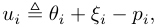

where _ξi_ is a random variable representing buyer’s (private) preference about the _i_ th alternative. Given the _n_ +1 choices ( _n_ products and the outside option), the buyer selects the alternative with the maximum utility. Under the standard assumption that the random variables _{ξi}_ are independent and identically distributed (i.i.d.) with Gumbel distribution [3,12], it can be shown [3,16] that the buyer selects the alternative _i ∈{_ 0 _} ∪_ S with probability 

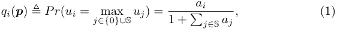

where _ai_ = exp( _θi − pi_ ) for all _i ∈_ S. We refer to _qi_ as _demand_ or _market share_ of the alternative _i ∈{_ 0 _} ∪_ S. We can also interpret _qi_ as the expected sales of quantity of product _i_ normalized by the total number of potential buyers. This choice model is known as multinomial logit (MNL) model in economic literature [3,12,16]. We use **_q_** = ( _q_ 0 _, q_ 1 _, · · · , qn_ ) to denote the demands of products. 

306 Z. Zheng and R. Srikant 

Under the above model, we can also obtain an explicit form for the utility _u_ ¯ of the representative buyer 

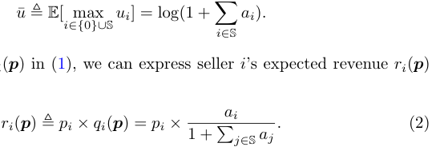

From the demand _qi_ ( **_p_** ) in (1), we can express seller _i_ ’s expected revenue _ri_ ( **_p_** ) in terms of prices 

The social welfare of the two-sided market is measured by the sum of buyer’s utility and the total revenue of sellers, _i.e._ , 

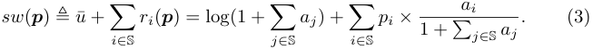

The revenue of the market is the total revenue of all sellers, _i.e._ , 

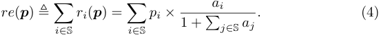

We now note the relation between price and demand in the MNL model, which would be quite useful for optimization and analysis later. Using the price-demand model in (1), we can express the price _pi_ in terms of demands **_q_** : 

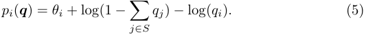

The social welfare and revenue optimization would become convenient if we work with the demands **q** rather than the prices **p** . For example, the social welfare and revenue functions are not concave in **p** , but become jointly concave if we express the functions in terms of **q** [9,13,21]. We can leverage this property to derive the optimal prices for social welfare and revenue maximization in the full control model, where the platform can control both price and displayed products. We leave the detailed discussion in Appendix A of technical report [24]. 

## **3 Bertrand Competition Game** 

In discriminatory control model, the online platform can only control the list of products to display for buyers, and the transaction prices are endogenously determined by the oligopolistic competition among sellers. In a Bertrand competition game, the seller of each product sets a price. Based on the prices of the products and the set of available products, the market produces a certain demand for each product. In our MNL model, the demand is simply the probability with which a product will be purchased by the buyer. This is the typical situation in a Airbnb-like model, where the owner of each rental unit sets a price, 

Optimal Search Segmentation Mechanisms for Online Platform Markets 

307 

the platform controls the manner in which the rental units are displayed, and the renter selects a unit to rent. 

In this section, we investigate the existence and uniqueness of equilibrium in the Bertrand competition game, explicitly express the equilibrium social welfare/revenue, and derive the best response dynamics to reach the Nash equilibrium. We assume that only a subset _S ⊆_ S of sellers are involved in the game. In other words, we assume that the platform has chosen to display the products of a subset _S_ of the sellers. In the next section, we will show how the choice of _S_ can be optimized by the platform to maximize either social welfare or revenue. 

In the Bertrand competition game, seller _i ∈ S_ selects price _pi_ to maximize her revenue _ri_ ( **_p_** ) = _pi × qi_ ( **_p_** ), where the demand _qi_ ( **_p_** ) is determined by the prices **_p_** of all products in (1). We can formally represent the Bertrand game as a triplet _G__b_ = ( _S,_ ( _Pi_ ) _i∈S,_ ( _ri_ ) _i∈S_ ), where _S_ is a set of players, _Pi_ is the strategy space of player _i ∈ S_ ( _i.e._ , _Pi_ ≜ _{pi|pi ≥_ 0 _}_ ), and _ri_ ( **_p_** ) is the payoff of player _i ∈ S_ . We represent the set of strategy profiles by _P_ = _P_ 1 _× P_ 2 _× · · · × Pn_ . We also denote the strategy profile **_p_** _∈P_ as **_p_** = ( _pi,_ **_p_** _−i_ ), where **_p_** _−i_ is the strategies (or prices) of all the players except _i_ . For such Bertrand game, we have the following result from [11]. 

**Theorem 1.** _There exists a unique (pure) Nash equilibrium in the Bertrand game G__b_ = ( _S,_ ( _Pi_ ) _i∈S,_ ( _ri_ ) _i∈S_ ) _. A vector of prices_ **_p_ ¯** = (¯ _p_ 1 _,_ ¯ _p_ 2 _, · · · ,_ ¯ _pn_ ) _∈P satisfies ∂ri_ ( **_p_ ¯** ) _/∂pi_ = 0 _for all i ∈ S if and only if_ **_p_ ¯** _is a Nash equilibrium in P._ 

We next calculate a closed-form expression for the Nash equilibrium prices **_p_ ¯** . For each seller _i ∈ S_ , by the first-order condition _∂ri_ ( **_p_ ¯** ) _/∂pi_ = 0, we have the following relation for _p_ ¯ _i_ : 

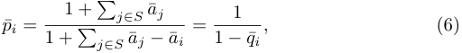

where ¯ _ai_ ≜ exp( _θi −p_ ¯ _i_ ) and _q_ ¯ _i_ is the demand of product _i_ at the equilibrium, _i.e._ , _q_ ¯ _i_ ≜ _a_ ¯ _i/_ (1+� _j∈S__a_¯_j_). From the price function in (5) and with some calculations applied to (6), we have the following equations 

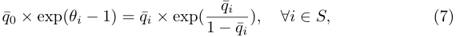

where _q_ ¯0 ≜ 1 _−_� _j∈S__q_¯_j_istheprobabilityofthebuyerthatpurchasesnothing. We introduce a function _V_ ( _x_ ) : (0 _,_ + _∞_ ) _→_ (0 _,_ 1), such that for any _x ∈_ (0 _, ∞_ ), _V_ ( _x_ ) is the solution _v ∈_ (0 _,_ 1) satisfying 

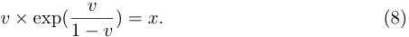

We can verify that _V_ ( _x_ ) is a strictly increasing and concave function over [0 _,_ + _∞_ ). This function is similar to the Lambert function _W_ ( _x_ ) [8], which is the solution _w_ satisfying _w × exp_ ( _w_ ) = _x_ . With the function _V_ ( _x_ ) and (7), we can obtain a closed-form expression for the demand _q_ ¯ _i_ = _V_ (¯ _q_ 0 _×_ exp( _θi −_ 1)) _._ 

308 Z. Zheng and R. Srikant 

Combing with the definition of _q_ ¯0, we can determine _q_ ¯0 by solving the following single-variable equation 

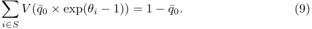

This equation has a unique solution because _V_ ( _x_ ) is a strictly increasing function. We also refer this equation as the equilibrium constraint. The next theorem presents a closed-form expression for the Nash equilibrium solution in the Bertrand competition game. 

**Theorem 2.** _In the Bertrand game G__b_ = ( _S,_ ( _Pi_ ) _i∈S,_ ( _ri_ ) _i∈S_ ) _, the Nash equilibrium price p_ ¯ _i and the demand q_ ¯ _i for each product i ∈ S are given by_ 

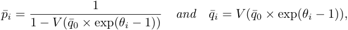

_where q_ ¯0 _is the unique solution to (9)._ 

Substituting the equilibrium solutions into (3), we obtain the equilibrium social welfare in the Bertrand game with the sellers _S ⊆_ S 

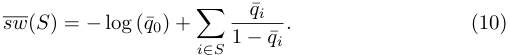

By (4), we can similarly get the equilibrium revenue in the Bertrand game with the set of sellers _S ⊆_ S 

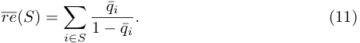

Instead of directly deriving the equilibrium strategies in one single step, in practice, the sellers may employ some simple, natural and myopic learning algorithms, such as best response, fictitious play or no-regret learning algorithm, to interact with each other and eventually reach the equilibrium. One straightforward procedure for sellers in online platform markets to reach the Nash equilibrium is best response dynamics. Specifically, suppose that the current vector of price **p** is not a Nash equilibrium, and a seller _i ∈ S_ deviates by setting a new _p__∗_ _i_,whichistheoptimalpricewithrespectivetotheotherprices**p** _−i_,_i.e._, 

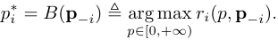

We can verify that the revenue function _ri_ ( _p,_ **p** _−i_ ) is strictly quasi-concave in _p_ , and thus it is not easy to explicitly solve the above optimization problem. One key observation is that the revenue function is strictly concave in the domain of the demand, which enables us to obtain closed-form expressions for the best response strategies, as shown in the following lemma. 

Optimal Search Segmentation Mechanisms for Online Platform Markets 309 

**Lemma 1.** _The best response price p__∗_ _i__withrespectivetoafixedpricevector_**_p_** _−i can be calculated as_ 

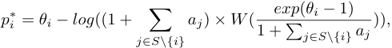

_where W_ ( _x_ ) _is the Lambert function and aj_ = _exp_ ( _θj − pj_ ) _for all j ∈ S._ 

The proof of Lemma 1 is in Appendix B of technical report [24]. We further have the following result for such best response dynamics in the Bertrand game. 

**Lemma 2.** _From an arbitrary price vector_ **_p_** _, the best response dynamics converge to the Nash equilibrium of the Bertrand game in a finite number of steps._ 

The basic idea to derive this result is to show the Bertrand game is an ordinal potential game [18] with a finite value; the detailed proof of Lemma 2 is in Appendix C of technical report [24]. 

## **4 Optimal Segmenting Mechanisms** 

In online marketplaces, the platform has control over search segmentation mechanisms - which set of products to display for a buyer. The platform can display any set of products, and the competition among selected sellers then takes place endogenously through the Bertrand game in Sect. 3. The goal of the platform is to decide the optimal products _S__∗_ _⊆_ S to display, in order to maximize the equilibrium social welfare/revenue. For _n_ potential products in the market, there are 2_n_ _−_ 1 possible sets of products, thus an exhaustive search to determine the optimal set of displayed products is infeasible. We also note that the equilibrium constraint (9) imposed by the Bertrand competition game is highly nonlinear, which presents another challenge in deriving the optimal search segmentation mechanisms. In this section, we exploit the structure of social welfare/revenue functions to efficiently design the optimal search segmentation mechanisms. 

### **4.1 Social Welfare Maximization** 

In the following theorem, we show the online platform would display all products to maximize social welfare. 

**Theorem 3.** _For social welfare maximization, the optimal search segmentation mechanism is to display all products_ S _in the platform._ 

_Proof._ We prove this theorem by showing that adding a new product will always improve the equilibrium social welfare. Suppose the platform has already selected sellers _S ⊂_ S, and consider introducing a new product _j ∈_ S _\S_ . According to (10), we can express the equilibrium social welfare _~~sw~~_ as 

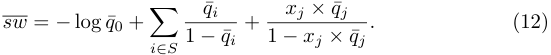

310 Z. Zheng and R. Srikant 

Here, _q_ ¯ _i_ is a function of _q_ 0, _i.e._ , _q_ ¯ _i_ = _V_ (¯ _q_ 0 _×_ exp( _θi −_ 1)) and _xj_ is an indicator for product _j ∈_ S _\S_ , where _xj_ = 1 denotes product _j_ is selected for display; otherwise _xj_ = 0. It is difficult to directly compare _~~sw~~_ with _xj_ = 1 and the one with _xj_ = 0. From (9), the demands **_q_** satisfy the equilibrium constraint: 

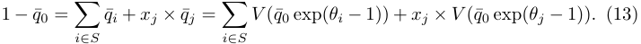

Since _V_ ( _x_ ) is an increasing function, we can observe from the above equation that _q_ ¯0 decreases when _xj_ changes from 0 to 1. Furthermore, with (12) and (13), we can express the equilibrium social welfare as a function of _q_ ¯0: 

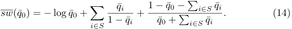

Thus, we only need to prove _~~sw~~_ <u>(</u> _q_ ¯0) is a decreasing function. The basic idea is to explicitly calculate the first derivative of _~~sw~~_ <u>(</u> _q_ ¯0), and show _~~sw~~__~~′~~_ (¯ _q_ 0) _<_ 0. We put the detailed proof of the following lemma in Appendix D of technical report [24]. 

**Lemma 3.** _The social welfare_ _~~sw~~_ <u>(</u> _q_ ¯0) _is a decreasing function._ 

From this lemma and the above discussion, we can always improve the equilibrium social welfare by adding a new product, which completes the proof. _⊓⊔_ 

### **4.2 Revenue Maximization** 

The optimal search segmentation mechanism with the objective of revenue maximization is different from the optimal mechanism when the platform attempts to maximize social welfare. To illustrate this difference, we consider two cases: a low quality case, _e.g._ , _θ_ 1 = _θ_ 2 = _· · ·_ = _θn_ = 0 _._ 5, and a high quality case, _e.g._ , _θ_ 1 = _θ_ 2 = _· · ·_ = _θn_ = 10. From the result in Theorem 3, the optimal mechanisms for social welfare maximization in these two cases are to display all products. However, for revenue maximization, it can be verified that the platform still displays all products in the low quality case, but only selects the first product in the high quality case. The intuition behind this difference is that in some scenarios, the platform can further improve price and then revenue by reducing the competition among sellers. We next show the design rationale for the optimal search segmentation mechanisms for the revenue maximization. 

One critical decision the platform has to make is the following: given a set of products _S ⊂_ S, whether to just display the currently selected product set _S_ , or add a new product _j_ from S _\S_ . We refer to such a decision problem as the “incremental” problem. Similar to the discussion on social welfare maximization, given a set of selected products _S ⊂_ S, we can represent the equilibrium revenue under these two decision options with the following function: 

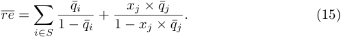

Optimal Search Segmentation Mechanisms for Online Platform Markets 311 

We recall that _xj_ is an indicator for product _j ∈_ S _\S_ , where _xj_ = 1 indicates that product _j_ is selected for display; otherwise _xj_ = 0. The demands _q_ ¯ _i_ ’s need to satisfy the following equilibrium constraint: 

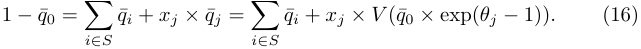

Since _V_ ( _x_ ) is an increasing function, we have a critical observation from (16): given a selected product set _S_ , _the quality θj of the potential product j ∈_ S _\S has a one-to-one and inverse relation with the demand q_ ¯0, _i.e._ , when _xj_ = 1, involving the product with a higher quality _θj_ leads to the lower value of _q_ 0. With this observation, we can derive the feasible range of the independent value _q_ ¯0. On the one hand, when the platform selects the available product with the highest quality, _i.e._ , the product _j ∈_ S _\S_ with _θj ≥ θj′_ for all _j__′_ _∈_ S _\S_ , the demand _q_ ¯0 achieves its lower bound at _q_ ¯0_min_ . On the other hand, setting _xj_ to 0 represent the case that the platform does not select any new product, and the corresponding demand _q_ ¯0_max_ in this case is the upper bound of _q_ ¯0. Thus, we have _q_ ¯0 _∈_ � _q_ ¯0_min_ _,_ ¯ _q_ 0_max_ � for the decision on selecting different product _j ∈_ S _\S_ . Using Eq. (16), we can replace _xj ×_ ¯ _qj_ with 1 _− q_ ¯0 _−_� _i∈S__q_¯_i_in (15) to express the equilibrium revenue as a function of _q_ ¯0: 

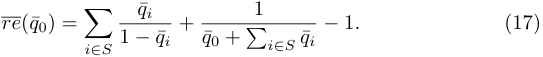

Such revenue function indeed captures the equilibrium revenue of making different decisions in the “incremental problem”. Specifically, adding a new product _j ∈_ S _\S_ ( _i.e._ , _xj_ = 1) or do not add anything ( _i.e._ , _xj_ = 0 for all _j ∈_ S _\S_ ) can obtain different values _q_ ¯0 calculated by (16), and then _~~re~~_ (¯ _q_ 0) from (17) is the corresponding equilibrium revenue. The property of the revenue function in (17), especially the quasi-convexity, is a key step to derive the optimal search segmentation mechanisms for revenue maximization. 

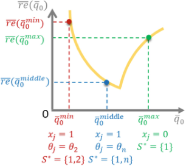

**Fig. 1.** _~~re~~_ <u>(</u> _q_ ¯0) is a quasi-convex revenue function for the possible product set to display when the product 1 has been selected. _~~re~~_ <u>(</u> _q_ ¯0_min_ ) is the revenue obtained by displaying _S__∗_ = _{_ 1 _,_ 2 _}_ , _~~re~~_ <u>(</u> _q_ ¯0_middle_ ) is the revenue from showing _S__∗_ = _{_ 1 _, n}_ , and _~~re~~_ <u>(</u> _q_ ¯0_max_ ) is the revenue of displaying _S__∗_ = _{_ 1 _}_ . 

312 Z. Zheng and R. Srikant 

Based on the above discussion, we show that the optimal search segmentation mechanism is to choose the _k__∗_ products with the best quality, for an appropriate value of _k__∗_ , using the following steps: 

- First, we show that one should always display the product with the best quality to maximize revenue (Lemma 4). 

- Then, we consider the decision of adding one product to display. As discussed previously, we show that _re_ ( _q_ 0) is quasi-concave in _q_ 0 which implies that the optimal decision is to add the next highest quality product or to not add a product at all, as illustrated in Fig. 1. The quasi-convexity of _re_ ( _q_ 0) is shown in Lemma 5 under a certain condition. Using the quasi-convexity of _re_ ( _q_ 0), in Lemma 6, we prove that if the optimal display set consists of _k__∗_ products, then one should select the top _k__∗_ products in terms of quality. 

- The final step is to find the optimal _k__∗_ . This can be done by the following calculation. For each possible value of _k__∗_ _∈{_ 2 _, · · · , n}_ , we select the top _k__∗_ products and calculate the revenue. We choose _k__∗_ to maximize this revenue. This is clearly a linear-time algorithm in _n_ , since one has to add one term to the expression for the revenue when we increase _k__∗_ by one. This result is summarized in Theorem 4. 

We first show that revenue maximization implies that the highest quality product is always selected for display. 

**Lemma 4.** _For revenue maximization, it is optimal to always display the product with the highest quality._ 

The intuition behind the proof is to show that for any displayed product set, the revenue function in (17) increases with the quality of the product with the highest quality in this set. The proof is in Appendix E of technical report [24]. 

Lemma 4 implies that when the optimal search segmentation mechanism is to display one product, _i.e._ , _k__∗_ = 1, the platform will choose the first product. To obtain the result for the general case with _k__∗_ _≥_ 2, we need to establish the quasi-convexity of the revenue function in (17). It is non-trivial to directly verify this property because the first term in the revenue function, _i.e._ , � _i∈S_ 1 _−q_ ¯ _<u>iq</u>_ ¯ _i_,isincreasingandconcavewithrespectiveto_q_0,whiletheremaining term <u>1</u> _q_ ¯0+~~�~~ _i∈S__q_¯_i−_1isdecreasingandconvex.Wefirstprovethedesiredquasi- convexity by assuming all demands _q_ ¯ _i_ ’s are less than 0 _._ 5, _i.e._ , _q_ 1 _<_ 0 _._ 5, due to _qi ≤ q_ 1 for _i ∈ S_ , meaning that no seller dominates the market. This assumption simplifies the analysis, but still preserves the major intuition. Our results also hold without this assumption, as shown in Appendix H of technical report [24]. 

**Lemma 5.** _For any selected product set S, the revenue function_ _~~re~~_ (¯ _q_ 0) _in (17) is quasi-convex in the range_ � _q_ ¯0_min_ _,_ ¯ _q_ 0_max_ � _, under the assumption of q_ 1 _<_ 0 _._ 5 _._ 

The basic idea to prove this result is to check the second-order conditions of a quasi-convex function, _i.e._ , at any point with zero slope, the second derivative is non-negative, _i.e._ , _~~re~~__~~′~~_ (¯ _q_ 0) = 0 _⇒_ _~~re~~__~~′~~′_ (¯ _q_ 0) _>_ 0. The details are in Appendix F of technical report [24]. Equipped with Lemma 5, we can derive the optimal search mechanism for the case with _k__∗_ _≥_ 2. 

Optimal Search Segmentation Mechanisms for Online Platform Markets 

313 

**Lemma 6.** _For revenue maximization, the optimal search segmentation mechanism is to display the top k__∗_ _products if the cardinality of the optimal product set is k__∗_ _≥_ 2 _, under the assumption of q_ 1 _<_ 0 _._ 5 _._ 

The optimality of the top _k__∗_ mechanism in this lemma can be established by showing that replacing any product with a product of higher quality will increase the revenue (see Appendix G in technical report [24] for the proof). 

While the specific value of _k__∗_ depends on the quality of all products **_θ_** , The platform can find the optimal _k__∗_ in linear time by computing the revenue of each set with the top _k ∈_ [1 _, n_ ] products, and selecting the one with the maximum revenue. Thus, from Lemmas 4 and 6, we obtain the main result for the case of revenue maximization. 

**Theorem 4.** _For revenue maximization, the optimal search segmentation mechanism is to display the top k__∗_ _products, where k__∗_ _is determined by the quality of all products_ **_θ_** _, and can be calculated in linear time._ 

## **5 Related Work** 

Our work is related to the burgeoning literature that studies online platform marketplaces of using control levels other than pricing to influence the market outcomes [4,5,7,14]. Kanoria and Saban designed a framework to facilitate the search for buyers and sellers on matching platforms, and found that simple restrictions on what buyers/sellers can access would boost social welfare [14]. Arnosti _et al._ investigated the welfare loss due to the uncertainty about seller availability in asynchronous dynamic matching markets, and also found that limiting the visibility of sellers can improve social welfare [4]. Our result, displaying only a subset of products to buyers can increase the equilibrium revenue, extends the findings in these two pieces of work to the context of revenue optimization. Banerjee _et al._ studied how the platform should control which sellers and buyers are visible to each other, and provided polynomial-time approximation algorithms to optimize social welfare and throughput [5]. In their model, supply and demand are associated with public distributions. By contrast, we adopt the MNL model to derive a specific demand system, and use the Bertrand game to capture supply response to this demand system, doing so leads to very different optimization problems. 

Revenue management under general demand model has been extensively studied in economics, marketing and operation management [9,20–22]. The model considered in this paper is closely related to that in assortment optimization, which is an active area in revenue management research. For assortment optimization, the demand of products are governed by the variants of attractionbased choice models [3], _e.g._ , MNL model, mixed nested logit model and nested logit model, and each product is associated with a fixed price. The objective is to find a set of products, or an assortment to offer that maximizes the expected revenue. In [22], Talluri and van Ryzin studied the assortment optimization problem under the MNL model, and showed that the optimal assortment includes a certain number of products with the highest prices. We also derive a similar result, 

314 Z. Zheng and R. Srikant 

but use the criteria of quality rather than price to rank the potential products. In our setting a key difference from this line of work is that the product prices are determined endogenously by the outcome of oligopolistic competition games instead of being given beforehand. Pricing multiple differentiated products in the context of the MNL model is another fairly active direction [9,13,21]. In this setting, all products are displayed, and the objective is to choose pries of products to maximize revenue. In contrast, we focus on search segmentation mechanisms with endogenous prices, where the platform only controls the set of displayed products, to optimize the equilibrium social welfare/revenue. 

## **6 Conclusion** 

In this paper, we have studied the problems of social welfare maximization and revenue maximization in designing search space for online platform markets. In the discriminatory control model, the platform can only control the search segmentation mechanisms, _i.e._ , determine the list of products to display for buyers, and the products’ prices are determined endogenously by the competition among sellers. Under the standard buyer choice model, namely the multinomial logit mode, we have developed efficient and optimal search segmentation mechanisms to maximize the equilibrium social welfare and revenue under Bertrand competition game. For social welfare maximization, it is optimal to display all the products. For revenue maximization, the optimal search mechanism, referred as quality-order mechanism, is to display the top _k__∗_ highest quality products, where _k__∗_ can be computed in at most linear time in the number of products. 

## **References** 

1. Abolhassani, M., Bateni, M.H., Hajiaghayi, M.T., Mahini, H., Sawant, A.: Network cournot competition. In: Liu, T.-Y., Qi, Q., Ye, Y. (eds.) WINE 2014. LNCS, vol. 8877, pp. 15–29. Springer, Cham (2014). https://doi.org/10.1007/978-3-31913129-0 ~~2~~ 

2. Aksoy-Pierson, M., Allon, G., Federgruen, A.: Price competition under mixed multinomial logit demand functions. Manage. Sci. **59** (8), 1817–1835 (2013) 

3. Anderson, S.P., De Palma, A., Thisse, J.-F.: Discrete Choice Theory of Product Differentiation. MIT Press, Cambridge (1992) 

4. Arnosti, N., Johari, R., Kanoria, Y.: Managing congestion in decentralized matching markets. In: EC, p. 451 (2014) 

5. Banerjee, S., Gollapudi, S., Kollias, K., Munagala, K.: Segmenting two-sided markets. In: WWW, pp. 63–72 (2017) 

6. Bimpikis, K., Ehsani, S., Ilkili¸c, R.: Cournot competition in networked markets. Manage. Sci. **65** (6), 2467–2481 (2019) 

7. Birge, J., Candogan, O., Chen, H., Saban, D.: Optimal commissions and subscriptions in networked markets. In: EC, pp. 613–614 (2018) 

8. Corless, R.M., Gonnet, G.H., Hare, D.E.G., Jeffrey, D.J., Knuth, D.E.: On the lambertw function. Adv. Comput. Math. **5** (1), 329–359 (1996) 

9. Dong, L., Kouvelis, P., Tian, Z.: Dynamic pricing and inventory control of substitute products. Manufact. Serv. Oper. Manag. **11** (2), 317–339 (2009) 

Optimal Search Segmentation Mechanisms for Online Platform Markets 

315 

10. Evans, P.C., Gawer, A.: The rise of the platform enterprise: a global survey (2016) 

11. Gallego, G., Huh, W.T., Kang, W., Phillips, R.: Price competition with the attraction demand model: existence of unique equilibrium and its stability. Manufact. Serv. Oper. Manag. **8** (4), 359–375 (2006) 

12. Guadagni, P.M., Little, J.D.C.: A logit model of brand choice calibrated on scanner data. Mark. Sci. **2** (3), 203–238 (1983) 

13. Hanson, W., Martin, K.: Optimizing multinomial logit profit functions. Manage. Sci. **42** (7), 992–1003 (1996) 

14. Kanoria, Y., Saban, D.: Facilitating the search for partners on matching platforms: restricting agent actions. In: EC, p. 117 (2017) 

15. Lin, W., Pang, J.Z.F., Bitar, E., Wierman, A.: Networked cournot competition in platform markets: access control and efficiency loss. In: CDC, pp. 4606–4611 (2017) 

16. McFadden, D.: Conditional logit analysis of qualitative choice behaviour. In: Zarembka, P. (ed.) Frontiers in Econometrics, pp. 105–142. Academic Press, New York (1974) 

17. McFadden, D.: The choice theory approach to market research. Mark. Sci. **5** (4), 275–297 (1986) 

18. Monderer, D., Shapley, L.S.: Potential games. Games Econ. Behav. **14** (1), 124–143 (1996) 

19. Pang, J.Z.F., Fu, H., Lee, W.I., Wierman, A.: The efficiency of open access in platforms for networked cournot markets. In: INFOCOM, pp. 1–9 (2017) 

20. Rusmevichientong, P., Shmoys, D., Tong, C., Topaloglu, H.: Assortment optimization under the multinomial logit model with random choice parameters. Prod. Oper. Manag. **23** (11), 2023–2039 (2014) 

21. Song, J.-S., Xue, Z.: Demand management and inventory control for substitutable products. Working paper (2007) 

22. Talluri, K., van Ryzin, G.: Revenue management under a general discrete choice model of consumer behavior. Manage. Sci. **50** (1), 15–33 (2004) 

23. Vives, X.: Oligopoly Pricing: Old Ideas and New Tools. MIT Press, Cambridge (2001) 

24. Zheng, Z., Srikant, R.: Optimal search segmentation mechanisms for online platform markets. Technical report (2019). https://drive.google.com/file/d/18esA BjxMvJbEkIvbdBruU1Ji5Am0KxJ/view 

