1 

# Optimal Search Segmentation Mechanisms for Online Platform Markets 

Zhenzhe Zheng, _Member, IEEE,_ and R. Srikant, _Fellow, IEEE_ 

**_Abstract_ —Online platforms, such as Airbnb, hotels.com, Amazon, Uber and Lyft, can control and optimize many aspects of product search to improve the efficiency of marketplaces. Here we focus on a common model, called the discriminatory control model, where the platform chooses to display a subset of sellers who sell products at prices determined by the market and a buyer is interested in buying a single product from one of the sellers. Under the commonly-used model for single product selection by a buyer, called the multinomial logit model, and the Bertrand game model for competition among sellers, we show the following result: to maximize social welfare, the optimal strategy for the platform is to display all products; however, to maximize revenue, the optimal strategy is to only display a subset of the products whose qualities are above a certain threshold. We extend our results to Cournot competition model, and show that the optimal search segmentation mechanisms for both social welfare maximization and revenue maximization also have such simple threshold structures. The threshold in each case depends on the quality of all products, the platform’s objective and seller’s competition model, and can be computed in linear time in the number of products.** 

## I. INTRODUCTION 

In recent years, we have witnessed the rise of many successful online platform markets, which have reshaped the economic landscape of modern world. The online platforms facilitate the exchange of goods and services between buyers and sellers. For example, buyers can purchase goods from sellers on Amazon, eBay and Etsy, arrange accommodation from hosts on Airbnb and Expedia, order transportation services from drivers on Uber and Lyft, and find qualified workers on online labor markets, such as Upwork and Taskrabbit. The total market value of online platforms has exceeded 4.3 trillion dollars worldwide, and is growing quickly [16]. 

One salient feature of these online platforms are that the market operators have fine-grained information about the underlying characteristics of transactions, and can leverage this knowledge to design effective and efficient market structure. Compared with traditional markets, the modern online marketplaces have greater controls over price determination, search and discovery, information revelation, recommendation, etc. For example, Uber and Lyft adopt _full control model_ , in which the ride-sharing platforms use online matching algorithms to determine matches between drivers and riders as well as the fee 

Z. Zheng was with the Coordinated Science Lab, University of Illinois at Urbana-Champaign, Urbana, IL 61801. E-mail: zhenzhe@illinois.edu 

R. Srikant are with the Coordinated Science Lab, Department of Electrical and Computer Engineering, University of Illinois at Urbana-Champaign, Urbana, IL 61801. E-mail: rsrikant@illinois.edu. 

A preliminary version of this paper was published in the proceedings of the 15th Conference on Web and Internet Economics (WINE), 2019 [39]. 

for the route. Amazon and Airbnb use _discriminatory control model_ , where the platforms only control the list of products to display for each buyer’s search, and the potential matches and transaction prices are determined by the preference of buyers and the competition among sellers. The platform can also use other types of control, such as commissions/subscriptions fees [8], to influence the outcomes of markets. The rich control options for online platforms have led to an increasing discussion about the design of online marketplaces with different optimization objectives [5], [6], [23], [28]. 

In this paper, we investigate social welfare and revenue optimization under the discriminatory control model for online marketplaces. In the discriminatory control model, the platform has only control over _search segmentation mechanisms - which products to display for each buyer’s search_ , and the transaction prices are endogenously determined by the competition among sellers. Unlike traditional firms, most online platforms do not manufacture goods or provide services, and thus they also do not dictate the specific transaction prices. Instead, buyers and sellers jointly determine the prices at which the goods or services will be traded. For example, sellers set prices for their goods on Amazon, hosts decide on the price for their properties on Airbnb, and freelancers negotiate employers with hourly fee on Upwork. These prices depend on the demand and supply for comparable goods and services in the market, and choosing different products to display for buyers impacts the transaction prices and then the social welfare and revenue. Motivated by this, we study the role of search segmentation mechanisms in social welfare and revenue optimization in the discriminatory control model with endogenous prices. 

To calculate the social welfare and revenue, we first need to specify demand and supply in online marketplaces. Much of prior work simply represent the demand/supply curves with non-increasing/non-decreasing distributions [6], [8]. Instead, we consider a demand and supply function derived from a basic market setting in which each seller has one unit of product to offer, and each buyer demands at most one unit of product chosen from the products displayed to her1 . Given the quality and prices of products, the demand for each product is equivalent to the proportion of potential buyers that purchase such a product. Thus, the demand function is closely related to the purchase behaviors of buyers who face multiple substitutable products. We adopt the standard multinomial logit (MNL) model [26] to describe buyers’ choice behaviors, 

> 1Throughout the article, we use product to refer good/service, and use the terms of product and seller interchangeably. 

2 

and then derive the demand as a softmax function. With such a specific demand function, we can model the competition among sellers via a Bertrand price competition game, which is a useful model for investigating oligopolistic competition in real markets [37]. For instance, the Bertrand game can model the situation where the hosts on Airbnb compete for potential guests by setting prices for their properties. The basic questions for the Bertrand competition game are existence, uniqueness, closed-form expression and learning algorithm of the equilibrium. The results in [2], [20] have shown that there exists a unique (pure) Nash equilibrium in the Bertrand game with a MNL model. Furthermore, the Nash equilibrium coincides with the solution of a system of firstorder-condition equations. We can then characterize the Nash equilibrium in a “closed” form, and express the equilibrium social welfare/revenue by employing a variant of Lambert W function [12]. We also derive myopic learning strategies, _i.e._ , best response dynamics, for sellers to reach the Nash equilibrium in practice. 

The online platform can further optimize the equilibrium social welfare/revenue by employing search segmentation mechanisms. Different sets of sellers involved in the Bertrand competition game lead to different equilibrium solutions. The goal of the search segmentation mechanisms is to efficiently choose a set of products to display for buyers (or in other words, choose a set of sellers to compete in the Bertrand game) that maximizes the equilibrium social welfare or revenue. This display control optimization problem is combinatorial in nature and the number of possible product sets can be very large, particularly when there are many potential products to offer. One of our main contributions is to identify the efficient and optimal search segmentation mechanism, which turns out to have a simple structure. We show that the online platform _will display all products to maximize equilibrium social welfare, but just display the top k__∗_ _highest quality products to maximize equilibrium revenue._ We also refer the optimal mechanism for revenue maximization as _quality-order mechanism._ The optimal threshold _k__∗_ depends on the quality of all products, and can be calculated in linear time in terms of the number of products. The optimality of such simple search segmentation mechanisms has crucial theoretical and practical implications. On the theoretical side, this result allows the platform to find the optimal set of displayed products in linear time, significantly reducing the computational complexity of searching for the optimal solution. On the practical side, optimality of quality-order mechanism is quite appealing as it guarantees that a lower quality product will not be chosen for display over a higher quality product. Moreover, in order to increase the opportunity of being selected, sellers would improve the quality of their products as product quality is the selection criteria of the optimal mechanisms, which will benefit all the market participants in the long term. 

The optimality of the quality-order mechanism for revenue maximization is established by making a novel connection between the quasi-convexity of equilibrium revenue function and the optimal control decision on selecting displayed products. We show that in the Bertrand game with a given subset of sellers, the equilibrium revenue can be expressed as a quasi- 

convex function with respective to an independent variable, which is a one-to-one transformation of the quality of a candidate product. The property of quasi-convexity guarantees that the maximum revenue can be obtained at one of the two endpoints, which corresponds to the options of displaying the current set of products or involving a new product with the highest quality among the remaining products. With this critical observation, if the platform decides to add a new product, it will always select the available product with the highest quality. Thus, we can efficiently construct the optimal set of displayed products from any product set. Specifically, if the current product set does not contain all the top _k__∗_ products, we can further improve the equilibrium revenue by repeatedly replacing one currently selected product with an unselected product with a higher quality. 

Our work in this paper is related to work on the design of markets for networked platforms [6], [7], [25], [31]. We present a detailed discussion of related work towards the end of the paper. Here, we briefly discuss the similarities and differences between our work and prior work on networked market platforms. In networked markets, there are buyers and sellers connected by a bipartite graph, where each link indicates that a specific buyer is allowed to buy from a specific seller. The goal is to remove links from the complete bipartite graph to maximize either social welfare or revenue. However, much of the prior work focuses on a linear price-demand curve which does not explicitly model situations where each buyer is interested in buying only one product (such as one copy of a book) and each buyer takes into account the quality of each product (available typically in the form of reviews) while making a buying decision. For such situations, economists use the MNL model, which we have adopted in this paper. On the other hand, compared to prior work on networked markets, we only consider a much simpler bipartite graph where there is only one representative buyer. Such a model is appropriate when there are no capacity constraints for products at a seller, for example, each seller may have many copies of a book and there is no danger of immediately selling out a particular book title. The model is also appropriate for hotels.com-type settings in situations when most hotels have multiple available rooms. In situations where multiple buyers are performing searches simultaneously and hotels are about to sell out of rooms, capacity constraints do matter. Such capacity-constrained situations have not been studied either in this paper or in prior work, and is a topic for future research. We now summarize the main contributions of this paper. 

_•_ We introduce a stylized model to capture the main features of online platform markets. We explicitly model the market, where each buyer is interested in purchasing one product, and takes into account the quality of products when making choice. Specifically, the demand function for products is derived from the multinomial logit (MNL) choice model, and the supply response of sellers is described by the outcome of Bertrand competition game. We show that the Bertrand game exists a unique (pure) Nash equilibrium, and the best response dynamics converge to the equilibrium. We also explicitly express the social welfare and revenue under the equilibrium. 

_•_ We design efficient search segmentation mechanisms to 

3 

optimize equilibrium social welfare and revenue under the Bertrand model of competition. We first prove that it is optimal to display all products to maximize social welfare. For revenue maximization, we then show that the optimal mechanism, referred to as quality-order mechanism, only needs to display the top _k__∗_ highest quality products, where the optimal number of products _k__∗_ can be found in linear time. 

_•_ We prove the result for social welfare maximization by showing the equilibrium social welfare function is decreasing with respective to an independent variable, which also decreases for involving a new product. We establish the optimality of the quality-order mechanism for revenue maximization by making a novel connection between the quasi-convexity of equilibrium revenue function and the optimal decision on selecting displayed products. 

_•_ We extend our results to another classical oligopolistic competition model: Cournot competition game. We show that the optimal search segmentation mechanisms for both social welfare and revenue maximization in this model also falls into the simple quality-order mechanisms, in which the optimal threshold _k__∗_ depends on the product quality and the platform’s specific objective. 

## II. PRELIMINARIES 

We consider a two-sided market with _n_ sellers S = _{_ 1 _,_ 2 _, · · · , n}_ and one _representative_ buyer, representing a set of homogeneous buyers. Each seller _i ∈_ S offers a product with quality _θi_ and price _pi_ . We denote the quality and price vectors by **_θ_** = ( _θ_ 1 _, θ_ 2 _, · · · , θn_ ) and **_p_** = ( _p_ 1 _, p_ 2 _, · · · , pn_ ), respectively. The quality vector **_θ_** is fixed, while the price vector **_p_** is determined by the competition among sellers. Without loss of generality, we assume products’ quality and prices are non-negative, _i.e._ , _θi ≥_ 0 and _pi ≥_ 0, and the sellers are sorted according to product quality in a non-decreasing order, _i.e._ , _θ_ 1 _≥ θ_ 2 _≥· · · ≥ θn_ . Given the quality **_θ_** and prices **_p_** of all products, the buyer purchases one of the _n_ products, or adopts an outside option, _i.e._ , buys nothing from this market. We normalize the problem parameters so that outside option’s quality _θ_ 0 and price _p_ 0 are zero, _i.e._ , _θ_ 0 = _p_ 0 = 0. 

In the random utility model [27], the buyer derives utility _ui_ from purchasing the product _i ∈_ S or selecting the outside option _i_ = 0 as follows 

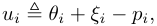

where _ξi_ is a random variable representing buyer’s (private) preference about the _i_ th alternative. Given the _n_ + 1 choices ( _n_ products and the outside option), the buyer selects the alternative with the maximum utility. Under the standard assumption that the random variables _{ξi}_ are independent and identically distributed (i.i.d.) with Gumbel distribution [4], [21], it can be shown [4], [26] that the buyer selects the alternative _i ∈{_ 0 _} ∪_ S with probability 

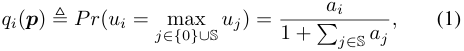

where _ai_ = exp( _θi − pi_ ) for all _i ∈_ S. We refer to _qi_ as _demand_ or _market share_ of the alternative _i ∈{_ 0 _} ∪_ S. We can also interpret _qi_ as the expected sales of quantity 

of product _i_ normalized by the total number of potential buyers. This choice model is known as multinomial logit (MNL) model in the economic literature [4], [21], [26]. We use **_q_** = ( _q_ 0 _, q_ 1 _, · · · , qn_ ) to denote the demands of products. 

Under the above model, we can also obtain an explicit form for the utility _u_ ¯ of the representative buyer 

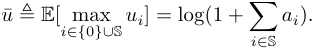

From the demand _qi_ ( **_p_** ) in (1), we can express seller _i_ ’s expected revenue _ri_ ( **_p_** ) in terms of prices 

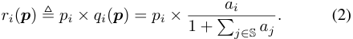

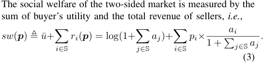

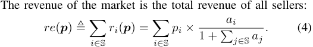

We now note the relation between price and demand in the MNL model, which would be quite useful for optimization and analysis later. Using the price-demand model in (1), we can express the price _pi_ in terms of demands **_q_** : 

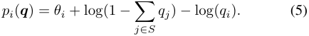

The social welfare and revenue optimization become convenient if we work with demands **q** rather than prices **p** . The social welfare and revenue functions are not concave in **p** , but become jointly concave if we express the functions in terms of **q** [15], [35], [22]. In Appendix A, we leverage this property to derive the optimal solutions for social welfare and revenue maximization in the full control model, where the platform can control both prices and displayed products. 

## III. BERTRAND COMPETITION GAME 

In discriminatory control model, the platform can only control the list of products to display for buyers, and the transaction prices are endogenously determined by the oligopolistic competition among sellers. In a Bertrand competition game, the seller of each product sets a price. Based on the prices of the products and the set of available products, the market produces a certain demand for each product. In our MNL model, the demand is just the probability with which a product will be purchased by the buyer. This is the typical situation in a Airbnb-like model, where the owner of each rental unit sets a price, the platform controls the manner in which the rental units are displayed, and the renter selects a unit to rent. 

In this section, we investigate the existence and uniqueness of equilibrium in the Bertrand competition game, explicitly express the equilibrium social welfare/revenue, and derive the best response dynamics to reach the Nash equilibrium. We assume that only a subset _S ⊆_ S of sellers are involved in the game. In other words, we assume that the platform has chosen 

4 

to display the products of a subset _S_ of the sellers. In the next section, we will show how the choice of _S_ can be optimized by the platform to maximize either social welfare or revenue. 

In the Bertrand competition game, seller _i ∈ S_ selects price _pi_ to maximize her revenue _ri_ ( **_p_** ) = _pi × qi_ ( **_p_** ), where the demand _qi_ ( **_p_** ) is determined by the prices **_p_** of all products in (1). We can formally represent the Bertrand game as a triplet _G__b_ = ( _S,_ ( _Pi_ ) _i∈S,_ ( _ri_ ) _i∈S_ ), where _S_ is a set of players, _Pi_ is the strategy space of player _i ∈ S_ ( _i.e._ , _Pi_ ≜ _{pi|pi ≥_ 0 _}_ ), and _ri_ ( **_p_** ) is the payoff of player _i ∈ S_ . We represent the set of strategy profiles by _P_ = _P_ 1 _× P_ 2 _× · · · × Pn_ . We also denote the strategy profile **_p_** _∈P_ as **_p_** = ( _pi,_ **_p_** _−i_ ), where **_p_** _−i_ is the strategies (or prices) of all the players except _i_ . For such Bertrand game, we have the following result from [20]. 

**Theorem 1.** _There exists a unique (pure) Nash equilibrium in the Bertrand game G__b_ = ( _S,_ ( _Pi_ ) _i∈S,_ ( _ri_ ) _i∈S_ ) _. A vector of prices_ **_p_ ¯** = (¯ _p_ 1 _,_ ¯ _p_ 2 _, · · · ,_ ¯ _pn_ ) _∈P satisfies ∂ri_ ( **_p_ ¯** ) _/∂pi_ = 0 _for all i ∈ S if and only if_ **_p_ ¯** _is a Nash equilibrium in P._ 

We next calculate a closed-form expression for the equilibrium prices **_p_ ¯** . For each seller, by the first-order condition _∂ri_ ( **_p_ ¯** ) _/∂pi_ = 0, we have the following relation for _p_ ¯ _i_ : 

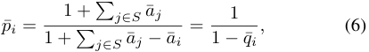

where _a_ ¯ _i_ ≜ exp( _θi − p_ ¯ _i_ ) and _q_ ¯ _i_ is the demand of product _i_ at the equilibrium, _i.e._ , _q_ ¯ _i_ ≜ _a_ ¯ _i/_ (1 +� _j∈S__a_¯_j_).Fromtheprice function in (5) and with some calculations applied to (6), we have the following equations 

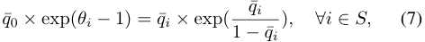

where _q_ ¯0 ≜ 1 _−_� _j∈S__q_¯_j_istheprobabilityofthebuyer that purchases nothing. We introduce a function _V_ ( _x_ ) : (0 _,_ + _∞_ ) _→_ (0 _,_ 1), such that for any _x ∈_ (0 _, ∞_ ), _V_ ( _x_ ) is the solution _v ∈_ (0 _,_ 1) satisfying 

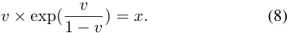

We can verify that _V_ ( _x_ ) is a strictly increasing and concave function over [0 _,_ + _∞_ ). This function is similar to the Lambert function _W_ ( _x_ ) [12], which is the solution _w_ satisfying _w × exp_ ( _w_ ) = _x_ . With the function _V_ ( _x_ ) and (7), we can obtain a closed-form expression for the demand 

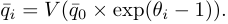

Combing with the definition of _q_ ¯0, we can determine _q_ ¯0 by solving the following single-variable equation 

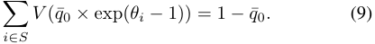

This equation has a unique solution because _V_ ( _x_ ) is a strictly increasing function. We also refer this equation as the equilibrium constraint. We next present a closed-form expression for the Nash equilibrium solution in this Bertrand game. 

**Theorem 2.** _In the Bertrand game G__b_ = ( _S,_ ( _Pi_ ) _i∈S,_ ( _ri_ ) _i∈S_ ) _, the Nash equilibrium price p_ ¯ _i and the demand q_ ¯ _i for each product i ∈ S are given by_ 

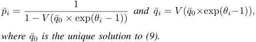

Substituting the equilibrium solutions into (3), we obtain the equilibrium social welfare in the Bertrand game with the sellers _S ⊆_ S 

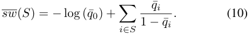

By (4), we can similarly get the equilibrium revenue in the Bertrand game with the set of sellers _S ⊆_ S 

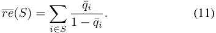

Instead of directly deriving the equilibrium strategies in one single step, in practice, the sellers may employ some simple, natural and myopic learning algorithms, such as best response [19], fictitious play [34] or no-regret learning algorithm [18], to interact with each other and eventually reach the equilibrium. One straightforward procedure for sellers in online platform markets to reach the Nash equilibrium is best response dynamics. Specifically, suppose that the current vector of price **p** is not a Nash equilibrium, and a seller _i ∈ S_ deviates by setting a new _p__∗_ _i_,whichistheoptimalpricewith respective to the other prices **p** _−i_ , _i.e._ , 

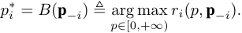

We can verify the revenue _ri_ ( _p,_ **p** _−i_ ) is strictly quasi-concave in _p_ , and thus it is not easy to explicitly solve the above optimization problem. One key observation is that the revenue function is strictly concave in the domain of the demand **_q_** , which enables us to obtain closed-form expressions for the best response strategies, as shown in the following lemma. 

**Lemma 1.** _The best response price p__∗_ _i__withrespectivetoa_ _fixed price vector_ **_p_** _−i can be calculated as_ 

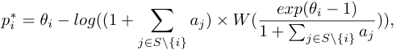

_where W_ ( _x_ ) _is the Lambert function and aj_ = _exp_ ( _θj − pj_ ) _for all j ∈ S._ 

The proof of Lemma 1 is in Appendix B. We further show that such best response dynamics have the following result. 

**Lemma 2.** _From an arbitrary feasible price vector_ **_p_** _, the best response dynamics will converge to the Nash equilibrium of the Bertrand game in a finite number of steps._ 

The basic idea to derive this result is to show such Bertrand game is an ordinal potential game [29] with a finite value; the detailed proof of Lemma 2 is in Appendix C. 

5 

## IV. OPTIMAL SEGMENTING MECHANISMS 

In online marketplaces, the platform has control over search segmentation mechanisms - which set of products to display for a buyer. The platform can display any set of products, and the competition among selected sellers then takes place endogenously through the Bertrand game in Section III. The goal of the platform is to decide the optimal products _S__∗_ _⊆_ S to display, in order to maximize the equilibrium social welfare/revenue. For _n_ potential products in the market, there are 2_n_ _−_ 1 possible sets of products, thus an exhaustive search to determine the optimal set of displayed products is infeasible. We also note that the equilibrium constraint (9) imposed by the Bertrand competition game is highly nonlinear, which presents another challenge in deriving the optimal search segmentation mechanisms. In this section, we exploit the structure of social welfare/revenue functions to efficiently design the optimal search segmentation mechanisms. 

## _A. Social Welfare Maximization_ 

In the following theorem, we show the online platform would display all products to maximize social welfare. 

**Theorem 3.** _For social welfare maximization, the optimal search segmentation mechanism is to display all products_ S _in the platform._ 

_Proof._ We prove this theorem by showing that adding a new product will always improve the equilibrium social welfare. Suppose the platform has already selected sellers _S ⊂_ S, and consider introducing a new product _j ∈_ S _\S_ . According to (10), we can express the equilibrium social welfare _<u>sw</u>_ as 

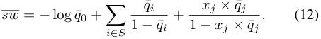

Here, _q_ ¯ _i_ = _V_ (¯ _q_ 0 _×_ exp( _θi −_ 1)) and _xj_ is an indicator for product _j ∈_ S _\S_ , where _xj_ = 1 denotes product _j_ is selected for display; otherwise _xj_ = 0. It is difficult to directly compare _<u>sw</u>_ with _xj_ = 1 and the one with _xj_ = 0. From (9), the demands **_q_** satisfy the following equilibrium constraint: 

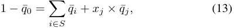

where _q_ ¯ _i_ = _V_ (¯ _q_ 0 exp( _θi −_ 1)) for all _i ∈_ S. Since _V_ ( _x_ ) is an increasing function, we can observe from this equation that _q_ ¯0 decreases when _xj_ changes from 0 to 1. Furthermore, with (12) and (13), we can express the equilibrium social welfare as a function of _q_ ¯0: 

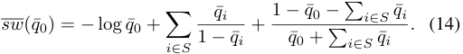

Thus, we only need to prove that _<u>sw</u>_ <u>(</u> _q_ ¯0) is a decreasing function. The basic idea of proving this is to explicitly calculate the first derivative of _<u>sw</u>_ (¯ _q_ 0), and show _<u>sw</u>__′_ (¯ _q_ 0) _<_ 0. We present the detailed proof of the following lemma in Appendix D. 

## **Lemma 3.** _The social welfare_ _<u>sw</u>_ <u>(</u> _q_ ¯0) _is a decreasing function._ 

From this lemma and the above discussion, we can always improve the equilibrium social welfare by adding a new product, which completes the proof. 

## _B. Revenue Maximization_ 

The optimal search segmentation mechanism with the objective of revenue maximization is different from the optimal mechanism when the platform attempts to maximize social welfare. To illustrate this difference, we consider two cases: a low quality case, _e.g._ , _θ_ 1 = _θ_ 2 = _· · ·_ = _θn_ = 0 _._ 5, and a high quality case, _e.g._ , _θ_ 1 = _θ_ 2 = _· · ·_ = _θn_ = 10. From the result in Theorem 3, the optimal mechanisms for social welfare maximization in these two cases are to display all products. However, for revenue maximization, it can be verified that the platform still displays all products in the low quality case, but only selects the first product in the high quality case. The intuition behind this difference is that in some scenarios, the platform can further improve price and then revenue by reducing the competition among sellers. We next show the design rationale for the optimal search segmentation mechanisms for the revenue maximization. 

One critical decision the platform has to make is the following: given a set of products _S ⊂_ S, whether to just display the currently selected product set _S_ , or add a new product _j_ from S _\S_ . We refer to such a decision problem as the “incremental” problem. Similar to the discussion on social welfare maximization, given a set of selected products _S ⊂_ S, we can represent the equilibrium revenue under these two decision options with the following function: 

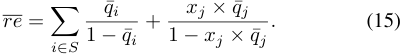

We recall that _xj_ is an indicator for product _j ∈_ S _\S_ , where _xj_ = 1 indicates that product _j_ is selected for display; otherwise _xj_ = 0. The demands _q_ ¯ _i_ ’s need to satisfy the following equilibrium constraint: 

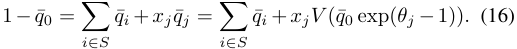

Since _V_ ( _x_ ) is an increasing function, we have a critical observation from (16): given a selected product set _S_ , _the quality θj of the potential product j ∈_ S _\S has a oneto-one and inverse relation with the demand q_ ¯0, _i.e._ , when _xj_ = 1, involving the product with a higher quality _θj_ leads to the lower value of _q_ 0. With this observation, we can derive the feasible range of the independent value _q_ ¯0. On the one hand, when the platform selects the available product with the highest quality, _i.e._ , the product _j ∈_ S _\S_ with _θj ≥ θj′_ for all _j__′_ _∈_ S _\S_ , the demand _q_ ¯0 achieves its lower bound at _q_ ¯0_min_ . On the other hand, setting _xj_ to 0 represent the case that the platform does not select any new product, and the corresponding demand _q_ ¯0_max_ in this case is the upper bound of _q_ ¯0. Thus, we have _q_ ¯0 _∈_ � _q_ ¯0_min_ _,_ ¯ _q_ 0_max_ � for the decision on selecting different product _j ∈_ S _\S_ . 

Using equation (16), we can replace _xj × q_ ¯ _j_ in (15) with 1 _− q_ ¯0 _−_� _i∈S__q_¯_i_toexpresstheequilibriumrevenueasa function of _q_ ¯0: 

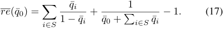

Such revenue function indeed captures the equilibrium revenue of making different decisions in the “incremental problem”. 

6 

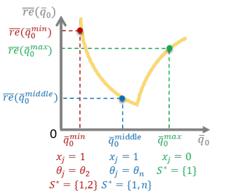

Fig. 1. _<u>re</u>_ <u>(</u> _q_ ¯0) is a quasi-convex revenue function for the possible product set to display when the product 1 has been selected. _<u>re</u>_ <u>(</u> _q_ ¯0_min_ ) is the revenue obtained by displaying _S__∗_ = _{_ 1 _,_ 2 _}_ , _<u>re</u>_ <u>(</u> _q_ ¯0_middle_ ) is the revenue from showing _S__∗_ = _{_ 1 _, n}_ , and _<u>re</u>_ <u>(</u> _q_ ¯0_max_ ) is the revenue of displaying _S__∗_ = _{_ 1 _}_ . 

Specifically, adding a new product _j ∈_ S _\S_ ( _i.e._ , _xj_ = 1) or do not add anything ( _i.e._ , _xj_ = 0 for all _j ∈_ S _\S_ ) can obtain different values _q_ ¯0 calculated by (16), and then _<u>re</u>_ <u>(</u> _q_ ¯0) from (17) is the corresponding equilibrium revenue. The property of the revenue function in (17), especially the quasi-convexity, is a key step to derive the optimal search segmentation mechanisms for revenue maximization. 

Based on the above discussion, we show that the optimal search segmentation mechanism is to choose the _k__∗_ products with the best quality, for an appropriate value of _k__∗_ , using the following steps: 

_•_ First, we show that one should always display the product with the best quality to maximize revenue (Lemma 4). 

_•_ Then, we consider the decision of adding one product to display. As discussed previously, we show that _re_ ( _q_ 0) is quasi-concave in _q_ 0 which implies that the optimal decision is to add the next highest quality product or to not add a product at all, as illustrated in Figure 1. The quasi-convexity of _re_ ( _q_ 0) is shown in Lemma 5 under a certain condition. Using the quasi-convexity of _re_ ( _q_ 0), in Lemma 6, we prove that if the optimal display set consists of _k__∗_ products, then one should select the top _k__∗_ products in terms of quality. 

_•_ The final step is to find the optimal _k__∗_ . This can be done by the following calculation. For each possible value of _k__∗_ _∈ {_ 2 _, · · · , n}_ , we select the top _k__∗_ products and find the revenue. We choose _k__∗_ to maximize this revenue. This is clearly a linear-time algorithm in _n_ , since one has to add one term to the expression for the revenue when we increase _k__∗_ by one. This result is summarized in Theorem 4. 

We first show that revenue maximization implies that the highest quality product is always selected for display. 

**Lemma 4.** _For revenue maximization, it is optimal to always display the product with the highest quality._ 

The intuition behind the proof of this lemma is to show that for any displayed product set, the revenue function in (17) increases with the quality of the product with the highest quality in this set. The proof is in Appendix E. 

Lemma 4 implies that when the optimal search segmentation mechanism is to display one product, _i.e._ , _k__∗_ = 1, the platform 

will choose the first product. To obtain the result for the general case with _k__∗_ _≥_ 2, we need to establish the quasiconvexity of the revenue function in (17). It is non-trivial to directly verify this property because the first term in the revenue function, _i.e._ ,� _i∈S_ 1 _−q_ ¯ _<u>iq</u>_ ¯ _i_,isincreasingandconcave with respective to _q_ 0, while the remaining term <u>1</u> _q_ ¯0+<u>�</u> _i∈S__q_¯_i−_1 is decreasing and convex. In the following discussion, we first prove the desired quasi-convexity and design the optimal search segmentation mechanisms by assuming that all demands _q_ ¯ _i_ ’s are less than 0 _._ 5, _i.e._ , _q_ 1 _<_ 0 _._ 5, due to _qi ≤ q_ 1 for all _i ∈ S_ , meaning that no seller dominates the market. This assumption simplifies the analysis, but still preserves the major intuition. Our results also hold without this assumption, as shown in Appendix H of the technical report [40]. 

**Lemma 5.** _For any set of displayed products S with product_ 1 _being selected, the revenue_ _<u>re</u>_ <u>(</u> _q_ ¯0) _in (17) is quasi-convex in the range_ � _q_ ¯0_min_ _,_ ¯ _q_ 0_max_ � _, under the assumption of q_ 1 _<_ 0 _._ 5 _._ 

The basic idea to prove this result is to check the secondorder conditions of a quasi-convex function, _i.e._ , at any point with zero slope, the second derivative is non-negative: _<u>re</u>__~~′~~_ (¯ _q_ 0) = 0 _⇒_ _<u>re</u>__′′_ (¯ _q_ 0) _>_ 0. The details are in Appendix F. Equipped with Lemma 5, we can derive the optimal search mechanism for the case with _k__∗_ _≥_ 2. 

**Lemma 6.** _For revenue maximization, the optimal search segmentation mechanism is to display the top k__∗_ _products if the cardinality of the optimal product set is k__∗_ _≥_ 2 _, under the assumption of q_ 1 _<_ 0 _._ 5 _._ 

The optimality of the top _k__∗_ mechanism in this lemma can be established by showing that replacing any product with a product of higher quality will increase the revenue (see Appendix G for the proof). 

While the specific value of _k__∗_ depends on the quality of all products **_θ_** , The platform can find the optimal _k__∗_ in linear time by computing the revenue of each set with the top _k ∈_ [1 _, n_ ] products, and selecting the one with the maximum revenue. Thus, from Lemma 4 and Lemma 6, we obtain the main result for the case of revenue maximization. 

**Theorem 4.** _For revenue maximization, the optimal search segmentation mechanism is to display the top k__∗_ _products, where k__∗_ _is determined by the quality of all products_ **_θ_** _, and can be calculated in linear time._ 

## V. EXTENSIONS TO COURNOT COMPETITION GAME 

In oligopolistic markets, another popular model to capture sellers’ competition is Cournot game [13], in which sellers compete via controlling the supplies to products. Specifically, each seller selects the number of units she wants to sell, which influences the availability of products and thus their prices. In other words, the prices are determined by the seller indirectly, by influencing supplies. Although Bertrand game appears to be more appropriate to capture the sellers’ price competition in practice, such as the Airbnb or hotels.com case, Cournot game can also be used to model a specific type of price competition, _i.e._ , a two-stage quantity pre-commitment price competition [17], [24]. In this case, sellers compete 

7 

on quantity in the first stage, and then compete on price in the second stage with the fixed committed quantity. Sellers on Airbnb or hotels.com type platforms can first compete via the number of units they sell, and then compete by the price per unit. It has been shown in [17], [24] that under certain conditions, the equilibrium in Cournot game is the equilibrium of such two-stage quantity pre-commitment price competition game. In this section, we discuss the existence and uniqueness of equilibrium, and then derive the optimal segmenting mechanisms for the Cournot game with social welfare and revenue maximization objectives. 

In a Cournot competition, seller _i ∈ S_ chooses _qi_ to maximize her revenue _ri_ ( **_q_** ) = _pi_ ( **_q_** ) _× qi_ , where the price _pi_ ( **_q_** ) of the product _i_ is determined by the demand vector **_q_** in (5). Thus, we express the revenue of sellers in terms of demand vector **_q_** . Similar to Bertrand game, we can represent a Cournot game as a triplet _G__c_ = ( _S,_ ( _Qi_ ) _i∈S,_ ( _ri_ ) _i∈S_ ), where _S_ is a set of players, _Qi_ is the strategy space of player _i ∈ S_ , and _ri_ ( **_q_** ) is the payoff of player _i ∈ S_ . We represent the set of strategy profiles _Q_ = _Q_ 1 _× Q_ 2 _× · · · × Qn_ . According to price-demand relation in (1), the requirement of non-negative prices implies the feasible strategy space 

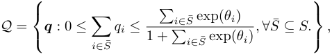

which is convex and compact. We also denote a feasible strategy profile **_q_** _∈Q_ as **_q_** = ( _qi,_ **_q_** _−i_ ). Using the facts that the payoff function _ri_ ( _qi,_ **_q_** _−i_ ) is a strictly concave function with respective to _qi_ and the feasible strategy profile space **_Q_** is convex and compact, the Cournot game _G__c_ is a concave game as defined in Rosen’s paper [32]. From Rosen’s result [32], we know that there exists a unique (pure) Nash equilibrium, and the Nash equilibrium can be obtained from the system of first-order-condition equations. Setting the partial derivative _∂ri_ ( _qi,_ **_q_** _−i_ ) _/∂qi_ to be zero for all _i ∈ S_ , we have 

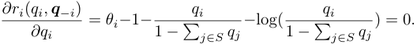

We define a variable _wi_ ≜ _qi/_ (1 _−_� _j∈S__qj_),andtheabove equations become 

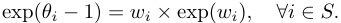

Thus, we get _wi_ = _W_ (exp( _θi −_ 1)), where _W_ ( _x_ ) is the Lambert function. According to the definition of _wi_ , we obtain the equilibrium demands 

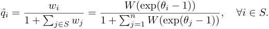

We can verify that such a demand vector **_q_** ˆ satisfies the feasible constraint, _i.e._ , **_q_** ˆ _∈_ **_Q_** . Substituting **_q_** ˆ into (5), we obtain the corresponding equilibrium prices 

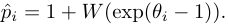

We summarize the Nash equilibrium of the Cournot competition game in the following theorem. 

**Theorem 5.** _There exists a unique (pure) Nash equilibrium in the Cournot game G__c_ = ( _S,_ ( _Qi_ ) _i∈S,_ ( _ri_ ) _i∈S_ ) _. The Nash equilibrium demand q_ ˆ _i and price p_ ˆ _i for each seller i ∈ S are:_ 

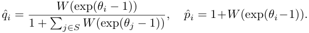

Substituting equilibrium solutions into (3), we get the equilibrium social welfare in Cournot game with the sellers _S ⊆_ S 

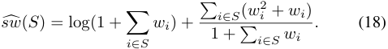

Similarly, for the set of sellers _S ⊆_ S, the equilibrium revenue in the Cournot game is 

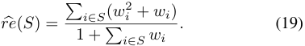

## _A. Social Welfare Maximization_ 

In contrast to Bertrand game, it may be possible for the platform to achieve higher equilibrium social welfare by just displaying a subset of products in Cournot game. We construct a simple instance to illustrate this difference. Suppose there is only one product with high quality, and the remaining products have low quality, _e.g._ , _θ_ 1 = 10 and _θi_ = 0 for all _i ∈_ S _\{_ 1 _}_ . By the equilibrium social welfare in (18), we can verify that the optimal search segmentation mechanism in Cournot game is just to select the first product, while the optimal mechanism in Bertrand game is to display all products according to the result in Theorem 3. 

Before presenting the main result, we first show an important lemma for the Cournot game. 

**Lemma 7.** _For social welfare maximization in a Cournot game, the optimal search segmentation mechanism is to display the top k products if the cardinality of the optimal product set is k._ 

As in the case of revenue maximization in Bertrand competition, the idea to establish this result is also to make a connection of quasi-convexity of equilibrium social welfare/revenue functions with the decision on selecting displayed products. The detailed proof of this lemma is in Appendix H. 

To find the optimal number of products _k__∗_ , which depends on the product quality vector **_θ_** , the platform can calculate equilibrium social welfare for each possible _k_ , and select the one with the maximum social welfare. By Lemma 7, for each candidate _k_ , we only need to consider the set containing the top _k_ products. Thus, the platform can determine the optimal _k__∗_ in linear time, leading to the following main result. 

**Theorem 6.** _For social welfare maximization, when sellers compete via a Cournot game, the optimal search segmentation mechanism is to display the top k__∗_ _products, where k__∗_ _is determined by the quality of all products_ **_θ_** _, and can be calculated in linear time._ 

8 

## _B. Revenue Maximization_ 

Similar to social welfare maximization, the platform also displays a subset of products to maximize equilibrium revenue in a Cournot game. As before, we first present a useful lemma. 

**Lemma 8.** _For revenue maximization in Cournot game, the optimal search segmentation mechanism is to display the top k products if the cardinality of the optimal product set is k._ 

The key idea to prove this lemma directly follows from the proof for Lemma 7, and we defer it to the Appendix I. With this lemma, we can derive the following result for revenue maximization in the Cournot game. 

**Theorem 7.** _For revenue maximization, when sellers compete via a Cournot game, the optimal search segmentation mechanism is to display top k__∗_ _products, where k__∗_ _depends on the quality of all products_ **_θ_** _, and can be calculated in linear time._ 

From the previous discussion, we can conclude that the optimal search segmentation mechanisms, have a simple threshold structure, _i.e._ , displaying the top _k__∗_ highest quality products for buyers, under very broad scenarios: for both social welfare and revenue objectives and under both Bertrand and Cournot competition models. We also refer such optimal mechanisms as quality-order mechanisms. The threshold parameter _k__∗_ depends on the quality of products, the platform’s objective and the type of oligopolistic competition. We next have two additional remarks for the optimal search segmentation mechanisms during their practical deployment. 

_Remark 1_ : One common feature of the online platform markets is that the platform may have space constraints on displaying search results, especially in mobile environments, _e.g._ , Airbnb only shows 22 qualified hotels for each guest’s search in one web page, and Amazon mobile app displays around 4 items on each mobile screen. Suppose the platform can only show at most _l ≤ k__∗_ products on a certain space, and the optimal number of products to display is _l__∗_ _≤ l_ under this space constraint. We can extend the previous results and show that the optimal search segmentation mechanisms with space constraints are still quality-order mechanisms, _i.e._ , displaying the top _l__∗_ highest quality products, for social welfare and revenue maximization in both Bertrand and Cournot competitions. 

_Remark 2_ : In practical online platform markets, we need to estimate the parameters of MNL model from the data set of product choice [30]. In general, the MNL model with the parameters of quality weights _{_ **_α_** _i}_ and price sensitivity _{βi}_ can be expressed as 

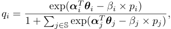

where the vector **_θ_** _i_ represents the quality of product _i_ in multiple dimensions, such as reviews, location and type of a hotel. We use Φ = _{{_ **_α_** _i}, {βi}}_ to denote the parameters of MNL model. From _M_ pieces of choice data, we can count the number of buyers, denoted by _mi_ , that select the option _i ∈_ S _∪{_ 0 _}_ . With such data set, we can apply maximum likelihood method [9] to estimate the parameters of MNL model. We write the log likelihood function as 

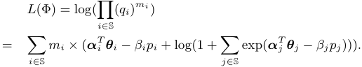

Sine LogSumExp function log(1 +� exp( _xi_ )) is convex, we can conclude that the log likelihood function is convex in terms of the parameters Φ. Thus, the parameters estimation is a convex optimization problem, and can be efficiently solved using the standard methods [10]. 

## VI. RELATED WORK 

Our work is related to the burgeoning literature that studies online platform marketplaces of using control levels other than pricing to influence the market outcomes [5], [6], [8], [23]. Kanoria and Saban designed a framework to facilitate the search for buyers and sellers on matching platforms, and found that simple restrictions on what buyers/sellers can access would boost social welfare [23]. Arnosti _et al._ investigated the welfare loss due to the uncertainty about seller availability in asynchronous dynamic matching markets, and also found that limiting the visibility of sellers can improve social welfare [5]. Our result, displaying only a subset of products to buyers can increase the equilibrium revenue, extends the findings in these two pieces of work to the context of revenue optimization. Banerjee _et al._ studied how the platform should control which sellers and buyers are visible to each other, and provided polynomial-time approximation algorithms to optimize social welfare and throughput [6]. In their model, supply and demand are associated with public distributions. By contrast, we adopt the MNL model to derive a specific demand system, and use the Bertrand and Cournot game to capture supply response to this demand system, doing so leads to very different optimization problems. There are also other types of control mechanisms that can be used to efficiently operate the online platforms, such as commission rates and subscription fees [8] and prices and wages for buyers and sellers [3]. 

Revenue management under the MNL and general demand model has been extensively studied in economics, marketing and operation management [15], [33], [35], [36]. The model considered in this paper is closely related to that in assortment optimization, which is an active area in revenue management research. In the problem of assortment optimization, the demand of products are governed by the variants of attractionbased choice models, such as MNL model [26], mixed nested logit model [11] and nested logit model [38], and each product is associated with a fixed price. The objective is to find a set of products ( _i.e._ , an assortment) to offer that maximizes the expected revenue. In [36], Talluri and van Ryzin studied the assortment optimization problem under the MNL model, and showed that the optimal assortment includes a certain number of products with the highest prices. We also derive a similar result, but use the criteria of quality rather than price to rank the potential products. Rusmevichientong _et al._ extended this result to the scenario that the choice parameters in MNL model are random, and showed that the price-order assortment is no longer optimal and the assortment optimization problem 

9 

becomes NP-complete [33]. Davis _et al._ considered the assortment optimization under the general nested logit model, and established the conditions under which the problem can be polynomially solvable [14]. In our setting a key difference from this line of work is that the product prices are determined endogenously by the outcome of oligopolistic competition games instead of being given beforehand. Pricing multiple differentiated products in the context of the MNL model is another fairly active direction in the literature [15], [22], [35]. Different from the assortment optimization problem, in this setting, all the products are displayed, and the objective is to choose pries for the products to maximize revenue. In contrast, we focus on search segmentation mechanisms with endogenous prices, where the platform only controls the set of displayed products, to optimize the equilibrium social welfare/revenue. 

Bertrand competition, proposed by Joseph Bertrand in 1883, and Cournot competition, introduced in 1838 by Antoine Augustin Cournot, are fundamental economic models that represent sellers competing in a single market, and have been studied comprehensively in economics. Gallego _et al._ showed the existence and uniqueness of Nash equilibrium in Bertrand price competition game using the attraction demand model, a generalization of MNL models [20]. Aksoy-Pierson _et al._ identified the condition under which a unique (pure) Nash equilibrium exists in Bertrand game under mixed multinomial logit model [2]. Due to the motivation that many sellers compete in more than one market in modern dynamic and diverse economy, a recent and growing literature has studied Cournot competitions in network environments [1], [7], [25], [31]. The work [1], [7] focused on characterizing and computing Nash equilibria, and investigated the impact of changes in the (bipartite) network structure on seller’s profit and buyer’s surplus. [25] and [31] analyzed the efficiency loss of networked Cournot competition game via the metric of price of anarchy. While all these previous works focused on the objective of social welfare maximization in networked Cournot competition, we consider the objective of both social welfare and revenue maximization in the networked Bertrand competition, and also in the networked Cournot competition. We further provide efficient segmenting mechanisms to optimize the social welfare/revenue under the Nash equilibrium. 

## VII. CONCLUSION AND FUTURE WORK 

In this paper, we have studied the problems of social welfare maximization and revenue maximization in designing search space for online platform markets. In the discriminatory control model, the platform can only control the search segmentation mechanisms, _i.e._ , determine the list of products to display for buyers, and the products’ prices are determined endogenously by the competition among sellers. Under the standard buyer choice model, namely the multinomial logit mode, we have developed efficient and optimal search segmentation mechanisms to maximize the equilibrium social welfare and revenue under Bertrand competition game. For social welfare maximization, it is optimal to display all the products. For revenue maximization, the optimal search segmentation 

mechanism, referred as quality-order mechanism, is to display the top _k__∗_ highest quality products, where _k__∗_ can be computed in at most linear time in the number of products. We extend our results to Cournot competition game, and show that the optimal search segmentation mechanisms are also the simple quality-order mechanisms, for the objectives of both social welfare and revenue maximization. 

One possible direction for future work is to extend the quality-order mechanisms to more complex demand models (such as mixed MNL model and nested logit model) and general buyer-seller (bipartite) networks. Another interesting research topic is to design the optimal search mechanisms in dynamic setting, where buyers arrive and depart, and sellers have limited capacity for products. 

## REFERENCES 

- [1] M. Abolhassani, M. H. Bateni, M. Hajiaghayi, H. Mahini, and A. Sawant. Network cournot competition. In _WINE_ , pages 15–29, 2014. 

- [2] M. Aksoy-Pierson, G. Allon, and A. Federgruen. Price competition under mixed multinomial logit demand functions. _Management Science_ , 59(8):1817–1835, 2013. 

- [3] R. Alijani, S. Banerjee, S. Gollapudi, K. Kollias, and K. Munagala. The segmentation-thickness tradeoff in online marketplaces. In _SIGMETRICS_ , 2019. 

- [4] S. P. Anderson, A. De Palma, and J.-F. Thisse. _Discrete choice theory of product differentiation_ . MIT press, 1992. 

- [5] N. Arnosti, R. Johari, and Y. Kanoria. Managing congestion in decentralized matching markets. In _EC_ , pages 451–451, 2014. 

- [6] S. Banerjee, S. Gollapudi, K. Kollias, and K. Munagala. Segmenting two-sided markets. In _WWW_ , pages 63–72, 2017. 

- [7] K. Bimpikis, S. Ehsani, and R. Ilkilic¸. Cournot competition in networked markets. _Management Science_ , 65(6):2467–2481, 2019. 

- [8] J. Birge, O. Candogan, H. Chen, and D. Saban. Optimal commissions and subscriptions in networked markets. In _EC_ , pages 613–614, 2018. 

- [9] C. M. Bishop. _Pattern recognition and machine learning_ . springer, 2006. 

- [10] S. Boyd and L. Vandenberghe. _Convex optimization_ . Cambridge university press, 2004. 

- [11] N. Cardell and F. C. Dunbar. Measuring the societal impacts of automobile downsizing. _Transportation Research Part A: General_ , 14(5):423 – 434, 1980. 

- [12] R. M. Corless, G. H. Gonnet, D. E. G. Hare, D. J. Jeffrey, and D. E. Knuth. On the lambertw function. _Advances in Computational Mathematics_ , 5(1):329–359, 1996. 

- [13] A. F. Daughety. _Cournot oligopoly: characterization and applications_ . Cambridge university press, 2005. 

- [14] J. M. Davis, G. Gallego, and H. Topaloglu. Assortment optimization under variants of the nested logit model. _Operations Research_ , 62(2):250– 273, 2014. 

- [15] L. Dong, P. Kouvelis, and Z. Tian. Dynamic pricing and inventory control of substitute products. _Manufacturing & Service Operations Management_ , 11(2):317–339, 2009. 

- [16] P. C. Evans and A. Gawer. The rise of the platform enterprise: a global survey. 2016. 

- [17] A. Farahat, W. T. Huh, and H. Li. On the relationship between quantity precommitment and cournot games. _Operations Research_ , 67(1):109– 122, 2019. 

- [18] Y. Freund and R. E. Schapire. Adaptive game playing using multiplicative weights. _Games and Economic Behavior_ , 29(1):79 – 103, 1999. 

- [19] D. Fudenberg, F. Drew, D. K. Levine, and D. K. Levine. _The theory of learning in games_ , volume 2. MIT press, 1998. 

- [20] G. Gallego, W. T. Huh, W. Kang, and R. Phillips. Price competition with the attraction demand model: Existence of unique equilibrium and its stability. _Manufacturing & Service Operations Management_ , 8(4):359– 375, 2006. 

- [21] P. M. Guadagni and J. D. C. Little. A logit model of brand choice calibrated on scanner data. _Marketing Science_ , 2(3):203–238, 1983. 

- [22] W. Hanson and K. Martin. Optimizing multinomial logit profit functions. _Management Science_ , 42(7):992–1003, 1996. 

- [23] Y. Kanoria and D. Saban. Facilitating the search for partners on matching platforms: Restricting agent actions. In _EC_ , pages 117–117, 2017. 

10 

- [24] D. M. Kreps and J. A. Scheinkman. Quantity precommitment and bertrand competition yield cournot outcomes. _The Bell Journal of Economics_ , 14(2):326–337, 1983. 

- [25] W. Lin, J. Z. F. Pang, E. Bitar, and A. Wierman. Networked cournot competition in platform markets: Access control and efficiency loss. In _CDC_ , pages 4606–4611, 2017. 

- [26] D. McFadden. Conditional logit analysis of qualitative choice behaviour. In P. Zarembka, editor, _Frontiers in Econometrics_ , pages 105–142. Academic Press New York, New York, NY, USA, 1974. 

- [27] D. McFadden. The choice theory approach to market research. _Marketing Science_ , 5(4):275–297, 1986. 

- [28] P. R. Milgrom and S. Tadelis. How artificial intelligence and machine learning can impact market design. Working paper, National Bureau of Economic Research, 2018. 

- [29] D. Monderer and L. S. Shapley. Potential games. _Games and Economic Behavior_ , 14(1):124 – 143, 1996. 

- [30] S. Negahban, S. Oh, and D. Shah. Rank centrality: Ranking from 

   - pairwise comparisons. _Operations Research_ , 65(1):266–287, 2017. 

- [31] J. Z. F. Pang, H. Fu, W. I. Lee, and A. Wierman. The efficiency of open access in platforms for networked cournot markets. In _INFOCOM_ , pages 1–9, 2017. 

- [32] J. B. Rosen. Existence and uniqueness of equilibrium points for concave n-person games. _Econometrica_ , 33(3):520–534, 1965. 

- [33] P. Rusmevichientong, D. Shmoys, C. Tong, and H. Topaloglu. Assortment optimization under the multinomial logit model with random choice parameters. _Production and Operations Management_ , 23(11):2023–2039, 2014. 

- [34] J. S. Shamma and G. Arslan. Unified convergence proofs of continuous-time fictitious play. _IEEE Transactions on Automatic Control_ , 49(7):1137–1141, 2004. 

- [35] J.-S. Song and Z. Xue. Demand management and inventory control for substitutable products. _Working paper_ , 2007. 

- [36] K. Talluri and G. van Ryzin. Revenue management under a general discrete choice model of consumer behavior. _Management Science_ , 50(1):15–33, 2004. 

- [37] X. Vives. _Oligopoly pricing: old ideas and new tools_ . MIT press, 2001. [38] H. C. W. L. Williams. On the formation of travel demand models and economic evaluation measures of user benefit. _Environment and Planning A: Economy and Space_ , 9(3):285–344, 1977. 

- [39] Z. Zheng and R. Srikant. Optimal search segmentation mechanisms for online platform markets. In _WINE_ , 2019. 

- [40] Z. Zheng and R. Srikant. Optimal search segmentation mechanisms for online platform markets. Technical report, 2019. available at https://drive.google.com/file/d/18esA BjxMvJbEkIvbdBruU1Ji5Am0KxJ/view. 

## APPENDIX A MONOPOLISTIC MARKET 

In this section, we consider an online marketplace in the full control model as a monopolistic market, where the platform (or monopoly) jointly determines the price vector **_p_** and the set of displayed products _S_ to maximize social welfare or revenue. We first fix the displayed products as _S ⊆_ S, and investigate the optimal monopoly prices. 

It turns out that social welfare in (3) and revenue in (4) are not concave in prices [22]. The key observation here is that the social welfare and revenue functions become jointly concave if we work with the demand vector [15], [35]. Using the price-demand relation in (5), we can express the social welfare as a function of demand vector **_q_** : 

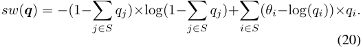

Similarly, the revenue function can be re-written as 

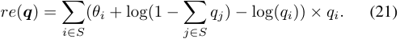

According to (1), the requirement of non-negative prices implies that the feasible demand space is given by 

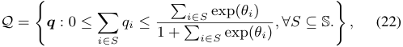

which is convex and compact. Therefore, the problem of social welfare maximization in the monopolistic market can be formulated as 

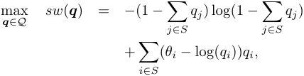

which is a standard concave maximization problem. By Karush-Kuhn-Tucker (KKT) condition [10], we set partial derivative_∂sw_ _∂q_<u>(</u> _i_**_<u>q</u>_**<u>)</u> = 0, and re-formulate this equation to get 

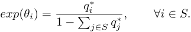

Solving this system of equations, we can derive the optimal market shares **_q_**_∗_ and the corresponding optimal prices **_p_**_∗_ for social welfare maximization in the monopolistic market: 

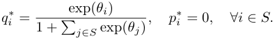

In the optimal solution for social welfare maximization, the platform sets prices of all products to be zero, and the demands are proportional to their product quality. The revenue of the seller is zero, and the utility of the buyer is maximized. The optimal social welfare for displaying products _S ⊆_ S is 

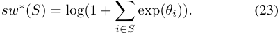

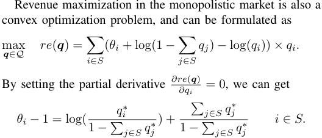

Using the relation between _qi_ and _pi_ in (1), we can express the above equations in terms of _pi_ ’s to simplify the calculation: 

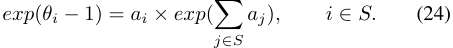

Solving this system of equations, we can obtain 

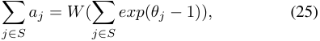

where _W_ ( _x_ ) is the Lambert function [12], and is the solution _w_ satisfying _w ×_ exp( _w_ ) = _x._ Substituting (25) back into (24), we can calculate the optimal price _p__∗_ and demand _q__∗_ for revenue maximization in the monopolistic market 

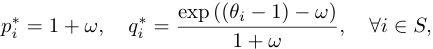

11 

where _ω_ ≜ _W_ (� _j∈S__exp_(_θj −_1)). In the optimal solution for revenue maximization, the online platform sets the same price for all products, and the demands are also proportional to the product quality. The optimal revenue for the set of selected sellers _S ⊆_ S is 

We need to guarantee that the new price _p__∗_ _i_isnon-negative. From the definition of Lambert W function, we have _W_ ( _x_ ) _≤ x_ , and thus we can derive from the above equation that _p__∗_ _i__≥_ 1. Since the other prices **_p_** _−i_ remain the same and are nonnegative, the new price vector ( _p__∗_ _i__,_**_p_**_−i_)isfeasible. 

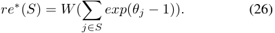

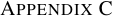

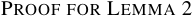

From equations (23) and (26), we can observe that both the optimal social welfare and revenue in the monopolistic market are increasing with respective to the number of displayed products. Thus, in the full control model, the platform displays all products S to buyers, and sets the optimal prices **_p_**_∗_ to maximize the social welfare or revenue. 

_Proof._ We first show that the Bertrand game is an ordinal potential game. We construct a potential function 

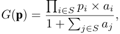

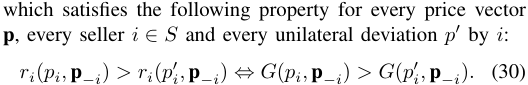

Since the revenue function _ri_ ( _qi_ ) in (27) is strictly concave, the deviating seller _i_ ’s revenue strictly increases. By (30), the potential function also strictly increases after each iteration of the best response dynamics. Thus, no cycles are possible. Since the potential function has a finite value, the best response dynamics eventually reach the maxima of the potential function, _i.e._ , the Nash equilibrium, in finite steps. 

_Proof._ From the relation between price and demand in (5), we can write the seller _i_ ’s revenue in (2) with respective to _qi_ : 

Here, we have used _q_ 0 = 1 _−_� _j∈S__qj_. The variable_q_0 depends on all _qj_ ’s, which makes it difficult to calculate the optimal demand _qi__∗_.Wenextexpress_q_0onlyusing_qi_.From(1),we have _q_ 0 _×aj_ = _qj, ∀j ∈ S_ . We summarize these equations over all _j ∈ S\{i}_ , and obtain _q_ 0 _×_� _j∈S\{i}__aj_=� _j∈S\{i}__qj._ Combining with _q_ 0 = 1 _−_� _j∈S__qj_,wehave 1 _−_ _<u>qi</u> q_ 0 = _._ (28) 1 +<u>�</u> _j∈S\{i}__aj_ 

_Proof._ By implicit differentiation of _V_ ( _x_ ) in (8), we can calculate the derivative of _V_ ( _x_ ): 

We note that given a vector of fixed prices **p** _−i_ , the _aj_ = _exp_ ( _θj − pj_ ) _, ∀j ∈ S\{i}_ are constants. Using (28), we can rewrite the revenue function _ri_ ( _qi_ ) in (27) as 

We can then get the derivative of _<u>sw</u>_ <u>(</u> _q_ ¯0) in (14) 

where _q_ ¯ _i__′_= exp(_θi −_1)_× V′_(¯_q_0_×_exp(_θi −_1)).Substituting the specific form of _V__′_ ( _x_ ), we further have 

and that it is strictly concave. We calculate the first derivative of _ri_ ( _qi_ ), and set it to be zero: 

where _W_ ( _x_ ) is the Lambert function. With _q_ 0 _× a__∗_ _i_=_q_ _i__∗_and (28), we have 

Together with (29), we can get 

which is convex in range [0 _,_ 0 _._ 5] and concave in range [0 _._ 5 _,_ 1]. We plot the graph of _f_ ( _q_ ) in Figure 2. We also plot the graphs 

12 

<!-- Start of picture text -->
 1 0.5 f(q) f1(q) f2(q)  0  0 1-q1  0.5 q1  1 Demand q <!-- End of picture text -->

Fig. 2. The function _f_ ( _q_ ) is sigmoidal over the interval [0 _,_ 1], and is convex in [0 _,_ 0 _._ 5] and concave in [0 _._ 5 _,_ 1]. 

of linear functions _f_ 1( _q_ ) = _q_ and _f_ 2( _q_ ) = _a × q_ , where the slope is _a_ =_<u>f</u>_<u>(</u> 11 _−__−_ _q__<u>q</u>_ 11) with _q_ 1 _≥_ 0 _._ 5. We summarize two important properties of the function _f_ ( _q_ ). 

_•_ For any _q ∈_ [0 _,_ 1], _f_ ( _q_ ) + _f_ (1 _− q_ ) = 1. 

- For any _q ∈_ [0 _,_ 0 _._ 5], _f_ ( _q_ ) _≤ f_ 1( _q_ ), and _f_ ( _q_ ) _≤ f_ 2( _q_ ) for 

- any _q ∈_ [0 _,_ 1 _− q_ 1] with _q_ 1 _≥_ 0 _._ 5. 

To prove (31) is non-positive, we consider the following optimization problem: 

and show the optimal objecitve is always no more than 1, _i.e._ , � _i∈S__f_(¯_qi_)_≤_1byconsideringthefollowingtwocases: _•_ When _|S|_ = 2, according to the first property of function _f_ ( _q_ ), we have� _i∈S__f_(_qi_) = 1. 

_•_ When _|S| >_ 2, we further consider two different scenarios. If _q_ ¯ _i ≤_ 0 _._ 5 _, ∀i ∈ S_ , by the second property of _f_ ( _q_ ), we have 

In the other case, one of the _q_ ¯ _i_ ’s is larger than 0 _._ 5. Since � _i∈S__q_¯_i_=1and0_≤q_¯_i≤q_¯1,wehave_q_¯1_>_0_._5and_q_¯_i<_ 1 _−q_ ¯1 _, ∀i ∈ S\{_ 1 _}_ . By the second property of _f_ ( _q_ ), we obtain 

Thus, we can further get 

The first equality comes from� _i∈S__q_¯_i_=1,andthesecond equality is due to the first property of _f_ ( _q_ ). 

From the above discussion, we have proved that the maximum value of� _i∈S__f_(¯_qi_)isnomorethan1.By(31),it follows that _<u>sw</u>__~~′~~_ (¯ _q_ 0) _<_ 0, 

_Proof._ Suppose the displayed product set _S_ does not contain the product with the highest quality. We denote the product with the highest quality in _S_ as _i__∗_ , _i.e._ , _q_ ¯ _i__∗_ _≥ q_ ¯ _i, ∀i ∈ S_ . We only need to show that the revenue does not decrease if we replace the product _i__∗_ with the product 1, which is equivalent 

<!-- Start of picture text -->
 1  0 -1/3 -1  0  0.5  1 Demand  – qi ––The Value of g()qi <!-- End of picture text -->

Fig. 3. The function _g_ (¯ _q_ ) has one critical property: for any pair of _q_ ¯ _i_ and _q_ ¯ _j_ with 0 _._ 5 _≥ q_ ¯ _i ≥ q_ ¯ _j ≥_ 0, the relation _−_ 1 _/_ 3 _≤ g_ (¯ _qi_ ) _≤ g_ (¯ _qj_ ) _≤_ 1 holds. 

to increase the quality of product _i__∗_ from _θi∗_ to _θ_ 1. From (17), we can calculate the derivative of the revenue function with the set of displayed products _S_ : 

Here, we use the equilibrium constraint _q_ ¯ _i∗_ +� _i∈S\i__∗q_¯_i_= 1 _− q_ ¯0. Since _q_ ¯ _i∗ ≥ q_ ¯ _i_ , for all _i ∈ S\i__∗_ , we can derive that _<u>re</u>__~~′~~_ (¯ _q_ 0) _≤_ 0, and thus _<u>re</u>_ <u>(</u> _q_ ¯0) is a non-increasing function. Furthermore, as the quality _θi∗_ has an inverse relation with the demand _q_ ¯0 from (16), increasing _θi∗_ to _θ_ 1 is equivalent to decrease _q_ ¯0, which would not decrease the revenue. From the above discussion, we can obtain the result. 

_Proof._ The basic idea can be illustrated via the case of _k__∗_ = 2 and _S_ = _{_ 1 _}_ . From (17), we have the revenue for this case 

We check the second-order conditions of a quasi-convex function, _i.e._ , at any point with zero slope, the second derivative is non-negative: _re__′_ (¯ _q_ 0) = 0 _⇒ re__′′_ (¯ _q_ 0) _>_ 0 _._ The first derivative of the revenue function is 

and the corresponding second derivative is 

With the expression of _q_ ¯ _i__′_= _q_ ¯0 _×_ <u>�</u> _qi_ ¯1+ <u>1(1</u> _−_ <u>1</u> _qi_ ¯ )<u>2</u> <u>�</u> , we can derive _q_ ¯ _i__′′_= _q__<u>q</u>_ ¯¯ 0 _<u>i</u>__′×_(_−_1 +_g_(¯_qi_))_,_where 

The function _g_ (¯ _q_ ) has one critical property needed for the later analysis: _g_ (¯ _q_ ) is a decreasing function over the range [0 _,_ 0 _._ 5], _g_ (0) = 1 and _g_ (0 _._ 5) = _−_ 1 _/_ 3. We can verify this property by showing the first derivative _g__′_ (¯ _q_ ) is negative in the range 

13 

[0 _,_ 0 _._ 5]. We also plot the graph of _g_ (¯ _q_ ) in Figure 3. We then rewrite the second derivative in (35) as 

Since _<u>re</u>__~~′~~_ (¯ _q_ 0) = 0, we have (1 _−q_ ¯ _q_ <u>1¯</u>_′_ 1)2= (¯ _q_ 01+¯+¯ _qq_ 11_′_ )2_,_from(34). Combine with the fact that _−_ 1 + _g_ (¯ _q_ 1) _≤_ 0, we can further relax the second derivative in (37): 

We show the following three inequalities for later analysis 

_•_ (¯ _q_ 0 + ¯ _q_ 1) _≥_ 0 _._ 5. 

The first two inequalities are easy to verify. For the last inequality, we first have (¯ _q_ 0 + ¯ _q_ 1) _≥ q_ ¯1. From the definition of _q_ ¯0_min_ , the equality (¯ _q_ 0 + ¯ _q_ 1) = 1 _− q_ ¯1 holds when _q_ ¯0 = _q_ ¯0_min_ . For any _q_ ¯0 _∈_ � _q_ ¯0_min_ _,_ ¯ _q_ 0_max_ �, we further have (¯ _q_ 0 + ¯ _q_ 1) _≥_ 1 _−q_ ¯1 because _q_ ¯1 = _V_ (¯ _q_ 0 _× exp_ ( _θ_ 1 _−_ 1)) is an increasing function with respective to _q_ ¯0. Combining these two inequalities, we have (¯ _q_ 0 + ¯ _q_ 1) _≥_ max _{q_ ¯1 _,_ 1 _−q_ ¯1 _}_ , resulting in that (¯ _q_ 0 + ¯ _q_ 1) _≥_ 0 _._ 5. With these three inequalities, we can further relax (38): 

where we define function _h_ (¯ _q_ 1) to be 

We further simplify this function as 

To prove _re__′′_ (¯ _q_ 0) _>_ 0, we only need to show that _h_ (¯ _qi_ ) _>_ 0. Since _q_ ¯1 _<_ 0 _._ 5, we have _g_ (¯ _q_ 1) _> −_ 1 _/_ 3 as visualized in Figure 3, under which we can verify that _h_ (¯ _q_ 1) _>_ 0 for all 0 _≤ q_ ¯1 _<_ 0 _._ 5. Thus, we have proved the quasi-convexity of the revenue function _<u>re</u>_ <u>(</u> _q_ ¯0) when _q_ ¯1 _<_ 0 _._ 5. 

## APPENDIX G PROOF FOR LEMMA 6 

_Proof._ The basic idea behind the proof can be illustrated via the case of _k__∗_ = 2. From Lemma 4, we know the first product would always be involved. Thus, the remaining part is to prove it is optimal to select the second product. The revenue when the platform displays the first product and another product is 

We recall that _<u>re</u>_ <u>(</u> _q_ ¯0_min_ ) denotes the revenue of selecting the first two products, and _<u>re</u>_ <u>(</u> _q_ ¯0_max_ ) represents the revenue of only selecting the first product. From Lemma 5, we know that the revenue function _<u>re</u>_ <u>(</u> _q_ ¯0) is quasi-convex over the interval � _q_ ¯0_min_ _,_ ¯ _q_ 0_max_ �, which implies 

_<u>re</u>_ <u>(</u> _q_ ¯0_max_ ) cannot be the maximum value of _<u>re</u>_ (¯ _q_ 0), because otherwise the size of the optimal product set is 1, which contradicts the assumption in this lemma. We then have _<u>re</u>_ <u>(</u> _q_ ¯0) _≤_ _<u>re</u>_ <u>(</u> _q_ ¯0_min_ ) _,_ meaning that the platform always selects the first two products when _k__∗_ = 2. The analysis for the case of _k__∗_ _>_ 2 follows the same principle. Thus, we have completed the proof to this lemma. 

## APPENDIX H PROOF FOR LEMMA 7 

_Proof._ In the case of _k__∗_ = 1, we can verify from (18) that the equilibrium social welfare increases with the quality of the selected product. Thus, the optimal mechanism is to display the first product when _k_ = 1. We assume _k ≥_ 2 for the following discussion. We recall that products are sorted in a nondecreasing order in terms of quality. As the Lambert function is an increasing function over [0 _,_ + _∞_ ), we further have _w_ 1 _≥ w_ 2 _≥· · · ≥ wn >_ 0, where we recall _wi_ = _W_ ( _exp_ ( _θi −_ 1)). Suppose the optimal search segmentation mechanism selects the set of products _S ⊆_ S with _|S|_ = _k_ , which does not contain the first _k_ products. It can be shown that we can replace this product set _S_ with the set _S_ˆ = _{_ 1 _,_ 2 _, · · · , k}_ , and also improve equilibrium social welfare. Consider product _j ∈_ S _\S_ , that achieves the maximum _wt_ ’s among the unselected products, _i.e._ , _wj_ = arg max _{wt|t ∈_ S _\S}_ . As the selected set _S_ does not contains all the first _k_ products, there must exist one selected product _i ∈ S_ such that _wi < wj_ .2 

We now show that we can replace product _j_ with product _i_ to improve social welfare. Motivated by the equilibrium social welfare _sw_ � in (18), we introduce a function 

> 2For the case that _wi_ = _wj_ and _j < i_ , we can directly exchange the product _i_ and product _j_ , and obtain the same equilibrium social welfare. 

14 

We note that the equilibrium social welfare of selecting product set _S_ is _g_ ( _wi_ ), the equilibrium social welfare of selecting product set _S\{i} ∪{j}_ ( _i.e._ , replacing product _i_ with product _j_ ) is _g_ ( _wj_ ), and _g_ (0) denotes the social welfare of selecting _k −_ 1 products _S\{i}_ . 

The key idea to prove this lemma is to show that _g_ ( _w_ ) is quasi-convex over the interval [0 _, wj_ ], which implies that 

Assuming the quasi-convexity of _g_ ( _w_ ), we claim _g_ (0) cannot be the maximum value of _g_ ( _w_ ) under the assumption that the optimal search segmentation mechanism is to involve _k_ products. Suppose _g_ (0) _≥ g_ ( _w_ ) for all _w ∈_ [0 _, wj_ ]. This means that the set _S\{i}_ with cardinality _k −_ 1 achieves higher social welfare than the set _S_ with cardinality _k_ , which contradicts the assumption in this lemma. Thus, the maximum _g_ ( _w_ ) over the interval [0 _, wj_ ] is _g_ ( _wj_ ) and _g_ ( _wj_ ) _≥ g_ ( _wi_ ), meaning that selecting product _j_ instead of product _i_ achieves higher social welfare. 

We now prove the quasi-convexity of the function _g_ ( _w_ ). We first calculate the derivative of _g_ ( _w_ ) 

where _B_ = (2 _×_� _t∈S\{i}__wt_+3) and _C_ = _−_� _t∈S\{i}_ � _wt_2_−wt_ � + 2. _B_ is always positive, while _C_ could be positive, negative or zero. We continue the proof by considering the following two cases. 

_•_ If _C ≥_ 0 then _g__′_ ( _w_ ) is positive for any non-negative _w_ , meaning _g_ ( _w_ ) is an increasing function, and then is a quasiconvex function over the range [0 _, wj_ ]. 

_•_ If _C <_ 0 then the equation _g__′_ ( _w_ ) = 0 has a positive root _w__∗_ = ( _−B_ + _√B_2 _−_ 4 _C_ ) _/_ 2. We claim that _g__′_ ( _w_ ) cannot 

be negative for all _w ∈_ [0 _, wj_ ], otherwise _g_ (0) would be the maximum value for all _g_ ( _w_ ), which contradicts the assumption of the lemma due to the same reasons discussed before. Thus, we can have that _g__′_ ( _w_ ) is negative over the range [0 _, w__∗_ ) and positive in [ _w__∗_ _, wj_ ], _i.e._ , _g_ ( _w_ ) decreases in [0 _, w__∗_ ) and increases in [ _w__∗_ _, wj_ ]. With this property, it follows that _g_ ( _w_ ) is also quasi-convex in this case. 

From the above discussion, we have proved that if the optimal mechanism is to display _k_ products, _g_ ( _wj_ ) is always larger than _g_ ( _wi_ ). This means that for any selected product set _S_ that does not contain the first _k_ products, we can always find an unselected product _j ∈_ S _\S_ and a selected product _i ∈ S_ with _wj > wi_ , and improve social welfare by replacing product _j_ with product _i_ . Iteratively conducting this operation, we can obtain a new set _S_ˆ that exactly contains the first _k_ products, and achieve the maximum equilibrium social welfare when the number of the optimal products is _k_ . 

## APPENDIX I PROOF FOR LEMMA 8 

_Proof._ The basic idea is also to check the quasi-convexity of the equilibrium revenue function. The only difference is to change _g_ ( _w_ ) in (40) to _g_ ˆ( _w_ ) based on the equilibrium revenue in (19), _i.e._ , 

The corresponding derivative of _g_ ˆ( _w_ ) is 

where _B_ˆ = 2 _×_ �� _t∈S\{i}__wt_+ 1 � and _C_ˆ = 1 _−_� _t∈S\{i}__w_ _t_2. Here _B_ˆ is always positive, while _C_ˆ could be positive, negative or zero. The following steps are similar to those in the proof for Lemma 7, and we omit them here. 

