# **Optimizing Multiple Performance Metrics with Deep GSP Auctions for E-commerce Advertising** 

Zhilin Zhang1∗ , Xiangyu Liu1∗ , Zhenzhe Zheng2 , Chenrui Zhang3 , Miao Xu1 , Junwei Pan4 , 

Chuan Yu1 , Fan Wu2 , Jian Xu1 and Kun Gai1 

1Alibaba Group, 2Shanghai Jiao Tong University, 3Peking University, 4Yahoo Research 

{zhangzhilin.pt, qilin.lxy, xumiao.xm,yuchuan.yc,xiyu.xj}@alibaba-inc.com 

zhengzhenzhe@sjtu.edu.cn, fwu@cs.sjtu.edu.cn 

chenrui.zhang@pku.edu.cn, pandevirus@gmail.com, jingshi.gk@taobao.com 

## **ABSTRACT** 

In e-commerce advertising, the ad platform usually relies on auction mechanisms to optimize different performance metrics, such as user experience, advertiser utility, and platform revenue. However, most of the state-of-the-art auction mechanisms only focus on optimizing a single performance metric, e.g., either social welfare or revenue, and are not suitable for e-commerce advertising with various, dynamic, difficult to estimate, and even conflicting performance metrics. In this paper, we propose a new mechanism called _Deep GSP auction_ , which leverages deep learning to design new rank score functions within the celebrated GSP auction framework. These new rank score functions are implemented via deep neural network models under the constraints of _monotone allocation_ and _smooth transition_ . The requirement of monotone allocation ensures Deep GSP auction nice game theoretical properties, while the requirement of smooth transition guarantees the advertiser utilities would not fluctuate too much when the auction mechanism switches among candidate mechanisms to achieve different optimization objectives. We deployed the proposed mechanisms in a leading e-commerce ad platform and conducted comprehensive experimental evaluations with both offline simulations and online A/B tests. The results demonstrated the effectiveness of the Deep GSP auction compared to the state-of-the-art auction mechanisms. 

## **CCS CONCEPTS** 

### • **Information systems** → **Computational advertising** ; • **Theory of computation** → **Algorithmic mechanism design** . 

## **KEYWORDS** 

Learning-based Mechanism Design; Deep GSP; E-commerce Advertising; Multiple Performance Metrics Optimization; Ad Platform 

#### **ACM Reference Format:** 

Zhilin Zhang, Xiangyu Liu, Zhenzhe Zheng, Chenrui Zhang, Miao Xu, Junwei Pan, Chuan Yu, Fan Wu, Jian Xu and Kun Gai. 2021. Optimizing 

∗Both authors contributed equally to this research. 

Permission to make digital or hard copies of all or part of this work for personal or classroom use is granted without fee provided that copies are not made or distributed for profit or commercial advantage and that copies bear this notice and the full citation on the first page. Copyrights for components of this work owned by others than ACM must be honored. Abstracting with credit is permitted. To copy otherwise, or republish, to post on servers or to redistribute to lists, requires prior specific permission and/or a fee. Request permissions from permissions@acm.org. _WSDM ’21, March 8–12, 2021, Virtual Event, Israel_ 

© 2021 Association for Computing Machinery. ACM ISBN 978-1-4503-8297-7/21/03...$15.00 

https://doi.org/10.1145/XXXXXX.XXXXXX 

Multiple Performance Metrics with Deep GSP Auctions for E-commerce Advertising. In _Proceedings of the Fourteenth ACM International Conference on Web Search and Data Mining (WSDM ’21), March 8–12, 2021, Virtual Event, Israel._ ACM, New York, NY, USA, 9 pages. https://doi.org/10.1145/XXXXXX. XXXXXX 

## **1 INTRODUCTION** 

In e-commerce advertising, the advertisers usually leverage the ad platform to promote their products to their target users and boost the overall merchandise volume [11, 13]. There are three major kinds of stakeholders: users, advertisers, and the ad platform. Users look for good shopping experiences, advertisers want to accomplish their marketing objectives, and the ad platform would like to extract high revenue in providing satisfying services to both users and advertisers. For the long-term prosperity, one critical tool the ad platform can use to jointly optimize the above mentioned multiple objectives (i.e., performance metrics) is the auction mechanism. The auction mechanism determines the ads displayed to users as well as the payments charged to advertisers. 

The performance metrics of the ad platform can be diverse and the importance of these metrics can vary over time. For example, users would like to find their desired products with small search frictions, requiring the ads displayed to them have high relevance, which is often quantified as Click-Through Rate (CTR) and Conversion Rate (CVR). Advertisers usually want to optimize certain marketing performance metrics such as Gross Merchandise Volume (GMV) under a budget or Return on Investment (ROI) constraint. The ad platform, whose productivity in creating revenue is typically measured by Revenue Per Mille (RPM), also has to provide satisfying shopping experience to users and help advertisers fulfill their marketing objectives. Besides, it is also a common practice for e-commerce ad platforms to change the importance of different metrics over time. For example, the ad platform may put more emphasis on CTR and RPM in ordinary stages, and inclines towards CVR and GMV in shopping festivals to encourage more sales. 

The performance metrics from different stakeholders often conflict with each other. One representative example is the conflict between user experience metrics (e.g., CTR) and revenue metrics (e.g., RPM). Simply maximizing RPM may select the ads with high bids but relatively low CTRs and vice-versa. Moreover, optimizing conflicting multiple performance metrics in the ad platform is substantially different from the traditional multi-objective optimization [18]. As stakeholders have incentives to manipulate the mechanisms for their own interests, the optimization of multiple 

WSDM ’21, March 8–12, 2021, Virtual Event, Israel 

Zhilin Zhang and Xiangyu Liu, et al. 

performance metrics needs to be modeled under a game-theoretic setting. 

Another practical challenge for optimizing multiple performance metrics in e-commerce advertising is that some metrics are difficult to estimate with prediction models. These performance metrics could be related to complicated user interactions. For a displayed ad, a user could click the ad and browse the detailed information. If the user is interested in the product, she would have further actions, _e.g.,_ adding it to the shopping cart, and/or placing an order. Besides these complicated user-ad interactions, the performance metrics are also related to many factors in a non-analytical manner. These factors include, but are not limited to the competitions among advertisers and the macro-control strategies of the ad platform. Therefore, some performance metrics, such as RPM and GMV, can only be evaluated by the actual feedback after displaying the ads. 

While the auction theory provides a rich set of tools for optimizing social welfare or revenue [15, 21, 26], few of them can be used to optimize the above mentioned diverse, dynamic, conflicting and feedback-based performance metrics. The widely used generalized second-price auction (GSP) [15] selects the ads based on their rank scores, which could be the product of bid and ad quality, where ad quality is usually quantified as predicted click-through rate ( _𝑝𝐶𝑇𝑅_ ) or predicted conversion rate ( _𝑝𝐶𝑉𝑅_ ). However, such a simple and static rank score is not suitable for optimizing multiple performance metrics in e-commerce advertising. Moreover, it is also not clear how to dynamically adjust this rank score for diverse and dynamic optimization objectives. 

In this paper, we enhance the capability of the celebrated GSP auction with the power of deep learning to optimize multiple performance metrics in e-commerce advertising. We design new rank score functions that map the features such as bid, _𝑝𝐶𝑇𝑅_ , _𝑝𝐶𝑉𝑅_ , ad category, product price, to a rank score. Different from that in GSP auction, our new rank score functions can be non-linear functions. Such rank score functions can well model the relationship between the rich features and the performance metrics of interest. We implemented these non-linear rank score functions with carefully designed deep neural network models to accommodate various performance metrics. We also require these deep neural network models to be monotone w.r.t. bid, i.e., the auction follows monotone allocation, under which we prove that the Deep GSP auction can achieve nice game theoretical properties. As the importance of different performance metrics can vary over time due to business needs, we further introduce the _smooth transition_ constraint to ensure the advertiser performance metrics not fluctuate too much when the auction mechanism switches among candidate mechanisms to achieve different optimization objectives. For the neural network model implementation, we observe that it is not tractable to obtain the auction outcomes in advance as supervision for model training. We therefore make a connection between model training and the exploration process in reinforcement learning, and train the model with a model-free policy optimization algorithm. 

The contributions in this paper can be summarized as follows: (i) We investigated the new aspects in e-commerce advertising in this paper. We propose an end-to-end learning based ad auction mechanism, namely Deep GSP auction, towards optimizing multiple performance metrics in a dynamic and game theoretical setting. 

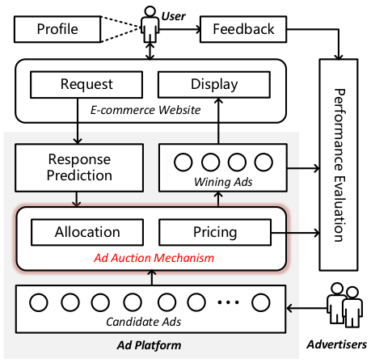

<!-- Start of picture text -->
User Profile Feedback Request Display E-commerce Website Response Prediction Wining Ads Allocation Pricing Ad Auction Mechanism Candidate Ads Ad Platform Advertisers Performance Evaluation <!-- End of picture text -->

**Figure 1: An ad platform architecture in e-commerce advertising. First, a user visits the e-commerce website, which sends a request to the ad platform. Secondly, advertisers perform bidding upon the candidate ads according to the attributes of the request. Inside the ad platform, the mechanism module selects top-N ads and charges corresponding payment through the allocation and pricing module, respectively. These winning ads will be displayed to users. Finally, the user may have a series of interactions with these ads, which are the performance metrics concerned in this paper.** 

(ii) We designed deep neural network based rank score functions with the constraints of _monotone allocation_ and _smooth transition_ . It can be proved that the resulting Deep GSP auction with these rank score functions possesses nice game theoretical properties: _Incentive Compatibility (IC)_ [19] for single ad slot cases and _Symmetric Nash equilibrium (SNE)_ [26] for multi-slot cases. 

(iii) We conducted extensive offline and online experiments to evaluate the effectiveness of Deep GSP auction. The evaluation results demonstrated that the Deep GSP auction outperforms the baseline methods significantly in terms of various performance metrics, including GMV, RPM, CTR, CVR, etc. 

## **2 PRELIMINARIES** 

## **2.1 Ad Platform Architecture** 

As shown in Fig. 1, we describe a typical ad platform architecture in e-commerce advertising. There are _𝑁_ advertisers compete for _𝐾_ ≤ _𝑁_ ad slots, which are incurred by an ad request from the user. Each advertiser _𝑖_ submits bid _𝑏𝑖_ to participate in the auction, usually based on her private valuation _𝑣𝑖_ . We note that _𝑏𝑖_ does not necessarily equal to _𝑣𝑖_ . We use vector b = ( _𝑏𝑖,_ b− _𝑖_ ) to represent the bids of all the advertisers, where b− _𝑖_ represents the bids from all the advertisers except _𝑖_ . The response prediction module predicts the user response probabilities (e.g., _𝑝𝐶𝑇𝑅_ , _𝑝𝐶𝑉𝑅_ , etc.) on the candidate ads. These predictions, together with the bids _𝑏_ , could be used by 

WSDM ’21, March 8–12, 2021, Virtual Event, Israel 

Optimizing Multiple Performance Metrics with Deep GSP Auctions for E-commerce Advertising 

the auction mechanism module, denoted by M⟨R _,_ P⟩, for top- _𝐾_ ads selection and payment calculation. We use R _𝑖_ ( _𝑏𝑖,_ b− _𝑖_ ) = _𝑘_ to denote that the advertiser _𝑖_ wins the _𝑘_ - _𝑡ℎ_ ad slot, while R _𝑖_ ( _𝑏𝑖,_ b− _𝑖_ ) = 0 represents the advertiser loses the auction. The _𝐾_ winning ads would be displayed to the user. The auction mechanism module further calculates the payment for the winning ads following a payment rule P. Let P _𝑖_ be the payment charged to advertiser _𝑖_ , and thus her utility is _𝑢𝑖_ = _𝑣𝑖_ −P _𝑖_ . Finally, the performance metrics can be obtained from the payments of the displayed ads and the responses from users after seeing the ads. In this paper, we focus on designing an ad auction mechanism to optimize _𝐿_ performance metrics, which can be expressed as functions { _𝑓𝑗_ (b; M)}_𝐿_ 1.We explicitly show the performance metrics depend on the bidding profile and the deployed auction mechanism. 

## **2.2 Problem Formulation** 

Based on the concepts discussed above, we formulate the considered problem as _multiple performance metrics optimization in the competitive advertising environments_ . Given bid vector **b** from all advertisers and _𝐿_ ad performance metric functions { _𝑓𝑗_ (b; M)}_𝐿_ 1, we aim to design an ad auction mechanism M⟨R _,_ P⟩, such that 

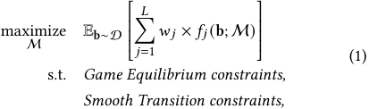

where D is the advertisers’ bid distribution based on which bidding vectors b are drawn. The objective is to maximize a linear combination of the multiple performance metrics { _𝑓𝑗_ }_𝐿_ 1with pref- erence parameters. By choosing different _𝑤 𝑗_ ’s, we can design auction mechanisms to make various trade-offs among performance metrics. In this paper, we assume _𝑤 𝑗_ ’s are the inputs in the problem formulation, and focus on the ad auction mechanism design. There are extensive related works on how to determine _𝑤 𝑗_ ’s and derive Pareto-efficient solutions [4, 18]. We consider some desirable properties, i.e. _Game Equilibrium_ and _Smooth Transition_ , when designing an ad auction mechanism. There are several equilibrium concepts from game theory for auction design, e.g., Nash Equilibrium (NE) [26] and Incentive Compatibility (IC) [19]. IC is a desired economic property for auction design in competitive environments. Intuitively, an ad auction mechanism is IC, if all bidders truthfully reveal their private valuations. The IC mechanism would remove the burden of considering bidders’ strategic behaviors, leading to reliable and predictable inputs for ad performance optimization. Therefore, the IC auction mechanisms could promote the long-term prosperity of the advertising ecosystem [14]. 

The most well-known sufficient condition for an IC auction mechanism is the classical Myerson Theorem [19]. We first present this condition in the context of single slot ad auction. 

Theorem 1 ([19]). _A single slot auction mechanism_ M⟨R _,_ P⟩ _is incentive-compatible if and only if the allocation scheme_ R _is monotone, i.e., the winning bidder would still win the auction if she reports a higher bid, and the pricing rule is based on the critical bid, which is the minimum bid that the winning bidder needs to report to maintain_ 

_the winning state:_ 

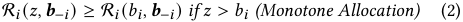

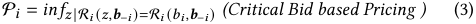

For the multi-slot case, we turn to a widely used solution concept in the ad industry: Symmetric Nash Equilibrium (SNE). 

Theorem 2 ([26]). _An auction mechanism_ M⟨R _,_ P⟩ _satisfies symmetric Nash equilibrium (SNE) if and only if each bidder in this equilibrium prefer her current allocated slot 𝑖 to any other slot 𝑗:_ 

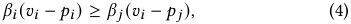

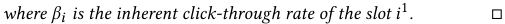

Another desirable property we want to achieve is _Smooth Transition (ST)_ . As discussed in Section 1, the performance objectives of the ad platform may vary due to the change of the business logic. If the new optimization objective is quite different from the previous one, the resulting auction mechanism would significantly affect the advertisers’ utilities [2]. This introduces the chaos of the auction environment. To stabilize advertisers’ utility change under different mechanisms, we choose a benchmark mechanism M0, and require advertisers’ utility under the new mechanism should not be less than 1 − _𝜖_ of that under M0. The benchmark mechanism M0 could be the currently deployed mechanism. Specifically, we define the _Smooth Transmission constraint_ as follows: 

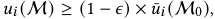

where we set a lower bound for advertiser _𝑖_ ’s utility _𝑢𝑖_ when selecting a new auction mechanism M. The lower bound _𝑢_ ¯(M0) could be set as the average utility over a certain period under the benchmark mechanism M0. The parameter _𝜖_ is a tolerant utility loss ratio for advertisers (0 ≤ _𝜖_ ≤ 1). By choosing an appropriate _𝜖_ , the advertiser’s utility would not fluctuate too much when the auction mechanism is switched towards optimizing another objective. 

Classical approaches from mechanism design usually resort to the reliable prediction model for performance metrics, and search for the solutions by simply maximizing the expected performance objective [2]. However, precise predictions are intractable, especially when some performance metrics are related to the long sequential user interactive behaviors. 

## **3 DEEP GSP AUCTION** 

In this section, we introduce a _Deep GSP auction_ with a deep neural network model to map the ad related features to a rank score. The deep neural network model is optimized towards the preferred performance objective. Then we interpret the optimization problem in Eq. (1) as a decision-making problem, and solve it by the deep policy optimization. Our approach benefits from the expressive power of deep neural networks and the ability to enforce the aforementioned constraints in training using the standard decision-making pipeline. 

> 1Here the notations of _𝑖_ and _𝑗_ are slightly abused. 

WSDM ’21, March 8–12, 2021, Virtual Event, Israel 

Zhilin Zhang and Xiangyu Liu, et al. 

## **3.1 Deep GSP Auction Design** 

We follow the design rationale of the classical GSP auction mechanism [15], where the allocation scheme is to rank advertisers according to their _rank scores_ with a non-increasing order, and the payment rule is to charge the winning advertiser with the minimum bid required to maintain the allocated rank position. The rank score of the classical GSP auction is the product of the bid and the ad _quality_ , which can only optimize certain performance metrics, such as social welfare or revenue. To optimize multiple ad performance metrics, we leverage the deep learning technique to design a new rank score and integrate it into the GSP auction framework. We call this new mechanism _Deep GSP auction_ . Specifically, we design a deep neural network to map advertiser’s bid to a rank score, with the consideration of various related information, such as ad features (ads category, _𝑝𝐶𝑇𝑅_ , and _𝑝𝐶𝑉𝑅_ ), user profile (gender, age, and income) and advertiser preference (budget, marketing demands). We use _𝑟𝑖_ = _𝑅𝜃_ ( _𝑏𝑖,_ **x** _𝑖_ ) to denote this new rank score, where **x** _𝑖_ represents the related features except the bid. The training of this deep rank score model is under the guideline of the optimization objective in problem (1). In order to satisfy the game equilibrium constraint, we also require the mapping function _𝑅𝜃_ ( _𝑏𝑖,_ **x** _𝑖_ ) to be monotone with respect to the bid _𝑏𝑖_ . We would discuss how to train the model to satisfy this property later. 

With this new rank score, the allocation scheme and payment rule in Deep GSP auction can be summarized as follows: 

- Allocation Scheme R: Advertisers are sorted in a non-increasing order of new rank score _𝑟𝑖_ = _𝑅𝜃_ ( _𝑏𝑖,_ **x** _𝑖_ ): 

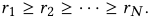

The advertisers with the top-K scores would win this auction. Ties are broken arbitrarily. 

- Pricing Rule P. The payment for the winning advertiser _𝑖_ is calculated by the formula: 

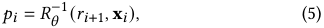

where _𝑟𝑖_ +1 is the rank score of the next highest advertiser, and _𝑅𝜃_−1(·_,_**x**_𝑖_)is the inversion function of_𝑅𝜃_(·_,_**x**_𝑖_). 

The remaining question is how to train the deep neural network model with the monotone property, and how to efficiently calculate the inverse operation in payment rule. 

_3.1.1 Point-wise Monotonicity Loss._ In principle, monotonicity with respect to a certain subset of inputs can be guaranteed by designing specific neural network architectures. Several pieces of previous work have explored this direction, either from positive weight constraints [9], or new network architectures [27]. However, these methods increase the computational complexity of the training procedure, and may have poor scalability when deployed in a large ad platform. In contrast, we directly incorporate the monotonicity constraint within the model training process, and introduce a point-wise monotonicity penalty term into the loss function: 

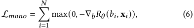

where ∇ _𝑏𝑅𝜃_ ( _𝑏𝑖,_ **x** _𝑖_ ) is the gradient of _𝑅𝜃_ with respect to bid _𝑏𝑖_ . The monotone property implies ∇ _𝑏𝑅𝜃_ ( _𝑏𝑖,_ **x** _𝑖_ )) ≥ 0. This approach is 

independent of the model structure, which facilitates seamless integration with the already deployed models, and therefore preserves the versatility of deep network architectures. 

_3.1.2 Approximate Inverse Operation._ From Eq. (5), we can precisely derive the payment for each winning advertiser by inverting the rank score function. However, this approach needs to compute complicated pseudo-inverse matrices layer-by-layer in the deep neural network, which can be messy when the weight matrices are ill-conditioned, _e.g.,_ singular. As the rank score function R _𝜃_ is monotone in terms of the bid, one potential solution is to use binary search to find the _critical bid_ . However, for each binary comparison, we need to re-run the deep neural network with a new bid, which would incur high computing time and is not tractable in online ad auctions (usually needs to complete the payment process within ten milliseconds.). To reduce computational complexity and inspired from the payment rule in GSP auction, we propose an approximate inverse operation. We first decompose the rank score _𝑅𝜃_ ( _𝑏𝑖,_ **x** _𝑖_ ) with a bid multiplier: 

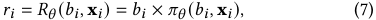

where _𝜋𝜃_ ( _𝑏𝑖,_ **x** _𝑖_ ) is a non-linear function with bid, and is modeled by a deep neural network. Under this decomposition, we renew the monotonicity penalty term from Eq. (6): 

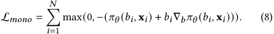

We have observed from an industrial data set that the non-linear function _𝜋𝜃_ ( _𝑏𝑖,_ **x** _𝑖_ ) is not so sensitive to the bid (please refer to the experiment results in Section 4.2.3 for more details). Thus, in payment calculation, we regard _𝜋𝜃_ ( _𝑏𝑖,_ **x** _𝑖_ ) as a constant w.r.t. _𝑏𝑖_ , similar to the ad quality score in GSP auction, and approximate the payment of the winning advertiser _𝑖_ as: 

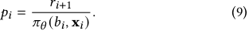

With this payment calculation scheme, we do not need to compute the matrix inversion and re-run the neural network. However, the potential drawback of this approximation is that the IC property could not be strictly satisfied. Nevertheless, in Section 4.2.3, empirical studies based on an industrial data set demonstrates the effectiveness of this approximation in reducing the computational complexity, and shows that the advertisers could only obtain a limited additional utility. 

_3.1.3 Discussion._ In this part, we provide an in-depth analysis of the Deep GSP auction. We demonstrate that the proposed mechanism can be extended to multi-slot auction and has a positive effect to advertising ecological health. 

Previous discussions about the IC property are mainly centered around single slot auction. Now we formulate the game equilibrium property of the Deep GSP auction in multi-slot case. 

Theorem 3. _There exists a non-empty set of Symmetric Nash Equilibrium (SNE) states in the Deep GSP auction._ □ 

Due to space limit, we put the proof of Theorem 3 in the supplementary material [1]. 

WSDM ’21, March 8–12, 2021, Virtual Event, Israel 

Optimizing Multiple Performance Metrics with Deep GSP Auctions for E-commerce Advertising 

**Table 1: An example: Three eligible ads and their pCTRs, bids, and two of them will be selected under different mechanisms. Deep GSP outperforms GSP on both total revenue and CTR from the following auction result.**2 

||||**(a) GS**|**P auction**||||
|---|---|---|---|---|---|---|---|
|Ad #|Bid|pCTR|eCPM|Rank|PPC|Revenue|CTR|
|1|10|0.1|1|1|4.8|0.48|0.1|
|2|2.4|0.2|0.48|2|1.95|0.39|0.2|
|3|1.3|0.3|0.39|3|/|/|/|
||Total|||||0.87|0.3|
|**(b) D   i**|**eep GSP  i**|**(with pri**|**e-defined**|**i non-lin**|**i ear ran**|**i  k score func**|**i    tion)**|
|Ad #|Bid|pCTR|Score|Rank|PPC|Revenue|CTR|
|1|10|0.1|0.199|1|9.54|0.954|0.1|
|2|2.4|0.2|0.183|3|/|/|/|
|3|1.3|0.3|0.190|2|1.25|0.375|0.3|
||Total|||||**1.329**|**0.4**|

In addition to optimizing the given objective, Deep GSP also has an incentive effect on advertisers to optimize their ads’ quality. Here we give an example to help understand this. 

_Example 3.1._ Suppose that there are three eligible ads, and two ads need to be selected to display. The advertising mechanism wants to optimize both revenue and CTR. Table 1a gives the auction result within GSP. According to the _𝑒𝐶𝑃𝑀_ ranking in the GSP, i.e. _𝑝𝐶𝑇𝑅_ × _𝑏𝑖𝑑_ , _Ad 1_ and _Ad 2_ are picked out to display. We manually set a non-linear rank score function, _𝑟_ = ( _𝑏𝑖𝑑_ /10 _._ 0)0_._4 × ( _𝑝𝐶𝑇𝑅_ /1 _._ 0)0_._7 , to demonstrate the potential of Deep GSP, whose auction result is shown in Table 1b. Note that the payment for winning ads (PPC) is calculated by second-price for the GSP and Eq. (9) for Deep GSP, respectively. 

We observe that Deep GSP outperforms GSP on both total revenue and CTR. The non-linear score function encodes a sophisticated rank rule, which strikes a favorable balance between two metrics, leading to overall improvements on both metrics. Compared with GSP, Deep GSP encourages _Ad 3_ to be displayed, who has the highest CTR, despite its eCPM is lower than _Ad 2_ . Although _Ad 1_ has the highest expected revenue (eCPM), it must pay more to maintain its display, as it has the lowest CTR and may cause poor user experience. This encourages advertisers to optimize their ads’ quality to promote CTR and furthermore to improve the user experience, which has a positive effect on the ecological health of the entire auction ecosystem. It is also worth noting that although the payment in Deep GSP is close to the First Price (FP) auction in this example, there is a significant difference between Deep GSP and FP auction. Our proposed mechanism can be proved to be incentive compatible in single slot auction and satisfies SNE in multi-slot auction. □ 

## **3.2 Deep GSP Auction Implementation** 

As introduced in Section 2.2, some performance metrics are not feasible to have rigorous mathematical analyses, and we can only evaluate these metrics via actual feedback from the system after 

> 2In this toy example, we assume _𝐶𝑇𝑅_ equals to _𝑝𝐶𝑇𝑅_ , and _𝑅𝑒𝑣𝑒𝑛𝑢𝑒_ can be derived from _𝑃𝑃𝐶_ × _𝑝𝐶𝑇𝑅_ . 

deploying the auction mechanism. This phenomenon is similar to the exploration process in reinforcement learning, where we need to conduct actions to observe the actual reward. With this connection, we formulate the training of the deep rank score model as a reinforcement learning problem and solve it via model-free policy optimization. As shown in Fig. 2, we introduce a concrete optimization framework to implement the Deep GSP auction and illustrate the detailed procedure. We next define the concepts of state, action, reward, and transmission in our context. 

- **State (** _𝑠𝑖_ **):** The state would reflect the quality of ad opportunity and the status of auction environments. We consider the following information to represent state: 1) Ad information, such as bid, _𝑝𝐶𝑇𝑅_ , _𝑝𝐶𝑉𝑅_ , and ad category. 2) Advertisers’ information, like the current budget, the price of products, and marketing intent. 3) User features, such as gender, age, income level, shopping preferences, and etc. 

- **Action (** _𝑢𝑖_ **):** The action is the outcome of the deep rank score model with the state as input, that is the rank score _𝑟𝑖_ in Eq. (7). 

- **Reward (** _𝑟𝑒𝑖_ **):** After taking actions (obtaining rank scores), we run Deep GSP auction and observe performance metrics’ realization. We calculate the linear combination of these performance metrics and apply reward shaping strategy to incorporate the _ST constraint_ into the reward, which is incurring a large penalty coefficient _𝜂_ if this constraint is violated: 

_𝑟𝑒𝑖_ = ∑︁ _𝑤 𝑗_ × _𝑓𝑗_ − _𝜂_ × max(0 _,_ (1 − _𝜖_ ) × _𝑢_ ¯(M0 ) − _𝑢_ (M)) _._ (10) _𝑗_ 

- **Transition:** Since our model training is a single-step decision making problem, we can derive the policy without considering the transition dynamics. 

The goal is to learn an optimal rank score policy _𝑅𝜃_ ( _𝑠𝑖_ ) that maximizes the expected reward, i.e., 

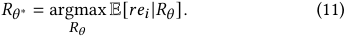

Since the optimization algorithm is orthogonal to our proposed Deep GSP auction, any continuous policy optimization method can be used. In this paper, we adopt an actor-critic based approach: Deep Deterministic Policy Gradient (DDPG) [17]. In our context, the update rules of critic and actor model in DDPG are as follows: 

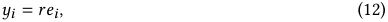

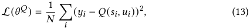

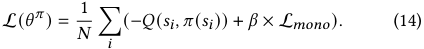

Our algorithm is different from the vanilla DDPG in two aspects. i) As we formulate the optimization of Deep GSP as a single-step decision making problem, the ground truth for critic _𝑄_ in Eq. (12) is the reward function solely, in contrast to the bootstrapping form of next state value estimation using target network [17]. This allows us to pre-train a critic model with log data simply by regression, which extremely improves the sample efficiency. ii) Besides the policy gradient, the actor model training also contains a point-wise monotonicity loss in Eq. (14). However, these variations do not prevent us from using the standard training pipeline of DDPG [17]. 

WSDM ’21, March 8–12, 2021, Virtual Event, Israel 

Zhilin Zhang and Xiangyu Liu, et al. 

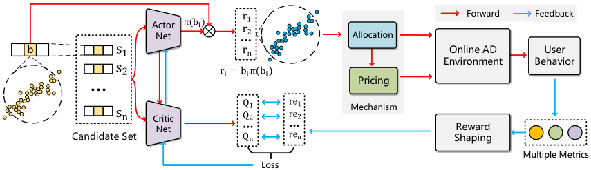

<!-- Start of picture text -->
Actor π(bi) r1 Forward Feedback Net r2 Allocation b s1 rn Online AD  User Environment Behavior s2 ri = biπ(bi) Pricing Q1 re1 Mechanism sn Critic Q2 re2 Net Reward Candidate Set Qn ren Shaping Multiple Metrics Loss <!-- End of picture text -->

**Figure 2: A reinforcement learning based framework to implement** **_Deep GSP auction_ . The actor net takes states** { _𝑠𝑖_ }_𝑛_ _𝑖_ =1**from** **the candidate set as input for calculating rank scores** { _𝑟𝑖_ }_𝑛_ _𝑖_ =1**. The monotone correlation between the bid dimension of states** { _𝑠𝑖_ }_𝑛_ _𝑖_ =1**and rank scores**{_𝑟𝑖_}_𝑛_ _𝑖_ =1**is guaranteed by the rank score function**R_𝜃_**. Based on the rank scores**{_𝑟𝑖_}_𝑛_ _𝑖_ =1**, the allocation and** **pricing modules are deployed in the ad environment, and cooperate with the critic net for multiple metrics optimization.** 

## **4 EXPERIMENTAL EVALUATIONS** 

In this section, we firstly introduce the experiment setup, including the evaluation metrics and baselines. Then we conduct offline simulations to evaluate 1) the performance comparison with baseline mechanisms, 2) the effectiveness of point-wise monotonicity loss and approximate inverse payment, 3) the IC/ST properties. Finally, we deploy the deep GSP mechanism on a real e-commerce ad platform, and collect the evaluation results. 

## **4.1 Experiment Setup** 

_4.1.1 Evaluation Metrics._ We consider the following metrics in our offline and online experiments, which reflect the platform revenue, advertisers’ utility, as well as user experience in the e-commerce advertising. For all experiments in this paper, all the metrics are scaled to [0 _,_ 1], without loss of generality. 

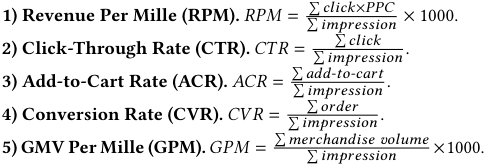

Apart from the advertising indicators, we also evaluate the economic properties of the proposed Deep GSP auction. 

**6) Monotonicity Metric (** Tm **).** To verify the point-wise monotonicity proposed in Section 3.1.1, we conduct experiments on all test data by uniformly generating a set of bids (while keeping other features unchanged) and feeding all augmented test data set into the trained deep rank score model. We calculate the _Spearman’s rank correlation coefficient_ ( _𝜌_ ) [6] between all generated bids and their corresponding model outputs to measure the monotonicity of deep rank score model: 

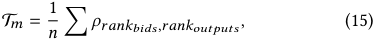

where _𝑛_ is the size of test data. The T _𝑚_ takes a range of values from −1 to +1, where +1 suggests a strong monotonic increasing relation. 

**7) Payment Error Rate (PER).** As described in Section 3.1.2, the approximate payment solution would introduce an error. In 

offline simulation, we can use binary search to find the precise payment ( _𝑝𝑖_∗). We denote the _𝑝__<u>𝑝</u>_ _𝑖__<u>𝑖</u>_<u>∗</u>by payment error rate (PER). 

**8) Incentive Compatibility (IC).** We leverage a data-driven metric, Individual Stage-IC (i-SIC) [7], to quantify IC property. Let _𝑢_ ˆ( _𝑏_ ) = _𝑏_ × _𝑥_ ( _𝑏_ ) − _𝑝_ ( _𝑏_ ) be the advertiser’s utility assuming she reports truthfully, where _𝑥_ (·) is the allocation probability. Then the i-SIC metric for a advertiser with valuation _𝐹_ in a mechanism is defined as: 

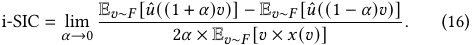

i-SIC metric simply applies small perturbations to bids and records the resulting bidder utilities to quantify IC, which can be computed by straightforward black-box simulations over auction logs. 

_4.1.2 Baseline Methods._ We compare Deep GSP with the widely used mechanisms in the industrial advertising environment. 

**1) Generalized Second Price auction (GSP).** In the GSP framework, all ads are sorted by expected Cost Per Milles (eCPM). The payment rule for a bidder is the value of the minimum bid required to retain the same slot. The work [15] suggested incorporating a squashing exponent _𝜎_ into the rank score function, i.e. _𝑏𝑖𝑑_ × _𝑝𝐶𝑇𝑅__𝜎_ could improve the advertising performance, where _𝜎_ can be adjusted to weight the performance of revenue and CTR. We will refer to this exponential form as GSP. 

**2) Utility-based Generalized Second Price auction (uGSP).** uGSP is a widely used mechanism in industrial ad platform, which extends the classical GSP by changing the rank score to a linear combination of more advertising objectives [2]: _𝑟𝑖_ ( _𝑏𝑖_ ) = _𝜆_ 1 × _𝑏𝑖_ × _𝑝𝐶𝑇𝑅𝑖_ + _𝑜𝑖_ . _𝑜𝑖_ represents other utilities, such as CTR and CVR: _𝑜𝑖_ = _𝜆_ 2 × _𝑝𝐶𝑇𝑅𝑖_ + _𝜆_ 3 × _𝑝𝐶𝑉𝑅𝑖_ (where _𝜆𝑡_ ≥ 0). The payment of uGSP follows the principle from GSP. 

## **4.2 Offline Experiments** 

_4.2.1 Data sets and Offline Simulator._ The data sets we used for experiments come from _Taobao_ , a leading e-commerce ad platform. We randomly select 5000k records logged data from _July 4, 2020_ as training data, and 870k records logged data from _July 5, 2020_ as test data. The logged data contains all advertisers’ bid, the estimated values ( _𝑝𝐶𝑇𝑅_ , _𝑝𝐴𝐶𝑅_ , _𝑝𝐶𝑉𝑅_ , etc.), ads information (the category, the price of a product, etc.), user information (gender, age, shopping 

WSDM ’21, March 8–12, 2021, Virtual Event, Israel 

Optimizing Multiple Performance Metrics with Deep GSP Auctions for E-commerce Advertising 

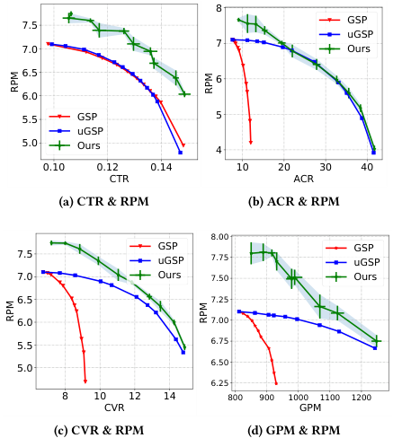

<!-- Start of picture text -->
8 7.5 GSP uGSP 7.0 7 Ours 6.5 6 6.0 5.5 GSP 5 uGSP 5.0 Ours 4 0.10 0.12 0.14 10 20 30 40 CTR ACR (a) CTR & RPM (b) ACR & RPM 8.00 GSP GSP 7.5 uGSP 7.75 uGSP 7.0 Ours 7.50 Ours 6.5 7.25 6.0 7.00 5.5 6.75 5.0 6.50 6.25 8 10 12 14 800 900 1000 1100 1200 CVR GPM (c) CVR & RPM (d) GPM & RPM RPM RPM RPM RPM <!-- End of picture text -->

**Figure 3: The performance of Deep GSP and other baseline mechanisms in the offline experiments.** 

preferences, etc.), and context information (the source of traffic, etc). Due to the intractability of precise predictions, there are gaps between the estimated values (such as _𝑝𝐶𝑇𝑅_ , _𝑝𝐴𝐶𝑅_ , _𝑝𝐶𝑉𝑅_ ) and the real performance metrics (CTR, ACR, CVR). Therefore, we built an offline auction simulator with a prediction module to generate simulated feedback. 

_4.2.2 Performance in Offline Simulations._ We first conduct experiments to compare the performance of Deep GSP and other baseline mechanisms without considering _ST constraint_ (i.e., _𝜖_ = 1.0). In order to facilitate intuitive comparisons, we set only two performance metrics with the form _𝜆_ × _𝑅𝑃𝑀_ + (1 − _𝜆_ ) × _𝑋_ , where _𝑋_ is selected from { _𝐶𝑇𝑅,𝐴𝐶𝑅,𝐶𝑉𝑅,𝐺𝑃𝑀_ }. In Deep GSP, we directly set the objective by selecting the values of _𝜆_ uniformly from the interval [0 _,_ 1]. In uGSP, we set the rank score function with _𝜆_ × _𝑝𝐶𝑇𝑅_ × _𝑏𝑖𝑑_ + (1 − _𝜆_ ) × _𝑝𝑋_ . For GSP, we tune the variable _𝜎_ in the interval [0 _._ 5 _,_ 2 _._ 0]. As some selected objectives may be conflicting, we plot Pareto curve of the performance metrics for different baseline mechanisms, as shown in Fig. 3. Since Deep GSP utilizes a deep model with a learning algorithm, we also illustrate the error bar to demonstrate its stability. 

We find that the Pareto curves of Deep GSP are mostly above the curves of other baselines, which indicates the solutions from Deep GSP outperform others. With more data fed into it, the deep rank score model can extract high-level fine-grained features and construct a more sophisticated ranking strategy to optimize the given objective, which surpasses the static mechanism (GSP, uGSP). We also notice that the performance of GSP baseline is poor when considering ACR/CVR/GPM (in Fig. 3b-3d), which is reasonable as GSP does not model the effect of these indicators explicitly in its rank score function. 

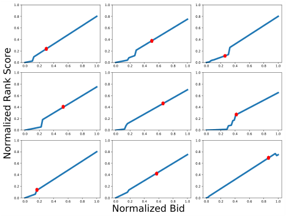

<!-- Start of picture text -->
1.0 1.0 1.0 0.8 0.8 0.8 0.6 0.6 0.6 0.4 0.4 0.4 0.2 0.2 0.2 0.0 0.0 0.2 0.4 0.6 0.8 1.0 0.0 0.0 0.2 0.4 0.6 0.8 1.0 0.0 0.0 0.2 0.4 0.6 0.8 1.0 1.0 1.0 1.0 0.8 0.8 0.8 0.6 0.6 0.6 0.4 0.4 0.4 0.2 0.2 0.2 0.0 0.0 0.2 0.4 0.6 0.8 1.0 0.0 0.0 0.2 0.4 0.6 0.8 1.0 0.0 0.0 0.2 0.4 0.6 0.8 1.0 1.0 1.0 1.0 0.8 0.8 0.8 0.6 0.6 0.6 0.4 0.4 0.4 0.2 0.2 0.2 0.0 0.0 0.2 0.4 0.6 0.8 1.0 0.0 0.0 0.2 0.4 0.6 0.8 1.0 0.0 0.0 0.2 0.4 0.6 0.8 1.0 Normalized Bid Normalized Rank Score <!-- End of picture text -->

**Figure 4: Monotonicity Verification: Examples of the conditioned trends on bid (red markers are the real reported bids).** 

_4.2.3 Monotonicity and Payment Error Rate._ In Fig. 4, we plot the trained model’s conditioned trends on the bid with a few test samples. The red markers represent the real reported bids. We find that the monotonicity is guaranteed in most cases. Although some minor decreasing trends exist, we find these decreasing areas are far away from the real reported bid. As we enforce the model monotonicity by learning from data, the model may have a weak generalization on unseen state space. Table 2 also shows the experimental results of deep rank score model on monotonicity metric (T _𝑚_ ), with different performance metrics configurations. We find the T _𝑚𝑠_ are all above 0.96 on various experimental groups. These results verify the effectiveness of the model-agnostic point-wise loss approach to guarantee monotonicity. The averaged payment errors (PER) are also given in Table 2. We find all PERs are around 1, which indicates that the approximate inverse solution _𝑝𝑖_ defined in Eq. (9) does not introduce much bias. 

**Table 2: Experimental results of deep rank score model on monotonicity, payment error ratio and IC property.**3 

|Exp|Metrics Configuration|T_𝑚_|PER|IC|
|---|---|---|---|---|
|1|(1,0,0,0,0)|0.991|1.009|0.9878|
|2|(0.5,0.5,0,0,0)|0.960|0.994|0.9910|
|3|(0.5,0,0.5,0,0)|0.978|0.988|0.9903|
|4|(0.5,0,0,0.5,0)|0.972|0.995|0.9817|
|5|(0.5,0,0,0,0.5)|0.982|0.999|0.9856|
|6|(0.6,0.1,0.1,0.1,0.1)|0.975|0.995|0.9941|

**Table 3: The performance of the advertisers’ utility (Adv) and platform objective (Plat) under various parameter** _𝜖_ **.** 

|_𝜖_|0.0|0.1|0.2|0.3|0.4|−ST|
|---|---|---|---|---|---|---|
|Adv|99.92%|91.71%|82.03%|69.41%|64.78%|63.95%|
|Plat|72.71%|78.56%|84.36%|89.70%|96.14%|100%|

> 3Due to the limitation of space, we denote the weights of multiple metrics by a tuple. (e.g., for Exp2, the mechanism objective is 0 _._ 5 × _𝑅𝑃𝑀_ + 0 _._ 5 × _𝐶𝑇𝑅_ .) 

WSDM ’21, March 8–12, 2021, Virtual Event, Israel 

Zhilin Zhang and Xiangyu Liu, et al. 

_4.2.4 Incentive Compatibility._ We now utilize the i-SIC metric [7] to evaluate _incentive compatibility_ (IC) of Deep GSP. The i-SIC metric is between 0 and 1, and the larger value means the better IC property. We only evaluate Deep GSP in the single-slot setting. As we can observe from the last column in Table 2, the i-SIC values are close to 1, and the values w.r.t. different metrics configurations change negligibly. Such results demonstrate that Deep GSP can guarantee the IC property to some extent while optimizing multiple metrics, which is meaningful to benefit the long-term healthy development of the whole advertising ecology. 

_4.2.5 Smooth Transition among Candidate Mechanisms._ Pure optimization towards the mechanism objective is not the entire goal of Deep GSP, and the smooth transition of advertisers’ utility is also desired when the auction mechanism is switched. In Deep GSP, it is achieved by the _𝜖_ -constraint. To verify the effectiveness of this constraint, we increase _𝜖_ when the mechanism switches from RPM to CTR. From the offline performance shown in Table 3, we observe that the advertiser’s utility decreases in proportion to the value of _𝜖_ , illustrating that Deep GSP has the quantitative control ability towards the advertisers’ performance. It is noted that the performance of both the advertisers and mechanism changes marginally when the _𝜖_ is larger than 0 _._ 4, due to the advertisers’ strategy for guaranteeing their utilities. 

## **4.3 Online Experiments** 

We present the online performance of the proposed _Deep GSP auction_ in _Taobao_ ad platform. The deployment has the following details. (i) We use an open-source real-time log-processing framework, Flink [3], to build the online stream process, which includes auction logs collection, real-time state construction, and metrics calculation. (ii) The critic and actor of the deep rank score model are trained on a Tensorflow-based distributed training framework. (iii) The exploration in policy optimization is done by deploying a separate online bucket, with random noise added on the actor output. (iv) In order to respond to the dynamic nature of the online auction environment more quickly, the deep rank score model will be updated every 15 minutes. (v) In the online engine, there are tens of thousands of traffic requests every second for the Deep GSP service, and each request contains an average of 400 ads. After the parallelization and calculation optimization, it takes about five milliseconds for each request to be processed. 

We consider all five metrics, i.e., RPM, CTR, ACR, CVR, GPM, and conduct online A/B tests with several combinations of these metrics. Table 4 shows the online A/B test with 1% of whole production traffic in _August 1, 2020_ . We use GSP as the baseline, and present the relative improvements in the table. As the online platform contains millions of user requests every day, the results can prove stable. From _Exp 1 - 5_ , Deep GSP makes it possible to get high performance of CTR, ACR, CVR, GPM at a low cost of RPM. From _Exp 6_ , we find the platform’s revenue (RPM), the user experience (CTR, ACR, CVR), and overall GPM achieve a reciprocal win-win situation. 

Next, we verify the effectiveness of _smooth transition_ between auction mechanisms in the online production. We observe the influence on the advertisers’ utility when the mechanism switches from CTR objective to RPM objective by adjusting _𝜖_ from 0 _._ 0 to 1 _._ 0. In Fig. 5, we find that the advertisers’ utility (blue line) moves 

**Table 4: Online A/B test on different metrics configurations (August 1, 2020, 1% production flow).** 

|Exp|Metrics|RPM|CTR|ACR|CVR|GPM|
|---|---|---|---|---|---|---|
|1|RPM|**+5.2%**|+3.1%|-1.5%|+0.8%|-2.0%|
|2|RPM&CTR|-0.3%|**+12.8%**|+5.6%|+20.0%|+7.5%|
|3|RPM&ACR|+0.7%|+1.5%|**+6.6%**|+6.8%|+8.1%|
|4|RPM&CVR|+0.0%|+1.4%|+3.6%|**+7.5%**|+31.0%|
|5|RPM&GPM|+0.2%|+3.3%|+2.4%|+3.6%|+**38.7%**|
|6|All|+1.8%|+6.2%|+1.4%|+5.9%|+3.7%|

downward gradually along with the increase of _𝜖_ . Therefore, Deep GSP can accommodate switching between even incompatible objectives, ensuring the advertisers’ performance will not immediately fluctuate too much. 

## **5 RELATED WORK** 

Mechanism design in online advertising has been studied for a long time. The generalized second price auction (GSP) [10] and VickreyClarke-Groves auction (VCG) [20] have been widely studied and used in various advertising systems. Thompson et al. [25] studied many ways to increase revenue under the GSP framework, such as reserve prices and exponential parameters. However, these works only focus on one particular optimization objective. 

Several works have also discussed optimizing multiple objectives in ad auctions. Likhodedov and Sandholm [16] proposed a framework to optimize the linear combination of revenue and social welfare in single item auctions. Geyik et al. [12] discussed joint optimization of multiple performance metrics in online video advertising, including engagement, viewability, and user reach indicators. They focused on optimizing advertising campaigns and assumed the optimization objectives could be ranked in the order of importance. Chen et al. [4] proposed a two-stage computational framework to optimize trade-offs among multiple stakeholders (platform, advertisers, and users) by incorporating various metrics. The first stage is still auction, and the second stage re-ranks ads by considering the benefits of all stakeholders. However, their method does not explicitly consider the influence of re-ranking to the mechanism properties (such as incentive compatibility). Bachrach et al. [2] proposed truthful auction mechanisms to optimize trade-offs between multiple stakeholders. They designed rank score function as a linear combination of revenue, welfare, and clicks, while the payment was computed as prescribed by Myerson [19]. Their method requires accurate model prediction of each metric when applied to optimize multiple performance metrics in real industrial applications. 

Another concurrent line of work studied by [5, 22] is automated mechanism design. They framed the problem of optimizing revenue and welfare as an instance of a constraint satisfaction problem (CSP) and solved CSP with the linear program (LP) algorithms. Duetting et al. [8] used deep learning in the context of mechanism design under incentive compatibility constraints or low ex-post regret. They formulated the optimal auction design as a constrained optimization problem, without consideration of actual feedback. Shen et al. [23] and Tang [24] modeled the impression allocation problem as a Markov decision process and solved it by reinforcement learning. However, most of the above mechanisms are built 

WSDM ’21, March 8–12, 2021, Virtual Event, Israel 

Optimizing Multiple Performance Metrics with Deep GSP Auctions for E-commerce Advertising 

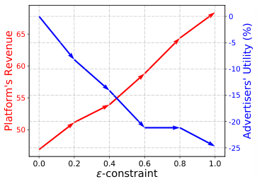

<!-- Start of picture text -->
0 65 -5 60 -10 55 -15 -20 50 -25 0.0 0.2 0.4 0.6 0.8 1.0 -constraint Platform's Revenue Advertisers' Utility (%) <!-- End of picture text -->

**Figure 5:** **_Smooth transition_ between mechanisms (from CTR to RPM) by increasing** _𝜖_ **from** 0 _._ 0 **to** 1 _._ 0 **.** 

on optimizing single optimization objective, such as revenue and social welfare. 

## **6 CONCLUSION** 

In this paper, we focus on the problem of optimizing multiple performance metrics in online e-commerce and propose an end-to-end learning based ad auction mechanism. We leverage the deep learning technique to design a new rank score function and integrate it into the GSP auction framework, i.e., Deep GSP auction. We also mathematically characterize the optimization of multiple performance metrics under some desirable properties in Deep GSP auction, such as _game equilibrium_ and _smooth transition_ , and give detailed algorithms with other relative technical details such as point-wise monotonicity loss, approximate inverse payment, and deep policy optimization. Extensive experiments have been conducted on a real-world e-commerce ad platform. Both offline and online experimental results validate the effectiveness of the proposed auction mechanism. 

## **ACKNOWLEDGMENTS** 

This work was supported in part by Science and Technology Innovation 2030 – “New Generation Artificial Intelligence” Major Project No. 2018AAA0100900, in part by Alibaba Group through Alibaba Innovation Research Program, in part by China NSF grant No. 61902248, 62025204, in part by Shanghai Science and Technology fund 20PJ1407900. The authors would like to thank Han Li, Xiaoqiang Zhu, Yu Rong, Hongtao Lv, Junqi Jin, Rihan Chen, Rui Du, Guan Wang and anonymous reviewers for their valuable help and suggestions. 

- [5] Vincent Conitzer and Tuomas Sandholm. 2004. Self-interested automated mechanism design and implications for optimal combinatorial auctions. In _Proceedings of the 5th ACM conference on Electronic commerce_ . 132–141. 

- [6] Gregory W Corder and Dale I Foreman. 2014. _Nonparametric statistics: A step-bystep approach_ . John Wiley & Sons. 

- [7] Yuan Deng, Sébastien Lahaie, Vahab Mirrokni, and Song Zuo. 2020. A datadriven metric of incentive compatibility. In _Proceedings of The Web Conference 2020_ . 1796–1806. 

- [8] Paul Duetting, Zhe Feng, Harikrishna Narasimhan, David Parkes, and Sai Srivatsa Ravindranath. 2019. Optimal Auctions through Deep Learning. In _International Conference on Machine Learning_ . 1706–1715. 

- [9] Charles Dugas, Yoshua Bengio, François Bélisle, Claude Nadeau, and René Garcia. 2009. Incorporating Functional Knowledge in Neural Networks. _Journal of Machine Learning Research_ 10, 6 (2009). 

- [10] Benjamin Edelman, Michael Ostrovsky, and Michael Schwarz. 2007. Internet advertising and the generalized second-price auction: Selling billions of dollars worth of keywords. _American economic review_ 97, 1 (2007), 242–259. 

- [11] David S Evans. 2009. The online advertising industry: Economics, evolution, and privacy. _Journal of economic perspectives_ 23, 3 (2009), 37–60. 

- [12] Sahin Cem Geyik, Sergey Faleev, Jianqiang Shen, Sean O’Donnell, and Santanu Kolay. 2016. Joint optimization of multiple performance metrics in online video advertising. In _Proceedings of the 22nd ACM SIGKDD International Conference on Knowledge Discovery and Data Mining_ . 471–480. 

- [13] Avi Goldfarb and Catherine Tucker. 2011. Online display advertising: Targeting and obtrusiveness. _Marketing Science_ 30, 3 (2011), 389–404. 

- [14] Peter J Hammond. 1979. Straightforward individual incentive compatibility in large economies. _The Review of Economic Studies_ 46, 2 (1979), 263–282. 

- [15] Sébastien Lahaie and David M Pennock. 2007. Revenue analysis of a family of ranking rules for keyword auctions. In _Proceedings of the 8th ACM conference on Electronic commerce_ . 50–56. 

- [16] Anton Likhodedov and Tuomas Sandholm. 2003. Auction mechanism for optimally trading off revenue and efficiency. In _Proceedings of the 4th ACM conference on Electronic commerce_ . 212–213. 

- [17] Timothy P Lillicrap, Jonathan J Hunt, Alexander Pritzel, Nicolas Heess, Tom Erez, Yuval Tassa, David Silver, and Daan Wierstra. 2015. Continuous control with deep reinforcement learning. _arXiv preprint arXiv:1509.02971_ (2015). 

- [18] Xiao Lin, Hongjie Chen, Changhua Pei, Fei Sun, Xuanji Xiao, Hanxiao Sun, Yongfeng Zhang, Wenwu Ou, and Peng Jiang. 2019. A pareto-efficient algorithm for multiple objective optimization in e-commerce recommendation. In _Proceedings of the 13th ACM Conference on Recommender Systems_ . 20–28. 

- [19] Roger B Myerson. 1981. Optimal auction design. _Mathematics of operations research_ 6, 1 (1981), 58–73. 

- [20] Noam Nisan and Amir Ronen. 2007. Computationally feasible VCG mechanisms. _Journal of Artificial Intelligence Research_ 29 (2007), 19–47. 

- [21] Ben Roberts, Dinan Gunawardena, Ian A Kash, and Peter Key. 2016. Ranking and tradeoffs in sponsored search auctions. _ACM Transactions on Economics and Computation (TEAC)_ 4, 3 (2016), 1–21. 

- [22] Tuomas Sandholm. 2003. Automated mechanism design: A new application area for search algorithms. In _International Conference on Principles and Practice of Constraint Programming_ . Springer, 19–36. 

- [23] Weiran Shen, Binghui Peng, Hanpeng Liu, Michael Zhang, Ruohan Qian, Yan Hong, Zhi Guo, Zongyao Ding, Pengjun Lu, and Pingzhong Tang. 2020. Reinforcement mechanism design, with applications to dynamic pricing in sponsored search auctions. In _AAAI_ . 2236–2243. 

- [24] Pingzhong Tang. 2017. Reinforcement mechanism design.. In _IJCAI_ . 5146–5150. 

- [25] David RM Thompson and Kevin Leyton-Brown. 2013. Revenue optimization in the generalized second-price auction. In _Proceedings of the fourteenth ACM conference on Electronic commerce_ . 837–852. 

- [26] Hal R Varian. 2007. Position auctions. _international Journal of industrial Organization_ 25, 6 (2007), 1163–1178. 

- [27] Seungil You, David Ding, Kevin Canini, Jan Pfeifer, and Maya Gupta. 2017. Deep lattice networks and partial monotonic functions. In _Advances in neural information processing systems_ . 2981–2989. 

## **REFERENCES** 

- [1] 2020. _Supplementary Materials_ . https://drive.google.com/file/d/ 1nTBTaKK5n9NUvf1k7iXNzVhY5vjb3U7J/view?usp=sharing 

- [2] Yoram Bachrach, Sofia Ceppi, Ian A Kash, Peter Key, and David Kurokawa. 2014. Optimising trade-offs among stakeholders in ad auctions. In _Proceedings of the fifteenth ACM conference on Economics and computation_ . 75–92. 

- [3] Paris Carbone, Asterios Katsifodimos, Stephan Ewen, Volker Markl, Seif Haridi, and Kostas Tzoumas. 2015. Apache flink: Stream and batch processing in a single engine. _Bulletin of the IEEE Computer Society Technical Committee on Data Engineering_ 36, 4 (2015). 

- [4] Xiang Chen, Bowei Chen, and Mohan Kankanhalli. 2017. Optimizing trade-offs among stakeholders in real-time bidding by incorporating multimedia metrics. In _Proceedings of the 40th International ACM SIGIR Conference on Research and Development in Information Retrieval_ . 205–214. 

