# **On Designing a Two-stage Auction for Online Advertising** 

Yiqing Wang1 , Xiangyu Liu2 , Zhenzhe Zheng1 *, Zhilin Zhang2 , Miao Xu2 , Chuan Yu2 and Fan Wu1 

1Shanghai Jiao Tong University, China 2Alibaba Group, China {wangyiqing_2015, zhengzhenzhe}@sjtu.edu.cn, fwu@cs.sjtu.edu.cn {qilin.lxy, zhangzhilin.pt, xumiao.xm, yuchuan.yc}@alibaba-inc.com 

## **ABSTRACT** 

For the scalability of industrial online advertising systems, a twostage auction architecture is widely used to enable efficient ad allocation on a large set of corpus within a limited response time. The current deployed two-stage ad auction usually retrieves an ad subset by a coarse ad quality metric in a pre-auction stage, and then determines the auction outcome by a refined metric in the subsequent stage. However, this simple and greedy solution suffers from performance degradation, as it regards the decision in each stage separately, leading to an improper ad selection metric for the pre-auction stage. In this work, we explicitly investigate the relation between the coarse and refined ad quality metrics, and design a two-stage ad auction by taking the decision interaction between the two stages into account. We decouple the design of the twostage auction by solving a stochastic subset selection problem in the pre-auction stage and conducting a general second price (GSP) auction in the second stage. We demonstrate that this decouple still preserves the _incentive compatibility_ of the auction mechanism. As the proposed formulation of the pre-auction stage is an NPhard problem, we propose a scalable approximation solution by defining a new subset selection metric, namely _Pre-Auction Score (PAS)_ . Experiment results on both public and industrial dataset demonstrate the improvement on social welfare and revenue of the proposed two-stage ad auction, than the intuitive greedy two-stage auction and other baselines. 

## **CCS CONCEPTS** 

### • **Information systems** → **Computational advertising** . 

## **KEYWORDS** 

online advertising, ad auction, two-stage auction 

This work was supported in part by Science and Technology Innovation 2030 –“New Generation Artificial Intelligence” Major Project No. 2018AAA0100905, in part by China NSF grant No. 61902248, 62025204, 62072303, 61972252 and 61972254, and in part by Alibaba Group through Alibaba Innovation Research Program, and in part by Shanghai Science and Technology fund 20PJ1407900. The opinions, findings, conclusions, and recommendations expressed in this paper are those of the authors and do not necessarily reflect the views of the funding agencies or the government. *Zhenzhe Zheng is the corresponding author. 

Permission to make digital or hard copies of all or part of this work for personal or classroom use is granted without fee provided that copies are not made or distributed for profit or commercial advantage and that copies bear this notice and the full citation on the first page. Copyrights for components of this work owned by others than ACM must be honored. Abstracting with credit is permitted. To copy otherwise, or republish, to post on servers or to redistribute to lists, requires prior specific permission and/or a fee. Request permissions from permissions@acm.org. _WWW ’22, April 25–29, 2022, Virtual Event, Lyon, France._ © 2022 Association for Computing Machinery. ACM ISBN 978-1-4503-9096-5/22/04...$15.00 https://doi.org/10.1145/3485447.3512054 

#### **ACM Reference Format:** 

Yiqing Wang, Xiangyu Liu, Zhenzhe Zheng, Zhilin Zhang, Miao Xu, Chuan Yu and Fan Wu. 2022. On Designing a Two-stage Auction for Online Advertising. In _Proceedings of the ACM Web Conference 2022 (WWW ’22), April 25–29, 2022, Virtual Event, Lyon, France._ ACM, New York, NY, USA, 10 pages. https://doi.org/10.1145/3485447.3512054 

## **1 INTRODUCTION** 

Online advertising is the major sources of revenue for Internet industry [14]. Modern online advertising platforms conduct ad allocation by running ad auction mechanisms in real-time. To achieve effectiveness and efficiency in ad allocation, the ad auction mechanisms jointly consider the bids from advertisers as well as the quality of displaying ads to users. For example, in the celebrated GSP auction [14, 33], the ad allocation decisions are made based on the metric of bid multiplying the ad quality. The ad quality is measured by the potential actions ( _e.g._ , click and purchase) of users on the displayed ads, such as click through rate (CTR) [8, 19, 42] and conversion rate (CVR) [24], which can be estimated by learning models over the rich features of users and ads and the abundant data of user-ad interaction1 . Thus, the performance of ad allocation depends not only on the rule of auction mechanism, but also on the accuracy of learning models. 

In practice, direct implementation of such a one-stage ad auction mechanism faces scalability issues, and a two-stage auction architecture is used to make a trade-off between the system scalability and ad allocation performance. The one-stage ad auction mechanism must decide the auction outcome on a set of thousands of ads within tens of milliseconds [19, 43]. However, the sophisticated learning models, such as Wide&Deep [8] and DIN [42], can not complete the CTR estimations for all the candidate ads within a limited response time. To relieve this dilemma between performance and scalability, we turn to the two-stage architecture for online ad auction, which is also adopted for large-scale online recommenders [9, 15]. An intuitive and greedy design of such a two-stage ad auction is illustrated in Figure 1a: in the first stage, called pre-auction stage, we rank the full set of _N_ ads A _N_ , and select a subset of _M_ ads A _M_ by _bid_ multiplying _ctr_� from a fast and coarse ctr estimator M_c_ ; then in the second stage, called auction stage, we determine the final ad allocation results by evaluating only on the selected ad subset via _bid_ multiplying _ctr_ from a sophisticated and refined ctr estimator M_r_ . Although this greedy two-stage auction mechanism has been widely deployed in industry [19, 35], it suffers serious loss on ad allocation performance. Due to the ability gap between the two _ctr_ estimators, the coarse and the refined _ctr_ s sometimes differ greatly for the same ⟨ad,user⟩ pair. Some ads with high refined _ctr_ but low coarse _ctr_ could be filtered out by the first stage, losing the chance of entering the second stage and winning an ad slot. 

1Without loss of generality, we regard CTR as the ad quality in this work. 

90 

WWW ’22, April 25–29, 2022, Virtual Event, Lyon, France. 

Wang et al. 

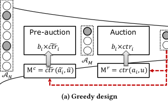

<!-- Start of picture text -->
Pre-auction Auction 𝑏!×𝑐𝑡𝑟& ! 𝑏!×𝑐𝑡𝑟! 𝒜% M " = 𝑐𝑡𝑟& (𝑎+ , 𝑢.)! M # = 𝑐𝑡𝑟(𝑎!,𝑢) 𝒜$ (a) Greedy design <!-- End of picture text -->

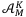

<!-- Start of picture text -->
𝒜%& <!-- End of picture text -->

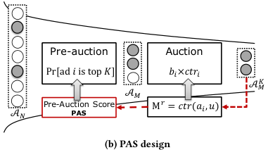

<!-- Start of picture text -->
Pre-auction Auction Pr[ad 𝑖 is top 𝐾] 𝑏!×𝑐𝑡𝑟! 𝒜$% 𝒜$ Pre-Auction Score M " = 𝑐𝑡𝑟(𝑎!,𝑢) 𝒜# PAS (b) PAS design <!-- End of picture text -->

**Figure 1: (a) The widely adopted greedy design of two-stage auction. (b) Our design with Pre-Auction Score (PAS).** 

This greedy design reflects a common misunderstanding in applying the two-stage architecture for online advertising. While optimizing ad allocation performance for the two-stage auction, just regarding each stage as a separate optimization problem, _e.g._ , conducting the individual GSP auction with the same metric of _bid_ × _ctr_ for ad selection in each stage, would suffer performance degradation. The auction designer should consider the interaction between the two stages ( _i.e._ , the second stage will refine the estimation and selection over the subset delivered by the first stage), and figure out proper selection metrics for each stage. 

In this work, we focus on the problem of designing a two-stage auction for online advertising, jointly considering the scalability of large-scale online systems and the ad allocation performance guarantee. There are two major challenges of this work. The first challenge is to characterize the conditions of the two-stage ad auction to satisfy the economic properties of _incentive compatible (IC)_ , _i.e._ , the advertisers are encouraged to report their truthful value to a user click as bid, and _individual rational (IR)_ , _i.e._ , the utility for an advertiser is always non-negative. The second challenge is the large decision space and then the high computational complexity of designing the two-stage auctions, _i.e._ , how can we decouple the auction design of the two stages and propose specific auctions for each stage, so that the whole two-stage auction has performance guarantee within limited response time. Although there exist many works for designing ad auction mechanisms to optimize variance of performance metrics such as social welfare and revenue [23, 33], none of them considered the two-stage auction architecture. At the same time, although the two-stage recommender system gradually attracts attention recently [9, 15, 20], the two-stage problem of online advertising differs from that of recommender systems because there are payment transfer as well as the requirement of economic properties of IC and IR in ad auctions, while neither of these two issues appears in recommender systems. 

The intuition behind our proposed solution for the two-stage ad auction is as follows. First, we specify the utility model for advertisers as _value maximizers_ , a proper model to capture the objectives of advertisers in online advertising [25, 36], and then obtain the characteristics of the two-stage auction to be IC and IR under this model. Then, to reduce the design space, we fix the second stage auction as the celebrated general second price (GSP) auction, and demonstrate that this decoupling preserves the optimality of performance and the properties of IC and IR for the two-stage auction. Next, we focus on the design in the first stage, _i.e._ , the pre-auction stage, and formulate it as a stochastic subset selection problem, which is to select _M_ stochastic elements to maximize the expected sum of the realized top _K_ elements when we regard the unrealized 

_ctr_ s of ads in the pre-auction stage as random variables. However, this subset selection problem is a submodular maximization with cardinality constraints, which can be proved to be NP-hard. To derive a scalable pre-auction, we turn to a closely related problem of selecting _M_ stochastic elements which maximizes the expected recall on the realized top _K_ elements, based on which we can define a new ad-wise selection metric, namely _Pre-Auction Score (PAS)_ . We further design a learning-based implementation of this PAS metric, which can be trained with the supervision by the refined ctr estimator M_r_ . As PAS is a more proper metric for the pre-auction stage, our solution outperforms the widely adopted greedy design. We illustrate the detailed procedure of our two-stage auction in Figure 1b. 

We summarize the main contributions of this work as follows. 

- We define a new mechanism design problem of two-stage ad auction design for online advertising, which jointly considers system scalability and performance guarantee. We also demonstrate the performance degradation of a widely adopted two-stage ad auction, which ignores the interaction between the optimization problems in the two stages. 

- We propose a solution for designing a two-stage ad auction for social welfare maximization. We decouple the two-stage auction as a stochastic subset selection problem in the preaucton stage and the GSP auction in the second stage. We propose a new ad-wise selection metric Pre-Auction Score (PAS) to solve the subset selection. The proposed two-stage ad auction still satisfies the properties of IC and IR. 

- Extensive experiments on both public and industrial data demonstrate the effectiveness of our solution. On the industrial data, our solution outperforms the greedy two-stage auction by +4.35% on social welfare and +4.59% on revenue. 

## **2 PRELIMINARIES** 

In this section, we describe the ad auction model, the utility model of advertisers, and the desired economic properties of ad auctions. 

For an online ad platform, a page view request from a user triggers an ad auction, where a set of _N_ advertisers A _N_ = {1, . . . , _N_ } compete for _K_ ad slots on the page. In an ad auction, each advertiser _i_ ∈A _N_ submits a bid _bi_ based on her _private_ value _vi_ , which measures the potential benefits extracted from the user click on the ad. Besides the bids of advertisers _b_ = ( _b_ 1, . . . , _bN_ ), the auction mechanism also depends on the advertiser/ad features _a_ = ( _a_ 1, . . . , _aN_ ) and the user features _u_ . Here, the advertiser/ad features _ai_ could be ad id, category id, and etc. The user features _u_ could be user id, click histories, and etc. The features of ads and users are applied to evaluate the quality of displaying a certain ad to a specific user. The 

91 

WWW ’22, April 25–29, 2022, Virtual Event, Lyon, France. 

On Designing a Two-stage Auction for Online Advertising 

auction mechanism ⟨ _x_ , _p_ ⟩ determines the ad allocation outcomes by the allocation scheme _x_ and the prices of the _K_ ad slots by the payment rule _p_ . The allocation scheme _xi_ ( _b_ , _a_ , _u_ ) = _k_ represents that the ad _i_ wins the _k_ -th highest ad slot, or loses the auction for _k_ = 0; and the payment rule _pi_ ( _b_ , _a_ , _u_ ) is the price that the ad _i_ needs to pay if it is displayed and clicked. 

We next describe the utility model of advertisers. The advertisers would like to maximize the advertising performance of their products, only requiring the costs to satisfy certain constraints, such as budget constraint, cost-per-click constraint and returnof-investment constraint [37, 39]. Following the industrial observations from [3, 25], _value maximizer_ model [36] captures such an optimization objective of the advertisers, while the traditional _quasi-linear utility maximizer_ model [30] ( _i.e._ , each advertiser _i_ maximizes _vi_ − _pi_ ) is no longer suitable in this scenario. 

_Definition 2.1._ ( _Value Maximizer_ [36]) An advertiser _i_ is a value maximizer if she prefers the auction outcomes with a higher ad slot while keeping the payment satisfy the constraint _pi_ ≤ _vi_ ; for the same ad slot, she prefers a lower payment _pi_ . 

In an ad auction, the advertisers might strategically misreport their values, _i.e._ , bidding _bi_ � _vi_ , to manipulate the auction outcomes for their own interests. To avoid this kind of behavior, the ad auction mechanism needs to satisfy the following economic properties: 

- _Incentive Compatibility (IC)_ : truthfully reporting the private value, _i.e._ , _bi_ = _vi_ , is the best strategy for each advertiser _i_ . 

• _Individual Rationality (IR)_ : the payment of advertiser _i_ would not exceed the reported value, _i.e._ , advertiser _i_ pays _pi_ ≤ _bi_ if ad _i_ is displayed and clicked; or pays nothing, otherwise. With these two properties, advertisers do not need to spend efforts in computing bidding strategy, and are encouraged to participate in the auctions with no risk of deficit. The online platform also obtains the truthful and reliable advertisers’ values. 

For the advertisers with the utility model as a value maximizer, it has been proven in [36] that an auction mechanism satisfies IC and IR if the following two conditions are satisfied: 

- **Monotonicity** : An advertiser would win the same ad slot or a higher one if she reports a higher bid. 

- **Critical price** : The payment for a winning advertiser is the minimum bid that she needs to maintain the same ad slot. 

The goal of the ad auction mechanism considered in this work is to maximize the expected _social welfare_ , which is the sum of the expected click values of displayed ads with respective to user’s stochastic click behaviors. Social welfare is a crucial metric for online advertising, as it measures the efficiency on matching advertisers and users, and is also the upper bound of the revenue which is the sum of the total payments of the ad platform. 

## **3 PROBLEM FORMULATION** 

## **3.1 One-stage Ad Auction** 

One of the most widely used ad auction mechanisms is GSP auction [14, 33]. Given each advertiser _i_ ’s bid _bi_ for a user click along with the user’s _ctri_ to the ad _i_ , the GSP auction ranks all the ads with their expected click values of display, _i.e._ , _bi_ × _ctri_ , and allocates the _K_ ad slots from the highest to the lowest following 

this rank. The payment for the winning ad at the slot _k_ ≤ _K_ is _b_ ( _k_ +1) × _ctr_ ( _k_ +1)/ _b_ ( _k_ ), where the subscript ( _k_ ) denotes the ad with the _k_ -th highest expected click value. GSP auction is IC and IR for value-maximizing advertisers as it satisfies the conditions of monotonicity and critical price mentioned above [36]. Thus, in GSP auction we have _bi_ = _vi_ for each ad _i_ . When there is an unbiased _ctr_ estimator2 , the GSP auction can maximize the expected social welfare [33], _i.e._ , the total expected click value of the _K_ winning ads: SumTopK({ _vi_ × _ctri_ } _i_ ∈A ) = SumTopK({ _bi_ × _ctri_ } _i_ ∈A ). Here, SumTopK(S) is a set function which outputs the sum of the largest _K_ elements in the set S. 

## **3.2 CTR Estimator in Ad Auction** 

The performance of ad auctions largely depends on the accuracy of ctr estimators. There are various kinds of machine learning models developed in the literature to estimate the ctr in different scenarios. We classify these models into two categories: the coarse but fast _ctr_ estimator denoted by M_c_ and the refined but heavy _ctr_ estimator denoted by M_r_ . The coarse _ctr_ estimator M_c_ = _ctr_� ( _a_ ˜ _i_ , _u_ ˜) uses light-weight learning models [19, 35], and only leverages partial ad features _a_ ˜ _i_ and partial user features _u_ ˜. The refined _ctr_ s estimator M_r_ = _ctr_ ( _ai_ , _u_ ) can be sophisticated learning models [41, 42], and effectively leverages full ad features _ai_ and user features _u_ . For example, the full user features _u_ can be the user profiles along with a long histories of user’s behaviors [41], while the partial user features _u_ ˜ are just some basic user profiles. The refined estimator M_r_ could have a complex neural network architecture, such as attention based and sequence modeling components, to produce rich user-ad cross features [38, 41, 42]. In contrast, the coarse estimator M_c_ might simply follow a two-tower architecture [19] or an embedding layer followed by fully connected layers [35]. With these differences, the M_r_ estimator consumes longer inference time but produces more accurate _ctr_ than the M_c_ estimator does. 

We next investigate the relation between the coarse estimator M_c_ and the refined estimator M_r_ . Suppose the models of both M_c_ and M_r_ are sufficiently trained with the same data set D, which is independently and identically sampled from true distribution of ⟨user,ad⟩ pairs. For the input of the full feature ( _ai_ , _u_ ) with the corresponding partial feature ( _a_ ˜ _i_ , _u_ ˜), the outputs of M_c_ and M_r_ converge as below: 

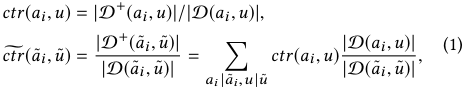

where D(∗, ⋄) ⊆D is the subset of samples whose partial or full features are restricted to (∗, ⋄), and D+ is the subset of positive samples, _i.e._ , the clicked samples. Since<u>|</u> |D(D( _a__a_ ˜ _i__<u>i</u>_ ,<u>,</u> ˜ _u__u_ )|<u>)|</u>≈Pr[_ai_,_u_| ˜_ai_,_u_˜], the relation between M_r_ and M_c_ on input ( _ai_ , _u_ ) can be approximately expressed as 

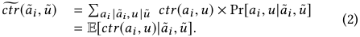

According to this relation, serving the one-stage GSP auction with M_c_ and M_r_ estimators results in expected social welfare in (3a) and 

> 2Various calibration algorithms can be applied to augment the basic _ctr_ estimator to further reduce the bias [10]. 

92 

WWW ’22, April 25–29, 2022, Virtual Event, Lyon, France. 

Wang et al. 

(3b), respectively: 

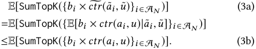

The inequality in (3b) is due to Jensen’s inequality for convex function and the fact that SumTopK here can be regarded as a convex function over R_N_ . We see that the one-stage GSP auction with the refined M_r_ estimator achieves strictly higher expected social welfare than that with the coarse estimator M_c_ . 

## **3.3 Two-stage Ad Auction** 

Due to the scalability requirement of determining auction allocation and payment over thousands of ads within tens of milliseconds, we are unable to implement the one-stage GSP auction mentioned above, because applying the refined _ctr_ estimator M_r_ to the total set of ads A _N_ exceeds the decision latency with limited computational resources. To make a trade-off between the optimality of social welfare and the timely response time, the architecture of two-stage ad auction is widely used in practice [19, 35]. Specifically, the first stage, called the pre-auction stage associated with an allocation scheme _x__p_ , selects a subset of _M_ < _N_ ads, _i.e._ , _x__p_ (A _N_ ) = A _M_ ⊊ A _N_ . With the input of the selected ads A _M_ from the first stage, the second stage, called the auction stage, determines the final allocation _x__a_ and payment _p__a_ . The pre-auction stage uses coarse but fast machine learning models with partial ad features _a_ ˜ and user features _u_ ˜ on the large set A _N_ ; while the second auction stage can apply more advanced and accurate _ctr_ estimators with full ad and user features on a relatively small set A _M_ . In the next section, we demonstrate that without a careful design of the two-stage auction, we may suffer from a performance degradation. 

Compared with the one-stage auction design, two challenges immediately emerge for the two-stage auction design. First, how to guarantee the economic properties of IC and IR in a two-stage auction. Second, considering that the searching space for jointly designing auctions in the two stages is huge, how to decouple the design of the two-stage auction and still guarantee the ultimate auction performance. We recall that (i) GSP auction is IC and IR for value maximizer advertisers, and (ii) GSP auction can maximize the expected social welfare when there is a refined ctr estimator. Due to these two advantages of GSP auction, we can fix the second stage as GSP auction, which introduces neither the violence of IC and IR nor the loss of optimality for expected social welfare. 

We focus on the auction design in the first stage, _i.e._ , the preauction stage, in this work. Firstly, we coordinate the pre-auction and the GSP auction to satisfy the two conditions (monotonicity and critical price) for IC and IR properties. Since there is no payment in the pre-auction stage, we only need to guarantee that the allocation scheme _x__p_ satisfies monotonicity, _i.e._ , _xi__p_(_b_, ˜_a_,_u_˜) is monotone increasing with respective to _bi_ . By doing this, we can guarantee the monotonicity property of the two-stage auction, that is when the advertiser _i_ increases her bid, she has a higher probability to win in the pre-auction and enter the second stage, in which she obtains a not worse ad slot. Secondly, we formulate the optimization problem in the pre-auction stage. The goal of the pre-auction is to nominate a good candidate set of ads A _M_ for the second 

stage GSP auction such that the expected social welfare is maximized. With the candidate ads set A _M_ , the GSP auction displays the top _K_ ads, denoted as the set A _M__K_, with the highest expected click value, _bi_ × _ctr_ ( _ai_ , _u_ ), resulting in the expected social welfare SumTopK({ _bi_ × _ctri_ } _i_ ∈A _M_ ) =� _i_ ∈A _M__Kbi_×_ctri_. In the first stage, we have no access to the refined _ctr_ ( _ai_ , _u_ ) but only the ( _a_ ˜ _i_ , _u_ ˜), and thus the optimization problem for the _pre-auction_ (PA) is a stochastic optimization problem: 

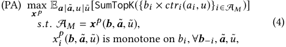

where _b_ − _i_ is the vector of bids after removing _bi_ from _b_ = ( _bi_ , _b_ − _i_ ). 

## **4 SUBOPTIMALITY OF GREEDY SOLUTION** 

In this section, we show the performance degradation of a native greedy two-stage ad auction (GDY), which is widely used in industry. The GDY auction has a simple and intuitive definition based on the refined and coarse ctr estimators M_r_ = _ctr_ ( _ai_ , _u_ ) and M_c_ = _ctr_� ( _a_ ˜ _i_ , _u_ ˜). _Definition 4.1._ In GDY, the pre-auction stage ranks all the ads A _N_ by _bi_ × _ctr_� ( _a_ ˜ _i_ , _u_ ˜), and delivers the highest _M_ ads A_д_ _M_to the second stage, which runs a GSP auction on set A_д_ _M_. 

We investigate whether GDY is a proper solution for the twostage ad auction. Only when _M_ = _K_ , the pre-auction in GDY is exactly the optimal solution for the problem in (4): 

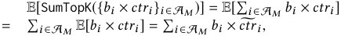

where the first equality is due to _M_ = _K_ , the second equality is due to linearity of expectation, and the third equality comes from the relation between _ctr_ from M_r_ and _ctr_� from M_c_ shown in (2). Thus, selecting the ads with the largest _M_ values of _bi_ × _ctr_� _i_ to form A _M_ in GDY is optimal in this case. For the case of _M_ > _K_ , we use a simple example to explain the suboptimality of GDY. 

_Example 4.2._ There are _N_ ads with _b_ 1 × _ctr_� 1 > . . . > _bN_ × _ctr_� _N_ . ∀ _i_ ≤ _M_ , _ctri_ = _ctr_� _i_ . An ad _j_ > _M_ has two possible CTR realizations, _ctrj_ = _t_ × _ctr_� _j_ with probability 1/ _t_ , and _ctrj_ = _ϵ_ with probability 1 − 1/ _t_ , where _t_ > 0 is a large number such that _bj_ × _t_ × _ctr_� _j_ > _bK_ × _ctr_� _K_ = _bK_ × _ctrK_ . GDY first selects the top _M_ ads (without the ad _j_ ) in the pre-auction stage, and then displays the top _K_ ads to the user in the second stage. The resulted expected social welfare is� _i__K_ =1_bi_×_ctri_. However, if the pre-auction stage selects A _M_ = {1, . . . , _M_ − 1, _j_ }, then after the second stage GSP auction, the expected social welfare outperforms that of GDY: 

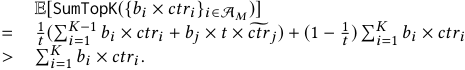

The greedy two-stage auction would encounter the scenarios similar to Example 4.2, resulting in performance degradation in practice. Some ad (like ad _j_ in the example) gets a low coarse _ctr_� from M_c_ but its refined _ctr_ from M_r_ is high. If the pre-auction stage is aware that the second stage GSP auction will further refine the _ctr_ estimation, the pre-auction stage can make a better decision, selecting some ads with potentially high refined ctr to achieve a 

93 

WWW ’22, April 25–29, 2022, Virtual Event, Lyon, France. 

On Designing a Two-stage Auction for Online Advertising 

higher social welfare. This example uses the relation between the coarse estimator M_c_ and refined estimator M_r_ shown in (2), _i.e._ , the pre-auction stage can regard the unrealized refined _ctr_ ( _ai_ , _u_ ) as a random variable from a distribution with the mean value _ctr_� ( _a_ ˜ _i_ , _u_ ˜). This problem is a subset selection over a set of random variables in the literature, and the theoretical analysis have been considered in team selection problem [22] and other general background [29]. 

The main insight we want to deliver here is that the widely deployed greedy solution, regarding the design in each of the two stages as social welfare maximization separately and using the same selection metric ( _b_ × _ctr_� or _b_ × _ctr_ ) in both stages, would instead suffer a suboptimal social welfare. When we design a two-stage auction, we should consider the interaction between the two stages, _i.e._ , the second stage will refine the estimation and conduct the ad allocation over the subset delivered by the first stage, and design proper selection metrics for each stage, to guarantee the overall ad performance of the two-stage ad auction. 

## **5 PRE-AUCTION DESIGN** 

We first show the computational complexity of solving the preauction problem defined in (4). To reduce the complexity, we then propose an ad-wise metric called pre-auction score (PAS) for scalable ad selection in the pre-auction stage. We also design a learning based implementation for PAS in practice. The detailed proofs in this section can be found in Appendix B. 

## **5.1 Complexity of Pre-auction Problem** 

We first prove that, even we relax the constraint of monotonicity on the allocation _xi__p_of the problem PA in (4), the resulting_simplified_ _version of PA_ (SimPA) is still intractable. 

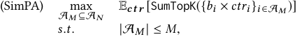

where _ctri_ is a random variable. 

Proposition 5.1. _The SimPA problem is NP-hard._ 

In fact, SimPA is a submodular maximization with a cardinality constraint. For a ground set A, a set function _д_ : 2A → R is submodular if ∀S ⊆T ⊂A and ∀ _j_ ∈A\T , _д_ (S ∪{ _j_ }) − _д_ (S) ≥ _д_ (T ∪{ _j_ }) − _д_ (T). 

Proposition 5.2. _In SimPA, the objective_ E _ct r_ [SumTopK({ _bi_ × _ctri_ } _i_ ∈S)] _is a submodular set function with respective to the set_ S _._ 

There is no apparent tractable and scalable solution for this submodular optimization in the setting of pre-auction stage: (i) The brute force algorithm, which evaluates the selection A _M_ at set-wise scale, causes an intractable _O_ (� _M__N_ �) computation. (ii) The classical approximation algorithms [4, 31] select ads sequentially based on their marginal contributions, failing to run in an ad-wise parallel way, and thus are still not scalable in practice. (iii) We emphasize that from the perspective of the pre-auction stage, _ctr_ as well as its explicit distribution are unknown, which introduces difficulty on even evaluating the objective submodular function. Thus, even the parallel approximation algorithms [1, 2, 6], which rely on submodular function evaluation, are not suitable here. 

Considering the scalability in online service of pre-auction stage, we propose an ad-wise metric for subset selection in Section 5.2. 

With this ad-wise metric, we can evaluate each ad in a parallel way, and avoid evaluation of the submodular set function. To tackle the lack of explicit distribution of _ctr_ , we propose learning based implementation for the ad-wise metric in Section 5.3. 

## **5.2 Pre-auction Score** 

We design a tractable and scalable ad-wise metric for subset selection in the pre-auction stage, which supports parallel evaluation on each ad. Since that social welfare maximization of pre-auction is an NP-hard problem, it is hopeless to directly obtain an ad-wise metric as the exact solution for social welfare maximization. The key insight here is that we can turn to an objective closely related to social welfare maximization, and then derive a corresponding ad-wise metric. The closely related objective, called _recall maximization_ (PA-R), is to select the set of ads A _M_ in the pre-auction stage to cover as much final top K ads of A _N_ in the auction stage, 

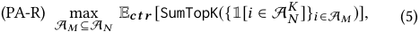

where the final top _K_ ads of A _N_ , denoted as A _N__K_, are the ads with the highest _K bi_ × _ctr_ ( _ai_ , _u_ ) from A _N_ in the auction stage. If A _M_ covers all the top _K_ ads A _N__K_, it achieves the maximum social welfare of the one-stage auction, _i.e._ , the upper bound social welfare of two-stage ad auction. 

We now derive the exact ad-wise metric, such that the preauction can rank and retrieve the top _M_ ads A _M_ according to this metric to optimize PA-R. Consider any fixed subset A _M_ , the expected recall on A _N__K_is 

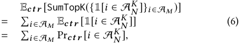

where the first equality is due to the linearity of expectation and the second equality is due to the definition of indicator function. The above equation shows that selecting the ads with the _M_ largest Pr _ct r_ [ _i_ ∈A _N__K_],_i.e._, the probabilities of being in A _N__K_, maximizes the expected recall on A _N__K_. Hence, we obtain an ad-wise metric for subset selection in the pre-auction, denoted as _fi_ for each ad _i_ : 

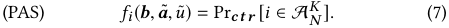

We call this metric as _Pre-Auction Score (PAS)_ . Note that although PAS is an ad-wise metric, it is still allowed to use the information of the whole ad set A _N_ in the pre-auction stage, _i.e._ , _b_ , _a_ ˜, _u_ ˜, to facilitate the calculation of the probability. According to the definition of set A _N__K_and PAS in (7), for any advertiser_i_, partial ads features _a_ ˜, user features _u_ ˜ and other advertiser’s bid _b_ − _i_ , the advertiser _i_ ’s PAS is monotonely increasing with respective to _bi_ . Thus, if the pre-auction ranks all the ads A _N_ with the metric PAS and selects the top _M_ ads, it satisfies the monotonicity of allocation in the pre-auction, and hence satisfies the IC of the two-stage auction. 

## **5.3 Learning Based Pre-auction Score** 

Computing the metric PAS requires an explicit form of distribution Pr[ _ctr_ | _b_ , _a_ ˜, _u_ ˜], which might be complicated within the unknown and interdependent online environment. To overcome this difficulty, we use parametrized neural networks to implement a learning based PAS _fi__θ_,suchthatthepermutationofrankingby_f θ_ _i_ can 

94 

WWW ’22, April 25–29, 2022, Virtual Event, Lyon, France. 

Wang et al. 

approximate the permutation of ranking by the original PAS _fi_ in (7). We use supervised learning to determine the parameters _θ_ of the neural networks _fi__θ_. For each training sample, the features are ( _b_ , _a_ ˜, _u_ ˜), _i.e._ , the _N_ bids, the partial ad features and the partial user features; and the label is the _N_ -dim vector _y_ , where the element is _yi_ = _bi_ × _ctr_ ( _ai_ , _u_ ) for each ad _i_ . During the training process, we need _ctr_ ( _ai_ , _u_ ) from the refined estimator M_r_ for all the ads in A _N_ to compute the label of a sample. But we only obtain _ctr_ ( _ai_ , _u_ ) for ad _i_ ∈A _M_ during the online service, because only the ads A _M_ enter the second auction stage and are evaluated by the refined estimator. Thus, we need an offline refined estimator M_r_ to produce _ctr_ ( _ai_ , _u_ ) for the ads in A _N_ \A _M_ . 

Follow the Plackett-Luce probability model, which is widely used in learning the distribution of permutations [5, 17], we assume that the permutation _π_ of ranking by _yi_ = _bi_ × _ctr_ ( _ai_ , _u_ ) is a sample from the distribution of permutations which is defined with _N_ parameters { _yi_ } _i_ ∈A as follows 

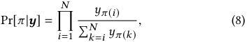

where _π_ ( _k_ ) is the ad with rank _k_ . We can easily verified that this definition of probability satisfies two desired properties: (i) It is normalized, _i.e._ ,� _π_Pr[_π_|_y_] = 1; (ii) The top 1 probability is: 

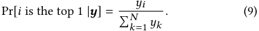

Lemma 5.3. _For yi_ > _yj and K > 1,_ Pr[ _i_ ∈A _N__K_] > Pr[_j_∈A _N__K_]_._ 

With Lemma.5.3, we can use the rank by _yi_ to represent the rank by PAS Pr[ _i_ ∈A _N__K_]. Let the neural networks directly output _fi__θ_as logits for approximate_yi_. The top-1 probability of the ad_i_ determined by logits { _fi__θ_}_i_∈A_N_is calculated as 

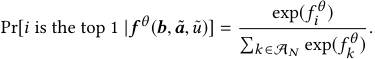

Given the sample set D _f_ , we minimize the cross entropy between the sample distribution and the parametric distribution by _f__θ_ , so the loss function is 

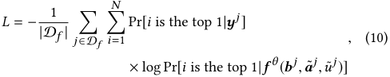

where the superscript _j_ means the _j_ -th sample in D _f_ . 

## **6 EXPERIMENTS** 

We evaluate the effectiveness of our proposed two-stage auction solution on both public and industrial datasets. 

## **6.1 Settings for Public Dataset** 

The public dataset Amazon Dataset [27] contains product reviews and metadata from Amazon [18, 28]. We conduct experiments on the subset called Books, which contains 603K user reviews, 367K items and 1600 categories. We regard reviews as user clicks and regard items as ads. The full features of a user _u_ include a user_id, 

and a list of user’s reviewed items along with categories in history, _i.e._ , _u_ = ⟨user_id, hist_items_id, hist_cate_id⟩. The length of each user’s item list is at least 5. The full ad features _ai_ is _ai_ = ⟨item_id, cate_id⟩. We define the partial user feature _u_ ˜ as _u_ ˜ = ⟨user_id, hist_items_id[:3], hist_cate_id[:3]⟩, _i.e._ , only the first three items in user’s history are used in _u_ ˜. The partial ad features _a_ ˜ _i_ is defined as the same as the full _ai_ . Based on this dataset, we simulate the process of two-stage auction and generate 40,000 auctions. In each auction, there are 1000 randomly selected ads. The bid of each ad is independently sampled from the uniform distribution. 

To simulate the second stage GSP auction, we use ad and user’s full features ⟨ _ai_ , _u_ ⟩ to train Deep Interested Networks (DIN), a baseline _ctr_ estimator [42], as the refined estimator M_r_ to generate _ctr_ ( _ai_ , _u_ ), and the label _bi_ × _ctr_ ( _ai_ , _u_ ) for each ad. To simulate GDY for comparison, we use ad and user’s partial features ⟨ _a_ ˜ _i_ , _u_ ˜⟩ to train a model with embedding followed by fully connected layers (FCN) [35], as the coarse and fast estimator M_c_ to generate _ctr_� ( _a_ ˜ _i_ , _u_ ˜) for each ad. The training samples for M_r_ DIN and M_c_ FCN are the same, _i.e._ , the same ⟨ad, user⟩ pairs from the dataset as positive samples, along with the same 1:1 negative sampling. From [19], the resulting _<u>p</u> ctr_ = _p_ +(1− _p_ )/ _η_, where_p_is the output of the trained estimator and _η_ is the negative down sampling rate. The difference between _ctr_ and _ctr_� gets larger as _η_ decreases, since the difference between raw output _p_ from M_r_ and M_c_ is approximately amplified by a factor 1/ _η_ . We consider two settings, Public-1 and Public-5, whose _η_ are 0.01 and 0.05, respectively. Public-1 simulates the _ctr_ in real-world online advertising. We would like to verify whether our solution can still outperform GDY in the scenario simulated by Public-5, where the difference between _ctr_ and _ctr_� is smaller and the GDY is able to perform relatively better. 

## **6.2 Settings for Industrial Dataset** 

The industrial dataset comes from the log of a two-stage ad auction in a leading e-commerce platform Taobao, running GDY defined as Definition 4.1. We randomly sample 30K auction records from the logged data on January 8th 2021. There are 700 ads in each auction instance. For each ad, the features are: (i) _ctr_� ( _a_ ˜ _i_ , _u_ ˜) from M_c_ , some historical statistics such as historical averaged refined _ctr_ and _cvr_ of this ad. We regard these estimated values as cross features of the ad and user’s partial features ⟨ _a_ ˜ _i_ , _u_ ˜⟩; (ii) Ad information like bid _bi_ , category and selling price of the product in the ad. The estimated _ctr_ ( _ai_ , _u_ ) from M_r_ are used to generate the label _bi_ × _ctr_ ( _ai_ , _u_ ). Note that under our assumption of value maximizing advertisers, GDY satisfies IC and IR. Therefore, we can regard the logged bids as advertiser’s truthful values for user clicks. Then, we can use the logged bids to compute social welfare and revenue during simulating other IC and IR auction mechanisms. 

## **6.3 Evaluation Metrics** 

We consider the following common used metrics for ad auction evaluation. We recall that A _N__K_is the true top_K_ads in the whole set A _N_ while A _M__K_is the top_K_ads in the selected subset A_M_. 

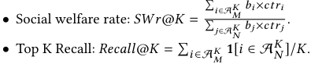

95 

WWW ’22, April 25–29, 2022, Virtual Event, Lyon, France. 

On Designing a Two-stage Auction for Online Advertising 

**Table 1: Results of different methods on data setting Public-1.** _N_ = 1000, _M_ = 50 **. Notations in a table cell: average** ± **standard deviation (Improvement over GDY) in 20 runs.** 

||_Recall_@1|_Recall_@5|_Recall_@|10|_SW r_@5|_REV r_@5|
|---|---|---|---|---|---|---|
|GDY|0.8383±0.0022, (0%)|0.7378±0.0024, (0%)|0.6597±0.0029|, (0%)|0.9252±0.0007, (0%)|0.9028±0.0010, (0%)|
|REGCTR|0.8440±0.0058,(+0.57%)|0.7469±0.0079,(+0.91%)|0.6698±0.0079,|(+1.01%)|0.9234±0.0048,(-0.18%)|0.9026±0.0050,(-0.02%)|
|REG|0.8506±0.0068,(+1.23%)|0.7483±0.0109,(+1.05%)|0.6709±0.0112,|(+1.12%)|0.9274±0.0041,(+0.22%)|0.9058±0.0050,(+0.30%)|
|**PAS**|**0.9093**±**0.0021, (+7.10%)**|**0.8639**±**0.0045, (+12.61%)**|**0.8246**±**0.0057, **|**(+16.49%)**|**0.9613**±**0.0011, (+3.61%)**|**0.9519**±**0.0015, (+4.91%)**|
|**Table    f**|**2: Results of different** _Recall_@1|**f methods on data setti** _Recall_@5|**f    ng Public-5.**_N_  _Recall_@|=1000,  10|_M_ =50**. Notations are** _SW r_@5|**the same as Table.1.** _REV r_@5|
|GDY|0.8359±0.0023, (0%)|0.7390±0.0026, (0%)|0.6623±0.0025|, (0%)|0.9389±0.0006, (0%)|0.9213±0.0008, (0%)|
|REGCTR|0.9073±0.0029,(+7.14%)|0.8502±0.0028,(+11.12%)|0.7972±0.0032,|(+13.49%)|0.9669±0.0008,(+2.80%)|0.9578±0.0010,(+3.65%)|
|REG|0.9094±0.0037,(+7.35%)|0.8521±0.0051,(+11.31%)|0.7982±0.0057,|(+13.59%)|0.9673±0.0016,(+2.84%)|0.9583±0.0018,(+3.70%)|
|**PAS**|**0.9155**±**0.0071, (+7.96%)**|**0.8745**±**0.0075, (+13.55%)**|**0.8363**±**0.0080, **|**(+17.40%)**|**0.9720**±**0.0022, (+3.31%)**|**0.9651**±**0.0027, (+4.38%)**|
|**Table 3   f**|**: Results of different** _Recall_@1|**f methods on data settin** _Recall_@5|**f    g Industrial.**  _Recall_@|_N_ =700,  10|_M_ =30**. Notations are** _SW r_@5|**the same as Table.1.** _REV r_@5|
|GDY|0.4745±0.0046, (0%)|0.3740±0.0019, (0%)|0.3175±0.0013,|(0%)|0.7808±0.0013, (0%)|0.7483±0.0010, (0%)|
|REGCTR|0.5156±0.0047,(+4.11%)|0.4043±0.0028,(+3.03%)|0.3451±0.0024,|(+2.76%)|0.8081±0.0017,(+2.73%)|0.7764±0.0022,(+2.81%)|
|REG|0.5118±0.0059,(+3.73%)|0.4048±0.0033,(+3.08%)|0.3474±0.0027,|(+2.99%)|0.8089±0.0022,(+2.81%)|0.7783±0.0025,(+3.00%)|
|**PAS**|**0.5351**±**0.0035, (+6.06%)**|**0.4226**±**0.0024, (+4.86%)**|**0.3635**±**0.0017, **|**(+4.60%)**|**0.8243**±**0.0013, (+4.35%)**|**0.7942**±**0.0007, (+4.59%)**|

- Revenue rate: _REVr_ @ _K_ = _REV_ (A _M__K_)/_REV_(A _N__K_), where rev- enue _REV_ is under GSP auction and the subscript ( _k_ ) means the advertiser with the _k_ -th highest _b_ × _ctr_ in the corresponding set, and _REV_ (A) =� _k__K_ =1_b_(_k_+1) ×_ctr_(_k_+1). 

## **6.4 Methods for Comparison** 

To prove the effectiveness of our proposed solution with PAS metric and its learning based implementation, we introduce the following baselines of pre-auction for comparison. Due to the practical deployment requirements, we only focus on the methods which select ads using _ad-wise metric_ in the pre-auction stage. Implementations of these ad-wise metrics are also restricted to use the same partial features ⟨ _a_ ˜, _u_ ⟩ as PAS uses. 

- Greedy (GDY): As described in Definition 4.1, the rank score of GDY for ad _i_ is simply _bi_ × _ctr_� _i_ , where _ctr_� _i_ is the output of the coarse estimator M_c_ . 

- Regression to _ctri_ (REGCTR): We use _ctri_ as label, and use ad and user’s partial features ⟨ _a_ ˜ _i_ , _u_ ˜⟩ to train a regression model with mean square loss. The rank score is bid times output of the regression model. 

- Regression to _bi_ × _ctri_ (REG): We use _bi_ × _ctri_ as label, and use the partial ad, user features and the bid, _i.e._ , _bi_ , _a_ ˜ _i_ , _u_ ˜, to train a regression model with mean square loss. 

The neural network structure and input for REGCTR, REG, and PAS are almost the same, except that REGCTR network lacks the input of bid. The reason we introduce REGCTR and REG for comparison is to demonstrate that PAS is a more proper selection metric for preauction. In each repeated experiment, we split data into training, validation, and test set with 3:1:1, and apply early stopping with metric _SWr_ @5 on validation set for all three methods. 

## **6.5 Performance Comparison** 

Results of different methods on data setting Public-1, Public-5 and Industrial are given in Table 1-3. The tables show average metrics, standard deviation and the improvement over GDY in 20 runs with 20 distinctive random seeds for each data setting and methods. 

We can obtain the following observations from Table 1-3. (i) We can see that our proposed PAS outperforms all baseline methods in each data setting and on each metric. For instance, PAS improves _SWr_ @5 by +3.61%, +3.31% and +4.35% comparing with the widely used GDY in Public-1, Public-5 and Industrial, respectively. (ii) As REGCTR, REG and PAS have better performance than GDY on most data settings and metrics, we conclude that pre-auction stage can benefit from the supervision by the second stage’s information. (iii) REGCTR and REG fall behind our proposed PAS. The reason can be that while REGCTR and REG are enforced to learn a regression on _ctri_ or _bi_ × _ctri_ , PAS which models the probability of being top _K_ , is a more proper selection metric for the pre-auction stage. 

Next, we compare the performance results in Table 1-2 for Public1 and Public-5, the only difference between which is the down negative sampling rate _η_ . The smaller the _η_ is, the larger the gap between coarse _ctr_� and refined _ctr_ is. This indicates that GDY on Public-1 has a worse performance than on Public-5, which can also be observed from the evaluation results. We can also see that REGCTR and REG achieve much worse performance on Public-1 than on Public-5. For example, _SWr_ @5 of REG on Public-5 is 0.967 which outperforms _SWr_ @5 of GDY by +2.84%, but the corresponding values turn out to be only 0.927 and +0.22% on Public-1. However, PAS is more stable than REG and REGCTR, and achieves similar good results on both Public-1 and Public-5. 

In Figure 2, an auction instance for each of the three data settings is illustrated to show the results of the four methods working in a two-stage auction. The figures for Public-1 and Public-5 are from the same auction instance, while only the down negative sampling rates for calculating _ctr_ are different. We first explain the three large figures in the above of Figure 2 which illustrate the results of method GDY. The x-axis is the rank by _bid_ × _ctr_ with the refined _ctr_ estimator, and here we show the top 200 ads. A blue and red point with the same x coordinate are associated with the same ad. The y-axis for blue points is the normalized value of _bid_ × _ctr_ , while the y-axis for red points is the normalized value of _bid_ × _ctr_� . The black horizontal line shows the threshold of the normalized value _bid_ × _ctr_� for entering the second auction stage in GDY. Red points above the black line enter the second auction stage, and 

96 

WWW ’22, April 25–29, 2022, Virtual Event, Lyon, France. 

Wang et al. 

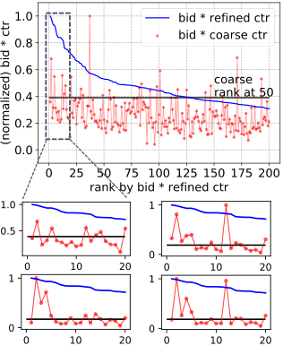

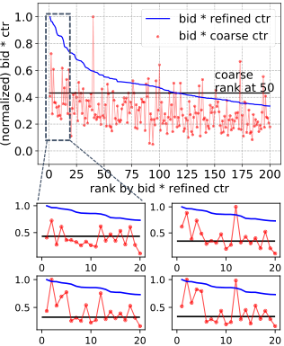

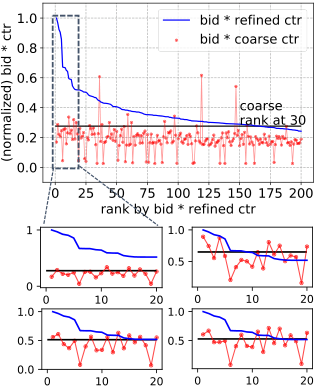

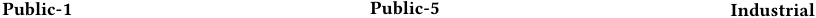

<!-- Start of picture text -->
Public-1 Public-5 Industrial <!-- End of picture text -->

**Figure 2: Illustration of two-stage auction with methods GDY, PAS, REGCTR and REG on data Public-1, Public-5 and Industrial. Layout of the four small figures: top-left, GDY; top-right, PAS; bottom-left, REGCTR; bottom-right, REG.** 

**Table 4: Failure rates of perturbation tests, with unit** <u>×10</u>−5 **(average** <u>±</u> **<u>standard deviation in 20 runs).</u>** 

||~~GDY~~|~~REGCTR~~|~~REG~~|~~PAS~~|
|---|---|---|---|---|
|~~Public-1~~|~~0~~|~~0~~|~~10.4 ± 5.27~~|~~0 ± 0~~|
|~~Public-5~~|~~0~~|~~0~~|~~0 ± 0~~|~~0 ± 0~~|
|Industrial|0|0|4.63±5.69|1.40±2.34|

the most left 5 red points among them obtain the top 5 ranks in the second auction stage and win ad slots. Next, we explain the small figures which show the top 20 ads in four different methods. Similarly, y-axis for the red points is the normalized score of pre-auction in the method, while the black horizontal line is the corresponding threshold for entering the second stage. We can see that variant methods result in different rankings in the pre-auction and different black horizontal lines. For example in the third column for Industrial data, the ad slots are allocated to the ads with the rank of _bid_ × _ctr_ as {2, 11, 15, 17, 20} (GDY), {1, 2, 4, 11, 13} (PAS), {1, 2, 8, 11, 13} (REGCTR), and {1, 2, 8, 11, 13} (REG), and thus PAS have a better _Recall_ @5 and _SWr_ @5 than GDY, REGCTR, and REG in this example. 

## **6.6 IC Testing** 

As we have mentioned in Section 2 that in order to guarantee the economic properties of IC and IR for the auction, we require that the allocation for each advertiser is monotonely increasing with respective to her bid. That is to say, the pre-auction stage need to satisfy: for any advertiser _i_ , given partial features for all ads _a_ ˜ and for the user _u_ ˜, as well as bids from other advertisers _b_ − _i_ , there exists a threshold _bi__t_thatthead_i_entersthesecondstage auction if and only if _bi_ ≥ _bi__t_. To show that learning based PAS can achieve the monotonicity approximately, we conduct counterfactual perturbation on each advertiser’s bid in the logged data and evaluate the violation of monotonicity condition. This is a common method for IC testing of ad auction mechanisms [11, 12]. 

Specifically, we sample 1000 auctions from the test set, and conduct IC test for each ad in each auction. For an ad _i_ , all its features to PAS model remain the same except that we replace _bi_ with _α_ × _bidi_ , where _α_ ∈S _p_ = {0.2 × _j_ | _j_ = 1, . . . , 10} is a multiplicative perturbation factor from interval [0, 2]. ~~Al~~ l the features of other ads in this auction remain the same. We s ~~im~~ ulate the two-stage auction on all 10 perturbation factors to check whether the PAS model passes the perturbation tests, _i.e._ , (i) <u>∃</u> _<u>α</u>_ ∈S _p_ such that ad _i_ can enter the auction stage with _α_ × _bi_ ∀ _α_ ≥ _<u>α</u>_ <u>; or (ii) ad</u> _i_ can not enter auction stage with _α_ × _bi_ for any _α_ ∈S _p_ . 

We conduct 1000 × 1000 tests, for 1000 auctions and 1000 advertisers per auction, in each of Public-1 and Public-5, and 1000 × 700 in Industrial data. Table 4 shows the average failure rates and the standard deviations of 20 runs. The low failure rates show that even we apply no deliberate design on PAS model for a guarantee of strict monotonicity, the learning based PAS learns an approximate monotonicity automatically. An intuitive reason might be that there is an inherent pattern in the supervised data that bid has a positive effect on the objective of model. We also test REG and obtain similarly low failure rates. For GDY and REGCTR, their metrics are monotone with respective to bid, so their allocations of pre-auction are naturally monotone. 

## **7 CONCLUSION** 

We have studied a novel problem of designing a large-scale twostage ad auction, which consists of a pre-auction stage and an auction stage, to maximize social welfare for online advertising. We illustrated social welfare loss of a widely adopted design due to its improper selection metric in the pre-auction stage, which ignores the relation between the two auction stages. We have designed a practical two-stage ad auction solution which guarantees IC and IR for value maximizers, where the second stage is GSP auction and the pre-auction stage selects the ad subset with an ad-wise metric called Pre-Auction Score (PAS). We have further proposed a 

97 

WWW ’22, April 25–29, 2022, Virtual Event, Lyon, France. 

On Designing a Two-stage Auction for Online Advertising 

learning based implementation of PAS. Experiment results on both public and industrial dataset have shown that our proposed solution outperforms the greedy design significantly on social welfare and revenue of the two-stage ad auction. 

## **REFERENCES** 

- [1] Eric Balkanski, Aviad Rubinstein, and Yaron Singer. 2019. An exponential speedup in parallel running time for submodular maximization without loss in approximation. In _Proceedings of the Thirtieth Annual ACM-SIAM Symposium on Discrete Algorithms_ . SIAM, 283–302. 

- [2] Eric Balkanski and Yaron Singer. 2018. The adaptive complexity of maximizing a submodular function. In _Proceedings of the 50th annual ACM SIGACT symposium on theory of computing_ . 1138–1151. 

- [3] Santiago Balseiro, Yuan Deng, Jieming Mao, Vahab Mirrokni, and Song Zuo. 2021. The Landscape of Auto-Bidding Auctions: Value Versus Utility Maximization. _Available at SSRN 3785579_ (2021). 

- [4] Niv Buchbinder, Moran Feldman, Joseph Naor, and Roy Schwartz. 2014. Submodular maximization with cardinality constraints. In _Proceedings of the 25th Annual ACM-SIAM Symposium on Discrete Algorithms_ . 1433–1452. 

- [5] Zhe Cao, Tao Qin, Tie-Yan Liu, Ming-Feng Tsai, and Hang Li. 2007. Learning to rank: from pairwise approach to listwise approach. In _Proceedings of the 24th International Conference on Machine Learning_ . 129–136. 

- [6] Chandra Chekuri and Kent Quanrud. 2019. Submodular function maximization in parallel via the multilinear relaxation. In _Proceedings of the 30th Annual ACMSIAM Symposium on Discrete Algorithms_ . SIAM, 303–322. 

- [7] Minmin Chen, Alex Beutel, Paul Covington, Sagar Jain, Francois Belletti, and Ed H Chi. 2019. Top-k off-policy correction for a REINFORCE recommender system. In _Proceedings of the 12th ACM International Conference on Web Search and Data Mining_ . 456–464. 

- [8] Heng-Tze Cheng, Levent Koc, Jeremiah Harmsen, Tal Shaked, Tushar Chandra, Hrishi Aradhye, Glen Anderson, Greg Corrado, Wei Chai, Mustafa Ispir, et al. 2016. Wide & deep learning for recommender systems. In _Proceedings of the 1st Workshop on Deep Learning for Recommender Systems_ . 7–10. 

- [9] Paul Covington, Jay Adams, and Emre Sargin. 2016. Deep neural networks for youtube recommendations. In _Proceedings of the 10th ACM Conference on Recommender Systems_ . 191–198. 

- [10] Chao Deng, Hao Wang, Qing Tan, Jian Xu, and Kun Gai. 2020. Calibrating user response predictions in online advertising. In _Joint European Conference on Machine Learning and Knowledge Discovery in Databases_ . 208–223. 

- [11] Yuan Deng and Sébastien Lahaie. 2019. Testing dynamic incentive compatibility in display ad auctions. In _Proceedings of the 25th ACM SIGKDD Conference on Knowledge Discovery & Data Mining_ . 1616–1624. 

- [12] Yuan Deng, Sébastien Lahaie, Vahab Mirrokni, and Song Zuo. 2020. A datadriven metric of incentive compatibility. In _Proceedings of the Web Conference 2020_ . 1796–1806. 

- [13] Paul Dütting, Zhe Feng, Harikrishna Narasimhan, David Parkes, and Sai Srivatsa Ravindranath. 2019. Optimal Auctions through Deep Learning. In _Proceedings of the 36th International Conference on Machine Learning_ . 1706–1715. 

- [14] Benjamin Edelman, Michael Ostrovsky, and Michael Schwarz. 2007. Internet advertising and the generalized second-price auction: Selling billions of dollars worth of keywords. _American Economic Review_ 97, 1 (2007), 242–259. 

- [15] Chantat Eksombatchai, Pranav Jindal, Jerry Zitao Liu, Yuchen Liu, Rahul Sharma, Charles Sugnet, Mark Ulrich, and Jure Leskovec. 2018. Pixie: A system for recommending 3+ billion items to 200+ million users in real-time. In _Proceedings of the Web Conference 2018_ . 1775–1784. 

- [16] Negin Golrezaei, Max Lin, Vahab Mirrokni, and Hamid Nazerzadeh. 2021. Boosted Second Price Auctions: Revenue Optimization for Heterogeneous Bidders. In _Proceedings of the 27th ACM SIGKDD Conference on Knowledge Discovery & Data Mining_ . 447–457. 

- [17] John Guiver and Edward Snelson. 2009. Bayesian inference for Plackett-Luce ranking models. In _Proceedings of the 26th International Conference on Machine Learning_ . 377–384. 

- [18] Ruining He and Julian McAuley. 2016. Ups and downs: Modeling the visual evolution of fashion trends with one-class collaborative filtering. In _Proceedings of the Web Conference 2016_ . 507–517. 

- [19] Xinran He, Junfeng Pan, Ou Jin, Tianbing Xu, Bo Liu, Tao Xu, Yanxin Shi, Antoine Atallah, Ralf Herbrich, Stuart Bowers, et al. 2014. Practical lessons from predicting clicks on ads at facebook. In _Proceedings of the 8th International Workshop on Data Mining for Online Advertising_ . 1–9. 

   - [22] Jon Kleinberg and Maithra Raghu. 2018. Team performance with test scores. _ACM Transactions on Economics and Computation (TEAC)_ 6, 3-4 (2018), 1–26. 

   - [23] Sébastien Lahaie and David M Pennock. 2007. Revenue analysis of a family of ranking rules for keyword auctions. In _Proceedings of the 8th ACM Conference on Electronic Commerce_ . 50–56. 

   - [24] Kuang-chih Lee, Burkay Orten, Ali Dasdan, and Wentong Li. 2012. Estimating conversion rate in display advertising from past erformance data. In _Proceedings of the 18th ACM SIGKDD International Conference on Knowledge Discovery and Data Mining_ . 768–776. 

   - [25] Xiangyu Liu, Chuan Yu, Zhilin Zhang, Zhenzhe Zheng, Yu Rong, Hongtao Lv, Da Huo, Yiqing Wang, Dagui Chen, Jian Xu, Fan Wu, Guihai Chen, and Xiaoqiang Zhu. 2021. Neural auction: End-to-end learning of auction mechanisms for e- commerce advertising. In _Proceedings of the 27th ACM SIGKDD Conference on Knowledge Discovery &; Data Mining_ . 3354–3364. 

   - [26] Jiaqi Ma, Zhe Zhao, Xinyang Yi, Ji Yang, Minmin Chen, Jiaxi Tang, Lichan Hong, and Ed H Chi. 2020. Off-policy learning in two-stage recommender systems. In _Proceedings of the Web Conference 2020_ . 463–473. 

   - [27] Julian McAuley. 2015. Amazon Product Data. http://jmcauley.ucsd.edu/data/ amazon/. 

   - [28] Julian McAuley, Christopher Targett, Qinfeng Shi, and Anton Van Den Hengel. 2015. Image-based recommendations on styles and substitutes. In _Proceedings of the 38th international ACM SIGIR Conference on Research and Development in Information Retrieval_ . 43–52. 

   - [29] Aranyak Mehta, Uri Nadav, Alexandros Psomas, and Aviad Rubinstein. 2020. Hitting the high notes: Subset selection for maximizing expected order statistics. _Advances in Neural Information Processing Systems_ 33 (2020). 

   - [30] Roger B Myerson. 1981. Optimal auction design. _Mathematics of Operations Research_ 6, 1 (1981), 58–73. 

   - [31] George L Nemhauser, Laurence A Wolsey, and Marshall L Fisher. 1978. An analysis of approximations for maximizing submodular set functions—I. _Mathematical Programming_ 14, 1 (1978), 265–294. 

   - [32] Weiran Shen, Binghui Peng, Hanpeng Liu, Michael Zhang, Ruohan Qian, Yan Hong, Zhi Guo, Zongyao Ding, Pengjun Lu, and Pingzhong Tang. 2020. Reinforcement mechanism design: With applications to dynamic pricing in sponsored search auctions. In _Proceedings of the AAAI Conference on Artificial Intelligence_ , Vol. 34. 2236–2243. 

   - [33] Hal R Varian. 2007. Position auctions. _international Journal of industrial Organization_ 25, 6 (2007), 1163–1178. 

   - [34] Hal R Varian and Christopher Harris. 2014. The VCG auction in theory and practice. _American Economic Review_ 104, 5 (2014), 442–45. 

   - [35] Zhe Wang, Liqin Zhao, Biye Jiang, Guorui Zhou, Xiaoqiang Zhu, and Kun Gai. 2020. COLD: Towards the Next Generation of Pre-Ranking System. _arXiv preprint arXiv:2007.16122_ (2020). 

   - [36] Christopher A Wilkens, Ruggiero Cavallo, and Rad Niazadeh. 2017. GSP: the cinderella of mechanism design. In _Proceedings of the Web Conference 2017_ . 25–32. 

   - [37] Di Wu, Xiujun Chen, Xun Yang, Hao Wang, Qing Tan, Xiaoxun Zhang, Jian Xu, and Kun Gai. 2018. Budget constrained bidding by model-free reinforcement learning in display advertising. In _Proceedings of the 27th ACM International Conference on Information and Knowledge Management_ . 1443–1451. 

   - [38] Jun Xiao, Hao Ye, Xiangnan He, Hanwang Zhang, Fei Wu, and Tat-Seng Chua. 2017. Attentional factorization machines: learning the weight of feature interactions via attention networks. In _Proceedings of the 26th International Joint Conference on Artificial Intelligence_ . 3119–3125. 

   - [39] Xun Yang, Yasong Li, Hao Wang, Di Wu, Qing Tan, Jian Xu, and Kun Gai. 2019. Bid optimization by multivariable control in display advertising. In _Proceedings of the 25th ACM SIGKDD Conference on Knowledge Discovery & Data Mining_ . 1966–1974. 

   - [40] Xinyang Yi, Ji Yang, Lichan Hong, Derek Zhiyuan Cheng, Lukasz Heldt, Aditee Kumthekar, Zhe Zhao, Li Wei, and Ed Chi. 2019. Sampling-bias-corrected neural modeling for large corpus item recommendations. In _Proceedings of the 13th ACM Conference on Recommender Systems_ . 269–277. 

   - [41] Guorui Zhou, Na Mou, Ying Fan, Qi Pi, Weijie Bian, Chang Zhou, Xiaoqiang Zhu, and Kun Gai. 2019. Deep interest evolution network for click-through rate prediction. In _Proceedings of the AAAI Conference on Artificial Intelligence_ , Vol. 33. 5941–5948. 

   - [42] Guorui Zhou, Xiaoqiang Zhu, Chenru Song, Ying Fan, Han Zhu, Xiao Ma, Yanghui Yan, Junqi Jin, Han Li, and Kun Gai. 2018. Deep interest network for click-through rate prediction. In _Proceedings of the 24th ACM SIGKDD Conference on Knowledge Discovery & Data Mining_ . 1059–1068. 

   - [43] Han Zhu, Junqi Jin, Chang Tan, Fei Pan, Yifan Zeng, Han Li, and Kun Gai. 2017. Optimized cost per click in taobao display advertising. In _Proceedings of the 23rd ACM SIGKDD Conference on Knowledge Discovery & Data Mining_ . 2191–2200. 

- [20] Jiri Hron, Karl Krauth, Michael I Jordan, and Niki Kilbertus. 2021. On component interactions in two-stage recommender systems. _arXiv preprint arXiv:2106.14979_ (2021). 

- [21] Wang-Cheng Kang and Julian McAuley. 2019. Candidate generation with binary codes for large-scale top-n recommendation. In _Proceedings of the 28th ACM international conference on information and knowledge management_ . 1523–1532. 

98 

WWW ’22, April 25–29, 2022, Virtual Event, Lyon, France. 

Wang et al. 

## **A RELATED WORK** 

**Online advertising auction.** In the market of online ad auction, traditional auction mechanisms like general second price auction (GSP) [14, 33] and Vickrey-Clark-Groove auction (VCG) [34] are widely used. Recently, many parametric mechanisms learning from data are proposed to optimize performance metrics of the auction market, _e.g._ squashed GSP [23], boosted second price auction [16], and dynamic reserve price via reinforcement learning [32] for the task of revenue maximization. The paradigm of differentiable mechanism design via deep learning proposed by Dütting _et al._ [13] is also applied to multi-objective optimization in online ad auctions [25]. 

and finish the proof. 

□ 

Proof for Lemma 5.3. For any pair of permutations ( _π_ , _π_′ ) that satisfy (1) _π_ ( _i_ ) = _π_′ ( _j_ ) ≤ _K_ ; (2) _π_ ( _j_ ) = _π_′ ( _i_ ) > _K_ ; and (3) _π_ ( _k_ ) = _π_′ ( _k_ ) for all _k_ � _i_ ∧ _k_ � _j_ , we can easily verify that Pr[ _π_ | _y_ ] > Pr[ _π_′ | _y_ ]. Then, summing up on all these pairs of ( _π_ , _π_′ ), we have 

Pr[ _i_ ∈A _N__K_∧_j_�A _N__K_] > Pr[_j_∈A _N__K_∧_i_�A _N__K_], and then 

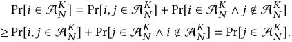

□ 

**Two-stage recommender.** Two-stage architectures with candidate generation followed by ranking have been widely adopted in large scale industrial recommenders. Despite their popularity, the literature on two-stage recommenders is relatively scarce. To improve computation efficiency [21, 40] and recommendation quality [7] are still the two most important problems of recommenders even in two-stage setting. Interaction between the two stages and its influence on system performance are studied in [7, 20, 26]. Our problem of two-stage auction system differs from the two-stage recommenders. Because of the payment transfer and requirement of economic properties, an auction system needs quantifiable and explainable evaluation of user’s interests like _ctr_ , while a recommender only determines the order of items. 

## **B PROOFS** 

Proof for Proposition 5.1. We prove that SimPA is NP-hard even when _K_ = 1 by reducing a well-known NP-hard problem set cover to SimPA. We first define the general set cover problem. The universal set is U = { _u_ 1, . . . , _uL_ }. There is a collection T = {S1, . . . , S _N_ } where ∀ _i_ ≤ _N_ , S _i_ ⊂U is a subset of universal set U. The set cover problem is to decide whether there is a collection T′ ⊂T , |T′ | ≤ _M_ such that� S _i_ ∈T′ S _i_=U.Next,forany instance of the set cover problem, we define the corresponding SimPA instance. Randomly sample a non-empty subset U′ from universal set U, then we define a set of random variables _ctr_ = { _ctr_ 1, . . . , _ctrN_ } where each _ctri_ ∈{0, _b_<u>1</u> _i_} is corresponding to the above set S _i_ : if any element in S _i_ are sampled in U′ , _ctri_ = _b_<u>1</u> _i_and _bi_ × _ctri_ = 1; otherwise, _ctri_ = 0 and _bi_ × _ctri_ = 0. Therefore, there exists a collection T′ ⊂T , |T′ | ≤ _M_ if and only if there exists a set A _M_ that _i_ ∈A _M_ ⇔S _i_ ∈T′ , such that E _ct r_ [SumTopK({ _bi_ × _ctri_ }A _M_ )] = 1 for _K_ = 1. □ 

Proof for Proposition 5.2. We can easily verify that SumTopK is a submodular set function. For any fixed value of _ctr_ , and ∀S ⊆ T ⊂A _N_ and _j_ ∈A _N_ \T , 

SumTopK({ _bi_ × _ctri_ } _i_ ∈S∪{ _j_ }) − SumTopK({ _bi_ × _ctri_ } _i_ ∈S) ≥ SumTopK({ _bi_ × _ctri_ } _i_ ∈T∪{ _j_ }) − SumTopK({ _bi_ × _ctri_ } _i_ ∈T ). Then, we take expectation over the distribution of _ctr_ on both sides of the above inequality, 

   - E _ct r_ [SumTopK({ _bi_ × _ctri_ } _i_ ∈S∪{ _j_ })] −E _ct r_ [SumTopK({ _bi_ × _ctri_ } _i_ ∈S)] 

- ≥ E _ct r_ [SumTopK({ _bi_ × _ctri_ } _i_ ∈T∪{ _j_ })] −E _ct r_ [SumTopK({ _bi_ × _ctri_ } _i_ ∈T )], 

99 

