# **LINet: A Location and Intention-Aware Neural Network for Hotel Group Recommendation** 

Ruitao Zhu∗ Detao Lv∗ Shanghai Jiao Tong University Alibaba Group Shanghai, China Hangzhou, China sjtu_zrt@sjtu.edu.cn detao.ldt@alibaba-inc.com 

Yao Yu 

Alibaba Group Hangzhou, China sichen.yy@alibaba-inc.com 

Ruihao Zhu Zhenzhe Zheng† Ke Bu Cornell University Shanghai Jiao Tong University Alibaba Group Ithaca, USA Shanghai, China Hangzhou, China ruihao.zhu@cornell.edu zhengzhenzhe@sjtu.edu.cn bk264304@alibaba-inc.com 

Quan Lu Alibaba Group Hangzhou, China luquan.lq@alibaba-inc.com 

## **ABSTRACT** 

Motivated by the collaboration with Fliggy1 , a leading Online Travel Platform (OTP), we investigate an important but less explored research topic about optimizing the quality of hotel supply, namely selecting potential proftable hotels in advance to build up adequate room inventory. We formulate a WWW problem, _i.e._ , within a specifc time period ( **W** hen) and potential travel area ( **W** here), which hotels should be recommended to a certain group of users with similar travel intentions ( **W** hy). We identify three critical challenges in solving the WWW problem: user groups generation, travel data sparsity and utilization of hotel recommendation information ( _e.g._ , period, location and intention). To this end, we propose LINet, a **L** ocation and **I** ntention-aware neural **Net** work for hotel group recommendation. Specifcally, LINet frst identifes user travel intentions for user groups generalization, and then characterizes the group preferences by jointly considering historical user-hotel interaction and spatio-temporal features of hotels. For data sparsity, we develop a graph neural network, which employs long-term data, and further design an auxiliary loss function of location that efciently exploits data within the same and across diferent locations. Both ofine and online experiments demonstrate the efectiveness of LINet when compared with state-of-the-art methods. LINet has 

> ∗Equal contribution. 

> †Corresponding author. 

1www.figgy.com/ 

Permission to make digital or hard copies of all or part of this work for personal or classroom use is granted without fee provided that copies are not made or distributed for proft or commercial advantage and that copies bear this notice and the full citation on the frst page. Copyrights for components of this work owned by others than the author(s) must be honored. Abstracting with credit is permitted. To copy otherwise, or republish, to post on servers or to redistribute to lists, requires prior specifc permission and/or a fee. Request permissions from permissions@acm.org. _WWW ’23, April 30–May 04, 2023, Austin, TX, USA_ 

© 2023 Copyright held by the owner/author(s). Publication rights licensed to ACM. ACM ISBN 978-1-4503-9416-1/23/04...$15.00 https://doi.org/10.1145/3543507.3583202 

Fan Wu Shanghai Jiao Tong University Shanghai, China fwu@cs.sjtu.edu.cn 

been successfully deployed on Fliggy to retrieve high quality hotels for business development, serving hundreds of hotel operation scenarios and thousands of hotel operators. 

## **CCS CONCEPTS** 

- **Information systems** → **Recommender systems** ; • **Comput-** 

- **ing methodologies** → **Neural networks** . 

## **KEYWORDS** 

Group Recommendation, Location-aware, Travel Intention, Deep Neural Network 

**ACM Reference Format:** 

Ruitao Zhu, Detao Lv, Yao Yu, Ruihao Zhu, Zhenzhe Zheng, Ke Bu, Quan Lu, and Fan Wu. 2023. LINet: A Location and Intention-Aware Neural Network for Hotel Group Recommendation. In _Proceedings of the ACM Web Conference 2023 (WWW ’23), April 30–May 04, 2023, Austin, TX, USA._ ACM, New York, NY, USA, 11 pages. https://doi.org/10.1145/3543507.3583202 

## **1 INTRODUCTION** 

Online Travel Platforms (OTPs), such as Booking2 , Airbnb3 and Fliggy, have become one of the most popular hotel consumer booking channels [28, 34, 39]. Similar to traditional e-commerce platforms ( _e.g._ , Amazon4 and eBay5 ), OTPs also maintain efective user-product matching systems. However, unlike other products, hotel-related products have strict capacity constraints and timesensitive prices due to highly volatile market demand and intensive competition with the other OTPs. Within the OTPs, setting adequate inventory and competitive prices are critical for boosting hotel sales. Therefore, business developers (BDs) must negotiate with hotel operators in advance to reserve adequate available rooms and obtain user-friendly corresponding prices, especially on the eve of the events with peak hotel booking. 

> 2www.booking.com/ 

> 3www.airbnb.com/ 

> 4www.amazon.com/ 

5www.ebay.com/ 

779 

WWW ’23, April 30–May 04, 2023, Austin, TX, USA 

Zhu et al. 

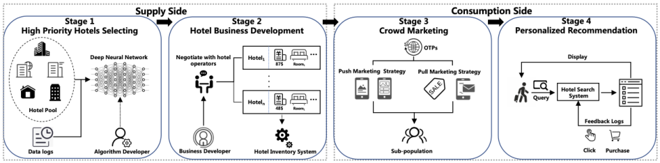

**Figure 1: The Four-stage Hotel Supply-consumption Process.** 

In order to further illustrate the operating model of OTPs between hotel operators and users, we abstract the hotel business operation of OTPs into a four-stage process shown in Figure 1. This process can be further divided into two parts, namely the supply side (Stages 1 and 2) and the consumption side (Stages 3 and 4). For **Supply-side:** OTPs evaluate each hotel based on historical data, and identify a set of potentially highly proftable hotels (Stage 1). Based on this, BDs negotiate with the selected hotel operators to acquire hotel room inventory and the corresponding competitive prices (Stage 2). For **Consumption-side:** In Stage 3, OTPs will adopt crowd marketing strategies, including "push" (trade show promotions, point of sale displays, etc.) and "pull" (email marketing, sales promotions and discounts, etc.) promotion strategies for various targeted user groups. In Stage 4, personalized recommendation models display hotel products to users in real time based on user preference and historical user-product interaction behaviors. 

We observe that Stage 1 is the bottleneck of the entire process as all subsequent stages are essentially conducting optimization based on the result of Stage 1. On the one hand, Stage 1 needs to provide a list of candidate hotels for Stage 2 in order to guide BDs with limited time budget to negotiate with potentially highly proftable hotels. On the other hand, without explicitly taking the user travel intention and interest in the consumption side into account, the candidate hotels selected in Stage 1 would not satisfy the requirements of Stage 3 and 4. Based on the above discussion, we need to consider a new **WWW** problem in Stage 1: within a specifc time period ( **When** ) and potential travel area ( **Where** ), which hotels should be recommended for a group of users with similar intentions ( **Why** ), so as to maximize the overall sales volume. 

The WWW problem aims to recommend hotels to user groups in Stage 1, which is diferent from traditional recommendation systems. Previous methods at OTPs mainly used time series prediction [23, 30, 38] to forecast hotel sales, based on which to recommend hotels, but failed to consider user-hotel interaction. Recent studies applied deep neural networks to improve recommendation quality [43, 44], but rely heavily on fne-grained ongoing user information, which is not available in the early stages. The WWW problem is also related to group recommendation [5, 15, 36], but existing studies ignored key factors in hotel recommendation scenarios (travel period, location and travel intention), which afect user decision on booking hotels in the later stages. From the above discussion, we summarize three challenges of solving the WWW problem: 

(1) _Grouping users based on hotel recommendation metrics._ Most of the existing group recommendation methods represent the group preference by simply aggregating the individual preferences of group members. However, in WWW problem, we need to provide a method that reasonably divides users into groups in the hotel recommendation scenarios, considering factors such as user travel intentions and targeted travel locations. The accuracy of group generation directly afects the performance of downstream hotel recommendation. 

(2) _Resolving the issue of travel data sparsity._ The average number of hotels booked on Fliggy for each user is less than 1 throughout the year of 2022, making the hotel room booking a low-frequency event. In particular, the WWW problem further restricts historical user-item interaction data to a specifc spatio-temporal range, intensifying the issue of data sparsity, and group-item interactions are even more sparse. It is highly necessary to propose a new model to tackle the data sparsity of WWW problem. 

(3) _Leveraging three dimensions of hotel recommendation information._ As mentioned above, the key point of the WWW problem is not only to solve the item recommendation for a specifc user group, but also to accurately and comprehensively specify the features of user travel intentions, travel period, and the locations of hotels and destinations. However, existing group recommendation ignored these features, and only considered group-item interactions. Hence, it is necessary to design a group recommendation framework that fully utilizes three aspects of information in hotel group recommendation scenarios. 

In this work, we propose LINet, a **L** ocation and **I** ntention-aware Neural **Net** work for Hotel Group Recommendation, consisting of three preference-representing submodules and a user-grouping submodule. To tackle the frst challenge, we construct Intention Recognition & Group Generation Module (IRG2 ) which combines location information with travel intention. To address the second challenge, we consider both internal and external features that refects group preferences. The Internal Global Presentation Representation Module (IGPR) and Internal Local Preference Representation Module (ILPR) characterize long-term and short-term internal interests, respectively. To explain the efect of external spatio-temporal factors on users’ hotel booking decisions, we develop the External LocationTime Representation Module (ELTR), which learns monthly-level popular Points of Interest (POIs) and describes periodic travel requirements and location-related purchasing preferences. Finally, in order to solve the data sparsity involved in WWW problem, we 

780 

WWW ’23, April 30–May 04, 2023, Austin, TX, USA 

LINet: A Location and Intention-Aware Neural Network for Hotel Group Recommendation 

adopt the graph neural network to employ longer sequence of user click, and purchase data and incorporate a location binary cross entropy loss in ELTR. Our major contributions in this work are highlighted as follows: 

• We defne and formalize the WWW problem in hotel group recommendation to optimize the quality of hotel supply on OTPs, and identify three major challenges faced by the WWW problem. 

• We propose a new model LINet, which contains three submodules: IGPR, ILPR and ELTR, to efectively utilize three dimension of hotel group recommendation information to group users and further represent group preference. We further design an auxiliary loss of location and a deep graph network based on the newly proposed Group-Hotel Interaction Graph (GHIG), to enhance the learning efciency of sparse user-hotel interaction data. 

• Extensive ofine experiments on real-world datasets and online A/B tests show the superiority of LINet towards state-of-the-art baselines. Specifcally, LINet gained more than 3% Room Night6 increase in the two-week online A/B test. Recently, LINet has been deployed on Fliggy successfully, serving online hotel supplyconsumption process. 

## **2 RELATED WORK** 

Based on the granularity of modeling, we divide the previous works that can be adapted to solve the WWW problem into three categories in this section, namely time series forecasting, personalized recommendation and group recommendation. 

## **2.1 Time Series Forecasting** 

Time series forecasting, an efective method deployed on OTPs to predict future hotel sales based on historical data, is equivalent to treating all users as a whole group in the context of WWW problem. Existing studies can be further divided into statistical models, machine learning models and deep learning models. Statistical models such as Prophet [33] decouple the trending and periodic components of time series, and specifcally consider factors such as peak travel periods to achieve more precise forecasts. Machine learning models such as LightGBM [21] model the time series forecasting task as a regression problem with historical data as input features. Deep learning models, such as MQ-RNN [38], DeepAR [30], and TFT [23], consider time series as a specifc form of serialized data and apply recurrent neural networks for prediction. However, the above methods ignore user-side interaction data and location information, which limits their ability to resolve the WWW problem. 

## **2.2 Personalized Recommendation** 

Personalized recommendation methods have been widely studied in e-commerce platforms, aiming at recommending products that better match user interests by analyzing user behaviors, are equivalent to treating each group as a generalized user in the context of WWW problem. With the development of deep neural networks, industrial recommendation systems have transitioned from traditional models with manually selected features as input to deep learning models such as Wide&Deep [8], deepFM [13], DIN [44] and DIEN [43]. However, user requests and real-time user feedback have not been 

> 6Room Night, a core statistical metric for the hotel industry, is the number of times a hotel room is occupied by a user(s) for an overnight stay in a given period. 

generated when WWW problem arises, making it hard to capture user preferences precisely. Additionally, the behaviour patterns of users within a group may be quite diferent, resulting in a certain deviation in the representation process of group preferences. 

## **2.3 Group Recommendation** 

Existing group recommendation studies can be further divided into memory-based and model-based methods. The memory-based approach makes recommendation by aggregating the preferences of all members based on a pre-defned policy, including AVG(Average) [2, 3], LM(Least Misery) [1] and MS(Maximum Satisfaction) [4]. In order to dynamically adjust the weight of users in diferent groups, model-based methods are proposed to model groups’ decisionmaking processes. Traditional approaches adopt information fusion method [7, 14, 27, 31, 32, 37], game theory [6], and probabilistic models [11, 26, 41]. Recently, with the successful application of attentivebased networks and graph neural networks [16, 20, 22, 25, 35], related technologies have been applied to group recommendation, further improving recommendation performance. AGREE [5], GroupSA [15], MoSAN [36] and GRHAM [24] applied neural attentive networks to dynamically adjust the infuence weight of each user. GAME [18] and S2 -HHGR [42] introduced the social network of users and adopted the attention mechanism to characterize each user’s social infuence. In order to solve the issue of data sparsity, SIGR[40] improved the traditional stochastic gradient descent algorithm. KGAG[10] introduced the knowledge graph and adopted graph convolutional networks to capture the structural information of items and users. All these works, however, fail to utilize three aspects of information involved in WWW problem, _i.e._ , travel periods, location information, and user travel intentions, and therefore cannot make efective hotel group recommendation. 

## **3 PRELIMINARIES** 

In this section, we frst defne the related concept in hotel group recommendation, and then formalize the WWW problem in readworld scenarios on OTPs. 

The Stage 1 of the hotel supply-consumption process can be abstracted into the environment that within a specifc travel time period _��_ , a group of users with a certain intention _��_ arrive at a particular location _��_ , where the group recommendation problem emerges. Thus, in WWW problem, we need to categorize users into groups based on their travel intentions, and subsequently make hotel recommendations that consider both the group’s preferences and the hotels’ spatio-temporal attributes. 

We next present the notations needed to formulate the WWW problem. Let _�_ = { _�_ 1 _,�_ 2 _, ...,��_ }, _�_ = { _�_ 1 _,�_ 2 _, ...,��_ }, _�_ = { _ℎ_ 1 _,ℎ_ 2 _, ...,ℎ�_ }, _�_ = { _�_ 1 _,�_ 2 _, ...,��_ } and _�_ = { _�_ 1 _, �_ 2 _, ..., ��_ } be the set of users, user groups, hotels, locations and time periods, respectively. We consider D = n� _�_(_�_) _,�_(_�_) � | _�_ = 1 _, . . . ,�_ o as a dataset with _�_ data samples, where _�_(_�_) denotes the purchase label, and each _�_(_�_) in D is the features of a data sample in the form of _�_(_�_) = ( _�_(_�_) _, �_(_�_) _, �_(_�_) _,ℎ_(_�_) ), which contains the information of four types of entities, namely a set of users with a certain intention _�_(_�_) = n _�_ 1( _�_ ) _,�_ 2( _�_ ) _, ...,��_ ( _�_( )_�_) o, a certain location _�_(_�_) ∈ _�_ , a certain travel period _�_(_�_) ∈ _�_ , and a target hotel _ℎ_(_�_) ∈ _�_ . 

781 

WWW ’23, April 30–May 04, 2023, Austin, TX, USA 

Zhu et al. 

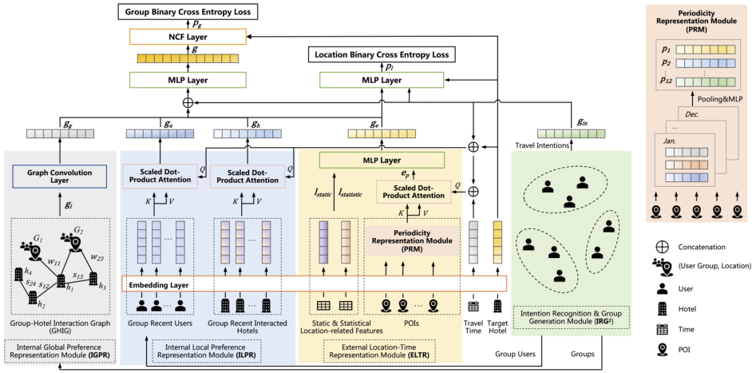

**Figure 2: The Architecture of LINet.** 

The objective of the WWW hotel group recommendation problem is to learn a model F from the dataset D, where the model F is capable of predicting the preference score _�_(_�_) of group _�_(_�_) for the target hotel _ℎ_(_�_) , which indicates the probability that _ℎ_(_�_) is purchased by group _�_(_�_) , _i.e._ , 

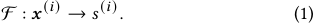

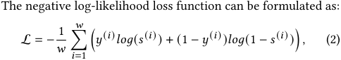

where _�_(_�_) is the score predicted by the model with the input _�_(_�_) . 

## **4 LINET** 

This section presents the details of the proposed **L** ocation and **I** ntention-aware neural **Net** work (LINet) for the WWW problem in hotel group recommendation. 

## **4.1 Overview** 

The central idea of LINet is to establish an efective framework for a comprehensive and accurate representation of group preferences by incorporating three key elements of information, namely travel periods, location information and user travel intentions, corresponding to "when", "where" and "why" in WWW problem. Figure 2 shows the overall framework of LINet. As the upstream module for subsequent group recommendation task, the Intention Recognition and Group Generation Module (IRG2 ) functions as a group generation network by combining user travel intentions and location information. To address the challenge of data sparsity while efectively representing group preferences from historical <group, item> interaction data, LINet implements the Internal Global Preference Representation Module (IGPR) and the Internal Local Preference Representation 

Module (ILPR) to characterize the group’s long-term and short-term preferences, respectively. Subsequently, the External Location-Time Representation Module (ELTR) processes spatio-temporal data, constructing the Periodicity Representation Module (PRM) and the Location Representation Module (LRM) to capture the infuence of time-related and location-related factors on group preferences. Through the above four modules, we obtain the group travel intention representation, the long-term group preference representation, the short-term group preference representation, and the spatiotemporal representation. These representation vectors are then fed to a MultiLayer Perceptron (MLP) to produce the complete group preference representation. Finally, LINet adopts the Neural Collaborative Filter (NCF) [17] layer to determine the group’s predicted preference score for the target hotel. We elaborate each module of LINet in the following subsections. 

## **4.2 Intention Recognition and Group Generation** 

We construct Intention Recognition and Group Generation Module (IRG2 ) to generate user groups, which are regarded as the input of the following submodules. Users on OTPs typically have relatively direct and clear travel intentions, such as taking vacations and business trips. Therefore, without loss of generality, we select three representative travel intentions as the training label of IRG2 , including local travel, leisure travel, and business travel7 , which are the most widely used indicators on OTPs to distinguish user groups. IRG2 module trains a classifcation model based on the travel intention labels to identify users targeting at a certain location with the same travel intention, thereby assigning these users to a group. Hence, each group generated in IRG2 is in the form 

> 7Note that the travel intentions not mentioned in this work will not afect the generality of LINet since the data processing procedure is exactly the same for all travel intentions. 

782 

WWW ’23, April 30–May 04, 2023, Austin, TX, USA 

LINet: A Location and Intention-Aware Neural Network for Hotel Group Recommendation 

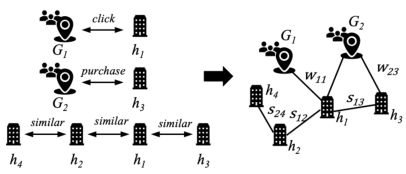

**Figure 3: Group-Hotel Interaction Graph.** 

of < _���������, ��������,�����_ >. Since the accuracy of group generation directly afects the performance of group recommendation, we discuss the choice of another label, _i.e._ , users’ purchasing power, for comparison in Appendix. 

## **4.3 Internal Group Preference Representation** 

In order to characterize the long-term and short-term group preferences, LINet implements two internal group preference representation modules. 

_4.3.1 Internal Global Preference Representation (IGPR)._ In the WWW problem, we need to capture the long-term preference of each group due to the following two reasons. First, the context of WWW problem makes the efective historical user-hotel interaction data much more sparse, which means that the model cannot accurately refect group preferences if it simply employs historical data from a recent period of time. Second, although the users within each group fuctuate based on travel intentions and destinations, the long-term preferences of a group tend to remain relatively stable. For instance, groups with business travel intentions are inclined to book business-type hotels near the ofce area, while groups with tourism intentions are likely to book resort-type hotels near scenic spots. Hence, we propose _Group-Hotel Interaction Graph_ below to address the issue of data sparsity, serving as a complement to the groups’ recent behaviors. 

In Group-Hotel Interaction Graph, an undirected weighted heterogeneous graph network is constructed based on the interaction data of <group, hotel> over a longer period of time and the similarity between hotels. As shown in Figure 3, the undirected heterogeneous graph is defned over the user group set _�_ and the hotel set _�_ , where the edges are defned by three kinds of relation, namely the click and purchase relation between user groups and hotels, and the similarity relation between hotels. In order to construct a relatively dense graph, we consider the user’s historical click behaviors together with the purchase behaviors when creating edges of the graph. Specifcally, we select the historical click log with the same location and price range as the purchased hotel and the closest time, so as to minimize the impact of introducing click data on capturing group preferences. Next, we obtain the weight of edges representing similarity relation _�� �_ and the weight of edges representing <group, hotel> interaction relation _�� �_ through the layer-wise propagation rule [22]. The _��ℎ�����_ representation of hotel _ℎ_(_�_) is then calculated by aggregating the ( _�_ − 1) _�ℎ�����_ representation of both its 

neighbours’ _�_ ( _�_ ) representation and its own: 

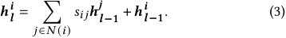

Based on Equation (3), we obtain the representation of the group preference considering its 2-hop adjacency relationship: 

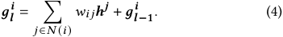

Finally, we adopt graph convolutional network [22] to learn the representation of long-term internal group preference _��_ . 

_4.3.2 Internal Local Preference Representation (ILPR)._ We next describe users’ most recent behaviors, and capture users’ short-term and direct interests, which generally lead to high probability of purchase. To this end, we propose Internal Local Preference Representation Module. Specifcally, ILPR further includes two submodules: Recent User Embedding Aggregation Module and Recent Hotel Embedding Aggregation Module, which are elaborated in details as follows. 

**Recent User Embedding Aggregation Module.** In order to refect diferent infuences of users within a group, this module is designed to dynamically adjust the contribution weight of each user to the performance of group recommendation. In WWW problem, users with more historical interactions are assigned higher weights. Specifcally, a neural attention network parameterized with _�_ ( _�, �,�_ ) is applied with the embedding result of group’s member _��_ , the target hotel _��_ and each group’s travel intention _���_ as input. The query of the attention network is composed of _��_ and _���_ : 

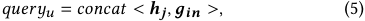

and a multi-layer feedforward neural network H is constructed to obtain each user’s infuence weight: 

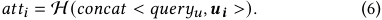

The fnal output of RUEA is an aggregated representation of the users with recent purchase behaviours _��_ : 

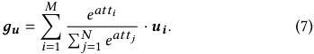

**Recent Hotel Embedding Aggregation Module.** The users within a group have similar purchasing preferences and the purchasing behaviors of a group have a relatively stable pattern over a period of time. Therefore, the hotels recently purchased by a user will be likely revisited by other users within the same group. Hence, we introduce Recent Hotel Embedding Aggregation Module to capture the group’s recently preferred hotels. Specifcally, the property of recently interacted hotels and the target hotel, and the group’s travel intention, are encoded into _��_ , _��_ and _���_ via an embedding layer. Then a neural attention network parameterized with _�_ ( _�, �,�_ ), similar to RUEA is applied, and obtain the aggregated representation of the group’s recent interacted hotels _��_ . 

## **4.4 External Location-Time Representation** 

In addition to group internal preferences, external physical factors also afect the performance of hotel group recommendation. We introduce a module to learn the impact of time-related and locationrelated factors involved in WWW problem. 

783 

WWW ’23, April 30–May 04, 2023, Austin, TX, USA 

Zhu et al. 

_4.4.1 Periodicity Representation Module (PRM)._ In the hotel group recommendation scenario, the infuence of time-related factors such as seasonal factors and holiday factors, is mainly manifested in the form of periodicity. Therefore, PRM is proposed to capture users’ dynamic hotel reservation demand. Periodic expression has been studied in academia, where ST-PIL [9] focused on the periodicity of day granularity and employed the attention mechanism and a memory matrix to characterize the periodicity of users’ behavior. The proposed method in [9] is adapted to address the WWW problem in PRM. Specifcally, we organize the popular POIs within a specifc location by month and obtain a memory matrix _�_ = [ _�_ 1 _, �_ 2 _, ..., �_ 12] ∈ R12×_��_ through a pooling layer and a MultiLayer perceptron (MLP): 

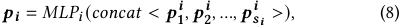

where _�__�_ _�_ denotes the representation vector of the POI with index _�_ in the _��ℎ_ month. Then an attention network is adopted with the concatenation of the target hotel’s location _�__������_ , the groups’ travel time _�__������_ and the group’s travel intention _���_ as the query: 

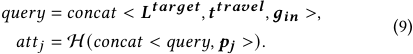

Finally, we leverage the softmax function and obtain the representation of the periodicity of POIs _��_ within location _�_(_�_) : 

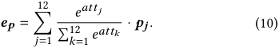

_4.4.2 Location Representation Module (LRM)._ Since the location of hotels remains unchanged, the number of hotels and the corresponding prices show obvious geographical distribution characteristics. Therefore, the spatial factors signifcantly afect the users’ hotel booking decision in addition to the time-related factors considered in PRM. In order to accurately characterize the infuence of locations, LRM is proposed to capture two aspects of information, namely the static location-related properties, including the latitude and longitude, GeoHash 4&5&6 and the coverage radius, and the statistical location-related properties, including the number of hotels and room nights of diferent price ranges and POIs within 1, 2 and 3 km of the location center. Specifcally, LRM utilizes an embedding layer to obtain the static location-related representation _����� ��_ and the statistical location-related representation _����� ��� ��_ . 

To the end, by combining the representation result of PRM and LRM, we obtain the spatio-temporal representation of the group’s external preference _��_ : 

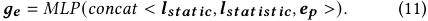

## **4.5 Training & Serving** 

Through the aforementioned submodules, LINet provides the representation of the group intention _���_ , the representation of the internal long-term group preference _��_ , the representation of the short-term user preference _��_ , the representation of the short-term interacted hotels _��_ and the spatio-temporal representation of the group’s external preference _��_ . The fnal preference representation of the group targeting at a specifc location (Where) with a specifc intention (Why) during a specifc period (When), which 

corresponds to the three dimensions of the WWW problem, is then obtained using a MLP layer leveraged by a fully-connected feedforward neural network: 

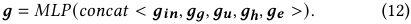

The group preference representation _�_ and the representation of the target hotel _�_ are then fed into the NCF layer to learn the interaction between groups and hotels: 

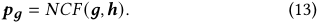

In the training phase, the loss function of LINet, as shown in Equation (14), consists of two parts, where _�_ is a hyperparameter: 

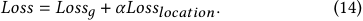

The frst part of the loss function, _i.e._ , _�����_ , corresponds to the Group Binary Cross Entropy Loss in Figure 2, which utilizes the interaction data between groups and hotels as the label _��_ : 

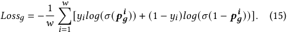

The second part of the loss function, _i.e._ , _������������_ , corresponds to the Location Binary Cross Entropy Loss in Figure 2, which is proposed to efciently exploits data within the same and across diferent locations, in order to better address data sparsity. Specifically, for a specifc group _�_∗ , the interaction data of the groups with diferent travel intentions and the same location as _�_∗ , and the groups with diferent locations and the same travel intention as _�_∗ , is utilized to supplement the sparse interaction data of _�_∗ . Next, a MLP layer is adopted to capture location-related features with the spatio-temporal representation of the group’s external preference _��_ , the group intention _���_ and the target hotel _�_ as input: 

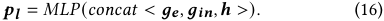

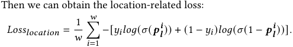

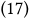

After training, LINet is utilized to compute the preference score of target hotels. Specifcally, at serving time, when group _�_∗ arrives at the location _�_∗ with the travel intention _�_∗ during the period _�_∗ , the detailed data representation is fed into LINet to derive the predicted preference score of each hotel located in _�_∗ . Hotels with the highest K scores are then recommended to user groups. 

## **5 EXPERIMENTS** 

## **5.1 Comparison Methods** 

We compare LINet with the baselines below. 

• **MQ-RNN** [38]: is a seq2seq time series forecasting model that can perform multi-horizon forecasting, which is widely used to forecast hotel sales on OTPs. 

• **DeepAR** [30]: predicts time series distribution using the autoregressive RNN architecture, which efectively solves the problem of scale inconsistency between multiple time series. 

• **TFT** [23]: follows the Transformer architecture with strong interpretability for multi-horizon time series forecasting. 

• **DIN** [44]: utilizes an attention mechanism to capture the relevance between users’ historically interacted items and the target 

784 

WWW ’23, April 30–May 04, 2023, Austin, TX, USA 

LINet: A Location and Intention-Aware Neural Network for Hotel Group Recommendation 

item, and serves as the baseline based on personalized recommendation without considering location information. 

• **AGREE** [5]: learns diferent weights of users in group decisionmaking through a standard attention network and adopts the NCF framework to model the interactions between groups and items. 

• **MoSAN** [36]: calculates the preference of each group member through an attention based sub-network and obtains the group preference by direct summation. 

• **DeepGroup** [29]: learns the representation of group preferences from group implicit feedback, which focuses on making recommendations for a new group of users. 

## **5.2 Ofline Experiments** 

_5.2.1 Dataset._ We conduct ofine experiments on the real-world Fliggy dataset, which consists of the location and time information of user historically interacted hotels based on user logs collected in May 2022 at Fliggy. The statistics of datasets are listed in Table 5 in Appendix. In order to construct GHIG, we specifcally extract one year’s data logs of user clicks and purchases from May 2021 to May 2022 as the long-term data. Positive samples in the dataset are set to those purchased hotels while diferent settings of negative samples are further analyzed in Appendix. User travel intentions are mainly divided into three types, including local travel, leisure travel and business travel. 

_5.2.2 Metrics._ In the ofine experiment, _�������_ @ _�_ and _���������_ @ _�_ , two widely used metrics in recommendation system, are adopted to measure the performance of diferent methods. _�������_ @ _�_ denotes the proportion of test cases that the target recommended hotels are within in the top _�_ recommendation list of a group, defned as: 

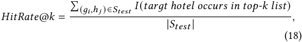

where _�����_ denotes the test set with each test case being in the form of a group-hotel pair ( _��_ , _ℎ �_ ), and _�_ denotes the indicator function. _���������_ @ _�_ denotes the proportion of hotels actually purchased by groups among the top _�_ recommended hotels predicted by the model: 

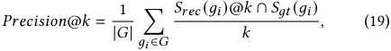

where _����_ ( _��_ )@ _�_ denotes the predicted top-k recommendation hotel set for group _��_ and _���_ ( _��_ ) denotes the ground truth hotels purchased by group _��_ . The parameter _�_ in _�������_ @ _�_ and _���������_ @ _�_ is set to 50 in Section 5, and the experimental results on _�_ = 10 _,_ 30 are listed in Table 10 in Appendix. 

_5.2.3 Setings._ For time series models, we set the length of the input window to 128. For other models, we set the dimension of the input features to 16 and the output layer to a three-layer MLP where the dimension of each layer is set to 256, 128 and 1, respectively. The number of group members for all group recommendation models is set to 50. Specifcally for LINet, the number of each group’s historical interacted hotels in the RHEA module is set to 50, and the number of popular POIs per month in the PRM module is set to 10. 

We train all models by setting the mini-batch size to 512 and using the Adam optimizer with a learning rate of 0.001. The number of training epochs is 1 on the Fliggy dataset, and the value of each experimental result is the average of 5 repeated tests. 

_5.2.4 Comparison with Baselines._ We compare LINet with seven baselines on the real-world Fliggy dataset. By analyzing ofine experimental results in Table 1, we obtain the following observations: 

• **Observation 1:** _Methods without considering user-side interaction features, i.e., all time-series focusing based models, get the worst performance on all types of groups._ This is because efectively capturing the diverse interests of user groups is the most important factor in solving the WWW problem. 

• **Observation 2:** _For the two groups (leisure travel and business travel), DIN, the personalized recommendation method, outperforms conventional group recommendation methods._ Since the WWW problem is essentially a group recommendation task, this observation seems counterintuitive. This is mainly because the preferences of these two groups are relatively simple and directive, leading to behavior patterns that are simplifed to a single user, which can be efectively captured by DIN. For instance, leisure travelers prefer hotels near popular POIs and business travelers prefer hotels near business locations. However, this may not hold for groups with complicated travel intentions, such as Local Travel, as their historical behavior patterns are not relatively stable. 

• **Observation 3:** _The data sparsity issue signifcantly afects the accuracy of model predictions._ As shown in Table 1, the _���������_ @50 of leisure travel Group is around 15%, while this metric of other groups is above 60%. This is because the historical interaction data of leisure travel Groups is rather sparse compared to other groups, making it difcult to accurately characterize groups’ preferences. Additionally, in order to evaluate the efectiveness of our proposed LINet on addressing the issue of travel data sparsity, we specifcally construct a sparse dataset and further conduct experiments in Appendix to compare with baseline methods. 

• **Observation 4:** _LINet dramatically beats baseline methods._ Specifcally, LINet gains at least 3% relative improvement in _�������_ @50 and at least 2.3% relative improvement in _���������_ @50 of all groups compared to the best baseline. This is achieved by efectively addressing the three challenges faced in the WWW problem through the implementation of three sub-modules that concurrently incorporate travel periods, location information, and user travel intentions. Furthermore, the implementation of GHIG and an auxiliary location loss efectively mitigate the issue of data sparsity. The efectiveness of each submodule is further demonstrated in Section _5.2.5_ by conducting an ablation study. 

_5.2.5 Ablation Study._ To analyze the efectiveness of our proposed submodules in LINet, we conduct an ablation study. We consider variants of LINet below: 

• LINet- _��_ : a variant of LINet which deletes the Internal Global Preference Representation Module (IGPR). 

• LINet- _��_ - _��_ : a variant of LINet which deletes IGPR module and the External Location-Time Representation Module (ELTR). 

• LINet- _��_ - _��_ - _��_ : a variant of LINet which deletes ELTR, IGPR and the Recent Hotel Embedding Aggregation Module (RHEA). Experiment results of the ablation study are listed in Table 2. First, compared with LINet- _��_ - _��_ - _��_ , LINet- _��_ - _��_ improves the 

785 

WWW ’23, April 30–May 04, 2023, Austin, TX, USA 

Zhu et al. 

**Table 1: Comparison of diferent methods on the Fliggy dataset.** 

|Mthd||_�������_@50|||_���������_@50||
|---|---|---|---|---|---|---|
|eos|Local Travel|Leisure Travel|Business Travel|Local Travel|Leisure Travel|Business Travel|
|MQ-RNN|46.8%|46.3%|49.8%|61.2%|12.8%|61.8%|
|DeepAR|46.7%|46.2%|49.7%|61.1%|12.6%|61.6%|
|TFT|47.0%|46.4%|50.0 %|61.4%|13%|62.1%|
|DIN|48%|53.6%|53.6%|62.5%|16.7%|65.8%|
|AGREE|48.6%|48.8%|52.3%|63.6%|14.9%|64.6%|
|MoSAN|49.4%|51.2%|53.3%|64.9%|16.1%|65.4%|
|DeepGroup|48.1%|48.3%|51.9%|63.2%|14.4%|63.8%|
|LINet|**50.9%**|**64.3%**|**55.9%**|**66.4%**|**19.5%**|**68.9%**|

**Table 2: Ablation study of LINet.** 

|Methods||_�������_@50 |||_���������_@50 ||
|---|---|---|---|---|---|---|
||Local Travel|Leisure Travel|Business Travel|Local Travel|Leisure Travel|Business Travel|
|LINet|50.9%|64.3%|55.9%|66.4%|19.5%|68.9%|
|LINet-_��_|50.4%|64.1%|55.5%|66%|19.4%|68.2%|
|LINet-_��_ -_��_|49.6%|55.7%|54.4%|65.2%|17.3%|67%|
|LINet-_��_ -_��_ -_��_|48.6%|48.8%|52.3%|63.6%|14.9%|64.6%|

_�������_ @50 by at least 2.1% and the _���������_ @50 by at least 2.5%. Second, compared with LINet- _��_ - _��_ , LINet- _��_ has at least 1.6% relative improvement in _�������_ @50 and at least 1.2% relative improvement in _���������_ @50. Third, compared with LINet- _��_ , LINet has at least 0.3% relative improvement in _�������_ @50 and at least 0.5% relative improvement in _���������_ @50 on the validation set of the three types of groups. This confrms that long-term and short-term group internal preferences, and external spatio-temporal factors are all important for improving hotel recommendation performance. 

## **5.3 Online A/B Test** 

To further evaluate the performance of LINet in the real online environment, we conducted a two-week A/B test on the Fliggy platform in June 2022. The MoSAN model, which outperformed other baselines in ofine experiments, served as the baseline. As shown in Figure 1, the WWW problem solved in the paper is an upstream task in the hotel supply-consumption process, requiring real feedback data from downstream stages. Therefore, we utilize Room Night to measure the overall impact of diferent models in the online recommendation system. Moreover, we cannot equally assign daily trafc to each model like testing personalized recommendation systems. Instead, we select cities that are geographically adjacent in a hotel business division run by the same group of BDs, and employ the two models to generate 1,000 high-priority hotels in each city for BDs. Specifcally, the chosen cities are further divided into four experimental groups, where CityGroup1 and CityGroup2 have approximate higher total Room Nights while CityGroup3 and CityGroup4 have approximate lower total Room Nights. In the twoweek A/B test period, the frst week is used to observe the metric stability, and the second week is used to verify diferent models using the Diferences-in-Diferences method. Results in Figure 4 show that compared to MoSAN, LINet achieves an average 3.2% lift in Room Nights, which further illustrates the efectiveness of LINet in addressing the WWW problem at OTPs. 

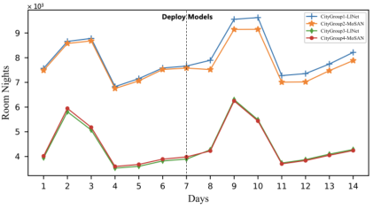

**Figure 4: Online Room Nights of diferent CityGroups at Fliggy from June 6, 2022 to June 19, 2022.** 

## **6 CONCLUSION** 

Diferent from existing recommendation systems, which are limited to optimizing the performance of the consumption side of e-commerce platforms, we consider the problem of improving the quality of the supply side of OTPs. In this paper, we defne the WWW problem, and identify three challenges related to user group generation, data sparsity and utilizing hotel recommendation information including duration, location, and intention. A novel location and intention-aware neural network for hotel group recommendation, namely LINet, is designed to capture user travel intentions and better represent spatio-temporal information. The efectiveness of LINet was evaluated through ofine and online experiments, demonstrating superiority over baseline methods. LINet has been successfully deployed at Fliggy and is serving millions of users. Future works include multi-target prediction to improve the performance of hotel group recommendation based on repurchase and click rate. 

## **ACKNOWLEDGMENTS** 

This work was supported in part by National Key R&D Program of China No. 2020YFB1707900, in part by China NSF grant No. 

786 

WWW ’23, April 30–May 04, 2023, Austin, TX, USA 

LINet: A Location and Intention-Aware Neural Network for Hotel Group Recommendation 

62132018, U2268204, 62272307, 61902248, 61972254, 61972252, 62025 204, 62072303, in part by Shanghai Science and Technology fund 20PJ1407900, and in part by Alibaba Group through Alibaba Innovative Research Program. The opinions, fndings, conclusions, and recommendations expressed in this paper are those of the authors and do not necessarily refect the views of the funding agencies or the government. 

## **REFERENCES** 

- [1] Sihem Amer-Yahia, Senjuti Basu Roy, Ashish Chawlat, Gautam Das, and Cong Yu. 2009. Group recommendation: Semantics and efciency. _Proceedings of the VLDB Endowment_ 2, 1 (2009), 754–765. 

- [2] Linas Baltrunas, Tadas Makcinskas, and Francesco Ricci. 2010. Group recommendations with rank aggregation and collaborative fltering. In _Proceedings of the fourth ACM conference on Recommender systems_ . 119–126. 

- [3] Shlomo Berkovsky and Jill Freyne. 2010. Group-based recipe recommendations: analysis of data aggregation strategies. In _Proceedings of the fourth ACM conference on Recommender systems_ . 111–118. 

- [4] Ludovico Boratto and Salvatore Carta. 2010. State-of-the-art in group recommendation and new approaches for automatic identifcation of groups. In _Information retrieval and mining in distributed environments_ . 1–20. 

- [5] Da Cao, Xiangnan He, Lianhai Miao, Yahui An, Chao Yang, and Richang Hong. 2018. Attentive group recommendation. In _The 41st International ACM SIGIR Conference on Research & Development in Information Retrieval_ . 645–654. 

- [6] Lucas Augusto Montalvão Costa Carvalho and Hendrik Teixeira Macedo. 2013. Users’ satisfaction in recommendation systems for groups: an approach based on noncooperative games. In _22nd International World Wide Web Conference_ . 951–958. 

- [7] Jorge Castro, Jie Lu, Guangquan Zhang, Yucheng Dong, and Luis Martínez. 2017. Opinion dynamics-based group recommender systems. _IEEE Transactions on Systems, Man, and Cybernetics: Systems_ 48, 12 (2017), 2394–2406. 

- [8] Heng-Tze Cheng, Levent Koc, Jeremiah Harmsen, Tal Shaked, Tushar Chandra, Hrishi Aradhye, Glen Anderson, Greg Corrado, Wei Chai, Mustafa Ispir, et al. 2016. Wide & deep learning for recommender systems. In _Proceedings of the 1st workshop on deep learning for recommender systems_ . 7–10. 

- [9] Qiang Cui, Chenrui Zhang, Yafeng Zhang, Jinpeng Wang, and Mingchen Cai. 2021. ST-PIL: Spatial-Temporal Periodic Interest Learning for Next Point-of-Interest Recommendation. In _Proceedings of the 30th ACM International Conference on Information & Knowledge Management_ . 2960–2964. 

- [10] Zhiyi Deng, Changyu Li, Shujin Liu, Waqar Ali, and Jie Shao. 2021. KnowledgeAware Group Representation Learning for Group Recommendation. In _37th IEEE International Conference on Data Engineering_ . 1571–1582. 

- [11] Jagadeesh Gorla, Neal Lathia, Stephen Robertson, and Jun Wang. 2013. Probabilistic group recommendation via information matching. In _22nd International World Wide Web Conference_ . 495–504. 

- [12] Mihajlo Grbovic and Haibin Cheng. 2018. Real-time Personalization using Embeddings for Search Ranking at Airbnb. In _Proceedings of the 24th ACM SIGKDD International Conference on Knowledge Discovery & Data Mining, KDD 2018, London, UK, August 19-23, 2018_ . 311–320. 

- [13] Huifeng Guo, Ruiming Tang, Yunming Ye, Zhenguo Li, and Xiuqiang He. 2017. DeepFM: A Factorization-Machine based Neural Network for CTR Prediction. In _Proceedings of the Twenty-Sixth International Joint Conference on Artifcial Intelligence_ . 1725–1731. 

- [14] Junpeng Guo, Yanlin Zhu, Aiai Li, Qipeng Wang, and Weiguo Han. 2016. A social infuence approach for group user modeling in group recommendation systems. _IEEE Intelligent systems_ 31, 5 (2016), 40–48. 

- [15] Lei Guo, Hongzhi Yin, Qinyong Wang, Bin Cui, Zi Huang, and Lizhen Cui. 2020. Group recommendation with latent voting mechanism. In _36th International Conference on Data Engineering_ . 121–132. 

- [16] Will Hamilton, Zhitao Ying, and Jure Leskovec. 2017. Inductive representation learning on large graphs. _Advances in neural information processing systems_ 30 (2017). 

- [17] Xiangnan He, Lizi Liao, Hanwang Zhang, Liqiang Nie, Xia Hu, and Tat-Seng Chua. 2017. Neural collaborative fltering. In _Proceedings of the 26th international conference on world wide web_ . 173–182. 

- [18] Zhixiang He, Chi-Yin Chow, and Jia-Dong Zhang. 2020. GAME: Learning graphical and attentive multi-view embeddings for occasional group recommendation. In _Proceedings of the 43rd International ACM SIGIR Conference on Research and Development in Information Retrieval_ . 649–658. 

- [19] Jui-Ting Huang, Ashish Sharma, Shuying Sun, Li Xia, David Zhang, Philip Pronin, Janani Padmanabhan, Giuseppe Ottaviano, and Linjun Yang. 2020. Embeddingbased retrieval in facebook search. In _Proceedings of the 26th ACM SIGKDD International Conference on Knowledge Discovery & Data Mining_ . 2553–2561. 

- [20] Jianwen Jiang, Yuxuan Wei, Yifan Feng, Jingxuan Cao, and Yue Gao. 2019. Dynamic Hypergraph Neural Networks.. In _IJCAI_ . 2635–2641. 

- [21] Guolin Ke, Qi Meng, Thomas Finley, Taifeng Wang, Wei Chen, Weidong Ma, Qiwei Ye, and Tie-Yan Liu. 2017. LightGBM: A Highly Efcient Gradient Boosting Decision Tree. In _Advances in Neural Information Processing Systems_ , Vol. 30. 

- [22] Thomas N. Kipf and Max Welling. 2016. Semi-Supervised Classifcation with Graph Convolutional Networks. _CoRR_ abs/1609.02907 (2016). 

- [23] Bryan Lim, Sercan Ö Arık, Nicolas Loef, and Tomas Pfster. 2021. Temporal fusion transformers for interpretable multi-horizon time series forecasting. _International Journal of Forecasting_ 37, 4 (2021), 1748–1764. 

- [24] Nanzhou Lin, Juntao Zhang, Xiandi Yang, Wei Song, and Zhiyong Peng. 2021. GRHAM: Towards Group Recommendation Using Hierarchical Attention Mechanism. In _Asia-Pacifc Web and Web-Age Information Management Joint International Conference on Web and Big Data_ . Springer, 295–309. 

- [25] Meng Liu, Hongyang Gao, and Shuiwang Ji. 2020. Towards deeper graph neural networks. In _Proceedings of the 26th ACM SIGKDD international conference on knowledge discovery & data mining_ . 338–348. 

- [26] Xingjie Liu, Yuan Tian, Mao Ye, and Wang-Chien Lee. 2012. Exploring personal impact for group recommendation. In _Proceedings of the 21st ACM international conference on Information and knowledge management_ . 674–683. 

- [27] Dong Qin, Xiangmin Zhou, Lei Chen, Guangyan Huang, and Yanchun Zhang. 2018. Dynamic connection-based social group recommendation. _IEEE Transactions on Knowledge and Data Engineering_ 32, 3 (2018), 453–467. 

- [28] Giovanni Quattrone, Antonino Nocera, Licia Capra, and Daniele Quercia. 2020. Social Interactions or Business Transactions?What customer reviews disclose about Airbnb marketplace. In _The Web Conference 2020_ . 1526–1536. 

- [29] Sarina Sajjadi Ghaemmaghami and Amirali Salehi-Abari. 2021. DeepGroup: Group Recommendation with Implicit Feedback. In _Proceedings of the 30th ACM International Conference on Information & Knowledge Management_ . 3408–3412. 

- [30] David Salinas, Valentin Flunkert, Jan Gasthaus, and Tim Januschowski. 2020. DeepAR: Probabilistic forecasting with autoregressive recurrent networks. _International Journal of Forecasting_ 36, 3 (2020), 1181–1191. 

- [31] Shunichi Seko, Takashi Yagi, Manabu Motegi, and Shinyo Muto. 2011. Group recommendation using feature space representing behavioral tendency and power balance among members. In _Proceedings of the ffth ACM conference on Recommender systems_ . 101–108. 

- [32] Lifeng Sun, Xiaoyan Wang, Zhi Wang, Hong Zhao, and Wenwu Zhu. 2016. Socialaware video recommendation for online social groups. _IEEE Transactions on Multimedia_ 19, 3 (2016), 609–618. 

- [33] Sean J Taylor and Benjamin Letham. 2018. Forecasting at scale. _The American Statistician_ 72, 1 (2018), 37–45. 

- [34] Bradley C. Turnbull. 2019. Learning Intent to Book Metrics for Airbnb Search. In _The World Wide Web Conference_ . 3265–3271. 

- [35] Petar Velickovic, Guillem Cucurull, Arantxa Casanova, Adriana Romero, Pietro Liò, and Yoshua Bengio. 2017. Graph Attention Networks. _CoRR_ abs/1710.10903 (2017). 

- [36] Lucas Vinh Tran, Tuan-Anh Nguyen Pham, Yi Tay, Yiding Liu, Gao Cong, and Xiaoli Li. 2019. Interact and decide: Medley of sub-attention networks for efective group recommendation. In _Proceedings of the 42nd International ACM SIGIR conference on research and development in information retrieval_ . 255–264. 

- [37] Ximeng Wang, Yun Liu, Jie Lu, Fei Xiong, and Guangquan Zhang. 2019. TruGRC: Trust-aware group recommendation with virtual coordinators. _Future Generation Computer Systems_ 94 (2019), 224–236. 

- [38] Ruofeng Wen, Kari Torkkola, Balakrishnan Narayanaswamy, and Dhruv Madeka. 2017. A multi-horizon quantile recurrent forecaster. _arXiv preprint arXiv:1711.11053_ (2017). 

- [39] Jia Xu, Ziyi Wang, Zulong Chen, Detao Lv, Yao Yu, and Chuanfei Xu. 2021. Itinerary-aware Personalized Deep Matching at Fliggy. In _The Web Conference 2021_ . 3234–3245. 

- [40] Hongzhi Yin, Qinyong Wang, Kai Zheng, Zhixu Li, Jiali Yang, and Xiaofang Zhou. 2019. Social infuence-based group representation learning for group recommendation. In _35th International Conference on Data Engineering_ . 566–577. 

- [41] Quan Yuan, Gao Cong, and Chin-Yew Lin. 2014. COM: a generative model for group recommendation. In _Proceedings of the 20th ACM SIGKDD international conference on Knowledge discovery and data mining_ . 163–172. 

- [42] Junwei Zhang, Min Gao, Junliang Yu, Lei Guo, Jundong Li, and Hongzhi Yin. 2021. Double-scale self-supervised hypergraph learning for group recommendation. In _Proceedings of the 30th ACM International Conference on Information & Knowledge Management_ . 2557–2567. 

- [43] Guorui Zhou, Na Mou, Ying Fan, Qi Pi, Weijie Bian, Chang Zhou, Xiaoqiang Zhu, and Kun Gai. 2019. Deep interest evolution network for click-through rate prediction. In _Proceedings of the AAAI conference on artifcial intelligence_ , Vol. 33. 5941–5948. 

- [44] Guorui Zhou, Xiaoqiang Zhu, Chenru Song, Ying Fan, Han Zhu, Xiao Ma, Yanghui Yan, Junqi Jin, Han Li, and Kun Gai. 2018. Deep interest network for click-through rate prediction. In _Proceedings of the 24th ACM SIGKDD international conference on knowledge discovery & data mining_ . 1059–1068. 

787 

WWW ’23, April 30–May 04, 2023, Austin, TX, USA 

Zhu et al. 

## **A APPENDIX** 

## **A.1 Group Generation Study** 

_A.1.1 Comparison of Diferent Methods._ We compare our adopted IRG2 with the grouping-user method that utilizes users’ purchasing power, another metric commonly used for user grouping in crowd marketing, as labels. Specifcally, we defne the Jaccard Index between the top 50 selling hotels booked by diferent user groups as the discrimination metric of the classifcation approach adopted in WWW problem. As shown in Table 3 and Table 4, IRG2 provides lower Jaccard Index, which means the group generation model based on user travel intention recognition has stronger discrimination. 

**Table 3: Jaccard Index between top 50 selling hotels of groups divided by purchase power.** 

|Purchase Power|Low|Mid|High|
|---|---|---|---|
|Low|1|0.49 (33/67)|0.39 (28/72)|
|Mid|0.49|1|0.45 (31/69)|
|High|0.39|0.45|1|

**Table 4: Jaccard Index between top 50 selling hotels of groups divided by travel intention.** 

|Travel Intention|Local|Leisure|Business|
|---|---|---|---|
|Local|1|0.27 (21/79)|0.28 (22/78)|
|Leisure|0.27|1|0.25 (20/80)|
|Business|0.28|0.30|1|

_A.1.2 Verification of Model Efectiveness._ IRG2 is designed to solve the upstream task of WWW problem, _i.e._ , generating user groups based on user travel intention recognition. In order to evaluate the impact of the accuracy of intention recognition and group generation on downstream applications, we add users with misidentifed intentions to each group. Specifcally, experiments under two diferent settings are conducted, with 10% and 15% of users in each group replaced by those with other intentions, respectively. As shown in Table 6, the _�������_ @50 is relatively reduced by at least 7.3% and the _���������_ @50 is relatively reduced by at least 6.8% when there are 10% abnormal users. The _�������_ @50 is relatively reduced by at least 9.8% and the _���������_ @50 is relatively reduced by at least 9.2% when there are 15% abnormal users. This confrms the importance of the group generation task and the ability of our proposed IRG2 in learning the representation of user travel intentions and solving the grouping-user task. 

## **A.2 Negative Sampling Study** 

With regard to the training of LINet, positive samples can be defned as the hotels purchased by user groups, since the purchasing behaviours indicate that the recommended hotels directly match groups’ preferences. However, defning negative samples for group recommendation is a non-trivial problem [12], for the efectiveness 

**Table 5: Statistics of datasets.** 

|Cti|Training||Testing|
|---|---|---|---|
|aegores|Fliggy|Fliggy|Fliggy (sparse)|
|Users|728,299|81,523|8,503|
|Groups|9,415|1,035|379|
|Hotels|117,391|13,482|2057|
|Locations|3,581|415|162|
|Avg interactions per group|27.6|26.8|7.1|

of a recommendation system is signifcantly infuenced by the quality of the negative samples chosen. Before comparing LINet with baseline methods, we conduct an experiment to evaluate the infuence of diferent settings to negative samples on LINet. Specifcally, we verify two settings of negative samples: 

• **Setting 1:** For each positive sample, we randomly sample hotels from the hotel pool near its location as negative samples. 

• **Setting 2:** In addition to random sampling, we consider those hotels that the group has clicked on but not purchased and this part accounts for 20% of all negative samples. 

The experimental results in terms of the above settings are listed in Table 7 and Table 8. We derive two important observations: 

• LINet achieves signifcantly better performance under Setting 2. This is because the negative samples obtained by Setting 1 are quite simple for LINet, failing to simulate the complicated pattern of negative samples in real scenarios. [19] also proved that efective hard sample mining can improve the model efect. In the experiments conducted in this paper, the second setting is utilized. 

• The amount of negative samples has great impact on the performance of LINet. Specifcally, with the increase of negative samples, the _�������_ @50 and _���������_ @50 are improved at frst, since the increase of negative samples enhances the generalization ability of LINet in diferentiating between positives and negatives. However, there is no obvious improvement in the two metrics when the ratio of negative samples reaches 10/11. Therefore, 1:10 is applied as the fx ratio of the positive and negative samples in the experiments conducted in this paper. 

## **A.3 Data Sparsity Study** 

Generally, users have a relatively limited number of trips per year, therefore making the hotel booking a low-frequency event. Furthermore, the WWW problem defned in this paper restricts historical user-item interaction data at a certain OTP to a specifc spatiotemporal range, which intensifes the issue of travel data sparsity. In order to evaluate the efectiveness of our proposed LINet on capturing features from sparse data, we specifcally construct a sparse dataset Fliggy (sparse) by selecting those groups with historical interaction logs less than 10 from Fliggy dataset. The statistics of the two datasets are listed in Table 5. We compare LINet with four baseline methods based on group recommendation and the experimental result is shown in Table 9. On the Fliggy (sparse) dataset, LINet gains at least 7.3% relative improvement in _�������_ @50 and at least 3.5% relative improvement in _���������_ @50 compared to the best baseline, which confrms the efectiveness of LINet in addressing the issue of travel data sparsity. 

788 

WWW ’23, April 30–May 04, 2023, Austin, TX, USA 

LINet: A Location and Intention-Aware Neural Network for Hotel Group Recommendation 

**Table 6: Experiments on the impact of IRG**2 **on downstream applications.** 

|Settins||_�������_@50|||_���������_@50||
|---|---|---|---|---|---|---|
|g|Local Travel|Leisure Travel|Business Travel|Local Travel|Leisure Travel|Business Travel|
|10% abnormal users|47.2%|46.9%|50.3%|61.9%|13.3%|62.5%|
|15% abnormal users|45.9%|45.7%|48.5%|60.3%|11.9%|60.9%|

**Table 7: Experiments by varying the amount of negative samples under Setting 1.** 

|+-||_�������_@50|||_���������_@50||
|---|---|---|---|---|---|---|
|:|Local Travel|Leisure Travel|Business Travel|Local Travel|Leisure Travel|Business Travel|
|1:1|48.9%|62.8%|53.4%|64.0%|16.6%|65.6%|
|1:2|49.1%|62.1%|53.7%|64.3%|16.8%|66.1%|
|1:5|49.4%|62.3%|53.9%|64.5%|17.1%|66.4%|
|1:8|49.5%|62.5%|54.3%|64.8%|17.4%|66.7%|
|1:10|**49.7%**|62.9%|**54.6%**|**65.0%**|17.9%|**67.1%**|
|1:15|49.6%|**63.93%**|54.57%|64.9%|**17.92%**|67.05%|

**Table 8: Experiments by varying the amount of negative samples under Setting 2.** 

|+-||_�������_@50|||_���������_@50||
|---|---|---|---|---|---|---|
|:|Local Travel|Leisure Travel|Business Travel|Local Travel|Leisure Travel|Business Travel|
|1:1|50.1%|63.5%|54.9%|65.6%|18.9%|67.8%|
|1:2|50.3%|63.7%|55.2%|65.8%|19.0%|68.1%|
|1:5|50.5%|64.0%|55.5%|66.0%|19.2%|68.3%|
|1:8|50.8%|64.2%|55.7%|66.4%|19.3%|68.6%|
|1:10|**50.9%**|64.3%|**55.9%**|**66.4%**|19.5%|**68.9%**|
|1:15|50.85%|**64.32%**|55.88%|66.32%|**19.51%**|68.89%|

**Table 9: Comparison of diferent methods on the Fliggy (sparse) dataset.** 

|Methods||_�������_@50|||_���������_@50||
|---|---|---|---|---|---|---|
||Local Travel|Leisure Travel|Business Travel|Local Travel|Leisure Travel|Business Travel|
|TFT|22.6%|23.3%|26.1 %|42.6%|10.2%|43.1%|
|AGREE|24.1%|24.8%|27.3%|44.8%|11.3%|45.5%|
|MoSAN|24.5%|24.9%|27.5%|45.3%|11.4%|45.6 %|
|DeepGroup|23.7%|24.3%|26.7%|44.0%|10.9%|44.9%|
|LINet|**26.3%**|**27.1%**|**29.4%**|**46.9%**|**13.1%**|**47.6%**|

**Table 10: Comparison of diferent methods on** _�_ = 10 _,_ 30 **in** _�������_ @ _�_ **and** _���������_ @ _�_ **.** 

||||_����_|_���_|||||_����_|_�����_|||
|---|---|---|---|---|---|---|---|---|---|---|---|---|
|Methods||@10|||@30|||@10|||@30||
||Local|Leisure|Business|Local|Leisure|Business|Local|Leisure|Business|Local|Leisure|Business|
|MQ-RNN|12.1%|12.9%|12.6%|32.6%|32.7%|33.5%|80.2%|26.8%|82.5%|70.8%|20.3%|71.1%|
|DeepAR|11.9%|12.6%|12.4%|32.5%|31.9%|33.3%|79.7%|26.2%|82.1%|70.5%|19.7%|70.5%|
|TFT|12.2%|13.1%|12.8%|32.9%|33.4%|33.7%|80.3%|26.9%|83.0%|71.2%|20.8%|71.3%|
|DIN|12.5%|14.9%|13.3%|33.7%|37.8%|35.2%|81.3%|29.4%|83.9%|72.5%|23.4%|74.4%|
|AGREE|12.7%|13.8%|13.1%|34.1%|36.1%|34.9%|82.1%|28.3%|83.6%|73.3%|22.5%|73.7%|
|MoSAN|13.2%|14.2%|13.2%|34.3%|37.0%|35.1%|84.2%|29.0%|83.8%|73.8%|23.1%|74.2%|
|DeepGroup|12.6%|13.5%|13.0%|33.8%|35.5%|34.7%|83.1%|28.1%|83.2%|73.1%|21.8%|73.1%|
|LINet|**13.6%**|**15.4%**|**13.9%**|**35.4%**|**40.8%**|**36.6%**|**86.7%**|**30.6%**|**87.3%**|**75.7%**|**25.4%**|**77.4%**|

789 

